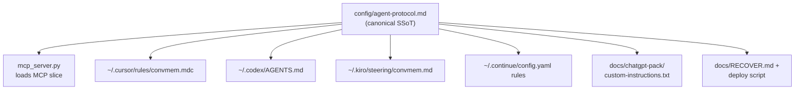

# Global convmem protocol — instructions follow the human

## Problem

Session ritual lives in `[AGENTS.md](/home/lauer/Projects/convmem/AGENTS.md)` (repo-local). Cursor only has corpus protection globally (`[convmem-protected-paths.mdc](/home/lauer/.cursor/rules/convmem-protected-paths.mdc)`). MCP `[instructions=](/home/lauer/Projects/convmem/mcp_server.py)` is a 4-line stub. Opening `~/WordPress/willowyhollow-practice/` or a Codex session on another repo → blank-slate agents.

## Architecture




**Design principle:** one markdown source in the repo; **generated** per-surface artifacts deployed into each tool's **user-level config** (not "one repo file magically covers every workspace"). Repo `[AGENTS.md](/home/lauer/Projects/convmem/AGENTS.md)` becomes a short pointer + repo-specific notes.

**Critiques incorporated** (from [`MERGED-GAP-ANALYSIS-2026-06-25.md`](/home/lauer/Projects/convmem/docs/inter-model/MERGED-GAP-ANALYSIS-2026-06-25.md), [`GLOBAL-PLANNER-GAP-ANALYSIS.md`](/home/lauer/Projects/convmem/docs/inter-model/GLOBAL-PLANNER-GAP-ANALYSIS.md), [`CODEX-2026-06-25-global-convmem-protocol-insights.md`](/home/lauer/Projects/convmem/docs/inter-model/CODEX-2026-06-25-global-convmem-protocol-insights.md), [`CODEX-2026-06-25-global-planner-critique-summary.md`](/home/lauer/Projects/convmem/docs/inter-model/CODEX-2026-06-25-global-planner-critique-summary.md)):

**Verdict (merged):** architecture is correct; **9 gaps**, **2 blockers**. Ship with all 9 filled → agents run `doctor → brief → unresolved` from any folder.

| # | Gap | Severity | Resolution |
|---|-----|----------|------------|
| 1 | Protocol-order conflict (AGENTS.md vs planner) | **Blocker** | Canonical order: **`doctor → brief → unresolved`** (shell); `brief()` first only when no shell. Trim `AGENTS.md` to pointer so convmem repo doesn't double-load ritual |
| 2 | `.md` → `.mdc` Cursor format | **Blocker** | Deploy script removes stale `convmem.md`, writes `convmem.mdc` with `alwaysApply: true` |
| 3 | Capability tiers (shell / MCP-only / paste) | High | Three tiers as structural spine; generator emits per-surface slice |
| 4 | MCP shell fallback in instructions | High | MCP slice: if Bash available, run doctor+unresolved per Tier A order |
| 5 | `brief` docstring "call first" | High | Prepend to `brief()`; add note to `search_fast()` |
| 6 | Codex sandbox in canonical SSoT | Medium-high | Model-specific notes section flows to all surfaces |
| 7 | Path detection in deployer | Medium | Discover `$HOME`, probe for rules dirs; don't hardcode only `~/.cursor/rules/` |
| 8 | Alien workspace verification matrix | Medium | Per-scenario matrix (below), not just per-tool |
| 9 | `unresolved_count` in MCP instructions | Medium | Mandate checking brief payload field before proceeding |

---

## Capability tiers (canonical protocol structure)

Single [`config/agent-protocol.md`](/home/lauer/Projects/convmem/config/agent-protocol.md) with three tiers — generator emits each surface's relevant slice:

### Tier A — shell-capable (Cursor, Codex, Kiro, Continue-with-Bash)

```text
1. convmem doctor          # exit 0 required before ask/search
2. convmem brief --stdout-only   # or MCP brief() if MCP connected
3. convmem unresolved      # add --site <hostname> for client work
4. search_fast / ask before guessing on history questions
```

### Tier B — MCP-only (no shell, MCP connected)

```text
1. brief() first every session (optional project=repo-slug)
2. Check unresolved_count in brief response; if >0, note open issues
3. search_fast before guessing; ask for decisions
4. related() for evidence chains
```

### Tier C — paste-only (ChatGPT webUI)

```text
Ask Ryan for: convmem brief --stdout-only
Interpret pasted output; suggest convmem record blocks at session close
Cannot run CLI — do not pretend to call convmem
```

**Canonical startup order (Gap 1 — blocker, pick one):**

```text
Shell-capable:   doctor → brief → unresolved → search_fast/ask
MCP-only:        brief() → unresolved_count → search_fast/ask
Paste-only:      wait for Ryan to paste brief --stdout-only
```

**Decision:** `doctor → brief → unresolved` wins for all shell paths (matches existing `AGENTS.md`, merged bottom line). MCP `brief()` is first **only** when the agent has no shell. Agents with **both** shell and MCP follow shell order: run `doctor` before calling MCP `brief()` or CLI `brief`.

**Runtime decision tree** (Codex structural spine):

```text
if shell:         doctor → brief → unresolved
elif MCP:         brief → search_fast → ask  (+ check unresolved_count)
elif paste-only:  wait for brief text from user
```

---

## 1. Canonical protocol file (repo)

**New:** `[config/agent-protocol.md](/home/lauer/Projects/convmem/config/agent-protocol.md)`

Sections (aligned with existing `[AGENTS.md](/home/lauer/Projects/convmem/AGENTS.md)` + `[SESSION-CLOSE-RECORD.md](/home/lauer/Projects/convmem/docs/inter-model/SESSION-CLOSE-RECORD.md)`):


| Section                   | Content                                                                                                          |
| ------------------------- | ---------------------------------------------------------------------------------------------------------------- |
| Identity                  | "convmem exists on this machine; do not ask what it is"                                                          |
| **Tier A — shell**        | `doctor` (exit 0) → `brief` → `unresolved` (`--site` for client work) → `search_fast`/`ask` before guessing      |
| **Tier B — MCP-only**     | `brief()` first → check `unresolved_count` → `search_fast`/`ask`/`related`                                     |
| **Tier C — paste-only**   | Ask Ryan for `brief --stdout-only`; interpret; suggest record blocks at close                                    |
| **Model-specific notes**  | Codex sandbox: if `ask` fails with network error, `bash -lc 'convmem ask "..."'` or approve network once; repo `.codex/config.toml` for `network_access = true` |
| When to query             | Past decisions, architecture, client sites, anything that might repeat prior work                                |
| Session close             | Pointer to `SESSION-CLOSE-RECORD.md`; `--relates-to` must be ledger id; fallback `dec_prop_20260623_161428_c311` |
| Read-only guard           | No `add`/`index`/`verify` without Ryan                                                                           |
| Tool lanes                | One-liner per model from `[docs/AGENT-ROLES.md](/home/lauer/Projects/convmem/docs/AGENT-ROLES.md)`               |

**Generated outputs** (from `scripts/generate-agent-protocol.sh`):

| Output | Source tier |
|--------|-------------|
| `config/agent-protocol-mcp.txt` | Tier B + shell preamble + Codex retry note |
| `config/cursor-rules-convmem.mdc.example` | Tier A + B (Cursor has both) + frontmatter |
| `config/codex-agents-convmem.example.md` | Tier A + model-specific notes |
| `config/kiro-steering-convmem.example.md` | Tier A (Kiro frontmatter preserved) |
| `docs/chatgpt-pack/custom-instructions.txt` | Tier C only |

Do **not** hand-edit generated files — edit canonical and re-run generator.

**Trim `[AGENTS.md](/home/lauer/Projects/convmem/AGENTS.md)`:** replace duplicated ritual with pointer only (Gap 1 — prevents double-load when Cursor reads both global `convmem.mdc` and repo `AGENTS.md`):

```markdown
## convmem protocol
Canonical: `config/agent-protocol.md` (generated surfaces via `scripts/generate-agent-protocol.sh`).
Repo-specific only: `.codex/config.toml.example` for sandbox network in this repo.
Do not duplicate session-start steps here — they live in the global rule.
```

---

## 2. MCP instructions expansion (highest ROI)

**Edit:** `[mcp_server.py](/home/lauer/Projects/convmem/mcp_server.py)`

- Add `_load_mcp_instructions()` reading generated `config/agent-protocol-mcp.txt` at startup; fall back to inline string if file missing.
- Replace current 4-line `instructions=` with full session protocol.

**MCP instructions must include (Gaps 4, 6, 9):**

1. **If shell available (Tier A order):** `convmem doctor` (exit 0) → call `brief` → `convmem unresolved` (`--site` for client work)
2. **If MCP-only (no shell):** call `brief` first (optionally `project=repo-slug`) — this is when "call brief first" applies
3. **Check `unresolved_count`** in brief response; if >0, surface open issues before proceeding
4. Before answering history/architecture questions: `search_fast` then `ask` with citations
5. If synthesis fails with network error: retry with `bash -lc 'convmem ask "..."'`
6. `related()` for evidence chains
7. Read-only on MCP; durable writes = CLI `convmem record` + `--approve-last`
8. Session close: real ledger ids only; never topic slugs; fallback c311

**Tool docstrings (Gap 2 — low effort, high leverage):**

- `brief()`: prepend **"Call this first every session."** to docstring
- `search_fast()`: add **"For prior work, use this before guessing."**

No new MCP tools in this pass (P2 gate unchanged). When P2 `unresolved` MCP tool ships, remove shell preamble and promote to first-class tool.

---

## 3. Cursor global rule (priority 1)

**New template:** `[config/cursor-rules-convmem.mdc.example](/home/lauer/Projects/convmem/config/cursor-rules-convmem.mdc.example)`

```yaml
---
description: convmem cross-session memory — session start/close protocol
alwaysApply: true
---
```

Body: full `config/agent-protocol.md` content (MCP + shell paths; Cursor has both MCP and shell).

**Deploy to your machine:** copy generated → `[~/.cursor/rules/convmem.mdc](/home/lauer/.cursor/rules/convmem.mdc)`

**Gap 4 migration (blocker):** existing `~/.cursor/rules/convmem.md` has **no effect** — Cursor only applies `alwaysApply` via `.mdc` frontmatter. Deploy script must:

1. Detect `~/.cursor/rules/convmem.md` → warn, remove it
2. Write `convmem.mdc` with `alwaysApply: true`
3. Leave `convmem-protected-paths.mdc` untouched

Keep `[convmem-protected-paths.mdc](/home/lauer/.cursor/rules/convmem-protected-paths.mdc)` separate (corpus tiers vs session ritual).

**Verify:** open a non-convmem workspace (e.g. `~/WordPress/willowyhollow-practice/`) → rule appears in always-applied rules; agent should call `brief` or run `convmem doctor` without project `AGENTS.md`.

---

## 4. Codex global (priority 3)

**Existing:** `[~/.codex/AGENTS.md](/home/lauer/.codex/AGENTS.md)` already has convmem ritual.

**New template:** `[config/codex-agents-convmem.example.md](/home/lauer/Projects/convmem/config/codex-agents-convmem.example.md)` — canonical protocol + Codex sandbox/network block (from current file).

**Deploy:** sync `~/.codex/AGENTS.md` from template. Codex loads this globally regardless of repo.

Note: your table mentioned `~/.codex/instructions.md`; this machine uses `AGENTS.md` (confirmed). No `instructions.md` unless Codex adds it later — document the actual path in RECOVER.

---

## 5. Kiro + Continue sync


| Surface      | Action                                                                                                                                                                                                                                                |
| ------------ | ----------------------------------------------------------------------------------------------------------------------------------------------------------------------------------------------------------------------------------------------------- |
| **Kiro**     | New `[config/kiro-steering-convmem.example.md](/home/lauer/Projects/convmem/config/kiro-steering-convmem.example.md)`; deploy → `[~/.kiro/steering/convmem.md](/home/lauer/.kiro/steering/convmem.md)` (preserve Kiro frontmatter: `inclusion: auto`) |
| **Continue** | Slim `[~/.continue/config.yaml](/home/lauer/.continue/config.yaml)` `rules:` to reference MCP instructions + session-close block only (avoid triple-storing full protocol; MCP expansion covers session start)                                        |


---

## 6. ChatGPT pack (priority 4)

**New:** `[docs/chatgpt-pack/README.md](/home/lauer/Projects/convmem/docs/chatgpt-pack/README.md)` + `[docs/chatgpt-pack/custom-instructions.txt](/home/lauer/Projects/convmem/docs/chatgpt-pack/custom-instructions.txt)`

Content:

- Paste-only lane: ask Ryan for `convmem brief --stdout-only` at session start
- Cannot run CLI; can interpret pasted brief and suggest `convmem record` blocks
- Link to `SESSION-CLOSE-RECORD.md` for close ritual

Ryan copies `custom-instructions.txt` into ChatGPT Settings → Personalization → Custom instructions (one-time).

---

## 7. Generator + deploy + recovery

**New:** `[scripts/generate-agent-protocol.sh](/home/lauer/Projects/convmem/scripts/generate-agent-protocol.sh)`

Reads `config/agent-protocol.md`, emits all surface templates (MCP txt, Cursor `.mdc.example`, Codex/Kiro examples, ChatGPT custom-instructions). Single edit point — prevents drift.

**New:** `[scripts/deploy-agent-protocol.sh](/home/lauer/Projects/convmem/scripts/deploy-agent-protocol.sh)`

1. Run generator first
2. **Path detection (Gap 7):** resolve `$HOME`; probe `$HOME/.cursor/rules`, `$HOME/.codex`, `$HOME/.kiro/steering` (and common alternates if missing); warn and skip gracefully — do not assume standard layout only
3. **Cursor (Gap 2):** remove stale `convmem.md`, deploy `convmem.mdc` with `alwaysApply: true`
4. **Codex:** sync `AGENTS.md` from generated template (full replace)
5. **Kiro:** sync steering file; preserve `inclusion: auto` frontmatter
6. Print reminders for Continue (manual YAML trim) and ChatGPT (paste custom instructions)
7. Emit deploy report: paths written, files removed, surfaces skipped

**Update:** `[docs/RECOVER.md](/home/lauer/Projects/convmem/docs/RECOVER.md)` fast path — step 8: `scripts/deploy-agent-protocol.sh`

**Update:** `[docs/AGENT-ROLES.md](/home/lauer/Projects/convmem/docs/AGENT-ROLES.md)` — note canonical path + capability tier per model.

---

## 8. Verification matrix (Gap 8)

Per-scenario matrix (Codex) + per-tool checks (Continue):

| Scenario | Surface | Pass criteria |
|----------|---------|---------------|
| Blank repo, no `AGENTS.md` | Cursor | `convmem.mdc` in always-applied rules; agent runs `doctor` then `brief` unprompted |
| convmem repo (no double ritual) | Cursor | Global rule + trimmed `AGENTS.md` — same `doctor → brief → unresolved` order, no conflict |
| Non-convmem repo with shell | Codex | `~/.codex/AGENTS.md` drives `doctor → brief → unresolved` |
| No git repo (`/tmp`, empty dir) | Cursor/Codex | Global config still loads; protocol runs without project files |
| MCP connected, shell available | Continue | Expanded MCP instructions; shell `doctor` before `brief` on history questions |
| MCP only, no shell | MCP metadata | Tier B instructions; `unresolved_count` check mandated |
| No MCP, no shell | ChatGPT | Custom instructions ask Ryan for `brief --stdout-only` |
| Nonstandard `$HOME` | Deploy script | Path detection finds or warns; no silent skip |
| Post-deploy health | CLI | `convmem doctor` exit 0 |

Optional: run `[scripts/grade-continue-session.sh](/home/lauer/Projects/convmem/scripts/grade-continue-session.sh)` on a test Continue chat.

### Implementation order (merged priority — all 9 gaps)

1. **Gap 1** — Resolve protocol-order: `doctor → brief → unresolved`; trim repo `AGENTS.md` to pointer
2. **Gap 2** — `.md` → `.mdc` Cursor migration + `alwaysApply: true`
3. **Gap 3** — Capability tiers in canonical protocol
4. **Gap 4** — MCP shell fallback in `instructions=`
5. **Gap 5** — `brief` / `search_fast` docstrings
6. **Gap 6** — Codex sandbox override in canonical SSoT
7. **Gap 7** — Path detection in deploy script
8. **Gap 8** — Alien workspace verification matrix (this section)
9. **Gap 9** — `unresolved_count` mandate in MCP instructions

---

## Post-deployment status (2026-06-25)

**Global protocol rollout: shipped.** Generator, deploy script, MCP instructions, Cursor `.mdc`, Codex/Kiro sync, `AGENTS.md` pointer — all done. Entering **~1 week CLI soak** per [`ROADMAP-DRAFT.md`](/home/lauer/Projects/convmem/docs/ROADMAP-DRAFT.md): observe whether agents follow the protocol now that it's deployed globally. Eval is 10/10; this gate is **agent habit**, not search quality.

### Bucket 1 — Manual steps (Ryan only)

| Item | Action | Why agent can't do it |
|------|--------|----------------------|
| **Continue trim** | Slim `~/.continue/config.yaml` `rules:` to session-close block only (MCP covers session start) | File protected from agent writes |
| **ChatGPT paste** | ~~Paste custom instructions~~ | **Ignored** — pack remains in repo (`docs/chatgpt-pack/`) for reference only |

Optional quick win: qualify `brief()` docstring (*"when shell unavailable"*) if soak shows agents skipping `doctor`.

### Bucket 2 — convmem infra roadmap (soak → P2 → P3)

**Now (~1 week):** graded sessions / Cursor transcripts — do agents run `doctor → brief → unresolved` without prompting?

**P2** (gate: agents still bypass CLI/MCP despite global protocol):
- MCP `unresolved` tool (shell fallback in instructions is interim workaround)
- MCP `open` tool ([`open_source.py`](/home/lauer/Projects/convmem/open_source.py))
- `brief(compact=true)`

**P3** (later):
- Index `docs/inter-model/*.md` into Chroma
- Change-feed — deferred **2026-07-07**
- OpenClaw, dedupe approval UI, hybrid retrieval, domain backfill in brief

### Bucket 3 — Client work (not convmem infra)

**staging2.willowyhollow.com** — 6 unresolved medium security headers (CSP, HSTS, Referrer-Policy + 3 failed re-verifications). Per ROADMAP: don't let client deploy masquerade as convmem work. Blocked on Ryan if/when client lane is active.

### Alien-workspace spot-check (soak verification)

Open `~/WordPress/willowyhollow-practice/` (or any repo without `AGENTS.md`) → agent should run `doctor` then `brief` unprompted. Single test that proves "instructions follow the human."

---

## Phase 2 — Surface coverage gap (post-soak, 2026-06-25)

**Trigger:** Soak data (6 sessions, 3 surfaces). MCP `instructions=` channel failed to carry protocol to Continue and Crush. `.mdc` drives Cursor; non-Cursor surfaces need their own deployed slices.

**Diagnosis:**
- **Cursor** — protocol loaded but order wrong (MCP `brief()` before `doctor` in 1/2 alien sessions). Insufficient data for structural `.mdc` changes.
- **Continue** — protocol not loaded at all (session #5: zero convmem use, List/Bash/Read only). `config.yaml` rules + MCP `instructions=` both ignored by DeepSeek V4 Flash.
- **Crush** — protocol not loaded at all (session #6: zero convmem use, MCP initialized but never invoked). Stale pre-protocol rules file at confirmed path. **Fixed** via Tier B rules deploy.
- **Kiro** — steering + shell (Tier A) deployed at `~/.kiro/steering/convmem.md`; **MCP not wired** (`~/.kiro/settings/mcp.json` absent). Kiro CLI session (2026-06-28) indexed setup steps in corpus (`tooling.kiro`); `convmem ask` retrieval verified. MCP is an upgrade, not the only path.

### Phase 2 priority — status

| Priority | Surface | Action | Owner | Status |
|----------|---------|--------|-------|--------|
| 1 | **Crush** | Tier A shell slice; deploy to `~/.config/crush/rules/convmem.md` | Agent | ✅ **Done** — soak #9 PASS |
| 2 | **Continue** | Add terse session-start stanza to top of `rules:` in `~/.continue/config.yaml` | **Ryan** (file protected) | ✅ **Done** — soak #10 PASS (qwen3-coder:30b) |
| 3 | **Kiro MCP** | Repo example + deploy script; then enable MCP in Kiro Settings | Agent + **Ryan** | ✅ **Deployed** — enable MCP in Settings + restart (Ryan) |
| 4 | **Cursor** | Observe ≥3 alien sessions before `.mdc` section-header changes | Agent (soak) | 🔄 n=1 so far |
| 5 | **ChatGPT** | Paste pack into Custom instructions | Ryan | **Ignored** (2026-06-29 — not in Ryan's workflow) |

**P2 gate:** Do not accelerate MCP `unresolved`/`open` tools. Fix surface coverage first, then re-evaluate.

### Continue stanza (revised per Planner review)

MCP-first with shell fallback, two lines:

```yaml
- Session start: call MCP `brief` (project= if known). If shell is available, run `convmem doctor` first (must exit 0).
- Before answering history/architecture: MCP `search_fast` then `ask` — do not repo-survey first.
```

### Kiro MCP wiring (Priority 3)

**Not urgent for soak** (Kiro wasn't in the Continue/Crush failure class). **Worth automating** for RECOVER parity with Cursor/Continue/Crush.

**Already works:** `~/.kiro/steering/convmem.md` — Tier A shell (`doctor → brief → unresolved`). Keep steering; do not replace with MCP-only.

**Missing:** User-level MCP at [`~/.kiro/settings/mcp.json`](https://kiro.dev/docs/mcp/configuration/) (same `mcpServers` shape as Cursor). Adds structured tools + `mcp_server.py` `instructions=`.

**Repo automation (agent):**

1. Add `config/kiro-mcp.json.example` (mirror `cursor-mcp.json.example`; no hardcoded API key — use `REPLACE_ME` or `${DEEPSEEK_API_KEY}`)
2. Extend `scripts/deploy-agent-protocol.sh`: probe `$HOME/.kiro/settings/`, mkdir if needed, copy example → `mcp.json`
3. Update `docs/RECOVER.md` fast path + `docs/AGENT-ROLES.md` Kiro row (steering + MCP)

**Manual steps (Ryan — cannot automate):**

1. Run deploy script (or copy example once)
2. **Restart Kiro** after deploy (MCP server must reload)
3. **`permissions.yaml`** in `~/.kiro/settings/` — IDE 1.0+ ACP allow rules for convmem shell + MCP (see `config/kiro-permissions.yaml.example`); deploy script merges on run. **`mcp.json autoApprove` is not read by vibe mode.**
4. Verify tools: `brief`, `search_fast`, `ask`, `related`, `stats` (Kiro IDs: `mcp_convmem_*`)

**Corpus note (2026-06-28):** Kiro CLI indexed setup caveats under `tooling.kiro`; `convmem ask` verified retrieval. CLI `convmem add` accepts only `--type observation` (not `explanation`/`decision`/etc.) — see `obs_d348798e5fdd`.

**What automation does not fix:** MCP wiring ≠ session-start ritual; steering enforcement still needed.

### Crush slice — deployed

`~/.config/crush/rules/convmem.md` replaced with generated Tier B (MCP-only) slice:

- `brief()` first every session
- Check `unresolved_count` in brief response
- `search_fast`/`ask` before guessing
- `related()` for evidence chains
- Session close: real ledger ids only, never invent `--relates-to`

### Deploy script extensions

| Output | Deploy path |
|--------|-------------|
| `config/crush-rules-convmem.example.md` | `~/.config/crush/rules/convmem.md` |
| `config/kiro-mcp.json.example` | `~/.kiro/settings/mcp.json` |

Steering deploy unchanged: `config/kiro-steering-convmem.example.md` → `~/.kiro/steering/convmem.md`.

### Cursor `.mdc` — hold threshold

**Do not** add Tier A/B section headers to `convmem.mdc` until ≥3 Cursor alien sessions show the same order violation (session #2 is n=1). If session 7+ repeats: add `## If you have shell access` and `## If you have MCP only` headers between the two lists.

### Verification

- Open `~/WordPress/pavlomassage-practice/` in **Crush** → agent calls `brief()` first (MCP-only)
- Same dir in **Continue** → agent runs `doctor` or calls MCP `brief` before repo survey (after Ryan stanza)
- Any alien dir in **Kiro** → MCP tools visible after deploy + Settings enable; steering still drives shell ritual
- Log results in `docs/inter-model/SOAK-REPORT-2026-06-25.md`

---

## Out of scope (this pass)

- MCP `unresolved` / `open` tools (P2 gate — `[ROADMAP-DRAFT.md](/home/lauer/Projects/convmem/docs/ROADMAP-DRAFT.md)`)
- Crush global `~/.config/crush/system.md` (verify path first; document in chatgpt-pack README as optional)
- Indexing `docs/inter-model/*.md` into Chroma
- Change-feed ("what changed since last time?") — deferred 2026-07-07

---

## File touch summary


| File                                      | Change                             |
| ----------------------------------------- | ---------------------------------- |
| `config/agent-protocol.md`                | **new** — canonical SSoT (3 tiers) |
| `config/agent-protocol-mcp.txt`             | **generated** — MCP instructions   |
| `config/cursor-rules-convmem.mdc.example` | **generated**                      |
| `config/codex-agents-convmem.example.md`  | **generated**                      |
| `config/kiro-steering-convmem.example.md` | **generated**                      |
| `scripts/generate-agent-protocol.sh`      | **new** — SSoT → surfaces (incl. Crush) |
| `mcp_server.py`                           | load + expand `instructions=`; docstrings |
| `AGENTS.md`                               | pointer to canonical               |
| `docs/chatgpt-pack/*`                     | **generated** Tier C               |
| `scripts/deploy-agent-protocol.sh`        | **new** — migrate + deploy (incl. Crush) |
| `config/crush-rules-convmem.example.md`   | **generated** Tier B (MCP-only)    |
| `config/kiro-mcp.json.example`            | **new** — MCP wiring (Priority 3)  |
| `docs/RECOVER.md`, `docs/AGENT-ROLES.md`  | update (incl. Kiro MCP + enable step) |
| `~/.kiro/settings/mcp.json`               | **deploy** (after example added)   |
| `~/.cursor/rules/convmem.md`              | **remove** (stale, no effect)      |
| `~/.cursor/rules/convmem.mdc`             | **deploy**                         |
| `~/.codex/AGENTS.md`                      | **sync**                           |
| `~/.kiro/steering/convmem.md`             | **sync**                           |
| `~/.config/crush/rules/convmem.md`        | **deploy** (Tier B, MCP-only)      |
| `~/.continue/config.yaml`                 | **trim** rules block (manual — Ryan) |


