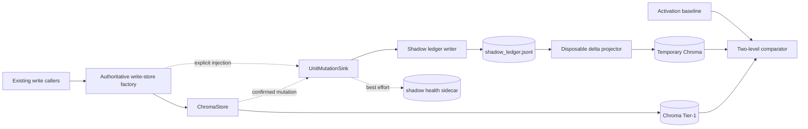

# ConvMem — Orientation for ChatGPT

## What this project is

ConvMem is a local-first knowledge corpus and memory system for AI agents. It captures, indexes, and retrieves knowledge from multi-model development sessions — conversations, code, decisions, verifications. It runs entirely on Ryan's workstation (Arch Linux) with Ollama for local inference and Chroma for vector storage.

The system is used in production daily by multiple AI agents (Cursor, Crush/Kiro, Codex, GitHub Copilot) working on both this repo and client WordPress projects.

## Your role

You are a technical lead / architecture reviewer / thinking partner. You can:
- Review architecture and plans before they're locked
- Audit implementations against their locked architecture specs
- Help Ryan reason about tradeoffs, priorities, and sequencing
- Spot gaps in designs or implementations that local agents miss (because they're in their own context bubbles)
- Provide a cross-cutting view that no single agent session has

You do NOT: write code that gets deployed, run commands, merge branches, or make ledger entries. Those happen on the workstation through other agents.

## How to navigate this project

### Key entry points (read these first)

1. **`README.md`** — high-level product description
2. **`AGENTS.md`** — team charter, lane rules, commit/PR guidance
3. **`docs/inter-model/LATEST.md`** — the current handoff state (may be 1-2 days stale; snapshot is fresher)
4. **`docs/plans/STATUS-*.md`** — one per active arc; tells you goal/state/next-action for each workstream

### Architecture (the "why" layer)

- `docs/plans/ARCHITECTURE-*.md` — locked designs. An architecture doc means "this was reviewed and approved; implementation must follow it."
- `docs/plans/EXECUTION-*.md` — ordered step-by-step plans derived from an architecture lock.

### Decisions & history (the "what happened" layer)

- `docs/inter-model/` — 125 handoff documents. Named `{LANE}-{DATE}-{topic}.md`. Recent ones (Aug 7-10) are the most relevant.
- The convmem ledger itself (not directly accessible to you, but Ryan can paste `convmem search` or `convmem ask` output when you need historical context).

### Team charter

- `docs/inter-model/TEAM-CHARTER-2026-07-06.md` — who does what, conflict resolution, lane boundaries.

## Active arcs (as of 2026-08-10)

1. **JudgeBench** — Offline semantic calibration for the LLM judge that grades retrieval quality. Architecture locked, Flash slices S1-S9 authorized. Corpus merged. Live driver parked on branch. (`STATUS-judgebench.md`)

2. **CG-1 (Committed Generations)** — Build-then-promote durability for file-derived index generations. Replaces per-chunk mutation with atomic generation replacement. Implementation exists uncommitted in `/tmp/convmem-cg1` (written by Codex Luna under delegation). Not yet reviewed. (`ARCHITECTURE-shadow-ledger-phase0.md` section; no dedicated STATUS yet)

3. **Shadow Ledger Phase 0** — Delta capture system that records mutation events without changing the read path. Activation corrective plan exists. (`STATUS-shadow-ledger-phase0.md`)

4. **Chroma Reconcile Tier L** — Post-rebuild verification that the reconstructed corpus matches expected projection state. (`STATUS-chroma-reconcile-tier-l.md`)

5. **R2b Capture Auth** — Authorization tracking for what's been recorded vs. what's pending. (`STATUS-r2b-capture-auth.md`)

## The snapshot file

The `chatgpt-snapshot-*.md` file contains everything that is NOT visible from GitHub:
- `convmem doctor` output (health checks, service state, backup verification)
- `convmem brief` output (corpus counts, project activity, recent decisions, open risks)
- `convmem unresolved` (open observations requiring attention)
- Git worktree topology (70+ worktrees across the project)
- Uncommitted file inventories per worktree
- In `--full` mode: the actual source code of all uncommitted files

**Re-upload this file at the start of each session.** Everything else you can browse from the connected GitHub repo.

## How to ask for more context

If you need deeper history on a topic, ask Ryan to run:
```
convmem search "topic keywords"
convmem ask "specific question"
```
He'll paste the output. The ledger has 19,700+ knowledge units spanning months of multi-agent development.

## Key conventions

- **Branches follow taxonomy:** `feat|fix|docs|plan|wip/YYYY-MM-DD-slug`
- **Architecture docs are locks:** Once approved, implementation must conform. Changes require a new review.
- **Push means ready:** Branches are pushed when work is meaningfully complete, not speculatively.
- **Ryan owns merges.** Agents propose PRs; Ryan merges.
- **Squash-merge default.** PR body = the eventual main commit message.


---
---


# PART 2: Local Machine State Snapshot


Generated: 2026-08-10T11:27:46-05:00
Machine: archlinux

## convmem doctor

```
[PASS] config: /home/lauer/.config/convmem/config.toml readable
[PASS] write_lane: lane=prod workspace=prod config=config.toml write_guard=OK
[PASS] hooks_path: hooksPath=scripts/git-hooks (pre-push+pre-commit ok)
[PASS] wip_on_main: main: 0 WIP commits in last 50
[WARN] dirty_main: tracked dirty on main: .gitignore — use convmem work start/resume (do not edit on main)
[SKIP] unpushed_commits: skip on main
[PASS] deepseek_key: DEEPSEEK_API_KEY set
[PASS] ollama: http://localhost:11434 OK (33 models; e.g. ['laguna-xs-2.1:latest', 'ornith:9b'])
[PASS] chroma: 19701 knowledge units, 2451 summaries
[PASS] index_drift: Chroma 19701 active; JSONL 31488 historical ids (31554 lines; 19343 overlap, 98% active coverage; 12145 historical-only, 358 active-only)
[WARN] embed_collection_identity: WARN: legacy collection metadata lacks convmem:embed_model (configured='nomic-embed-text'; shadow stores must set metadata)
[PASS] shadow_ledger: disabled (no sink injection; Phase 0 default)
[PASS] restic_gate: complete-data-v2 snapshot covers today (id=5e9a7e1162ee2d2a3b904893736521526bae0ff348143f2d8b2799f8e4e8d836 tag=convmem-data-v2)
[PASS] restic_external: offsite copy covers today (source=5e9a7e1162ee2d2a3b904893736521526bae0ff348143f2d8b2799f8e4e8d836 destination=ed8d546f3737cb92940817ad2aa313967a64916ede525c9e2608fe28d44340fd)
[PASS] restic_password_backup: offline password copy present and matches (/run/media/lauer/BIT-Brg-larch-7t/convmem-secrets/restic.password)
[PASS] synthesis_gate: 0 ask failures, 512 ingest-degraded in 7d (provider drops; projection completeness unproven until reconciled)
[PASS] index_gate: 0 index failures in 7d
[PASS] standing_register: 13 open checks, 0 due (2 charter-standing)
[PASS] planning_guide_contract: contract v2: 5 guide(s) ok
[PASS] ledger_documents: 0 empty decision/verification docs (361 scanned)
[PASS] mcp_import: mcp_server tools importable
[PASS] mcp_cursor: ~/.cursor/mcp.json has convmem
[PASS] mcp_continue: Continue MCP wiring present
[PASS] mcp_copilot: ~/.copilot/mcp-config.json has convmem
[PASS] verify_continue: verify-continue.sh present (use --verify to run)

doctor: all checks passed
  (2 warning(s) — non-fatal)
  (1 skipped — expected for cross-lane workspace)

── Next steps ──
  • convmem tldr  # one-page cheat sheet
  • convmem brief --stdout-only
  • convmem unresolved  # add --site <host> for client work
  • convmem "your topic"  # search before ask
  • convmem doctor --v1  # watch RSS, digest timer, locks
```

## convmem brief

```
# CONVMEM BRIEF

Generated: 2026-08-10T16:27:54Z

## State
- Corpus: **19701** units, **2451** summaries
- Inventory: 1289 indexed, 0 pending, 0 deferred
- Tests: unknown (run: convmem brief --with-tests)
- rerank: False
- Services: watch=unknown refine=unknown monitor.timer=unknown
- Kiro live DB excluded: **no**
- MCP: cursor=registered crush=registered crush_live=2026-06-22T15:35:23Z
- MCP stdio: verified (Cursor dev machine 2026-06-22)
- LATEST.md: updated **1d ago** (2026-08-09) **(stale)**
- Recent inter-model: BUILT-PLANS-2026-06-24-to-2026-06-29.md, WILLOWYHOLLOW-BUG-TRIAGE-2026-07-06.md, FLASH-2026-08-08-post-rebuild-verify-handoff.md
- Unresolved observations: **4** (run `convmem unresolved`)
- **⚠ STALE HANDOFF:** `LATEST.md` is older than `BUILT-PLANS-2026-06-24-to-2026-06-29.md` (newest 39m ago) — read newest file or update LATEST
- brief @ `2026-08-10T16:27:54Z`

## Projects (indexed activity)
- **convmem** — 85 sources, 4782 units, last activity 13h ago
  - repo: `/home/lauer/Projects/convmem`
  - agents: `/home/lauer/Projects/convmem/AGENTS.md`
  - newest: `/home/lauer/Projects/convmem/.crush/crush.db`
  - try: `search_fast("convmem handoff next steps")`
- **local_share_convmem_worktrees_fix_2026_07_24_crush_bash_index_freeze** — 1 sources, 5 units, last activity 16d ago
  - newest: `/home/lauer/.cursor/projects/home-lauer-local-share-convmem-worktrees-fix-2026-07-24-crus…`
  - try: `search_fast("local_share_convmem_worktrees_fix_2026_07_24_crush_bash_index_freeze handoff next steps")`
- **worldmonitor** — 1 sources, 0 units, last activity 18d ago
  - repo: `/home/lauer/GitClones/worldmonitor`
  - agents: `/home/lauer/GitClones/worldmonitor/AGENTS.md`
  - newest: `/home/lauer/GitClones/worldmonitor/.crush/crush.db`
  - try: `search_fast("worldmonitor handoff next steps")`
- **willowyhollow-practice** — 101 sources, 1704 units, last activity 18d ago
  - repo: `/home/lauer/WordPress/willowyhollow-practice`
  - agents: `/home/lauer/WordPress/willowyhollow-practice/AGENTS.md`
  - newest: `/home/lauer/WordPress/willowyhollow-practice/.crush/crush.db`
  - try: `search_fast("willowyhollow-practice handoff next steps")`
- **local_share_convmem_worktrees_docs_2026_07_21_2026_07_21_deepseek_v4pro_audit_substitute** — 2 sources, 110 units, last activity 18d ago
  - newest: `/home/lauer/.cursor/projects/home-lauer-local-share-convmem-worktrees-docs-2026-07-21-202…`
  - try: `search_fast("local_share_convmem_worktrees_docs_2026_07_21_2026_07_21_deepseek_v4pro_audit_substitute handoff next steps")`
- **convmem-fix-ask-trace** — 1 sources, 31 units, last activity 19d ago
  - repo: `/home/lauer/Projects/convmem-fix-ask-trace`
  - agents: `/home/lauer/Projects/convmem-fix-ask-trace/AGENTS.md`
  - newest: `/home/lauer/.cursor/projects/home-lauer-Projects-convmem-fix-ask-trace/agent-transcripts/…`
  - try: `search_fast("convmem-fix-ask-trace handoff next steps")`
- **convmem-worktrees-pr52-r2a-closeout** — 7 sources, 120 units, last activity 19d ago
  - repo: `/home/lauer/Projects/convmem-worktrees-pr52-r2a-closeout`
  - newest: `/home/lauer/.cursor/projects/home-lauer-Projects-convmem-worktrees-pr52-r2a-closeout/agen…`
  - try: `search_fast("convmem-worktrees-pr52-r2a-closeout handoff next steps")`
- **willowyhollow-dev** — 8 sources, 100 units, last activity 19d ago
  - repo: `/home/lauer/GitClones/willowyhollow-dev`
  - agents: `/home/lauer/GitClones/willowyhollow-dev/AGENTS.md`
  - newest: `/home/lauer/.cursor/projects/home-lauer-GitClones-willowyhollow-dev/agent-transcripts/a3c…`
  - try: `search_fast("willowyhollow-dev handoff next steps")`

## Active P0
1. Update LATEST.md or read `BUILT-PLANS-2026-06-24-to-2026-06-29.md` before cross-model handoff

## Recent Decisions
- **dec_prop_20260808_150112_f49e**: Ryan Execution HITL: JudgeBench execution plan + Flash S1-S9 implementation aut…
  - Rationale: Architecture lock granted; Flash slice brief (EXECUTION-judgebench-flash-slices.md) scopes S1-S9 pr…
- **dec_prop_20260808_150053_5d61**: Ryan Architecture HITL lock: JudgeBench offline semantic calibration architectu…
  - Rationale: Both required AI reviewers (Kiro, ChatGPT) PASSed the ARCHITECTURE-judgebench.md tip; DeepSeek's tr…
- **dec_prop_20260707_184401_44e8**: convmem repo bug sprint closed; convmem index hangs on pending Crush DBs
  - Rationale: Bug sprint complete (Bugs 1-4 fixed, 5 analyzed, 6 verified correct). User attempted convmem index…
- **dec_prop_20260715_223237_c9d4**: Continue MCP verify: P0 retrieval fix sequence complete — Kiro snapshot filter,…
  - Rationale: P0a: adapters/inter_model_doc.py _EXCLUDE_PATH_TOKENS frozenset. P0b: 646  snapshot inter_model_doc…
- **dec_prop_20260722_013340_dc60**: P1.3 source-trust ranking plan approved and handed to Codex; execution + handof…
  - Rationale: Closes the ksweep-class ranking failure by preferring kiro_steering/ledger/inter-model over chat af…

## Recent Monitor
- staging2.willowyhollow.com: Referrer-Policy still absent on staging2.willowyhollow.com (monitor re-check of obs_staging2_monito… [fail]
- staging2.willowyhollow.com: Content-Security-Policy still absent on staging2.willowyhollow.com (monitor re-… [fail]
- staging2.willowyhollow.com: Referrer-Policy absent or failed on staging2.willowyhollow.com (convmem-monitor probe referrer-poli…

## Open Risks
- Watch OOM if live DBs indexed (Kiro sqlite, Cursor store.db) — both skipped in watch
- Watch RSS high (~3–4G) — little headroom under MemoryMax=4G
- Crush MCP live path still unverified until `mcp_crush_verified` flag set

## Before Working
- Protocol: `brief` → `convmem ask` → `LATEST.md` → `convmem record -i` → `convmem record --approve-last`
- Session close: `SESSION-CLOSE-RECORD.md` — `convmem record --relates-to … --summary … --rationale … --author …`; then `--approve-last`; never `record` alone or fake flags
- Agent roles: `docs/AGENT-ROLES.md`
- Use `convmem search` / MCP `search_fast` for targeted prior art
- Drafts are not searchable until `record --approve-last`

## Inter-Model Inbox
- `/home/lauer/Projects/convmem/docs/inter-model/`


── Next steps ──
  • Update docs/inter-model/LATEST.md or read the newest inter-model file
  • convmem unresolved  # 4 open
  • convmem "your question"  # or: convmem ask "…"
  • convmem record -i  # after a durable win (you: record --approve-last)
```

## convmem unresolved

```
4 unresolved observation(s):

LEDGER ID                                    SEVERITY  SITE                        DOMAIN              STATUS               LAST TOUCHED  TITLE                                                       
──────────────────────────────────────────────────────────────────────────────────────────────────────────────────────────────────────────────────────────────────────────────────────────────────────
obs_staging2_monitor_csp-missing             medium    staging2.willowyhollow.com  web_stack.security  failed_check         2026-07-12    Content-Security-Policy absent or failed on staging2.willow…
obs_staging2_monitor_header-referrer-policy  medium    staging2.willowyhollow.com  web_stack.security  failed_check         2026-07-12    Referrer-Policy absent or failed on staging2.willowyhollow.…
ver_staging2_mon_csp                         medium    staging2.willowyhollow.com  web_stack.security  failed_verification  2026-07-12    Content-Security-Policy still absent on staging2.willowyhol…
ver_staging2_mon_referrer-policy             medium    staging2.willowyhollow.com  web_stack.security  failed_verification  2026-07-12    Referrer-Policy still absent on staging2.willowyhollow.com …

── Next steps ──
  • convmem ask "How do we fix these?" --site staging2.willowyhollow.com
  • convmem "staging2.willowyhollow.com CSP SiteGround"
```

## Git status (main checkout)

```
## main...origin/main
 M .gitignore
?? .kiro/settings/
?? complete-data-restore-reports/
?? docs/inter-model/C5-ACTIVATION-HANDOFF-2026-07-29.md
?? docs/inter-model/CODEX-2026-08-02-summarizer-switch-decision.md
?? docs/inter-model/CRUSH-2026-08-02-summarizer-bakeoff-chroma-assessment.md
?? docs/inter-model/CRUSH-2026-08-07-session-handoff-gpu-fix.md
?? docs/inter-model/CRUSH-2026-08-08-index-complete-judgebench-unblock.md
?? docs/inter-model/PYLINT-BRIEF-FOR-QWEN-2026-07-25.md
?? docs/plans/TEMPLATE-flash-slice-brief.md
?? piped
?? pylint-report.json
?? scripts/export-chatgpt-snapshot.sh
```

## Worktrees

```
/home/lauer/Projects/convmem                                                                             0be0a05 [main]
/home/lauer/.local/share/convmem/worktrees/docs-2026-07-14-background-synthesis-status-reconcile         3d55f51 [docs/2026-07-14-background-synthesis-status-reconcile]
/home/lauer/.local/share/convmem/worktrees/docs-2026-07-14-claude-exclude-purge-postmerge                8edd4fa [docs/2026-07-14-claude-exclude-purge-postmerge]
/home/lauer/.local/share/convmem/worktrees/docs-2026-07-14-exclude-purge-verification-status             ccc926e [docs/2026-07-14-exclude-purge-verification-status]
/home/lauer/.local/share/convmem/worktrees/docs-2026-07-15-2026-07-15-purge-correction-trail             d58e623 [docs/2026-07-15-purge-correction-trail]
/home/lauer/.local/share/convmem/worktrees/docs-2026-07-15-codex-top-two-retrieval-plans                 894cf3b [docs/2026-07-15-codex-top-two-retrieval-plans]
/home/lauer/.local/share/convmem/worktrees/docs-2026-07-15-consolidation-volatile-status                 243562e [docs/2026-07-15-consolidation-volatile-status]
/home/lauer/.local/share/convmem/worktrees/docs-2026-07-15-debate-insight-folder                         c29b449 [docs/2026-07-15-debate-insight-folder]
/home/lauer/.local/share/convmem/worktrees/docs-2026-07-19-2026-07-19-latest-stage4-task1                fb4c874 [docs/2026-07-19-2026-07-19-latest-stage4-task1]
/home/lauer/.local/share/convmem/worktrees/docs-2026-07-19-2026-07-19-synthesis-plan-pointer             61ac61c [docs/2026-07-19-2026-07-19-synthesis-plan-pointer]
/home/lauer/.local/share/convmem/worktrees/docs-2026-07-19-refresh-latest-md                             6284673 [docs/2026-07-19-refresh-latest-md]
/home/lauer/.local/share/convmem/worktrees/docs-2026-07-21-2026-07-21-context-brief-rule                 b1a6464 [docs/2026-07-21-2026-07-21-context-brief-rule]
/home/lauer/.local/share/convmem/worktrees/docs-2026-07-21-2026-07-21-deepseek-v4pro-audit-substitute    c1aa8ec [docs/2026-07-21-2026-07-21-deepseek-v4pro-audit-substitute]
/home/lauer/.local/share/convmem/worktrees/docs-2026-07-21-latest-handoff-refresh                        0af6ff6 [docs/2026-07-21-latest-handoff-refresh]
/home/lauer/.local/share/convmem/worktrees/docs-2026-07-21-pr-steward-role                               9be13c5 [docs/2026-07-21-pr-steward-role]
/home/lauer/.local/share/convmem/worktrees/docs-2026-07-22-land-who-fixes-debate-folder                  52b338b [docs/2026-07-22-land-who-fixes-debate-folder]
/home/lauer/.local/share/convmem/worktrees/docs-2026-07-22-latest-dedupe-hygiene-gate                    5100257 [docs/2026-07-22-latest-dedupe-hygiene-gate]
/home/lauer/.local/share/convmem/worktrees/docs-2026-07-22-latest-drop-pr36-leftover                     2c5684f [docs/2026-07-22-latest-drop-pr36-leftover]
/home/lauer/.local/share/convmem/worktrees/docs-2026-07-22-retrieval-reliability-v7-close                b939412 [docs/2026-07-22-retrieval-reliability-v7-close]
/home/lauer/.local/share/convmem/worktrees/docs-2026-07-22-retrieval-reliability-v7-recovered            3e3831c [docs/2026-07-22-retrieval-reliability-v7-recovered]
/home/lauer/.local/share/convmem/worktrees/docs-2026-07-30-c7-c6-standing-check-readiness                03a2297 [docs/2026-07-30-c7-c6-standing-check-readiness]
/home/lauer/.local/share/convmem/worktrees/docs-2026-07-30-proactive-pr-description                      5f8be83 [docs/2026-07-30-proactive-pr-description]
/home/lauer/.local/share/convmem/worktrees/docs-2026-07-30-shadow-phase0-c6-event-size-policy-decision   4eb5aa7 [docs/2026-07-30-shadow-phase0-c6-event-size-policy-decision]
/home/lauer/.local/share/convmem/worktrees/docs-2026-07-30-shadow-phase0-c7-operational-handoffs         5962306 [docs/2026-07-30-shadow-phase0-c7-operational-handoffs]
/home/lauer/.local/share/convmem/worktrees/docs-2026-08-09-2026-08-09-judgebench-status-awareness        fbbbd33 [docs/2026-08-09-2026-08-09-judgebench-status-awareness]
/home/lauer/.local/share/convmem/worktrees/docs-2026-08-09-complete-data-status-brief                    475fe43 [docs/2026-08-09-complete-data-status-brief]
/home/lauer/.local/share/convmem/worktrees/feat-2026-07-12-conflict-detection-arc-verify                 1faf3f8 [feat/2026-07-12-conflict-detection-claude-review]
/home/lauer/.local/share/convmem/worktrees/feat-2026-07-12-gate5-hashless-graduation                     f9a3927 [feat/2026-07-12-gate5-hashless-graduation]
/home/lauer/.local/share/convmem/worktrees/feat-2026-07-14-exclude-source-purge                          72aeec8 [feat/2026-07-14-exclude-source-purge]
/home/lauer/.local/share/convmem/worktrees/feat-2026-07-15-claude-branch-only-access                     fb43050 [feat/2026-07-15-claude-branch-only-access]
/home/lauer/.local/share/convmem/worktrees/feat-2026-07-15-doctor-purge-drift                            fb43050 [feat/2026-07-15-doctor-purge-drift]
/home/lauer/.local/share/convmem/worktrees/feat-2026-07-19-2026-07-19-collection-count-smoke             6ae655e [feat/2026-07-19-2026-07-19-collection-count-smoke]
/home/lauer/.local/share/convmem/worktrees/feat-2026-07-19-retrieval-reliability                         61bb552 [feat/2026-07-19-retrieval-reliability]
/home/lauer/.local/share/convmem/worktrees/feat-2026-07-22-ingest-dedupe-queue-pause                     643e8c3 [feat/2026-07-22-ingest-dedupe-queue-pause]
/home/lauer/.local/share/convmem/worktrees/feat-2026-07-29-planning-os-verification-methodology          7843d75 [feat/2026-07-29-planning-os-verification-methodology]
/home/lauer/.local/share/convmem/worktrees/feat-2026-07-29-shadow-phase0-c6-canary-evidence              3668100 [feat/2026-07-29-shadow-phase0-c6-canary-evidence]
/home/lauer/.local/share/convmem/worktrees/feat-2026-07-30-shadow-phase0-c7-writer-census                50504ef [feat/2026-07-30-shadow-phase0-c7-writer-census]
/home/lauer/.local/share/convmem/worktrees/feat-2026-08-07-synthesis-calibration-expansion               ab5e8ce [feat/2026-08-07-synthesis-calibration-expansion]
/home/lauer/.local/share/convmem/worktrees/feat-2026-08-09-2026-08-09-judgebench-g3-corpus               d87ff7e [feat/2026-08-09-2026-08-09-judgebench-g3-corpus]
/home/lauer/.local/share/convmem/worktrees/feat-2026-08-09-judgebench-calibration-prep                   200a2f4 [feat/2026-08-09-judgebench-calibration-prep]
/home/lauer/.local/share/convmem/worktrees/feat-2026-08-10-judgebench-live-driver                        f80fbcd [feat/2026-08-10-judgebench-live-driver]
/home/lauer/.local/share/convmem/worktrees/fix-2026-07-14-processed-json-exclude-race                    482f533 [fix/2026-07-14-processed-json-exclude-race]
/home/lauer/.local/share/convmem/worktrees/fix-2026-07-14-pylint-regression-gate                         f57a83f [fix/2026-07-14-pylint-regression-gate]
/home/lauer/.local/share/convmem/worktrees/fix-2026-07-15-2026-07-15-ask-trace-nested-inter-model        fb43050 [fix/2026-07-15-ask-trace-nested-inter-model]
/home/lauer/.local/share/convmem/worktrees/fix-2026-07-19-doctor-render-smoke                            6c2ce2b [fix/2026-07-19-doctor-render-smoke]
/home/lauer/.local/share/convmem/worktrees/fix-2026-07-19-index-history-diagnostic                       7e0a168 [fix/2026-07-19-index-history-diagnostic]
/home/lauer/.local/share/convmem/worktrees/fix-2026-07-21-2026-07-21-response-tldr-minimal               e4e74a5 [fix/2026-07-21-2026-07-21-response-tldr-minimal]
/home/lauer/.local/share/convmem/worktrees/fix-2026-07-22-2026-07-22-mcp-roots-boundary                  30a24b4 [fix/2026-07-22-mcp-roots-boundary]
/home/lauer/.local/share/convmem/worktrees/fix-2026-07-22-golden-eval-soak-arch                          f06dc03 [fix/2026-07-22-golden-eval-soak-arch]
/home/lauer/.local/share/convmem/worktrees/fix-2026-07-24-crush-bash-index-freeze                        a79b63a [fix/2026-07-24-crush-bash-index-freeze]
/home/lauer/.local/share/convmem/worktrees/fix-2026-07-27-complete-data-backup-correction-v2             a3b56c8 [fix/2026-07-27-complete-data-backup-correction-v2]
/home/lauer/.local/share/convmem/worktrees/fix-2026-07-28-shadow-phase0-c1-strict-validation             ed230c3 [fix/2026-07-28-shadow-phase0-c1-strict-validation]
/home/lauer/.local/share/convmem/worktrees/fix-2026-07-28-shadow-phase0-c2-secure-append                 f02f724 [fix/2026-07-28-shadow-phase0-c2-secure-append]
/home/lauer/.local/share/convmem/worktrees/fix-2026-07-29-shadow-phase0-c4-truth-reporting               c07a5ed [fix/2026-07-29-shadow-phase0-c4-truth-reporting]
/home/lauer/.local/share/convmem/worktrees/fix-2026-07-29-shadow-phase0-c5-activation-transaction        f96ffb8 [fix/2026-07-29-shadow-phase0-c5-activation-transaction]
/home/lauer/.local/share/convmem/worktrees/fix-2026-07-31-doctor-test-fixture                            722e87f [fix/2026-07-31-doctor-test-fixture]
/home/lauer/.local/share/convmem/worktrees/fix-2026-08-04-embedding-eval-gate1-hardening                 69d8303 [fix/2026-08-04-embedding-eval-gate1-hardening]
/home/lauer/.local/share/convmem/worktrees/fix-2026-08-06-ask-eval-trace                                 19fdce1 [fix/2026-08-06-ask-eval-trace]
/home/lauer/.local/share/convmem/worktrees/fix-2026-08-06-delegate-deepseek-empty-response               c86ddad [fix/2026-08-06-delegate-deepseek-empty-response]
/home/lauer/.local/share/convmem/worktrees/fix-2026-08-07-judge-bench-judge-upgrades                     657336d [fix/2026-08-07-judge-bench-judge-upgrades]
/home/lauer/.local/share/convmem/worktrees/fix-2026-08-09-deepseek-v4-flash-timeout                      810ef2a [fix/2026-08-09-deepseek-v4-flash-timeout]
/home/lauer/.local/share/convmem/worktrees/fix-2026-08-09-projection-parity-reconcile                    bc23ff9 [fix/2026-08-09-projection-parity-reconcile]
/home/lauer/.local/share/convmem/worktrees/fix-2026-08-09-safe-file-reindex                              04fa8eb [fix/2026-08-09-safe-file-reindex]
/home/lauer/.local/share/convmem/worktrees/plan-2026-07-12-chroma-restore-drill                          f8e8a8f [plan/2026-07-12-chroma-restore-drill]
/home/lauer/.local/share/convmem/worktrees/plan-2026-07-12-knowledge-unit-conflict-detection             9b5bee7 [plan/2026-07-12-knowledge-unit-conflict-detection]
/home/lauer/.local/share/convmem/worktrees/plan-2026-07-12-restic-integrity-preflight                    8d9983d (detached HEAD)
/home/lauer/.local/share/convmem/worktrees/plan-2026-07-12-token-efficient-autonomy                      6cc4ef6 [plan/2026-07-12-token-efficient-autonomy]
/home/lauer/.local/share/convmem/worktrees/plan-2026-07-14-exclude-source-purge                          1734167 [plan/2026-07-14-exclude-source-purge]
/home/lauer/.local/share/convmem/worktrees/plan-2026-07-27-2026-07-27-complete-data-backup-correction-v2 b285782 [plan/2026-07-27-complete-data-backup-correction-v2]
/home/lauer/.local/share/convmem/worktrees/plan-2026-07-28-shadow-phase0-activation-corrective           29eede1 [plan/2026-07-28-shadow-phase0-activation-corrective]
/home/lauer/.local/share/convmem/worktrees/plan-2026-08-06-synthesis-calibration-prep                    913ec84 (detached HEAD)
/home/lauer/.local/share/convmem/worktrees/plan-2026-08-07-2026-08-07-chroma-reconcile-revise            4b47d5c [plan/2026-08-07-2026-08-07-chroma-reconcile-revise]
/home/lauer/.local/share/convmem/worktrees/wip-2026-07-19-2026-07-19-post-demotion-smoke                 f0d6486 [wip/2026-07-19-2026-07-19-post-demotion-smoke]
/home/lauer/.local/share/convmem/worktrees/wip-2026-07-19-2026-07-19-small-refactor                      f2fc186 [wip/2026-07-19-2026-07-19-small-refactor]
/home/lauer/.local/share/convmem/worktrees/wip-2026-07-19-2026-07-19-telemetry-t6-smoke                  742e25a [wip/2026-07-19-2026-07-19-telemetry-t6-smoke]
/home/lauer/.local/share/convmem/worktrees/wip-2026-07-28-local-dev-tools                                83b8c11 [wip/2026-07-28-local-dev-tools]
/home/lauer/.local/share/convmem/worktrees/wip-2026-07-29-shadow-phase0-c6-operational-canary            0daf2cf [wip/2026-07-29-shadow-phase0-c6-operational-canary]
/home/lauer/Projects/convmem-docs-debate-close                                                           ab5e9cf [docs/2026-07-22-debate-who-fixes-closed]
/home/lauer/Projects/convmem-docs-debate-kiro-followup                                                   09e80f0 [docs/2026-07-15-cursor-after-kiro]
/home/lauer/Projects/convmem-docs-who-fixes-closed                                                       8ceb6ac [docs/2026-07-22-who-fixes-retrieval-closed-to-p13]
/home/lauer/Projects/convmem-fix-ask-trace                                                               950e830 (detached HEAD)
/home/lauer/Projects/convmem-worktrees/pr52-r2a-closeout                                                 e585a09 (detached HEAD)
/home/lauer/Projects/convmem-wt-crush-digest-demotion                                                    2c040f4 [feat/2026-07-19-crush-digest-demotion]
/home/lauer/Projects/convmem-wt-debate-insight                                                           c29b449 [wip/2026-07-15-codex-top-two-proxy]
/home/lauer/Projects/convmem-wt-fix-ask-evidence-budget                                                  56802f1 [fix/2026-07-15-ask-evidence-budget]
/home/lauer/Projects/convmem-wt-stage4-close                                                             35f75e6 [docs/2026-07-19-stage4-close]
/home/lauer/Projects/convmem-wt-stage4-context-compression                                               a8668ce [plan/2026-07-19-stage4-context-compression]
/home/lauer/Projects/convmem-wt-stance-stage4-residual                                                   6f80df9 [docs/2026-07-22-stance-stage4-residual]
/tmp/convmem-cg1                                                                                         0be0a05 [feat/2026-08-10-2026-08-10-cg1-committed-generation-substrate]
/tmp/convmem-complete-data-status-brief                                                                  459892d [docs/2026-08-09-complete-data-status-brief-followup]
/tmp/convmem-crush-exec-1786150330                                                                       ecefcd7 [wip/2026-08-07-crush-delegation-test]
/tmp/convmem-judge-hardening                                                                             f475cea [fix/2026-08-08-judge-injection-hardening]
/tmp/convmem-main-pylint                                                                                 1f4edf0 (detached HEAD)
```

## Uncommitted files per worktree

### /home/lauer/.local/share/convmem/worktrees/docs-2026-07-15-codex-top-two-retrieval-plans
Branch: `docs/2026-07-15-codex-top-two-retrieval-plans`

```
?? docs/inter-model/debate-2026-07-15-who-fixes-retrieval/CODEX-top-two-problems-and-plans.md
```

#### docs/inter-model/debate-2026-07-15-who-fixes-retrieval/CODEX-top-two-problems-and-plans.md (untracked, 9472 bytes)

```markdown
# CODEX — top two problems + implementation plans

**Date:** 2026-07-15  
**From:** Codex (independent audit lane)  
**To:** Cursor + plan maker; Ryan and all debate lanes  
**Baseline reviewed:** GitHub PR #34 / `docs/2026-07-15-debate-insight-folder`
at `894cf3b`, including the P0 landing alert and the Cursor and Kiro filings.

## Ranking

| Rank | Problem | Why it is a current, confirmed defect |
|---|---|---|
| **1** | Evidence mode can replace semantic retrieval with global recent decisions. | MCP defaults `evidence=True`; with `fetch_k=8` and eight recent decisions, `ask.py` leaves zero semantic slots. This is a context-selection defect independent of the post-P0 snapshot purge. |
| **2** | Nested `docs/inter-model/**` Markdown is not recognized as an inter-model document. | The board's own required debate folder is skipped by the direct-parent predicate, so the shared-memory capture contract fails before ranking can be evaluated. |

DeepSeek's snapshot exclusion, purge, `CURRENT-ARC.md` bridge, and claimed
daemon/config changes are **not** either problem here. Do not redo or extend
those live mutations in these plans.

---

## Problem 1 — evidence mode may allocate zero semantic context slots

### Observed mechanism

`mcp_server.ask()` defaults to `evidence=True`. In `ask.ask()`, that path
retrieves semantic units, re-ranks and ledger-dedupes them, then calls
`_prepend_recent_decisions(..., total_limit=fetch_k)`. The helper converts up
to `RECENT_DECISIONS_LIMIT` (currently 8) global decisions and computes:

```python
slots = max(total_limit - len(recent_units), 0)
```

For the normal `fetch_k=8`, eight recent decisions produce `slots == 0`.
`results = units[:top_k]` then presents only injected decisions to the model.
The CLI default (`evidence=False`) does not exercise this policy, so it is not
a valid substitute for MCP verification.

### Goal

Evidence mode may add fresh decisions, but it must not erase the semantic
retrieval signal it claims to rank. With default sizes, the final five-citation
context must contain at least three semantic units whenever that many semantic
units were retrieved.

### Cursor + plan maker implementation plan

1. **Pin a before-state reproduction on the MCP-equivalent surface.** Call
   `ask.ask(..., evidence=True)` with a convmem durable-rationale query and
   capture citation fields: `evidence_status`, `source_path`, `domain`,
   `ledger_id`, and the invoked `top_k`. Run the same question with
   `evidence=False` only as a control. Do not use a live GitHub-status question
   as a retrieval test.
2. **Budget recent decisions as a minority.** In
   `_prepend_recent_decisions`, truncate converted recent units to a fixed
   minority cap before calculating semantic slots. A reasonable initial
   contract is `floor(total_limit / 3)` recent units (2 of `fetch_k=8`),
   retaining the existing ledger-id dedupe. The plan maker may choose an
   equivalent formula only if the final-context acceptance below still holds.
   The helper must return semantic units even when there are eight or more
   recent approved decisions.
3. **Scope only on explicit, trustworthy caller constraints.** When `domain`
   and/or `site` is supplied, filter *raw recent decision records* by those
   fields before conversion, then preserve that provenance in the converted
   unit metadata. Use exact site matching and an agreed domain-prefix rule.
   Do not infer a project from question words or from the top semantic hit in
   this patch: neither is a stable data contract. With no supplied scope,
   retain the minority cap and label injected units
   `evidence_status="recent_decision"` so their provenance remains auditable.
4. **Close the evidence-path store.** Wrap the `ChromaStore` used only for
   `apply_evidence_rerank` in `try/finally` and call `close()` exactly once,
   including on a reranker exception. This is a small confirmed lifecycle fix;
   it must not alter ranking behavior.
5. **Test the policy directly.** Add unit tests for eight recent plus eight
   semantic results, overlap by `ledger_id`, explicit domain/site scoping, and
   store closure on success and failure. Retain current non-evidence behavior.
6. **Verify end-to-end.** Run the MCP function (not just the CLI default) and
   publish a before/after citation table. Then run the focused tests, full
   suite, and `git diff --check`.

### Acceptance

- [ ] With `total_limit=8`, eight recent records cannot reduce the semantic
  contribution to zero; with five final citations and at least five semantic
  candidates, at least three final citations are semantic.
- [ ] An explicit `site` or `domain` request does not inject mismatched recent
  decisions.
- [ ] The unscoped path retains a bounded, visibly-labelled recent supplement;
  it does not pretend heuristic query inference is authoritative scoping.
- [ ] The evidence-path `ChromaStore` closes on both success and error.
- [ ] `evidence=False` results and existing ask/evidence tests do not regress.

### Conflicts and boundaries

- **Cursor/Kiro Problem 1:** same defect. Their implementation is compatible
  if the recent cap is computed against the final context contract, not merely
  described as a preference.
- **Kiro trace contract:** this patch fixes an arithmetic/context defect, but
  trace work remains required before a new ranking/diversification experiment.
  Do not represent the cap as proof that semantic candidate ranking is healthy.
- **ChatGPT source diversification / Claude duplicate diagnosis:** separate,
  trace-gated follow-ons. They must not be bundled into this patch.
- **Out of scope:** changing MCP's default `evidence=True`, rerank settings,
  live Chroma purges, semantic-dedupe/tombstones, or query-meaning heuristics.

---

## Problem 2 — nested coordination documents are invisible to the ingest adapter

### Observed mechanism

`adapters.inter_model_doc.is_inter_model_doc()` accepts a Markdown file only
when its immediate parent is `inter-model` and its grandparent is `docs`.
Therefore a file such as:

```text
docs/inter-model/debate-2026-07-15-who-fixes-retrieval/ALERT-2026-07-15-deepseek-p0-landed.md
```

returns false. The current exclusions for `archive`, `.kiro`, and `snapshots`
are correct and must remain in force.

### Goal

Treat active Markdown descendants of `docs/inter-model/` as inter-model docs,
while continuing to reject archives, Kiro snapshot copies, non-Markdown files,
and lookalike paths that are not beneath a `docs/inter-model` ancestor.

### Cursor + plan maker implementation plan

1. **Write the failing path tests first** in `tests/test_inter_model_doc.py`.
   Cover direct child, one-level nested debate file, deeply nested descendant,
   archive descendant, `.kiro/.../snapshots/.../docs/inter-model` copy,
   non-Markdown, and `other/inter-model/file.md` without the `docs` parent.
2. **Replace direct-parent equality with containment.** After the existing
   suffix and exclusion checks, walk `p.parents` (or use an equivalent pure
   containment predicate) and accept only when an ancestor named
   `inter-model` has parent `docs`. Do not strip path separators or match
   arbitrary path substrings; path components are the contract.
3. **Preserve the P0 snapshot guard.** Keep `_EXCLUDE_PATH_TOKENS` ahead of
   containment, so a snapshot that structurally includes `docs/inter-model`
   cannot be reintroduced. Keep the `archive` rejection as well.
4. **Verify parser selection and capture.** Assert both `is_inter_model_doc`
   and `detect_format` recognize the nested case. Once the code change is
   authorized and merged, use individual `convmem index --file <path>` calls
   for the debate files, then search a distinctive phrase from the alert.
5. **Run focused plus full verification** (`tests/test_inter_model_doc.py`,
   relevant ingest/detect tests, full suite, and `git diff --check`).

### Acceptance

- [ ] Direct and nested active `docs/inter-model/**/*.md` files select the
  `inter_model_doc` adapter.
- [ ] Archive paths and Kiro snapshot paths remain rejected, including when
  they contain a structurally valid `docs/inter-model` suffix.
- [ ] A distinctive nested debate phrase is retrievable after its explicitly
  named file is indexed.
- [ ] No broad/bulk index command or live corpus mutation is needed for this
  fix.

### Conflicts and boundaries

- **Cursor/Kiro Problem 2:** same defect; their tests and this containment
  predicate should converge in one patch rather than create competing fixes.
- **DeepSeek P0a:** preserve its `.kiro`/`snapshots` exclusion verbatim.
- **Out of scope:** flattening the debate folder, changing section chunking,
  indexing session databases, or any destructive deduplication.

---

## Recommended order and review gate

1. Implement Problem 2's small capture-contract repair, then index only the
   named debate files and prove retrieval.
2. Implement Problem 1's bounded evidence fix with MCP-surface evidence and
   tests. The two code patches are independent and may be separate commits.
3. Before any ranking, dedupe, or diversification change, Cursor and the plan
   maker must re-read every submitted `*-top-two-problems-and-plans.md` and
   publish the conflict disposition. A genuine retrieval trace is the gate for
   those later behavioral experiments.

**No authorization implied:** merge decisions, live config changes, Chroma
purges, and any post-plan implementation start remain Ryan's decisions.

```

### /home/lauer/.local/share/convmem/worktrees/fix-2026-07-27-complete-data-backup-correction-v2
Branch: `fix/2026-07-27-complete-data-backup-correction-v2`

```
?? complete-data-restore-reports/
```

#### complete-data-restore-reports/ (untracked directory)
```
  restore-0cee7ce1f970.md (28 lines)
  restore-21c7346b42d6.md (97 lines)
  restore-6b7906fd7fc6.md (97 lines)
  restore-90e646e6f48c.md (28 lines)
  restore-952e0dbc3534.md (28 lines)
```

### /home/lauer/.local/share/convmem/worktrees/fix-2026-07-28-shadow-phase0-c1-strict-validation
Branch: `fix/2026-07-28-shadow-phase0-c1-strict-validation`

```
?? complete-data-restore-reports/
```

#### complete-data-restore-reports/ (untracked directory)
```
  restore-1ba359737a15.md (28 lines)
  restore-662c3051195f.md (28 lines)
```

### /home/lauer/.local/share/convmem/worktrees/fix-2026-07-28-shadow-phase0-c2-secure-append
Branch: `fix/2026-07-28-shadow-phase0-c2-secure-append`

```
?? complete-data-restore-reports/
```

#### complete-data-restore-reports/ (untracked directory)
```
  restore-349434bdb0ba.md (28 lines)
  restore-67bf94094c66.md (28 lines)
```

### /home/lauer/.local/share/convmem/worktrees/fix-2026-07-29-shadow-phase0-c4-truth-reporting
Branch: `fix/2026-07-29-shadow-phase0-c4-truth-reporting`

```
?? complete-data-restore-reports/
```

#### complete-data-restore-reports/ (untracked directory)
```
  restore-3de5d07fc0e1.md (28 lines)
```

### /home/lauer/.local/share/convmem/worktrees/fix-2026-08-07-judge-bench-judge-upgrades
Branch: `fix/2026-08-07-judge-bench-judge-upgrades`

```
 M eval_judge.py
 M eval_methodology.py
 M scripts/eval-summaries.py
 M scripts/eval-synthesis.py
 M tests/test_doctor.py
 M tests/test_eval_methodology.py
 M tests/test_eval_synthesis.py
?? docs/inter-model/CRUSH-2026-08-07-judge-bench-analysis.md
```

#### Tracked changes (diff)

```diff
diff --git a/eval_judge.py b/eval_judge.py
index 01606b9..222b8ee 100644
--- a/eval_judge.py
+++ b/eval_judge.py
@@ -43,9 +43,16 @@ _JUDGE_RUBRIC = {
 }
 
 _JUDGE_PROMPT = """{rubric}
-Respond with EXACTLY two lines and nothing else:
+
+Step 1: Summarize what the source says in 1-2 sentences.
+Step 2: Compare the model output to the source. Does the output faithfully reflect the source?
+Step 3: Score 1-5.
+
+Respond with EXACTLY these lines:
+REFERENCE: <your 1-2 sentence summary of the source>
 SCORE: <integer 1-5>
 REASON: <one sentence>
+CONFIDENCE: low|med|high
 
 --- INPUT UNDER TEST ---
 {source_label}:
@@ -63,6 +70,13 @@ class JudgeResult:
     independent: bool
     judge_model: str
     under_test_model: str
+    confidence: str | None
+    _deepseek_active: bool = False
+
+    @property
+    def low_confidence(self) -> bool:
+        """True when the judge used the local fallback path."""
+        return not self._deepseek_active
 
     def to_dict(self) -> dict:
         return {
@@ -71,6 +85,8 @@ class JudgeResult:
             "independent": self.independent,
             "judge_model": self.judge_model,
             "under_test_model": self.under_test_model,
+            "confidence": self.confidence,
+            "low_confidence": self.low_confidence,
         }
 
 
@@ -93,21 +109,36 @@ def resolve_judge_model(cfg: dict) -> tuple[str, bool]:
         # Make the key visible to llm.generate for this process.
         os.environ.setdefault("DEEPSEEK_API_KEY", key)
         return str(models.get("distill_model", "deepseek-v4-flash")), True
-    return str(models.get("summarize_model", "llama3.1:8b")), False
+    return str(models.get("judge_fallback_model", "qwen2.5-coder:14b")), False
 
 
-def _parse_score(text: str) -> tuple[int | None, str]:
+def _parse_score(text: str) -> tuple[int | None, str, str | None]:
+    """Parse SCORE, REASON, and optional CONFIDENCE from judge output."""
     score: int | None = None
     reason = ""
-    m = re.search(r"SCORE:\s*([1-5])", text, re.IGNORECASE)
-    if m:
-        score = int(m.group(1))
-    r = re.search(r"REASON:\s*(.+)", text, re.IGNORECASE)
-    if r:
-        reason = r.group(1).strip()
+    confidence: str | None = None
+
+    match = re.search(r"SCORE:\s*([1-5])", text, re.IGNORECASE)
+    if match:
+        score = int(match.group(1))
+
+    match = re.search(r"REASON:\s*(.+)", text, re.IGNORECASE)
+    if match:
+        reason = match.group(1).strip()
+
+    match = re.search(r"CONFIDENCE:\s*(low|med|high)\b", text, re.IGNORECASE)
+    if match:
+        confidence = match.group(1).lower()
+
     if not reason:
-        reason = text.strip().splitlines()[-1][:200] if text.strip() else "no reason"
-    return score, reason
+        for line in text.strip().splitlines():
+            candidate = line.strip()
+            if candidate and not re.match(
+                r"^(REFERENCE|SCORE|CONFIDENCE):", candidate, re.IGNORECASE
+            ):
+                reason = candidate[:200]
+                break
+    return score, reason or "no reason", confidence
 
 
 def judge(
@@ -135,7 +166,7 @@ def judge(
         raise ValueError(f"unknown judge kind: {kind!r}")
 
     models = cfg.get("models") or {}
-    judge_model, _deepseek = resolve_judge_model(cfg)
+    judge_model, deepseek_active = resolve_judge_model(cfg)
     independent = judge_model.strip() != (under_test_model or "").strip()
 
     source_label = "SOURCE EXCERPT" if kind == "summary" else "QUESTION + RETRIEVED EXCERPTS"
@@ -145,6 +176,7 @@ def judge(
         source=source[:8000],
         output=output[:8000],
     )
+    parsed_confidence: str | None = None
     try:
         raw = generate(
             prompt,
@@ -153,9 +185,11 @@ def judge(
             deepseek_base_url=models.get("deepseek_base_url", "https://api.deepseek.com"),
             timeout=120,
         )
-        score, reason = _parse_score(raw)
+        score, reason, parsed_confidence = _parse_score(raw)
     except Exception as exc:  # judge is advisory — never break the eval
         score, reason = None, f"judge error: {type(exc).__name__}: {exc}"
+    if not deepseek_active and parsed_confidence is None:
+        parsed_confidence = "low"
 
     return JudgeResult(
         score=score,
@@ -163,6 +197,8 @@ def judge(
         independent=independent,
         judge_model=judge_model,
         under_test_model=(under_test_model or "").strip(),
+        confidence=parsed_confidence,
+        _deepseek_active=deepseek_active,
     )
 
 
diff --git a/eval_methodology.py b/eval_methodology.py
index b8d32ec..11ae8c4 100644
--- a/eval_methodology.py
+++ b/eval_methodology.py
@@ -57,5 +57,7 @@ def run_judge_negative_control(
         "threshold": f"<{NEGATIVE_CONTROL_MAX_EXCLUSIVE}",
         "independent": bool(result.independent),
         "judge_model": result.judge_model,
+        "confidence": result.confidence,
+        "low_confidence": result.low_confidence,
         "reason": result.reason,
     }
diff --git a/scripts/eval-summaries.py b/scripts/eval-summaries.py
index 0afe2a6..53c758c 100644
--- a/scripts/eval-summaries.py
+++ b/scripts/eval-summaries.py
@@ -85,6 +85,9 @@ def summarize_report(results: list[dict], *, use_judge: bool) -> dict:
                 independent=r["judge"]["independent"],
                 judge_model=r["judge"]["judge_model"],
                 under_test_model=r["judge"]["under_test_model"],
+                confidence=r["judge"].get("confidence"),
+                # Legacy judge records predate this field; unknown provider means low confidence.
+                _deepseek_active=not r["judge"].get("low_confidence", True),
             )
             for r in results
             if "judge" in r
diff --git a/scripts/eval-synthesis.py b/scripts/eval-synthesis.py
index 14b8677..42fe18b 100644
--- a/scripts/eval-synthesis.py
+++ b/scripts/eval-synthesis.py
@@ -118,6 +118,9 @@ def summarize_report(results: list[dict], *, use_judge: bool) -> dict:
                 independent=r["judge"]["independent"],
                 judge_model=r["judge"]["judge_model"],
                 under_test_model=r["judge"]["under_test_model"],
+                confidence=r["judge"].get("confidence"),
+                # Legacy judge records predate this field; unknown provider means low confidence.
+                _deepseek_active=not r["judge"].get("low_confidence", True),
             )
             for r in results
             if "judge" in r
diff --git a/tests/test_doctor.py b/tests/test_doctor.py
index c69acce..73025cf 100644
--- a/tests/test_doctor.py
+++ b/tests/test_doctor.py
@@ -30,6 +30,7 @@ class DoctorTests(unittest.TestCase):
     @patch("doctor._check_restic_password_backup")
     @patch("doctor._check_restic_external")
     @patch("doctor._check_restic")
+    @patch("doctor._check_synthesis_gate")
     @patch("doctor._check_verify_script")
     @patch("doctor._check_copilot_mcp")
     @patch("doctor._check_continue_mcp")
@@ -52,6 +53,7 @@ class DoctorTests(unittest.TestCase):
         mock_cont,
         mock_copilot,
         mock_verify,
+        mock_synthesis_gate,
         mock_restic,
         mock_restic_external,
         mock_restic_password_backup,
@@ -66,6 +68,7 @@ class DoctorTests(unittest.TestCase):
             mock_chroma,
             mock_drift,
             mock_restic,
+            mock_synthesis_gate,
             mock_restic_external,
             mock_restic_password_backup,
             mock_mcp,
diff --git a/tests/test_eval_methodology.py b/tests/test_eval_methodology.py
index 1c03812..646193e 100644
--- a/tests/test_eval_methodology.py
+++ b/tests/test_eval_methodology.py
@@ -18,6 +18,12 @@ class FakeJudgeResult:
     reason: str = "test"
     independent: bool = True
     judge_model: str = "judge"
+    confidence: str | None = None
+    _deepseek_active: bool = True
+
+    @property
+    def low_confidence(self) -> bool:
+        return not self._deepseek_active
 
 
 @pytest.mark.parametrize("kind", ["summary", "synthesis"])
@@ -30,6 +36,8 @@ def test_known_bad_control_requires_score_below_three(kind):
     )
     assert result["passed"] is True
     assert result["threshold"] == "<3"
+    assert result["confidence"] is None
+    assert result["low_confidence"] is False
 
 
 @pytest.mark.parametrize("score", [3, 4, 5, None])
diff --git a/tests/test_eval_synthesis.py b/tests/test_eval_synthesis.py
index 9db4268..51bdaf8 100644
--- a/tests/test_eval_synthesis.py
+++ b/tests/test_eval_synthesis.py
@@ -8,12 +8,21 @@ from __future__ import annotations
 
 import sys
 import unittest
+import importlib.util
 from pathlib import Path
+from unittest.mock import patch
 
 sys.path.insert(0, str(Path(__file__).resolve().parent.parent))
 
 from eval_grading import grade_answer  # noqa: E402
-from eval_judge import JudgeResult, aggregate  # noqa: E402
+from eval_judge import (  # noqa: E402
+    JudgeResult,
+    _JUDGE_PROMPT,
+    _JUDGE_RUBRIC,
+    _parse_score,
+    aggregate,
+    judge,
+)
 
 
 class AnswerGradingTests(unittest.TestCase):
@@ -85,8 +94,24 @@ class JudgeIndependenceGatingTests(unittest.TestCase):
 
     def test_non_independent_batch_reported_not_independent(self):
         jrs = [
-            JudgeResult(5, "ok", independent=True, judge_model="llama3.1:8b", under_test_model="llama3.1:8b"),
-            JudgeResult(2, "meh", independent=False, judge_model="llama3.1:8b", under_test_model="llama3.1:8b"),
+            JudgeResult(
+                5,
+                "ok",
+                independent=True,
+                judge_model="llama3.1:8b",
+                under_test_model="llama3.1:8b",
+                confidence="high",
+                _deepseek_active=True,
+            ),
+            JudgeResult(
+                2,
+                "meh",
+                independent=False,
+                judge_model="llama3.1:8b",
+                under_test_model="llama3.1:8b",
+                confidence=None,
+                _deepseek_active=False,
+            ),
         ]
         agg = aggregate(jrs)
         self.assertFalse(agg["judge_independent"])  # mixed -> not independent
@@ -102,6 +127,100 @@ class JudgeIndependenceGatingTests(unittest.TestCase):
         baseline = {"judge_independent": True, "judge_mean": 4.0}
         self.assertTrue(self._gate_uses_judge(report, baseline))
 
+    def test_parser_extracts_fields_independently(self):
+        parsed = _parse_score(
+            "REFERENCE: source summary\n"
+            "CONFIDENCE: HIGH\n"
+            "SCORE: 4\n"
+            "REASON: grounded and specific"
+        )
+        self.assertEqual(parsed, (4, "grounded and specific", "high"))
+
+    def test_parser_tolerates_missing_or_malformed_confidence(self):
+        self.assertEqual(_parse_score("SCORE: 2\nREASON: contradicted"), (2, "contradicted", None))
+        self.assertEqual(_parse_score("SCORE: 2\nCONFIDENCE: medium"), (2, "no reason", None))
+
+    def test_parser_does_not_use_structured_line_as_reason(self):
+        self.assertEqual(
+            _parse_score("REFERENCE: source\nSCORE: 3\nCONFIDENCE: med"),
+            (3, "no reason", "med"),
+        )
+
+    def test_prompt_contains_source_and_output_payload(self):
+        prompt = _JUDGE_PROMPT.format(
+            rubric=_JUDGE_RUBRIC["synthesis"],
+            source_label="QUESTION + RETRIEVED EXCERPTS",
+            source="SOURCE_SENTINEL",
+            output="OUTPUT_SENTINEL",
+        )
+        self.assertIn("SOURCE_SENTINEL", prompt)
+        self.assertIn("OUTPUT_SENTINEL", prompt)
+        self.assertIn("--- INPUT UNDER TEST ---", prompt)
+
+    def test_result_serialization_derives_low_confidence(self):
+        result = JudgeResult(
+            4,
+            "grounded",
+            independent=True,
+            judge_model="deepseek-v4-flash",
+            under_test_model="llama3.1:8b",
+            confidence="high",
+            _deepseek_active=True,
+        )
+        self.assertFalse(result.low_confidence)
+        self.assertEqual(result.to_dict()["confidence"], "high")
+        self.assertFalse(result.to_dict()["low_confidence"])
+
+    def test_local_judge_defaults_unparsed_confidence_to_low(self):
+        with patch("eval_judge.resolve_deepseek_key", return_value=""), patch(
+            "eval_judge.generate", return_value="SCORE: 2\nREASON: contradicted"
+        ):
+            result = judge(
+                "synthesis",
+                "source",
+                "output",
+                under_test_model="deepseek-v4-flash",
+                cfg={"models": {}},
+            )
+        self.assertEqual(result.judge_model, "qwen2.5-coder:14b")
+        self.assertEqual(result.confidence, "low")
+        self.assertTrue(result.low_confidence)
+
+    def test_report_reconstruction_preserves_current_and_legacy_provider_state(self):
+        for script_name in ("eval-summaries.py", "eval-synthesis.py"):
+            script_path = Path(__file__).resolve().parents[1] / "scripts" / script_name
+            spec = importlib.util.spec_from_file_location(script_name, script_path)
+            module = importlib.util.module_from_spec(spec)
+            assert spec and spec.loader
+            spec.loader.exec_module(module)
+            for low_confidence, expected in ((False, False), (True, True), (None, True)):
+                judge_payload = {
+                    "score": 4,
+                    "reason": "ok",
+                    "independent": True,
+                    "judge_model": "judge",
+                    "under_test_model": "candidate",
+                }
+                if low_confidence is not None:
+                    judge_payload["low_confidence"] = low_confidence
+                    judge_payload["confidence"] = "high"
+                row = {"judge": judge_payload}
+                if script_name == "eval-summaries.py":
+                    row.update({"structural_pass": True, "keyword_recall": 1.0})
+                else:
+                    row.update({"pass": True, "mode": "answer"})
+                captured = []
+
+                def capture(results):
+                    captured.extend(results)
+                    return {}
+
+                with patch("eval_judge.aggregate", side_effect=capture):
+                    module.summarize_report([row], use_judge=True)
+                self.assertEqual(len(captured), 1)
+                self.assertEqual(captured[0].low_confidence, expected)
+                self.assertEqual(captured[0].confidence, judge_payload.get("confidence"))
+
 
 if __name__ == "__main__":
     unittest.main()
```

#### docs/inter-model/CRUSH-2026-08-07-judge-bench-analysis.md (untracked, 11290 bytes)

```markdown
# Crush → Claude handoff — JudgeBench analysis of convmem's LLM judge

**From:** Crush (literature review + gap analysis)
**Date:** 2026-08-07
**Literature:** Tan, Zhuang, Montgomery et al. — *"JudgeBench: A Benchmark for Evaluating LLM-based Judges"* (ICLR 2025, UC Berkeley / WashU). [arXiv:2410.12784v2](https://arxiv.org/abs/2410.12784)

**Ask:** Based on this literature, are we using the best method to judge our work? Surface gaps and actionable recommendations. Include our related work so Claude has full context.

---

## Our related work (what convmem already has)

### Judge implementation — `eval_judge.py` (185 lines)

A **Vanilla-style prompted judge** (AlpacaFarm lineage). Grades summarization and synthesis output on a 1-5 rubric:

```
prompt = rubric + "Respond with EXACTLY two lines:\nSCORE: <integer 1-5>\nREASON: <one sentence>" + source + output
```

Key characteristics:
- **Single-pass scoring**, no reference-answer generation, no multi-turn
- **Judge model**: `deepseek-v4-flash` (API) when `DEEPSEEK_API_KEY` is set; falls back to local `llama3.1:8b`
- **Independence flag**: structural check — `judge_model != under_test_model`. Non-independent scores are informational-only, never feed regression gates
- **Advisory posture**: deterministic checks are the hard gate; judge scores are supporting signal
- **Truncation**: source and output each capped at 8000 chars
- **Error handling**: judge exceptions never break the eval; score becomes `None` with error reason

### Negative controls — `eval_methodology.py` (62 lines)

One known-false output per eval kind (summary, synthesis) run through the actual judge path. A deliberately contradictory output (e.g., "Shadow was enabled" when source says "Shadow remained disabled") must score < 3. Missing scores and judge errors fail closed.

### Eval harnesses using the judge

| Script | What it evaluates | Judge role |
|--------|-------------------|------------|
| `scripts/eval-synthesis.py` | `ask()` synthesis quality | Optional `--judge` flag adds advisory groundedness score |
| `scripts/eval-summaries.py` | Summary faithfulness | Optional `--judge` flag adds advisory faithfulness score |

Both use negative controls, baseline comparison (`--baseline`), and independence-aware scorecards.

### Doctor integration — `doctor.py:549-597`

`eval_script_wiring` probe enforces that every `scripts/eval-*.py` calls `model_context()` or `judge()`, and that synthesis eval scripts call `run_judge_negative_control()`. Exemptions carry a reason.

### ConvMem corpus knowledge

- **`dec_prop_20260707_082050_98bb`** (Ryan, Jul 7): Model-quality eval harness decision — independence-flagged advisory judge, baseline provenance/rebaseline triage, doctor summarization canary
- **Crush session (Aug 4)**: Benchmarked `qwen2.5-coder:14b` as best local judge candidate on RTX 3060 12GB — fits VRAM, produced professional QA judgment results
- **Codex session (Aug 6)**: Pattern for using a different judge model to avoid self-graded evaluations; golden rows with local generator + external DeepSeek judge

---

## What JudgeBench found

### The benchmark

350 challenging response pairs across knowledge (MMLU-Pro), reasoning (LiveBench/Big-Bench Hard), math (LiveBench/AMC12/USAMO), and coding (LiveCodeBench/LeetCode/Codeforces). Each pair has one objectively correct and one subtly incorrect response — both generated by the **same model** (GPT-4o) to eliminate style confounds. Judges are evaluated twice with swapped response order to mitigate position bias.

### Key results (Table 1, 2)

| Judge approach | Overall accuracy |
|---|---|
| GPT-4o Vanilla (AlpacaFarm prompt — closest to ours) | 44.6% |
| GPT-4o Arena-Hard (generate ref answer → judge) | 56.6% |
| **o3-mini (high reasoning)** | **80.9%** |
| **DeepSeek-R1** (reasoning-enhanced) | **73.1%** |
| Claude-3.5-Sonnet | 64.3% |
| o1-preview | 75.4% |
| Gemini-1.5-pro | 47.1% |
| **Llama-3.1-8B-Instruct** (our local fallback) | **40.9%** |
| Skywork-Reward-Gemma-2-27B (specialized reward model) | 64.3% |

Fine-tuned judges (PandaLM, Prometheus2, JudgeLM, AutoJ) mostly performed **below random** (< 50%). Multi-agent ChatEval with GPT-4o got 34.0% — worse than single-agent.

### Core findings relevant to us

1. **Prompt engineering matters a lot**: Arena-Hard prompt (self-generate reference answer → then evaluate) gains +12 points over Vanilla at zero cost. This is the single highest-ROI change.

2. **Reasoning-enhanced models dominate**: o3-mini-high (80.9%) and DeepSeek-R1 (73.1%) far outperform standard models. Test-time compute scaling is the most promising path for judge quality.

3. **Judge accuracy ≈ solver accuracy**: A model's judging ability is highly correlated with its ability to solve the problem itself. This means a weak model cannot reliably judge a stronger model's output.

4. **Self-generated pairs are harder**: Claude-3.5-Sonnet drops from 64.3% (judging GPT-4o pairs) to 44.8% (judging its own pairs). Confirms our independence-flagging design is correct.

5. **Specialized reward models punch above weight**: A 27B reward model matches Claude-3.5-Sonnet. Training a weak verifier to judge a strong model IS possible — but requires training, not just prompting.

6. **Position bias is real**: Swapping response order and aggregating is essential for unbiased pairwise judgments.

7. **Coding is hardest to judge, math is easiest**: Judges outperform solvers on math but underperform on coding.

---

## Gap analysis: convmem vs. JudgeBench SOTA

JudgeBench primarily measures pairwise selection between a correct and an incorrect answer, with position swaps. ConvMem's judge performs absolute, single-item grading of a summary or synthesis answer against source evidence. The benchmark is useful directional evidence for prompt and model choices, but its accuracy percentages and reported gains are not calibrated predictions for ConvMem's task.

| Gap | Severity | Our current | JudgeBench best practice | Expected gain |
|-----|----------|-------------|--------------------------|---------------|
| **Prompt sophistication** | High | Vanilla (one-pass 1-5 rubric) | Arena-Hard: generate reference answer → then evaluate | Directionally expected, but magnitudes are uncalibrated for our absolute-grading task |
| **Judge model strength** | High | `deepseek-v4-flash` / `llama3.1:8b` (40.9%) | DeepSeek-R1 (73.1%) or o3-mini (80.9%) | Directionally expected, but magnitudes are uncalibrated for our absolute-grading task |
| **Local fallback** | High | `llama3.1:8b` — near-random on hard tasks | `qwen2.5-coder:14b` candidate; prior code-QA evidence does not establish prose-faithfulness quality | Unverified; require task-matched calibration |
| **Calibration benchmark** | Medium | None — judge scores trusted without calibration | JudgeBench sampling: validate judge against known-hard pairs periodically | Confidence in scores |
| **Pairwise position-swap** | Low | N/A (single-item grading) | Double-evaluate with swapped order; aggregate | Bias elimination |
| **Multi-agent / panel** | Low | Single judge | ChatEval debate or ensemble (mixed results — ChatEval got 34%) | Uncertain |
| **Reference answer** | Medium | None generated | Arena-Hard: judge writes its own answer first as comparison baseline | Directionally expected; not a ConvMem target |

### What we do better than the paper

- **Negative controls** — the paper doesn't discuss this methodology. Our `run_judge_negative_control()` is a key sanity check they should have.
- **Independence flagging** — we structurally track and flag self-judging. The paper confirms this bias is real (Section 4.4).
- **Advisory-only posture** — the paper's results support this: even the best judge is only ~80%. Deterministic gates are correct.

## Recommendations (ordered by impact/cost ratio)

### 1. Upgrade judge prompt to reference-first style (zero cost; directionally promising)

Add a reference-answer generation step before scoring:

```
1. First, answer the question yourself based on the source material.
2. Then compare the model's output to your reference answer.
3. Score 1-5 on groundedness + relevance.
```

Modify `_JUDGE_PROMPT` in `eval_judge.py`. The prompt structure from Arena-Hard (Li et al., 2024) is:
- Generate reference answer
- Analyze both responses
- Deliver final verdict with explanation

The reported pairwise gain is not a ConvMem acceptance target; calibration on ConvMem's absolute task is still required.

### 2. Switch judge model to DeepSeek-R1 (API cost, pending separate authorization)

`deepseek-v4-flash` → `deepseek-v4-pro` or `deepseek-reasoner` (R1). R1 gets 73.1% on JudgeBench vs. V4 Flash's likely ~55%. The `generate()` path in `llm.py` already supports any DeepSeek model — just change the config key.

Tradeoff: R1 is slower and more expensive than V4 Flash. Consider:
- R1 for critical eval runs (baseline comparisons, regression gates)
- V4 Flash for routine advisory scoring

This remains outside the current implementation scope; no DeepSeek model change is implied here.

### 3. Replace local fallback model (zero cost)

`llama3.1:8b` (40.9% on JudgeBench) → `qwen2.5-coder:14b`, the installed candidate selected for prior code-QA judgment. That evidence does not prove prose-faithfulness quality, so the current plan requires a small fixed calibration spot-check and does not claim a benchmark gain.

### 4. Add periodic JudgeBench calibration (one-time setup)

Sample 20-30 pairs from JudgeBench's 350-set (covering all 4 categories) and run our judge against them as a periodic sanity check. If accuracy drops below a threshold, the judge is degraded and scores should be distrusted.

JudgeBench data and code: https://github.com/ScalerLab/JudgeBench

This is future work, not part of the current change.

### 5. Consider Arena-Hard pairwise format for calibration sets (if we add comparative evals)

If we ever evaluate "is response A better than response B" (e.g., for model selection), the paper's double-evaluation with swapped order is essential to eliminate position bias.

---

## Files Claude should read for context

| File | Why |
|------|-----|
| `eval_judge.py` | Current judge implementation (prompt, model selection, scoring) |
| `eval_methodology.py` | Negative control methodology |
| `llm.py:250-267` | `generate()` — the actual LLM call path the judge uses |
| `scripts/eval-synthesis.py` | How the judge is wired into the synthesis eval harness |
| `doctor.py:549-597` | Doctor probe enforcing judge wiring in eval scripts |

## Open questions for Claude

1. Does Arena-Hard prompt style (reference answer → judge) translate well to 1-5 single-item grading, or is it primarily designed for pairwise A>B comparison?
2. Is there a better local model than `ornith:9b` for judging on 12GB VRAM? The paper benchmarks `llama3.1:8b` at 40.9% but doesn't cover newer small models.
3. Should we add a "confidence" or "abstain" option when the judge is uncertain? JudgeBench's tie/abstain handling could inform this.
4. Does the paper's finding that "judge accuracy ≈ solver accuracy" mean we should never trust a local judge to evaluate synthesis from a stronger cloud model (e.g., DeepSeek-R1 synthesis judged by llama3.1:8b)?
```

### /home/lauer/.local/share/convmem/worktrees/plan-2026-07-28-shadow-phase0-activation-corrective
Branch: `plan/2026-07-28-shadow-phase0-activation-corrective`

```
 M docs/plans/EXECUTION-shadow-phase0-activation-corrective.md
```

#### Tracked changes (diff)

```diff
diff --git a/docs/plans/EXECUTION-shadow-phase0-activation-corrective.md b/docs/plans/EXECUTION-shadow-phase0-activation-corrective.md
index 421afc9..346d5cc 100644
--- a/docs/plans/EXECUTION-shadow-phase0-activation-corrective.md
+++ b/docs/plans/EXECUTION-shadow-phase0-activation-corrective.md
@@ -19,6 +19,75 @@ # Execution Plan — Shadow Phase 0 Activation Corrective
 
 **Current verdict:** HOLD / NOT READY.
 
+### Readiness gates for HOLD removal
+
+| Gate | PASS when |
+|---|---|
+| validator_strict_pass | strict validator exits clean with no blocking refusals on candidate activation artifacts |
+| writer_quiescence_attestation | all active writers are quiesced and protocol/version attestations match the current epoch |
+| atomic_config_txn_recovery | atomic config commit and crash-recovery tests complete with no partial activation state |
+| secure_artifact_0600 | all required artifacts are created at mode 0600 and verified before any payload bytes |
+| performance_canary_budget | three consecutive target-filesystem canary runs stay within approved budget thresholds |
+
+Preflight checklist before any activation attempt is considered:
+
+1. Token validity: active token is unexpired and matches the expected one-shot nonce.
+2. Services/process census: expected services are present and no pre-gate writer bypass remains.
+3. Dual snapshot match: reference snapshots are hash-identical with no drift.
+4. Validator outcome: prior validation has zero blocking refusals.
+5. Canary budget status: canary results are within approved thresholds.
+6. Rollback readiness: disable/rollback path is verified and reachable.
+
+Abort conditions during activation:
+
+1. Abort if token is invalid or expired at activation gate.
+2. Abort if pre-gate writer bypass is detected.
+3. Abort if snapshot data mismatches expected state.
+4. Abort if validator returns any blocking refusal.
+5. Abort if config preimage mismatches the expected baseline.
+6. Abort if canary budget limits are breached.
+
+Readiness evidence pack (required fields):
+
+| Field | Purpose |
+|---|---|
+| `activation_id` | Binds all readiness proofs to one activation transaction lineage. |
+| `config_preimage_hash` | Proves the pre-commit config baseline used for commit/abort checks. |
+| `snapshot_pair_hashes` | Proves deterministic dual-snapshot consistency before commit point. |
+| `validator_refusals` | Captures the exact refusal set (must be empty for PASS gates). |
+| `canary_summary` | Captures canary budget outcomes on the target filesystem. |
+| `rollback_proof` | Proves rollback/disable path availability before activation is considered. |
+
+Gate-to-evidence map:
+
+| Gate | Evidence field | PASS proof |
+|---|---|---|
+| `validator_strict_pass` | `validator_refusals` | Refusal set is empty in strict mode. |
+| `writer_quiescence_attestation` | `snapshot_pair_hashes` + writer census evidence | No pre-gate writer bypass and quiescence checks PASS. |
+| `atomic_config_txn_recovery` | `activation_id` + transaction/recovery evidence | Recovery tests show no partial commit state. |
+| `secure_artifact_0600` | artifact metadata evidence in readiness pack | All required artifacts are regular files at mode 0600 before payload bytes. |
+| `performance_canary_budget` | `canary_summary` | Canary outcomes satisfy approved budget thresholds. |
+
+Evidence retention policy:
+
+| Artifact | Retain for |
+|---|---|
+| `activation_id` | Until activation attempt closure is explicitly recorded. |
+| `config_preimage_hash` | Until activation succeeds or is explicitly aborted. |
+| `snapshot_pair_hashes` | Until the next activation attempt starts. |
+| `validator_refusals` / strict-pass evidence | Until readiness review sign-off is complete. |
+| `canary_summary` | Until the next canary run supersedes this result. |
+
+Evidence recheck cadence:
+
+| Artifact | Recheck cadence |
+|---|---|
+| `activation_id` | Recheck at activation start and at activation closure record. |
+| `config_preimage_hash` | Recheck immediately before commit decision and on config-path change. |
+| `snapshot_pair_hashes` | Recheck on each new activation attempt before gate release. |
+| `validator_refusals` / strict-pass evidence | Recheck after any artifact/config drift signal. |
+| `canary_summary` | Recheck before activation decision and after each canary rerun. |
+
 This document is planning only. It does not authorize implementation,
 activation, live configuration changes, Chroma mutations, Shadow artifact
 creation, ledger or manifest changes, health-sidecar changes, backup changes,
```

### /home/lauer/.local/share/convmem/worktrees/wip-2026-07-28-local-dev-tools
Branch: `wip/2026-07-28-local-dev-tools`

```
?? .vscode/
```

#### .vscode/ (untracked directory)
```
```

### /tmp/convmem-cg1
Branch: `feat/2026-08-10-2026-08-10-cg1-committed-generation-substrate`

```
 M ingest_dedupe.py
?? file_generation_builder.py
?? file_generation_contract.py
?? file_generation_pointer.py
?? file_generation_store.py
?? file_generation_validate.py
?? tests/test_file_generation_builder.py
?? tests/test_file_generation_contract.py
?? tests/test_file_generation_dedupe.py
?? tests/test_file_generation_durability.py
?? tests/test_file_generation_faults.py
?? tests/test_file_generation_pointer.py
?? tests/test_file_generation_read_path_inventory.py
?? tests/test_file_generation_read_paths.py
?? tests/test_file_generation_store.py
?? tests/test_file_generation_validate.py
```

#### Tracked changes (diff)

```diff
diff --git a/ingest_dedupe.py b/ingest_dedupe.py
index 7bf9bea..ac4e524 100644
--- a/ingest_dedupe.py
+++ b/ingest_dedupe.py
@@ -39,8 +39,9 @@ def _semantic_record(
     similarity: float,
     existing_meta: dict,
     new_meta: dict,
+    include_logical_ids: bool = False,
 ) -> dict:
-    return {
+    row = {
         "id_a": existing_id,
         "id_b": new_id,
         "similarity": round(similarity, 4),
@@ -51,10 +52,25 @@ def _semantic_record(
         "status": "pending",
         "source": "ingest",
     }
+    if include_logical_ids:
+        row["logical_id_a"] = str(existing_meta.get("logical_id") or existing_id)
+        row["logical_id_b"] = str(new_meta.get("logical_id") or new_id)
+    return row
+
+
+def _logical_id(row: dict, metadata: dict) -> str:
+    """Return the identity-comparison id without changing legacy callers."""
+    return str(
+        metadata.get("logical_id") or row.get("logical_id") or row.get("id") or ""
+    )
 
 
 def evaluate_ingest_batch(  # pylint: disable=too-many-locals
-    store, cfg: dict, units_batch: list[tuple]
+    store,
+    cfg: dict,
+    units_batch: list[tuple],
+    *,
+    generation_identity_fields: bool = False,
 ) -> IngestDedupeResult:
     """Filter exact duplicates and collect review-only semantic candidates."""
     dedupe_cfg = cfg.get("ingest_dedup") or {}
@@ -78,11 +94,18 @@ def evaluate_ingest_batch(  # pylint: disable=too-many-locals
 
         for candidate in existing:
             candidate_id = str(candidate.get("id") or "")
-            if not candidate_id or candidate_id == unit["id"]:
-                continue
             candidate_meta = candidate.get("metadata") or {}
+            same_identity = candidate_id == unit["id"]
+            if generation_identity_fields:
+                same_identity = _logical_id(candidate, candidate_meta) == _logical_id(
+                    unit, metadata
+                )
+            if not candidate_id or same_identity:
+                continue
             same_hash = candidate_meta.get("content_hash") == content_hash
-            same_text = canonical_unit_text(candidate.get("document") or "") == canonical
+            same_text = (
+                canonical_unit_text(candidate.get("document") or "") == canonical
+            )
             if same_hash or same_text:
                 exact_match = candidate_id
                 break
@@ -94,26 +117,43 @@ def evaluate_ingest_batch(  # pylint: disable=too-many-locals
                 semantic.append((similarity, candidate_id, candidate_meta))
 
         if exact_match is None:
-            for accepted_unit, _accepted_doc, accepted_embedding, accepted_meta in accepted_rows:
+            for (
+                accepted_unit,
+                _accepted_doc,
+                accepted_embedding,
+                accepted_meta,
+            ) in accepted_rows:
                 if accepted_meta.get("content_hash") == content_hash:
                     exact_match = accepted_unit["id"]
                     break
                 similarity = cosine_similarity(embedding, accepted_embedding)
                 if similarity >= threshold:
-                    semantic.append(
-                        (similarity, accepted_unit["id"], accepted_meta)
-                    )
+                    semantic.append((similarity, accepted_unit["id"], accepted_meta))
 
         if exact_match is not None:
-            result.exact_suppressions.append(
-                {
-                    "suppressed_id": unit["id"],
-                    "matched_id": exact_match,
-                    "content_hash": content_hash,
-                    "source_path": metadata.get("source_path") or "",
-                    "suppressed_at": _now_iso(),
-                }
-            )
+            suppression = {
+                "suppressed_id": unit["id"],
+                "matched_id": exact_match,
+                "content_hash": content_hash,
+                "source_path": metadata.get("source_path") or "",
+                "suppressed_at": _now_iso(),
+            }
+            if generation_identity_fields:
+                suppression["suppressed_logical_id"] = _logical_id(unit, metadata)
+                matched_logical = exact_match
+                for candidate in existing:
+                    if str(candidate.get("id") or "") == exact_match:
+                        matched_logical = _logical_id(
+                            candidate, candidate.get("metadata") or {}
+                        )
+                        break
+                else:
+                    for accepted_unit, _doc, _emb, accepted_meta in accepted_rows:
+                        if str(accepted_unit.get("id") or "") == exact_match:
+                            matched_logical = _logical_id(accepted_unit, accepted_meta)
+                            break
+                suppression["matched_logical_id"] = matched_logical
+            result.exact_suppressions.append(suppression)
             continue
 
         accepted = (unit, document, embedding, metadata)
@@ -133,6 +173,7 @@ def evaluate_ingest_batch(  # pylint: disable=too-many-locals
                     similarity=similarity,
                     existing_meta=candidate_meta,
                     new_meta=metadata,
+                    include_logical_ids=generation_identity_fields,
                 )
             )
             if len(seen_ids) >= max_semantic:
@@ -180,7 +221,9 @@ def _append_jsonl(path: Path, rows: list[dict], *, unique_pairs: bool = False) -
                     row = json.loads(line)
                 except json.JSONDecodeError:
                     continue
-                pair = tuple(sorted((str(row.get("id_a") or ""), str(row.get("id_b") or ""))))
+                pair = tuple(
+                    sorted((str(row.get("id_a") or ""), str(row.get("id_b") or "")))
+                )
                 if all(pair):
                     existing_pairs.add(pair)
         written = 0
```

#### file_generation_builder.py (untracked, 12172 bytes)

```python
"""Hermetic construction of file-derived candidate generations.

This module deliberately has no knowledge of production processed logs, exports,
writer sessions, or Shadow sinks.  Callers provide pure parsing/model/embedding
callbacks and a read-only committed-corpus view.  The returned bundle is inert
until a separate store stages it and the pointer layer promotes it.
"""

from __future__ import annotations

import hashlib
from collections.abc import Callable, Iterable
from dataclasses import dataclass, field
from typing import Any

from distill import make_unit_id
from file_generation_contract import (
    candidate_bundle_hash,
    canonical_hash,
    canonical_source_path,
    make_generation_id,
    make_physical_id,
    owner_digest,
    ownership_key,
)
from ingest_dedupe import IngestDedupeResult, evaluate_ingest_batch, unit_content_hash
from vector_similarity import cosine_similarity


class CandidateBuildError(RuntimeError):
    """A candidate could not be completely built; no authority was changed."""


@dataclass(frozen=True)
class CandidateRow:
    collection_name: str
    logical_id: str
    physical_id: str
    document: str
    embedding: tuple[float, ...]
    metadata: dict[str, Any]

    def as_stage_row(self) -> dict[str, Any]:
        return {
            "collection_name": self.collection_name,
            "logical_id": self.logical_id,
            "physical_id": self.physical_id,
            "document": self.document,
            "embedding": list(self.embedding),
            "metadata": dict(self.metadata),
        }


@dataclass
class CandidateGeneration:
    canonical_source_path: str
    ownership_key: str
    owner_digest: str
    source_hash: str
    pipeline_fingerprint: str
    candidate_bundle_hash: str
    generation_id: str
    unit_rows: list[CandidateRow] = field(default_factory=list)
    summary_rows: list[CandidateRow] = field(default_factory=list)
    exact_suppressions: list[dict] = field(default_factory=list)
    semantic_candidates: list[dict] = field(default_factory=list)
    self_source_cross_logical_suppression_count: int = 0
    known_projection_loss_risks: list[str] = field(default_factory=list)

    @property
    def all_rows(self) -> list[CandidateRow]:
        return [*self.unit_rows, *self.summary_rows]


class _ChunkOverlayStore:
    """Merge committed neighbors with earlier candidate chunks before top-k."""

    def __init__(self, committed_store: Any, prior_rows: list[CandidateRow]):
        self._committed = committed_store
        self._prior = prior_rows

    def query_units(self, embedding: list[float], top_k: int) -> list[dict]:
        committed = list(self._committed.query_units(embedding, top_k))
        overlay: list[dict] = []
        for row in self._prior:
            similarity = cosine_similarity(embedding, list(row.embedding))
            overlay.append(
                {
                    "id": row.physical_id,
                    "document": row.document,
                    "metadata": dict(row.metadata),
                    "distance": 1.0 - similarity,
                }
            )
        merged = [*committed, *overlay]
        merged.sort(key=lambda item: float(item.get("distance", float("inf"))))
        return merged[:top_k]


def _summary_logical_id(source: str, start_offset: int) -> str:
    return hashlib.sha256(f"{source}:{start_offset}".encode()).hexdigest()


def _unit_logical_id(
    source: str, start_offset: int, title: str, unit_index: int
) -> str:
    # Mirror production's call signature exactly.  The current implementation
    # deliberately excludes title from the hash, so title drift remains stable.
    return make_unit_id(source, start_offset, title, unit_index)


def _pre_dedupe_rows(
    *,
    source: str,
    chunks: Iterable[dict[str, Any]],
    extract_chunk: Callable[[dict[str, Any]], tuple[str, list[dict[str, Any]]]],
    embed: Callable[[str], list[float]],
) -> tuple[list[dict[str, Any]], list[dict[str, Any]]]:
    units: list[dict[str, Any]] = []
    summaries: list[dict[str, Any]] = []
    for chunk in chunks:
        start = int(chunk["start_offset"])
        try:
            summary, raw_units = extract_chunk(chunk)
            if not isinstance(summary, str) or not isinstance(raw_units, list):
                raise TypeError("extractor must return (summary: str, units: list)")
            if any(not isinstance(raw, dict) for raw in raw_units):
                raise TypeError("every extracted unit must be an object")
            summary_embedding = embed(summary)
        except Exception as exc:  # callback boundary must fail the whole candidate
            raise CandidateBuildError(
                f"chunk {start} extraction failed: {exc}"
            ) from exc
        summaries.append(
            {
                "logical_id": _summary_logical_id(source, start),
                "document": summary,
                "embedding": list(summary_embedding),
                "metadata": {
                    "source_path": source,
                    "start_offset": start,
                    "end_offset": int(chunk.get("end_offset", start)),
                    "distill_status": "empty" if not raw_units else "done",
                },
                "chunk_index": len(summaries),
            }
        )
        for unit_index, raw in enumerate(raw_units):
            logical_id = _unit_logical_id(
                source, start, str(raw.get("title") or ""), unit_index
            )
            document = str(
                raw.get("document") or raw.get("summary") or raw.get("text") or ""
            )
            if not document:
                raise CandidateBuildError(
                    f"chunk {start} unit {unit_index} has no document"
                )
            try:
                embedding = embed(document)
            except Exception as exc:
                raise CandidateBuildError(
                    f"chunk {start} unit {unit_index} embedding failed: {exc}"
                ) from exc
            metadata = dict(raw.get("metadata") or {})
            metadata.update(
                {
                    "source_path": source,
                    "start_offset": start,
                    "logical_id": logical_id,
                    "content_hash": unit_content_hash(document),
                }
            )
            units.append(
                {
                    "logical_id": logical_id,
                    "document": document,
                    "embedding": list(embedding),
                    "metadata": metadata,
                    "chunk_index": len(summaries) - 1,
                    "unit_index": unit_index,
                }
            )
    return units, summaries


def build_candidate_generation(
    *,
    source_path: str,
    source_bytes: bytes,
    parse: Callable[[bytes], Iterable[dict[str, Any]]],
    extract_chunk: Callable[[dict[str, Any]], tuple[str, list[dict[str, Any]]]],
    embed: Callable[[str], list[float]],
    committed_store: Any,
    dedupe_cfg: dict,
    pipeline_fingerprint: dict[str, Any] | str,
    embedding_model: str,
) -> CandidateGeneration:
    """Build a complete inert candidate or raise ``CandidateBuildError``.

    Physical ids are derived only after hashing the full pre-dedupe bundle.  The
    dedupe evaluator sees the committed corpus plus a distance-ranked overlay of
    accepted rows from earlier candidate chunks.  Nothing is persisted here.
    """
    source = canonical_source_path(source_path)
    key = ownership_key(source)
    digest = owner_digest(key)
    source_hash = hashlib.sha256(source_bytes).hexdigest()
    fingerprint = (
        pipeline_fingerprint
        if isinstance(pipeline_fingerprint, str)
        else canonical_hash(pipeline_fingerprint)
    )
    try:
        chunks = list(parse(source_bytes))
    except Exception as exc:
        raise CandidateBuildError(f"parse failed: {exc}") from exc
    units, summaries = _pre_dedupe_rows(
        source=source, chunks=chunks, extract_chunk=extract_chunk, embed=embed
    )
    bundle_hash = candidate_bundle_hash(units, summaries)
    gen_id = make_generation_id(
        owner_digest=digest,
        source_hash=source_hash,
        pipeline_fingerprint=fingerprint,
        candidate_bundle_hash=bundle_hash,
    )

    summary_rows: list[CandidateRow] = []
    for row in summaries:
        physical = make_physical_id("conversation_summaries", gen_id, row["logical_id"])
        meta = dict(row["metadata"])
        meta.update(
            {
                "id": physical,
                "physical_id": physical,
                "logical_id": row["logical_id"],
                "owner_digest": digest,
                "generation_id": gen_id,
                "generation_scope": "file",
                "embedding_model": embedding_model,
                "embedding_dimension": len(row["embedding"]),
            }
        )
        summary_rows.append(
            CandidateRow(
                "conversation_summaries",
                row["logical_id"],
                physical,
                row["document"],
                tuple(row["embedding"]),
                meta,
            )
        )

    accepted: list[CandidateRow] = []
    exact: list[dict] = []
    semantic: list[dict] = []
    by_chunk: dict[int, list[dict[str, Any]]] = {}
    for row in units:
        by_chunk.setdefault(int(row["chunk_index"]), []).append(row)
    for chunk_index in sorted(by_chunk):
        batch: list[tuple] = []
        candidates_by_physical: dict[str, dict[str, Any]] = {}
        for row in by_chunk[chunk_index]:
            physical = make_physical_id("knowledge_units", gen_id, row["logical_id"])
            meta = dict(row["metadata"])
            meta.update(
                {
                    "id": physical,
                    "physical_id": physical,
                    "logical_id": row["logical_id"],
                    "owner_digest": digest,
                    "generation_id": gen_id,
                    "generation_scope": "file",
                    "embedding_model": embedding_model,
                    "embedding_dimension": len(row["embedding"]),
                }
            )
            unit = {
                "id": physical,
                "physical_id": physical,
                "logical_id": row["logical_id"],
            }
            candidates_by_physical[physical] = row
            batch.append((unit, row["document"], row["embedding"], meta))
        view = _ChunkOverlayStore(committed_store, accepted)
        outcome: IngestDedupeResult = evaluate_ingest_batch(
            view,
            dedupe_cfg,
            batch,
            generation_identity_fields=True,
        )
        exact.extend(outcome.exact_suppressions)
        semantic.extend(outcome.semantic_candidates)
        for unit, document, embedding, metadata in outcome.accepted:
            accepted.append(
                CandidateRow(
                    "knowledge_units",
                    str(unit["logical_id"]),
                    str(unit["physical_id"]),
                    document,
                    tuple(embedding),
                    dict(metadata),
                )
            )

    cross_logical = 0
    for row in exact:
        if row.get("suppressed_logical_id") == row.get("matched_logical_id"):
            continue
        matched = committed_store.get_unit(row["matched_id"])
        if matched and (matched.get("metadata") or {}).get("source_path") == source:
            cross_logical += 1
    risks = ["self_source_cross_logical_exact_suppression"] if cross_logical else []
    return CandidateGeneration(
        canonical_source_path=source,
        ownership_key=key,
        owner_digest=digest,
        source_hash=source_hash,
        pipeline_fingerprint=fingerprint,
        candidate_bundle_hash=bundle_hash,
        generation_id=gen_id,
        unit_rows=accepted,
        summary_rows=summary_rows,
        exact_suppressions=exact,
        semantic_candidates=semantic,
        self_source_cross_logical_suppression_count=cross_logical,
        known_projection_loss_risks=risks,
    )
```

#### file_generation_contract.py (untracked, 16320 bytes)

```python
"""Hermetic contracts for file-derived committed generations (CG-1).

This module is deliberately not wired into production ingest or retrieval.  It
contains deterministic identities and self-validating schemas shared by the
temporary-store proof.
"""

from __future__ import annotations

import copy
import hashlib
import json
import math
from collections.abc import Iterable, Mapping, Sequence
from pathlib import Path
from typing import Any

MANIFEST_SCHEMA = "convmem/file-generation-manifest-v1"
POINTER_SCHEMA = "convmem/file-active-generation-pointer-v1"
LAYOUT_SCHEMA = "convmem/file-generation-layout-v1"
GENERATION_SCOPE = "file-derived"
PHYSICAL_ID_PREFIX = "fg1_"


class GenerationContractError(ValueError):
    """A generation artifact violates its deterministic contract."""


def canonical_source_path(path: str | Path) -> str:
    """Return the source identity used by ``source_flock`` and owner keys.

    ``resolve(strict=False)`` deliberately collapses ``~``, relative paths,
    existing symlinks, and lexical ``..`` aliases without requiring the final
    source to continue existing during recovery.
    """

    raw = str(path).strip()
    if not raw:
        raise GenerationContractError("source path must not be empty")
    return str(Path(raw).expanduser().resolve(strict=False))


def ownership_key(path: str | Path) -> str:
    return f"source:{canonical_source_path(path)}"


def owner_digest(key: str) -> str:
    if not key.startswith("source:") or not key.removeprefix("source:"):
        raise GenerationContractError("owner key must be source:<canonical-path>")
    return hashlib.sha256(key.encode("utf-8")).hexdigest()


def _reject_nonfinite(value: Any) -> None:
    if isinstance(value, float) and not math.isfinite(value):
        raise GenerationContractError("non-finite floats are not canonical JSON")
    if isinstance(value, Mapping):
        for key, child in value.items():
            if not isinstance(key, str):
                raise GenerationContractError(
                    "canonical JSON object keys must be strings"
                )
            _reject_nonfinite(child)
    elif isinstance(value, (list, tuple)):
        for child in value:
            _reject_nonfinite(child)


def canonical_bytes(value: Any) -> bytes:
    """Return the sole JSON representation used by CG-1 hashes."""

    _reject_nonfinite(value)
    try:
        return json.dumps(
            value,
            ensure_ascii=False,
            allow_nan=False,
            sort_keys=True,
            separators=(",", ":"),
        ).encode("utf-8")
    except (TypeError, ValueError) as exc:
        raise GenerationContractError(f"value is not canonical JSON: {exc}") from exc


def canonical_hash(value: Any) -> str:
    return hashlib.sha256(canonical_bytes(value)).hexdigest()


def _pre_dedupe_row(row: Mapping[str, Any]) -> dict[str, Any]:
    """Normalize a pre-dedupe row without allowing physical identity in its hash."""

    normalized = copy.deepcopy(dict(row))
    if "physical_id" in normalized:
        normalized.pop("physical_id")
    metadata = normalized.get("metadata")
    if isinstance(metadata, dict):
        # metadata.id becomes a Chroma-resolved physical address after the
        # generation is known.  logical_id remains and therefore stays hashed.
        metadata.pop("physical_id", None)
        metadata.pop("id", None)
    return normalized


def candidate_bundle_hash(
    units: Sequence[Mapping[str, Any]],
    summaries: Sequence[Mapping[str, Any]],
) -> str:
    """Hash the full, ordered, pre-dedupe candidate bundle.

    The accepted/deduped set is intentionally not an input.  Physical identity
    is assigned only after this hash and the generation id exist.
    """

    return canonical_hash(
        {
            "schema": "convmem/file-generation-candidate-bundle-v1",
            "units": [_pre_dedupe_row(row) for row in units],
            "summaries": [_pre_dedupe_row(row) for row in summaries],
        }
    )


def make_generation_id(
    *,
    owner_digest: str,
    source_hash: str,
    pipeline_fingerprint: str,
    candidate_bundle_hash: str,
) -> str:
    fields = (owner_digest, source_hash, pipeline_fingerprint, candidate_bundle_hash)
    if any(not isinstance(field, str) or not field for field in fields):
        raise GenerationContractError(
            "generation identity fields must be non-empty strings"
        )
    return hashlib.sha256("\0".join(fields).encode("utf-8")).hexdigest()


def generation_id(**kwargs: str) -> str:
    """Compatibility spelling used by the CG-1 execution brief."""

    return make_generation_id(**kwargs)


def make_physical_id(collection_name: str, generation_id: str, logical_id: str) -> str:
    if not collection_name or not generation_id or not logical_id:
        raise GenerationContractError("physical identity fields must be non-empty")
    digest = hashlib.sha256(
        ("file-generation-v1" + collection_name + generation_id + logical_id).encode(
            "utf-8"
        )
    ).hexdigest()
    return f"{PHYSICAL_ID_PREFIX}{digest}"


def physical_id(collection_name: str, generation_id: str, logical_id: str) -> str:
    return make_physical_id(collection_name, generation_id, logical_id)


def build_logical_to_physical_map(
    collection_name: str, generation_id: str, logical_ids: Iterable[str]
) -> dict[str, str]:
    result: dict[str, str] = {}
    for logical_id in logical_ids:
        if logical_id in result:
            raise GenerationContractError(
                f"duplicate logical id in {collection_name}: {logical_id}"
            )
        result[logical_id] = make_physical_id(
            collection_name, generation_id, logical_id
        )
    return result


def logical_to_physical_map(
    collection_name: str, generation_id: str, logical_ids: Iterable[str]
) -> dict[str, str]:
    return build_logical_to_physical_map(collection_name, generation_id, logical_ids)


def _with_payload_hash(payload: Mapping[str, Any], field: str) -> dict[str, Any]:
    result = copy.deepcopy(dict(payload))
    result.pop(field, None)
    result[field] = canonical_hash(result)
    return result


def validate_payload_hash(payload: Mapping[str, Any], field: str) -> None:
    expected = payload.get(field)
    if not isinstance(expected, str) or len(expected) != 64:
        raise GenerationContractError(f"missing or invalid {field}")
    unhashed = copy.deepcopy(dict(payload))
    unhashed.pop(field, None)
    actual = canonical_hash(unhashed)
    if actual != expected:
        raise GenerationContractError(f"{field} mismatch: {actual} != {expected}")


def build_generation_manifest(
    *,
    owner_key: str,
    generation_id: str,
    canonical_source: str,
    source_hash: str,
    candidate_bundle_hash: str,
    fingerprints: Mapping[str, str],
    collections: Mapping[str, Mapping[str, Any]],
    recorded_only_annotations: Mapping[str, Any] | None = None,
    suppression_outcomes: Sequence[Mapping[str, Any]] = (),
    known_projection_loss_risks: Sequence[str] = (),
) -> dict[str, Any]:
    """Build a self-hashed immutable candidate manifest.

    ``collections`` carries exact enforced identity rows and the
    logical-to-physical maps.  Mutable refinement/linking annotations live only
    in ``recorded_only_annotations`` and are never compared by row validators.
    """

    expected_owner = ownership_key(canonical_source)
    if owner_key != expected_owner:
        raise GenerationContractError("owner key does not match canonical source")
    manifest = {
        "schema": MANIFEST_SCHEMA,
        "generation_scope": GENERATION_SCOPE,
        "owner_key": owner_key,
        "owner_digest": owner_digest(owner_key),
        "generation_id": generation_id,
        "canonical_source_path": canonical_source_path(canonical_source),
        "source_hash": source_hash,
        "candidate_bundle_hash": candidate_bundle_hash,
        "fingerprints": copy.deepcopy(dict(fingerprints)),
        "collections": copy.deepcopy(dict(collections)),
        "recorded_only_annotations": copy.deepcopy(
            dict(recorded_only_annotations or {})
        ),
        "suppression_outcomes": copy.deepcopy(list(suppression_outcomes)),
        "self_source_cross_logical_suppression_count": sum(
            1
            for outcome in suppression_outcomes
            if outcome.get("same_owner")
            and outcome.get("suppressed_logical_id")
            != outcome.get("matched_logical_id")
        ),
        "known_projection_loss_risks": list(known_projection_loss_risks),
    }
    return _with_payload_hash(manifest, "manifest_payload_hash")


def validate_generation_manifest(manifest: Mapping[str, Any]) -> None:
    if manifest.get("schema") != MANIFEST_SCHEMA:
        raise GenerationContractError("unsupported generation manifest schema")
    if manifest.get("generation_scope") != GENERATION_SCOPE:
        raise GenerationContractError("manifest is not file-derived")
    canonical = canonical_source_path(str(manifest.get("canonical_source_path", "")))
    if manifest.get("owner_key") != ownership_key(canonical):
        raise GenerationContractError("manifest owner/source mismatch")
    if manifest.get("owner_digest") != owner_digest(str(manifest["owner_key"])):
        raise GenerationContractError("manifest owner digest mismatch")
    if not manifest.get("generation_id") or not isinstance(
        manifest.get("collections"), dict
    ):
        raise GenerationContractError("manifest lacks generation identity/collections")
    _validate_manifest_collections(
        manifest["collections"], generation_id=str(manifest["generation_id"])
    )
    validate_payload_hash(manifest, "manifest_payload_hash")


_COLLECTION_SPEC_FIELDS = {
    "collection_uuid",
    "configuration",
    "embedding_model",
    "embedding_dimension",
    "logical_to_physical",
    "rows",
}
_ROW_IDENTITY_FIELDS = {
    "logical_id",
    "document_hash",
    "embedding_hash",
    "embedding_dimension",
    "embedding_model",
    "immutable_metadata",
}


def _validate_manifest_collections(
    collections: Mapping[str, Any], *, generation_id: str
) -> None:
    """Validate the enforced identity half of a manifest.

    Mutable Chroma annotations are intentionally absent.  They may be recorded
    by the manifest at top level, but exact-generation validation compares only
    this collection identity set.
    """

    for collection_name, raw_spec in collections.items():
        if not isinstance(collection_name, str) or not collection_name:
            raise GenerationContractError("collection names must be non-empty strings")
        if not isinstance(raw_spec, Mapping):
            raise GenerationContractError(
                f"collection {collection_name} is not an object"
            )
        extra_or_missing = set(raw_spec) ^ _COLLECTION_SPEC_FIELDS
        if extra_or_missing:
            raise GenerationContractError(
                f"collection {collection_name} fields mismatch: {sorted(extra_or_missing)}"
            )
        spec = dict(raw_spec)
        if not isinstance(spec["collection_uuid"], str) or not spec["collection_uuid"]:
            raise GenerationContractError(f"collection {collection_name} lacks UUID")
        if not isinstance(spec["configuration"], Mapping):
            raise GenerationContractError(
                f"collection {collection_name} configuration is not an object"
            )
        if not isinstance(spec["embedding_model"], str) or not spec["embedding_model"]:
            raise GenerationContractError(
                f"collection {collection_name} lacks embedding model"
            )
        dimension = spec["embedding_dimension"]
        if (
            not isinstance(dimension, int)
            or isinstance(dimension, bool)
            or dimension < 1
        ):
            raise GenerationContractError(
                f"collection {collection_name} has invalid embedding dimension"
            )
        logical_map = spec["logical_to_physical"]
        rows = spec["rows"]
        if not isinstance(logical_map, Mapping) or not isinstance(rows, Mapping):
            raise GenerationContractError(
                f"collection {collection_name} identity maps must be objects"
            )
        if set(logical_map.values()) != set(rows):
            raise GenerationContractError(
                f"collection {collection_name} logical/physical expected sets differ"
            )
        if len(set(logical_map.values())) != len(logical_map):
            raise GenerationContractError(
                f"collection {collection_name} maps multiple logical ids to one physical id"
            )
        for logical_id, physical_id_value in logical_map.items():
            if not isinstance(logical_id, str) or not logical_id:
                raise GenerationContractError("logical ids must be non-empty strings")
            expected_physical = make_physical_id(
                collection_name, generation_id, logical_id
            )
            if physical_id_value != expected_physical:
                raise GenerationContractError(
                    f"physical id does not derive from {collection_name}/{logical_id}"
                )
            row = rows[physical_id_value]
            if not isinstance(row, Mapping) or set(row) != _ROW_IDENTITY_FIELDS:
                raise GenerationContractError(
                    f"row identity fields mismatch for {physical_id_value}"
                )
            if row["logical_id"] != logical_id:
                raise GenerationContractError(
                    f"row logical id mismatch for {physical_id_value}"
                )
            if row["embedding_model"] != spec["embedding_model"]:
                raise GenerationContractError(
                    f"row embedding model mismatch for {physical_id_value}"
                )
            if row["embedding_dimension"] != dimension:
                raise GenerationContractError(
                    f"row embedding dimension mismatch for {physical_id_value}"
                )
            if not isinstance(row["immutable_metadata"], Mapping):
                raise GenerationContractError(
                    f"row immutable metadata is not an object for {physical_id_value}"
                )
            for field in ("document_hash", "embedding_hash"):
                if not isinstance(row[field], str) or not row[field]:
                    raise GenerationContractError(
                        f"row {field} missing for {physical_id_value}"
                    )


def build_active_pointer(
    *,
    manifest: Mapping[str, Any],
    manifest_filename: str,
    manifest_sha256: str,
    previous_generation_id: str | None,
    backend_fingerprint: str,
    published_at: str,
) -> dict[str, Any]:
    validate_generation_manifest(manifest)
    pointer = {
        "schema": POINTER_SCHEMA,
        "owner_key": manifest["owner_key"],
        "owner_digest": manifest["owner_digest"],
        "active_generation_id": manifest["generation_id"],
        "manifest_filename": manifest_filename,
        "manifest_sha256": manifest_sha256,
        "source_hash": manifest["source_hash"],
        "previous_generation_id": previous_generation_id,
        "backend_fingerprint": backend_fingerprint,
        "published_at": published_at,
    }
    return _with_payload_hash(pointer, "pointer_payload_hash")


def validate_active_pointer(pointer: Mapping[str, Any]) -> None:
    if pointer.get("schema") != POINTER_SCHEMA:
        raise GenerationContractError("unsupported active pointer schema")
    if pointer.get("owner_digest") != owner_digest(str(pointer.get("owner_key", ""))):
        raise GenerationContractError("pointer owner digest mismatch")
    manifest_filename = str(pointer.get("manifest_filename", ""))
    if Path(manifest_filename).name != manifest_filename or not manifest_filename:
        raise GenerationContractError("pointer manifest filename is not immutable-flat")
    for field in ("active_generation_id", "manifest_sha256", "source_hash"):
        if not isinstance(pointer.get(field), str) or not pointer[field]:
            raise GenerationContractError(f"pointer missing {field}")
    validate_payload_hash(pointer, "pointer_payload_hash")
```

#### file_generation_pointer.py (untracked, 12430 bytes)

```python
"""Durable immutable manifests and per-owner active pointers for CG-1.

Reading a pointer never creates serving authority.  Only successful publication
or successful exact recovery returns :class:`QualifiedActivePointer`.
"""

from __future__ import annotations

import hashlib
import json
from collections.abc import Callable, Mapping
from dataclasses import dataclass
from datetime import datetime, timezone
from enum import Enum
from pathlib import Path
from typing import Any

from atomic_files import atomic_write_json
from file_generation_contract import (
    LAYOUT_SCHEMA,
    build_active_pointer,
    canonical_hash,
    canonical_source_path,
    owner_digest,
    validate_active_pointer,
    validate_generation_manifest,
)
from purge_locks import source_flock


class GenerationPublicationError(RuntimeError):
    """A manifest/pointer cannot be safely published or qualified."""


class StaleGenerationError(GenerationPublicationError):
    """The candidate was built against a generation that is no longer active."""


class GenerationQualificationError(GenerationPublicationError):
    """The manifest or its exact Chroma generation failed qualification."""


class GenerationHealthState(str, Enum):
    HEALTHY = "HEALTHY"
    DEGRADED_SAFE = "DEGRADED-SAFE"
    UNVERIFIED_FAIL = "UNVERIFIED / FAIL"


@dataclass(frozen=True)
class ManifestReference:
    path: Path
    manifest: dict[str, Any]
    file_sha256: str


@dataclass(frozen=True)
class QualifiedActivePointer:
    """Process-local proof that exact validation and durable publish succeeded."""

    path: Path
    pointer: dict[str, Any]
    manifest: dict[str, Any]
    recovered: bool = False


@dataclass(frozen=True)
class GenerationHealth:
    state: GenerationHealthState
    owner_key: str
    generation_id: str | None
    reason: str
    may_serve: bool


def healthy_state(qualified: QualifiedActivePointer) -> GenerationHealth:
    return GenerationHealth(
        GenerationHealthState.HEALTHY,
        str(qualified.pointer["owner_key"]),
        str(qualified.pointer["active_generation_id"]),
        "active pointer and exact generation are durability-qualified",
        True,
    )


def degraded_safe_state(
    previous: QualifiedActivePointer, reason: str
) -> GenerationHealth:
    return GenerationHealth(
        GenerationHealthState.DEGRADED_SAFE,
        str(previous.pointer["owner_key"]),
        str(previous.pointer["active_generation_id"]),
        reason,
        True,
    )


def unverified_state(
    owner_key: str, reason: str, *, visible_generation_id: str | None = None
) -> GenerationHealth:
    return GenerationHealth(
        GenerationHealthState.UNVERIFIED_FAIL,
        owner_key,
        visible_generation_id,
        reason,
        False,
    )


def manifest_dir(generation_root: str | Path) -> Path:
    return Path(generation_root) / "manifests"


def active_dir(generation_root: str | Path) -> Path:
    return Path(generation_root) / "active"


def manifest_path(
    generation_root: str | Path, owner_digest_value: str, generation_id: str
) -> Path:
    return manifest_dir(generation_root) / f"{owner_digest_value}--{generation_id}.json"


def pointer_path(generation_root: str | Path, owner_digest_value: str) -> Path:
    return active_dir(generation_root) / f"{owner_digest_value}.json"


def provision_generation_layout(generation_root: str | Path) -> Path:
    """Provision and durability-publish the two fixed layout directories."""

    root = Path(generation_root)
    root.mkdir(parents=True, exist_ok=True)
    manifest_dir(root).mkdir(exist_ok=True)
    active_dir(root).mkdir(exist_ok=True)
    marker = root / "layout.json"
    payload = {
        "schema": LAYOUT_SCHEMA,
        "directories": ["active", "manifests"],
    }
    payload["layout_payload_hash"] = canonical_hash(payload)
    if marker.exists():
        current = _read_json(marker)
        if current != payload:
            raise GenerationPublicationError("generation layout marker mismatch")
        return marker
    atomic_write_json(marker, payload)
    return marker


def _read_json(path: Path) -> dict[str, Any]:
    try:
        value = json.loads(path.read_text(encoding="utf-8"))
    except (OSError, json.JSONDecodeError) as exc:
        raise GenerationQualificationError(f"cannot read {path}: {exc}") from exc
    if not isinstance(value, dict):
        raise GenerationQualificationError(f"{path} is not a JSON object")
    return value


def _file_sha256(path: Path) -> str:
    try:
        return hashlib.sha256(path.read_bytes()).hexdigest()
    except OSError as exc:
        raise GenerationQualificationError(f"cannot hash {path}: {exc}") from exc


def publish_manifest(
    generation_root: str | Path, manifest: Mapping[str, Any]
) -> ManifestReference:
    """Durably publish an immutable manifest, idempotently for identical bytes."""

    validate_generation_manifest(manifest)
    provision_generation_layout(generation_root)
    path = manifest_path(
        generation_root, str(manifest["owner_digest"]), str(manifest["generation_id"])
    )
    obj = dict(manifest)
    if path.exists():
        current = _read_json(path)
        if current != obj:
            raise GenerationPublicationError(f"immutable manifest collision at {path}")
    else:
        atomic_write_json(path, obj)
    reread = _read_json(path)
    validate_generation_manifest(reread)
    if reread != obj:
        raise GenerationQualificationError("published manifest reread mismatch")
    return ManifestReference(path=path, manifest=reread, file_sha256=_file_sha256(path))


def load_manifest_reference(
    generation_root: str | Path,
    *,
    manifest_filename: str,
    expected_sha256: str,
) -> ManifestReference:
    if Path(manifest_filename).name != manifest_filename:
        raise GenerationQualificationError("manifest filename escapes manifest root")
    path = manifest_dir(generation_root) / manifest_filename
    actual = _file_sha256(path)
    if actual != expected_sha256:
        raise GenerationQualificationError("pointer-to-manifest file hash mismatch")
    manifest = _read_json(path)
    validate_generation_manifest(manifest)
    return ManifestReference(path=path, manifest=manifest, file_sha256=actual)


def read_unqualified_pointer(
    generation_root: str | Path, owner_digest_value: str
) -> dict[str, Any] | None:
    """Read bytes only; the result is intentionally not serving-qualified."""

    path = pointer_path(generation_root, owner_digest_value)
    if not path.exists():
        return None
    pointer = _read_json(path)
    validate_active_pointer(pointer)
    if pointer["owner_digest"] != owner_digest_value:
        raise GenerationQualificationError("pointer stored under wrong owner digest")
    return pointer


def _require_true(result: Any, message: str) -> None:
    if result is False:
        raise GenerationQualificationError(message)


def _qualify_pointer(
    generation_root: str | Path,
    pointer: Mapping[str, Any],
    *,
    exact_generation_validator: Callable[[Mapping[str, Any]], Any],
    candidate_revalidator: Callable[[Mapping[str, Any]], Any] | None,
) -> ManifestReference:
    ref = load_manifest_reference(
        generation_root,
        manifest_filename=str(pointer["manifest_filename"]),
        expected_sha256=str(pointer["manifest_sha256"]),
    )
    manifest = ref.manifest
    if manifest["owner_key"] != pointer["owner_key"]:
        raise GenerationQualificationError("pointer/manifest owner mismatch")
    if manifest["generation_id"] != pointer["active_generation_id"]:
        raise GenerationQualificationError("pointer/manifest generation mismatch")
    if manifest["source_hash"] != pointer["source_hash"]:
        raise GenerationQualificationError("pointer/manifest source mismatch")
    _require_true(
        exact_generation_validator(manifest),
        "manifest expected Chroma set did not validate exactly",
    )
    if candidate_revalidator is not None:
        _require_true(
            candidate_revalidator(manifest),
            "source/config/model/exclusion revalidation failed",
        )
    return ref


def _utc_now() -> str:
    return datetime.now(timezone.utc).isoformat().replace("+00:00", "Z")


def publish_active_pointer(
    generation_root: str | Path,
    manifest_reference: ManifestReference,
    *,
    cfg: Mapping[str, Any],
    expected_previous_generation_id: str | None,
    backend_fingerprint: str,
    exact_generation_validator: Callable[[Mapping[str, Any]], Any],
    candidate_revalidator: Callable[[Mapping[str, Any]], Any] | None = None,
    published_at: str | None = None,
) -> QualifiedActivePointer:
    """Qualify and durably promote one owner under its existing source lock.

    ``PostPublicationDurabilityError`` is deliberately not caught.  Visible
    bytes after that exception remain unqualified; rereading them is not
    recovery.
    """

    manifest = manifest_reference.manifest
    validate_generation_manifest(manifest)
    canonical_source = canonical_source_path(manifest["canonical_source_path"])
    path = pointer_path(generation_root, str(manifest["owner_digest"]))
    with source_flock(dict(cfg), canonical_source):
        current = read_unqualified_pointer(
            generation_root, str(manifest["owner_digest"])
        )
        current_generation = (
            None if current is None else str(current["active_generation_id"])
        )
        if current_generation != expected_previous_generation_id:
            raise StaleGenerationError(
                "active generation changed while candidate was queued: "
                f"expected {expected_previous_generation_id!r}, got {current_generation!r}"
            )
        # Re-hash the exact immutable manifest here so a stale caller-held
        # reference cannot promote bytes that changed after publication.
        fresh_ref = load_manifest_reference(
            generation_root,
            manifest_filename=manifest_reference.path.name,
            expected_sha256=manifest_reference.file_sha256,
        )
        pointer = build_active_pointer(
            manifest=fresh_ref.manifest,
            manifest_filename=fresh_ref.path.name,
            manifest_sha256=fresh_ref.file_sha256,
            previous_generation_id=expected_previous_generation_id,
            backend_fingerprint=backend_fingerprint,
            published_at=published_at or _utc_now(),
        )
        _qualify_pointer(
            generation_root,
            pointer,
            exact_generation_validator=exact_generation_validator,
            candidate_revalidator=candidate_revalidator,
        )
        atomic_write_json(path, pointer)
        return QualifiedActivePointer(
            path=path,
            pointer=pointer,
            manifest=fresh_ref.manifest,
            recovered=False,
        )


def recover_active_pointer(
    generation_root: str | Path,
    owner_key: str,
    *,
    cfg: Mapping[str, Any],
    exact_generation_validator: Callable[[Mapping[str, Any]], Any],
    recovery_revalidator: Callable[[Mapping[str, Any]], Any] | None = None,
) -> QualifiedActivePointer:
    """Validate visible complete authority and durably republish exact bytes.

    Recovery never chooses the "most complete" generation.  It accepts only the
    one named by the structurally valid visible pointer and republishes that
    exact payload while holding the same owner's source lock.
    """

    digest = owner_digest(owner_key)
    canonical_source = owner_key.removeprefix("source:")
    path = pointer_path(generation_root, digest)
    with source_flock(dict(cfg), canonical_source):
        pointer = read_unqualified_pointer(generation_root, digest)
        if pointer is None:
            raise GenerationQualificationError("owner has no visible active pointer")
        ref = _qualify_pointer(
            generation_root,
            pointer,
            exact_generation_validator=exact_generation_validator,
            candidate_revalidator=recovery_revalidator,
        )
        # Publishing the exact payload is the durability qualification.  A
        # second PostPublicationDurabilityError remains FAIL and propagates.
        atomic_write_json(path, pointer)
        return QualifiedActivePointer(
            path=path,
            pointer=dict(pointer),
            manifest=ref.manifest,
            recovered=True,
        )
```

#### file_generation_store.py (untracked, 29610 bytes)

```python
"""Hermetic copy-on-write storage facade for file generations.

This module is deliberately opt-in.  It does not change ``ChromaStore`` or any
production read path.  Rows staged with ``generation_scope == "file"`` become
visible only when the injected active-generation resolver selects their owner
and generation.  Stable/governed fixtures use ``generation_scope == "stable"``
and retain their existing physical ids.

The active predicate is passed to Chroma itself for every query/get operation.
Inactive rows therefore cannot consume vector top-k slots before filtering.
"""

from __future__ import annotations

from collections.abc import Callable, Iterable, Mapping
from dataclasses import dataclass, field
from pathlib import Path
from typing import Any, Self

from chroma_readonly import collection_metadata_rows
from chroma_store import SUMMARIES, UNITS, ChromaStore, is_superseded
from file_generation_contract import (
    GenerationContractError,
    canonical_hash,
    validate_generation_manifest,
)

FILE_SCOPE = "file"
STABLE_SCOPE = "stable"


class GenerationValidationError(RuntimeError):
    """A staged generation does not exactly match its immutable manifest."""


@dataclass(frozen=True)
class StagedRow:
    """One hermetic Chroma row with explicit logical/physical identity."""

    collection_name: str
    physical_id: str
    logical_id: str
    document: str
    embedding: list[float]
    metadata: Mapping[str, Any] = field(default_factory=dict)
    generation_scope: str = FILE_SCOPE
    owner_digest: str | None = None
    generation_id: str | None = None


class GenerationBackpressureError(RuntimeError):
    """Staging is refused until CG-2 explicitly disposes abandoned state."""

    state = "DEGRADED-SAFE"


def _and_where(*clauses: dict[str, Any] | None) -> dict[str, Any] | None:
    present = [clause for clause in clauses if clause]
    if not present:
        return None
    if len(present) == 1:
        return present[0]
    return {"$and": present}


class FileGenerationStore:
    """Temporary-Chroma generation staging and mediated read facade.

    ``active_generations`` returns an owner-digest -> generation-id snapshot.
    Pointer/manifest validation is intentionally owned by the pointer module;
    this class only consumes an already-qualified active view.
    """

    def __init__(
        self,
        chroma_dir: str | Path,
        *,
        active_generations: Callable[[], Mapping[str, str]],
        previous_generations: Callable[[], Mapping[str, str]] | None = None,
    ) -> None:
        self.chroma_dir = str(Path(chroma_dir))
        self._active_generations = active_generations
        self._previous_generations = previous_generations or (dict)
        # No mutation sink: candidate staging must emit no authoritative Shadow
        # events.  The caller is responsible for providing temporary state.
        self._store = ChromaStore(self.chroma_dir, mutation_sink=None)

    def close(self) -> None:
        self._store.close()

    def __enter__(self) -> Self:
        return self

    def __exit__(self, exc_type, exc, tb) -> None:
        self.close()

    @property
    def raw_store(self) -> ChromaStore:
        """Hermetic diagnostic access; never use this for serving reads."""
        return self._store

    def stage_rows(self, rows: Iterable[StagedRow]) -> None:
        """Physically upsert candidate or stable fixture rows.

        This operation never changes the active resolver and therefore never
        promotes a generation.  File rows must use generation-scoped physical
        ids; stable/governed rows must retain stable physical identity.
        """

        grouped: dict[str, list[StagedRow]] = {}
        materialized = list(rows)
        proposed_by_owner: dict[str, set[str]] = {}
        for row in materialized:
            self._validate_staged_row(row)
            if row.generation_scope == FILE_SCOPE:
                proposed_by_owner.setdefault(str(row.owner_digest), set()).add(
                    str(row.generation_id)
                )
            grouped.setdefault(row.collection_name, []).append(row)
        for owner, proposed in proposed_by_owner.items():
            if len(proposed) != 1:
                raise ValueError(
                    "one staging call cannot mix generations for one owner"
                )
            self._assert_owner_budget(owner, next(iter(proposed)))
        for collection_name, batch in grouped.items():
            col = self._store._collection(collection_name)  # hermetic adapter
            ids: list[str] = []
            documents: list[str] = []
            embeddings: list[list[float]] = []
            metadatas: list[dict[str, Any]] = []
            for row in batch:
                meta = dict(row.metadata)
                meta.update(
                    {
                        "id": row.physical_id,
                        "physical_id": row.physical_id,
                        "logical_id": row.logical_id,
                        "generation_scope": row.generation_scope,
                    }
                )
                if row.generation_scope == FILE_SCOPE:
                    meta["owner_digest"] = str(row.owner_digest)
                    meta["generation_id"] = str(row.generation_id)
                ids.append(row.physical_id)
                documents.append(row.document)
                embeddings.append(list(row.embedding))
                metadatas.append(meta)
            col.upsert(
                ids=ids,
                documents=documents,
                embeddings=embeddings,
                metadatas=metadatas,
            )

    def _assert_owner_budget(self, owner_digest: str, proposed_generation: str) -> None:
        active = self._active_generations().get(owner_digest)
        previous = self._previous_generations().get(owner_digest)
        known: set[str] = set()
        for collection_name in (UNITS, SUMMARIES):
            col = self._store._collection(collection_name)
            result = col.get(
                where={
                    "$and": [
                        {"generation_scope": FILE_SCOPE},
                        {"owner_digest": owner_digest},
                    ]
                },
                include=["metadatas"],
            )
            for meta in result.get("metadatas") or []:
                generation = str((meta or {}).get("generation_id") or "")
                if generation:
                    known.add(generation)
        protected = {value for value in (active, previous) if value}
        abandoned = known - protected
        if abandoned and proposed_generation not in abandoned:
            raise GenerationBackpressureError(
                "owner already has one unresolved abandoned generation; "
                "CG-2 disposition is required before another stage"
            )

    def collection_identity(self, collection_name: str) -> dict[str, Any]:
        """Return the Chroma identity fields enforced by generation manifests."""
        col = self._store._collection(collection_name)
        return {
            "collection_uuid": str(col.id),
            "configuration": dict(col.configuration_json),
        }

    def build_manifest_collection_spec(
        self,
        collection_name: str,
        *,
        owner_digest: str,
        generation_id: str,
        embedding_model: str,
        embedding_dimension: int,
        immutable_metadata_keys: Iterable[str] = (
            "source_path",
            "start_offset",
            "content_hash",
        ),
    ) -> dict[str, Any]:
        """Describe the persisted float32 generation for an immutable manifest.

        Chroma normalizes embeddings on write.  Hashing the cold-readable rows,
        rather than caller-side float64 lists, binds the manifest to the bytes
        that restart qualification will actually recover.
        """
        col = self._store._collection(collection_name)
        result = col.get(
            where={
                "$and": [
                    {"generation_scope": FILE_SCOPE},
                    {"owner_digest": owner_digest},
                    {"generation_id": generation_id},
                ]
            },
            include=["metadatas", "documents", "embeddings"],
        )
        ids = list(result.get("ids") or [])
        documents = list(result.get("documents") or [])
        metadatas = list(result.get("metadatas") or [])
        embeddings = result.get("embeddings")
        if embeddings is None:
            embeddings = []
        logical_to_physical: dict[str, str] = {}
        rows: dict[str, dict[str, Any]] = {}
        dimension = int(embedding_dimension)
        if dimension < 1:
            raise ValueError("embedding_dimension must be positive")
        for index, physical_id in enumerate(ids):
            meta = dict(metadatas[index] if index < len(metadatas) else {})
            document = documents[index] if index < len(documents) else None
            embedding = embeddings[index] if index < len(embeddings) else None
            if embedding is not None and hasattr(embedding, "tolist"):
                embedding = embedding.tolist()
            if not isinstance(document, str) or embedding is None:
                raise GenerationValidationError(
                    f"cannot manifest incomplete row {collection_name}/{physical_id}"
                )
            embedding_list = list(embedding)
            if len(embedding_list) != dimension:
                raise GenerationValidationError(
                    f"mixed embedding dimensions in {collection_name}"
                )
            logical_id = str(meta.get("logical_id") or "")
            if not logical_id or logical_id in logical_to_physical:
                raise GenerationValidationError(
                    f"missing/duplicate logical id in {collection_name}: {logical_id!r}"
                )
            logical_to_physical[logical_id] = physical_id
            rows[physical_id] = {
                "logical_id": logical_id,
                "document_hash": canonical_hash(document),
                "embedding_hash": canonical_hash(embedding_list),
                "embedding_dimension": dimension,
                "embedding_model": embedding_model,
                "immutable_metadata": {
                    key: meta[key] for key in immutable_metadata_keys if key in meta
                },
            }
        identity = self.collection_identity(collection_name)
        return {
            **identity,
            "embedding_model": embedding_model,
            "embedding_dimension": dimension,
            "logical_to_physical": logical_to_physical,
            "rows": rows,
        }

    def validate_manifest_exact(self, manifest: Mapping[str, Any]) -> dict[str, Any]:
        """Validate the exact immutable row set for a staged generation.

        Mutable annotations are intentionally ignored: only the keys explicitly
        listed under each expected row's ``immutable_metadata`` participate.
        Every physical row tagged with this owner/generation must be named by the
        manifest, and every named row must exist with exact immutable content.
        """
        try:
            validate_generation_manifest(manifest)
        except GenerationContractError as exc:
            raise GenerationValidationError(str(exc)) from exc

        owner = str(manifest["owner_digest"])
        generation = str(manifest["generation_id"])
        collection_results: dict[str, Any] = {}
        for collection_name, raw_spec in dict(manifest["collections"]).items():
            spec = dict(raw_spec)
            col = self._store._collection(collection_name)
            actual_uuid = str(col.id)
            actual_configuration = dict(col.configuration_json)
            if actual_uuid != spec["collection_uuid"]:
                raise GenerationValidationError(
                    f"{collection_name} collection UUID mismatch"
                )
            if actual_configuration != spec["configuration"]:
                raise GenerationValidationError(
                    f"{collection_name} collection configuration mismatch"
                )

            result = col.get(
                where={
                    "$and": [
                        {"generation_scope": FILE_SCOPE},
                        {"owner_digest": owner},
                        {"generation_id": generation},
                    ]
                },
                include=["metadatas", "documents", "embeddings"],
            )
            ids = list(result.get("ids") or [])
            expected_rows = dict(spec["rows"])
            if set(ids) != set(expected_rows):
                missing = sorted(set(expected_rows) - set(ids))
                unexpected = sorted(set(ids) - set(expected_rows))
                raise GenerationValidationError(
                    f"{collection_name} expected-set mismatch; "
                    f"missing={missing}, unexpected={unexpected}"
                )

            documents = result.get("documents") or []
            metadatas = result.get("metadatas") or []
            embeddings = result.get("embeddings")
            if embeddings is None:
                embeddings = []
            by_id = {physical_id: index for index, physical_id in enumerate(ids)}
            for physical_id, raw_expected in expected_rows.items():
                expected = dict(raw_expected)
                index = by_id[physical_id]
                meta = dict(metadatas[index] if index < len(metadatas) else {})
                document = documents[index] if index < len(documents) else None
                embedding = embeddings[index] if index < len(embeddings) else None
                if embedding is not None and hasattr(embedding, "tolist"):
                    embedding = embedding.tolist()
                if not isinstance(document, str) or embedding is None:
                    raise GenerationValidationError(
                        f"{collection_name}/{physical_id} lacks document/embedding"
                    )
                logical_id = str(expected["logical_id"])
                if (
                    meta.get("id") != physical_id
                    or meta.get("physical_id") != physical_id
                ):
                    raise GenerationValidationError(
                        f"{collection_name}/{physical_id} physical identity mismatch"
                    )
                if meta.get("logical_id") != logical_id:
                    raise GenerationValidationError(
                        f"{collection_name}/{physical_id} logical identity mismatch"
                    )
                if canonical_hash(document) != expected["document_hash"]:
                    raise GenerationValidationError(
                        f"{collection_name}/{physical_id} document hash mismatch"
                    )
                embedding_list = list(embedding)
                if canonical_hash(embedding_list) != expected["embedding_hash"]:
                    raise GenerationValidationError(
                        f"{collection_name}/{physical_id} embedding hash mismatch"
                    )
                expected_dimension = int(expected["embedding_dimension"])
                if len(embedding_list) != expected_dimension:
                    raise GenerationValidationError(
                        f"{collection_name}/{physical_id} embedding dimension mismatch"
                    )
                if expected_dimension != int(spec["embedding_dimension"]):
                    raise GenerationValidationError(
                        f"{collection_name}/{physical_id} manifest dimension mismatch"
                    )
                expected_model = str(expected["embedding_model"])
                if expected_model != str(spec["embedding_model"]):
                    raise GenerationValidationError(
                        f"{collection_name}/{physical_id} manifest model mismatch"
                    )
                if meta.get("embedding_model") != expected_model:
                    raise GenerationValidationError(
                        f"{collection_name}/{physical_id} embedding model mismatch"
                    )
                if meta.get("embedding_dimension") != expected_dimension:
                    raise GenerationValidationError(
                        f"{collection_name}/{physical_id} metadata dimension mismatch"
                    )
                for key, value in dict(expected["immutable_metadata"]).items():
                    if meta.get(key) != value:
                        raise GenerationValidationError(
                            f"{collection_name}/{physical_id} immutable metadata "
                            f"mismatch for {key}"
                        )
            collection_results[collection_name] = {
                "expected_count": len(expected_rows),
                "actual_count": len(ids),
                "collection_uuid": actual_uuid,
            }
        return {
            "state": "HEALTHY",
            "owner_digest": owner,
            "generation_id": generation,
            "manifest_payload_hash": manifest["manifest_payload_hash"],
            "collections": collection_results,
        }

    @staticmethod
    def _validate_staged_row(row: StagedRow) -> None:
        if row.collection_name not in {UNITS, SUMMARIES}:
            raise ValueError(f"unsupported collection: {row.collection_name}")
        if not row.physical_id or not row.logical_id:
            raise ValueError("physical_id and logical_id are required")
        if row.generation_scope == FILE_SCOPE:
            if not row.physical_id.startswith("fg1_"):
                raise ValueError("file-derived physical ids must start with fg1_")
            if not row.owner_digest or not row.generation_id:
                raise ValueError(
                    "file-derived rows require owner_digest and generation_id"
                )
        elif row.generation_scope == STABLE_SCOPE:
            if row.physical_id != row.logical_id:
                raise ValueError(
                    "stable/governed rows must retain stable physical identity"
                )
            if row.owner_digest is not None or row.generation_id is not None:
                raise ValueError("stable/governed rows cannot carry a file generation")
        else:
            raise ValueError(f"unsupported generation scope: {row.generation_scope}")

    def _active_where(self, *, owner_digest: str | None = None) -> dict[str, Any]:
        active = dict(self._active_generations())
        if owner_digest is not None:
            generation_id = active.get(owner_digest)
            if generation_id is None:
                # A deliberately impossible conjunction.  Chroma has no
                # constant-false metadata predicate.
                return {
                    "$and": [
                        {"owner_digest": owner_digest},
                        {"generation_id": "__convmem_no_active_generation__"},
                    ]
                }
            return {
                "$and": [
                    {"generation_scope": FILE_SCOPE},
                    {"owner_digest": owner_digest},
                    {"generation_id": generation_id},
                ]
            }

        clauses: list[dict[str, Any]] = [{"generation_scope": STABLE_SCOPE}]
        for owner, generation_id in sorted(active.items()):
            clauses.append(
                {
                    "$and": [
                        {"generation_scope": FILE_SCOPE},
                        {"owner_digest": owner},
                        {"generation_id": generation_id},
                    ]
                }
            )
        if len(clauses) == 1:
            return clauses[0]
        return {"$or": clauses}

    def _get_rows(
        self,
        collection_name: str,
        *,
        where: dict[str, Any] | None = None,
        include_embeddings: bool = False,
        owner_digest: str | None = None,
    ) -> list[dict[str, Any]]:
        include = ["metadatas", "documents"]
        if include_embeddings:
            include.append("embeddings")
        col = self._store._collection(collection_name)
        result = col.get(
            where=_and_where(self._active_where(owner_digest=owner_digest), where),
            include=include,
        )
        ids = result.get("ids") or []
        documents = result.get("documents") or []
        metadatas = result.get("metadatas") or []
        embeddings = result.get("embeddings") if include_embeddings else None
        out: list[dict[str, Any]] = []
        for index, physical_id in enumerate(ids):
            meta = dict(metadatas[index] if index < len(metadatas) else {})
            meta["id"] = physical_id
            row: dict[str, Any] = {
                "id": physical_id,
                "physical_id": physical_id,
                "logical_id": meta.get("logical_id"),
                "document": documents[index] if index < len(documents) else "",
                "metadata": meta,
            }
            if include_embeddings:
                embedding = None
                if embeddings is not None and index < len(embeddings):
                    embedding = embeddings[index]
                    if embedding is not None and hasattr(embedding, "tolist"):
                        embedding = embedding.tolist()
                row["embedding"] = embedding
            out.append(row)
        return out

    def _query(
        self,
        collection_name: str,
        embedding: list[float],
        top_k: int,
        *,
        include_superseded: bool,
        owner_digest: str | None = None,
    ) -> list[dict[str, Any]]:
        if top_k <= 0:
            return []
        col = self._store._collection(collection_name)
        active_where = self._active_where(owner_digest=owner_digest)
        active_count = len(col.get(where=active_where, include=[]).get("ids") or [])
        if active_count == 0:
            return []
        fetch = top_k if include_superseded else max(top_k * 3, top_k)
        result = col.query(
            query_embeddings=[embedding],
            n_results=min(fetch, active_count),
            where=active_where,
        )
        rows = self._store._flatten(result)
        if not include_superseded:
            rows = [row for row in rows if not is_superseded(row.get("metadata") or {})]
        return rows[:top_k]

    def query_units(
        self,
        embedding: list[float],
        top_k: int,
        *,
        include_superseded: bool = False,
        owner_digest: str | None = None,
    ) -> list[dict[str, Any]]:
        return self._query(
            UNITS,
            embedding,
            top_k,
            include_superseded=include_superseded,
            owner_digest=owner_digest,
        )

    def dedupe_query(
        self, embedding: list[float], candidate_k: int
    ) -> list[dict[str, Any]]:
        """Return the corpus-wide committed view used by candidate dedupe."""
        return self.query_units(embedding, candidate_k, include_superseded=False)

    def query_summaries(
        self,
        embedding: list[float],
        top_k: int,
        *,
        owner_digest: str | None = None,
    ) -> list[dict[str, Any]]:
        return self._query(
            SUMMARIES,
            embedding,
            top_k,
            include_superseded=True,
            owner_digest=owner_digest,
        )

    def summary_keyword_fallback(self, query: str, top_k: int) -> list[dict[str, Any]]:
        """Small deterministic fallback over committed summary documents only."""
        if top_k <= 0:
            return []
        tokens = {token.casefold() for token in query.split() if token.strip()}
        rows = self._get_rows(SUMMARIES)

        def score(row: dict[str, Any]) -> tuple[int, str]:
            haystack = str(row.get("document") or "").casefold()
            matches = sum(1 for token in tokens if token in haystack)
            return (-matches, str(row["id"]))

        matched = [row for row in rows if not tokens or score(row)[0] < 0]
        return sorted(matched, key=score)[:top_k]

    def get_unit_by_logical_id(
        self,
        logical_id: str,
        *,
        include_embedding: bool = False,
        include_superseded: bool = False,
    ) -> dict[str, Any] | None:
        rows = self._get_rows(
            UNITS,
            where={"logical_id": logical_id},
            include_embeddings=include_embedding,
        )
        if not include_superseded:
            rows = [row for row in rows if not is_superseded(row["metadata"])]
        if len(rows) > 1:
            raise RuntimeError(f"multiple active rows for logical id {logical_id}")
        return rows[0] if rows else None

    def get_unit_by_physical_id(
        self,
        physical_id: str,
        *,
        include_embedding: bool = False,
    ) -> dict[str, Any] | None:
        include = ["metadatas", "documents"]
        if include_embedding:
            include.append("embeddings")
        col = self._store._collection(UNITS)
        result = col.get(ids=[physical_id], where=self._active_where(), include=include)
        if not (result.get("ids") or []):
            return None
        rows = self._get_rows(
            UNITS,
            where={"physical_id": physical_id},
            include_embeddings=include_embedding,
        )
        return rows[0] if rows else None

    def get_unit(
        self, physical_id: str, *, include_embedding: bool = False
    ) -> dict[str, Any] | None:
        """Compatibility lookup for ledger/observe/refine physical-id callers."""
        return self.get_unit_by_physical_id(
            physical_id, include_embedding=include_embedding
        )

    def units_metadata(
        self, *, include_superseded: bool = False
    ) -> list[dict[str, Any]]:
        rows = self._get_rows(UNITS)
        return [
            row["metadata"]
            for row in rows
            if include_superseded or not is_superseded(row["metadata"])
        ]

    def get_units_with_embeddings(
        self, *, include_superseded: bool = False
    ) -> list[dict[str, Any]]:
        rows = self._get_rows(UNITS, include_embeddings=True)
        return [
            row
            for row in rows
            if row.get("embedding") is not None
            and (include_superseded or not is_superseded(row["metadata"]))
        ]

    def rows_for_source(
        self,
        collection_name: str,
        source_path: str,
        *,
        owner_digest: str | None = None,
        include_superseded: bool = False,
    ) -> list[dict[str, Any]]:
        rows = self._get_rows(
            collection_name,
            where={"source_path": source_path},
            owner_digest=owner_digest,
        )
        if collection_name == UNITS and not include_superseded:
            rows = [row for row in rows if not is_superseded(row["metadata"])]
        return rows

    def count_units(self, *, include_superseded: bool = False) -> int:
        return len(self.units_metadata(include_superseded=include_superseded))

    def count_summaries(self) -> int:
        return len(self._get_rows(SUMMARIES))

    def preview_supersede_for_source(
        self, source_path: str, *, owner_digest: str | None = None
    ) -> list[dict[str, Any]]:
        rows = self.rows_for_source(
            UNITS,
            source_path,
            owner_digest=owner_digest,
            include_superseded=False,
        )
        return [
            {
                "id": row["id"],
                "logical_id": row["logical_id"],
                "title": row["metadata"].get("title") or "",
            }
            for row in rows
        ]

    def preview_purge_for_source(
        self, source_path: str, *, owner_digest: str | None = None
    ) -> list[str]:
        return sorted(
            row["id"]
            for row in self.rows_for_source(
                UNITS,
                source_path,
                owner_digest=owner_digest,
                include_superseded=True,
            )
        )

    def all_physical_ids(self, collection_name: str) -> set[str]:
        """Diagnostic physical inventory, including inactive residue."""
        result = self._store._collection(collection_name).get(include=[])
        return set(result.get("ids") or [])

    def readonly_sqlite_rows(
        self, collection_name: str, *, owner_digest: str | None = None
    ) -> list[dict[str, Any]]:
        """Generation-mediated diagnostic fallback over read-only SQLite.

        This path has no vector top-k pool.  It is a correctness fallback for
        metadata inspection only; inactive rows are filtered before the caller
        receives counts or records.
        """
        active = dict(self._active_generations())
        rows: list[dict[str, Any]] = []
        for row in collection_metadata_rows(self.chroma_dir, collection_name):
            scope = row.get("generation_scope")
            if scope == STABLE_SCOPE:
                if owner_digest is None:
                    rows.append(row)
                continue
            if scope != FILE_SCOPE:
                continue
            owner = str(row.get("owner_digest") or "")
            if owner_digest is not None and owner != owner_digest:
                continue
            if active.get(owner) == row.get("generation_id"):
                rows.append(row)
        return rows
```

#### file_generation_validate.py (untracked, 4382 bytes)

```python
"""Fresh-process qualification for hermetic file generations.

The CLI is intentionally narrow so tests can close a staging client, spawn a
new interpreter, reopen persistent Chroma, and validate the manifest's exact
expected set before pointer promotion.
"""

from __future__ import annotations

import argparse
import json
import sqlite3
import subprocess
import sys
import time
from pathlib import Path
from typing import Any

from file_generation_contract import validate_generation_manifest
from file_generation_store import FileGenerationStore

BAR_P_DURABILITY = {
    "process_crash": "fresh-process exact generation recovery is required",
    "storage_contract": "SQLite journal_mode=DELETE with synchronous=FULL behavior",
    "residual_power_loss_risk": (
        "FULL does not fsync the parent directory after journal unlink; a recent "
        "Chroma transaction may roll back after power loss. Restart qualification "
        "must fail closed; CG-1 does not claim full power-loss durability."
    ),
}


def chroma_sequence_positions(chroma_dir: str | Path) -> dict[str, Any]:
    """Read queue/segment sequence positions without opening a writer."""
    db = Path(chroma_dir) / "chroma.sqlite3"
    uri = f"file:{db.resolve().as_posix()}?mode=ro"
    conn = sqlite3.connect(uri, uri=True)
    try:
        queue_min, queue_max = conn.execute(
            "SELECT MIN(seq_id), MAX(seq_id) FROM embeddings_queue"
        ).fetchone()
        segments: dict[str, int] = {}
        query = """
            SELECT c.name, s.scope, m.seq_id
            FROM max_seq_id m
            JOIN segments s ON s.id = m.segment_id
            JOIN collections c ON c.id = s.collection
        """
        for name, scope, value in conn.execute(query):
            if value is not None:
                segments[f"{name}:{scope}"] = int(value)
        return {
            "queue_min_seq_id": None if queue_min is None else int(queue_min),
            "queue_max_seq_id": None if queue_max is None else int(queue_max),
            "segment_max_seq_ids": segments,
        }
    finally:
        conn.close()


def cold_validate(chroma_dir: str | Path, manifest: dict[str, Any]) -> dict[str, Any]:
    """Reopen Chroma and require the exact immutable manifest identity set."""
    validate_generation_manifest(manifest)
    active = {str(manifest["owner_digest"]): str(manifest["generation_id"])}
    started = time.perf_counter()
    with FileGenerationStore(chroma_dir, active_generations=lambda: active) as store:
        validation = store.validate_manifest_exact(manifest)
    elapsed = time.perf_counter() - started
    if validation.get("state") != "HEALTHY":
        raise RuntimeError(f"generation exact validation failed: {validation}")
    return {
        "valid": True,
        "generation_id": manifest["generation_id"],
        "owner_digest": manifest["owner_digest"],
        "elapsed_seconds": elapsed,
        "sequence_positions": chroma_sequence_positions(chroma_dir),
        "validation": validation,
    }


def run_cold_validation(
    chroma_dir: str | Path,
    manifest_path: str | Path,
    *,
    timeout_seconds: float = 120.0,
) -> dict[str, Any]:
    """Run the exact validator in a new interpreter process."""
    proc = subprocess.run(
        [
            sys.executable,
            "-m",
            "file_generation_validate",
            "--chroma-dir",
            str(chroma_dir),
            "--manifest",
            str(manifest_path),
        ],
        check=False,
        capture_output=True,
        text=True,
        timeout=timeout_seconds,
    )
    if proc.returncode != 0:
        raise RuntimeError(
            f"cold generation validation failed ({proc.returncode}): {proc.stderr.strip()}"
        )
    result = json.loads(proc.stdout)
    if not result.get("valid"):
        raise RuntimeError(f"cold generation validation refused: {result}")
    return result


def main(argv: list[str] | None = None) -> int:
    parser = argparse.ArgumentParser()
    parser.add_argument("--chroma-dir", required=True)
    parser.add_argument("--manifest", required=True)
    args = parser.parse_args(argv)
    manifest = json.loads(Path(args.manifest).read_text(encoding="utf-8"))
    print(json.dumps(cold_validate(args.chroma_dir, manifest), sort_keys=True))
    return 0


if __name__ == "__main__":
    raise SystemExit(main())
```

#### tests/test_file_generation_builder.py (untracked, 6380 bytes)

```python
from __future__ import annotations

import pytest

from distill import make_unit_id
from file_generation_builder import CandidateBuildError, build_candidate_generation


class FakeCommittedStore:
    def __init__(self, rows=None):
        self.rows = list(rows or [])

    def query_units(self, _embedding, top_k):
        return self.rows[:top_k]

    def get_unit(self, unit_id):
        return next((row for row in self.rows if row.get("id") == unit_id), None)


def _parse(_source):
    return [
        {"start_offset": 0, "end_offset": 1, "text": "a"},
        {"start_offset": 2, "end_offset": 3, "text": "b"},
    ]


def _extract(chunk):
    return f"summary-{chunk['start_offset']}", [
        {"document": f"unit-{chunk['start_offset']}", "metadata": {"title": "T"}}
    ]


def _embed(text):
    return [float(len(text)), 1.0]


def _build(**overrides):
    kwargs = {
        "source_path": "/tmp/cg1/source.jsonl",
        "source_bytes": b"source-v1",
        "parse": _parse,
        "extract_chunk": _extract,
        "embed": _embed,
        "committed_store": FakeCommittedStore(),
        "dedupe_cfg": {"ingest_dedup": {"candidate_k": 10}},
        "pipeline_fingerprint": {"parser": "p1", "model": "m1"},
        "embedding_model": "test-embed-v1",
    }
    kwargs.update(overrides)
    return build_candidate_generation(**kwargs)


def test_candidate_build_is_inert_and_assigns_physical_after_generation():
    candidate = _build()
    assert len(candidate.unit_rows) == 2
    assert len(candidate.summary_rows) == 2
    for row in candidate.all_rows:
        assert row.physical_id.startswith("fg1_")
        assert row.metadata["id"] == row.physical_id
        assert row.metadata["logical_id"] == row.logical_id
        assert row.metadata["generation_id"] == candidate.generation_id
    unit = candidate.unit_rows[0]
    assert unit.logical_id == make_unit_id(
        candidate.canonical_source_path,
        0,
        "T",
        0,
    )


def test_different_nondeterministic_output_changes_generation_id():
    first = _build()

    def changed(chunk):
        return f"summary-{chunk['start_offset']}", [
            {"document": f"changed-{chunk['start_offset']}", "metadata": {}}
        ]

    second = _build(extract_chunk=changed)
    assert first.source_hash == second.source_hash
    assert first.generation_id != second.generation_id


def test_parse_and_embedding_failure_aborts_whole_candidate():
    with pytest.raises(CandidateBuildError, match="parse failed"):
        _build(parse=lambda _raw: (_ for _ in ()).throw(ValueError("bad parse")))

    def bad_embed(text):
        if text.startswith("unit"):
            raise TimeoutError("embed")
        return [1.0, 0.0]

    with pytest.raises(CandidateBuildError, match="embedding failed"):
        _build(embed=bad_embed)

    with pytest.raises(CandidateBuildError, match="extraction failed"):
        _build(extract_chunk=lambda _chunk: ("not-json", {"not": "a list"}))


def test_valid_empty_extraction_builds_intentional_empty_generation():
    candidate = _build(
        parse=lambda _raw: [{"start_offset": 0, "end_offset": 0}],
        extract_chunk=lambda _chunk: ("no facts", []),
    )
    assert candidate.unit_rows == []
    assert candidate.summary_rows[0].metadata["distill_status"] == "empty"


def test_persisted_dedupe_ids_are_physical_with_logical_companions():
    existing = {
        "id": "stable-physical",
        "document": "unit-0",
        "distance": 0.01,
        "metadata": {
            "id": "stable-physical",
            "physical_id": "stable-physical",
            "logical_id": "stable-logical",
            "source_path": "/other/source",
        },
    }
    candidate = _build(committed_store=FakeCommittedStore([existing]))
    suppression = candidate.exact_suppressions[0]
    assert suppression["suppressed_id"].startswith("fg1_")
    assert suppression["matched_id"] == "stable-physical"
    assert suppression["suppressed_logical_id"]
    assert suppression["matched_logical_id"] == "stable-logical"


def test_same_logical_id_replacement_is_self_excluded_by_logical_identity():
    probe = _build(parse=lambda _raw: [{"start_offset": 0, "end_offset": 0}])
    row = probe.unit_rows[0]
    existing = {
        "id": "old-physical",
        "document": row.document,
        "distance": 0.0,
        "metadata": {
            "logical_id": row.logical_id,
            "source_path": probe.canonical_source_path,
            "content_hash": row.metadata["content_hash"],
        },
    }
    rebuilt = _build(
        parse=lambda _raw: [{"start_offset": 0, "end_offset": 0}],
        committed_store=FakeCommittedStore([existing]),
    )
    assert len(rebuilt.unit_rows) == 1
    assert rebuilt.exact_suppressions == []


def test_same_chunk_and_earlier_chunk_duplicates_preserve_processing_order():
    same_chunk = _build(
        parse=lambda _raw: [{"start_offset": 0, "end_offset": 0}],
        extract_chunk=lambda _chunk: (
            "summary",
            [
                {"document": "duplicate", "metadata": {}},
                {"document": "duplicate", "metadata": {}},
            ],
        ),
    )
    assert len(same_chunk.unit_rows) == 1
    assert len(same_chunk.exact_suppressions) == 1

    earlier_chunk = _build(
        extract_chunk=lambda _chunk: (
            "summary",
            [{"document": "duplicate", "metadata": {}}],
        )
    )
    assert len(earlier_chunk.unit_rows) == 1
    assert len(earlier_chunk.exact_suppressions) == 1


def test_self_source_cross_logical_suppression_is_named_as_projection_loss():
    probe = _build(parse=lambda _raw: [{"start_offset": 0, "end_offset": 0}])
    existing = {
        "id": "old-physical",
        "document": probe.unit_rows[0].document,
        "distance": 0.0,
        "metadata": {
            "logical_id": "different-old-logical",
            "source_path": probe.canonical_source_path,
            "content_hash": probe.unit_rows[0].metadata["content_hash"],
        },
    }
    lossy = _build(
        parse=lambda _raw: [{"start_offset": 0, "end_offset": 0}],
        committed_store=FakeCommittedStore([existing]),
    )
    assert lossy.unit_rows == []
    assert lossy.self_source_cross_logical_suppression_count == 1
    assert lossy.known_projection_loss_risks == [
        "self_source_cross_logical_exact_suppression"
    ]
```

#### tests/test_file_generation_contract.py (untracked, 7406 bytes)

```python
from __future__ import annotations

import copy
import hashlib
from pathlib import Path

import pytest

from file_generation_contract import (
    GenerationContractError,
    build_active_pointer,
    build_generation_manifest,
    candidate_bundle_hash,
    canonical_hash,
    canonical_source_path,
    make_generation_id,
    make_physical_id,
    owner_digest,
    ownership_key,
    validate_active_pointer,
    validate_generation_manifest,
)


def _manifest(source: Path, *, source_hash: str = "source-a") -> dict:
    canonical = canonical_source_path(source)
    key = ownership_key(source)
    unit_logical = "unit-logical"
    summary_logical = "summary-logical"
    bundle_hash = candidate_bundle_hash(
        [{"logical_id": unit_logical, "document": "fact a"}],
        [{"logical_id": summary_logical, "document": "summary a"}],
    )
    generation = make_generation_id(
        owner_digest=owner_digest(key),
        source_hash=source_hash,
        pipeline_fingerprint="pipeline-a",
        candidate_bundle_hash=bundle_hash,
    )
    unit_physical = make_physical_id("knowledge_units", generation, unit_logical)
    summary_physical = make_physical_id(
        "conversation_summaries", generation, summary_logical
    )
    return build_generation_manifest(
        owner_key=key,
        generation_id=generation,
        canonical_source=canonical,
        source_hash=source_hash,
        candidate_bundle_hash=bundle_hash,
        fingerprints={
            "parser": "parser-a",
            "chunk": "chunk-a",
            "model": "model-a",
            "prompt": "prompt-a",
            "pipeline": "pipeline-a",
        },
        collections={
            "knowledge_units": {
                "collection_uuid": "units-uuid",
                "configuration": {"space": "cosine"},
                "embedding_model": "embed-a",
                "embedding_dimension": 3,
                "logical_to_physical": {unit_logical: unit_physical},
                "rows": {
                    unit_physical: {
                        "logical_id": unit_logical,
                        "document_hash": canonical_hash("fact a"),
                        "embedding_hash": canonical_hash([1.0, 0.0, 0.0]),
                        "embedding_dimension": 3,
                        "embedding_model": "embed-a",
                        "immutable_metadata": {
                            "start_offset": 0,
                            "content_hash": canonical_hash("fact a"),
                        },
                    }
                },
            },
            "conversation_summaries": {
                "collection_uuid": "summaries-uuid",
                "configuration": {"space": "cosine"},
                "embedding_model": "embed-a",
                "embedding_dimension": 3,
                "logical_to_physical": {summary_logical: summary_physical},
                "rows": {
                    summary_physical: {
                        "logical_id": summary_logical,
                        "document_hash": canonical_hash("summary a"),
                        "embedding_hash": canonical_hash([0.0, 1.0, 0.0]),
                        "embedding_dimension": 3,
                        "embedding_model": "embed-a",
                        "immutable_metadata": {
                            "start_offset": 0,
                            "content_hash": canonical_hash("summary a"),
                        },
                    }
                },
            },
        },
        recorded_only_annotations={"domain": "coding", "updated_at": "later"},
    )


def test_path_aliases_have_one_owner(
    tmp_path: Path, monkeypatch: pytest.MonkeyPatch
) -> None:
    source = tmp_path / "real" / "source.jsonl"
    source.parent.mkdir()
    source.write_text("{}\n", encoding="utf-8")
    alias_dir = tmp_path / "alias"
    alias_dir.symlink_to(source.parent, target_is_directory=True)
    monkeypatch.chdir(tmp_path)

    forms = [
        source,
        Path("real/source.jsonl"),
        alias_dir / "source.jsonl",
        source.parent / ".." / "real" / "source.jsonl",
    ]
    keys = {ownership_key(path) for path in forms}
    assert keys == {f"source:{source.resolve()}"}
    assert len({owner_digest(key) for key in keys}) == 1


def test_candidate_bundle_is_pre_dedupe_and_physical_id_independent() -> None:
    base = {
        "id": "logical-a",
        "logical_id": "logical-a",
        "document": "same",
        "metadata": {"logical_id": "logical-a", "quality": 1},
    }
    physicalized = copy.deepcopy(base)
    physicalized["physical_id"] = "fg1_one"
    physicalized["metadata"].update({"id": "fg1_one", "physical_id": "fg1_one"})
    assert candidate_bundle_hash([base], []) == candidate_bundle_hash(
        [physicalized], []
    )

    changed = copy.deepcopy(base)
    changed["document"] = "different extraction"
    assert candidate_bundle_hash([base], []) != candidate_bundle_hash([changed], [])


def test_generation_changes_for_nondeterministic_extraction() -> None:
    key = ownership_key("/tmp/example.jsonl")
    kwargs = {
        "owner_digest": owner_digest(key),
        "source_hash": "same-source",
        "pipeline_fingerprint": "same-pipeline",
    }
    first = make_generation_id(
        **kwargs, candidate_bundle_hash=candidate_bundle_hash([{"text": "a"}], [])
    )
    second = make_generation_id(
        **kwargs, candidate_bundle_hash=candidate_bundle_hash([{"text": "b"}], [])
    )
    assert first != second
    assert make_physical_id("knowledge_units", first, "logical") != make_physical_id(
        "knowledge_units", second, "logical"
    )


def test_manifest_and_pointer_hashes_fail_closed(tmp_path: Path) -> None:
    source = tmp_path / "source.jsonl"
    source.write_text("x", encoding="utf-8")
    manifest = _manifest(source)
    validate_generation_manifest(manifest)

    mutated = copy.deepcopy(manifest)
    physical = next(iter(mutated["collections"]["knowledge_units"]["rows"]))
    mutated["collections"]["knowledge_units"]["rows"][physical]["document_hash"] = (
        "tampered"
    )
    with pytest.raises(GenerationContractError, match="manifest_payload_hash mismatch"):
        validate_generation_manifest(mutated)

    pointer = build_active_pointer(
        manifest=manifest,
        manifest_filename=f"{manifest['owner_digest']}--{manifest['generation_id']}.json",
        manifest_sha256=hashlib.sha256(b"manifest file").hexdigest(),
        previous_generation_id=None,
        backend_fingerprint="rust-bindings-a",
        published_at="2026-08-10T00:00:00Z",
    )
    validate_active_pointer(pointer)
    pointer["active_generation_id"] = "other"
    with pytest.raises(GenerationContractError, match="pointer_payload_hash mismatch"):
        validate_active_pointer(pointer)


def test_owner_mismatch_is_rejected(tmp_path: Path) -> None:
    source = tmp_path / "source.jsonl"
    source.write_text("x", encoding="utf-8")
    manifest = _manifest(source)
    manifest["owner_key"] = ownership_key(tmp_path / "other.jsonl")
    # Re-hashing must not make an owner/source mismatch acceptable.
    unsigned = dict(manifest)
    unsigned.pop("manifest_payload_hash")
    manifest["manifest_payload_hash"] = canonical_hash(unsigned)
    with pytest.raises(GenerationContractError, match="owner/source mismatch"):
        validate_generation_manifest(manifest)
```

#### tests/test_file_generation_dedupe.py (untracked, 8987 bytes)

```python
from __future__ import annotations

import json
from pathlib import Path

from chroma_store import UNITS
from file_generation_store import STABLE_SCOPE, FileGenerationStore, StagedRow
from ingest_dedupe import (
    IngestDedupeResult,
    evaluate_ingest_batch,
    persist_ingest_dedupe,
)
from refine import apply_dedupe_queue_record


def _row(physical: str, logical: str, embedding: list[float], *, owner="owner"):
    return StagedRow(
        UNITS,
        physical,
        logical,
        f"document-{logical}",
        embedding,
        {
            "source_path": "/tmp/source.jsonl",
            "title": logical,
            "embedding_model": "test",
            "embedding_dimension": len(embedding),
        },
        "file",
        owner,
        "N",
    )


def test_persisted_semantic_record_resolves_real_approval_path(tmp_path: Path) -> None:
    chroma = tmp_path / "chroma"
    cfg = {
        "index": {"chroma_dir": str(chroma)},
        "ingest_dedup": {
            "semantic_similarity": 0.9,
            "candidate_k": 10,
            "max_semantic_candidates_per_unit": 3,
        },
        "refine": {"queue_max_depth": 100},
    }
    active = {"owner": "N"}
    canonical = _row("fg1_canonical", "L-canonical", [1.0, 0.0])
    tombstone = _row("fg1_tombstone", "L-tombstone", [0.99, 0.01])
    with FileGenerationStore(chroma, active_generations=lambda: active) as store:
        store.stage_rows([canonical, tombstone])
        unit = {
            "id": tombstone.physical_id,
            "physical_id": tombstone.physical_id,
            "logical_id": tombstone.logical_id,
        }
        meta = dict(tombstone.metadata)
        meta.update(
            {
                "id": tombstone.physical_id,
                "physical_id": tombstone.physical_id,
                "logical_id": tombstone.logical_id,
            }
        )
        outcome = evaluate_ingest_batch(
            store,
            cfg,
            [(unit, tombstone.document, tombstone.embedding, meta)],
            generation_identity_fields=True,
        )
        assert outcome.semantic_candidates
        record = outcome.semantic_candidates[0]
        assert {record["id_a"], record["id_b"]} == {
            canonical.physical_id,
            tombstone.physical_id,
        }
        assert {record["logical_id_a"], record["logical_id_b"]} == {
            canonical.logical_id,
            tombstone.logical_id,
        }

        stats = persist_ingest_dedupe(cfg, outcome)
        assert stats["semantic_candidates_queued"] == 1
        persisted = json.loads(
            (tmp_path / "dedupe_queue.jsonl").read_text(encoding="utf-8").strip()
        )
        assert persisted["id_a"] == record["id_a"]
        assert persisted["logical_id_a"] == record["logical_id_a"]

        persisted.update(
            {
                "status": "approved_merge_b_canonical",
                "tombstone_id": tombstone.physical_id,
                "canonical_id": canonical.physical_id,
            }
        )
        applied = apply_dedupe_queue_record(
            store.raw_store, cfg, persisted, verbose=False
        )
        assert applied == {"tombstoned": 1, "skipped": 0, "errors": 0}
        changed = store.raw_store.get_unit(tombstone.physical_id)
        assert changed is not None
        assert changed["metadata"]["superseded"] is True
        assert changed["metadata"]["superseded_by"] == canonical.physical_id

        negative = dict(persisted)
        negative["tombstone_id"] = tombstone.logical_id
        negative["chroma_applied"] = False
        silent = apply_dedupe_queue_record(
            store.raw_store, cfg, negative, verbose=False
        )
        assert silent == {"tombstoned": 0, "skipped": 1, "errors": 0}


def test_physical_pair_uniqueness_grows_per_generation_and_hits_global_cap(
    tmp_path: Path,
) -> None:
    cfg = {
        "index": {"chroma_dir": str(tmp_path / "chroma")},
        "refine": {"queue_max_depth": 4},
    }
    for generation in range(4):
        result = IngestDedupeResult(
            semantic_candidates=[
                {
                    "id_a": f"fg1_{generation}_a",
                    "id_b": f"fg1_{generation}_b",
                    "logical_id_a": "L-a",
                    "logical_id_b": "L-b",
                    "similarity": 0.95,
                    "status": "pending",
                }
            ]
        )
        assert persist_ingest_dedupe(cfg, result)["semantic_candidates_queued"] == 1

    paused = persist_ingest_dedupe(
        cfg,
        IngestDedupeResult(
            semantic_candidates=[{"id_a": "fg1_4_a", "id_b": "fg1_4_b"}]
        ),
    )
    assert paused["semantic_queue_paused"] is True
    assert paused["semantic_queue_depth"] == 4
    rows = [
        json.loads(line)
        for line in (tmp_path / "dedupe_queue.jsonl")
        .read_text(encoding="utf-8")
        .splitlines()
    ]
    assert len(rows) == 4
    assert len({tuple(sorted((row["id_a"], row["id_b"]))) for row in rows}) == 4
    assert {(row["logical_id_a"], row["logical_id_b"]) for row in rows} == {
        ("L-a", "L-b")
    }


def test_generation_equivalence_does_not_normalize_identifier_fields() -> None:
    physical = {
        "id_a": "fg1_a",
        "id_b": "fg1_b",
        "logical_id_a": "L-a",
        "logical_id_b": "L-b",
    }
    logical_substitution = dict(physical, id_a="L-a", id_b="L-b")
    assert physical != logical_substitution


def test_inactive_duplicate_does_not_influence_dedupe_but_stable_row_does(
    tmp_path: Path,
) -> None:
    chroma = tmp_path / "chroma"
    active = {"owner": "N"}
    with FileGenerationStore(chroma, active_generations=lambda: active) as store:
        store.stage_rows(
            [
                _row("fg1_active", "L-active", [0.0, 1.0]),
                StagedRow(
                    UNITS,
                    "stable-decision",
                    "stable-decision",
                    "stable duplicate",
                    [1.0, 0.0],
                    {"content_hash": "not-used"},
                    STABLE_SCOPE,
                ),
            ]
        )
        store.stage_rows(
            [
                StagedRow(
                    UNITS,
                    "fg1_abandoned",
                    "L-abandoned",
                    "abandoned exact",
                    [1.0, 0.0],
                    {"source_path": "/tmp/source.jsonl"},
                    "file",
                    "owner",
                    "A",
                )
            ]
        )
        cfg = {
            "ingest_dedup": {
                "candidate_k": 10,
                "semantic_similarity": 0.9,
                "max_semantic_candidates_per_unit": 3,
            }
        }
        abandoned_candidate = (
            {"id": "fg1_new", "physical_id": "fg1_new", "logical_id": "L-new"},
            "abandoned exact",
            [1.0, 0.0],
            {"logical_id": "L-new", "source_path": "/tmp/new"},
        )
        visible = evaluate_ingest_batch(
            store,
            cfg,
            [abandoned_candidate],
            generation_identity_fields=True,
        )
        assert len(visible.accepted) == 1

        stable_candidate = (
            {"id": "fg1_new2", "physical_id": "fg1_new2", "logical_id": "L-new2"},
            "stable duplicate",
            [1.0, 0.0],
            {"logical_id": "L-new2", "source_path": "/tmp/new"},
        )
        suppressed = evaluate_ingest_batch(
            store,
            cfg,
            [stable_candidate],
            generation_identity_fields=True,
        )
        assert suppressed.accepted == []
        assert suppressed.exact_suppressions[0]["matched_id"] == "stable-decision"


def test_semantic_threshold_and_candidate_k_are_not_changed() -> None:
    class NeighborStore:
        def __init__(self, distance):
            self.distance = distance

        def query_units(self, _embedding, top_k):
            assert top_k == 1
            return [
                {
                    "id": "physical-existing",
                    "document": "different",
                    "distance": self.distance,
                    "metadata": {"logical_id": "logical-existing"},
                }
            ]

    cfg = {
        "ingest_dedup": {
            "candidate_k": 1,
            "semantic_similarity": 0.92,
            "max_semantic_candidates_per_unit": 3,
        }
    }
    batch = [
        (
            {"id": "physical-new", "logical_id": "logical-new"},
            "new",
            [1.0, 0.0],
            {"logical_id": "logical-new"},
        )
    ]
    above = evaluate_ingest_batch(
        NeighborStore(0.079), cfg, batch, generation_identity_fields=True
    )
    below = evaluate_ingest_batch(
        NeighborStore(0.081), cfg, batch, generation_identity_fields=True
    )
    assert len(above.semantic_candidates) == 1
    assert below.semantic_candidates == []
```

#### tests/test_file_generation_durability.py (untracked, 5398 bytes)

```python
from __future__ import annotations

import json
import subprocess
import sys
import time
from pathlib import Path

from chroma_store import UNITS
from file_generation_store import FileGenerationStore, StagedRow
from file_generation_validate import BAR_P_DURABILITY, chroma_sequence_positions


def _rows(start: int, stop: int, owner: str = "replay-owner") -> list[StagedRow]:
    return [
        StagedRow(
            UNITS,
            f"fg1_replay_{index}",
            f"L-replay-{index}",
            f"document {index}",
            [1.0, float(index % 7) / 10.0],
            {"source_path": "/tmp/replay.jsonl"},
            "file",
            owner,
            "N",
        )
        for index in range(start, stop)
    ]


def _vector_position(positions: dict) -> int | None:
    return positions["segment_max_seq_ids"].get("knowledge_units:VECTOR")


def test_process_crash_recovery_and_bar_p_claims_are_separate(tmp_path: Path) -> None:
    assert "full power-loss durability" in BAR_P_DURABILITY["residual_power_loss_risk"]
    assert "process" in BAR_P_DURABILITY["process_crash"]

    chroma = tmp_path / "chroma"
    active = {"replay-owner": "N"}
    with FileGenerationStore(chroma, active_generations=lambda: active) as store:
        store.stage_rows(_rows(0, 1))

    script = r"""
import os, sys
from chroma_store import UNITS
from file_generation_store import FileGenerationStore, StagedRow
root = sys.argv[1]
active = {"replay-owner": "N"}
store = FileGenerationStore(root, active_generations=lambda: active)
store.stage_rows([StagedRow(UNITS,"fg1_crash_tail","L-crash-tail","tail",[1.0,0.0],
 {"source_path":"/tmp/replay.jsonl"},"file","replay-owner","N")])
os._exit(41)
"""
    child = subprocess.run(
        [sys.executable, "-c", script, str(chroma)],
        cwd=Path(__file__).resolve().parents[1],
        check=False,
    )
    assert child.returncode == 41
    with FileGenerationStore(chroma, active_generations=lambda: active) as reopened:
        assert reopened.get_unit_by_logical_id("L-crash-tail") is not None


def test_known_queue_vector_replay_tail_recovers_exact_expected_set(
    tmp_path: Path,
) -> None:
    """SIGKILL proves process-crash replay, not storage power-loss durability."""
    chroma = tmp_path / "chroma"
    owner = "replay-owner"
    active = {owner: "N"}
    initial_count = 1200
    tail_count = 800
    with FileGenerationStore(chroma, active_generations=lambda: active) as store:
        store.stage_rows(_rows(0, initial_count, owner))
        assert len(store.query_units([1.0, 0.0], 5)) == 5

    deadline = time.monotonic() + 10
    before = chroma_sequence_positions(chroma)
    while _vector_position(before) is None and time.monotonic() < deadline:
        time.sleep(0.05)
        before = chroma_sequence_positions(chroma)
    assert _vector_position(before) is not None

    # A child appends a substantial tail and dies without graceful close.  The
    # parent records positions before opening Chroma again.
    script = r"""
import os, sys
from chroma_store import UNITS
from file_generation_store import FileGenerationStore, StagedRow
root, start, stop = sys.argv[1], int(sys.argv[2]), int(sys.argv[3])
active = {"replay-owner": "N"}
store = FileGenerationStore(root, active_generations=lambda: active)
rows = [StagedRow(UNITS,f"fg1_replay_{i}",f"L-replay-{i}",f"document {i}",
 [0.0,1.0],{"source_path":"/tmp/replay.jsonl"},"file","replay-owner","N")
 for i in range(start, stop)]
store.stage_rows(rows)
os._exit(42)
"""
    child = subprocess.run(
        [
            sys.executable,
            "-c",
            script,
            str(chroma),
            str(initial_count),
            str(initial_count + tail_count),
        ],
        cwd=Path(__file__).resolve().parents[1],
        check=False,
    )
    assert child.returncode == 42
    tail = chroma_sequence_positions(chroma)
    assert tail["queue_max_seq_id"] is not None
    assert _vector_position(tail) is not None
    assert tail["queue_max_seq_id"] > _vector_position(tail), json.dumps(tail)

    expected = {f"fg1_replay_{index}" for index in range(initial_count + tail_count)}
    with FileGenerationStore(chroma, active_generations=lambda: active) as reopened:
        # Metadata exact set survives immediately; vector read triggers/reuses
        # the Rust queue replay and must return only the active generation.
        assert reopened.all_physical_ids(UNITS) == expected
        hits = reopened.query_units([1.0, 0.0], 20)
        assert len(hits) == 20
        assert all(hit["metadata"]["generation_id"] == "N" for hit in hits)
        assert len(reopened.get_units_with_embeddings(include_superseded=True)) == len(
            expected
        )
        tail_hits = reopened.query_units([0.0, 1.0], 20)
        assert tail_hits
        assert all(
            int(hit["id"].rsplit("_", 1)[-1]) >= initial_count for hit in tail_hits
        )

    # The Rust queue itself is the durable replay tail.  Qualification does not
    # require the persisted HNSW segment to catch up synchronously; it requires
    # exact cold-readable rows/embeddings and generation-filtered vector reads.
    after = chroma_sequence_positions(chroma)
    assert after["queue_max_seq_id"] >= tail["queue_max_seq_id"]
    print(
        json.dumps(
            {"replay_tail_before": tail, "replay_tail_after": after}, sort_keys=True
        )
    )
```

#### tests/test_file_generation_faults.py (untracked, 3483 bytes)

```python
from __future__ import annotations

import subprocess
import sys
from pathlib import Path

from chroma_store import UNITS
from file_generation_store import FileGenerationStore, StagedRow


def _row(physical: str, logical: str, generation: str, owner: str, document: str):
    return StagedRow(
        UNITS,
        physical,
        logical,
        document,
        [1.0, 0.0],
        {"source_path": "/tmp/source.jsonl"},
        "file",
        owner,
        generation,
    )


def test_process_death_after_partial_candidate_never_changes_serving_generation(
    tmp_path: Path,
) -> None:
    chroma = tmp_path / "chroma"
    owner = "owner-crash"
    active = {owner: "N"}
    with FileGenerationStore(chroma, active_generations=lambda: active) as store:
        store.stage_rows([_row("fg1_old", "L-old", "N", owner, "old")])

    script = r"""
import os, sys
from chroma_store import UNITS
from file_generation_store import FileGenerationStore, StagedRow
chroma, owner = sys.argv[1:]
active = {owner: "N"}
store = FileGenerationStore(chroma, active_generations=lambda: active)
store.stage_rows([StagedRow(UNITS, "fg1_partial", "L-new-1", "new-1", [1.0,0.0],
    {"source_path":"/tmp/source.jsonl"}, "file", owner, "N+1")])
os._exit(23)
"""
    proc = subprocess.run(
        [sys.executable, "-c", script, str(chroma), owner],
        cwd=Path(__file__).resolve().parents[1],
        check=False,
    )
    assert proc.returncode == 23

    with FileGenerationStore(chroma, active_generations=lambda: active) as reopened:
        assert [row["id"] for row in reopened.query_units([1.0, 0.0], 10)] == [
            "fg1_old"
        ]
        # The process-crash residue may be recoverable, but it remains inert.
        physical = reopened.all_physical_ids(UNITS)
        assert "fg1_old" in physical
        assert "fg1_partial" in physical


def test_file_shrink_and_valid_empty_generation_expose_exact_smaller_set(
    tmp_path: Path,
) -> None:
    chroma = tmp_path / "chroma"
    owner = "owner-shrink"
    active: dict[str, str] = {}
    previous: dict[str, str] = {}
    with FileGenerationStore(
        chroma,
        active_generations=lambda: active,
        previous_generations=lambda: previous,
    ) as store:
        store.stage_rows(
            [
                _row("fg1_n_1", "L1", "N", owner, "one"),
                _row("fg1_n_2", "L2", "N", owner, "two"),
            ]
        )
        active[owner] = "N"
        store.stage_rows([_row("fg1_np1_1", "L1", "N+1", owner, "one-new")])
        previous[owner] = "N"
        active[owner] = "N+1"
        assert store.count_units() == 1
        assert store.get_unit_by_logical_id("L2") is None

        # A valid empty generation intentionally serves zero rows.  No deletion
        # of N/N+1 is needed; authority is solely the selected generation.
        previous[owner] = "N+1"
        active[owner] = "N+2"
        assert store.count_units() == 0
        assert store.all_physical_ids(UNITS) == {
            "fg1_n_1",
            "fg1_n_2",
            "fg1_np1_1",
        }


def test_candidate_staging_has_no_authoritative_shadow_sink(tmp_path: Path) -> None:
    active: dict[str, str] = {}
    with FileGenerationStore(
        tmp_path / "chroma", active_generations=lambda: active
    ) as store:
        assert store.raw_store.mutation_sink is None
        store.stage_rows([_row("fg1_candidate", "L", "N", "owner", "fact")])
        assert store.raw_store.mutation_sink is None
```

#### tests/test_file_generation_pointer.py (untracked, 11487 bytes)

```python
from __future__ import annotations

import copy
from concurrent.futures import ThreadPoolExecutor
from pathlib import Path
from unittest.mock import patch

import pytest

import file_generation_pointer as pointers
from atomic_files import PostPublicationDurabilityError, PrePublicationError
from file_generation_contract import (
    build_generation_manifest,
    candidate_bundle_hash,
    canonical_source_path,
    make_generation_id,
    make_physical_id,
    owner_digest,
    ownership_key,
)


def _cfg(tmp_path: Path) -> dict:
    return {"index": {"processed_log": str(tmp_path / "data" / "processed.json")}}


def _manifest(source: Path, label: str) -> dict:
    canonical = canonical_source_path(source)
    key = ownership_key(canonical)
    bundle = candidate_bundle_hash(
        [{"logical_id": f"logical-{label}", "document": f"fact-{label}"}], []
    )
    generation = make_generation_id(
        owner_digest=owner_digest(key),
        source_hash=f"source-{label}",
        pipeline_fingerprint="pipeline",
        candidate_bundle_hash=bundle,
    )
    physical = make_physical_id("knowledge_units", generation, f"logical-{label}")
    return build_generation_manifest(
        owner_key=key,
        generation_id=generation,
        canonical_source=canonical,
        source_hash=f"source-{label}",
        candidate_bundle_hash=bundle,
        fingerprints={"pipeline": "pipeline"},
        collections={
            "knowledge_units": {
                "collection_uuid": "units",
                "configuration": {"space": "cosine"},
                "embedding_model": "embed",
                "embedding_dimension": 2,
                "logical_to_physical": {f"logical-{label}": physical},
                "rows": {
                    physical: {
                        "logical_id": f"logical-{label}",
                        "document_hash": f"document-{label}",
                        "embedding_hash": f"embedding-{label}",
                        "embedding_dimension": 2,
                        "embedding_model": "embed",
                        "immutable_metadata": {
                            "start_offset": 0,
                            "content_hash": f"content-{label}",
                        },
                    }
                },
            }
        },
    )


def _publish(
    root: Path,
    source: Path,
    label: str,
    *,
    previous: str | None,
) -> pointers.QualifiedActivePointer:
    reference = pointers.publish_manifest(root, _manifest(source, label))
    return pointers.publish_active_pointer(
        root,
        reference,
        cfg=_cfg(root),
        expected_previous_generation_id=previous,
        backend_fingerprint="rust-a",
        exact_generation_validator=lambda manifest: True,
        candidate_revalidator=lambda manifest: True,
        published_at=f"2026-08-10T00:00:0{label}Z",
    )


def test_manifest_is_immutable_and_idempotent(tmp_path: Path) -> None:
    source = tmp_path / "source"
    source.write_text("x", encoding="utf-8")
    root = tmp_path / "generations"
    first = pointers.publish_manifest(root, _manifest(source, "1"))
    second = pointers.publish_manifest(root, _manifest(source, "1"))
    assert first.file_sha256 == second.file_sha256
    assert first.path == second.path
    assert (root / "layout.json").exists()
    assert (root / "active").is_dir()

    collision = copy.deepcopy(first.manifest)
    collision["recorded_only_annotations"]["note"] = "different bytes"
    unsigned = dict(collision)
    unsigned.pop("manifest_payload_hash")
    from file_generation_contract import canonical_hash

    collision["manifest_payload_hash"] = canonical_hash(unsigned)
    with pytest.raises(pointers.GenerationPublicationError, match="collision"):
        pointers.publish_manifest(root, collision)


def test_promote_and_stale_candidate_guard(tmp_path: Path) -> None:
    source = tmp_path / "source"
    source.write_text("x", encoding="utf-8")
    root = tmp_path / "generations"
    n = _publish(root, source, "1", previous=None)
    assert n.pointer["active_generation_id"] == n.manifest["generation_id"]

    stale_ref = pointers.publish_manifest(root, _manifest(source, "2"))
    with pytest.raises(pointers.StaleGenerationError):
        pointers.publish_active_pointer(
            root,
            stale_ref,
            cfg=_cfg(root),
            expected_previous_generation_id=None,
            backend_fingerprint="rust-a",
            exact_generation_validator=lambda manifest: True,
        )
    still_n = pointers.read_unqualified_pointer(root, n.manifest["owner_digest"])
    assert still_n["active_generation_id"] == n.manifest["generation_id"]


def test_exact_set_or_candidate_drift_refuses_promotion(tmp_path: Path) -> None:
    source = tmp_path / "source"
    source.write_text("x", encoding="utf-8")
    root = tmp_path / "generations"
    reference = pointers.publish_manifest(root, _manifest(source, "1"))

    for exact, drift in ((False, True), (True, False)):
        with pytest.raises(pointers.GenerationQualificationError):
            pointers.publish_active_pointer(
                root,
                reference,
                cfg=_cfg(root),
                expected_previous_generation_id=None,
                backend_fingerprint="rust-a",
                exact_generation_validator=lambda manifest, value=exact: value,
                candidate_revalidator=lambda manifest, value=drift: value,
            )
        assert (
            pointers.read_unqualified_pointer(root, reference.manifest["owner_digest"])
            is None
        )


def test_prepublication_failure_leaves_n_serving(tmp_path: Path) -> None:
    source = tmp_path / "source"
    source.write_text("x", encoding="utf-8")
    root = tmp_path / "generations"
    n = _publish(root, source, "1", previous=None)
    candidate = pointers.publish_manifest(root, _manifest(source, "2"))
    real_atomic = pointers.atomic_write_json

    def fail_pointer(path, payload, **kwargs):
        if Path(path).parent.name == "active":
            raise PrePublicationError("fault before replace")
        return real_atomic(path, payload, **kwargs)

    with (
        patch.object(pointers, "atomic_write_json", side_effect=fail_pointer),
        pytest.raises(PrePublicationError),
    ):
        pointers.publish_active_pointer(
            root,
            candidate,
            cfg=_cfg(root),
            expected_previous_generation_id=n.manifest["generation_id"],
            backend_fingerprint="rust-a",
            exact_generation_validator=lambda manifest: True,
        )
    current = pointers.read_unqualified_pointer(root, n.manifest["owner_digest"])
    assert current["active_generation_id"] == n.manifest["generation_id"]


def test_postpublication_failure_requires_exact_durable_republish(
    tmp_path: Path,
) -> None:
    source = tmp_path / "source"
    source.write_text("x", encoding="utf-8")
    root = tmp_path / "generations"
    n = _publish(root, source, "1", previous=None)
    candidate = pointers.publish_manifest(root, _manifest(source, "2"))
    real_atomic = pointers.atomic_write_json

    def visible_but_uncertain(path, payload, **kwargs):
        real_atomic(path, payload, **kwargs)
        if Path(path).parent.name == "active":
            raise PostPublicationDurabilityError("directory fsync fault")

    with (
        patch.object(pointers, "atomic_write_json", side_effect=visible_but_uncertain),
        pytest.raises(PostPublicationDurabilityError),
    ):
        pointers.publish_active_pointer(
            root,
            candidate,
            cfg=_cfg(root),
            expected_previous_generation_id=n.manifest["generation_id"],
            backend_fingerprint="rust-a",
            exact_generation_validator=lambda manifest: True,
        )

    # The visible bytes are deliberately unqualified; the read API returns only
    # a dict and cannot mint a serving token.
    visible = pointers.read_unqualified_pointer(root, n.manifest["owner_digest"])
    assert visible["active_generation_id"] == candidate.manifest["generation_id"]
    assert not isinstance(visible, pointers.QualifiedActivePointer)
    uncertain = pointers.unverified_state(
        candidate.manifest["owner_key"],
        "directory fsync failed after replacement",
        visible_generation_id=visible["active_generation_id"],
    )
    assert uncertain.state is pointers.GenerationHealthState.UNVERIFIED_FAIL
    assert uncertain.may_serve is False

    recovered = pointers.recover_active_pointer(
        root,
        candidate.manifest["owner_key"],
        cfg=_cfg(root),
        exact_generation_validator=lambda manifest: True,
        recovery_revalidator=lambda manifest: True,
    )
    assert recovered.recovered is True
    assert recovered.pointer == visible
    assert pointers.healthy_state(recovered).may_serve is True


def test_candidate_failure_is_degraded_safe_only_while_previous_token_validates(
    tmp_path: Path,
) -> None:
    source = tmp_path / "source"
    source.write_text("x", encoding="utf-8")
    previous = _publish(tmp_path / "generations", source, "1", previous=None)
    health = pointers.degraded_safe_state(previous, "provider timeout during candidate")
    assert health.state is pointers.GenerationHealthState.DEGRADED_SAFE
    assert health.generation_id == previous.manifest["generation_id"]
    assert health.may_serve is True


def test_recovery_does_not_guess_when_manifest_or_rows_fail(tmp_path: Path) -> None:
    source = tmp_path / "source"
    source.write_text("x", encoding="utf-8")
    root = tmp_path / "generations"
    qualified = _publish(root, source, "1", previous=None)

    with pytest.raises(pointers.GenerationQualificationError, match="expected Chroma"):
        pointers.recover_active_pointer(
            root,
            qualified.manifest["owner_key"],
            cfg=_cfg(root),
            exact_generation_validator=lambda manifest: False,
        )

    manifest_file = root / "manifests" / qualified.pointer["manifest_filename"]
    manifest_file.write_text("{}\n", encoding="utf-8")
    with pytest.raises(pointers.GenerationQualificationError, match="hash mismatch"):
        pointers.recover_active_pointer(
            root,
            qualified.manifest["owner_key"],
            cfg=_cfg(root),
            exact_generation_validator=lambda manifest: True,
        )


def test_unrelated_owner_promotions_do_not_clobber(tmp_path: Path) -> None:
    root = tmp_path / "generations"
    source_a = tmp_path / "a.jsonl"
    source_b = tmp_path / "b.jsonl"
    source_a.write_text("a", encoding="utf-8")
    source_b.write_text("b", encoding="utf-8")

    def promote(source: Path, label: str) -> pointers.QualifiedActivePointer:
        return _publish(root, source, label, previous=None)

    with ThreadPoolExecutor(max_workers=2) as pool:
        future_a = pool.submit(promote, source_a, "1")
        future_b = pool.submit(promote, source_b, "2")
        active_a = future_a.result(timeout=10)
        active_b = future_b.result(timeout=10)

    assert active_a.path != active_b.path
    read_a = pointers.read_unqualified_pointer(root, active_a.manifest["owner_digest"])
    read_b = pointers.read_unqualified_pointer(root, active_b.manifest["owner_digest"])
    assert read_a["active_generation_id"] == active_a.manifest["generation_id"]
    assert read_b["active_generation_id"] == active_b.manifest["generation_id"]
```

#### tests/test_file_generation_read_path_inventory.py (untracked, 5966 bytes)

```python
"""AST fitness check for direct Chroma/storage read boundaries.

CG-1 does not wire these production callers.  The frozen inventory makes every
new direct constructor, raw vector query, or direct Chroma-SQLite connection an
explicit classification decision before CG-2 activation.
"""

from __future__ import annotations

import ast
from collections import Counter
from pathlib import Path

ROOT = Path(__file__).resolve().parents[1]

# (path, function, operation) -> (expected occurrences, classification)
EXPECTED = {
    ("ask.py", "_apply_evidence_and_recent", "ChromaStore"): (
        1,
        "cg2-production-bypass",
    ),
    ("chroma_readonly.py", "_connect_readonly", "sqlite3.connect[chroma]"): (
        1,
        "core-storage",
    ),
    ("chroma_store.py", "open_chroma_for_read", "ChromaStore"): (1, "core-storage"),
    ("chroma_store.py", "open_chroma_for_verify", "ChromaStore"): (1, "core-storage"),
    ("chroma_store.py", "__init__", "PersistentClient"): (1, "core-storage"),
    ("chroma_store.py", "query_summaries", "raw.query"): (1, "core-storage"),
    ("chroma_store.py", "query_units", "raw.query"): (2, "core-storage"),
    ("chroma_write_store.py", "open_chroma_for_write", "ChromaStore"): (
        1,
        "stable-governed-infrastructure",
    ),
    (
        "complete_data_restore.py",
        "chroma_logical_snapshot",
        "sqlite3.connect[chroma]",
    ): (1, "excluded-administrative"),
    ("complete_data_restore.py", "_validate_imports", "sqlite3.connect[chroma]"): (
        1,
        "excluded-administrative",
    ),
    ("convmem.py", "search", "ChromaStore"): (1, "cg2-production-bypass"),
    ("convmem.py", "monitor_command", "ChromaStore"): (1, "excluded-administrative"),
    ("eval_corpus/capture.py", "_connect_readonly", "sqlite3.connect[chroma]"): (
        1,
        "excluded-administrative",
    ),
    ("eval_corpus/shadow_build.py", "run_shadow_build", "PersistentClient"): (
        1,
        "excluded-administrative",
    ),
    ("file_generation_store.py", "__init__", "ChromaStore"): (1, "generation-mediated"),
    ("file_generation_store.py", "_query", "raw.query"): (1, "generation-mediated"),
    (
        "file_generation_validate.py",
        "chroma_sequence_positions",
        "sqlite3.connect[chroma]",
    ): (1, "generation-mediated"),
    ("mcp_server.py", "related", "ChromaStore"): (1, "cg2-production-bypass"),
    ("mcp_server.py", "stats", "ChromaStore"): (1, "cg2-production-bypass"),
    ("scripts/chroma_orphan_inventory.py", "_raw_query", "raw.query"): (
        1,
        "excluded-administrative",
    ),
    (
        "scripts/chroma_restore_drill.py",
        "fingerprint_logical",
        "sqlite3.connect[chroma]",
    ): (1, "excluded-administrative"),
    ("shadow_canary.py", "_prepare_validation_fixture", "ChromaStore"): (
        1,
        "excluded-administrative",
    ),
    ("shadow_canary.py", "_run_workload", "ChromaStore"): (
        1,
        "excluded-administrative",
    ),
    ("shadow_canary.py", "worker", "ChromaStore"): (1, "excluded-administrative"),
    ("shadow_replay.py", "open_replay_store", "ChromaStore"): (
        1,
        "excluded-administrative",
    ),
}


class _BoundaryVisitor(ast.NodeVisitor):
    def __init__(
        self,
        *,
        relative: str,
        text: str,
        discovered: Counter[tuple[str, str, str]],
    ) -> None:
        self.relative = relative
        self.text = text
        self.discovered = discovered
        self.contexts: list[str] = []

    def visit_FunctionDef(self, node):
        self.contexts.append(node.name)
        self.generic_visit(node)
        self.contexts.pop()

    visit_AsyncFunctionDef = visit_FunctionDef

    def visit_Call(self, node):
        kind = None
        if isinstance(node.func, ast.Name) and node.func.id in {
            "ChromaStore",
            "PersistentClient",
        }:
            kind = node.func.id
        elif isinstance(node.func, ast.Attribute):
            if node.func.attr == "PersistentClient":
                kind = "PersistentClient"
            elif node.func.attr == "query":
                kind = "raw.query"
            elif (
                node.func.attr == "connect"
                and isinstance(node.func.value, ast.Name)
                and node.func.value.id == "sqlite3"
                and "chroma.sqlite3" in self.text
            ):
                kind = "sqlite3.connect[chroma]"
        if kind:
            context = self.contexts[-1] if self.contexts else "<module>"
            self.discovered[(self.relative, context, kind)] += 1
        self.generic_visit(node)


def _discover() -> Counter[tuple[str, str, str]]:
    discovered: Counter[tuple[str, str, str]] = Counter()
    for path in sorted(ROOT.rglob("*.py")):
        if "tests" in path.parts or any(part.startswith(".") for part in path.parts):
            continue
        text = path.read_text(encoding="utf-8", errors="ignore")
        if not any(
            token in text
            for token in (
                "ChromaStore",
                "chromadb",
                "chroma_store",
                "chroma_readonly",
                "chroma.sqlite3",
            )
        ):
            continue
        tree = ast.parse(text, filename=str(path))
        _BoundaryVisitor(
            relative=path.relative_to(ROOT).as_posix(),
            text=text,
            discovered=discovered,
        ).visit(tree)
    return discovered


def test_all_direct_chroma_read_boundaries_are_explicitly_classified() -> None:
    discovered = _discover()
    expected_counts = Counter({key: value[0] for key, value in EXPECTED.items()})
    assert discovered == expected_counts
    assert {classification for _, classification in EXPECTED.values()} == {
        "generation-mediated",
        "cg2-production-bypass",
        "excluded-administrative",
        "stable-governed-infrastructure",
        "core-storage",
    }
```

#### tests/test_file_generation_read_paths.py (untracked, 6679 bytes)

```python
from __future__ import annotations

import tempfile
import unittest
from pathlib import Path

from chroma_store import SUMMARIES, UNITS
from file_generation_store import STABLE_SCOPE, FileGenerationStore, StagedRow
from tests.test_file_generation_store import file_row


class GenerationReadPathTests(unittest.TestCase):
    def setUp(self) -> None:
        self.tmp = tempfile.TemporaryDirectory()
        self.active = {"owner-a": "N", "owner-b": "B"}
        self.store = FileGenerationStore(
            Path(self.tmp.name) / "chroma",
            active_generations=lambda: dict(self.active),
        )
        self.store.stage_rows(
            [
                file_row(
                    "fg1_active_a",
                    "LA",
                    "N",
                    document="active alpha",
                    embedding=[0.8, 0.2],
                    title="Active A",
                ),
                file_row(
                    "fg1_superseded_a",
                    "LS",
                    "N",
                    document="superseded alpha",
                    embedding=[0.99, 0.01],
                    superseded=True,
                    title="Superseded A",
                ),
                file_row(
                    "fg1_active_b",
                    "LB",
                    "B",
                    owner="owner-b",
                    source_path="/tmp/b.jsonl",
                    document="active bravo",
                    embedding=[0.0, 1.0],
                ),
                file_row(
                    "fg1_summary_n",
                    "SA",
                    "N",
                    collection=SUMMARIES,
                    document="active summary alpha",
                    embedding=[0.8, 0.2],
                ),
                StagedRow(
                    UNITS,
                    "dec_stable",
                    "dec_stable",
                    "stable governed",
                    [0.7, 0.3],
                    {"ledger_id": "dec_stable", "source_path": "/ledger"},
                    STABLE_SCOPE,
                ),
            ]
        )
        # These inactive rows are closer than every active ordinary row.  If
        # filtering happened after vector retrieval they would consume top-K.
        inactive = [
            file_row(
                f"fg1_inactive_{index}",
                f"LI{index}",
                "N+1",
                document=f"inactive forbidden {index}",
                embedding=[1.0, 0.001 * index],
                title="Forbidden",
            )
            for index in range(10)
        ]
        inactive.append(
            file_row(
                "fg1_summary_np1",
                "SA",
                "N+1",
                collection=SUMMARIES,
                document="inactive forbidden summary",
                embedding=[1.0, 0.0],
            )
        )
        self.store.stage_rows(inactive)

    def tearDown(self) -> None:
        self.store.close()
        self.tmp.cleanup()

    def test_inactive_rows_do_not_leak_through_normal_read_facade(self) -> None:
        self.assertEqual(self.store.query_units([1.0, 0.0], 1)[0]["id"], "fg1_active_a")
        self.assertEqual(
            self.store.dedupe_query([1.0, 0.0], 1)[0]["id"], "fg1_active_a"
        )
        self.assertEqual(
            self.store.query_summaries([1.0, 0.0], 1)[0]["id"], "fg1_summary_n"
        )
        self.assertEqual(self.store.summary_keyword_fallback("forbidden", 10), [])
        self.assertIsNone(self.store.get_unit_by_logical_id("LI3"))
        self.assertIsNone(self.store.get_unit_by_physical_id("fg1_inactive_3"))

        metadata_ids = {
            row["id"] for row in self.store.units_metadata(include_superseded=True)
        }
        embedding_ids = {
            row["id"]
            for row in self.store.get_units_with_embeddings(include_superseded=True)
        }
        self.assertNotIn("fg1_inactive_3", metadata_ids)
        self.assertNotIn("fg1_inactive_3", embedding_ids)
        self.assertEqual(self.store.count_units(include_superseded=False), 3)
        self.assertEqual(self.store.count_units(include_superseded=True), 4)
        self.assertEqual(self.store.count_summaries(), 1)
        sqlite_ids = {row["id"] for row in self.store.readonly_sqlite_rows(UNITS)}
        self.assertEqual(
            sqlite_ids,
            {"fg1_active_a", "fg1_superseded_a", "fg1_active_b", "dec_stable"},
        )

    def test_source_specific_and_mutation_previews_use_active_owner_generation(
        self,
    ) -> None:
        rows = self.store.rows_for_source(
            UNITS, "/tmp/a.jsonl", owner_digest="owner-a", include_superseded=True
        )
        self.assertEqual(
            {row["id"] for row in rows}, {"fg1_active_a", "fg1_superseded_a"}
        )
        self.assertEqual(
            {
                row["id"]
                for row in self.store.preview_supersede_for_source(
                    "/tmp/a.jsonl", owner_digest="owner-a"
                )
            },
            {"fg1_active_a"},
        )
        self.assertEqual(
            self.store.preview_purge_for_source("/tmp/a.jsonl", owner_digest="owner-a"),
            ["fg1_active_a", "fg1_superseded_a"],
        )

    def test_superseded_filter_runs_after_in_query_generation_filter(self) -> None:
        # Active superseded row is closer than the active ordinary row.  Ten
        # even-closer inactive rows must not consume the 3x supersession pool.
        ordinary = self.store.query_units([1.0, 0.0], 1, include_superseded=False)
        self.assertEqual([row["id"] for row in ordinary], ["fg1_active_a"])
        with_superseded = self.store.query_units([1.0, 0.0], 1, include_superseded=True)
        self.assertEqual([row["id"] for row in with_superseded], ["fg1_superseded_a"])

    def test_promoting_new_generation_switches_all_file_read_paths(self) -> None:
        self.active["owner-a"] = "N+1"
        self.assertEqual(
            self.store.query_units([1.0, 0.0], 1)[0]["id"], "fg1_inactive_0"
        )
        self.assertEqual(
            self.store.get_unit_by_logical_id("LI3")["id"], "fg1_inactive_3"
        )
        self.assertEqual(
            self.store.summary_keyword_fallback("forbidden", 1)[0]["id"],
            "fg1_summary_np1",
        )
        self.assertEqual(self.store.count_units(include_superseded=False), 12)
        old = self.store.rows_for_source(UNITS, "/tmp/a.jsonl", owner_digest="owner-a")
        self.assertEqual(
            {row["id"] for row in old}, {f"fg1_inactive_{i}" for i in range(10)}
        )


if __name__ == "__main__":
    unittest.main()
```

#### tests/test_file_generation_store.py (untracked, 13098 bytes)

```python
from __future__ import annotations

import tempfile
import unittest
from pathlib import Path

from chroma_store import SUMMARIES, UNITS
from file_generation_contract import (
    build_generation_manifest,
    canonical_hash,
    canonical_source_path,
    make_physical_id,
    owner_digest,
    ownership_key,
)
from file_generation_store import (
    FILE_SCOPE,
    STABLE_SCOPE,
    FileGenerationStore,
    GenerationBackpressureError,
    GenerationValidationError,
    StagedRow,
)
from ledger import (
    build_ledger_index,
    find_unit_by_ledger_id,
    invalidate_ledger_index_cache,
)


def file_row(
    physical_id: str,
    logical_id: str,
    generation_id: str,
    *,
    owner: str = "owner-a",
    collection: str = UNITS,
    document: str = "document",
    embedding: list[float] | None = None,
    source_path: str = "/tmp/a.jsonl",
    **metadata,
) -> StagedRow:
    return StagedRow(
        collection,
        physical_id,
        logical_id,
        document,
        embedding or [1.0, 0.0],
        {"source_path": source_path, **metadata},
        FILE_SCOPE,
        owner,
        generation_id,
    )


class FileGenerationStoreTests(unittest.TestCase):
    def setUp(self) -> None:
        self.tmp = tempfile.TemporaryDirectory()
        self.active: dict[str, str] = {}
        self.previous: dict[str, str] = {}
        self.store = FileGenerationStore(
            Path(self.tmp.name) / "chroma",
            active_generations=lambda: dict(self.active),
            previous_generations=lambda: dict(self.previous),
        )

    def tearDown(self) -> None:
        self.store.close()
        self.tmp.cleanup()

    def test_copy_on_write_generation_is_invisible_until_promotion(self) -> None:
        self.store.stage_rows(
            [
                file_row(
                    "fg1_n_u",
                    "logical-u",
                    "N",
                    document="old unit",
                    embedding=[0.8, 0.2],
                ),
                file_row(
                    "fg1_n_s",
                    "logical-s",
                    "N",
                    collection=SUMMARIES,
                    document="old summary alpha",
                ),
            ]
        )
        self.active["owner-a"] = "N"
        self.assertEqual(
            [row["id"] for row in self.store.query_units([1.0, 0.0], 5)], ["fg1_n_u"]
        )
        self.assertEqual(
            [row["id"] for row in self.store.query_summaries([1.0, 0.0], 5)],
            ["fg1_n_s"],
        )

        self.store.stage_rows(
            [
                file_row(
                    "fg1_np1_u",
                    "logical-u",
                    "N+1",
                    document="new unit",
                    embedding=[1.0, 0.0],
                ),
                file_row(
                    "fg1_np1_s",
                    "logical-s",
                    "N+1",
                    collection=SUMMARIES,
                    document="new summary beta",
                ),
            ]
        )

        # N+1 is physically present but cannot consume a vector slot or appear
        # in any committed-view count/fallback.
        self.assertEqual(self.store.all_physical_ids(UNITS), {"fg1_n_u", "fg1_np1_u"})
        self.assertEqual(
            [row["id"] for row in self.store.query_units([1.0, 0.0], 1)], ["fg1_n_u"]
        )
        self.assertEqual(self.store.count_units(), 1)
        self.assertEqual(self.store.summary_keyword_fallback("beta", 5), [])

        self.active["owner-a"] = "N+1"
        self.assertEqual(
            [row["id"] for row in self.store.query_units([1.0, 0.0], 1)], ["fg1_np1_u"]
        )
        self.assertEqual(
            [row["id"] for row in self.store.query_summaries([1.0, 0.0], 1)],
            ["fg1_np1_s"],
        )
        self.assertEqual(self.store.count_units(), 1)
        self.assertEqual(self.store.count_summaries(), 1)
        self.assertEqual(
            self.store.summary_keyword_fallback("beta", 5)[0]["id"], "fg1_np1_s"
        )
        # Previous generation remains intact for rollback/cleanup.
        self.assertEqual(self.store.all_physical_ids(UNITS), {"fg1_n_u", "fg1_np1_u"})

    def test_stable_governed_row_keeps_stable_physical_identity(self) -> None:
        governed = StagedRow(
            UNITS,
            "dec_approved",
            "dec_approved",
            "approved decision",
            [1.0, 0.0],
            {"ledger_id": "dec_approved", "title": "Decision"},
            STABLE_SCOPE,
        )
        self.store.stage_rows([governed])
        hit = self.store.get_unit_by_logical_id("dec_approved")
        assert hit is not None
        self.assertEqual(hit["id"], "dec_approved")
        self.assertEqual(hit["metadata"]["id"], "dec_approved")
        self.assertEqual(hit["metadata"]["physical_id"], "dec_approved")
        self.assertEqual(hit["metadata"]["logical_id"], "dec_approved")

    def test_ledger_index_resolves_promoted_file_row_by_physical_metadata_id(
        self,
    ) -> None:
        self.store.stage_rows(
            [
                file_row(
                    "fg1_ledger_physical",
                    "logical-ledger-row",
                    "N",
                    ledger_id="obs_file_derived",
                )
            ]
        )
        self.active["owner-a"] = "N"
        invalidate_ledger_index_cache(self.store.chroma_dir)
        by_ledger, _ = build_ledger_index(self.store)
        self.assertEqual(by_ledger["obs_file_derived"]["id"], "fg1_ledger_physical")
        resolved = find_unit_by_ledger_id(self.store, "obs_file_derived")
        assert resolved is not None
        self.assertEqual(resolved["id"], "fg1_ledger_physical")
        self.assertEqual(resolved["metadata"]["logical_id"], "logical-ledger-row")

    def test_file_and_stable_identity_validation(self) -> None:
        with self.assertRaisesRegex(ValueError, "fg1_"):
            self.store.stage_rows([file_row("old-stable-id", "L", "N")])
        with self.assertRaisesRegex(ValueError, "stable physical identity"):
            self.store.stage_rows(
                [
                    StagedRow(
                        UNITS,
                        "dec_physical_changed",
                        "dec_logical",
                        "bad",
                        [1.0, 0.0],
                        generation_scope=STABLE_SCOPE,
                    )
                ]
            )

    def test_exact_logical_lookup_resolves_only_active_physical_row(self) -> None:
        self.store.stage_rows([file_row("fg1_n", "L", "N")])
        self.active["owner-a"] = "N"
        self.store.stage_rows([file_row("fg1_np1", "L", "N+1")])
        self.assertEqual(self.store.get_unit_by_logical_id("L")["id"], "fg1_n")
        self.assertIsNone(self.store.get_unit_by_physical_id("fg1_np1"))
        self.active["owner-a"] = "N+1"
        self.assertEqual(self.store.get_unit_by_logical_id("L")["id"], "fg1_np1")
        self.assertIsNone(self.store.get_unit_by_physical_id("fg1_n"))

    def test_unresolved_abandoned_generation_permanently_backpressures_owner(
        self,
    ) -> None:
        self.store.stage_rows([file_row("fg1_n", "L0", "N")])
        self.active["owner-a"] = "N"
        self.store.stage_rows([file_row("fg1_abandoned", "L1", "A")])

        before = self.store.all_physical_ids(UNITS)
        with self.assertRaisesRegex(
            GenerationBackpressureError, "CG-2 disposition"
        ) as ctx:
            self.store.stage_rows([file_row("fg1_retry", "L2", "B")])
        self.assertEqual(ctx.exception.state, "DEGRADED-SAFE")
        self.assertEqual(self.store.all_physical_ids(UNITS), before)

        # The refusal does not self-clear.  Reopening the store sees the same
        # unresolved physical generation and refuses another candidate.
        self.store.close()
        self.store = FileGenerationStore(
            Path(self.tmp.name) / "chroma",
            active_generations=lambda: dict(self.active),
            previous_generations=lambda: dict(self.previous),
        )
        with self.assertRaises(GenerationBackpressureError):
            self.store.stage_rows([file_row("fg1_retry2", "L3", "C")])

    def test_exact_manifest_validation_ignores_recorded_only_mutation(self) -> None:
        source = canonical_source_path("/tmp/a.jsonl")
        owner = owner_digest(ownership_key(source))
        physical_id = make_physical_id(UNITS, "N", "LM")
        row = file_row(
            physical_id,
            "LM",
            "N",
            owner=owner,
            document="immutable document",
            embedding=[1.0, 0.0],
            embedding_model="test-model",
            embedding_dimension=2,
            start_offset=7,
            domain="initial-domain",
        )
        self.store.stage_rows([row])
        identity = self.store.collection_identity(UNITS)
        expected_row = {
            "logical_id": "LM",
            "document_hash": canonical_hash("immutable document"),
            "embedding_hash": canonical_hash([1.0, 0.0]),
            "embedding_dimension": 2,
            "embedding_model": "test-model",
            "immutable_metadata": {"start_offset": 7},
        }
        manifest = build_generation_manifest(
            owner_key=ownership_key(source),
            generation_id="N",
            canonical_source=source,
            source_hash="source-hash",
            candidate_bundle_hash="bundle-hash",
            fingerprints={"pipeline": "v1"},
            collections={
                UNITS: {
                    **identity,
                    "embedding_model": "test-model",
                    "embedding_dimension": 2,
                    "logical_to_physical": {"LM": physical_id},
                    "rows": {physical_id: expected_row},
                }
            },
            recorded_only_annotations={"domain": "initial-domain"},
        )
        self.assertEqual(
            self.store.validate_manifest_exact(manifest)["state"], "HEALTHY"
        )

        # A refine-style mutable annotation change must not invalidate the
        # generation because domain is recorded-only, not immutable identity.
        physical = self.store.raw_store.get_unit(physical_id)
        assert physical is not None
        changed = dict(physical["metadata"])
        changed["domain"] = "refined-domain"
        changed["updated_at"] = "2026-08-10T00:00:00Z"
        self.store.raw_store.update_unit_metadata(physical_id, changed)
        self.assertEqual(
            self.store.validate_manifest_exact(manifest)["state"], "HEALTHY"
        )

        changed["start_offset"] = 8
        self.store.raw_store.update_unit_metadata(physical_id, changed)
        with self.assertRaisesRegex(GenerationValidationError, "start_offset"):
            self.store.validate_manifest_exact(manifest)

    def test_manifest_validation_rejects_missing_and_unexpected_generation_rows(
        self,
    ) -> None:
        source = canonical_source_path("/tmp/a.jsonl")
        owner = owner_digest(ownership_key(source))
        expected_physical = make_physical_id(UNITS, "N", "LE")
        row = file_row(
            expected_physical,
            "LE",
            "N",
            owner=owner,
            embedding_model="test-model",
            embedding_dimension=2,
        )
        self.store.stage_rows([row])
        identity = self.store.collection_identity(UNITS)
        manifest = build_generation_manifest(
            owner_key=ownership_key(source),
            generation_id="N",
            canonical_source=source,
            source_hash="source-hash",
            candidate_bundle_hash="bundle-hash",
            fingerprints={"pipeline": "v1"},
            collections={
                UNITS: {
                    **identity,
                    "embedding_model": "test-model",
                    "embedding_dimension": 2,
                    "logical_to_physical": {"LE": expected_physical},
                    "rows": {
                        expected_physical: {
                            "logical_id": "LE",
                            "document_hash": canonical_hash("document"),
                            "embedding_hash": canonical_hash([1.0, 0.0]),
                            "embedding_dimension": 2,
                            "embedding_model": "test-model",
                            "immutable_metadata": {},
                        }
                    },
                }
            },
        )
        self.store.stage_rows(
            [
                file_row(
                    make_physical_id(UNITS, "N", "LU"),
                    "LU",
                    "N",
                    owner=owner,
                    embedding_model="test-model",
                    embedding_dimension=2,
                )
            ]
        )
        with self.assertRaisesRegex(GenerationValidationError, "unexpected"):
            self.store.validate_manifest_exact(manifest)


if __name__ == "__main__":
    unittest.main()
```

#### tests/test_file_generation_validate.py (untracked, 5192 bytes)

```python
from __future__ import annotations

import hashlib
from pathlib import Path

from chroma_store import SUMMARIES, UNITS
from file_generation_builder import build_candidate_generation
from file_generation_contract import build_generation_manifest
from file_generation_pointer import publish_active_pointer, publish_manifest
from file_generation_store import FileGenerationStore, StagedRow
from file_generation_validate import cold_validate, run_cold_validation
from projection_parity import entity_key


class EmptyCommittedView:
    def query_units(self, _embedding, _top_k):
        return []

    def get_unit(self, _unit_id):
        return None


def _candidate(source: Path):
    raw = source.read_bytes()
    return build_candidate_generation(
        source_path=str(source),
        source_bytes=raw,
        parse=lambda _raw: [{"start_offset": 0, "end_offset": 1}],
        extract_chunk=lambda _chunk: (
            "summary",
            [{"document": "committed fact", "metadata": {"title": "Fact"}}],
        ),
        embed=lambda text: [1.0, float(len(text) % 2)],
        committed_store=EmptyCommittedView(),
        dedupe_cfg={"ingest_dedup": {"candidate_k": 10}},
        pipeline_fingerprint={
            "parser": "test-parser-v1",
            "chunk": "test-chunk-v1",
            "model": "test-model-v1",
            "prompt": "test-prompt-v1",
        },
        embedding_model="test-embed-v1",
    )


def _staged(candidate):
    return [
        StagedRow(
            row.collection_name,
            row.physical_id,
            row.logical_id,
            row.document,
            list(row.embedding),
            row.metadata,
            "file",
            candidate.owner_digest,
            candidate.generation_id,
        )
        for row in candidate.all_rows
    ]


def test_cold_process_validation_precedes_pointer_and_export_view_round_trips(
    tmp_path: Path,
) -> None:
    source = tmp_path / "source.jsonl"
    source.write_text("source-v1", encoding="utf-8")
    chroma = tmp_path / "chroma"
    generations = tmp_path / "generations"
    active: dict[str, str] = {}
    candidate = _candidate(source)

    with FileGenerationStore(chroma, active_generations=lambda: active) as store:
        store.stage_rows(_staged(candidate))
        collections = {
            name: store.build_manifest_collection_spec(
                name,
                owner_digest=candidate.owner_digest,
                generation_id=candidate.generation_id,
                embedding_model="test-embed-v1",
                embedding_dimension=2,
            )
            for name in (UNITS, SUMMARIES)
        }
        # Candidate rows exist but no qualified active resolver exposes them.
        assert store.count_units() == 0

    manifest = build_generation_manifest(
        owner_key=candidate.ownership_key,
        generation_id=candidate.generation_id,
        canonical_source=candidate.canonical_source_path,
        source_hash=candidate.source_hash,
        candidate_bundle_hash=candidate.candidate_bundle_hash,
        fingerprints={"pipeline": candidate.pipeline_fingerprint},
        collections=collections,
        suppression_outcomes=candidate.exact_suppressions,
        known_projection_loss_risks=candidate.known_projection_loss_risks,
    )
    reference = publish_manifest(generations, manifest)

    # Both direct reopen and a genuinely fresh interpreter prove the exact set.
    assert cold_validate(chroma, manifest)["valid"] is True
    child = run_cold_validation(chroma, reference.path)
    assert child["valid"] is True

    def exact_validator(value):
        selected = {candidate.owner_digest: candidate.generation_id}
        with FileGenerationStore(
            chroma, active_generations=lambda: selected
        ) as reopened:
            return reopened.validate_manifest_exact(value)["state"] == "HEALTHY"

    qualified = publish_active_pointer(
        generations,
        reference,
        cfg={"index": {"processed_log": str(tmp_path / "processed.json")}},
        expected_previous_generation_id=None,
        backend_fingerprint="rust-bindings/test",
        exact_generation_validator=exact_validator,
        candidate_revalidator=lambda value: (
            hashlib.sha256(source.read_bytes()).hexdigest() == value["source_hash"]
        ),
    )
    active[candidate.owner_digest] = qualified.pointer["active_generation_id"]

    with FileGenerationStore(chroma, active_generations=lambda: active) as serving:
        assert serving.count_units() == 1
        promoted = serving.get_unit_by_logical_id(candidate.unit_rows[0].logical_id)
        assert promoted is not None
        assert promoted["id"] == candidate.unit_rows[0].physical_id

    logical = candidate.unit_rows[0].logical_id
    original_export = {"id": logical, "source_path": str(source)}
    reconstructed_export = {
        "id": next(iter(collections[UNITS]["logical_to_physical"])),
        "source_path": str(source),
    }
    assert (
        entity_key(original_export)
        == entity_key(reconstructed_export)
        == f"id:{logical}"
    )
    assert promoted["metadata"]["id"] == candidate.unit_rows[0].physical_id
```

### /tmp/convmem-crush-exec-1786150330
Branch: `wip/2026-08-07-crush-delegation-test`

```
 M chroma_store.py
?? scripts/chroma_orphan_inventory.py
?? tests/test_chroma_flatten.py
```

#### Tracked changes (diff)

```diff
diff --git a/chroma_store.py b/chroma_store.py
index 79e69ea..3577b58 100644
--- a/chroma_store.py
+++ b/chroma_store.py
@@ -521,11 +521,16 @@ class ChromaStore:
         metas = res.get("metadatas", [[]])[0]
         dists = res.get("distances", [[]])[0]
         for i in range(len(ids)):
+            if i >= len(docs) or docs[i] is None:
+                continue
+            meta = metas[i] if i < len(metas) else None
+            if meta is None:
+                meta = {}
             out.append(
                 {
                     "id": ids[i],
-                    "document": docs[i] if i < len(docs) else "",
-                    "metadata": metas[i] if i < len(metas) else {},
+                    "document": docs[i],
+                    "metadata": meta,
                     "distance": dists[i] if i < len(dists) else None,
                 }
             )
```

#### scripts/chroma_orphan_inventory.py (untracked, 8454 bytes)

```python
#!/usr/bin/env python3
"""Read-only inventory of Chroma orphan vectors.

Scans the knowledge_units collection by embedding several probe queries,
unioning IDs whose raw returned document is None. Compares against the
METADATA segment IDs from SQLite, reports orphan candidates, and recommends
a reconcile tier (S/M/L).

This script intentionally bypasses ChromaStore._flatten()/query_units() so
that its data remains independent of any read-side guard changes.
"""

from __future__ import annotations

import argparse
import sys
from pathlib import Path

_SCRIPT_DIR = Path(__file__).resolve().parent
if (str(_SCRIPT_DIR.parent) not in sys.path):
    sys.path.insert(0, str(_SCRIPT_DIR.parent))

import json
import os
import sqlite3
from collections.abc import Iterable
from datetime import datetime, timezone

from chroma_readonly import collection_ids, _db_path, _connect_readonly
from chroma_store import open_chroma_for_verify, UNITS
from config import load_config
from llm import ollama_embed


# JudgeBench calibration probes + negative control + diverse extras.
DEFAULT_PROBES = [
    "What is the exact production launch date of the fictional Moonbeam integration, according to ConvMem?",
    "Describe a good transition between two unrelated topics.",
    "What did Ryan decide about the ksweep-class ranking failure?",
    "How is the standing checks register kept in sync with the role charters?",
    "Explain the inter-model handoff protocol for Crush.",
    "wordpress staging2 security headers missing csp referrer policy",
    "convmem doctor synthesis gate triggered failures",
    "shadow ledger activation manifest requirements",
    "neutralize provenance adapter parity bulk delete",
    "chroma orphan vector repair plan calibration bad unknown",
]


def _embed_probe(text: str, *, embed_model: str, ollama_host: str) -> list[float]:
    return ollama_embed(text, model=embed_model, host=ollama_host)


def _row_found_in_metadata(chroma_dir: str, collection_name: str, unit_id: str) -> bool:
    """Return True when the METADATA segment contains a row for unit_id."""
    db = _db_path(chroma_dir)
    conn = _connect_readonly(db)
    try:
        cur = conn.cursor()
        cur.execute(
            """
            SELECT 1
            FROM embeddings e
            JOIN segments s ON e.segment_id = s.id
            JOIN collections c ON s.collection = c.id
            WHERE c.name = ? AND s.scope = 'METADATA' AND e.embedding_id = ?
            LIMIT 1
            """,
            (collection_name, unit_id),
        )
        return cur.fetchone() is not None
    finally:
        conn.close()


def _metadata_details(chroma_dir: str, collection_name: str, unit_ids: Iterable[str]) -> dict[str, dict]:
    """Return metadata details for the given IDs."""
    db = _db_path(chroma_dir)
    conn = _connect_readonly(db)
    try:
        conn.row_factory = sqlite3.Row
        cur = conn.cursor()
        cur.execute(
            """
            SELECT
                e.embedding_id AS id,
                em.key,
                em.string_value,
                em.int_value,
                em.float_value,
                em.bool_value
            FROM embeddings e
            JOIN segments s ON e.segment_id = s.id
            JOIN collections c ON s.collection = c.id
            JOIN embedding_metadata em ON em.id = e.id
            WHERE c.name = ? AND s.scope = 'METADATA'
              AND e.embedding_id IN ({})
            """.format(",".join("?" * len(unit_ids))),
            (collection_name,) + tuple(unit_ids),
        )
        rows = cur.fetchall()
    finally:
        conn.close()

    out: dict[str, dict] = {}
    for row in rows:
        row_id = row["id"]
        entry = out.setdefault(row_id, {"id": row_id, "document_present": False})
        key = row["key"]
        if key == "chroma:document":
            entry["document_present"] = bool(row["string_value"])
            continue
        value = row["bool_value"]
        if value is None:
            value = row["int_value"]
        if value is None:
            value = row["float_value"]
        if value is None:
            value = row["string_value"]
        entry[key] = value
    return out


def _tier(total: int) -> str:
    if total <= 50:
        return "S"
    if total <= 500:
        return "M"
    return "L"


def main() -> None:
    parser = argparse.ArgumentParser(description="Read-only Chroma orphan-vector inventory")
    parser.add_argument(
        "--output",
        type=Path,
        default=Path("/tmp"),
        help="Directory to write the JSON inventory artifact",
    )
    parser.add_argument(
        "--probes",
        type=str,
        nargs="*",
        help="Override probe texts (default: built-in probe set)",
    )
    parser.add_argument(
        "--n-results",
        type=int,
        default=None,
        help="n_results for enumeration probe (default: collection.count() + 100)",
    )
    args = parser.parse_args()

    cfg = load_config()
    chroma_dir = cfg["index"]["chroma_dir"]
    embed_model = cfg["models"]["embed_model"]
    ollama_host = cfg["models"]["ollama_host"]

    store = open_chroma_for_verify(chroma_dir)
    col = store._collection(UNITS)  # pylint: disable=protected-access
    metadata_ids = set(collection_ids(chroma_dir, UNITS))

    count = col.count()
    n_results = args.n_results or min(count + 100, max(count * 2, 1000))

    probes = args.probes if args.probes else DEFAULT_PROBES
    none_ids: set[str] = set()
    query_id_sets: list[set[str]] = []
    query_summaries: list[dict] = []

    for probe in probes:
        embedding = _embed_probe(probe, embed_model=embed_model, ollama_host=ollama_host)
        res = col.query(
            query_embeddings=[embedding],
            n_results=n_results,
            include=["documents", "metadatas", "distances"],
        )
        ids = res.get("ids", [[]])[0]
        docs = res.get("documents", [[]])[0]
        query_id_sets.append(set(ids))
        probe_none = {ids[i] for i in range(len(ids)) if i < len(docs) and docs[i] is None}
        none_ids |= probe_none
        query_summaries.append(
            {
                "probe": probe,
                "returned": len(ids),
                "none_count": len(probe_none),
            }
        )

    queried_ids = set().union(*query_id_sets) if query_id_sets else set()
    orphan_ids = sorted(none_ids - metadata_ids)
    metadata_without_vector = sorted(metadata_ids - queried_ids)

    orphans_with_row: list[dict] = []
    if orphan_ids:
        details = _metadata_details(chroma_dir, UNITS, orphan_ids)
        for unit_id in orphan_ids:
            detail = details.get(unit_id, {})
            orphans_with_row.append(
                {
                    "id": unit_id,
                    "row_found": _row_found_in_metadata(chroma_dir, UNITS, unit_id),
                    "document_present": detail.get("document_present", False),
                    "superseded": detail.get("superseded", False),
                    "deleted": detail.get("deleted", False),
                }
            )

    artifact = {
        "timestamp": datetime.now(timezone.utc).isoformat(),
        "chroma_dir": chroma_dir,
        "collection": UNITS,
        "collection_count": count,
        "metadata_count": len(metadata_ids),
        "n_results": n_results,
        "probes": query_summaries,
        "none_ids_count": len(none_ids),
        "orphan_ids": orphan_ids,
        "orphan_count": len(orphan_ids),
        "orphans": orphans_with_row,
        "metadata_without_vector": metadata_without_vector,
        "metadata_without_vector_count": len(metadata_without_vector),
        "tier": _tier(len(orphan_ids)),
    }

    output_path = Path(args.output) / f"chroma-orphan-inventory-{datetime.now(timezone.utc).strftime('%Y%m%dT%H%M%SZ')}.json"
    output_path.parent.mkdir(parents=True, exist_ok=True)
    with open(output_path, "w", encoding="utf-8") as f:
        json.dump(artifact, f, indent=2, default=str)

    print(f"Wrote inventory to: {output_path}")
    print(f"Collection count: {count}")
    print(f"METADATA IDs: {len(metadata_ids)}")
    print(f"Union of query-none IDs: {len(none_ids)}")
    print(f"Orphan IDs (none_doc not in METADATA): {len(orphan_ids)}")
    print(f"METADATA IDs not in query results: {len(metadata_without_vector)}")
    print(f"Tier: {_tier(len(orphan_ids))}")


if __name__ == "__main__":
    main()
```

#### tests/test_chroma_flatten.py (untracked, 3164 bytes)

```python
"""Tests for ChromaStore._flatten null-document handling."""

from __future__ import annotations

import unittest

from chroma_store import ChromaStore


class TestChromaFlatten(unittest.TestCase):
    def test_keeps_normal_rows(self):
        res = {
            "ids": [["a", "b"]],
            "documents": [["doc a", "doc b"]],
            "metadatas": [[{"k": "v"}, {"x": "y"}]],
            "distances": [[0.1, 0.2]],
        }
        rows = ChromaStore._flatten(res)
        self.assertEqual(len(rows), 2)
        self.assertEqual(rows[0]["id"], "a")
        self.assertEqual(rows[0]["document"], "doc a")
        self.assertEqual(rows[0]["metadata"], {"k": "v"})
        self.assertEqual(rows[0]["distance"], 0.1)
        self.assertEqual(rows[1]["id"], "b")
        self.assertEqual(rows[1]["document"], "doc b")
        self.assertEqual(rows[1]["metadata"], {"x": "y"})
        self.assertEqual(rows[1]["distance"], 0.2)

    def test_skips_none_documents(self):
        res = {
            "ids": [["a", "b", "c"]],
            "documents": [["doc a", None, "doc c"]],
            "metadatas": [[{"k": "v"}, {"x": "y"}, {"z": "w"}]],
            "distances": [[0.1, 0.2, 0.3]],
        }
        rows = ChromaStore._flatten(res)
        self.assertEqual(len(rows), 2)
        self.assertEqual(rows[0]["id"], "a")
        self.assertEqual(rows[1]["id"], "c")

    def test_metadata_none_becomes_empty_dict(self):
        res = {
            "ids": [["a"]],
            "documents": [["doc a"]],
            "metadatas": [[None]],
            "distances": [[0.1]],
        }
        rows = ChromaStore._flatten(res)
        self.assertEqual(len(rows), 1)
        self.assertEqual(rows[0]["metadata"], {})

    def test_missing_document_list_skips(self):
        res = {
            "ids": [["a"]],
            "documents": [[]],
            "metadatas": [[{"k": "v"}]],
            "distances": [[0.1]],
        }
        rows = ChromaStore._flatten(res)
        self.assertEqual(rows, [])

    def test_no_none_to_empty_string_coalesce(self):
        res = {
            "ids": [["a", "b"]],
            "documents": [["doc a", None]],
            "metadatas": [[{"k": "v"}, None]],
            "distances": [[0.1, 0.2]],
        }
        rows = ChromaStore._flatten(res)
        self.assertEqual(len(rows), 1)
        self.assertEqual(rows[0]["document"], "doc a")
        self.assertEqual(rows[0]["metadata"], {"k": "v"})

    def test_missing_metadata_fills_empty_dict(self):
        res = {
            "ids": [["a"]],
            "documents": [["doc a"]],
            "metadatas": [[]],
            "distances": [[0.1]],
        }
        rows = ChromaStore._flatten(res)
        self.assertEqual(len(rows), 1)
        self.assertEqual(rows[0]["metadata"], {})

    def test_missing_distance_is_none(self):
        res = {
            "ids": [["a"]],
            "documents": [["doc a"]],
            "metadatas": [[{"k": "v"}]],
            "distances": [[]],
        }
        rows = ChromaStore._flatten(res)
        self.assertEqual(len(rows), 1)
        self.assertIsNone(rows[0]["distance"])


if __name__ == "__main__":
    unittest.main()
```

## Branches (recent, with tracking)

```
+ feat/2026-08-10-judgebench-live-driver                        f80fbcd (/home/lauer/.local/share/convmem/worktrees/feat-2026-08-10-judgebench-live-driver) [origin/feat/2026-08-10-judgebench-live-driver] prove both DeepSeek candidates use the bounded driver
+ feat/2026-08-10-2026-08-10-cg1-committed-generation-substrate 0be0a05 (/tmp/convmem-cg1) [origin/feat/2026-08-10-2026-08-10-cg1-committed-generation-substrate: behind 1] Prepare fail-closed JudgeBench calibration runs (#171)
* main                                                          0be0a05 [origin/main] Prepare fail-closed JudgeBench calibration runs (#171)
+ feat/2026-08-09-judgebench-calibration-prep                   200a2f4 (/home/lauer/.local/share/convmem/worktrees/feat-2026-08-09-judgebench-calibration-prep) [origin/feat/2026-08-09-judgebench-calibration-prep] preserve calibration compatibility exports
+ feat/2026-08-09-2026-08-09-judgebench-g3-corpus               d87ff7e (/home/lauer/.local/share/convmem/worktrees/feat-2026-08-09-2026-08-09-judgebench-g3-corpus) [origin/feat/2026-08-09-2026-08-09-judgebench-g3-corpus] satisfy Pylint gate for JudgeBench delivery
+ fix/2026-08-09-projection-parity-reconcile                    bc23ff9 (/home/lauer/.local/share/convmem/worktrees/fix-2026-08-09-projection-parity-reconcile) [origin/fix/2026-08-09-projection-parity-reconcile] update the governed writer location
+ fix/2026-08-09-safe-file-reindex                              04fa8eb (/home/lauer/.local/share/convmem/worktrees/fix-2026-08-09-safe-file-reindex) [origin/fix/2026-08-09-safe-file-reindex] test: document intentional internal reindex coverage
+ fix/2026-08-09-deepseek-v4-flash-timeout                      810ef2a (/home/lauer/.local/share/convmem/worktrees/fix-2026-08-09-deepseek-v4-flash-timeout) [origin/fix/2026-08-09-deepseek-v4-flash-timeout] fix: give reasoning extraction measured timeout headroom
  docs/2026-08-09-pga-landscape-hygiene                         ecb4678 [origin/docs/2026-08-09-pga-landscape-hygiene] docs: add DeepSeek V4 Flash timeout fix to LATEST landscape
+ docs/2026-08-09-complete-data-status-brief-followup           459892d (/tmp/convmem-complete-data-status-brief) [origin/docs/2026-08-09-complete-data-status-brief-followup: behind 10] add complete-data backup arc status brief
  docs/2026-08-09-landscape-status-sync                         ce6d49e [origin/docs/2026-08-09-landscape-status-sync] update: sync active STATUS file registry across agent surfaces
+ docs/2026-08-09-2026-08-09-judgebench-status-awareness        fbbbd33 (/home/lauer/.local/share/convmem/worktrees/docs-2026-08-09-2026-08-09-judgebench-status-awareness) [origin/docs/2026-08-09-2026-08-09-judgebench-status-awareness] docs: refresh JudgeBench arc landscape
+ docs/2026-08-09-complete-data-status-brief                    475fe43 (/home/lauer/.local/share/convmem/worktrees/docs-2026-08-09-complete-data-status-brief) [origin/docs/2026-08-09-complete-data-status-brief] docs: land post-rebuild verify handoff and Chroma reconcile STATUS (#161)
  docs/2026-08-09-2026-08-09-judgebench-status-test-note        189fc48 [origin/docs/2026-08-09-2026-08-09-judgebench-status-test-note: behind 3] update: correct JudgeBench STATUS test coverage note
  docs/2026-08-08-2026-08-09-pga-creation-rule                  479f43c [origin/docs/2026-08-08-2026-08-09-pga-creation-rule] Update JudgeBench arc brief: retrieval corpus repaired, T7 unblocked
  docs/2026-08-08-2026-08-09-judgebench-status-reconcile        9fc4579 [origin/docs/2026-08-08-2026-08-09-judgebench-status-reconcile: gone] reconcile JudgeBench STATUS arc brief to current main
  docs/2026-08-08-2026-08-09-pga-status-register                3fb82e2 [origin/docs/2026-08-08-2026-08-09-pga-status-register] propagate project-goal-awareness section and active-arc list to all model surfaces
  docs/2026-08-08-2026-08-09-project-goal-awareness             902f407 [origin/docs/2026-08-08-2026-08-09-project-goal-awareness] add Flash follow-up brief for stalled-arc briefs (R2b, Shadow)
  fix/2026-08-09-judgebench-arch-lock-chroma-rebuild            2ba88a7 [origin/fix/2026-08-09-judgebench-arch-lock-chroma-rebuild] fix: clear pylint gate for JudgeBench T2-T5 branch
  plan/2026-08-07-2026-08-07-judge-bench-analysis               740865c [origin/plan/2026-08-07-2026-08-07-judge-bench-analysis] mark JudgeBench planning docs complete after PR #153 merge
+ fix/2026-08-08-judge-injection-hardening                      f475cea (/tmp/convmem-judge-hardening) [origin/fix/2026-08-08-judge-injection-hardening] harden LLM judge against injected instructions in graded excerpts
+ fix/2026-08-04-embedding-eval-gate1-hardening                 69d8303 (/home/lauer/.local/share/convmem/worktrees/fix-2026-08-04-embedding-eval-gate1-hardening) [origin/fix/2026-08-04-embedding-eval-gate1-hardening] preserve Kiro embedding hardening review
+ feat/2026-08-07-synthesis-calibration-expansion               ab5e8ce (/home/lauer/.local/share/convmem/worktrees/feat-2026-08-07-synthesis-calibration-expansion) [origin/feat/2026-08-07-synthesis-calibration-expansion] Merge remote-tracking branch 'origin/main' into feat/2026-08-07-synthesis-calibration-expansion
+ plan/2026-08-07-2026-08-07-chroma-reconcile-revise            4b47d5c (/home/lauer/.local/share/convmem/worktrees/plan-2026-08-07-2026-08-07-chroma-reconcile-revise) [origin/plan/2026-08-07-2026-08-07-chroma-reconcile-revise] complete T7-2 rebuild CLI verification for tier-L reconcile
  plan/2026-08-07-2026-08-07-chroma-orphan-vector-repair        ce33e82 [origin/plan/2026-08-07-2026-08-07-chroma-orphan-vector-repair] fix: clear pylint regressions on orphan inventory and tests
+ wip/2026-08-07-crush-delegation-test                          ecefcd7 (/tmp/convmem-crush-exec-1786150330) note Flash critique cross-checks against revised plan
+ fix/2026-08-07-judge-bench-judge-upgrades                     657336d (/home/lauer/.local/share/convmem/worktrees/fix-2026-08-07-judge-bench-judge-upgrades) [origin/fix/2026-08-07-judge-bench-judge-upgrades] Mitigate qwen3.5 summarizer GPU saturation that was silently dropping ingested chunks (#140)
+ fix/2026-08-06-ask-eval-trace                                 19fdce1 (/home/lauer/.local/share/convmem/worktrees/fix-2026-08-06-ask-eval-trace) [origin/fix/2026-08-06-ask-eval-trace] clear ask lint regression for eval trace
+ docs/2026-07-15-consolidation-volatile-status                 243562e (/home/lauer/.local/share/convmem/worktrees/docs-2026-07-15-consolidation-volatile-status) [origin/docs/2026-07-15-consolidation-volatile-status] Merge branch 'main' into docs/2026-07-15-consolidation-volatile-status
  docs/2026-08-03-copilot-codeoss-token-guard                   f244c6a [origin/docs/2026-08-03-copilot-codeoss-token-guard] fix: align Copilot guidance with Pylint gate
```

---

End of snapshot. No secrets or corpus data included.


---
---


# PART 3: Project Documentation


## Project README

<!-- Source: README.md -->

# convmem — Conversation Memory for AI Coding Assistants

Local-first system that ingests AI chat logs and **tool-sourced evidence** into ChromaDB, then lets you search, ask (RAG), verify, and traverse evidence chains.

**No cloud database. No web app.** File-based config + Chroma on disk. `convmem ask` uses **DeepSeek v4** (`deepseek-v4-flash`) when `DEEPSEEK_API_KEY` is set.

---

## What this does now

1. **Harvests** chat history (Cursor, Kiro, Continue, Aider, Crush, Open WebUI) → distilled knowledge units
2. **Ingests** scanner observations (wp-sec, Lighthouse) via `convmem add` with stable ledger ids
3. **Searches** via embedding + optional cross-encoder rerank
4. **Answers** with citations via `convmem ask` (DeepSeek synthesizes from retrieved excerpts)
5. **Verifies** cross-model checks via `convmem verify`
6. **Traverses** evidence graphs via `convmem related`
7. **Re-ranks** ask results by resolution status via `convmem ask --evidence`

Past conversations and security findings become a **queryable evidence bus** — not live agent-to-agent chat.

**Roadmap:** [docs/ROADMAP.md](docs/ROADMAP.md)

**First webdev target:** `staging2.willowyhollow.com`

---

## Quick start (existing install)

```bash
source ~/.config/convmem/env.local   # DEEPSEEK_API_KEY + convmem alias
convmem stats
```

**After data loss:** see [docs/RECOVER.md](docs/RECOVER.md). MCP wiring examples live in `config/*.example`.

If `convmem` is not defined:

```bash
~/miniforge3/envs/convmem/bin/python ~/Projects/convmem/convmem.py stats
```

---

## Architecture

```
Chat logs ──► ingest.py + distill.py ──► knowledge_units ──┐
                                                            ├──► ChromaDB
Tools (wp-sec, Lighthouse) ──► observe.py (add/upsert) ──┘
                                        │
                    ledger.py (Observation / Decision / Verification)
                                        │
        ┌───────────────────────────────┼───────────────────────────────┐
        ▼                               ▼                               ▼
   query / search                   convmem ask                    convmem related
   (semantic)                  (RAG + DeepSeek v4)              (graph traversal)
                                        │
                              ask --evidence (evidence.py)
                              unresolved > failed > resolved
```

**Persistence:** JSONL exchange format at ingest + Chroma only. No graph DB.

**Deployment:** Single workstation. Corpus at `~/.local/share/convmem/`. Optional user systemd units (`watch`, `refine`, `monitor`) on the same machine — see [docs/SYSTEMD-DEPLOY.md](docs/SYSTEMD-DEPLOY.md). No remote corpus host or rsync between machines.

---

## Milestones (signed off)

| Milestone | What | Key commands / files |
|-----------|------|---------------------|
| **A** | Evidence ledger storage | `ledger.py`, `convmem add`, `export_report_to_observations.py` |
| **B** | Graph navigability | `build_ledger_index()`, `convmem related` |
| **C** | Scanner auto-ingest + upsert | `export_lighthouse.py`, `add --upsert`, `scripts/ingest-*.sh` |
| **E** | Evidence-aware ask | `evidence.py`, `ask --evidence` |
| **D** | OpenClaw probes | *deferred* |
| **F0/F1/F2b** | Always-on watch + refine + monitor | See [docs/MILESTONE-F.md](docs/MILESTONE-F.md), [docs/SYSTEMD-DEPLOY.md](docs/SYSTEMD-DEPLOY.md) |

---

## CLI reference

### Search & ask

```bash
convmem "csp headers"                          # semantic search (knowledge units)
convmem "topic" --raw                          # fallback: conversation summaries
convmem "topic" --top 10 --domain web_stack.security

convmem ask "What CSP fixes did we try on staging?"
convmem ask "What security issues remain unresolved?" --domain web_stack.security --evidence
convmem ask -i                                 # interactive multi-turn
```

`--evidence` re-ranks by ledger graph: prefers **unresolved** observations and **failed** verifications; deprioritizes resolved/passed. Does not auto-detect intent — flag must be explicit. Skips raw-summary hybrid fallback.

**Ask model:** `config.toml` → `[models] distill_model = "deepseek-v4-flash"`. Requires `DEEPSEEK_API_KEY` in `~/.config/convmem/env.local`.

### Evidence ledger

```bash
convmem add --file observations.jsonl              # append-only (default)
convmem add --file observations.jsonl --upsert     # update by stable ledger id

convmem verify obs_staging2_wpsec_csp-missing --model kiro-review --confidence 0.95
convmem related obs_staging2_wpsec_csp-missing     # graph traversal (not search)
```

### Index & stats

```bash
convmem index
convmem index --file /path/to/transcript.jsonl
convmem watch                    # F0: inotify + debounced incremental index
convmem watch --debounce 15
convmem stats
convmem open PATH
```

**Refine (F1):**

```bash
convmem refine --once --job chroma_dedupe --limit 20
convmem refine --once --job confidence_audit
convmem refine --once --job backfill_domain --limit 10   # LLM — uses DeepSeek
convmem refine --stats
convmem refine                     # daemon (systemd user units)
convmem monitor --site staging2.willowyhollow.com          # F2b HTTP probes
convmem monitor --site staging2.willowyhollow.com --dry-run
./scripts/monitor-staging2.sh

Always-on deploy: [docs/SYSTEMD-DEPLOY.md](docs/SYSTEMD-DEPLOY.md) (watch + refine + monitor timer).
```

Tombstoned duplicates are hidden from search/stats (`superseded: true` in metadata). See `systemd/convmem-refine.service.example`.

### Scanner ingest (staging2)

```bash
./scripts/ingest-wp-sec.sh staging2.willowyhollow.com
./scripts/ingest-lighthouse.sh staging2.willowyhollow.com [lhci-dir]
```

`wp-sec-agent/run.sh` auto-exports + ingests if `convmem` is on PATH (`--upsert`).

---

## Stable ledger IDs

Pattern: `obs_<site>_<producer>_<audit_key>` — **no counters**, deterministic across reruns.

| Example | Source |
|---------|--------|
| `obs_staging2_lh_csp-xss` | Lighthouse |
| `obs_staging2_wpsec_csp-missing` | wp-sec / nikto |
| `obs_staging2_wpsec_wp-version` | wpscan |

Producers normalize: `lighthouse-ci` → `lh`, `wp-sec-agent` → `wpsec`.  
Site slug: first hostname label (`staging2.willowyhollow.com` → `staging2`).

Decisions and verifications link via `relates_to`:

```json
{"id":"dec_001","kind":"decision","relates_to":"obs_staging2_wpsec_csp-missing","summary":"Add CSP via nginx","author_model":"kiro-review"}
{"id":"ver_001","kind":"verification","relates_to":"obs_staging2_wpsec_csp-missing","result":"pass","author_model":"kiro-review"}
```

See `examples/chain-demo.md` and `examples/AGENTS-FLOW.md`.

---

## File map

| File | Role |
|------|------|
| `convmem.py` | CLI entry |
| `config.py` | Load `~/.config/convmem/config.toml` |
| `ingest.py` | Chat ingest pipeline |
| `distill.py` | LLM distillation → knowledge units |
| `observe.py` | Ledger ingest (`add`, `add --upsert`) |
| `ledger.py` | Observation/Decision/Verification contract + `build_ledger_index()` |
| `ledger_ids.py` | Stable semantic id helpers |
| `evidence.py` | Evidence-aware re-ranking for `ask --evidence` |
| `related.py` | `convmem related` display |
| `verify.py` | Cross-model verification |
| `export_lighthouse.py` | Lighthouse LHR → observations.jsonl |
| `export_report_to_observations.py` | wp-sec results → observations.jsonl |
| `ask.py` | RAG: retrieve → DeepSeek answer + citations |
| `query.py` | Retrieval, rerank, Rich display |
| `chroma_store.py` | `add_unit`, `update_unit` (doc+embed+meta) |
| `llm.py` | Ollama embed + DeepSeek generate |
| `domains.py` | Domain taxonomy + hierarchical filter |
| `scripts/ingest-wp-sec.sh`, `ingest-lighthouse.sh` | Scanner → export → add |
| `tests/` | Unit tests (see below) |

---

## Setup (fresh machine)

### Dependencies

```bash
mamba create -n convmem python=3.12
mamba activate convmem
pip install -r requirements.txt
```

Requires **Ollama** (`nomic-embed-text`, `llama3.1:8b` or similar).  
Optional: **`DEEPSEEK_API_KEY`** for distillation and `convmem ask`.  
Rerank: `sentence-transformers` + `BAAI/bge-reranker-v2-m3` (see CUDA note below).

#### CUDA torch (reranker)

`rerank.py` loads the cross-encoder with `device="cuda"`. A plain `pip install -r requirements.txt` pulls **CPU-only** torch via `sentence-transformers`, so reranking falls back to CPU (slow, no error).

On a machine with an NVIDIA GPU, install a **CUDA build of torch first**, then the rest:

```bash
# Example: CUDA 12.x wheels — pick the index URL matching your driver/toolkit
# https://pytorch.org/get-started/locally/
pip install torch==2.12.0 --index-url https://download.pytorch.org/whl/cu124
pip install -r requirements.txt
```

Verify: `python -c "import torch; print(torch.cuda.is_available())"` should print `True` before relying on rerank latency.

### Config

```bash
mkdir -p ~/.config/convmem ~/.local/share/convmem
cp config.example.toml ~/.config/convmem/config.toml
```

```bash
# ~/.config/convmem/env.local
export DEEPSEEK_API_KEY=your-key-here

convmem() {
  ~/miniforge3/envs/convmem/bin/python ~/Projects/convmem/convmem.py "$@"
}
```

### First index

```bash
cd ~/Projects/convmem
python inventory.py
convmem index          # first run: slow
convmem stats
```

---

## Testing guide (for DeepSeek v4 / automated QA)

DeepSeek's role: run `convmem ask`, evaluate answer quality against retrieved citations, and report gaps. Use the checklist below.

### 1. Unit tests (no API key needed)

```bash
cd ~/Projects/convmem
~/miniforge3/envs/convmem/bin/python -m unittest discover -s tests -v
```

Expect the suite to finish **OK**. Do not trust hard-coded totals in docs — get the current count with `python -m unittest discover -s tests -q` (or `convmem brief --with-tests`). Coverage includes ledger graph, stable ids, upsert, Chroma approve-index regression, evidence rerank, ask dedupe, doctor, and protocol adapters.

### 2. Seed evidence chain (optional, for graph/ask tests)

```bash
convmem add --file examples/observations.jsonl
convmem add --file examples/decision.jsonl
convmem add --file examples/verification.jsonl
```

### 3. Graph traversal (no LLM)

```bash
convmem related obs001
convmem related dec_001
convmem related obs999          # expect exit 1, clear error
```

### 4. Scanner export (no LLM)

```bash
python export_report_to_observations.py \
  --site staging2.willowyhollow.com \
  --results-dir ~/Projects/wp-sec-agent/clients/staging2.willowyhollow.com/results \
  --print | head -5

# Stable ids should repeat on rerun (same audit → same id)
```

### 5. Upsert idempotency (Ollama embed only)

```bash
convmem stats                     # note unit count N
convmem add --file /tmp/obs.jsonl --upsert
convmem stats                     # count still N, updated≥1
```

### 6. Ask tests (needs DEEPSEEK_API_KEY + Ollama)

```bash
source ~/.config/convmem/env.local

# Baseline semantic ask
convmem ask "What security header issues exist on staging2?" \
  --domain web_stack.security --top 5

# Evidence-aware (should surface unresolved findings higher in citations)
convmem ask "What security issues remain unresolved on staging2?" \
  --domain web_stack.security --evidence --top 5
```

**What to check in ask output:**

- Answer cites `[1]`, `[2]` matching the References section
- References show `ledger: obs_staging2_…` for tool-sourced units
- With `--evidence`, citations may show yellow status labels: `unresolved`, `failed check`, `resolved`
- If excerpts are thin, a yellow Warning panel appears (low retrieval confidence)
- Answer should **not invent** fixes not present in excerpts — should say when index lacks detail

### 7. Compare `--evidence` vs plain ask

Run the same question with and without `--evidence`. Unresolved wp-sec observations should rank higher with the flag. Resolved/verified items should drop in citation order.

### 8. Ingest staging2 corpus (if not already done)

```bash
./scripts/ingest-wp-sec.sh staging2.willowyhollow.com
convmem related obs_staging2_wpsec_csp-missing
```

---

## Search layers

| Layer | Collection | When |
|-------|------------|------|
| **Primary** | `knowledge_units` | Default; needs ≥50 units for full quality |
| **Fallback** | `conversation_summaries` | `--raw` flag |

Rerank: fetch 20 → CrossEncoder → top 5 (`[query] rerank = true`). Displayed `score` is embedding similarity, not rerank score.

**Domain filter:** `--domain web_stack.security` matches children. Legacy units without `domain` are **excluded** from domain-scoped queries (still appear in unscoped search).

---

## Known limits

| Limit | Notes |
|-------|-------|
| Rerank can't fix recall | Right unit must be in top-20 embedding hits |
| **Cursor `store.db`** | Indexed via `latestRootBlobId` blob walk — Composer chats not covered by JSONL alone |
| Crush `.crush/crush.db` | Indexed via `**/.crush/crush.db` home glob — run `python inventory.py` after new projects |
| `units_export` on upsert | `knowledge_units.jsonl` only appends on add, not update |
| `find_unit_by_ledger_id` | Full metadata scan; fine at ~1.5k units |
| OpenClaw probes | Milestone D deferred |
| Privacy | Index contains real conversations — don't share `~/.local/share/convmem/` |

---

## Agent roles

| Agent | Role |
|-------|------|
| **DeepSeek** | `convmem ask` synthesis + test/QA per this guide |
| **Kiro** | Review, decisions, verifications, sign-off |
| **Cursor** | Implementation |
| **ChatGPT** | Orchestration (optional) |

Workflow: `examples/AGENTS-FLOW.md`

---

## Build history

| Step | Shipped |
|------|---------|
| 1–7 | Adapters, ingest, distill, rerank, Rich TUI, ask, open |
| 8 | Domains, observations, verify |
| A | Evidence ledger contract + wp-sec export |
| B | `convmem related`, `build_ledger_index()` |
| C | Stable ids, Lighthouse export, `--upsert`, scanner hooks |
| E | `ask --evidence` |

**Live corpus size** drifts constantly — do not rely on a number in this README. Run `convmem doctor` or `convmem brief --stdout-only` for current knowledge-unit and summary counts. Many older units are legacy chat distillations without `ledger_id`.

---

## Quick sanity check

```bash
convmem stats
python -m unittest discover -s tests -v
convmem ask "summarize what you know about convmem" --top 3
```

If units < 50, primary search works but warns to use `--raw` or finish backfill.


## Agent Protocol and Conventions

<!-- Source: AGENTS.md -->

## convmem protocol

Canonical session-start protocol: `config/agent-protocol.md` (three capability tiers).

Generated per-surface slices via `scripts/generate-agent-protocol.sh`.
Deployed via `scripts/deploy-agent-protocol.sh`.

**Do not duplicate session-start steps here** — they live in the global rule (Cursor `.mdc`, MCP `instructions=`, Codex global).

**Codex Luna tier at launch — read this before delegating to Codex.** The `codex` CLI exposes a
single model id (`gpt-5.6-luna`); the tier is the reasoning effort, set explicitly — the default
config silently fixes it to `low`. Low/med/high (`-c 'model_reasoning_effort="low|medium|high"'`)
map to delegate-down tiers 4 / 5–6 / 9. Full invocation map: `~/.codex/CODE-X-delegate-down.md`.

**Repo-specific only:** `.codex/config.toml.example` for sandbox network override in this repo. Copy to `.codex/config.toml` to allow `convmem ask` in Codex.

**Lost?** Read [`docs/MODEL-WORKFLOW.md`](docs/MODEL-WORKFLOW.md) — which repo, which script, which reference (prod digest, lab fork, record blocks).

**Codex / DeepSeek verify work:** [`docs/CODEX-DEEPSEEK-VERIFY.md`](docs/CODEX-DEEPSEEK-VERIFY.md)

---

## Project goal awareness (STATUS files)

Every active arc has a `docs/plans/STATUS-<slug>.md` — an **arc brief** that gives models a complete mental landscape of the project they're working in. It answers:

1. **What is this project for?** — the product-level goal, why it matters.
2. **How does the system work?** — diagram of how pieces connect, data flow, key invariants.
3. **What exists on disk right now?** — file map with state (complete / stub / empty / missing).
4. **What's your role?** — what you're here to do based on why Ryan sent you.
5. **What's missing before it's live?** — sequential checklist from here to production.

**Mandatory read:** If you are working on an arc that has a STATUS file, read it before starting work. Your first response must state Goal / My role / System state / Next action (see `config/agent-protocol.md` for the exact format).

**Design intent:** A model should arrive and within one document have a strong enough mental image of the arc's design that it knows what exists, what's missing, and its exact role — stronger than its knowledge of the convmem project as a whole. The STATUS file is that document.

**Creation rule:** When starting a new arc (ARCHITECTURE + EXECUTION plan), create `docs/plans/STATUS-<slug>.md` using the JudgeBench template (10-section structure). The slug is kebab-case and must match the arc's ARCHITECTURE filename suffix (e.g. `ARCHITECTURE-shadow-ledger-phase0.md` → `STATUS-shadow-ledger-phase0.md`). Add the new entry to the **Active STATUS files** list below and in `config/agent-protocol.md`. A new arc without a STATUS file is incomplete.

**Update rule:** After any milestone changes state (PR merged, gate passed, blocker discovered), update the STATUS file in the same commit or a follow-up. Stale STATUS is worse than no STATUS.

**Departure protocol:** The STATUS file must stay a *current-state snapshot*, not a log. Overwrite sections to reflect reality now (delete completed items, move "branch" → "`main`", rewrite "Your Role" for the next model). Session narrative belongs in Track A, not here. One line in the Update Log. Test: could a fresh model read only this file and orient itself?

**Active STATUS files:**
- [`docs/plans/STATUS-judgebench.md`](docs/plans/STATUS-judgebench.md) — JudgeBench semantic calibration v1
- [`docs/plans/STATUS-r2b-capture-auth.md`](docs/plans/STATUS-r2b-capture-auth.md) — R2b capture authorization
- [`docs/plans/STATUS-shadow-ledger-phase0.md`](docs/plans/STATUS-shadow-ledger-phase0.md) — Shadow Ledger Phase 0 delta capture
- [`docs/plans/STATUS-chroma-reconcile-tier-l.md`](docs/plans/STATUS-chroma-reconcile-tier-l.md) — Chroma Reconcile Tier L (post-rebuild verify)

---

## Commit message guidance

Write commit messages that a new contributor can understand without reading the diff or knowing internal code names. Treat this as a guideline, not an automated gate — there is no hook or CI check enforcing it.

**Guidelines:**
- First line under 72 characters.
- Focus on *why* the change exists and what outcome it enables, not a list of files or implementation details.
- Use clear, accurate verbs: `add` = new capability, `update` = enhancement, `fix` = bug fix.
- Avoid code identifiers, filenames, function names, and implementation details unless they are necessary for user-facing understanding.
- Add a body only when it explains reasoning, tradeoffs, or important context; wrap body at 72 characters.
- Prefer each commit to stand alone as a readable unit — avoid "see previous commit" dependencies.
- Prefer squashing WIP commits into one coherent message before merge.
- Bad: `fix: nil pointer in session.go`
- Good: `fix: prevent session loading from crashing on missing metadata`

## PR summary guidance

Write a PR summary that explains the change without requiring the reader to open files or inspect the diff. Same as commit messages: this is guidance, not an enforced check.

**Required body shape (consequence → 5 Ws → TL;DR):** lead with what changes for Ryan (or the next human), then Who/What/When/Why/How, then a short TL;DR. Keep identifiers (PR numbers, SHAs, paths) copy-pasteable. Scale down for tiny PRs (one consequence sentence + one-line 5 Ws or TL;DR is enough); do not omit the human layer on arc-close or Execute PRs.

**Proactive PR handoff:** When a branch is committed, pushed, and ready for a pull request, proactively include a copy-paste-ready PR title and Markdown description in the completion or handoff—even if Ryan did not separately ask for one. Apply the body shape and Merge reading rules below. Supplying the description does not authorize creating the PR; open it only after Ryan explicitly asks.

**Merge reading links:** when the PR closes an arc, lands Execute, or updates VERIFY/LATEST, include a short **Merge reading** list of markdown links to the docs Ryan should open after (or instead of) skimming the diff — typically `ARCHITECTURE-*`, `EXECUTION-*`, `VERIFY-*`, and the relevant `docs/inter-model/LATEST.md` Active handoff bullet. Prefer repo-relative paths that work on GitHub. Tiny drive-by PRs may omit this; arc-close / Execute must not.

**Also keep mapping detail when it exists:** Test plans, VERIFY check tables, SHAs, and scope locks stay — they help agents and future you map the project. The human layer sits **above** that machinery; it does not replace it.

**Squash-merge default (Ryan, 2026-07-23):** Ryan **squash-merges every PR** unless an agent **explicitly** says not to. Agents must assume squash is fine. When commit history on `main` must be preserved (rare — e.g. signed bisect points, commit-by-commit provenance already under review), the PR body and handoff must include a clear **`Do not squash`** line with a one-sentence reason. Silence = squash OK.

**Guidelines:**
- Title: concise, user-facing description of what changed and why.
- After the human layer: problem/approach/tradeoffs as needed; related issues (`Closes #...`, `Refs dec_prop_...`).
- If this is a multi-commit PR, the body should summarize the overall change, not re-list individual commits. Squash will collapse WIP history — write the PR title/body as the eventual `main` commit message.
- Bad title: `Refactor session store initialization`
- Good title: `Make session loading resilient to corrupt metadata files`

**All surfaces (Cursor, Crush, Kiro, Codex) should follow this guidance.** Keep
`.cursor/rules/commit-pr-quality.mdc`,
`config/crush-rules-commit-pr-quality.example.md`, and
`config/kiro-steering-commit-pr-quality.example.md` in sync with this section.


## Team Charter (Multi-Model Coordination)

<!-- Source: TEAM-CHARTER-2026-07-06.md -->

# HITL team charter — full review (Claude Cloud)

**To:** all Tier A/B agents + Ryan  
**From:** Claude Cloud (review) · Cursor (integration)  
**Date:** 2026-07-06  
**Amended:** 2026-07-20 — conditional Copilot lifecycle and Sol-High adjudication gate
**Status:** active  
**Always-loaded subset:** `config/agent-protocol.md` → `TEAM_CHARTER` section (via `generate-agent-protocol.sh` + `deploy-agent-protocol.sh`)  
**Source:** [HANDOFF-CLAUDE-CLOUD-2026-07-06-hitl-orchestration-lab.md](HANDOFF-CLAUDE-CLOUD-2026-07-06-hitl-orchestration-lab.md)

**Naming note (2026-07-19):** The governing technical-review lane is now **GitHub Copilot** / **Copilot**. Historical posts and error inventory rows that say "Codex" are preserved as-is — they record what happened at the time. Codex-specific tooling references (session paths, `bash -lc` sandbox retry, `CODEX-DEEPSEEK-VERIFY.md`, `codex_rollout_jsonl`) remain unchanged as product/tooling aliases.

---

## 1. Verdict: team roles mostly correct

The canonical role table holds up. Every lane in the Willowy Hollow sprint graded **Correct** or **Mostly correct** — no critical gap. The weakness is **naming**, not assignment: operators saying "DeepSeek" when they mean **Crush lane** could misroute a future supervisor.

---

## 2. Role confusion map

| Confusing phrase | What it actually means | Why it matters |
|------------------|------------------------|----------------|
| "DeepSeek is hunting bugs" | **Crush** (Tier A) hunting bugs using DeepSeek V4 weights | DeepSeek *row* = Tier B synthesis API (`convmem ask`). Routing "bug task → DeepSeek" hits wrong surface. |
| "Index what you wrote" | Ambiguous Track A vs Track B | Caused models to index findings log only, skip chat. Fixed via phrasebook — recurrence risk if phrasebook not default. |
| "Session close" | Some models inferred "propose record" | Handoff (`index`) ≠ ledger approval (`record --approve-last`). |

**Fix:** name by **lane**. "Crush found it" not "DeepSeek found it." "Ingest the chat" not "index what you wrote."

---

## 3. Error inventory

### Confirmed errors (protocol/ops — no corpus corruption)

| Error | Impact | Status |
|-------|--------|--------|
| Track A skipped, only log indexed | Next model lost chat context | Fixed — phrasebook + Track A/B table |
| Kiro offered `record` at task end | False session-close signal | Fixed — Kiro-specific rule |
| Codex `history.jsonl` indexed | Lost assistant turns | Fixed — `codex_rollout_jsonl` adapter |
| Per-finding record impulse | Ledger noise | Fixed — umbrella-record-only |
| Uncommitted prod work | Git drift | Not memory error — commit separately |

Lab smoke (`smoke-synthesis.sh`, PASS 2026-07-06): no prod Chroma corruption when guards used.

### Not errors

- `--propose` draft `2c96` rejected — pipeline worked; draft wrong on merit
- Lab `LATEST.md` ≠ prod — intentional
- 37% index coverage — gap, not wrong data
- `write_lane` FAIL lab cwd + prod config — guard working
- Linker Phase 2 held — deferred by design

---

## 4. Governing lifecycle and lane charter (amended 2026-07-19)

### Governing lifecycle

This is the complete lifecycle from problem framing through production decision. Specialist reviews are selected by comparative advantage; **GitHub Copilot audit-lane nodes are conditional**, not mandatory at every stage. Sol-High is outside the normal flow and may be used only under the hard conflict gate below.

```mermaid
flowchart TD
  A["Ryan identifies opportunity or problem"] --> B["Crush gathers facts and frames a neutral problem brief"]
  B --> C{"Code-grounded uncertainty?"}
  C -- "yes" --> CA["GitHub Copilot audit lane investigates local code and state"]
  C -- "no" --> D
  CA --> D{"Which independent critiques are warranted?"}
  D --> D1["DeepSeek R1 adversarial architecture critique"]
  D --> D2["Claude methodology and evaluation critique"]
  D --> D3["ChatGPT strategic review"]
  D --> D4["Kiro preliminary design review"]
  D1 --> E["ChatGPT synthesis"]
  D2 --> E
  D3 --> E
  D4 --> E
  E --> F["Kiro reconciles findings and issues governing architecture brief"]
  F --> G{"Problem sufficiently specified?"}
  G -- "no" --> B
  G -- "yes" --> H["Codex creates architecture plan"]
  H --> I1["Kiro architecture review"]
  H --> I2["GitHub Copilot safety, isolation, and code audit when warranted"]
  H --> I3["Claude evaluation-methodology review when applicable"]
  I1 --> J["ChatGPT review synthesis when needed"]
  I2 --> J
  I3 --> J
  J --> K["Kiro consolidated amendments"]
  K --> L["Codex revises architecture"]
  L --> M["Reviewer-specific targeted amendment checks"]
  M --> N["Kiro final architecture sign-off"]
  N --> O["Codex creates execution plan"]
  O --> P1["GitHub Copilot feasibility and safety review when warranted"]
  O --> P2["Kiro scope and sequencing review"]
  P1 --> Q["Codex revises execution plan"]
  P2 --> Q
  Q --> R1["Reviewer-specific targeted rechecks"]
  Q --> R2["Kiro execution-plan PASS"]
  R1 --> S{"Ryan authorizes next phase?"}
  R2 --> S
  S -- "tracked implementation" --> T["Cursor builds after Ryan authorization"]
  T --> U["Tests, commits, and immediate pushes"]
  U --> V["Independent implementation verification"]
  V --> W{"Ryan accepts tracked implementation?"}
  W -- "revise" --> T
  W -- "accept" --> X["Merge or pin reviewed implementation commit"]
  X --> Y["Separately authorized preparation, shadow builds, and evaluation"]
  Y --> Z1["GitHub Copilot evidence-integrity verification when necessary"]
  Y --> Z2["Claude methodology review"]
  Y --> Z3["Kiro technical verdict"]
  Z1 --> AA["ChatGPT final synthesis if needed"]
  Z2 --> AA
  Z3 --> AA
  AA --> AB{"Ryan model decision"}
  AB -- "reject or inconclusive" --> AC["Keep live system unchanged; separately authorize cleanup"]
  AB -- "candidate wins" --> AD["Begin a new promotion architecture and authorization loop"]
```



**Lane boundaries:** Crush owns routine discovery and neutral framing. OpenAI Codex authors architecture and execution plans and revises them when Ryan routes findings; Cursor implements tracked changes only after Ryan authorizes the phase. DeepSeek R1 challenges architecture; Claude reviews methodology and withholds eval/judge methodology sign-off until a Twyman's-Law-suspect delta has passed an A/A-style check on the same pipeline, unless Ryan explicitly waives it; ChatGPT supplies strategy and synthesis; Kiro owns governing design review and sign-off. The GitHub Copilot audit lane is used only for code-grounded investigation, safety/isolation review, evidence integrity, and targeted rechecks. Ryan alone authorizes phases, deployment, promotion, cleanup, merges, and durable conclusions.

**Planning and review boundaries:** Kiro rejection of an Execution Plan goes to Ryan before Codex may revise or resubmit. A GitHub Copilot audit PASS on implementation does not substitute for Kiro design sign-off on the governing plan. PR Steward activation is a separate Ryan grant and is never inferred from planning or implementation handoff. During the three-arc observation period for Codex-default planning, Crush proposes defect classification (`planning escape`, `implementation defect`, `review discovery`, `lane violation`); Ryan confirms; the artifact author does not classify its own defects definitively.

No arrow grants the receiving lane permission to merge, deploy, write the ledger, or self-advance the phase.

**DeepSeek V4-Pro audit substitute:** When Ryan explicitly authorizes it for a named PR tip+base, DeepSeek V4-Pro via the official API may fill the Copilot audit-lane slot for that revision only. The substitute must use the locked runner/protocol; it does not enlarge DeepSeek `ask` capabilities and does not replace Copilot as the default governing audit lane.

**Kiro is non-implementing and review-required.** Kiro may issue verdicts and sign-offs and may edit an architecture, plan, or review document only when Ryan explicitly requests that documentation task. Kiro must not edit implementation code, tests, scripts, configuration, generated surfaces, or runtime state; implement findings; or infer write authority from bounded autonomy. Implementation corrections return to Cursor.

---

### Role table (governing — forward-looking)

| Phase | Owner (lane) | Must not |
|-------|--------------|----------|
| Architecture / execution planning | **OpenAI Codex** | implement tracked changes; merge to `main`; self-advance phase |
| Bug discovery | **Crush** (shell + MCP read) | self-approve fixes; write `record`; merge to `main` |
| Independent audit (when warranted) | **GitHub Copilot** | new `logs/*.md` unless Ryan asks; merge to `main`; substantial implementation Cursor can execute; infer live authorization from scope |
| Design / sign-off | **Kiro** | implementation edits; unrequested document edits; volunteer `record`; merge to `main`; create `feat/`/`fix/` branches |
| Bound-brief GitHub PR lifecycle | **PR Steward** (default: OpenAI Codex) | merge `main`; force-push; grant live/eval/capture/promotion; ledger write; expand beyond brief; act as Copilot audit; impersonate Kiro or Cursor; reroute large implementation away from Cursor; enlarge actor lane/capability |
| Implementation (convmem) | **Cursor** | client WP in same session; merge to `main` |
| Implementation (client WP) | **Cursor / Ryan** | convmem ledger writes |
| Memory ingest | **Whoever closes session** | Track A **and** B — never one alone |
| Durable conclusions | **Ryan only** | per-finding records; agents never `--approve-last` |
| Merge to `main` | **Ryan only** | agents never merge or force-push `main` |
| Conflict adjudication (token-scarce) | **Sol-High adjudicator** | routine execution; single-reviewer FAIL; drafting; re-audits; call without written conflict summary |
| Orchestration / strategy | **ChatGPT / Claude Cloud** | code edits; prod writes |
| Synthesis retrieval | **DeepSeek API** (`convmem ask`) | primary bug author |

---

### Lane routing (work-type to default lane)

| Work type | Default lane | Copilot involvement |
|-----------|-------------|---------------------|
| Architecture / execution planning | **OpenAI Codex** | Not involved — planning docs only |
| Large implementation | **Cursor** | Not involved — do not route implementation to Copilot |
| Investigation / feasibility | **Crush** | May escalate to Copilot audit when warranted |
| Safety / isolation audit | **GitHub Copilot** | Primary; targeted scope only |
| Evidence verify / recheck | **GitHub Copilot** | Targeted; do not rerun uncontested findings |
| Design review | **Kiro** | Not involved |
| Bound brief → GitHub PR lifecycle | **PR Steward** (default Codex) | Not involved — audit lane does not own PR writing |
| Conflict adjudication | **Sol-High** | Only under hard gate (see below) |
| Ledger write / approve | **Ryan** | Not involved |

---


---

### PR Steward (Delivery role — v0.1)

**Delivery role** means a lasting HITL workflow overlay under Ryan: a standing delivery job that is **not** a Planning OS **Role** (engineering ownership in `role-charters.md`), **not** a new Lane, and **not** an expansion of the assigned actor's capability tier or must-nots. Assigning PR Steward is non-exclusive: it cannot reroute large implementation away from Cursor or enlarge OpenAI Codex capabilities. Codex is the default actor only when Ryan assigns the job; role name stays if another surface is assigned later.

**PR Steward itself is lasting.** What is temporary is the current **training** period for Steward.

**v0.1 (training).** Introduced after the R2b architecture PR delivery (single data point). Boundaries, prompts, and surface wiring are being trained now and will be refined; do not treat the v0.1 card text as frozen forever.

#### Activation and brief

PR Steward activates only through an explicit Ryan assignment containing a bounded brief — the exact content Ryan provides as the deliverable specification (repo, base branch, file/directory scope, expected deliverable). It never self-assigns, expands, or continues into a follow-on task without a new assignment. The assignment ends when exact-tip evidence and handoff are returned to Ryan (evidence lives outside the committed successor).

#### Judgment boundary

No material architecture, scope, security, product, or authorization judgment. Only decisions mechanically determined by the brief, repo conventions, or tests are permitted. If the brief is missing, ambiguous, or contradictory: stop and flag Ryan — never resolve unilaterally.

#### Owns

Materializes an already-bounded, Ryan-approved brief into authorized task-branch content. Owns delivery mechanics and faithful implementation of the brief; does not own unresolved architecture, strategy, product, security, or implementation-scope decisions. Delivery mechanics include: maintain fallback branch, commit/push with explicit refspec, open/update PR per mutation allowlist below, monitor exact-tip CI, hand merge/grant gates back to Ryan.

#### Must

- Exact Ryan assignment / bounded brief only
- Stop-and-flag on brief gaps/ambiguity
- Work-branch taxonomy; never commit on `main`
- Explicit `"$branch:refs/heads/$branch"` push after commits
- Open/update PR only via the exhaustive mutation allowlist below
- Resolve mechanical or clearly brief-contained review findings; monitor/report CI
- Hand HITL to Ryan (merge / ACCEPT / GRANT remain Ryan)

#### Must not

- Merge `main` or force-push
- Grant live execution, eval-root writes, capture, or promotion
- Write the ledger (`record` / `--approve-last`)
- Expand beyond brief; self-assign; follow-on without new assignment
- Act as Copilot audit lane; impersonate Kiro sign-off or Cursor large implementation
- Reroute large implementation away from Cursor
- Enlarge the assigned actor's lane / capability / must-nots
- Material architecture / scope / security / product / authorization judgment

#### Exhaustive GitHub mutation allowlist

**Allowed without extra authorization (within the brief):**

- Open a PR
- Update PR title/body
- Add links describing supersession / recommended close
- Push commits to the task branch with explicit refspec
- Comment with status / tip SHA / CI report (non-resolving)

**Allowed only when the brief explicitly names the affected PR number(s):**

- Close, reopen, retarget, or formally supersede a PR

**Everything else requires explicit Ryan authorization in the brief** (unlisted = denied), including but not limited to: labels, reviewer add/remove, requesting/dismissing reviews, CI reruns, branch deletion, marking threads resolved/outdated, force-push, merge, releasing, project-board edits.

#### Review findings and CI

Resolves mechanical or clearly brief-contained review findings and monitors/reports CI status. Any finding that changes architecture, security properties, scope, authorization semantics, or user-visible behavior — or any CI failure the brief didn't anticipate — returns to Ryan, not resolved unilaterally.

#### Escalation routing

| Situation | Route to |
|-----------|----------|
| Missing/conflicting design decision | Design owner + Ryan |
| Large implementation / unbounded debugging | Cursor |
| Independent audit | GitHub Copilot audit lane |
| Schema / operational sign-off | Kiro |
| Merge, grant, deployment, expansion | Ryan |

### Copilot invocation rule

**Allow-list — invoke Copilot when:**
- Independent safety or isolation audit is warranted (not every task)
- Targeted post-implementation verification needed (Stage 5)
- Evidence verification on a specific contested finding

**Do-not-invoke list:**
- Substantial implementation that Cursor can execute
- Routine execution or mindless coding work
- Re-auditing uncontested findings
- Drafting documents or protocol text
- As a replacement for a missing Cursor handoff packet

Do not burn Copilot (or Sol-High) cycles on work that belongs to Cursor's comparative advantage: large implementation with complete scope, constraints, affected surfaces, acceptance tests, stop conditions, and required evidence.

---

### Authorization sequence — embedding-project worked example

The phase codes below preserve Ryan's authorization sequence for the embedding-model evaluation project. They are a **worked example, not universal convmem policy**. The current operational runbook uses the later Gate 1/Gate 2 model and remains authoritative for its own constraints: [`docs/plans/EXECUTION-embedding-model-eval.md`](../plans/EXECUTION-embedding-model-eval.md).

**Disambiguation:** **Authorization R1** permits tracked implementation only. It is entirely distinct from **DeepSeek R1**, the adversarial-review model.

| Code | Meaning in this plan |
|------|----------------------|
| **Authorization R1** | Feature branch, tracked code, hermetic fixtures, tests, commits, and pushes only |
| **Authorization R2a** | Create isolated configurations and directories |
| **Authorization R2b** | Capture the immutable corpus package |
| **B-Accept** | Human corpus review and acceptance |
| **C0** | Freeze queries, labels, metrics, thresholds, and manifests before challenger results |
| **Authorization R3** | Pull and probe both models |
| **Authorization R4** | Build a fresh baseline/control shadow |
| **Authorization R5** | Build the challenger shadow and verify matching corpus identity |
| **Authorization R7** | Smoke, pilot, latency, and paired evaluation |
| **Authorization R8** | Remove experimental artifacts after a separate cleanup authorization |
| **Promotion** | A winning evaluation starts a new architecture, review, execution-plan, and authorization loop; it never authorizes live cutover |

No agent may infer live authorization from outcome or task context. DeepSeek R1 output and Authorization R1 are **not** Sol-High conflict-summary substitutes.

---

### Phrasebook

- **Ingest your chat** → index session transcript (Track A)
- **Index the log** → findings/audit markdown only (Track B)
- **Ingest everything** → both tracks
- **Find a stopping point** / **wrap up** / **park it** → soft close: stabilize, push, verbal summary, Track A. **No record block.** See `SESSION-CLOSE-RECORD.md § Stopping point`.
- **Closing** / **end session** / **record block** → hard close: Track A + output `convmem record` block for Ryan to run

**Willowy Hollow one-command handoff:**

```bash
bash ~/Projects/convmem/scripts/sync-willowyhollow-handoff.sh
```

---

### Sol-High conflict gate (hard precondition — revised 2026-07-20)

**Sol-High is a separate scarce adjudicator.** It is not a step in the normal lifecycle and is not the same as the GitHub Copilot audit lane. Sol-High may only be invoked under the hard gate below.

**Hard gate:** Sol-High may only be invoked when the **GitHub Copilot audit lane** and **Kiro** have each issued a **written verdict** (PASS or FAIL — not defer, not silence, not abstention) on the **same review target and the same revision**, and those verdicts are **materially in conflict**.

Before any Sol-High / GPT-sol call, the calling agent **must** produce a written conflict summary as a literal prompt prefix. All five fields are required:

1. **Same artifact** — PR number, branch tip SHA, or file set under review. Both verdicts must be against this exact artifact.
2. **GitHub Copilot audit-lane written verdict** — PASS or FAIL + key rationale. (Not defer; not silence; not a comment from a different revision.)
3. **Kiro written verdict** — PASS or FAIL + key rationale. (Not defer; not silence; not a comment from a different revision.)
4. **Material proposition in conflict** — one sentence stating the specific factual claim that both verdicts cannot simultaneously be true.
5. **Negative confirmation** — explicitly confirm the call is not for: single-reviewer FAIL, deferral by either reviewer, abstention, silence, missing verdict, incomplete verdict, or verdicts against different revisions.

**Disqualifying conditions (any one blocks Sol-High):**
- Only one reviewer has issued a written PASS or FAIL
- Either reviewer deferred, abstained, was silent, or did not review the same revision
- A verdict is incomplete or references a different artifact
- The disagreement is about scope or framing, not a material factual conflict on the artifact
- Authorization R1 is the only opposing input — authorization is not a review verdict
- DeepSeek R1 (the model) output is the only opposing input — model output is not a lane verdict

**`defer` is never an opposing written verdict.** A reviewer who defers has not issued a verdict. Deferral by either lane means the gate is not met — route to the deferring lane for resolution first.

If any field is missing or a disqualifying condition applies, **do not invoke Sol-High**. Route to: Cursor (implementation), GitHub Copilot audit lane (recheck), or Kiro (design sign-off).

**Non-example (PR #52 pattern — do not call Sol-High):** A Codex audit (under today's Copilot lane rule) issues FAIL; Kiro correctly defers or has not issued a written verdict on the same revision — there is no A-vs-B material conflict. That is a single-reviewer FAIL awaiting Cursor fix or Kiro sign-off, not a conflict. Invoking Sol-High here wastes scarce tokens.

**Conflict summary template** (paste as literal prompt prefix before any Sol-High call):

```text
SOL-HIGH CONFLICT SUMMARY (required — all fields must be present)
Artifact: <PR number / branch tip SHA / file set — exact>
GitHub Copilot audit-lane verdict: <PASS|FAIL> — <one-line rationale>
Kiro verdict: <PASS|FAIL> — <one-line rationale>
Material proposition in conflict: <one sentence — the specific factual claim both verdicts cannot both be true>
Negative confirmation: not single-FAIL / not deferral / not abstention / not silence / not missing / not incomplete / not different revision — confirmed
```

**Shared surface:** this gate lives in the always-loaded `TEAM_CHARTER` slice (`config/agent-protocol.md`) so Cursor, Kiro, and the Copilot audit lane all see the same rule.

---

## 5. Risks

**Fourth reviewer before fixes?** No — Crush → Copilot → Kiro is sufficient if Copilot audits **every** finding slated for implementation, not a sample. Volume (82 findings) makes partial audit the real risk. Sol-High is **not** a routine fourth reviewer — only a conflict adjudicator under the hard gate above.

**Naming risk:** "DeepSeek" in operator language → future router keys off wrong tier. Fix vocabulary now (compact charter in always-loaded rules). Similarly, "Codex" in operator language for the audit lane should migrate to "Copilot" in forward-looking instructions; historical posts are preserved as-is.

**Token scarcity / mis-delegation:** Burning Sol-High or Copilot on large Cursor-shaped implementation (or calling Sol-High on a single FAIL with no opposing verdict) wastes scarce high-cost capacity. Comparative-advantage routing + Sol-High checklist are the mitigations.

**Authorization inference:** Agents must not infer live authorization from task context or outcome. Authorization must be explicit in the brief or Ryan's instruction. Neither Authorization R1 nor DeepSeek R1 output is a Sol-High conflict-summary substitute.

**Ledger noise:** Collapse per-finding Crush verification records before umbrella sprint record, or umbrella summarizes noisy ledger.

---

## 6. Experiment readiness

| Tier | Description | Ready? |
|------|-------------|--------|
| **1** | **Shared memory bus** — manual Crush→Codex→Kiro handoff with indexed archive | **Yes — bug sprint** ([BUG-SPRINT-SUCCESS-2026-07-06.md](BUG-SPRINT-SUCCESS-2026-07-06.md)) |
| **1.5** | Proactive discovery (`unresolved()` triage surfacing) | **Deferred** — post-sprint; gate = `tier_1_5_gate: UNLOCKED` in sprint checklist |
| **2** | 3+ clean handoffs without Track A/B or record correction | **2–4 weeks habit soak** — checklist §7 |
| **3** | **Orchestration** — state file + notify on index (no auto-invoke) | **Lab design spike** — not prod until Tier 1 evidence |

**Do not call Tier 1 "orchestration."** See [ORCHESTRATION-APPROACH-2026-07-06.md](ORCHESTRATION-APPROACH-2026-07-06.md).

---

## 7. Tier 2 handoff habit checklist

Goal: **3 consecutive clean handoffs** before Tier 2 habit is proven.

| Handoff # | Track A indexed? | Track B if log? | Record offered wrongly? | Phrasebook used? |
|-----------|------------------|-----------------|-------------------------|------------------|
| 1 | | | | |
| 2 | | | | |
| 3 | | | | |

Ryan fills after each model switch. "Clean" = all yes except Record (must be no unless Ryan said record block).

---

## 8. Optional record (Ryan runs manually)

```bash
convmem record \
  --relates-to dec_prop_20260705_151004_1e00 \
  --summary "Team-roles audit: sprint lanes confirmed; Crush≠DeepSeek naming fixed in protocol SSoT" \
  --rationale "Claude Cloud review found no critical role errors; compact TEAM_CHARTER in agent-protocol + full doc indexed; phrasebook and lane table deployed to all surfaces via generate/deploy." \
  --author claude-cloud
convmem record --approve-last
```

---

## Related

- [docs/AGENT-ROLES.md](../AGENT-ROLES.md)
- [docs/MODEL-WORKFLOW.md](../MODEL-WORKFLOW.md)
- [docs/WILLOWYHOLLOW-SESSION-LOOP.md](../WILLOWYHOLLOW-SESSION-LOOP.md)

---

## Jargon TL;DR

| Term | Meaning |
|------|---------|
| **Lane** | Agent surface + capability tier + must-not rules (not a job title) |
| **Delivery role** | Lasting HITL workflow overlay under Ryan (e.g. **PR Steward**); never changes Lane/capability/must-nots; ≠ engineering **Role** in `role-charters.md`; v0.1 training is temporary, the role is not |
| **GitHub Copilot audit lane** | Governing conditional technical-review lane (formerly "Codex" in pre-2026-07-19 posts); VS Code Copilot surface; not the same as Sol-High |
| **DeepSeek V4-Pro audit substitute** | Ryan-authorized, tip-scoped official-API stand-in for Copilot audit only; must use `scripts/deepseek_audit_substitute.py` + [`ARCHITECTURE-deepseek-v4pro-audit-substitute.md`](../plans/ARCHITECTURE-deepseek-v4pro-audit-substitute.md); ≠ Crush; ≠ `convmem ask`; ≠ merge/grant/ledger |
| **Sol-High adjudicator** | Scarce conflict-resolution resource used only under the hard gate; separate from the GitHub Copilot audit lane |
| **Crush lane** | Tier A shell agent for bug discovery; may run DeepSeek V4 weights but is still Crush |
| **DeepSeek R1** | The DeepSeek R1 language model — entirely distinct from Authorization R1 below |
| **Authorization R1 … R8** | Historical phase codes in the embedding-project worked example; the current runbook separately defines Gate 1 and Gate 2 |
| **Track A** | Session chat index (`convmem index --file <transcript>`) |
| **Track B** | Log artifact index (`logs/*.md` via sync scripts) |
| **Tier A / B / C** | Capability tiers: shell+MCP / MCP-only / paste-only; defined in `config/agent-protocol.md` |
| **Handoff ≠ record** | Track A session index at handoff; `convmem record --approve-last` only when Ryan says record block |
| **Comparative advantage** | Large implementation → Cursor; investigation/audit/safety → Copilot audit lane |


## Current Handoff State (LATEST.md)

<!-- Source: LATEST.md -->

V# Latest cross-model handoff (single pointer — update at session end)

**Updated:** 2026-08-07 (GPU contention fix: summarize → cloud, embed timeout, chunk retry, MAX_LOADED_MODELS=2; PR #140)
**Live counts:** run `convmem brief` — do not trust stale numbers here.

## Active handoff

- **Summarizer GPU contention fix — COMPLETE (2026-08-07):** Who/What: Crush (investigation) + Claude cloud (advisory) + Kiro (design review) fixed four issues from the qwen3.5 summarizer saturating the RTX 3060 at 95% GPU util, causing ollama embed calls to blow 120 s timeouts and silently drop ingested chunks. When: 2026-08-06 evening, committed to `fix/2026-08-06-summarizer-switch-baseline-and-docs`; PR #140 filed. Why: every chunk's summarize→embed→distill pipeline queued behind a single `-np 1` 6.6 GB model; `ingest.py:638` caught exceptions and `continue`d with zero visibility. How: `summarize_model = "deepseek-v4-flash"` (cloud, key present), `ollama_embed` timeout 120→300 s, `OLLAMA_MAX_LOADED_MODELS=2` (was 1), chunk failure logging to `synthesis_failures.jsonl` + 3-attempt retry with 5s/30s backoff in `ingest.py`. Verified: zero watch journal timeouts after fix, both models resident in `ollama ps`, all doctor PASS.

  **Merge reading:** [`CRUSH-2026-08-06-summarizer-gpu-timeout-handoff.md`](CRUSH-2026-08-06-summarizer-gpu-timeout-handoff.md) · [PR #140](https://github.com/alanmz-crypto/convmem/pull/140) · [`CODEX-2026-08-02-summarizer-switch-decision.md`](CODEX-2026-08-02-summarizer-switch-decision.md)

  **What this packages:** Summarizer moved off local GPU to DeepSeek cloud for automated watch/ingest path (qwen3.5 retained for batch runs via CONVMEM_CONFIG override). Embed timeout raised. Ollama model coexistence enabled. Silent chunk drops now logged and retried.

  **Ledger record:** pending -- see session close.

- **Summarizer model switch to qwen3.5 — CLEANUP COMPLETE (2026-08-06):** Who/What: Crush finished the half-applied summarizer switch from llama3.1:8b to qwen3.5:latest. When: config edit applied 2026-08-03 (during C7 freeze, no recorded grant); baseline re-run + soak + LATEST reconciliation on 2026-08-06 after freeze lift. Why: live config was already on qwen3.5 but baseline was stale (llama-era 3-row fixture), VERIFY doc was lost from disk, and no ledger record existed. How: re-ran `eval-summaries.py --update-baseline` (structural 100%, keyword recall 86.67% on 3-row set); soak-tested with real Crush session ingest (192 units, 25 chunks -- 3 distill warnings but summaries healthy); removed expired C7 writer-census to unblock writes. **Note (2026-08-07):** qwen3.5 summarizer subsequently moved off the automated ingest path due to GPU saturation (see entry above); retained for batch runs only.

  **Merge reading:** [`CODEX-2026-08-02-summarizer-switch-decision.md`](CODEX-2026-08-02-summarizer-switch-decision.md) · [`CRUSH-2026-08-02-summarizer-bakeoff-chroma-assessment.md`](CRUSH-2026-08-02-summarizer-bakeoff-chroma-assessment.md)

  **What this packages:** Live config `summarize_model = "qwen3.5:latest"` now has matching baseline fixture, verified soak, and consistent LATEST.md. VERIFY-2026-08-03-summarizer-switch-decision.md lost from disk (indexed in Chroma only); not reconstructed -- search corpus retains the evidence.

  **Ledger record:** pending -- see session close.

- **Complete-data backup correction v2 — ROLLOUT COMPLETE (2026-07-28):** Who/What: PR #125 squash-merged to `main` as [`83b8c11`](https://github.com/alanmz-crypto/convmem/commit/83b8c11683c1295579c4fad9c8316f9f8fc3d10f); Crush (DeepSeek V4 Pro) executed four post-merge live grants on `archlinux` with Ryan approval. When: all grants complete 2026-07-28. Why: legacy-chroma profile never proved complete-data protection; v2 corrects this with explicit profile, fallback-free workflows, and hermetic proof. How: grant 1 (profile + data root in restic.env), grant 2 (first v2 snapshot), grant 3 (offsite copy + lineage), grant 4 (v2 local + external timers). Legacy `convmem-restic-ensure.timer` disabled; old external timer contained before v2 snapshot.

  **Merge reading:** [`ARCHITECTURE-complete-data-backup-correction-v2.md`](../plans/ARCHITECTURE-complete-data-backup-correction-v2.md) · [`EXECUTION-complete-data-backup-correction-v2.md`](../plans/EXECUTION-complete-data-backup-correction-v2.md) · [`VERIFY-complete-data-backup-correction-v2.md`](../plans/VERIFY-complete-data-backup-correction-v2.md) · census [`COMPLETE-DATA-V2-TIER1-WRITER-CENSUS.md`](../plans/COMPLETE-DATA-V2-TIER1-WRITER-CENSUS.md) · Hybrid bar [`COPILOT-2026-07-24-complete-data-backup-hybrid-bar.md`](COPILOT-2026-07-24-complete-data-backup-hybrid-bar.md)

  **What this packages (product terms):** One validated `BackupContext`; explicit `complete-data-v2` activation profile (`WARN_LEGACY_ONLY` until live grants); fallback-free `backup_workflows.py`; reusable atomic publication; capture evidence + closed restore matrix.

  **Immutable FAIL evidence:** `b6284ad9ac42e0bb554cd2d44d512b01bad748f2` (Codex FAIL). Earlier PR #120 `492e6e7…` remains Ryan `A-FAIL / FAIL`.

  **Suggested next:** None — rollout complete. Standing checks (`recency-boost-retune`, `escalation-threshold-retune`) are DUE and independent of backup.

- **Shadow Ledger Phase 0 Execute MERGED — soft close (2026-07-25):** Who/What: Ryan squash-merged [#122](https://github.com/alanmz-crypto/convmem/pull/122) to `main` as [`4535107`](https://github.com/alanmz-crypto/convmem/commit/4535107143279c87e8b34c1eab7e4dee88bffc68) (*Implement Shadow Ledger Phase 0 (disabled by default)*). Cursor soft-closing the Execute chat for DeepSeek / Kiro / Codex. When: now. Why: code + VERIFY mechanical + V8 sign-off + pylint green are on `main`; live enable is a **different** grant. How: read Merge reading below; **do not** edit `~/.config/convmem/config.toml` or write a production activation manifest without Ryan’s explicit activation grant.

  **Merge reading:** [`ARCHITECTURE-shadow-ledger-phase0.md`](../plans/ARCHITECTURE-shadow-ledger-phase0.md) · [`EXECUTION-shadow-ledger-phase0.md`](../plans/EXECUTION-shadow-ledger-phase0.md) · [`VERIFY-shadow-ledger-phase0.md`](../plans/VERIFY-shadow-ledger-phase0.md) · [`SHADOW-WRITER-COVERAGE-INVENTORY.md`](../plans/SHADOW-WRITER-COVERAGE-INVENTORY.md) · [`PHASE0-SHADOW-CONTRACT.md`](../plans/PHASE0-SHADOW-CONTRACT.md)

  **What landed (product terms):** Disabled-by-default shadow delta capture: write-store factory injects sink only when eligible; durability/health; disposable temp-Chroma replay; `convmem shadow-inventory` readiness CLI; doctor `shadow_ledger: disabled` check.

  **VERIFY posture at merge:** V0–V7 mechanical PASS; V8 PASS (DeepSeek V4-Pro + Kiro cross-check). Ryan GATE for Execute = merge. **Ryan GATE for activation = still PENDING.**

  **Lessons for next lane (do not re-learn the hard way):**
  1. **Factory coverage first** — tip `5c0ddb8` proved 0 prod `open_chroma_for_write` callers / 14 bypasses; V3 could not PASS until writers migrated.
  2. **Task order** — after T2, prefer T4 projector then T3/V4 durability before T5 readiness (plan + dense consult); T5 alone cannot honestly PASS isolation.
  3. **Activation ≠ merge** — dense consult DeepSeek+Kiro: **NOT-YET** until V8 + merge + separate grant + runbook; merge alone never enables the sink.
  4. **Pylint regression gate** — CI compares to `origin/main` baseline; do not only sprinkle disables. The sticky #122 fail was a real bug: factory migration dropped `from chroma_store import ChromaStore` while nine `store: ChromaStore` annotations remained (`refine.py`) → +9 E0602. Fix = restore import; then clean remaining new-file fingerprints. Local proof: `python -m pylint $(git ls-files '*.py') --output-format=json > /tmp/pylint-report.json` then `python scripts/pylint_regression_gate.py ci --report /tmp/pylint-report.json --pylint-status $? --branch-baseline ci/pylint-baseline.json --base-ref origin/main`.
  5. **Live residuals (non-blocking for disabled Phase 0):** `embed_collection_identity` WARN (legacy missing `convmem:embed_model`); restic freshness can FAIL independently of shadow.

  **Suggested next (Ryan-gated, pick one):**
  - **DeepSeek / Kiro:** activation readiness re-consult or review a draft runbook — still no live enable.
  - **Codex:** only if Ryan wants a new Architecture/Execution slice (activation ops plan, embed metadata, or Track 1 backup #120) — do not reopen Phase 0 Execute.
  - **Cursor:** idle on Shadow until activation grant or a new Execute brief.

- **Track 1 backup — Hybrid consistency bar LOCKED (2026-07-24):** Who/What: Ryan locked Hybrid after DeepSeek V4-Pro + Kiro dense consult; Copilot must audit exact SHA `492e6e7` with A-checklist + Five-part report card. When: still open track. Why: full-root backup merge blocked on safety bar. How: paste [`COPILOT-2026-07-24-complete-data-backup-hybrid-bar.md`](COPILOT-2026-07-24-complete-data-backup-hybrid-bar.md). **Separate from Shadow.**

- **Shadow Ledger Phase 0 Architecture HITL LOCKED (2026-07-24):** Who/What: Ryan approved Direction on the Architecture path (now superseded for Execute by merged #122). When: Architecture closed. Why: Option B boundary. How: Execute complete on `main` @ `4535107`; activation still separate.

- **Shadow Ledger Gate 1b PASS (Ryan 2026-07-24):** Audit corrections accepted (#121 `0d08310`). Historical precondition for Execution Planning; Execute itself is now merged (#122 / `4535107`).

- **Workspace-coord salvage to GitHub (2026-07-24):** Who/What: WS-main-cursor lands previously LOCAL_ONLY audit dir, ChatGPT handoff, Track-1/2 decision memos, coord board snapshot. When: Round 3 after ONE_PRIMARY → WS-main-cursor. Why: close sibling chats without losing takeover data. How: dedicated docs branch (not research-pack, not #115 edits). See [`CURSOR-2026-07-24-backup-neutral-decision-memos.md`](CURSOR-2026-07-24-backup-neutral-decision-memos.md), [`COORD-2026-07-24-shadow-ledger-workspaces-BOARD.md`](COORD-2026-07-24-shadow-ledger-workspaces-BOARD.md).

- **Research pack for cloud Claude/ChatGPT (2026-07-24):** Branch [`docs/2026-07-24-research-pack-backup-neutral`](https://github.com/alanmz-crypto/convmem/tree/docs/2026-07-24-research-pack-backup-neutral/docs/inter-model/research-pack-2026-07-24-backup-neutral). Who/What: Cursor frozen attachments + handoffs so max models can research (1) complete-data backup close decisions and (2) Neutral/Office Gate-0 + ledger-first appetite. When: pack PR. Why: those two tracks are the remaining forward blockers; Codex↔Cursor lane (#109/#112) stays closed. How: open [README](research-pack-2026-07-24-backup-neutral/README.md); paste `CLAUDE-HANDOFF.md` / `CHATGPT-HANDOFF.md`; browse `attachments/`. **Does not authorize** Office coding, Neutral extraction, or live Restic rollout.

- **Codex planning / Cursor execution LANDED + DEPLOYED (2026-07-24):** Squash-merged [#109](https://github.com/alanmz-crypto/convmem/pull/109) to `main` as [`982a502`](https://github.com/alanmz-crypto/convmem/commit/982a5028400cd9d5c45201e1cd127ea1d5b663ef).  
  **Consequence:** Live overlays name **Codex** for architecture/execution planning and **Cursor** for implementation; Planning Guide Contract **v2** (actor-neutral HITL stop).  
  **Who:** Codex Architecture + Execution/VERIFY; Kiro plan PASS @ `0096d56`; Cursor Execute; BugBot clean @ `a77dbc0`; Ryan merge + deploy.  
  **What/When/Why/How:** Plans [`../plans/ARCHITECTURE-codex-planning-cursor-execution.md`](../plans/ARCHITECTURE-codex-planning-cursor-execution.md), [`../plans/EXECUTION-2026-07-24-codex-planning-cursor-execution.md`](../plans/EXECUTION-2026-07-24-codex-planning-cursor-execution.md), [`../plans/VERIFY-codex-planning-cursor-execution.md`](../plans/VERIFY-codex-planning-cursor-execution.md). Deploy: `scripts/deploy-agent-protocol.sh` from `origin/main`. Copilot targeted audit not invoked. PR Steward not granted.  
  **TL;DR:** Lane split is on `main` and live; VERIFY GATE accepted.


- **Crush freezes + Qwen/DeepSeek billing routing LANDED (2026-07-23):** Squash-merged [#106](https://github.com/alanmz-crypto/convmem/pull/106) to `main` as [`67b020f`](https://github.com/alanmz-crypto/convmem/commit/67b020fd7fd545cd583496f2bb6a1808bfc53f7b).  
  **Consequence:** Crush uses shell `convmem` (MCP disabled) to avoid tool hangs; Cursor-dry work goes to Crush **Qwen3.7-Max**, with **DeepSeek V4 Pro/Flash** as second cloud seat.  
  **Who:** Cursor + Crush soak; Ryan squash-merged.  
  **What/When/Why/How:** Handoff [`CURSOR-2026-07-23-crush-qwen-stability-handoff.md`](CURSOR-2026-07-23-crush-qwen-stability-handoff.md); paste [`../CRUSH-QWEN-BOOTSTRAP.md`](../CRUSH-QWEN-BOOTSTRAP.md) / [`../CRUSH-DEEPSEEK-BOOTSTRAP.md`](../CRUSH-DEEPSEEK-BOOTSTRAP.md); routing in [`../MODEL-WORKFLOW.md`](../MODEL-WORKFLOW.md).  
  **Follow-up ([#107](https://github.com/alanmz-crypto/convmem/pull/107) MERGED):** squash-merge default note + soaks.  
  **Crush MCP hang FIXED + RE-ENABLED (2026-07-24):** Squash-merged [#108](https://github.com/alanmz-crypto/convmem/pull/108) as [`1d80a26`](https://github.com/alanmz-crypto/convmem/commit/1d80a26). Shell-profile sync tools had deadlocked `tools/call` ↔ `roots/list`; cwd fallback + explicit hook `allow`. Post-merge probe **PASS** ~13 s; live `mcp.convmem.disabled=false`. **Restart Crush** so hooks/MCP load.


- **Crush tool-output residual GATE ACCEPTED (2026-07-23):**  
  **Consequence:** Crush routine digs in the Task 2 soak sat ~**30k** prompt tokens instead of the old ~**100k** residual — cheaper if agents keep tool dumps thin; we did **not** start an MCP-clipping follow-on. Ryan accepted the close paperwork after [#103](https://github.com/alanmz-crypto/convmem/pull/103) / [#104](https://github.com/alanmz-crypto/convmem/pull/104).  
  **Who:** Cursor Execute + VERIFY; Crush/`deepseek-v4-flash` soak; Ryan GATE accepted.  
  **What:** Always-loaded `tool-output-hygiene` (ranged bash/view/grep; failures still show exit + last lines).  
  **When:** Execute [#102](https://github.com/alanmz-crypto/convmem/pull/102) → `main` [`482637b`](https://github.com/alanmz-crypto/convmem/commit/482637b7bf3bfe82eba6007ad8fdf09eeae4ce43); soak + VERIFY [#103](https://github.com/alanmz-crypto/convmem/pull/103) `e324d2f`; merge-reading guidance [#104](https://github.com/alanmz-crypto/convmem/pull/104) `ca1178b`.  
  **Why:** Stage 4 fixed standing ~6k; tool-history rebill was still the bill.  
  **How:** Live rule `~/.config/crush/rules/tool-output-hygiene.md`; three soaks mean ~30.5k vs ~98–107k; Task 3 SKIP.  
  **Caveat / TL;DR:** Short guided soaks — not equal-weight proof vs old mega-audits; Stage 4 stays CLOSED. Plans: [`../plans/ARCHITECTURE-residual-tool-output.md`](../plans/ARCHITECTURE-residual-tool-output.md), [`../plans/EXECUTION-2026-07-22-residual-tool-output.md`](../plans/EXECUTION-2026-07-22-residual-tool-output.md), [`../plans/VERIFY-residual-tool-output.md`](../plans/VERIFY-residual-tool-output.md).  
  **Known residual (no arc):** Crush UI can hang on “waiting for a tool response” (seen ×3 on 2026-07-23 soak). Reopen only if it keeps biting.

- **PR / VERIFY human layer + merge reading (2026-07-23):** [#103](https://github.com/alanmz-crypto/convmem/pull/103) + [#104](https://github.com/alanmz-crypto/convmem/pull/104) on `main`. Arc-close and Execute PRs lead with consequence → 5 Ws → TL;DR **and** a **Merge reading** link list (ARCHITECTURE / EXECUTION / VERIFY / LATEST); mechanical tables stay. Canonical: `AGENTS.md` PR summary guidance; template: [`../plans/VERIFY-TEMPLATE.md`](../plans/VERIFY-TEMPLATE.md).

- **Copilot CLI Tier A surface LANDED + DEPLOYED (2026-07-22; key hygiene 2026-07-23):** Squash-merged [#97](https://github.com/alanmz-crypto/convmem/pull/97) to `main` as [`8b0f53f`](https://github.com/alanmz-crypto/convmem/commit/8b0f53f). Who/What: Cursor land of GitHub Copilot **CLI** session adapter + watch/doctor/open_source + always-on instructions (filename A: `config/copilot-instructions-convmem.example.md`) + key-omitted MCP example; not GitHub.com Copilot billing/PR settings. When: merge + `deploy-agent-protocol.sh` same day (always-on + optional `--agent convmem` synced; `mcp_copilot` PASS). **Follow-up:** live `~/.copilot/mcp-config.json` had retained a real `DEEPSEEK_API_KEY`; scrubbed and deploy now strips that key always (mcp_server loads `env.local`). Why: end COMBINE residue from cross-arc consolidation so plain `copilot` is ingestible and ritual-capable on `main`. How: Track A via `~/.copilot/session-state/<uuid>/events.jsonl`; docs [`../COPILOT-SESSION-ADAPTER.md`](../COPILOT-SESSION-ADAPTER.md). Parallel Kiro generate/deploy tip folded under filename A — do not revive `copilot-instructions.example.md`. **Does not authorize** expanding the scarce GitHub Copilot audit lane or GitHub-hosted spend.

- **BugBot PR-level external review gate LANDED (2026-07-22):** Squash-merged [#91](https://github.com/alanmz-crypto/convmem/pull/91) to `main` as [`db3e5e0`](https://github.com/alanmz-crypto/convmem/commit/db3e5e0aeff29b6666441200e3cbb5db7b30559e). SHA-bound BugBot evidence in Execute/Verify; tracked `.cursor/BUGBOT.md` review context only. Independent of Copilot audit lane and PR Steward — do not collapse “someone looked” into BugBot PASS. Org branch-protection / non-Cursor fallback reviewer remain optional follow-ons (not authorized by the merge).

- **MCP Roots brief boundary LANDED (2026-07-22):** Squash-merged [#87](https://github.com/alanmz-crypto/convmem/pull/87) to `main` as [`eb84472`](https://github.com/alanmz-crypto/convmem/commit/eb84472f7ae6fedd75f9ace4359c913b15ee9136). Cursor shell MCP may omit `brief` when Roots report a project workspace — closes the old “global MCP starts in `$HOME` so every chat re-briefs” product gap from Stage 3 / [#19](https://github.com/alanmz-crypto/convmem/pull/19). Residual panel/`stats` live proof and bridge “Connection closed” debug are optional, not a reopen of the land.

- **R2b capture: code on main; draft packet QUARANTINED (2026-07-22):** Implementation landed [#67](https://github.com/alanmz-crypto/convmem/pull/67) as [`c0f06f5`](https://github.com/alanmz-crypto/convmem/commit/c0f06f57ac1cf82df205fe0c5bd3d60422012b1b). **Live capture remains unauthorized.** Disk draft `~/.local/share/convmem/authorizations/r2b/2026-07-21-r2b-capture-01/` is **QUARANTINED / abandoned** (stale T4; no sidecar; do not ACCEPT AND GRANT from it). Resume only with a **new** T4 packet + Ryan ACCEPT AND GRANT. Plans: [`../plans/ARCHITECTURE-r2b-capture-auth.md`](../plans/ARCHITECTURE-r2b-capture-auth.md), [`../plans/EXECUTION-2026-07-20-r2b-capture.md`](../plans/EXECUTION-2026-07-20-r2b-capture.md), [`../plans/VERIFY-r2b-capture.md`](../plans/VERIFY-r2b-capture.md).

- **PR Steward prompt LANDED + DEPLOYED (2026-07-22):** Squash-merged [#92](https://github.com/alanmz-crypto/convmem/pull/92) to `main` as [`0e2b396`](https://github.com/alanmz-crypto/convmem/commit/0e2b396c6a04b32a373deb0480d84efd64f10209). Canonical TEAM_CHARTER Steward suggest-line + standing check `pr-steward-reminder` (Platform, manual, 30-day) + Platform charter `register_refs`. Kiro independent VERIFY V0–V4 PASS (pre-rebase tip `6145c1b`; land tip later rebased). Live overlays updated via `deploy-agent-protocol.sh` (Cursor/Codex/Kiro/Crush Steward line present; mcp-shell excluded). **Docs residual closed:** VERIFY V0b + EXECUTION blurb corrected `2`→`3` (pre-squash tip was product pair + VERIFY doc). Not a merge/deploy reopen.

- **Semantic dedupe / queue hygiene GATE ACCEPTED (2026-07-22):** VERIFY PASS at tip [`dba9795`](https://github.com/alanmz-crypto/convmem/commit/dba9795785b4dffdbb21f9cad82d93332b8b1554) ([#86](https://github.com/alanmz-crypto/convmem/pull/86)). Phase A shipped (ingest total-line `queue_max_depth` pause; live refine jobs omit `semantic_dedupe`; example config documents optional job). Phase C default band closed: exact-title @ similarity ≥0.999 drained (pending exact=0); banded applies with undo under `refine_undo/semantic_dedupe/`; no `--approve-dedupe all`. Cursor mechanical PASS + Kiro independent PASS; **Ryan GATE accepted**. Remaining ~1055 pending are lower bands (0.98/0.95/0.92) or non-exact 1.000 — **not authorized**. Phase D (snapshot steering) still deferred / separate GATE. Plans: [`../plans/ARCHITECTURE-semantic-dedupe-hygiene.md`](../plans/ARCHITECTURE-semantic-dedupe-hygiene.md), [`../plans/EXECUTION-2026-07-22-semantic-dedupe-hygiene.md`](../plans/EXECUTION-2026-07-22-semantic-dedupe-hygiene.md), [`../plans/VERIFY-semantic-dedupe-hygiene.md`](../plans/VERIFY-semantic-dedupe-hygiene.md). Handoff: [`CURSOR-2026-07-22-semantic-dedupe-hygiene.md`](CURSOR-2026-07-22-semantic-dedupe-hygiene.md).

- **P1.3 live soak CLOSED (2026-07-22):** Day-0 A/B + Crush + Cursor behavioral PASS; Day+1 A/B PASS. Steering preferred for `ksweep-deploy` / `#ksweep-deploy` with `source_trust_weight = 1.0` and Crush stopgap retired. Residual: Kiro session-snapshot steering copies crowd top-N (deferred to dedupe hygiene Phase D).

- **CI Wait Workflow MERGED (2026-07-22):** [#81](https://github.com/alanmz-crypto/convmem/pull/81) squash-merged to `main` as `c5f17b6`. Optional playbook for productive work while CI/review runs; docs-only six-file scope. Cursor mechanical PASS (V0–V7); Kiro independent sign-off PASS at `0baab46d` (pre update-from-main). VERIFY: [`../plans/VERIFY-ci-wait-workflow.md`](../plans/VERIFY-ci-wait-workflow.md). Architecture: [`../plans/ARCHITECTURE-ci-wait-workflow.md`](../plans/ARCHITECTURE-ci-wait-workflow.md). Playbook on main: [`../CI-WAIT-WORKFLOW.md`](../CI-WAIT-WORKFLOW.md).

- **P1.3 ops complete (2026-07-22):** Live `source_trust_weight = 1.0` in `~/.config/convmem/config.toml`. Crush `ksweep-routing` stopgap retired (rules → `rules-retired/`; deploy no longer redeploys it). Standing check `ksweep-sunset` closed. Smoke: steering still preferred for `ksweep-deploy`.

- **P1.3 source-trust LANDED (2026-07-22):** Merged [#78](https://github.com/alanmz-crypto/convmem/pull/78) (`af31c6e`) + [#77](https://github.com/alanmz-crypto/convmem/pull/77) (`99f8717`). Cursor mechanical PASS with residual; Kiro PASS. Smoke: `ksweep-deploy` steering at rank 1. Follow-ups done via ops complete above (#36 already closed). VERIFY: [`../plans/VERIFY-source-trust-ranking.md`](../plans/VERIFY-source-trust-ranking.md).

- **who-fixes-retrieval CLOSED (2026-07-22):** Debate board Rounds 1–4 coordination closed; round code already on `main`. Inherit/dismiss + cargo: [`CURSOR-2026-07-22-who-fixes-retrieval-closed-to-p13.md`](CURSOR-2026-07-22-who-fixes-retrieval-closed-to-p13.md). VERIFY: [`../plans/VERIFY-who-fixes-retrieval.md`](../plans/VERIFY-who-fixes-retrieval.md). Keep shipped tools (ask trace, diversification, retrieve_for_ask, nested inter-model); corpus job follow-up **closed for default band** — see Active handoff GATE ACCEPTED (lower bands not authorized).


- **P1.3 source-trust ranking (2026-07-21, superseded):** Historical Codex execution brief — superseded by **P1.3 source-trust LANDED** + **P1.3 ops complete** above. Keep packets only as provenance: [`../plans/EXECUTION-2026-07-21-source-trust-ranking.md`](../plans/EXECUTION-2026-07-21-source-trust-ranking.md), [`CURSOR-2026-07-21-p13-codex-packet.md`](CURSOR-2026-07-21-p13-codex-packet.md).

- **Context brief rule (2026-07-21):** Always-loaded companion to RESPONSE_TLDR — when citing PRs, SHAs, ledger ids, or paths, keep the id **and** give Who/What/When/Why/How so Ryan knows what the item is doing. Canonical slice `CONTEXT_BRIEF` in `config/agent-protocol.md`.

- **DeepSeek V4-Pro audit substitute (2026-07-21):** Canonical protocol + hermetic runner for Ryan-authorized Copilot-lane substitutes (not Crush, not `convmem ask`). [`../plans/ARCHITECTURE-deepseek-v4pro-audit-substitute.md`](../plans/ARCHITECTURE-deepseek-v4pro-audit-substitute.md); `scripts/deepseek_audit_substitute.py`. Merged PR #66 used an earlier ad-hoc PASS — do not treat superseded Cursor plan packets as provenance. **No live substitute audit authorized by this docs change.**

- **PR Steward Delivery role v0.1 (2026-07-21):** Nonblocking governance/protocol PR adding a lasting **PR Steward** Delivery role under Ryan HITL (default actor OpenAI Codex when assigned); v0.1 is the temporary training period. Canonical: [`TEAM-CHARTER-2026-07-06.md`](TEAM-CHARTER-2026-07-06.md); roles: [`../AGENT-ROLES.md`](../AGENT-ROLES.md); successor: [`CODEX-2026-07-21-pr-steward-role.md`](CODEX-2026-07-21-pr-steward-role.md). Compact `TEAM_CHARTER` + fitness test + five regenerated TEAM_CHARTER surfaces. **Deploy not run** — merge ≠ live overlay authority. **PR #65 architecture is merged; R2b implementation remains separate and unauthorized.**

- **VERIFY every arc (2026-07-20):** Binding Planning OS rule — after Execute, every **arc** needs `docs/plans/VERIFY-<slug>.md` before close. Phase guide: [`../planning/VERIFY-PLANNING.md`](../planning/VERIFY-PLANNING.md); copy starter: [`../plans/VERIFY-TEMPLATE.md`](../plans/VERIFY-TEMPLATE.md). Kernel: [`../PLANNING-PROTOCOL.md`](../PLANNING-PROTOCOL.md). Example: [`../plans/VERIFY-r2a-config-generation.md`](../plans/VERIFY-r2a-config-generation.md).

- **R2b capture authorization (2026-07-20, wording updated 2026-07-22):** Option A settled in [`../plans/ARCHITECTURE-r2b-capture-auth.md`](../plans/ARCHITECTURE-r2b-capture-auth.md); execution/VERIFY as linked from Active handoff **R2b capture** bullet. **Implementation is on `main` via [#67](https://github.com/alanmz-crypto/convmem/pull/67)** — do not re-assert “no implementation authorized.” **Live capture** and draft `2026-07-21-r2b-capture-01` remain unauthorized / quarantined (see Active handoff). Supersedes #64; do not merge #64.

- **HITL charter — Copilot lifecycle (#54, 2026-07-20):** **Merged and charter active** (`3ee9f28` on `main`). Same-SHA GitHub Copilot audit lane + Kiro PASSes recorded before merge. Canonical: [`TEAM-CHARTER-2026-07-06.md`](TEAM-CHARTER-2026-07-06.md); successor: [`CURSOR-2026-07-20-hitl-charter-copilot-lifecycle.md`](CURSOR-2026-07-20-hitl-charter-copilot-lifecycle.md); original handoff: [`CURSOR-2026-07-19-hitl-charter-delegation-sol-high.md`](CURSOR-2026-07-19-hitl-charter-delegation-sol-high.md). **Deploy qualification:** Cursor and Kiro live surfaces match tip examples. **CLI session plumbing** later closed by [#97](https://github.com/alanmz-crypto/convmem/pull/97) (see Active handoff Copilot Tier A) — do not confuse #54 lifecycle/audit scarcity with CLI ingest wiring. Do not treat #54 as deploy-blocked or awaiting review.

- **Post-#54 backlog / R2a one-job (2026-07-20):** [#52](https://github.com/alanmz-crypto/convmem/pull/52) auth + [#59](https://github.com/alanmz-crypto/convmem/pull/59) Phase D docs merged; nomic/mxbai `shadow.toml` written; Kiro PASS. Binding verify (V0–V7, Restic absolute, per-arm STOP): [`../plans/VERIFY-r2a-config-generation.md`](../plans/VERIFY-r2a-config-generation.md). Handoff: [`CURSOR-2026-07-20-r2a-config-generation-copilot-handoff.md`](CURSOR-2026-07-20-r2a-config-generation-copilot-handoff.md). **Still not authorized:** further R2a without new grant; R2b+, Gate 2, promotion, cleanup. Gate 1 harness SHA remains `3b2790f50414f0445c35748e52f849c6276839f7`.


- **Response TL;DR (2026-07-19):** Canonical rule in `config/agent-protocol.md` (`RESPONSE_TLDR` slice) — every agent response ends with a scaled TL;DR. Regenerated into Cursor/Codex/Kiro/Crush/MCP/ChatGPT surfaces via `scripts/generate-agent-protocol.sh` (deploy with `scripts/deploy-agent-protocol.sh` when Ryan wants live surfaces updated).
- **Stage 3 bounded-autonomy accepted (2026-07-13):** Behaviorally verified and accepted by Ryan on 2026-07-13. Stage 2 soak 3/3 passed ([PR #13](https://github.com/alanmz-crypto/convmem/pull/13)–[PR #15](https://github.com/alanmz-crypto/convmem/pull/15)); doctor-first policy landed in [PR #16](https://github.com/alanmz-crypto/convmem/pull/16); the convmem-only default landed in [PR #17](https://github.com/alanmz-crypto/convmem/pull/17); prompt-level MCP brief deduplication shipped in [PR #18](https://github.com/alanmz-crypto/convmem/pull/18); [PR #19](https://github.com/alanmz-crypto/convmem/pull/19) added a cwd-gated shell profile; [PR #22](https://github.com/alanmz-crypto/convmem/pull/22) closed the doctor-first gate; [PR #24](https://github.com/alanmz-crypto/convmem/pull/24) shipped the human-readable pending-decision review (JSONL remains canonical). Ryan manually verified: `record --list` is readable; `record --approve-last` shows the full card; default-No cancellation leaves the draft unchanged. **MCP `$HOME` re-brief product gap:** closed later by Roots omit on [#87](https://github.com/alanmz-crypto/convmem/pull/87) (see Active handoff) — do not treat the Jul 13 “global MCP starts from `/home/lauer`” line as still-open product work. WordPress, other repositories, architecture, security, and external configuration remain excluded. Plans: [`EXECUTION-token-efficient-bounded-autonomy.md`](../plans/EXECUTION-token-efficient-bounded-autonomy.md), [`ARCHITECTURE-token-efficient-bounded-autonomy.md`](../plans/ARCHITECTURE-token-efficient-bounded-autonomy.md).
- **Always-Available GitHub Fallback (2026-07-12):** shipped; Kiro V6c signed (`Kiro reviewed: 2026-07-12`). V6a remains SKIP because GitHub branch protection requires Pro; do not claim `main` is protected. VERIFY: [`../plans/VERIFY-always-github-fallback.md`](../plans/VERIFY-always-github-fallback.md).
- **Bug sprint scored (2026-07-08):** 5/5 PASS. `tier_1_5_gate: UNLOCKED`. Bug 5 (provider fallback) fixed same day — `_resolve_fallback_model` + warn-once + `CONVMEM_FAIL_ON_FALLBACK=1`. Scored in [`BUG-SPRINT-SUCCESS-2026-07-06.md`](BUG-SPRINT-SUCCESS-2026-07-06.md). Convmem now clear for willowyhollow-practice bug work.
- **Orchestration approach (2026-07-06, merged):** Claude Cloud **Option B** — Tier 1 = **shared memory bus** (not orchestration); bug sprint proves value via [BUG-SPRINT-SUCCESS-2026-07-06.md](BUG-SPRINT-SUCCESS-2026-07-06.md); Tier 1.5 deferred until `tier_1_5_gate: UNLOCKED`; Tier 3 design in convmem-lab. Canonical: [ORCHESTRATION-APPROACH-2026-07-06.md](ORCHESTRATION-APPROACH-2026-07-06.md). Framing: [ORCHESTRATION-FRAMING.md](ORCHESTRATION-FRAMING.md). Prior handoff closed: [HANDOFF-CLAUDE-CLOUD-2026-07-06-orchestration-approach-review.md](HANDOFF-CLAUDE-CLOUD-2026-07-06-orchestration-approach-review.md).
- **HITL team charter (2026-07-06):** **shipped** — Claude Cloud review integrated; compact `TEAM_CHARTER` in [`config/agent-protocol.md`](../config/agent-protocol.md) (always-loaded via generate/deploy); full doc [`TEAM-CHARTER-2026-07-06.md`](TEAM-CHARTER-2026-07-06.md). Key fix: **Crush lane ≠ DeepSeek API** — say Crush found it, not DeepSeek. Phrasebook + lane table on all Tier A surfaces. Prior handoff: [`HANDOFF-CLAUDE-CLOUD-2026-07-06-hitl-orchestration-lab.md`](HANDOFF-CLAUDE-CLOUD-2026-07-06-hitl-orchestration-lab.md). Deploy: `bash scripts/deploy-agent-protocol.sh`.
- **Retrieval + synthesis hardening (2026-07-05):** **shipped** — P1c partial synthesis on timeout (`generate_stream`, `synthesis_interrupted`); Manning P1a recency on plain search; protocol anchor `c311` lookup fix; DDIA `ledger_unit_document()` at ingest + `scripts/repair-ledger-documents.sh`; inter-model doc adapter (`docs/inter-model/*.md` → section units, `scripts/index-inter-model-docs.sh` requires `CONVMEM_CONFIRM_PROD=1`); prod/lab **write guard** (`runtime_guard.py`, `write_lane` in doctor). Builder notes: [`suggested-application-of-builder-material.md`](../builder-reference/notes/suggested-application-of-builder-material.md). Streaming plan: [`PLAN-2026-06-29-streaming-synthesis.md`](PLAN-2026-06-29-streaming-synthesis.md) Phase 1 closed.
- **Ops closure (2026-07-05):** weekly digest timer **active** (`convmem-cross-project-digest.timer` Mon 09:00); `attempts.jsonl` real obs ids; `[watch].extra_paths` → `docs/inter-model`; doctor `ledger_documents` + `digest_timer` (v1). Install: `scripts/install-cross-project-digest-timer.sh`.
- **Synthesis + lab-reference (2026-07-05):** **shipped** — lab S1–S5 (`load_attempts`, recency, propose smoke), `lab-reference/` gates, prod port of `load_attempts` + `## Do not retry`, `MODEL-WORKFLOW.md`, `CODEX-DEEPSEEK-VERIFY.md`. Codex + DeepSeek verify PASS (shell + MCP). Cheat sheet: [`MODEL-WORKFLOW.md`](../MODEL-WORKFLOW.md). Verify: [`CODEX-DEEPSEEK-VERIFY.md`](../CODEX-DEEPSEEK-VERIFY.md). Status: [`SYNTHESIS-STATUS.md`](../../SYNTHESIS-STATUS.md). `--propose` prod trial still Ryan-gated.
- **Builder-reference plan (2026-07-01):** **execution shipped** — README tier A/B/archive, script thresholds reconciled, `Builder lens` on BUILT-PLANS + ROADMAP, DDIA changelog, arch-patterns expanded (1510w), DDIA tier-B on Cursor/Kiro/Codex (Crush unchanged). Plan: [`PLAN-2026-07-01-apply-builder-reference.md`](PLAN-2026-07-01-apply-builder-reference.md). Log: [`docs/logs/2026-07-01-builder-reference-plan-handoffs.md`](../logs/2026-07-01-builder-reference-plan-handoffs.md). ChatGPT literature lane still optional if recommendations return.
- **Repo organization (2026-06-30):** **shipped** (Option A — root `LATEST.md` renamed to [`SYNTHESIS-STATUS.md`](../../SYNTHESIS-STATUS.md)). Runbook + trail: [`docs/archive/inter-model/2026-06-30-org-planning/`](../archive/inter-model/2026-06-30-org-planning/). Log: [`docs/logs/2026-06-30-v4-execution.md`](../logs/2026-06-30-v4-execution.md).
- **Digest Phase 0 (2026-07-01):** **closed** (Run 6). Run 8 (2026-07-05): full digest + first `--propose` trial — auto-draft `dec_prop_20260705_152603_2c96` **rejected** (stale prod-gap line); pipeline validated; Ryan filing habit OK. Log: [`CROSS-PROJECT-DIGEST-PILOT.md`](CROSS-PROJECT-DIGEST-PILOT.md). Output: `~/.local/share/convmem/digests/2026-07-05.md`.
- **Background-synthesis status reconciliation (2026-07-14):** [`BUILT-PLANS-2026-06-24-to-2026-06-29.md`](BUILT-PLANS-2026-06-24-to-2026-06-29.md) now reflects Run 8, shipped P1c/inter-model indexing, and the active read-only weekly timer. Phase 2 remains held on agent-habit/value evidence and a recorded manual `link_queue.jsonl` review; timer-driven `--propose` remains Ryan-gated.
- **F1 semantic dedupe (2026-07-01):** **queue drained** — 10/10 pairs reviewed (`dec_prop_20260701_211650_5a62`); 9 Chroma tombstones applied via `convmem refine --approve-dedupe all`; 1 `rejected_keep_both`. CLI `--approve-dedupe` shipped in `refine.py`. Undo snapshots under `refine_undo/semantic_dedupe/`.
- **F1 backfill_domain acceptance (2026-07-01):** `convmem refine --once --job backfill_domain --limit 10` → **0 untagged** (corpus fully domain-tagged on visible units). MILESTONE-F manual gate **closed**.
- **Digest recency tighten (2026-07-02):** Run 7 — explicit recent-id ask injection + `## Recency check` in digest output. Log: [`CROSS-PROJECT-DIGEST-PILOT.md`](CROSS-PROJECT-DIGEST-PILOT.md) Run 7.

**Phase 1 gate:** **CLOSED.** Documents `13bf8547` PASS, linuxbrew `77a57494` PASS. Strict script + `--exclude Search` is the enforceable path for graded workspace_local smokes.

**Phase 2 gate — CLOSED (2026-06-29):** `f358d4f0` — `cn --auto` on Documents, PARTIAL ritual, v5 payload PASS (`inventory.total: 0`). **Qwen Continue verify lane complete.**

**Phase 2 (optional):** superseded — see Phase 2 section in [`CONTINUE-VERIFY.md`](CONTINUE-VERIFY.md).

**Archive:** [`HANDOFF-CLAUDE-CLOUD-2026-06-29-qwen-continue-verify.md`](HANDOFF-CLAUDE-CLOUD-2026-06-29-qwen-continue-verify.md). Tarball removed during residue cleanup.

## State

- **Global protocol:** **Closed.** All active surfaces **PASS** alien soak + post-permissions retest (Ryan). See `SOAK-REPORT-2026-06-25.md`.
- **Gap-fix (pre-P2):** Deploy permissions verify, Crush session-close slice, Continue trim template, verification matrix, grader alien check — **shipped**. Ryan manual: Continue trim + Codex/blank-dir soaks.
- **Deployed:** Cursor `.mdc`, Kiro steering + `permissions.yaml` (incl. `echo *`), Crush Tier A + `crush.json` permissions + bash hook, Continue MCP `instructions=`.
- **Post-permissions retest (Ryan):** **Cursor PASS ×2**, **Kiro PASS**, **Crush PASS**, **Continue qwen3-coder:30b PASS** — no convmem permission prompts.
- **ChatGPT Tier C:** out of scope (ignored).
- **Corpus:** see `convmem brief` — do not trust counts here; run `doctor` before ask/search.
- **P2 gate:** still **hold** (MCP `unresolved` tool optional next).
- **Tests:** run `convmem brief --with-tests` or pytest when needed.

## Architecture diagram

```
flowchart TD
  canonical["config/agent-protocol.md\n(canonical SSoT)"]
  mcp["mcp_server.py\nloads MCP slice"]
  cursor["~/.cursor/rules/convmem.mdc"]
  codex["~/.codex/AGENTS.md"]
  kiro["~/.kiro/steering/convmem.md"]
  crush["~/.config/crush/rules/convmem.md"]
  continue["~/.continue/config.yaml rules"]
  chatgpt["docs/chatgpt-pack/\ncustom-instructions.txt"]
  recover["docs/RECOVER.md +\ndeploy script"]

  canonical --> mcp
  canonical --> cursor
  canonical --> codex
  canonical --> kiro
  canonical --> crush
  canonical --> continue
  canonical --> chatgpt
  canonical --> recover
```

## Decision

- Inter-model markdown = archive; **ledger + brief** = truth.
- **Change feed** (Codex): deferred until payoff review **2026-07-07**.
- **Crush tier:** Tier A (shell + MCP) — soak #8 showed MCP-only rules ignored; redeployed with shell ritual.
- **P2 gate held:** Do not accelerate. Fix surface coverage first, then re-evaluate MCP tools.

## Record a fact (two commands)

```bash
convmem record -i                  # draft (interactive)
convmem record --approve-last      # finish — indexes automatically
```

Kiro: add `--signer kiro-review`. Legacy CLI name: `propose_decision`.

## Session close (all models)

Read `docs/inter-model/SESSION-CLOSE-RECORD.md`. Output:

```bash
convmem record --relates-to <id> --summary "..." --rationale "..." --author ...
convmem record --approve-last
```

Search for `--relates-to` (never topic slugs). Fallback root: `dec_prop_20260623_161428_c311`.

### Close chain (newest first)

| Layer | Ledger id |
|-------|-----------|
| **Lab synthesis S1–S5 + prod port + dual verify** | `dec_prop_20260705_151004_1e00` (after Ryan record) |
| **F1 dedupe queue review + tombstone apply** | `dec_prop_20260701_211650_5a62` (review); apply record → see session close below |
| **Builder-reference plan execution** | `dec_prop_20260701_182803_987b` |
| **Phase 2 deployment (Crush slice + soak report)** | `dec_prop_20260625_233830_b9af` |
| **Continue+Crush alien-workspace fail: zero convmem** | `dec_prop_20260625_225404_11cf` |
| **Continue alien-workspace fail: pavlomassage-practice** | `dec_prop_20260625_223006_528c` |
| **Soak: alien-workspace spot-check logged** | `dec_prop_20260625_220647_47d9` |
| **Global protocol post-deploy soak** | `dec_prop_20260625_203408_f9b3` |
| **Thai Massage image darkening fix** | `dec_prop_20260623_215943_5abe` |
| **Docker/Podman stack fix** | `dec_prop_20260624_025115_862b` |
| **Protocol root (fallback)** | `dec_prop_20260623_161428_c311` |

**Rule:** chain under the **newest relevant** id from `search_fast`, not a ledger you only cited during a test.

## Next

- **Builder-reference:** execution **shipped** (2026-07-01). Use digests per `docs/builder-reference/notes/suggested-application-of-builder-material.md` before architecture edits.
- **F1 refine:** semantic dedupe queue **drained** (0 pending; 9 tombstoned). `semantic_dedupe` **out of daemon jobs** until corpus growth warrants re-queueing — review via `dedupe_queue.jsonl` + `--approve-dedupe`. Live config: `dedupe_similarity=0.92`, `queue_max_depth=200` (no change needed).
- **Digest:** Phase 1 automation + recency self-check (Run 7). Run 8 `--propose` trial **closed** — `2c96` rejected; prose/record filing habit OK (Ryan). Weekly timer install = host ops; linker product **held** on agent-habit gate.
- **Default:** `convmem doctor` → `brief` → `unresolved` (shell) or MCP `brief()` + `unresolved()` (MCP-only); `search_fast` before guessing.
- **Ryan manual:** See [VERIFICATION-MATRIX.md](VERIFICATION-MATRIX.md) — Continue `rules:` trim, Codex alien soak, blank-dir checks.
- **Change feed:** hold until **2026-07-07**.
- **P2:** MCP `unresolved()` tool **shipped** (Run 5) — parity with shell `convmem unresolved`. Gate **still held** on agent-habit / Phase 2 linker (`obs_806985bc5697`); not blocked on unresolved tool anymore.

### Optional close (Ryan — search for newer `--relates-to` first)

```bash
convmem record \
  --relates-to dec_prop_20260625_233830_b9af \
  --summary "Global convmem protocol: all surfaces PASS + gap-fix deploy" \
  --rationale "Cursor/Kiro/Crush/Continue qwen verified; permissions echo*; deploy verify shipped; P2 deferred." \
  --author ryan
convmem record --approve-last
```


---
---


# PART 4: Active Arc Briefs (STATUS Files)


## STATUS-chroma-reconcile-tier-l

<!-- Source: docs/plans/STATUS-chroma-reconcile-tier-l.md -->

# Arc Brief — Chroma Reconcile Tier L

> **Every model working on this arc must read this file at session start.**
> After reading, state: "Goal: [one sentence]. My role: [what I'm here to do]. The system currently: [what exists]. Missing: [what doesn't exist yet]."

---

## 1. What This Is For (product goal)

ConvMem's retrieval layer is a two-part store: a Chroma HNSW vector index plus a SQLite METADATA segment. Each indexed unit needs both halves. A bug in the legacy indexing path left 646 IDs present in HNSW but missing from METADATA ("orphans"). Orphans polluted query results with `document=None` rows, crashed the reranker, and blocked the JudgeBench calibration fixture `cal_bad_unknown` — meaning **all retrieval-dependent quality measurement was on contaminated ground**.

**This arc restores HNSW↔METADATA parity.** When complete:

1. Post-rebuild inventory reports **tier S** (≤50 orphans) or **0**
2. `cal_bad_unknown` and diverse probes return no `document=None` hits
3. The corpus is a clean foundation for JudgeBench calibration, `ask.py` judging, and any future eval work

**Done means:** the rebuild is verified GREEN, docs are merged to `main`, and the corpus is treated as trustworthy again for downstream eval arcs.

---

## 2. System Design (how the pieces connect)

```
        knowledge_units.jsonl   (authoritative export, ledger-first)
              │
              │ rebuild projection
              ▼
        ┌─────────────────────────┐
        │   Chroma knowledge_units │
        │   ┌──────────────────┐  │
        │   │ HNSW vector index │  │
        │   │  (id → embedding) │  │
        │   └─────────┬────────┘  │
        │             ▼           │
        │   ┌──────────────────┐  │
        │   │ SQLite METADATA   │  │
        │   │  (id → document,  │  │
        │   │   metadata)       │  │
        │   └─────────┬────────┘  │
        └─────────────┼───────────┘
                      │
                      ▼ query_units / query_summaries
              ┌──────────────┐
              │ _flatten()   │  ← P0-A guard here (drop None rows)
              └──────┬───────┘
                     ▼
               rerank / ask / eval
```

**Key invariants:**
- `knowledge_units.jsonl` is the source of truth; Chroma is a rebuildable projection (`docs/audit-ledger-first/LEDGER-FAILURE-MATRIX.md`).
- P0-A `_flatten()` guard must never emit `document=None` rows; do **not** coalesce `None → ""` (empty strings are rankable and would still consume rerank slots).
- Orphan inventory must bypass `_flatten()` (use `open_chroma_for_verify` → `collection.query()`) so the read path being measured isn't filtered by the guard it's measuring.

---

## 3. What Exists Right Now (file map)

### On `main` (merged, stable)

| File | What it does | State |
|------|-------------|-------|
| `chroma_store.py` — `_flatten()` guard | Drops `document=None` rows before consumers | **Merged (#141)** |
| `tests/test_chroma_flatten.py` | Guard unit tests (4 tests) | Green |
| `scripts/chroma_orphan_inventory.py` | Read-only inventory tool; emits tier recommendation | Complete |
| `scripts/eval-synthesis.py` | Calibration harness; requires `--legacy` with `--judge` (lines 137–141) | Complete |

### On this wip branch (`wip/2026-08-08-2026-08-08-post-rebuild-verify`)

| File | What it does | State |
|------|-------------|-------|
| `docs/plans/EXECUTION-post-rebuild-verify-flash-slices.md` | Flash V1–V6 slice brief with verbatim commands | Complete (V5 fixed with `--legacy`) |
| `docs/inter-model/FLASH-2026-08-08-post-rebuild-verify-handoff.md` | R4 GREEN evidence handoff | Complete |
| `docs/plans/STATUS-chroma-reconcile-tier-l.md` | **This file** | New |

### Planning docs on `main`

| File | Role |
|------|------|
| `docs/plans/EXECUTION-chroma-orphan-vector-repair.md` | Parent arc — P0-A guard + P0-B inventory |
| `docs/plans/EXECUTION-chroma-reconcile-tier-l.md` | This arc's plan — R1–R5 phases |
| `docs/inter-model/DEEPSEEK-FLASH-2026-08-07-chroma-orphan-plan-critique.md` | Plan review |
| `docs/inter-model/CRUSH-2026-08-08-index-complete-judgebench-unblock.md` | Rebuild completion note |

### /tmp evidence (ephemeral — captured in handoff doc)

| Path | Contents |
|------|----------|
| `/tmp/chroma-orphan-inventory-20260808T000029Z.json` | Pre-rebuild: 646 orphans, tier L |
| `/tmp/chroma-orphan-inventory-20260809T022634Z.json` | Post-rebuild: **0 orphans, tier S** |
| `/tmp/post-rebuild-calibration-20260808T212706Z.log` | V5 calibration log (100% pass with `--legacy`) |

---

## 4. Completion State

| # | Milestone | Status | Evidence |
|---|-----------|--------|----------|
| P0-A | `_flatten()` read-side guard | **DONE** — merged #141 | `tests/test_chroma_flatten.py` green |
| P0-B | Tier-L orphan inventory | **DONE** — 646 orphans documented | `/tmp/chroma-orphan-inventory-20260808T000029Z.json` |
| G1 | P0-A merged | **DONE** | #141 |
| G2 | Restic snapshot | **DONE** | pre-rebuild policy |
| G3 | Ryan "go rebuild" | **DONE** | 2026-08-07 |
| R3 | Full re-index | **DONE** | `CRUSH-2026-08-08-index-complete-judgebench-unblock.md` |
| R4 | Post-rebuild verify | **DONE — GREEN** | `FLASH-2026-08-08-post-rebuild-verify-handoff.md` |
| Docs | Wip docs branch merged to `main` | **NOT DONE** — Ryan squash-merges PR | PR text in Flash handoff |
| R5 | 3 METADATA-without-vector anomalies (`debug-nopatch` + 2 hashes) | **Optional disposition** | Documented in parent plan |

**Summary: Arc is code- and verification-complete. Only docs/merge/ops remain.**

---

## 5. Your Role (read this to know what you're here to do)

**If Ryan sent you here to merge:** The wip branch contains the Flash handoff, the corrected V5 command in the slice brief, and this STATUS file. Squash-merge per default. Merge reading list is in the Flash handoff.

**If Ryan sent you here to disposition R5:** The 3 METADATA-without-vector anomalies are documented in `EXECUTION-chroma-reconcile-tier-l.md` Phase R5. They may be test artifacts or stale rows; decide whether to drop, keep, or move to a debug collection. This is not a blocker.

**If Ryan sent you here to verify the GREEN verdict:** Read `FLASH-2026-08-08-post-rebuild-verify-handoff.md`. The four gates (inventory, unit tests, calibration, doctor) all passed. Evidence paths are in the handoff's artifact table. Do not re-run gates unless Ryan asks for a regression check.

**If Ryan sent you here because retrieval looks wrong:** That would be a new arc. This arc's verify was GREEN; new contamination would need a fresh inventory and diagnosis.

**If you don't know why you're here:** Ask Ryan. Most likely next step: merge the docs PR and close the arc.

---

## 6. What Remains Before "Live" (sequential)

- [ ] Ryan squash-merges the wip docs PR (handoff + STATUS + brief fix + parent-plan cross-link)
- [ ] Optional: R5 anomaly disposition (decision only, no code)
- [ ] Optional, deferred: rebaseline `/tmp/CODEX-2026-08-07-judge-bench-calibration.jsonl` after Ollama 0.30.11 → 0.32.3 (Cursor proposes, Ryan locks; tracked as JudgeBench concern, not this arc)
- [ ] Ops: `convmem-watch` monitor restart and `convmem refine` bulk run — Ryan-gated

---

## 7. Hard Stops (models cannot cross)

| Stop | Gate owner | What it blocks |
|------|-----------|----------------|
| Restic snapshot requirement | Ryan + RECOVER.md live-write policy | Any corpus mutation without a current backup |
| "Go rebuild" authorization | Ryan | Phase R3 execution |
| Merge to `main` | Ryan | All PRs — models never merge |
| `convmem record` | Ryan | Ledger writes from this arc |
| Bulk `convmem refine` / `convmem index` (without `--file`) | Ryan | Post-rebuild ops |
| JudgeBench G3/G4 (gold corpus, judge selection) | Ryan | Separate arc — not unblocked by this one |

---

## 8. Relationship to ConvMem (the bigger picture)

```
ConvMem retrieval stack:
├── Ledger / knowledge_units.jsonl   — authoritative source
├── Chroma projection (THIS ARC)     — rebuildable; was contaminated, now clean
│     ├── P0-A guard — defensive (merged)
│     ├── P0-B inventory — diagnostic (done)
│     └── Tier-L rebuild + R4 verify — restorative (done, GREEN)
├── JudgeBench (SEPARATE arc)        — uses this corpus; calibration unblocked
└── Live ask.py reranking            — depends on clean retrieval
```

This arc is *downstream of* the ledger and *upstream of* JudgeBench calibration. A contaminated Chroma silently invalidates every quality signal above it; that's why this had to land first.

---

## 9. Key Design Files (for deep dives)

| Purpose | Path | Read when |
|---------|------|-----------|
| Parent arc (P0-A guard + P0-B inventory) | `docs/plans/EXECUTION-chroma-orphan-vector-repair.md` | You need leak-point evidence or `_flatten()` call-site analysis |
| This arc's plan | `docs/plans/EXECUTION-chroma-reconcile-tier-l.md` | You need phase breakdown, gates, Ryan's lock conditions |
| Flash executor brief | `docs/plans/EXECUTION-post-rebuild-verify-flash-slices.md` | You need the exact V1–V6 commands |
| GREEN evidence handoff | `docs/inter-model/FLASH-2026-08-08-post-rebuild-verify-handoff.md` | You need to see pass/fail per gate |
| Plan critique | `docs/inter-model/DEEPSEEK-FLASH-2026-08-07-chroma-orphan-plan-critique.md` | You need to know why the plan looks the way it does |
| Rebuild completion note | `docs/inter-model/CRUSH-2026-08-08-index-complete-judgebench-unblock.md` | You need post-rebuild corpus stats |

---

## 10. How to Update This Brief (departure protocol)

**When you finish working on this arc, update this file before handoff.** The goal is that the *next* model reads this one document and has the same quality of mental landscape you had — updated to reflect reality after your work.

**Rules — keep this a snapshot, not a log:**

1. **Overwrite, don't append.** Update section 3 (file map) and section 4 (completion state) to reflect current reality. Delete rows for things that no longer exist. Change "on wip branch" to "on `main`" when merged.

2. **Keep section 5 (Your Role) generic.** Rewrite for what the *next* model probably needs to do, not what you just did.

3. **Update section 6 (What Remains) by removing completed items.** The list only shows what's ahead.

4. **Touch the diagram (section 2) only if the design changed.**

5. **One line in the Update Log.** Date, your name, milestone-level change.

6. **Do not add session-specific context.** No "I ran into X"; that belongs in Track A session ingest.

7. **The test: could a model read *only* this file and know what to do?** If not, fix it.

---

## Update Log

| Date | Who | Change |
|------|-----|--------|
| 2026-08-09 | Crush (DeepSeek Flash close-out) | Initial arc brief; R4 already GREEN; only docs merge remains |


## STATUS-judgebench

<!-- Source: docs/plans/STATUS-judgebench.md -->

# Arc Brief — JudgeBench Semantic Calibration (v1)

> **Every model working on this arc must read this file at session start.**
> After reading, state: "Goal: [one sentence]. My role: [what I'm here to do]. The system currently: [what exists]. Missing: [what doesn't exist yet]."

---

## 1. What This Is For (product goal)

ConvMem answers questions by retrieving evidence and generating responses. Today the only quality signal is a fragile 1–5 numeric score from a single LLM judge — no ground truth, no provenance, no way to know if a model/prompt change actually improved answers.

**JudgeBench replaces this** with offline semantic calibration: a frozen-evidence test harness where the judge's verdicts are compared against Ryan-locked gold labels. When complete, Ryan can:

1. Run `eval-judgebench` against a locked corpus
2. Get a confusion matrix (judge-agrees-with-gold vs. doesn't)
3. Use that to select/validate a judge model
4. Know — provably — whether a change improved or degraded answer quality

**Done means:** Ryan runs one command, gets a calibration report, and uses it to decide if the current judge is good enough. The system *prevents* invalid comparisons (different models, changed prompts, stale baselines) via comparison-signature enforcement.

---

## 2. System Design (how the pieces connect)

```
                    ┌─────────────────────────────────────────────┐
                    │          JUDGEBENCH (offline only)           │
                    │                                             │
  Frozen corpus     │   cases.jsonl ──┐                           │
  (no Chroma!)     │   gold.jsonl ───┤                           │
                    │   rubrics/ ─────┤                           │
                    │                 ▼                           │
                    │   ┌───────────────────┐                    │
                    │   │  Runner           │                    │
                    │   │  (runner.py)      │                    │
                    │   │                   │                    │
                    │   │  case → J0 → J1   │                    │
                    │   │  compare to gold  │                    │
                    │   └───────┬───────────┘                    │
                    │           │                                 │
                    │           ▼                                 │
                    │   ┌───────────────────┐                    │
                    │   │  Provenance       │                    │
                    │   │  (eval_provenance)│                    │
                    │   │                   │                    │
                    │   │  comparison sig   │                    │
                    │   │  needs_rebaseline │                    │
                    │   └───────────────────┘                    │
                    └─────────────────────────────────────────────┘

  Preflight (before run):
  ┌────────────────────────┐
  │  Model Identity        │
  │  (eval_model_identity) │
  │                        │
  │  classify_independence │
  │  cross_family required │
  │  unknown = fail-closed │
  └────────────────────────┘

  Legacy path (explicit --legacy only):
  ┌────────────────────────┐
  │  eval_judge.py         │
  │  1-5 scores            │
  │  cannot emit v1 prov   │
  │  cannot update v1 base │
  └────────────────────────┘
```

**Key constraints (invariants from architecture lock):**
- Chroma is **never** imported in the JudgeBench path (invariant 2, enforced by import-scan test)
- Judge execution failure ≠ semantic FAIL (invariant 5)
- One judge pinned for entire run; no mid-run switching (invariant 6)
- `unknown` independence fails closed for canonical work (invariant 7)
- Any comparison-signature change → `needs_rebaseline` before examining scores (invariant 12)

---

## 3. What Exists Right Now (file map)

### `main`-merged and branch-only surfaces (state labeled per row)

| File | What it does | State |
|------|-------------|-------|
| `eval_judgebench/contracts.py` | `SemanticJudgmentV1`, `JudgeInvocationV1`, `MechanicalGrade` dataclasses | Complete |
| `eval_judgebench/contract_validate.py` | Validates judgment dict against contract; returns `invalid_output` on malformed | Complete |
| `eval_judgebench/rubric.py` | Loads rubric by id from `rubrics/` dir | Complete |
| `eval_judgebench/rubric_validate.py` | Validates judgment against rubric-specific rules | Complete |
| `eval_judgebench/identity_registry.py` | Loads `identity-registry-v1.json`; resolves model aliases | Complete (loader only) |
| `eval_judgebench/__init__.py` | Package exports | Complete |
| `eval_corpus/fixtures/judgebench/semantic-v1/manifest.json` | Corpus version, schema, split, lock, and hash policy | Complete G3 lock metadata |
| `eval_corpus/fixtures/judgebench/semantic-v1/cases.jsonl` | Frozen evidence + candidate per case | Complete: 30 Ryan-locked cases, 20 calibration / 10 holdout |
| `eval_corpus/fixtures/judgebench/semantic-v1/gold.jsonl` | Ryan's locked gold verdicts | Complete: matched 30-case gold lock |
| `eval_corpus/fixtures/judgebench/semantic-v1/rubrics/synthesis-grounded-v1.json` | Synthesis rubric definition | Complete |
| `eval_corpus/fixtures/judgebench/identity-registry-v1.json` | Mainline model families/lineages | Complete for the merged mainline contract |
| `eval_model_identity.py` (T2, merged #155) | `classify_independence(judge, under_test)` → `self/same_family/cross_family/unknown/not_applicable` | Complete (on main) |
| `eval_provenance.py` (T3, merged #155) | Comparison signature computation; `needs_rebaseline` detection | Complete (on main) |
| `eval_judgebench/runner.py` (T4, merged #155) | Loads locked cases → J0 → J1 → compare to gold; supports dry-run | Complete (on main; G3 populated) |
| `eval_judgebench/metrics.py` | Deterministic calibration-only confusion, agreement, status, and exploratory confidence report | Branch-only Phase A implementation; exact calibration result-ID boundary |
| `eval_judgebench/calibration.py` | Validates the locked package, builds provider-bound requests internally, and transports only calibration IDs | Branch-only Phase A implementation; DeepSeek/Llama requests built and validated offline; arbitrary semantic callbacks rejected; exact 20-transport-invocation maximum per candidate run, with no retries or fallbacks |
| `eval_judgebench/provider_requests.py` | Builds and validates pinned DeepSeek/Llama request shapes and parses provider responses | Branch-only Phase A implementation; strict provider-specific response envelopes; no provider/model calls have run |
| `eval_corpus/fixtures/judgebench/identity-registry-v2.json` | Frozen-producer identity resolution for canonical calibration | Branch-only Phase A provenance input; not on `main` |
| `eval_judge.py` (T5, merged #155) | `--legacy` gate; legacy path isolated from v1 provenance | Complete (on main) |
| `tests/test_judgebench_contracts.py` | Contract validation tests | 29 tests, green |
| `tests/test_judgebench_rubric.py` | Rubric load/validate tests | Green |
| `tests/test_judgebench_no_chroma.py` | AST import scan — proves no Chroma in eval_judgebench/ | Green |

> T2–T5 source (identity, provenance, runner, legacy shim) merged to `main` via PR #155.
> Their test modules (`test_eval_model_identity.py`, `test_eval_provenance_signature.py`,
> `test_judgebench_runner.py`, `test_eval_judge_legacy.py`) are not tracked under `main`'s
> `tests/` at this revision — verify whether they were carried by #155 or need re-adding.

### G3 state on `main` and Phase A state on this feature branch

| Surface | Current locked state |
|---|---|
| `cases.jsonl` / `gold.jsonl` | On `main` at G3 merge `5f1a3ef`: 30 matched cases; 20 calibration / 10 holdout; 15 synthesis / 15 summary |
| Rubrics | Summary rubric added; both task rubrics define support, coverage, contradiction, and verdict boundaries |
| Corpus enforcement | Strict schema, hash, split, J0-outcome, origin, and Ryan-lock validation; canonical corpus validation accepts the lock |
| Provenance | G3 lock is on `main`; this branch's Phase A preflight implements frozen-producer identity resolution via `identity-registry-v2` only |
| Review state | **G3 merged and locked on `main`**; Phase A remains branch-only pending review, PR, and merge authorization |

### Branch-only and not yet authorized

| What | Why not | Who can create it |
|------|---------|-------------------|
| Phase A delivery on `main` | Identity/calibration-prep and deterministic metrics exist only on `feat/2026-08-09-judgebench-calibration-prep` | Ryan review, PR, and merge authorization |
| First calibration run results | No network/model/calibration calls have run; the branch-only transport boundary permits at most 20 transport invocations per candidate run over calibration IDs only, with no retries or fallbacks | Ryan authorization for the separate 3-candidate × 20-case = 60-call experiment; Cursor/Crush after Ryan |
| Judge model selection | Requires calibration-split results | Ryan only (G4) |
| Live `ask.py` integration | Deferred — not v1 scope | Nobody yet (separate arc) |

---

## 4. Completion State

| # | Milestone | Status | Blocking on |
|---|-----------|--------|-------------|
| G1 | Architecture locked | **DONE** | — |
| G2 | Execution plan approved | **DONE** | — |
| S1–S9 | Flash prep (contracts, rubrics, scaffold, tests) | **DONE on `main`** | — |
| T2–T5 | Identity, provenance, runner, legacy shim | **DONE on `main`** (merged #155) | — |
| PR merge | T2–T5 code on `main` | **DONE** | #155 merged |
| G3 | Gold corpus + split lock | **MERGED on `main` at `5f1a3ef`** | — |
| Phase A | Identity/calibration-prep, deterministic metrics, and provider-bound request/envelope validation | **IMPLEMENTED on branch** | Pending PR/merge; no network/model/calibration calls have run |
| Calibration | Calibration-split experiments | **NOT STARTED** | Phase A review/PR/merge, then Ryan authorization for the separate 3-candidate × 20-case = 60-call experiment; each candidate run is capped at 20 transport invocations over calibration IDs only |
| G4 | Judge model selection | **NOT STARTED** | Requires calibration-split results |
| T7 retrieval corpus | Post-rebuild golden eval (`tests/test_eval_golden.py`) | **REPAIRED 10/10** | Was 2/10 after R3 rebuild skipped the approved-ledger channel; backfilled 356 approved decisions + CSP obs/ver into Chroma (corpus-only fix, no repo change) |

**Summary: G3 is merged on `main` at `5f1a3ef`. Phase A identity/calibration-prep, deterministic metrics, and provider-bound request/envelope validation are implemented on `feat/2026-08-09-judgebench-calibration-prep` after `0605670`, with no network/model/calibration calls run. The next boundary is Ryan authorization after PR/merge for the separate 3-candidate × 20-case = 60-call experiment; each candidate run remains capped at 20 transport invocations over calibration IDs only, with no retries or fallbacks. G4 judge selection remains Ryan-owned.**

---

## 5. Your Role (read this to know what you're here to do)

**If Ryan sent you here to implement:** Review and deliver the Phase A metrics/prep branch after the focused offline checks pass. Do not run calibration calls; the separate 3-candidate × 20-case = 60-call experiment requires Ryan authorization after PR/merge.

**If Ryan sent you here to review:** Read `main`'s implementation. Key questions: Does identity classification enforce `cross_family`-only for canonical runs? Does comparison-signature detect all the fields listed in the architecture? Is the runner truly Chroma-free? (Note: the T2–T5 test modules are not under `main`/`tests/` at this revision — verify coverage if asked.)

**If Ryan sent you here for G3:** G3 is locked. Do not alter its cases, gold judgments, split, or lock metadata; any future corpus change requires Ryan and a new immutable corpus version.

**If you don't know why you're here:** Ask Ryan. The most likely next action is G3 gold authoring or a VERIFY/standing-check review.

---

## 6. What Remains Before "Live" (sequential)

- [ ] Ryan reviews and authorizes PR delivery and merge of the Phase A prep/metrics branch
- [ ] Ryan authorizes the separate 3-candidate × 20-case = 60-call calibration-split experiment (at most 20 transport invocations per candidate run over calibration IDs only; no retries or fallbacks)
- [ ] First authorized calibration run against locked gold (confusion matrix report)
- [ ] Ryan selects a judge from calibration evidence (G4)
- [ ] Standing checks `eval-provenance-wiring` and `eval-negative-control-coverage` resolved
- [ ] (Future, separate arc) Live integration into `ask.py`

---

## 7. Hard Stops (models cannot cross)

| Stop | Gate owner | What it blocks |
|------|-----------|----------------|
| G3 — locked corpus | Ryan | Corpus is immutable; any case/gold/rubric/split change requires Ryan and a new corpus version |
| G4 — judge selection | Ryan | Choosing which model judges; running calibration |
| Chroma in semantic path | Architecture invariant 2 | Never — any Chroma import in `eval_judgebench/` fails the AST test |
| Live `ask.py` integration | Invariant 1 / separate arc | Not v1 scope |
| Provenance bleed | Invariant (T5) | Legacy path must never emit v1 fields or update v1 baselines |

---

## 8. Relationship to ConvMem (the bigger picture)

JudgeBench is one piece of ConvMem's evaluation stack:

```
ConvMem evaluation landscape:
├── JudgeBench (THIS ARC) — calibrate the semantic judge offline
├── E2E synthesis eval — test retrieval→generation→judging together
├── Summary eval — summary-specific quality (shares J1 contract)
├── Chroma Tier-L — orphan/retrieval quality (SEPARATE arc, not us)
└── Live ask.py judging — uses whatever judge passes calibration (FUTURE)
```

JudgeBench is upstream of everything: until the judge is calibrated, all other quality measurements are ungrounded. But JudgeBench itself is **offline-only** and **Chroma-free** — it never touches the live system.

---

## 9. Key Design Files (for deep dives)

| Purpose | Path | Read when |
|---------|------|-----------|
| Architecture (locked, canonical) | `docs/plans/ARCHITECTURE-judgebench.md` | You need to understand invariants or design rationale |
| Execution plan (task breakdown) | `docs/plans/EXECUTION-judgebench.md` | You need task dependencies or scope lock |
| Flash slice brief (S1–S9 detail) | `docs/plans/EXECUTION-judgebench-flash-slices.md` | You're implementing prep slices |
| VERIFY checklist | `docs/plans/VERIFY-judgebench.md` | You're reviewing or closing checks |
| T2–T5 handoff (Cursor) | `docs/inter-model/CURSOR-2026-08-09-judgebench-T2-T5-handoff.md` | You're picking up T2–T5 work |

---

## 10. How to Update This Brief (departure protocol)

**When you finish working on this arc, update this file before handoff.** The goal is that the *next* model reads this one document and has the same quality of mental landscape you had — updated to reflect reality after your work.

**Rules — keep this a snapshot, not a log:**

1. **Overwrite, don't append.** Update section 3 (file map) and section 4 (completion state) to reflect current reality. Delete rows for things that no longer exist. Change "on branch" to "on `main`" when merged. This is a *current state* document, not a history.

2. **Keep section 5 (Your Role) generic.** Rewrite the role guidance to reflect what the *next* model probably needs to do — not what you just did. "If Ryan sent you here to..." should always be forward-looking.

3. **Update section 6 (What Remains) by removing completed items.** Check off and then *delete* completed steps. The list should always show only what's still ahead.

4. **Touch the diagram (section 2) only if the design changed.** If you added a new module or data flow, update the ASCII diagram. If you only implemented what was already shown, leave it alone.

5. **One line in the Update Log.** Date, your name, what changed at the milestone level. Not a session narrative. Not implementation details.

6. **Do not add session-specific context.** No "I ran into X bug," no "Ryan said Y in chat." That belongs in your session ingest (Track A), not here. This document is for the *next* model's orientation, not your work diary.

7. **The test: could a model read *only* this file and know what to do?** If your update makes that harder, you're doing it wrong.

---

## Update Log

| Date | Who | Change |
|------|-----|--------|
| 2026-08-09 | Codex Luna Medium | Current state reconciled: G3 is merged and locked on `main` at `5f1a3ef`; Phase A remains branch-only with v2 provenance resolution, provider-bound requests/envelopes, and no network/model/calibration calls; review/PR/merge, the separate 3-candidate × 20-case = 60-call authorization, and G4 remain ahead |


## STATUS-r2b-capture-auth

<!-- Source: docs/plans/STATUS-r2b-capture-auth.md -->

# Arc Brief — R2b Capture Authorization

> **Every model working on this arc must read this file at session start.**
> After reading, state: "Goal: [one sentence]. My role: [what I'm here to do]. The system currently: [what exists]. Missing: [what doesn't exist yet]."

---

## 1. What This Is For (product goal)

ConvMem answers questions by retrieving evidence from a local corpus. The corpus is
built by *capture* — turning exported/processed data plus a Chroma collection into a
package of `knowledge_units` and evaluation artifacts. Today that capture pipeline can
be run, but nothing proves a capture was **authorized**: which exact sources were
approved, under what fixed controls, and that the output is the immutable, complete
result of one approved run.

**R2b replaces this** with an honest, phase-scoped authorization boundary: by default a
real capture refuses to run unless it is bound to one explicitly approved
`authorization_phase: "r2b"` manifest. An approval authorizes **one exact capture**, not
a directory or a reusable retry loop. When complete, a capture is structurally complete
only when a last-atomic completion marker validates every required prior artifact and
the exact inventory.

**Done means:** Ryan ACCEPT AND GRANTs a filled, timestamp-valid R2b packet; a single
deterministic capture runs into an absent `capture_dir`; the completion marker proves the
exact approved sources/controls were used; and a post-capture VERIFY closes the arc.

---

## 2. System Design (how the pieces connect)

```
              ┌───────────────────────────────────────────────────────────┐
              │                    AUTHORIZATION CHAIN                    │
              │                                                           │
 Approved     │  manifest + sidecar ──► bind_r2b_capture ──► _R2bCapability│
 manifest     │        (AUTH_ROOT/<run_id>/capture.json      (opaque,     │
 (real/r2b)   │         + .approved.sha256)                   HMAC-sealed) │
              └──────────────────────┬────────────────────────────────────┘
                                     ▼
                    run_capture(..., r2b_capability=capability)
                                     │
                                     ▼
                 materialize_r2b_write_authorization
                 (recheck age/approval/bindings/source/symlinks/target)
                                     │
                                     ▼
                 first capture_dir creation/write  (EVAL_ROOT/<run_id>/capture)

 Trusted source snapshot (recomputed pre-capability, at materialization, post-extract):
   export sha256 + processed state + canonical Chroma collection/ID/doc/superseded digest

 Write order (last marker wins):
   materialize auth → capture_dir → export/processed copies → canonical Chroma extract
   → corpus_package.jsonl → overlap_validation.json → historical_spot_check.json
   → capture_report.json → final live-source drift check
   → corpus_package_manifest.json  (completion marker — LAST atomic write)
```

**Key constraints (invariants from architecture lock):**
- Approval authorizes one exact capture, not a directory or retry loop (invariant 1).
- The approved manifest and sidecar are the source of truth; capability/grant fields are
  never independent sources of authorization (invariant 3).
- Source identity is recomputed by trusted code before capability minting and at execution
  (invariant 4); stable Chroma IDs are insufficient.
- A capture is structurally complete only when the last atomic marker validates every
  required prior artifact and the exact inventory (invariant 5).
- Failure, drift, or interruption never produces a completion marker; partial directories
  are quarantined; retry requires a fresh directory and grant (invariant 6).
- The one-hour staleness rule applies at ACCEPT, binder execution, and materialization.

---

## 3. What Exists Right Now (file map)

### On `main` (merged, stable)

| File | What it does | State |
|------|-------------|-------|
| `eval_corpus/r2b_capture_auth.py` | R2b schema/precedence, safe `run_id`/path rules, `bind_r2b_capture`, `_R2bCapability`, materializer; plain binder refuses R2b | Complete |
| `eval_corpus/r2b_capture_run.py` | `run_capture(..., r2b_capability=capability)`; capability required before eval-root write; canonical Chroma helper; last expanded marker | Complete |
| `eval_corpus/capture.py` | Shared canonical Chroma source-identity helper; capture extraction | Complete |
| `scripts/eval_corpus_capture.py` | CLI; preserves/passes capability; fixed controls (`capture_id=run_id`, canonical overlap, spot `n=20`, one attempt); exact exit mapping | Complete |
| `tests/r2b_hermetic.py` | Hermetic tests, including failure classes | Complete |
| `tests/test_eval_r2b_auth_schema.py` | R2b schema and capability forgery/staleness tests | Complete |
| `tests/test_eval_r2b_capture_marker.py` | Marker order/inventory/hashes tests | Complete |
| `docs/plans/ARCHITECTURE-r2b-capture-auth.md` | Locked architecture (Option A, phase-scoped `r2b`) | Complete |
| `docs/plans/EXECUTION-2026-07-20-r2b-capture.md` | T1–T8 task/gate sequence | Complete |
| `docs/plans/VERIFY-r2b-capture.md` | V0–V6 filled against architecture; **NOT RUN** | Stub/filled, not executed |

Implementation was merged to `main` via [#67](https://github.com/alanmz-crypto/convmem/pull/67)
with tree proof at `c0f06f5`.

### Does NOT Exist Yet

| What | Why not | Who can create it |
|------|---------|-------------------|
| A current, timestamp-valid T4 packet draft | Old draft `~/.local/share/convmem/authorizations/r2b/2026-07-21-r2b-capture-01/` is **QUARANTINED/abandoned** (stale T4, no sidecar) | Cursor, after `restic_gate: PASS` + fresh trusted snapshot |
| Ryan packet **ACCEPT** | Requires a valid <=1h timezone-aware snapshot/digest | Ryan (T5) |
| Sidecar `capture.json.approved.sha256` + materialized manifest | Requires ACCEPT on the new packet | Ryan + operator (T5) |
| Ryan **ACCEPT AND GRANT** | A filled, approved packet is the only execution authority | Ryan only (T5) |
| One executed live capture into absent `capture_dir` | Requires the grant; never before it | Named operator (T6) |
| Mechanical VERIFY + Kiro sign-off + Ryan GATE | Requires the executed capture (T7) | Kiro + Ryan |

---

## 4. Completion State

| # | Milestone | Status | Blocking on |
|---|-----------|--------|-------------|
| T1 | Architecture docs replacement | **DONE on `main`** | — |
| T2 | Implementation (schema, snapshot, capability chain, marker, tests) | **DONE on `main`** (#67) | — |
| T3 | Copilot + Kiro same-tip review; Ryan merge + tree proof | **DONE** (merged as `c0f06f5`) | — |
| T4 | `restic_gate: PASS`, trusted fresh snapshot, filled packet draft | **BLOCKED** | Fresh snapshot + new draft packet; old draft quarantined |
| T5 | Ryan ACCEPT + materialize + **ACCEPT AND GRANT** | **NOT STARTED** | Ryan two-stage HITL on a current packet |
| T6 | Execute one capture into absent `capture_dir` | **NOT STARTED** | Requires T5 grant |
| T7 | Mechanical VERIFY + Kiro sign-off + Ryan GATE | **NOT STARTED** | Requires T6 |

**Summary: Code is on `main` and complete. The gap is not code. It is authorization —
a fresh T4 packet, Ryan ACCEPT, and **ACCEPT AND GRANT**.** No model can advance past
T5 without Ryan's explicit grant.

---

## 5. Your Role (read this to know what you're here to do)

**If Ryan sent you here to run T4 (the packet step):** Before editing anything, run
`convmem doctor` and confirm `restic_gate: PASS`. Produce a *fresh* trusted source
snapshot and a *new* draft packet under `AUTH_ROOT/<new_run_id>/` in the same operator
session. Do **not** reuse or repair `2026-07-21-r2b-capture-01/` — it is quarantined and
must not be **ACCEPT AND GRANT**-ed from. The old draft has no sidecar and its snapshot
is stale.

**If Ryan sent you here to review or verify:** Read the applied branch against the
architecture. Key questions: does the binder refuse R2b on the plain path? Does the
materializer re-derive every binding from the approved body? Does the marker validate the
exact inventory with no write after it? Is `capture_id=run_id`, spot `n=20`, one attempt?

**If Ryan sent you here for the grant/execution gate:** You are assisting Ryan. The
packet must be filled and timestamp-valid, ACCEPT within the one-hour bound, then
**ACCEPT AND GRANT**. Only then may one capture run. Do not let a verbal
`GRANT: yes` substitute for a filled, approved packet.

**If you don't know why you're here:** Ask Ryan. The most likely next action is producing
a fresh T4 packet and awaiting ACCEPT AND GRANT. The capture cannot be advanced by any
model without that grant.

---

## 6. What Remains Before "Live" (sequential)

- [ ] `convmem doctor` confirms `restic_gate: PASS` (absolute precondition)
- [ ] Produce fresh trusted source snapshot + new R2b packet draft (do **not** use quarantined `2026-07-21-r2b-capture-01/`)
- [ ] Ryan packet **ACCEPT** (snapshot timezone-aware, not future, <=1h; no source drift)
- [ ] Materialize manifest, sidecar, hashes, exact argv; Ryan **ACCEPT AND GRANT**
- [ ] Execute exactly one capture into absent `EVAL_ROOT/<run_id>/capture` (`--max-retries 1`)
- [ ] Mechanical VERIFY (V0–V5) then Kiro sign-off (V6)
- [ ] Ryan GATE closes the capture arc
- [ ] **[Stop]** B-Accept is explicitly out of scope — new architecture/grant required

---

## 7. Hard Stops (models cannot cross)

| Stop | Gate owner | What it blocks |
|------|-----------|----------------|
| T5 — Ryan ACCEPT + **ACCEPT AND GRANT** | Ryan | Any live capture; the gap is not code, it is authority |
| Restic precondition | `restic_gate: PASS` | Snapshot computation and eval-root capture write — no waiver |
| One-hour staleness | ACCEPT/binder/materialization | Every path where the approved timestamp must remain fresh |
| Quarantined draft `2026-07-21-r2b-capture-01/` | Operator protocol | **ACCEPT AND GRANT** from it — never reuse/repair; it has no sidecar |
| Marker authority | Architecture invariant 5 | Live capture never completes without the last atomic marker |
| Failure/quarantine semantics | Architecture invariant 6 | No same-directory retry; retry = new `run_id`, fresh packet, new grant |
| Cleanup | Separate prohibited operation | No reuse/resume/overwrite without separate authorization |

---

## 8. Relationship to ConvMem (the bigger picture)

R2b is one gate in ConvMem's capture → package → evaluate pipeline:

```
ConvMem capture/eval landscape:
├── R2b capture (THIS ARC) — authorize + run one content-bound capture
├── R2a config generation — earlier, now-superseded R2 family step (done)
├── corpus package / knowledge_units — output of the R2b capture write path
├── Chroma eval / embedding-model eval — downstream consumers of the captured corpus
├── JudgeBench — offline semantic calibration on retrieved evidence (SEPARATE arc)
└── Gate 2 / B-Accept / promotion — explicitly out of R2b scope (FUTURE, new grants)
```

R2b is upstream of corpus quality: until a capture is authorized and completed with a
valid marker, the packaged data feeding downstream eval has no proven provenance. But
R2b itself is narrowly scoped — it authorizes exactly one capture and stops before
B-Accept.

---

## 9. Key Design Files (for deep dives)

| Purpose | Path | Read when |
|---------|------|-----------|
| Architecture (locked, canonical) | `docs/plans/ARCHITECTURE-r2b-capture-auth.md` | You need invariants, schema, marker, or capability-chain detail |
| Execution plan (tasks/gates) | `docs/plans/EXECUTION-2026-07-20-r2b-capture.md` | You need T1–T8 sequencing or authority sequence |
| VERIFY checklist | `docs/plans/VERIFY-r2b-capture.md` | You're reviewing or closing V0–V6 |
| LATEST.md entry ("R2b capture: code on main") | `docs/inter-model/LATEST.md` | Current handoff context; draft packet quarantined |

---

## 10. How to Update This Brief (departure protocol)

**When you finish working on this arc, update this file before handoff.** The goal is that
the *next* model reads this one document and has the same quality of mental landscape you
had — updated to reflect reality after your work.

**Rules — keep this a snapshot, not a log:**

1. **Overwrite, don't append.** Update section 3 (file map) and section 4 (completion
   state) to reflect current reality. When a milestone lands (e.g. packet ACCEPT, grant,
   capture run), move it from "What Remains"/"NOT STARTED" to "Done".
2. **Keep section 5 (Your Role) generic.** Rewrite the role guidance to reflect what the
   *next* model probably needs to do — not what you just did.
3. **Update section 6 (What Remains) by removing completed items.** The list should always
   show only what's still ahead, ending at "live capture enabled."
4. **Touch the diagram (section 2) only if the design changed.**
5. **One line in the Update Log.** Date, your name, what changed at the milestone level.
6. **Do not add session-specific context.** Session narrative belongs in Track A ingest.
7. **The test: could a model read *only* this file and know what to do?**

---

## Update Log

| Date | Who | Change |
|------|-----|--------|
| 2026-08-09 | Crush | Initial arc brief; code on `main` via #67, draft packet QUARANTINED, T5 grant pending Ryan |


## STATUS-shadow-ledger-phase0

<!-- Source: docs/plans/STATUS-shadow-ledger-phase0.md -->

# Arc Brief — Shadow Ledger Phase 0

> **Every model working on this arc must read this file at session start.**
> After reading, state: "Goal: [one sentence]. My role: [what I'm here to do]. The system currently: [what exists]. Missing: [what doesn't exist yet]."

---

## 1. What This Is For (product goal)

ConvMem's authority today is a Tier-1 Chroma `knowledge_units` collection. Mutations flow
through a small set of `ChromaStore` write methods, and the corpus is backed up via
Chroma-first restic snapshots. But nothing yet proves that, *after activation*, every unit
mutation is captured durably and can be replayed deterministically. The eventual goal of
the broader ledger project is a durable, replayable ledger of corpus mutations that does
not depend on Chroma as the single source of truth.

**Shadow Ledger Phase 0 is the disabled-by-default first step.** It adds an opt-in
mutation **observer** on the authoritative `ChromaStore` that, only when an explicit
activation contract is satisfied, appends a non-authoritative versioned event to a shadow
JSONL file. The goal is to *prove the mechanics*: that covered post-activation
`knowledge_units` mutations can be captured durably, replayed into a disposable Chroma
root, and compared against authoritative Chroma — **without enabling production shadowing
or changing data authority.**

**Done means:** the Phase 0 mechanism works end-to-end *but is disabled*; a read-only
inventory/readiness report runs off it; and a separate, still-missing Ryan grant (plus a
still-missing activation runbook) can later enable it. PASS here **never** means the
historic corpus is rebuildable or that cutover is authorized.

---

## 2. System Design (how the pieces connect)

```
 Existing write callers ──► Authoritative write-store factory ──► ChromaStore ──► Chroma (Tier-1)
                                  │  (only sink injection boundary;        │
                                  │   injects sink only when eligible)      │
                                  │  explicit injection only                │
                                  ▼                                         │
                              UnitMutationSink ─── confirmed mutation ──────┘
                                  │
                          best-effort health sidecar
                                  │
                                  ▼
                          Shadow ledger writer
                          (flock, 0600, one append, file+dir fsync)
                                  │
                                  ▼
                          shadow_ledger.jsonl (non-authoritative)

 Activation baseline (read-only, evidence not bootstrap ledger)
   ──► compare against authoritative Chroma (touched-ID delta only)
        ▲ from activation manifest (sequence zero)      │
   Disposable delta projector (temp Chroma, sink forced OFF,              │
     stub/live embed modes) ──► temp root ──────────────┘
```

**Key constraints (invariants from architecture lock):**
- **Disabled by default**: absent `[shadow_ledger]` ≡ `enabled = false` → no sink.
- Sink attaches only when the store root equals the canonical configured root after
  `resolve()` and a complete activation manifest validates; env vars/path conventions alone
  cannot activate it.
- Shadowing observes only confirmed `knowledge_units` mutations; `conversation_summaries`
  is excluded; summary creation/deletion never emits a unit event.
- A shadow failure is visible but never rolls back or changes a successful Chroma result.
- Read/verify/eval/restore-drill/replay stores always receive `mutation_sink=None`.
- Raw embeddings never enter the ledger; unknown embed provenance is `UNVERIFIABLE`, never
  equality PASS.
- Chroma remains Tier-1; the shadow JSONL is non-authoritative and never a backup/restore
  source. Cutover/schema freeze are out of scope.

---

## 3. What Exists Right Now (file map)

### On `main` (merged, stable)

| File | What it does | State |
|------|-------------|-------|
| `shadow_ledger.py` | Durable append-only ledger writer; validate/read ops; health reporting | Complete |
| `shadow_sink.py` | `UnitMutationSink`; observes confirmed per-entity mutations across all five unit mutators | Complete |
| `shadow_validation.py` | Single shared `validate_shadow_activation` entry (C1); deterministic refusals | Complete |
| `shadow_config.py` | Disabled-by-default `[shadow_ledger]` config parsing; canonical root compare | Complete |
| `shadow_activation.py` | Activation/manifest/baseline (T1; merge-disabled C5 transaction in corrective layer) | Complete / merge-disabled |
| `shadow_authorization.py` | One-shot authorization-token validation (C5, corrective) | Complete / merge-disabled |
| `shadow_canary.py` | C6 scratch performance canary (measurement only, merge-disabled) | Complete / merge-disabled |
| `shadow_replay.py` | Disposable delta projector into marked temp root, sink forced off; two-level comparator | Complete |
| `shadow_inventory.py` | Read-only runtime inventory + readiness report CLI (`convmem shadow-inventory`) | Complete |
| `docs/plans/ARCHITECTURE-shadow-ledger-phase0.md` | Locked Option B architecture + 11 decisions | Complete |
| `docs/plans/EXECUTION-shadow-ledger-phase0.md` | T1–T5 execution plan | Complete |
| `docs/plans/EXECUTION-shadow-phase0-activation-corrective.md` | C5/C6/C7 activation transaction, canary, census corrective (planning only) | Plan only; **HOLD/NOT READY** |
| `docs/plans/PHASE0-SHADOW-CONTRACT.md` | Human-readable Phase 0 contract (envelope, config, strict validation API) | Complete |
| `docs/plans/SHADOW-WRITER-COVERAGE-INVENTORY.md` | Writer coverage inventory (C3 gate) | Complete |
| `docs/plans/SHADOW-WRITER-COVERAGE-INVENTORY.json` | Machine-readable inventory | Complete |
| `docs/plans/VERIFY-shadow-ledger-phase0.md` | V0–V8 checklist | V0–V7 mechanical PASS; **V8 PASS** (DeepSeek + Kiro) |
| `tests/test_shadow_ledger_phase0_t1..t5.py` + support | Focused T1–T5 contract tests | Green (61 focused) |
| `tests/test_shadow_activation.py`, `test_shadow_canary.py`, `test_shadow_secure_append_c2.py`, `test_shadow_toml_render.py`, `test_shadow_truth_c4.py`, `test_shadow_validation.py`, `test_shadow_writer_gate_c3.py` | Corrective-layer / validation / gate tests | Present |

Implemented and merged to `main` via [#122](https://github.com/alanmz-crypto/convmem/pull/122)
as `4535107`. Mechanical VERIFY V0–V7 PASS; V8 independent sign-off PASS (DeepSeek V4-Pro +
Kiro cross-check). Ryan GATE for Execute = merge. **Ryan GATE for activation = still PENDING.**

### Does NOT Exist Yet

| What | Why not | Who can create it |
|------|---------|-------------------|
| Production activation manifest | Forbidden; requires separate Ryan grant | Ryan only |
| An activation runbook (executable operator steps) | The corrective plan *defines* C5 runbook steps but is planning-only, `HOLD / NOT READY`, and unapproved | Codex/Cursor after Ryan authorizes the corrective plan |
| Live config `enabled = true` on production | Same grant requirement | Ryan only |
| A current snapshot/re-measured activation-relevant observation period | Not started; an implementation authorization was never given | Ryan-gated |
| Activation readiness re-consult / draft runbook review | Suggested as a next step, not started | DeepSeek/Kiro on Ryan request |

---

## 4. Completion State

| # | Milestone | Status | Blocking on |
|---|-----------|--------|-------------|
| Architecture HITL | Locked by Ryan (Option B) | **DONE** | — |
| Gate 1b | Audit corrections PASS (#121) | **DONE** | — |
| Execution Plan | T1–T5 authored + revised | **DONE** | — |
| Execute (T1–T5) | Implemented + merged (#122 `4535107`) | **DONE on `main`** | — |
| Mechanical VERIFY V0–V7 | PASS (Cursor) | **DONE** | — |
| Independent VERIFY V8 | PASS (DeepSeek V4-Pro + Kiro) | **DONE** | — |
| Ryan GATE (Execute) | = merge | **DONE** | — |
| Production activation grant | **NOT DONE / HOLD** | Ryan explicit grant + runbook; neither exists |
| Activation runbook | **NOT DONE / NOT READY** | Authorize corrective plan; then write executable runbook |

**Current live state:** `shadow_ledger: disabled` (doctor PASS disabled). `embed_collection_identity`
WARN (legacy collection lacks `convmem:embed_model`) is related but non-blocking for a disabled
Phase 0. Restic freshness can FAIL independently and is unrelated.

**Summary: The implementation and verification are ~100% done and on `main`. The gap is not
code or verification — it is an activation decision (Ryan) plus an operator runbook, neither
of which exists.** The current activation verdict is **HOLD / NOT READY** per the corrective
plan.

---

## 5. Your Role (read this to know what you're here to do)

**This arc is waiting for Ryan's activation grant.** You are probably here either to write
the activation runbook or to answer Ryan's questions about readiness — not to implement
new code.

**If Ryan sent you here to write (or draft-review) the activation runbook:** Read
`docs/plans/EXECUTION-shadow-phase0-activation-corrective.md` (C5 activation transaction,
one-shot authorization token, quiesce, commit, first-event verification) plus
`PHASE0-SHADOW-CONTRACT.md`. Produce a runbook an operator can follow — but do **not**
execute it, and do **not** edit `~/.config/convmem/config.toml` or create a production
activation manifest without Ryan's explicit activation grant. The corrective plan is
planning-only at `HOLD / NOT READY`.

**If Ryan sent you here to assess readiness:** Review `VERIFY-shadow-ledger-phase0.md`
(V0–V8), `SHADOW-WRITER-COVERAGE-INVENTORY.md`, and doctor state. Key questions: is the
sink truly default-off for read/non-production stores? Does the projector refuse the
production root before opening a writable client? Are unknown-provenance and delta-only
claims truthful? `shadow_ledger: disabled` + inventory `PARTIAL` is the honest current state.

**If Ryan sent you here to implement:** Do not implement production activation. If Ryan
authorizes the corrective plan, the bounded work is C5/C6/C7 (merge-disabled activation
transaction, scratch canary, writer census) — and it must remain disabled after it lands.

**If you don't know why you're here:** Ask Ryan. The most likely next action is reviewing
readiness or drafting the runbook — not enabling the sink.

---

## 6. What Remains Before "Live" (sequential)

- [ ] Ryan approves the activation corrective plan (currently `HOLD / NOT READY`)
- [ ] Implement/lock C5 activation transaction + one-shot authorization token, C6 scratch canary, C7 writer census (merge-disabled)
- [ ] Write and verify an executable activation **runbook** (runbook does not exist yet)
- [ ] Ryan supplies the exact root, config value, and one-shot authorization for activation
- [ ] Ryan issues the explicit **activation grant**
- [ ] Run activation per runbook; observe the first real event (sequence 1, hash-valid, equals Chroma post-state)
- [ ] Validate readiness report + observation period; Ryan accepts
- [ ] **[Stop]** Cutover, canonical schema freeze, authority transfer, and historic rebuild are explicitly out of Phase 0 scope

---

## 7. Hard Stops (models cannot cross)

| Stop | Gate owner | What it blocks |
|------|-----------|----------------|
| Production activation grant | Ryan | Enabling the sink / editing live config / creating a production activation manifest |
| Activation runbook | Not written | A safe, repeatable enable path — does not exist yet |
| Merge ≠ activation | Merge semantics | Merging further code never enables the sink on its own |
| One-shot authorization | Ryan (token) | C5 activation transaction refuses without a valid `0600` token |
| Disabled-by-default | Architecture decision 1 | Read/verify/eval/restore/replay stores must never receive a sink |
| Fail-closed corruption | Architecture decision 7 | No projection/checkpoint past the first invalid record |
| Post-Chroma crash gap | Failure model | Detected by comparison but never auto-heals; no undo of Chroma success |
| `embed_collection_identity` WARN | Legacy metadata | Non-blocking for disabled Phase 0; not a correctness blocker |

---

## 8. Relationship to ConvMem (the bigger picture)

Shadow Ledger Phase 0 is the first step toward a durable mutation ledger that could one day
reduce dependency on Chroma as the only authority:

```
ConvMem data-authority landscape:
├── Chroma knowledge_units — Tier-1 authoritative today (unchanged)
├── Shadow Ledger Phase 0 (THIS ARC) — disabled-by-default delta capture machinery
├── concurrency/durability edge — synchronous shadow fsync after Chroma success (sole accepted cost)
├── Corpus backup (Track 1 restic) — Chroma-first, unchanged by this arc (SEPARATE)
├── JudgeBench — offline semantic calibration (SEPARATE arc)
└── Future (post-cutover, NEW grants): canonical schema, bootstrap/migration, authority transfer,
     restore-order flip, live ledger-first restore
```

Phase 0 deliberately changes **nothing** about production behavior while disabled. It only
creates the machinery plus read-only evidence that the eventual ledger path could work —
leaving authority, backup, and cutover decisions entirely to later, separate Ryan grants.

---

## 9. Key Design Files (for deep dives)

| Purpose | Path | Read when |
|---------|------|-----------|
| Architecture (locked, 11 decisions) | `docs/plans/ARCHITECTURE-shadow-ledger-phase0.md` | You need invariants, decision detail, or failure model |
| Execution plan (T1–T5) | `docs/plans/EXECUTION-shadow-ledger-phase0.md` | You need scope lock or task boundaries |
| Phase 0 contract | `docs/plans/PHASE0-SHADOW-CONTRACT.md` | You need the envelope, config shape, or strict validation API (C1) |
| Activation corrective plan (C5/C6/C7) | `docs/plans/EXECUTION-shadow-phase0-activation-corrective.md` | You're writing the runbook or assessing activation readiness |
| Writer coverage inventory | `docs/plans/SHADOW-WRITER-COVERAGE-INVENTORY.md` | You need the C3 writer-gate routing list |
| VERIFY checklist | `docs/plans/VERIFY-shadow-ledger-phase0.md` | You're reviewing or closing V0–V8 |
| LATEST.md entry ("Shadow Ledger Phase 0 Execute MERGED") | `docs/inter-model/LATEST.md` | Current handoff context; activation still pending |

---

## 10. How to Update This Brief (departure protocol)

**When you finish working on this arc, update this file before handoff.** The goal is that
the *next* model reads this one document and has the same quality of mental landscape you
had — updated to reflect reality after your work.

**Rules — keep this a snapshot, not a log:**

1. **Overwrite, don't append.** Update section 3 (file map) and section 4 (completion
   state) to reflect current reality. When the corrective plan is approved, or the runbook
   is written, or activation is granted, move the milestone into "Done".
2. **Keep section 5 (Your Role) generic.** Rewrite the role guidance to reflect what the
   *next* model probably needs to do — not what you just did. While activation is pending,
   keep the "waiting for Ryan's grant" framing.
3. **Update section 6 (What Remains) by removing completed items.** The list should always
   show only what's still ahead, ending at "production shadowing enabled."
4. **Touch the diagram (section 2) only if the design changed.**
5. **One line in the Update Log.** Date, your name, what changed at the milestone level.
6. **Do not add session-specific context.** Session narrative belongs in Track A ingest.
7. **The test: could a model read *only* this file and know what to do?**

---

## Update Log

| Date | Who | Change |
|------|-----|--------|
| 2026-08-09 | Crush | Initial arc brief; code + VERIFY on `main` via #122, activation HOLD/NOT READY, runbook missing |


---
---


# PART 5: Recent Handoffs (Aug 7-10, 2026)


## CRUSH-2026-08-07-judge-bench-analysis

<!-- Source: docs/inter-model/CRUSH-2026-08-07-judge-bench-analysis.md -->

# Crush → Claude handoff — JudgeBench analysis of convmem's LLM judge

**From:** Crush (literature review + gap analysis)
**Date:** 2026-08-07
**Literature:** Tan, Zhuang, Montgomery et al. — *"JudgeBench: A Benchmark for Evaluating LLM-based Judges"* (ICLR 2025, UC Berkeley / WashU). [arXiv:2410.12784v2](https://arxiv.org/abs/2410.12784)

**Ask:** Based on this literature, are we using the best method to judge our work? Surface gaps and actionable recommendations. Include our related work so Claude has full context.

---

## Our related work (what convmem already has)

### Judge implementation — `eval_judge.py` (185 lines)

A **Vanilla-style prompted judge** (AlpacaFarm lineage). Grades summarization and synthesis output on a 1-5 rubric:

```
prompt = rubric + "Respond with EXACTLY two lines:\nSCORE: <integer 1-5>\nREASON: <one sentence>" + source + output
```

Key characteristics:
- **Single-pass scoring**, no reference-answer generation, no multi-turn
- **Judge model**: `deepseek-v4-flash` (API) when `DEEPSEEK_API_KEY` is set; falls back to local `llama3.1:8b`
- **Independence flag**: structural check — `judge_model != under_test_model`. Non-independent scores are informational-only, never feed regression gates
- **Advisory posture**: deterministic checks are the hard gate; judge scores are supporting signal
- **Truncation**: source and output each capped at 8000 chars
- **Error handling**: judge exceptions never break the eval; score becomes `None` with error reason

### Negative controls — `eval_methodology.py` (62 lines)

One known-false output per eval kind (summary, synthesis) run through the actual judge path. A deliberately contradictory output (e.g., "Shadow was enabled" when source says "Shadow remained disabled") must score < 3. Missing scores and judge errors fail closed.

### Eval harnesses using the judge

| Script | What it evaluates | Judge role |
|--------|-------------------|------------|
| `scripts/eval-synthesis.py` | `ask()` synthesis quality | Optional `--judge` flag adds advisory groundedness score |
| `scripts/eval-summaries.py` | Summary faithfulness | Optional `--judge` flag adds advisory faithfulness score |

Both use negative controls, baseline comparison (`--baseline`), and independence-aware scorecards.

### Doctor integration — `doctor.py:549-597`

`eval_script_wiring` probe enforces that every `scripts/eval-*.py` calls `model_context()` or `judge()`, and that synthesis eval scripts call `run_judge_negative_control()`. Exemptions carry a reason.

### ConvMem corpus knowledge

- **`dec_prop_20260707_082050_98bb`** (Ryan, Jul 7): Model-quality eval harness decision — independence-flagged advisory judge, baseline provenance/rebaseline triage, doctor summarization canary
- **Crush session (Aug 4)**: Benchmarked `qwen2.5-coder:14b` as best local judge candidate on RTX 3060 12GB — fits VRAM, produced professional QA judgment results
- **Codex session (Aug 6)**: Pattern for using a different judge model to avoid self-graded evaluations; golden rows with local generator + external DeepSeek judge

---

## What JudgeBench found

### The benchmark

350 challenging response pairs across knowledge (MMLU-Pro), reasoning (LiveBench/Big-Bench Hard), math (LiveBench/AMC12/USAMO), and coding (LiveCodeBench/LeetCode/Codeforces). Each pair has one objectively correct and one subtly incorrect response — both generated by the **same model** (GPT-4o) to eliminate style confounds. Judges are evaluated twice with swapped response order to mitigate position bias.

### Key results (Table 1, 2)

| Judge approach | Overall accuracy |
|---|---|
| GPT-4o Vanilla (AlpacaFarm prompt — closest to ours) | 44.6% |
| GPT-4o Arena-Hard (generate ref answer → judge) | 56.6% |
| **o3-mini (high reasoning)** | **80.9%** |
| **DeepSeek-R1** (reasoning-enhanced) | **73.1%** |
| Claude-3.5-Sonnet | 64.3% |
| o1-preview | 75.4% |
| Gemini-1.5-pro | 47.1% |
| **Llama-3.1-8B-Instruct** (our local fallback) | **40.9%** |
| Skywork-Reward-Gemma-2-27B (specialized reward model) | 64.3% |

Fine-tuned judges (PandaLM, Prometheus2, JudgeLM, AutoJ) mostly performed **below random** (< 50%). Multi-agent ChatEval with GPT-4o got 34.0% — worse than single-agent.

### Core findings relevant to us

1. **Prompt engineering matters a lot**: Arena-Hard prompt (self-generate reference answer → then evaluate) gains +12 points over Vanilla at zero cost. This is the single highest-ROI change.

2. **Reasoning-enhanced models dominate**: o3-mini-high (80.9%) and DeepSeek-R1 (73.1%) far outperform standard models. Test-time compute scaling is the most promising path for judge quality.

3. **Judge accuracy ≈ solver accuracy**: A model's judging ability is highly correlated with its ability to solve the problem itself. This means a weak model cannot reliably judge a stronger model's output.

4. **Self-generated pairs are harder**: Claude-3.5-Sonnet drops from 64.3% (judging GPT-4o pairs) to 44.8% (judging its own pairs). Confirms our independence-flagging design is correct.

5. **Specialized reward models punch above weight**: A 27B reward model matches Claude-3.5-Sonnet. Training a weak verifier to judge a strong model IS possible — but requires training, not just prompting.

6. **Position bias is real**: Swapping response order and aggregating is essential for unbiased pairwise judgments.

7. **Coding is hardest to judge, math is easiest**: Judges outperform solvers on math but underperform on coding.

---

## Gap analysis: convmem vs. JudgeBench SOTA

**Important caveat:** JudgeBench measures **pairwise preference accuracy** (pick correct from a contrastive pair). Our judge does **absolute single-item 1-5 grading** (grade one output against a rubric). These are related but distinct skills — calibrated absolute judgment is harder than forced-choice discrimination. The paper's specific point-gain numbers are *directionally* right (reasoning models and better prompts help both tasks) but the magnitudes are **unvalidated for our task shape**. Treat as directional, not calibrated.

| Gap | Severity | Our current | JudgeBench best practice | Expected gain |
|-----|----------|-------------|--------------------------|---------------|
| **Prompt sophistication** | High | Vanilla (one-pass 1-5 rubric) | Arena-Hard: generate reference answer → then evaluate | +10-12 pts |
| **Judge model strength** | High | `deepseek-v4-flash` / `llama3.1:8b` (40.9%) | DeepSeek-R1 (73.1%) or o3-mini (80.9%) | +15-30 pts |
| **Local fallback** | High | `llama3.1:8b` — near-random on hard tasks | `qwen2.5-coder:14b` (benchmarked Aug 4 for QA judgment; **DONE in PR #153**) | Directional — calibrated on prose-faithfulness task, not JudgeBench |
| **Calibration benchmark** | Medium | None — judge scores trusted without calibration | JudgeBench sampling: validate judge against known-hard pairs periodically | Confidence in scores |
| **Pairwise position-swap** | Low | N/A (single-item grading) | Double-evaluate with swapped order; aggregate | Bias elimination |
| **Multi-agent / panel** | Low | Single judge | ChatEval debate or ensemble (mixed results — ChatEval got 34%) | Uncertain |
| **Reference answer** | Medium | None generated | Arena-Hard: judge writes its own answer first as comparison baseline | Included in prompt gain |

### What we do better than the paper

- **Negative controls** — the paper doesn't discuss this methodology. Our `run_judge_negative_control()` is a key sanity check they should have.
- **Independence flagging** — we structurally track and flag self-judging. The paper confirms this bias is real (Section 4.4).
- **Advisory-only posture** — the paper's results support this: even the best judge is only ~80%. Deterministic gates are correct.

---

## Recommendations (ordered by impact/cost ratio)

### 1. Upgrade judge prompt to reason-before-scoring (**DONE in PR #153**)

Add a reference-summary generation step before scoring. This is the anti-laziness technique that transfers from Arena-Hard even though the pairwise structure doesn't map to absolute grading:

```
1. First, summarize the source in 1-2 sentences.
2. Then compare the model's output to the source.
3. Score 1-5 on groundedness + relevance.
```
3. Score 1-5 on groundedness + relevance.
```

Modify `_JUDGE_PROMPT` in `eval_judge.py`. The prompt structure from Arena-Hard (Li et al., 2024) is:
- Generate reference answer
- Analyze both responses
- Deliver final verdict with explanation

### 2. Switch judge model to DeepSeek-R1 (API cost, +15-20 pts)

`deepseek-v4-flash` → `deepseek-v4-pro` or `deepseek-reasoner` (R1). R1 gets 73.1% on JudgeBench vs. V4 Flash's likely ~55%. The `generate()` path in `llm.py` already supports any DeepSeek model — just change the config key.

Tradeoff: R1 is slower and more expensive than V4 Flash. Consider:
- R1 for critical eval runs (baseline comparisons, regression gates)
- V4 Flash for routine advisory scoring

### 3. Replace local fallback model (zero cost)

`llama3.1:8b` (40.9% on JudgeBench) → `qwen2.5-coder:14b` (**landed in PR #153**). Benchmarked Aug 4 for QA judgment; fits 12GB VRAM; calibration gate passed on the prose-faithfulness task (good synthesis 5/5, contradictory 1/5).

Change `CONVMEM_FALLBACK_MODEL` default or the `resolve_judge_model` fallback in `eval_judge.py:84-96`.

### 4. Add periodic JudgeBench calibration (one-time setup)

Sample 20-30 pairs from JudgeBench's 350-set (covering all 4 categories) and run our judge against them as a periodic sanity check. If accuracy drops below a threshold, the judge is degraded and scores should be distrusted.

JudgeBench data and code: https://github.com/ScalerLab/JudgeBench

### 5. Consider Arena-Hard pairwise format for calibration sets (if we add comparative evals)

If we ever evaluate "is response A better than response B" (e.g., for model selection), the paper's double-evaluation with swapped order is essential to eliminate position bias.

---

## Files Claude should read for context

| File | Why |
|------|-----|
| `eval_judge.py` | Current judge implementation (prompt, model selection, scoring) |
| `eval_methodology.py` | Negative control methodology |
| `llm.py:250-267` | `generate()` — the actual LLM call path the judge uses |
| `scripts/eval-synthesis.py` | How the judge is wired into the synthesis eval harness |
| `doctor.py:549-597` | Doctor probe enforcing judge wiring in eval scripts |

## Open questions for Claude

1. Does Arena-Hard prompt style (reference answer → judge) translate well to 1-5 single-item grading, or is it primarily designed for pairwise A>B comparison? **Partially answered — reason-before-scoring transferred; pairwise structure did not (PR #153).**
2. Is there a better local model than `ornith:9b` for judging on 12GB VRAM? The paper benchmarks `llama3.1:8b` at 40.9% but doesn't cover newer small models.
3. Should we add a "confidence" or "abstain" option when the judge is uncertain? JudgeBench's tie/abstain handling could inform this.
4. Does the paper's finding that "judge accuracy ≈ solver accuracy" mean we should never trust a local judge to evaluate synthesis from a stronger cloud model (e.g., DeepSeek-R1 synthesis judged by llama3.1:8b)?


## CODEX-2026-08-07-judge-bench-implementation-handoff

<!-- Source: docs/inter-model/CODEX-2026-08-07-judge-bench-implementation-handoff.md -->

# Codex handoff — JudgeBench-driven judge upgrades (approved, ready to implement)

**From:** Crush (literature review + plan drafting) → Claude (3-round review, approved)
**To:** Codex (implementation)
**Date:** 2026-08-07
**Status:** ✅ **COMPLETED — implemented by Crush (Codex sandbox blocked shell) and merged as PR #153 (`bfb5b7e`, 2026-08-09)**. All 5 tasks landed; calibration gate passed; pylint gate PASS; 89 targeted tests pass. Retain as implementation reference for future judge work.
**Literature:** Tan, Zhuang, Montgomery et al. — *"JudgeBench: A Benchmark for Evaluating LLM-based Judges"* (ICLR 2025, UC Berkeley / WashU)

---

## What this is

We reviewed convmem's LLM judge (`eval_judge.py`) against the JudgeBench literature and found our Vanilla-style prompted judge is ~2 generations behind SOTA. Claude reviewed the analysis and plan across 3 rounds — all must-fix conditions are incorporated, plan is approved.

This handoff contains everything needed to implement: task list with code-level detail, verification script, and what NOT to do.

---

## Context (5 Ws)

**Who:** Crush did the literature review and drafted the plan. Claude (cloud, advisory lane) reviewed across 3 rounds and approved. Codex implements.

**What:** Three targeted upgrades to `eval_judge.py`'s LLM judge: swap the local fallback model, upgrade the prompt to reason-before-scoring, add a confidence field. Plus doc updates and test fixes.

**When:** Now — the plan is approved with no blockers. Branch `plan/2026-08-07-2026-08-07-judge-bench-analysis` is pushed.

**Why:** Our current judge setup has two problems:
- Local fallback model `llama3.1:8b` scores 40.9% on JudgeBench — near-random. A structurally "independent" judge that's just bad at the task passes the independence check and still produces noise.
- Vanilla prompt (one-pass 1-5 rubric, no reasoning step) is the weakest prompt style tested. The underlying trick of forcing the judge to reason before committing to a score is a known anti-laziness technique.

**How:** Three changes to `eval_judge.py`, one doc edit, test updates. All changes are surgical — no new files, no new dependencies, no architecture changes.

---

## Key caveat (read first)

JudgeBench measures **pairwise preference accuracy** (pick correct from a contrastive pair). Our judge does **absolute single-item 1-5 grading** (grade one output against a rubric). These are related but distinct — calibrated absolute judgment is harder than forced-choice discrimination. The paper's specific point-gain numbers (+10-12, +15-20) are directionally right (reasoning models and better prompts help both tasks) but the magnitudes are **unvalidated for our task**. Do not treat them as calibrated targets.

---

## Related files (read these before editing)

| File | Lines | What it does |
|------|-------|-------------|
| `eval_judge.py` | 185 | Judge implementation: prompt, model selection, scoring, aggregation |
| `eval_methodology.py` | 62 | Negative controls (known-false outputs must score <3) |
| `llm.py:250-267` | 18 | `generate()` — the actual LLM call path the judge uses |
| `tests/test_eval_methodology.py` | ~130 | Tests for negative controls and FakeJudgeResult |
| `tests/test_doctor.py:223-228` | 6 | Doctor probe verifying judge wiring in eval scripts |

---

## Implementation tasks

### Task 1: Replace local fallback model

**File:** `eval_judge.py:84-96`

**Current code (line 96):**
```python
return str(models.get("summarize_model", "llama3.1:8b")), False
```

**Replace with:**
```python
return str(models.get("judge_fallback_model", "qwen2.5-coder:14b")), False
```

**Evidence caveat:** The Aug 4 Crush session benchmarked `qwen2.5-coder:14b` on "QA judgment tests" with professional results, but it's unclear whether those tests measured *code* QA (matching the model's coder specialization) or *prose faithfulness* QA (what `eval_judge.py` actually does — grading summarization/synthesis faithfulness). Treat this as a reasonable candidate, not a validated swap. The calibration gate in verification will catch if it's wrong.

**Also add `_deepseek_active` to JudgeResult:** The `resolve_judge_model()` function returns `(judge_model, deepseek_active)`. Currently `judge()` at line 138 unpacks only the model name — save the boolean too and pass it to `JudgeResult` for the `low_confidence` property (task 3).

---

### Task 2: Upgrade judge prompt + add confidence field (single pass)

**File:** `eval_judge.py:27-56` (`_JUDGE_PROMPT`) and `eval_judge.py:99-110` (`_parse_score()`)

**Replace `_JUDGE_PROMPT` (lines 45-56) with:**
```python
_JUDGE_PROMPT = """{rubric}

Step 1: Summarize what the source says in 1-2 sentences.
Step 2: Compare the model output to the source. Does the output faithfully reflect the source?
Step 3: Score 1-5.

Respond with EXACTLY these lines:
REFERENCE: <your 1-2 sentence summary of the source>
SCORE: <integer 1-5>
REASON: <one sentence>
CONFIDENCE: low|med|high
"""
```

**Replace `_parse_score()` (lines 99-110) with defensive parser:**

```python
def _parse_score(text: str) -> tuple[int | None, str, str | None]:
    """Parse SCORE, REASON, and optional CONFIDENCE from judge output.

    CONFIDENCE is strictly optional — weaker models may drop it. The parser
    uses regex-based extraction (not position-based) so line order doesn't
    matter. Must not silently misparse REASON as CONFIDENCE.
    """
    score: int | None = None
    reason = ""
    confidence: str | None = None

    m = re.search(r"SCORE:\s*([1-5])", text, re.IGNORECASE)
    if m:
        score = int(m.group(1))

    r = re.search(r"REASON:\s*(.+)", text, re.IGNORECASE)
    if r:
        reason = r.group(1).strip()
    if not reason:
        reason = text.strip().splitlines()[-1][:200] if text.strip() else "no reason"

    c = re.search(r"CONFIDENCE:\s*(low|med|high)", text, re.IGNORECASE)
    if c:
        confidence = c.group(1).lower()

    return score, reason, confidence
```

**Update callers:** `_parse_score()` now returns 3 values instead of 2. In `judge()` at line 156, update:
```python
# Old:
score, reason = _parse_score(raw)
# New:
score, reason, parsed_confidence = _parse_score(raw)
```

---

### Task 3: Add `confidence` and `low_confidence` to `JudgeResult`

**File:** `eval_judge.py:59-74`

**Replace the `JudgeResult` dataclass with:**
```python
@dataclass
class JudgeResult:
    score: int | None
    reason: str
    independent: bool
    judge_model: str
    under_test_model: str
    confidence: str | None  # "low" | "med" | "high" | None (unparsed)
    _deepseek_active: bool = False  # private, feeds low_confidence property

    @property
    def low_confidence(self) -> bool:
        """True when using local fallback model (non-DeepSeek).

        Derivative of _deepseek_active — not an independent stored field
        to prevent the two from drifting out of sync.
        """
        return not self._deepseek_active

    def to_dict(self) -> dict:
        return {
            "score": self.score,
            "reason": self.reason,
            "independent": self.independent,
            "judge_model": self.judge_model,
            "under_test_model": self.under_test_model,
            "confidence": self.confidence,
            "low_confidence": self.low_confidence,
        }
```

**Update `judge()` (lines 113-166):** After the `resolve_judge_model()` call, save `deepseek_active` and pass it to `JudgeResult`. After parsing, override confidence for fallback models:

```python
# At line 138 — save deepseek_active:
judge_model, deepseek_active = resolve_judge_model(cfg)

# After parsing (around line 156) — override confidence for fallback:
if parsed_confidence is None and not deepseek_active:
    parsed_confidence = "low"

# At line 160 — pass _deepseek_active to JudgeResult:
return JudgeResult(
    score=score,
    reason=reason,
    independent=independent,
    judge_model=judge_model,
    under_test_model=(under_test_model or "").strip(),
    confidence=parsed_confidence,
    _deepseek_active=deepseek_active,
)
```

**Check `resolve_judge_model` return unpacking:** At line 138, currently:
```python
judge_model, _deepseek = resolve_judge_model(cfg)
```
Change to:
```python
judge_model, deepseek_active = resolve_judge_model(cfg)
```

---

### Task 4: Soften gain estimates in the analysis doc

**File:** `docs/inter-model/CRUSH-2026-08-07-judge-bench-analysis.md`

- Add the pairwise-vs-absolute caveat at the top of the Gap Analysis section
- Replace "+25-30 combined" with: "Directionally expected but magnitudes are uncalibrated for our absolute-grading task"
- Update the Q2 recommendation section to reference `qwen2.5-coder:14b` (benchmarked, with evidence caveat) instead of `ornith:9b`/`qwen3.6:35b` (speculative)

---

### Task 5: Update tests

**File:** `tests/test_eval_methodology.py`

`FakeJudgeResult` needs the new fields. Find the class (around line 15-20) and add:
```python
confidence: str | None = None
_deepseek_active: bool = True
```

Add `low_confidence` as a property if the test expects it, or just set the field:
```python
low_confidence: bool = False
```

**File:** `tests/test_doctor.py:223-228`

The inline judge call snippet may need updating if it references the old 2-value return from `_parse_score()` or the old prompt format. Check that the snippet still matches reality.

**File:** `tests/test_ask_trace.py:221-225`

Check if `eval_trace` expectations need `confidence` or `low_confidence` fields added.

---

## What NOT to do

- **Don't add pairwise comparison.** Our task is absolute grading, not A-vs-B. The paper's position-swap methodology doesn't apply.
- **Don't cite Arena-Hard's +12pt figure** as the expected gain for our prompt change — different mechanism (pairwise vs. absolute), different task.
- **Don't treat "+25-30 combined" as a target.** Directionally suggestive, not calibrated.
- **Don't add multi-agent/panel judging.** ChatEval got 34% on JudgeBench — worse than single-agent.
- **Don't store `low_confidence` as an independent field** — use the property derived from `_deepseek_active`.
- **Don't make `CONFIDENCE` required in the parser** — weaker models are less reliable at instruction-following and more likely to drop optional lines.

---

## Verification (run in this order after all tasks)

```bash
cd /home/lauer/Projects/convmem

# 1. Unit tests (plumbing)
python -m pytest tests/test_eval_methodology.py tests/test_doctor.py -x -q

# 2. CRITICAL: negative controls must still fail closed under new prompt.
#    under_test stays constant (the model whose output is being graded);
#    only the judge model changes between calls. The assertion catches
#    silent env misconfiguration where both runs use the same judge.
python -c "
from config import load_config
from eval_methodology import run_judge_negative_control
import os

cfg = load_config()
models = cfg.get('models', {})
under_test = models.get('summarize_model', 'llama3.1:8b')

# DeepSeek path
rc = run_judge_negative_control('synthesis', under_test_model=under_test, cfg=cfg)
print(f'DeepSeek negative control: passed={rc[\"passed\"]} score={rc[\"score\"]} model={rc[\"judge_model\"]}')

# Local fallback path (pop DEEPSEEK_API_KEY to force fallback)
key = os.environ.pop('DEEPSEEK_API_KEY', None)
rc2 = run_judge_negative_control('synthesis', under_test_model=under_test, cfg=cfg)
if key: os.environ['DEEPSEEK_API_KEY'] = key
print(f'Local fallback negative control: passed={rc2[\"passed\"]} score={rc2[\"score\"]} model={rc2[\"judge_model\"]}')

# Confirm different judge models were used
assert rc['judge_model'] != rc2['judge_model'], \
    f'Both runs used same judge model ({rc[\"judge_model\"]}) — env key may not have been set'
print('OK: different judge models confirmed')
"

# 3. Spot-check calibration (must-pass gate from task 1).
#    Fixture: eval-synthesis harness reads from CONVMEM_EVAL_SYNTHESIS_ROWS
#    or its built-in default fixture path. Assemble 5-10 rows if none exist.
python scripts/eval-synthesis.py --judge 2>&1 | head -40
```

**Gate:** Negative controls must pass (score <3) for both paths, AND the two paths must use different judge models. If the new prompt breaks negative-control detection, revert and iterate on the prompt format.

---

## Claude's final notes (from round 3 approval)

> One thing worth knowing going in, not a blocker: popping `DEEPSEEK_API_KEY` only works if the DeepSeek client checks the env var at call time rather than caching credentials at import/module load. If it's cached, both negative-control runs would use the same judge and the new assert would catch it (and correctly fail the script) — so worst case here is a loud failure pointing at the real issue, not a silent pass. Worth confirming which behavior `resolve_judge_model()` actually has while you're in `eval_judge.py` for task 1 anyway.


## CRUSH-2026-08-08-index-complete-judgebench-unblock

<!-- Source: docs/inter-model/CRUSH-2026-08-08-index-complete-judgebench-unblock.md -->

# Indexing complete — JudgeBench unblocked (2026-08-08)

**Who/What:** Crush ran/hosted the full convmem corpus re-index (deepseek-v4-flash distill, cloud). When: ran overnight 2026-08-08, **completed 18:54 CDT** (clean `Done.` banner). Why: Cursor was waiting on the index to finish before working on JudgeBench / T5 / reconcile; they can proceed now.

## Completion numbers
- **Banner:** `Done. files_processed=2 files_skipped=846 chunks_indexed=108 units_indexed=871` (final incremental run; run covered the long backlog walk earlier)
- **Active Chroma units:** ~19,100
- **Inventory coverage:** 779 / 849 files covered; **70 remaining** (live/DB/excluded-style sources that the next incremental run will re-process normally)
- **Watchdog:** `/home/lauer/.local/share/convmem/crush-index-watchdog.sh` ran hourly, auto-restarted once (17:29Z); log `/tmp/convmem-watchdog.log`

## For Cursor / JudgeBench ("do not touch" boundary intact)
- JudgeBench workstream **untouched** — `fix/2026-08-07-judge-bench-judge-upgrades` fixtures/baselines and `plan/2026-08-07-2026-08-07-judge-bench-analysis` were left alone per the orphan-repair plan's "Do not touch" scoping.
- Chroma is now a fresh, complete corpus to work against (orphan-repair P0-A #141 already merged; T5/JudgeBench gates unblocked on corpus side).
- Remaining JudgeBench gate note: `/tmp/CODEX-2026-08-07-judge-bench-calibration.jsonl` is still unversioned (only in /tmp); the earlier re-run measured 60% pass (3/5) with `cal_bad_unknown` orphan artifacts and needs a rebaseline after ollama 0.30.11→0.32.3. Not blocked by indexing.

## Caveats
- DeepSeek endpoint flaky (ChunkedEncodingError scattered through `synthesis_failures.jsonl`); distills retried, none fatal.
- If you want cheaper ongoing indexing after this: flip `distill_model`/`summarize_model` to a local Ollama model — hash-skip is source-file-keyed, so **no re-index** needed. Do NOT change `embed_model` (would force full re-embed).
- No `convmem record` written (Crush lane, handoff only).


## DEEPSEEK-FLASH-2026-08-08-judgebench-delegate-handoff

<!-- Source: docs/inter-model/DEEPSEEK-FLASH-2026-08-08-judgebench-delegate-handoff.md -->

# JudgeBench delegate handoff — DeepSeek V4 Flash

**Who:** DeepSeek V4 Flash (API delegate via `scripts/delegate-deepseek.sh`)  
**When:** 2026-08-08  
**Lane:** Tier 1 docs/planning delegate; Cursor applied git writes  
**Authority:** Architecture lock-ready; Execution plan is **delegate draft** for Codex/Ryan HITL — not Execute authority

## Delivered

| Artifact | Path | Notes |
| --- | --- | --- |
| Architecture | `docs/plans/ARCHITECTURE-judgebench.md` | Faithful land from lock-ready plan; awaiting Ryan lock |
| Execution (Flash draft) | `docs/plans/EXECUTION-judgebench.md` | Codex remains author of record per MODEL-WORKFLOW |
| VERIFY stub | `docs/plans/VERIFY-judgebench.md` | V0 checks PENDING until Execute |

## Delegate-down wall (not attempted by Flash)

- Python implementation (`eval_model_identity.py`, contracts, runner)
- Corpus gold authoring / Ryan lock
- Judge model selection / calibration runs
- Chroma orphan P0-A (separate arc)
- Codex re-authoring of execution plan if Ryan requires

## API receipt (stderr)

```
== DeepSeek API deepseek-v4-flash ==
{"elapsed_ms": 19062, "event": "delegate_receipt", "model": "deepseek-v4-flash", "provider_attempt": 1, "status": "api_response", "usage": {"completion_tokens": 1957, "completion_tokens_details": {"reasoning_tokens": 42}, "prompt_cache_hit_tokens": 0, "prompt_cache_miss_tokens": 810, "prompt_tokens": 810, "prompt_tokens_details": {"cached_tokens": 0}, "total_tokens": 2767}}
```

## Next steps

1. Ryan Architecture HITL lock on `ARCHITECTURE-judgebench.md`
2. Codex review/revise `EXECUTION-judgebench.md` if needed
3. Ryan Execution HITL before Cursor Execute


## FLASH-2026-08-08-post-rebuild-verify-handoff

<!-- Source: docs/inter-model/FLASH-2026-08-08-post-rebuild-verify-handoff.md -->

# Post-rebuild verify handoff — DeepSeek V4 Flash (V1–V6)

**Who:** DeepSeek V4 Flash, Tier 1, Crush lane (verified gates only; no corpus mutation)
**When:** 2026-08-09
**Parent:** [EXECUTION-chroma-reconcile-tier-l.md](../plans/EXECUTION-chroma-reconcile-tier-l.md) Phase R4 (T7)
**Brief:** [EXECUTION-post-rebuild-verify-flash-slices.md](../plans/EXECUTION-post-rebuild-verify-flash-slices.md)
**Verdict:** **GREEN**

## Verdict summary

All four R4 check rows are GREEN. The Chroma rebuild left the corpus clean: zero
orphans, zero tier-L risk, all unit and methodology tests pass, calibration
completes at 100% with no crash, and doctor shows no new critical failures or
index drift.

| Check                 | Slice | Result | Verdict |
| --------------------- | ----- | ------ | ------- |
| Inventory             | V2    | `orphans_hnsw_minus_metadata_count=0`, tier **S**, probe `none_ids` empty | **GREEN** |
| `test_chroma_flatten` | V3    | 4 passed, exit 0 | **GREEN** |
| Calibration           | V5    | completes, exit 0, 100% pass, judge negative control PASS | **GREEN** (no crash) |
| Doctor                | V4    | exit 0; index_drift 100% coverage / 0 active-only; no new critical | **GREEN** |

## /tmp evidence

| Artifact | Path |
| --- | --- |
| Orphan inventory JSON (V2) | `/tmp/chroma-orphan-inventory-20260809T022634Z.json` (15 MB) |
| Calibration log (V5) | `/tmp/post-rebuild-calibration-20260808T212706Z.log` |
| V1 doctor log | `/tmp/v1-doctor.txt` |
| V4 doctor log | `/tmp/v4-doctor.txt` |
| V3 pytest log | `/tmp/v3-flatten.txt` |

## Slice-by-slice detail

### V1 — Preflight (GREEN)
- `convmem doctor` exit 0 (2 non-fatal warnings: `embed_collection_identity` legacy
  metadata; `standing_register` DUE for `eval-judgebench.py` — JudgeBench, not R4)
- `convmem brief --stdout-only` exit 0: corpus **18,398 units / 2,388 summaries**
- `convmem unresolved` exit 0: **0 open**
- Branch: `fix/2026-08-09-judgebench-arch-lock-chroma-rebuild` (not `main`)

### V2 — Orphan inventory (GREEN)
- `python scripts/chroma_orphan_inventory.py --output /tmp/chroma-orphan-inventory-<UTCts>.json`
- `orphans_hnsw_minus_metadata_count`: **0**
- `reconcile_tier_recommendation`: **S**
- `distinct_none_ids_from_probes`: **0**; probe `none_ids` all empty
- `metadata_id_count`: 18,398; `metadata_minus_query_enumerated_count`: 0

### V3 — Flatten unit tests (GREEN)
- `pytest tests/test_chroma_flatten.py -q` → **4 passed in 0.35s**, exit 0

### V4 — Doctor drift (GREEN)
- `convmem doctor` exit 0
- index_drift: Chroma 18,398 active; JSONL 31,190 historical (18,398 overlap =
  **100% active coverage**; 0 active-only)
- No new critical failures. Same 2 non-fatal warnings as V1.

### V5 — Calibration (GREEN after one flag correction)
- Brief's exact command `eval-synthesis.py --judge --golden <file>` exits **2**:
  the current harness requires `--legacy` with `--judge` (legacy 1-5 judge path
  guard, `scripts/eval-synthesis.py:148`). This is a harness-argument requirement,
  **not** an ask/rerank crash.
- Corrected invocation used for evidence:
  `python scripts/eval-synthesis.py --judge --legacy --golden /tmp/CODEX-2026-08-07-judge-bench-calibration.jsonl`
- **exit 0**; Golden answers: 5; **Pass rate 100.00%**; Abstain control **True**
- Judge mean **5.0** [NON-INDEPENDENT, informational — harness caveat]
- Judge negative control **PASS** (score=1, expected <3)
- All 5 rows PASS; no missing includes; all citations valid
- No regression vs baseline (model context changed — `--update-baseline` is a
  Cursor/Ryan decision, see next steps)

### J1 — Judge upgrades branch verify (optional, GREEN where runnable)
- `pytest tests/test_eval_methodology.py -q` on this branch → **9 passed in 0.06s**
- `tests/test_eval_judge.py` not present on this branch (absent-harness guard in
  the brief; not a failure). J1's dedicated run happens on
  `fix/2026-08-08-2026-08-09-judge-bench-upgrades` where the judge-upgrade fixtures
  live.

## Notes for Cursor / Ryan

1. **V5 `--legacy` correction is a brief fix.** The `EXECUTION-post-rebuild-verify-flash-slices.md`
   V5 command should become
   `python scripts/eval-synthesis.py --judge --legacy --golden /tmp/CODEX-2026-08-07-judge-bench-calibration.jsonl`.
   FLASH did not edit the brief (OFF-LIMITS: tracked-file edits are the V6 handoff
   only); this is a Cursor-or-Ryan change.
2. **Baseline unchanged.** `eval-synthesis.py` reports "No regression vs baseline"
   and notes the model context changed (Ollama 0.30.11 → 0.32.3). Whether to
   `--update-baseline` is Cursor's rebaseline decision per the brief (YELLOW
   pathway — not triggered, but the option is open). No orphan absence caveat:
   orphans were 0, so the <100%-no-crash YELLOW path does not apply.
3. **Standing checks DUE** surfaced by doctor reference `eval-judgebench.py`
   provenance/negative-control wiring. That is JudgeBench T3/T4-adjacent work
   (Cursor lane), out of R4 scope — surfaced for completeness.

## Delegate-down wall — not attempted by Flash

Per the brief OFF-LIMITS table:
- Live corpus mutation (`~/.local/share/convmem/chroma`, `processed.json`) — Ryan only
- T3–T5 JudgeBench implementation (`eval_provenance`, runner, legacy shim) — Cursor
- `eval_judge.py` / judge-prompt edits — Cursor if tests fail
- `convmem index` full corpus / `convmem refine` bulk — Ryan-gated
- `convmem-watch` / `monitor.timer` restart — Ryan authorizes first
- `convmem record`, merge to `main`, open PR — Ryan

## What GREEN unlocks

- Cursor may proceed JudgeBench T3–T5 on `main` (`eval_provenance.py`, runner,
  legacy shim) per [EXECUTION-judgebench.md](../plans/EXECUTION-judgebench.md)
  and [VERIFY-judgebench.md](../plans/VERIFY-judgebench.md) CHK-004..008.
- Judge upgrades PR (`fix/2026-08-08-2026-08-09-judge-bench-upgrades`): review the
  `eval_judge.py` diff and draft PR title/body once J1 is green on that branch.
- Optional: Cursor decides `--update-baseline` to fold the Ollama 0.32.3 context
  into the calibration baseline.

---

## Close-out (added 2026-08-09 by Flash close-out executor)

**Who/What:** Crush lane (Tier 1) running close-out slices C1–C5 from [paste_1.txt close-out plan](../../paste_1.txt). No gates were re-run — R4 evidence above stands.

| Slice | Action | Result |
|-------|--------|--------|
| C1 | Resume wip branch + rebase onto `origin/main` | Clean rebase; 4 commits ahead |
| C2 | Fix V5 command in [EXECUTION-post-rebuild-verify-flash-slices.md](../plans/EXECUTION-post-rebuild-verify-flash-slices.md) | **Already correct on branch** — commit `a89c933` had `--legacy` already applied; no new edit needed |
| C3 | Add R4 cross-link + GREEN note to [EXECUTION-chroma-reconcile-tier-l.md](../plans/EXECUTION-chroma-reconcile-tier-l.md) | Done — line 106 |
| C4 | Write [STATUS-chroma-reconcile-tier-l.md](../plans/STATUS-chroma-reconcile-tier-l.md) from the JudgeBench template | Done — new file, 10 sections |
| C5 | This close-out section + AGENTS.md / `config/agent-protocol.md` Active STATUS entries | Done |

**Branch:** `wip/2026-08-08-2026-08-08-post-rebuild-verify`
**Commits ahead of `origin/main`:** see `git log origin/main..HEAD --oneline` in the PR body below.
**Push status:** pushed to `origin/wip/2026-08-08-2026-08-08-post-rebuild-verify` after each commit.

### PR offer to Ryan (do not auto-create)

**Title:** `docs: land post-rebuild verify handoff and Chroma reconcile STATUS`

**Body (squash-merge):**

> Ryan gets GREEN R4 evidence on `main`, the corrected V5 `--legacy` command in the Flash brief, and a STATUS arc brief so the next model orients without re-reading the T7 thread.
>
> **What:** closes out the Chroma Reconcile Tier L arc (T7 R4, post-rebuild verify).
> **Who:** Crush lane (Tier 1 close-out), under plan delegated in `paste_1.txt`.
> **When:** 2026-08-09.
> **Why:** the wip branch held the GREEN handoff unmerged; the parent arc lacked a STATUS file so the next model had no single-doc orientation.
> **How:** adds `STATUS-chroma-reconcile-tier-l.md` (JudgeBench template), appends R4 GREEN cross-link to the parent plan, lists the new STATUS in `AGENTS.md` + `config/agent-protocol.md`. No code, no gates re-run.
>
> **Merge reading:**
> - [`docs/plans/STATUS-chroma-reconcile-tier-l.md`](../plans/STATUS-chroma-reconcile-tier-l.md)
> - [`docs/inter-model/FLASH-2026-08-08-post-rebuild-verify-handoff.md`](FLASH-2026-08-08-post-rebuild-verify-handoff.md) (this file)
> - [`docs/plans/EXECUTION-chroma-reconcile-tier-l.md`](../plans/EXECUTION-chroma-reconcile-tier-l.md) (R4 section)
>
> **TL;DR:** lands the GREEN verify evidence + arc STATUS on `main` so the Chroma Reconcile Tier L arc can be marked closed.


## KIRO-2026-08-09-arc-brief-flash-followup

<!-- Source: docs/inter-model/KIRO-2026-08-09-arc-brief-flash-followup.md -->

# Flash Follow-Up — Write Arc Briefs for Stalled Arcs

**Who/What:** Kiro handing off mechanical arc-brief authoring to Crush/DeepSeek V4 Flash.
**When:** After PR #156 merges (adds the arc brief pattern + `STATUS-judgebench.md` as template).
**Why:** Two other arcs are stalled at ~90% — code on `main` but not live. Arc briefs will make the gap visible to any model that touches them next.
**How:** Read each arc's ARCHITECTURE/EXECUTION/VERIFY triad + LATEST.md entry, then write a `docs/plans/STATUS-<slug>.md` following the JudgeBench template exactly.

---

## Prereqs

- PR #156 is merged (so `docs/plans/STATUS-judgebench.md` is the canonical template on `main`)
- `convmem work start docs <slug>` before editing

---

## Slice 1: `STATUS-r2b-capture-auth.md`

**Arc:** R2b capture authorization — the system that lets convmem capture and index authorization evidence from external sources.

**Read these first:**
- `docs/plans/ARCHITECTURE-r2b-capture-auth.md`
- `docs/plans/EXECUTION-2026-07-20-r2b-capture.md`
- `docs/plans/VERIFY-r2b-capture.md`
- LATEST.md entry: "R2b capture: code on main; draft packet QUARANTINED"

**Key facts for the brief:**
- Code is on `main` via #67 (`c0f06f5`)
- Live capture is **unauthorized**
- Draft disk packet `~/.local/share/convmem/authorizations/r2b/2026-07-21-r2b-capture-01/` is QUARANTINED/abandoned
- Next step: new T4 packet + Ryan ACCEPT AND GRANT
- No model can advance this without Ryan's explicit grant
- The gap is not code — it's authorization

**Done-when for this slice:** `docs/plans/STATUS-r2b-capture-auth.md` exists, follows the 10-section template from `STATUS-judgebench.md`, file map shows what's on `main` and what's missing (authorization packet), "Your Role" section is forward-looking, "What Remains" is a short checklist ending at "live capture enabled."

---

## Slice 2: `STATUS-shadow-ledger-phase0.md`

**Arc:** Shadow Ledger Phase 0 — a disabled-by-default delta capture system that shadows Chroma writes for future ledger integration.

**Read these first:**
- `docs/plans/ARCHITECTURE-shadow-ledger-phase0.md`
- `docs/plans/EXECUTION-shadow-ledger-phase0.md`
- `docs/plans/VERIFY-shadow-ledger-phase0.md`
- `docs/plans/PHASE0-SHADOW-CONTRACT.md`
- `docs/plans/SHADOW-WRITER-COVERAGE-INVENTORY.md`
- LATEST.md entry: "Shadow Ledger Phase 0 Execute MERGED — soft close"

**Key facts for the brief:**
- Code is on `main` via #122 (`4535107`)
- Phase 0 is **disabled by default** — `shadow_ledger: disabled` in doctor
- Activation requires: separate Ryan grant + activation runbook (neither exists)
- V0–V7 mechanical PASS; V8 PASS (DeepSeek + Kiro)
- The gap is not code or verification — it's an activation decision + ops runbook
- `embed_collection_identity` WARN is related but non-blocking

**Done-when for this slice:** `docs/plans/STATUS-shadow-ledger-phase0.md` exists, follows the 10-section template, diagram shows write-store factory → sink injection → temp-Chroma replay flow, file map shows what's on `main` (all implementation) vs. what doesn't exist (activation manifest, runbook), "Your Role" section says "this arc is waiting for Ryan's activation grant — you're probably here to write the runbook or answer Ryan's questions about readiness."

---

## Execution rules

- One branch: `convmem work start docs 2026-08-09-stalled-arc-briefs`
- One commit per slice (two commits total)
- Push after each commit
- Do NOT read `ask.py`, do NOT modify any Python, do NOT touch the JudgeBench brief
- Follow the 10-section structure exactly — do not invent new sections
- The departure protocol (section 10) can be identical across all briefs (copy from template)
- Update AGENTS.md "Active STATUS files" list to include the two new briefs
- After both are done, offer a PR title/body but do not create the PR

---

## Tier / complexity

**Tier 1 (Flash).** This is purely reading existing docs and writing markdown in a known template. No code, no tests, no ambiguity. If any section requires understanding that isn't in the linked docs, write "Unknown — needs investigation" rather than guessing.

---

## Acceptance

- Both files parse as valid markdown
- Both follow all 10 sections from the JudgeBench template
- File maps are accurate (cross-check with `git ls-tree -r HEAD --name-only | grep <pattern>`)
- "What Remains" lists are sequential and end at "live/enabled"
- No session narrative, no implementation details beyond what's in the linked docs
- AGENTS.md updated with the new entries


## CURSOR-2026-08-09-judgebench-T2-T5-complete

<!-- Source: docs/inter-model/CURSOR-2026-08-09-judgebench-T2-T5-complete.md -->

# Cursor completion — JudgeBench T2/T3/T4/T5

**Who/What:** Cursor lane completed the Tier 5–8 escalation wall routed from Crush
via [`CURSOR-2026-08-09-judgebench-T2-T5-handoff.md`](CURSOR-2026-08-09-judgebench-T2-T5-handoff.md).
**When:** 2026-08-09, branch tip after T2–T5 Execute + dry-run CLI.
**Why:** G2 execution was approved; Flash S1–S9 prep landed on `main`; remaining
identity/provenance/runner/legacy work was OFF-LIMITS below Tier 5.
**Branch:** `fix/2026-08-09-judgebench-arch-lock-chroma-rebuild` (pushed to origin).

---

## Delivered (T2–T5)

| Task | Artifact | VERIFY |
|------|----------|--------|
| T2 | [`eval_model_identity.py`](../eval_model_identity.py) — fail-closed classify | — |
| T3 | [`eval_provenance.py`](../eval_provenance.py) comparison signature | CHK-004 |
| T4 | [`eval_judgebench/runner.py`](../eval_judgebench/runner.py) — offline runner + gold hash guard | CHK-007 partial, CHK-008 |
| T5 | [`eval_judge.py`](../eval_judge.py) `legacy=True` gate; scripts require `--legacy` with `--judge` | CHK-005, CHK-006 |

**Tests:** `tests/test_judgebench_contracts.py` (S3/S4 contracts + T2–T5 escalation)
+ existing JudgeBench suite — all green.

**Dry-run (no live judge):**

```bash
python -c "
from eval_judgebench.runner import run_judgebench
from pathlib import Path
run_judgebench(
    Path('eval_corpus/fixtures/judgebench/semantic-v1'),
    cfg={'models': {'ollama_host': 'http://localhost:11434'}},
    judge_model='deepseek-v4-pro',
    under_test_model='llama3.1:8b',
    semantic_judge=None,
)
"
```

---

## Delegate-down wall — handoff required

Cursor cannot proceed past **Ryan HITL gates** without owner lock:

| Gate | Blocker | Ryan action |
|------|---------|-------------|
| **G3** | Corpus gold/split lock | Version and populate `semantic-v1` cases/gold (incl. calibration fixture) |
| **G4** | Judge selection | Choose v1 judge after calibration-split experiments |
| **CHK-007 full** | Corpus-backed conformance | Depends on G3 populated fixtures + G4 pinned judge |

T6 E2E scaffold (`eval_corpus/fixtures/convmem-e2e/synthesis-v1/`) is **structure-only**
from S2 — gold population also waits on G3.

**Do not:** author semantic case content, mutate locked gold, bless a judge model,
wire live `ask.py` judging, or add Chroma to the semantic path.

---

## Suggested PR

**Title:** Add JudgeBench identity, provenance, runner, and legacy judge shim

See prior Cursor turn for full PR body (consequence-first shape). Squash merge OK.

**Merge reading:** [`ARCHITECTURE-judgebench.md`](../plans/ARCHITECTURE-judgebench.md) ·
[`EXECUTION-judgebench.md`](../plans/EXECUTION-judgebench.md) ·
[`VERIFY-judgebench.md`](../plans/VERIFY-judgebench.md)

---

## Next lane after merge

1. Ryan: G3 gold lock → populate semantic cases (then CHK-007 can go full PASS)
2. Ryan: G4 judge selection after calibration experiments
3. Optional: live semantic judge wiring in runner (post-G4 only)

Dense consult: skipped — no contested owner fork; gates are Ryan stops by design.


## CURSOR-2026-08-09-judgebench-T2-T5-handoff

<!-- Source: docs/inter-model/CURSOR-2026-08-09-judgebench-T2-T5-handoff.md -->

# Cursor handoff — JudgeBench T2/T3/T4/T5 (Tier 5–8 escalation)

**Who/What:** Crush (lane) writing the routing handoff from Crush/DeepSeek V4 Flash to
the Cursor implementation lane for the JudgeBench Tier 5–8 escalation wall.
**When:** 2026-08-09, after G1 (architecture locked) + G2 (execution approved) + Kiro
PASS (MEDIUM complexity, no mandatory Cursor gate but Cursor is the designated
implementation lane).
**Why:** The tier-1 Flash slices (S1, S3–S9) landed on `main` and are green; the
remaining T2b/T3/T4b/T5 are **Tier 5–8, OFF-LIMITS to Flash/Crush** per
`EXECUTION-judgebench-flash-slices.md`. Ryan routed to Cursor.
**Branches:** author on `fix/2026-08-09-judgebench-arch-lock-chroma-rebuild` (already on
origin, contains the G1+ G2 approval commits) or a fresh `feat/…` branch you open.

---

## Authorized scope (G2, 2026-08-09)

Implement **T2, T3, T4, T5** from `docs/plans/EXECUTION-judgebench.md`. T6 remains
structure-only (E2E skeleton already landed via S1/S2); **no gold values** until G3.

**Do NOT touch:** `ask.py`, live judging, Chroma in the semantic path, gold authoring,
judge selection, J2/J3. (OFF-LIMITS per flash-brief §4.)

---

## Current landing state on `main` (verify with git, do not assume)

- `eval_judgebench/` present: `contracts.py`, `contract_validate.py`, `rubric.py`,
  `rubric_validate.py`, `__init__.py`, `identity_registry.py` (S7 stub).
- `eval_corpus/fixtures/judgebench/` present: `identity-registry-v1.json`,
  `semantic-v1/{manifest.json,cases.jsonl,gold.jsonl,rubrics/synthesis-grounded-v1.json}`.
- `tests/test_judgebench_{contracts,rubric,no_chroma}.py` — **29/29 pass**.
- `eval_provenance.py` present (has `classify`, `context_changed`, `fixture_hash`,
  `model_context`, `ollama_version`, `model_digest_and_quant`).
- **`eval_model_identity.py` does NOT exist** (T2 target).

---

## Tasks

### T2 — `eval_model_identity.py` + classify (Tier 5, OWNER Cursor)
- **Extend** the S7 stub `eval_judgebench/identity_registry.py` OR add
  `eval_model_identity.py` that implements `classify_independence(judge, under_test)`
  returning `self | same_family | cross_family | unknown | not_applicable`.
- **Rules (locked invariants):** different quants of same base = `self`; different known
  lineages same family = `same_family`; both families known and unequal = `cross_family`;
  unprovable = `unknown` (**fail-closed** for canonical calibration/baseline/update);
  `not_applicable` = human-curated candidate. **No substring guessing.** Serving-provider
  diversity alone never proves `cross_family`. `unknown` cannot be promoted by user.
- **S7 stub must drop its** `classify_independence` → `NotImplementedError`; lift the
  OFF-LIMITS docstring once implemented.
- **Gate:** `cross_family` enforcement; `unknown` fail-closed preflight; existing
  `not_applicable` preserved; unit tests.

### T3 — `eval_provenance.py` comparison-signature expansion (Tier 5–8)
- Build the canonical **comparison signature** over: evaluation surface; case/fixture/
  gold hashes; semantic-contract+rubric+schema+prompt hashes; identity-policy version +
  resolved identity records; judge role/lineage/revision/digest/quant; under-test model
  provenance; independence class; decoding params; model-serving runtime version;
  metric-policy version; E2E retrieval-corpus fingerprint.
- Signature change → `needs_rebaseline`/`incomparable` **before** score comparison.
- **Gate:** deltas detect evidence-id or judge-pin changes (this is VERIFY CHK-004).

### T4 — JudgeBench offline runner + semantic-v1 orchestration (Tier 5–7)
- Runner loads frozen case → J0 (MechanicalGrade, deterministic) → J1 (semantic judge)
  → compares to locked gold. **Chroma prohibited** in the semantic path (assert with the
  S8 no-chroma guard).
- Pinned judge per run (invariant 6); default temp 0; no majority vote; single call per
  case. Provider failure → `provider_error`/`not_run`, never semantic FAIL (invariant 5).
- **Gate:** runner dry-run with empty corpus (VERIFY CHK-007); corrupt/absent gold,
  Chroma stopped — inputs unchanged.

### T5 — Legacy `eval_judge.py` shim (Tier 6–8)
- Keep 1–5 score path **only** under explicit `--legacy` flag / legacy result type.
- Legacy output must be byte-compatible; **must not** emit v1 provenance or update v1
  baselines (VERIFY CHK-005, CHK-006). Mark clearly as legacy.

---

## Hard stops / do not cross

- **G3** (Ryan gold/split lock) — do **not** author semantic case content or E2E gold
  values; T6 scaffold is structure-only.
- **G4** (judge selection) — do **not** choose/bless a judge model; that is Ryan after
  calibration experiments.
- No J2/J3, no live `ask.py` integration, no Chroma in the semantic path.

---

## Acceptance / verify

- New/updated unit tests green; run:
  `~/miniforge3/envs/convmem/bin/python -m pytest tests/test_judgebench_contracts.py tests/test_judgebench_rubric.py tests/test_judgebench_no_chroma.py -q`
  plus new identity/provenance/runner tests.
- Do not regress the 29 existing tests.
- VERIFY CHK-004..008 become satisfiable (they were PENDING behind the escalation wall;
  this handoff removes that blocker for 004–008 as tasks land).
- Pylint gate: no new/increased findings (repo convention).

## Merge/PR

- Push branch immediately after each commit (remote-is-backup rule).
- On completion: offer a PR title/body with consequence-first shape per AGENTS.md; do not
  create the PR unless Ryan explicitly asks.

**Branch discipline:** `convmem work start feat|fix …` before first tracked edit; never
commit to `main`; push with explicit refspec.

**Merge reading:** [`ARCHITECTURE-judgebench.md`](../plans/ARCHITECTURE-judgebench.md) ·
[`EXECUTION-judgebench.md`](../plans/EXECUTION-judgebench.md) ·
[`EXECUTION-judgebench-flash-slices.md`](../plans/EXECUTION-judgebench-flash-slices.md) ·
[`VERIFY-judgebench.md`](../plans/VERIFY-judgebench.md).


---
---


# PART 6: Architecture Locks (Active Arcs)


## ARCHITECTURE-judgebench

<!-- Source: docs/plans/ARCHITECTURE-judgebench.md -->

# Architecture Direction — JudgeBench

> **LOCKED (2026-08-09, Ryan HITL).** Kiro PASS on Codex draft; ChatGPT PASS after two
> wording clarifications (T5 disposition framing; J0/J1 abstention boundary).
> DeepSeek transport-truncated review was advisory only. Architecture approved
> as lock-ready on 2026-08-09. This document does **not** authorize
> implementation, corpus gold mutation, judge selection, or baseline promotion.
> Execution Planning and Execute require separate Ryan HITL (see
> `EXECUTION-judgebench.md`, gate G2).

**Source:** Codex architecture draft; Cursor/Grok finalization; PoLL and GovTech
MoM literature alignment; ChatGPT architecture review.

**Authority:** **LOCKED — Ryan Architecture HITL, 2026-08-09.** Next gate is
Execution HITL (`EXECUTION-judgebench.md`), not implementation.

**Problem:** Calibrate ConvMem's semantic judge (J1) against frozen evidence
independently of retrieval and generation, while keeping E2E evaluation as a
separate outer system with stage-specific failure attribution.

## Planning status

| Field | Value |
| --- | --- |
| Phase | Architecture Planning |
| Characters | Architect, Systems Thinker, Risk Reviewer |
| Functions | Planner |
| Lanes | Codex authored; Cursor/Grok finalized; Kiro PASSed draft; Ryan locks |
| Status | Lock-ready; no execution authority |
| Next phase | Execution Planning (`EXECUTION-judgebench.md`) after Ryan lock |
| Companion | `VERIFY-judgebench.md` (stub until post-Execute fill) |

---

## Planning Status

| Field | Value |
|---|---|
| Phase | Architecture Planning |
| Characters | Architect, Systems Thinker, Risk Reviewer |
| Lanes | Codex authored; Cursor/Grok finalizes; Kiro already PASSed draft; Ryan locks |
| Authority | Awaiting HITL (Ryan lock) |
| Exit | Architecture Direction artifact approved; then separate Execution Planning |

---

## Summary

JudgeBench calibrates the **semantic judge** against frozen inputs. ConvMem E2E measures **retrieval → generation → J0 → J1** together. These are different outer systems that share only narrow inner contracts.

```text
JudgeBench:  frozen case → J0 → J1 → compare with Ryan-locked gold
             (no Chroma)

ConvMem E2E: query → retrieval → generation → J0 → J1
             (failures attributed to originating stage)
```

### Superseded earlier proposals

- Live T5 fixture as semantic-judge calibration
- Confidence inferred from provider/fallback status
- Generated reference answers, self-critique, exposed CoT/reasoning
- Model-name inequality as independence
- Baseline comparison after provenance change merely because scores improved
- Unmerged fallback/reference/confidence proposal that defaults judge from `distill_model`

---

## Invariants

1. JudgeBench v1 is **offline only** — never in `ask.py`, ingestion, watch, or interactive paths.
2. Semantic cases contain frozen evidence, candidate output, rubric id, and gold. **Chroma is prohibited.**
3. Retrieval/generation defects are **E2E failures**, never evidence that J1 is miscalibrated.
4. **J0 owns deterministic checks.** J1 must not reimplement citation-range, required-token, or **fixture-declared expected-abstention / candidate-mode mechanics**.
5. Judge **execution failure ≠ semantic FAIL**; status and judgment stay separate.
6. One judge is **pinned for the entire v1 run**. Fallback only in preflight; never mid-run.
7. Strong independence means **`cross_family` only**. `unknown` fails closed for canonical work.
8. Different quantizations of the same base weights are **`self`**, never independent.
9. Model-reported confidence is **telemetry only** — cannot affect verdicts, eligibility, fallback, escalation, or live behavior.
10. Prompt text is **model-specific**; output contract is provider-neutral. A prompt calibrated for one family is not presumed portable.
11. Locked corpus versions are **immutable**. Gold/evidence/rubric/split changes create a new version.
12. Any hard **comparison-signature** change → `needs_rebaseline` before metrics are examined.
13. J1 emits **no** 1–5 score, generated reference, draft verdict, self-critique, or long rationale.
14. **Semantic consistency is rubric-scoped** (see below). Global contract holds only universal structural rules.

### J0 vs J1 abstention boundary (explicit)

Both of the following are correct and must not be collapsed:

- **J0** owns **fixture-declared candidate-mode mechanics** — e.g. whether a gold case is expected to abstain, citation-index validity, required-token presence. These are deterministic checks against locked expectations.
- **J1** may evaluate the **semantic justification of an abstention from the supplied evidence** when the case’s rubric calls for it (justified vs unjustified abstention under that rubric).

Invariant 4 forbids J1 from reimplementing J0’s mechanical expected-mode checks. It does **not** forbid J1 from semantically judging abstention quality when the rubric requires it.

---

## Required Boundary Refinement: Contract + Rubric + Validator

Ryan lock decision (2026-08-08): adopt rubric-scoped semantics as a **boundary refinement**, not added v1 scope.

| Layer | Owns | Does not own |
|---|---|---|
| **Contract (`SemanticJudgmentV1`)** | Fields, enums, structural validity, truly universal contradictions | Task interpretations (e.g. abstention semantics) |
| **Rubric** (versioned, referenced by case) | Task-specific meaning of fields + **permitted semantic combinations** | Provider transport, identity, provenance |
| **Validator** | Checks a judgment against the **case’s rubric**; malformed/inconsistent → `invalid_output` | Guessing a corrected semantic result |

**Universal contract examples (stay global):** unknown properties forbidden; enum membership; `reason` length/requiredness when `verdict ∈ {borderline, fail}`; structural “cannot claim `contradiction=present` while asserting `verdict=pass`” if that remains truly universal.

**Rubric-scoped examples (leave global contract):** synthesis “unjustified abstention = `support=not_applicable` + `coverage=material_omission` + `verdict=fail`”; justified abstention as pass; coverage thresholds for synthesis vs summary. Future tasks must not inherit synthesis abstention rules merely by using `SemanticJudgmentV1`.

Corpus cases already carry `rubric_id`; validators load that rubric. Summary and synthesis may share the field vocabulary while differing in permitted combinations.

---

## Shared Inner Contracts vs Distinct Outer Results

**Share only:**

- `MechanicalGrade` — deterministic J0
- `SemanticJudgmentV1` — provider-neutral J1 fields/enums
- `JudgeInvocationV1` — execution, identity, independence, telemetry
- `EvaluationRunManifestV1` — comparison + diagnostic provenance

**Do not share one universal outer grading packet.**

- `JudgeBenchCaseResult` — case, J0, J1, Ryan gold, agreement; **no** retrieval/generation stage
- `E2ECaseResult` — retrieval, generation, J0, J1 with stage-specific failure attribution
- Summary evaluation may use a separate outer result when generation semantics differ, reusing the same J1 contract where appropriate

### SemanticJudgmentV1 (contract fields)

| Field | Values |
|---|---|
| `support` | `full`, `partial`, `none`, `not_applicable` |
| `coverage` | `complete`, `minor_omission`, `material_omission`, `not_applicable` |
| `contradiction` | `none`, `present` (meaning-changing) |
| `verdict` | `pass`, `borderline`, `fail` |
| `model_reported_confidence` | optional `low`/`medium`/`high`; omitted → null telemetry |
| `reason` | required for borderline/fail; ≤320 chars; observable mismatch only |

Inconsistent-against-rubric or malformed JSON → `invalid_output`, never a coerced semantic guess.

### JudgeInvocationV1

Records: `status` (`ok` \| `invalid_output` \| `provider_error` \| `not_run`); semantic judgment when `ok`; primary/fallback selection role; judge + under-test identities; independence class; latency; response hash; token/cost when reliable; stable failure code when no judgment. Invalid raw output may be retained only as a bounded local diagnostic; it never enters semantic metrics.

---

## Model Identity and Independence

Dedicated module conceptually `eval_model_identity.py` (resolve **before** execution). `eval_provenance.py` records comparison context **after**. Do not fold both into provenance (avoids shallow cyclic boundary).

**`ModelIdentityV1`:** configured name, normalized name, serving provider, family, base lineage, revision/digest, quantization.

Curated versioned identity registry resolves known aliases. **No substring guessing.** Comparison signature binds identity-policy version + exact resolved identity records used; unrelated registry additions do not invalidate old runs.

| Class | Rule |
|---|---|
| `self` | Same normalized base lineage / conclusive same-model identity, including different quants |
| `same_family` | Different known lineages, same family |
| `cross_family` | Both families known and unequal |
| `unknown` | Metadata cannot prove relationship |
| `not_applicable` | Candidate deliberately human-curated, not model-generated |

Serving-provider diversity alone never proves `cross_family`.

**`unknown` fail-closed (not unconditional crash):**

- Exploratory runs may report informationally
- Canonical calibration, baseline comparison, and baseline update **refuse** during preflight
- No user declaration may promote `unknown` → `cross_family`

**Migration:** retain `judge_independent` as deprecated derived alias — `true` **only** for `cross_family`. Historical boolean-only artifacts remain readable; `true` is never promoted to `cross_family` and cannot update a v1 baseline. Today’s `eval_judge.py` (`judge_model != under_test_model`) is structurally weaker than this architecture and must not silently emit v1 provenance.

---

## Judge Resolution

Config: explicit `judge_model` + optional `judge_fallback_model`. **No default derived from `distill_model`.**

For every distinct under-test identity in the run:

1. Resolve/verify configured judge identity
2. Require `cross_family` vs every model-generated comparable case
3. If primary is `self` / `same_family` / `unknown` / unavailable → evaluate explicit fallback
4. If neither qualifies → structured `not_comparable` preflight
5. Pin selected judge for the complete run
6. Later failure → mark cases/run incomplete; **never** switch mid-run

Current DeepSeek V4 Flash under-test/judge pairing does **not** qualify. Architecture does not bless a replacement; Ryan selects the v1 judge only after task-matched calibration on the locked calibration split.

---

## Provenance and Baseline Compatibility

Canonical **comparison signature** over:

- evaluation surface
- case / fixture / gold hashes
- semantic-contract, **rubric**, schema, and model-specific prompt hashes
- identity-policy version + resolved identity records
- selected judge role, lineage, revision/digest, quantization
- under-test model provenance
- independence class
- decoding parameters (temperature, seed availability, output limits)
- model-serving runtime version when observable
- metric-policy version
- E2E retrieval-corpus fingerprint (for delta comparisons)

Changed signature → `incomparable` / `needs_rebaseline` **before** score comparison. A previously known hard field becoming unavailable is incompatible; a field absent from **both** runs is `unknown` and does not block.

Diagnostic-only (do not independently invalidate): repo revision, timestamp, host, latency, tokens, cost.

E2E absolute golden checks may still run after retrieval-corpus change; **delta-to-baseline** claims require matching retrieval-corpus fingerprint.

---

## Corpus Ownership and Calibration

| Corpus | Location | Purpose |
|---|---|---|
| JudgeBench semantic | `eval_corpus/fixtures/judgebench/semantic-v1/` | Measure J1 vs frozen evidence |
| ConvMem synthesis E2E | `eval_corpus/fixtures/convmem-e2e/synthesis-v1/` | Retrieval through judging |
| Summary evaluation | `eval_corpus/fixtures/convmem-summary/summary-v1/` | Summary-specific outer semantics |

**JudgeBench files:**

- `manifest.json` — corpus/schema versions, hashes, split policy, rubric refs, directional-only notice
- `cases.jsonl` — case id, task kind, rubric id, instruction, ordered frozen evidence, frozen candidate, producer identity or curated origin, tags, split
- `gold.jsonl` — matching case id, J0 expectations, J1 semantic labels, short rationale, Ryan lock metadata

Evidence uses stable numeric IDs so `[1]`-style citations remain mechanically gradeable. **Gold never enters the judge prompt.**

Once a corpus version has a baseline, all three files are immutable. Agents propose; Ryan locks. Any addition/deletion/relabel/evidence/candidate/rubric/split change → new corpus version + hash.

### Initial semantic corpus (~30–50, category-balanced)

Cover: valid citation on unsupported evidence; supported + plausible unsupported claim; material omission; meaning-changing caveat omission; direct contradiction; justified and unjustified abstention; **J0-pass/J1-fail** and **J0-fail with J1 still scored and compared to gold** (mechanical vs semantic orthogonality — **not** “independence,” which is reserved for model-identity); both summary and synthesis shapes where the shared field vocabulary remains meaningful under their own rubrics.

**Split:** ~2:1 stratified calibration/holdout; ≥10 holdout. Ryan locks both **before** judge/prompt selection.

- Judge/prompt choice uses **calibration only**
- Holdout used for final directional report
- Further tuning after holdout exposure requires new/expanded locked corpus version

Canonical run: one call per case, pinned decoding, default temperature 0, **no majority vote**. Repeated-run stability experiments are separately named, costed, and reported as flip rate — never replace the canonical result.

### Metrics (directional only at 30–50 cases)

Raw counts + confusion matrices (not percentages alone): verdict accuracy + macro-F1; weighted Cohen’s κ for ordered verdicts; critical false-pass count/rate (judge `pass` when gold `fail`); per-dimension agreement; invalid-output and provider-error rates; J0/J1 divergence by tag; confidence-bucket counts/error rates labeled exploratory.

**No automatic judge-quality threshold or live gate from this corpus.** J0 remains hard oracle; J1 advisory until Ryan separately locks a threshold policy.

### Current T5 disposition (architectural — not execution authority)

The five current query/gold definitions belong on the **E2E** surface, not as JudgeBench semantic calibration. Architecture does **not** authorize gold-data mutation; fixture versioning and any gold edits are Execution Planning work after Ryan locks this direction.

**Required semantic disposition when those definitions are versioned during execution:**

- Represent them as E2E fixtures, not JudgeBench calibration cases.
- Do not freeze ephemeral retrieved excerpts, generated outputs, or contaminated historical scorecards into JudgeBench gold.
- If reviewed gold establishes that no supporting evidence should exist, the E2E fixture design should represent Moonbeam as an **expected-abstention** case.
- Positive cases should carry **explicit retrieval gold** (support present; acceptable evidence/source IDs known when that is part of the fixture contract).
- Unsupported cases should be designed to expect **no supporting evidence**.
- Thai Massage transition and Moonbeam should remain **regression probes** for retrieval-gap and contamination/abstention behavior respectively.

**Baseline policy (architecture):** the first comparable post–Tier-L E2E run is a baseline *candidate* only. Known retrieval failures remain E2E failures — never normalized away or treated as judge miscalibration. Promoting an accepted baseline requires expected outcomes to pass, or Ryan to explicitly document an accepted known failure — both of which are execution/HITL acts, not architecture decrees.

---

## Literature Alignment (why J2 stays deferred)

| Source | Claim used | ConvMem mapping |
|---|---|---|
| PoLL (Verga et al.) | Cross-family panels reduce self-preference; no single best judge | Independence = curated `cross_family`; multi-judge aggregation → **J2** |
| PoLL | Prompt transfer across families is brittle | Model-specific prompts; non-portable by default |
| MoM (GovTech) | Ensembles help only with complementary errors; quads often hurt | J2 requires paired complementarity evidence, not model count |
| MoM | Self-reflection / draft / confidence in their detector pipeline | **Rejected for ConvMem J1 v1** (invariant 13); paper’s live MoM ≠ our offline calibration goal |
| Both | Stochastic judges even at temp 0 | Canonical = single pinned call; flip-rate studies are separate experiments |

External academic **JudgeBench** pairwise preference corpus is **not** imported as ConvMem gold.

---

## Migration Compatibility

- Historical 1–5 / `judge_mean` remain legacy-readable; v1 does not synthesize numeric scores from semantic verdicts → legacy score baselines need rebaseline
- Existing score path in [`eval_judge.py`](eval_judge.py) may remain only as an **explicitly legacy** result contract during transition; cannot silently emit v1 provenance or update v1 baselines
- Known-false negative control remains a contract smoke (must yield semantic `fail`); passing smoke ≠ calibration
- [`eval_grading.py`](eval_grading.py) continues as J0 hard gate; [`eval_provenance.py`](eval_provenance.py) expands toward comparison-signature semantics without absorbing identity resolution

---

## Deferred (explicit non-goals for v1)

- J1.5 per-claim support / claim-to-citation association
- Calibrated confidence, confidence-based escalation/thresholds
- Repeated-run aggregation or stability gating as canonical
- **J2** jury composition, voting, weights, thresholds (requires new architecture decision + holdout complementarity evidence without worsening critical false-passes; model count is never acceptance)
- **J3** human / expensive-model adjudication
- New cross-provider adapters / general provider abstraction
- Any live use in ask / ingestion / watch / agent paths
- Repairing Tier-L or Thai Massage retrieval gap (separate arc)
- Selecting/downloading a judge model by architecture decree
- Universal outer `JudgeResult` across semantically different surfaces
- Microservice separation for this local offline subsystem

---

## Architecture Conformance Scenarios

- Identical JudgeBench inputs with Chroma stopped/corrupted
- Retrieval miss changes E2E, not JudgeBench calibration
- Same base weights, different quants → `self`
- Different providers, same family → never `cross_family`
- `unknown` blocks canonical comparison; reportable informationally
- Primary judge failure never mid-run switches to fallback
- Malformed / rubric-inconsistent JSON → `invalid_output`, not semantic fail
- Provider failure raises execution-failure rate, not semantic accuracy drop
- Confidence cannot alter verdict/gating/selection/eligibility
- Changed corpus/gold/prompt/contract/rubric/identity/quant/runtime/decoding → `needs_rebaseline` first
- Legacy `judge_independent=true` alone never establishes `cross_family`
- T5 orphan contamination reported via E2E retrieval/J0, not judge error
- Synthesis abstention rule lives in synthesis rubric validator; another task using `SemanticJudgmentV1` does not inherit it
- J0 expected-abstain fixture flag fails mechanically when candidate mode mismatches; J1 still may score justified vs unjustified abstention under the rubric without reimplementing that flag

---

## Clarifications Incorporated Before Ryan Lock

1. **Adopted earlier:** Contract + Rubric + Validator split
2. **Adopted earlier:** Deduplicated Codex opening / single source narrative
3. **Adopted earlier:** `J0-fail/J1-independent` → **J0-fail with J1 still scored and compared to gold**
4. **Adopted (ChatGPT final):** T5 section states **semantic disposition only**; fixture/gold mutation is execution-phase, not architecture authority
5. **Adopted (ChatGPT final):** Explicit J0 fixture-mode vs J1 semantic-justification abstention boundary

**ChatGPT verdict:** PASS after those two wording clarifications. Architecture problem sufficiently solved — do not reopen. Next useful work after Ryan lock is Execution Planning that preserves these invariants.

Dense consult: skipped — ChatGPT advises another DeepSeek/Kiro architecture review is unnecessary for quality; run only if Ryan wants a recorded second PASS for process.

---


---

## Review history

| Reviewer | Verdict | Date |
| --- | --- | --- |
| Kiro | PASS | 2026-08-08 |
| ChatGPT | PASS (two wording clarifications incorporated) | 2026-08-08 |
| DeepSeek V4-Pro | Advisory (transport-truncated) | 2026-08-08 |

## Post-lock next phase (not this artifact)

After Ryan lock only: Execution Planning that shapes tasks for corpus layout, identity registry, J1 contract/validators, JudgeBench runner, E2E T5 fixture versioning (applying the disposition above), and legacy `eval_judge` compatibility — without expanding deferred J2/J3 scope or weakening fail-closed identity / comparison-signature / pinned-judge invariants for implementation convenience.


## ARCHITECTURE-shadow-ledger-phase0

<!-- Source: docs/plans/ARCHITECTURE-shadow-ledger-phase0.md -->

# Architecture Direction — Shadow Ledger Phase 0

> **APPROVED Architecture HITL (Ryan, 2026-07-24).** Direction locked after
> DeepSeek V4-Pro APPROVE and Kiro APPROVE_WITH_REVISIONS; Kiro's two text
> gates are applied below. This document still does **not** authorize
> implementation, production hooks, migration, backup wiring, restore-order
> flip, Neutral extraction, or a change in data authority. Execution Planning
> and Execute require separate Ryan HITL.

**Source:** Ryan request on 2026-07-24, incorporating the Qwen ledger-first
audit, Claude's shadow-only review, ChatGPT's Codex work order ([`CURSOR-2026-07-24-shadow-ledger-phase0-codex-handoff.md`](../inter-model/CURSOR-2026-07-24-shadow-ledger-phase0-codex-handoff.md)), Codex's YELLOW
review, Cursor's revised local draft, and dense-consult reviews (DeepSeek
V4-Pro + Kiro) on tip `0ea1682`.

**Authority:** Ryan Architecture HITL locked 2026-07-24 (this revision).

**Problem:** Validate whether post-activation `knowledge_units` mutations can be
captured durably and replayed deterministically without changing Chroma's
current Tier-1 authority or claiming that the existing corpus is rebuildable.

## Planning status

| Field | Value |
| --- | --- |
| Phase | Architecture Planning |
| Characters | Architect, Systems Thinker, Risk Reviewer |
| Functions | Planner |
| Lanes | Codex authors; Kiro reviews; Ryan approves (HITL) |
| Status | Architecture HITL approved; Gate 1b PASS; Execution Planning authorship authorized 2026-07-24; Execute unauthorized |
| Next phase | Codex authors `EXECUTION-shadow-ledger-phase0.md` now (Ryan grant 2026-07-24); then Execution HITL before Execute |
| Later verification | `VERIFY-shadow-ledger-phase0.md`, created after Execute under the Planning OS |

Neither downstream document is created by this Architecture phase.

## Decision summary

Choose **Option B: an opt-in `ChromaStore` mutation observer**. The storage
wrapper remains the single production mutation boundary for
`knowledge_units`. A write-enabled factory injects a shadow sink only when an
explicit Phase 0 activation contract is satisfied. Read-only stores,
verification stores, evaluation stores, and disposable replay stores receive
no sink.

The sink observes a mutation only after Chroma confirms it. It appends a
versioned event describing the complete post-state or deletion tombstone to a
non-authoritative JSONL file. Failure is visible but never rolls back or changes
the result of the already-successful Chroma mutation. Phase 0 proves only the
post-activation delta for touched entity IDs. Full-corpus bootstrap, canonical
schema freeze, authority cutover, and ledger-first restore remain later HITL
decisions.

## Provenance and repository reality

### Versioned baseline

This draft branch is rebased onto `origin/main` at `20a4e0b` (includes research
pack #114, audit salvage #117, dense-consult helper #118, and Hybrid Copilot
brief #119). The Architecture file remains the only intentional change on this
PR; Execute remains unauthorized.

### Audit baseline (now on `main`)

The eight-file Qwen/Cursor audit pack lives on `main` under
`docs/audit-ledger-first/` via squash-merge [#117](https://github.com/alanmz-crypto/convmem/pull/117),
with Architecture-required correction banners applied at salvage. Codex
originally inspected those files as unversioned design input before #117:

1. `docs/audit-ledger-first/BACKUP-RESTORE-IMPLICATIONS.md`
2. `docs/audit-ledger-first/CANONICAL-OBSERVATION-PROPOSAL.md`
3. `docs/audit-ledger-first/CURRENT-OBSERVATION-AUTHORITY.md`
4. `docs/audit-ledger-first/EXISTING-DATA-MIGRATION-ASSESSMENT.md`
5. `docs/audit-ledger-first/LEDGER-FAILURE-MATRIX.md`
6. `docs/audit-ledger-first/LEDGER-FIRST-READINESS-VERDICT.md`
7. `docs/audit-ledger-first/REPLAY-AND-PROJECTION-CONTRACT.md`
8. `docs/audit-ledger-first/TRANSITION-OPTIONS.md`

Further correction or promotion of that baseline beyond what #117 landed still
requires separate Ryan authorization. This Architecture PR does not modify
those files.

### Live authority facts

The 2026-07-24 pre-plan health check reported:

- Chroma is healthy and remains authoritative.
- 11,035 active knowledge units and 1,553 summaries existed at that instant.
- 192 active Chroma units had no JSONL counterpart.
- The legacy collection does not record `convmem:embed_model`; its observed
  model identity must be reported as `unknown`, not inferred from current
  configuration.

These counts are a timestamped observation, not constants for implementation.

## System boundary

### In scope for the eventual Phase 0 implementation

- Mutations to the authoritative Chroma `knowledge_units` collection only.
- A provisional, non-canonical shadow event envelope.
- Post-Chroma, append-only recording with `flock`, file `fsync`, and
  first-creation parent-directory `fsync`.
- Explicit activation, bounded lock acquisition, recursion prevention, and
  visible failure state.
- A read-only activation baseline and touched-ID delta comparison.
- Disposable replay into a newly created temporary Chroma root.
- Runtime-derived inventory of Chroma-only records and deterministic candidate
  classification of legacy decisions.
- Fitness checks that detect new writable Chroma bypasses.

### Out of scope and still prohibited

- Any production read-path change or transfer of authority from Chroma.
- `conversation_summaries`; it remains independently Tier-1.
- A full empty-corpus rebuild claim or migration/bootstrap implementation.
- Freezing the long-term canonical observation schema.
- Rewriting `knowledge_units.jsonl` or mutating live Chroma from a replay tool.
- Changing `decisions-approved.jsonl`, pending-decision, or governed-decision
  authority.
- Restic configuration, backup timers, retention automation, or restore-order
  changes.
- Neutral Core, Office Team, or cross-project extraction work.
- Runtime implementation during Architecture Planning.

## Existing constraints and mutation inventory

`chroma_store.py` owns the production `chromadb.PersistentClient` and exposes
the write methods. Current production callers route unit changes through these
methods:

| Mutation | Storage boundary | Known callers / behavior |
| --- | --- | --- |
| Create or upsert | `ChromaStore.add_unit` | observation ingest, legacy ingest, inter-model ingest, governed approval |
| Replace document + metadata | `ChromaStore.update_unit` | ledger-kind upsert and document repair |
| Metadata update | `ChromaStore.update_unit_metadata` | verification, refine jobs, forget, undo/restore |
| Source supersede | `ChromaStore.supersede_units_for_source` | re-index and neutralize flows; currently loops per entity |
| Hard delete by source | `ChromaStore.delete_units_for_source` | source purge and non-superseding re-index |

Summary creation/deletion methods are deliberately excluded.

The direct-client check found no production Python writer bypassing
`ChromaStore`. `eval_corpus/shadow_build.py` directly creates a Chroma client
for evaluation projection; tests and the restore drill also open clients for
isolated purposes. These are allowed exceptions and must never receive the
production mutation sink. `chroma_readonly.py` remains a SQLite read facade and
is not a writer.

An implementation-phase fitness check must fail when a new non-test direct
`chromadb.PersistentClient` write appears outside an explicit allowlist. A
second check must enumerate every `ChromaStore` unit-mutating method and prove
that each emits or explicitly excludes a mutation event.

## Options considered

| Option | Summary | Decision |
| --- | --- | --- |
| A — call-site hooks | Append shadow records in observe, ingest, verify, refine, purge, and inter-model callers. | Rejected: semantic context is convenient, but coverage drifts as callers multiply and partial bulk mutations are easy to miss. |
| **B — opt-in storage mutation observer** | `ChromaStore` reports confirmed per-entity unit mutations to an injected sink; only the authoritative write factory may inject it. | **Chosen:** one deep boundary covers current callers while explicit injection prevents replay recursion and accidental read-store writes. |
| C — ledger-first outbox before Chroma | Persist an authoritative intent before Chroma and project from it. | Rejected for Phase 0: this changes write ordering, failure semantics, and practical authority before cutover gates pass. |

## Chosen module boundaries

The implementation design is split into deep modules, not call-site wrappers:



### `ChromaStore`

- Accepts an optional mutation observer; the default is `None`.
- Does not load global configuration or decide whether shadowing is enabled.
- Creates one event context before a mutation, calls Chroma, then reports the
  confirmed result.
- Never holds the shadow lock while acquiring or using Chroma.
- Reports per-entity success from source supersede/delete operations.
- Preserves the successful Chroma return behavior even if observation fails.

### Authoritative write-store factory

- Is the only place that may construct a production store with a sink.
- Canonicalizes and compares the configured Chroma root and the requested root.
- Injects no sink unless explicit configuration, activation manifest, ledger
  validation, and exact-root checks all pass.
- Gives read, verify, restore-drill, evaluation, and replay stores `None`.
- Replaces direct production writer construction during the later Execute
  phase; a fitness check prevents regression.

### Shadow ledger module

- Owns path resolution, envelope validation, sequence allocation, locking,
  append serialization, durability, tail checks, health reporting, and full
  validation.
- Exposes one narrow append operation and read/validate operations.
- Does not import Chroma or embedding code.

### Disposable projector and comparator

- Consume shadow records but never open the configured production root for
  write.
- Use a newly created temporary directory with a tool-owned safety marker.
- Force `mutation_sink=None` regardless of configuration.
- Produce diagnostics and a machine-readable report; they never repair live
  data.

## Eleven locked Phase 0 decisions

### 1. Activation

Shadowing is **disabled by default**. Enabling it later requires Ryan's
separate hook authorization and an activation operation that:

1. resolves the configured authoritative Chroma root;
2. validates or creates an empty mode-`0600` shadow file;
3. writes a baseline manifest atomically;
4. records code revision, normalized root, UTC activation time, live counts,
   per-entity state hashes, configured embedding model, observed model identity,
   and starting shadow sequence;
5. refuses activation when the shadow file is corrupt or belongs to a different
   baseline.

The sink attaches only when the store root equals the canonical configured root
after `resolve()`. Environment variables or a path-name convention alone cannot
activate it.

### 2. Provisional event envelope

The Phase 0 envelope is an operational observation format, not the final
canonical ledger schema:

```json
{
  "shadow_schema_version": 1,
  "event_id": "unique-id-created-before-the-chroma-call",
  "sequence": 42,
  "collection": "knowledge_units",
  "operation": "metadata_update",
  "stable_entity_id": "caller-supplied-chroma-unit-id",
  "ledger_id": "optional-ledger-id",
  "recorded_at": "2026-07-24T18:00:00.000000Z",
  "post_state": {
    "document": "complete document or null for delete",
    "metadata": {},
    "deleted": false
  },
  "document_hash": "sha256-or-null",
  "metadata_hash": "sha256",
  "state_hash": "sha256",
  "embed_model": "unknown",
  "embed_dims": null
}
```

`sequence` is assigned while holding the ledger lock. Raw embeddings are never
written. Delete events carry `deleted: true`, a null document, the last known
metadata when available, and the pre-delete state hash for diagnosis.

### 3. Event vocabulary

The allowed operations are closed for schema version 1:

| Operation | Meaning |
| --- | --- |
| `create` | Entity did not exist and now has a full post-state. |
| `replace` | Existing document and/or metadata was replaced. |
| `metadata_update` | Metadata changed without a tombstone-state transition. |
| `supersede` | Active entity became superseded. |
| `restore` | Superseded/deleted logical state became active again. |
| `delete` | Entity was hard-deleted from `knowledge_units`. |

`add_unit` distinguishes create from replace using the existing pre-read.
`update_unit_metadata` compares before/after tombstone fields to distinguish
metadata update, supersede, and restore. Bulk source operations emit one event
per confirmed entity; an aggregate count is diagnostic only and never replaces
entity events.

### 4. Hash and equality contract

All hashes use SHA-256 over UTF-8 canonical JSON (`sort_keys=true`, compact
separators, no NaN). Phase 0 does not define a canonical business-field
allowlist.

- `document_hash` hashes the exact document string.
- `metadata_hash` hashes the complete normalized Chroma metadata mapping.
- `state_hash` hashes `stable_entity_id`, delete state, document, and metadata.

Two comparison levels are reported independently:

| Level | PASS requires |
| --- | --- |
| State equality | Same stable entity ID, delete/active state, and `state_hash`. |
| Projection equality | State equality plus document hash, metadata hash, embedding-model tag, and dimensions when known. |

Raw vectors are excluded. `unknown` model identity never equals a known identity
but is reported as **UNVERIFIABLE**, not a mismatch and not a PASS. Document
differences always fail projection equality because documents drive embeddings
and retrieval.

### 5. Duplicate and retry semantics

`event_id` is generated before the Chroma call and retained through the
post-commit append attempt. If append acknowledgement is uncertain, retries use
the same event object and `event_id`.

The writer may contain repeated lines with the same `event_id`; append-only
history is not scanned and rewritten to suppress them. Replay applies the first
valid occurrence and counts later occurrences as idempotent duplicates. Events
with different IDs are processed in sequence even when their state hashes are
equal; this preserves a legitimate `A → B → A` history.

Applying a duplicate or repeated after-state is safe because projection uses
`stable_entity_id` as the upsert key. Duplicate counts remain visible in the
report.

### 6. Lock and commit order

The fixed order is:

1. create the event context without taking the shadow lock;
2. perform and confirm the Chroma mutation;
3. return from the Chroma client operation without retaining a Chroma lock;
4. acquire the shadow `flock` with a **250 ms acquisition budget**; an outer
   caller-owned source lock may still be held, but the shadow sink never
   acquires a source lock;
5. validate the tail, assign sequence, issue one encoded-byte append, flush,
   and `fsync` the file;
6. on first creation, `fsync` the parent directory;
7. release the shadow lock and report latency/status.

No code may acquire a Chroma lock while holding the shadow lock. The 250 ms
budget applies to lock acquisition. When the 250 ms acquisition budget expires,
the sink records the miss to the health sidecar, emits a structured warning,
and returns without retrying. The Chroma result is unaffected. The caller is
never blocked beyond the budget. `fsync` itself has no safe hard wall-clock
bound; the implementation must measure it and mark append latency above
**500 ms** as degraded. It must not use unsafe signal interruption to pretend
that kernel I/O is bounded.

### 7. Corruption handling

- Append validates the final complete record and sequence while holding the
  lock. An invalid or truncated tail makes the append fail visible; the writer
  does not auto-truncate or silently add a newline.
- Full validation scans every record before activation and replay.
- Invalid middle records or truncated tails make readiness **FAIL**.
- Disposable replay may continue after copying the raw invalid record to a
  temporary diagnostic quarantine, but its overall result remains FAIL.
- A checkpoint never advances past the first invalid record.
- Repair of the shadow file is an explicit future operator action, not Phase 0
  automatic recovery.

Process-kill tests can prove boundary behavior and parser recovery. They cannot
prove power-loss durability; tests must separately assert that file and
first-creation directory `fsync` calls occur.

### 8. Failure visibility and authoritative result

Shadow errors never roll back Chroma and never change a successful Chroma
method into a failed authoritative mutation. They must produce all available
signals:

- a structured warning to the caller/system journal;
- a best-effort atomic health sidecar recording last success, last failure,
  failure class, consecutive failures, lock timeouts, last event ID, last
  sequence, and append latency;
- a `doctor` status that is WARN on a fresh isolated failure and FAIL readiness
  on persistent failure, corruption, or unexplained comparison drift;
- report fields that distinguish disabled, healthy, degraded, corrupt, and
  baseline-mismatch states.

If the process dies after Chroma success but before any shadow or health write,
only baseline/touched-ID comparison can reveal the gap. Phase 0 explicitly does
not claim automatic recovery for this window.

### 9. Disposable replay and comparison

Phase 0 replay is a **delta projector**, not a full rebuild:

- The activation manifest defines sequence zero and the production comparison
  baseline.
- Replay reduces valid shadow events in order to the final state of touched
  entity IDs.
- It writes only to a freshly created temp Chroma root containing a safety
  marker and refuses the configured production root, its parent, or a nonempty
  unmarked target.
- It injects no mutation sink and performs no shadow append.
- It may use deterministic placeholder embeddings of the recorded dimension;
  it makes no Ollama/network calls and does not claim vector equivalence.
- The comparator reads production state and compares only touched IDs, reporting
  missing-in-shadow, missing-in-Chroma, state mismatch, projection mismatch,
  unknown embed provenance, duplicates, corrupt records, and extras.
- The replay checkpoint lives under the disposable root and records sequence
  plus event ID. It advances only after the event is projected successfully.

A successful empty-Chroma rebuild of the entire historic corpus remains a
later bootstrap/migration gate.

### 10. Inventory and classification

Inventory is read-only and snapshot-stamped. It derives counts at runtime and
records input paths, timestamps, file hashes, Chroma root identity, code
revision, and comparison rules. It never treats `192` or `3,448` as constants.

The Chroma-only report emits counts and stable IDs with category hints while
avoiding record payloads on stdout. Legacy-decision candidate classification is
deterministic and local:

1. exact approved identity/content match;
2. normalized title+summary match with provenance agreement;
3. likely observation/non-governed extracted statement;
4. ambiguous and requires human review.

No LLM/API call is permitted without separate Ryan authorization for provider,
scope, and cost. Classification output never mutates Chroma, JSONL authority,
or decision logs. Human disposition of ambiguous rows remains a cutover gate.

### 11. Backup and restore doctrine

During Phase 0:

- Chroma remains Tier-1 and the restore source.
- The intended shadow path is under the configured convmem data root with mode
  `0600`.
- Documentation may state an intent to retain the validation ledger for the
  Phase 0 observation period plus 30 days after its readiness report.
- No Restic include, timer, tag, external copy, or restore procedure changes in
  this arc.
- Any later lightweight shadow backup requires an exact separate Ryan grant and
  remains validation continuity only.
- `ledger → validate → rebuild Chroma` is post-cutover doctrine and cannot be
  exercised or documented as current recovery behavior.

`decisions-approved.jsonl` and proposal lifecycle event logs retain their
existing authority and backup treatment.

## Activation baseline contract

The baseline is evidence, not a bootstrap ledger. Its machine-readable manifest
must contain:

- manifest version and unique baseline ID;
- UTC activation timestamp and code commit;
- resolved authoritative Chroma root and collection identity;
- active and total unit counts;
- stable entity IDs with document, metadata, and state hashes;
- configured and observed embedding-model identity plus known dimensions;
- shadow file identity and starting sequence;
- hashing rules/version;
- a status proving full manifest completion before activation.

Activation writes a temporary manifest, `fsync`s it, atomically renames it, and
`fsync`s the parent directory. An incomplete manifest cannot enable the sink.
The manifest is not fed into production Chroma and cannot be called canonical.

## Failure model and expected evidence

| Boundary | Chroma result | Shadow result | Expected Phase 0 evidence |
| --- | --- | --- | --- |
| Failure before Chroma commit | No authoritative change | No event | No touched-ID drift. |
| Chroma succeeds; append succeeds | Authoritative change | Durable event | Delta replay and both equality levels assess the touched ID. |
| Chroma succeeds; lock times out | Authoritative change | Missing event | Warning + health degradation; comparator reports missing-in-shadow. |
| Chroma succeeds; process dies before append | Authoritative change | Missing event and possibly no health update | Comparator reports unexplained touched-ID/baseline drift; no auto-heal claim. |
| Append writes; `fsync` fails | Authoritative change | Durability uncertain | Same event ID may be retried; duplicates are idempotent; readiness non-PASS until reconciled. |
| Ledger tail is corrupt | Chroma remains authoritative | New append refused | Doctor/readiness FAIL; no checkpoint advancement. |
| Bulk source mutation partially completes | Successful entities changed | One event per confirmed entity | Report matches completed subset; no aggregate event hides partial progress. |

## Fitness functions and evidence gates

Architecture approval does not authorize these checks to be implemented, but
the later Execution plan must make them concrete:

1. **Boundary fitness:** no production direct Chroma writer outside the approved
   storage module; explicit allowlist for evaluation/test/restore tools.
2. **Coverage fitness:** every unit mutation method emits a confirmed per-entity
   event or is explicitly excluded by collection.
3. **Activation fitness:** non-authoritative, read, temp, and mismatched-root
   stores never receive a sink.
4. **Envelope fitness:** schema, operation, sequence, hashes, and post-state are
   validated before append and before replay.
5. **Durability fitness:** mode, one-write append, file `fsync`, first-create
   directory `fsync`, lock serialization, timeout, and uncertain-ack duplicate.
6. **Crash-window fitness:** an injected Chroma-success/pre-shadow termination
   produces a detectable comparison gap.
7. **Corruption fitness:** truncated tail and invalid middle line make readiness
   fail and prevent checkpoint advancement.
8. **Replay safety fitness:** production root, parent, symlink alias, nonempty
   unmarked target, and sink-enabled projector are refused.
9. **Equality fitness:** document drift cannot PASS projection equality;
   unknown embedding identity is UNVERIFIABLE.
10. **Inventory fitness:** outputs are runtime-derived, snapshot-stamped,
    deterministic, and non-mutating.

## Readiness report semantics

Phase 0 may report one of:

- **PASS — delta capture:** all covered post-activation touched IDs reconcile,
  no corruption exists, failure telemetry is clear, and unknown provenance is
  separately disclosed.
- **PARTIAL:** the mechanism is healthy but evidence is insufficient, embed
  provenance is unknown, or the observation period has not covered all
  mutation types.
- **FAIL:** unexplained missing events, state/projection mismatches, corruption,
  persistent sink failure, unsafe replay target, or nondeterministic inventory.

PASS never means the historic corpus is rebuildable and never authorizes
cutover.

## Risks and reversibility

| Risk | Consequence | Mitigation / reversal |
| --- | --- | --- |
| Synchronous `fsync` latency | Successful writes return more slowly; kernel I/O is not hard-bounded. | Measure separately from lock wait; disable the opt-in sink to return to current behavior. |
| Post-Chroma crash gap | A successful unit mutation has no shadow event. | Baseline/touched-ID comparison detects but does not auto-repair; Chroma remains truth. |
| Hidden writer bypass | Shadow evidence gives false confidence. | Static bypass fitness plus integration coverage at the storage boundary. |
| Replay recursion | Temp projection appends new production shadow events. | Observer defaults to `None`; replay constructor forcibly refuses a sink. |
| Sensitive duplicate corpus | Shadow file contains documents and metadata. | Mode `0600`, no payload stdout, no backup wiring without separate authorization. |
| Provisional schema ossifies | Phase 0 event shape is mistaken for canonical law. | Name it `shadow_schema_version`; prohibit cutover/schema freeze in this arc. |
| Baseline becomes stale or mixed | Comparison produces misleading drift. | Immutable baseline ID/root/hash contract; refuse mismatched activation/replay. |
| Unknown embed provenance | Projection equivalence is overstated. | Report UNVERIFIABLE and keep retrieval equivalence out of Phase 0. |

The entire mechanism is reversible by disabling sink injection. Shadow files
remain diagnostic artifacts; no reader or restore path depends on them.

## Rejected claims

The Architecture explicitly rejects these statements:

- “Phase 0 proves a full Chroma rebuild.”
- “Every Chroma write is captured.” Summaries are intentionally excluded.
- “Shadow failures auto-heal.”
- “A successful Chroma mutation can be rolled back when shadow append fails.”
- “There is zero production behavior change.” Latency, disk usage, and logging
  are real side effects.
- “Configured embedding model equals historic collection provenance.”
- “The shadow ledger is a backup or restore source.”
- “The provisional envelope is the canonical observation schema.”

## Audit-document correction dependency

Before Ryan authorizes versioning the local audit baseline, a docs-only pass
must correct at least:

| Local audit file | Required correction |
| --- | --- |
| `REPLAY-AND-PROJECTION-CONTRACT.md` | Scope full rebuild to post-cutover; fix the random-Chroma-ID claim; require exact document equality; stop checkpoint at corruption. |
| `TRANSITION-OPTIONS.md` | Replace “zero production behavior change”; scope coverage to unit mutations; distinguish delta proof from historic rebuild. |
| `LEDGER-FAILURE-MATRIX.md` | Add post-Chroma/pre-shadow gap and bounded-lock/fsync semantics; corruption is readiness FAIL. |
| `BACKUP-RESTORE-IMPLICATIONS.md` | Add Phase 0 banner: Chroma-first restore unchanged; shadow backup wiring not authorized. |
| `LEDGER-FIRST-READINESS-VERDICT.md` | Mark inventory counts as snapshot values and separate Phase 0 delta gates from cutover gates. |
| `CURRENT-OBSERVATION-AUTHORITY.md` | Preserve Chroma authority and explicit summary/decision-log exclusions. |
| `EXISTING-DATA-MIGRATION-ASSESSMENT.md` | Runtime-stamp inventory; keep human classification and ID mapping as later gates. |
| `CANONICAL-OBSERVATION-PROPOSAL.md` | Label the schema provisional/end-state; do not substitute it for the Phase 0 event envelope. |

This Architecture PR does not modify the `docs/audit-ledger-first/` pack on
`main` (#117). Reviewers should read that pack alongside this Direction.

## HITL gates and downstream handoff

1. **Architecture (this document):** Ryan Architecture HITL locked 2026-07-24
   after DeepSeek V4-Pro + Kiro review. No runtime work is authorized by this
   gate alone.
1b. **Audit corrections (Gate 1b) — PASS (Ryan 2026-07-24):** Corrections
   accepted after dense consult (DeepSeek+Kiro) and docs fix [#121](https://github.com/alanmz-crypto/convmem/pull/121)
   (`0d08310` on `main`). This clears the audit-baseline precondition for
   Execution Planning. It does **not** authorize Execution Planning, Execute,
   hooks, activation, cutover, or Neutral — those need separate Ryan grants.
2. **Execution Planning — AUTHORIZED (Ryan 2026-07-24):** Codex may create
   `docs/plans/EXECUTION-shadow-ledger-phase0.md` per
   [`CURSOR-2026-07-24-shadow-ledger-phase0-codex-execution-handoff.md`](../inter-model/CURSOR-2026-07-24-shadow-ledger-phase0-codex-execution-handoff.md).
   The Execution plan document still requires Ryan HITL before any Execute.
3. **Separate docs authorization:** Further changes to the eight audit files
   (beyond Gate 1b) or any Phase 0 contract artifact still need Ryan
   authorization.
4. **Separate Execute authorization:** Cursor may implement only the approved
   Execution plan. Production activation remains disabled.
5. **Separate activation authorization:** Ryan approves the exact root, config
   value, baseline operation, and final enabled state.
6. **Later cutover architecture:** canonical schema, bootstrap/migration,
   treatment of every orphan/legacy decision, restore-order flip, and any
   Neutral work require new Architecture and HITL.

This Architecture intentionally stops before task decomposition. It chooses
the system direction, locks the eleven required decisions, names evidence
gates, and leaves implementation authority with Ryan.

**Architecture HITL closed. Gate 1b PASS. Execution Planning authorship
authorized.** Codex must emit `EXECUTION-shadow-ledger-phase0.md` and stop for
HITL. Execute remains forbidden.


## ARCHITECTURE-r2b-capture-auth

<!-- Source: docs/plans/ARCHITECTURE-r2b-capture-auth.md -->

# Architecture — R2b capture authorization

**Date:** 2026-07-20

**Decision:** Option A — phase-scoped `authorization_phase: "r2b"`

**Status:** Proposed architecture; implementation and live capture remain unauthorized

**Supersedes:** [PR #64](https://github.com/alanmz-crypto/convmem/pull/64)

```
Planning Status

Phase:        Architecture Planning (Ryan HITL required)
Characters:   Architect, Scope Guardian, Risk Reviewer
Functions:    Planner
Lanes:        Codex (docs); Cursor (later implementation); Copilot + Kiro (later review)
Authority:    Docs PR only — merge is not an R2b execution grant
```

**Execution plan:** [`EXECUTION-2026-07-20-r2b-capture.md`](EXECUTION-2026-07-20-r2b-capture.md)

**Verify plan:** [`VERIFY-r2b-capture.md`](VERIFY-r2b-capture.md)

**Gate 1 harness pin:** `3b2790f50414f0445c35748e52f849c6276839f7`

---

## Decision and compatibility boundary

Choose **Option A**: real R2b capture uses a distinct
`authorization_phase: "r2b"` schema. Reject the placeholder/pre-image design.
`corpus_package_sha256`, `unit_corpus_fingerprint`, and other Gate 2 products
do not exist before capture and therefore cannot honestly authorize R2b.

This is an intentional compatibility break: after the implementation lands,
every `execution_mode == "real"` manifest whose operations contain `capture`
must be R2b and capture-only. The global real schema remains unchanged for
non-capture operations, and R2a remains unchanged.

The architecture follows the existing R2a pattern for consistency, with a
separate binder-issued capability and write-time approval re-verification. It
also makes completion a single, objectively testable property: a valid final
marker, not an operator-facing status string.

### Options considered

| Option | Result | Reason |
|--------|--------|--------|
| A — phase-scoped R2b schema | **Chosen** | Represents only facts available before capture; keeps R2a and global real validation intact |
| B — pre-image placeholders | Rejected | Makes approved fields knowingly untrue and requires a second authority record to reinterpret them |

### Architectural invariants

1. Approval authorizes one exact capture, not a directory or a reusable retry
   loop.
2. No eval-root create or replace is possible from caller-constructible
   `AuthContext`, runtime path equality alone, or a plain `bind_capture` result.
3. The approved manifest and sidecar are the source of truth. Capability fields,
   CLI arguments, and caller-provided snapshots are never independent sources of
   authorization.
4. Source identity is recomputed by trusted code before capability minting and
   at execution. Stable Chroma IDs are insufficient; captured content is bound.
5. A capture is structurally complete only when the last atomic marker validates
   every required prior artifact and the exact inventory.
6. Failure, drift, or interruption never produces a completion marker. Partial
   directories are quarantined; retry requires a fresh directory and grant.

---

## R2b manifest schema

### `REQUIRED_R2B_FIELDS`

| Field | Exact rule |
|-------|------------|
| `authorization_phase` | Exactly `"r2b"` |
| `execution_mode` | Exactly `"real"` |
| `status` | Exactly `"approved"` |
| `operations` | Exactly `["capture"]` |
| `run_id` | Required top-level string satisfying the safe-ID rules below |
| `merged_harness_sha256` | Exactly `3b2790f50414f0445c35748e52f849c6276839f7` |
| `paths` | Object with exactly `export`, `processed`, `capture_dir`, `chroma_dir` |
| `service_policy` | Exactly `"no_service_changes"` |
| `prohibited_actions` | List containing the full minimum set below |
| `source_snapshot` | Object satisfying the complete schema below |

As with R2a, `ryan_approved_manifest_sha256` is outside the required-field
tuple but is mandatory. It must equal the canonical approved-body SHA-256 and
the one-line adjacent sidecar at `<manifest>.approved.sha256`.

R2b must **not** require pre-capture `corpus_package_sha256`,
`unit_corpus_fingerprint`, query, uncertainty, build, comparison, model, or
Gate 2 fields.

### Prohibited actions

`prohibited_actions` must contain all of:

```text
config_generation
adjudicate
baseline_build
challenger_build
compare
model_exec
model_execution
promote
cleanup_external
```

Additional prohibitions are permitted. `operations` remains exactly
`["capture"]`; the prohibited list is defense in depth, not an alternative
allowlist.

### `source_snapshot`

| Field | Rule |
|-------|------|
| `export_sha256` | Lowercase 64-hex SHA-256 of the export bytes |
| `processed_state` | Exactly `"present"` or `"absent"` |
| `processed_sha256` | Lowercase 64-hex when present; `null` when absent |
| `chroma_collection_name` | Nonempty string |
| `chroma_collection_id` | Nonempty, non-null collection identity for real R2b |
| `chroma_extracted_unit_count` | Nonnegative integer for the full extracted set, including superseded IDs |
| `chroma_sorted_id_hash` | Canonical ID-set SHA-256 defined below |
| `chroma_capture_slice_sha256` | Canonical collection + ID + document + superseded-state SHA-256 defined below |
| `snapshot_timestamp` | Timezone-aware ISO-8601; not in the future; no older than one hour at ACCEPT, binder execution, and materialization |

`paths.processed` is always present even when `processed_state == "absent"`.
In that state, the named source and captured `processed.json` must both remain
absent. An empty synthesized `processed.json` is not equivalent to absence.

If the operator claims the snapshot and packet draft were produced in one
operator session, the packet must carry a body-bound
`snapshot_session_evidence_id`. That claim is procedural evidence, not a
substitute for the structural recomputation, content digests, or age gate.

---

## Canonical Chroma source identity

Count plus ID-set hash cannot detect a changed document or superseded flag
under stable IDs. Snapshot generation and capture extraction must therefore use
one shared canonicalization helper and one read-only transaction.

The **extracted set** has the same membership semantics as today's
`extract_chroma_capture_slice`: every ID observed with a captured document or
superseded metadata row, including superseded IDs. It is not described as an
"active" count.

The helper must:

1. Read the collection name and persistent collection ID.
2. Read every extracted ID, whether a document is present, the exact document
   string, and the effective boolean superseded state.
3. Reject IDs containing CR or LF so the required newline-delimited ID hash is
   unambiguous.
4. Sort records by the UTF-8 bytes of the ID, never by Chroma return order.
5. Compute `chroma_sorted_id_hash` over each sorted UTF-8 ID followed by one
   `\n`, including a terminal newline for every record.
6. Compute `chroma_capture_slice_sha256` over canonical UTF-8 JSON containing:
   the collection name and ID; and, for each sorted record, `id_utf8_hex`,
   `document_present`, `document_utf8_hex`, and `superseded`. Canonical JSON uses
   `ensure_ascii=False`, sorted object keys, and separators `(",", ":")`.

Hex encoding makes the document-byte boundary explicit and distinguishes a
missing document from an empty document. The same helper must produce the
pre-approval snapshot, the capture extract, and the post-capture comparison.
Hermetic tests must pin Unicode ID byte-ordering, empty versus missing
documents, superseded rows, and collection-ID changes.

The source-snapshot digest stored in the completion marker is SHA-256 of the
approved `source_snapshot` object serialized with the same canonical JSON
rules. The authorization-body digest uses the existing
`canonical_manifest_body_sha256` contract.

---

## Validation precedence

Validation must reject malformed `operations` before membership testing:

```text
if execution_mode == "real":
    if operations is missing or not a list:
        reject
    if "capture" in operations:
        require authorization_phase == "r2b"
        require operations == ["capture"]
        validate_r2b_manifest_schema(...)
    elif authorization_phase == "r2a":
        validate_r2a_manifest_schema(...)
    elif authorization_phase == "r2b":
        reject
    else:
        validate REQUIRED_REAL_FIELDS
```

Consequences:

- A real manifest cannot mix `capture` with another operation.
- A real capture cannot use R2a or the global real schema.
- An R2b manifest without capture is invalid.
- Malformed or absent `operations` fails closed rather than throwing a Python
  membership/type error.
- Non-R2b real validation is not weakened.

---

## Safe `run_id` and path containment

`run_id` must match:

```text
^[A-Za-z0-9][A-Za-z0-9._-]{0,127}$
```

Empty strings, `.`, `..`, path separators, and control characters are rejected
even if another check would also reject them.

Define:

```text
EVAL_ROOT = ~/.local/share/convmem/eval
AUTH_ROOT = ~/.local/share/convmem/authorizations/r2b
```

For real R2b:

- The manifest path is canonically
  `AUTH_ROOT / run_id / "capture.json"`; its parent resolves exactly to
  `AUTH_ROOT / run_id`.
- The sidecar is exactly `capture.json.approved.sha256` beside it.
- `paths.capture_dir` is canonically
  `EVAL_ROOT / run_id / "capture"` and resolves to exactly that path.
- The resolved capture path and authorization layout each contain a path
  segment byte-equal to the top-level `run_id`.
- Packet source paths are absolute canonical lexical strings. `~`, `.`, `..`,
  redundant separators, and alternate spellings are rejected.
- Runtime path strings must be byte-equal to the packet strings **and** resolve
  to the approved targets. This lexical equality is a new requirement; today's
  `_bind_paths_and_scalars` performs normalized/resolved comparison only.
- No bound path, manifest, sidecar, existing source, or existing parent of an
  absent target may contain a symlink component at bind or materialization.
- `capture_dir` must not exist before materialization. Pre-creating an empty
  directory does not satisfy write-once authorization.

Wrong or swapped `run_id` therefore fails even if someone hand-edits path
strings to point somewhere that otherwise resolves.

---

## Trusted snapshot and staleness gates

Caller-supplied runtime equality is not authorization. The trusted sequence is:

1. `restic_gate: PASS` occurs before any snapshot computation and before any
   eval-root capture write.
2. Trusted snapshot code reads the approved paths and produces the draft
   `source_snapshot` in the same operator session as the packet draft.
3. Ryan ACCEPT occurs only while the timezone-aware timestamp is at most one
   hour old. A future or naive timestamp fails. Any source byte/identity change
   before ACCEPT requires recomputation and a new packet digest.
4. `bind_r2b_capture` independently rejects a future, naive, or more-than-one-
   hour-old approved timestamp at bind time, then recomputes the actual snapshot
   and compares it to the approved manifest before minting a capability.
5. `materialize_r2b_write_authorization`, immediately before `capture_dir`
   creation, rechecks timestamp age, approval, bindings, source identity,
   containment, symlinks, and target absence.
6. `run_capture` compares the copied export/processed state and canonical Chroma
   slice to the approved snapshot, then recomputes final live source state
   before publishing the completion marker.

The one-hour rule applies at ACCEPT, binder execution, and materialization. It
is a staleness bound, not identity proof; matching trusted digests provide the
identity proof.

---

## Write authorization and capability chain

R2b mirrors the hardened R2a capability design:

| Piece | R2b contract |
|-------|--------------|
| Capability | Opaque, immutable, exact-type `_R2bCapability`; HMAC seals resolved manifest path + approved-body digest |
| Binder | `bind_r2b_capture` is the only mint path |
| Plain binder | `bind_capture` refuses `authorization_phase == "r2b"`; it remains fixture/non-R2b only |
| Consumer | `run_capture(..., r2b_capability=capability)` |
| Write gate | `materialize_r2b_write_authorization` runs before `capture_dir.mkdir()` or any eval-root temp/write |

Required call chain:

```text
approved R2b manifest + sidecar
  -> bind_r2b_capture (trusted snapshot recompute)
  -> opaque _R2bCapability
  -> run_capture(..., r2b_capability=capability)
  -> materialize_r2b_write_authorization
  -> first capture_dir creation/write
```

At materialization, authenticate the exact capability type and HMAC; re-read
the sealed manifest; re-verify its sidecar and in-file digest; revalidate the
R2b schema and operation; and re-derive every path, scalar, fixed control, and
source snapshot from the approved body. Capability/grant fields are never the
source of truth.

`run_capture` must reject any eval-root create or replace without that
capability. The CLI currently calls `assert_capture_authorized`, discards the
return, and invokes `run_capture` directly; the implementation PR must replace
that gap with the chain above. Direct library callers are subject to the same
write gate.

---

## Fixed execution controls

Real R2b has no evidence-affecting caller knobs:

| Control | Required value |
|---------|----------------|
| `capture_id` | Exactly `run_id` |
| `overlap_policy` | Exactly `canonical` (40/30/30) |
| `spot_check_n` | Exactly `20` |
| `max_attempts` | Exactly `1` |

The R2b CLI must refuse `--max-retries` values other than `1`, or remove/ignore
the flag and force one attempt. The exact authorized command uses
`--max-retries 1` while that flag remains. `capture_id` is derived internally;
it is not randomly generated or accepted from the caller.

An internal retry in the same directory would violate quarantine and grant
semantics. Any failure requires a new `run_id`, absent `capture_dir`, fresh
snapshot, packet, ACCEPT, and grant.

---

## Completion marker and write order

Today `build_corpus_package` writes `corpus_package_manifest.json` in the middle
of the pipeline. Under R2b, that filename becomes the expanded completion
marker and is written **last and atomically**.

### Required write order

```text
materialize authorization
  -> create capture_dir
  -> export/optional processed copies
  -> canonical Chroma extract + documents
  -> corpus_package.jsonl
  -> overlap_validation.json
  -> historical_spot_check.json
  -> required capture_report.json
  -> final live source-drift check
  -> corpus_package_manifest.json (completion marker; last atomic write)
  -> no further artifact mutation
```

Early `FAILED` reports remain useful operator evidence, but no FAILED, drift,
exception, or interrupted path may publish the marker. The marker may be
published only after a structurally complete `CAPTURE_COMPLETE` or
`UNRESOLVED` outcome.

### Marker schema (minimum)

```text
marker_version: 1
status: "CAPTURE_ARTIFACTS_COMPLETE"
capture_outcome: "CAPTURE_COMPLETE" | "UNRESOLVED"
run_id: <approved run_id>
capture_id: <same value as run_id>
authorization_body_sha256: <approved canonical body digest>
source_snapshot_sha256: <canonical approved source_snapshot digest>
processed_state: "present" | "absent"
package_sha256: <corpus_package.jsonl digest under existing package contract>
unit_corpus_fingerprint: <fingerprint>
unit_count: <integer>
artifact_inventory: <sorted exact relative-path list, including this marker>
artifact_sha256: <relative path -> SHA-256 for every required non-marker artifact>
```

The marker cannot hash its own bytes without a circular preimage. Therefore
`artifact_inventory` includes `corpus_package_manifest.json`, while
`artifact_sha256` covers every required artifact **except the marker itself**.
It must include at least:

```text
knowledge_units.jsonl
chroma_extract.json
chroma_documents.json
corpus_package.jsonl
overlap_validation.json
historical_spot_check.json
capture_report.json
```

When `processed_state == "present"`, both inventory and digest map also include
`processed.json`. When absent, that path must not exist. No other file,
directory, symlink, or leftover temporary path is allowed.

Marker validation requires:

- exact schema, approved IDs/digests, and fixed outcome set;
- exact conditional inventory, with no extras or omissions;
- every non-marker artifact digest matching current bytes;
- report presence and hash, with report outcome equal to `capture_outcome`;
- package digest, fingerprint, unit count, and source/authorization bindings
  agreeing across marker and bound artifacts; and
- marker publication as the last artifact write, with no write after it.

Hermetic implementation tests must instrument atomic-write order. On-disk
VERIFY also checks that no artifact has a modification time after the marker,
but hashes and exact inventory are the authoritative post-run checks.

### Report and exit semantics

`capture_report.status` keeps its existing enum and outcome assignment:
`CAPTURE_COMPLETE`, `FAILED`, or `UNRESOLVED`. It remains required operator
evidence and is hash-bound by the marker, but it is not the completeness
authority.

- `CAPTURE_COMPLETE`: marker required; CLI exit `0`.
- `UNRESOLVED`: marker required; CLI may retain nonzero exit `1` as an operator
  signal. That exit does not make the artifact set structurally incomplete.
- `FAILED`, source drift, or exception: no marker; nonzero exit.

This resolves the prior exit-code contradiction: VERIFY evaluates structural
completion from the marker, while recording the outcome/exit mapping
separately. A marker without `capture_report.json` is invalid and incomplete.

---

## Path access table

| Path | Access and invariant |
|------|----------------------|
| `AUTH_ROOT / run_id` | Read-only after approval; exact manifest + sidecar; no symlink components |
| `paths.export` | Read-only; byte identity bound by trusted snapshot and copy/final checks |
| `paths.processed` | Read-only when present; exact absence bound pre/post when absent |
| `paths.chroma_dir` | Read-only extraction; validate existing directory only; never create or mutate |
| `EVAL_ROOT / run_id / capture` | Write-once; must not exist before materialization; no symlinks; exact inventory only |
| Live config under `~/.config/convmem` | Never written by R2b |

---

## Failure classes and recovery

| Failure class | Required result |
|---------------|-----------------|
| Schema, sidecar, operation, path, staleness, restic, or pre-state failure | Refuse before eval-root creation |
| Crash or exception after directory creation | Partial directory; no marker; quarantine |
| Export, processed, collection, ID, document, or superseded drift | `post_capture_source_drift`; no marker; quarantine |
| Overlap/dedup outcome `FAILED` | Required/early FAILED report as possible; no marker; quarantine |
| Outcome `UNRESOLVED` | Complete artifacts + valid marker; later HITL decides acceptance; no automatic retry |

No recovery path overwrites, cleans, or resumes the same `capture_dir`. Cleanup
is a separate prohibited operation requiring separate authorization.

---

## Later implementation PR

This docs PR does not implement code. The subsequent Cursor-owned PR must name
and test at least these deltas:

| Surface | Required delta |
|---------|----------------|
| `eval_corpus/run_manifest.py` | R2b schema/precedence; safe-ID/path rules; trusted snapshot recompute; `_R2bCapability`; `bind_r2b_capture`; materializer; plain `bind_capture` refusal |
| `eval_corpus/capture.py` | Shared canonical Chroma helper; `capture_id=run_id`; one attempt; capability required before mkdir; source checks; last expanded marker |
| `scripts/eval_corpus_capture.py` | Preserve and pass capability; fixed controls; exact exit mapping; no unbound retry |
| B-Accept reader (later scope) | Require and validate report plus completion marker; never trust report status alone |
| Hermetic tests | Schema isolation, capability forgery/staleness, path/symlink containment, content drift, fixed controls, marker order/inventory/hashes, all failure classes |

Copilot audits exact-tip safety/isolation and Kiro signs architecture fidelity on
the same implementation revision. Ryan alone merges and later grants live R2b.

---

## Acceptance sequence

1. Ryan approves and merges the architecture docs PR, which states
   **Supersedes #64**.
2. Cursor implements the exact architecture with hermetic tests.
3. Copilot and Kiro review the same exact implementation tip; Ryan merges it
   and records tree proof.
4. `restic_gate: PASS` precedes trusted source recomputation and packet draft.
5. Cursor produces a fresh snapshot and draft packet; Ryan ACCEPTs only within
   the one-hour/timezone/source-identity bounds.
6. Materialize manifest, sidecar, hashes, exact argv, and revision; Ryan posts
   **ACCEPT AND GRANT**.
7. Run exactly one capture with `max_attempts=1`; materialize authorization
   before mkdir; Kiro performs VERIFY.

Architecture acceptance, implementation merge, packet ACCEPT, and
**ACCEPT AND GRANT** are distinct states. A verbal `GRANT: yes` without a
filled, approved packet is not execution authority.

---

## Relationship to PR #64

This architecture PR absorbs #64's useful T1 inventory, sidecar, restic,
pre-state STOP, evidence-pack, and independent-verification material. It
settles Option A and replaces #64's open A/B choice, report-status V4c,
incomplete prohibited list, and unconditional exit-zero expectation.

Do not merge #64. Close it only after this replacement PR exists, with a link
to the replacement so review history remains navigable.

---

## Non-goals

- Live capture or any write under the real eval root
- Implementation code, tests, generated configuration, service mutation, or
  model execution in this docs PR
- B-Accept design beyond requiring both report and marker
- C0+, R3–R8, Gate 2, promotion, or cleanup
- R2a changes or weaker non-R2b real validation

## Architecture approval bar

The architecture is mergeable only when the phase schema, content-bound trusted
snapshot, deterministic controls, capability-to-write chain, safe path
containment, expanded final marker, failure semantics, restic sequence, VERIFY
mapping, and #64 supersession are all present as binding text. Merge remains a
planning decision, not a live grant.


## ARCHITECTURE-complete-data-backup-correction-v2

<!-- Source: docs/plans/ARCHITECTURE-complete-data-backup-correction-v2.md -->

# Architecture Direction — Complete-data backup correction v2

**Source:** Codex corrective architecture after independent verification of the
Crush audit-closure implementation
**Authority:** Awaiting Ryan HITL; this document does not authorize
implementation or live rollout
**Planning date:** 2026-07-27
**Implementation base:** `origin/main` at
`1ad99585060d62b2dfc22b50cdbbefdd20b0b8b7`
**Historical failed artifacts (immutable — never rehabilitate):**

| Artifact | Role | Verdict |
|---|---|---|
| PR #120 commit `492e6e7eacef6cfd64dfc5bb00b25296b5e29288` | First complete-data attempt | Ryan `A-FAIL / FAIL` |
| Branch tip `b6284ad9ac42e0bb554cd2d44d512b01bad748f2` on `fix/2026-07-27-complete-data-backup-audit-closure` | Crush audit-closure implementation | **Codex FAIL** |

**Consistency bar:** Hybrid, locked by Ryan on 2026-07-24
**Supersedes (planning only):** the audit-closure Architecture/Execution/VERIFY
package. Those documents remain historical; this package is the correction
path. Do not layer fixes onto `b6284ad…`.

## Human consequence

If Ryan approves this direction, Cursor can implement a correction that makes
omitted credentials and skipped path validation structurally impossible, keeps
merge honest until an explicit `complete-data-v2` profile is activated, removes
every legacy safety fallback that false-greens wrong snapshots, centralizes
durable atomic publication, and validates restores against capture evidence plus
a closed authority matrix.

| | |
|---|---|
| **Who** | Codex authors this package; Ryan owns approval; Cursor implements only after Architecture and Execution HITL; Kiro reviews conformance; Codex independently verifies reproductions; Copilot performs the Hybrid audit |
| **What** | Complete-data backup correction v2 |
| **When** | Fresh plan and implementation from `origin/main` at `1ad9958…` after Architecture and Execution approval |
| **Why** | Current boundaries permit missing credentials, unused safety checks, legacy false-greens, and incomplete restore validation; the Crush tip at `b6284ad…` is Codex FAIL and must remain immutable audit evidence |
| **How** | One deep `BackupContext`, explicit activation profile, fallback-free workflows, fixed restore policy, durable atomic writes, capture evidence, and hermetic consumer-wide proof |

## Problem statement

The failed Crush implementation at `b6284ad…` remains useful as audit evidence
but must not be patched in place. Independent verification found that the
current boundaries still permit:

- credentials or path validation omitted at individual call sites;
- safety workflows that catch resolver failure and fall back to legacy
  selection, producing PASS or SKIP instead of WARN or FAIL;
- doctor or protection claims that overstate coverage before an explicit
  complete-data profile and live v2 snapshot exist;
- incomplete restore validation without capture-time evidence to detect
  mid-capture skew;
- atomic publication logic duplicated or incomplete (missing parent-directory
  fsync fault coverage and FD-leak proof).

Layering fixes onto the reviewed branch would mix FAIL evidence with new work.
The correction therefore starts from clean `origin/main` on a fresh plan branch
and a separate implementation worktree.

## System boundary

### In scope

- Immutable `BackupContext` construction from env with no trust-caller bypass.
- Explicit `CONVMEM_BACKUP_PROFILE=legacy-chroma|complete-data-v2`.
- Centralized Restic boundary in `restic_snapshot.py`.
- Deep safety orchestration in `backup_workflows.py` with zero legacy fallback
  selection.
- Reusable `atomic_write_text()` for JSONL and authoritative JSON reports.
- Closed `StateSpec` restore matrix in `complete_data_restore.py`.
- Pre-snapshot capture evidence `.convmem-backup-evidence.json` inside the data
  root.
- Hermetic consumer-wide proof, systemd/docs updates, and exact-SHA review.
- Recording `b6284ad…` as Codex FAIL without altering that branch.

### Out of scope

- Editing, rebasing, cherry-picking, or rehabilitating `492e6e7…` or
  `b6284ad…`.
- Universal Tier-1 writer coordination or participation.
- Global quiescence, freeze/thaw, or a shared checkpoint protocol.
- Adding the Restic gate to every Chroma mutation.
- A general backup/storage-provider abstraction.
- Neutral Core, Office Team, or Shadow Ledger backup redesign.
- Shadow activation or promotion to restore authority.
- Live repository changes, snapshots, offsite copies, timer installation, or
  production replacement (each needs a later separate Ryan grant).

## Architectural choices

### One deep backup context

Replace loose repository, password_file, expected_data_root, and env arguments
with an immutable `BackupContext`.

```python
@dataclass(frozen=True)
class BackupContext:
    profile: BackupProfile
    local_repository: RepositoryRef
    external_repository: RepositoryRef | None
    password_file: Path
    data_root: Path
    chroma_dir: Path
    restic_bin: Path
    subprocess_env: Mapping[str, str]
```

`BackupContext.from_env_file()` must:

- Load credentials and cache configuration once.
- Normalize and validate every path.
- Reject `/`, home, data-root/Chroma equality, and repository/password overlap.
- Construct the exact subprocess environment.
- Refuse complete-data operation unless all required fields are present.
- Provide no “trust caller” bypass.

This is preferable to fixing each call site because omitted credentials and
skipped path validation become structurally impossible.

### Explicit activation profile

Add:

```text
CONVMEM_BACKUP_PROFILE=legacy-chroma|complete-data-v2
```

Behavior:

- Missing or `legacy-chroma`: doctor emits `WARN_LEGACY_ONLY`; it never claims
  complete protection.
- `complete-data-v2`: explicit `CONVMEM_DATA_ROOT` is mandatory; no parent
  derivation.
- Complete-data v2 snapshots require tag `convmem-data-v2`.
- `convmem-chroma` may remain an additional compatibility tag but cannot
  satisfy any v2 check.
- Existing `convmem-data-v1` snapshots remain historical and do not satisfy v2
  protection.

This lets code merge before Ryan authorizes a new live snapshot without making
doctor circular or dishonest.

## Invariants

1. Complete-data v2 protection claims require profile `complete-data-v2`, tag
   `convmem-data-v2`, and exactly one recorded snapshot path equal to the
   normalized data root from `BackupContext`.
2. `convmem-chroma` and `convmem-data-v1` never prove v2 protection.
3. Every Restic selection, check, copy, or restore for safety workflows goes
   through `restic_snapshot.py`. No consumer invokes Restic directly for those
   operations.
4. Snapshot discovery never calls `restic snapshots --latest`. The resolver
   lists tagged snapshots as JSON, filters exact paths in Python, and sorts only
   validated candidates by timestamp.
5. No safety workflow may catch resolver failure and fall back to legacy
   selection. A configured failure is explicit WARN or FAIL, never PASS or
   SKIP.
6. A Restic copy has two identities: local source `S` and external destination
   `D`. Protection requires `D.original == S`; it never requires `D == S`.
7. Restic exit codes `10`, `11`, and `12` are preserved. Domain codes `20`–`32`
   apply only when Restic did not supply a reserved code.
8. Capture evidence is evidence, not authority and not a repair source.
9. Restore validators never repair. Outcome precedence:
   `BLOCKED > REPAIRABLE > ADVISORY > VALID`. Unknown state blocks.
10. Markdown reports are derived from durable JSON and may be regenerated;
    JSONL export and authoritative JSON reports use `atomic_write_text()`.
11. Until Ryan finishes the four post-merge live grants, doctor must say
    `WARN_LEGACY_ONLY`, never “complete-data protected.”

## Module boundaries

### `restic_snapshot.py` — Restic boundary

Owns:

- Context/config loading (`BackupContext`).
- Restic version and behavioral capability checks.
- Every Restic subprocess call.
- Snapshot resolution and copy lineage.
- Exit-code translation.
- Path-layout validation.

No consumer invokes Restic directly for selection, check, copy, or restore.

### `backup_workflows.py` — safety workflows

New deep orchestration module owning:

- `ensure_current_snapshot()`
- `copy_current_snapshot_offsite()`
- `check_local_health()`
- `check_offsite_health()`
- `run_integrity_check()`
- `restore_validated_snapshot()`

Shell scripts become thin exec wrappers. Doctor calls the same health
functions. No legacy fallback selection.

### `atomic_files.py` — durable publication

One reusable primitive:

```python
atomic_write_text(path, text, *, preserve_mode=True)
```

It must:

- Create a unique sibling temporary file.
- Flush and fsync it.
- Preserve `stat.S_IMODE`.
- Publish with `os.replace`.
- Open and close the parent-directory descriptor in `try`/`finally`.
- fsync the directory.
- Remove only its own unpublished temporary file.
- Distinguish pre-publication failure from post-publication durability
  uncertainty.

Use it for JSONL export and authoritative JSON reports.

### `complete_data_restore.py` — fixed restore policy

Keep a closed `StateSpec` table rather than ad hoc if branches:

```python
StateSpec(
    path,
    authority,
    presence,
    validator,
    missing_outcome,
    repair_source,
)
```

Outcome precedence: `BLOCKED > REPAIRABLE > ADVISORY > VALID`.
Unknown state blocks. Validators never repair.

## Snapshot evidence contract

Before each v2 snapshot, atomically generate
`.convmem-backup-evidence.json` inside the data root. It records:

- Normalized original data root.
- Canonical file byte hashes.
- Approved-decision IDs and proposal linkage.
- Pending-event lifecycle fingerprint.
- Chroma collections, IDs, counts, and logical fingerprint.
- Derived export IDs/count/hash.
- Top-level inventory.
- Writer-census classification.
- Evidence schema version and capture time.

It is evidence, not authority or a repair source. Mid-capture skew becomes
detectable because restored state will disagree with the captured evidence.
This does not claim universal quiescence; it turns possible skew into a
visible restore classification.

## Restore validation rules

Required validators:

- **Chroma:** SQLite `quick_check`, required `knowledge_units` and
  `conversation_summaries`, IDs, counts, fingerprint, evidence comparison.
- **Approved decisions:** strict schema, unique `ledger_id`, proposal linkage,
  content and byte hashes.
- **Pending events:** required strict JSONL plus deterministic lifecycle
  reducer.
- **Pending projection:** compare with reducer output; drift is repairable;
  orphan/conflict/corruption blocks.
- **Derived export:** parse, compare IDs/count/hash with Chroma; Chroma is the
  named repair source only when deterministic.
- **Processed state:** distinguish ordinary rescan drift from ambiguous
  exclusion markers.
- **Queues and suppressions:** parse and validate referenced identities;
  unrecoverable intent blocks.
- **Imports:** validate inventory hashes and SQLite integrity.
- **Authorizations:** malformed or mismatched active grants block;
  historical/quarantined residue is advisory.
- **Shadow:** absent/disabled valid; inactive malformed advisory; active
  incomplete/mismatched/corrupt control blocks.
- **Scratch:** `worktrees/**` or `restore-drill/**` in snapshot contents
  returns `BLOCKED_SNAPSHOT_SCOPE_LEAK`.
- **Unknown top-level state:** `BLOCKED_UNCLASSIFIED_STATE`.

Reports must include complete snapshot identity, tree, original lineage, tags,
paths, Restic version, evidence comparisons, classifications, and steps.

## Failure semantics

| Exit | Meaning |
|---:|---|
| `0` | Valid selection or completed operation |
| `10`, `11`, `12` | Restic repository, lock, or password failures; preserve unchanged |
| `20` | Invalid or unsafe configuration/path layout |
| `21` | Restic unavailable, below 0.19.0, or missing required capability |
| `22` | Repository invocation or snapshot JSON failure |
| `23` | No required v2 tagged snapshot |
| `24` | Tagged snapshots exist but none matches the exact data root |
| `25` | Correct-path snapshot exists but is stale |
| `26` | Requested ID is absent, abbreviated, ambiguous, or invalid |
| `27` | Destination lineage is absent, ambiguous, or inconsistent |
| `28` | Snapshot, copy, check, or restore action failed outside reserved Restic codes |
| `29` | Durable report could not be written |
| `30` | Repairable derived drift; not replacement-ready |
| `31` | `BLOCKED` by canonical/control corruption |
| `32` | Restore isolation or validator-internal failure |

Domain codes `20`–`32` apply only when Restic did not supply a reserved code.

## Hybrid Five-part positioning

This correction targets Hybrid bar A. It does not imply Universal Tier-1
closure.

| Dimension | Expected new-SHA score | Basis |
|---|---|---|
| 1. Tier-1 writer census | `PASS` | Capture evidence and Execution inventory classify durable/derived mutators |
| 2. Universal snapshot participation | `NOT CLAIMED` | Universal writer gating remains out of scope |
| 3. Snapshot-safe persistence boundary | `NOT CLAIMED` | No global checkpoint/freeze protocol |
| 4. Adversarial concurrency tests | `NOT CLAIMED` | Evidence detects skew; it does not prove universal prohibited mixes |
| 5. Isolated restore invariants | `PASS` | Closed matrix + evidence comparison without the live root |

Open Five-part dimensions do not excuse an A-bar data-loss or false-green path.

## Options considered

| Option | Decision | Reason |
|---|---|---|
| Patch `b6284ad…` in place | Rejected | Would mix FAIL evidence with new work; branch stays immutable |
| Keep loose per-call credentials/paths | Rejected | Omitted validation remains possible at each site |
| Derive data root from Chroma parent under v2 | Rejected | Profile v2 requires explicit `CONVMEM_DATA_ROOT` |
| Allow legacy fallback after resolver failure | Rejected | Produces false PASS/SKIP |
| Treat evidence as repair authority | Rejected | Evidence detects skew; validators never repair from it |
| Claim complete protection after code merge | Rejected | Four live grants remain; doctor stays `WARN_LEGACY_ONLY` |
| Gate every writer / add global quiescence | Rejected | Outside Track 1 Hybrid A |

## Test strategy

- Hermetic Restic fixtures under a temporary parent with a path firewall.
- Unsafe-root, overlap, empty-capability, and codes `10`–`12` / `20`–`32`.
- Older-correct / newer-wrong fixture challenged through every consumer.
- Atomic fault points including parent-directory fsync and FD-leak zero growth.
- One restore-matrix test per row plus duplicates, orphans, invalid Shadow,
  corrupt auth/import, missing collections, and scratch leakage.
- Integrated flow:
  capture `S` → reject newer `W` → copy `S` → resolve `D.original=S` →
  integrity check `S` → restore `S` → validate evidence → retain reports.
- ShellCheck zero findings; systemd-analyze verify on temporary unit names.
- No live paths or configuration may be read during tests.

## Migration, rollout, and rollback boundaries

- Code may merge while profile remains `legacy-chroma` / unset.
- Until all four post-merge grants finish, doctor must emit
  `WARN_LEGACY_ONLY`, never “complete-data protected.”
- Post-merge grants (separate Ryan authorizations):
  1. Configuring `complete-data-v2`.
  2. Creating the first live v2 snapshot.
  3. Copying it offsite and validating lineage.
  4. Installing/enabling timers.
- Historical `convmem-data-v1` and Chroma-only snapshots remain readable but
  cannot establish v2 protection.
- Code rollback must not reintroduce legacy fallback selection as a current
  protection claim.

## Downstream handoff

Companion documents:

- [`EXECUTION-complete-data-backup-correction-v2.md`](EXECUTION-complete-data-backup-correction-v2.md)
- [`VERIFY-complete-data-backup-correction-v2.md`](VERIFY-complete-data-backup-correction-v2.md)

Ryan must approve this Architecture Direction and the Execution Plan before
Cursor receives implementation authority. Implementation must use a fresh
worktree from the approved base and must not alter `b6284ad…`.


---

End of ConvMem context bundle. 2026-08-10T11:35:05-05:00


---
---


# PART 7: Active Work Handoff — CG-1 Dependability

# Handoff: CG-1 Committed-Generation Dependability Work

**Date:** 2026-08-10
**Author:** Kiro (review lane)
**For:** Claude (independent architecture reviewer, no repo access)

---

## What this is

CG-1 ("Committed Generation 1") is a **durability substrate** for ConvMem's file-derived index generations. It ensures that incomplete reindex operations can never corrupt the serving corpus.

This is the highest-priority dependability work in the project right now.

## The problem CG-1 solves

ConvMem indexes files by parsing them into chunks, generating embeddings, and writing units to a Chroma vector database. Before CG-1, this process had a critical defect:

1. **Per-chunk mutation:** Each chunk was written to Chroma immediately as it was processed. If a later chunk failed (LLM timeout, embedding error, OOM), the corpus contained a *hybrid generation* — part of the new index mixed with remnants of the previous one.

2. **Reindex was destructive:** A `--force` reindex deleted existing rows *before* parsing, so interruption could permanently lose data.

3. **No atomic replacement:** There was no mechanism to build a complete replacement and swap it in atomically.

### What existed before CG-1

Two PRs on `main` addressed the immediate dangers but did not solve the structural problem:

- **PR #168** (`028ad75`): Preserve projections until one-file reindex succeeds. Stopped destructive pre-clearing but still commits per-chunk.
- **PR #169** (`e88a3e3`): Added truthful projection-completeness accounting. The system now *knows* when a projection is incomplete, but still produces hybrid state.

CG-1 is the architectural solution: **build a whole generation separately, validate it, then change serving authority through one durable per-owner pointer.**

## Architecture (approved, locked)

The design went through 3 rounds of Codex/Opus review with amendments. Key principles:

### Build ≠ Commit

At every observable moment, ConvMem has one identifiable committed serving generation per source. An incomplete candidate generation is never partially authoritative.

### Lifecycle

```
built → validated → durably promoted → serving
```

These states are not interchangeable. A completely built candidate is NOT authoritative merely because its rows exist in Chroma.

### Per-owner active pointers

- Each canonical source path owns one active-generation pointer.
- No global owner map. No corpus-wide atomic snapshot.
- Different owners promote concurrently under their own `source_flock`.
- Stale queued candidates are refused if the expected previous generation changed.

### Generation-specific physical IDs

File-derived rows use copy-on-write physical IDs: `fg1_<sha256(collection + generation_id + logical_id)>`. Previous-generation rows remain undisturbed until the new generation is promoted.

### Durability contract (Bar P)

Ryan selected **Durability Bar P**, which means:

- **Process-crash recovery:** Fresh-process exact generation recovery is required and tested.
- **Storage contract:** SQLite `journal_mode=DELETE` with `synchronous=FULL` behavior (measured via LD_PRELOAD fsync shim on the actual Rust Chroma writer).
- **Residual power-loss risk (acknowledged):** FULL does not fsync the parent directory after journal unlink. A recent Chroma transaction may roll back after power loss. CG-1 does NOT claim full power-loss durability — restart qualification must fail closed.

### Measured facts (from ext4 probing)

- The native Chroma Rust writer performs fsync at commit (synchronous=FULL confirmed).
- It is FULL, not EXTRA (no directory fsync after journal unlink).
- ConvMem's own `atomic_write_json()` already syncs the parent directory, so pointer/manifest durability is stronger than Chroma row durability.
- The Chroma embeddings_queue table acts as a WAL (replay tail observed: queue max 51836, segment max 51184). A separate ConvMem WAL is unnecessary.

## Current implementation state

### Where the code lives

- **Branch:** `feat/2026-08-10-2026-08-10-cg1-committed-generation-substrate`
- **Worktree:** `/tmp/convmem-cg1`
- **Status:** All code is staged/uncommitted (not yet pushed)
- **Author:** Codex Luna (gpt-5.6-luna) under bounded delegation

### Implementation modules (all new, untracked)

| File | Lines | Purpose |
|------|-------|---------|
| `file_generation_contract.py` | 415 | Deterministic identities, canonical hashing, self-validating manifest/pointer schemas |
| `file_generation_builder.py` | 330 | Hermetic candidate construction from parse/embed/dedupe callbacks |
| `file_generation_store.py` | 732 | Copy-on-write Chroma facade: staging, validation, generation-mediated reads |
| `file_generation_pointer.py` | 362 | Durable manifests, per-owner active pointers, recovery, health states |
| `file_generation_validate.py` | 124 | Fresh-process cold validation (subprocess crash-style qualification) |

### Modified tracked file

- `ingest_dedupe.py` (+62/-19): Adds `generation_identity_fields` parameter and `_logical_id()` helper so dedupe can compare by logical identity rather than physical ID (needed because CG-1 physical IDs are generation-specific).

### Test files (all new, untracked)

10 test modules, ~2,068 lines total:
- `test_file_generation_builder.py` — candidate construction
- `test_file_generation_contract.py` — identity/hash/schema validation
- `test_file_generation_dedupe.py` — logical-identity-aware deduplication
- `test_file_generation_durability.py` — process-crash recovery
- `test_file_generation_faults.py` — failure-mode behavior
- `test_file_generation_pointer.py` — pointer promotion, staleness, recovery
- `test_file_generation_read_path_inventory.py` — generation-mediated inventory
- `test_file_generation_read_paths.py` — generation-mediated reads
- `test_file_generation_store.py` — staging, validation, mediated queries
- `test_file_generation_validate.py` — cold subprocess validation

### Prior test results (from Luna's session)

- 45 focused CG-1 tests: PASS
- Ruff lint: PASS
- Diff checks: PASS
- `main` unchanged

### Known blockers at time of handoff

1. **Git worktree metadata was read-only** — prevented commit/push
2. **One broader dedupe test** could not acquire its writer lock (environmental, not a code bug)
3. **ext4 Bar-P evidence** — fsync shim proven on tmpfs, needs re-run on ext4 (`/dev/nvme0n1p2`)
4. **Representative scale/cold-validation** evidence not yet performed

## What hasn't been done yet

- **Review of Luna's implementation against the locked architecture** — no independent reviewer has audited the code yet
- **Commit and push** — the code exists only as uncommitted files
- **Production integration** — CG-1 is deliberately hermetic; it does NOT wire into the production ingest/read path
- **CG-2 obligations** — several deferred items (queue depth growth, doctor.index_drift update, projection_parity.entity_key) are explicitly CG-2 scope

## What Claude should focus on

If asked to review CG-1, the key questions are:

1. **Does the contract module correctly implement deterministic identity?** (Are physical IDs truly derivable? Are canonical hashes stable? Can a manifest be independently recomputed?)

2. **Does the pointer module correctly implement the promotion invariants?** (Source lock held? Stale-generation check? Manifest-to-pointer binding? Recovery requires exact match, not "most complete"?)

3. **Does the store correctly mediate reads?** (Can inactive rows ever appear in query results? Is the `$or` predicate construction correct for multi-owner scenarios? Does backpressure prevent unbounded abandoned state?)

4. **Does the builder correctly separate Build from Commit?** (Is the candidate truly inert until staged? Does the overlay-store correctly merge committed + in-flight for dedupe? Are chunk failures properly fatal to the whole candidate?)

5. **Does cold validation actually prove process-crash durability?** (New interpreter, fresh Chroma open, exact manifest row set comparison — not just "API returned 200".)

6. **Are there any gaps between the architecture doc's requirements and what Luna actually built?**

## Related context

- **JudgeBench** (`feat/2026-08-10-judgebench-live-driver` at `f80fbcd`) is separate parked work. Do not conflate.
- **Shadow Ledger Phase 0** is a related but independent arc (mutation observation). CG-1 deliberately has no Shadow sink (candidate staging must emit no authoritative events).
- **PR #168 and #169** are already on `main` and represent the predecessors to CG-1.

## Key architectural constraints Claude should enforce

From the review rounds:

- **No automatic "most complete generation" recovery.** Recovery accepts only the generation named by the visible pointer.
- **No CG-2 scope creep.** CG-1 is hermetic substrate only. Production activation, doctor integration, and authority cutover are explicitly later work.
- **Logical vs. physical identity distinction must be maintained everywhere.** Every persisted artifact carrying a unit identifier must declare whether it's Chroma-resolved (physical) or identity-compared (logical).
- **`candidate_bundle_hash` covers the pre-dedupe set and excludes physical_id.** This breaks the circular dependency (physical derives from generation, generation derives from bundle hash).
- **Queue depth growth from physical-pair uniqueness** is a known CG-2 obligation, not a CG-1 blocker.


---
---


# PART 8: CG-1 Closure Gate G4a (Sol's Review Output)

This supplements Part 7. Sol completed implementation and gates; one GAP found.
Read Part 7 first for architecture context.

# CG-1 Closure Gate G4a — Supplemental Context for ChatGPT

**Date:** 2026-08-10
**Author:** Kiro (consolidating Sol's closure output for GPT review)
**For:** ChatGPT (independent reviewer)
**Relates to:** `HANDOFF-CG1-DEPENDABILITY-2026-08-10.md` (read that first)

---

## Status update since the original handoff

Since the HANDOFF doc was written, **Codex Sol (Luna xHigh)** completed the CG-1
implementation, ran all gates, and produced a closure packet. The implementation
has advanced from "uncommitted in `/tmp/convmem-cg1`" to a proper stabilization
commit — but that commit is **local and unpushed**, pending independent review.

## Frozen artifact state

| Field | Value |
|-------|-------|
| Stabilization SHA | `7ac88cb3e38a96a9d7b4d03f4952a140d300c03c` |
| Tree hash | `149612bf1131599450ed8662196c59e0d5257e20` |
| Branch | `feat/2026-08-10-2026-08-10-cg1-committed-generation-substrate` |
| Worktree | `/tmp/convmem-cg1-delivery` (clean) |
| Baseline (main) | `0be0a05b9984ba2b23b2f1dc1728904951560d96` |
| Diff | 18 files, +4,567 / -20 |
| Push state | **Local only — one commit ahead of origin** |
| Remote/PR head | `7a35dbf0f5d081164ef2856ef4951f6b259878e8` |
| PR | [#172](https://github.com/alanmz-crypto/convmem/pull/172) — does NOT yet contain the stabilization commit |

**Important:** The stale `/tmp/convmem-cg1` worktree (referenced in the original
handoff) is superseded. The authoritative bytes are in `/tmp/convmem-cg1-delivery`.

## What changed between the original handoff and closure

The stabilization commit adds:
- Missing closure evidence (ext4 Bar-P probe results, replay-tail test, negative
  cold-validation test)
- Classification of the hermetic Chroma constructor
- Minor fixes surfaced during the full-suite run

The core architecture and module structure are unchanged from what the original
handoff described.

## Gate evidence summary

### G1 — Legacy dedupe compatibility
16 tests passed. The `generation_identity_fields=False` default preserves existing
caller behavior exactly. Key test: `test_commit_suppresses_exact_and_keeps_semantic_candidate`.

### G2 — Process/fault durability

**Process-crash tests:** 14 passed. `os._exit()` in child processes, parent reopens
Chroma and validates exact manifest row sets.

**Replay tail evidence:** Chroma embeddings_queue advanced from seq_id 1200 → 2000
while the vector segment remained at 1200. A fresh reopen recovered the exact
2,000-row set. This proves Chroma's internal WAL (the `embeddings_queue` table)
replays uncommitted segment writes on restart.

**Ext4 Bar-P (measured on production filesystem):**
- Device: `/dev/nvme0n1p2`, ext4
- `journal_mode = delete`
- `synchronous = 2` (FULL)
- Observed syscall pattern per transaction:
  1. `fsync(journal)`
  2. `fsync(directory)`
  3. `fsync(journal)`
  4. `fsync(database)`
  5. `unlink(journal)`
- **No directory fsync after journal unlink** — confirms FULL, not EXTRA
- **Complete power-loss durability explicitly unclaimed** (the unlink-without-final-
  dirsync gap means a recent transaction could roll back after sudden power loss)

### G3 — Fresh-process negative test
Persisted immutable document corruption (tampered bytes on disk) is rejected by a
fresh interpreter with an exact document-hash mismatch error. Proves the cold
validator actually compares content, not just structure.

### G5 — Full repository suite
1,275 tests passed, 230 subtests passed, 3 warnings, 0 failures.

### Representative scale
NOT GATED. The existing 1,300-owner / 20,000-unit test provides supplementary
evidence but no governing numeric threshold exists in the acceptance criteria.

### Ext4 probe evidence
Remains untracked at `.cg1-ext4-probe/` — outside the stabilization commit
(probe artifacts are measurement evidence, not implementation source).

## Sol's conformance review (self-review)

All areas PASS except one GAP:

| Area | Verdict |
|------|---------|
| Deterministic identity | PASS |
| Builder atomicity | PASS |
| Logical/physical identity | PASS |
| Legacy dedupe bridge | PASS |
| Inactive-generation isolation | PASS |
| Abandoned backpressure | PASS |
| Per-owner pointer/stale refusal | PASS |
| Recovery never guesses | PASS |
| Post-publication uncertainty | PASS |
| Cold validator | PASS |
| **Cold-validation binding to promotion** | **GAP** |

## The material GAP — cold-validation binding

### What Sol found

`publish_active_pointer()` accepts an arbitrary `exact_generation_validator`
callback. The API contract is:

```python
def publish_active_pointer(
    generation_root,
    manifest_reference,
    *,
    exact_generation_validator: Callable[[Mapping[str, Any]], Any],
    ...
) -> QualifiedActivePointer:
```

A caller can supply `lambda manifest: True` and the function will mint a
`QualifiedActivePointer` without any actual validation having occurred.

### Why it matters

The locked architecture lifecycle is:

```
built → validated → durably promoted → serving
```

"Validated" specifically means **fresh-process exact generation recovery** —
reopening Chroma in a new interpreter and confirming every manifest row exists
with exact immutable content. If the substrate permits promotion without that
step, the lifecycle invariant depends on caller discipline rather than structural
enforcement.

### Competing interpretations

1. **Acceptable dependency injection:** The pointer layer is a generic mechanism;
   the caller owns qualification and bears responsibility for supplying a real
   validator. The substrate's job is atomic pointer mechanics, not policy.

2. **Locked lifecycle violation:** The substrate itself must prevent promotion
   unless fresh-process qualification evidence exists. A permissive callback leaves
   the safety invariant unenforced at the API boundary.

### Sol's recommendation

Sol recommends interpretation 2 (structural enforcement). The locked sequence
explicitly places fresh-process exact validation *before* pointer promotion. A
permissive callback makes it possible to skip that step.

### What this means for review

**For ChatGPT's literature review:** Does the literature on atomic-commit protocols
support the principle that safety invariants should be structurally enforced at the
API boundary rather than left to caller convention? (Compare: a database that allows
`COMMIT` without checking constraints vs. one that rejects it.)

**For independent code review:** Should `publish_active_pointer()` require proof
that `run_cold_validation()` (or an equivalent subprocess validator) actually ran
on this specific manifest? What form should that proof take?

### If confirmed as a defect

Sol specified the mandated correction loop:
1. Minimum correction (structural binding)
2. Targeted tests
3. Ruff pass
4. Full suite pass
5. New stabilization commit/SHA
6. New Sol packet
7. New independent audit

No fix has been applied. The stabilization SHA `7ac88cb3...` contains the GAP.

## Closure equation

```
tested bytes       = 7ac88cb3…
Sol-reviewed bytes = 7ac88cb3…
independently reviewed bytes = NONE
Ryan-accepted bytes           = NONE
pushed bytes                  = 7a35dbf0… (does NOT include stabilization)
```

The acceptance condition:

```
tested bytes = reviewed bytes = accepted bytes = pushed bytes
```

is **not yet satisfied**. Independent review of the exact bytes (including the GAP
disposition) is required before push or merge.

## Explicit CG-2 deferrals (unchanged)

These are out of scope for CG-1 and not addressed:
- Production activation and read cutover
- Pruning/GC of abandoned generations
- `doctor.index_drift` update for generation-aware counting
- `projection_parity.entity_key` migration
- Semantic queue-depth growth from physical-pair uniqueness
- Legacy path-alias bootstrap
- Production read bypasses and TOCTOU
- Performance acceptance criteria
- Shadow Ledger activation or WAL

## What ChatGPT should do with this

1. **Read the original handoff first** (`HANDOFF-CG1-DEPENDABILITY-2026-08-10.md`)
   for architecture context and the 5 verification questions.

2. **Consider the GAP** in the context of the literature on atomic-commit protocols,
   type-level safety proofs, and API boundary enforcement. Is Sol's recommendation
   (structural enforcement) supported by the literature? What's the minimal fix?

3. **Review the gate evidence** against the literature:
   - Does the ext4 Bar-P measurement correctly characterize the durability boundary?
   - Is the replay-tail evidence sufficient for process-crash recovery claims?
   - Does the cold-validation negative test prove what it claims?

4. **Provide a verdict** on whether the stabilization bytes (minus the GAP fix)
   represent a sound implementation of the locked architecture.

5. **Disposition the GAP:** confirm, reject, or propose an alternative framing.
   If confirmed, the correction loop runs before push.
