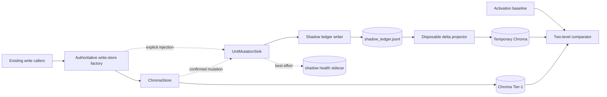

# ConvMem Complete Context Bundle for Claude

Generated: 2026-08-10T12:50:26-05:00
Machine: archlinux
Bundle type: slim (no test/script source)

This file is self-contained. Claude has no access to the GitHub repo or
the local machine. Everything Claude needs to understand and review this
project is included below.

---

# PART 1: Project Orientation

# ConvMem — Orientation for Claude

## What this project is

ConvMem is a local-first knowledge corpus and memory system for AI agents. It captures, indexes, and retrieves knowledge from multi-model development sessions — conversations, code, decisions, verifications. It runs entirely on Ryan's workstation (Arch Linux) with Ollama for local inference and Chroma for vector storage.

The system is used in production daily by multiple AI agents (Cursor, Crush/Kiro, Codex, GitHub Copilot) working on both this repo and client WordPress projects.

## Your role

You are a technical lead / architecture reviewer / thinking partner. You can:
- Review architecture and plans before they're locked
- Audit implementations against their locked architecture specs
- Help Ryan reason about tradeoffs, priorities, and sequencing
- Spot gaps in designs or implementations that local agents miss (because they're in their own context bubbles)
- Provide a cross-cutting view that no single agent session has

You do NOT: write code that gets deployed, run commands, merge branches, or make ledger entries. Those happen on the workstation through other agents.

## How to navigate this project

### Key entry points (read these first)

1. **`README.md`** — high-level product description
2. **`AGENTS.md`** — team charter, lane rules, commit/PR guidance
3. **`docs/inter-model/LATEST.md`** — the current handoff state (may be 1-2 days stale; snapshot is fresher)
4. **`docs/plans/STATUS-*.md`** — one per active arc; tells you goal/state/next-action for each workstream

### Architecture (the "why" layer)

- `docs/plans/ARCHITECTURE-*.md` — locked designs. An architecture doc means "this was reviewed and approved; implementation must follow it."
- `docs/plans/EXECUTION-*.md` — ordered step-by-step plans derived from an architecture lock.

### Decisions & history (the "what happened" layer)

- `docs/inter-model/` — 125 handoff documents. Named `{LANE}-{DATE}-{topic}.md`. Recent ones (Aug 7-10) are the most relevant.
- The convmem ledger itself (not directly accessible to you, but Ryan can paste `convmem search` or `convmem ask` output when you need historical context).

### Team charter

- `docs/inter-model/TEAM-CHARTER-2026-07-06.md` — who does what, conflict resolution, lane boundaries.

## Active arcs (as of 2026-08-10)

1. **JudgeBench** — Offline semantic calibration for the LLM judge that grades retrieval quality. Architecture locked, Flash slices S1-S9 authorized. Corpus merged. Live driver parked on branch. (`STATUS-judgebench.md`)

2. **CG-1 (Committed Generations)** — Build-then-promote durability for file-derived index generations. Replaces per-chunk mutation with atomic generation replacement. Implementation exists uncommitted in `/tmp/convmem-cg1` (written by Codex Luna under delegation). Not yet reviewed. (`ARCHITECTURE-shadow-ledger-phase0.md` section; no dedicated STATUS yet)

3. **Shadow Ledger Phase 0** — Delta capture system that records mutation events without changing the read path. Activation corrective plan exists. (`STATUS-shadow-ledger-phase0.md`)

4. **Chroma Reconcile Tier L** — Post-rebuild verification that the reconstructed corpus matches expected projection state. (`STATUS-chroma-reconcile-tier-l.md`)

5. **R2b Capture Auth** — Authorization tracking for what's been recorded vs. what's pending. (`STATUS-r2b-capture-auth.md`)

## The snapshot file

The `chatgpt-snapshot-*.md` file contains everything that is NOT visible from GitHub:
- `convmem doctor` output (health checks, service state, backup verification)
- `convmem brief` output (corpus counts, project activity, recent decisions, open risks)
- `convmem unresolved` (open observations requiring attention)
- Git worktree topology (70+ worktrees across the project)
- Uncommitted file inventories per worktree
- In `--full` mode: the actual source code of all uncommitted files

**Re-upload this file at the start of each session.** Everything else you can browse from the connected GitHub repo.

## How to ask for more context

If you need deeper history on a topic, ask Ryan to run:
```
convmem search "topic keywords"
convmem ask "specific question"
```
He'll paste the output. The ledger has 19,700+ knowledge units spanning months of multi-agent development.

## Key conventions

- **Branches follow taxonomy:** `feat|fix|docs|plan|wip/YYYY-MM-DD-slug`
- **Architecture docs are locks:** Once approved, implementation must conform. Changes require a new review.
- **Push means ready:** Branches are pushed when work is meaningfully complete, not speculatively.
- **Ryan owns merges.** Agents propose PRs; Ryan merges.
- **Squash-merge default.** PR body = the eventual main commit message.


---

# PART 2: Local Machine State

```
[PASS] config: /home/lauer/.config/convmem/config.toml readable
[PASS] write_lane: lane=prod workspace=prod config=config.toml write_guard=OK
[PASS] hooks_path: hooksPath=scripts/git-hooks (pre-push+pre-commit ok)
[PASS] wip_on_main: main: 0 WIP commits in last 50
[WARN] dirty_main: tracked dirty on main: .gitignore — use convmem work start/resume (do not edit on main)
[SKIP] unpushed_commits: skip on main
[PASS] deepseek_key: DEEPSEEK_API_KEY set
[PASS] ollama: http://localhost:11434 OK (33 models; e.g. ['laguna-xs-2.1:latest', 'ornith:9b'])
[PASS] chroma: 19708 knowledge units, 2452 summaries
[PASS] index_drift: Chroma 19708 active; JSONL 31495 historical ids (31495 lines; 19350 overlap, 98% active coverage; 12145 historical-only, 358 active-only)
[WARN] embed_collection_identity: WARN: legacy collection metadata lacks convmem:embed_model (configured='nomic-embed-text'; shadow stores must set metadata)
[PASS] shadow_ledger: disabled (no sink injection; Phase 0 default)
[PASS] restic_gate: complete-data-v2 snapshot covers today (id=5e9a7e1162ee2d2a3b904893736521526bae0ff348143f2d8b2799f8e4e8d836 tag=convmem-data-v2)
[PASS] restic_external: offsite copy covers today (source=5e9a7e1162ee2d2a3b904893736521526bae0ff348143f2d8b2799f8e4e8d836 destination=ed8d546f3737cb92940817ad2aa313967a64916ede525c9e2608fe28d44340fd)
[PASS] restic_password_backup: offline password copy present and matches (/run/media/lauer/BIT-Brg-larch-7t/convmem-secrets/restic.password)
[PASS] synthesis_gate: 0 ask failures, 512 ingest-degraded in 7d (provider drops; projection completeness unproven until reconciled)
[PASS] index_gate: 0 index failures in 7d
[PASS] standing_register: 13 open checks, 0 due (2 charter-standing)
[PASS] planning_guide_contract: contract v2: 5 guide(s) ok
[PASS] ledger_documents: 0 empty decision/verification docs (361 scanned)
[PASS] mcp_import: mcp_server tools importable
[PASS] mcp_cursor: ~/.cursor/mcp.json has convmem
[PASS] mcp_continue: Continue MCP wiring present
[PASS] mcp_copilot: ~/.copilot/mcp-config.json has convmem
[PASS] verify_continue: verify-continue.sh present (use --verify to run)

doctor: all checks passed
  (2 warning(s) — non-fatal)
  (1 skipped — expected for cross-lane workspace)

── Next steps ──
  • convmem tldr  # one-page cheat sheet
  • convmem brief --stdout-only
  • convmem unresolved  # add --site <host> for client work
  • convmem "your topic"  # search before ask
  • convmem doctor --v1  # watch RSS, digest timer, locks
```

```
# CONVMEM BRIEF

Generated: 2026-08-10T17:50:32Z

## State
- Corpus: **19708** units, **2452** summaries
- Inventory: 1290 indexed, 0 pending, 0 deferred
- Tests: unknown (run: convmem brief --with-tests)
- rerank: False
- Services: watch=unknown refine=unknown monitor.timer=unknown
- Kiro live DB excluded: **no**
- MCP: cursor=registered crush=registered crush_live=2026-06-22T15:35:23Z
- MCP stdio: verified (Cursor dev machine 2026-06-22)
- LATEST.md: updated **1d ago** (2026-08-09) **(stale)**
- Recent inter-model: HANDOFF-CG1-DEPENDABILITY-2026-08-10.md, BUILT-PLANS-2026-06-24-to-2026-06-29.md, WILLOWYHOLLOW-BUG-TRIAGE-2026-07-06.md
- Unresolved observations: **4** (run `convmem unresolved`)
- **⚠ STALE HANDOFF:** `LATEST.md` is older than `HANDOFF-CG1-DEPENDABILITY-2026-08-10.md` (newest 1m ago) — read newest file or update LATEST
- brief @ `2026-08-10T17:50:32Z`

## Projects (indexed activity)
- **convmem** — 85 sources, 4782 units, last activity 28m ago
  - repo: `/home/lauer/Projects/convmem`
  - agents: `/home/lauer/Projects/convmem/AGENTS.md`
  - newest: `/home/lauer/Projects/convmem/.crush/crush.db`
  - try: `search_fast("convmem handoff next steps")`
- **local_share_convmem_worktrees_fix_2026_07_24_crush_bash_index_freeze** — 1 sources, 5 units, last activity 17d ago
  - newest: `/home/lauer/.cursor/projects/home-lauer-local-share-convmem-worktrees-fix-2026-07-24-crus…`
  - try: `search_fast("local_share_convmem_worktrees_fix_2026_07_24_crush_bash_index_freeze handoff next steps")`
- **worldmonitor** — 1 sources, 0 units, last activity 18d ago
  - repo: `/home/lauer/GitClones/worldmonitor`
  - agents: `/home/lauer/GitClones/worldmonitor/AGENTS.md`
  - newest: `/home/lauer/GitClones/worldmonitor/.crush/crush.db`
  - try: `search_fast("worldmonitor handoff next steps")`
- **willowyhollow-practice** — 101 sources, 1704 units, last activity 18d ago
  - repo: `/home/lauer/WordPress/willowyhollow-practice`
  - agents: `/home/lauer/WordPress/willowyhollow-practice/AGENTS.md`
  - newest: `/home/lauer/WordPress/willowyhollow-practice/.crush/crush.db`
  - try: `search_fast("willowyhollow-practice handoff next steps")`
- **local_share_convmem_worktrees_docs_2026_07_21_2026_07_21_deepseek_v4pro_audit_substitute** — 2 sources, 110 units, last activity 18d ago
  - newest: `/home/lauer/.cursor/projects/home-lauer-local-share-convmem-worktrees-docs-2026-07-21-202…`
  - try: `search_fast("local_share_convmem_worktrees_docs_2026_07_21_2026_07_21_deepseek_v4pro_audit_substitute handoff next steps")`
- **convmem-fix-ask-trace** — 1 sources, 31 units, last activity 19d ago
  - repo: `/home/lauer/Projects/convmem-fix-ask-trace`
  - agents: `/home/lauer/Projects/convmem-fix-ask-trace/AGENTS.md`
  - newest: `/home/lauer/.cursor/projects/home-lauer-Projects-convmem-fix-ask-trace/agent-transcripts/…`
  - try: `search_fast("convmem-fix-ask-trace handoff next steps")`
- **convmem-worktrees-pr52-r2a-closeout** — 7 sources, 120 units, last activity 19d ago
  - repo: `/home/lauer/Projects/convmem-worktrees-pr52-r2a-closeout`
  - newest: `/home/lauer/.cursor/projects/home-lauer-Projects-convmem-worktrees-pr52-r2a-closeout/agen…`
  - try: `search_fast("convmem-worktrees-pr52-r2a-closeout handoff next steps")`
- **willowyhollow-dev** — 8 sources, 100 units, last activity 19d ago
  - repo: `/home/lauer/GitClones/willowyhollow-dev`
  - agents: `/home/lauer/GitClones/willowyhollow-dev/AGENTS.md`
  - newest: `/home/lauer/.cursor/projects/home-lauer-GitClones-willowyhollow-dev/agent-transcripts/a3c…`
  - try: `search_fast("willowyhollow-dev handoff next steps")`

## Active P0
1. Update LATEST.md or read `HANDOFF-CG1-DEPENDABILITY-2026-08-10.md` before cross-model handoff

## Recent Decisions
- **dec_prop_20260808_150112_f49e**: Ryan Execution HITL: JudgeBench execution plan + Flash S1-S9 implementation aut…
  - Rationale: Architecture lock granted; Flash slice brief (EXECUTION-judgebench-flash-slices.md) scopes S1-S9 pr…
- **dec_prop_20260808_150053_5d61**: Ryan Architecture HITL lock: JudgeBench offline semantic calibration architectu…
  - Rationale: Both required AI reviewers (Kiro, ChatGPT) PASSed the ARCHITECTURE-judgebench.md tip; DeepSeek's tr…
- **dec_prop_20260707_184401_44e8**: convmem repo bug sprint closed; convmem index hangs on pending Crush DBs
  - Rationale: Bug sprint complete (Bugs 1-4 fixed, 5 analyzed, 6 verified correct). User attempted convmem index…
- **dec_prop_20260715_223237_c9d4**: Continue MCP verify: P0 retrieval fix sequence complete — Kiro snapshot filter,…
  - Rationale: P0a: adapters/inter_model_doc.py _EXCLUDE_PATH_TOKENS frozenset. P0b: 646  snapshot inter_model_doc…
- **dec_prop_20260722_013340_dc60**: P1.3 source-trust ranking plan approved and handed to Codex; execution + handof…
  - Rationale: Closes the ksweep-class ranking failure by preferring kiro_steering/ledger/inter-model over chat af…

## Recent Monitor
- staging2.willowyhollow.com: Referrer-Policy still absent on staging2.willowyhollow.com (monitor re-check of obs_staging2_monito… [fail]
- staging2.willowyhollow.com: Content-Security-Policy still absent on staging2.willowyhollow.com (monitor re-… [fail]
- staging2.willowyhollow.com: Referrer-Policy absent or failed on staging2.willowyhollow.com (convmem-monitor probe referrer-poli…

## Open Risks
- Watch OOM if live DBs indexed (Kiro sqlite, Cursor store.db) — both skipped in watch
- Watch RSS high (~3–4G) — little headroom under MemoryMax=4G
- Crush MCP live path still unverified until `mcp_crush_verified` flag set

## Before Working
- Protocol: `brief` → `convmem ask` → `LATEST.md` → `convmem record -i` → `convmem record --approve-last`
- Session close: `SESSION-CLOSE-RECORD.md` — `convmem record --relates-to … --summary … --rationale … --author …`; then `--approve-last`; never `record` alone or fake flags
- Agent roles: `docs/AGENT-ROLES.md`
- Use `convmem search` / MCP `search_fast` for targeted prior art
- Drafts are not searchable until `record --approve-last`

## Inter-Model Inbox
- `/home/lauer/Projects/convmem/docs/inter-model/`


── Next steps ──
  • Update docs/inter-model/LATEST.md or read the newest inter-model file
  • convmem unresolved  # 4 open
  • convmem "your question"  # or: convmem ask "…"
  • convmem record -i  # after a durable win (you: record --approve-last)
```

```
4 unresolved observation(s):

LEDGER ID                                    SEVERITY  SITE                        DOMAIN              STATUS               LAST TOUCHED  TITLE                                                       
──────────────────────────────────────────────────────────────────────────────────────────────────────────────────────────────────────────────────────────────────────────────────────────────────────
obs_staging2_monitor_csp-missing             medium    staging2.willowyhollow.com  web_stack.security  failed_check         2026-07-12    Content-Security-Policy absent or failed on staging2.willow…
obs_staging2_monitor_header-referrer-policy  medium    staging2.willowyhollow.com  web_stack.security  failed_check         2026-07-12    Referrer-Policy absent or failed on staging2.willowyhollow.…
ver_staging2_mon_csp                         medium    staging2.willowyhollow.com  web_stack.security  failed_verification  2026-07-12    Content-Security-Policy still absent on staging2.willowyhol…
ver_staging2_mon_referrer-policy             medium    staging2.willowyhollow.com  web_stack.security  failed_verification  2026-07-12    Referrer-Policy still absent on staging2.willowyhollow.com …

── Next steps ──
  • convmem ask "How do we fix these?" --site staging2.willowyhollow.com
  • convmem "staging2.willowyhollow.com CSP SiteGround"
```

## Git status (main)

```
## main...origin/main
 M .gitignore
?? .kiro/settings/
?? complete-data-restore-reports/
?? docs/inter-model/C5-ACTIVATION-HANDOFF-2026-07-29.md
?? docs/inter-model/CODEX-2026-08-02-summarizer-switch-decision.md
?? docs/inter-model/CRUSH-2026-08-02-summarizer-bakeoff-chroma-assessment.md
?? docs/inter-model/CRUSH-2026-08-07-session-handoff-gpu-fix.md
?? docs/inter-model/CRUSH-2026-08-08-index-complete-judgebench-unblock.md
?? docs/inter-model/HANDOFF-CG1-DEPENDABILITY-2026-08-10.md
?? docs/inter-model/PYLINT-BRIEF-FOR-QWEN-2026-07-25.md
?? docs/plans/TEMPLATE-flash-slice-brief.md
?? piped
?? pylint-report.json
?? scripts/export-chatgpt-snapshot.sh
?? scripts/export-claude-bundle.sh
```

## Worktrees with uncommitted changes

### /home/lauer/.local/share/convmem/worktrees/docs-2026-07-15-codex-top-two-retrieval-plans
Branch: `docs/2026-07-15-codex-top-two-retrieval-plans`

```
?? docs/inter-model/debate-2026-07-15-who-fixes-retrieval/CODEX-top-two-problems-and-plans.md
```

### /home/lauer/.local/share/convmem/worktrees/fix-2026-07-27-complete-data-backup-correction-v2
Branch: `fix/2026-07-27-complete-data-backup-correction-v2`

```
?? complete-data-restore-reports/
```

### /home/lauer/.local/share/convmem/worktrees/fix-2026-07-28-shadow-phase0-c1-strict-validation
Branch: `fix/2026-07-28-shadow-phase0-c1-strict-validation`

```
?? complete-data-restore-reports/
```

### /home/lauer/.local/share/convmem/worktrees/fix-2026-07-28-shadow-phase0-c2-secure-append
Branch: `fix/2026-07-28-shadow-phase0-c2-secure-append`

```
?? complete-data-restore-reports/
```

### /home/lauer/.local/share/convmem/worktrees/fix-2026-07-29-shadow-phase0-c4-truth-reporting
Branch: `fix/2026-07-29-shadow-phase0-c4-truth-reporting`

```
?? complete-data-restore-reports/
```

### /home/lauer/.local/share/convmem/worktrees/fix-2026-08-07-judge-bench-judge-upgrades
Branch: `fix/2026-08-07-judge-bench-judge-upgrades`

```
 M eval_judge.py
 M eval_methodology.py
 M scripts/eval-summaries.py
 M scripts/eval-synthesis.py
 M tests/test_doctor.py
 M tests/test_eval_methodology.py
 M tests/test_eval_synthesis.py
?? docs/inter-model/CRUSH-2026-08-07-judge-bench-analysis.md
```

### /home/lauer/.local/share/convmem/worktrees/plan-2026-07-28-shadow-phase0-activation-corrective
Branch: `plan/2026-07-28-shadow-phase0-activation-corrective`

```
 M docs/plans/EXECUTION-shadow-phase0-activation-corrective.md
```

### /home/lauer/.local/share/convmem/worktrees/wip-2026-07-28-local-dev-tools
Branch: `wip/2026-07-28-local-dev-tools`

```
?? .vscode/
```

### /tmp/convmem-cg1
Branch: `feat/2026-08-10-2026-08-10-cg1-committed-generation-substrate`

```
 M ingest_dedupe.py
?? file_generation_builder.py
?? file_generation_contract.py
?? file_generation_pointer.py
?? file_generation_store.py
?? file_generation_validate.py
?? tests/test_file_generation_builder.py
?? tests/test_file_generation_contract.py
?? tests/test_file_generation_dedupe.py
?? tests/test_file_generation_durability.py
?? tests/test_file_generation_faults.py
?? tests/test_file_generation_pointer.py
?? tests/test_file_generation_read_path_inventory.py
?? tests/test_file_generation_read_paths.py
?? tests/test_file_generation_store.py
?? tests/test_file_generation_validate.py
```

### /tmp/convmem-crush-exec-1786150330
Branch: `wip/2026-08-07-crush-delegation-test`

```
 M chroma_store.py
?? scripts/chroma_orphan_inventory.py
?? tests/test_chroma_flatten.py
```

## Recent branches

```
+ feat/2026-08-10-judgebench-live-driver                        f80fbcd (/home/lauer/.local/share/convmem/worktrees/feat-2026-08-10-judgebench-live-driver) [origin/feat/2026-08-10-judgebench-live-driver] prove both DeepSeek candidates use the bounded driver
+ feat/2026-08-10-2026-08-10-cg1-committed-generation-substrate 0be0a05 (/tmp/convmem-cg1) [origin/feat/2026-08-10-2026-08-10-cg1-committed-generation-substrate: behind 2] Prepare fail-closed JudgeBench calibration runs (#171)
* main                                                          0be0a05 [origin/main] Prepare fail-closed JudgeBench calibration runs (#171)
+ feat/2026-08-09-judgebench-calibration-prep                   200a2f4 (/home/lauer/.local/share/convmem/worktrees/feat-2026-08-09-judgebench-calibration-prep) [origin/feat/2026-08-09-judgebench-calibration-prep] preserve calibration compatibility exports
+ feat/2026-08-09-2026-08-09-judgebench-g3-corpus               d87ff7e (/home/lauer/.local/share/convmem/worktrees/feat-2026-08-09-2026-08-09-judgebench-g3-corpus) [origin/feat/2026-08-09-2026-08-09-judgebench-g3-corpus] satisfy Pylint gate for JudgeBench delivery
+ fix/2026-08-09-projection-parity-reconcile                    bc23ff9 (/home/lauer/.local/share/convmem/worktrees/fix-2026-08-09-projection-parity-reconcile) [origin/fix/2026-08-09-projection-parity-reconcile] update the governed writer location
+ fix/2026-08-09-safe-file-reindex                              04fa8eb (/home/lauer/.local/share/convmem/worktrees/fix-2026-08-09-safe-file-reindex) [origin/fix/2026-08-09-safe-file-reindex] test: document intentional internal reindex coverage
+ fix/2026-08-09-deepseek-v4-flash-timeout                      810ef2a (/home/lauer/.local/share/convmem/worktrees/fix-2026-08-09-deepseek-v4-flash-timeout) [origin/fix/2026-08-09-deepseek-v4-flash-timeout] fix: give reasoning extraction measured timeout headroom
  docs/2026-08-09-pga-landscape-hygiene                         ecb4678 [origin/docs/2026-08-09-pga-landscape-hygiene] docs: add DeepSeek V4 Flash timeout fix to LATEST landscape
+ docs/2026-08-09-complete-data-status-brief-followup           459892d (/tmp/convmem-complete-data-status-brief) [origin/docs/2026-08-09-complete-data-status-brief-followup: behind 10] add complete-data backup arc status brief
  docs/2026-08-09-landscape-status-sync                         ce6d49e [origin/docs/2026-08-09-landscape-status-sync] update: sync active STATUS file registry across agent surfaces
+ docs/2026-08-09-2026-08-09-judgebench-status-awareness        fbbbd33 (/home/lauer/.local/share/convmem/worktrees/docs-2026-08-09-2026-08-09-judgebench-status-awareness) [origin/docs/2026-08-09-2026-08-09-judgebench-status-awareness] docs: refresh JudgeBench arc landscape
+ docs/2026-08-09-complete-data-status-brief                    475fe43 (/home/lauer/.local/share/convmem/worktrees/docs-2026-08-09-complete-data-status-brief) [origin/docs/2026-08-09-complete-data-status-brief] docs: land post-rebuild verify handoff and Chroma reconcile STATUS (#161)
  docs/2026-08-09-2026-08-09-judgebench-status-test-note        189fc48 [origin/docs/2026-08-09-2026-08-09-judgebench-status-test-note: behind 3] update: correct JudgeBench STATUS test coverage note
  docs/2026-08-08-2026-08-09-pga-creation-rule                  479f43c [origin/docs/2026-08-08-2026-08-09-pga-creation-rule] Update JudgeBench arc brief: retrieval corpus repaired, T7 unblocked
  docs/2026-08-08-2026-08-09-judgebench-status-reconcile        9fc4579 [origin/docs/2026-08-08-2026-08-09-judgebench-status-reconcile: gone] reconcile JudgeBench STATUS arc brief to current main
  docs/2026-08-08-2026-08-09-pga-status-register                3fb82e2 [origin/docs/2026-08-08-2026-08-09-pga-status-register] propagate project-goal-awareness section and active-arc list to all model surfaces
  docs/2026-08-08-2026-08-09-project-goal-awareness             902f407 [origin/docs/2026-08-08-2026-08-09-project-goal-awareness] add Flash follow-up brief for stalled-arc briefs (R2b, Shadow)
  fix/2026-08-09-judgebench-arch-lock-chroma-rebuild            2ba88a7 [origin/fix/2026-08-09-judgebench-arch-lock-chroma-rebuild] fix: clear pylint gate for JudgeBench T2-T5 branch
  plan/2026-08-07-2026-08-07-judge-bench-analysis               740865c [origin/plan/2026-08-07-2026-08-07-judge-bench-analysis] mark JudgeBench planning docs complete after PR #153 merge
```


---

# PART 3: Core Source Code

These are the production Python modules that make up convmem.

### ask.py (37664 bytes)

```python
"""RAG answer layer — retrieve context, then synthesize an answer with citations."""

# pylint: disable=too-many-lines

import hashlib
import json
import os
from dataclasses import dataclass
from datetime import datetime, timezone
from pathlib import Path

from config import load_config
from ledger_recent import (
    RECENT_DECISIONS_DAYS,
    RECENT_DECISIONS_LIMIT,
    decision_record_to_unit,
    recent_decisions_for_cfg,
)
from llm import generate_stream
from meta_format import when_from_meta, when_label
from query import query_raw, query_units

ASK_PROMPT = """You answer questions using ONLY the retrieved excerpts from past AI coding sessions below.
Be specific: mention tool names, file paths, commands, config keys, and error messages when present in the excerpts.
If the excerpts do not contain enough information to answer, say so clearly — do not invent details or guess from general knowledge.
Cite sources inline as [1], [2], etc. matching the excerpt numbers below.
Each excerpt header includes a date when known — use it when the user asks about "today", "recently", or timing.
If excerpts are only tangentially related (same tool but different topic), say the index has related material but not this specific answer.
For decisions: when one excerpt's relates_to points to another excerpt's ledger_id, the child decision replaces the parent — follow the child only; do not recommend the superseded parent approach.

Question:
{question}

Retrieved excerpts:
{context}

Answer:"""

FOLLOWUP_ASK_PROMPT = """You answer questions using ONLY the retrieved excerpts from past AI coding sessions below.
Be specific: mention tool names, file paths, commands, config keys, and error messages when present in the excerpts.
If the excerpts do not contain enough information to answer, say so clearly — do not invent details or guess from general knowledge.
Cite sources inline as [1], [2], etc. matching the excerpt numbers below.
Each excerpt header includes a date when known — use it when the user asks about "today", "recently", or timing.
If excerpts are only tangentially related (same tool but different topic), say the index has related material but not this specific answer.
For decisions: when one excerpt's relates_to points to another excerpt's ledger_id, the child decision replaces the parent — follow the child only; do not recommend the superseded parent approach.

The user is in a multi-turn session. Use the conversation so far to interpret follow-ups (e.g. "how did it improve CLS" refers to the prior topic). Still ground every claim in the excerpts — do not rely on the prior assistant reply as fact.

Conversation so far:
{history}

Current question:
{question}

Retrieved excerpts:
{context}

Answer:"""

_MAX_CONTEXT_CHARS = 12000
_MAX_HISTORY_CHARS = 4000
_LOW_CONFIDENCE = 0.55
_ASK_TOP_K = 8
EMPTY_CONTEXT_DELIVERY = {
    "max_chars": _MAX_CONTEXT_CHARS,
    "truncated": False,
    "chars_before": 0,
    "chars_after": 0,
    "last_fully_included_id": None,
    "partial_id": None,
}
# MCP / agent callers: degrade to retrieval-only before client tool timeout.
_ASK_SYNTHESIS_TIMEOUT = 45.0

# Lightweight telemetry for P1c gate detection (>=3 failures/week triggers streaming work).
_SYNTHESIS_FAIL_LOG = Path("~/.local/share/convmem/synthesis_failures.jsonl").expanduser()


def _log_synthesis_failure(question: str, error: Exception) -> None:
    """Append one JSONL line per synthesis failure. Non-blocking — never raises."""
    try:
        _SYNTHESIS_FAIL_LOG.parent.mkdir(parents=True, exist_ok=True)
        entry = {
            "ts": datetime.now(timezone.utc).strftime("%Y-%m-%dT%H:%M:%SZ"),
            "error_type": type(error).__name__,
            "error": str(error)[:200],
            "question": question[:200],
        }
        with _SYNTHESIS_FAIL_LOG.open("a", encoding="utf-8") as f:
            f.write(json.dumps(entry) + "\n")
    except Exception:
        pass  # Telemetry must never break ask


def _format_history(history: list[tuple[str, str]]) -> str:
    lines: list[str] = []
    block = ""
    for q, a in history:
        lines.append(f"User: {q}\nAssistant: {a}")
        block = "\n\n".join(lines)
        if len(block) > _MAX_HISTORY_CHARS:
            # Keep the most recent turns that fit.
            while len(block) > _MAX_HISTORY_CHARS and len(lines) > 1:
                lines.pop(0)
                block = "\n\n".join(lines)
            break
    return block


def _retrieval_query(question: str, history: list[tuple[str, str]] | None) -> str:
    """Expand a vague follow-up into a standalone search query."""
    if not history:
        return question
    # Anchor follow-ups to the last question (and optionally one before).
    prior = " ".join(q for q, _ in history[-2:])
    return f"{prior} {question}".strip()


def _result_key(r: dict) -> str:
    meta = r.get("metadata", {})
    return f"{meta.get('source_path','')}|{meta.get('title','')}|{meta.get('start_offset','')}"


def _merge_results(
    units: list[dict], raw_hits: list[dict], limit: int
) -> list[tuple[dict, bool]]:
    """Merge unit and raw hits; bool marks unit vs summary."""
    seen: set[str] = set()
    merged: list[tuple[dict, bool]] = []
    for r, is_unit in [(u, True) for u in units] + [(r, False) for r in raw_hits]:
        key = _result_key(r)
        if key in seen:
            continue
        seen.add(key)
        merged.append((r, is_unit))
        if len(merged) >= limit:
            break
    return merged


def _max_score(results: list[dict]) -> float | None:
    scores = [r["score"] for r in results if r.get("score") is not None]
    return max(scores) if scores else None


def _prepend_recent_decisions(
    semantic: list[dict],
    recent_records: list[dict],
    *,
    max_recent: int = RECENT_DECISIONS_LIMIT,
    total_limit: int,
    domain: str | None = None,
    site: str | None = None,
) -> list[dict]:
    """Inject novel recent decisions as a minority of the context block.

    Pipeline: optional domain/site filter on raw records → convert → drop
    recent units whose ledger_id already appears in semantic (semantic wins)
    → minority-cap with ``min(max_recent, max(1, total_limit // 3))`` →
    prepend capped recent then fill from semantic to ``total_limit``.
    """
    records = list(recent_records)
    if site:
        site_key = site.strip()
        records = [r for r in records if (r.get("site") or "").strip() == site_key]
    if domain:
        prefix = domain.split(".")[0].strip()
        if prefix:
            records = [
                r
                for r in records
                if (r.get("domain") or "").startswith(prefix)
            ]

    recent_units = [decision_record_to_unit(r) for r in records[:max_recent]]
    semantic_ids = {
        ((u.get("metadata") or {}).get("ledger_id") or "").strip()
        for u in semantic
        if ((u.get("metadata") or {}).get("ledger_id") or "").strip()
    }
    recent_after_dedupe = [
        u
        for u in recent_units
        if not (
            ((u.get("metadata") or {}).get("ledger_id") or "").strip()
            and ((u.get("metadata") or {}).get("ledger_id") or "").strip()
            in semantic_ids
        )
    ]
    if total_limit <= 0:
        return []
    cap = min(max_recent, max(1, total_limit // 3))
    capped = recent_after_dedupe[:cap]
    slots = total_limit - len(capped)
    return capped + list(semantic)[:slots]


TRACE_SCHEMA = "convmem.ask.trace.v1"
TRACE_LIMIT_DEFAULT = 20
MAX_PER_SOURCE = 2
_CONTEXT_TRUNCATION_SUFFIX = "\n\n[… context truncated …]"


def _diversify_by_source(
    candidates: list[dict],
    *,
    limit: int,
    max_per_source: int = MAX_PER_SOURCE,
) -> tuple[list[dict], list[dict]]:
    """Fill ``limit`` slots with at most ``max_per_source`` hits per source_path.

    Empty ``source_path`` is always admissible (no shared empty bucket).
    ``dropped`` are same-source skips only — not mere tail truncation past limit.
    """
    kept: list[dict] = []
    dropped: list[dict] = []
    counts: dict[str, int] = {}
    for result in candidates:
        meta = result.get("metadata") or {}
        src = meta.get("source_path") or ""
        if src:
            if counts.get(src, 0) >= max_per_source:
                dropped.append(result)
                continue
            counts[src] = counts.get(src, 0) + 1
        kept.append(result)
        if len(kept) >= limit:
            break
    return kept, dropped


def _source_diversity_block(
    dropped: list[dict],
    *,
    trace_limit: int,
    max_per_source: int = MAX_PER_SOURCE,
) -> dict:
    """Bounded dropped-row metadata for final_context (body-free compact rows)."""
    total = len(dropped)
    truncated = total > trace_limit
    items = []
    for result in dropped[:trace_limit]:
        row = _compact_trace_row(result)
        row["drop_reason"] = "source_cap"
        items.append(row)
    return {
        "max_per_source": max_per_source,
        "dropped_items": items,
        "dropped_items_total": total,
        "truncated": truncated,
    }


def _compact_trace_row(result: dict, *, origin: str | None = None) -> dict:
    """Compact per-hit row for ask() retrieval traces (no document bodies)."""
    meta = result.get("metadata") or {}
    lid = (meta.get("ledger_id") or "").strip() or None
    row = {
        "id": result.get("id"),
        "score": result.get("score"),
        "semantic_rank": result.get("semantic_rank"),
        "pre_rerank_rank": result.get("pre_rerank_rank"),
        "rerank_score": result.get("rerank_score"),
        "rerank_score_norm": result.get("rerank_score_norm"),
        "rerank_rank": result.get("rerank_rank"),
        "rank_fusion_score": result.get("rank_fusion_score"),
        "retrieval_rank": result.get("retrieval_rank"),
        "rank_score": result.get("rank_score"),
        "evidence_boost": result.get("evidence_boost"),
        "recency_boost": result.get("recency_boost"),
        "evidence_status": result.get("evidence_status") or "",
        "title": meta.get("title", ""),
        "type": meta.get("type"),
        "tool": meta.get("tool"),
        "source_path": meta.get("source_path", ""),
        "domain": meta.get("domain"),
        "ledger_id": lid,
        "ledger_kind": meta.get("ledger_kind"),
    }
    if "source_trust_boost" in result:
        row["source_trust_boost"] = result.get("source_trust_boost")
    if origin is not None:
        row["origin"] = origin
    return row


def _trace_stage(
    results: list[dict],
    *,
    limit: int,
    origins: list[str] | None = None,
    status: str = "ok",
    reason: str | None = None,
) -> dict:
    """Build a stage object; skipped stages never use null."""
    if status == "skipped":
        out: dict = {
            "status": "skipped",
            "reason": reason or "skipped",
            "items": [],
            "items_total": 0,
            "truncated": False,
        }
        return out
    total = len(results)
    truncated = total > limit
    capped = results[:limit]
    items = []
    for i, r in enumerate(capped):
        origin = origins[i] if origins is not None and i < len(origins) else None
        items.append(_compact_trace_row(r, origin=origin))
    out = {
        "status": status,
        "items": items,
        "items_total": total,
        "truncated": truncated,
    }
    if reason:
        out["reason"] = reason
    return out


def _skipped_stage(reason: str) -> dict:
    return _trace_stage([], limit=0, status="skipped", reason=reason)


def _format_context_item(
    result: dict, *, units: bool, n: int
) -> tuple[str, dict]:
    """Format one result with citation number ``n`` in both text and metadata."""
    block, cites = _format_context([result], units=units, start_n=n)
    return block, cites[0]


def _format_selection(
    selection: list[dict], unit_flags: list[bool]
) -> tuple[str, list[dict], list[str]]:
    """Format selection into context, citations, and per-item blocks."""
    blocks: list[str] = []
    citations: list[dict] = []
    for i, (r, is_unit) in enumerate(zip(selection, unit_flags), 1):
        block, cite = _format_context_item(r, units=is_unit, n=i)
        blocks.append(block)
        citations.append(cite)
    return "\n\n".join(blocks), citations, blocks


def _apply_context_char_limit(
    context: str,
    selection: list[dict],
    blocks: list[str],
    *,
    max_chars: int = _MAX_CONTEXT_CHARS,
) -> tuple[str, dict]:
    """Cut context at max_chars; report delivery metadata (ChatGPT A2)."""
    chars_before = len(context)
    delivery = {
        "max_chars": max_chars,
        "truncated": False,
        "chars_before": chars_before,
        "chars_after": chars_before,
        "last_fully_included_id": selection[-1].get("id") if selection else None,
        "partial_id": None,
    }
    if chars_before <= max_chars:
        return context, delivery

    delivered = context[:max_chars] + _CONTEXT_TRUNCATION_SUFFIX
    delivery["truncated"] = True
    delivery["chars_after"] = len(delivered)

    pos = 0
    last_full = None
    partial = None
    for i, block in enumerate(blocks):
        if i > 0:
            if pos >= max_chars:
                break
            if pos + 2 > max_chars:
                break
            pos += 2
        block_end = pos + len(block)
        if block_end <= max_chars:
            last_full = selection[i].get("id")
            pos = block_end
        else:
            if pos < max_chars:
                partial = selection[i].get("id")
            break
    delivery["last_fully_included_id"] = last_full
    delivery["partial_id"] = partial
    return delivered, delivery


def _build_trace_envelope(
    request: dict,
    stages: dict,
    *,
    trace_limit: int,
    context_delivery: dict,
) -> dict:
    # Envelope truncated when any stage item list is cut OR source_diversity
    # dropped_items exceed trace_limit. Stage.truncated stays about items only.
    any_trunc = False
    for stage in stages.values():
        if not isinstance(stage, dict):
            continue
        if stage.get("truncated"):
            any_trunc = True
            break
        diversity = stage.get("source_diversity")
        if isinstance(diversity, dict) and diversity.get("truncated"):
            any_trunc = True
            break
    return {
        "schema": TRACE_SCHEMA,
        "request": request,
        "stages": stages,
        "trace_limit": trace_limit,
        "truncated": any_trunc,
        "context_delivery": context_delivery,
    }


def _trace_request(
    *,
    search_q: str,
    top_k: int,
    fetch_k: int,
    raw: bool,
    evidence: bool,
    domain: str | None,
    site: str | None,
) -> dict:
    return {
        "retrieval_query": search_q,
        "top_k": top_k,
        "fetch_k": fetch_k,
        "raw": raw,
        "evidence": evidence,
        "domain": domain,
        "site": site,
    }


def _format_context(
    results: list[dict], *, units: bool, start_n: int = 1
) -> tuple[str, list[dict]]:
    """Build numbered context block and citation list."""
    lines: list[str] = []
    citations: list[dict] = []
    for i, r in enumerate(results, start_n):
        meta = r.get("metadata", {})
        doc = (r.get("document") or "").strip()
        if units:
            title = meta.get("title", "")
            utype = meta.get("type", "?")
            tool = meta.get("tool", "?")
            src = meta.get("source_path", "")
            when = when_label(meta)
            domain = meta.get("domain") or "general"
            author = meta.get("author_model") or "unknown"
            ledger_id = (meta.get("ledger_id") or "").strip()
            relates_to = (meta.get("relates_to") or "").strip()
            header_bits = [f"domain={domain}", f"by={author}"]
            if ledger_id:
                header_bits.append(f"ledger_id={ledger_id}")
            if relates_to:
                header_bits.append(f"relates_to={relates_to}")
            lines.append(
                f"[{i}] ({utype}, {tool}, {when}, {', '.join(header_bits)}) {title}\n"
                f"    {doc}\n"
                f"    Source: {src}"
            )
            citations.append(
                {
                    "n": i,
                    "id": r.get("id"),
                    "title": title,
                    "type": utype,
                    "tool": tool,
                    "source_path": src,
                    "when": when_from_meta(meta),
                    "score": r.get("score"),
                    "start_offset": meta.get("start_offset"),
                    "conversation_id": meta.get("conversation_id"),
                    "session_id": meta.get("session_id"),
                    "domain": domain,
                    "author_model": author,
                    "verifier_model": meta.get("verifier_model") or None,
                    "ledger_id": meta.get("ledger_id"),
                    "ledger_kind": meta.get("ledger_kind"),
                    "relates_to": meta.get("relates_to"),
                    "site": meta.get("site"),
                    "severity": meta.get("severity"),
                    "evidence_status": r.get("evidence_status") or "",
                    "evidence_boost": r.get("evidence_boost"),
                }
            )
        else:
            tool = meta.get("tool", "?")
            src = meta.get("source_path", "")
            start = meta.get("start_offset")
            end = meta.get("end_offset")
            when = when_label(meta)
            lines.append(
                f"[{i}] ({tool}, {when}) messages {start}–{end}\n"
                f"    {doc}\n"
                f"    Source: {src}"
            )
            citations.append(
                {
                    "n": i,
                    "tool": tool,
                    "source_path": src,
                    "start_offset": start,
                    "end_offset": end,
                    "when": when_from_meta(meta),
                    "score": r.get("score"),
                    "conversation_id": meta.get("conversation_id"),
                    "session_id": meta.get("session_id"),
                    "ledger_id": meta.get("ledger_id"),
                    "ledger_kind": meta.get("ledger_kind"),
                    "relates_to": meta.get("relates_to"),
                    "site": meta.get("site"),
                    "severity": meta.get("severity"),
                }
            )
    return "\n\n".join(lines), citations


def _apply_evidence_and_recent(
    units: list[dict],
    cfg: dict,
    *,
    domain: str | None,
    site: str | None,
    fetch_k: int,
    trace: bool,
    limit: int,
) -> tuple[list[dict], dict]:
    """Evidence rerank, ledger dedupe, recent prepend; optional stage snapshots."""
    from chroma_store import ChromaStore
    from evidence import apply_evidence_rerank

    stages: dict = {}
    qcfg = cfg.get("query", {})
    rw = float(qcfg.get("recency_weight", 0.0))
    rhl = float(qcfg.get("recency_half_life_days", 30.0))
    with ChromaStore(cfg["index"]["chroma_dir"]) as store:
        units = apply_evidence_rerank(
            units, store, recency_weight=rw, recency_half_life_days=rhl
        )
    if trace:
        stages["evidence_reranked"] = _trace_stage(
            units, limit=limit, origins=["unit"] * len(units)
        )
    from evidence import dedupe_results_by_ledger_id

    units = dedupe_results_by_ledger_id(units)
    if trace:
        stages["ledger_deduped"] = _trace_stage(
            units, limit=limit, origins=["unit"] * len(units)
        )
    recent = recent_decisions_for_cfg(
        cfg, days=RECENT_DECISIONS_DAYS, limit=RECENT_DECISIONS_LIMIT
    )
    if recent:
        units = _prepend_recent_decisions(
            units,
            recent,
            total_limit=fetch_k,
            domain=domain,
            site=site,
        )
    if trace:
        admitted = [
            u
            for u in units
            if (u.get("evidence_status") or "") == "recent_decision"
        ]
        stages["recent_injected"] = _trace_stage(
            admitted, limit=limit, origins=["unit"] * len(admitted)
        )
    return units, stages


def _select_units_or_hybrid(
    units: list[dict],
    *,
    search_q: str,
    top_k: int,
    fetch_k: int,
    site: str | None,
    evidence: bool,
    cfg: dict,
) -> tuple[
    list[dict],
    list[dict],
    list[bool],
    list[str],
    str,
    list[dict],
    list[str],
    str | None,
    list[dict],
]:
    """Return results, selection, flags, origins, context, citations, blocks, warning, dropped.

    ``results`` stay pre-diversity; ``selection``/citations are diversified.
    Evidence pools may be small after minority-cap — shortfall is acceptable.
    """
    warning: str | None = None
    best = _max_score(units)
    if not evidence and (best is None or best < _LOW_CONFIDENCE):
        raw_hits = query_raw(search_q, top_k=fetch_k, site=site, cfg=cfg)
        merged = _merge_results(units, raw_hits, fetch_k)
        pair_slice = merged[:fetch_k]
        cands = [r for r, _ in pair_slice]
        flag_by_id = {r.get("id"): is_unit for r, is_unit in pair_slice}
        selection, dropped = _diversify_by_source(cands, limit=fetch_k)
        unit_flags = [bool(flag_by_id.get(r.get("id"), False)) for r in selection]
        origins = [
            "unit" if flag_by_id.get(r.get("id"), False) else "raw_summary"
            for r in selection
        ]
        context, citations, blocks = _format_selection(selection, unit_flags)
        results = [r for r, _ in merged]
        if best is not None and best < _LOW_CONFIDENCE:
            warning = (
                f"Low retrieval confidence (best score {best:.3f}). "
                "Answer may be incomplete — topic may not be in the index."
            )
        return (
            results,
            selection,
            unit_flags,
            origins,
            context,
            citations,
            blocks,
            warning,
            dropped,
        )

    # Longer pool for refill; results slice stays pre-diversity top_k.
    from evidence import filter_superseded_decisions

    pool = filter_superseded_decisions(units[:fetch_k])
    results = pool[:top_k]
    selection, dropped = _diversify_by_source(pool, limit=top_k)
    unit_flags = [True] * len(selection)
    origins = ["unit"] * len(selection)
    context, citations, blocks = _format_selection(selection, unit_flags)
    return (
        results,
        selection,
        unit_flags,
        origins,
        context,
        citations,
        blocks,
        warning,
        dropped,
    )


def _synthesize_answer(
    *,
    question: str,
    context: str,
    history: list[tuple[str, str]] | None,
    models: dict,
    citations: list[dict],
    top_k: int,
    warning: str | None,
) -> tuple[str, str | None, bool, bool]:
    """Run LLM synthesis; return answer, warning, failed, interrupted."""
    if history:
        prompt = FOLLOWUP_ASK_PROMPT.format(
            history=_format_history(history),
            question=question,
            context=context,
        )
    else:
        prompt = ASK_PROMPT.format(question=question, context=context)
    model = models.get("distill_model", "deepseek-v4-flash")
    synthesis_failed = False
    synthesis_interrupted = False
    buffer: list[str] = []
    try:
        for token in generate_stream(
            prompt,
            model=model,
            ollama_host=models["ollama_host"],
            deepseek_base_url=models.get("deepseek_base_url", "https://api.deepseek.com"),
            timeout=_ASK_SYNTHESIS_TIMEOUT,
        ):
            buffer.append(token)
        answer = "".join(buffer)
    except Exception as e:
        if buffer:
            synthesis_interrupted = True
            answer = "".join(buffer) + (
                f"\n\n[Synthesis interrupted ({type(e).__name__}). "
                f"Partial answer above.]"
            )
            synth_warn = "Synthesis interrupted; partial answer returned."
            warning = f"{warning}\n{synth_warn}" if warning else synth_warn
        else:
            synthesis_failed = True
            _log_synthesis_failure(question, e)
            cite_lines = [
                f"[{c['n']}] {c.get('title', 'Untitled')} ({c.get('tool', '?')}, score {c.get('score')})"
                for c in citations[:top_k]
            ]
            answer = (
                "[Synthesis unavailable — retrieval results below. "
                f"Reason: {type(e).__name__}: {e}]\n\n"
                + "\n".join(cite_lines)
            )
            synth_warn = (
                f"Synthesis failed ({type(e).__name__}); returning retrieval citations only."
            )
            warning = f"{warning}\n{synth_warn}" if warning else synth_warn
    return answer, warning, synthesis_failed, synthesis_interrupted


def _build_eval_trace(*, question: str, context: str, model: str) -> dict:
    """Build the opt-in judge payload from the exact synthesis inputs.

    Unlike the public retrieval trace, this payload intentionally includes the
    delivered excerpts so an evaluation judge grades the same evidence that the
    synthesizer received.  The digest binds the payload to the exact UTF-8
    context string, including any context-limit truncation.
    """
    return {
        "question": question,
        "context": context,
        "context_sha256": hashlib.sha256(context.encode("utf-8")).hexdigest(),
        "model": model,
    }


def _synthesis_model_name(models: dict) -> str:
    """Return the model name that provider-aware synthesis will actually use."""
    configured = models.get("distill_model", "deepseek-v4-flash")
    if "deepseek-v4" in configured and not os.environ.get("DEEPSEEK_API_KEY"):
        return os.environ.get("CONVMEM_FALLBACK_MODEL", "llama3.1:8b")
    return configured


@dataclass(frozen=True)
class RetrievalBundle:  # pylint: disable=too-many-instance-attributes
    """Pre-synthesis retrieval outputs for ask() and future retrieval-eval.

    Cardinalities (Round 4 lock):
    - results: normal/evidence pre-diversity ≤ top_k; hybrid/raw pre-diversity ≤ fetch_k
    - selection / citations: full ordered context (may be fetch_k on raw/hybrid)
    - ask() still returns results[:top_k] and citations[:top_k]
    """

    search_q: str
    results: list[dict]
    selection: list[dict]
    citations: list[dict]
    context: str
    context_delivery: dict
    confidence: float | None
    warning: str | None
    trace: dict | None


def retrieve_for_ask(  # pylint: disable=too-many-locals,too-many-arguments
    question: str,
    *,
    top_k: int = 5,
    raw: bool = False,
    history: list[tuple[str, str]] | None = None,
    domain: str | None = None,
    site: str | None = None,
    evidence: bool = False,
    trace: bool = False,
    cfg: dict | None = None,
) -> RetrievalBundle:
    """Retrieval-only pipeline (no LLM). Behavior matches pre-extraction ask()."""
    if cfg is None:
        cfg = load_config()
    fetch_k = max(top_k, _ASK_TOP_K)
    warning: str | None = None
    search_q = _retrieval_query(question, history)
    limit = max(1, int(TRACE_LIMIT_DEFAULT))
    stages: dict = {}
    selection: list[dict] = []
    unit_flags: list[bool] = []
    origins: list[str] = []
    results: list[dict] = []
    context = ""
    citations: list[dict] = []
    blocks: list[str] = []
    dropped: list[dict] = []

    if raw:
        results = query_raw(search_q, top_k=fetch_k, site=site, cfg=cfg)
        if trace:
            stages["candidates"] = _trace_stage(
                results, limit=limit, origins=["raw_summary"] * len(results)
            )
            stages["semantic_reranked"] = _skipped_stage("raw_mode")
            stages["rank_fused"] = _skipped_stage("raw_mode")
            stages["source_trust"] = _skipped_stage("raw_mode")
            stages["evidence_reranked"] = _skipped_stage("raw_mode")
            stages["ledger_deduped"] = _skipped_stage("raw_mode")
            stages["recent_injected"] = _skipped_stage("raw_mode")
        selection, dropped = _diversify_by_source(results, limit=fetch_k)
        unit_flags = [False] * len(selection)
        origins = ["raw_summary"] * len(selection)
        context, citations, blocks = _format_selection(selection, unit_flags)
    else:
        from query import QueryUnitTrace

        query_trace = QueryUnitTrace() if trace else None
        units = query_units(
            search_q,
            top_k=fetch_k,
            domain=domain,
            site=site,
            cfg=cfg,
            retrieval_trace=query_trace,
        )
        if trace:
            stages["candidates"] = _trace_stage(
                query_trace.candidates or units,
                limit=limit,
                origins=["unit"] * len(query_trace.candidates or units),
            )
            stages["semantic_reranked"] = _trace_stage(
                query_trace.reranked or units,
                limit=limit,
                origins=["unit"] * len(query_trace.reranked or units),
            )
            stages["rank_fused"] = _trace_stage(
                query_trace.rank_fused or units,
                limit=limit,
                origins=["unit"] * len(query_trace.rank_fused or units),
            )
            stages["source_trust"] = _trace_stage(
                query_trace.source_trust or units,
                limit=limit,
                origins=["unit"] * len(query_trace.source_trust or units),
            )
        if evidence:
            units, ev_stages = _apply_evidence_and_recent(
                units,
                cfg,
                domain=domain,
                site=site,
                fetch_k=fetch_k,
                trace=trace,
                limit=limit,
            )
            stages.update(ev_stages)
        elif trace:
            stages["evidence_reranked"] = _skipped_stage("evidence_disabled")
            stages["ledger_deduped"] = _skipped_stage("evidence_disabled")
            stages["recent_injected"] = _skipped_stage("evidence_disabled")

        (
            results,
            selection,
            unit_flags,
            origins,
            context,
            citations,
            blocks,
            warning,
            dropped,
        ) = _select_units_or_hybrid(
            units,
            search_q=search_q,
            top_k=top_k,
            fetch_k=fetch_k,
            site=site,
            evidence=evidence,
            cfg=cfg,
        )

    if trace:
        stages["final_context"] = _trace_stage(
            selection, limit=limit, origins=origins[: len(selection)]
        )
        stages["final_context"]["source_diversity"] = _source_diversity_block(
            dropped, trace_limit=limit
        )

    req = _trace_request(
        search_q=search_q,
        top_k=top_k,
        fetch_k=fetch_k,
        raw=raw,
        evidence=evidence,
        domain=domain,
        site=site,
    )

    if not results:
        empty_delivery = dict(EMPTY_CONTEXT_DELIVERY)
        envelope = None
        if trace:
            envelope = _build_trace_envelope(
                req, stages, trace_limit=limit, context_delivery=empty_delivery
            )
        return RetrievalBundle(
            search_q=search_q,
            results=[],
            selection=selection,
            citations=[],
            context="",
            context_delivery=empty_delivery,
            confidence=None,
            warning="No matches in index.",
            trace=envelope,
        )

    confidence = _max_score(results)
    if warning is None and confidence is not None and confidence < _LOW_CONFIDENCE:
        warning = (
            f"Low retrieval confidence (best score {confidence:.3f}). "
            "Answer may be incomplete — topic may not be in the index."
        )

    context, context_delivery = _apply_context_char_limit(
        context, selection, blocks, max_chars=_MAX_CONTEXT_CHARS
    )
    envelope = None
    if trace:
        envelope = _build_trace_envelope(
            req, stages, trace_limit=limit, context_delivery=context_delivery
        )
    return RetrievalBundle(
        search_q=search_q,
        results=results,
        selection=selection,
        citations=citations,
        context=context,
        context_delivery=context_delivery,
        confidence=confidence,
        warning=warning,
        trace=envelope,
    )


def ask(  # pylint: disable=too-many-arguments
    question: str,
    *,
    top_k: int = 5,
    raw: bool = False,
    history: list[tuple[str, str]] | None = None,
    domain: str | None = None,
    site: str | None = None,
    evidence: bool = False,
    trace: bool = False,
    return_eval_trace: bool = False,
) -> dict:
    """Retrieve relevant memories and generate a cited answer.

    Args:
        history: Prior (question, answer) turns in this session for follow-ups.
        domain: Optional dotted-path scope (e.g. "web_stack.security"). Only
            applies to the units layer — raw summaries aren't domain-tagged.
        site: Optional site hostname (e.g. staging2.willowyhollow.com).
        evidence: Re-rank units by ledger graph (unresolved > failed > resolved).
        trace: When True, include versioned retrieval trace (convmem.ask.trace.v1).
        return_eval_trace: When True, include the exact question and delivered
            synthesis context for an evaluation judge.

    Returns:
        {"answer": str, "citations": list[dict], "results": list[dict],
         "confidence": float|None, "warning": str|None}
        With trace=True, also ``trace`` envelope (stages + context_delivery).
    """
    cfg = load_config()
    bundle = retrieve_for_ask(
        question,
        top_k=top_k,
        raw=raw,
        history=history,
        domain=domain,
        site=site,
        evidence=evidence,
        trace=trace,
        cfg=cfg,
    )
    if not bundle.results:
        empty = {
            "answer": "No relevant excerpts found in the index for that question.",
            "citations": [],
            "results": [],
            "confidence": None,
            "warning": "No matches in index.",
        }
        if bundle.trace is not None:
            empty["trace"] = bundle.trace
        if return_eval_trace:
            empty["eval_trace"] = _build_eval_trace(
                question=question,
                context=bundle.context,
                model=_synthesis_model_name(cfg["models"]),
            )
        return empty

    models = cfg["models"]
    answer, warning, synthesis_failed, synthesis_interrupted = _synthesize_answer(
        question=question,
        context=bundle.context,
        history=history,
        models=models,
        citations=bundle.citations,
        top_k=top_k,
        warning=bundle.warning,
    )
    out = {
        "answer": answer,
        "citations": bundle.citations[:top_k],
        "results": bundle.results[:top_k],
        "confidence": bundle.confidence,
        "warning": warning,
        "retrieval_query": bundle.search_q,
        "evidence": evidence,
    }
    if synthesis_failed:
        out["synthesis_failed"] = True
    if synthesis_interrupted:
        out["synthesis_interrupted"] = True
    if bundle.trace is not None:
        out["trace"] = bundle.trace
    if return_eval_trace:
        out["eval_trace"] = _build_eval_trace(
            question=question,
            context=bundle.context,
            model=_synthesis_model_name(models),
        )
    return out


def run_interactive(
    *,
    top_k: int = 5,
    raw: bool = False,
    first_question: str | None = None,
    domain: str | None = None,
    site: str | None = None,
    evidence: bool = False,
) -> None:
    """REPL: multi-turn ask with session memory."""
    from query import err_console, render_ask_output, render_warning

    history: list[tuple[str, str]] = []

    def _print_banner() -> None:
        err_console.print("[dim]convmem ask — interactive mode[/dim]")
        if domain:
            err_console.print(f"[dim]  Scoped to domain: {domain}[/dim]")
        if site:
            err_console.print(f"[dim]  Scoped to site: {site}[/dim]")
        if evidence:
            err_console.print("[dim]  Evidence-aware ranking: unresolved findings preferred[/dim]")
        err_console.print("[dim]  Type a question, or: exit | /clear[/dim]")
        err_console.print()

    def _print_out(out: dict) -> None:
        render_ask_output(out, show_search=bool(history))

    def _turn(question: str) -> None:
        nonlocal history
        q = question.strip()
        if not q:
            return
        if q.lower() in ("exit", "quit", "q"):
            raise SystemExit(0)
        if q == "/clear":
            history = []
            render_warning("Session cleared.")
            return
        out = ask(
            q,
            top_k=top_k,
            raw=raw,
            history=history or None,
            domain=domain,
            site=site,
            evidence=evidence,
        )
        _print_out(out)
        history.append((q, out["answer"]))

    _print_banner()
    if first_question:
        _turn(first_question)

    while True:
        try:
            line = input("ask> ").strip()
        except (EOFError, KeyboardInterrupt):
            err_console.print()
            break
        if not line:
            continue
        if line.lower() in ("exit", "quit", "q"):
            break
        _turn(line)
```

### atomic_files.py (4304 bytes)

```python
"""Durable atomic file publication for JSONL exports and authoritative JSON reports.

Architecture: docs/plans/ARCHITECTURE-complete-data-backup-correction-v2.md
(atomic_files section). Distinct from eval_corpus/io_atomic.py — this module
implements the full v2 contract (mode preservation, parent-directory fsync with
guaranteed descriptor close, and pre- vs post-publication failure classes).
"""

from __future__ import annotations

import json
import os
import stat
import tempfile
from pathlib import Path
from typing import Any


class AtomicWriteError(OSError):
    """Base class for atomic publication failures."""


class PrePublicationError(AtomicWriteError):
    """Failure before the destination was published.

    The previous destination bytes (if any) remain intact. The invocation-owned
    temporary file is removed when possible.
    """


class PostPublicationDurabilityError(AtomicWriteError):
    """Destination was published via os.replace, but durability is uncertain.

    Typically raised when parent-directory fsync fails after a successful
    replace. The visible destination contains the complete new contents; callers
    must treat durability (crash safety of the directory entry) as uncertain.
    """


def atomic_write_bytes(path: Path | str, data: bytes, *, preserve_mode: bool = True) -> None:
    """Publish *data* to *path* via temp → fsync → replace → parent-dir fsync."""
    dest = Path(path)
    dest.parent.mkdir(parents=True, exist_ok=True)

    prior_mode: int | None = None
    if preserve_mode and dest.exists():
        prior_mode = stat.S_IMODE(dest.stat().st_mode)

    fd, tmp_name = tempfile.mkstemp(
        prefix=f".{dest.name}.",
        suffix=".tmp",
        dir=str(dest.parent),
    )
    published = False
    try:
        try:
            with os.fdopen(fd, "wb") as handle:
                fd = -1  # ownership transferred to handle
                handle.write(data)
                handle.flush()
                os.fsync(handle.fileno())
        except BaseException as exc:
            raise PrePublicationError(
                f"pre-publication write failed for {dest}: {exc}"
            ) from exc

        if prior_mode is not None:
            try:
                os.chmod(tmp_name, prior_mode)
            except OSError as exc:
                raise PrePublicationError(
                    f"pre-publication mode preserve failed for {dest}: {exc}"
                ) from exc

        try:
            os.replace(tmp_name, dest)
        except BaseException as exc:
            raise PrePublicationError(
                f"pre-publication replace failed for {dest}: {exc}"
            ) from exc
        published = True

        try:
            dir_fd = os.open(str(dest.parent), os.O_RDONLY)
        except OSError as exc:
            raise PostPublicationDurabilityError(
                f"post-publication directory open failed for {dest}: {exc}"
            ) from exc
        try:
            try:
                os.fsync(dir_fd)
            except OSError as exc:
                raise PostPublicationDurabilityError(
                    f"post-publication directory fsync failed for {dest}: {exc}"
                ) from exc
        finally:
            os.close(dir_fd)
    except BaseException:
        if not published:
            try:
                os.unlink(tmp_name)
            except OSError:
                pass
            if fd >= 0:
                try:
                    os.close(fd)
                except OSError:
                    pass
        raise


def atomic_write_text(
    path: Path | str,
    text: str,
    *,
    preserve_mode: bool = True,
    encoding: str = "utf-8",
) -> None:
    """Publish *text* to *path* with durable atomic semantics."""
    atomic_write_bytes(path, text.encode(encoding), preserve_mode=preserve_mode)


def atomic_write_json(
    path: Path | str,
    obj: Any,
    *,
    preserve_mode: bool = True,
    indent: int | None = 2,
    sort_keys: bool = True,
) -> None:
    """Serialize *obj* as JSON and publish via atomic_write_text."""
    payload = json.dumps(obj, ensure_ascii=False, indent=indent, sort_keys=sort_keys)
    if not payload.endswith("\n"):
        payload += "\n"
    atomic_write_text(path, payload, preserve_mode=preserve_mode)
```

### backup_workflows.py (21991 bytes)

```python
"""Safety workflows for complete-data backup correction v2.

Deep orchestration over restic_snapshot.BackupContext. No consumer may invoke
Restic selection/check/copy/restore directly, and no workflow may catch a
resolver failure then fall back to legacy selection.

Architecture: docs/plans/ARCHITECTURE-complete-data-backup-correction-v2.md
"""

from __future__ import annotations

import argparse
import json
import sys
from dataclasses import dataclass, field
from pathlib import Path
from typing import Any, Sequence

from complete_data_restore import capture_backup_evidence
from restic_snapshot import (
    EXIT_ACTION_FAILURE,
    EXIT_INVALID_CONFIG,
    EXIT_NO_TAGGED_SNAPSHOT,
    EXIT_OK,
    EXIT_STALE,
    EXIT_WRONG_PATH,
    RESTIC_RESERVED_EXITS,
    BackupContext,
    BackupProfile,
    ResolverError,
    SnapshotRef,
    backup_data_root,
    check_restic_available,
    check_snapshot,
    copy_snapshot_to_external,
    ensure_repository_initialized,
    resolve_copy_destination,
    resolve_snapshot,
    restore_snapshot,
)

# ---------------------------------------------------------------------------
# Outcome vocabulary
# ---------------------------------------------------------------------------
STATUS_PASS = "PASS"
STATUS_FAIL = "FAIL"
STATUS_WARN = "WARN"
STATUS_WARN_LEGACY_ONLY = "WARN_LEGACY_ONLY"
STATUS_SKIP_DISABLED = "SKIP_DISABLED"


@dataclass(frozen=True)
class WorkflowOutcome:
    """Structured result shared by all backup workflows."""

    status: str
    message: str
    exit_code: int = EXIT_OK
    source: SnapshotRef | None = None
    destination: SnapshotRef | None = None
    argv: tuple[str, ...] = ()
    details: dict[str, Any] = field(default_factory=dict)

    @property
    def ok(self) -> bool:
        return self.status == STATUS_PASS

    def to_dict(self) -> dict[str, Any]:
        payload: dict[str, Any] = {
            "status": self.status,
            "message": self.message,
            "exit_code": self.exit_code,
            "argv": list(self.argv),
            "details": dict(self.details),
        }
        if self.source is not None:
            payload["source"] = self.source.to_dict()
        if self.destination is not None:
            payload["destination"] = self.destination.to_dict()
        return payload

    def to_json(self) -> str:
        return json.dumps(self.to_dict())


def _fail_from_resolver(exc: ResolverError, *, prefix: str = "") -> WorkflowOutcome:
    msg = f"{prefix}{exc}" if prefix else str(exc)
    return WorkflowOutcome(
        status=STATUS_FAIL,
        message=msg,
        exit_code=exc.exit_code,
    )


def _is_legacy_profile(ctx: BackupContext) -> bool:
    return (
        ctx.profile is BackupProfile.LEGACY_CHROMA
        or ctx.data_root_derived
    )


def _legacy_health_outcome(ctx: BackupContext, *, scope: str) -> WorkflowOutcome:
    return WorkflowOutcome(
        status=STATUS_WARN_LEGACY_ONLY,
        message=(
            f"WARN_LEGACY_ONLY: profile={ctx.profile.value} "
            f"(data_root_derived={ctx.data_root_derived}); "
            f"{scope} never claims complete-data-v2 protection"
        ),
        exit_code=EXIT_OK,
        details={
            "profile": ctx.profile.value,
            "data_root_derived": ctx.data_root_derived,
            "default_tag": ctx.default_tag(),
        },
    )


# ---------------------------------------------------------------------------
# Owned workflows
# ---------------------------------------------------------------------------
def ensure_current_snapshot(
    ctx: BackupContext,
    *,
    check_only: bool = False,
    require_current: bool = False,
    dry_run: bool = False,
) -> WorkflowOutcome:
    """Ensure a correct-path current-day snapshot exists (or report status).

    Never falls back to tag-only / ``--latest`` selection after resolver failure.
    """
    try:
        check_restic_available(ctx.restic_bin)
        if check_only:
            # Toolchain + repo reachability; do not backup.
            ensure_repository_initialized(ctx)
            try:
                ref = resolve_snapshot(ctx, require_current_local_day=False)
                return WorkflowOutcome(
                    status=STATUS_PASS,
                    message=(
                        f"toolchain OK (snapshot={ref.id[:12]}… "
                        f"tag={ctx.default_tag()}, repo={ctx.local_repository})"
                    ),
                    source=ref,
                    details={"freshness": "present", "check_only": True},
                )
            except ResolverError as exc:
                # Configured probe — surface as FAIL, never SKIP/PASS falsely.
                if exc.exit_code in {
                    EXIT_STALE,
                }:
                    return WorkflowOutcome(
                        status=STATUS_PASS,
                        message=(
                            f"toolchain OK (freshness=stale, "
                            f"repo={ctx.local_repository})"
                        ),
                        exit_code=EXIT_OK,
                        details={"freshness": "stale", "check_only": True},
                    )
                return WorkflowOutcome(
                    status=STATUS_PASS,
                    message=(
                        f"toolchain OK (freshness=none/error={exc.exit_code}, "
                        f"repo={ctx.local_repository})"
                    ),
                    exit_code=EXIT_OK,
                    details={
                        "freshness": "none",
                        "check_only": True,
                        "resolver_exit": exc.exit_code,
                        "resolver_message": str(exc),
                    },
                )

        ensure_repository_initialized(ctx)

        try:
            ref = resolve_snapshot(ctx, require_current_local_day=True)
            return WorkflowOutcome(
                status=STATUS_PASS,
                message=(
                    f"current — snapshot covers today "
                    f"(id={ref.id} tag={ctx.default_tag()})"
                ),
                source=ref,
                details={"freshness": "current", "backed_up": False},
            )
        except ResolverError as first:
            backupable = first.exit_code in {
                EXIT_STALE,
                EXIT_NO_TAGGED_SNAPSHOT,
                EXIT_WRONG_PATH,
            }
            if require_current or dry_run or not backupable:
                if dry_run and backupable and not require_current:
                    return WorkflowOutcome(
                        status=STATUS_PASS,
                        message=(
                            f"dry-run — would backup {ctx.data_root} "
                            f"(resolver={first.exit_code}: {first})"
                        ),
                        exit_code=EXIT_OK,
                        details={
                            "freshness": "stale_or_missing",
                            "dry_run": True,
                            "resolver_exit": first.exit_code,
                        },
                    )
                return WorkflowOutcome(
                    status=STATUS_FAIL,
                    message=(
                        f"snapshot not current "
                        f"(resolver={first.exit_code}: {first})"
                    ),
                    exit_code=first.exit_code,
                    details={"resolver_exit": first.exit_code},
                )

            # Snapshot-if-stale: backup then re-resolve. No legacy fallback.
            # Pre-snapshot capture evidence for complete-data-v2 only.
            evidence_meta = {}
            if ctx.profile is BackupProfile.COMPLETE_DATA_V2:
                evidence = capture_backup_evidence(ctx.data_root)
                evidence_meta = {
                    "evidence_captured": True,
                    "evidence_schema_version": evidence.get(
                        "evidence_schema_version"
                    ),
                    "evidence_captured_at": evidence.get("captured_at"),
                }
            ref, argv = backup_data_root(ctx)
            try:
                current = resolve_snapshot(
                    ctx, require_current_local_day=True, requested_id=ref.id
                )
            except ResolverError as second:
                return WorkflowOutcome(
                    status=STATUS_FAIL,
                    message=(
                        f"snapshot still not current after backup "
                        f"(resolver={second.exit_code}: {second})"
                    ),
                    exit_code=second.exit_code,
                    source=ref,
                    argv=argv,
                )
            details = {"freshness": "current", "backed_up": True}
            details.update(evidence_meta)
            return WorkflowOutcome(
                status=STATUS_PASS,
                message=(
                    f"snapshot OK (id={current.id} tag={ctx.default_tag()})"
                ),
                source=current,
                argv=argv,
                details=details,
            )
    except ResolverError as exc:
        return _fail_from_resolver(exc)


def copy_current_snapshot_offsite(ctx: BackupContext) -> WorkflowOutcome:
    """Resolve S → copy explicit S → resolve D via original==S → report both."""
    if ctx.external_repository is None:
        return WorkflowOutcome(
            status=STATUS_SKIP_DISABLED,
            message="RESTIC_EXTERNAL_REPOSITORY unset — offsite copy disabled",
            exit_code=EXIT_OK,
            details={"skip_reason": "unconfigured"},
        )

    try:
        check_restic_available(ctx.restic_bin)
        source = resolve_snapshot(ctx, require_current_local_day=True)
        argv = copy_snapshot_to_external(ctx, source.id)
        dest = resolve_copy_destination(ctx, source)
        return WorkflowOutcome(
            status=STATUS_PASS,
            message=(
                f"offsite copy OK source={source.id} destination={dest.id} "
                f"(original==source)"
            ),
            source=source,
            destination=dest,
            argv=argv,
            details={
                "source_id": source.id,
                "destination_id": dest.id,
                "original": dest.original,
            },
        )
    except ResolverError as exc:
        # Configured external present — never PASS/SKIP via legacy fallback.
        return WorkflowOutcome(
            status=STATUS_FAIL,
            message=str(exc),
            exit_code=exc.exit_code,
        )


def check_local_health(ctx: BackupContext) -> WorkflowOutcome:
    """Local gate health. Legacy/missing profile → WARN_LEGACY_ONLY."""
    if _is_legacy_profile(ctx):
        return _legacy_health_outcome(ctx, scope="local restic health")

    try:
        check_restic_available(ctx.restic_bin)
        ref = resolve_snapshot(ctx, require_current_local_day=True)
        return WorkflowOutcome(
            status=STATUS_PASS,
            message=(
                f"complete-data-v2 snapshot covers today "
                f"(id={ref.id} tag={ctx.default_tag()})"
            ),
            source=ref,
            details={"profile": ctx.profile.value},
        )
    except ResolverError as exc:
        return WorkflowOutcome(
            status=STATUS_FAIL,
            message=f"local restic health failed: {exc}",
            exit_code=exc.exit_code,
        )


def check_offsite_health(ctx: BackupContext) -> WorkflowOutcome:
    """Offsite lineage health. Unconfigured → SKIP_DISABLED; legacy → WARN."""
    if ctx.external_repository is None:
        return WorkflowOutcome(
            status=STATUS_SKIP_DISABLED,
            message="no RESTIC_EXTERNAL_REPOSITORY configured (offsite copy disabled)",
            exit_code=EXIT_OK,
            details={"skip_reason": "unconfigured"},
        )

    if _is_legacy_profile(ctx):
        return _legacy_health_outcome(ctx, scope="offsite restic health")

    try:
        check_restic_available(ctx.restic_bin)
        source = resolve_snapshot(ctx, require_current_local_day=True)
        dest = resolve_copy_destination(ctx, source)
        return WorkflowOutcome(
            status=STATUS_PASS,
            message=(
                f"offsite copy covers today "
                f"(source={source.id} destination={dest.id})"
            ),
            source=source,
            destination=dest,
            details={
                "source_id": source.id,
                "destination_id": dest.id,
                "original": dest.original,
            },
        )
    except ResolverError as exc:
        # Configured setup: WARN (offsite non-fatal for doctor) or FAIL —
        # never PASS/SKIP via legacy fallback selection.
        return WorkflowOutcome(
            status=STATUS_WARN,
            message=f"offsite health: {exc}",
            exit_code=exc.exit_code,
            details={"resolver_exit": exc.exit_code},
        )


def run_integrity_check(
    ctx: BackupContext,
    *,
    snapshot_id: str | None = None,
    full_read_data: bool = False,
    read_data_subset: str | None = "5%",
) -> WorkflowOutcome:
    """Resolve S (or validate requested id) then ``check <S>`` — no reselection."""
    try:
        if snapshot_id:
            ref = resolve_snapshot(ctx, requested_id=snapshot_id)
        else:
            ref = resolve_snapshot(ctx, require_current_local_day=False)
        proc, argv = check_snapshot(
            ctx,
            ref.id,
            full_read_data=full_read_data,
            read_data_subset=None if full_read_data else read_data_subset,
        )
        if proc.returncode != 0:
            detail = (proc.stderr or proc.stdout or "").strip()
            code = (
                proc.returncode
                if proc.returncode in RESTIC_RESERVED_EXITS
                else EXIT_ACTION_FAILURE
            )
            return WorkflowOutcome(
                status=STATUS_FAIL,
                message=f"restic check failed: {detail[:500]}",
                exit_code=code,
                source=ref,
                argv=argv,
                details={"restic_exit_code": proc.returncode},
            )
        return WorkflowOutcome(
            status=STATUS_PASS,
            message=f"integrity check OK for {ref.id}",
            source=ref,
            argv=argv,
            details={"restic_exit_code": 0},
        )
    except ResolverError as exc:
        return _fail_from_resolver(exc)


def restore_validated_snapshot(
    ctx: BackupContext,
    *,
    snapshot_id: str,
    target_dir: str | Path,
) -> WorkflowOutcome:
    """Resolve+validate snapshot_id against data_root, then restore."""
    try:
        ref = resolve_snapshot(ctx, requested_id=snapshot_id)
        argv = restore_snapshot(ctx, ref.id, target_dir)
        return WorkflowOutcome(
            status=STATUS_PASS,
            message=f"restored snapshot {ref.id} → {target_dir}",
            source=ref,
            argv=argv,
            details={"target_dir": str(Path(target_dir).expanduser().resolve())},
        )
    except ResolverError as exc:
        return _fail_from_resolver(exc)


# ---------------------------------------------------------------------------
# Doctor adapters
# ---------------------------------------------------------------------------
def outcome_to_doctor_fields(outcome: WorkflowOutcome) -> tuple[bool, str, str]:
    """Map workflow status → (ok, detail, doctor status string)."""
    if outcome.status == STATUS_PASS:
        return True, outcome.message, "pass"
    if outcome.status == STATUS_SKIP_DISABLED:
        return True, outcome.message, "skip"
    if outcome.status == STATUS_WARN_LEGACY_ONLY:
        return True, outcome.message, "warn"
    if outcome.status == STATUS_WARN:
        return True, outcome.message, "warn"
    return False, outcome.message, "fail"


# ---------------------------------------------------------------------------
# CLI (thin entry for shell wrappers)
# ---------------------------------------------------------------------------
def _load_ctx(env_file: str | None) -> BackupContext:
    return BackupContext.from_env_file(env_file)


def _print_outcome(outcome: WorkflowOutcome, *, as_json: bool = False) -> int:
    if as_json:
        print(outcome.to_json())
    else:
        stream = sys.stdout if outcome.status != STATUS_FAIL else sys.stderr
        prefix = {
            STATUS_PASS: "OK",
            STATUS_FAIL: "ERROR",
            STATUS_WARN: "WARN",
            STATUS_WARN_LEGACY_ONLY: "WARN_LEGACY_ONLY",
            STATUS_SKIP_DISABLED: "SKIP",
        }.get(outcome.status, outcome.status)
        print(f"backup-workflows: {prefix}: {outcome.message}", file=stream)
        if outcome.source is not None:
            print(f"backup-workflows: source_id={outcome.source.id}", file=stream)
        if outcome.destination is not None:
            print(
                f"backup-workflows: destination_id={outcome.destination.id}",
                file=stream,
            )
    if outcome.status == STATUS_FAIL:
        return outcome.exit_code if outcome.exit_code != EXIT_OK else EXIT_ACTION_FAILURE
    return EXIT_OK


def _cli_ensure(args: list[str]) -> int:
    p = argparse.ArgumentParser(prog="backup_workflows.py ensure")
    p.add_argument("--env-file", default=None)
    p.add_argument("--check-only", action="store_true")
    p.add_argument("--require-current", action="store_true")
    p.add_argument("--dry-run", action="store_true")
    p.add_argument("--json", action="store_true")
    opts = p.parse_args(args)
    try:
        ctx = _load_ctx(opts.env_file)
    except ResolverError as exc:
        print(f"backup-workflows: ERROR: {exc}", file=sys.stderr)
        return exc.exit_code
    outcome = ensure_current_snapshot(
        ctx,
        check_only=opts.check_only,
        require_current=opts.require_current,
        dry_run=opts.dry_run,
    )
    return _print_outcome(outcome, as_json=opts.json)


def _cli_copy(args: list[str]) -> int:
    p = argparse.ArgumentParser(prog="backup_workflows.py copy-offsite")
    p.add_argument("--env-file", default=None)
    p.add_argument("--json", action="store_true")
    opts = p.parse_args(args)
    try:
        ctx = _load_ctx(opts.env_file)
    except ResolverError as exc:
        print(f"backup-workflows: ERROR: {exc}", file=sys.stderr)
        return exc.exit_code
    outcome = copy_current_snapshot_offsite(ctx)
    _print_outcome(outcome, as_json=opts.json)
    if outcome.status == STATUS_SKIP_DISABLED:
        return EXIT_OK
    return outcome.exit_code if outcome.status == STATUS_FAIL else EXIT_OK


def _cli_integrity(args: list[str]) -> int:
    p = argparse.ArgumentParser(prog="backup_workflows.py integrity")
    p.add_argument("--env-file", default=None)
    p.add_argument("--snapshot-id", default=None)
    p.add_argument("--full-read-data", action="store_true")
    p.add_argument("--read-data-subset", default="5%")
    p.add_argument("--json", action="store_true")
    opts = p.parse_args(args)
    try:
        ctx = _load_ctx(opts.env_file)
    except ResolverError as exc:
        print(f"backup-workflows: ERROR: {exc}", file=sys.stderr)
        return exc.exit_code
    outcome = run_integrity_check(
        ctx,
        snapshot_id=opts.snapshot_id,
        full_read_data=opts.full_read_data,
        read_data_subset=opts.read_data_subset,
    )
    _print_outcome(outcome, as_json=opts.json)
    return outcome.exit_code if outcome.status == STATUS_FAIL else EXIT_OK


def _cli_restore(args: list[str]) -> int:
    p = argparse.ArgumentParser(prog="backup_workflows.py restore")
    p.add_argument("--env-file", default=None)
    p.add_argument("--snapshot-id", required=True)
    p.add_argument("--target", required=True)
    p.add_argument("--json", action="store_true")
    opts = p.parse_args(args)
    try:
        ctx = _load_ctx(opts.env_file)
    except ResolverError as exc:
        print(f"backup-workflows: ERROR: {exc}", file=sys.stderr)
        return exc.exit_code
    outcome = restore_validated_snapshot(
        ctx, snapshot_id=opts.snapshot_id, target_dir=opts.target
    )
    _print_outcome(outcome, as_json=opts.json)
    return outcome.exit_code if outcome.status == STATUS_FAIL else EXIT_OK


def _cli_health(args: list[str]) -> int:
    p = argparse.ArgumentParser(prog="backup_workflows.py health")
    p.add_argument("--env-file", default=None)
    p.add_argument("--scope", choices=("local", "offsite"), required=True)
    p.add_argument("--json", action="store_true")
    opts = p.parse_args(args)
    try:
        ctx = _load_ctx(opts.env_file)
    except ResolverError as exc:
        print(f"backup-workflows: ERROR: {exc}", file=sys.stderr)
        return exc.exit_code
    if opts.scope == "local":
        outcome = check_local_health(ctx)
    else:
        outcome = check_offsite_health(ctx)
    _print_outcome(outcome, as_json=opts.json)
    return outcome.exit_code if outcome.status == STATUS_FAIL else EXIT_OK


def main(argv: Sequence[str] | None = None) -> int:
    args = list(sys.argv[1:] if argv is None else argv)
    if not args:
        print(
            "usage: backup_workflows.py "
            "<ensure|copy-offsite|integrity|restore|health> [...]",
            file=sys.stderr,
        )
        return EXIT_INVALID_CONFIG
    cmd, rest = args[0], args[1:]
    if cmd == "ensure":
        return _cli_ensure(rest)
    if cmd in {"copy-offsite", "copy"}:
        return _cli_copy(rest)
    if cmd == "integrity":
        return _cli_integrity(rest)
    if cmd == "restore":
        return _cli_restore(rest)
    if cmd == "health":
        return _cli_health(rest)
    print(f"unknown command: {cmd}", file=sys.stderr)
    return EXIT_INVALID_CONFIG


if __name__ == "__main__":
    raise SystemExit(main())
```

### brief.py (30000 bytes)

```python
"""Generate a read-only shared context block for multi-agent sessions."""

from __future__ import annotations

import json
import re
import subprocess
import sys
from datetime import datetime, timezone
from pathlib import Path

from chroma_readonly import collection_count, collection_metadata_rows
from config import load_config
from ingest import load_processed
from query import _coverage_counts

DEFAULT_BRIEF_PATH = Path("~/.local/share/convmem/brief.md").expanduser()
CRUSH_VERIFIED_FLAG = Path("~/.local/share/convmem/mcp_crush_verified").expanduser()
KIRO_DB = Path("~/.local/share/kiro-cli/data.sqlite3").expanduser()
_INTER_MODEL_SKIP = frozenset({"README.md", "LATEST.md"})
_CURSOR_PROJECT_PREFIX = "home-lauer-"
_REPO_ROOT_NAMES = ("GitClones", "Projects", "WordPress")
_UPDATED_LINE = re.compile(
    r"^\*\*Updated:\*\*\s*(?P<date>\S+)(?:\s+by\s+(?P<author>.+))?\s*$",
    re.IGNORECASE,
)


def _now_iso() -> str:
    return datetime.now(timezone.utc).strftime("%Y-%m-%dT%H:%M:%SZ")


def _systemd_state(unit: str) -> str:
    """Return enabled/active state or 'unknown'."""
    try:
        enabled = subprocess.run(
            ["systemctl", "--user", "is-enabled", unit],
            capture_output=True,
            text=True,
            timeout=3,
        )
        active = subprocess.run(
            ["systemctl", "--user", "is-active", unit],
            capture_output=True,
            text=True,
            timeout=3,
        )
        en = (enabled.stdout or "").strip()
        ac = (active.stdout or "").strip()
        if enabled.returncode != 0 or active.returncode != 0:
            return "unknown"
        if not en or not ac:
            return "unknown"
        return f"{en}/{ac}"
    except (OSError, subprocess.TimeoutExpired):
        return "unknown"


def _run_test_count() -> int | None:
    repo = Path(__file__).resolve().parent
    try:
        proc = subprocess.run(
            [sys.executable, "-m", "unittest", "discover", "-s", "tests", "-q"],
            cwd=repo,
            capture_output=True,
            text=True,
            timeout=120,
        )
        combined = (proc.stdout or "") + (proc.stderr or "")
        for line in combined.splitlines():
            if line.startswith("Ran ") and " test" in line:
                return int(line.split()[1])
    except (OSError, subprocess.TimeoutExpired, ValueError):
        pass
    return None


def _watch_main_pid() -> int | None:
    """Resolve convmem-watch PID via systemctl, else pgrep (Crush-safe fallback)."""
    try:
        out = subprocess.run(
            ["systemctl", "--user", "show", "convmem-watch", "-p", "MainPID", "--value"],
            capture_output=True,
            text=True,
            timeout=3,
        )
        if out.returncode == 0:
            pid = int((out.stdout or "").strip())
            if pid > 0:
                return pid
    except (OSError, subprocess.TimeoutExpired, ValueError):
        pass
    try:
        out = subprocess.run(
            ["pgrep", "-f", "convmem.py watch"],
            capture_output=True,
            text=True,
            timeout=3,
        )
        if out.returncode == 0:
            for line in (out.stdout or "").splitlines():
                line = line.strip()
                if line:
                    return int(line)
    except (OSError, subprocess.TimeoutExpired, ValueError):
        pass
    return None


def _watch_process_memory() -> dict[str, int] | None:
    """VmPeak/VmRSS/VmData for convmem-watch main pid (from /proc)."""
    pid = _watch_main_pid()
    if pid is None:
        return None
    try:
        status = Path(f"/proc/{pid}/status").read_text(encoding="utf-8")
    except OSError:
        return None
    vals: dict[str, int] = {}
    for key in ("VmPeak", "VmRSS", "VmData"):
        for line in status.splitlines():
            if line.startswith(f"{key}:"):
                vals[key] = int(line.split()[1])
                break
    return vals or None


def _kiro_excluded(cfg: dict) -> bool:
    target = str(KIRO_DB.expanduser().resolve())
    processed = load_processed(cfg["index"]["processed_log"])
    for entry in processed.values():
        if not isinstance(entry, dict):
            continue
        if entry.get("path") == target and entry.get("excluded"):
            return True
    return False


def _recent_decisions(chroma_dir: str | Path, *, limit: int = 5) -> list[dict]:
    decisions = [
        meta
        for meta in collection_metadata_rows(chroma_dir, "knowledge_units")
        if str(meta.get("ledger_kind") or "").strip().lower() == "decision"
    ]
    decisions.sort(key=lambda m: m.get("timestamp") or "", reverse=True)
    return decisions[:limit]


def _brief_row_matches_project(row: dict, project_slug: str) -> bool:
    """True if a brief ledger row plausibly belongs to the focused project slug."""
    needle = project_slug.strip().lower()
    if not needle:
        return True
    haystacks = (
        row.get("title") or "",
        row.get("document") or "",
        row.get("site") or "",
        row.get("source_path") or "",
    )
    blob = " ".join(str(h) for h in haystacks).lower()
    if needle in blob:
        return True
    # Slug tokens: pavlomassage-practice → also match pavlomassage, practice-local-pavo
    for token in needle.replace("_", "-").split("-"):
        if len(token) >= 4 and token in blob:
            return True
    return False


def _pending_decision_ingest() -> list[str]:
    """JSONL decision files on disk not yet represented in Chroma."""
    repo = Path(__file__).resolve().parent
    candidates = sorted(repo.glob("examples/decisions-*.jsonl"))
    return [str(p.relative_to(repo)) for p in candidates if p.is_file()]


def _format_age(seconds: float) -> str:
    if seconds < 60:
        return "just now"
    if seconds < 3600:
        return f"{int(seconds // 60)}m ago"
    if seconds < 86400:
        return f"{int(seconds // 3600)}h ago"
    return f"{int(seconds // 86400)}d ago"


def _latest_handoff_info(inbox: Path) -> dict | None:
    """LATEST.md mtime + optional **Updated:** line from the pointer file."""
    latest = inbox / "LATEST.md"
    if not latest.is_file():
        return None
    try:
        stat = latest.stat()
    except OSError:
        return None
    mtime = datetime.fromtimestamp(stat.st_mtime, tz=timezone.utc)
    age_s = max(0.0, (datetime.now(timezone.utc) - mtime).total_seconds())
    author = None
    date_label = None
    try:
        for line in latest.read_text(encoding="utf-8").splitlines()[:8]:
            m = _UPDATED_LINE.match(line.strip())
            if m:
                date_label = m.group("date")
                author = (m.group("author") or "").strip() or None
                break
    except OSError:
        pass
    return {
        "path": str(latest),
        "mtime_iso": mtime.strftime("%Y-%m-%dT%H:%M:%SZ"),
        "age_label": _format_age(age_s),
        "age_seconds": age_s,
        "date_label": date_label,
        "author": author,
    }


def _recent_inter_model_titles(inbox: Path, *, limit: int = 3) -> list[str]:
    if not inbox.is_dir():
        return []
    files = [p for p in inbox.glob("*.md") if p.name not in _INTER_MODEL_SKIP]
    files.sort(key=lambda p: p.stat().st_mtime, reverse=True)
    return [p.name for p in files[:limit]]


def _newest_inter_model_file(inbox: Path) -> tuple[str, float] | None:
    """Return (filename, mtime) for newest inter-model note (excl. LATEST/README)."""
    if not inbox.is_dir():
        return None
    newest: tuple[str, float] | None = None
    for p in inbox.glob("*.md"):
        if p.name in _INTER_MODEL_SKIP:
            continue
        try:
            mt = p.stat().st_mtime
        except OSError:
            continue
        if newest is None or mt > newest[1]:
            newest = (p.name, mt)
    return newest


def _handoff_staleness(inbox: Path) -> dict | None:
    """True when an inter-model file is newer than LATEST.md (DeepSeek stale-context alarm)."""
    latest = inbox / "LATEST.md"
    if not latest.is_file():
        return None
    try:
        latest_mtime = latest.stat().st_mtime
    except OSError:
        return None
    newest = _newest_inter_model_file(inbox)
    if not newest:
        return {"stale": False}
    name, newest_mtime = newest
    if newest_mtime <= latest_mtime:
        return {"stale": False, "newest_file": name}
    age_s = max(0.0, datetime.now(timezone.utc).timestamp() - newest_mtime)
    return {
        "stale": True,
        "newest_file": name,
        "newest_age_label": _format_age(age_s),
    }


def _recent_monitor_units(chroma_dir: str | Path, *, limit: int = 3) -> list[dict]:
    hits = [
        meta
        for meta in collection_metadata_rows(chroma_dir, "knowledge_units")
        if meta.get("tool") == "convmem-monitor"
    ]
    hits.sort(key=lambda m: m.get("timestamp") or "", reverse=True)
    return hits[:limit]


def _mcp_registration() -> dict[str, str]:
    out: dict[str, str] = {}
    cursor_mcp = Path("~/.cursor/mcp.json").expanduser()
    if cursor_mcp.is_file():
        try:
            data = json.loads(cursor_mcp.read_text(encoding="utf-8"))
            servers = data.get("mcpServers") or {}
            out["cursor"] = "registered" if "convmem" in servers else "missing"
        except (OSError, json.JSONDecodeError):
            out["cursor"] = "unknown"
    else:
        out["cursor"] = "no config"

    crush_cfg = Path("~/.config/crush/crush.json").expanduser()
    if crush_cfg.is_file():
        try:
            data = json.loads(crush_cfg.read_text(encoding="utf-8"))
            mcp = data.get("mcp") or {}
            out["crush"] = "registered" if "convmem" in mcp else "missing"
        except (OSError, json.JSONDecodeError):
            out["crush"] = "unknown"
    else:
        out["crush"] = "no config"

    if CRUSH_VERIFIED_FLAG.is_file():
        out["crush_live"] = CRUSH_VERIFIED_FLAG.read_text(encoding="utf-8").strip() or "verified"
    else:
        out["crush_live"] = "unverified"

    out["stdio"] = "verified (Cursor dev machine 2026-06-22)"
    return out


def resolve_project_from_path(path: str) -> tuple[str, str] | None:
    """Map a source path to (slug, repo_path). slug is the repo directory name."""
    try:
        p = Path(path).expanduser().resolve()
    except (OSError, ValueError):
        p = Path(path).expanduser()

    parts = p.parts
    if ".cursor" in parts and "projects" in parts:
        idx = parts.index("projects")
        if idx + 1 < len(parts):
            folder = parts[idx + 1]
            if folder.startswith(_CURSOR_PROJECT_PREFIX):
                rest = folder[len(_CURSOR_PROJECT_PREFIX) :]
                for root in _REPO_ROOT_NAMES:
                    prefix = f"{root}-"
                    if rest.startswith(prefix):
                        slug = rest[len(prefix) :]
                        repo = Path.home() / root / slug
                        return slug, str(repo)
                return rest.replace("-", "_"), ""

    s = str(p)
    for root in _REPO_ROOT_NAMES:
        needle = f"/{root}/"
        if needle in s:
            slug = s.split(needle, 1)[1].split("/")[0]
            if slug and slug not in (".crush", ".git"):
                return slug, str(Path.home() / root / slug)

    return None


def _inventory_path(cfg: dict) -> Path:
    raw = cfg.get("sources", {}).get("inventory") or "~/.local/share/convmem/inventory.jsonl"
    return Path(raw).expanduser()


def _load_inventory_records(cfg: dict) -> list[dict]:
    path = _inventory_path(cfg)
    if not path.is_file():
        return []
    rows: list[dict] = []
    try:
        with open(path, encoding="utf-8") as f:
            for line in f:
                line = line.strip()
                if not line:
                    continue
                try:
                    rows.append(json.loads(line))
                except json.JSONDecodeError:
                    continue
    except OSError:
        return []
    return rows


def gather_project_activity(
    cfg: dict,
    chroma_dir: str | Path,
    *,
    project_filter: str = "",
    limit: int = 12,
) -> list[dict]:
    """Per-repo rollup from inventory paths + Chroma unit metadata."""
    filt = project_filter.strip().lower()
    by_slug: dict[str, dict] = {}

    for row in _load_inventory_records(cfg):
        src = row.get("path") or ""
        resolved = resolve_project_from_path(src)
        if not resolved:
            continue
        slug, repo = resolved
        if filt and filt not in slug.lower():
            continue
        try:
            mtime = Path(src).stat().st_mtime
            mtime_iso = datetime.fromtimestamp(mtime, tz=timezone.utc).strftime(
                "%Y-%m-%dT%H:%M:%SZ"
            )
        except OSError:
            mtime = 0.0
            mtime_iso = ""
        bucket = by_slug.setdefault(
            slug,
            {
                "slug": slug,
                "repo_path": repo,
                "indexed_sources": 0,
                "newest_source_at": "",
                "newest_source_mtime": 0.0,
                "newest_source_path": "",
                "formats": set(),
            },
        )
        if repo and not bucket.get("repo_path"):
            bucket["repo_path"] = repo
        bucket["indexed_sources"] += 1
        fmt = row.get("format") or ""
        if fmt:
            bucket["formats"].add(fmt)
        if mtime >= bucket["newest_source_mtime"]:
            bucket["newest_source_mtime"] = mtime
            bucket["newest_source_at"] = mtime_iso
            bucket["newest_source_path"] = src

    for meta in collection_metadata_rows(chroma_dir, "knowledge_units"):
        src = meta.get("source_path") or ""
        resolved = resolve_project_from_path(src)
        if not resolved:
            # Ledger rows like site:staging2 — skip unless site filter elsewhere
            continue
        slug, repo = resolved
        if filt and filt not in slug.lower():
            continue
        bucket = by_slug.setdefault(
            slug,
            {
                "slug": slug,
                "repo_path": repo,
                "indexed_sources": 0,
                "newest_source_at": "",
                "newest_source_mtime": 0.0,
                "newest_source_path": "",
                "formats": set(),
            },
        )
        bucket.setdefault("unit_titles", [])
        bucket["knowledge_units"] = bucket.get("knowledge_units", 0) + 1
        title = (meta.get("title") or "").strip()
        ts = meta.get("timestamp") or ""
        if title:
            bucket["unit_titles"].append((ts, title))

    out: list[dict] = []
    for slug, bucket in by_slug.items():
        repo_path = bucket.get("repo_path") or ""
        agents_md = str(Path(repo_path) / "AGENTS.md") if repo_path else ""
        agents_exists = bool(repo_path and Path(agents_md).is_file())
        titles = bucket.get("unit_titles") or []
        titles.sort(key=lambda x: x[0], reverse=True)
        if filt:
            recent_titles = [
                t
                for _, t in titles
                if _brief_row_matches_project({"title": t, "document": t}, slug)
            ][:3]
        else:
            recent_titles = [t for _, t in titles[:3]]
        newest_age = (
            _format_age(
                max(
                    0.0,
                    datetime.now(timezone.utc).timestamp()
                    - bucket.get("newest_source_mtime", 0.0),
                )
            )
            if bucket.get("newest_source_mtime")
            else "unknown"
        )
        out.append(
            {
                "slug": slug,
                "repo_path": repo_path,
                "agents_md": agents_md if agents_exists else "",
                "indexed_sources": bucket.get("indexed_sources", 0),
                "knowledge_units": bucket.get("knowledge_units", 0),
                "newest_source_at": bucket.get("newest_source_at") or "",
                "newest_source_age": newest_age,
                "newest_source_path": bucket.get("newest_source_path") or "",
                "formats": sorted(bucket.get("formats") or []),
                "recent_unit_titles": recent_titles,
                "entry_search": f"{slug} handoff next steps",
            }
        )

    out.sort(
        key=lambda r: r.get("newest_source_at") or "",
        reverse=True,
    )
    return out[:limit] if limit else out


def gather_brief_payload(
    cfg: dict | None = None,
    *,
    with_tests: bool = False,
    project: str = "",
) -> dict:
    """Structured brief for MCP and programmatic callers."""
    data = gather_brief_data(cfg, with_tests=with_tests, project=project)
    stale = data.get("handoff_staleness") or {}
    data["coordination"] = {
        "protocol_ledger": "dec_prop_20260623_161428_c311",
        "mcp_tools": ["brief", "search", "search_fast", "ask", "related", "stats"],
        "mcp_writes": False,
        "durable_writes": "CLI only: record -i → record --approve-last (auto-indexes)",
        "session_close": "SESSION-CLOSE-RECORD.md — --relates-to must be ledger id (dec_prop_…/obs_…); never topic slugs like system-maintenance; fallback c311",
        "inter_model_pointer": str(
            (Path(__file__).resolve().parent / "docs" / "inter-model" / "LATEST.md")
        ),
    }
    data["stale_handoff"] = bool(stale.get("stale"))
    if stale.get("newest_file"):
        data["stale_handoff_file"] = stale["newest_file"]
    return data


def gather_brief_data(
    cfg: dict | None = None,
    *,
    with_tests: bool = False,
    project: str = "",
) -> dict:
    if cfg is None:
        cfg = load_config()
    total_inv, indexed, pending, deferred = _coverage_counts(cfg)
    test_count = _run_test_count() if with_tests else None
    chroma_dir = cfg["index"]["chroma_dir"]

    inbox = Path(__file__).resolve().parent / "docs" / "inter-model"
    proj_limit = 12 if project.strip() else 8

    # Count unresolved observations (fast — no LLM, just ledger graph).
    try:
        from chroma_readonly import open_readonly_unit_store
        from unresolved import list_unresolved

        store = open_readonly_unit_store(chroma_dir)
        ur_list = list_unresolved(store)
        unresolved_count = len(ur_list)
    except Exception:
        unresolved_count = None

    # Layer 2 standing checks due at session start. Lazy import: doctor imports
    # from brief at module load, so a top-level import here would be circular.
    try:
        from doctor import standing_register_status

        open_n, due = standing_register_status(cfg)
        standing_due = {"open": open_n, "due": due}
    except Exception:
        standing_due = None

    project_slug = project.strip()
    recent_decisions = _recent_decisions(chroma_dir)
    recent_monitor = _recent_monitor_units(chroma_dir)
    if project_slug:
        recent_decisions = [
            row
            for row in recent_decisions
            if _brief_row_matches_project(row, project_slug)
        ]
        recent_monitor = [
            row
            for row in recent_monitor
            if _brief_row_matches_project(row, project_slug)
        ]

    payload = {
        "generated_at": _now_iso(),
        "units": collection_count(chroma_dir, "knowledge_units"),
        "summaries": collection_count(chroma_dir, "conversation_summaries"),
        "inventory": {
            "total": total_inv,
            "indexed": indexed,
            "pending": pending,
            "deferred": deferred,
        },
        "tests": test_count,
        "rerank": (cfg.get("query") or {}).get("rerank"),
        "services": {
            "watch": _systemd_state("convmem-watch"),
            "refine": _systemd_state("convmem-refine"),
            "monitor_timer": _systemd_state("convmem-monitor.timer"),
        },
        "kiro_db_excluded": _kiro_excluded(cfg),
        "mcp": _mcp_registration(),
        "watch_memory_kb": _watch_process_memory(),
        "recent_decisions": recent_decisions,
        "recent_monitor": recent_monitor,
        "pending_decision_files": _pending_decision_ingest(),
        "inter_model_inbox": inbox,
        "unresolved_count": unresolved_count,
        "standing_due": standing_due,
        "latest_handoff": _latest_handoff_info(inbox),
        "handoff_staleness": _handoff_staleness(inbox),
        "recent_inter_model_titles": _recent_inter_model_titles(inbox),
        "projects": gather_project_activity(
            cfg,
            chroma_dir,
            project_filter=project,
            limit=proj_limit,
        ),
    }
    if project_slug:
        payload["brief_scope"] = "project"
        payload["focus_project"] = project_slug
        payload["recent_inter_model_titles"] = []
        payload["answer_from"] = (
            "Project-state answers must come from projects[] and files in this repo. "
            "Do not call search_fast for Continue IDE, VS Code extensions, Docker Compose, "
            "or Composer unless the user explicitly asked. Do not invent search queries."
        )
        payload["search_policy"] = (
            "search_fast queries must include this project slug or user-stated terms. "
            "Forbidden for unprompted project-state: Continue, VS Code extension, Docker Compose plugin, Compose UI."
        )
        if project_slug.lower() == "convmem":
            payload["project_slug_warning"] = (
                "project=convmem only when cwd IS ~/Projects/convmem. "
                "If cwd is another repo, use its directory basename (e.g. comfyuiimprov)."
            )
    return payload


def _clip(text: str, n: int = 120) -> str:
    s = (text or "").replace("\n", " ").strip()
    if len(s) <= n:
        return s
    return s[: n - 1].rstrip() + "…"


def render_brief_markdown(data: dict) -> str:
    inv = data["inventory"]
    tests_line = (
        str(data["tests"]) + " passing"
        if data.get("tests") is not None
        else "unknown (run: convmem brief --with-tests)"
    )
    mcp = data.get("mcp") or {}

    lines = [
        "# CONVMEM BRIEF",
        "",
        f"Generated: {data['generated_at']}",
        "",
        "## State",
        f"- Corpus: **{data['units']}** units, **{data['summaries']}** summaries",
        f"- Inventory: {inv['indexed']} indexed, {inv['pending']} pending, {inv['deferred']} deferred",
        f"- Tests: {tests_line}",
        f"- rerank: {data.get('rerank')}",
        f"- Services: watch={data['services']['watch']} refine={data['services']['refine']} monitor.timer={data['services']['monitor_timer']}",
        f"- Kiro live DB excluded: **{'yes' if data['kiro_db_excluded'] else 'no'}**",
        f"- MCP: cursor={mcp.get('cursor', '?')} crush={mcp.get('crush', '?')} crush_live={mcp.get('crush_live', '?')}",
        f"- MCP stdio: {mcp.get('stdio', 'unknown')}",
    ]
    wm = data.get("watch_memory_kb") or {}
    if wm:
        peak_m = wm.get("VmPeak", 0) / (1024 * 1024)
        rss_m = wm.get("VmRSS", 0) / (1024 * 1024)
        lines.append(
            f"- Watch memory: VmPeak **{peak_m:.2f}G**, VmRSS **{rss_m:.2f}G** (from /proc; not ps)"
        )
    handoff = data.get("latest_handoff")
    if handoff:
        who = f", {handoff['author']}" if handoff.get("author") else ""
        when = handoff.get("date_label") or handoff.get("mtime_iso", "")[:10]
        stale = " **(stale)**" if handoff.get("age_seconds", 0) > 86400 else ""
        lines.append(
            f"- LATEST.md: updated **{handoff['age_label']}** ({when}{who}){stale}"
        )
    titles = data.get("recent_inter_model_titles") or []
    if titles:
        lines.append(f"- Recent inter-model: {', '.join(titles)}")
    ur_count = data.get("unresolved_count")
    if ur_count is not None:
        lines.append(f"- Unresolved observations: **{ur_count}** (run `convmem unresolved`)")
    sd = data.get("standing_due") or {}
    if sd.get("due"):
        ids = ", ".join(r["id"] for r in sd["due"])
        lines.append(
            f"- **⚠ STANDING CHECKS DUE ({len(sd['due'])}):** {ids} (run `convmem doctor`)"
        )
    stale = data.get("handoff_staleness") or {}
    if stale.get("stale"):
        lines.append(
            f"- **⚠ STALE HANDOFF:** `LATEST.md` is older than `{stale['newest_file']}` "
            f"(newest {stale.get('newest_age_label', '?')}) — read newest file or update LATEST"
        )
    lines.append(f"- brief @ `{data['generated_at']}`")

    lines.extend(["", "## Projects (indexed activity)"])
    projects = data.get("projects") or []
    if not projects:
        lines.append("- (none matched)")
    else:
        for p in projects:
            slug = p.get("slug", "?")
            repo = p.get("repo_path") or ""
            age = p.get("newest_source_age") or "?"
            src_n = p.get("indexed_sources", 0)
            units = p.get("knowledge_units", 0)
            entry = p.get("entry_search") or slug
            lines.append(
                f"- **{slug}** — {src_n} sources, {units} units, last activity {age}"
            )
            if repo:
                lines.append(f"  - repo: `{repo}`")
            if p.get("agents_md"):
                lines.append(f"  - agents: `{p['agents_md']}`")
            if p.get("newest_source_path"):
                lines.append(f"  - newest: `{_clip(p['newest_source_path'], 90)}`")
            lines.append(f"  - try: `search_fast(\"{entry}\")`")

    lines.extend(["", "## Active P0"])

    p0: list[str] = []
    if stale.get("stale"):
        p0.append(
            f"Update LATEST.md or read `{stale['newest_file']}` before cross-model handoff"
        )
    watch_state = str(data["services"].get("watch") or "")
    watch_active = not watch_state.startswith("disabled")
    # Watch hard-skips kiro-cli/data.sqlite3 (watch._LIVE_WATCH_SKIP_SUFFIXES); the
    # processed.json exclude is hygiene only when watch is already running.
    if not data["kiro_db_excluded"] and not watch_active:
        p0.append("Apply Kiro sqlite exclude before re-enabling watch")
    if inv["pending"] > 0:
        p0.append(f"Ingest {inv['pending']} pending inventory file(s)")
    if mcp.get("crush_live") == "unverified":
        p0.append("Crush live MCP session test (search_fast from agent)")
    if watch_state.startswith("disabled"):
        if data["kiro_db_excluded"]:
            p0.append("Re-enable convmem-watch after Crush MCP verify")
        else:
            p0.append("Do not re-enable watch until Kiro DB is excluded")

    if not p0:
        lines.append("- (none)")
    else:
        for i, item in enumerate(p0, 1):
            lines.append(f"{i}. {item}")

    lines.extend(["", "## Recent Decisions"])
    decisions = data.get("recent_decisions") or []
    if not decisions:
        pending_files = data.get("pending_decision_files") or []
        if pending_files and not decisions:
            lines.append(
                f"- (none in ledger — run: convmem add --file {pending_files[0]} --upsert)"
            )
        else:
            lines.append("- (none in ledger)")
    else:
        for d in decisions:
            lid = d.get("ledger_id") or d.get("id") or "?"
            title = d.get("title") or _clip(d.get("summary", ""), 80)
            rationale = _clip(d.get("rationale") or d.get("summary") or "", 100)
            lines.append(f"- **{lid}**: {title}")
            if rationale:
                lines.append(f"  - Rationale: {rationale}")

    lines.extend(["", "## Recent Monitor"])
    monitor = data.get("recent_monitor") or []
    if not monitor:
        lines.append("- (none)")
    else:
        for m in monitor:
            title = (m.get("title") or "").strip() or _clip(m.get("summary", ""), 100)
            result = m.get("result") or ""
            site = m.get("site") or ""
            suffix = f" [{result}]" if result else ""
            lines.append(f"- {site}: {_clip(title, 100)}{suffix}")

    lines.extend(
        [
            "",
            "## Open Risks",
            "- Watch OOM if live DBs indexed (Kiro sqlite, Cursor store.db) — both skipped in watch",
            "- Watch RSS high (~3–4G) — little headroom under MemoryMax=4G",
            "- Crush MCP live path still unverified until `mcp_crush_verified` flag set",
            "",
            "## Before Working",
            "- Protocol: `brief` → `convmem ask` → `LATEST.md` → `convmem record -i` → `convmem record --approve-last`",
            "- Session close: `SESSION-CLOSE-RECORD.md` — `convmem record --relates-to … --summary … --rationale … --author …`; then `--approve-last`; never `record` alone or fake flags",
            "- Agent roles: `docs/AGENT-ROLES.md`",
            "- Use `convmem search` / MCP `search_fast` for targeted prior art",
            "- Drafts are not searchable until `record --approve-last`",
            "",
            "## Inter-Model Inbox",
            f"- `{data.get('inter_model_inbox', 'docs/inter-model')}/`",
            "",
        ]
    )
    return "\n".join(lines)


def write_brief(
    cfg: dict | None = None,
    *,
    out_path: Path | str | None = None,
    with_tests: bool = False,
    quiet: bool = False,
) -> Path:
    if cfg is None:
        cfg = load_config()
    path = Path(out_path or DEFAULT_BRIEF_PATH).expanduser()
    data = gather_brief_data(cfg, with_tests=with_tests)
    text = render_brief_markdown(data)
    path.parent.mkdir(parents=True, exist_ok=True)
    path.write_text(text, encoding="utf-8")
    if not quiet:
        print(f"Brief written → {path}", file=sys.stderr)
    return path


def refresh_brief_after_change(cfg: dict | None = None) -> None:
    """Lightweight auto-refresh after index/refine/monitor (no test run)."""
    try:
        write_brief(cfg, with_tests=False, quiet=True)
    except Exception as e:
        print(f"[brief] refresh skipped: {e}", file=sys.stderr)
```

### chroma_readonly.py (8663 bytes)

```python
"""Read-only access helpers for the Chroma on-disk SQLite store."""

from __future__ import annotations

import sqlite3
from collections import defaultdict
from pathlib import Path


def _db_path(chroma_dir: str | Path) -> Path:
    return Path(chroma_dir).expanduser() / "chroma.sqlite3"


def _connect_readonly(db: Path) -> sqlite3.Connection:
    """Open chroma.sqlite3 with URI mode=ro (never creates WAL/SHM or the DB)."""
    if not db.is_file():
        raise FileNotFoundError(str(db))
    uri = f"file:{db.resolve().as_posix()}?mode=ro"
    return sqlite3.connect(uri, uri=True)


def _coerce_value(string_value, int_value, float_value, bool_value):
    if bool_value is not None:
        return bool(bool_value)
    if int_value is not None:
        return int(int_value)
    if float_value is not None:
        return float(float_value)
    if string_value is not None:
        return string_value
    return None


def collection_metadata_rows(chroma_dir: str | Path, collection_name: str) -> list[dict]:
    """Return one dict per embedding_id from the metadata segment of a collection."""
    db = _db_path(chroma_dir)
    conn = _connect_readonly(db)
    conn.row_factory = sqlite3.Row
    try:
        cur = conn.cursor()
        cur.execute(
            """
            SELECT
                e.embedding_id,
                em.key,
                em.string_value,
                em.int_value,
                em.float_value,
                em.bool_value
            FROM embeddings e
            JOIN segments s ON e.segment_id = s.id
            JOIN collections c ON s.collection = c.id
            JOIN embedding_metadata em ON em.id = e.id
            WHERE c.name = ? AND s.scope = 'METADATA'
            ORDER BY e.embedding_id, em.key
            """,
            (collection_name,),
        )
        rows = cur.fetchall()
    finally:
        conn.close()

    grouped: dict[str, dict] = defaultdict(dict)
    for row in rows:
        row_id = row["embedding_id"]
        meta = grouped[row_id]
        meta["id"] = row_id
        key = row["key"]
        if key == "chroma:document":
            meta["document"] = row["string_value"] or ""
            continue
        meta[key] = _coerce_value(
            row["string_value"], row["int_value"], row["float_value"], row["bool_value"]
        )

    return list(grouped.values())


def collection_config_metadata(
    chroma_dir: str | Path, collection_name: str
) -> dict:
    """Return collection-level metadata via SQLite mode=ro (no PersistentClient).

    Reads ``collection_metadata`` (column ``str_value``). Missing collection → {}.
    """
    db = _db_path(chroma_dir)
    conn = _connect_readonly(db)
    try:
        cur = conn.cursor()
        cur.execute(
            """
            SELECT cm.key, cm.str_value, cm.int_value, cm.float_value, cm.bool_value
            FROM collection_metadata cm
            JOIN collections c ON c.id = cm.collection_id
            WHERE c.name = ?
            """,
            (collection_name,),
        )
        out: dict = {}
        for key, str_value, int_value, float_value, bool_value in cur.fetchall():
            out[key] = _coerce_value(str_value, int_value, float_value, bool_value)
        return out
    finally:
        conn.close()


def collection_ids(chroma_dir: str | Path, collection_name: str) -> list[str]:
    """Distinct embedding ids in the METADATA segment of a collection (mode=ro).

    Content-level provenance check without loading row metadata.
    """
    db = _db_path(chroma_dir)
    conn = _connect_readonly(db)
    try:
        cur = conn.cursor()
        cur.execute(
            """
            SELECT DISTINCT e.embedding_id
            FROM embeddings e
            JOIN segments s ON e.segment_id = s.id
            JOIN collections c ON s.collection = c.id
            WHERE c.name = ? AND s.scope = 'METADATA'
            """,
            (collection_name,),
        )
        rows = cur.fetchall()
    finally:
        conn.close()
    return [str(r[0]) for r in rows if r[0] is not None]


def collection_count(chroma_dir: str | Path, collection_name: str) -> int:
    """Count distinct embeddings in the metadata segment of a collection."""
    db = _db_path(chroma_dir)
    conn = _connect_readonly(db)
    try:
        cur = conn.cursor()
        cur.execute(
            """
            SELECT COUNT(DISTINCT e.embedding_id)
            FROM embeddings e
            JOIN segments s ON e.segment_id = s.id
            JOIN collections c ON s.collection = c.id
            WHERE c.name = ? AND s.scope = 'METADATA'
            """,
            (collection_name,),
        )
        row = cur.fetchone()
    finally:
        conn.close()
    return int(row[0]) if row and row[0] is not None else 0


def collection_inventory_snapshot(
    chroma_dir: str | Path, collection_name: str
) -> dict[str, object]:
    """Return current active/historical counts from the readonly metadata view.

    This deliberately mirrors the product meaning of an active unit without
    importing a writable Chroma client: a current row is historical when its
    metadata marks it superseded or deleted.  IDs lacking either marker remain
    active.  The returned IDs are the complete current collection ID set, not
    merely the rows used for candidate classification.
    """
    ids = sorted(set(collection_ids(chroma_dir, collection_name)))
    metadata = {
        str(row.get("id")): row
        for row in collection_metadata_rows(chroma_dir, collection_name)
        if row.get("id") is not None
    }
    historical_ids = {
        entity_id
        for entity_id in ids
        if bool(metadata.get(entity_id, {}).get("superseded"))
        or bool(metadata.get(entity_id, {}).get("deleted"))
    }
    total = len(ids)
    historical = len(historical_ids)
    return {
        "ids": ids,
        "active_unit_count": total - historical,
        "historical_unit_count": historical,
        "total_unit_count": total,
    }


class ReadonlyUnitStore:
    """ChromaStore-compatible read facade using sqlite only (no PersistentClient writes).

    Safe inside Codex/sandbox when the corpus directory is read-only or writers hold
    the Chroma lock — avoids get_or_create_collection touching the DB.
    """

    def __init__(self, chroma_dir: str | Path):
        from chroma_store import UNITS, is_superseded

        self.chroma_dir = str(Path(chroma_dir).expanduser())
        metas: list[dict] = []
        units: dict[str, dict] = {}
        for meta in collection_metadata_rows(self.chroma_dir, UNITS):
            if is_superseded(meta):
                continue
            chroma_id = (meta.get("id") or "").strip()
            if not chroma_id:
                continue
            row = dict(meta)
            row["id"] = chroma_id
            metas.append(row)
            units[chroma_id] = {
                "id": chroma_id,
                "metadata": row,
                "document": row.get("document") or row.get("title") or "",
            }
        self._metas = metas
        self._units = units

    def units_metadata(self, *, include_superseded: bool = False) -> list[dict]:
        if include_superseded:
            return [dict(m) for m in self._metas]
        from chroma_store import is_superseded

        return [dict(m) for m in self._metas if not is_superseded(m)]

    def get_unit(self, unit_id: str) -> dict | None:
        hit = self._units.get(unit_id.strip())
        if hit:
            return dict(hit)
        for meta in self._metas:
            if (meta.get("ledger_id") or "").strip() == unit_id.strip():
                cid = meta["id"]
                return {
                    "id": cid,
                    "metadata": meta,
                    "document": meta.get("document") or meta.get("title") or "",
                }
        return None


def open_readonly_unit_store(chroma_dir: str | Path) -> ReadonlyUnitStore:
    return ReadonlyUnitStore(chroma_dir)


def collection_uuid(chroma_dir: str | Path, collection_name: str) -> str | None:
    """Return the immutable Chroma collection UUID (collections.id) via mode=ro.

    Missing collection or DB → None. Never creates files or opens PersistentClient.
    """
    db = _db_path(chroma_dir)
    if not db.is_file():
        return None
    conn = _connect_readonly(db)
    try:
        cur = conn.cursor()
        cur.execute(
            "SELECT id FROM collections WHERE name = ? LIMIT 1",
            (collection_name,),
        )
        row = cur.fetchone()
    finally:
        conn.close()
    if not row or row[0] is None:
        return None
    return str(row[0])
```

### chroma_store.py (20784 bytes)

```python
"""ChromaDB wrapper.

Two collections are defined per the design, but Step 4 only uses
`conversation_summaries` (the --raw fallback layer). `knowledge_units`
is created lazily in Step 5.
"""

from __future__ import annotations

import logging
import time
from pathlib import Path
from typing import Any

import chromadb

SUMMARIES = "conversation_summaries"
UNITS = "knowledge_units"

_log = logging.getLogger("convmem.chroma_store")

# Cache for superseded count — avoids O(n) metadata scan on every stats/search call.
# Superseded status changes only during refine dedupe or forget, not in normal reads.
_superseded_cache: dict[str, tuple[int, float]] = {}  # chroma_dir -> (count, expiry_ts)
_SUPERSEDED_CACHE_TTL = 30.0  # seconds


def _get_superseded_count(collection, chroma_dir: str) -> int:
    """Return cached or fresh superseded count. Cache TTL = 30s."""
    now = time.monotonic()
    cached = _superseded_cache.get(chroma_dir)
    if cached is not None and now < cached[1]:
        return cached[0]
    try:
        res = collection.get(where={"superseded": True}, include=[])
        n = len(res.get("ids") or [])
    except Exception:
        n = 0
    _superseded_cache[chroma_dir] = (n, now + _SUPERSEDED_CACHE_TTL)
    return n


def invalidate_superseded_cache(chroma_dir: str) -> None:
    """Call after tombstoning or undoing a unit (refine dedupe, forget, approve)."""
    _superseded_cache.pop(chroma_dir, None)


def is_chroma_contention_error(exc: BaseException) -> bool:
    """True when another process holds the Chroma sqlite write lock."""
    msg = str(exc).lower()
    return (
        "readonly" in msg
        or "database is locked" in msg
        or "code: 8" in msg
    )


def open_chroma_for_read(chroma_dir: str, *, retries: int = 5) -> "ChromaStore":
    """Open Chroma for vector queries; retry briefly on writer contention."""
    last: Exception | None = None
    for attempt in range(retries):
        store: ChromaStore | None = None
        try:
            store = ChromaStore(chroma_dir)
            store._collection(UNITS).count()
            return store
        except Exception as e:
            last = e
            if store is not None:
                try:
                    store.close()
                except Exception:
                    pass
            if is_chroma_contention_error(e) and attempt + 1 < retries:
                time.sleep(0.15 * (attempt + 1))
                continue
            raise
    if last:
        raise last
    raise RuntimeError("open_chroma_for_read failed")


def open_chroma_for_verify(chroma_dir: str) -> "ChromaStore":
    """Open an existing Chroma root read-only for restore-drill verification.

    Uses ``get_collection`` only — never ``get_or_create_collection`` — so a
    missing collection fails instead of mutating the restored store.
    """
    store = ChromaStore(chroma_dir, create_collections=False)
    # Touch primary collection so open fails early if restore is incomplete.
    store._collection(UNITS)
    return store


def is_superseded(meta: dict) -> bool:
    """True when a unit was tombstoned by chroma_dedupe (F1)."""
    return meta.get("superseded") is True


class ChromaStore:
    def __init__(
        self,
        chroma_dir: str,
        *,
        create_collections: bool = True,
        mutation_sink: Any | None = None,
        on_close: Any | None = None,
    ):
        self.chroma_dir = str(Path(chroma_dir).expanduser())
        # SegmentAPI + hnswlib compat shim can count() but fails upsert on
        # existing persistent HNSW ("Index seems to be corrupted or unsupported").
        self.client_mode = "PersistentClient"
        self.create_collections = create_collections
        # Optional Phase 0 observer — knowledge_units only; never loads config.
        self.mutation_sink = mutation_sink
        self._on_close = on_close
        self.client = chromadb.PersistentClient(path=self.chroma_dir)

    def _prepare_shadow_event_id(self) -> str | None:
        sink = self.mutation_sink
        if sink is None:
            return None
        return sink.prepare_event_id()

    def _emit_shadow(
        self,
        *,
        event_id: str | None,
        operation: str,
        stable_entity_id: str,
        document: str | None,
        metadata: dict | None,
        deleted: bool,
        writer_route: str,
    ) -> None:
        sink = self.mutation_sink
        if sink is None or not event_id:
            return
        try:
            sink.observe(
                event_id=event_id,
                operation=operation,
                stable_entity_id=stable_entity_id,
                document=document,
                metadata=metadata,
                deleted=deleted,
                writer_route=writer_route,
            )
        except Exception as exc:  # pylint: disable=broad-exception-caught  # never affect Chroma success
            _log.error("mutation_sink.observe failed: %s", exc)

    def close(self) -> None:
        """Release the PersistentClient so readers can open the corpus."""
        client = self.client
        self.client = None
        if client is not None:
            try:
                client.close()
            except Exception:
                pass
        callback = getattr(self, "_on_close", None)
        self._on_close = None
        if callable(callback):
            try:
                callback()  # pylint: disable=not-callable
            except Exception:  # pylint: disable=broad-exception-caught
                pass

    def __enter__(self) -> "ChromaStore":
        return self

    def __exit__(self, exc_type, exc, tb) -> None:
        self.close()

    def _collection(self, name: str):
        if self.client is None:
            raise RuntimeError("ChromaStore is closed")
        if self.create_collections:
            return self.client.get_or_create_collection(
                name=name, metadata={"hnsw:space": "cosine"}
            )
        # Verification / restore-drill path: never create missing collections.
        return self.client.get_collection(name=name)

    def add_summary(
        self,
        doc_id: str,
        document: str,
        embedding: list[float],
        metadata: dict,
    ) -> None:
        self._collection(SUMMARIES).upsert(
            ids=[doc_id],
            documents=[document],
            embeddings=[embedding],
            metadatas=[metadata],
        )

    def query_summaries(
        self, embedding: list[float], top_k: int
    ) -> list[dict]:
        res = self._collection(SUMMARIES).query(
            query_embeddings=[embedding],
            n_results=top_k,
        )
        return self._flatten(res)

    def count_summaries(self) -> int:
        return self._collection(SUMMARIES).count()

    def summaries_metadata(self) -> list[dict]:
        col = self._collection(SUMMARIES)
        res = col.get(include=["metadatas"])
        return res.get("metadatas", []) or []

    def add_unit(
        self,
        unit_id: str,
        document: str,
        embedding: list[float],
        metadata: dict,
    ) -> None:
        meta = dict(metadata or {})
        # Block semantic *replace* of governed decisions outside the approval protocol.
        # First-time creates (and legacy seed/repair into empty ids) remain allowed;
        # observe._reject_governed_bypass covers upsert=True without proposal_id.
        existing = self.get_unit(unit_id)
        if existing is not None:
            existing_meta = existing.get("metadata") or {}
            existing_lid = str(
                existing_meta.get("ledger_id") or existing.get("id") or unit_id or ""
            ).strip()
            if existing_lid.startswith("dec_") and not str(meta.get("proposal_id") or "").strip():
                raise ValueError(
                    "governed decision replace requires proposal_id from approval protocol"
                )
        event_id = self._prepare_shadow_event_id()
        operation = "replace" if existing is not None else "create"
        self._collection(UNITS).upsert(
            ids=[unit_id],
            documents=[document],
            embeddings=[embedding],
            metadatas=[meta],
        )
        if existing is not None and is_superseded(existing_meta):
            invalidate_superseded_cache(self.chroma_dir)
        self._emit_shadow(
            event_id=event_id,
            operation=operation,
            stable_entity_id=unit_id,
            document=document,
            metadata=meta,
            deleted=False,
            writer_route="ChromaStore.add_unit",
        )

    def query_units(
        self,
        embedding: list[float],
        top_k: int,
        *,
        include_superseded: bool = False,
    ) -> list[dict]:
        if include_superseded:
            res = self._collection(UNITS).query(
                query_embeddings=[embedding],
                n_results=top_k,
            )
            return self._flatten(res)

        fetch = max(top_k * 3, top_k)
        total = self._collection(UNITS).count()
        fetch = min(fetch, total) if total else fetch
        res = self._collection(UNITS).query(
            query_embeddings=[embedding],
            n_results=max(fetch, 1),
        )
        results = self._flatten(res)
        filtered = [
            r
            for r in results
            if not is_superseded(r.get("metadata") or {})
        ]
        return filtered[:top_k]

    def count_units(self, *, include_superseded: bool = False) -> int:
        total = self._collection(UNITS).count()
        if include_superseded:
            return total
        n_superseded = _get_superseded_count(self._collection(UNITS), self.chroma_dir)
        return total - n_superseded

    def units_metadata(self, *, include_superseded: bool = False) -> list[dict]:
        col = self._collection(UNITS)
        res = col.get(include=["metadatas"])
        ids = res.get("ids") or []
        metas = res.get("metadatas") or []
        out: list[dict] = []
        for chroma_id, meta in zip(ids, metas):
            row = dict(meta or {})
            row["id"] = chroma_id
            if include_superseded or not is_superseded(row):
                out.append(row)
        return out

    def get_units_with_embeddings(
        self, *, include_superseded: bool = False
    ) -> list[dict]:
        """Return knowledge units with embeddings for refine jobs (F2a)."""
        col = self._collection(UNITS)
        res = col.get(include=["metadatas", "embeddings"])
        ids = res.get("ids") or []
        metas = res.get("metadatas") or []
        embs = res.get("embeddings")
        if embs is None:
            embs = []
        out: list[dict] = []
        for i, chroma_id in enumerate(ids):
            meta = dict(metas[i] if i < len(metas) else {})
            meta["id"] = chroma_id
            if not include_superseded and is_superseded(meta):
                continue
            if i >= len(embs):
                continue
            emb = embs[i]
            if emb is None:
                continue
            if hasattr(emb, "tolist"):
                emb = emb.tolist()
            out.append({"id": chroma_id, "metadata": meta, "embedding": emb})
        return out

    def get_unit(self, unit_id: str, *, include_embedding: bool = False) -> dict | None:
        """Fetch a single unit by id, or None if it doesn't exist."""
        include = ["metadatas", "documents"]
        if include_embedding:
            include.append("embeddings")
        res = self._collection(UNITS).get(ids=[unit_id], include=include)
        ids = res.get("ids") or []
        if not ids:
            return None
        metas = res.get("metadatas") or [{}]
        docs = res.get("documents") or [""]
        meta = dict(metas[0] or {})
        meta["id"] = ids[0]
        out: dict = {"id": ids[0], "metadata": meta, "document": docs[0]}
        if include_embedding:
            embs = res.get("embeddings")
            emb = None
            if embs is not None and len(embs) > 0:
                emb = embs[0]
                if emb is not None and hasattr(emb, "tolist"):
                    emb = emb.tolist()
            out["embedding"] = emb
        return out

    def update_unit_metadata(self, unit_id: str, metadata: dict) -> None:
        """Replace metadata for an existing unit."""
        from shadow_sink import classify_metadata_operation

        before = self.get_unit(unit_id)
        before_meta = (before or {}).get("metadata") if before else None
        meta = dict(metadata)
        meta["id"] = unit_id
        event_id = self._prepare_shadow_event_id()
        operation = classify_metadata_operation(before_meta, meta)
        self._collection(UNITS).update(ids=[unit_id], metadatas=[meta])
        doc = (before or {}).get("document") if before else None
        self._emit_shadow(
            event_id=event_id,
            operation=operation,
            stable_entity_id=unit_id,
            document=doc if isinstance(doc, str) else None,
            metadata=meta,
            deleted=False,
            writer_route="ChromaStore.update_unit_metadata",
        )

    def update_unit(
        self,
        unit_id: str,
        document: str,
        embedding: list[float],
        metadata: dict,
    ) -> None:
        """Replace document, embedding, and metadata for an existing unit."""
        meta = dict(metadata or {})
        event_id = self._prepare_shadow_event_id()
        self._collection(UNITS).update(
            ids=[unit_id],
            documents=[document],
            embeddings=[embedding],
            metadatas=[meta],
        )
        self._emit_shadow(
            event_id=event_id,
            operation="replace",
            stable_entity_id=unit_id,
            document=document,
            metadata=meta,
            deleted=False,
            writer_route="ChromaStore.update_unit",
        )

    def count_for_source_path(self, collection_name: str, source_path: str) -> int:
        """Count rows in a collection with exact source_path metadata."""
        col = self._collection(collection_name)
        res = col.get(where={"source_path": source_path}, include=[])
        return len(res.get("ids") or [])

    def ids_for_source(self, collection_name: str, source_path: str) -> set[str]:
        """Return row ids carrying an exact ``source_path`` value."""
        col = self._collection(collection_name)
        res = col.get(where={"source_path": source_path}, include=[])
        return set(res.get("ids") or [])

    def delete_units_for_source(
        self,
        source_path: str,
        *,
        keep_ids: set[str] | None = None,
        candidate_ids: set[str] | None = None,
    ) -> int:
        """Remove selected knowledge units indexed from ``source_path``."""
        col = self._collection(UNITS)
        res = col.get(
            where={"source_path": source_path},
            include=["metadatas", "documents"],
        )
        ids = res.get("ids") or []
        metas = res.get("metadatas") or []
        docs = res.get("documents") or []
        selected = {
            unit_id
            for unit_id in ids
            if (keep_ids is None or unit_id not in keep_ids)
            and (candidate_ids is None or unit_id in candidate_ids)
        }
        prepared = [
            (
                unit_id,
                self._prepare_shadow_event_id(),
                dict(metas[i] if i < len(metas) else {}) or {},
                docs[i] if i < len(docs) else None,
            )
            for i, unit_id in enumerate(ids)
            if unit_id in selected
        ]
        if selected:
            col.delete(ids=list(selected))
            invalidate_superseded_cache(self.chroma_dir)
        for unit_id, event_id, meta, doc in prepared:
            self._emit_shadow(
                event_id=event_id,
                operation="delete",
                stable_entity_id=unit_id,
                document=doc if isinstance(doc, str) else None,
                metadata=meta,
                deleted=True,
                writer_route="ChromaStore.delete_units_for_source",
            )
        return len(selected)

    def preview_supersede_for_source(
        self,
        source_path: str,
        *,
        keep_ids: set[str] | None = None,
        candidate_ids: set[str] | None = None,
    ) -> list[dict]:
        """Read-only provenance preview of what supersede_units_for_source would tombstone.

        Returns the active (not-yet-superseded) units for ``source_path`` with
        their identity/provenance fields. No writes — safe to call before a
        neutralize run to echo what is about to be tombstoned.
        """
        col = self._collection(UNITS)
        res = col.get(where={"source_path": source_path}, include=["metadatas"])
        ids = res.get("ids") or []
        metas = res.get("metadatas") or []
        preview: list[dict] = []
        for unit_id, meta in zip(ids, metas):
            row = dict(meta or {})
            if (
                is_superseded(row)
                or (keep_ids is not None and unit_id in keep_ids)
                or (candidate_ids is not None and unit_id not in candidate_ids)
            ):
                continue
            preview.append(
                {
                    "id": unit_id,
                    "title": row.get("title") or "",
                    "created_at": row.get("created_at") or "",
                    "updated_at": row.get("updated_at") or "",
                }
            )
        return preview

    def supersede_units_for_source(
        self,
        source_path: str,
        *,
        superseded_by: str,
        keep_ids: set[str] | None = None,
        candidate_ids: set[str] | None = None,
    ) -> int:
        """Tombstone active units for ``source_path`` (refine-style; keeps history)."""
        col = self._collection(UNITS)
        res = col.get(where={"source_path": source_path}, include=["metadatas"])
        ids = res.get("ids") or []
        metas = res.get("metadatas") or []
        n = 0
        from datetime import datetime, timezone

        now = datetime.now(timezone.utc).strftime("%Y-%m-%dT%H:%M:%SZ")
        for unit_id, meta in zip(ids, metas):
            row = dict(meta or {})
            if (
                is_superseded(row)
                or (keep_ids is not None and unit_id in keep_ids)
                or (candidate_ids is not None and unit_id not in candidate_ids)
            ):
                continue
            event_id = self._prepare_shadow_event_id()
            row["superseded"] = True
            row["superseded_by"] = superseded_by
            row["updated_at"] = now
            row["id"] = unit_id
            col.update(ids=[unit_id], metadatas=[row])
            n += 1
            self._emit_shadow(
                event_id=event_id,
                operation="supersede",
                stable_entity_id=unit_id,
                document=None,
                metadata=row,
                deleted=False,
                writer_route="ChromaStore.supersede_units_for_source",
            )
        if n:
            invalidate_superseded_cache(self.chroma_dir)
        return n

    def delete_summaries_for_source(
        self,
        source_path: str,
        *,
        keep_ids: set[str] | None = None,
        candidate_ids: set[str] | None = None,
    ) -> int:
        """Remove selected conversation summaries indexed from ``source_path``."""
        col = self._collection(SUMMARIES)
        res = col.get(where={"source_path": source_path}, include=[])
        ids = res.get("ids") or []
        selected = {
            doc_id
            for doc_id in ids
            if (keep_ids is None or doc_id not in keep_ids)
            and (candidate_ids is None or doc_id in candidate_ids)
        }
        if selected:
            col.delete(ids=list(selected))
        return len(selected)

    @staticmethod
    def _flatten(res: dict) -> list[dict]:
        out = []
        ids = res.get("ids", [[]])[0]
        docs = res.get("documents", [[]])[0]
        metas = res.get("metadatas", [[]])[0]
        dists = res.get("distances", [[]])[0]
        for i in range(len(ids)):
            doc = docs[i] if i < len(docs) else ""
            if doc is None:
                continue
            meta = metas[i] if i < len(metas) else {}
            if meta is None:
                meta = {}
            out.append(
                {
                    "id": ids[i],
                    "document": doc,
                    "metadata": meta,
                    "distance": dists[i] if i < len(dists) else None,
                }
            )
        return out
```

### chroma_write_store.py (18702 bytes)

```python
# pylint: disable=cyclic-import,duplicate-code,too-many-locals,too-many-arguments
"""Authoritative production write-store factory and C3 writer gate.

Production sessions take a shared writer lease, then load live config. Sink
injection uses the C1 strict validator. Callers must not pass cfg into the
production session API.
"""

from __future__ import annotations

import fcntl
import json
import os
import time
from contextlib import contextmanager
from dataclasses import dataclass
from datetime import datetime, timezone
from pathlib import Path
from typing import Any, Iterator, Literal, Mapping

from chroma_store import ChromaStore
import config as config_mod
from shadow_ledger import (
    SinkInjectionDecision,
    resolve_shadow_settings,
)
from shadow_sink import JsonlUnitMutationSink
from shadow_validation import validate_shadow_activation

WritePurpose = Literal["production", "test"]

WRITER_GATE_PROTOCOL_VERSION = 1
DEFAULT_WRITER_LOCK = Path("~/.local/share/convmem/locks/chroma_writer_gate.lock")
DEFAULT_ATTEST_DIR = Path("~/.local/share/convmem/writer_attestations")

# Known long-lived writer services / timers (census; refreshed at C3 tip).
KNOWN_WRITER_SYSTEMD_UNITS: tuple[str, ...] = (
    "convmem-watch.service",
    "convmem-refine.service",
    "convmem-monitor.timer",
)

KNOWN_WRITER_CMDLINE_SIGNATURES: tuple[str, ...] = (
    "convmem watch",
    "convmem refine",
    "python.*watch.py",
    "python.*refine.py",
)


@dataclass(frozen=True)
class ProductionWriteSession:
    """Authoritative live config + store under a held shared writer lease."""

    store: ChromaStore
    live_cfg: dict[str, Any]
    decision: SinkInjectionDecision


@dataclass(frozen=True)
class WriterAttestation:
    pid: int
    start_time: str
    code_revision: str
    executable: str
    entrypoint: str
    protocol_version: int
    recorded_at_utc: str

    def as_dict(self) -> dict[str, Any]:
        return {
            "pid": self.pid,
            "start_time": self.start_time,
            "code_revision": self.code_revision,
            "executable": self.executable,
            "entrypoint": self.entrypoint,
            "protocol_version": self.protocol_version,
            "recorded_at_utc": self.recorded_at_utc,
        }


def current_code_revision() -> str:
    try:
        import subprocess

        proc = subprocess.run(
            ["git", "rev-parse", "HEAD"],
            check=False,
            capture_output=True,
            text=True,
            cwd=str(Path(__file__).resolve().parent),
        )
        if proc.returncode == 0 and proc.stdout.strip():
            return proc.stdout.strip()
    except OSError:
        pass
    return "unknown"


def _proc_start_time(pid: int) -> str:
    try:
        # Field 22 in /proc/pid/stat is starttime (clock ticks).
        stat = Path(f"/proc/{pid}/stat").read_text(encoding="utf-8")
        # comm may contain spaces/parens — split after last ')'
        after = stat.rsplit(")", 1)[-1].split()
        return str(after[19])  # starttime
    except (OSError, IndexError, ValueError):
        return "unknown"


def build_writer_attestation(
    *,
    entrypoint: str = "production_chroma_write_session",
    code_revision: str | None = None,
) -> WriterAttestation:
    pid = os.getpid()
    return WriterAttestation(
        pid=pid,
        start_time=_proc_start_time(pid),
        code_revision=code_revision or current_code_revision(),
        executable=os.path.realpath(f"/proc/{pid}/exe") if Path(f"/proc/{pid}/exe").exists() else "unknown",
        entrypoint=entrypoint,
        protocol_version=WRITER_GATE_PROTOCOL_VERSION,
        recorded_at_utc=datetime.now(timezone.utc).strftime("%Y-%m-%dT%H:%M:%SZ"),
    )


def write_attestation(
    attestation: WriterAttestation,
    *,
    attest_dir: Path | None = None,
) -> Path:
    directory = (attest_dir or DEFAULT_ATTEST_DIR).expanduser()
    directory.mkdir(parents=True, exist_ok=True)
    path = directory / f"{attestation.pid}.json"
    payload = json.dumps(attestation.as_dict(), indent=2, sort_keys=True) + "\n"
    path.write_text(payload, encoding="utf-8")
    os.chmod(path, 0o600)
    return path


def clear_attestation(
    pid: int | None = None, *, attest_dir: Path | None = None
) -> None:
    directory = (attest_dir or DEFAULT_ATTEST_DIR).expanduser()
    path = directory / f"{pid or os.getpid()}.json"
    try:
        path.unlink()
    except FileNotFoundError:
        pass


def load_attestation(
    pid: int, *, attest_dir: Path | None = None
) -> dict[str, Any] | None:
    path = (attest_dir or DEFAULT_ATTEST_DIR).expanduser() / f"{pid}.json"
    if not path.is_file():
        return None
    try:
        data = json.loads(path.read_text(encoding="utf-8"))
    except (OSError, json.JSONDecodeError):
        return None
    return data if isinstance(data, dict) else None


def generate_writer_census(
    *,
    code_revision: str | None = None,
    chroma_dir: str | Path | None = None,
) -> dict[str, Any]:
    """Mechanical census for C5 quiescence — units, signatures, open-FD PIDs."""
    chroma = (
        str(Path(chroma_dir).expanduser())
        if chroma_dir
        else str(Path("~/.local/share/convmem/chroma").expanduser())
    )
    return {
        "generated_at_utc": datetime.now(timezone.utc).strftime("%Y-%m-%dT%H:%M:%SZ"),
        "code_revision": code_revision or current_code_revision(),
        "protocol_version": WRITER_GATE_PROTOCOL_VERSION,
        "systemd_units": list(KNOWN_WRITER_SYSTEMD_UNITS),
        "cmdline_signatures": list(KNOWN_WRITER_CMDLINE_SIGNATURES),
        "chroma_dir": chroma,
        "open_fd_writer_pids": list_pids_with_open_path(chroma),
    }


def list_pids_with_open_path(target: str | Path) -> list[int]:
    """Return PIDs with an open FD whose path is under target (best-effort)."""
    root = str(Path(target).expanduser().resolve())
    found: set[int] = set()
    proc = Path("/proc")
    if not proc.is_dir():
        return []
    for entry in proc.iterdir():
        if not entry.name.isdigit():
            continue
        pid = int(entry.name)
        fd_dir = entry / "fd"
        try:
            for fd in fd_dir.iterdir():
                try:
                    dest = os.readlink(fd)
                except OSError:
                    continue
                if dest.startswith(root):
                    found.add(pid)
                    break
        except OSError:
            continue
    return sorted(found)


def classify_legacy_writer_pids(
    pids: list[int],
    *,
    attest_dir: Path | None = None,
    expected_revision: str | None = None,
) -> list[dict[str, Any]]:
    """Return refusal records for unattested / mismatched writer PIDs."""
    expected = expected_revision or current_code_revision()
    refusals: list[dict[str, Any]] = []
    for pid in pids:
        if pid == os.getpid():
            continue
        att = load_attestation(pid, attest_dir=attest_dir)
        if att is None:
            refusals.append(
                {
                    "code": "legacy_writer_process",
                    "pid": pid,
                    "detail": "unattested writer pid",
                }
            )
            continue
        if int(att.get("protocol_version") or 0) != WRITER_GATE_PROTOCOL_VERSION:
            refusals.append(
                {
                    "code": "legacy_writer_process",
                    "pid": pid,
                    "detail": "protocol version mismatch",
                }
            )
            continue
        if expected != "unknown" and att.get("code_revision") not in {
            expected,
            "unknown",
        }:
            # Allow unknown in hermetic tests; refuse clear mismatches.
            if att.get("code_revision") not in {None, "unknown"} and att.get(
                "code_revision"
            ) != expected:
                refusals.append(
                    {
                        "code": "legacy_writer_process",
                        "pid": pid,
                        "detail": "code revision mismatch",
                    }
                )
    return refusals


@contextmanager
def shared_writer_lease(
    *,
    lock_path: Path | None = None,
    attest_dir: Path | None = None,
    entrypoint: str = "production_chroma_write_session",
    timeout_ms: int = 30_000,
    census_dir: Path | None = None,
) -> Iterator[WriterAttestation]:
    """Acquire shared flock, emit C7 census events, and hold until context exit.

    The close event is deliberately persisted at the start of ``finally``:
    it must become durable while the shared flock is still held, including for
    ``open_production_write_store`` where ``store.close()`` releases this
    context manager through its callback.
    """
    path = (lock_path or DEFAULT_WRITER_LOCK).expanduser()
    path.parent.mkdir(parents=True, exist_ok=True)
    fd = os.open(str(path), os.O_RDWR | os.O_CREAT | os.O_CLOEXEC, 0o600)
    deadline = time.monotonic() + (timeout_ms / 1000.0)
    while True:
        try:
            fcntl.flock(fd, fcntl.LOCK_SH | fcntl.LOCK_NB)
            break
        except BlockingIOError as exc:
            if time.monotonic() >= deadline:
                os.close(fd)
                raise TimeoutError(
                    f"writer_quiesce_timeout: shared lease after {timeout_ms}ms"
                ) from exc
            time.sleep(0.01)
    attestation = build_writer_attestation(entrypoint=entrypoint)
    write_attestation(attestation, attest_dir=attest_dir)
    # C7's separate journal lock is taken only after this writer gate.  A
    # durable open failure refuses before the caller can mutate Chroma.
    from writer_census import record_writer_open

    try:
        census_session = record_writer_open(
            census_dir=census_dir, entrypoint=entrypoint, writer_gate_path=path
        )
    except Exception:
        clear_attestation(attestation.pid, attest_dir=attest_dir)
        fcntl.flock(fd, fcntl.LOCK_UN)
        os.close(fd)
        raise
    try:
        yield attestation
    finally:
        # Preserve a successful Chroma mutation if telemetry close fails; the
        # unmatched durable open makes the eventual census report fail closed.
        from writer_census import WriterCensusRefused, record_writer_close

        try:
            record_writer_close(census_session)
        except WriterCensusRefused:
            pass
        clear_attestation(attestation.pid, attest_dir=attest_dir)
        try:
            fcntl.flock(fd, fcntl.LOCK_UN)
        finally:
            os.close(fd)


@contextmanager
def exclusive_writer_lease(
    *,
    lock_path: Path | None = None,
    timeout_ms: int = 30_000,
) -> Iterator[None]:
    """Exclusive flock for C5 activation (no compliant shared holders)."""
    path = (lock_path or DEFAULT_WRITER_LOCK).expanduser()
    path.parent.mkdir(parents=True, exist_ok=True)
    fd = os.open(str(path), os.O_RDWR | os.O_CREAT | os.O_CLOEXEC, 0o600)
    deadline = time.monotonic() + (timeout_ms / 1000.0)
    while True:
        try:
            fcntl.flock(fd, fcntl.LOCK_EX | fcntl.LOCK_NB)
            break
        except BlockingIOError as exc:
            if time.monotonic() >= deadline:
                os.close(fd)
                raise TimeoutError(
                    f"writer_quiesce_timeout: exclusive lease after {timeout_ms}ms"
                ) from exc
            time.sleep(0.01)
    try:
        yield
    finally:
        try:
            fcntl.flock(fd, fcntl.LOCK_UN)
        finally:
            os.close(fd)


def decide_production_sink_injection(
    cfg: Mapping[str, Any] | None,
    *,
    chroma_dir: str | Path,
    config_path: str | Path | None = None,
    runtime_code_revision: str | None = None,
) -> SinkInjectionDecision:
    """C1 strict validator gate for production writer sessions."""
    settings = resolve_shadow_settings(cfg)
    if not settings.injection_eligible_config:
        return SinkInjectionDecision(
            False, "shadow_ledger absent or enabled=false (no sink)"
        )
    result = validate_shadow_activation(
        config_path,
        chroma_dir,
        "writer",
        cfg=cfg,
        runtime_code_revision=runtime_code_revision or current_code_revision(),
    )
    if result.inject_eligible:
        return SinkInjectionDecision(
            True,
            "strict activation contract satisfied",
        )
    codes = ",".join(result.codes()) or "not_eligible"
    return SinkInjectionDecision(
        False, f"strict validation refused: {codes}"
    )


def open_chroma_for_write(
    cfg: Mapping[str, Any] | None,
    chroma_dir: str | Path,
    *,
    purpose: WritePurpose = "production",
    create_collections: bool = True,
    mutation_sink: Any | None = None,
    on_close: Any | None = None,
    use_strict_validator: bool | None = None,
) -> tuple[ChromaStore, SinkInjectionDecision]:
    """Open a write-capable ChromaStore; attach sink only when contract allows.

    Production purpose uses the C1 strict validator unless overridden.
    Test purpose never auto-injects; an explicit mutation_sink may be attached
    for hermetic tests (test-only override).
    """
    strict = True if use_strict_validator is None else use_strict_validator
    if purpose != "production":
        decision = SinkInjectionDecision(
            False, f"purpose={purpose} forces no auto sink injection"
        )
        sink = mutation_sink  # hermetic override
    elif strict:
        decision = decide_production_sink_injection(cfg, chroma_dir=chroma_dir)
        sink = None
        if mutation_sink is not None:
            sink = mutation_sink if decision.inject else None
        elif decision.inject:
            settings = resolve_shadow_settings(cfg)
            sink = JsonlUnitMutationSink(
                ledger_path=settings.ledger_path,
                health_path=settings.health_path,
            )
    else:
        # Legacy shallow gate — reserved; production defaults to strict.
        from shadow_ledger import decide_sink_injection

        decision = decide_sink_injection(cfg, chroma_dir=chroma_dir)
        sink = None
        if mutation_sink is not None:
            sink = mutation_sink if decision.inject else None
        elif decision.inject:
            settings = resolve_shadow_settings(cfg)
            sink = JsonlUnitMutationSink(
                ledger_path=settings.ledger_path,
                health_path=settings.health_path,
            )

    store = ChromaStore(
        str(chroma_dir),
        create_collections=create_collections,
        mutation_sink=sink,
        on_close=on_close,
    )
    return store, decision


@contextmanager
def chroma_write_session(
    cfg: Mapping[str, Any] | None,
    chroma_dir: str | Path,
    *,
    purpose: WritePurpose = "production",
    create_collections: bool = True,
    mutation_sink: Any | None = None,
) -> Iterator[ChromaStore]:
    """Context-managed write store (closes on exit).

    Deprecated for production callers — use production_chroma_write_session
    so config is loaded only after the shared lease is held.
    """
    store, _decision = open_chroma_for_write(
        cfg,
        chroma_dir,
        purpose=purpose,
        create_collections=create_collections,
        mutation_sink=mutation_sink,
    )
    try:
        yield store
    finally:
        store.close()


@contextmanager
def production_chroma_write_session(
    config_path: str | Path | None = None,
    *,
    create_collections: bool = True,
    lock_path: Path | None = None,
    attest_dir: Path | None = None,
    census_dir: Path | None = None,
    entrypoint: str = "production_chroma_write_session",
) -> Iterator[ProductionWriteSession]:
    """Shared lease → load live config → open store; yield store+live_cfg.

    Accepts no caller-supplied config or Chroma root. Lease is held for the
    entire session including store.close().
    """
    path = Path(config_path or config_mod.CONFIG_PATH).expanduser()
    with shared_writer_lease(
        lock_path=lock_path,
        attest_dir=attest_dir,
        census_dir=census_dir,
        entrypoint=entrypoint,
    ):
        live_cfg = config_mod.load_config(path)
        index = live_cfg.get("index") if isinstance(live_cfg.get("index"), dict) else {}
        chroma_dir = index.get("chroma_dir")
        if not chroma_dir:
            raise ValueError("live config missing index.chroma_dir")
        store, decision = open_chroma_for_write(
            live_cfg,
            chroma_dir,
            purpose="production",
            create_collections=create_collections,
            use_strict_validator=True,
        )
        try:
            yield ProductionWriteSession(
                store=store, live_cfg=live_cfg, decision=decision
            )
        finally:
            store.close()


def open_production_write_store(
    config_path: str | Path | None = None,
    *,
    create_collections: bool = True,
    lock_path: Path | None = None,
    attest_dir: Path | None = None,
    census_dir: Path | None = None,
    entrypoint: str = "production_chroma_write_session",
) -> ProductionWriteSession:
    """Open a leased production write session; caller must close store.

    Holds the shared lease until ``session.store.close()`` runs (via on_close).
    Prefer ``production_chroma_write_session`` when a ``with`` block is natural.
    """
    path = Path(config_path or config_mod.CONFIG_PATH).expanduser()
    # Manually enter shared lease and bind release to store.close.
    lease_cm = shared_writer_lease(
        lock_path=lock_path,
        attest_dir=attest_dir,
        census_dir=census_dir,
        entrypoint=entrypoint,
    )
    lease_cm.__enter__()
    closed = {"done": False}

    def _release() -> None:
        if closed["done"]:
            return
        closed["done"] = True
        lease_cm.__exit__(None, None, None)

    try:
        live_cfg = config_mod.load_config(path)
        index = live_cfg.get("index") if isinstance(live_cfg.get("index"), dict) else {}
        chroma_dir = index.get("chroma_dir")
        if not chroma_dir:
            _release()
            raise ValueError("live config missing index.chroma_dir")
        store, decision = open_chroma_for_write(
            live_cfg,
            chroma_dir,
            purpose="production",
            create_collections=create_collections,
            use_strict_validator=True,
            on_close=_release,
        )
        return ProductionWriteSession(
            store=store, live_cfg=live_cfg, decision=decision
        )
    except Exception:
        _release()
        raise
```

### complete_data_restore.py (66507 bytes)

```python
"""Complete-data restore policy — closed StateSpec matrix, evidence, reports.

Architecture: docs/plans/ARCHITECTURE-complete-data-backup-correction-v2.md
Validators classify only; they never repair. Capture evidence is not authority
and is never a repair source.
"""

# The closed restore matrix intentionally lives in one auditable policy module.
# Validator/capture boundaries classify arbitrary corruption instead of leaking it.
# pylint: disable=too-many-lines,broad-exception-caught

from __future__ import annotations

import hashlib
import json
import re
import sqlite3
from dataclasses import dataclass, field
from datetime import datetime, timezone
from pathlib import Path
from typing import Any, Callable, Iterable, Mapping, Sequence

from atomic_files import atomic_write_json, atomic_write_text
from conflict_events import reduce_events, unresolved
from ledger_content_hash import ledger_content_hash
from shadow_ledger import manifest_is_complete

# ---------------------------------------------------------------------------
# Outcomes / exits
# ---------------------------------------------------------------------------
OUTCOME_VALID = "VALID"
OUTCOME_ADVISORY = "ADVISORY"
OUTCOME_REPAIRABLE = "REPAIRABLE"
OUTCOME_BLOCKED = "BLOCKED"

OUTCOME_RANK = {
    OUTCOME_VALID: 0,
    OUTCOME_ADVISORY: 1,
    OUTCOME_REPAIRABLE: 2,
    OUTCOME_BLOCKED: 3,
}

EXIT_VALID = 0
EXIT_REPAIRABLE_DRIFT = 30
EXIT_BLOCKED = 31
EXIT_INTERNAL_FAILURE = 32

CODE_BLOCKED_SNAPSHOT_SCOPE_LEAK = "BLOCKED_SNAPSHOT_SCOPE_LEAK"
CODE_BLOCKED_UNCLASSIFIED_STATE = "BLOCKED_UNCLASSIFIED_STATE"
CODE_EVIDENCE_SKEW = "EVIDENCE_MID_CAPTURE_SKEW"

EVIDENCE_FILENAME = ".convmem-backup-evidence.json"
EVIDENCE_SCHEMA_VERSION = 1

REQUIRED_CHROMA_COLLECTIONS = ("knowledge_units", "conversation_summaries")

_APPROVED_REQUIRED = ("kind", "status", "summary", "rationale")
_HEX64 = re.compile(r"^[0-9a-f]{64}$")


def _utc_now() -> str:
    return datetime.now(timezone.utc).strftime("%Y-%m-%dT%H:%M:%SZ")


def _sha256_bytes(data: bytes) -> str:
    return hashlib.sha256(data).hexdigest()


def _sha256_file(path: Path) -> str:
    return _sha256_bytes(path.read_bytes())


def _canonical_json_hash(obj: Any) -> str:
    raw = json.dumps(obj, sort_keys=True, separators=(",", ":"), ensure_ascii=False)
    return _sha256_bytes(raw.encode("utf-8"))


def _normalize_root(path: Path | str) -> Path:
    return Path(path).expanduser().resolve()


def worse_outcome(a: str, b: str) -> str:
    return a if OUTCOME_RANK.get(a, -1) >= OUTCOME_RANK.get(b, -1) else b


# ---------------------------------------------------------------------------
# Classification / StateSpec
# ---------------------------------------------------------------------------
@dataclass
class Classification:
    path: str
    authority: str
    outcome: str
    detail: str = ""
    repair_source: str = ""
    code: str = ""
    evidence_comparison: dict[str, Any] | None = None


@dataclass(frozen=True)
class StateSpec:
    path: str
    authority: str
    presence: str
    validator: Callable[["RestoreContext"], Classification]
    missing_outcome: str
    repair_source: str


@dataclass
class InventoryResult:
    classifications: list[Classification] = field(default_factory=list)
    overall: str = OUTCOME_VALID
    exit_code: int = EXIT_VALID
    evidence: dict[str, Any] | None = None
    evidence_comparisons: list[dict[str, Any]] = field(default_factory=list)


@dataclass
class RestoreContext:
    """Read-only view of a restored (or live-for-capture) data root."""

    root: Path
    expected_data_root: Path | None = None
    evidence: dict[str, Any] | None = None
    # Validators must never mutate this; tests assert no writes beyond reports.
    allow_writes: bool = False


# ---------------------------------------------------------------------------
# Shared parsers / fingerprints
# ---------------------------------------------------------------------------
def _read_jsonl(path: Path) -> list[dict[str, Any]]:
    rows: list[dict[str, Any]] = []
    if not path.is_file():
        return rows
    lines = path.read_text(encoding="utf-8").splitlines()
    for number, raw in enumerate(lines, 1):
        if not raw.strip():
            continue
        try:
            row = json.loads(raw)
        except json.JSONDecodeError as exc:
            raise ValueError(f"malformed JSONL {path.name} line {number}: {exc}") from exc
        if not isinstance(row, dict):
            raise ValueError(f"non-object JSONL {path.name} line {number}")
        rows.append(row)
    return rows


def _ledger_id_of(record: Mapping[str, Any]) -> str:
    raw = record.get("ledger_id") or record.get("id") or ""
    return str(raw).strip()


def _proposal_linkage(record: Mapping[str, Any]) -> str:
    pid = str(record.get("proposal_id") or "").strip()
    if pid:
        return pid
    lid = _ledger_id_of(record)
    if lid.startswith("dec_prop_"):
        return lid
    return ""


def chroma_logical_snapshot(chroma_dir: Path) -> dict[str, Any]:
    """SQLite-level Chroma fingerprint (no chromadb dependency)."""
    db = chroma_dir / "chroma.sqlite3"
    if not db.is_file():
        raise ValueError("chroma.sqlite3 missing")
    uri = f"file:{db}?mode=ro"
    conn = sqlite3.connect(uri, uri=True)
    try:
        cur = conn.cursor()
        quick = cur.execute("PRAGMA quick_check").fetchone()
        if not quick or str(quick[0]).lower() != "ok":
            raise ValueError(f"sqlite quick_check failed: {quick}")

        names = {
            r[0]
            for r in cur.execute(
                "SELECT name FROM sqlite_master WHERE type='table'"
            ).fetchall()
        }
        if "collections" not in names:
            raise ValueError("collections table missing")

        collections = {
            str(name): str(cid)
            for cid, name in cur.execute("SELECT id, name FROM collections").fetchall()
        }
        missing = [c for c in REQUIRED_CHROMA_COLLECTIONS if c not in collections]
        if missing:
            raise ValueError(f"missing required collections: {missing}")

        per_collection: dict[str, Any] = {}
        for coll_name, coll_id in sorted(collections.items()):
            if "segments" in names and "embeddings" in names:
                ids = [
                    str(r[0])
                    for r in cur.execute(
                        """
                        SELECT e.embedding_id
                        FROM embeddings e
                        JOIN segments s ON e.segment_id = s.id
                        WHERE s.collection = ?
                        ORDER BY e.embedding_id
                        """,
                        (coll_id,),
                    ).fetchall()
                ]
            else:
                ids = []
            per_collection[coll_name] = {
                "collection_id": coll_id,
                "count": len(ids),
                "ids_sha256": _canonical_json_hash(ids),
                "ids": ids,
            }
        fingerprint = _canonical_json_hash(
            {
                name: {
                    "count": info["count"],
                    "ids_sha256": info["ids_sha256"],
                }
                for name, info in per_collection.items()
            }
        )
        # Drop full ID lists from returned summary (keep hashes/counts).
        summary = {
            name: {
                "collection_id": info["collection_id"],
                "count": info["count"],
                "ids_sha256": info["ids_sha256"],
            }
            for name, info in per_collection.items()
        }
        return {
            "collections": summary,
            "logical_fingerprint": fingerprint,
            "required_present": True,
            # Retain IDs only for required collections (evidence compare / export).
            "required_ids": {
                name: per_collection[name]["ids"] for name in REQUIRED_CHROMA_COLLECTIONS
            },
        }
    finally:
        conn.close()


def pending_lifecycle_fingerprint(events: Sequence[Mapping[str, Any]]) -> str:
    states = reduce_events([dict(e) for e in events])
    projection = {
        pid: {
            "lifecycle_state": st["lifecycle_state"],
            "active_conflicts": sorted(st.get("active_conflicts") or []),
        }
        for pid, st in sorted(states.items())
    }
    return _canonical_json_hash(projection)


def derived_export_fingerprint(path: Path) -> dict[str, Any]:
    rows = _read_jsonl(path)
    ids: list[str] = []
    for row in rows:
        uid = str(row.get("id") or row.get("unit_id") or "").strip()
        if uid:
            ids.append(uid)
    ids_sorted = sorted(set(ids))
    return {
        "count": len(ids_sorted),
        "ids_sha256": _canonical_json_hash(ids_sorted),
        "byte_sha256": _sha256_file(path) if path.is_file() else "",
        "ids": ids_sorted,
    }


def writer_census_for_root(root: Path) -> dict[str, str]:
    """Classify each top-level name by closed StateSpec authority family."""
    by_path = {spec.path: spec for spec in STATE_SPECS}
    census: dict[str, str] = {}
    if not root.is_dir():
        return census
    for child in sorted(root.iterdir(), key=lambda p: p.name):
        name = child.name
        if name in by_path:
            census[name] = by_path[name].authority
        elif name.startswith(".") and name != EVIDENCE_FILENAME:
            census[name] = "ephemeral_or_hidden"
        elif name.endswith(".lock"):
            census[name] = "ephemeral_lock"
        else:
            census[name] = "unclassified"
    return census


# ---------------------------------------------------------------------------
# Evidence capture
# ---------------------------------------------------------------------------
def build_backup_evidence(data_root: Path | str) -> dict[str, Any]:
    """Construct capture evidence dict (does not write)."""
    root = _normalize_root(data_root)
    canonical_hashes: dict[str, str] = {}
    for rel in (
        "decisions-approved.jsonl",
        "pending_decision_events.jsonl",
        "pending_decisions.jsonl",
        "knowledge_units.jsonl",
        "processed.json",
        "inventory.jsonl",
        "hash_schema_deploy.json",
        "hash_schema_migration_report.json",
    ):
        p = root / rel
        if p.is_file():
            canonical_hashes[rel] = _sha256_file(p)

    approved_ids: list[str] = []
    approved_linkage: dict[str, str] = {}
    approved = root / "decisions-approved.jsonl"
    if approved.is_file():
        try:
            for row in _read_jsonl(approved):
                lid = _ledger_id_of(row)
                if lid:
                    approved_ids.append(lid)
                    approved_linkage[lid] = _proposal_linkage(row)
        except Exception:  # pylint: disable=broad-exception-caught
            approved_ids = []
            approved_linkage = {}

    pending_fp = ""
    events_path = root / "pending_decision_events.jsonl"
    if events_path.is_file():
        try:
            events = _read_jsonl(events_path)
            pending_fp = pending_lifecycle_fingerprint(events)
        except Exception:  # pylint: disable=broad-exception-caught
            pending_fp = ""

    chroma_info: dict[str, Any] = {}
    chroma_dir = root / "chroma"
    if chroma_dir.is_dir():
        try:
            snap = chroma_logical_snapshot(chroma_dir)
            chroma_info = {
                "collections": snap["collections"],
                "logical_fingerprint": snap["logical_fingerprint"],
                "required_ids_sha256": {
                    name: _canonical_json_hash(snap["required_ids"][name])
                    for name in REQUIRED_CHROMA_COLLECTIONS
                },
                "required_counts": {
                    name: snap["collections"][name]["count"]
                    for name in REQUIRED_CHROMA_COLLECTIONS
                },
            }
        except Exception as exc:  # noqa: BLE001 — capture is best-effort
            # pylint: disable=broad-exception-caught
            chroma_info = {"capture_error": str(exc)}

    export_info: dict[str, Any] = {}
    export_path = root / "knowledge_units.jsonl"
    if export_path.is_file():
        try:
            exp = derived_export_fingerprint(export_path)
            export_info = {
                "count": exp["count"],
                "ids_sha256": exp["ids_sha256"],
                "byte_sha256": exp["byte_sha256"],
            }
        except Exception as exc:  # noqa: BLE001
            # pylint: disable=broad-exception-caught
            export_info = {"capture_error": str(exc)}

    top_level = sorted(p.name for p in root.iterdir()) if root.is_dir() else []

    return {
        "evidence_schema_version": EVIDENCE_SCHEMA_VERSION,
        "captured_at": _utc_now(),
        "normalized_data_root": str(root),
        "canonical_byte_hashes": canonical_hashes,
        "approved_decision_ids": approved_ids,
        "approved_proposal_linkage": approved_linkage,
        "pending_event_lifecycle_fingerprint": pending_fp,
        "chroma": chroma_info,
        "derived_export": export_info,
        "top_level_inventory": top_level,
        "writer_census": writer_census_for_root(root),
        # Explicit non-authority marker for consumers / reports.
        "authority": False,
        "repair_source": False,
    }


def capture_backup_evidence(data_root: Path | str) -> dict[str, Any]:
    """Atomically publish ``.convmem-backup-evidence.json`` inside data root."""
    root = _normalize_root(data_root)
    evidence = build_backup_evidence(root)
    dest = root / EVIDENCE_FILENAME
    atomic_write_json(dest, evidence, indent=2, sort_keys=True)
    return evidence


def load_backup_evidence(root: Path) -> dict[str, Any] | None:
    path = root / EVIDENCE_FILENAME
    if not path.is_file():
        return None
    data = json.loads(path.read_text(encoding="utf-8"))
    if not isinstance(data, dict):
        raise ValueError("evidence file is not an object")
    return data


# ---------------------------------------------------------------------------
# Validators (never repair)
# ---------------------------------------------------------------------------
def _missing(spec: StateSpec, detail: str = "missing") -> Classification:
    return Classification(
        path=spec.path,
        authority=spec.authority,
        outcome=spec.missing_outcome,
        detail=detail,
        repair_source=spec.repair_source if spec.missing_outcome == OUTCOME_REPAIRABLE else "",
    )


def _validate_chroma(ctx: RestoreContext) -> Classification:
    spec = _spec("chroma")
    chroma_dir = ctx.root / "chroma"
    if not chroma_dir.is_dir():
        return _missing(spec, "chroma directory missing")
    try:
        snap = chroma_logical_snapshot(chroma_dir)
    except Exception as exc:  # noqa: BLE001 — classify, do not repair
        # pylint: disable=broad-exception-caught
        return Classification(
            path=spec.path,
            authority=spec.authority,
            outcome=OUTCOME_BLOCKED,
            detail=f"Chroma validation failed: {exc}",
        )

    comparison: dict[str, Any] | None = None
    outcome = OUTCOME_VALID
    detail = (
        f"collections={sorted(snap['collections'])} "
        f"fingerprint={snap['logical_fingerprint'][:12]}"
    )
    if ctx.evidence and isinstance(ctx.evidence.get("chroma"), dict):
        ev = ctx.evidence["chroma"]
        mismatches: list[str] = []
        if ev.get("logical_fingerprint") and ev["logical_fingerprint"] != snap[
            "logical_fingerprint"
        ]:
            mismatches.append("logical_fingerprint")
        for name in REQUIRED_CHROMA_COLLECTIONS:
            ev_count = (ev.get("required_counts") or {}).get(name)
            got = snap["collections"][name]["count"]
            if ev_count is not None and int(ev_count) != got:
                mismatches.append(f"count:{name}")
            ev_ids = (ev.get("required_ids_sha256") or {}).get(name)
            got_ids = _canonical_json_hash(snap["required_ids"][name])
            if ev_ids and ev_ids != got_ids:
                mismatches.append(f"ids:{name}")
        comparison = {
            "code": CODE_EVIDENCE_SKEW if mismatches else "EVIDENCE_MATCH",
            "mismatches": mismatches,
            "evidence_is_authority": False,
        }
        if mismatches:
            outcome = worse_outcome(outcome, OUTCOME_REPAIRABLE)
            detail = f"evidence skew visible: {mismatches}"
            # Evidence never repairs; skew is visible classification only.
            # Mid-capture skew on Tier-1 is reported as REPAIRABLE visibility
            # only when Chroma itself is structurally valid — operators decide.
            # Architecture: evidence comparison on restore; skew becomes visible.
            # Prefer ADVISORY for pure evidence skew without structural damage?
            # VERIFY V6b: mid-capture skew becomes visible classification.
            outcome = OUTCOME_ADVISORY
            detail = f"mid-capture skew visible (not authority): {mismatches}"

    return Classification(
        path=spec.path,
        authority=spec.authority,
        outcome=outcome,
        detail=detail,
        evidence_comparison=comparison,
    )


def _validate_approved(ctx: RestoreContext) -> Classification:
    spec = _spec("decisions-approved.jsonl")
    path = ctx.root / spec.path
    if not path.is_file():
        return _missing(spec, "file missing")
    try:
        rows = _read_jsonl(path)
    except ValueError as exc:
        return Classification(
            path=spec.path,
            authority=spec.authority,
            outcome=OUTCOME_BLOCKED,
            detail=str(exc),
        )

    seen: set[str] = set()
    linkage: dict[str, str] = {}
    content_hashes: dict[str, str] = {}
    for row in rows:
        lid = _ledger_id_of(row)
        if not lid:
            return Classification(
                path=spec.path,
                authority=spec.authority,
                outcome=OUTCOME_BLOCKED,
                detail="record missing ledger_id/id",
            )
        if lid in seen:
            return Classification(
                path=spec.path,
                authority=spec.authority,
                outcome=OUTCOME_BLOCKED,
                detail=f"duplicate ledger_id: {lid}",
            )
        seen.add(lid)
        for required_field in _APPROVED_REQUIRED:
            if required_field == "kind":
                if not (
                    row.get("kind")
                    or row.get("ledger_kind")
                    or row.get("type")
                ):
                    return Classification(
                        path=spec.path,
                        authority=spec.authority,
                        outcome=OUTCOME_BLOCKED,
                        detail=f"{lid} missing kind",
                    )
            elif required_field not in row or row.get(required_field) in (None, ""):
                return Classification(
                    path=spec.path,
                    authority=spec.authority,
                    outcome=OUTCOME_BLOCKED,
                    detail=f"{lid} missing {required_field}",
                )
        link = _proposal_linkage(row)
        if lid.startswith("dec_") and not link:
            return Classification(
                path=spec.path,
                authority=spec.authority,
                outcome=OUTCOME_BLOCKED,
                detail=f"{lid} missing proposal linkage",
            )
        linkage[lid] = link
        content_hashes[lid] = ledger_content_hash(dict(row))

    byte_hash = _sha256_file(path)
    comparison = None
    outcome = OUTCOME_VALID
    detail = f"{len(seen)} decision(s) byte={byte_hash[:12]}"
    if ctx.evidence:
        mismatches: list[str] = []
        ev_ids = list(ctx.evidence.get("approved_decision_ids") or [])
        if sorted(ev_ids) != sorted(seen):
            mismatches.append("approved_decision_ids")
        ev_link = ctx.evidence.get("approved_proposal_linkage") or {}
        if dict(ev_link) != linkage:
            mismatches.append("proposal_linkage")
        ev_byte = (ctx.evidence.get("canonical_byte_hashes") or {}).get(spec.path)
        if ev_byte and ev_byte != byte_hash:
            mismatches.append("byte_hash")
        comparison = {
            "code": CODE_EVIDENCE_SKEW if mismatches else "EVIDENCE_MATCH",
            "mismatches": mismatches,
            "content_hashes_sample": list(content_hashes.items())[:3],
            "evidence_is_authority": False,
        }
        if mismatches:
            outcome = OUTCOME_ADVISORY
            detail = f"mid-capture skew visible: {mismatches}"

    return Classification(
        path=spec.path,
        authority=spec.authority,
        outcome=outcome,
        detail=detail,
        evidence_comparison=comparison,
    )


def _validate_pending_events(ctx: RestoreContext) -> Classification:
    spec = _spec("pending_decision_events.jsonl")
    path = ctx.root / spec.path
    if not path.is_file():
        return _missing(spec, "file missing (empty lifecycle)")
    try:
        events = _read_jsonl(path)
        fp = pending_lifecycle_fingerprint(events)
        # Force reducer to run for corruption detection.
        reduce_events(events)
    except Exception as exc:  # noqa: BLE001
        # pylint: disable=broad-exception-caught
        return Classification(
            path=spec.path,
            authority=spec.authority,
            outcome=OUTCOME_BLOCKED,
            detail=f"pending events invalid: {exc}",
        )

    outcome = OUTCOME_VALID
    detail = f"{len(events)} event(s) lifecycle_fp={fp[:12]}"
    comparison = None
    if ctx.evidence:
        ev_fp = ctx.evidence.get("pending_event_lifecycle_fingerprint") or ""
        mismatch = bool(ev_fp and ev_fp != fp)
        comparison = {
            "code": CODE_EVIDENCE_SKEW if mismatch else "EVIDENCE_MATCH",
            "mismatches": ["pending_event_lifecycle_fingerprint"] if mismatch else [],
            "evidence_is_authority": False,
        }
        if mismatch:
            outcome = OUTCOME_ADVISORY
            detail = "mid-capture skew visible: pending lifecycle fingerprint"
    return Classification(
        path=spec.path,
        authority=spec.authority,
        outcome=outcome,
        detail=detail,
        evidence_comparison=comparison,
    )


def _validate_pending_projection(ctx: RestoreContext) -> Classification:
    spec = _spec("pending_decisions.jsonl")
    path = ctx.root / spec.path
    events_path = ctx.root / "pending_decision_events.jsonl"
    if not path.is_file():
        return _missing(spec, "absent (normal when no projection)")

    try:
        rows = _read_jsonl(path)
    except ValueError as exc:
        return Classification(
            path=spec.path,
            authority=spec.authority,
            outcome=OUTCOME_BLOCKED,
            detail=f"projection corrupt: {exc}",
        )

    try:
        events = _read_jsonl(events_path) if events_path.is_file() else []
        states = reduce_events(events) if events else {}
        active = unresolved(states)
    except Exception as exc:  # noqa: BLE001
        # pylint: disable=broad-exception-caught
        return Classification(
            path=spec.path,
            authority=spec.authority,
            outcome=OUTCOME_BLOCKED,
            detail=f"cannot reduce events for projection compare: {exc}",
        )

    proj_ids = {
        str(r.get("id") or r.get("proposal_id") or "").strip()
        for r in rows
        if str(r.get("id") or r.get("proposal_id") or "").strip()
    }
    # Orphan projection rows (no event history) or orphan events still active
    # without projection — architecture: orphan/conflict/corruption blocks;
    # ordinary drift is repairable.
    event_ids = set(states)
    orphans_proj = sorted(pid for pid in proj_ids if pid and pid not in event_ids)
    # Conflict: same proposal with active_conflicts
    conflicts = sorted(
        pid
        for pid, st in states.items()
        if st.get("active_conflicts")
    )
    if orphans_proj or conflicts:
        return Classification(
            path=spec.path,
            authority=spec.authority,
            outcome=OUTCOME_BLOCKED,
            detail=(
                f"orphan_projection={orphans_proj[:5]} conflicts={conflicts[:5]}"
            ),
            repair_source="",
        )

    active_ids = set(active)
    # Drift: projection set != unresolved active set → repairable from events.
    if proj_ids != active_ids and (proj_ids or active_ids):
        return Classification(
            path=spec.path,
            authority=spec.authority,
            outcome=OUTCOME_REPAIRABLE,
            detail=(
                f"projection drift proj={len(proj_ids)} active={len(active_ids)}"
            ),
            repair_source=spec.repair_source,
        )

    return Classification(
        path=spec.path,
        authority=spec.authority,
        outcome=OUTCOME_VALID,
        detail=f"{len(proj_ids)} projection row(s) match reducer",
        repair_source=spec.repair_source,
    )


def _validate_derived_export(ctx: RestoreContext) -> Classification:
    spec = _spec("knowledge_units.jsonl")
    path = ctx.root / spec.path
    if not path.is_file():
        return _missing(spec, "missing — regeneratable from Chroma")

    try:
        exp = derived_export_fingerprint(path)
    except ValueError as exc:
        return Classification(
            path=spec.path,
            authority=spec.authority,
            outcome=OUTCOME_BLOCKED,
            detail=f"export corrupt: {exc}",
        )

    chroma_dir = ctx.root / "chroma"
    comparison: dict[str, Any] | None = None
    outcome = OUTCOME_VALID
    detail = f"count={exp['count']} ids={exp['ids_sha256'][:12]}"
    repair = ""

    if chroma_dir.is_dir():
        try:
            snap = chroma_logical_snapshot(chroma_dir)
            chroma_ids = snap["required_ids"]["knowledge_units"]
            chroma_set = set(chroma_ids)
            export_set = set(exp["ids"])
            if chroma_set != export_set or len(chroma_ids) != exp["count"]:
                outcome = OUTCOME_REPAIRABLE
                repair = "Chroma"
                detail = (
                    f"export/Chroma drift export={exp['count']} "
                    f"chroma={len(chroma_ids)} (Chroma is named repair source)"
                )
            comparison = {
                "chroma_count": len(chroma_ids),
                "export_count": exp["count"],
                "ids_match": chroma_set == export_set,
                "named_repair_source": "Chroma" if chroma_set != export_set else "",
                "evidence_is_authority": False,
            }
        except Exception as exc:  # noqa: BLE001
            # pylint: disable=broad-exception-caught
            # Cannot deterministically name Chroma as repair source.
            outcome = OUTCOME_BLOCKED
            detail = f"export present but Chroma unreadable for compare: {exc}"
            repair = ""

    if ctx.evidence and isinstance(ctx.evidence.get("derived_export"), dict):
        ev = ctx.evidence["derived_export"]
        mismatches = []
        if ev.get("ids_sha256") and ev["ids_sha256"] != exp["ids_sha256"]:
            mismatches.append("ids_sha256")
        if ev.get("count") is not None and int(ev["count"]) != exp["count"]:
            mismatches.append("count")
        if mismatches:
            outcome = worse_outcome(outcome, OUTCOME_ADVISORY)
            detail = f"{detail}; evidence skew: {mismatches}"
            comparison = {
                **(comparison or {}),
                "evidence_code": CODE_EVIDENCE_SKEW,
                "evidence_mismatches": mismatches,
                "evidence_is_authority": False,
            }

    # Missing-vs-present already REPAIRABLE via missing_outcome; present matching
    # Chroma is VALID; drift REPAIRABLE with Chroma named only when deterministic.
    if outcome == OUTCOME_VALID and not path.is_file():
        outcome = OUTCOME_REPAIRABLE
        repair = "Chroma"

    return Classification(
        path=spec.path,
        authority=spec.authority,
        outcome=outcome,
        detail=detail,
        repair_source=repair,
        evidence_comparison=comparison,
    )


def _validate_processed(ctx: RestoreContext) -> Classification:
    spec = _spec("processed.json")
    path = ctx.root / spec.path
    if not path.is_file():
        return _missing(spec, "missing — rebuild via source rescan")
    try:
        data = json.loads(path.read_text(encoding="utf-8"))
    except json.JSONDecodeError as exc:
        return Classification(
            path=spec.path,
            authority=spec.authority,
            outcome=OUTCOME_BLOCKED,
            detail=f"invalid JSON: {exc}",
        )
    if not isinstance(data, dict):
        return Classification(
            path=spec.path,
            authority=spec.authority,
            outcome=OUTCOME_BLOCKED,
            detail="processed.json must be an object",
        )

    ambiguous = 0
    for entry in data.values():
        if not isinstance(entry, dict):
            ambiguous += 1
            continue
        if "excluded" in entry:
            flag = entry.get("excluded")
            if flag is not True and flag is not False:
                ambiguous += 1
            elif flag is True and not str(entry.get("path") or "").strip():
                ambiguous += 1
    if ambiguous:
        return Classification(
            path=spec.path,
            authority=spec.authority,
            outcome=OUTCOME_BLOCKED,
            detail=f"ambiguous exclusion markers: {ambiguous}",
        )

    return Classification(
        path=spec.path,
        authority=spec.authority,
        outcome=OUTCOME_REPAIRABLE,
        detail=f"{len(data)} entries — ordinary rescan drift",
        repair_source=spec.repair_source,
    )


def _validate_queue(path_name: str) -> Callable[[RestoreContext], Classification]:
    def _validator(ctx: RestoreContext) -> Classification:
        spec = _spec(path_name)
        path = ctx.root / path_name
        if not path.is_file():
            return _missing(spec, "absent")
        try:
            rows = _read_jsonl(path)
        except ValueError as exc:
            return Classification(
                path=spec.path,
                authority=spec.authority,
                outcome=OUTCOME_BLOCKED,
                detail=f"unrecoverable intent (parse): {exc}",
            )
        bad = 0
        for row in rows:
            # Referenced identities: unit/source/path-ish fields when present.
            identity = (
                row.get("id")
                or row.get("unit_id")
                or row.get("source_path")
                or row.get("path")
                or row.get("hash")
                or row.get("content_hash")
            )
            if identity in (None, ""):
                # Empty identity with other keys → unrecoverable intent.
                if row:
                    bad += 1
        if bad:
            return Classification(
                path=spec.path,
                authority=spec.authority,
                outcome=OUTCOME_BLOCKED,
                detail=f"unrecoverable intent: {bad} row(s) lack referenced identity",
            )
        return Classification(
            path=spec.path,
            authority=spec.authority,
            outcome=OUTCOME_REPAIRABLE,
            detail=f"{len(rows)} row(s) — stale derived rows repairable",
            repair_source=spec.repair_source,
        )

    return _validator


def _validate_inventory(ctx: RestoreContext) -> Classification:
    spec = _spec("inventory.jsonl")
    path = ctx.root / spec.path
    if not path.is_file():
        return _missing(spec, "missing")
    try:
        rows = _read_jsonl(path)
    except ValueError as exc:
        return Classification(
            path=spec.path,
            authority=spec.authority,
            outcome=OUTCOME_BLOCKED,
            detail=str(exc),
        )
    return Classification(
        path=spec.path,
        authority=spec.authority,
        outcome=OUTCOME_REPAIRABLE,
        detail=f"{len(rows)} inventory row(s)",
        repair_source=spec.repair_source,
    )


def _validate_imports(ctx: RestoreContext) -> Classification:
    spec = _spec("imports")
    path = ctx.root / "imports"
    if not path.exists():
        return _missing(spec, "absent")
    if not path.is_dir():
        return Classification(
            path=spec.path,
            authority=spec.authority,
            outcome=OUTCOME_BLOCKED,
            detail="imports is not a directory",
        )
    hashes: dict[str, str] = {}
    for child in sorted(path.rglob("*")):
        if not child.is_file():
            continue
        rel = str(child.relative_to(path))
        if child.suffix in {".sqlite3", ".db"}:
            uri = f"file:{child}?mode=ro"
            try:
                conn = sqlite3.connect(uri, uri=True)
                try:
                    quick = conn.execute("PRAGMA quick_check").fetchone()
                    if not quick or str(quick[0]).lower() != "ok":
                        return Classification(
                            path=spec.path,
                            authority=spec.authority,
                            outcome=OUTCOME_BLOCKED,
                            detail=f"sqlite integrity failed: {rel} ({quick})",
                        )
                finally:
                    conn.close()
            except sqlite3.Error as exc:
                return Classification(
                    path=spec.path,
                    authority=spec.authority,
                    outcome=OUTCOME_BLOCKED,
                    detail=f"sqlite open failed: {rel}: {exc}",
                )
        hashes[rel] = _sha256_file(child)
    return Classification(
        path=spec.path,
        authority=spec.authority,
        outcome=OUTCOME_ADVISORY,
        detail=f"{len(hashes)} import artifact(s) hashed",
    )


def _validate_authorizations(ctx: RestoreContext) -> Classification:
    spec = _spec("authorizations")
    path = ctx.root / "authorizations"
    if not path.exists():
        return _missing(spec, "absent")
    if not path.is_dir():
        return Classification(
            path=spec.path,
            authority=spec.authority,
            outcome=OUTCOME_BLOCKED,
            detail="authorizations is not a directory",
        )

    blocked: list[str] = []
    advisory: list[str] = []
    for grant_dir in sorted(p for p in path.rglob("*") if p.is_dir()):
        rel = str(grant_dir.relative_to(path))
        quarantined = (grant_dir / "QUARANTINED.txt").is_file()
        json_files = sorted(grant_dir.glob("*.json"))
        if not json_files:
            continue
        for jf in json_files:
            try:
                data = json.loads(jf.read_text(encoding="utf-8"))
            except json.JSONDecodeError:
                if quarantined:
                    advisory.append(f"{rel}/{jf.name}:malformed-quarantined")
                else:
                    blocked.append(f"{rel}/{jf.name}:malformed")
                continue
            if not isinstance(data, dict):
                blocked.append(f"{rel}/{jf.name}:non-object")
                continue
            status = str(data.get("status") or "").lower()
            phase = str(data.get("authorization_phase") or "")
            active = status in {"active", "authorized", "granted"} or (
                status == "" and not quarantined and phase in {"r2a", "r2b"}
            )
            # Historical / quarantined residue is advisory.
            if quarantined or status in {"historical", "expired", "revoked", "quarantined"}:
                advisory.append(f"{rel}/{jf.name}:{status or 'quarantined'}")
                continue
            # Active-ish grants: require phase + hash fields consistency.
            if active or status in {"", "ready"}:
                sha_sidecar = Path(str(jf) + ".approved.sha256")
                body_sha = _sha256_file(jf)
                declared = str(
                    data.get("ryan_approved_manifest_sha256")
                    or data.get("authorization_body_sha256")
                    or ""
                ).strip()
                if sha_sidecar.is_file():
                    side = sha_sidecar.read_text(encoding="utf-8").strip().split()[0]
                    if side and side != body_sha and (not declared or declared != side):
                        # Mismatch between sidecar and bytes.
                        if declared and declared != body_sha:
                            blocked.append(f"{rel}/{jf.name}:hash-mismatch")
                        elif side != body_sha and not declared:
                            # Sidecar may store approved digest of different object;
                            # treat explicit mismatch against declared only.
                            pass
                if declared and declared != body_sha and len(declared) == 64:
                    # Declared hash must match file bytes for active grants.
                    blocked.append(f"{rel}/{jf.name}:declared-hash-mismatch")
                if phase and phase not in {"r2a", "r2b"}:
                    blocked.append(f"{rel}/{jf.name}:bad-phase")
            else:
                advisory.append(f"{rel}/{jf.name}:{status or 'unknown'}")

    if blocked:
        return Classification(
            path=spec.path,
            authority=spec.authority,
            outcome=OUTCOME_BLOCKED,
            detail=f"active grant problems: {blocked[:5]}",
        )
    return Classification(
        path=spec.path,
        authority=spec.authority,
        outcome=OUTCOME_ADVISORY if advisory else OUTCOME_VALID,
        detail=(
            f"advisory residue={len(advisory)}" if advisory else "no active grants"
        ),
    )


def _validate_shadow(ctx: RestoreContext) -> Classification:
    spec = _spec("shadow_ledger.jsonl")
    ledger = ctx.root / "shadow_ledger.jsonl"
    # Phase0 default path name is shadow_activation.json; also accept
    # shadow_activation_manifest.json from earlier sketches.
    manifest_path = ctx.root / "shadow_activation.json"
    if not manifest_path.is_file():
        alt = ctx.root / "shadow_activation_manifest.json"
        if alt.is_file():
            manifest_path = alt
    health = ctx.root / "shadow_health.json"

    absent = not ledger.is_file() and not manifest_path.is_file() and not health.is_file()
    if absent:
        return Classification(
            path="shadow/",
            authority=spec.authority,
            outcome=OUTCOME_VALID,
            detail="absent/disabled (normal Phase 0 default)",
        )

    manifest: dict[str, Any] | None = None
    manifest_error = ""
    if manifest_path.is_file():
        try:
            raw = json.loads(manifest_path.read_text(encoding="utf-8"))
            if not isinstance(raw, dict):
                raise ValueError("manifest not an object")
            manifest = raw
        except (json.JSONDecodeError, ValueError) as exc:
            manifest_error = str(exc)

    # Determine active vs inactive.
    active = False
    if manifest:
        if "active" in manifest:
            active = bool(manifest.get("active"))
        elif manifest.get("completion_status") == "complete":
            active = True

    if manifest_error:
        if active:
            return Classification(
                path="shadow/",
                authority=spec.authority,
                outcome=OUTCOME_BLOCKED,
                detail=f"active shadow manifest corrupt: {manifest_error}",
            )
        return Classification(
            path="shadow/",
            authority=spec.authority,
            outcome=OUTCOME_ADVISORY,
            detail=f"inactive malformed manifest: {manifest_error}",
        )

    if not active:
        # Inactive residue — malformed pieces are advisory only.
        if manifest is not None and not manifest_is_complete(manifest):
            return Classification(
                path="shadow/",
                authority=spec.authority,
                outcome=OUTCOME_ADVISORY,
                detail="inactive incomplete/malformed residue",
            )
        return Classification(
            path="shadow/",
            authority=spec.authority,
            outcome=OUTCOME_ADVISORY,
            detail="inactive shadow residue (non-authoritative)",
        )

    # Active shadow: incomplete / mismatched / corrupt control blocks.
    if not manifest_is_complete(manifest):
        return Classification(
            path="shadow/",
            authority=spec.authority,
            outcome=OUTCOME_BLOCKED,
            detail="active incomplete activation manifest",
        )
    if not ledger.is_file():
        return Classification(
            path="shadow/",
            authority=spec.authority,
            outcome=OUTCOME_BLOCKED,
            detail="active shadow missing ledger file",
        )
    try:
        _read_jsonl(ledger)
    except ValueError as exc:
        return Classification(
            path="shadow/",
            authority=spec.authority,
            outcome=OUTCOME_BLOCKED,
            detail=f"active shadow ledger corrupt: {exc}",
        )

    # Chroma root mismatch if declared.
    declared_root = str((manifest or {}).get("chroma_root") or "").strip()
    if declared_root:
        try:
            if _normalize_root(declared_root) != _normalize_root(ctx.root / "chroma"):
                return Classification(
                    path="shadow/",
                    authority=spec.authority,
                    outcome=OUTCOME_BLOCKED,
                    detail="active shadow chroma_root mismatch",
                )
        except OSError:
            return Classification(
                path="shadow/",
                authority=spec.authority,
                outcome=OUTCOME_BLOCKED,
                detail="active shadow chroma_root unresolvable",
            )

    return Classification(
        path="shadow/",
        authority=spec.authority,
        outcome=OUTCOME_ADVISORY,
        detail="active shadow present — non-authoritative; never a repair source",
    )


def _validate_forbidden_scratch(name: str) -> Callable[[RestoreContext], Classification]:
    def _validator(ctx: RestoreContext) -> Classification:
        spec = _spec(name)
        path = ctx.root / name
        if path.exists():
            return Classification(
                path=f"{name}/",
                authority=spec.authority,
                outcome=OUTCOME_BLOCKED,
                detail="scratch path must not appear in snapshot contents",
                code=CODE_BLOCKED_SNAPSHOT_SCOPE_LEAK,
            )
        return Classification(
            path=f"{name}/",
            authority=spec.authority,
            outcome=OUTCOME_VALID,
            detail="absent (required)",
        )

    return _validator


def _validate_optional_json(
    path_name: str, *, authority: str | None = None
) -> Callable[[RestoreContext], Classification]:
    def _validator(ctx: RestoreContext) -> Classification:
        spec = _spec(path_name)
        path = ctx.root / path_name
        if not path.is_file():
            return _missing(spec, "absent")
        try:
            json.loads(path.read_text(encoding="utf-8"))
        except json.JSONDecodeError as exc:
            return Classification(
                path=spec.path,
                authority=authority or spec.authority,
                outcome=OUTCOME_BLOCKED,
                detail=f"invalid JSON: {exc}",
            )
        return Classification(
            path=spec.path,
            authority=authority or spec.authority,
            outcome=OUTCOME_VALID,
            detail="parseable",
        )

    return _validator


def _validate_advisory_present(path_name: str) -> Callable[[RestoreContext], Classification]:
    def _validator(ctx: RestoreContext) -> Classification:
        spec = _spec(path_name)
        path = ctx.root / path_name
        if not path.exists():
            return _missing(spec, "absent")
        return Classification(
            path=spec.path,
            authority=spec.authority,
            outcome=OUTCOME_ADVISORY,
            detail="present for investigation",
        )

    return _validator


def _validate_ephemeral(path_name: str) -> Callable[[RestoreContext], Classification]:
    def _validator(ctx: RestoreContext) -> Classification:
        spec = _spec(path_name)
        path = ctx.root / path_name
        if not path.exists():
            return _missing(spec, "absent")
        return Classification(
            path=spec.path,
            authority=spec.authority,
            outcome=OUTCOME_VALID,
            detail="ephemeral/operational — not durable authority",
        )

    return _validator


def _validate_evidence_sidecar(ctx: RestoreContext) -> Classification:
    spec = _spec(EVIDENCE_FILENAME)
    path = ctx.root / EVIDENCE_FILENAME
    if not path.is_file():
        return _missing(spec, "absent")
    try:
        data = json.loads(path.read_text(encoding="utf-8"))
        if not isinstance(data, dict):
            raise ValueError("not an object")
        if data.get("authority") is True or data.get("repair_source") is True:
            return Classification(
                path=spec.path,
                authority=spec.authority,
                outcome=OUTCOME_BLOCKED,
                detail="evidence file illegally claims authority/repair_source",
            )
    except (json.JSONDecodeError, ValueError) as exc:
        return Classification(
            path=spec.path,
            authority=spec.authority,
            outcome=OUTCOME_ADVISORY,
            detail=f"evidence unreadable: {exc}",
        )
    return Classification(
        path=spec.path,
        authority=spec.authority,
        outcome=OUTCOME_ADVISORY,
        detail="capture evidence present (not authority, not repair source)",
    )


# ---------------------------------------------------------------------------
# Closed StateSpec table
# ---------------------------------------------------------------------------
def _noop_missing_valid(_ctx: RestoreContext) -> Classification:
    return Classification("?", "?", OUTCOME_VALID, "unused")


STATE_SPECS: tuple[StateSpec, ...] = (
    StateSpec("chroma", "tier1_authoritative", "required", _validate_chroma, OUTCOME_BLOCKED, ""),
    StateSpec(
        "decisions-approved.jsonl",
        "canonical_decisions",
        "required",
        _validate_approved,
        OUTCOME_BLOCKED,
        "",
    ),
    StateSpec(
        "pending_decision_events.jsonl",
        "canonical_control",
        "optional",
        _validate_pending_events,
        OUTCOME_ADVISORY,
        "",
    ),
    StateSpec(
        "pending_decisions.jsonl",
        "compatibility_projection",
        "optional",
        _validate_pending_projection,
        OUTCOME_VALID,
        "Pending event log",
    ),
    StateSpec(
        "knowledge_units.jsonl",
        "derived_export",
        "derived",
        _validate_derived_export,
        OUTCOME_REPAIRABLE,
        "Chroma",
    ),
    StateSpec(
        "processed.json",
        "mixed_incremental_sidecar",
        "optional",
        _validate_processed,
        OUTCOME_REPAIRABLE,
        "Source rescan",
    ),
    StateSpec(
        "dedupe_queue.jsonl",
        "conditional_operational_control",
        "optional",
        _validate_queue("dedupe_queue.jsonl"),
        OUTCOME_VALID,
        "Chroma",
    ),
    StateSpec(
        "link_queue.jsonl",
        "conditional_operational_control",
        "optional",
        _validate_queue("link_queue.jsonl"),
        OUTCOME_VALID,
        "Chroma",
    ),
    StateSpec(
        "ingest_duplicate_suppressions.jsonl",
        "conditional_operational_control",
        "optional",
        _validate_queue("ingest_duplicate_suppressions.jsonl"),
        OUTCOME_VALID,
        "Chroma",
    ),
    StateSpec(
        "inventory.jsonl",
        "source_inventory_cache",
        "optional",
        _validate_inventory,
        OUTCOME_REPAIRABLE,
        "Source rescan/reimport",
    ),
    StateSpec(
        "imports",
        "import_artifacts",
        "optional",
        _validate_imports,
        OUTCOME_VALID,
        "",
    ),
    StateSpec(
        "authorizations",
        "conditional_authorization_control",
        "optional",
        _validate_authorizations,
        OUTCOME_VALID,
        "",
    ),
    StateSpec(
        "shadow_ledger.jsonl",
        "non_authoritative_phase0",
        "optional",
        _validate_shadow,
        OUTCOME_VALID,
        "",
    ),
    StateSpec(
        "shadow_activation.json",
        "non_authoritative_phase0",
        "optional",
        _validate_ephemeral("shadow_activation.json"),
        OUTCOME_VALID,
        "",
    ),
    StateSpec(
        "shadow_activation_manifest.json",
        "non_authoritative_phase0",
        "optional",
        _validate_ephemeral("shadow_activation_manifest.json"),
        OUTCOME_VALID,
        "",
    ),
    StateSpec(
        "shadow_health.json",
        "non_authoritative_phase0",
        "optional",
        _validate_ephemeral("shadow_health.json"),
        OUTCOME_VALID,
        "",
    ),
    StateSpec(
        "hash_schema_deploy.json",
        "canonical_when_referenced",
        "optional",
        _validate_optional_json("hash_schema_deploy.json"),
        OUTCOME_VALID,
        "",
    ),
    StateSpec(
        "hash_schema_migration_report.json",
        "canonical_when_referenced",
        "optional",
        _validate_optional_json("hash_schema_migration_report.json"),
        OUTCOME_VALID,
        "",
    ),
    StateSpec(
        "attempts.jsonl",
        "operational_evidence",
        "optional",
        _validate_advisory_present("attempts.jsonl"),
        OUTCOME_VALID,
        "",
    ),
    StateSpec(
        "index_failures.jsonl",
        "operational_evidence",
        "optional",
        _validate_advisory_present("index_failures.jsonl"),
        OUTCOME_VALID,
        "",
    ),
    StateSpec(
        "synthesis_failures.jsonl",
        "operational_evidence",
        "optional",
        _validate_advisory_present("synthesis_failures.jsonl"),
        OUTCOME_VALID,
        "",
    ),
    StateSpec(
        "refine_undo",
        "operational_evidence",
        "optional",
        _validate_advisory_present("refine_undo"),
        OUTCOME_VALID,
        "",
    ),
    StateSpec(
        "refine_stats.json",
        "operational_evidence",
        "optional",
        _validate_advisory_present("refine_stats.json"),
        OUTCOME_VALID,
        "",
    ),
    StateSpec(
        "brief.md",
        "operational_evidence",
        "optional",
        _validate_advisory_present("brief.md"),
        OUTCOME_VALID,
        "",
    ),
    StateSpec(
        "digests",
        "operational_evidence",
        "optional",
        _validate_advisory_present("digests"),
        OUTCOME_VALID,
        "",
    ),
    StateSpec(
        "logs",
        "operational_evidence",
        "optional",
        _validate_advisory_present("logs"),
        OUTCOME_VALID,
        "",
    ),
    StateSpec(
        "eval",
        "operational_evidence",
        "optional",
        _validate_advisory_present("eval"),
        OUTCOME_VALID,
        "",
    ),
    StateSpec(
        "integrity-check",
        "operational_evidence",
        "optional",
        _validate_advisory_present("integrity-check"),
        OUTCOME_VALID,
        "",
    ),
    StateSpec(
        "locks",
        "ephemeral",
        "optional",
        _validate_ephemeral("locks"),
        OUTCOME_VALID,
        "",
    ),
    StateSpec(
        "governed-ledger.lock",
        "ephemeral",
        "optional",
        _validate_ephemeral("governed-ledger.lock"),
        OUTCOME_VALID,
        "",
    ),
    StateSpec(
        "worktrees",
        "forbidden_scratch",
        "forbidden_in_snapshot",
        _validate_forbidden_scratch("worktrees"),
        OUTCOME_VALID,
        "",
    ),
    StateSpec(
        "restore-drill",
        "forbidden_scratch",
        "forbidden_in_snapshot",
        _validate_forbidden_scratch("restore-drill"),
        OUTCOME_VALID,
        "",
    ),
    StateSpec(
        EVIDENCE_FILENAME,
        "capture_evidence_non_authority",
        "optional",
        _validate_evidence_sidecar,
        OUTCOME_ADVISORY,
        "",
    ),
)

# Additional glob-ish known names handled in inventory (suffix patterns).
_KNOWN_PREFIXES = (
    "dedupe_queue.jsonl.",
    "knowledge_units.jsonl.",
    "debug-",
    "deepseek-",
)
_KNOWN_EXACT_EXTRA = frozenset(
    {
        "mcp_crush_verified",
        "propose_interactive.lock",
        "refine.lock",
        "watch.lock",
        "processed.json.lock",
        "knowledge_units.jsonl.lock",
        "dedupe_queue.jsonl.lock",
        "ingest_duplicate_suppressions.jsonl.lock",
        "seed.txt",
    }
)


def _spec(path: str) -> StateSpec:
    for spec in STATE_SPECS:
        if spec.path == path:
            return spec
    raise KeyError(path)


def closed_state_spec_paths() -> tuple[str, ...]:
    return tuple(spec.path for spec in STATE_SPECS)


# ---------------------------------------------------------------------------
# Inventory orchestration
# ---------------------------------------------------------------------------
def inventory_restored_state(
    restored_root: Path | str,
    expected_data_root: Path | str | None = None,
    *,
    evidence: dict[str, Any] | None = None,
) -> InventoryResult:
    """Classify restored durable state via the closed StateSpec table."""
    result = InventoryResult()
    root = Path(restored_root)
    expected = (
        _normalize_root(expected_data_root)
        if expected_data_root is not None
        else None
    )

    if not root.is_dir():
        result.classifications.append(
            Classification(
                str(root),
                "missing",
                OUTCOME_BLOCKED,
                "restored root missing",
            )
        )
        result.overall = OUTCOME_BLOCKED
        result.exit_code = EXIT_BLOCKED
        return result

    loaded_evidence = evidence
    if loaded_evidence is None:
        try:
            loaded_evidence = load_backup_evidence(root)
        except (json.JSONDecodeError, ValueError):
            loaded_evidence = None
    result.evidence = loaded_evidence

    ctx = RestoreContext(
        root=root,
        expected_data_root=expected,
        evidence=loaded_evidence,
        allow_writes=False,
    )

    try:
        # Run closed table — one classification per StateSpec path.
        seen_paths: set[str] = set()
        for spec in STATE_SPECS:
            seen_paths.add(spec.path)
            path = root / spec.path
            # Shadow validator covers sibling files; skip redundant sibling specs
            # when the primary shadow validator already ran — still invoke each
            # closed-table row exactly once.
            if not path.exists() and spec.presence in {
                "optional",
                "derived",
                "forbidden_in_snapshot",
            }:
                # Still call validator (handles missing_outcome / forbidden).
                classification = spec.validator(ctx)
            elif not path.exists() and spec.presence == "required":
                classification = _missing(spec)
            else:
                classification = spec.validator(ctx)
            # Never allow validators to claim they repaired.
            result.classifications.append(classification)

        # Unknown top-level durable state.
        known = set(seen_paths) | set(_KNOWN_EXACT_EXTRA)
        for child in sorted(root.iterdir(), key=lambda p: p.name):
            name = child.name
            if name in known:
                continue
            if name.endswith(".lock"):
                continue
            if name in _KNOWN_EXACT_EXTRA:
                result.classifications.append(
                    Classification(
                        name,
                        "operational_residue",
                        OUTCOME_ADVISORY,
                        "known operational/hermetic residue",
                    )
                )
                continue
            if any(name.startswith(prefix) for prefix in _KNOWN_PREFIXES):
                result.classifications.append(
                    Classification(
                        name,
                        "operational_residue",
                        OUTCOME_ADVISORY,
                        "known operational residue prefix",
                    )
                )
                continue
            if name.startswith(".") and name != EVIDENCE_FILENAME:
                result.classifications.append(
                    Classification(
                        name,
                        "ephemeral_or_hidden",
                        OUTCOME_ADVISORY,
                        "hidden path",
                    )
                )
                continue
            result.classifications.append(
                Classification(
                    name,
                    "unknown",
                    OUTCOME_BLOCKED,
                    "not in restore matrix — must be reviewed before replacement",
                    code=CODE_BLOCKED_UNCLASSIFIED_STATE,
                )
            )

        # Aggregate overall with precedence BLOCKED > REPAIRABLE > ADVISORY > VALID.
        overall = OUTCOME_VALID
        for c in result.classifications:
            # Treat special blocked codes as BLOCKED outcome.
            outcome = c.outcome
            if c.code in {
                CODE_BLOCKED_SNAPSHOT_SCOPE_LEAK,
                CODE_BLOCKED_UNCLASSIFIED_STATE,
            }:
                outcome = OUTCOME_BLOCKED
            if outcome == "BLOCKED_UNCLASSIFIED_STATE":
                outcome = OUTCOME_BLOCKED
            overall = worse_outcome(overall, outcome)
            if c.evidence_comparison:
                result.evidence_comparisons.append(
                    {"path": c.path, **c.evidence_comparison}
                )

        result.overall = overall
        if overall == OUTCOME_BLOCKED:
            result.exit_code = EXIT_BLOCKED
        elif overall == OUTCOME_REPAIRABLE:
            result.overall = "VALID_WITH_REPAIRABLE_DERIVED_DRIFT"
            result.exit_code = EXIT_REPAIRABLE_DRIFT
        else:
            # ADVISORY alone is still replacement-valid (exit 0) — advisory residue.
            result.exit_code = EXIT_VALID
            if overall == OUTCOME_ADVISORY:
                result.overall = "VALID_WITH_ADVISORY"
            else:
                result.overall = OUTCOME_VALID
        return result
    except Exception as exc:  # noqa: BLE001
        # pylint: disable=broad-exception-caught
        result.classifications.append(
            Classification(
                str(root),
                "internal",
                OUTCOME_BLOCKED,
                f"validator-internal failure: {exc}",
            )
        )
        result.overall = OUTCOME_BLOCKED
        result.exit_code = EXIT_INTERNAL_FAILURE
        return result


def locate_restored_data_root(
    target_dir: Path | str, expected_data_root: Path | str
) -> Path:
    """Find the restored data root under a restic --target directory."""
    target = Path(target_dir).expanduser().resolve()
    expected = _normalize_root(expected_data_root)
    direct = target / expected.relative_to(expected.anchor)
    # restic often restores absolute paths under target.
    candidate = Path(str(target) + str(expected))
    for cand in (target, candidate, target / expected.name, direct):
        if (cand / "chroma").is_dir() or (cand / "decisions-approved.jsonl").is_file():
            return cand
    # Walk a few levels for chroma.
    for chroma in target.rglob("chroma"):
        if chroma.is_dir() and (chroma / "chroma.sqlite3").exists():
            return chroma.parent
    return target


# ---------------------------------------------------------------------------
# Durable reporting
# ---------------------------------------------------------------------------
class RestoreReport:
    """Authoritative JSON report + derived Markdown."""

    def __init__(self, json_path: Path):
        self.json_path = Path(json_path)
        self.md_path = self.json_path.with_suffix(".md")
        self.started = _utc_now()
        self.meta: dict[str, Any] = {
            "status": "in_progress",
            "kind": "complete_data_restore_preflight",
            "started_at": self.started,
            "finished_at": None,
            "snapshot": {},
            "restic_version": None,
            "evidence_comparisons": [],
            "classifications": [],
        }
        self.steps: list[dict[str, Any]] = []
        self._write()

    def set_meta(self, **kwargs: Any) -> None:
        self.meta.update(kwargs)
        self._write()

    def set_snapshot_identity(
        self,
        *,
        snapshot_id: str,
        tree: str = "",
        original: str | None = None,
        tags: Iterable[str] = (),
        paths: Iterable[str] = (),
        repository: str = "",
        restic_version: str | None = None,
        time: str | None = None,
    ) -> None:
        self.meta["snapshot"] = {
            "id": snapshot_id,
            "tree": tree,
            "original": original,
            "tags": sorted(tags),
            "paths": list(paths),
            "repository": repository,
            "time": time,
        }
        if restic_version is not None:
            self.meta["restic_version"] = restic_version
        self._write()

    def step(self, name: str, status: str, detail: str = "", **extra: Any) -> None:
        entry: dict[str, Any] = {
            "name": name,
            "status": status,
            "detail": detail,
            "at": _utc_now(),
        }
        entry.update(extra)
        self.steps.append(entry)
        self._write()

    def record_inventory(self, inventory: InventoryResult) -> None:
        self.meta["classifications"] = [
            {
                "path": c.path,
                "authority": c.authority,
                "outcome": c.outcome,
                "detail": c.detail,
                "repair_source": c.repair_source,
                "code": c.code,
                "evidence_comparison": c.evidence_comparison,
            }
            for c in inventory.classifications
        ]
        self.meta["evidence_comparisons"] = inventory.evidence_comparisons
        self.meta["inventory_overall"] = inventory.overall
        self.meta["inventory_exit_code"] = inventory.exit_code
        self._write()

    def finalize(self, status: str, detail: str = "", exit_code: int = 0) -> None:
        self.meta["status"] = status
        self.meta["finished_at"] = _utc_now()
        self.meta["exit_code"] = exit_code
        if detail:
            self.meta["final_detail"] = detail
        self._write()

    def _write(self) -> None:
        self.json_path.parent.mkdir(parents=True, exist_ok=True)
        payload = {"meta": self.meta, "steps": self.steps}
        # JSON is authoritative.
        atomic_write_json(self.json_path, payload, indent=2, sort_keys=True)
        # Markdown is derived and may be regenerated.
        snap = self.meta.get("snapshot") or {}
        lines = [
            "# Complete-data restore preflight report",
            "",
            f"- status: **{self.meta.get('status')}**",
            f"- started: {self.meta.get('started_at')}",
            f"- finished: {self.meta.get('finished_at')}",
            f"- exit_code: {self.meta.get('exit_code')}",
            f"- restic_version: {self.meta.get('restic_version')}",
            f"- snapshot.id: `{snap.get('id')}`",
            f"- snapshot.tree: `{snap.get('tree')}`",
            f"- snapshot.original: `{snap.get('original')}`",
            f"- snapshot.tags: `{snap.get('tags')}`",
            f"- snapshot.paths: `{snap.get('paths')}`",
            f"- snapshot.repository: `{snap.get('repository')}`",
        ]
        if self.meta.get("final_detail"):
            lines.append(f"- detail: {self.meta['final_detail']}")
        lines += ["", "## Classifications", ""]
        for c in self.meta.get("classifications") or []:
            lines.append(
                f"- `{c.get('path')}` — {c.get('outcome')} "
                f"({c.get('authority')}): {c.get('detail')}"
            )
        lines += ["", "## Evidence comparisons", ""]
        for ev in self.meta.get("evidence_comparisons") or []:
            lines.append(f"- `{json.dumps(ev, sort_keys=True)}`")
        lines += ["", "## Steps", "", "| # | Step | Status | Detail |", "|---|------|--------|--------|"]
        for i, s in enumerate(self.steps, 1):
            detail = (s.get("detail") or "").replace("|", "\\|")
            lines.append(f"| {i} | {s['name']} | {s['status']} | {detail} |")
        lines.append("")
        atomic_write_text(self.md_path, "\n".join(lines) + "\n")


def run_preflight_validation(
    restored_root: Path | str,
    *,
    expected_data_root: Path | str | None = None,
    report: RestoreReport | None = None,
    snapshot_meta: Mapping[str, Any] | None = None,
) -> InventoryResult:
    """Inventory + validators after a successful restore."""
    if report and snapshot_meta:
        report.set_snapshot_identity(**dict(snapshot_meta))  # type: ignore[arg-type]
    inventory = inventory_restored_state(restored_root, expected_data_root)
    if report:
        report.record_inventory(inventory)
        for c in inventory.classifications:
            report.step(
                f"classify:{c.path}",
                c.outcome,
                c.detail,
                repair_source=c.repair_source,
                code=c.code,
            )
        report.finalize(
            inventory.overall,
            detail=f"classifications={len(inventory.classifications)}",
            exit_code=inventory.exit_code,
        )
    return inventory
```

### config.py (14909 bytes)

```python
# pylint: disable=duplicate-code
"""Load convmem configuration and perform the bounded Shadow config commit."""

import errno
import hashlib
import json
import os
import re
import stat
import tomllib
from dataclasses import dataclass
from pathlib import Path
from typing import Any, Callable, Mapping

from shadow_authorization import open_directory_nofollow

CONFIG_PATH = Path(
    os.environ.get("CONVMEM_CONFIG", "~/.config/convmem/config.toml")
).expanduser()

# Keys whose string values are filesystem paths and should be expanduser()'d.
_PATH_KEYS = {
    "chroma_dir",
    "processed_log",
    "units_export",
    "inventory",
    # Phase 0 shadow ledger (optional [shadow_ledger] table)
    "ledger_path",
    "activation_manifest_path",
    "health_path",
}

SUPPORTED_SHADOW_CONFIG_FILESYSTEMS = frozenset({"ext4", "xfs", "btrfs", "tmpfs"})
_SHADOW_HEADER_RE = re.compile(r"^\s*\[shadow_ledger\]\s*(?:#.*)?$")
_ANY_TABLE_RE = re.compile(r"^\s*\[\[?[^\]]+\]\]?\s*(?:#.*)?$")
_TOML_KEY_RE = re.compile(r"^[A-Za-z0-9_-]+$")


class ShadowConfigUpdateRefused(RuntimeError):
    """A config transaction refusal with stable code and commit knowledge."""

    def __init__(self, code: str, detail: str, *, committed: bool = False):
        super().__init__(f"{code}: {detail}")
        self.code = code
        self.detail = detail
        self.committed = committed


@dataclass(frozen=True)
class ShadowConfigCandidate:
    data: bytes
    parsed: Mapping[str, Any]
    preimage_sha256: str
    candidate_sha256: str


@dataclass(frozen=True)
class ShadowConfigUpdateResult:
    preimage_sha256: str
    committed_sha256: str
    parsed: Mapping[str, Any]


def _toml_scalar(value: Any) -> str:
    if isinstance(value, bool):
        return "true" if value else "false"
    if isinstance(value, str):
        return json.dumps(value, ensure_ascii=False)
    if isinstance(value, int) and not isinstance(value, bool):
        return str(value)
    if isinstance(value, list) and all(isinstance(item, str) for item in value):
        return "[" + ", ".join(json.dumps(item, ensure_ascii=False) for item in value) + "]"
    raise ShadowConfigUpdateRefused(
        "config_corrupt", "shadow_ledger contains an unsupported TOML value"
    )


def _parse_config_bytes(data: bytes) -> dict[str, Any]:
    try:
        parsed = tomllib.loads(data.decode("utf-8"))
    except (UnicodeDecodeError, tomllib.TOMLDecodeError) as exc:
        raise ShadowConfigUpdateRefused("config_corrupt", "config TOML is invalid") from exc
    if not isinstance(parsed, dict):
        raise ShadowConfigUpdateRefused("config_corrupt", "config must be a TOML table")
    return parsed


def render_shadow_config_update(
    current: bytes,
    *,
    replacements: Mapping[str, Any],
    expected_enabled: bool,
) -> ShadowConfigCandidate:
    """Replace only the existing shadow_ledger table and prove semantic isolation."""
    parsed_before = _parse_config_bytes(current)
    existing = parsed_before.get("shadow_ledger")
    if not isinstance(existing, dict):
        raise ShadowConfigUpdateRefused(
            "config_corrupt", "existing [shadow_ledger] table is required"
        )
    if existing.get("enabled", False) is not expected_enabled:
        raise ShadowConfigUpdateRefused(
            "config_changed", "shadow enabled precondition changed"
        )
    for key in replacements:
        if not _TOML_KEY_RE.fullmatch(str(key)):
            raise ShadowConfigUpdateRefused("config_corrupt", "invalid shadow config key")

    try:
        text = current.decode("utf-8")
    except UnicodeDecodeError as exc:
        raise ShadowConfigUpdateRefused("config_corrupt", "config is not UTF-8") from exc
    lines = text.splitlines(keepends=True)
    starts = [index for index, line in enumerate(lines) if _SHADOW_HEADER_RE.fullmatch(line.rstrip("\r\n"))]
    if len(starts) != 1:
        raise ShadowConfigUpdateRefused(
            "config_corrupt", "config must contain exactly one [shadow_ledger] table"
        )
    start = starts[0]
    end = len(lines)
    for index in range(start + 1, len(lines)):
        candidate = lines[index].rstrip("\r\n")
        if _ANY_TABLE_RE.fullmatch(candidate):
            end = index
            break

    target = dict(existing)
    target.update(dict(replacements))
    newline = "\r\n" if any(line.endswith("\r\n") for line in lines) else "\n"
    rendered = [lines[start] if lines[start].endswith(("\n", "\r\n")) else lines[start] + newline]
    for key in sorted(target):
        if not _TOML_KEY_RE.fullmatch(str(key)):
            raise ShadowConfigUpdateRefused(
                "config_corrupt", "shadow_ledger contains an unsupported key"
            )
        rendered.append(f"{key} = {_toml_scalar(target[key])}{newline}")
    if end < len(lines) and rendered[-1].strip():
        rendered.append(newline)
    candidate_text = "".join(lines[:start] + rendered + lines[end:])
    candidate_data = candidate_text.encode("utf-8")
    parsed_after = _parse_config_bytes(candidate_data)

    before_other = {key: value for key, value in parsed_before.items() if key != "shadow_ledger"}
    after_other = {key: value for key, value in parsed_after.items() if key != "shadow_ledger"}
    if before_other != after_other or parsed_after.get("shadow_ledger") != target:
        raise ShadowConfigUpdateRefused(
            "config_changed", "semantic diff escaped the shadow_ledger table"
        )
    return ShadowConfigCandidate(
        data=candidate_data,
        parsed=parsed_after,
        preimage_sha256=hashlib.sha256(current).hexdigest(),
        candidate_sha256=hashlib.sha256(candidate_data).hexdigest(),
    )


def _unescape_mount_path(value: str) -> str:
    for escaped, literal in (("\\040", " "), ("\\011", "\t"), ("\\012", "\n"), ("\\134", "\\")):
        value = value.replace(escaped, literal)
    return value


def filesystem_type_for_path(path: str | Path, mountinfo_text: str) -> str | None:
    """Resolve the longest matching mount and return its filesystem type."""
    target = os.path.abspath(os.path.expanduser(str(path)))
    best: tuple[int, str] | None = None
    for line in mountinfo_text.splitlines():
        if " - " not in line:
            continue
        before, after = line.split(" - ", 1)
        fields = before.split()
        after_fields = after.split()
        if len(fields) < 5 or not after_fields:
            continue
        mountpoint = _unescape_mount_path(fields[4])
        if target == mountpoint or target.startswith(mountpoint.rstrip("/") + "/"):
            size = len(mountpoint)
            best_size = best[0] if best is not None else -1
            if size > best_size:
                best = (size, after_fields[0])
    return best[1] if best else None


def _read_fd_all(fd: int) -> bytes:
    os.lseek(fd, 0, os.SEEK_SET)
    chunks: list[bytes] = []
    while True:
        chunk = os.read(fd, 65536)
        if not chunk:
            return b"".join(chunks)
        chunks.append(chunk)


def atomic_shadow_config_update(  # pylint: disable=too-many-arguments
    config_path: Path | str,
    *,
    expected_preimage_sha256: str,
    replacements: Mapping[str, Any],
    expected_enabled: bool,
    mountinfo_text: str | None = None,
    replace: Callable[..., None] = os.replace,
    fsync: Callable[[int], None] = os.fsync,
) -> ShadowConfigUpdateResult:
    """Commit one shadow-table update through same-device atomic replacement."""
    target = Path(os.path.abspath(os.path.expanduser(str(config_path))))
    try:
        parent_fd = open_directory_nofollow(target.parent)
    except Exception as exc:
        raise ShadowConfigUpdateRefused(
            "config_corrupt", "config parent missing or contains a symlink"
        ) from exc
    source_fd = -1
    temp_fd = -1
    temp_name: str | None = None
    replaced = False
    try:
        flags = os.O_RDONLY | os.O_CLOEXEC
        if hasattr(os, "O_NOFOLLOW"):
            flags |= os.O_NOFOLLOW
        try:
            source_fd = os.open(target.name, flags, dir_fd=parent_fd)
        except OSError as exc:
            raise ShadowConfigUpdateRefused("config_corrupt", "config cannot be opened") from exc
        source_st = os.fstat(source_fd)
        if (
            not stat.S_ISREG(source_st.st_mode)
            or source_st.st_nlink != 1
            or source_st.st_uid != os.geteuid()
        ):
            raise ShadowConfigUpdateRefused(
                "config_corrupt", "config must be a current-user regular file"
            )
        current = _read_fd_all(source_fd)
        candidate = render_shadow_config_update(
            current, replacements=replacements, expected_enabled=expected_enabled
        )
        if candidate.preimage_sha256 != expected_preimage_sha256:
            raise ShadowConfigUpdateRefused("config_changed", "config preimage changed")

        if mountinfo_text is None:
            try:
                mountinfo_text = Path("/proc/self/mountinfo").read_text(encoding="utf-8")
            except OSError as exc:
                raise ShadowConfigUpdateRefused(
                    "config_filesystem_unsupported", "mount classification unavailable"
                ) from exc
        filesystem = filesystem_type_for_path(target, mountinfo_text)
        if filesystem not in SUPPORTED_SHADOW_CONFIG_FILESYSTEMS:
            raise ShadowConfigUpdateRefused(
                "config_filesystem_unsupported", "config filesystem is not approved"
            )

        temp_flags = os.O_WRONLY | os.O_CREAT | os.O_EXCL | os.O_CLOEXEC
        if hasattr(os, "O_NOFOLLOW"):
            temp_flags |= os.O_NOFOLLOW
        for _attempt in range(100):
            candidate_name = f".{target.name}.{os.getpid()}.{os.urandom(8).hex()}.tmp"
            try:
                temp_fd = os.open(
                    candidate_name,
                    temp_flags,
                    stat.S_IMODE(source_st.st_mode),
                    dir_fd=parent_fd,
                )
                temp_name = candidate_name
                break
            except FileExistsError:
                continue
        if temp_fd < 0 or temp_name is None:
            raise ShadowConfigUpdateRefused(
                "config_changed", "cannot allocate config temporary file"
            )
        temp_st = os.fstat(temp_fd)
        if temp_st.st_dev != source_st.st_dev:
            raise ShadowConfigUpdateRefused(
                "config_cross_device", "config temporary file is on another device"
            )
        os.fchmod(temp_fd, stat.S_IMODE(source_st.st_mode))
        view = memoryview(candidate.data)
        offset = 0
        while offset < len(view):
            written = os.write(temp_fd, view[offset:])
            if written <= 0:
                raise OSError("config temporary write made no progress")
            offset += written
        fsync(temp_fd)
        os.close(temp_fd)
        temp_fd = -1

        # Compare the live dirent immediately before replacement.
        check_fd = os.open(target.name, flags, dir_fd=parent_fd)
        try:
            check_st = os.fstat(check_fd)
            check_data = _read_fd_all(check_fd)
        finally:
            os.close(check_fd)
        if (
            (check_st.st_dev, check_st.st_ino) != (source_st.st_dev, source_st.st_ino)
            or hashlib.sha256(check_data).hexdigest() != expected_preimage_sha256
        ):
            raise ShadowConfigUpdateRefused("config_changed", "config changed before commit")

        try:
            replace(temp_name, target.name, src_dir_fd=parent_fd, dst_dir_fd=parent_fd)
        except OSError as exc:
            if exc.errno == errno.EXDEV:
                raise ShadowConfigUpdateRefused(
                    "config_cross_device", "atomic config replace crossed devices"
                ) from exc
            raise
        replaced = True
        temp_name = None
        try:
            fsync(parent_fd)
        except OSError as exc:
            raise ShadowConfigUpdateRefused(
                "config_changed", "config replace durability is uncertain", committed=True
            ) from exc
        return ShadowConfigUpdateResult(
            preimage_sha256=candidate.preimage_sha256,
            committed_sha256=candidate.candidate_sha256,
            parsed=candidate.parsed,
        )
    finally:
        if source_fd >= 0:
            os.close(source_fd)
        if temp_fd >= 0:
            os.close(temp_fd)
        if temp_name is not None and not replaced:
            try:
                os.unlink(temp_name, dir_fd=parent_fd)
            except OSError:
                pass
        os.close(parent_fd)


def _expand(value):
    if isinstance(value, str):
        return str(Path(value).expanduser())
    if isinstance(value, list):
        return [_expand(v) for v in value]
    return value


def parse_env_file(path: Path | str) -> dict[str, str]:
    """Parse KEY=VALUE and export KEY=VALUE lines from a shell env file."""
    env: dict[str, str] = {}
    path = Path(path)
    if not path.is_file():
        return env
    for line in path.read_text(encoding="utf-8").splitlines():
        stripped = line.strip()
        if stripped.startswith("#") or "=" not in stripped:
            continue
        if stripped.startswith("export "):
            stripped = stripped[7:]
        key, _, val = stripped.partition("=")
        key = key.strip()
        val = val.strip().strip("\"'")
        if key:
            env[key] = val
    return env


def resolve_deepseek_key() -> str:
    """DEEPSEEK_API_KEY from os.environ, then ~/.config/convmem/env.{local,systemd}."""
    key = os.environ.get("DEEPSEEK_API_KEY", "").strip()
    if key:
        return key
    cfg_dir = Path("~/.config/convmem").expanduser()
    for fname in ("env.local", "env.systemd"):
        parsed = parse_env_file(cfg_dir / fname)
        key = parsed.get("DEEPSEEK_API_KEY", "").strip()
        if key:
            return key
    return ""


def load_config(path: Path | str = CONFIG_PATH) -> dict:
    """Read the TOML config and expand user paths in known fields."""
    path = Path(path).expanduser()
    if not path.exists():
        raise FileNotFoundError(
            f"Config not found at {path}. Create it from the convmem template."
        )
    with open(path, "rb") as f:
        cfg = tomllib.load(f)

    # Expand the source paths list.
    if "sources" in cfg and isinstance(cfg["sources"].get("paths"), list):
        cfg["sources"]["paths"] = _expand(cfg["sources"]["paths"])

    # Expand any path-like scalar fields wherever they appear.
    for section in cfg.values():
        if not isinstance(section, dict):
            continue
        for key, value in section.items():
            if key in _PATH_KEYS:
                section[key] = _expand(value)

    return cfg


if __name__ == "__main__":
    print(json.dumps(load_config(), indent=2))
```

### conflict_events.py (5701 bytes)

```python
"""Durable proposal lifecycle events and the single-host writer lock."""

from __future__ import annotations

import fcntl
import json
import os
import secrets
from contextlib import contextmanager
from datetime import datetime, timezone
from pathlib import Path

LIFECYCLES = {"PROPOSED", "APPROVAL_STARTED", "APPROVED", "REJECTED", "SUPERSEDED"}
_TRANSITIONS = {
    "PROPOSED": {"APPROVAL_STARTED", "REJECTED", "SUPERSEDED"},
    "APPROVAL_STARTED": {"APPROVED"},
    "APPROVED": set(), "REJECTED": set(), "SUPERSEDED": set(),
}


def data_root(cfg: dict) -> Path:
    return Path(cfg["index"]["chroma_dir"]).expanduser().parent


def event_path(cfg: dict) -> Path:
    return data_root(cfg) / "pending_decision_events.jsonl"


def lock_path(cfg: dict) -> Path:
    return data_root(cfg) / "governed-ledger.lock"


def now_iso() -> str:
    return datetime.now(timezone.utc).strftime("%Y-%m-%dT%H:%M:%SZ")


def new_event(event_type: str, proposal_id: str, **extra: object) -> dict:
    return {"event_type": event_type, "event_id": secrets.token_hex(16),
            "proposal_id": proposal_id, "recorded_at": now_iso(), **extra}


@contextmanager
def governed_lock(cfg: dict):
    """Exclusive advisory lock scoped to the configured data root."""
    path = lock_path(cfg)
    path.parent.mkdir(parents=True, exist_ok=True)
    with open(path, "a+", encoding="utf-8") as handle:
        fcntl.flock(handle.fileno(), fcntl.LOCK_EX)
        try:
            yield
        finally:
            fcntl.flock(handle.fileno(), fcntl.LOCK_UN)


def append_event(cfg: dict, event: dict) -> None:
    path = event_path(cfg)
    path.parent.mkdir(parents=True, exist_ok=True)
    with open(path, "a", encoding="utf-8") as handle:
        handle.write(json.dumps(event, ensure_ascii=False, sort_keys=True) + "\n")
        handle.flush()
        os.fsync(handle.fileno())


def load_events(cfg: dict) -> list[dict]:
    path = event_path(cfg)
    if not path.exists():
        return []
    rows: list[dict] = []
    lines = path.read_text(encoding="utf-8").splitlines()
    for number, raw in enumerate(lines, 1):
        if not raw.strip():
            continue
        try:
            row = json.loads(raw)
        except json.JSONDecodeError as exc:
            if number == len(lines):
                raise ValueError("malformed final event log record; fail closed") from exc
            raise ValueError(f"malformed event log record {number}") from exc
        if not isinstance(row, dict):
            raise ValueError(f"invalid event log record {number}")
        rows.append(row)
    return rows


def reduce_events(events: list[dict]) -> dict[str, dict]:
    """Replay events deterministically; duplicate ids are idempotent."""
    state: dict[str, dict] = {}
    seen: set[str] = set()
    for event in events:
        eid, typ, pid = event.get("event_id"), event.get("event_type"), event.get("proposal_id")
        if not isinstance(eid, str) or not isinstance(pid, str) or not isinstance(typ, str):
            raise ValueError("event missing id, type, or proposal id")
        if eid in seen:
            continue
        seen.add(eid)
        current = state.get(pid)
        if typ == "PROPOSED":
            if current is not None:
                raise ValueError(f"duplicate proposal {pid}")
            state[pid] = {"lifecycle_state": "PROPOSED", "active_conflicts": set(), "proposal": event.get("proposal") or {}}
            continue
        if current is None:
            raise ValueError(f"event before proposal: {pid}")
        if typ in ("CONFLICT_DETECTED", "CONFLICT_CLEARED"):
            conflicts = set(event.get("conflicts") or [])
            if typ == "CONFLICT_DETECTED": current["active_conflicts"].update(conflicts)
            else: current["active_conflicts"].difference_update(conflicts)
            continue
        if typ not in LIFECYCLES or typ not in _TRANSITIONS[current["lifecycle_state"]]:
            raise ValueError(f"illegal lifecycle transition {current['lifecycle_state']} -> {typ}")
        current["lifecycle_state"] = typ
    return state


def unresolved(states: dict[str, dict]) -> dict[str, dict]:
    return {pid: item for pid, item in states.items() if item["lifecycle_state"] in {"PROPOSED", "APPROVAL_STARTED"}}


def import_legacy_queue(cfg: dict) -> int:
    """Import legacy pending rows once, preserving their proposal ids.

    Also records the Gate 5 schema-deploy timestamp (idempotent) and writes
    the one-shot migration report on first deploy.
    """
    from hash_schema_gate import ensure_schema_deploy_recorded
    from propose_decision import load_queue, queue_path
    with governed_lock(cfg):
        # Clock starts at first legacy import / Gate 5 activation.
        ensure_schema_deploy_recorded(cfg)
        states = reduce_events(load_events(cfg))
        added = 0
        for row in load_queue(queue_path(cfg)):
            pid = str(row.get("id") or "").strip()
            if not pid or pid in states:
                continue
            append_event(cfg, new_event("PROPOSED", pid, proposal={
                "target_ledger_id": row.get("target_ledger_id"),
                "base_content_hash": row.get("base_content_hash"),
                "proposed_content_hash": row.get("proposed_content_hash"),
                "hash_schema_version": row.get("hash_schema_version"),
                "summary": row.get("summary"), "rationale": row.get("rationale"),
                "proposed_by": row.get("proposed_by"),
            }))
            added += 1
        # Refresh report inventory after import if this was first deploy's report
        # already written; report is one-shot so leave as-is.
        return added
```

### convmem.py (65258 bytes)

```python
"""convmem CLI (typer).

Usage:
  convmem "query"            search (raw summaries in Step 4)
  convmem "query" --raw      explicit fallback over conversation summaries
  convmem "query" --top 10   more results
  convmem "query" --domain web_stack.security   scope to a domain (+children)
  convmem "query" --site staging2.example.com   scope to a client site
  convmem "query" --open 1        search and open result #1 in source app
  convmem index              ingest all sources, skip unchanged
  convmem index --file PATH  force re-ingest one file
  convmem ask "question"           answer from retrieved memories
  convmem ask "question" --evidence     prefer unresolved ledger findings
  convmem ask -i                   interactive multi-turn session
  convmem ask -i "first question"  start interactive with one turn
  convmem open PATH               open a hit in its native chat app
  convmem add --file observations.jsonl   batch-ingest tool-sourced findings
  convmem add --file observations.jsonl --upsert   update by stable ledger id
  convmem add --title ... --summary ... --author MODEL   ingest one finding
  convmem verify UNIT_ID --model MODEL [--confidence 0.9]  cross-model check
  convmem related LEDGER_ID        show observation/decision/verification chain
  convmem exclude PATH --reason "noise"  mark a conversation as excluded
  convmem exclude --list             show excluded conversations
  convmem exclude --undo PATH        re-include a previously excluded file
  convmem watch                    watch transcript dirs → incremental index
  convmem refine                   background index refinement (F1)
  convmem refine --once --job JOB  run one refine job
  convmem monitor                  HTTP security probes (F2b)
  convmem brief                    shared context block for all agents
  convmem brief --print            stdout only (paste into ChatGPT sessions)
  convmem doctor                   health checks (v0); --v1 for watch/systemd/canary
  convmem tldr                     one-page cheat sheet (cwd-aware)
  convmem doctor --verify          also run scripts/verify-continue.sh
  convmem record -i                record a durable fact (interactive)
  convmem record --approve-last    approve newest pending + index (searchable)
  convmem propose_decision         same as record (legacy name)
"""

import json
import os
import sys
from datetime import datetime, timezone
from pathlib import Path

import typer

from chroma_readonly import collection_count
from open_source import run_open

app = typer.Typer(add_completion=False, help="Search your past AI conversations.")

_SUBCOMMANDS = {
    "index", "stats", "search", "ask", "open", "add", "verify", "related",
    "watch", "refine", "monitor", "exclude", "forget", "brief", "doctor", "propose_decision", "record",
    "unresolved", "tldr", "work", "shadow-inventory", "shadow-activate",
    "shadow-rollback", "shadow-canary", "writer-census-start",
    "writer-census-status", "writer-census-report",
}
# Primary search is misleading until distillation backfill catches up to summaries.
_MIN_UNITS_FOR_PRIMARY = 50


def _unit_count() -> int:
    from config import load_config

    cfg = load_config()
    return collection_count(cfg["index"]["chroma_dir"], "knowledge_units")


def _primary_search_ready() -> bool:
    return _unit_count() >= _MIN_UNITS_FOR_PRIMARY


# Lightweight telemetry for delayed-index detection (ledger-approved, Chroma-failed).
_INDEX_FAIL_LOG = Path("~/.local/share/convmem/index_failures.jsonl").expanduser()


def _log_index_failure(proposal_id: str, error: Exception) -> None:
    """Append one JSONL line when approval succeeds but Chroma indexing fails. Never raises."""
    try:
        _INDEX_FAIL_LOG.parent.mkdir(parents=True, exist_ok=True)
        entry = {
            "ts": datetime.now(timezone.utc).strftime("%Y-%m-%dT%H:%M:%SZ"),
            "proposal_id": proposal_id,
            "error_type": type(error).__name__,
            "error": str(error)[:200],
        }
        with _INDEX_FAIL_LOG.open("a", encoding="utf-8") as f:
            f.write(json.dumps(entry) + "\n")
    except Exception:
        pass  # Telemetry must never break record


def _guard_write() -> None:
    """Refuse prod/lab cross-lane writes unless CONVMEM_CONFIRM_* is set."""
    from config import load_config
    from query import render_error
    from runtime_guard import require_write_consent

    cfg = load_config()
    try:
        require_write_consent(cfg["index"]["chroma_dir"])
    except RuntimeError as exc:
        render_error(str(exc))
        raise typer.Exit(2) from exc


@app.command()
def search(
    query: str = typer.Argument(..., help="What you're trying to recall"),
    raw: bool = typer.Option(False, "--raw", help="Search conversation summaries (fallback layer)"),
    top: int = typer.Option(5, "--top", help="Number of results"),
    domain: str | None = typer.Option(
        None, "--domain", help="Scope to a domain and its children, e.g. web_stack.security"
    ),
    site: str | None = typer.Option(
        None, "--site", help="Scope to a site hostname, e.g. staging2.willowyhollow.com"
    ),
    open_at: int | None = typer.Option(
        None, "--open", min=1, help="Open result # in its source chat app"
    ),
):
    """Search past conversations."""
    from query import query_raw, query_units, render_search_results, render_warning

    if raw:
        if domain:
            render_warning("--domain has no effect with --raw (summaries aren't domain-tagged).")
        results = query_raw(query, top_k=top, site=site)
        render_search_results(results, units=False)
    else:
        if not _primary_search_ready():
            from chroma_store import ChromaStore
            from config import load_config

            store = ChromaStore(load_config()["index"]["chroma_dir"])
            n, summary_n = store.count_units(), store.count_summaries()
            render_warning(
                f"Only {n} knowledge unit(s) vs {summary_n} summaries — "
                "primary search is thin. Use --raw until backfill completes, or:\n"
                "rm ~/.local/share/convmem/processed.json && convmem index"
            )
        results = query_units(query, top_k=top, domain=domain, site=site)
        render_search_results(results, units=True)

    from next_steps import after_search

    after_search(query=query, site=site, n_results=len(results or []))

    if open_at and results:
        idx = open_at - 1
        if 0 <= idx < len(results):
            meta = results[idx].get("metadata", {})
            target = run_open(meta)
            if target.command:
                typer.echo(f"\n{target.format_line()}", err=True)
            elif target.hint:
                typer.echo(f"\n{target.format_line()}", err=True)
        else:
            from query import render_error

            render_error(f"No result #{open_at}.")


@app.command("open")
def open_hit(
    source_path: str = typer.Argument(..., help="source_path from a search/ask result"),
    at: int | None = typer.Option(
        None, "--at", help="Message offset (helps locate Kiro sessions)"
    ),
    tool: str | None = typer.Option(None, "--tool", help="Tool name from result metadata"),
):
    """Open a hit's source chat in the native app (Kiro, Cursor, etc.)."""
    meta = {
        "source_path": source_path,
        "start_offset": at,
        "tool": tool or "",
    }
    target = run_open(meta)
    typer.echo(target.format_line())
    if not target.command and target.hint:
        raise typer.Exit(0)


@app.command("ask")
def ask_command(  # pylint: disable=too-many-arguments
    question: str | None = typer.Argument(
        None, help="Question (omit with -i for interactive mode)"
    ),
    *,
    interactive: bool = typer.Option(
        False, "-i", "--interactive", help="Multi-turn session with follow-ups"
    ),
    raw: bool = typer.Option(False, "--raw", help="Retrieve from conversation summaries"),
    top: int = typer.Option(5, "--top", help="Number of excerpts to use as context"),
    domain: str | None = typer.Option(
        None, "--domain", help="Scope to a domain and its children, e.g. web_stack.wordpress"
    ),
    site: str | None = typer.Option(
        None, "--site", help="Scope to a site hostname, e.g. staging2.willowyhollow.com"
    ),
    evidence: bool = typer.Option(
        False,
        "--evidence",
        help="Prefer unresolved observations and failed verifications (ledger graph)",
    ),
    show_trace: bool = typer.Option(
        False,
        "--trace",
        help="Print retrieval trace JSON (convmem.ask.trace.v1) on stderr",
    ),
    open_at: int | None = typer.Option(
        None, "--open", min=1, help="After answering, open source citation #"
    ),
):
    """Answer questions using retrieved memories from past sessions."""
    from ask import ask, run_interactive
    from query import render_ask_output, render_error

    if interactive:
        run_interactive(top_k=top, raw=raw, first_question=question, domain=domain, site=site, evidence=evidence)
        return
    if not question:
        render_error("Provide a question, or use -i for interactive mode.")
        raise typer.Exit(1)

    out = ask(
        question,
        top_k=top,
        raw=raw,
        domain=domain,
        site=site,
        evidence=evidence,
        trace=show_trace,
    )
    render_ask_output(out)
    if show_trace and out.get("trace") is not None:
        # Plain stderr JSON (no Rich markup/highlight) for machine parse.
        print(json.dumps(out["trace"], indent=2, default=str), file=sys.stderr)
    from next_steps import after_ask

    after_ask(
        question=question,
        site=site,
        n_citations=len(out.get("citations") or []),
        synthesis_failed=bool(out.get("synthesis_failed")),
        synthesis_interrupted=bool(out.get("synthesis_interrupted")),
    )
    if open_at and out.get("citations"):
        idx = open_at - 1
        if 0 <= idx < len(out["citations"]):
            c = out["citations"][idx]
            run_open(
                {
                    "source_path": c.get("source_path"),
                    "tool": c.get("tool"),
                    "start_offset": c.get("start_offset"),
                    "conversation_id": c.get("conversation_id"),
                    "session_id": c.get("session_id"),
                }
            )
        else:
            render_error(f"No citation #{open_at}.")


@app.command()
def index(
    file: str = typer.Option(None, "--file", help="Ingest a single file"),
    limit: int = typer.Option(None, "--limit", help="Max files to process (debug)"),
    force: bool = typer.Option(
        False,
        "--force",
        help="With --file: bypass path/hash skip and re-ingest (clears processed entry)",
    ),
    supersede: bool = typer.Option(
        False,
        "--supersede",
        help="With --file: tombstone prior units for this path instead of deleting",
    ),
):
    """Ingest all sources (skip unchanged), or one file (--file; add --force to re-ingest)."""
    _guard_write()
    from ingest import index as run_index

    stats = run_index(
        force_file=file,
        limit_files=limit,
        force_reindex=force,
        supersede_on_reindex=supersede,
    )
    typer.echo("")
    typer.echo(
        f"Done. files_processed={stats['files_processed']} "
        f"files_skipped={stats['files_skipped']} "
        f"chunks_indexed={stats['chunks_indexed']} "
        f"units_indexed={stats.get('units_indexed', 0)}"
    )
    from next_steps import after_index

    after_index(
        files_processed=stats["files_processed"],
        units_indexed=stats.get("units_indexed", 0),
    )


@app.command()
def stats():
    """Show collection counts and source breakdown."""
    from config import load_config
    from query import render_stats, render_warning

    cfg = load_config()
    render_stats(cfg)

    if not _primary_search_ready():
        render_warning(
            "Primary search (--raw off) needs distillation backfill.\n"
            "Use --raw now, or: rm ~/.local/share/convmem/processed.json && convmem index"
        )


@app.command()
def add(
    file: str | None = typer.Option(
        None, "--file", help="JSONL file of observation records to batch-ingest"
    ),
    title: str | None = typer.Option(None, "--title", help="Short, specific title"),
    summary: str | None = typer.Option(None, "--summary", help="1-2 self-contained sentences"),
    keyword: list[str] = typer.Option(
        [], "--keyword", help="Repeatable; needs >=3 total, e.g. --keyword wp-rocket --keyword cache"
    ),
    domain: str = typer.Option(
        "general", "--domain", help="e.g. web_stack.wordpress.plugins, web_stack.security"
    ),
    author: str | None = typer.Option(
        None, "--author", help="Which model/tool produced this (required)"
    ),
    unit_type: str = typer.Option(
        "observation", "--type", help="observation | solution | decision | explanation | pattern"
    ),
    confidence: float = typer.Option(0.8, "--confidence"),
    tool: str = typer.Option("observation", "--tool", help="Tool name, e.g. openclaw"),
    severity: str | None = typer.Option(
        None,
        "--severity",
        help="critical | high | medium | low | info — P0s need critical/high "
        "to enter the exposure-window feed (doctor standing_register)",
    ),
    source_path: str | None = typer.Option(
        None, "--source-path", help="URL, log path, or 'runtime:checkout-page'"
    ),
    upsert: bool = typer.Option(
        False,
        "--upsert",
        help="Update existing units by ledger id (document + embedding + metadata)",
    ),
):
    """Write a tool/model-sourced finding directly into the index — no chat needed.

    This is the path for non-conversational sources: security scanners, log
    parsers, HTTP probes, OpenClaw browser sessions, etc. Either pass a
    single record via flags, or --file a JSONL batch (one record per line).
    """
    _guard_write()
    from chroma_write_store import production_chroma_write_session
    from observe import ingest_observation, ingest_observation_file
    from query import render_error
    from pathlib import Path

    if upsert:
        from restic_gate import ensure_chroma_snapshot_for_live_write

        ensure_chroma_snapshot_for_live_write()

    with production_chroma_write_session(entrypoint="convmem.add") as session:
        store = session.store
        cfg = session.live_cfg
        models = cfg["models"]
        units_export = cfg["index"].get("units_export")
        units_export_path = Path(units_export).expanduser() if units_export else None

        if file:
            result = ingest_observation_file(
                file,
                store=store,
                embed_model=models["embed_model"],
                ollama_host=models["ollama_host"],
                units_export=units_export_path,
                upsert=upsert,
            )
            parts = [
                f"accepted={result['accepted']}",
                f"rejected={result['rejected']}",
            ]
            if upsert:
                parts.append(f"updated={result['updated']}")
            typer.echo(f"\nDone. {' '.join(parts)}")
            return

        if not title or not summary or not author:
            render_error(
                "Provide --title, --summary, and --author (or use --file for batch ingest)."
            )
            raise typer.Exit(1)
        if len(keyword) < 3:
            render_error("Need at least 3 --keyword values.")
            raise typer.Exit(1)
        if severity is not None:
            from ledger import _SEVERITIES

            severity = severity.strip().lower()
            if severity not in _SEVERITIES:
                render_error(
                    "--severity must be one of: " + ", ".join(sorted(_SEVERITIES)) + "."
                )
                raise typer.Exit(1)

        record = {
            "title": title,
            "summary": summary,
            "keywords": keyword,
            "type": unit_type,
            "domain": domain,
            "author_model": author,
            "confidence": confidence,
            "tool": tool,
            "source_path": source_path,
            "severity": severity,
        }
        unit = ingest_observation(
            record,
            store=store,
            embed_model=models["embed_model"],
            ollama_host=models["ollama_host"],
            units_export=units_export_path,
        )
        if unit is None:
            render_error("Record rejected — check required fields.")
            raise typer.Exit(1)
        typer.echo(
            f"Added [{unit['domain']}] {unit['title']}  "
            f"(ledger: {unit.get('ledger_id', unit['id'])})"
        )


@app.command("verify")
def verify_command(
    unit_id: str = typer.Argument(
        ..., help="Chroma unit id or ledger id (e.g. obs_20260617_001)"
    ),
    model: str = typer.Option(..., "--model", help="Verifying model/tool name"),
    confidence: float | None = typer.Option(
        None, "--confidence", help="Verifier's confidence; defaults to the existing value"
    ),
    notes: str | None = typer.Option(
        None, "--notes", help="Verification notes (also used as ledger summary)"
    ),
    result: str = typer.Option(
        "pass", "--result", help="pass | fail — outcome of the verification check"
    ),
    no_record: bool = typer.Option(
        False, "--no-record", help="Only update metadata; skip verification ledger ingest"
    ),
    emit_file: str | None = typer.Option(
        None,
        "--emit-file",
        help="Append verification JSONL to this path (in addition to ingest)",
    ),
):
    """Record a verifier's check on an existing observation (metadata + ledger record)."""
    _guard_write()
    import json
    from pathlib import Path

    from chroma_write_store import production_chroma_write_session
    from query import render_error
    from verify import verify_unit

    with production_chroma_write_session(entrypoint="convmem.verify") as session:
        store = session.store
        cfg = session.live_cfg
        models = cfg["models"]
        units_export = cfg["index"].get("units_export")
        units_export_path = Path(units_export).expanduser() if units_export else None

        meta = verify_unit(
            store,
            unit_id,
            verifier_model=model,
            confidence=confidence,
            notes=notes,
            result=result,
            record_ledger=not no_record,
            embed_model=models["embed_model"],
            ollama_host=models["ollama_host"],
            units_export=units_export_path,
        )
    if meta is None:
        render_error(f"No unit found with id {unit_id}.")
        raise typer.Exit(1)

    if emit_file:
        relates_to = meta.get("ledger_id") or unit_id
        record = {
            "id": f"ver_{relates_to}",
            "kind": "verification",
            "author_model": model,
            "relates_to": relates_to,
            "result": result,
            "summary": notes or f"Verified {meta.get('title', relates_to)}: {result}",
            "notes": notes or "",
            "domain": meta.get("domain") or "web_stack.security",
            "site": meta.get("site") or "",
            "timestamp": meta.get("verified_at"),
        }
        path = Path(emit_file).expanduser()
        path.parent.mkdir(parents=True, exist_ok=True)
        with path.open("a", encoding="utf-8") as f:
            f.write(json.dumps(record) + "\n")
        typer.echo(f"Appended verification → {path}")

    typer.echo(
        f"Verified '{meta.get('title', unit_id)}' — "
        f"ledger={meta.get('ledger_id') or unit_id} "
        f"verifier={model} result={result} confidence={meta.get('verified_confidence')}"
    )


@app.command()
def watch(
    debounce: float | None = typer.Option(
        None, "--debounce", help="Seconds after last write before indexing (default from config)"
    ),
    path: list[str] = typer.Option(
        [],
        "--path",
        help="Watch roots only (repeatable); replaces [sources]/[watch] paths when set",
    ),
    no_lock: bool = typer.Option(False, "--no-lock", help="Skip PID lock (debug only)"),
):
    """Watch transcript paths and run incremental index when files change."""
    _guard_write()
    from watch import run_watch

    extra = path if path else None
    run_watch(
        debounce_seconds=debounce,
        paths=extra,
        use_lock=not no_lock,
        verbose=True,
    )


@app.command()
def refine(
    once: bool = typer.Option(False, "--once", help="Run one job batch and exit"),
    job: str | None = typer.Option(None, "--job", help=f"Job name: {', '.join(__import__('refine').JOB_NAMES)}"),
    limit: int | None = typer.Option(None, "--limit", help="Max items per job run"),
    stats_only: bool = typer.Option(False, "--stats", help="Print refine_stats.json and exit"),
    approve_dedupe: str | None = typer.Option(
        None,
        "--approve-dedupe",
        help="Apply approved dedupe_queue row (1-based line) or 'all'",
    ),
    no_lock: bool = typer.Option(False, "--no-lock", help="Skip PID lock (daemon only)"),
):
    """Background index refinement — dedupe, domain backfill, audit queue (F1)."""
    if not stats_only:
        _guard_write()
    from refine import (
        JOB_NAMES,
        apply_approved_dedupe,
        print_stats,
        run_job,
        run_refine_daemon,
    )

    if approve_dedupe is not None:
        try:
            result = apply_approved_dedupe(approve_dedupe, verbose=True)
        except ValueError as exc:
            typer.echo(str(exc), err=True)
            raise typer.Exit(1) from exc
        typer.echo(json.dumps(result, indent=2))
        return
    if stats_only:
        print_stats()
        return
    if once:
        if not job:
            typer.echo(f"--once requires --job. Choices: {', '.join(JOB_NAMES)}")
            raise typer.Exit(1)
        result = run_job(job, limit=limit, verbose=True)
        typer.echo(json.dumps(result, indent=2))
        return
    run_refine_daemon(verbose=True, use_lock=not no_lock)


@app.command("monitor")
def monitor_command(
    site: str = typer.Option(
        "staging2.willowyhollow.com",
        "--site",
        help="Hostname to probe (default: staging2)",
    ),
    dry_run: bool = typer.Option(
        False,
        "--dry-run",
        help="Run probes and print actions without writing to the ledger",
    ),
):
    """HTTP security probes — observations or advisory verifications (F2b)."""
    if not dry_run:
        _guard_write()
    import json
    from pathlib import Path

    from config import load_config
    from chroma_write_store import production_chroma_write_session
    from chroma_store import ChromaStore
    from monitor import run_monitor

    if dry_run:
        cfg = load_config()
        models = cfg["models"]
        units_export = cfg["index"].get("units_export")
        units_export_path = Path(units_export).expanduser() if units_export else None
        store = ChromaStore(str(cfg["index"]["chroma_dir"]), mutation_sink=None)
        try:
            stats = run_monitor(
                store,
                site=site,
                embed_model=models["embed_model"],
                ollama_host=models["ollama_host"],
                units_export=units_export_path,
                dry_run=True,
                verbose=True,
            )
        finally:
            store.close()
        typer.echo(json.dumps(stats, indent=2))
        return

    with production_chroma_write_session(entrypoint="convmem.monitor") as session:
        store = session.store
        cfg = session.live_cfg
        models = cfg["models"]
        units_export = cfg["index"].get("units_export")
        units_export_path = Path(units_export).expanduser() if units_export else None
        stats = run_monitor(
            store,
            site=site,
            embed_model=models["embed_model"],
            ollama_host=models["ollama_host"],
            units_export=units_export_path,
            dry_run=False,
            verbose=True,
        )
    typer.echo(json.dumps(stats, indent=2))
    from brief import refresh_brief_after_change

    refresh_brief_after_change(cfg)


@app.command()
def tldr(
    lane: str | None = typer.Option(
        None,
        "--lane",
        help="Force lane: willowyhollow-practice | convmem (default: infer from cwd)",
    ),
    list_lanes: bool = typer.Option(False, "--list", help="List available TLDR lanes"),
):
    """Print a one-page cheat sheet for the current workspace (or --lane)."""
    from query import render_error
    from tldr import list_lanes as lanes, read_tldr, resolve_tldr_path

    if list_lanes:
        typer.echo("TLDR lanes:")
        for name in lanes():
            path = resolve_tldr_path(lane=name)
            typer.echo(f"  {name}  →  {path}")
        return

    try:
        path = resolve_tldr_path(lane=lane)
        text = read_tldr(lane=lane)
    except FileNotFoundError as exc:
        render_error(str(exc))
        raise typer.Exit(1) from exc

    typer.echo(text.rstrip())
    typer.echo("")
    typer.echo(f"(from {path})")
    from next_steps import emit_next_steps

    ctx_lane = lane or __import__("next_steps").workspace_context().get("lane", "")
    if "willowyhollow" in str(ctx_lane):
        emit_next_steps(
            [
                "Session loop: ~/Projects/convmem/docs/WILLOWYHOLLOW-SESSION-LOOP.md",
                "Full: ~/Projects/convmem/docs/WILLOWYHOLLOW-WEBDEV-GUIDE.md",
                "convmem brief --stdout-only",
            ]
        )
    else:
        emit_next_steps(
            [
                "Full: ~/Projects/convmem/docs/MODEL-WORKFLOW.md",
                "convmem brief --stdout-only",
            ]
        )


@app.command()
def brief(
    print_: bool = typer.Option(False, "--print", help="Also print brief to stdout"),
    out: str | None = typer.Option(None, "--out", help="Output path (default ~/.local/share/convmem/brief.md)"),
    with_tests: bool = typer.Option(False, "--with-tests", help="Run unit tests and include count in brief"),
    stdout_only: bool = typer.Option(False, "--stdout-only", help="Print only; do not write brief.md"),
):
    """Generate a read-only shared context block for multi-agent sessions."""
    from config import load_config
    from brief import gather_brief_data, render_brief_markdown, write_brief

    cfg = load_config()
    data = gather_brief_data(cfg, with_tests=with_tests)
    text = render_brief_markdown(data)

    if stdout_only:
        typer.echo(text)
        from next_steps import after_brief

        stale = (data.get("handoff_staleness") or {}).get("stale", False)
        after_brief(
            unresolved_count=int(data.get("unresolved_count") or 0),
            stale_handoff=bool(stale),
        )
        return

    path = write_brief(cfg, out_path=out, with_tests=with_tests, quiet=True)
    if print_:
        typer.echo(text)
    typer.echo(f"Written → {path}")
    from next_steps import after_brief

    stale = (data.get("handoff_staleness") or {}).get("stale", False)
    after_brief(
        unresolved_count=int(data.get("unresolved_count") or 0),
        stale_handoff=bool(stale),
    )


@app.command()
def doctor(
    v1: bool = typer.Option(False, "--v1", help="Include watch RSS, systemd, and lock checks"),
    verify: bool = typer.Option(False, "--verify", help="Run scripts/verify-continue.sh smoke test"),
    json_out: bool = typer.Option(False, "--json", help="Emit JSON instead of text"),
):
    """Health checks (v0=core; --v1 adds watch/systemd/canary/locks; exit 0 = PASS)."""
    import json

    from doctor import doctor_exit_code, doctor_payload, render_doctor_text, run_doctor

    try:
        checks = run_doctor(v1=v1, run_verify=verify)
    except FileNotFoundError as exc:
        typer.echo(str(exc), err=True)
        raise typer.Exit(1) from exc

    if json_out:
        typer.echo(json.dumps(doctor_payload(checks), indent=2))
    else:
        typer.echo(render_doctor_text(checks))
        from next_steps import after_doctor

        after_doctor(passed=doctor_exit_code(checks) == 0, v1=v1)
    raise typer.Exit(doctor_exit_code(checks))


work_app = typer.Typer(help="Always-GitHub-Fallback: start/resume task branches.")
app.add_typer(work_app, name="work")


@work_app.command("start")
def work_start_cmd(
    kind: str = typer.Argument(..., help="feat|fix|docs|plan|wip"),
    slug: str = typer.Argument(..., help="short-slug (no spaces)"),
    worktree: bool = typer.Option(
        False,
        "--worktree",
        help="Create under ~/.local/share/convmem/worktrees/ instead of switching shared checkout",
    ),
):
    """Create task branch from origin/main and push with explicit refspec (fail closed)."""
    from work_git import WorkError, work_start

    try:
        branch = work_start(kind, slug, worktree=worktree)
    except WorkError as exc:
        typer.echo(f"work start failed: {exc}", err=True)
        raise typer.Exit(1) from exc
    typer.echo(f"Started and pushed {branch}. Edit only on this branch; push every commit.")


@work_app.command("resume")
def work_resume_cmd(
    branch: str = typer.Argument(..., help="feat|fix|docs|plan|wip/YYYY-MM-DD-slug"),
    worktree: bool = typer.Option(
        False,
        "--worktree",
        help="Attach a dedicated worktree instead of switching shared checkout",
    ),
):
    """Resume an existing pushed task branch (origin-only safe); fail closed."""
    from work_git import WorkError, work_resume

    try:
        name = work_resume(branch, worktree=worktree)
    except WorkError as exc:
        typer.echo(f"work resume failed: {exc}", err=True)
        raise typer.Exit(1) from exc
    typer.echo(f"Resumed {name}. Push every commit; do not merge main.")


def _resolve_approve_signer(signer: str | None) -> str:
    return (signer or os.environ.get("CONVMEM_SIGNER") or "ryan").strip()


def _finish_record_messages(
    proposal: dict,
    ledger: dict,
    *,
    indexed: bool,
    ingest: dict | None = None,
    approved_file: str | None = None,
) -> None:
    summary = (proposal.get("summary") or "").strip()
    lid = ledger.get("id", proposal.get("id", "?"))
    site = (proposal.get("site") or "").strip()
    q = summary[:72] if summary else lid
    if site:
        q = f"{site} {q}"[:80]
    typer.echo(f"✓ Recorded: {summary or lid}")
    typer.echo(f"  Ledger id: {lid}")
    if indexed:
        if ingest:
            typer.echo(
                f"  Indexed (accepted={ingest.get('accepted', 0)}, "
                f"updated={ingest.get('updated', 0)}, "
                f"skipped={ingest.get('skipped', 0)})"
            )
        else:
            typer.echo("  Indexed — searchable via convmem search / MCP ask.")
    elif approved_file:
        typer.echo(
            f"  Skipped index (--no-index). Run: convmem add --file {approved_file} --upsert"
        )
    typer.echo(f'  Try: convmem search "{q}"')
    from next_steps import after_record_approved

    after_record_approved(summary=summary, ledger_id=lid, site=site)


def _pending_record_hint() -> None:
    from next_steps import after_record_pending

    typer.echo("  Finish recording: convmem record --approve-last")
    after_record_pending()


@app.command("propose_decision")
def propose_decision_command(
    list_: bool = typer.Option(False, "--list", help="Show pending drafts"),
    all_: bool = typer.Option(False, "--all", help="With --list: include approved/rejected"),
    json_out: bool = typer.Option(False, "--json", help="With --list: emit raw JSONL records"),
    interactive: bool = typer.Option(
        False,
        "--interactive",
        "-i",
        help="Record a fact interactively (prompts for each field)",
    ),
    approve: str | None = typer.Option(None, "--approve", help="Approve a specific draft id"),
    approve_last: bool = typer.Option(
        False,
        "--approve-last",
        help="Approve the newest pending draft (no id to remember)",
    ),
    no_index: bool = typer.Option(
        False,
        "--no-index",
        help="On approve: skip auto-index (default indexes into search)",
    ),
    reject: str | None = typer.Option(None, "--reject", help="Reject a draft id"),
    signer: str | None = typer.Option(
        None,
        "--signer",
        help="Signer on approve/reject (default on approve: ryan or CONVMEM_SIGNER)",
    ),
    reason: str | None = typer.Option(None, "--reason", help="Required for --reject"),
    recover: str | None = typer.Option(
        None,
        "--recover",
        help="Reconcile APPROVAL_STARTED proposal (no blind retry)",
    ),
    rebase: str | None = typer.Option(
        None,
        "--rebase",
        help="Gate 9: supersede stale proposal with a new id + fresh base hash",
    ),
    ledger_id: str | None = typer.Option(
        None, "--ledger-id", help="Canonical ledger id on approve (default: proposal id)"
    ),
    parse_doc: str | None = typer.Option(
        None, "--parse-doc", help="Scan inter-model doc for DECISION PROPOSED blocks (v2)"
    ),
    relates_to: str | None = typer.Option(None, "--relates-to", help="Parent observation/decision id"),
    summary: str | None = typer.Option(None, "--summary", help="One-sentence choice"),
    rationale: str | None = typer.Option(None, "--rationale", help="Why this choice"),
    author: str | None = typer.Option(None, "--author", help="Proposing model or human id"),
    alternative: list[str] | None = typer.Option(
        None, "--alternative", help="Rejected alternative (repeatable)"
    ),
    alternatives_rejected: list[str] | None = typer.Option(
        None, "--alternatives-rejected", help="Rejected alternative (repeatable)"
    ),
    constraint: list[str] | None = typer.Option(
        None,
        "--constraint",
        help="Hard constraint (repeatable); exact 'none-identified' sentinel allowed",
    ),
    constraints: list[str] | None = typer.Option(
        None, "--constraints", help="Hard constraint (repeatable)"
    ),
    domain: str = typer.Option("coding.tooling", "--domain", help="Domain tag"),
    site: str = typer.Option("", "--site", help="Site tag (optional)"),
    confidence: float = typer.Option(0.8, "--confidence", help="Confidence 0–1"),
    proposal_id: str | None = typer.Option(None, "--id", help="Explicit proposal id"),
):
    """Record a durable fact (alias: `convmem record`).

    Draft: `record -i` or flags. Finish: `record --approve-last` (indexes automatically).
    """
    from config import load_config
    from propose_decision import (
        InteractiveLockError,
        approve as do_approve,
        approve_and_ingest,
        approved_path,
        collect_interactive_fields,
        confirm_interactive_submit,
        format_proposal_review,
        ingest_approved_ledger,
        mark_approved,
        interactive_session_lock,
        latest_pending,
        list_proposals,
        pending_proposal_for_review,
        propose as do_propose,
        recover_approval,
        rebase_proposal,
        reject as do_reject,
    )
    from query import render_error

    if parse_doc:
        render_error("--parse-doc is not yet implemented (reserved for v2)")
        raise typer.Exit(1)

    if approve and approve_last:
        render_error("Use --approve or --approve-last, not both")
        raise typer.Exit(1)

    cfg = load_config()

    if list_:
        rows = list_proposals(cfg, show_all=all_)
        if json_out:
            for row in rows:
                typer.echo(json.dumps(row, ensure_ascii=False))
            return
        if not rows:
            typer.echo(
                "No pending drafts." if not all_ else "No drafts."
            )
            if not all_:
                typer.echo("  Start one: convmem record -i")
            return
        typer.echo(f"{'PENDING' if not all_ else 'ALL'} ({len(rows)})")
        if all_:
            # Compact history view (preserves rejection_reason; avoids card sprawl).
            for row in rows:
                pid = row.get("id", "?")
                status = row.get("status", "PENDING")
                site_s = row.get("site") or "(no site)"
                typer.echo(f"  {pid}  [{status}]  {site_s}  {row.get('domain', '')}")
                typer.echo(f"    {row.get('summary', '')}")
                typer.echo(
                    f"    proposed by {row.get('proposed_by', '?')} · "
                    f"relates_to {row.get('relates_to', '?')} · {row.get('proposed_at', '?')}"
                )
                if row.get("rejection_reason"):
                    typer.echo(f"    rejected: {row['rejection_reason']}")
        else:
            for i, row in enumerate(rows):
                if i:
                    typer.echo("")
                typer.echo(format_proposal_review(row))
            typer.echo("")
            typer.echo("  Finish newest: convmem record --approve-last")
        return

    # Plain-Python callers (e.g. record → propose_decision) may leave Typer
    # Option defaults as OptionInfo; only real strings activate these paths.
    if isinstance(recover, str) and recover:
        _guard_write()
        try:
            action = recover_approval(cfg, recover)
        except ValueError as e:
            render_error(str(e))
            raise typer.Exit(1) from e
        except Exception as e:
            _log_index_failure(recover, e)
            typer.echo(f"\n⚠ Recovery deferred for review: {e}")
            raise typer.Exit(1) from e
        typer.echo(f"Recovered {recover}: {action}")
        return

    if isinstance(rebase, str) and rebase:
        _guard_write()
        try:
            draft = rebase_proposal(cfg, rebase, author=author)
        except ValueError as e:
            render_error(str(e))
            raise typer.Exit(1) from e
        typer.echo(f"Rebased {rebase} → {draft['id']}")
        typer.echo(f"  target={draft.get('target_ledger_id')} base={str(draft.get('base_content_hash') or '')[:12]}")
        return

    approve_id = approve
    if approve_last:
        pending = latest_pending(cfg)
        if pending is None:
            render_error("No pending drafts to approve. Record one with: convmem record -i")
            raise typer.Exit(1)
        approve_id = pending["id"]

    if approve_id:
        try:
            preview = pending_proposal_for_review(cfg, approve_id)
        except ValueError as e:
            render_error(str(e))
            raise typer.Exit(1) from e
        typer.echo(format_proposal_review(preview))
        try:
            confirmed = typer.confirm("Approve this draft?", default=False)
        except typer.Abort:
            typer.echo("Cancelled — draft not approved.")
            raise typer.Exit(1)
        if not confirmed:
            typer.echo("Cancelled — draft not approved.")
            raise typer.Exit(1)
        # Confirm before any restic / ledger / Chroma write (fail closed).
        _guard_write()
        resolved_signer = _resolve_approve_signer(signer)
        ingest_result = None
        try:
            if no_index:
                proposal, ledger = do_approve(cfg, approve_id, signer=resolved_signer, ledger_id=ledger_id)
            else:
                from restic_gate import ensure_chroma_snapshot_for_live_write
                ensure_chroma_snapshot_for_live_write()
                proposal, ledger, ingest_result = approve_and_ingest(cfg, approve_id, signer=resolved_signer, ledger_id=ledger_id)
        except ValueError as e:
            render_error(str(e))
            raise typer.Exit(1) from e
        except Exception as e:
            _log_index_failure(approve_id, e)
            typer.echo(f"\n⚠ Approval apply deferred for recovery: {e}")
            raise typer.Exit(1) from e
        apath = str(approved_path(cfg))
        _finish_record_messages(
            proposal,
            ledger,
            indexed=not no_index,
            ingest=ingest_result,
            approved_file=apath if no_index else None,
        )
        return

    _guard_write()

    if reject:
        if not signer:
            render_error("--signer is required with --reject")
            raise typer.Exit(1)
        try:
            proposal = do_reject(cfg, reject, signer=signer, reason=reason or "")
        except ValueError as e:
            render_error(str(e))
            raise typer.Exit(1) from e
        typer.echo(f"Rejected: {proposal['id']}")
        typer.echo(f"  Reason: {proposal.get('rejection_reason', '')}")
        return

    alts = list(alternative or []) + list(alternatives_rejected or [])
    cons = list(constraint or []) + list(constraints or [])

    if interactive:
        try:
            with interactive_session_lock(cfg):
                fields = collect_interactive_fields(
                    relates_to=relates_to or "",
                    summary=summary or "",
                    rationale=rationale or "",
                    author=author or "",
                    domain=domain,
                    site=site,
                    constraints=cons,
                    prompt=typer.prompt,
                )
                relates_to = fields["relates_to"]
                summary = fields["summary"]
                rationale = fields["rationale"]
                author = fields["author"]
                domain = fields["domain"]
                site = fields["site"]
                cons = fields["constraints"]
                if not relates_to or not summary or not rationale or not author:
                    render_error("Interactive propose requires all core fields")
                    raise typer.Exit(1)
                if not confirm_interactive_submit(
                    cfg,
                    fields,
                    confirm=typer.confirm,
                    echo=typer.echo,
                ):
                    typer.echo("Cancelled — proposal not submitted.")
                    raise typer.Exit(0)
                rec = do_propose(
                    cfg,
                    relates_to=relates_to,
                    summary=summary,
                    rationale=rationale,
                    author=author,
                    alternatives=alts,
                    constraints=cons,
                    domain=domain,
                    site=site,
                    confidence=confidence,
                    proposal_id=proposal_id,
                )
        except InteractiveLockError as e:
            render_error(str(e))
            raise typer.Exit(1) from e
        except ValueError as e:
            render_error(str(e))
            raise typer.Exit(1) from e
        typer.echo(f"Draft saved (pending): {rec['id']}")
        typer.echo(f"  Summary: {rec['summary']}")
        typer.echo(f"  Relates-to: {rec['relates_to']}")
        _pending_record_hint()
        return

    if not relates_to or not summary or not rationale or not author:
        render_error(
            "Record requires --relates-to, --summary, --rationale, and --author "
            "(or use -i / --list / --approve / --approve-last / --reject)"
        )
        raise typer.Exit(1)

    try:
        rec = do_propose(
            cfg,
            relates_to=relates_to,
            summary=summary,
            rationale=rationale,
            author=author,
            alternatives=alts,
            constraints=cons,
            domain=domain,
            site=site,
            confidence=confidence,
            proposal_id=proposal_id,
        )
    except ValueError as e:
        render_error(str(e))
        raise typer.Exit(1) from e

    typer.echo(f"Draft saved (pending): {rec['id']}")
    typer.echo(f"  Summary: {rec['summary']}")
    typer.echo(f"  Relates-to: {rec['relates_to']}")
    _pending_record_hint()


@app.command("record")
def record_command(
    list_: bool = typer.Option(False, "--list", help="Show pending drafts"),
    all_: bool = typer.Option(False, "--all", help="With --list: include approved/rejected"),
    json_out: bool = typer.Option(False, "--json", help="With --list: emit raw JSONL records"),
    interactive: bool = typer.Option(
        False,
        "--interactive",
        "-i",
        help="Record a fact interactively",
    ),
    approve: str | None = typer.Option(None, "--approve", help="Approve a specific draft id"),
    approve_last: bool = typer.Option(
        False,
        "--approve-last",
        help="Approve newest pending draft and index (default workflow)",
    ),
    no_index: bool = typer.Option(False, "--no-index", help="On approve: skip auto-index"),
    reject: str | None = typer.Option(None, "--reject", help="Reject a draft id"),
    signer: str | None = typer.Option(None, "--signer", help="Signer (default on approve: ryan)"),
    reason: str | None = typer.Option(None, "--reason", help="Required for --reject"),
    ledger_id: str | None = typer.Option(None, "--ledger-id", help="Canonical ledger id on approve"),
    parse_doc: str | None = typer.Option(None, "--parse-doc", hidden=True),
    relates_to: str | None = typer.Option(None, "--relates-to"),
    summary: str | None = typer.Option(None, "--summary"),
    rationale: str | None = typer.Option(None, "--rationale"),
    author: str | None = typer.Option(None, "--author"),
    alternative: list[str] | None = typer.Option(None, "--alternative"),
    alternatives_rejected: list[str] | None = typer.Option(None, "--alternatives-rejected"),
    constraint: list[str] | None = typer.Option(None, "--constraint"),
    constraints: list[str] | None = typer.Option(None, "--constraints"),
    domain: str = typer.Option("coding.tooling", "--domain"),
    site: str = typer.Option("", "--site"),
    confidence: float = typer.Option(0.8, "--confidence"),
    proposal_id: str | None = typer.Option(None, "--id"),
):
    """Record a durable fact for all agents (`record -i` → `record --approve-last`)."""
    # Pass recover/rebase explicitly: Typer Option defaults are OptionInfo objects
    # when this wrapper calls the shared command as a plain Python function.
    propose_decision_command(
        list_=list_,
        all_=all_,
        json_out=json_out,
        interactive=interactive,
        approve=approve,
        approve_last=approve_last,
        no_index=no_index,
        reject=reject,
        signer=signer,
        reason=reason,
        recover=None,
        rebase=None,
        ledger_id=ledger_id,
        parse_doc=parse_doc,
        relates_to=relates_to,
        summary=summary,
        rationale=rationale,
        author=author,
        alternative=alternative,
        alternatives_rejected=alternatives_rejected,
        constraint=constraint,
        constraints=constraints,
        domain=domain,
        site=site,
        confidence=confidence,
        proposal_id=proposal_id,
    )


@app.command()
def related(
    ledger_id: str = typer.Argument(..., help="Observation, decision, or verification id"),
):
    """Traverse the evidence graph around a ledger id (not semantic search)."""
    from config import load_config
    from chroma_readonly import open_readonly_unit_store
    from query import render_error
    from related import render_related

    cfg = load_config()
    store = open_readonly_unit_store(cfg["index"]["chroma_dir"])
    if not render_related(store, ledger_id):
        render_error(f"Ledger id not found: {ledger_id.strip()}")
        raise typer.Exit(1)


@app.command("unresolved")
def unresolved_command(
    site: str | None = typer.Option(None, "--site", help="Filter by site hostname"),
    domain: str | None = typer.Option(None, "--domain", help="Filter by domain"),
    json_out: bool = typer.Option(False, "--json", help="Emit JSON instead of table"),
):
    """List open observations — no LLM, just the ledger graph.

    Shows every observation without a passing verification, plus any with a
    failed check. Filter by --site and/or --domain.
    """
    import json

    from config import load_config
    from chroma_readonly import open_readonly_unit_store
    from unresolved import list_unresolved, render_unresolved, unresolved_payload

    cfg = load_config()
    store = open_readonly_unit_store(cfg["index"]["chroma_dir"])
    payload = unresolved_payload(store, site=site, domain=domain)

    if json_out:
        typer.echo(json.dumps(payload["items"], indent=2))
    else:
        items = list_unresolved(store, site=site, domain=domain)
        render_unresolved(items)
        from next_steps import after_unresolved

        after_unresolved(site=site, count=len(items))


@app.command("shadow-inventory")
def shadow_inventory_command(
    json_out: bool = typer.Option(
        False, "--json", help="Emit redacted machine-readable inventory JSON"
    ),
    report: Path | None = typer.Option(
        None,
        "--report",
        help="Write full machine-readable readiness report JSON to this path",
        path_type=Path,
    ),
    sample: int = typer.Option(
        200,
        "--sample",
        help="Max candidate rows to classify (deterministic local metadata only)",
    ),
):
    """Phase 0 read-only shadow inventory and readiness summary.

    Does not enable shadowing, mutate Chroma, or claim activation/cutover.
    """
    from config import load_config
    from shadow_inventory import (
        collect_phase0_inventory,
        redacted_stdout_view,
        write_report,
    )

    cfg = load_config()
    report_obj = collect_phase0_inventory(
        cfg, include_candidate_sample=sample
    )
    if report is not None:
        write_report(report, report_obj)
    if json_out:
        typer.echo(json.dumps(redacted_stdout_view(report_obj), indent=2, sort_keys=True))
    else:
        inv = report_obj["inventory"]
        shadow = report_obj["shadow"]
        typer.echo(report_obj["human_summary"])
        typer.echo(
            f"units={inv['active_unit_count']} chroma_only={inv['chroma_only_count']} "
            f"shadow_touched={shadow['shadow_touched_entity_count']} "
            f"health={shadow['health_status']} enabled={shadow['enabled']}"
        )
        typer.echo(f"commit={inv['code_commit']} rule_v={inv['comparison_rule_version']}")
        if report is not None:
            typer.echo(f"report={report}")


@app.command("exclude")
def exclude_command(  # pylint: disable=too-many-arguments,too-many-positional-arguments
    path: str = typer.Argument(None, help="File path to exclude from indexing"),
    reason: str = typer.Option("", "--reason", help="Why this conversation is excluded"),
    list_: bool = typer.Option(False, "--list", help="Show all excluded conversations"),
    undo: str = typer.Option(None, "--undo", help="Re-include a previously excluded file path"),
    purge: bool = typer.Option(
        False,
        "--purge",
        help="Also logically delete derived Chroma/JSONL rows for this exact source",
    ),
    yes: bool = typer.Option(
        False,
        "--yes",
        help="Skip confirmation prompt for --purge",
    ),
):
    """Mark a conversation as excluded from indexing, or list/undo exclusions."""
    from config import load_config
    from exclude_cli import (
        run_exclude_list,
        run_exclude_purge,
        run_exclude_soft,
        run_exclude_undo,
    )
    from ingest import load_processed
    from query import render_error

    cfg = load_config()
    processed_path = cfg["index"]["processed_log"]
    processed = load_processed(processed_path)

    if list_:
        run_exclude_list(processed, echo=typer.echo)
        return

    _guard_write()

    if undo:
        run_exclude_undo(
            cfg, undo, echo=typer.echo, render_error=render_error
        )
        return

    if not path:
        render_error("Provide a file path to exclude, or use --list / --undo.")
        raise typer.Exit(1)

    if purge:
        run_exclude_purge(
            cfg,
            path,
            reason,
            yes,
            echo=typer.echo,
            confirm=typer.confirm,
            render_error=render_error,
        )
        return

    run_exclude_soft(
        cfg, path, reason, echo=typer.echo, render_error=render_error
    )


@app.command("forget")
def forget_command(
    unit_id: str = typer.Argument(None, help="Knowledge unit id to tombstone (from search_fast / related output)"),
    reason: str = typer.Option("", "--reason", help="Why this unit is being invalidated"),
    undo: bool = typer.Option(False, "--undo", help="Reverse a prior forget (clear superseded)"),
    yes: bool = typer.Option(False, "--yes", "-y", help="Skip the confirmation prompt"),
):
    """Tombstone one stale knowledge unit (superseded=True) so it drops out of search.

    Per-unit counterpart to `exclude` (which acts on whole source files). Use when a single
    distilled fact is wrong but its source conversation still holds good units. Reversible
    with --undo; history is retained (tombstone, not delete).
    """
    from datetime import datetime, timezone

    from chroma_store import invalidate_superseded_cache, is_superseded
    from query import render_error

    if not unit_id:
        render_error("Provide a knowledge unit id (see search_fast / related output).")
        raise typer.Exit(1)

    _guard_write()
    from chroma_write_store import production_chroma_write_session

    with production_chroma_write_session(entrypoint="convmem.forget") as session:
        store = session.store
        unit = store.get_unit(unit_id)
        if unit is None:
            render_error(f"No unit found with id {unit_id}.")
            raise typer.Exit(1)

        meta = dict(unit["metadata"] or {})
        doc = unit["document"] or ""
        now = datetime.now(timezone.utc).strftime("%Y-%m-%dT%H:%M:%SZ")

        typer.echo(f"unit:       {unit_id}")
        typer.echo(f"source:     {meta.get('source_path')}")
        typer.echo(f"type/title: {meta.get('type')} / {meta.get('title')}")
        typer.echo(f"superseded: {meta.get('superseded')}")
        typer.echo(f"document:   {doc[:280]}")

        if undo:
            if not is_superseded(meta):
                typer.echo("Unit is not superseded — nothing to undo.")
                return
            # Chroma update() merges metadata keys rather than replacing the dict,
            # so popping keys leaves the stored superseded=True intact. Overwrite
            # with a not-superseded value instead (is_superseded checks `is True`).
            meta["superseded"] = False
            meta["superseded_by"] = ""
            meta["updated_at"] = now
            store.update_unit_metadata(unit_id, meta)
            invalidate_superseded_cache(store.chroma_dir)
            typer.echo("Restored: unit is active again (superseded cleared).")
            return

        if is_superseded(meta):
            typer.echo("Already superseded — nothing to do.")
            return

        if not yes and not typer.confirm("Tombstone this unit (exclude from search)?"):
            typer.echo("Aborted.")
            raise typer.Exit(1)

        meta["superseded"] = True
        meta["superseded_by"] = f"forget-cli:{reason or 'manual'}"
        meta["updated_at"] = now
        store.update_unit_metadata(unit_id, meta)
        invalidate_superseded_cache(store.chroma_dir)
        typer.echo(
            f"Tombstoned {unit_id} — excluded from search results (reversible with --undo)."
        )


@app.command("shadow-activate")
def shadow_activate_command(  # pylint: disable=too-many-positional-arguments
    token: Path | None = typer.Option(
        None, "--authorization-token", help="Ryan-issued exact 0600 one-shot token"
    ),
    config_path: Path = typer.Option(
        Path("~/.config/convmem/config.toml").expanduser(), "--config"
    ),
    census_path: Path = typer.Option(
        Path("docs/plans/SHADOW-WRITER-CENSUS.json"), "--census"
    ),
    nonce_store_path: Path = typer.Option(
        Path("~/.local/share/convmem/shadow/authorization-nonces.jsonl").expanduser(),
        "--nonce-store",
    ),
    writer_lock_path: Path = typer.Option(
        Path("~/.local/share/convmem/locks/chroma_writer_gate.lock").expanduser(),
        "--writer-lock",
    ),
    attest_dir: Path = typer.Option(
        Path("~/.local/share/convmem/writer_attestations").expanduser(),
        "--attest-dir",
    ),
):
    """Run C5 activation; never controls services or mutates Chroma."""
    if token is None:
        typer.echo(
            json.dumps(
                {
                    "state": "disabled",
                    "committed": False,
                    "refusal_code": "authorization_missing",
                },
                sort_keys=True,
            )
        )
        raise typer.Exit(2)
    from shadow_activation import ActivationRefused, activate_shadow

    try:
        outcome = activate_shadow(
            token_path=token,
            config_path=config_path,
            census_path=census_path,
            nonce_store_path=nonce_store_path,
            writer_lock_path=writer_lock_path,
            attest_dir=attest_dir,
        )
    except ActivationRefused as exc:
        typer.echo(
            json.dumps(
                {
                    "state": exc.state or "disabled",
                    "committed": False,
                    "refusal_code": exc.code,
                    "detail": exc.detail,
                },
                sort_keys=True,
            )
        )
        raise typer.Exit(2) from exc
    typer.echo(json.dumps(outcome.__dict__, sort_keys=True))
    if outcome.refusal_code:
        raise typer.Exit(2)


@app.command("shadow-rollback")
def shadow_rollback_command(
    activation_id: str = typer.Option(..., "--activation-id"),
    config_path: Path = typer.Option(
        Path("~/.config/convmem/config.toml").expanduser(), "--config"
    ),
    writer_lock_path: Path = typer.Option(
        Path("~/.local/share/convmem/locks/chroma_writer_gate.lock").expanduser(),
        "--writer-lock",
    ),
    journal_path: Path | None = typer.Option(None, "--journal"),
    recover_prepared: bool = typer.Option(False, "--recover-prepared"),
):
    """Disable Shadow or recover one exact disabled precommit transaction."""
    from shadow_activation import (
        ActivationRefused,
        recover_prepared_activation,
        rollback_activation,
    )

    try:
        if recover_prepared:
            if journal_path is None:
                raise ActivationRefused(
                    "prepared_not_committed", "--recover-prepared requires --journal"
                )
            outcome = recover_prepared_activation(
                journal_path=journal_path,
                config_path=config_path,
                activation_id=activation_id,
                writer_lock_path=writer_lock_path,
            )
        else:
            outcome = rollback_activation(
                config_path=config_path,
                activation_id=activation_id,
                writer_lock_path=writer_lock_path,
                journal_path=journal_path,
            )
    except ActivationRefused as exc:
        typer.echo(
            json.dumps(
                {"committed": False, "refusal_code": exc.code, "detail": exc.detail},
                sort_keys=True,
            )
        )
        raise typer.Exit(2) from exc
    typer.echo(json.dumps(outcome.__dict__, sort_keys=True))


@app.command("shadow-canary")
def shadow_canary_command(  # pylint: disable=too-many-arguments,too-many-positional-arguments,unused-argument
    scratch_dir: Path | None = typer.Option(
        None, "--scratch-dir", help="New private scratch directory; must not exist"
    ),
    intended_ledger_path: Path | None = typer.Option(
        None, "--intended-ledger-path", help="Read-only mount reference; never opened"
    ),
    chroma_root: Path | None = typer.Option(
        None, "--chroma-root", help="Production Chroma root used only for overlap refusal"
    ),
    unit_count: int | None = typer.Option(
        None, "--unit-count", help="Fresh read-only current knowledge_units count"
    ),
    p50_event_bytes: int | None = typer.Option(
        None, "--p50-event-bytes", help="Redacted synthetic P50 encoded-event length"
    ),
    p95_event_bytes: int | None = typer.Option(
        None, "--p95-event-bytes", help="Redacted synthetic P95 encoded-event length"
    ),
    maximum_event_bytes: int | None = typer.Option(
        None, "--maximum-event-bytes", help="Synthetic maximum supported event length"
    ),
    event_size_evidence_sha256: str | None = typer.Option(
        None,
        "--event-size-evidence-sha256",
        help="SHA-256 of redacted event-size derivation evidence",
    ),
    writer_census_report: Path | None = typer.Option(
        None,
        "--writer-census-report",
        help="Final private C7 report; metrics and hash are derived, never supplied",
    ),
):
    """Run C6 only in a new same-mount scratch directory; never activates Shadow."""
    from shadow_canary import (
        CanaryRefused,
        inputs_from_cli_values,
        redacted_report,
        run_shadow_canary,
    )

    try:
        inputs = inputs_from_cli_values(locals())
        report = run_shadow_canary(inputs)
    except CanaryRefused as exc:
        typer.echo(
            json.dumps(
                {"verdict": "REFUSED", "refusal_code": exc.code, "detail": exc.detail},
                sort_keys=True,
            )
        )
        raise typer.Exit(2) from exc
    typer.echo(json.dumps(redacted_report(report), sort_keys=True))
    if report.verdict != "PASS":
        raise typer.Exit(2)


@app.command("writer-census-start")
def writer_census_start_command(
    chroma_root: Path = typer.Option(
        ..., "--chroma-root", help="Production Chroma root identity only"
    ),
    writer_gate_path: Path = typer.Option(
        Path("~/.local/share/convmem/locks/chroma_writer_gate.lock"), "--writer-gate-path"
    ),
    census_dir: Path = typer.Option(
        Path("~/.local/share/convmem/writer-census"), "--census-dir"
    ),
):
    """Arm a payload-free C7 census for the next seven complete UTC days."""
    from chroma_write_store import exclusive_writer_lease
    from writer_census import WriterCensusRefused, start_writer_census

    try:
        # The bounded exclusive acquisition proves no compliant session was
        # already open at census creation; no service is controlled here.
        with exclusive_writer_lease(lock_path=writer_gate_path, timeout_ms=30_000):
            header = start_writer_census(
                chroma_root=chroma_root,
                writer_gate_path=writer_gate_path,
                census_dir=census_dir,
            )
    except (WriterCensusRefused, TimeoutError) as exc:
        code = getattr(exc, "code", "writer_quiesce_timeout")
        typer.echo(json.dumps({"verdict": "REFUSED", "refusal_code": code}, sort_keys=True))
        raise typer.Exit(2) from exc
    typer.echo(json.dumps({"verdict": "ARMED", **header}, sort_keys=True))


@app.command("writer-census-status")
def writer_census_status_command(
    census_dir: Path = typer.Option(Path("~/.local/share/convmem/writer-census"), "--census-dir"),
):
    """Read the C7 journal status; this command never changes live state."""
    from writer_census import WriterCensusRefused, census_status

    try:
        typer.echo(json.dumps(census_status(census_dir=census_dir), sort_keys=True))
    except WriterCensusRefused as exc:
        typer.echo(json.dumps({"verdict": "REFUSED", "refusal_code": exc.code}, sort_keys=True))
        raise typer.Exit(2) from exc


@app.command("writer-census-report")
def writer_census_report_command(
    census_dir: Path = typer.Option(Path("~/.local/share/convmem/writer-census"), "--census-dir"),
):
    """Validate and finalize a completed C7 census for C6 binding."""
    from writer_census import WriterCensusRefused, build_writer_census_report

    try:
        report = build_writer_census_report(census_dir=census_dir)
    except WriterCensusRefused as exc:
        typer.echo(json.dumps({"verdict": "REFUSED", "refusal_code": exc.code}, sort_keys=True))
        raise typer.Exit(2) from exc
    typer.echo(json.dumps({"verdict": "PASS", **report}, sort_keys=True))


def main():
    # Convenience: `convmem "query"` routes to the search command when the
    # first token isn't a known subcommand.
    argv = sys.argv[1:]
    if argv and not argv[0].startswith("-") and argv[0] not in _SUBCOMMANDS:
        sys.argv = [sys.argv[0], "search"] + argv
    app()


if __name__ == "__main__":
    main()

# ---------------------------------------------------------------------------
# file at that exact line count until a larger extract lands under 1000.
# ---------------------------------------------------------------------------
# fingerprint-pad-0
# fingerprint-pad-1
# fingerprint-pad-2
```

### cross_project_digest.py (16112 bytes)

```python
"""Read-only cross-project coordination digest (Phase 1/2).

Writes markdown to ~/.local/share/convmem/digests/ — never auto-indexed.
Optional --propose queues a single synthesis draft in pending_decisions.jsonl.
"""

from __future__ import annotations

import json
import re
from datetime import datetime, timedelta, timezone
from pathlib import Path

from ask import ask
from brief import gather_brief_payload
from config import load_config
from ledger_recent import (
    RECENT_DECISIONS_DAYS,
    RECENT_DECISIONS_LIMIT,
    load_recent_decisions,
)
from propose_decision import data_dir, propose, queue_path
from unresolved import list_unresolved

COORDINATION_DOMAIN_PREFIXES = ("tooling.", "coding.tooling")
CLIENT_SECURITY_DOMAIN = "web_stack.security"
EXCLUDED_PROJECT_SLUGS = frozenset({"ComfyUI", "ComfyUIimprov"})
DEFAULT_RELATES_TO = "dec_prop_20260623_161428_c311"
DIGEST_ASK_QUESTION = (
    "Cross-project themes and open coordination threads from the last week. "
    "Focus convmem protocol, surface coverage, and agent habit — not client deploy. "
    "Cite ledger ids (dec_prop_* or obs_*) for every claim."
)
_LEDGER_ID_RE = re.compile(r"\b(dec_prop_[0-9]{8}_[0-9]{6}_[0-9a-f]{4}|obs_[0-9a-f]{12})\b")


def _now_iso() -> str:
    return datetime.now(timezone.utc).strftime("%Y-%m-%dT%H:%M:%SZ")


def _parse_ts(ts: str) -> datetime | None:
    ts = (ts or "").strip()
    if not ts:
        return None
    for fmt in ("%Y-%m-%dT%H:%M:%SZ", "%Y-%m-%dT%H:%M:%S"):
        try:
            return datetime.strptime(ts, fmt).replace(tzinfo=timezone.utc)
        except ValueError:
            continue
    return None


def is_coordination_unresolved(obs: dict, *, site: str = "") -> bool:
    """Default lane: tooling/coordination obs without client site."""
    if site:
        return (obs.get("site") or "").strip() == site
    meta_site = (obs.get("site") or "").strip()
    if meta_site:
        return False
    domain = (obs.get("domain") or "").lower()
    if CLIENT_SECURITY_DOMAIN in domain:
        return False
    if domain == "general":
        title = (obs.get("title") or "").lower()
        return "test" not in title
    return any(domain.startswith(p) for p in COORDINATION_DOMAIN_PREFIXES)


def load_link_queue(path: Path, *, limit: int = 30) -> list[dict]:
    if not path.is_file():
        return []
    rows: list[dict] = []
    for line in path.read_text(encoding="utf-8").splitlines():
        line = line.strip()
        if not line:
            continue
        try:
            rows.append(json.loads(line))
        except json.JSONDecodeError:
            continue
    return rows[-limit:]


def load_attempts(path: Path, *, limit: int = 20) -> list[dict]:
    """Read attempts.jsonl, returning the most recent rows."""
    if not path.is_file():
        return []
    rows: list[dict] = []
    for line in path.read_text(encoding="utf-8").splitlines():
        line = line.strip()
        if not line:
            continue
        try:
            rows.append(json.loads(line))
        except json.JSONDecodeError:
            continue
    return rows[-limit:]


def _filter_projects(projects: list[dict]) -> list[dict]:
    out = []
    for p in projects or []:
        slug = (p.get("slug") or "").strip()
        if slug in EXCLUDED_PROJECT_SLUGS:
            continue
        out.append(p)
    return out


def digest_ask_question(recent_decisions: list[dict]) -> str:
    """Build digest ask prompt with explicit recent-decision anchors."""
    ids = [
        (r.get("id") or r.get("ledger_id") or "").strip()
        for r in recent_decisions[:RECENT_DECISIONS_LIMIT]
    ]
    ids = [i for i in ids if i.startswith(("dec_prop_", "obs_"))]
    if not ids:
        return DIGEST_ASK_QUESTION
    joined = ", ".join(f"`{i}`" for i in ids)
    return (
        f"{DIGEST_ASK_QUESTION} "
        f"Prioritize these recent approved decisions when relevant: {joined}."
    )


def recency_check(
    recent_decisions: list[dict],
    ask_result: dict | None,
    *,
    header_limit: int = RECENT_DECISIONS_LIMIT,
) -> dict:
    """Compare digest header ids with ask citations (overlap = recency PASS)."""
    header_ids = [
        (r.get("id") or r.get("ledger_id") or "").strip()
        for r in recent_decisions[:header_limit]
    ]
    header_ids = [i for i in header_ids if i]
    cited_ids = [
        (c.get("ledger_id") or "").strip()
        for c in (ask_result or {}).get("citations") or []
    ]
    cited_ids = [i for i in cited_ids if i]
    overlap = sorted(set(header_ids) & set(cited_ids))
    answer_text = (ask_result or {}).get("answer") or ""
    answer_ids = _LEDGER_ID_RE.findall(answer_text)
    answer_overlap = sorted(set(header_ids) & set(answer_ids))
    return {
        "header_ids": header_ids,
        "cited_ids": cited_ids,
        "overlap": overlap,
        "answer_overlap": answer_overlap,
        "pass": bool(overlap or answer_overlap),
    }


def render_recency_check_section(check: dict) -> list[str]:
    lines = ["## Recency check", ""]
    if not check.get("header_ids"):
        lines.append("- No recent approved decisions in header window — skip overlap.")
        lines.append("")
        return lines
    overlap = check.get("overlap") or []
    answer_overlap = check.get("answer_overlap") or []
    if overlap:
        lines.append(
            f"- **PASS** — {len(overlap)} header id(s) in ask citations: "
            + ", ".join(f"`{i}`" for i in overlap)
        )
    elif answer_overlap:
        lines.append(
            f"- **PASS** — {len(answer_overlap)} header id(s) in synthesis text: "
            + ", ".join(f"`{i}`" for i in answer_overlap)
        )
    else:
        lines.append("- **WARN** — no overlap between header recent decisions and ask output.")
        lines.append(
            "- Header: "
            + ", ".join(f"`{i}`" for i in check.get("header_ids", [])[:5])
        )
    lines.append("")
    return lines


def _pick_relates_to(brief: dict, ask_answer: str) -> str:
    cited = _LEDGER_ID_RE.findall(ask_answer or "")
    if cited:
        return cited[0]
    for dec in brief.get("recent_decisions") or []:
        lid = (dec.get("id") or dec.get("ledger_id") or "").strip()
        if lid.startswith("dec_prop_"):
            return lid
    return DEFAULT_RELATES_TO


def _first_sentence(text: str, *, max_len: int = 120) -> str:
    """Extract the first substantive sentence for use as a decision summary.

    Skips common LLM preamble patterns ('Based on...', 'According to...',
    'Here is/are...'). Falls back to truncation if no clean sentence found.
    """
    import re

    s = (text or "").replace("\n", " ").strip()
    if not s:
        return "Cross-project coordination digest (no synthesis text)"

    # Strip markdown bold/italic markers and list markers for cleaner summaries
    s = re.sub(r"\*{1,2}([^*]+)\*{1,2}", r"\1", s)
    s = re.sub(r"\s*-\s+", " ", s)
    s = re.sub(r"\s{2,}", " ", s)

    # Skip preamble sentences that don't carry substance
    _PREAMBLE_RE = re.compile(
        r"^(Based on|According to|Here (is|are)|The following|As (noted|shown|described)|"
        r"From the|Looking at|In (the|this)|Per the|All .{0,30} cited)\b",
        re.IGNORECASE,
    )

    # Split into sentences (period followed by space and capital letter)
    sentences = re.split(r"(?<=\.) (?=[A-Z])", s)

    # Find first non-preamble sentence with meaningful content (>20 chars)
    for sent in sentences:
        sent = sent.strip()
        if not sent or len(sent) < 20:
            continue
        if _PREAMBLE_RE.match(sent):
            continue
        # Found a substantive sentence
        if len(sent) > max_len:
            sent = sent[: max_len - 1].rstrip() + "…"
        return sent

    # All sentences are preamble — fall back to first one, truncated
    first = sentences[0].strip() if sentences else s
    if len(first) > max_len:
        first = first[: max_len - 1].rstrip() + "…"
    return first


def render_digest_markdown(
    *,
    brief: dict,
    coordination_unresolved: list[dict],
    recent_decisions: list[dict],
    link_queue: list[dict],
    ask_result: dict | None,
    recency: dict | None = None,
    site: str = "",
    attempts: list[dict] | None = None,
) -> str:
    stale = brief.get("handoff_staleness") or {}
    lines = [
        "# Cross-project coordination digest",
        "",
        f"Generated: {_now_iso()}",
        f"Lane: {'site=' + site if site else 'coordination (no client site)'}",
        "",
        "## Corpus snapshot",
        f"- Units: {brief.get('units')} | Unresolved (all): {brief.get('unresolved_count')}",
        f"- Coordination unresolved: **{len(coordination_unresolved)}**",
        "",
    ]
    if stale.get("stale"):
        lines.extend(
            [
                "## Handoff staleness",
                f"- STALE: `LATEST.md` older than `{stale.get('newest_file', '?')}`",
                f"- Newest inter-model age: {stale.get('newest_age_label', '?')}",
                "",
            ]
        )
    projects = _filter_projects(brief.get("projects") or [])
    if projects:
        lines.append("## Project activity (excludes ComfyUI churn)")
        for p in projects[:8]:
            lines.append(
                f"- **{p.get('slug')}** — {p.get('knowledge_units', 0)} units, "
                f"last {p.get('newest_source_age', '?')}"
            )
        lines.append("")

    if recent_decisions:
        lines.append("## Recent approved decisions (7d)")
        for rec in recent_decisions:
            lid = rec.get("id") or rec.get("ledger_id") or "?"
            summary = (rec.get("summary") or "")[:120]
            rel = rec.get("relates_to") or ""
            lines.append(f"- `{lid}` → relates `{rel}` — {summary}")
        lines.append("")

    if recency is not None:
        lines.extend(render_recency_check_section(recency))

    if link_queue:
        lines.append("## Link queue candidates (refine ledger_link)")
        for rec in link_queue[-10:]:
            lines.append(
                f"- `{rec.get('ledger_id_a')}` ↔ `{rec.get('ledger_id_b')}` "
                f"({rec.get('site') or 'no site'})"
            )
        lines.append("")

    if coordination_unresolved:
        lines.append("## Open coordination observations")
        for obs in coordination_unresolved:
            lines.append(
                f"- `{obs.get('ledger_id')}` [{obs.get('domain')}] "
                f"{obs.get('title', '')[:80]}"
            )
        lines.append("")

    if attempts:
        failed = [a for a in attempts if a.get("outcome") in ("failed", "partial")]
        if failed:
            lines.append("## Do not retry")
            for a in failed[-10:]:
                obs = a.get("obs_id") or "?"
                outcome = a.get("outcome") or "failed"
                label = "FAILED" if outcome == "failed" else "PARTIAL"
                path = a.get("path") or ""
                summary = (a.get("summary") or "")[:120]
                path_str = f" `{path}`" if path else ""
                lines.append(f"- [{label}] `{obs}`{path_str} — {summary}")
            lines.append("")

    if ask_result:
        lines.extend(
            [
                "## Synthesis (convmem ask)",
                "",
                ask_result.get("answer") or "(empty)",
                "",
            ]
        )
        conf = ask_result.get("confidence")
        if conf is not None:
            lines.append(f"_Confidence: {conf:.2f}_")
            lines.append("")
        cites = ask_result.get("citations") or []
        if cites:
            lines.append("### Citations")
            for c in cites[:8]:
                lid = c.get("ledger_id") or ""
                lid_part = f" `{lid}`" if lid else ""
                lines.append(f"- [{c.get('n')}] {c.get('when', '?')}{lid_part}")
            lines.append("")

    lines.extend(
        [
            "---",
            "_Read-only digest — not auto-indexed. Curate via `convmem record` if worth keeping._",
        ]
    )
    return "\n".join(lines)


def run_digest(
    cfg: dict | None = None,
    *,
    site: str = "",
    skip_ask: bool = False,
    propose_draft: bool = False,
    out_path: Path | None = None,
    decisions_days: int = RECENT_DECISIONS_DAYS,
) -> Path:
    cfg = cfg or load_config()
    brief = gather_brief_payload(project="")

    chroma_dir = cfg["index"]["chroma_dir"]
    from chroma_readonly import open_readonly_unit_store

    store = open_readonly_unit_store(chroma_dir)
    all_unresolved = list_unresolved(store, site=site or None)
    coordination_unresolved = [
        o for o in all_unresolved if is_coordination_unresolved(o, site=site)
    ]

    base = data_dir(cfg)
    recent = load_recent_decisions(
        base / "decisions-approved.jsonl",
        days=decisions_days,
        limit=RECENT_DECISIONS_LIMIT,
    )
    link_queue = load_link_queue(base / "link_queue.jsonl")
    attempts = load_attempts(base / "attempts.jsonl")

    ask_result = None
    recency: dict | None = None
    if not skip_ask:
        ask_result = ask(
            digest_ask_question(recent),
            domain=None,
            site=site or None,
            evidence=True,
        )
        recency = recency_check(recent, ask_result)

    body = render_digest_markdown(
        brief=brief,
        coordination_unresolved=coordination_unresolved,
        recent_decisions=recent,
        link_queue=link_queue,
        ask_result=ask_result,
        recency=recency,
        site=site,
        attempts=attempts,
    )

    if out_path is None:
        day = datetime.now(timezone.utc).strftime("%Y-%m-%d")
        out_path = base / "digests" / f"{day}.md"
    out_path = Path(out_path).expanduser()
    out_path.parent.mkdir(parents=True, exist_ok=True)
    out_path.write_text(body, encoding="utf-8")

    if propose_draft and ask_result and (ask_result.get("answer") or "").strip():
        from runtime_guard import require_write_consent

        require_write_consent(cfg["index"]["chroma_dir"])
        answer = ask_result["answer"]
        relates = _pick_relates_to(brief, answer)
        summary = _first_sentence(answer)
        rationale = (
            f"Auto-draft from cross-project digest {out_path.name}. "
            f"Cited ids: {', '.join(_LEDGER_ID_RE.findall(answer)[:5]) or 'none'}. "
            "Ryan: review before approve — not auto-indexed."
        )
        record = propose(
            cfg,
            relates_to=relates,
            summary=summary,
            rationale=rationale,
            author="cross-project-digest",
            constraints=["none-identified"],
            domain="coordination.cross_project",
            confidence=float(ask_result.get("confidence") or 0.65),
            source="cross_project_digest",
        )
        proposal_note = (
            f"\n\n## Proposal queued\n\n"
            f"- Pending id: `{record['id']}`\n"
            f"- Queue: `{queue_path(cfg)}`\n"
            f"- Approve: `convmem record --approve-last` or `convmem propose_decision --approve {record['id']}`\n"
        )
        out_path.write_text(body + proposal_note, encoding="utf-8")

    return out_path


def main() -> None:
    import argparse

    parser = argparse.ArgumentParser(description="Cross-project coordination digest")
    parser.add_argument("--skip-ask", action="store_true", help="No LLM synthesis")
    parser.add_argument(
        "--propose",
        action="store_true",
        help="Queue one synthesis draft in pending_decisions.jsonl",
    )
    parser.add_argument("--site", default="", help="Client site filter for unresolved")
    parser.add_argument("-o", "--output", default="", help="Output path (default: digests/YYYY-MM-DD.md)")
    args = parser.parse_args()
    out = run_digest(
        skip_ask=args.skip_ask,
        propose_draft=args.propose,
        site=args.site.strip(),
        out_path=Path(args.output).expanduser() if args.output else None,
    )
    print(out)


if __name__ == "__main__":
    main()
```

### distill.py (5707 bytes)

```python
"""Distillation layer — extract reusable knowledge units from conversation chunks.

NOTE: DISTILL_PROMPT was previously locked per an earlier handoff ("do not
edit without escalation"). This revision adds a `domain` field to the
extraction schema as part of the multi-domain / multi-model memory upgrade.
It is a deliberate, flagged exception to that lock, not an oversight —
the original four required fields (type/title/summary/keywords) and the
confidence field are unchanged, so old parsing/validation logic still
applies; only one new optional-with-fallback field was added.
"""

import hashlib
import json
import re

from domains import normalize_domain
from llm import generate

DISTILL_PROMPT = """Extract reusable knowledge from this AI conversation.

Return a JSON array. Each item must have:
- type: "solution" | "decision" | "explanation" | "pattern"
- title: short and specific, under 10 words
- summary: 1-2 sentences, self-contained and reusable outside this conversation
- keywords: 5-8 technical terms, tool names, concepts, or error messages
- confidence: 0.0 to 1.0
- domain: a dotted path classifying the subject area, e.g. "coding.backend",
  "web_stack.wordpress.plugins", "web_stack.security", "web_stack.hosting".
  Use "general" if nothing more specific fits.

Rules:
- Only extract items useful in a future session
- Ignore pleasantries, dead ends, repetition, vague discussion
- Be specific: include tool names, file paths, model names, error messages
- If nothing reusable exists, return []
- Return valid JSON only, no commentary

Conversation:
{chunk}"""

_MAX_CHUNK_CHARS = 8000
_FENCE_RE = re.compile(r"^```(?:json)?\s*|\s*```$", re.MULTILINE)


class DistillParseError(ValueError):
    """The provider response could not be recovered as a JSON array."""


def safe_json_parse(text: str) -> list:
    """Parse a JSON array, preserving valid ``[]`` and rejecting bad output."""
    last_error: Exception | None = None
    for attempt in range(2):
        cleaned = text.strip()
        cleaned = _FENCE_RE.sub("", cleaned).strip()
        try:
            data = json.loads(cleaned)
            if isinstance(data, list):
                return data
            raise DistillParseError(
                f"distill response must be a JSON array, got {type(data).__name__}"
            )
        except json.JSONDecodeError as exc:
            last_error = exc
            if attempt == 0:
                # Retry on substring between first [ and last ]
                start = cleaned.find("[")
                end = cleaned.rfind("]")
                if start != -1 and end != -1 and end > start:
                    text = cleaned[start : end + 1]
                    continue
            break
    raise DistillParseError(
        "distill response is not valid JSON array output"
    ) from last_error


def distill(
    chunk_text: str,
    model: str,
    ollama_host: str,
    deepseek_base_url: str = "https://api.deepseek.com",
) -> list[dict]:
    """Extract knowledge units from a conversation chunk."""
    if len(chunk_text) > _MAX_CHUNK_CHARS:
        chunk_text = chunk_text[:_MAX_CHUNK_CHARS]
    prompt = DISTILL_PROMPT.format(chunk=chunk_text)
    # Pass the configured model straight through; llm.generate owns the
    # provider fallback (warn-once / CONVMEM_FAIL_ON_FALLBACK) so the
    # distillation path can no longer swap silently.
    raw = generate(prompt, model, ollama_host, deepseek_base_url, timeout=120)
    return safe_json_parse(raw)


UNIT_TYPES = ("solution", "decision", "explanation", "pattern", "observation")


def make_unit_id(source_path: str, start_offset: int | None, title: str, unit_index: int = 0) -> str:
    """Stable id for a unit within a source file (survives watch re-index).

    Uses source_path + start_offset + unit_index only — title is excluded because LLM
    distillation produces slightly different titles on each run, which would
    defeat deduplication.
    """
    offset = "" if start_offset is None else str(start_offset)
    key = f"{source_path}\0{offset}\0{unit_index}"
    return hashlib.sha256(key.encode()).hexdigest()


def normalize_unit(
    raw: dict,
    *,
    source_path: str,
    tool: str,
    date: str,
    min_confidence: float,
    author_model: str = "unknown",
    start_offset: int | None = None,
    unit_index: int = 0,
) -> dict | None:
    """Validate and enrich a single distilled unit, or return None if rejected."""
    if not isinstance(raw, dict):
        return None

    unit_type = raw.get("type")
    if unit_type not in UNIT_TYPES:
        return None

    title = raw.get("title")
    summary = raw.get("summary")
    if not isinstance(title, str) or not isinstance(summary, str):
        return None
    title, summary = title.strip(), summary.strip()
    if not title or not summary:
        return None

    keywords = raw.get("keywords")
    if not isinstance(keywords, list):
        return None
    keywords = [str(k).strip() for k in keywords if str(k).strip()]
    if len(keywords) < 3:
        return None

    try:
        confidence = float(raw.get("confidence", 0))
    except (TypeError, ValueError):
        return None
    if confidence < min_confidence:
        return None

    domain = normalize_domain(raw.get("domain"))

    return {
        "id": make_unit_id(source_path, start_offset, title, unit_index),
        "type": unit_type,
        "title": title,
        "summary": summary,
        "keywords": keywords,
        "source_path": source_path,
        "confidence": confidence,
        "timestamp": date or None,
        "tool": tool,
        "domain": domain,
        "author_model": author_model,
        "verifier_model": None,
    }
```

### doctor.py (55738 bytes)

```python
"""Health checks for the local convmem installation — reuses brief.py probes."""

from __future__ import annotations

import json
import os
import shutil
import subprocess
from dataclasses import asdict, dataclass
from datetime import datetime
from pathlib import Path

import requests

from brief import _mcp_registration, _systemd_state, _watch_main_pid, _watch_process_memory
from chroma_readonly import collection_count, collection_ids, open_readonly_unit_store
from config import CONFIG_PATH, load_config
from planning_contract import CONTRACT_VERSION, iter_guide_paths, validate_planning_guides

WATCH_RSS_PASS_KB = 512 * 1024  # 512 MB


@dataclass
class DoctorCheck:
    name: str
    ok: bool
    detail: str
    status: str = ""  # "pass", "fail", or "skip"; derived from ok if empty

    def effective_status(self) -> str:
        if self.status:
            return self.status
        return "pass" if self.ok else "fail"


def _check_config() -> DoctorCheck:
    try:
        load_config()
        return DoctorCheck("config", True, f"{CONFIG_PATH} readable")
    except FileNotFoundError as exc:
        return DoctorCheck("config", False, str(exc))


def _parse_env_file(path: Path) -> dict[str, str]:
    """Parse KEY=VALUE and export KEY=VALUE lines from a shell env file."""
    from config import parse_env_file

    return parse_env_file(path)


def _resolve_deepseek_key() -> str:
    """Look up DEEPSEEK_API_KEY from os.environ, env.local, and env.systemd."""
    from config import resolve_deepseek_key

    return resolve_deepseek_key()


def _check_deepseek_key() -> DoctorCheck:
    key = _resolve_deepseek_key()
    if key:
        return DoctorCheck("deepseek_key", True, "DEEPSEEK_API_KEY set")
    return DoctorCheck(
        "deepseek_key",
        False,
        "DEEPSEEK_API_KEY not set (os.environ or ~/.config/convmem/env.local or env.systemd)",
    )


def _check_ollama(cfg: dict) -> DoctorCheck:
    host = (cfg.get("models") or {}).get("ollama_host", "http://localhost:11434").rstrip("/")
    try:
        resp = requests.get(f"{host}/api/tags", timeout=5)
        resp.raise_for_status()
        tags = resp.json().get("models") or []
        names = [m.get("name", "") for m in tags[:5]]
        return DoctorCheck("ollama", True, f"{host} OK ({len(tags)} models; e.g. {names[:2]})")
    except requests.RequestException as exc:
        return DoctorCheck("ollama", False, f"{host} unreachable: {exc}")


def _check_chroma(cfg: dict) -> DoctorCheck:
    chroma_dir = cfg["index"]["chroma_dir"]
    units = collection_count(chroma_dir, "knowledge_units")
    summaries = collection_count(chroma_dir, "conversation_summaries")
    if units < 1:
        return DoctorCheck(
            "chroma",
            False,
            f"{chroma_dir}: 0 knowledge units (summaries={summaries})",
        )
    return DoctorCheck(
        "chroma",
        True,
        f"{units} knowledge units, {summaries} summaries",
    )


def _jsonl_unit_stats(export: Path) -> tuple[int, set[str]]:
    """Return (line_count, unique_unit_ids) for the historical units export."""
    import json

    lines = 0
    ids: set[str] = set()
    if not export.is_file():
        return 0, set()
    for line in export.read_text(encoding="utf-8").splitlines():
        line = line.strip()
        if not line:
            continue
        lines += 1
        try:
            rec = json.loads(line)
        except json.JSONDecodeError:
            continue
        uid = (rec.get("id") or rec.get("ledger_id") or "").strip()
        if uid:
            ids.add(uid)
    return lines, ids


def _check_index_drift(cfg: dict) -> DoctorCheck:
    """Check active Chroma identity overlap with the historical units export."""
    chroma_dir = Path(cfg["index"]["chroma_dir"]).expanduser()
    export = Path(cfg["index"].get("units_export", "")).expanduser()
    chroma_ids = set(collection_ids(str(chroma_dir), "knowledge_units"))
    chroma_count = len(chroma_ids)
    if not export.is_file():
        return DoctorCheck(
            "index_drift",
            True,
            f"no units_export at {export} (Chroma={chroma_count})",
        )
    line_count, export_ids = _jsonl_unit_stats(export)
    unique_count = len(export_ids)
    if chroma_count < 1 and (line_count > 0 or unique_count > 0):
        return DoctorCheck(
            "index_drift",
            False,
            f"Chroma empty but JSONL has {line_count} lines ({unique_count} unique ids)",
        )
    if unique_count < 1:
        return DoctorCheck(
            "index_drift",
            True,
            f"empty units_export (Chroma={chroma_count})",
        )
    overlap = len(chroma_ids & export_ids)
    historical_only = len(export_ids - chroma_ids)
    active_only = len(chroma_ids - export_ids)
    active_coverage = overlap / chroma_count
    detail = (
        f"Chroma {chroma_count} active; JSONL {unique_count} historical ids "
        f"({line_count} lines; {overlap} overlap, {active_coverage:.0%} active coverage; "
        f"{historical_only} historical-only, {active_only} active-only)"
    )
    if active_coverage < 0.15 and chroma_count > 500 and unique_count > 500:
        return DoctorCheck(
            "index_drift",
            False,
            detail + " — active/export collection identity mismatch",
        )
    if active_coverage < 0.7 and chroma_count > 500:
        return DoctorCheck("index_drift", True, f"WARN: {detail}")
    return DoctorCheck("index_drift", True, detail)


def _check_mcp_import() -> DoctorCheck:
    try:
        import mcp_server  # noqa: F401
    except ImportError as exc:
        return DoctorCheck("mcp_import", False, f"mcp_server import failed: {exc}")
    missing = [
        name
        for name in ("brief", "search_fast", "search", "ask", "related", "stats", "unresolved")
        if not hasattr(mcp_server, name)
    ]
    if missing:
        return DoctorCheck("mcp_import", False, f"missing tools: {', '.join(missing)}")
    return DoctorCheck("mcp_import", True, "mcp_server tools importable")


def _check_mcp_wiring() -> DoctorCheck:
    reg = _mcp_registration()
    cursor = reg.get("cursor", "unknown")
    if cursor == "registered":
        return DoctorCheck("mcp_cursor", True, "~/.cursor/mcp.json has convmem")
    return DoctorCheck("mcp_cursor", False, f"cursor MCP: {cursor}")


def _check_continue_mcp() -> DoctorCheck:
    yaml_path = Path("~/.continue/config.yaml").expanduser()
    json_path = Path("~/.continue/mcpServers/convmem.json").expanduser()
    if not yaml_path.is_file():
        return DoctorCheck("mcp_continue", False, "missing ~/.continue/config.yaml")
    text = yaml_path.read_text(encoding="utf-8")
    if "mcpServers:" not in text or "schema: v1" not in text:
        return DoctorCheck("mcp_continue", False, "config.yaml missing schema: v1 or mcpServers")
    if not json_path.is_file():
        return DoctorCheck("mcp_continue", False, "missing ~/.continue/mcpServers/convmem.json")
    if "mcp_server.py" not in json_path.read_text(encoding="utf-8"):
        return DoctorCheck("mcp_continue", False, "Continue MCP JSON missing mcp_server.py")
    return DoctorCheck("mcp_continue", True, "Continue MCP wiring present")


def _check_copilot_mcp() -> DoctorCheck:
    """Optional: only fail when Copilot CLI is installed but MCP is unwired."""
    copilot_home = Path("~/.copilot").expanduser()
    mcp_path = copilot_home / "mcp-config.json"
    has_binary = shutil.which("copilot") is not None
    if not has_binary and not copilot_home.is_dir():
        return DoctorCheck("mcp_copilot", True, "Copilot CLI not installed (skipped)")
    if not mcp_path.is_file():
        return DoctorCheck(
            "mcp_copilot",
            False,
            "missing ~/.copilot/mcp-config.json (see config/copilot-mcp-config.json.example)",
        )
    try:
        data = json.loads(mcp_path.read_text(encoding="utf-8"))
    except (OSError, json.JSONDecodeError) as exc:
        return DoctorCheck("mcp_copilot", False, f"mcp-config.json unreadable: {exc}")
    servers = data.get("mcpServers") if isinstance(data, dict) else None
    if not isinstance(servers, dict) or "convmem" not in servers:
        return DoctorCheck("mcp_copilot", False, "mcp-config.json missing convmem server")
    block = servers["convmem"]
    if not isinstance(block, dict):
        return DoctorCheck("mcp_copilot", False, "convmem MCP block invalid")
    args = block.get("args") or []
    joined = " ".join(str(a) for a in args) if isinstance(args, list) else str(args)
    cmd = str(block.get("command") or "")
    if "mcp_server.py" not in joined and "mcp_server.py" not in cmd:
        return DoctorCheck("mcp_copilot", False, "convmem MCP block missing mcp_server.py")
    return DoctorCheck("mcp_copilot", True, "~/.copilot/mcp-config.json has convmem")


def _check_restic() -> DoctorCheck:
    """Local restic health via backup_workflows.check_local_health."""
    from backup_workflows import check_local_health, outcome_to_doctor_fields
    from restic_snapshot import BackupContext, ResolverError

    env_file = Path(
        os.environ.get("CONVMEM_RESTIC_ENV", "~/.config/convmem/restic.env")
    ).expanduser()
    if not env_file.is_file():
        return DoctorCheck(
            "restic_gate",
            False,
            f"missing {env_file} — run scripts/setup-restic-chroma.sh",
        )
    try:
        ctx = BackupContext.from_env_file(env_file)
        outcome = check_local_health(ctx)
    except ResolverError as exc:
        return DoctorCheck(
            "restic_gate",
            False,
            f"resolver error ({exc.exit_code}): {exc}",
        )
    except Exception as exc:  # noqa: BLE001  # pylint: disable=broad-exception-caught
        return DoctorCheck("restic_gate", False, str(exc))
    ok, detail, status = outcome_to_doctor_fields(outcome)
    return DoctorCheck("restic_gate", ok, detail, status=status)


def _check_restic_external() -> DoctorCheck:
    """Offsite Restic lineage health via backup_workflows.check_offsite_health.

    Unconfigured external → SKIP_DISABLED. Legacy profile → WARN_LEGACY_ONLY.
    Configured resolver/copy failures → WARN (never PASS via legacy fallback).
    """
    name = "restic_external"
    from backup_workflows import check_offsite_health, outcome_to_doctor_fields
    from restic_snapshot import BackupContext, ResolverError

    env_file = Path(
        os.environ.get("CONVMEM_RESTIC_ENV", "~/.config/convmem/restic.env")
    ).expanduser()
    if not env_file.is_file():
        return DoctorCheck(
            name,
            True,
            f"missing {env_file} — offsite copy not configured",
            status="skip",
        )
    try:
        ctx = BackupContext.from_env_file(env_file)
        outcome = check_offsite_health(ctx)
    except ResolverError as exc:
        # Configured env invalid — warn, do not false-green via tag-latest.
        return DoctorCheck(
            name,
            True,
            f"offsite config/resolver error ({exc.exit_code}): {exc}",
            status="warn",
        )
    except Exception as exc:  # noqa: BLE001  # pylint: disable=broad-exception-caught
        return DoctorCheck(name, True, f"offsite probe failed: {exc}", status="warn")
    ok, detail, status = outcome_to_doctor_fields(outcome)
    return DoctorCheck(name, ok, detail, status=status)


def _check_restic_password_backup() -> DoctorCheck:
    """Offline copy of the Restic password (RESTIC_PASSWORD_BACKUP_FILE).

    The password unlocks BOTH repos. With only one copy inside ~/.config/convmem,
    a Tier-2 config wipe orphans everything. Non-fatal: warn until a second,
    independent copy exists and matches.
    """
    name = "restic_password_backup"
    env_file = Path("~/.config/convmem/restic.env").expanduser()
    env = _parse_env_file(env_file)
    primary = env.get("RESTIC_PASSWORD_FILE", "").strip()
    if not primary:
        return DoctorCheck(name, True, "no RESTIC_PASSWORD_FILE configured", status="skip")
    primary_path = Path(primary).expanduser()
    if not primary_path.is_file():
        return DoctorCheck(name, True, f"primary password missing ({primary})", status="skip")

    backup = env.get("RESTIC_PASSWORD_BACKUP_FILE", "").strip()
    if not backup:
        return DoctorCheck(
            name,
            True,
            "no offline password copy (RESTIC_PASSWORD_BACKUP_FILE unset) — a config wipe "
            "orphans both repos; run scripts/backup-restic-password.sh <dest>",
            status="warn",
        )
    backup_path = Path(backup).expanduser()
    if not backup_path.is_file():
        return DoctorCheck(
            name,
            True,
            f"offline password copy missing at {backup} — run scripts/backup-restic-password.sh",
            status="warn",
        )

    config_dir = str(Path("~/.config/convmem").expanduser())
    if str(backup_path).startswith(config_dir):
        return DoctorCheck(
            name,
            True,
            f"offline copy is inside {config_dir} — won't survive a config wipe; "
            "store it on separate media",
            status="warn",
        )

    try:
        import hashlib

        h_primary = hashlib.sha256(primary_path.read_bytes()).hexdigest()
        h_backup = hashlib.sha256(backup_path.read_bytes()).hexdigest()
    except OSError as exc:
        return DoctorCheck(name, True, f"could not read password files: {exc}", status="warn")
    if h_primary != h_backup:
        return DoctorCheck(
            name,
            True,
            f"offline copy at {backup} is STALE/mismatched — run scripts/backup-restic-password.sh",
            status="warn",
        )
    return DoctorCheck(name, True, f"offline password copy present and matches ({backup})")


def _check_verify_script(*, run: bool) -> DoctorCheck:
    root = Path(__file__).resolve().parent
    script = root / "scripts" / "verify-continue.sh"
    if not script.is_file():
        return DoctorCheck("verify_continue", False, f"missing {script}")
    if not run:
        return DoctorCheck("verify_continue", True, f"{script.name} present (use --verify to run)")
    try:
        proc = subprocess.run(
            [str(script)],
            cwd=str(root),
            capture_output=True,
            text=True,
            timeout=120,
            env={**os.environ, "CONVMEM_ROOT": str(root)},
        )
    except (OSError, subprocess.TimeoutExpired) as exc:
        return DoctorCheck("verify_continue", False, str(exc))
    if proc.returncode == 0:
        return DoctorCheck("verify_continue", True, "scripts/verify-continue.sh PASS")
    tail = (proc.stdout or proc.stderr or "").strip().splitlines()[-3:]
    return DoctorCheck(
        "verify_continue",
        False,
        "verify-continue.sh FAIL\n" + "\n".join(tail),
    )


def _check_synthesis_gate() -> DoctorCheck:
    """P1c gate: count synthesis failures in the last 7 days.

    Splits telemetry into three categories:
      - ``stage`` in ``distill``/``summarize`` -> ingest-degraded (provider drops
        on background jobs; projection completeness requires reconciliation).
      - ``stage == "ask"`` -> real ask-pipeline failure (FAIL at >=3).
      - missing/unknown ``stage`` -> stale telemetry from before tagging,
        ignored (not counted as ask, to avoid false-alarms on legacy entries).
    """
    import json as _json
    from datetime import datetime as _dt, timezone as _tz, timedelta as _td

    log_path = Path("~/.local/share/convmem/synthesis_failures.jsonl").expanduser()
    if not log_path.is_file():
        return DoctorCheck(
            "synthesis_gate",
            True,
            "0 failures in 7d (gate: >=3/week investigate ask pipeline; P1c Phase 1 shipped)",
        )
    cutoff = _dt.now(_tz.utc) - _td(days=7)
    ingest_degraded = 0
    ask_failures = 0
    for line in log_path.read_text(encoding="utf-8").splitlines():
        line = line.strip()
        if not line:
            continue
        try:
            entry = _json.loads(line)
            ts = _dt.strptime(entry["ts"], "%Y-%m-%dT%H:%M:%SZ").replace(tzinfo=_tz.utc)
            if ts < cutoff:
                continue
            if entry.get("stage") in ("distill", "summarize"):
                ingest_degraded += 1
            elif entry.get("stage") == "ask":
                ask_failures += 1
            # Entries with missing/unknown stage are ignored — they are
            # stale telemetry from before stage tagging was added, not real
            # ask-path failures. Treating them as ask would false-alarm.
        except (KeyError, ValueError, _json.JSONDecodeError):
            continue
    if ask_failures >= 3:
        return DoctorCheck(
            "synthesis_gate",
            False,
            f"{ask_failures} ask failures in 7d — synthesis gate TRIGGERED (>=3; investigate ask pipeline)",
        )
    return DoctorCheck(
        "synthesis_gate",
        True,
        f"{ask_failures} ask failures, {ingest_degraded} ingest-degraded in 7d"
        f" (provider drops; projection completeness unproven until reconciled)",
    )


# Fixed known-good excerpt for the summarization canary — a good summarizer
# must produce a structurally valid 3-sentence + Keywords summary from this.
_CANARY_EXCERPT = (
    "User: what is the ollama model used for in convmem?\n"
    "Assistant: Ollama runs locally at http://localhost:11434 and serves embeddings "
    "via nomic-embed-text plus summarization via llama3.1:8b. The distill path prefers "
    "deepseek-v4-flash through the DeepSeek API when a key is set, else falls back to "
    "the local llama3.1:8b. This keeps the system local-first."
)


def _check_summarization_canary(cfg: dict) -> DoctorCheck:
    """Cheap real-time output-quality probe for the local summarizer.

    Not a full eval — one fixed excerpt, one call. Catches gross quality
    collapse between scheduled eval runs: (a) structural validity of the summary
    and (b) latency under a threshold (a silent GPU->CPU fallback or contention
    shows up as a large latency jump well before output looks obviously broken).
    """
    import time

    models = cfg.get("models") or {}
    model = models.get("summarize_model", "llama3.1:8b")
    host = models.get("ollama_host", "http://localhost:11434")
    latency_max_ms = int(((cfg.get("eval") or {}).get("canary_latency_ms_max")) or 15000)
    # Bound the call generously above the latency threshold.
    timeout_s = max(30.0, (latency_max_ms / 1000.0) * 2)

    try:
        from eval_grading import grade_summary
        from llm import SUMMARIZE_PROMPT, generate

        prompt = SUMMARIZE_PROMPT.format(messages=_CANARY_EXCERPT)
        start = time.perf_counter()
        summary = generate(
            prompt,
            model=model,
            ollama_host=host,
            deepseek_base_url=models.get("deepseek_base_url", "https://api.deepseek.com"),
            timeout=timeout_s,
        )
        elapsed_ms = int((time.perf_counter() - start) * 1000)
    except requests.RequestException as exc:
        # Infra problem (unreachable / timeout) — _check_ollama owns reachability.
        return DoctorCheck(
            "summarization_canary", True,
            f"skipped: summarizer call failed ({type(exc).__name__}); see ollama check",
            status="skip",
        )
    except Exception as exc:
        return DoctorCheck(
            "summarization_canary", True,
            f"skipped: {type(exc).__name__}: {str(exc)[:120]}",
            status="skip",
        )

    grade = grade_summary(summary)
    structural_ok = grade["structural_pass"]
    latency_ok = elapsed_ms <= latency_max_ms

    if structural_ok and latency_ok:
        return DoctorCheck(
            "summarization_canary", True,
            f"{model} OK ({elapsed_ms}ms; 3 sentences + {grade['n_keywords']} keywords)",
        )
    reasons = []
    if not structural_ok:
        reasons.append(
            f"structure invalid (sentences={grade['n_sentences']}, keywords={grade['n_keywords']})"
        )
    if not latency_ok:
        reasons.append(f"latency {elapsed_ms}ms > {latency_max_ms}ms (possible CPU fallback/contention)")
    return DoctorCheck(
        "summarization_canary", False,
        f"{model}: " + "; ".join(reasons),
    )


def _check_index_gate() -> DoctorCheck:
    """Detect approved decisions whose Chroma indexing failed (delayed-index)."""
    import json as _json
    from datetime import datetime as _dt, timezone as _tz, timedelta as _td

    log_path = Path("~/.local/share/convmem/index_failures.jsonl").expanduser()
    if not log_path.is_file():
        return DoctorCheck("index_gate", True, "0 index failures (all approved decisions indexed)")
    cutoff = _dt.now(_tz.utc) - _td(days=7)
    count = 0
    latest_id = ""
    for line in log_path.read_text(encoding="utf-8").splitlines():
        line = line.strip()
        if not line:
            continue
        try:
            entry = _json.loads(line)
            ts = _dt.strptime(entry["ts"], "%Y-%m-%dT%H:%M:%SZ").replace(tzinfo=_tz.utc)
            if ts >= cutoff:
                count += 1
                latest_id = entry.get("proposal_id", "")
        except (KeyError, ValueError, _json.JSONDecodeError):
            continue
    if count >= 3:
        return DoctorCheck(
            "index_gate",
            False,
            f"{count} index failures in 7d — >=3; recovery: convmem add --file <approved.jsonl> --upsert (gate)",
        )
    if count > 0:
        return DoctorCheck(
            "index_gate", True, f"{count} index failures in 7d (latest: {latest_id})"
        )
    return DoctorCheck("index_gate", True, "0 index failures in 7d")


def _standing_register_path() -> Path:
    return Path(__file__).resolve().parent / "docs" / "standing-checks-register.json"


def _eval_provenance_probe(row: dict, root: Path) -> tuple[bool, str]:
    """Probe: every scripts/eval-*.py must call model_context()/judge() unless exempt.

    Encodes the QA/Eval discipline that a *newly added* eval wires provenance +
    judge-independence. Exemptions carry a reason (e.g. deterministic retrieval
    metrics with no LLM output under test).
    """
    trig = row.get("trigger") or {}
    exempt = set()
    for entry in trig.get("exempt") or []:
        path = (entry.get("path") or "").strip()
        if path:
            exempt.add(path)
            exempt.add(Path(path).name)
    scripts_dir = root / "scripts"
    unwired: list[str] = []
    for py in sorted(scripts_dir.glob("eval-*.py")):
        rel = f"scripts/{py.name}"
        if rel in exempt or py.name in exempt:
            continue
        try:
            text = py.read_text(encoding="utf-8", errors="ignore")
        except OSError:
            continue
        if "model_context(" not in text and "judge(" not in text:
            unwired.append(py.name)
    if unwired:
        return True, "eval scripts missing provenance/judge wiring: " + ", ".join(unwired)
    return False, "all eval scripts wired (or exempt)"


def _eval_negative_control_probe(row: dict, root: Path) -> tuple[bool, str]:
    """Probe: every non-exempt eval calls the runtime negative-control helper."""
    trig = row.get("trigger") or {}
    exempt = {
        (entry.get("path") or "").strip()
        for entry in trig.get("exempt") or []
        if (entry.get("path") or "").strip()
    }
    exempt |= {Path(path).name for path in exempt}
    unwired: list[str] = []
    for py in sorted((root / "scripts").glob("eval-*.py")):
        rel = f"scripts/{py.name}"
        if rel in exempt or py.name in exempt:
            continue
        try:
            text = py.read_text(encoding="utf-8", errors="ignore")
        except OSError:
            continue
        if "run_judge_negative_control(" not in text:
            unwired.append(py.name)
    if unwired:
        return True, "eval scripts missing runtime negative control: " + ", ".join(unwired)
    return False, "all eval scripts run a negative control (or are exempt)"


def _charter_register_consistency_probe(all_rows: list, root: Path) -> tuple[bool, str]:
    """Probe: charter register_refs and register ids stay in sync (dogfoods Layer 2).

    Parses ``register_refs: [...]`` blocks from docs/role-charters.md and compares
    against the loaded register rows. Due if (a) a charter ref points to no
    register id (dangling) or (b) a tracked register row (status open or
    standing) is cited by no charter (orphan). Missing charter file -> not due
    (advisory, never crash).
    """
    import re

    charter = root / "docs" / "role-charters.md"
    if not charter.is_file():
        return False, f"charter file not found ({charter})"
    text = charter.read_text(encoding="utf-8", errors="ignore")
    charter_refs: set[str] = set()
    for m in re.finditer(r"register_refs:\s*\[([^\]]*)\]", text):
        for tok in m.group(1).split(","):
            tok = tok.strip().strip("`\"'")
            # Skip template placeholders like "<Layer 2 check IDs ...>".
            if tok and "<" not in tok and ">" not in tok:
                charter_refs.add(tok)
    all_ids = {str(r.get("id")) for r in all_rows if isinstance(r, dict) and r.get("id")}
    # Require both open backlog rows and charter-owned "standing" rows to be
    # cited: standing rows exist for the charter<->register traceability link,
    # so a dropped citation must still be caught. Closed rows are exempt.
    tracked_ids = {
        str(r.get("id"))
        for r in all_rows
        if isinstance(r, dict) and r.get("status") in ("open", "standing") and r.get("id")
    }
    dangling = sorted(charter_refs - all_ids)
    orphan = sorted(tracked_ids - charter_refs)
    problems: list[str] = []
    if dangling:
        problems.append("dangling charter refs (no register row): " + ", ".join(dangling))
    if orphan:
        problems.append("orphan tracked rows (no charter ref): " + ", ".join(orphan))
    if problems:
        return True, "; ".join(problems)
    return False, f"{len(charter_refs)} charter refs match {len(tracked_ids)} tracked (open+standing) rows"


def _merge_order_probe(row: dict, root: Path) -> tuple[bool, str]:
    """Probe: crush.json global_context_paths canonical order on the Crush surface.

    Asserts CONVMEM-RITUAL.md is first AND CRUSH.md (when present) is last —
    the two ends of the canonical order enforced by deploy-builder-reference.sh.
    After Stage 4 approach A, standing paths are ritual → rules/ → CRUSH.md
    (builder digests are on-demand under ~/.config/crush/builder-reference/).
    Note verify-builder-reference.sh asserts the full three-path standing list;
    this probe covers ritual-first / CRUSH-last only.

    Mirrors the order assertion in scripts/verify-builder-reference.sh, but runs
    on every doctor pass instead of only (non-fatally) at deploy end — closing
    the residual where a manual crush.json edit breaks salience order between
    deploys. Remediation: bash scripts/deploy-builder-reference.sh (designated
    last writer; re-sorts to ritual-first / CRUSH-last).
    """
    trig = row.get("trigger") or {}
    injected = (trig.get("crush_config") or "").strip()
    candidates = (
        [Path(injected).expanduser()]
        if injected
        else [
            Path("~/.config/crush/crush.json").expanduser(),
            Path("~/.crush/crush.json").expanduser(),
        ]
    )
    config = next((p for p in candidates if p.is_file()), None)
    if config is None:
        return False, "crush.json not found (no Crush surface on this machine)"
    try:
        cfg_json = json.loads(config.read_text(encoding="utf-8"))
    except (OSError, json.JSONDecodeError) as exc:
        return True, f"crush.json unreadable ({type(exc).__name__}) — order unverifiable"
    paths = list((cfg_json.get("options") or {}).get("global_context_paths") or [])
    if not paths:
        return False, "no global_context_paths configured"
    problems: list[str] = []
    # Basename equality, not suffix match — "00-CRUSH.md".endswith("CRUSH.md") is True.
    if Path(str(paths[0])).name != "CONVMEM-RITUAL.md":
        problems.append(f"CONVMEM-RITUAL.md not first (paths[0]={paths[0]})")
    # CRUSH.md, when present, must be last (canonical order: ritual -> ... -> CRUSH.md).
    crush_positions = [i for i, p in enumerate(paths) if Path(str(p)).name == "CRUSH.md"]
    if crush_positions and crush_positions[-1] != len(paths) - 1:
        problems.append(f"CRUSH.md not last (index {crush_positions[-1]} of {len(paths) - 1})")
    if problems:
        return True, "; ".join(problems) + " — run: bash scripts/deploy-builder-reference.sh"
    return False, f"ritual first, CRUSH.md last-or-absent ({len(paths)} paths)"


# The two design docs where a live UNVERIFIED marker would be a resting state.
# Deliberately excludes the retro artifact ("UNVERIFIED sweep" heading) and the
# retro template (instructs in uppercase) — both would false-fire this probe.
_UNVERIFIED_SCOPE = ("docs/role-mapping.md", "docs/role-charters.md")


def _unverified_resting_state_probe(row: dict, root: Path) -> tuple[bool, str]:
    """Probe: no live UNVERIFIED marker left sitting in the mapping/charter docs.

    Mechanizes the 2026-07-07 retro rule that UNVERIFIED is a todo-with-an-owner,
    not a fifth resting category. Convention: a *live* mark is written uppercase
    ``UNVERIFIED`` (typically ``UNVERIFIED(owner)``); historical lowercase prose
    ("was unverified") is invisible to the probe. Case-sensitive whole-word match
    over exactly the two files in ``_UNVERIFIED_SCOPE``. Due lists file:line hits;
    missing files are skipped (advisory, never crash).
    """
    import re

    marker = re.compile(r"\bUNVERIFIED\b")
    hits: list[str] = []
    for rel in _UNVERIFIED_SCOPE:
        doc = root / rel
        if not doc.is_file():
            continue
        for lineno, line in enumerate(
            doc.read_text(encoding="utf-8", errors="ignore").splitlines(), 1
        ):
            if marker.search(line):
                hits.append(f"{rel}:{lineno}")
    if hits:
        return True, "live UNVERIFIED marker(s) — assign an owner and resolve: " + ", ".join(hits)
    return False, f"no live UNVERIFIED marker in {len(_UNVERIFIED_SCOPE)} design docs"


def _exposure_window_probe(row: dict, cfg: dict) -> tuple[bool, str]:
    """Probe: corpus confirmed clean after every critical/high observation close.

    The flagship "P0 done != corpus clean" gap: closing a P0 observation in the
    ledger does not mean stale/poisoned units were swept. Due when any
    critical/high observation has a closed status (per evidence_boost, the same
    machinery as `convmem unresolved`) whose close date is after this row's
    last_verified. Unlike corpus_size rows, bumping last_verified IS the reset
    here — it records "corpus-clean scan done after that close".

    Close date = pass-verification child timestamps (or the observation's own
    timestamp when it carries verification_result: pass), NOT last_touched —
    a later note attached to a closed P0 must not re-fire the row.
    """
    from evidence import evidence_boost
    from ledger import _dedupe_by_ledger_id, _kind, build_ledger_index
    from unresolved import OPEN_STATUSES

    raw = str(row.get("last_verified") or "").strip()
    try:
        last_verified = datetime.strptime(raw, "%Y-%m-%d").date()
    except ValueError:
        return True, f"exposure-window: last_verified unparseable ({raw!r})"

    def _ts_date(ts: str):
        ts = (ts or "").strip()
        if not ts:
            return None
        try:
            if "T" in ts:
                return datetime.fromisoformat(ts.replace("Z", "+00:00")).date()
            return datetime.strptime(ts[:10], "%Y-%m-%d").date()
        except (ValueError, TypeError):
            return None

    store = open_readonly_unit_store(cfg["index"]["chroma_dir"])
    by_ledger_id, by_relates_to = build_ledger_index(store)

    latest_close = None
    latest_lid = ""
    closed_count = 0
    for lid, meta in by_ledger_id.items():
        kind = _kind(meta)
        if kind != "observation" and (meta.get("type") or "").strip().lower() != "observation":
            continue
        if (meta.get("severity") or "medium").strip().lower() not in ("critical", "high"):
            continue
        _, status = evidence_boost(meta, by_relates_to=by_relates_to)
        if status in OPEN_STATUSES:
            continue
        closed_count += 1
        children = _dedupe_by_ledger_id(
            by_relates_to.get(lid, []) + by_relates_to.get(meta.get("id", ""), [])
        )
        pass_ts = [
            c.get("timestamp", "")
            for c in children
            if _kind(c) == "verification"
            and (c.get("result") or c.get("verification_result") or "").strip().lower() == "pass"
        ]
        if pass_ts:
            close_dates = [d for d in (_ts_date(t) for t in pass_ts) if d]
        elif (meta.get("verification_result") or "").strip().lower() == "pass":
            close_dates = [d for d in [_ts_date(meta.get("timestamp", ""))] if d]
        else:
            # Closed with no verification evidence: fall back to last_touched.
            all_ts = [meta.get("timestamp", "")] + [c.get("timestamp", "") for c in children]
            close_dates = [d for d in (_ts_date(t) for t in all_ts) if d]
        if not close_dates:
            continue
        close = max(close_dates)
        if latest_close is None or close > latest_close:
            latest_close, latest_lid = close, lid

    if closed_count == 0:
        return False, "no closed critical/high observations"
    if latest_close is not None and latest_close > last_verified:
        return True, (
            f"P0 {latest_lid} closed {latest_close}, corpus-clean scan not recorded "
            f"(last_verified {last_verified})"
        )
    return False, f"clean-scan recorded after last P0 close ({closed_count} closed)"


def _standing_row_due(  # pylint: disable=too-many-return-statements
    row: dict, cfg: dict, root: Path, all_rows: list
) -> tuple[bool, str]:
    """Evaluate one register row's trigger against live state. Returns (due, detail)."""
    trig = row.get("trigger") or {}
    ttype = trig.get("type", "none")

    if ttype == "none":
        return False, "tracked, no trigger"

    if ttype == "charter":
        # Charter-owned standing habit: the trigger is the Role 6 charter
        # read_when retrieval hook (a human evaluates it in-situ), not a
        # doctor-polled condition. Never doctor-due by design. Normally
        # unreachable here because status="standing" rows are filtered before
        # this call — kept for direct callers and as self-documentation.
        return False, "charter-triggered (read_when hook); never doctor-due"

    if ttype in ("manual", "cadence"):
        raw = str(row.get("last_verified") or "").strip()
        try:
            last = datetime.strptime(raw, "%Y-%m-%d").date()
        except ValueError:
            return True, f"{ttype}: last_verified unparseable ({raw!r})"
        age = (datetime.now().date() - last).days
        if ttype == "manual":
            limit = int(trig.get("max_age_days") or row.get("max_age_days") or 90)
            return (age > limit, f"manual: {age}d since verified (limit {limit}d)")
        interval = int(trig.get("interval_days") or 30)
        return (age > interval, f"cadence: {age}d since verified (interval {interval}d)")

    if ttype == "corpus_size":
        baseline = int(trig.get("baseline") or 0)
        multiple = float(trig.get("multiple") or 2.0)
        if baseline <= 0:
            return False, "corpus_size: no baseline recorded"
        count = collection_count(cfg["index"]["chroma_dir"], "knowledge_units")
        threshold = baseline * multiple
        return (count > threshold, f"corpus_size: {count} vs threshold {threshold:.0f}")

    if ttype == "probe":
        probe = trig.get("probe") or row.get("id")
        if probe in ("eval_provenance_wiring", "eval-provenance-wiring"):
            return _eval_provenance_probe(row, root)
        if probe in ("eval_negative_control_coverage", "eval-negative-control-coverage"):
            return _eval_negative_control_probe(row, root)
        if probe in ("charter_register_consistency", "charter-register-consistency"):
            return _charter_register_consistency_probe(all_rows, root)
        if probe in ("merge_order_position", "merge-order-position"):
            return _merge_order_probe(row, root)
        if probe in ("exposure_window_tracking", "exposure-window-tracking"):
            return _exposure_window_probe(row, cfg)
        if probe in ("unverified_resting_state", "unverified-resting-state"):
            return _unverified_resting_state_probe(row, root)
        return False, f"unknown probe {probe!r} (treated as not due)"

    return False, f"unknown trigger type {ttype!r}"


def _evaluate_standing_rows(
    rows: list, cfg: dict, base: Path
) -> tuple[int, list[dict]]:
    """Evaluate every open register row's trigger. Returns (open_count, due_rows)
    where due_rows is ``[{"id":.., "detail":..}]``. A broken probe nags (is_due)
    rather than crashing — same contract as the doctor check.

    ``status: standing`` rows (charter-owned review habits) are excluded from the
    open-count and never evaluated here by design — they are backlog-adjacent but
    not fireable work. Do not "fix" the apparent omission by counting them."""
    open_count = 0
    due: list[dict] = []
    for row in rows:
        if not isinstance(row, dict) or row.get("status") != "open":
            continue
        open_count += 1
        try:
            is_due, detail = _standing_row_due(row, cfg, base, rows)
        except Exception as exc:  # a broken probe should nag, never crash
            is_due, detail = True, f"probe error: {type(exc).__name__}"
        if is_due:
            due.append({"id": row.get("id", "?"), "detail": detail})
    return open_count, due


def _load_standing_register(
    *,
    register_path: Path | None = None,
    root: Path | None = None,
) -> tuple[Path, Path, list | None, str | None]:
    """Shared load/parse for the standing-checks register JSON.

    Returns ``(path, base, rows, error)``. On success ``error`` is ``None`` and
    ``rows`` is the checks list. On failure ``rows`` is ``None`` and ``error`` is
    one of: ``"missing"``, ``"unreadable:<exc>"``, or ``"no_checks_list"``.
    Callers map those differently (quiet ``(0, [])`` vs doctor skip messages).
    """
    path = register_path or _standing_register_path()
    base = root or Path(__file__).resolve().parent
    if not path.is_file():
        return path, base, None, "missing"
    try:
        data = json.loads(path.read_text(encoding="utf-8"))
    except (OSError, json.JSONDecodeError) as exc:
        return path, base, None, f"unreadable:{exc}"
    rows = data.get("checks") if isinstance(data, dict) else data
    if not isinstance(rows, list):
        return path, base, None, "no_checks_list"
    return path, base, rows, None


def standing_register_status(
    cfg: dict,
    *,
    register_path: Path | None = None,
    root: Path | None = None,
) -> tuple[int, list[dict]]:
    """Structured Layer 2 status for brief/programmatic callers.

    Returns ``(open_count, due_rows)`` with ``due_rows = [{"id":.., "detail":..}]``.
    A missing / unreadable / malformed register yields ``(0, [])`` — nothing to
    nag — so callers can treat it as "quiet" without special-casing.
    """
    _path, base, rows, error = _load_standing_register(
        register_path=register_path, root=root
    )
    if error is not None or rows is None:
        return 0, []
    return _evaluate_standing_rows(rows, cfg, base)


def _check_standing_register(
    cfg: dict,
    *,
    register_path: Path | None = None,
    root: Path | None = None,
) -> DoctorCheck:
    """Layer 2 Standing Checks — advisory nag for state-dependent maintenance jobs.

    Generalizes ``_check_synthesis_gate`` / ``_check_index_gate``: read a
    persistent register, evaluate each open row's trigger, warn on any that are
    due. Advisory only — always returns ``ok=True`` (status ``warn`` when due)
    so it never changes the doctor exit code; malformed/missing register skips.
    """
    path, base, rows, error = _load_standing_register(
        register_path=register_path, root=root
    )
    if error == "missing":
        return DoctorCheck("standing_register", True, f"no register at {path}", status="skip")
    if error is not None and error.startswith("unreadable:"):
        detail = error[len("unreadable:") :]
        return DoctorCheck(
            "standing_register", True, f"register unreadable: {detail}", status="skip"
        )
    if error == "no_checks_list" or rows is None:
        return DoctorCheck(
            "standing_register", True, "register has no checks list", status="skip"
        )

    open_count, due_rows = _evaluate_standing_rows(rows, cfg, base)
    standing_count = sum(
        1 for r in rows if isinstance(r, dict) and r.get("status") == "standing"
    )
    standing_suffix = f" ({standing_count} charter-standing)" if standing_count else ""
    if not due_rows:
        return DoctorCheck(
            "standing_register", True, f"{open_count} open checks, 0 due{standing_suffix}"
        )
    due = [f"{r['id']} ({r['detail']})" for r in due_rows]
    return DoctorCheck(
        "standing_register",
        True,  # advisory — keep ok True so exit code stays 0
        f"{len(due)}/{open_count} standing checks DUE: " + "; ".join(due),
        status="warn",
    )


def _check_watch_memory() -> DoctorCheck:
    mem = _watch_process_memory()
    if mem is None:
        return DoctorCheck("watch_rss", False, "convmem watch PID not found")
    rss_kb = mem.get("VmRSS", 0)
    rss_mb = rss_kb // 1024
    pid = _watch_main_pid()
    if rss_kb <= WATCH_RSS_PASS_KB:
        return DoctorCheck(
            "watch_rss",
            True,
            f"PID {pid} VmRSS {rss_mb}MB (target ≤512MB)",
        )
    return DoctorCheck(
        "watch_rss",
        False,
        f"PID {pid} VmRSS {rss_mb}MB exceeds 512MB soak target",
    )


def _check_systemd(unit: str) -> DoctorCheck:
    state = _systemd_state(unit)
    ok = state.endswith("/active") or state == "active/active"
    return DoctorCheck(f"systemd_{unit.replace('.', '_')}", ok, state)


def _check_lock(name: str, path: Path) -> DoctorCheck:
    if not path.is_file():
        return DoctorCheck(name, True, f"no lock at {path}")
    try:
        raw = path.read_text(encoding="utf-8").strip()
    except OSError as exc:
        return DoctorCheck(name, False, str(exc))
    return DoctorCheck(name, True, f"present ({raw[:80]})")


def _check_write_lane(cfg: dict) -> DoctorCheck:
    from runtime_guard import runtime_summary, write_boundary_message, workspace_repo

    chroma = cfg["index"]["chroma_dir"]
    blocked = write_boundary_message(chroma)
    detail = runtime_summary(chroma)
    if blocked is None:
        return DoctorCheck("write_lane", True, detail)
    # Cross-lane block is expected when workspace doesn't match config lane.
    # Report as skip (informational) rather than failure.
    workspace = workspace_repo()
    if workspace and workspace != "prod":
        return DoctorCheck("write_lane", False, detail, status="skip")
    return DoctorCheck("write_lane", False, detail)


def _repo_root() -> Path:
    return Path(__file__).resolve().parent


def _check_hooks_path(*, root: Path | None = None) -> DoctorCheck:
    """Advisory: core.hooksPath must point at scripts/git-hooks with executable pre-push."""
    name = "hooks_path"
    base = root or _repo_root()
    if not (base / ".git").exists() and not (base / ".git").is_file():
        # worktree .git may be a file
        git_dir = base / ".git"
        if not git_dir.exists():
            return DoctorCheck(name, True, "not a git repo", status="skip")
    from git_hooks import hooks_path_ok

    ok, detail = hooks_path_ok(base)
    if ok:
        return DoctorCheck(name, True, detail)
    return DoctorCheck(name, True, detail, status="warn")


def _check_wip_on_main(*, root: Path | None = None) -> DoctorCheck:
    """Advisory: main must not carry WIP-pattern commit subjects (last 50)."""
    name = "wip_on_main"
    base = root or _repo_root()
    from git_hooks import wip_subjects_on_main

    try:
        wip = wip_subjects_on_main(base, limit=50)
    except (OSError, subprocess.TimeoutExpired) as exc:
        return DoctorCheck(name, True, f"git probe failed: {exc}", status="skip")
    # Empty list + failed git log: distinguish via probing main
    probe = subprocess.run(
        ["git", "rev-parse", "--verify", "main"],
        cwd=base,
        capture_output=True,
        text=True,
        timeout=10,
    )
    if probe.returncode != 0:
        return DoctorCheck(name, True, "main branch unavailable", status="skip")
    if not wip:
        return DoctorCheck(name, True, "main: 0 WIP commits in last 50")
    sample = "; ".join(wip[:3])
    return DoctorCheck(
        name,
        True,
        f"main has {len(wip)} WIP commit(s) — move to wip/<slug> branch: {sample}",
        status="warn",
    )


def _check_dirty_main(*, root: Path | None = None) -> DoctorCheck:
    """WARN when tracked files are dirty while on main (Always-GitHub-Fallback)."""
    name = "dirty_main"
    base = root or _repo_root()
    from git_hooks import dirty_tracked_on_main

    try:
        dirty, detail = dirty_tracked_on_main(base)
    except (OSError, subprocess.TimeoutExpired) as exc:
        return DoctorCheck(name, True, f"git probe failed: {exc}", status="skip")
    if dirty:
        return DoctorCheck(
            name,
            True,
            f"{detail} — use convmem work start/resume (do not edit on main)",
            status="warn",
        )
    return DoctorCheck(name, True, detail)


def _check_unpushed_commits(*, root: Path | None = None) -> DoctorCheck:
    """WARN when current branch has commits not on upstream."""
    name = "unpushed_commits"
    base = root or _repo_root()
    from git_hooks import current_branch, unpushed_commits

    branch = current_branch(base)
    if branch in ("main", "master", ""):
        return DoctorCheck(name, True, f"skip on {branch or 'detached'}", status="skip")
    try:
        err, subjects = unpushed_commits(base)
    except (OSError, subprocess.TimeoutExpired) as exc:
        return DoctorCheck(name, True, f"git probe failed: {exc}", status="skip")
    if err:
        return DoctorCheck(
            name,
            True,
            f"{err} — push with explicit refspec after work start",
            status="warn",
        )
    if not subjects:
        return DoctorCheck(name, True, "0 unpushed commits vs upstream")
    sample = "; ".join(subjects[:3])
    return DoctorCheck(
        name,
        True,
        f"{len(subjects)} unpushed commit(s) — push immediately: {sample}",
        status="warn",
    )


def _check_empty_ledger_documents(cfg: dict) -> DoctorCheck:
    """Informational — empty Chroma documents on decision/verification units."""
    try:
        from observe import repair_empty_ledger_documents

        stats = repair_empty_ledger_documents(cfg, dry_run=True, verbose=False)
    except Exception as exc:
        return DoctorCheck("ledger_documents", False, str(exc))
    empty = int(stats.get("empty") or 0)
    if empty == 0:
        return DoctorCheck(
            "ledger_documents",
            True,
            f"0 empty decision/verification docs ({stats.get('scanned', 0)} scanned)",
        )
    return DoctorCheck(
        "ledger_documents",
        True,
        f"{empty} empty — repair: bash ~/Projects/convmem/scripts/repair-ledger-documents.sh",
    )


def _check_digest_timer() -> DoctorCheck:
    state = _systemd_state("convmem-cross-project-digest.timer")
    ok = state.endswith("/active") or state == "active/active"
    return DoctorCheck("digest_timer", ok, state or "not installed")


def _check_planning_guide_contract() -> DoctorCheck:
    """Hard-fail when docs/planning/* phase guides violate Contract v1."""
    root = Path(__file__).resolve().parent
    problems = validate_planning_guides(root)
    if problems:
        detail = f"contract {CONTRACT_VERSION}: " + "; ".join(problems[:5])
        if len(problems) > 5:
            detail += f"; +{len(problems) - 5} more"
        return DoctorCheck("planning_guide_contract", False, detail)
    n = len(iter_guide_paths(root))
    return DoctorCheck("planning_guide_contract", True, f"contract {CONTRACT_VERSION}: {n} guide(s) ok")


def _check_embed_collection_identity(cfg: dict) -> DoctorCheck:
    """Read-only: configured embed model vs collection metadata (SQLite mode=ro).

    Never opens PersistentClient / never calls embed APIs. Legacy missing
    ``convmem:embed_model`` is WARN; shadow mismatches FAIL.
    """
    name = "embed_collection_identity"
    chroma_dir = Path(cfg["index"]["chroma_dir"]).expanduser()
    want_model = str((cfg.get("models") or {}).get("embed_model") or "")
    try:
        from chroma_readonly import collection_config_metadata
        from chroma_store import UNITS

        meta = collection_config_metadata(chroma_dir, UNITS)
    except FileNotFoundError as exc:
        return DoctorCheck(
            name,
            True,
            f"WARN: cannot read collection metadata (no embed probe): {exc}",
            status="warn",
        )
    except Exception as exc:  # pylint: disable=broad-exception-caught
        # Intentional containment boundary: doctor must report malformed,
        # legacy, or partially initialized stores (e.g. sqlite3.OperationalError
        # on a schema-incompatible chroma.sqlite3) without crashing.
        return DoctorCheck(
            name,
            True,
            f"WARN: cannot read collection metadata (no embed probe): {exc}",
            status="warn",
        )

    if not meta:
        return DoctorCheck(
            name,
            True,
            "WARN: collection missing or has no collection_metadata "
            f"(configured={want_model!r}; shadow stores must set metadata)",
            status="warn",
        )

    stored_model = str(meta.get("convmem:embed_model") or "")
    stored_dim = meta.get("convmem:embed_dimensions")
    if not stored_model:
        return DoctorCheck(
            name,
            True,
            "WARN: legacy collection metadata lacks convmem:embed_model "
            f"(configured={want_model!r}; shadow stores must set metadata)",
            status="warn",
        )
    if want_model and stored_model != want_model:
        return DoctorCheck(
            name,
            False,
            f"embed model mismatch: collection={stored_model!r} config={want_model!r}",
        )
    detail = f"collection embed_model={stored_model!r}"
    if stored_dim is not None:
        detail += f" dimensions={stored_dim!r}"
    return DoctorCheck(name, True, detail)


def _check_shadow_ledger(cfg: dict) -> DoctorCheck:
    """Render the shared strict Shadow result; never infer eligibility locally."""
    from shadow_inventory import collect_shadow_truth
    from shadow_validation import ValidationMode

    index = cfg.get("index") if isinstance(cfg.get("index"), dict) else {}
    chroma_dir = index.get("chroma_dir") or "."
    truth = collect_shadow_truth(
        cfg, chroma_dir=chroma_dir, mode=ValidationMode.DOCTOR
    )
    validation = truth["validation"]
    codes = list(truth["codes"])
    detail = f"state={validation.state}"
    if codes:
        detail += f" codes={','.join(codes)}"
    if validation.state == "disabled" and not validation.refusals:
        return DoctorCheck(
            "shadow_ledger", True, "disabled (no sink injection; Phase 0 default)"
        )
    if validation.state == "prepared":
        return DoctorCheck("shadow_ledger", True, f"WARN: {detail}", status="warn")
    if any(refusal.blocking for refusal in validation.refusals):
        return DoctorCheck("shadow_ledger", False, detail)
    if truth["health_codes"] or truth["health_status"] == "degraded":
        return DoctorCheck("shadow_ledger", True, f"WARN: {detail}", status="warn")
    return DoctorCheck("shadow_ledger", True, detail)


def run_doctor(
    *,
    v1: bool = False,
    run_verify: bool = False,
) -> list[DoctorCheck]:
    """Run health checks. v0 = core; v1 adds watch RSS, summarization canary, systemd, locks."""
    cfg = load_config()
    checks: list[DoctorCheck] = [
        _check_config(),
        _check_write_lane(cfg),
        _check_hooks_path(),  # before WIP/dirty — root cause if hook missing
        _check_wip_on_main(),
        _check_dirty_main(),
        _check_unpushed_commits(),
        _check_deepseek_key(),
        _check_ollama(cfg),
        _check_chroma(cfg),
        _check_index_drift(cfg),
        _check_embed_collection_identity(cfg),
        _check_shadow_ledger(cfg),
        _check_restic(),
        _check_restic_external(),
        _check_restic_password_backup(),
        _check_synthesis_gate(),
        _check_index_gate(),
        _check_standing_register(cfg),
        _check_planning_guide_contract(),
        _check_empty_ledger_documents(cfg),
        _check_mcp_import(),
        _check_mcp_wiring(),
        _check_continue_mcp(),
        _check_copilot_mcp(),
        _check_verify_script(run=run_verify),
    ]
    if v1:
        checks.extend(
            [
                _check_watch_memory(),
                _check_summarization_canary(cfg),
                _check_systemd("convmem-watch"),
                _check_systemd("convmem-refine"),
                _check_systemd("convmem-monitor.timer"),
                _check_digest_timer(),
                _check_lock(
                    "watch_lock",
                    Path(cfg["index"]["chroma_dir"]).expanduser().parent / "watch.lock",
                ),
                _check_lock(
                    "refine_lock",
                    Path(cfg["index"]["chroma_dir"]).expanduser().parent / "refine.lock",
                ),
            ]
        )
    return checks


def render_doctor_text(checks: list[DoctorCheck]) -> str:
    lines: list[str] = []
    for c in checks:
        lines.append(f"[{c.effective_status().upper()}] {c.name}: {c.detail}")
    failed = sum(1 for c in checks if c.effective_status() == "fail")
    warned = sum(1 for c in checks if c.effective_status() == "warn")
    skipped = sum(1 for c in checks if c.effective_status() == "skip")
    lines.append("")
    if failed:
        lines.append(f"doctor: {failed} check(s) failed")
    else:
        lines.append("doctor: all checks passed")
    if warned:
        lines.append(f"  ({warned} warning(s) — non-fatal)")
    if skipped:
        lines.append(f"  ({skipped} skipped — expected for cross-lane workspace)")
    return "\n".join(lines)


def doctor_payload(checks: list[DoctorCheck]) -> dict:
    failed = sum(1 for c in checks if c.effective_status() == "fail")
    warned = sum(1 for c in checks if c.effective_status() == "warn")
    skipped = sum(1 for c in checks if c.effective_status() == "skip")
    return {
        "ok": failed == 0,
        "failed": failed,
        "warned": warned,
        "skipped": skipped,
        "checks": [asdict(c) for c in checks],
    }


def doctor_exit_code(checks: list[DoctorCheck]) -> int:
    return 1 if any(c.effective_status() == "fail" for c in checks) else 0
```

### domains.py (2789 bytes)

```python
"""Domain taxonomy for knowledge units.

Domains let retrieval be scoped to a slice of the index ("just security
findings", "just hosting issues") instead of relying on free-text keyword
overlap alone. Stored as a single dotted-path string in Chroma metadata
(e.g. "web_stack.wordpress.plugins") so it stays a scalar metadata value —
Chroma metadata cannot hold lists.

This is intentionally a flat, editable list rather than a rigid enum class:
new domains are just new strings in DEFAULT_DOMAINS or the user's config.
Unknown domains are not rejected — they are recorded as-is so a slightly
different label from a model or tool doesn't silently vanish — but they are
flagged with `is_known_domain()` so `stats` can surface drift for cleanup.
"""

from __future__ import annotations

# Bootstrap taxonomy. Extend via [domains] allow_extra in config.toml, or
# just let new dotted paths flow through — they're tracked, not blocked.
DEFAULT_DOMAINS: list[str] = [
    "general",
    # --- coding / dev tooling (the original convmem corpus) ---
    "coding.frontend",
    "coding.backend",
    "coding.devops",
    "coding.ml",
    "coding.ml.hybrid_rag",
    "coding.ml.ollama",
    "coding.ml.rag",
    "coding.tooling",
    # --- website maintenance (the new use case) ---
    "web_stack.wordpress",
    "web_stack.wordpress.plugins",
    "web_stack.wordpress.themes",
    "web_stack.hosting",
    "web_stack.dns",
    "web_stack.ssl",
    "web_stack.security",
    "web_stack.js_runtime",
    "web_stack.api",
    "web_stack.performance",
    "web_stack.seo",
]

_SEP = "."


def normalize_domain(raw: str | None) -> str:
    """Lowercase, dot-joined, no leading/trailing/double dots. Empty -> 'general'."""
    if not raw or not isinstance(raw, str):
        return "general"
    cleaned = raw.strip().lower().replace("/", _SEP).replace(" ", "_")
    parts = [p for p in cleaned.split(_SEP) if p]
    return _SEP.join(parts) if parts else "general"


def is_known_domain(domain: str, extra: list[str] | None = None) -> bool:
    known = set(DEFAULT_DOMAINS) | set(extra or [])
    return domain in known


def domain_matches(unit_domain: str, query_domain: str) -> bool:
    """True if `unit_domain` is the query domain or a child of it.

    'web_stack.wordpress' matches units tagged exactly that, or
    'web_stack.wordpress.plugins', 'web_stack.wordpress.themes', etc.
    """
    if not query_domain:
        return True
    if unit_domain == query_domain:
        return True
    return unit_domain.startswith(query_domain + _SEP)


def domain_breadcrumb(domain: str) -> str:
    """Human-friendly rendering: 'web_stack.wordpress.plugins' -> 'web_stack › wordpress › plugins'."""
    if not domain:
        return "general"
    return " › ".join(domain.split(_SEP))
```

### eval_grading.py (5019 bytes)

```python
"""Pure, deterministic grading helpers for the summary + synthesis evals.

Kept model-free and importable so the offline unit tests exercise the exact
same logic the live scripts use (the scripts themselves are hyphenated and not
importable). These are the HARD GATE; judge scores (eval_judge) are advisory.
"""

from __future__ import annotations

import re

BANNED_SUMMARY_PHRASES = ("various topics", "several issues")

# Abstention markers matching the ASK_PROMPT contract ("say so clearly",
# "the index has related material but not this specific answer").
_ABSTAIN_MARKERS = (
    "do not contain",
    "does not contain",
    "contain no information",
    "no information about",
    "not enough information",
    "not contain enough",
    "related material but not",
    "not in the index",
    "no relevant excerpts",
    "cannot answer",
    "can't answer",
    "cannot be answered",
    "can't be answered",
    "question cannot be answered",
    "not have enough",
    "don't have enough",
    "do not mention",
    "does not mention",
)

# Sentence terminator followed by whitespace or end of string. A period inside a
# version/decimal ("llama3.1:8b", "3.1") is followed by a digit, not whitespace,
# so it is naturally excluded — while a real sentence end after a number
# ("...localhost:11434.") is still counted.
_SENTENCE_RE = re.compile(r"[.!?]+(?=\s|$)")
_CITE_RE = re.compile(r"\[(\d+)\]")


def split_summary(text: str) -> tuple[str, str | None]:
    """Return (body, keywords_line) splitting on the 'Keywords:' marker."""
    for line in text.splitlines():
        if re.match(r"\s*keywords\s*:", line, re.IGNORECASE):
            idx = text.lower().index(line.lower())
            return text[:idx].strip(), line.strip()
    return text.strip(), None


def count_sentences(body: str) -> int:
    return len(_SENTENCE_RE.findall(body))


def parse_keywords(keywords_line: str | None) -> list[str]:
    if not keywords_line:
        return []
    _, _, rest = keywords_line.partition(":")
    return [k.strip() for k in rest.split(",") if k.strip()]


def has_banned_phrase(text: str) -> bool:
    low = text.lower()
    return any(p in low for p in BANNED_SUMMARY_PHRASES)


def keyword_recall(text: str, keywords: list[str]) -> float:
    if not keywords:
        return 1.0
    low = text.lower()
    hits = sum(1 for k in keywords if k.lower() in low)
    return hits / len(keywords)


def grade_summary(text: str, *, must_mention: list[str] | None = None) -> dict:
    """Deterministic structural grade of a summary (the hard gate)."""
    must_mention = must_mention or []
    body, kw_line = split_summary(text)
    n_sentences = count_sentences(body)
    keywords = parse_keywords(kw_line)
    low = text.lower()
    missing_mentions = [m for m in must_mention if m.lower() not in low]

    sentences_ok = n_sentences == 3
    # Prompt asks for 5-8 keywords, but a healthy local model varies run-to-run
    # (temp>0). Gate on "at least 5, not runaway" so normal sampling variance
    # (e.g. 9 keywords) isn't misread as a quality regression; a generous upper
    # bound still catches degenerate/empty output.
    keywords_ok = 5 <= len(keywords) <= 15
    banned = has_banned_phrase(text)
    mentions_ok = not missing_mentions

    return {
        "structural_pass": sentences_ok and keywords_ok and not banned and mentions_ok,
        "n_sentences": n_sentences,
        "n_keywords": len(keywords),
        "banned_phrase": banned,
        "missing_mentions": missing_mentions,
        "sentences_ok": sentences_ok,
        "keywords_ok": keywords_ok,
    }


def cited_indices(answer: str) -> list[int]:
    return [int(m) for m in _CITE_RE.findall(answer)]


def is_abstention(answer: str) -> bool:
    low = answer.lower()
    return any(m in low for m in _ABSTAIN_MARKERS)


def grade_answer(
    answer: str,
    *,
    n_citations: int,
    must_include: list[str] | None = None,
    must_cite: bool = False,
    should_abstain: bool = False,
) -> dict:
    """Deterministic grade of a synthesized answer (the hard gate).

    n_citations is the number of excerpts returned to the answer (upper bound
    for valid citation indices).
    """
    must_include = must_include or []
    low = answer.lower()
    cites = cited_indices(answer)
    invalid_cites = [c for c in cites if c < 1 or c > n_citations]

    if should_abstain:
        abstained = is_abstention(answer)
        return {
            "pass": abstained,
            "mode": "abstain",
            "abstained": abstained,
            "cites": cites,
            "invalid_cites": invalid_cites,
        }

    missing = [t for t in must_include if t.lower() not in low]
    include_ok = not missing
    cite_ok = (not must_cite) or bool(cites)
    cites_valid = not invalid_cites

    return {
        "pass": include_ok and cite_ok and cites_valid,
        "mode": "answer",
        "missing_include": missing,
        "cite_ok": cite_ok,
        "cites": cites,
        "invalid_cites": invalid_cites,
    }
```

### eval_judge.py (8509 bytes)

```python
"""LLM-as-judge for eval harnesses — independence-aware, advisory only.

The judge grades summarization/synthesis output on a 1-5 rubric. It is *advisory*:
callers use deterministic checks as the hard gate and treat judge scores as
supporting signal.

Independence policy (see docs plan "Model quality eval harness"):
  - A judge whose weights == the model under test is grading its own output.
    Its blind spots correlate with the thing it's judging, so its score is
    demoted to informational-only and MUST NOT feed regression-gate decisions.
  - `judge()` returns ``independent: False`` in that case. Independence is
    decided structurally: ``judge_model != under_test_model``.
  - With a DeepSeek key set, the judge runs on DeepSeek; when the model under
    test is the local ``llama3.1:8b`` (summarization / local synth fallback),
    that judge is independent. We deliberately do NOT require a second local
    model just for judging (shared-VRAM cost is disproportionate for an
    advisory score) — instead we flag non-independence honestly.
"""

from __future__ import annotations

import os
import re
from dataclasses import dataclass

from llm import generate

_LEGACY_REQUIRED_MSG = (
    "Legacy 1-5 judge path requires legacy=True or --legacy on eval scripts. "
    "This path cannot emit SemanticJudgmentV1 provenance or update v1 baselines."
)


class LegacyJudgeRequiredError(RuntimeError):
    """Raised when the legacy judge path is invoked without explicit opt-in."""

_JUDGE_RUBRIC = {
    "summary": (
        "You are grading a SUMMARY of an AI coding conversation against the source excerpt.\n"
        "Score 1-5 on faithfulness + specificity:\n"
        "  5 = every claim is supported by the excerpt and specific (tools, files, decisions).\n"
        "  3 = broadly correct but vague or missing key specifics.\n"
        "  1 = unsupported, hallucinated, or uselessly generic.\n"
    ),
    "synthesis": (
        "You are grading an ANSWER synthesized from retrieved excerpts.\n"
        "Score 1-5 on groundedness + relevance:\n"
        "  5 = every claim is traceable to a retrieved excerpt and directly answers the question.\n"
        "  3 = mostly grounded but drifts or leaves the question partly unanswered.\n"
        "  1 = ungrounded, invented, or off-topic.\n"
    ),
}

_JUDGE_PROMPT = """{rubric}

Step 1: Summarize what the source says in 1-2 sentences.
Step 2: Compare the model output to the source. Does the output faithfully reflect the source?
Step 3: Score 1-5.

Respond with EXACTLY these lines:
REFERENCE: <your 1-2 sentence summary of the source>
SCORE: <integer 1-5>
REASON: <one sentence>
CONFIDENCE: low|med|high

--- INPUT UNDER TEST ---
{source_label}:
{source}

MODEL OUTPUT:
{output}
"""


@dataclass
class JudgeResult:
    score: int | None
    reason: str
    independent: bool
    judge_model: str
    under_test_model: str
    confidence: str | None = None  # "low" | "med" | "high" | None (unparsed)
    _deepseek_active: bool = False  # private, feeds low_confidence property

    @property
    def low_confidence(self) -> bool:
        """True when using local fallback model (non-DeepSeek).

        Derivative of _deepseek_active — not an independent stored field
        to prevent the two from drifting out of sync.
        """
        return not self._deepseek_active

    def to_dict(self) -> dict:
        return {
            "score": self.score,
            "reason": self.reason,
            "independent": self.independent,
            "judge_model": self.judge_model,
            "under_test_model": self.under_test_model,
            "confidence": self.confidence,
            "low_confidence": self.low_confidence,
        }


def resolve_deepseek_key() -> str:
    """DEEPSEEK_API_KEY from os.environ, then ~/.config/convmem/env.{local,systemd}."""
    from config import resolve_deepseek_key as _resolve

    return _resolve()


def resolve_judge_model(cfg: dict) -> tuple[str, bool]:
    """Return (judge_model, deepseek_active).

    Prefer the DeepSeek distill model when a key is available; otherwise fall
    back to the local summarize model (same weights as the local generators).
    """
    models = cfg.get("models") or {}
    key = resolve_deepseek_key()
    if key:
        # Make the key visible to llm.generate for this process.
        os.environ.setdefault("DEEPSEEK_API_KEY", key)
        return str(models.get("distill_model", "deepseek-v4-flash")), True
    return str(models.get("judge_fallback_model", "qwen2.5-coder:14b")), False


def _parse_score(text: str) -> tuple[int | None, str, str | None]:
    """Parse SCORE, REASON, and optional CONFIDENCE from judge output.

    CONFIDENCE is strictly optional — weaker models may drop it. The parser
    uses regex-based extraction (not position-based) so line order doesn't
    matter. Must not silently misparse REASON as CONFIDENCE.
    """
    score: int | None = None
    reason = ""
    confidence: str | None = None

    m = re.search(r"SCORE:\s*([1-5])", text, re.IGNORECASE)
    if m:
        score = int(m.group(1))
    r = re.search(r"REASON:\s*(.+)", text, re.IGNORECASE)
    if r:
        reason = r.group(1).strip()
    if not reason:
        reason = text.strip().splitlines()[-1][:200] if text.strip() else "no reason"

    c = re.search(r"CONFIDENCE:\s*(low|med|high)", text, re.IGNORECASE)
    if c:
        confidence = c.group(1).lower()

    return score, reason, confidence


def judge(
    kind: str,
    source: str,
    output: str,
    *,
    under_test_model: str,
    cfg: dict,
    legacy: bool = False,
) -> JudgeResult:
    """Grade ``output`` against ``source`` on a 1-5 rubric.

    Args:
        kind: "summary" or "synthesis" (selects the rubric).
        source: the excerpt (summary eval) or question+context (synthesis eval).
        output: the model output being graded.
        under_test_model: the model that produced ``output`` — used to decide
            independence. Judge is independent iff its model differs.
        cfg: loaded convmem config.
        legacy: must be True to run the legacy 1-5 score path.

    Returns a JudgeResult. ``independent=False`` scores are informational only
    and must never feed regression-gate decisions.
    """
    if not legacy:
        raise LegacyJudgeRequiredError(_LEGACY_REQUIRED_MSG)
    if kind not in _JUDGE_RUBRIC:
        raise ValueError(f"unknown judge kind: {kind!r}")

    models = cfg.get("models") or {}
    judge_model, deepseek_active = resolve_judge_model(cfg)
    independent = judge_model.strip() != (under_test_model or "").strip()

    source_label = "SOURCE EXCERPT" if kind == "summary" else "QUESTION + RETRIEVED EXCERPTS"
    prompt = _JUDGE_PROMPT.format(
        rubric=_JUDGE_RUBRIC[kind],
        source_label=source_label,
        source=source[:8000],
        output=output[:8000],
    )
    try:
        raw = generate(
            prompt,
            model=judge_model,
            ollama_host=models.get("ollama_host", "http://localhost:11434"),
            deepseek_base_url=models.get("deepseek_base_url", "https://api.deepseek.com"),
            timeout=120,
        )
        score, reason, parsed_confidence = _parse_score(raw)
        if parsed_confidence is None and not deepseek_active:
            parsed_confidence = "low"
    except Exception as exc:  # judge is advisory — never break the eval
        score, reason, parsed_confidence = None, f"judge error: {type(exc).__name__}: {exc}", None

    return JudgeResult(
        score=score,
        reason=reason,
        independent=independent,
        judge_model=judge_model,
        under_test_model=(under_test_model or "").strip(),
        confidence=parsed_confidence,
        _deepseek_active=deepseek_active,
    )


def aggregate(results: list[JudgeResult]) -> dict:
    """Mean judge score + independence flag for a batch.

    ``independent`` is True only if EVERY graded item used an independent judge;
    a mixed or all-self-graded batch is reported as non-independent so the
    scorecard/baseline logic keeps it out of gating.
    """
    scored = [r.score for r in results if r.score is not None]
    judge_mean = round(sum(scored) / len(scored), 3) if scored else None
    independent = bool(results) and all(r.independent for r in results)
    return {
        "judge_mean": judge_mean,
        "judge_independent": independent,
        "judge_n": len(scored),
        "judge_model": results[0].judge_model if results else None,
    }
```

### eval_methodology.py (4949 bytes)

```python
"""Runtime methodology controls shared by LLM-judge eval harnesses."""

from __future__ import annotations

from typing import Any, Callable

NEGATIVE_CONTROL_MAX_EXCLUSIVE = 3

_LEGACY_JUDGE_ERROR = "error: --judge requires --legacy (legacy 1-5 path only)"


def enforce_legacy_judge_gate(use_judge: bool, legacy: bool) -> int | None:
    """Return exit code 2 when ``--judge`` is set without ``--legacy``."""
    if use_judge and not legacy:
        import sys

        print(_LEGACY_JUDGE_ERROR, file=sys.stderr)
        return 2
    return None


_CONTROLS = {
    "summary": {
        "source": "The deployment remained disabled for the entire observation window.",
        "output": "The deployment was enabled and serving production traffic.",
    },
    "synthesis": {
        "source": (
            "Question: Was Shadow enabled?\n"
            "Retrieved evidence: Shadow remained disabled; activation was forbidden."
        ),
        "output": "Yes. Shadow was enabled and activation completed successfully.",
    },
}


def run_judge_negative_control(
    kind: str,
    *,
    under_test_model: str,
    cfg: dict,
    judge_fn: Callable[..., Any] | None = None,
    legacy: bool = True,
) -> dict:
    """Run one known-false output through the actual judge path.

    A score of 3 means "broadly/mostly correct" in the existing rubrics, so a
    deliberately contradictory output proves rejection only when it scores
    below 3. Missing scores and judge errors fail closed for judge evidence.
    """
    if kind not in _CONTROLS:
        raise ValueError(f"unknown negative-control kind: {kind!r}")
    if judge_fn is None:
        from eval_judge import judge

        judge_fn = judge
    control = _CONTROLS[kind]
    result = judge_fn(
        kind,
        control["source"],
        control["output"],
        under_test_model=under_test_model,
        cfg=cfg,
        legacy=legacy,
    )
    score = result.score
    passed = score is not None and score < NEGATIVE_CONTROL_MAX_EXCLUSIVE
    return {
        "kind": kind,
        "passed": passed,
        "score": score,
        "threshold": f"<{NEGATIVE_CONTROL_MAX_EXCLUSIVE}",
        "independent": bool(result.independent),
        "judge_model": result.judge_model,
        "reason": result.reason,
    }


def print_judge_summary(report: dict) -> None:
    """Print advisory judge mean and negative-control lines for eval CLIs."""
    indep = report.get("judge_independent")
    tag = "INDEPENDENT" if indep else "NON-INDEPENDENT (informational only)"
    print(f"Judge mean: {report.get('judge_mean')} [{tag}] model={report.get('judge_model')}")
    control = report["negative_control"]
    mark = "PASS" if control["passed"] else "FAIL"
    print(
        f"Judge negative control: {mark} score={control['score']} expected={control['threshold']}"
    )


def exit_if_judge_negative_control_failed(use_judge: bool, report: dict) -> int | None:
    """Return exit code 1 when judge negative control failed."""
    if use_judge and not report["negative_control"]["passed"]:
        import sys

        print("\nJudge evidence unusable: negative control failed", file=sys.stderr)
        return 1
    return None


def judge_mean_regressed(report: dict, baseline: dict) -> bool:
    """True when an independent judge mean dropped below the stored baseline."""
    return bool(
        report.get("judge_independent")
        and baseline.get("judge_independent")
        and report.get("judge_mean") is not None
        and baseline.get("judge_mean") is not None
        and report["judge_mean"] < baseline["judge_mean"]
    )


def eval_metric_regressed(report: dict, baseline: dict, *, metric_key: str) -> bool:
    """Regression on deterministic metric, plus independent judge mean when applicable."""
    regressed = report[metric_key] < baseline.get(metric_key, 0)
    if judge_mean_regressed(report, baseline):
        regressed = True
    return regressed


def finalize_eval_against_baseline(
    *,
    baseline_path,
    update_baseline: bool,
    report: dict,
    metric_key: str,
) -> int:
    """Write baseline, or compare report against stored baseline and classify."""
    import json
    import sys
    from pathlib import Path

    from eval_provenance import EXIT_OK, classify

    path = Path(baseline_path)
    if update_baseline:
        path.write_text(json.dumps(report, indent=2) + "\n", encoding="utf-8")
        print(f"\nWrote baseline {path}")
        return EXIT_OK

    if not path.is_file():
        print(f"\nNo baseline at {path} — run with --update-baseline", file=sys.stderr)
        return 1

    baseline = json.loads(path.read_text(encoding="utf-8"))
    regressed = eval_metric_regressed(report, baseline, metric_key=metric_key)
    code, msg = classify(
        regressed=regressed,
        current_ctx=report["provenance"],
        baseline_ctx=baseline.get("provenance", {}),
    )
    print(f"\n{msg}")
    return code
```

### eval_model_identity.py (6609 bytes)

```python
"""Model identity resolution and independence classification (JudgeBench T2).

Resolves identities *before* execution using the curated registry. Classification
is fail-closed: ``unknown`` cannot be promoted to ``cross_family`` by user
declaration. Serving-provider diversity alone never proves ``cross_family``.
"""

# pylint: disable=duplicate-code

from __future__ import annotations

from collections.abc import Iterable
from dataclasses import dataclass
from pathlib import Path
from typing import Any

from eval_judgebench.contracts import IndependenceClass
from eval_judgebench.identity_registry import IdentityRegistry, load_identity_registry
from eval_provenance import model_digest_and_quant


class CanonicalPreflightError(ValueError):
    """Canonical calibration/baseline/update refused due to independence class."""


@dataclass
class ModelIdentityV1:  # pylint: disable=too-many-instance-attributes
    configured_name: str
    normalized_name: str
    serving_provider: str
    family: str | None
    base_lineage: str
    revision_digest: str
    quantization: str
    alias_provenance: str | None = None
    alias_metadata: dict[str, Any] | None = None

    def to_record_dict(self) -> dict[str, str]:
        return {
            "configured_name": self.configured_name,
            "normalized_name": self.normalized_name,
            "serving_provider": self.serving_provider,
            "family": self.family or "",
            "base_lineage": self.base_lineage,
            "revision_digest": self.revision_digest,
            "quantization": self.quantization,
            "alias_provenance": self.alias_provenance or "",
        }


def resolve_identity(
    name: str,
    registry: IdentityRegistry,
    cfg: dict,
    *,
    offline: bool = False,
) -> ModelIdentityV1:
    """Resolve a configured model name to a ModelIdentityV1 record."""
    configured = (name or "").strip()
    canonical = registry.resolve_alias(configured)
    if offline:
        metadata = (cfg.get("judgebench") or {}).get("identity_metadata") or {}
        item = metadata.get(configured) or metadata.get(canonical) or {}
        digest = str(item.get("revision_digest") or "")
        quant = str(item.get("quantization") or "")
    else:
        digest, quant = model_digest_and_quant(cfg, configured)
    if canonical is not None:
        rec = registry.record_for(configured)
        if rec is not None:
            return ModelIdentityV1(
                configured_name=configured,
                normalized_name=canonical,
                serving_provider=rec.provider,
                family=rec.family,
                base_lineage=canonical,
                revision_digest=digest,
                quantization=quant,
                alias_provenance=registry.alias_provenance(configured),
                alias_metadata=registry.alias_metadata(configured),
            )
    normalized = configured.lower() if configured else ""
    return ModelIdentityV1(
        configured_name=configured,
        normalized_name=normalized,
        serving_provider="",
        family=None,
        base_lineage=normalized,
        revision_digest=digest,
        quantization=quant,
    )


def preflight_identity_pair(
    judge_name: str,
    under_test_name: str,
    *,
    registry: IdentityRegistry,
    cfg: dict,
    under_test_provider: str | None = None,
    offline: bool = False,
) -> IndependenceClass:
    """Resolve and validate one frozen-origin comparison before a request.

    The provider recorded in a frozen origin is part of provenance.  A missing
    or conflicting provider is not evidence of independence and therefore
    fails closed instead of being repaired from the caller's identity.
    """
    judge = resolve_identity(judge_name, registry, cfg, offline=offline)
    under_test = resolve_identity(under_test_name, registry, cfg, offline=offline)
    if under_test_provider is not None:
        expected = registry.record_for(under_test_name)
        if (
            expected is None
            or not under_test_provider
            or expected.provider != under_test_provider
        ):
            raise CanonicalPreflightError(
                "canonical run refused: frozen candidate provider conflict or unknown "
                f"for {under_test_name!r}"
            )
    result = classify_independence(judge, under_test)
    assert_canonical_preflight(result)
    return result


def preflight_registry_v2_origins(
    judge_names: Iterable[str],
    *,
    registry: IdentityRegistry,
    under_test_name: str = "gpt-5-codex-sol",
    cfg: dict | None = None,
) -> dict[str, IndependenceClass]:
    """Check the authorized frozen-origin matrix without any provider call."""
    settings = cfg or {}
    results: dict[str, IndependenceClass] = {}
    for judge_name in judge_names:
        results[judge_name] = preflight_identity_pair(
            judge_name,
            under_test_name,
            registry=registry,
            cfg=settings,
            under_test_provider="openai",
            offline=True,
        )
    return results


def classify_independence(
    judge: ModelIdentityV1,
    under_test: ModelIdentityV1,
    *,
    under_test_human_curated: bool = False,
) -> IndependenceClass:
    """Classify judge vs under-test independence without substring guessing."""
    if under_test_human_curated:
        return IndependenceClass.NOT_APPLICABLE
    if judge.base_lineage and judge.base_lineage == under_test.base_lineage:
        return IndependenceClass.SELF
    if judge.family is None or under_test.family is None:
        return IndependenceClass.UNKNOWN
    if judge.family != under_test.family:
        return IndependenceClass.CROSS_FAMILY
    return IndependenceClass.SAME_FAMILY


def assert_canonical_preflight(independence: IndependenceClass) -> None:
    """Refuse canonical calibration without independence or curated provenance.

    ``not_applicable`` is valid only when the candidate is explicitly marked
    human-curated.  It is not an independence claim and cannot be used for a
    model-generated candidate.
    """
    if independence not in {
        IndependenceClass.CROSS_FAMILY,
        IndependenceClass.NOT_APPLICABLE,
    }:
        raise CanonicalPreflightError(
            f"canonical run refused: independence class {independence.value!r} "
            "(requires cross_family or human-curated not_applicable)"
        )


def load_registry(path: Path | str) -> IdentityRegistry:
    """Convenience wrapper around the JudgeBench identity registry loader."""
    return load_identity_registry(path)
```

### eval_provenance.py (8817 bytes)

```python
"""Baseline provenance + regression triage for the eval harnesses.

A baseline score is only meaningful relative to the model that produced it. If
Ollama is upgraded, a quant level changes, or the model file is swapped, a lower
score can mean "quality actually dropped" OR "the fixture was tuned for a model
that no longer exists." Those need different responses, so we record the model
context alongside the scores and classify regressions mechanically.
"""

from __future__ import annotations

import hashlib
import json
from pathlib import Path
from typing import Any

import requests

# Distinct exit codes so callers/CI can branch on the triage outcome.
EXIT_OK = 0
EXIT_REGRESSION = 1  # same model, worse scores -> genuine quality regression
EXIT_NEEDS_REBASELINE = 3  # model context changed -> baseline is stale, not a regression


def _ollama_host(cfg: dict) -> str:
    return (cfg.get("models") or {}).get(
        "ollama_host", "http://localhost:11434"
    ).rstrip("/")


def ollama_version(cfg: dict) -> str:
    try:
        resp = requests.get(f"{_ollama_host(cfg)}/api/version", timeout=5)
        resp.raise_for_status()
        return str(resp.json().get("version") or "")
    except requests.RequestException:
        return ""


def model_digest_and_quant(cfg: dict, model_name: str) -> tuple[str, str]:
    """Return (digest, quantization_level) for ``model_name`` from /api/tags.

    DeepSeek (remote) models are not in the local registry — return ("remote", "").
    Any failure degrades to ("", "") so provenance never breaks an eval run.
    """
    if not model_name or "deepseek" in model_name:
        return ("remote", "") if model_name else ("", "")
    try:
        resp = requests.get(f"{_ollama_host(cfg)}/api/tags", timeout=5)
        resp.raise_for_status()
        for m in resp.json().get("models") or []:
            if m.get("name") == model_name or m.get("model") == model_name:
                digest = str(m.get("digest") or "")
                quant = str((m.get("details") or {}).get("quantization_level") or "")
                return digest, quant
    except requests.RequestException:
        pass
    return "", ""


def fixture_hash(path: Path | str) -> str:
    p = Path(path)
    if not p.is_file():
        return ""
    return hashlib.sha256(p.read_bytes()).hexdigest()[:16]


def model_context(cfg: dict, model_name: str, fixture_path: Path | str | None = None) -> dict:
    """Capture the model/version/quant/fixture context for a baseline record."""
    digest, quant = model_digest_and_quant(cfg, model_name)
    ctx = {
        "model_name": model_name,
        "model_digest": digest,
        "quant": quant,
        "ollama_version": ollama_version(cfg),
    }
    if fixture_path is not None:
        ctx["fixture_hash"] = fixture_hash(fixture_path)
    return ctx


def context_changed(current: dict, baseline: dict) -> tuple[bool, list[str]]:
    """Return (changed, reasons). Empty/absent baseline fields are ignored so
    older baselines without provenance don't spuriously trip NEEDS REBASELINE."""
    reasons: list[str] = []
    for key in ("model_name", "model_digest", "quant", "ollama_version", "fixture_hash"):
        base_val = baseline.get(key)
        cur_val = current.get(key)
        if not base_val:  # baseline didn't record it — can't compare
            continue
        if cur_val and cur_val != base_val:
            reasons.append(f"{key}: {base_val!r} -> {cur_val!r}")
    return (bool(reasons), reasons)


def classify(
    *,
    regressed: bool,
    current_ctx: dict,
    baseline_ctx: dict,
) -> tuple[int, str]:
    """Map (regressed?, model-context delta) to an exit code + human message.

    - no regression                          -> EXIT_OK
    - regression + same model context        -> EXIT_REGRESSION (genuine)
    - regression + changed model context     -> EXIT_NEEDS_REBASELINE (stale)
    - comparison signature mismatch            -> EXIT_NEEDS_REBASELINE (incomparable)
    """
    sig_changed, sig_reasons = comparison_signature_changed(current_ctx, baseline_ctx)
    changed, reasons = context_changed(current_ctx, baseline_ctx)
    all_reasons = sig_reasons + reasons
    if sig_changed or changed:
        changed = True
        reasons = all_reasons
    if not regressed:
        note = " (model context changed — consider --update-baseline)" if changed else ""
        return EXIT_OK, f"No regression vs baseline.{note}"
    if changed:
        return (
            EXIT_NEEDS_REBASELINE,
            "NEEDS REBASELINE: scores dropped but model context changed ("
            + "; ".join(reasons)
            + "). Not treated as a quality regression — re-run with --update-baseline "
            "once the new model is intended.",
        )
    return (
        EXIT_REGRESSION,
        "REGRESSION: scores dropped with the SAME model context — genuine quality "
        "regression, investigate model/infra.",
    )


def canonical_signature_dict(sig: dict[str, Any]) -> dict[str, Any]:
    """Return a copy with sorted nested dicts for stable hashing."""
    out: dict[str, Any] = {}
    for key in sorted(sig):
        value = sig[key]
        if isinstance(value, dict):
            out[key] = {k: value[k] for k in sorted(value)}
        else:
            out[key] = value
    return out


def comparison_signature_digest(sig: dict[str, Any]) -> str:
    """Stable digest for a comparison signature payload."""
    payload = json.dumps(canonical_signature_dict(sig), sort_keys=True, separators=(",", ":"))
    return hashlib.sha256(payload.encode("utf-8")).hexdigest()


def build_comparison_signature(  # pylint: disable=too-many-arguments
    *,
    evaluation_surface: str,
    case_hash: str = "",
    fixture_hash_value: str = "",
    gold_hash: str = "",
    contract_hashes: dict[str, str] | None = None,
    identity_policy_version: str = "",
    resolved_identities: dict[str, dict[str, str]] | None = None,
    judge_pin: dict[str, str] | None = None,
    under_test_provenance: dict[str, Any] | None = None,
    independence_class: str = "",
    decoding_params: dict[str, Any] | None = None,
    model_serving_version: str = "",
    metric_policy_version: str = "",
    e2e_retrieval_fingerprint: str | None = None,
    prompt_hashes: dict[str, str] | None = None,
    prompt_family: str = "",
    rubric_hashes: dict[str, str] | None = None,
    full_corpus_hashes: dict[str, str] | None = None,
) -> dict[str, Any]:
    """Build the canonical comparison signature for baseline compatibility."""
    signature = {
        "evaluation_surface": evaluation_surface,
        "case_hash": case_hash,
        "fixture_hash": fixture_hash_value,
        "gold_hash": gold_hash,
        "contract_hashes": contract_hashes or {},
        "identity_policy_version": identity_policy_version,
        "resolved_identities": resolved_identities or {},
        "judge_pin": judge_pin or {},
        "under_test_provenance": under_test_provenance or {},
        "independence_class": independence_class,
        "decoding_params": decoding_params or {},
        "model_serving_version": model_serving_version,
        "metric_policy_version": metric_policy_version,
        "e2e_retrieval_fingerprint": e2e_retrieval_fingerprint or "",
        "prompt_family": prompt_family,
    }
    if prompt_hashes is not None:
        signature["prompt_hashes"] = prompt_hashes
    if rubric_hashes is not None:
        signature["rubric_hashes"] = rubric_hashes
    if full_corpus_hashes is not None:
        signature["full_corpus_hashes"] = full_corpus_hashes
    return signature


def comparison_signature_changed(current: dict, baseline: dict) -> tuple[bool, list[str]]:
    """Detect hard comparison-signature changes between baseline records."""
    cur_sig = current.get("comparison_signature")
    base_sig = baseline.get("comparison_signature")
    if not base_sig:
        return False, []
    if not cur_sig:
        return True, ["comparison_signature: absent -> present"]
    cur_digest = comparison_signature_digest(cur_sig)
    base_digest = comparison_signature_digest(base_sig)
    if cur_digest == base_digest:
        return False, []
    reasons: list[str] = []
    for key in sorted(set(cur_sig) | set(base_sig)):
        if cur_sig.get(key) != base_sig.get(key):
            reasons.append(f"comparison_signature.{key} changed")
    return True, reasons or [f"comparison_signature digest: {base_digest[:16]} -> {cur_digest[:16]}"]


def attach_comparison_signature(ctx: dict, signature: dict[str, Any]) -> dict[str, Any]:
    """Return a provenance context copy with comparison signature + digest attached."""
    out = dict(ctx)
    out["comparison_signature"] = signature
    out["comparison_signature_digest"] = comparison_signature_digest(signature)
    return out
```

### evidence.py (9689 bytes)

```python
"""Evidence-aware and source-trust retrieval boosts for ask/search.

Re-ranks semantic hits using the ledger graph: prefer unresolved observations,
failed verifications; deprioritize resolved/passed items. Also applies recency
time-decay (newer results rank slightly higher). Source-trust policy separately
prefers steering, ledger, and inter-model material after retrieval-rank fusion.
Display dedupe and ingest upsert remain separate concerns.
"""

from __future__ import annotations

import math
from datetime import datetime, timezone

from ledger import _dedupe_by_ledger_id, _kind, build_ledger_index

# Additive boosts applied to semantic score (0–1 scale).
_BOOST_UNRESOLVED = 0.18
_BOOST_FAILED = 0.14
_BOOST_FAILED_VERIFICATION = 0.12
_PENALTY_RESOLVED = -0.10
_PENALTY_PASSED_VERIFICATION = -0.08
_BOOST_DECISION = 0.02

_SOURCE_TRUST_STEERING = 0.15
_SOURCE_TRUST_LEDGER = 0.12
_SOURCE_TRUST_INTER_MODEL = 0.08


def evidence_boost(
    meta: dict,
    *,
    by_relates_to: dict[str, list[dict]],
) -> tuple[float, str]:
    """Return (score_adjustment, status_label) for a unit's metadata."""
    lid = (meta.get("ledger_id") or "").strip()
    if not lid:
        return 0.0, ""

    kind = _kind(meta)

    if kind == "verification":
        result = (
            meta.get("result")
            or meta.get("verification_result")
            or ""
        ).strip().lower()
        if result == "fail":
            return _BOOST_FAILED_VERIFICATION, "failed_verification"
        if result == "pass":
            return _PENALTY_PASSED_VERIFICATION, "passed_verification"
        return 0.0, "verification"

    if kind == "decision":
        return _BOOST_DECISION, "decision"

    if kind == "observation" or meta.get("type") == "observation":
        # Only penalize on explicit pass — verifier_model alone is set by
        # convmem verify regardless of outcome; child verifications handle the rest.
        if (meta.get("verification_result") or "").strip().lower() == "pass":
            return _PENALTY_RESOLVED, "resolved"

        children = _dedupe_by_ledger_id(by_relates_to.get(lid, []))
        verifications = [c for c in children if _kind(c) == "verification"]

        if not verifications:
            return _BOOST_UNRESOLVED, "unresolved"

        results = [
            (c.get("result") or c.get("verification_result") or "").strip().lower()
            for c in verifications
        ]
        if any(r == "fail" for r in results):
            return _BOOST_FAILED, "failed_check"
        if any(r == "pass" for r in results):
            return _PENALTY_RESOLVED, "resolved"
        return 0.04, "open"

    return 0.0, ""


def recency_boost(
    meta: dict,
    *,
    weight: float = 0.0,
    half_life_days: float = 30.0,
) -> float:
    """Time-decay boost: newer units get a small bump.

    boost = weight * exp(-age_days / half_life_days)

    Returns 0.0 if weight is 0 or no timestamp is available.
    """
    if weight <= 0:
        return 0.0

    ts = (meta.get("timestamp") or "").strip()
    if not ts:
        return 0.0

    try:
        if "T" in ts:
            dt = datetime.fromisoformat(ts.replace("Z", "+00:00"))
        else:
            dt = datetime.strptime(ts[:10], "%Y-%m-%d").replace(tzinfo=timezone.utc)
    except (ValueError, TypeError):
        return 0.0

    age_days = (datetime.now(timezone.utc) - dt).total_seconds() / 86400.0
    if age_days < 0:
        return 0.0

    return weight * math.exp(-age_days / half_life_days)


def source_trust_tier(meta: dict) -> float:
    """Return the first matching source-trust tier for unit metadata."""
    source_type = str(meta.get("source_type") or "").strip().lower()
    source_path = str(meta.get("source_path") or "").replace("\\", "/").lower()

    if source_type == "kiro_steering" or ".kiro/steering/" in source_path:
        return _SOURCE_TRUST_STEERING

    ledger_kinds = {"decision", "observation", "verification"}
    ledger_kind = str(meta.get("ledger_kind") or "").strip().lower()
    ledger_id = str(meta.get("ledger_id") or "").strip()
    equivalent_kind = str(meta.get("kind") or meta.get("type") or "").strip().lower()
    if ledger_kind in ledger_kinds or (ledger_id and equivalent_kind in ledger_kinds):
        return _SOURCE_TRUST_LEDGER

    if source_type == "inter_model_doc" or "docs/inter-model/" in source_path:
        return _SOURCE_TRUST_INTER_MODEL

    return 0.0


def source_trust_boost(meta: dict, *, weight: float = 1.0) -> float:
    """Return the configured additive trust boost for unit metadata."""
    if weight <= 0:
        return 0.0
    return weight * source_trust_tier(meta)


def apply_source_trust(
    results: list[dict],
    *,
    weight: float = 1.0,
) -> list[dict]:
    """Re-order fused hits by source trust while preserving stable ties.

    ``source_trust_boost`` is diagnostic metadata and is intentionally omitted
    when the effective boost is zero.
    """
    if not results:
        return results

    scored: list[tuple[float, int, dict]] = []
    for i, result in enumerate(results):
        meta = result.get("metadata") or {}
        base = result.get("rank_fusion_score")
        if base is None:
            base = result.get("rank_score")
        if base is None:
            base = result.get("rerank_score_norm")
        if base is None:
            base = result.get("score")
        if base is None:
            base = 0.0

        boost = source_trust_boost(meta, weight=weight)
        out = dict(result)
        out.pop("source_trust_boost", None)
        if boost > 0:
            out["source_trust_boost"] = round(boost, 4)
        out["rank_score"] = round(float(base) + boost, 8)
        scored.append((out["rank_score"], i, out))

    scored.sort(key=lambda item: (-item[0], item[1]))
    return [result for _, _, result in scored]


def apply_evidence_rerank(
    results: list[dict],
    store,
    *,
    recency_weight: float = 0.0,
    recency_half_life_days: float = 30.0,
) -> list[dict]:
    """Re-order retrieval hits by retrieval score + evidence graph boosts + recency.

    rank_score = rank_fusion_score + evidence_boost + recency_boost

    Older callers without a fused score fall back to the CrossEncoder score,
    then to the original semantic score.
    """
    if not results:
        return results

    _, by_relates_to = build_ledger_index(store)
    scored: list[tuple[float, int, dict]] = []

    for i, r in enumerate(results):
        meta = r.get("metadata") or {}
        base = r.get("rank_fusion_score")
        if base is None:
            base = r.get("rerank_score_norm")
        if base is None:
            base = r.get("score")
        if base is None:
            base = 0.0
        eboost, status = evidence_boost(meta, by_relates_to=by_relates_to)
        rboost = recency_boost(
            meta, weight=recency_weight, half_life_days=recency_half_life_days
        )
        out = dict(r)
        out["evidence_boost"] = round(eboost, 4)
        out["evidence_status"] = status
        out["recency_boost"] = round(rboost, 4)
        out["rank_score"] = round(base + eboost + rboost, 4)
        scored.append((out["rank_score"], i, out))

    scored.sort(key=lambda t: (-t[0], t[1]))
    return [r for _, _, r in scored]


def apply_recency_rerank(
    results: list[dict],
    *,
    recency_weight: float = 0.0,
    recency_half_life_days: float = 30.0,
) -> list[dict]:
    """Re-order retrieval hits by semantic score + recency_boost (search path).

    Lightweight alternative to apply_evidence_rerank — no ledger graph walk.
    """
    if not results or recency_weight <= 0:
        return results

    scored: list[tuple[float, int, dict]] = []
    for i, r in enumerate(results):
        meta = r.get("metadata") or {}
        base = r.get("score")
        if base is None:
            base = 0.0
        rboost = recency_boost(
            meta, weight=recency_weight, half_life_days=recency_half_life_days
        )
        out = dict(r)
        out["recency_boost"] = round(rboost, 4)
        out["rank_score"] = round(base + rboost, 4)
        scored.append((out["rank_score"], i, out))

    scored.sort(key=lambda t: (-t[0], t[1]))
    return [r for _, _, r in scored]


def filter_superseded_decisions(results: list[dict]) -> list[dict]:
    """Drop parent decisions when a newer decision in results relates_to them.

    Shared by ``query_units`` (search_fast / CLI search) and ask. Cheap in-list
    filter — not a Chroma unit-tombstone check.
    """
    parent_ids: set[str] = set()
    for r in results:
        meta = r.get("metadata") or {}
        if (meta.get("ledger_kind") or "").strip() != "decision":
            continue
        relates_to = (meta.get("relates_to") or "").strip()
        if relates_to.startswith("dec_"):
            parent_ids.add(relates_to)
    if not parent_ids:
        return results
    return [
        r
        for r in results
        if (r.get("metadata") or {}).get("ledger_id") not in parent_ids
    ]


def dedupe_results_by_ledger_id(results: list[dict]) -> list[dict]:
    """Keep one hit per ledger_id (first wins — list should already be rank-sorted)."""
    seen: set[str] = set()
    out: list[dict] = []
    for r in results:
        lid = ((r.get("metadata") or {}).get("ledger_id") or "").strip()
        if lid:
            if lid in seen:
                continue
            seen.add(lid)
        out.append(r)
    return out


def apply_search_postfilters(results: list[dict]) -> list[dict]:
    """Decision-supersede filter then ledger-id dedupe (search/ask parity)."""
    return dedupe_results_by_ledger_id(filter_superseded_decisions(results))
```

### exclude_cli.py (4724 bytes)

```python
#!/usr/bin/env python3
"""CLI helpers for ``convmem exclude`` purge/undo (keeps convmem.py lean)."""

from __future__ import annotations

from pathlib import Path

import typer


def resolve_purge_target(path: str) -> str:
    """Resolve a purge target for the purge API.

    Existing relative files may be resolved here. Missing-file targets must
    already be absolute or home-qualified.
    """
    path_obj = Path(path).expanduser()
    if not str(path).startswith(("/", "~")):
        if path_obj.is_file():
            return str(path_obj.resolve())
        raise ValueError(
            "Missing-file purge targets must be absolute or home-qualified "
            f"(got {path!r})"
        )
    try:
        return str(path_obj.resolve())
    except OSError:
        return str(path_obj)


def resolve_undo_target(path: str) -> str:
    """Resolve an undo target to an absolute / home-qualified path."""
    path_obj = Path(path).expanduser()
    if not str(path).startswith(("/", "~")):
        if path_obj.is_file():
            return str(path_obj.resolve())
        # Soft-exclude undo historically resolved even when missing.
        return str(path_obj.resolve())
    try:
        return str(path_obj.resolve())
    except OSError:
        return str(path_obj)


def run_exclude_undo(cfg: dict, undo: str, *, echo, render_error) -> None:
    from source_purge import undo_exclude_source

    target = resolve_undo_target(undo)
    if not undo_exclude_source(cfg, target):
        render_error(f"Not found in excluded list: {target}")
        raise typer.Exit(1)
    echo(f"Re-included: {target}")
    echo("Run 'convmem index' to ingest it.")


def run_exclude_purge(
    cfg: dict,
    path: str,
    reason: str,
    yes: bool,
    *,
    echo,
    confirm,
    render_error,
) -> None:
    from source_purge import execute_purge, preview_purge

    try:
        purge_target = resolve_purge_target(path)
    except ValueError as exc:
        render_error(str(exc))
        raise typer.Exit(1) from exc

    path_obj = Path(path).expanduser()
    if not Path(purge_target).is_file() and not path_obj.is_file():
        echo(
            f"Warning: file not found on disk ({path}); "
            "purging derived rows and writing synthetic exclusion marker."
        )
    try:
        preview = preview_purge(cfg, purge_target)
    except ValueError as exc:
        render_error(str(exc))
        raise typer.Exit(1) from exc

    echo(f"Purge preview for: {preview.canonical_path}")
    echo(f"  Chroma knowledge_units:        {preview.units} units")
    echo(f"  Chroma conversation_summaries: {preview.summaries} summaries")
    echo(f"  knowledge_units.jsonl:          {preview.jsonl_lines} lines")
    echo("")
    echo("This is logical removal from active derived stores.")
    echo(
        "Residual bytes may persist in Chroma free-space, filesystem blocks, "
        "and Restic snapshots."
    )
    echo(
        "This cannot be undone (re-indexing from source required after --undo)."
    )
    if not yes:
        if not confirm("Proceed?", default=False):
            echo("Aborted.")
            raise typer.Exit(0)
    result = execute_purge(cfg, purge_target, reason=reason)
    if result.exit_code == 0:
        echo(
            f"Purged: {Path(result.canonical_path).name} "
            f"(units={result.units_deleted} summaries={result.summaries_deleted} "
            f"jsonl={result.jsonl_removed})"
        )
    else:
        render_error(result.message or "purge incomplete")
    raise typer.Exit(result.exit_code)


def run_exclude_list(processed: dict, *, echo) -> None:
    excluded = [
        (h, e) for h, e in processed.items()
        if isinstance(e, dict) and e.get("excluded")
    ]
    if not excluded:
        echo("No excluded conversations.")
        return
    echo(f"{len(excluded)} excluded conversation(s):\n")
    for _h, entry in excluded:
        p = entry.get("path", "?")
        r = entry.get("exclude_reason") or "—"
        echo(f"  {p}")
        echo(f"    reason: {r}")
        echo()


def run_exclude_soft(cfg: dict, path: str, reason: str, *, echo, render_error) -> None:
    from ingest import exclude_processed_path, sha256_file

    target = str(Path(path).expanduser().resolve())
    if not Path(target).is_file():
        render_error(f"File not found: {target}")
        raise typer.Exit(1)
    try:
        file_hash = sha256_file(target)
    except OSError as exc:
        render_error(f"Cannot read file: {exc}")
        raise typer.Exit(1) from exc
    exclude_processed_path(cfg["index"]["processed_log"], target, file_hash, reason=reason)
    echo(f"Excluded: {Path(target).name}")
    if reason:
        echo(f"  reason: {reason}")
```

### export_lighthouse.py (5092 bytes)

```python
#!/usr/bin/env python3
"""Export Lighthouse LHR JSON to convmem observations.jsonl.

Only exports audits that did not pass (score < 0.9). Stable ledger ids:
  obs_<site>_lh_<audit-id-slug>

Usage:
  python export_lighthouse.py report.json --site staging2.willowyhollow.com -o observations.jsonl
  convmem add --file observations.jsonl --upsert
"""

from __future__ import annotations

import argparse
import json
import sys
from datetime import datetime, timezone
from pathlib import Path

from ledger_ids import audit_key, observation_id


def _now() -> str:
    return datetime.now(timezone.utc).strftime("%Y-%m-%dT%H:%M:%SZ")


def _domain_for_audit(audit_id: str, title: str) -> str:
    blob = f"{audit_id} {title}".lower()
    if any(
        x in blob
        for x in (
            "csp",
            "xss",
            "security",
            "cookie",
            "https",
            "vulnerable",
            "deprecat",
            "header",
        )
    ):
        return "web_stack.security"
    return "web_stack.performance"


def _severity(score: float | None) -> str:
    if score is None:
        return "medium"
    if score < 0.5:
        return "high"
    if score < 0.9:
        return "medium"
    return "low"


def should_export_audit(audit: dict) -> bool:
    """Export failed / warning audits only (skip score == 1 and passing scores)."""
    score = audit.get("score")
    if score is None:
        return False
    try:
        score = float(score)
    except (TypeError, ValueError):
        return False
    return score < 0.9


def _normalize_site(site: str) -> str:
    return site.strip().lower().replace("https://", "").replace("http://", "").split("/")[0]


def parse_lighthouse_report(
    data: dict,
    *,
    site: str,
    score_threshold: float = 0.9,
) -> list[dict]:
    """Parse Lighthouse LHR JSON into observation records."""
    audits = data.get("audits") or {}
    if not isinstance(audits, dict):
        return []

    final_url = data.get("finalUrl") or data.get("requestedUrl") or f"https://{site}"
    out: list[dict] = []

    for audit_id, audit in sorted(audits.items()):
        if not isinstance(audit, dict):
            continue
        score = audit.get("score")
        if score is None:
            continue
        try:
            score = float(score)
        except (TypeError, ValueError):
            continue
        if score >= score_threshold:
            continue

        title = (audit.get("title") or audit_id).strip()
        key = audit_key(audit_id)
        out.append(
            {
                "id": observation_id(site, "lh", key),
                "kind": "observation",
                "domain": _domain_for_audit(audit_id, title),
                "author_model": "lighthouse-ci",
                "site": _normalize_site(site),
                "severity": _severity(score),
                "summary": f"Lighthouse: {title}",
                "tool": "lighthouse",
                "source_path": final_url,
                "timestamp": _now(),
                "evidence": {
                    "audit_id": audit_id,
                    "score": score,
                    "display_value": audit.get("displayValue"),
                    "url": final_url,
                },
            }
        )
    return out


def export_lighthouse_file(
    path: Path,
    *,
    site: str,
    score_threshold: float = 0.9,
) -> list[dict]:
    data = json.loads(path.read_text(encoding="utf-8"))
    if not site:
        final = data.get("finalUrl") or data.get("requestedUrl") or ""
        site = final.replace("https://", "").replace("http://", "").split("/")[0]
    return parse_lighthouse_report(data, site=site, score_threshold=score_threshold)


def main() -> None:
    ap = argparse.ArgumentParser(description="Export Lighthouse JSON to observations.jsonl")
    ap.add_argument("report", type=Path, help="Lighthouse LHR JSON (e.g. lhci report.json)")
    ap.add_argument("--site", help="Site hostname (inferred from finalUrl if omitted)")
    ap.add_argument("-o", "--output", type=Path, default=Path("observations.jsonl"))
    ap.add_argument(
        "--score-threshold",
        type=float,
        default=0.9,
        help="Export audits with score below this (default: 0.9)",
    )
    ap.add_argument("--print", action="store_true", help="Print JSONL to stdout")
    args = ap.parse_args()

    if not args.report.is_file():
        print(f"Report not found: {args.report}", file=sys.stderr)
        raise SystemExit(1)

    records = export_lighthouse_file(
        args.report,
        site=args.site or "",
        score_threshold=args.score_threshold,
    )
    if not records:
        print("No failing Lighthouse audits to export", file=sys.stderr)
        raise SystemExit(0)

    lines = [json.dumps(r, ensure_ascii=False) for r in records]
    if args.print:
        print("\n".join(lines))
    else:
        args.output.write_text("\n".join(lines) + "\n", encoding="utf-8")
        print(f"Wrote {len(records)} observation(s) → {args.output}")


if __name__ == "__main__":
    main()
```

### export_report_to_observations.py (6431 bytes)

```python
#!/usr/bin/env python3
"""Export wp-sec-agent / Lighthouse scan output to convmem observations.jsonl.

Usage:
  python export_report_to_observations.py --site staging2.willowyhollow.com \\
      --results-dir ~/Projects/wp-sec-agent/clients/staging2.willowyhollow.com/results \\
      -o observations.jsonl

  convmem add --file observations.jsonl
"""

from __future__ import annotations

import argparse
import json
import re
from datetime import datetime, timezone
from pathlib import Path

_FINDING = re.compile(
    r"^- \[(?P<severity>[^\]]+)\] \[(?P<tool>[^\]]+)\] (?P<summary>.+)$"
)
_FIX = re.compile(r"^\s*→ FIX:\s*(?P<fix>.+)$")


def _now() -> str:
    return datetime.now(timezone.utc).strftime("%Y-%m-%dT%H:%M:%SZ")


from ledger_ids import observation_id, wpsec_finding_key


def _normalize_site(site: str) -> str:
    return site.strip().lower().replace("https://", "").replace("http://", "").split("/")[0]


def _domain_for_finding(summary: str, tool: str) -> str:
    s = summary.lower()
    if any(x in s for x in ("csp", "header", "cookie", "xss", "waf", "exposed", "version")):
        return "web_stack.security"
    if any(x in s for x in ("lighthouse", "javascript", "performance", "cls", "lcp")):
        return "web_stack.performance"
    if "plugin" in s or "wordpress" in s or tool == "wpscan":
        return "web_stack.wordpress"
    return "web_stack.security"


def parse_report_md(path: Path, *, site: str, author: str) -> list[dict]:
    site = _normalize_site(site)
    if not path.is_file():
        return []
    lines = path.read_text(encoding="utf-8", errors="replace").splitlines()
    out: list[dict] = []
    pending_fix: str | None = None
    for i, line in enumerate(lines):
        m_fix = _FIX.match(line)
        if m_fix and out:
            out[-1]["evidence"]["fix"] = m_fix.group("fix").strip()
            out[-1]["summary"] = (
                f"{out[-1]['summary']} → FIX: {m_fix.group('fix').strip()}"
            )
            continue
        m = _FINDING.match(line)
        if not m:
            continue
        severity = m.group("severity").strip().lower()
        tool = m.group("tool").strip().lower()
        summary = m.group("summary").strip()
        key = wpsec_finding_key(tool, summary)
        obs_id = observation_id(site, "wpsec", key)
        out.append(
            {
                "id": obs_id,
                "kind": "observation",
                "domain": _domain_for_finding(summary, tool),
                "author_model": author,
                "site": site,
                "severity": severity,
                "summary": summary,
                "tool": tool,
                "source_path": f"site:{site}",
                "timestamp": _now(),
                "evidence": {"scanner": tool, "raw_line": line.strip()},
            }
        )
    return out


def parse_wpscan_json(path: Path, *, site: str) -> list[dict]:
    site = _normalize_site(site)
    if not path.is_file():
        return []
    try:
        data = json.loads(path.read_text(encoding="utf-8"))
    except (OSError, json.JSONDecodeError):
        return []
    out: list[dict] = []
    target = data.get("target_url") or f"https://{site}"
    version = (data.get("version") or {}).get("number")
    if version:
        out.append(
            {
                "id": observation_id(site, "wpsec", "wp-version"),
                "kind": "observation",
                "domain": "web_stack.security",
                "author_model": "wp-sec-agent",
                "site": site,
                "severity": "medium",
                "summary": f"WordPress version {version} exposed",
                "tool": "wpscan",
                "source_path": target,
                "timestamp": _now(),
                "evidence": {"wordpress_version": version, "url": target},
            }
        )
    return out


def parse_lighthouse_json(path: Path, *, site: str) -> list[dict]:
    site = _normalize_site(site)
    if not path.is_file():
        return []
    try:
        from export_lighthouse import export_lighthouse_file

        return export_lighthouse_file(path, site=site)
    except (OSError, json.JSONDecodeError, ImportError):
        return []


def export_observations(
    *,
    site: str,
    results_dir: Path,
    author: str = "wp-sec-agent",
) -> list[dict]:
    site = _normalize_site(site)
    records: list[dict] = []
    records.extend(
        parse_report_md(results_dir / "report.md", site=site, author=author)
    )
    records.extend(parse_wpscan_json(results_dir / "wpscan.json", site=site))
    records.extend(parse_lighthouse_json(results_dir / "lighthouse.json", site=site))
    # de-dupe by stable ledger id
    seen: set[str] = set()
    unique: list[dict] = []
    for r in records:
        key = r.get("id") or r["summary"][:120]
        if key in seen:
            continue
        seen.add(key)
        unique.append(r)
    return unique


def main() -> None:
    ap = argparse.ArgumentParser(description="Export scan results to observations.jsonl")
    ap.add_argument("--site", required=True, help="e.g. staging2.willowyhollow.com")
    ap.add_argument(
        "--results-dir",
        type=Path,
        help="Directory with report.md, wpscan.json, lighthouse.json",
    )
    ap.add_argument(
        "--wp-sec-root",
        type=Path,
        default=Path.home() / "Projects" / "wp-sec-agent",
        help="wp-sec-agent repo root (default: ~/Projects/wp-sec-agent)",
    )
    ap.add_argument("-o", "--output", type=Path, default=Path("observations.jsonl"))
    ap.add_argument("--author", default="wp-sec-agent")
    ap.add_argument("--print", action="store_true", help="Print JSONL to stdout")
    args = ap.parse_args()

    site = args.site
    results_dir = args.results_dir
    if results_dir is None:
        results_dir = args.wp_sec_root / "clients" / site / "results"

    records = export_observations(site=site, results_dir=results_dir, author=args.author)
    if not records:
        print(f"No observations parsed from {results_dir}", file=__import__("sys").stderr)
        raise SystemExit(0)

    lines = [json.dumps(r, ensure_ascii=False) for r in records]
    if args.print:
        print("\n".join(lines))
    else:
        args.output.write_text("\n".join(lines) + "\n", encoding="utf-8")
        print(f"Wrote {len(records)} observation(s) → {args.output}")


if __name__ == "__main__":
    main()
```

### extract_procedures.py (8704 bytes)

```python
"""Extract procedures from Crush tool_call/tool_result pairs.

Reads Crush DBs, pairs bash commands with their outputs, groups into
per-session procedures, then uses one LLM call per procedure for a
human-readable title + summary.

Usage:
  python extract_procedures.py                          # all Crush DBs
  python extract_procedures.py --db ~/.crush/crush.db   # one DB
  python extract_procedures.py --print                  # stdout instead of file
  convmem add --file procedures.jsonl --upsert
"""

from __future__ import annotations

import argparse
import json
import sqlite3
import sys
from pathlib import Path

from config import load_config
from domains import normalize_domain
from llm import generate

PROCEDURE_PROMPT = """Given these shell commands and their outputs from an AI coding session, write:
1. A short title (under 10 words) describing what was accomplished
2. A 1-2 sentence summary of the procedure
3. A domain dotted-path (e.g. coding.devops, web_stack.security, coding.ml)
4. 5-8 keywords (tool names, commands, concepts)

Commands:
{steps}

Reply in JSON only:
{{"title": "...", "summary": "...", "domain": "...", "keywords": ["...", ...]}}"""

_MAX_STEPS_CHARS = 4000


def _parse_input(raw: str) -> dict:
    try:
        return json.loads(raw)
    except (json.JSONDecodeError, TypeError):
        return {}


def extract_pairs(db_path: str) -> dict[str, list[dict]]:
    """Extract tool_call/tool_result bash pairs grouped by session."""
    con = sqlite3.connect(f"file:{db_path}?mode=ro", uri=True)
    rows = con.execute(
        "SELECT session_id, role, parts FROM messages ORDER BY session_id, created_at, id"
    ).fetchall()
    con.close()

    # Index all tool_results by call_id
    results_by_id: dict[str, str] = {}
    for _, _, parts_raw in rows:
        parts = json.loads(parts_raw) if parts_raw else []
        for p in parts:
            if p.get("type") == "tool_result":
                data = p.get("data", {})
                call_id = data.get("tool_call_id", "")
                content = data.get("content", "")
                if call_id:
                    results_by_id[call_id] = content[:500]

    # Pair bash calls with results
    by_session: dict[str, list[dict]] = {}
    for sid, _, parts_raw in rows:
        parts = json.loads(parts_raw) if parts_raw else []
        for p in parts:
            if p.get("type") != "tool_call":
                continue
            data = p.get("data", {})
            if data.get("name") != "bash":
                continue
            call_id = data.get("id", "")
            inp = _parse_input(data.get("input", "{}"))
            cmd = inp.get("command", "").strip()
            desc = inp.get("description", "").strip()
            if not cmd:
                continue
            outcome = results_by_id.get(call_id, "")
            by_session.setdefault(sid, []).append({
                "cmd": cmd,
                "description": desc,
                "outcome": outcome[:300],
            })

    return by_session


def _render_steps(steps: list[dict], budget: int = _MAX_STEPS_CHARS) -> str:
    lines = []
    used = 0
    for s in steps:
        line = f"$ {s['cmd']}"
        if s.get("description"):
            line = f"# {s['description']}\n{line}"
        out = s.get("outcome", "").strip()
        if out:
            line += f"\n→ {out[:150]}"
        if used + len(line) > budget:
            break
        lines.append(line)
        used += len(line)
    return "\n\n".join(lines)


def _session_short(session_id: str) -> str:
    return session_id[:12] if session_id else "unknown"


def generate_procedure(
    session_id: str,
    steps: list[dict],
    *,
    db_path: str,
    workspace: str,
    model: str,
    ollama_host: str,
    deepseek_base_url: str,
) -> dict | None:
    """Generate one procedure record with LLM title/summary."""
    if len(steps) < 2:
        return None

    rendered = _render_steps(steps)
    prompt = PROCEDURE_PROMPT.format(steps=rendered)

    try:
        raw = generate(prompt, model, ollama_host, deepseek_base_url)
    except Exception as e:
        print(f"  [warn] LLM failed for session {session_id[:8]}: {e}", file=sys.stderr)
        raw = None

    # Parse LLM response
    if raw:
        try:
            cleaned = raw.strip()
            if cleaned.startswith("```"):
                cleaned = cleaned.split("\n", 1)[1].rsplit("```", 1)[0]
            meta = json.loads(cleaned)
        except (json.JSONDecodeError, IndexError):
            meta = None
    else:
        meta = None

    if not meta or not isinstance(meta, dict):
        # Fallback: deterministic title from first command
        meta = {
            "title": f"Shell session: {steps[0]['cmd'][:40]}",
            "summary": f"{len(steps)} commands executed in Crush session",
            "domain": "coding.devops",
            "keywords": list({s["cmd"].split()[0] for s in steps[:8]}),
        }

    title = str(meta.get("title", ""))[:80]
    summary = str(meta.get("summary", ""))[:200]
    domain = normalize_domain(meta.get("domain"))
    keywords = meta.get("keywords", [])
    if not isinstance(keywords, list):
        keywords = []
    keywords = [str(k).strip() for k in keywords if str(k).strip()][:8]

    if not title or not summary:
        return None

    steps_json = json.dumps(
        [{"cmd": s["cmd"][:200], "outcome": s.get("outcome", "")[:150]} for s in steps],
        separators=(",", ":"),
    )

    return {
        "id": f"proc_{_session_short(session_id)}",
        "kind": "observation",
        "domain": domain,
        "author_model": "crush-session",
        "site": "",
        "summary": summary,
        "title": title,
        "keywords": keywords,
        "tool": "crush",
        "source_path": db_path,
        "confidence": 0.75,
        "evidence": {
            "session_id": session_id,
            "workspace": workspace,
            "step_count": len(steps),
            "steps_json": steps_json,
        },
    }


def _workspace_from_db(db_path: str) -> str:
    p = Path(db_path)
    if p.name == "crush.db" and p.parent.name == ".crush":
        return str(p.parent.parent)
    return ""


def extract_all(
    db_paths: list[str] | None = None,
    *,
    min_steps: int = 2,
    verbose: bool = True,
) -> list[dict]:
    """Extract procedures from all Crush DBs."""
    cfg = load_config()
    models = cfg["models"]
    model = models.get("distill_model", "deepseek-v4-flash")
    ollama_host = models["ollama_host"]
    deepseek_base_url = models.get("deepseek_base_url", "https://api.deepseek.com")

    if db_paths is None:
        db_paths = [str(p) for p in Path.home().rglob(".crush/crush.db")]

    records: list[dict] = []
    for db_path in sorted(db_paths):
        workspace = _workspace_from_db(db_path)
        if verbose:
            print(f"  [scan] {db_path} ({workspace or 'no workspace'})", file=sys.stderr)

        by_session = extract_pairs(db_path)
        for session_id, steps in by_session.items():
            if len(steps) < min_steps:
                continue
            rec = generate_procedure(
                session_id,
                steps,
                db_path=db_path,
                workspace=workspace,
                model=model,
                ollama_host=ollama_host,
                deepseek_base_url=deepseek_base_url,
            )
            if rec:
                records.append(rec)
                if verbose:
                    print(f"  [proc] {rec['title'][:50]} ({len(steps)} steps)", file=sys.stderr)

    return records


def main() -> None:
    ap = argparse.ArgumentParser(description="Extract procedures from Crush tool_call pairs")
    ap.add_argument("--db", type=str, help="Single Crush DB path (default: discover all)")
    ap.add_argument("-o", "--output", type=Path, default=Path("procedures.jsonl"))
    ap.add_argument("--print", action="store_true", help="Print JSONL to stdout")
    ap.add_argument("--min-steps", type=int, default=2, help="Minimum bash steps per procedure")
    args = ap.parse_args()

    db_paths = [args.db] if args.db else None
    records = extract_all(db_paths, min_steps=args.min_steps)

    if not records:
        print("No procedures extracted.", file=sys.stderr)
        raise SystemExit(0)

    lines = [json.dumps(r, ensure_ascii=False) for r in records]
    if getattr(args, "print"):
        print("\n".join(lines))
    else:
        args.output.write_text("\n".join(lines) + "\n", encoding="utf-8")
        print(f"Wrote {len(records)} procedure(s) → {args.output}")
        print(f"Ingest: convmem add --file {args.output} --upsert")


if __name__ == "__main__":
    main()
```

### git_hooks.py (8906 bytes)

```python
"""Shared git guards for pre-commit / pre-push hooks and doctor checks."""

from __future__ import annotations

import os
import re
import subprocess
import sys
from pathlib import Path

# WIP subjects: WIP:, wip:, WIP , wip(scope):, WIP!:
WIP_SUBJECT_RE = re.compile(r"^[Ww][Ii][Pp][:(! ]")

# Conventional feat:/fix: (optional scope) — used by tests / historical helpers
CONVENTIONAL_SUBJECT_RE = re.compile(r"^(feat|fix)(\(.+\))?:")

TASK_BRANCH_RE = re.compile(
    r"^(feat|fix|docs|plan|wip)/[0-9]{4}-[0-9]{2}-[0-9]{2}-.+$"
)

REJECTION_PUSH_MAIN = """\
Push rejected: agents must not push to main.
Create or resume a task branch, then push that branch:
  convmem work start feat short-slug
  # or: git switch -c feat/YYYY-MM-DD-slug origin/main
  #     git push -u origin "feat/YYYY-MM-DD-slug:refs/heads/feat/YYYY-MM-DD-slug"
Local hook bypass (NOT authorization — anyone can set this env):
  CONVMEM_SKIP_MAIN_HOOK=1 git push
GitHub branch protection is the real authz boundary (Ryan).
"""

REJECTION_COMMIT_MAIN = """\
Commit rejected: agents must not commit on main.
Create or resume a task branch first:
  convmem work start feat short-slug
Local hook bypass (NOT authorization — anyone can set this env):
  CONVMEM_SKIP_MAIN_HOOK=1 git commit ...
"""

# Legacy alias still honored as hook skip only (same caveats as CONVMEM_SKIP_MAIN_HOOK)
_BYPASS_ENVS = ("CONVMEM_SKIP_MAIN_HOOK", "CONVMEM_SKIP_WIP_HOOK")


def main_hook_bypass_enabled() -> bool:
    for name in _BYPASS_ENVS:
        if os.environ.get(name, "").strip().lower() in ("1", "true", "yes"):
            return True
    return False


def wip_commit_blocked(subject: str) -> bool:
    """True when commit subject matches WIP-pattern."""
    return bool(WIP_SUBJECT_RE.match(subject.strip()))


def conventional_feat_fix_subject(subject: str) -> bool:
    """True when subject is feat:/fix: (optional scope)."""
    return bool(CONVENTIONAL_SUBJECT_RE.match(subject.strip()))


def valid_task_branch(name: str) -> bool:
    """True when branch matches feat|fix|docs|plan|wip/YYYY-MM-DD-slug."""
    return bool(TASK_BRANCH_RE.match(name.strip()))


def _git(repo: Path, *args: str, timeout: int = 15) -> subprocess.CompletedProcess[str]:
    return subprocess.run(
        ["git", *args],
        cwd=repo,
        capture_output=True,
        text=True,
        timeout=timeout,
    )


def repo_root(start: Path | None = None) -> Path | None:
    base = start or Path(__file__).resolve().parent
    proc = _git(base, "rev-parse", "--show-toplevel")
    if proc.returncode != 0:
        return None
    return Path(proc.stdout.strip())


def current_branch(repo: Path) -> str:
    proc = _git(repo, "branch", "--show-current")
    if proc.returncode != 0:
        return ""
    return proc.stdout.strip()


def hooks_path_ok(repo: Path) -> tuple[bool, str]:
    """Return (ok, detail) for core.hooksPath + pre-push (+ pre-commit) executable."""
    proc = _git(repo, "config", "--get", "core.hooksPath")
    if proc.returncode != 0 or not proc.stdout.strip():
        return False, "core.hooksPath unset — run scripts/install-git-hooks.sh"
    configured = proc.stdout.strip()
    hooks_dir = Path(configured)
    if not hooks_dir.is_absolute():
        hooks_dir = (repo / configured).resolve()
    expected = (repo / "scripts" / "git-hooks").resolve()
    if hooks_dir != expected:
        return False, f"core.hooksPath={configured!r} (expected scripts/git-hooks)"
    for name in ("pre-push", "pre-commit"):
        hook = hooks_dir / name
        if not hook.is_file():
            return False, f"missing {hook}"
        if not os.access(hook, os.X_OK):
            return False, f"not executable: {hook}"
    return True, "hooksPath=scripts/git-hooks (pre-push+pre-commit ok)"


def wip_subjects_on_main(repo: Path, *, limit: int = 50) -> list[str]:
    """Commit subjects on main (last N) that match WIP pattern."""
    proc = _git(repo, "log", "main", f"-n{limit}", "--format=%s")
    if proc.returncode != 0:
        return []
    return [ln for ln in proc.stdout.splitlines() if wip_commit_blocked(ln)]


def direct_feat_fix_via_reflog(repo: Path, *, limit: int = 50) -> tuple[str | None, list[str]]:
    """Historical helper — no longer used by doctor (hard hooks supersede)."""
    proc = _git(repo, "reflog", "show", "main", f"-n{limit}", "--format=%gs")
    if proc.returncode != 0:
        return "no main reflog; unable to measure", []
    lines = [ln.strip() for ln in proc.stdout.splitlines() if ln.strip()]
    if not lines:
        return "no main reflog; unable to measure", []
    flagged: list[str] = []
    for gs in lines:
        if not gs.startswith("commit: "):
            continue
        subject = gs[len("commit: ") :]
        if conventional_feat_fix_subject(subject):
            flagged.append(gs)
    return None, flagged


def dirty_tracked_on_main(repo: Path) -> tuple[bool, str]:
    """True when HEAD is main/master and the index/worktree has tracked changes."""
    branch = current_branch(repo)
    if branch not in ("main", "master"):
        return False, f"on {branch or 'detached'}"
    proc = _git(repo, "status", "--porcelain")
    if proc.returncode != 0:
        return False, "git status failed"
    dirty = []
    for ln in proc.stdout.splitlines():
        if not ln or len(ln) < 3:
            continue
        # Skip untracked-only noise for "tracked dirty" signal; XY with M/A/D/R/C
        code = ln[:2]
        if "M" in code or "A" in code or "D" in code or "R" in code or "C" in code:
            dirty.append(ln[3:].strip())
        elif code.strip() and not code.startswith("?"):
            dirty.append(ln[3:].strip())
    if not dirty:
        return False, "main clean (tracked)"
    return True, f"tracked dirty on main: {', '.join(dirty[:5])}"


def unpushed_commits(repo: Path) -> tuple[str | None, list[str]]:
    """Return (error_or_none, subjects) for commits ahead of @{u}."""
    up = _git(repo, "rev-parse", "--abbrev-ref", "@{u}")
    if up.returncode != 0:
        return "no upstream configured", []
    proc = _git(repo, "log", "@{u}..HEAD", "--format=%s")
    if proc.returncode != 0:
        return "git log failed", []
    return None, [ln for ln in proc.stdout.splitlines() if ln.strip()]


def commits_in_range(repo: Path, old_sha: str, new_sha: str) -> list[tuple[str, str]]:
    """Return (sha, subject) for commits reachable from new_sha not in old_sha."""
    if re.fullmatch(r"0+", new_sha or ""):
        return []
    if re.fullmatch(r"0+", old_sha or ""):
        rev_range = new_sha
    else:
        rev_range = f"{old_sha}..{new_sha}"
    proc = _git(repo, "log", rev_range, "--format=%H %s")
    if proc.returncode != 0:
        return []
    out: list[tuple[str, str]] = []
    for ln in proc.stdout.splitlines():
        parts = ln.split(" ", 1)
        if len(parts) == 2:
            out.append((parts[0], parts[1]))
    return out


def evaluate_pre_commit(repo: Path) -> int:
    """Reject commits when HEAD is main/master unless bypass env set."""
    if main_hook_bypass_enabled():
        print(
            "WARNING: CONVMEM_SKIP_MAIN_HOOK (or legacy WIP skip) set — "
            "bypassing main commit guard (hook skip only; not GitHub authz)",
            file=sys.stderr,
        )
        return 0
    branch = current_branch(repo)
    if branch in ("main", "master"):
        sys.stderr.write(REJECTION_COMMIT_MAIN)
        return 1
    return 0


def evaluate_pre_push_stdin(repo: Path, stdin_text: str) -> int:
    """Reject any push whose remote ref is main/master unless bypass env set."""
    if main_hook_bypass_enabled():
        print(
            "WARNING: CONVMEM_SKIP_MAIN_HOOK (or legacy WIP skip) set — "
            "bypassing main push guard (hook skip only; not GitHub authz)",
            file=sys.stderr,
        )
        return 0

    for line in stdin_text.splitlines():
        parts = line.split()
        if len(parts) < 4:
            continue
        _local_ref, local_sha, remote_ref, _remote_sha = (
            parts[0],
            parts[1],
            parts[2],
            parts[3],
        )
        if remote_ref not in ("refs/heads/main", "refs/heads/master"):
            continue
        if re.fullmatch(r"0+", local_sha):
            continue  # delete
        sys.stderr.write(REJECTION_PUSH_MAIN)
        return 1
    return 0


def main() -> int:
    """CLI entry for shell hooks. argv: pre-commit | pre-push (default pre-push)."""
    repo = repo_root()
    if repo is None:
        print("git hook: not a git repo", file=sys.stderr)
        return 0
    mode = "pre-push"
    if len(sys.argv) > 1 and sys.argv[1] in ("pre-commit", "pre-push"):
        mode = sys.argv[1]
    if mode == "pre-commit":
        return evaluate_pre_commit(repo)
    return evaluate_pre_push_stdin(repo, sys.stdin.read())


if __name__ == "__main__":
    raise SystemExit(main())
```

### hash_schema_gate.py (6771 bytes)

```python
"""Gate 5 — schema-deploy timestamp and hashless targeted warn→block graduation."""

from __future__ import annotations

import json
import os
from datetime import datetime, timedelta, timezone
from pathlib import Path

from conflict_events import data_root, load_events, reduce_events, unresolved
from ledger_content_hash import HASH_SCHEMA_VERSION

GRADUATION_DAYS = 14
DEPLOY_FILENAME = "hash_schema_deploy.json"
MIGRATION_REPORT_FILENAME = "hash_schema_migration_report.json"


def _now() -> datetime:
    return datetime.now(timezone.utc)


def _parse_iso(value: str) -> datetime:
    raw = value.strip()
    if raw.endswith("Z"):
        raw = raw[:-1] + "+00:00"
    return datetime.fromisoformat(raw)


def deploy_path(cfg: dict) -> Path:
    return data_root(cfg) / DEPLOY_FILENAME


def migration_report_path(cfg: dict) -> Path:
    return data_root(cfg) / MIGRATION_REPORT_FILENAME


def is_hashless_targeted(proposal: dict | None) -> bool:
    """True when an update proposal lacks required content hashes."""
    if not isinstance(proposal, dict):
        return False
    target = proposal.get("target_ledger_id")
    if not target:
        return False
    base = str(proposal.get("base_content_hash") or "").strip()
    proposed = str(proposal.get("proposed_content_hash") or "").strip()
    return not base or not proposed


def hashless_targeted_unresolved(cfg: dict) -> list[dict]:
    """Unresolved PROPOSED/APPROVAL_STARTED rows that are hashless targeted."""
    out: list[dict] = []
    for pid, state in unresolved(reduce_events(load_events(cfg))).items():
        prop = dict(state.get("proposal") or {})
        if is_hashless_targeted(prop):
            out.append({"proposal_id": pid, "lifecycle_state": state["lifecycle_state"], "proposal": prop})
    return out


def load_schema_deploy(cfg: dict) -> dict | None:
    path = deploy_path(cfg)
    if not path.exists():
        return None
    raw = json.loads(path.read_text(encoding="utf-8"))
    if not isinstance(raw, dict) or not raw.get("deployed_at"):
        raise ValueError(f"malformed schema deploy record: {path}")
    return raw


def ensure_schema_deploy_recorded(cfg: dict, *, force_report: bool = False) -> dict:
    """Record schema-deploy once; write one-shot migration report on first deploy.

    Returns the durable deploy record. Idempotent: later calls do not move the clock.
    """
    path = deploy_path(cfg)
    path.parent.mkdir(parents=True, exist_ok=True)
    existing = load_schema_deploy(cfg) if path.exists() else None
    if existing is not None:
        if force_report and not migration_report_path(cfg).exists():
            write_migration_report(cfg, existing)
        return existing

    record = {
        "deployed_at": _now().strftime("%Y-%m-%dT%H:%M:%SZ"),
        "hash_schema_version": HASH_SCHEMA_VERSION,
        "graduation_days": GRADUATION_DAYS,
    }
    tmp = path.with_suffix(".tmp")
    with open(tmp, "w", encoding="utf-8") as handle:
        handle.write(json.dumps(record, ensure_ascii=False, sort_keys=True) + "\n")
        handle.flush()
        os.fsync(handle.fileno())
    os.replace(tmp, path)
    write_migration_report(cfg, record)
    return record


def write_migration_report(cfg: dict, deploy: dict) -> dict:
    """One-shot inventory of hashless targeted unresolved at schema deploy."""
    report_path = migration_report_path(cfg)
    if report_path.exists():
        return json.loads(report_path.read_text(encoding="utf-8"))
    rows = hashless_targeted_unresolved(cfg)
    report = {
        "generated_at": _now().strftime("%Y-%m-%dT%H:%M:%SZ"),
        "deployed_at": deploy.get("deployed_at"),
        "hash_schema_version": deploy.get("hash_schema_version", HASH_SCHEMA_VERSION),
        "graduation_days": deploy.get("graduation_days", GRADUATION_DAYS),
        "hashless_targeted_count": len(rows),
        "hashless_targeted": [
            {
                "proposal_id": row["proposal_id"],
                "lifecycle_state": row["lifecycle_state"],
                "target_ledger_id": (row["proposal"] or {}).get("target_ledger_id"),
            }
            for row in rows
        ],
        "policy": (
            "warn until earlier of: zero hashless targeted unresolved, "
            f"or {GRADUATION_DAYS}d after schema-deploy; then block"
        ),
    }
    report_path.parent.mkdir(parents=True, exist_ok=True)
    tmp = report_path.with_suffix(".tmp")
    with open(tmp, "w", encoding="utf-8") as handle:
        handle.write(json.dumps(report, ensure_ascii=False, indent=2, sort_keys=True) + "\n")
        handle.flush()
        os.fsync(handle.fileno())
    os.replace(tmp, report_path)
    return report


def graduation_state(cfg: dict) -> dict:
    """Return Gate 5 mode and reasons. Records deploy if missing."""
    deploy = ensure_schema_deploy_recorded(cfg)
    deployed_at = _parse_iso(str(deploy["deployed_at"]))
    elapsed = _now() - deployed_at.astimezone(timezone.utc)
    days = elapsed.total_seconds() / 86400.0
    hashless = hashless_targeted_unresolved(cfg)
    count = len(hashless)
    graduated = count == 0 or days >= GRADUATION_DAYS
    if count == 0:
        reason = "zero_hashless_targeted"
    elif days >= GRADUATION_DAYS:
        reason = "schema_deploy_age"
    else:
        reason = "warn_window"
    return {
        "mode": "block" if graduated else "warn",
        "reason": reason,
        "deployed_at": deploy["deployed_at"],
        "days_elapsed": round(days, 4),
        "graduation_days": GRADUATION_DAYS,
        "hashless_targeted_count": count,
        "hashless_targeted_ids": [r["proposal_id"] for r in hashless],
        "hash_schema_version": deploy.get("hash_schema_version", HASH_SCHEMA_VERSION),
    }


def enforce_hashless_on_approve(cfg: dict, proposal_payload: dict) -> str | None:
    """Apply Gate 5 to a proposal being approved.

    Returns a warning string in warn mode for hashless targeted proposals.
    Raises ValueError in block mode.
    """
    if not is_hashless_targeted(proposal_payload):
        return None
    state = graduation_state(cfg)
    pid = proposal_payload.get("id") or proposal_payload.get("proposal_id") or "?"
    target = proposal_payload.get("target_ledger_id")
    msg = (
        f"hashless targeted proposal {pid} (target={target}): "
        f"missing base_content_hash and/or proposed_content_hash; "
        f"Gate 5 mode={state['mode']} reason={state['reason']} "
        f"({state['hashless_targeted_count']} hashless unresolved; "
        f"{state['days_elapsed']:.1f}/{state['graduation_days']}d since schema-deploy)"
    )
    if state["mode"] == "block":
        raise ValueError(
            f"Gate 5 graduated ({state['reason']}): refusing approve of {msg}"
        )
    return msg
```

### ingest_dedupe.py (8461 bytes)

```python
"""Ingestion-time exact suppression and semantic duplicate candidate detection."""

from __future__ import annotations

import fcntl
import hashlib
import json
from dataclasses import dataclass, field
from datetime import datetime, timezone
from pathlib import Path

from vector_similarity import cosine_similarity


def _now_iso() -> str:
    return datetime.now(timezone.utc).strftime("%Y-%m-%dT%H:%M:%SZ")


def canonical_unit_text(document: str) -> str:
    """Normalize formatting only; preserve case and punctuation for exactness."""
    return " ".join(str(document or "").split())


def unit_content_hash(document: str) -> str:
    return hashlib.sha256(canonical_unit_text(document).encode("utf-8")).hexdigest()


@dataclass
class IngestDedupeResult:
    accepted: list[tuple] = field(default_factory=list)
    exact_suppressions: list[dict] = field(default_factory=list)
    semantic_candidates: list[dict] = field(default_factory=list)


def _semantic_record(
    *,
    existing_id: str,
    new_id: str,
    similarity: float,
    existing_meta: dict,
    new_meta: dict,
) -> dict:
    return {
        "id_a": existing_id,
        "id_b": new_id,
        "similarity": round(similarity, 4),
        "title_a": existing_meta.get("title"),
        "title_b": new_meta.get("title"),
        "domain": new_meta.get("domain") or existing_meta.get("domain") or "general",
        "queued_at": _now_iso(),
        "status": "pending",
        "source": "ingest",
    }


def evaluate_ingest_batch(  # pylint: disable=too-many-locals
    store, cfg: dict, units_batch: list[tuple]
) -> IngestDedupeResult:
    """Filter exact duplicates and collect review-only semantic candidates."""
    dedupe_cfg = cfg.get("ingest_dedup") or {}
    threshold = float(dedupe_cfg.get("semantic_similarity", 0.92))
    candidate_k = max(1, int(dedupe_cfg.get("candidate_k", 10)))
    max_semantic = max(1, int(dedupe_cfg.get("max_semantic_candidates_per_unit", 3)))
    result = IngestDedupeResult()
    accepted_rows: list[tuple] = []

    for unit, document, embedding, metadata in units_batch:
        content_hash = unit_content_hash(document)
        unit = dict(unit)
        metadata = dict(metadata)
        unit["content_hash"] = content_hash
        metadata["content_hash"] = content_hash

        existing = store.query_units(embedding, candidate_k)
        exact_match = None
        semantic: list[tuple[float, str, dict]] = []
        canonical = canonical_unit_text(document)

        for candidate in existing:
            candidate_id = str(candidate.get("id") or "")
            if not candidate_id or candidate_id == unit["id"]:
                continue
            candidate_meta = candidate.get("metadata") or {}
            same_hash = candidate_meta.get("content_hash") == content_hash
            same_text = canonical_unit_text(candidate.get("document") or "") == canonical
            if same_hash or same_text:
                exact_match = candidate_id
                break
            distance = candidate.get("distance")
            if distance is None:
                continue
            similarity = 1.0 - float(distance)
            if similarity >= threshold:
                semantic.append((similarity, candidate_id, candidate_meta))

        if exact_match is None:
            for accepted_unit, _accepted_doc, accepted_embedding, accepted_meta in accepted_rows:
                if accepted_meta.get("content_hash") == content_hash:
                    exact_match = accepted_unit["id"]
                    break
                similarity = cosine_similarity(embedding, accepted_embedding)
                if similarity >= threshold:
                    semantic.append(
                        (similarity, accepted_unit["id"], accepted_meta)
                    )

        if exact_match is not None:
            result.exact_suppressions.append(
                {
                    "suppressed_id": unit["id"],
                    "matched_id": exact_match,
                    "content_hash": content_hash,
                    "source_path": metadata.get("source_path") or "",
                    "suppressed_at": _now_iso(),
                }
            )
            continue

        accepted = (unit, document, embedding, metadata)
        accepted_rows.append(accepted)
        result.accepted.append(accepted)
        seen_ids: set[str] = set()
        for similarity, candidate_id, candidate_meta in sorted(
            semantic, key=lambda item: item[0], reverse=True
        ):
            if candidate_id in seen_ids:
                continue
            seen_ids.add(candidate_id)
            result.semantic_candidates.append(
                _semantic_record(
                    existing_id=candidate_id,
                    new_id=unit["id"],
                    similarity=similarity,
                    existing_meta=candidate_meta,
                    new_meta=metadata,
                )
            )
            if len(seen_ids) >= max_semantic:
                break

    return result


def dedupe_queue_file(cfg: dict) -> Path:
    """Path to dedupe_queue.jsonl (same parent as chroma_dir)."""
    return Path(cfg["index"]["chroma_dir"]).expanduser().parent / "dedupe_queue.jsonl"


def dedupe_queue_line_count(path: Path) -> int:
    """Count *all* JSONL lines (pending + resolved).

    Matches ``job_semantic_dedupe`` pause semantics: depth is total file
    lines, not pending-only. Keep ingest and refine on the same rule.
    """
    if not path.is_file():
        return 0
    with path.open(encoding="utf-8") as handle:
        return sum(1 for _ in handle)


def semantic_queue_at_max_depth(cfg: dict) -> tuple[bool, int, int]:
    """Return ``(paused, line_count, max_depth)`` using total-line depth."""
    refine = cfg.get("refine") or {}
    max_depth = int(refine.get("queue_max_depth", 100))
    count = dedupe_queue_line_count(dedupe_queue_file(cfg))
    return count >= max_depth, count, max_depth


def _append_jsonl(path: Path, rows: list[dict], *, unique_pairs: bool = False) -> int:
    if not rows:
        return 0
    path.parent.mkdir(parents=True, exist_ok=True)
    lock_path = path.with_suffix(path.suffix + ".lock")
    with lock_path.open("a+", encoding="utf-8") as lock:
        fcntl.flock(lock.fileno(), fcntl.LOCK_EX)
        existing_pairs: set[tuple[str, str]] = set()
        if unique_pairs and path.is_file():
            for line in path.read_text(encoding="utf-8").splitlines():
                try:
                    row = json.loads(line)
                except json.JSONDecodeError:
                    continue
                pair = tuple(sorted((str(row.get("id_a") or ""), str(row.get("id_b") or ""))))
                if all(pair):
                    existing_pairs.add(pair)
        written = 0
        with path.open("a", encoding="utf-8") as handle:
            for row in rows:
                if unique_pairs:
                    pair = tuple(
                        sorted((str(row.get("id_a") or ""), str(row.get("id_b") or "")))
                    )
                    if not all(pair) or pair in existing_pairs:
                        continue
                    existing_pairs.add(pair)
                handle.write(json.dumps(row, separators=(",", ":")) + "\n")
                written += 1
        fcntl.flock(lock.fileno(), fcntl.LOCK_UN)
    return written


def persist_ingest_dedupe(cfg: dict, result: IngestDedupeResult) -> dict:
    data_dir = Path(cfg["index"]["chroma_dir"]).expanduser().parent
    exact_written = _append_jsonl(
        data_dir / "ingest_duplicate_suppressions.jsonl",
        result.exact_suppressions,
    )
    # Total-line depth (not pending-only) — same rule as job_semantic_dedupe.
    paused, depth, max_depth = semantic_queue_at_max_depth(cfg)
    if paused:
        return {
            "exact_suppressed": exact_written,
            "semantic_candidates_queued": 0,
            "semantic_queue_paused": True,
            "semantic_queue_depth": depth,
            "queue_max_depth": max_depth,
        }
    semantic_written = _append_jsonl(
        data_dir / "dedupe_queue.jsonl",
        result.semantic_candidates,
        unique_pairs=True,
    )
    return {
        "exact_suppressed": exact_written,
        "semantic_candidates_queued": semantic_written,
        "semantic_queue_paused": False,
        "semantic_queue_depth": depth,
        "queue_max_depth": max_depth,
    }
```

### ingest.py (38211 bytes)

```python
# pylint: disable=too-many-lines
"""Ingest pipeline.

For each source file:
  - skip if its content hash is already in processed.json (idempotent)
  - parse -> canonical messages
  - chunk (size/overlap from config)
  - per chunk:
      summarize -> embed -> conversation_summaries  (fallback / --raw)
      distill   -> embed -> knowledge_units       (primary search, Step 5+)
"""

import fcntl
import hashlib
import json
import time
from collections.abc import Callable
from contextlib import contextmanager
from dataclasses import dataclass, field
from datetime import datetime, timezone
from pathlib import Path

from adapters.detect import TOOL_BY_FORMAT, detect_format, get_parser
from chroma_write_store import production_chroma_write_session
from config import load_config
from distill import distill, normalize_unit
from llm import ollama_embed, summarize

_SYNTHESIS_FAIL_LOG = Path("~/.local/share/convmem/synthesis_failures.jsonl").expanduser()


@dataclass
class _ReindexSnapshot:
    """Rows eligible for pruning after one successful file generation."""

    unit_ids: dict[str, set[str]] = field(default_factory=dict)
    summary_ids: dict[str, set[str]] = field(default_factory=dict)


@dataclass
class _ChunkBuildResult:
    """File-level build outcome and deterministic replacement manifest."""

    completed: bool = True
    chunks: int = 0
    units: int = 0
    exact_suppressed: int = 0
    semantic_queued: int = 0
    summary_ids: set[str] = field(default_factory=set)
    unit_ids: set[str] = field(default_factory=set)


def _log_chunk_failure(chunk_id: int, stage: str, session_file: str, error: Exception) -> None:
    """Append one JSONL line per chunk failure. Non-blocking — never raises."""  # pylint: disable=duplicate-code
    try:
        _SYNTHESIS_FAIL_LOG.parent.mkdir(parents=True, exist_ok=True)
        entry = {
            "ts": datetime.now(timezone.utc).strftime("%Y-%m-%dT%H:%M:%SZ"),
            "error_type": type(error).__name__,
            "error": str(error)[:200],
            "chunk_id": chunk_id,
            "stage": stage,
            "session_file": session_file,
        }
        with _SYNTHESIS_FAIL_LOG.open("a", encoding="utf-8") as f:
            f.write(json.dumps(entry) + "\n")
    except Exception:  # pylint: disable=broad-exception-caught
        pass  # Telemetry must never break ingest


def sha256_file(path: str) -> str:
    h = hashlib.sha256()
    with open(path, "rb") as f:
        for block in iter(lambda: f.read(65536), b""):
            h.update(block)
    return h.hexdigest()


def load_processed(path: str) -> dict:
    p = Path(path)
    if not p.exists():
        return {}
    try:
        return json.loads(p.read_text())
    except json.JSONDecodeError as e:
        raise RuntimeError(f"processed.json corrupt at {p}: {e}") from e


def save_processed(path: str, data: dict) -> None:
    p = Path(path)
    p.parent.mkdir(parents=True, exist_ok=True)
    tmp = p.with_suffix(p.suffix + ".tmp")
    tmp.write_text(json.dumps(data, indent=2), encoding="utf-8")
    tmp.replace(p)


def processed_lock_path(processed_path: str) -> Path:
    """Stable sidecar lock path (not processed.json — atomic replace changes inode)."""
    p = Path(processed_path)
    return p.with_name(p.name + ".lock")


@contextmanager
def _processed_lock(processed_path: str):
    """Exclusive advisory lock on the processed-state sidecar."""
    lock = processed_lock_path(processed_path)
    lock.parent.mkdir(parents=True, exist_ok=True)
    with open(lock, "a+", encoding="utf-8") as handle:
        fcntl.flock(handle.fileno(), fcntl.LOCK_EX)
        try:
            yield
        finally:
            fcntl.flock(handle.fileno(), fcntl.LOCK_UN)


def mutate_processed(processed_path: str, mutator: Callable[[dict], None]) -> dict:
    """Lock, reload on-disk state, mutate, atomic-save, unlock.

    Hold only for read+mutate+write. Never across parse/LLM/embed/Chroma work.
    Always releases the lock on exception paths (via `_processed_lock`).
    """
    with _processed_lock(processed_path):
        data = load_processed(processed_path)
        mutator(data)
        save_processed(processed_path, data)
        return data


def chunk_messages(messages: list[dict], size: int, overlap: int) -> list[dict]:
    """Sliding-window chunks over a message list.

    Returns dicts with the message slice plus its start/end offsets.
    """
    if size <= 0:
        size = 60
    step = max(1, size - overlap)
    chunks = []
    i = 0
    n = len(messages)
    while i < n:
        window = messages[i : i + size]
        chunks.append(
            {
                "messages": window,
                "start_offset": i,
                "end_offset": i + len(window) - 1,
            }
        )
        if i + size >= n:
            break
        i += step
    return chunks


def render_chunk(messages: list[dict], total_budget: int = 10000) -> str:
    """Render a chunk for summarization within a bounded character budget.

    A per-message share of the budget is computed so the summarizer sees
    breadth across all turns in the chunk rather than a single huge
    head-truncated message.
    """
    if not messages:
        return ""
    per_msg = max(150, total_budget // len(messages))
    lines = []
    for m in messages:
        content = m["content"].strip()
        if len(content) > per_msg:
            content = content[:per_msg] + " […]"
        lines.append(f"{m['role']}: {content}")
    return "\n".join(lines)


def _chunk_date(messages: list[dict]) -> str:
    for m in messages:
        ts = m.get("timestamp")
        if ts:
            return str(ts)[:10]
    return ""


def _chunk_session_meta(messages: list[dict], path: str) -> dict:
    from open_source import _session_id_from_path

    conv_id = next(
        (m.get("conversation_id") for m in messages if m.get("conversation_id")), ""
    )
    session_id = next(
        (m.get("session_id") for m in messages if m.get("session_id")), ""
    ) or _session_id_from_path(path) or ""
    workspace = next(
        (m.get("workspace_directory") for m in messages if m.get("workspace_directory")),
        "",
    )
    source_type = next(
        (m.get("source_type") for m in messages if m.get("source_type")), ""
    )
    meta = {
        "conversation_id": conv_id or "",
        "session_id": session_id or "",
        "workspace_directory": workspace or "",
    }
    if source_type:
        meta["source_type"] = source_type
    return meta


def _files_from_inventory(inventory_path: str) -> list[dict]:
    records = []
    with open(inventory_path) as f:
        for line in f:
            line = line.strip()
            if not line:
                continue
            try:
                records.append(json.loads(line))
            except json.JSONDecodeError:
                continue
    return records


def _processed_path_str(entry_path: str) -> str:
    return str(Path(entry_path).expanduser().resolve())


def _stored_hash_for_path(path_str: str, processed: dict) -> str | None:
    """Return processed.json key (content hash) for a resolved path, if any."""
    for key, entry in processed.items():
        if not isinstance(entry, dict) or entry.get("excluded"):
            continue
        ep = entry.get("path")
        if ep and _processed_path_str(ep) == path_str:
            return key
    return None


def _path_is_excluded(processed: dict, path_key: str) -> bool:
    for entry in processed.values():
        if not isinstance(entry, dict) or not entry.get("excluded"):
            continue
        ep = entry.get("path")
        if ep and _processed_path_str(ep) == path_key:
            return True
    return False


def _purge_stale_same_path(
    processed: dict,
    path_key: str,
    keep_hash: str,
    *,
    preserve_exclusions: bool = True,
) -> int:
    """Remove other same-path keys. Exclusions survive when preserve_exclusions=True."""
    removed = 0
    for key, entry in list(processed.items()):
        if key == keep_hash or not isinstance(entry, dict):
            continue
        ep = entry.get("path")
        if not ep or _processed_path_str(ep) != path_key:
            continue
        if preserve_exclusions and entry.get("excluded"):
            continue
        del processed[key]
        removed += 1
    return removed


def commit_processed_index_entry(
    processed_path: str,
    *,
    file_hash: str,
    path_key: str,
    chunks: int,
    units: int,
) -> bool:
    """Merge one file's index metadata under the processed-state lock.

    Reloads latest disk state; never writes a whole stale pre-index snapshot.
    Returns False when a path-based exclusion blocks the commit (exclusion kept).
    """
    result = {"committed": False}

    def mutator(data: dict) -> None:
        if _path_is_excluded(data, path_key):
            return
        existing = data.get(file_hash)
        if isinstance(existing, dict) and existing.get("excluded"):
            return
        data[file_hash] = {
            "path": path_key,
            "chunks": chunks,
            "units": units,
        }
        _purge_stale_same_path(data, path_key, file_hash, preserve_exclusions=True)
        result["committed"] = True

    mutate_processed(processed_path, mutator)
    return result["committed"]


def exclude_processed_path(
    processed_path: str,
    target: str,
    file_hash: str,
    reason: str = "",
    *,
    purged_at: str | None = None,
) -> None:
    """Mark a resolved path excluded under the processed-state lock.

    Canonicalizes path exclusion across content hashes: clears other active
    same-path exclusion markers, keeps one marker on ``file_hash``, and
    preserves the latest explicit reason (or carries forward a prior reason
    when re-excluding without a new reason). Optional ``purged_at`` stamps the
    surviving marker in the same transaction (purge path).
    """
    path_key = _processed_path_str(target)

    def mutator(data: dict) -> None:
        carried_reason = reason
        if not carried_reason:
            for entry in data.values():
                if not isinstance(entry, dict) or not entry.get("excluded"):
                    continue
                ep = entry.get("path")
                if ep and _processed_path_str(ep) == path_key:
                    prior = entry.get("exclude_reason") or ""
                    if prior:
                        carried_reason = prior

        for entry in data.values():
            if not isinstance(entry, dict) or not entry.get("excluded"):
                continue
            ep = entry.get("path")
            if ep and _processed_path_str(ep) == path_key:
                entry.pop("excluded", None)
                entry.pop("exclude_reason", None)
                entry.pop("purged_at", None)

        entry = data.get(file_hash, {})
        if not isinstance(entry, dict):
            entry = {}
        entry["path"] = path_key
        entry["excluded"] = True
        if carried_reason:
            entry["exclude_reason"] = carried_reason
        else:
            entry.pop("exclude_reason", None)
        if purged_at:
            entry["purged_at"] = purged_at
        else:
            entry.pop("purged_at", None)
        data[file_hash] = entry

    mutate_processed(processed_path, mutator)


def undo_exclude_processed_path(processed_path: str, target: str) -> bool:
    """Clear every active exclusion for one resolved path in one transaction.

    Returns True if at least one active marker was cleared. Other paths untouched.
    """
    path_key = _processed_path_str(target)
    found = {"ok": False}

    def mutator(data: dict) -> None:
        for entry in data.values():
            if not isinstance(entry, dict) or not entry.get("excluded"):
                continue
            ep = entry.get("path")
            if ep and _processed_path_str(ep) == path_key:
                entry.pop("excluded", None)
                entry.pop("exclude_reason", None)
                found["ok"] = True

    mutate_processed(processed_path, mutator)
    return found["ok"]


def watch_skip_reason(
    path: str | Path,
    *,
    processed: dict | None = None,
    file_hash: str | None = None,
) -> str | None:
    """Why watch should skip this file without opening Chroma. None = may ingest."""
    p = Path(path).expanduser().resolve()
    if processed is None:
        cfg = load_config()
        processed = load_processed(cfg["index"]["processed_log"])
    path_str = str(p)

    for entry in processed.values():
        if not isinstance(entry, dict) or not entry.get("excluded"):
            continue
        ep = entry.get("path")
        if ep and _processed_path_str(ep) == path_str:
            return "excluded"

    path_known_hash = _stored_hash_for_path(path_str, processed)
    if path_known_hash is not None:
        if file_hash is None:
            try:
                file_hash = sha256_file(str(p))
            except OSError:
                return "unreadable"
        if file_hash == path_known_hash:
            return "unchanged"
        return None

    if file_hash is None:
        try:
            file_hash = sha256_file(str(p))
        except OSError:
            return "unreadable"

    if file_hash in processed and processed[file_hash].get("excluded"):
        return "excluded"
    if file_hash in processed:
        return "unchanged"
    return None


def _deduplicate_units_export(export_path: Path) -> int:
    """Rewrite knowledge_units.jsonl keeping only the last occurrence of each unit ID.

    This prevents unbounded growth from repeated re-indexing. Returns lines removed.
    Holds the export flock for the full rewrite.
    """
    from purge_locks import export_flock_path

    if not export_path.is_file():
        return 0
    with export_flock_path(export_path):
        seen: dict[str, str] = {}  # unit_id -> json_line
        n_before = 0
        for line in export_path.read_text(encoding="utf-8").splitlines():
            stripped = line.strip()
            if not stripped:
                continue
            n_before += 1
            try:
                rec = json.loads(stripped)
                uid = rec.get("id", "")
                if uid:
                    seen[uid] = stripped
            except json.JSONDecodeError:
                pass  # preserve unparseable lines
        if n_before == 0:
            return 0
        n_after = len(seen)
        if n_after >= n_before:
            return 0  # nothing to compact
        tmp = export_path.with_suffix(export_path.suffix + ".compact.tmp")
        tmp.write_text("\n".join(seen.values()) + "\n", encoding="utf-8")
        tmp.replace(export_path)
        return n_before - n_after


def _echo_neutralize_preview(
    preview: list, display_name: str, tombstone_tag: str, verbose: bool
) -> None:
    """Unconditional provenance echo before a supersede (neutralize) run.

    Guardrail for the neutralize-provenance-confirm standing check: a supersede
    cannot execute without the affected source, unit count, timestamp range,
    and tombstone tag being printed first. One line per logical file —
    --supersede runs at every handoff sync, so this must stay compact.
    """
    if not preview:
        return
    stamps = sorted(
        t[:10]
        for unit in preview
        for t in (unit.get("created_at"), unit.get("updated_at"))
        if t
    )
    span = f" ({stamps[0]}..{stamps[-1]})" if stamps else ""
    print(
        f"  [neutralize] {len(preview)} active units for {display_name}{span}"
        f" -> tombstone as {tombstone_tag}"
    )
    if verbose:
        sample = ", ".join(
            f"{u['id']} \"{u['title']}\"" if u.get("title") else str(u["id"])
            for u in preview[:5]
        )
        more = f" (+{len(preview) - 5} more)" if len(preview) > 5 else ""
        print(f"  [neutralize]   {sample}{more}")


def _commit_chunk_to_stores(  # pylint: disable=too-many-arguments,too-many-locals,unused-argument
    *,
    cfg: dict,
    idx: dict,
    path_key: str,
    path: str,
    file_hash: str,
    chroma_dir: str,
    units_export: Path | None,
    doc_id: str,
    summary: str,
    summary_embedding: list,
    metadata: dict,
    units_to_add: list,
    verbose: bool,
    written_unit_ids: set[str] | None = None,
) -> tuple[bool, int, int, int, int]:
    """Source/export-locked batch write with ingestion dedup statistics."""
    from ingest_dedupe import evaluate_ingest_batch, persist_ingest_dedupe
    from purge_locks import export_flock, source_flock

    with source_flock(cfg, path_key):
        processed = load_processed(idx["processed_log"])
        if _path_is_excluded(processed, path_key) or (
            file_hash in processed and processed[file_hash].get("excluded")
        ):
            if verbose:
                print(f"  [skip] excluded during batch-write {Path(path).name}")
            return False, 0, 0, 0, 0
        n_units = 0
        with production_chroma_write_session(entrypoint="ingest.write") as _pw:
            store = _pw.store
            cfg = _pw.live_cfg
            store.add_summary(doc_id, summary, summary_embedding, metadata)
            dedupe = evaluate_ingest_batch(store, cfg, units_to_add)
            for unit, doc, unit_embedding, unit_meta in dedupe.accepted:
                store.add_unit(unit["id"], doc, unit_embedding, unit_meta)
                if units_export:
                    units_export.parent.mkdir(parents=True, exist_ok=True)
                    with export_flock(cfg):
                        with open(units_export, "a", encoding="utf-8") as uf:
                            uf.write(json.dumps(unit) + "\n")
                n_units += 1
            if written_unit_ids is not None:
                written_unit_ids.update(row[0]["id"] for row in dedupe.accepted)
        dedupe_stats = persist_ingest_dedupe(cfg, dedupe)
        if verbose:
            for row in dedupe.exact_suppressions:
                print(
                    f"    [dedupe] exact {row['suppressed_id'][:8]} "
                    f"= {row['matched_id'][:8]} (suppressed)"
                )
            for row in dedupe.semantic_candidates:
                print(
                    f"    [dedupe?] {row['similarity']:.3f} "
                    f"{row['id_a'][:8]} ~ {row['id_b'][:8]} (queued)"
                )
        return (
            True,
            1,
            n_units,
            dedupe_stats["exact_suppressed"],
            dedupe_stats["semantic_candidates_queued"],
        )


def _index_inter_model_file(  # pylint: disable=too-many-arguments,too-many-locals
    *,
    cfg: dict,
    idx: dict,
    path: str,
    path_key: str,
    messages: list,
    models: dict,
    units_export: Path | None,
    verbose: bool,
    fmt: str = "inter_model_doc",
) -> tuple[bool, int, set[str]]:
    """Build one inter-model or Kiro steering file without pruning old rows."""
    from inter_model_index import index_inter_model_messages

    tool, source_type, author_model = {
        "kiro_steering": ("kiro", "kiro_steering", "kiro-steering-index"),
    }.get(fmt, ("inter-model", "inter_model_doc", "inter-model-index"))
    chroma_dir = idx["chroma_dir"]
    unit_ids: set[str] = set()
    try:
        n_units = index_inter_model_messages(
            path,
            messages,
            path_key=path_key,
            chroma_dir=chroma_dir,
            embed_model=models["embed_model"],
            ollama_host=models["ollama_host"],
            cfg=cfg,
            verbose=verbose,
            units_export=units_export if units_export else None,
            tool=tool,
            source_type=source_type,
            author_model=author_model,
            unit_ids_out=unit_ids,
        )
    except Exception as e:
        if verbose:
            print(f"  [skip] inter-model index failed {path}: {e}")
        return False, 0, set()
    return True, n_units, unit_ids


def _process_file_chunks(  # pylint: disable=too-many-arguments,too-many-locals
    *,
    cfg: dict,
    idx: dict,
    path: str,
    path_key: str,
    file_hash: str,
    messages: list,
    models: dict,
    tool: str,
    chroma_dir: str,
    units_export: Path | None,
    chunk_size: int,
    overlap: int,
    min_confidence: float,
    verbose: bool,
) -> _ChunkBuildResult:
    """Build a file unlocked and return its complete replacement manifest."""
    chunks = chunk_messages(messages, chunk_size, overlap)
    if verbose:
        print(f"  [index] {Path(path).name}  ({len(messages)} msgs, {len(chunks)} chunks)")

    result = _ChunkBuildResult()
    chunk_date = ""
    for ch in chunks:
        text = render_chunk(ch["messages"])
        if not text.strip():
            continue
        chunk_date = _chunk_date(ch["messages"]) or chunk_date
        for attempt in range(3):
            try:
                summary = summarize(
                    text,
                    model=models["summarize_model"],
                    ollama_host=models["ollama_host"],
                    deepseek_base_url=models.get(
                        "deepseek_base_url", "https://api.deepseek.com"
                    ),
                )
                summary_embedding = ollama_embed(
                    summary,
                    model=models["embed_model"],
                    host=models["ollama_host"],
                )
                break
            except Exception as e:
                if verbose:
                    print(f"    [warn] chunk {ch['start_offset']} summarize failed: {e}")
                if attempt == 2:
                    _log_chunk_failure(ch['start_offset'], "summarize", path, e)
                if attempt < 2:
                    time.sleep(5 if attempt == 0 else 10)
        else:
            result.completed = False
            continue

        distill_failed = False
        for attempt in range(3):
            try:
                raw_units = distill(
                    text,
                    model=models["distill_model"],
                    ollama_host=models["ollama_host"],
                    deepseek_base_url=models.get(
                        "deepseek_base_url", "https://api.deepseek.com"
                    ),
                )
                break
            except Exception as e:
                if verbose:
                    print(f"    [warn] chunk {ch['start_offset']} distill failed: {e}")
                if attempt == 2:
                    _log_chunk_failure(ch['start_offset'], "distill", path, e)
                if attempt < 2:
                    time.sleep(5 if attempt == 0 else 10)
        else:
            raw_units = []
            distill_failed = True
            result.completed = False
        distill_status = (
            "degraded" if distill_failed else "empty" if not raw_units else "done"
        )

        session_meta = _chunk_session_meta(ch["messages"], path)
        units_to_add: list[tuple] = []
        for unit_idx, raw in enumerate(raw_units):
            unit = normalize_unit(
                raw,
                source_path=path_key,
                tool=tool,
                date=chunk_date,
                min_confidence=min_confidence,
                author_model=models["distill_model"],
                start_offset=ch["start_offset"],
                unit_index=unit_idx,
            )
            if unit is None:
                continue
            doc = unit["summary"] + " " + " ".join(unit["keywords"])
            try:
                unit_embedding = ollama_embed(
                    doc,
                    model=models["embed_model"],
                    host=models["ollama_host"],
                )
            except Exception as e:
                if verbose:
                    print(f"    [warn] unit embed failed: {e}")
                _log_chunk_failure(ch['start_offset'], "embed", path, e)
                result.completed = False
                continue
            unit_meta = {
                "id": unit["id"],
                "type": unit["type"],
                "title": unit["title"],
                "source_path": unit["source_path"],
                "confidence": unit["confidence"],
                "timestamp": unit["timestamp"] or "",
                "tool": unit["tool"],
                "start_offset": ch["start_offset"],
                "domain": unit["domain"],
                "author_model": unit["author_model"],
                "verifier_model": unit["verifier_model"] or "",
                **session_meta,
            }
            units_to_add.append((unit, doc, unit_embedding, unit_meta))

        doc_id = hashlib.sha256(
            f"{path_key}:{ch['start_offset']}".encode()
        ).hexdigest()
        metadata = {
            "source_path": path_key,
            "tool": tool,
            "date": _chunk_date(ch["messages"]),
            "message_count": len(ch["messages"]),
            "start_offset": ch["start_offset"],
            "end_offset": ch["end_offset"],
            "distill_status": distill_status,
            **session_meta,
        }
        # Batch write only — parse/LLM/embed above hold no source/export locks (N17).
        chunk_unit_ids: set[str] = set()
        try:
            ok, d_idx, d_units, d_exact, d_semantic = _commit_chunk_to_stores(
                cfg=cfg,
                idx=idx,
                path_key=path_key,
                path=path,
                file_hash=file_hash,
                chroma_dir=chroma_dir,
                units_export=units_export if units_export else None,
                doc_id=doc_id,
                summary=summary,
                summary_embedding=summary_embedding,
                metadata=metadata,
                units_to_add=units_to_add,
                verbose=verbose,
                written_unit_ids=chunk_unit_ids,
            )
        except Exception as exc:  # noqa: BLE001  # pylint: disable=broad-exception-caught
            if verbose:
                print(f"    [warn] chunk {ch['start_offset']} write failed: {exc}")
            _log_chunk_failure(ch['start_offset'], "write", path, exc)
            result.completed = False
            continue
        if not ok:
            result.completed = False
            return result
        result.summary_ids.add(doc_id)
        result.unit_ids.update(chunk_unit_ids)
        result.chunks += d_idx
        result.units += d_units
        result.exact_suppressed += d_exact
        result.semantic_queued += d_semantic
    return result


def _snapshot_reindex_rows(
    *,
    path: str,
    path_key: str,
) -> _ReindexSnapshot:
    """Snapshot only the rows a completed replacement may later prune."""
    snapshot = _ReindexSnapshot()
    with production_chroma_write_session(entrypoint="ingest.write") as _pw:
        store = _pw.store
        for source_path in dict.fromkeys([path, path_key]):
            snapshot.unit_ids[source_path] = store.ids_for_source(
                "knowledge_units", source_path
            )
            snapshot.summary_ids[source_path] = store.ids_for_source(
                "conversation_summaries", source_path
            )
    return snapshot


def _prune_completed_reindex(  # pylint: disable=too-many-arguments
    *,
    cfg: dict,
    idx: dict,
    path: str,
    path_key: str,
    file_hash: str,
    snapshot: _ReindexSnapshot,
    keep_unit_ids: set[str],
    keep_summary_ids: set[str],
    supersede_on_reindex: bool,
    verbose: bool,
) -> bool:
    """Prune the snapshotted generation only after a complete replacement."""
    from purge_locks import source_flock

    with source_flock(cfg, path_key):
        if sha256_file(path) != file_hash:
            if verbose:
                print(f"  [skip] changed during index {Path(path).name}")
            return False
        processed = load_processed(idx["processed_log"])
        if _path_is_excluded(processed, path_key):
            if verbose:
                print(f"  [skip] excluded before reindex prune {Path(path).name}")
            return False
        with production_chroma_write_session(entrypoint="ingest.write") as _pw:
            store = _pw.store
            n_units = 0
            n_summaries = 0
            tombstone_tag = f"{path_key}#{file_hash[:12]}"
            if supersede_on_reindex:
                merged: dict[str, dict] = {}
                for source_path, candidate_ids in snapshot.unit_ids.items():
                    for unit in store.preview_supersede_for_source(
                        source_path,
                        keep_ids=keep_unit_ids,
                        candidate_ids=candidate_ids,
                    ):
                        merged.setdefault(unit["id"], unit)
                _echo_neutralize_preview(
                    list(merged.values()), Path(path).name, tombstone_tag, verbose
                )
            for source_path, candidate_ids in snapshot.unit_ids.items():
                if supersede_on_reindex:
                    n_units += store.supersede_units_for_source(
                        source_path,
                        superseded_by=tombstone_tag,
                        keep_ids=keep_unit_ids,
                        candidate_ids=candidate_ids,
                    )
                else:
                    n_units += store.delete_units_for_source(
                        source_path,
                        keep_ids=keep_unit_ids,
                        candidate_ids=candidate_ids,
                    )
            for source_path, candidate_ids in snapshot.summary_ids.items():
                n_summaries += store.delete_summaries_for_source(
                    source_path,
                    keep_ids=keep_summary_ids,
                    candidate_ids=candidate_ids,
                )
            if verbose and (n_units or n_summaries):
                verb = "superseded" if supersede_on_reindex else "pruned"
                print(
                    f"  [reindex] {verb} {n_units} stale units, "
                    f"{n_summaries} stale summaries for {Path(path).name}"
                )
    return True


def _index_one_file(  # pylint: disable=too-many-arguments,too-many-locals,too-many-branches,too-many-statements
    *,
    cfg: dict,
    idx: dict,
    path: str,
    parser,
    processed: dict,
    models: dict,
    units_export: Path | None,
    chunk_size: int,
    overlap: int,
    min_confidence: float,
    force_file: str | None,
    force_reindex: bool,
    supersede_on_reindex: bool,
    verbose: bool,
) -> tuple[str, int, int, int, int]:
    """Return status, chunks, units, exact suppressions, semantic candidates.

    status:
      - ``ignored`` — unreadable or parse-failed (does not increment files_skipped)
      - ``skipped`` — excluded / unchanged / inter-model or commit exclusion
      - ``processed`` — durable commit succeeded
    """
    try:
        file_hash = sha256_file(path)
    except OSError as e:
        if verbose:
            print(f"  [skip] cannot read {path}: {e}")
        return "ignored", 0, 0, 0, 0

    path_key = str(Path(path).expanduser().resolve())

    if _path_is_excluded(processed, path_key) or (
        file_hash in processed and processed[file_hash].get("excluded")
    ):
        if verbose:
            print(f"  [skip] excluded {Path(path).name}")
        return "skipped", 0, 0, 0, 0

    if not force_reindex:
        if file_hash in processed:
            if verbose:
                print(f"  [skip] unchanged {Path(path).name}")
            return "skipped", 0, 0, 0, 0

    fmt = detect_format(path)
    tool = TOOL_BY_FORMAT.get(fmt, fmt or "unknown")
    chroma_dir = idx["chroma_dir"]

    snapshot = (
        _snapshot_reindex_rows(path=path, path_key=path_key)
        if force_file
        else None
    )

    try:
        messages = parser(path)
    except Exception as e:
        if verbose:
            print(f"  [skip] parse failed {path}: {e}")
        return "ignored", 0, 0, 0, 0

    if fmt in ("inter_model_doc", "kiro_steering"):
        completed, n_units, unit_ids = _index_inter_model_file(
            cfg=cfg,
            idx=idx,
            path=path,
            path_key=path_key,
            messages=messages,
            models=models,
            units_export=units_export,
            verbose=verbose,
            fmt=fmt,
        )
        if not completed:
            if verbose and n_units == 0:
                print(
                    "  [skip] inter-model index failed or excluded "
                    f"{Path(path).name}"
                )
            return "skipped", 0, 0, 0, 0
        if snapshot is not None and not _prune_completed_reindex(
            cfg=cfg,
            idx=idx,
            path=path,
            path_key=path_key,
            file_hash=file_hash,
            snapshot=snapshot,
            keep_unit_ids=unit_ids,
            keep_summary_ids=set(),
            supersede_on_reindex=supersede_on_reindex,
            verbose=verbose,
        ):
            return "skipped", 0, n_units, 0, 0
        committed = commit_processed_index_entry(
            idx["processed_log"],
            file_hash=file_hash,
            path_key=path_key,
            chunks=0,
            units=n_units,
        )
        if not committed:
            if verbose:
                print(f"  [skip] excluded during index {Path(path).name}")
            return "skipped", 0, n_units, 0, 0
        return "processed", 0, n_units, 0, 0

    result = _process_file_chunks(
        cfg=cfg,
        idx=idx,
        path=path,
        path_key=path_key,
        file_hash=file_hash,
        messages=messages,
        models=models,
        tool=tool,
        chroma_dir=chroma_dir,
        units_export=units_export,
        chunk_size=chunk_size,
        overlap=overlap,
        min_confidence=min_confidence,
        verbose=verbose,
    )
    if not result.completed:
        return (
            "skipped",
            result.chunks,
            result.units,
            result.exact_suppressed,
            result.semantic_queued,
        )

    if snapshot is not None and not _prune_completed_reindex(
        cfg=cfg,
        idx=idx,
        path=path,
        path_key=path_key,
        file_hash=file_hash,
        snapshot=snapshot,
        keep_unit_ids=result.unit_ids,
        keep_summary_ids=result.summary_ids,
        supersede_on_reindex=supersede_on_reindex,
        verbose=verbose,
    ):
        return (
            "skipped",
            result.chunks,
            result.units,
            result.exact_suppressed,
            result.semantic_queued,
        )

    committed = commit_processed_index_entry(
        idx["processed_log"],
        file_hash=file_hash,
        path_key=path_key,
        chunks=result.chunks,
        units=result.units,
    )
    if not committed:
        if verbose:
            print(f"  [skip] excluded during index {Path(path).name}")
        return (
            "skipped",
            result.chunks,
            result.units,
            result.exact_suppressed,
            result.semantic_queued,
        )
    return (
        "processed",
        result.chunks,
        result.units,
        result.exact_suppressed,
        result.semantic_queued,
    )


def index(
    force_file: str | None = None,
    limit_files: int | None = None,
    verbose: bool = True,
    force_reindex: bool = False,
    supersede_on_reindex: bool = False,
) -> dict:
    """Run the summary ingest. Returns a stats dict."""
    cfg = load_config()
    idx = cfg["index"]
    models = cfg["models"]
    distill_cfg = cfg.get("distill", {})
    min_confidence = float(distill_cfg.get("min_confidence", 0.6))
    units_export = Path(idx.get("units_export", "")).expanduser()
    processed = load_processed(idx["processed_log"])
    chunk_size = idx.get("chunk_size", 60)
    overlap = idx.get("chunk_overlap", 10)

    if force_file:
        targets = [{"path": str(Path(force_file).expanduser())}]
    else:
        targets = _files_from_inventory(cfg["sources"]["inventory"])

    stats = {
        "files_processed": 0,
        "files_skipped": 0,
        "chunks_indexed": 0,
        "units_indexed": 0,
        "exact_duplicates_suppressed": 0,
        "semantic_candidates_queued": 0,
    }
    seen_files = 0

    for rec in targets:
        path = rec["path"]
        parser = get_parser(path)
        if parser is None:
            continue  # unsupported / deferred — ignore, do not consume limit_files

        if limit_files is not None and seen_files >= limit_files:
            break
        seen_files += 1
        status, n_chunks, n_units, n_exact, n_semantic = _index_one_file(
            cfg=cfg,
            idx=idx,
            path=path,
            parser=parser,
            processed=processed,
            models=models,
            units_export=units_export,
            chunk_size=chunk_size,
            overlap=overlap,
            min_confidence=min_confidence,
            force_file=force_file,
            force_reindex=force_reindex,
            supersede_on_reindex=supersede_on_reindex,
            verbose=verbose,
        )
        processed = load_processed(idx["processed_log"])
        if status == "processed":
            stats["files_processed"] += 1
            stats["chunks_indexed"] += n_chunks
            stats["units_indexed"] += n_units
            stats["exact_duplicates_suppressed"] += n_exact
            stats["semantic_candidates_queued"] += n_semantic
        elif status == "skipped":
            stats["files_skipped"] += 1
        # status == "ignored": unreadable / parse-failed — prior behavior: no files_skipped

    if stats["files_processed"] > 0:
        try:
            from brief import refresh_brief_after_change

            refresh_brief_after_change(cfg)
        except Exception:
            pass

    # Compact the JSONL export to remove duplicate unit IDs from re-indexing.
    if units_export and units_export.is_file():
        removed = _deduplicate_units_export(units_export)
        if removed:
            stats["export_duplicates_removed"] = removed

    return stats
```

### inter_model_index.py (6525 bytes)

```python
"""Direct section indexing for docs/inter-model/*.md (no LLM summarize/distill)."""

from __future__ import annotations

import json
import re
from pathlib import Path

from chroma_write_store import production_chroma_write_session
from distill import make_unit_id
from llm import ollama_embed

_TOOL = "inter-model"
_DOMAIN = "coding.tooling"
_MAX_EMBED_CHARS = 8000


class InterModelIndexError(RuntimeError):
    """A direct-section index could not complete safely."""


def _keywords_from(path: Path, title: str) -> list[str]:
    stem_parts = re.split(r"[-_]", path.stem)
    title_parts = re.findall(r"[a-zA-Z0-9]+", title.lower())
    seen: set[str] = set()
    out: list[str] = []
    for word in stem_parts + title_parts:
        w = word.lower().strip()
        if len(w) >= 3 and w not in seen:
            seen.add(w)
            out.append(w)
        if len(out) >= 8:
            break
    for pad in ("convmem", "coordination", "inter-model"):
        if len(out) >= 3:
            break
        if pad not in seen:
            out.append(pad)
    return out[:8]


def index_inter_model_messages(  # pylint: disable=too-many-locals,too-many-arguments,unused-argument
    path: str,
    messages: list[dict],
    *,
    path_key: str,
    chroma_dir: str,
    embed_model: str,
    ollama_host: str,
    cfg: dict,
    verbose: bool = True,
    units_export: Path | None = None,
    tool: str = _TOOL,
    source_type: str = "inter_model_doc",
    author_model: str = "inter-model-index",
    unit_ids_out: set[str] | None = None,
) -> int:
    """Embed each section message as a knowledge unit. Returns units indexed.

    ``cfg`` supplies ``index.processed_log`` for source-lock identity and
    exclusion reads. Export path follows ``units_export`` or cfg.

    Optional ``tool`` / ``source_type`` / ``author_model`` let Kiro steering
    reuse this fast path with distinct metadata (P1.0a).
    """
    src = Path(path)
    units_batch: list[tuple] = []

    for msg in messages:
        section_index = int(msg.get("section_index", 0))
        title = str(msg.get("section_title") or src.stem).strip()
        content = str(msg.get("content") or "").strip()
        if not content:
            continue

        summary = content
        if len(summary) > 500:
            summary = summary[:497] + "…"
        keywords = _keywords_from(src, title)
        doc = f"{title} {summary} {' '.join(keywords)}"
        if len(doc) > _MAX_EMBED_CHARS:
            doc = doc[: _MAX_EMBED_CHARS - 1] + "…"

        try:
            embedding = ollama_embed(doc, model=embed_model, host=ollama_host)
        except Exception as e:
            if verbose:
                print(f"    [warn] section {section_index} embed failed: {e}")
            raise InterModelIndexError(
                f"section {section_index} embedding failed"
            ) from e

        unit_id = make_unit_id(path_key, section_index, title, 0)
        unit = {
            "id": unit_id,
            "type": "explanation",
            "title": title,
            "summary": summary,
            "keywords": keywords,
            "source_path": path_key,
            "confidence": 1.0,
            "timestamp": msg.get("timestamp"),
            "tool": tool,
            "domain": _DOMAIN,
            "author_model": author_model,
            "verifier_model": None,
        }
        meta = {
            "id": unit_id,
            "type": unit["type"],
            "title": title,
            "source_path": path_key,
            "confidence": 1.0,
            "timestamp": unit["timestamp"] or "",
            "tool": tool,
            "start_offset": section_index,
            "domain": _DOMAIN,
            "author_model": unit["author_model"],
            "verifier_model": "",
            "source_type": source_type,
            "conversation_id": "",
            "session_id": "",
            "workspace_directory": "",
        }
        units_batch.append((unit, doc, embedding, meta))

    if not units_batch:
        return 0

    # Embeds above run unlocked; source/export locks only wrap the batch write.
    # Avoid importing ingest here (ingest lazily imports this module).
    from purge_locks import export_flock_path, source_flock

    processed_log = cfg["index"]["processed_log"]
    export_path = (
        Path(units_export)
        if units_export is not None
        else Path(cfg["index"]["units_export"]).expanduser()
    )

    def _load_processed(path: str) -> dict:
        pp = Path(path)
        if not pp.is_file():
            return {}
        return json.loads(pp.read_text(encoding="utf-8") or "{}")

    def _path_excluded(processed: dict, key: str) -> bool:
        for entry in processed.values():
            if not isinstance(entry, dict) or not entry.get("excluded"):
                continue
            ep = entry.get("path")
            if ep and str(Path(ep).expanduser().resolve()) == key:
                return True
        return False

    with source_flock(cfg, path_key):
        processed = _load_processed(processed_log)
        if _path_excluded(processed, path_key):
            if verbose:
                print(f"  [skip] excluded during inter-model write {Path(path).name}")
            raise InterModelIndexError("source excluded during inter-model write")
        with production_chroma_write_session(entrypoint="inter_model_index") as _pw:
            store = _pw.store
            cfg = _pw.live_cfg
            from ingest_dedupe import evaluate_ingest_batch, persist_ingest_dedupe

            dedupe = evaluate_ingest_batch(store, cfg, units_batch)
            for unit, doc, embedding, meta in dedupe.accepted:
                store.add_unit(unit["id"], doc, embedding, meta)
                export_path.parent.mkdir(parents=True, exist_ok=True)
                with export_flock_path(export_path):
                    with open(export_path, "a", encoding="utf-8") as uf:
                        uf.write(json.dumps(unit) + "\n")
            if unit_ids_out is not None:
                unit_ids_out.update(row[0]["id"] for row in dedupe.accepted)
            persist_ingest_dedupe(cfg, dedupe)

    label = "kiro-steering" if source_type == "kiro_steering" else "inter-model"
    if verbose:
        print(
            f"  [{label}] {src.name}: {len(dedupe.accepted)} section units "
            f"({len(dedupe.exact_suppressions)} exact suppressed, "
            f"{len(dedupe.semantic_candidates)} semantic candidates)"
        )
    return len(dedupe.accepted)
```

### inventory.py (7064 bytes)

```python
#!/usr/bin/env python3
"""
inventory.py — Step 2 (corrected)
Walk source paths, detect file formats, report counts and sizes.
Does not parse message content. Output: inventory.jsonl + terminal summary.
"""

import json
import sqlite3
from collections import Counter
from pathlib import Path

from adapters.kiro_session_jsonl import is_kiro_session_jsonl
from adapters.codex_history_jsonl import is_codex_history_jsonl
from adapters.codex_rollout_jsonl import is_codex_rollout_jsonl
from adapters.inter_model_doc import is_inter_model_doc
from adapters.sqlite_chat import is_sqlite_crush_schema

OUTPUT = Path("~/.local/share/convmem/inventory.jsonl").expanduser()

SOURCES = [
    "~/.local/share/kiro-cli/data.sqlite3",
    "~/.kiro/sessions",
    "~/.codex/history.jsonl",
    "~/.codex/sessions",
    "~/.config/cursor/chats",
    "~/.cursor/projects",
    "~/.continue/sessions",
    Path.home(),  # for aider glob only — see walk_sources
    "~/.local/share/convmem/imports/webui.db",
]

def detect_format(path: Path) -> str | None:
    # Aider — filename-exact match only
    if path.name == ".aider.chat.history.md":
        return "aider_markdown"

    if is_inter_model_doc(path):
        return "inter_model_doc"

    # All other markdown — skip
    if path.suffix == ".md":
        return None

    # JSONL — Cursor agent-transcripts, kiro-cli sessions, Codex history
    if path.suffix == ".jsonl":
        if "agent-transcripts" in path.parts:
            return "jsonl_cursor"
        if is_kiro_session_jsonl(path):
            return "jsonl_kiro_session"
        if is_codex_history_jsonl(path):
            return "jsonl_codex_history"
        if is_codex_rollout_jsonl(path):
            return "jsonl_codex_rollout"
        return None  # metrics, telemetry, other jsonl — skip

    # SQLite
    if path.suffix in (".sqlite3", ".db"):
        return detect_sqlite(path)

    # JSON — only under ~/.continue/sessions/
    if path.suffix == ".json":
        return detect_json_continue(path)

    return None

def detect_sqlite(path: Path) -> str | None:
    try:
        con = sqlite3.connect(f"file:{path}?mode=ro", uri=True)
        tables = {r[0] for r in con.execute(
            "SELECT name FROM sqlite_master WHERE type='table'"
        ).fetchall()}
        if "conversations_v2" in tables:
            con.close()
            return "sqlite_kiro"
        if "chat_message" in tables:
            con.close()
            return "sqlite_openwebui"
        if "blobs" in tables and "meta" in tables:
            con.close()
            return "sqlite_cursor_store"
        if is_sqlite_crush_schema(con, tables):
            con.close()
            return "sqlite_crush"
        con.close()
        return None
    except Exception:
        return None

def detect_json_continue(path: Path) -> str | None:
    # Only classify JSON under ~/.continue/sessions/
    try:
        home = Path.home()
        sessions_dir = home / ".continue" / "sessions"
        path.relative_to(sessions_dir)  # raises ValueError if not under sessions
    except ValueError:
        return None
    try:
        with open(path) as f:
            data = json.load(f)
        if isinstance(data, dict) and "history" in data:
            return "json_continue_sessions"
        return None
    except Exception:
        return None

def walk_sources(sources) -> list[dict]:
    records = []
    skips = []
    seen = set()
    home = Path.home()

    for src in sources:
        if src == home:
            # Aider + Crush — targeted globs, not full home walk
            for child in home.rglob(".aider.chat.history.md"):
                try:
                    key = str(child)
                    if key in seen:
                        continue
                    seen.add(key)
                    records.append({
                        "path": key,
                        "format": "aider_markdown",
                        "size_kb": round(child.stat().st_size / 1024, 1),
                    })
                except PermissionError:
                    skips.append(f"permission denied: {child}")
            for child in home.glob("**/.crush/crush.db"):
                try:
                    key = str(child)
                    if key in seen:
                        continue
                    fmt = detect_format(child)
                    if fmt != "sqlite_crush":
                        continue
                    seen.add(key)
                    records.append({
                        "path": key,
                        "format": fmt,
                        "size_kb": round(child.stat().st_size / 1024, 1),
                    })
                except PermissionError:
                    skips.append(f"permission denied: {child}")
            continue

        p = Path(src).expanduser()

        if not p.exists():
            skips.append(f"not found: {p}")
            continue

        try:
            p.stat()
        except PermissionError:
            skips.append(f"permission denied: {p}")
            continue

        if p.is_file():
            fmt = detect_format(p)
            if fmt:
                key = str(p)
                if key not in seen:
                    seen.add(key)
                    records.append({
                        "path": key,
                        "format": fmt,
                        "size_kb": round(p.stat().st_size / 1024, 1),
                    })
        else:
            for child in p.rglob("*"):
                if not child.is_file():
                    continue
                try:
                    fmt = detect_format(child)
                except PermissionError:
                    skips.append(f"permission denied: {child}")
                    continue
                if fmt:
                    key = str(child)
                    if key not in seen:
                        seen.add(key)
                        records.append({
                            "path": key,
                            "format": fmt,
                            "size_kb": round(child.stat().st_size / 1024, 1),
                        })

    if skips:
        print("\nSkipped:")
        for s in skips:
            print(f"  [skip] {s}")

    return records

def summarize(records: list[dict]):
    counts = Counter(r["format"] for r in records)
    total_kb = sum(r["size_kb"] for r in records)
    print(f"\n{'─'*50}")
    print(f"  Files found: {len(records)}  |  Total: {total_kb/1024:.1f} MB")
    print(f"{'─'*50}")
    for fmt, count in sorted(counts.items()):
        kb = sum(r["size_kb"] for r in records if r["format"] == fmt)
        print(f"  {fmt:<32} {count:>4} file(s)   {kb/1024:.1f} MB")
    print(f"{'─'*50}\n")

if __name__ == "__main__":
    print("Running inventory...")
    OUTPUT.parent.mkdir(parents=True, exist_ok=True)
    records = walk_sources(SOURCES)
    with open(OUTPUT, "w") as f:
        for r in records:
            f.write(json.dumps(r) + "\n")
    summarize(records)
    print(f"Written to {OUTPUT}")
```

### ledger_content_hash.py (1440 bytes)

```python
"""Canonical semantic hashes for governed ledger units (schema v1)."""

from __future__ import annotations

import hashlib
import json
import unicodedata

HASH_SCHEMA_VERSION = 1
SEMANTIC_FIELDS = (
    "ledger_id", "kind", "status", "title", "summary", "rationale",
    "relates_to", "confidence", "domain", "site", "notes", "result",
    "alternatives_rejected", "constraints",
)


def _text(value: object) -> object:
    return unicodedata.normalize("NFC", value) if isinstance(value, str) else value


def canonical_semantic_record(record: dict) -> dict:
    """Return the v1 semantic projection; operational fields never enter it."""
    out = {"hash_schema_version": HASH_SCHEMA_VERSION}
    for field in SEMANTIC_FIELDS:
        value = record.get(field)
        if field == "ledger_id":
            value = record.get("ledger_id", record.get("id"))
        elif field == "kind":
            value = record.get("kind", record.get("ledger_kind", record.get("type")))
        elif field in ("alternatives_rejected", "constraints"):
            value = list(value or [])
        out[field] = _text(value)
    return out


def ledger_content_hash(record: dict) -> str:
    """SHA-256 lowercase hex of the stable semantic representation."""
    raw = json.dumps(
        canonical_semantic_record(record), sort_keys=True,
        separators=(",", ":"), ensure_ascii=False,
    ).encode("utf-8")
    return hashlib.sha256(raw).hexdigest()
```

### ledger_ids.py (2668 bytes)

```python
"""Stable semantic ledger ids for tool-sourced observations.

Pattern: obs_<site>_<producer>_<audit_key>

Examples:
  obs_staging2_lh_csp-missing
  obs_staging2_wpsec_wp-version
  obs_staging2_wpsec_cookie-secure

No counters — ids are deterministic from site + producer + finding key.
"""

from __future__ import annotations

import re

_PRODUCERS = ("lh", "wpsec", "lighthouse", "wpscan", "nikto")


def site_short(site: str) -> str:
    """Short site slug for ledger ids (e.g. staging2.willowyhollow.com → staging2)."""
    site = site.strip().lower()
    site = site.replace("https://", "").replace("http://", "").split("/")[0]
    if not site:
        return "unknown"
    parts = site.split(".")
    if len(parts) >= 3:
        return parts[0]
    return site.replace(".", "_")


def audit_key(raw: str, *, max_len: int = 48) -> str:
    """Normalize an audit or finding name into a stable key segment."""
    s = raw.strip().lower()
    s = re.sub(r"[^a-z0-9]+", "-", s).strip("-")
    return (s[:max_len] or "finding").strip("-")


def observation_id(site: str, producer: str, key: str) -> str:
    """Build a stable observation ledger id."""
    prod = producer.strip().lower()
    if prod in ("lighthouse", "lighthouse-ci", "lhci"):
        prod = "lh"
    elif prod in ("wp-sec-agent", "wpsec", "wpscan", "nikto", "nuclei"):
        prod = "wpsec"
    key_slug = audit_key(key)
    return f"obs_{site_short(site)}_{prod}_{key_slug}"


def wpsec_finding_key(tool: str, summary: str) -> str:
    """Map a wp-sec report line to a stable finding key."""
    s = summary.lower()
    tool = tool.lower().strip()

    if "wordpress version" in s or "wp version" in s:
        return "wp-version"
    if "directory listing" in s:
        return "directory-listing"
    if "content security policy" in s or "missing content security" in s:
        return "csp-missing"
    if "httponly" in s:
        return "cookie-httponly"
    if "secure flag" in s or "without the secure" in s:
        return "cookie-secure"
    if "x-content-type-options" in s:
        return "header-x-content-type-options"
    if "permissions-policy" in s:
        return "header-permissions-policy"
    if "strict-transport-security" in s or "hsts" in s:
        return "header-hsts"
    if "referrer-policy" in s:
        return "header-referrer-policy"
    if "security header" in s or "headers missing" in s:
        return "headers"
    if "waf detection" in s:
        return "waf-detection"
    if "cloudflare" in s:
        return "cloudflare-detected"
    if "alt-svc" in s or "http/3" in s:
        return "alt-svc-http3"

    return audit_key(f"{tool}-{summary}", max_len=48)
```

### ledger.py (16132 bytes)

```python
"""Inter-agent evidence ledger — observation / decision / verification contract.

Observations are the lingua franca between agents: structured facts, decisions,
and verifications ingested via `convmem add` without chat distillation.
"""

from __future__ import annotations

import json
import re
import uuid
from dataclasses import asdict, dataclass, field
from datetime import datetime, timezone
from typing import Any

from domains import normalize_domain

LEDGER_KINDS = ("observation", "decision", "verification")
_SEVERITIES = {"critical", "high", "medium", "low", "info"}
_LEDGER_INDEX_CACHE: dict[str, tuple[dict[str, dict], dict[str, list[dict]]]] = {}
_KIND_TO_TYPE = {
    "observation": "observation",
    "decision": "decision",
    "verification": "observation",
}


@dataclass
class Observation:
    """A fact something discovered (tool, agent, or human)."""

    id: str
    summary: str
    domain: str = "web_stack.security"
    author_model: str = ""
    site: str = ""
    severity: str = "medium"
    evidence: dict[str, Any] = field(default_factory=dict)
    timestamp: str = ""
    title: str = ""
    keywords: list[str] = field(default_factory=list)
    confidence: float = 0.85
    tool: str = ""
    source_path: str = ""
    kind: str = "observation"

    def to_dict(self) -> dict:
        d = asdict(self)
        d["kind"] = "observation"
        return d


@dataclass
class Decision:
    """What someone decided to do about an observation."""

    id: str
    summary: str
    relates_to: str
    author_model: str = ""
    status: str = "accepted"
    domain: str = "web_stack.security"
    site: str = ""
    timestamp: str = ""
    title: str = ""
    keywords: list[str] = field(default_factory=list)
    confidence: float = 0.8
    tool: str = ""
    source_path: str = ""
    kind: str = "decision"
    rationale: str = ""
    alternatives_rejected: list[str] = field(default_factory=list)
    constraints: list[str] = field(default_factory=list)

    def to_dict(self) -> dict:
        d = asdict(self)
        d["kind"] = "decision"
        return d


@dataclass
class Verification:
    """Whether a fix was checked and the outcome."""

    id: str
    summary: str
    relates_to: str
    result: str = "pass"
    author_model: str = ""
    notes: str = ""
    domain: str = "web_stack.security"
    site: str = ""
    timestamp: str = ""
    title: str = ""
    keywords: list[str] = field(default_factory=list)
    confidence: float = 0.9
    tool: str = ""
    source_path: str = ""
    kind: str = "verification"

    def to_dict(self) -> dict:
        d = asdict(self)
        d["kind"] = "verification"
        return d


def _now_iso() -> str:
    return datetime.now(timezone.utc).strftime("%Y-%m-%dT%H:%M:%SZ")


def _title_from_summary(summary: str, max_len: int = 80) -> str:
    s = summary.strip().replace("\n", " ")
    if len(s) <= max_len:
        return s
    return s[: max_len - 1].rstrip() + "…"


def _keywords_from_record(raw: dict, *, kind: str, summary: str) -> list[str]:
    if isinstance(raw.get("keywords"), list) and len(raw["keywords"]) >= 3:
        return [str(k).strip() for k in raw["keywords"] if str(k).strip()]
    parts: list[str] = []
    for key in (
        "kind",
        "domain",
        "author_model",
        "site",
        "severity",
        "relates_to",
        "status",
        "result",
        "tool",
    ):
        val = raw.get(key)
        if val:
            parts.append(str(val).strip())
    for token in re.findall(r"[a-zA-Z][a-zA-Z0-9_-]{2,}", summary):
        parts.append(token.lower())
        if len(parts) >= 8:
            break
    seen: set[str] = set()
    out: list[str] = []
    for p in parts:
        p = p.strip()
        if not p or p in seen:
            continue
        seen.add(p)
        out.append(p)
        if len(out) >= 8:
            break
    while len(out) < 3:
        out.append(f"ledger-{kind}")
        out.append("convmem")
        out.append(raw.get("author_model") or "unknown")
        break
    return out[:8]


def normalize_ledger_record(raw: dict, *, min_confidence: float = 0.0) -> dict | None:
    """Validate a ledger JSONL record and map it to a storable knowledge unit."""
    if not isinstance(raw, dict):
        return None

    kind = (raw.get("kind") or raw.get("type") or "observation").strip().lower()
    if kind not in LEDGER_KINDS:
        return None

    summary = raw.get("summary")
    if not isinstance(summary, str) or not summary.strip():
        return None
    summary = summary.strip()

    author_model = raw.get("author_model")
    if not isinstance(author_model, str) or not author_model.strip():
        return None
    author_model = author_model.strip()

    ledger_id = raw.get("id")
    if isinstance(ledger_id, str) and ledger_id.strip():
        ledger_id = ledger_id.strip()
    else:
        ledger_id = f"{kind[:3]}_{uuid.uuid4().hex[:12]}"

    title = raw.get("title")
    if not isinstance(title, str) or not title.strip():
        title = _title_from_summary(summary)
    else:
        title = title.strip()

    try:
        confidence = float(raw.get("confidence", 0.85 if kind == "observation" else 0.8))
    except (TypeError, ValueError):
        return None
    if confidence < min_confidence:
        return None

    timestamp = raw.get("timestamp") or _now_iso()
    domain = normalize_domain(raw.get("domain"))
    site = str(raw.get("site") or "").strip()
    severity = str(raw.get("severity") or "").strip().lower()
    if severity and severity not in _SEVERITIES:
        severity = severity  # keep unknown but store

    relates_to = str(raw.get("relates_to") or "").strip()
    if kind in ("decision", "verification") and not relates_to:
        return None

    evidence = raw.get("evidence")
    if evidence is not None and not isinstance(evidence, dict):
        return None
    evidence = evidence or {}

    unit_type = _KIND_TO_TYPE[kind]
    tool = str(raw.get("tool") or author_model)
    source_path = str(
        raw.get("source_path")
        or (f"site:{site}" if site else f"ledger:{author_model}")
    )

    if kind == "verification":
        notes = str(raw.get("notes") or "").strip()
        result = str(raw.get("result") or "pass").strip().lower()
        if notes and notes not in summary:
            summary = f"{summary} ({notes})" if summary else notes

    keywords = _keywords_from_record(raw, kind=kind, summary=summary)

    chroma_id = str(uuid.uuid4())

    return {
        "id": chroma_id,
        "ledger_id": ledger_id,
        "ledger_kind": kind,
        "type": unit_type,
        "title": title,
        "summary": summary,
        "keywords": keywords,
        "source_path": source_path,
        "confidence": confidence,
        "timestamp": str(timestamp),
        "tool": tool,
        "domain": domain,
        "author_model": author_model,
        "verifier_model": None,
        "site": site,
        "severity": severity,
        "relates_to": relates_to,
        "evidence_json": json.dumps(evidence, separators=(",", ":")) if evidence else "",
        "status": str(raw.get("status") or "").strip(),
        "result": str(raw.get("result") or "").strip().lower(),
        "notes": str(raw.get("notes") or "").strip(),
        "rationale": str(raw.get("rationale") or "").strip(),
        "alternatives_rejected_json": json.dumps(
            raw.get("alternatives_rejected") or [], separators=(",", ":")
        ) if raw.get("alternatives_rejected") else "",
        "constraints_json": json.dumps(
            raw.get("constraints") or [], separators=(",", ":")
        ) if raw.get("constraints") else "",
        # Protocol metadata: not semantic content, but durable enough for apply recovery.
        "proposal_id": str(raw.get("proposal_id") or "").strip(),
    }


def ledger_unit_document(unit: dict) -> str:
    """Embed text for a normalized ledger unit (summary + keywords + rationale)."""
    summary = (unit.get("summary") or "").strip()
    keywords = unit.get("keywords") or []
    parts: list[str] = []
    if summary:
        parts.append(summary)
    if keywords:
        parts.append(" ".join(str(k) for k in keywords if k))
    rationale = (unit.get("rationale") or "").strip()
    if rationale:
        parts.append(f"Rationale: {rationale}")
    return " ".join(p for p in parts if p).strip()


def ledger_unit_metadata(unit: dict) -> dict:
    """Chroma metadata dict for a normalized ledger unit."""
    import json as _json
    from ledger_content_hash import ledger_content_hash

    def _list_field(key: str) -> list:
        raw = unit.get(key)
        if isinstance(raw, list):
            return list(raw)
        blob = unit.get(f"{key}_json") or "[]"
        try:
            val = _json.loads(blob) if isinstance(blob, str) else blob
            return list(val) if isinstance(val, list) else []
        except Exception:
            return []

    content_hash = ""
    if (unit.get("ledger_kind") or unit.get("type") or "") in ("decision",) or str(
        unit.get("ledger_id") or unit.get("id") or ""
    ).startswith("dec_"):
        content_hash = ledger_content_hash(
            {
                "ledger_id": unit.get("ledger_id") or unit.get("id"),
                "kind": unit.get("ledger_kind") or unit.get("type") or "decision",
                "status": unit.get("status") or "",
                "title": unit.get("title") or "",
                "summary": unit.get("summary") or "",
                "rationale": unit.get("rationale") or "",
                "relates_to": unit.get("relates_to") or "",
                "confidence": unit.get("confidence"),
                "domain": unit.get("domain") or "",
                "site": unit.get("site") or "",
                "notes": unit.get("notes") or "",
                "result": unit.get("result") or "",
                "alternatives_rejected": _list_field("alternatives_rejected"),
                "constraints": _list_field("constraints"),
            }
        )
    return {
        "id": unit["id"],
        "type": unit["type"],
        "title": unit["title"],
        "source_path": unit["source_path"],
        "confidence": unit["confidence"],
        "timestamp": unit["timestamp"],
        "tool": unit["tool"],
        "start_offset": -1,
        "domain": unit["domain"],
        "author_model": unit["author_model"],
        "verifier_model": unit.get("verifier_model") or "",
        "conversation_id": "",
        "session_id": "",
        "ledger_id": unit.get("ledger_id") or "",
        "ledger_kind": unit.get("ledger_kind") or "",
        "relates_to": unit.get("relates_to") or "",
        "site": unit.get("site") or "",
        "severity": unit.get("severity") or "",
        "evidence_json": unit.get("evidence_json") or "",
        "status": unit.get("status") or "",
        "result": unit.get("result") or "",
        "notes": unit.get("notes") or "",
        "rationale": unit.get("rationale") or "",
        "alternatives_rejected_json": unit.get("alternatives_rejected_json") or "",
        "constraints_json": unit.get("constraints_json") or "",
        "proposal_id": unit.get("proposal_id") or "",
        "content_hash": content_hash,
        "summary": unit.get("summary") or "",
    }


def find_unit_by_ledger_id(store, ledger_id: str) -> dict | None:
    """Look up a stored unit by external ledger id using the index.

    Delegates to build_ledger_index() so we share a single metadata scan
    with related_chain() and resolve_unit_ref() — no duplicated walk.
    """
    needle = ledger_id.strip()
    if not needle:
        return None
    by_ledger_id, _ = build_ledger_index(store)
    meta = by_ledger_id.get(needle)
    if meta is None:
        return None
    return store.get_unit(meta["id"])


def build_ledger_index(
    store,
) -> tuple[dict[str, dict], dict[str, list[dict]]]:
    """Single metadata pass: ledger_id -> meta, relates_to -> [meta, ...].

    Legacy units (no ledger_id) are skipped. Empty relates_to is ignored.
    Result is cached by store identity (chroma_dir) for the lifetime of the
    process — find_unit_by_ledger_id, related_chain, and resolve_unit_ref
    all share one scan with no duplicate walks.
    """
    # Session-level cache keyed by chroma_dir — one scan per process lifetime.
    cache_key = getattr(store, "chroma_dir", "")
    if cache_key and cache_key in _LEDGER_INDEX_CACHE:
        return _LEDGER_INDEX_CACHE[cache_key]

    by_ledger_id: dict[str, dict] = {}
    by_relates_to: dict[str, list[dict]] = {}
    for meta in store.units_metadata():
        lid = (meta.get("ledger_id") or "").strip()
        if not lid:
            continue
        by_ledger_id[lid] = meta
        parent = (meta.get("relates_to") or "").strip()
        if parent:
            by_relates_to.setdefault(parent, []).append(meta)

    result = (by_ledger_id, by_relates_to)
    if cache_key:
        _LEDGER_INDEX_CACHE[cache_key] = result
    return result


def invalidate_ledger_index_cache(chroma_dir: str | None = None) -> None:
    """Clear the session-level ledger index cache (called after ingest)."""
    global _LEDGER_INDEX_CACHE
    if chroma_dir:
        _LEDGER_INDEX_CACHE.pop(chroma_dir, None)
    else:
        _LEDGER_INDEX_CACHE = {}


def resolve_unit_ref_indexed(
    ref: str,
    by_ledger_id: dict[str, dict],
    store,
) -> dict | None:
    """Resolve chroma uuid or ledger id using a pre-built index + get_unit."""
    ref = ref.strip()
    if not ref:
        return None
    hit = store.get_unit(ref)
    if hit:
        return hit
    meta = by_ledger_id.get(ref)
    if meta:
        return store.get_unit(meta["id"])
    return None


def find_related_units(store, ledger_id: str) -> list[dict]:
    """Units whose relates_to equals ledger_id (one metadata scan)."""
    needle = ledger_id.strip()
    if not needle:
        return []
    _, by_relates_to = build_ledger_index(store)
    return _dedupe_by_ledger_id(by_relates_to.get(needle, []))


def _kind(meta: dict) -> str:
    return (meta.get("ledger_kind") or meta.get("type") or "").strip().lower()


def _dedupe_by_ledger_id(metas: list[dict]) -> list[dict]:
    """Keep one metadata row per ledger_id (last wins — e.g. re-ingest)."""
    by_lid: dict[str, dict] = {}
    for meta in metas:
        lid = (meta.get("ledger_id") or "").strip()
        if lid:
            by_lid[lid] = meta
    return list(by_lid.values())


def related_chain(store, ledger_id: str) -> dict | None:
    """Build evidence-chain view for a ledger id (single index scan).

    Returns None if ledger_id not found.
    """
    ref = ledger_id.strip()
    if not ref:
        return None

    by_ledger_id, by_relates_to = build_ledger_index(store)
    target = resolve_unit_ref_indexed(ref, by_ledger_id, store)
    if target is None:
        return None

    tmeta = target["metadata"]
    tkind = _kind(tmeta)
    t_lid = (tmeta.get("ledger_id") or ref).strip()

    if tkind == "observation" or not (tmeta.get("relates_to") or "").strip():
        anchor = t_lid
    else:
        anchor = (tmeta.get("relates_to") or "").strip()

    obs_meta = by_ledger_id.get(anchor)
    children = _dedupe_by_ledger_id(by_relates_to.get(anchor, []))

    decisions = [m for m in children if _kind(m) == "decision"]
    verifications = [m for m in children if _kind(m) == "verification"]

    siblings: list[dict] = []
    if tkind == "decision" and anchor:
        siblings = [m for m in decisions if m.get("ledger_id") != t_lid]

    return {
        "target": target,
        "target_kind": tkind,
        "anchor_id": anchor,
        "observation": obs_meta,
        "decisions": decisions,
        "verifications": verifications,
        "siblings": siblings,
    }


def resolve_unit_ref(store, ref: str) -> dict | None:
    """Resolve chroma uuid or external ledger id to a full unit."""
    ref = ref.strip()
    if not ref:
        return None
    hit = store.get_unit(ref)
    if hit:
        return hit
    by_ledger_id, _ = build_ledger_index(store)
    return resolve_unit_ref_indexed(ref, by_ledger_id, store)
```

### ledger_recent.py (4449 bytes)

```python
"""Recent approved decisions from decisions-approved.jsonl."""

from __future__ import annotations

import json
from datetime import datetime, timedelta, timezone
from pathlib import Path

from propose_decision import approved_path

RECENT_DECISIONS_DAYS = 7
RECENT_DECISIONS_LIMIT = 8
PROTOCOL_FALLBACK_LEDGER_ID = "dec_prop_20260623_161428_c311"


def parse_ts(ts: str) -> datetime | None:
    ts = (ts or "").strip()
    if not ts:
        return None
    for fmt in ("%Y-%m-%dT%H:%M:%SZ", "%Y-%m-%dT%H:%M:%S"):
        try:
            return datetime.strptime(ts, fmt).replace(tzinfo=timezone.utc)
        except ValueError:
            continue
    return None


def load_recent_decisions(
    approved_path_arg: Path,
    *,
    days: int = 7,
    limit: int = 15,
) -> list[dict]:
    """Return recent approved decision records, newest first."""
    if not approved_path_arg.is_file():
        return []
    cutoff = datetime.now(timezone.utc) - timedelta(days=days)
    rows: list[dict] = []
    for line in approved_path_arg.read_text(encoding="utf-8").splitlines():
        line = line.strip()
        if not line:
            continue
        try:
            rec = json.loads(line)
        except json.JSONDecodeError:
            continue
        ts = parse_ts(rec.get("timestamp") or "")
        if ts and ts < cutoff:
            continue
        rows.append(rec)
    rows.sort(key=lambda r: r.get("timestamp") or "", reverse=True)
    return rows[:limit]


def decision_record_to_unit(rec: dict) -> dict:
    """Shape an approved decision JSONL row like a query_units hit."""
    from ledger import ledger_unit_document, normalize_ledger_record

    unit = normalize_ledger_record(rec, min_confidence=0.0)
    lid = (rec.get("id") or rec.get("ledger_id") or "").strip()
    if unit is None:
        summary = (rec.get("summary") or "").strip()
        rationale = (rec.get("rationale") or "").strip()
        doc = summary
        if rationale:
            doc = f"{summary}\n{rationale}" if summary else rationale
        title = summary[:120] if summary else lid
    else:
        lid = unit.get("ledger_id") or lid
        doc = ledger_unit_document(unit)
        title = unit.get("title") or (doc[:120] if doc else lid)
        rec = {**rec, **{k: unit[k] for k in ("domain", "timestamp", "relates_to") if k in unit}}
    return {
        "document": doc,
        "score": 1.0,
        "metadata": {
            "title": title,
            "type": "decision",
            "tool": (rec.get("author") or rec.get("author_model") or "ledger").strip(),
            "ledger_id": lid,
            "ledger_kind": "decision",
            "relates_to": (rec.get("relates_to") or "").strip(),
            "timestamp": rec.get("timestamp") or "",
            "domain": (rec.get("domain") or "coding.tooling").strip(),
            "source_path": "ledger:decisions-approved.jsonl",
        },
        "evidence_status": "recent_decision",
    }


def recent_decisions_for_cfg(cfg: dict, *, days: int = RECENT_DECISIONS_DAYS, limit: int = RECENT_DECISIONS_LIMIT) -> list[dict]:
    return load_recent_decisions(approved_path(cfg), days=days, limit=limit)


def is_protocol_anchor_query(query: str) -> bool:
    """True when query targets the session-close protocol fallback ledger id."""
    q = query.lower()
    if "fallback" in q and "root" in q:
        return True
    return "protocol" in q and "root" in q and "relat" in q


def load_approved_decision_by_id(cfg: dict, ledger_id: str) -> dict | None:
    """Load one approved decision row by ledger id (for anchor / keyword enrichment)."""
    needle = ledger_id.strip()
    if not needle:
        return None
    path = approved_path(cfg)
    if not path.is_file():
        return None
    for line in path.read_text(encoding="utf-8").splitlines():
        line = line.strip()
        if not line:
            continue
        try:
            rec = json.loads(line)
        except json.JSONDecodeError:
            continue
        rid = (rec.get("id") or rec.get("ledger_id") or "").strip()
        if rid == needle:
            return rec
    return None


def approved_decision_hit(cfg: dict, ledger_id: str, *, score: float = 0.98) -> dict | None:
    rec = load_approved_decision_by_id(cfg, ledger_id)
    if not rec:
        return None
    hit = decision_record_to_unit(rec)
    hit["score"] = score
    hit["rank_score"] = score
    hit["ledger_lookup"] = True
    return hit
```

### llm.py (13027 bytes)

```python
"""LLM access: Ollama embeddings + provider-aware summarization.

Embeddings always run locally via Ollama (nomic-embed-text).

Summarization provider is inferred from the model name:
  - a name containing "deepseek-v4" -> DeepSeek API (needs DEEPSEEK_API_KEY)
  - anything else                   -> local Ollama model

This keeps the system local-first while leaving a one-line switch to the
DeepSeek API once a key is available.
"""

import json
import os
import sys
import threading
import time
from collections.abc import Iterator

import requests

# Prompt is locked per the handoff — do not edit without escalation.
SUMMARIZE_PROMPT = """You are indexing an AI conversation for later retrieval.
Write exactly 3 sentences summarizing what was discussed and what was resolved or built.
Then list 5-8 topic keywords as a comma-separated line prefixed with "Keywords:".
Be specific: include tool names, file paths, model names, and technical terms.
Do not use vague phrases like "various topics" or "several issues."

Conversation:
{messages}"""

# Cap chunk text fed to the summarizer to keep latency and context bounded.
_MAX_CHUNK_CHARS = 8000


def ollama_embed(text: str, model: str, host: str) -> list[float]:
    """Return an embedding vector for `text` from a local Ollama model."""
    resp = requests.post(
        f"{host.rstrip('/')}/api/embeddings",
        json={"model": model, "prompt": text},
        timeout=300,
    )
    resp.raise_for_status()
    data = resp.json()
    embedding = data.get("embedding")
    if not embedding:
        raise RuntimeError(f"Empty embedding from Ollama for model {model!r}")
    return embedding


def _ollama_generate(prompt: str, model: str, host: str, *, timeout: float = 300) -> str:
    resp = requests.post(
        f"{host.rstrip('/')}/api/generate",
        json={
            "model": model,
            "prompt": prompt,
            "stream": False,
            "options": {"num_ctx": 8192, "temperature": 0.2},
        },
        timeout=timeout,
    )
    resp.raise_for_status()
    return resp.json().get("response", "").strip()


def _post_deepseek(
    prompt: str,
    model: str,
    base_url: str,
    api_key: str,
    *,
    stream: bool,
    timeout: float,
) -> requests.Response:
    """POST a DeepSeek chat completion; raise on non-2xx. Shared by stream/generate."""
    body: dict = {
        "model": model,
        "messages": [{"role": "user", "content": prompt}],
        "temperature": 0.2,
        "stream": stream,
    }
    resp = requests.post(
        f"{base_url.rstrip('/')}/v1/chat/completions",
        headers={"Authorization": f"Bearer {api_key}"},
        json=body,
        timeout=timeout,
        **({"stream": True} if stream else {}),
    )
    resp.raise_for_status()
    return resp


def _deepseek_retry_decision(
    exc: BaseException,
    *,
    attempt: int,
    effective: int,
    retry_backoff: float,
    label: str,
    yielded_any: bool = False,
) -> None:
    """Backoff/sleep for a transient error or raise when retry is exhausted/forbidden.

    Retries ConnectionError/Timeout (plus 5xx). Streaming additionally refuses to
    retry once any token was yielded (yielded_any). 4xx is never retried.
    """
    events: tuple[type[BaseException], ...] = (
        requests.exceptions.ConnectionError,
        requests.exceptions.Timeout,
    )
    if isinstance(exc, requests.exceptions.HTTPError):
        status = exc.response.status_code if exc.response is not None else None  # type: ignore[union-attr]
        if status is None or status < 500:
            raise exc
    elif not isinstance(exc, events):
        raise exc
    if yielded_any or attempt >= effective:
        raise exc
    sys.stderr.write(
        f"[llm] DeepSeek {label} attempt {attempt} failed before a complete "
        f"response; retrying (attempt {attempt + 1}/{effective})\n"
    )
    time.sleep(retry_backoff * attempt)


def _deepseek_generate(
    prompt: str,
    model: str,
    base_url: str,
    *,
    timeout: float = 300,
    max_attempts: int = 2,
    retry_backoff: float = 1.0,
) -> str:
    """Non-streaming DeepSeek completion with a bounded transient retry."""
    api_key = os.environ.get("DEEPSEEK_API_KEY")
    if not api_key:
        raise RuntimeError(
            "summarize_model requests DeepSeek but DEEPSEEK_API_KEY is not set."
        )
    effective = max(1, int(max_attempts))
    for attempt in range(1, effective + 1):
        try:
            resp = _post_deepseek(
                prompt, model, base_url, api_key, stream=False, timeout=timeout
            )
            return resp.json()["choices"][0]["message"]["content"].strip()
        except (
            requests.exceptions.ConnectionError,
            requests.exceptions.Timeout,
            requests.exceptions.HTTPError,
        ) as exc:
            _deepseek_retry_decision(
                exc,
                attempt=attempt,
                effective=effective,
                retry_backoff=retry_backoff,
                label="generate",
            )
    raise RuntimeError("unreachable: retry loop must return or raise")


def _check_stream_stop(stop: threading.Event | None, timeout: float | None) -> None:
    if stop is not None and stop.is_set():
        limit = timeout if timeout is not None else 0
        raise TimeoutError(f"synthesis exceeded {limit}s wall clock")


def _ollama_generate_stream(
    prompt: str,
    model: str,
    host: str,
    *,
    stop: threading.Event | None = None,
    timeout: float | None = None,
    connection_timeout: float = 10,
) -> Iterator[str]:
    resp = requests.post(
        f"{host.rstrip('/')}/api/generate",
        json={
            "model": model,
            "prompt": prompt,
            "stream": True,
            "options": {"num_ctx": 8192, "temperature": 0.2},
        },
        timeout=connection_timeout,
        stream=True,
    )
    resp.raise_for_status()
    for line in resp.iter_lines(decode_unicode=True):
        _check_stream_stop(stop, timeout)
        if not line:
            continue
        try:
            data = json.loads(line)
        except json.JSONDecodeError:
            continue
        chunk = (data.get("response") or "").strip("\0")
        if chunk:
            yield chunk
        if data.get("done"):
            break


def _deepseek_generate_stream(
    prompt: str,
    model: str,
    base_url: str,
    *,
    stop: threading.Event | None = None,
    timeout: float | None = None,
    connection_timeout: float = 10,
    max_attempts: int = 2,
    retry_backoff: float = 1.0,
) -> Iterator[str]:
    """Stream DeepSeek completion tokens with a bounded transient retry.

    The DeepSeek API intermittently drops streaming responses (urllib3
    "Response ended prematurely", 5xx, timeouts) before emitting any token.
    When nothing has been yielded, retry up to ``max_attempts - 1`` extra times
    with a short backoff, so a single transient drop does not degrade the answer
    to citations-only. If any content token has already been yielded, the failure
    is propagated to the caller's partial-buffer path (no re-stream on top of
    partial output). 4xx auth errors are never retried.
    """
    api_key = os.environ.get("DEEPSEEK_API_KEY")
    if not api_key:
        raise RuntimeError(
            "summarize_model requests DeepSeek but DEEPSEEK_API_KEY is not set."
        )
    effective = max(1, int(max_attempts))
    for attempt in range(1, effective + 1):
        yielded_any = False
        try:
            resp = _post_deepseek(
                prompt,
                model,
                base_url,
                api_key,
                stream=True,
                timeout=connection_timeout or 0,
            )
            for line in resp.iter_lines(decode_unicode=True):
                _check_stream_stop(stop, timeout)
                if not line or not line.startswith("data: "):
                    continue
                payload = line[6:].strip()
                if payload == "[DONE]":
                    break
                try:
                    data = json.loads(payload)
                except json.JSONDecodeError:
                    continue
                choices = data.get("choices") or []
                if not choices:
                    continue
                delta = choices[0].get("delta") or {}
                content = delta.get("content") or ""
                if content:
                    yielded_any = True
                    yield content
            return
        except (
            requests.exceptions.ConnectionError,
            requests.exceptions.Timeout,
            requests.exceptions.HTTPError,
        ) as exc:
            _deepseek_retry_decision(
                exc,
                attempt=attempt,
                effective=effective,
                retry_backoff=retry_backoff,
                label="stream",
                yielded_any=yielded_any,
            )


class ModelFallbackError(RuntimeError):
    """Raised when a ``deepseek-v4`` model would silently fall back to a local
    model (no ``DEEPSEEK_API_KEY``) but ``CONVMEM_FAIL_ON_FALLBACK=1`` forbids
    the silent degrade. Opt-in fail-closed; default behavior is warn-and-continue."""


# Best-effort "warn once per process" so watch/refine don't spam the journal on
# a local-only setup. A rare duplicate across threads is acceptable.
_warned_fallback = False


def _resolve_fallback_model(configured_model: str) -> str:
    """Resolve the local model to use when a ``deepseek-v4`` model has no API key.

    This is the single source of truth for the provider fallback (Role 5 SRE:
    silent-degradation detection). Fail-closed when ``CONVMEM_FAIL_ON_FALLBACK=1``
    (raise, no silent degrade); otherwise warn once to stderr and return
    ``CONVMEM_FALLBACK_MODEL`` (default ``llama3.1:8b``). Only called on the
    genuine no-key fallback path.
    """
    global _warned_fallback
    fallback = os.environ.get("CONVMEM_FALLBACK_MODEL", "llama3.1:8b")
    if os.environ.get("CONVMEM_FAIL_ON_FALLBACK") == "1":
        raise ModelFallbackError(
            f"model {configured_model!r} needs DEEPSEEK_API_KEY (unset); "
            f"CONVMEM_FAIL_ON_FALLBACK=1 forbids the local fallback to {fallback!r}"
        )
    if not _warned_fallback:
        _warned_fallback = True
        print(
            f"convmem: WARNING - {configured_model!r} requested but DEEPSEEK_API_KEY "
            f"is unset; falling back to local {fallback!r} (degraded synthesis "
            f"quality). Set the key, or CONVMEM_FAIL_ON_FALLBACK=1 to fail instead.",
            file=sys.stderr,
        )
    return fallback


def generate_stream(
    prompt: str,
    model: str,
    ollama_host: str,
    deepseek_base_url: str = "https://api.deepseek.com",
    *,
    timeout: float | None = None,
) -> Iterator[str]:
    """Yield synthesis tokens. Raises TimeoutError when wall-clock limit hits."""
    stop = threading.Event()
    timer: threading.Timer | None = None
    if timeout is not None and timeout > 0:
        timer = threading.Timer(timeout, stop.set)
        timer.start()
    try:
        if "deepseek-v4" in model:
            api_key = os.environ.get("DEEPSEEK_API_KEY")
            if api_key:
                yield from _deepseek_generate_stream(
                    prompt,
                    model,
                    deepseek_base_url,
                    stop=stop,
                    timeout=timeout,
                )
                return
            model = _resolve_fallback_model(model)
        yield from _ollama_generate_stream(
            prompt, model, ollama_host, stop=stop, timeout=timeout
        )
    finally:
        if timer is not None:
            timer.cancel()


def generate(
    prompt: str,
    model: str,
    ollama_host: str,
    deepseek_base_url: str = "https://api.deepseek.com",
    *,
    timeout: float = 300,
) -> str:
    """Provider-aware text generation (summarization, distillation, etc.)."""
    if "deepseek-v4" in model:
        api_key = os.environ.get("DEEPSEEK_API_KEY")
        if api_key:
            return _deepseek_generate(
                prompt, model, deepseek_base_url, timeout=timeout
            )
        model = _resolve_fallback_model(model)
    return _ollama_generate(prompt, model, ollama_host, timeout=timeout)


def summarize(
    chunk_text: str,
    model: str,
    ollama_host: str,
    deepseek_base_url: str = "https://api.deepseek.com",
) -> str:
    """Summarize a conversation chunk into 3 sentences + a Keywords line."""
    if len(chunk_text) > _MAX_CHUNK_CHARS:
        chunk_text = chunk_text[:_MAX_CHUNK_CHARS]
    prompt = SUMMARIZE_PROMPT.format(messages=chunk_text)

    if "deepseek-v4" in model and os.environ.get("DEEPSEEK_API_KEY"):
        return _deepseek_generate(prompt, model, deepseek_base_url, timeout=120)
    if "deepseek-v4" in model:
        model = _resolve_fallback_model(model)
    return _ollama_generate(prompt, model, ollama_host)
```

### mcp_server.py (36454 bytes)

```python
"""convmem MCP server — exposes search, ask, related, and stats to AI agents.

Run via stdio (for Cursor, Kiro, Crush, Continue):
  python mcp_server.py

Register in your MCP client config pointing at this script.
Read-only by default. Write tools (propose_decision) require human confirmation.
"""

import asyncio
import json
import os
import sys
from pathlib import Path

# Ensure convmem modules are importable
sys.path.insert(0, str(Path(__file__).parent))


def _load_convmem_env_files() -> None:
    """setdefault DEEPSEEK_API_KEY from ~/.config/convmem/env.{local,systemd}.

    MCP clients often omit the key from their JSON (prefer not storing secrets
    in mcp-config). Shell CLI already sources env.local; stdio MCP does not.
    """
    if os.environ.get("DEEPSEEK_API_KEY", "").strip():
        return
    from config import resolve_deepseek_key

    key = resolve_deepseek_key()
    if key:
        os.environ.setdefault("DEEPSEEK_API_KEY", key)


_load_convmem_env_files()

from mcp.server.fastmcp import FastMCP

_INSTRUCTIONS = (
    "convmem — local knowledge corpus (1400+ units). "
    "Do not ask what convmem is or suggest alternatives.\n\n"
    "SESSION START — determine your capability tier:\n"
    "  TIER A (shell + project repo): run `convmem doctor` → CLI `brief` → "
    "`convmem unresolved` (add --site <hostname> for client work). After Tier A, "
    "use search_fast()/ask()/related()/stats(); do not repeat brief(). "
    "Non-project modes follow MCP gates (workspace_local/system_runbook remain brief-first).\n"
    "  TIER B (MCP only, no shell): call brief() first. Pass project=repo-slug when known; "
    "if omitted, infer from workspace cwd (git basename, README/AGENTS.md) — do not guess an unrelated slug. "
    "Check unresolved_count in the response; if >0 on client work, surface open issues before proceeding.\n\n"
    "BEFORE ANSWERING history/architecture questions: use search_fast() then ask() with citations "
    "to ground responses in the ledger. search_fast query must include the focused project slug "
    "or user-stated terms — never search Continue IDE, VS Code extension, Docker Compose, or Composer "
    "unless the user explicitly asked.\n"
    "For unprompted project-state questions (MCP-only or non-project gates): "
    "brief(project=cwd-basename) then read repo files — do NOT spam search_fast.\n"
    "related() walks the evidence chain for any ledger id (dec_prop_... or obs_...).\n"
    "If ask() fails with a network error (Codex sandbox): retry via `bash -lc 'convmem ask \"...\"'`.\n\n"
    "READ-ONLY via MCP: no propose_decision, add, index, or verify without Ryan. "
    "Durable writes = CLI `convmem record` + `--approve-last` only.\n\n"
    "MCP-only clients: prefer brief() for session start. If the client uses resources/read, "
    "memories://brief or memory://brief is available (same payload as brief()). "
    "Project-scoped: memories://brief/{project}. Restart MCP after server updates.\n\n"
    "SESSION CLOSE: --relates-to must be a real ledger id (dec_prop_... or obs_...). "
    "Never use topic slugs. Fallback for unrelated new work: dec_prop_20260623_161428_c311."
)

_SHELL_AFTER_TIER_A = (
    "After Tier A in a project repo, use read-only MCP `search_fast()`, `ask()`, "
    "`related()`, or `stats()`. Do **not** repeat `brief()`. "
    "Non-project modes follow MCP gates."
)


def _mcp_profile() -> str:
    """MCP instruction/tool surface: 'shell' or 'full' (default)."""

    raw = (os.environ.get("CONVMEM_MCP_PROFILE") or "").strip().lower()
    return "shell" if raw == "shell" else "full"


# Optional: load from generated file for easier auditing
_instructions_path = Path(__file__).parent / "config" / "agent-protocol-mcp.txt"
_shell_instructions_path = (
    Path(__file__).parent / "config" / "agent-protocol-mcp-shell.txt"
)
if _mcp_profile() == "shell":
    if _shell_instructions_path.exists():
        _BASE_INSTRUCTIONS = _shell_instructions_path.read_text().strip()
    else:
        _BASE_INSTRUCTIONS = _SHELL_AFTER_TIER_A
elif _instructions_path.exists():
    _BASE_INSTRUCTIONS = _instructions_path.read_text().strip()
else:
    _BASE_INSTRUCTIONS = _INSTRUCTIONS

_mcp_brief_called = False


class _ShellRootsState:
    """Mutable shell-profile Roots boundary state (avoids C0103 constants)."""

    project: bool | None = None
    boundary_applied: bool = False


_SHELL_ROOTS = _ShellRootsState()


def _brief_first_required_mode(cwd: Path) -> str | None:
    """Cwd modes where MCP reads require brief() first in this process."""
    if _is_system_runbook_cwd(cwd):
        return "system_runbook"
    if _is_alien_workspace_cwd(cwd):
        return "workspace_local"
    return None


def _blocked_until_brief_json() -> str | None:
    """System runbook + workspace_local cwd: MCP reads require brief() first."""
    if _mcp_brief_called:
        return None
    # Shell + project Roots: CLI Tier A already briefed — do not gate MCP reads.
    if _mcp_profile() == "shell" and _SHELL_ROOTS.project is True:
        return None
    cwd_path, _ = _workspace_project_slug()
    mode = _brief_first_required_mode(Path(cwd_path))
    if not mode:
        return None
    if mode == "system_runbook":
        message = (
            "Call brief() first (no args on system runbook cwd). "
            "Then search_fast(runbook_hint.suggested_search_fast)."
        )
    else:
        message = (
            "Call brief() first on workspace_local cwd (before List/Read/Bash). "
            "Then search_fast(workspace_hint.suggested_search_fast). "
            "Cataloging/indexing questions require brief + search_fast + Read README.md — "
            "never answer from directory listing alone."
        )
    return json.dumps(
        {"blocked_until_brief": True, "brief_mode": mode, "message": message},
        indent=2,
    )


def _workspace_project_slug() -> tuple[str, str]:

    cwd = Path(os.getcwd()).resolve()
    return str(cwd), cwd.name.lower()


def _cwd_is_project_root(cwd: Path) -> bool:
    """True when MCP cwd looks like a git/code project, not a system runbook folder."""
    home = Path.home()
    for anchor in ("Projects", "WordPress", "GitClones"):
        try:
            cwd.relative_to(home / anchor)
            return True
        except ValueError:
            continue
    if (cwd / ".git").is_dir():
        return True
    if (cwd / "AGENTS.md").is_file() or (cwd / "STATUS.md").is_file():
        return True
    return False


def _normalize_root_uri(raw: object) -> str:
    """Coerce Cursor bare paths to file:// URIs; pass through existing URIs."""
    s = str(raw or "").strip()
    if not s:
        return ""
    if "://" in s:
        return s
    p = Path(s).expanduser()
    try:
        p = p.resolve()
    except OSError:
        pass
    return p.as_uri()


def _uris_from_list_roots_validation_error(exc: Exception) -> list[str]:
    """Recover bare-path roots Cursor sends that fail MCP SDK URL validation."""
    uris: list[str] = []
    for err in exc.errors():
        loc = err.get("loc") or ()
        if not any(part == "uri" for part in loc):
            continue
        raw = err.get("input")
        if raw is None:
            continue
        uri = _normalize_root_uri(raw)
        if uri and uri not in uris:
            uris.append(uri)
    return uris


def _path_from_root_uri(uri: str) -> Path | None:
    """Map file:// (or bare) root URI to a filesystem path."""
    from urllib.parse import unquote, urlparse

    normalized = _normalize_root_uri(uri)
    if not normalized:
        return None
    parsed = urlparse(normalized)
    if parsed.scheme == "file":
        return Path(unquote(parsed.path))
    if normalized.startswith("/"):
        return Path(normalized)
    return None


def _root_uris_indicate_project(uris: list[str]) -> bool:
    """True when any MCP Root path looks like a project repo."""
    for uri in uris:
        path = _path_from_root_uri(uri)
        if path is not None and _cwd_is_project_root(path):
            return True
    return False


def _shell_profile_omits_brief_endpoints() -> bool:
    """Import-time omit: shell + project-looking process cwd (tests / local stdio).

    Cursor often starts MCP with cwd=$HOME even for a project workspace; live
    omit uses MCP Roots via ``_apply_shell_roots_brief_boundary_if_needed``.
    """

    if _mcp_profile() != "shell":
        return False
    if _SHELL_ROOTS.project is True:
        return True
    if _SHELL_ROOTS.project is False:
        return False
    cwd = Path(os.getcwd()).resolve()
    return _cwd_is_project_root(cwd)


async def _list_session_root_uris(session) -> list[str]:
    """Return normalized root URIs; coerce Cursor bare paths on ValidationError."""
    from mcp import types as mcp_types
    from pydantic import ValidationError

    if not session.check_client_capability(
        mcp_types.ClientCapabilities(roots=mcp_types.RootsCapability())
    ):
        return []
    try:
        result = await session.list_roots()
    except ValidationError as exc:
        return _uris_from_list_roots_validation_error(exc)
    uris: list[str] = []
    for root in getattr(result, "roots", None) or []:
        uri = getattr(root, "uri", None)
        if uri is None:
            continue
        norm = _normalize_root_uri(uri)
        if norm and norm not in uris:
            uris.append(norm)
    return uris


def _mcp_request_session():
    """Return the active FastMCP server session, or None if unavailable."""
    try:
        # FastMCP only exposes the live session via protected request_context.
        return mcp._mcp_server.request_context.session  # pylint: disable=protected-access
    except LookupError:
        return None
    except AttributeError:
        return None


def _set_shell_roots_brief_tools(is_project: bool) -> bool:
    """Omit or restore brief/folder_state for shell profile. Returns True if changed."""
    from mcp.server.fastmcp.exceptions import ToolError

    _SHELL_ROOTS.project = is_project
    changed = False
    if is_project:
        for name in ("brief", "folder_state"):
            try:
                mcp.remove_tool(name)
                changed = True
            except ToolError:
                pass
    else:
        # Undo import-time cwd omit when Roots say non-project (alien workspace).
        # pylint: disable-next=protected-access
        existing = {t.name for t in mcp._tool_manager.list_tools()}
        for name in ("brief", "folder_state"):
            if name in existing:
                continue
            fn = globals().get(name)
            if fn is None:
                continue
            mcp.add_tool(fn)
            changed = True
    return changed


def _finalize_shell_roots_from_cwd() -> None:
    """Apply brief boundary from process cwd only (no client roots/list)."""
    if _SHELL_ROOTS.boundary_applied:
        return
    is_project = _cwd_is_project_root(Path(os.getcwd()).resolve())
    _SHELL_ROOTS.boundary_applied = True
    _set_shell_roots_brief_tools(is_project)


async def _apply_shell_roots_brief_boundary_if_needed(session=None) -> None:
    """Shell profile: omit or restore brief tools from MCP Roots (vs import cwd)."""
    if _mcp_profile() != "shell" or _SHELL_ROOTS.boundary_applied:
        return
    if session is None:
        session = _mcp_request_session()
        if session is None:
            return
    uris = await _list_session_root_uris(session)
    _SHELL_ROOTS.boundary_applied = True
    if uris:
        is_project = _root_uris_indicate_project(uris)
    else:
        # No roots → keep import-time cwd policy
        is_project = _cwd_is_project_root(Path(os.getcwd()).resolve())
    changed = _set_shell_roots_brief_tools(is_project)
    if not changed:
        return
    try:
        await session.send_tool_list_changed()
    except (RuntimeError, ConnectionError, OSError):
        pass


def _apply_shell_roots_brief_boundary_sync() -> None:
    """Sync entry for tool handlers (tests + FastMCP sync tools).

    Capture session on this thread first — request_context is contextvars-local.

    When already on the live MCP event loop (Crush/Cursor stdio tool calls),
    never call ``list_roots()`` via a nested ``asyncio.run`` in a worker thread:
    that deadlocks the session (client waits for tools/call; worker waits for
    roots/list on the same stdio connection). Use cwd policy instead.
    """
    if _mcp_profile() != "shell" or _SHELL_ROOTS.boundary_applied:
        return
    session = _mcp_request_session()
    try:
        asyncio.get_running_loop()
    except RuntimeError:
        if session is None:
            return
        asyncio.run(_apply_shell_roots_brief_boundary_if_needed(session))
        return

    # Live stdio request: deadlock-safe cwd fallback (no client roots/list).
    _finalize_shell_roots_from_cwd()

def _is_alien_workspace_cwd(cwd: Path) -> bool:
    """True when cwd is neither a repo project root nor a system runbook path."""
    return not _cwd_is_project_root(cwd) and not _is_system_runbook_cwd(cwd)


def _project_matches_cwd(cwd: Path, project: dict) -> bool:
    repo = (project.get("repo_path") or "").strip()
    if not repo:
        return False
    try:
        cwd_r = cwd.expanduser().resolve()
        repo_r = Path(repo).expanduser().resolve()
    except (OSError, ValueError):
        return False
    if cwd_r == repo_r:
        return True
    try:
        cwd_r.relative_to(repo_r)
        return True
    except ValueError:
        return False


def _trim_brief_for_workspace_local(payload: dict, cwd: Path, cwd_slug: str) -> dict:
    matched = [p for p in payload.get("projects", []) if _project_matches_cwd(cwd, p)]
    payload["projects"] = matched
    for key in (
        "recent_decisions",
        "recent_monitor",
        "recent_inter_model_titles",
        "recent_unit_titles",
    ):
        if key in payload:
            payload[key] = []
    if matched:
        payload["focus_project"] = matched[0].get("slug")
    else:
        payload.pop("focus_project", None)
    crush_db = cwd / ".crush" / "crush.db"
    readme = cwd / "README.md"
    payload["workspace_hint"] = {
        "directory": str(cwd),
        "basename": cwd.name,
        "has_crush_db": crush_db.is_file(),
        "has_readme_md": readme.is_file(),
        "has_agents_md": (cwd / "AGENTS.md").is_file(),
        "suggested_search_fast": f"{cwd_slug} crush catalog index {cwd.name}",
        "mandatory_tool_order": [
            "folder_state() or brief()",
            "search_fast(workspace_hint.suggested_search_fast)",
            "Read README.md or inspect .crush/ if cataloging",
        ],
        "cataloging_answer_must_cite": [
            "has_crush_db (local Crush SQLite index)",
            "search_fast corpus hits for this directory",
            "README.md content when has_readme_md",
        ],
        "insufficient_alone": "Listing folder names without brief/search_fast is FAIL",
        "do_not_pass_project_slug": True,
        "suggested_actions": [
            f"search_fast('{cwd_slug} crush catalog') for corpus hits about this directory",
            f"Read {readme} if present",
            f"List {cwd}/.crush for index artifacts",
        ],
    }
    return payload


def _is_system_runbook_cwd(cwd: Path) -> bool:
    """Arch CORE runbook paths (boot, pacman, journal, systemd) — not repo slugs."""
    s = str(cwd)
    if s.startswith(("/boot", "/etc", "/var/", "/usr/lib/systemd")):
        return True
    user_systemd = str(home / ".config" / "systemd" / "user") if (home := Path.home()) else ""
    if user_systemd and s.startswith(user_systemd):
        return True
    return False


def _system_runbook_hint(cwd: Path) -> dict[str, str] | None:
    """CORE 8 cwd → subject + search_fast query + ledger pointer (dec_prop from matrix)."""
    s = str(cwd.resolve())
    home = Path.home()
    table: dict[str, dict[str, str]] = {
        str(home / ".config" / "systemd" / "user"): {
            "subject": "user systemd services",
            "suggested_search_fast": "user systemd services systemctl",
            "ledger_hint": "dec_prop_20260629_125949_d79b",
        },
        "/boot/loader/entries": {
            "subject": "boot entries",
            "suggested_search_fast": "boot loader entries systemd-boot",
            "ledger_hint": "dec_prop_20260629_070300_1c89",
        },
        "/etc": {
            "subject": "pacman configuration",
            "suggested_search_fast": "pacman configuration mirrorlist reflector",
            "ledger_hint": "dec_prop_20260629_150516_6d70",
        },
        "/var/lib/pacman": {
            "subject": "installed packages",
            "suggested_search_fast": "pacman installed packages database",
            "ledger_hint": "dec_prop_20260629_150516_6d70",
        },
        "/var/cache/pacman/pkg": {
            "subject": "package cache",
            "suggested_search_fast": "pacman package cache",
            "ledger_hint": "dec_prop_20260629_150516_6d70",
        },
        "/var/log/journal": {
            "subject": "system logs",
            "suggested_search_fast": "journal system logs",
            "ledger_hint": "dec_prop_20260629_063749_aa9e",
        },
        "/usr/lib/systemd/system": {
            "subject": "vendor systemd units",
            "suggested_search_fast": "vendor systemd units",
            "ledger_hint": "dec_prop_20260629_150516_6d70",
        },
    }
    if s in table:
        return table[s]
    for path, hint in table.items():
        if s.startswith(path + "/") or s == path:
            return dict(hint)
    return None


def _build_mcp_instructions(base: str) -> str:
    """Append cwd-specific mandatory brief-first block (Continue sets MCP process cwd)."""

    # Shell clients (Cursor/Kiro/Crush): process cwd is often $HOME while Roots
    # carry the real workspace. Keep compact after-Tier-A only — never append a
    # cwd-based workspace_local "MUST call brief()" that fights CLI Tier A.
    if _mcp_profile() == "shell":
        return base

    cwd = Path(os.getcwd()).resolve()
    cwd_slug = cwd.name.lower()
    mode = _brief_first_required_mode(cwd)
    if mode == "workspace_local":
        return (
            f"{base}\n\n---\n"
            f"**ACTIVE SESSION** `{cwd}` (**workspace_local** — not ~/Projects/*).\n"
            "**FIRST tool call MUST be `folder_state()` or `brief()`** — "
            "never List/Read/Bash first.\n"
            'Prompts like "state of this folder" / "cataloging" → '
            f"`folder_state()` → `search_fast('{cwd_slug} crush catalog')` → files.\n\n"
            "**Read tool quirk**: Continue expects `filepath=` (not `path=`). "
            "If the model emits `path=` as the parameter name, the call fails. "
            "Always use `filepath=` for Read.\n\n"
            "**No XML tool text**: never emit `<function=...>` or `<parameter=...>` "
            "as chat text — those syntaxes are not executed by Continue.\n"
        )
    if mode == "system_runbook":
        return (
            f"{base}\n\n---\n"
            f"**ACTIVE SESSION** `{cwd}` (**system_runbook**).\n"
            "**FIRST tool call MUST be `brief()`** — never List/Read/Bash before brief.\n"
        )
    return base


mcp = FastMCP(
    "convmem",
    instructions=_build_mcp_instructions(_BASE_INSTRUCTIONS),
)


def _enrich_brief_payload(payload: dict, slug_meta: dict[str, str]) -> dict:
    if slug_meta.get("project_slug_corrected_from"):
        payload["project_slug_corrected"] = {
            "from": slug_meta["project_slug_corrected_from"],
            "to": slug_meta["project_slug_corrected_to"],
            "reason": (
                f"MCP cwd is {slug_meta.get('mcp_cwd')} — not ~/Projects/convmem. "
                "Brief scoped to workspace slug instead."
            ),
        }
    elif slug_meta.get("project_inferred_from_cwd"):
        payload["project_inferred_from_cwd"] = slug_meta["project_inferred_from_cwd"]
    if slug_meta.get("brief_mode") == "system_runbook":
        payload["brief_mode"] = "system_runbook"
        hint = _system_runbook_hint(Path(slug_meta.get("mcp_cwd", "")))
        if hint:
            payload["runbook_hint"] = hint
        payload["answer_from"] = (
            "System runbook cwd (not a git project). Turn 1 MUST be brief() before List/Read/Bash. "
            "Then search_fast(runbook_hint.suggested_search_fast) and read files under mcp_cwd. "
            "Answer the user's question — never claim 'no previous conversation' when tools ran."
        )
        payload["search_policy"] = (
            "search_fast with runbook_hint.suggested_search_fast or user subject; "
            "do not infer project slug from directory basename."
        )
    elif slug_meta.get("brief_mode") == "workspace_local":
        cwd = Path(slug_meta.get("mcp_cwd", ""))
        cwd_slug = slug_meta.get("mcp_cwd_slug", cwd.name.lower())
        payload["brief_mode"] = "workspace_local"
        payload = _trim_brief_for_workspace_local(payload, cwd, cwd_slug)
        # Strip global stats that models wrongly cite as local folder properties
        payload.pop("units", None)
        payload.pop("summaries", None)
        payload["inventory"] = {"total": 0, "indexed": 0, "pending": 0, "deferred": 0}
        payload["services"] = {}
        payload["watch_memory_kb"] = None
        payload["coordination"] = {}
        payload["workspace_local_note"] = (
            "Corpus-wide stats are ZEROED OUT to prevent confusion. "
            "Answer about mcp_cwd ONLY via workspace_hint, search_fast hits, and local files. "
            "Do NOT cite inventory.total, units, summaries, or services — those are convmem global values, not this directory."
        )
        payload["answer_from"] = (
            "Local workspace cwd (not ~/Projects/* repo). Turn 1 MUST be MCP brief() "
            "before List/Read/Bash — no exceptions. Cataloging/indexing questions: turn 2 "
            "search_fast(workspace_hint.suggested_search_fast); turn 3 Read README.md if "
            "workspace_hint.has_readme_md. Answer ONLY about mcp_cwd indexing — cite "
            "has_crush_db, search_fast hits, and README. Do NOT invent organization from "
            "folder names alone or summarize unrelated projects[]."
        )
        payload["search_policy"] = (
            "search_fast with workspace_hint.suggested_search_fast or user question + directory name; "
            "never default to projects[0] when projects[] is empty."
        )
    if slug_meta.get("project_slug_warning"):
        payload["project_slug_warning"] = slug_meta["project_slug_warning"]
    payload["mcp_cwd"] = slug_meta.get("mcp_cwd")
    return payload


def _resolve_brief_project(project: str) -> tuple[str, dict[str, str]]:
    """Infer or correct project slug from MCP process cwd (Continue sets cwd to workspace)."""
    cwd_path, cwd_slug = _workspace_project_slug()
    cwd = Path(cwd_path)
    meta: dict[str, str] = {"mcp_cwd": cwd_path, "mcp_cwd_slug": cwd_slug}
    system_runbook = _is_system_runbook_cwd(cwd)
    if system_runbook:
        meta["brief_mode"] = "system_runbook"

    arg = (project or "").strip()
    if arg and _is_alien_workspace_cwd(cwd) and not system_runbook:
        meta["brief_mode"] = "workspace_local"
        meta["project_slug_ignored"] = arg
        meta["project_slug_warning"] = (
            f"project={arg} ignored on workspace_local cwd — use folder_state() unscoped; "
            "directory basename is not a corpus project slug."
        )
        return "", meta

    if not arg:
        if system_runbook:
            meta["project_inference_skipped"] = "system runbook cwd — use unscoped brief"
            return "", meta
        if _cwd_is_project_root(cwd) and cwd_slug:
            meta["project_inferred_from_cwd"] = cwd_slug
            return cwd_slug, meta
        if _is_alien_workspace_cwd(cwd):
            meta["brief_mode"] = "workspace_local"
        return "", meta

    arg_l = arg.lower()
    if arg_l == "convmem" and cwd_slug and cwd_slug != "convmem":
        if _cwd_is_project_root(cwd) and not system_runbook:
            meta["project_slug_corrected_from"] = "convmem"
            meta["project_slug_corrected_to"] = cwd_slug
            return cwd_slug, meta
        if system_runbook:
            meta["project_slug_corrected_from"] = "convmem"
            meta["project_slug_corrected_to"] = ""
            meta["project_slug_warning"] = (
                "project=convmem wrong for system runbook cwd — use brief() unscoped "
                "and search_fast with user subject (boot entries, pacman, journal)."
            )
            return "", meta
    return arg, meta


def _search_payload(results: list[dict]) -> str:
    out = []
    for r in results:
        meta = r.get("metadata", {})
        row = {
            "score": r.get("score"),
            "semantic_rank": r.get("semantic_rank"),
            "pre_rerank_rank": r.get("pre_rerank_rank"),
            "rerank_score": r.get("rerank_score"),
            "rerank_score_norm": r.get("rerank_score_norm"),
            "rerank_rank": r.get("rerank_rank"),
            "rank_fusion_score": r.get("rank_fusion_score"),
            "retrieval_rank": r.get("retrieval_rank"),
            "rank_score": r.get("rank_score"),
            "recency_boost": r.get("recency_boost"),
            "ledger_lookup": r.get("ledger_lookup", False),
            "title": meta.get("title", ""),
            "type": meta.get("type", ""),
            "domain": meta.get("domain", ""),
            "site": meta.get("site", ""),
            "tool": meta.get("tool", ""),
            "source_path": meta.get("source_path", ""),
            "ledger_id": meta.get("ledger_id", ""),
            "document": (r.get("document") or "")[:500],
        }
        if "source_trust_boost" in r:
            row["source_trust_boost"] = r.get("source_trust_boost")
        out.append(row)
    return json.dumps(out, indent=2)


def _search_fast_off_topic(query: str) -> bool:
    """True when query matches known Continue/qwen confabulation patterns."""
    q = (query or "").lower()
    needles = (
        "continue working",
        "vs code extension",
        "vscode extension",
        "docker compose plugin",
        "compose plugin",
        "compose ui project",
        "compose ui component",
        "vs code extension development",
    )
    return any(n in q for n in needles)


@mcp.tool()
def brief(project: str = "", with_tests: bool = False) -> str:
    """MCP-only: call brief() first. Shell + project repo after CLI Tier A: do not repeat brief — use search_fast/ask/related/stats. System runbook (/boot, /etc, /var, systemd): brief() unscoped first. Workspace-local (~/Documents etc): brief() then search_fast(workspace_hint.suggested_search_fast). Read-only."""
    global _mcp_brief_called
    _apply_shell_roots_brief_boundary_sync()
    if _mcp_profile() == "shell" and _SHELL_ROOTS.project is True:
        return json.dumps(
            {
                "error": "brief_omitted_shell_project_roots",
                "message": (
                    "Shell profile + project MCP Roots: do not use MCP brief; "
                    "CLI Tier A already ran. Use search_fast/ask/related/stats."
                ),
            },
            indent=2,
        )
    from brief import gather_brief_payload

    _mcp_brief_called = True
    resolved, slug_meta = _resolve_brief_project(project)
    payload = gather_brief_payload(with_tests=with_tests, project=resolved)
    payload = _enrich_brief_payload(payload, slug_meta)
    return json.dumps(payload, indent=2, default=str)


@mcp.tool()
def folder_state(project: str = "", with_tests: bool = False) -> str:
    """Same as brief() for folder/directory/workspace cataloging. MCP-only and non-project modes: call before List/Read/Bash. Shell + project repo after CLI Tier A: do not repeat. On workspace_local cwd do not pass project= — use folder_state() with no args."""
    return brief(project=project, with_tests=with_tests)


def _brief_resource_json(project: str = "") -> str:
    from brief import gather_brief_payload

    resolved, slug_meta = _resolve_brief_project(project)
    payload = gather_brief_payload(with_tests=False, project=resolved)
    payload = _enrich_brief_payload(payload, slug_meta)
    return json.dumps(payload, indent=2, default=str)


# Brief resources: Continue/full only. Shell profile uses CLI Tier A + tools.
if _mcp_profile() != "shell":

    @mcp.resource(
        "memories://brief",
        name="brief",
        description="Session orientation JSON (same as brief() tool). Prefer brief() when invoking tools.",
        mime_type="application/json",
    )
    def brief_resource() -> str:
        return _brief_resource_json("")

    @mcp.resource(
        "memory://brief",
        name="brief-memory-scheme",
        description="Alias of memories://brief (some clients use memory://).",
        mime_type="application/json",
    )
    def brief_resource_memory_scheme() -> str:
        return _brief_resource_json("")

    @mcp.resource(
        "memories://brief/{project}",
        name="brief-project",
        description="Session orientation for one repo slug (same as brief(project=...)).",
        mime_type="application/json",
    )
    def brief_project_resource(project: str) -> str:
        return _brief_resource_json(project)

    @mcp.resource(
        "memory://brief/{project}",
        name="brief-project-memory-scheme",
        description="Alias of memories://brief/{project}.",
        mime_type="application/json",
    )
    def brief_project_resource_memory_scheme(project: str) -> str:
        return _brief_resource_json(project)


@mcp.tool()
def search_fast(query: str, top_k: int = 5, domain: str = "", site: str = "") -> str:
    """Fast corpus search. System runbook: call brief() first. Repo: include project slug in query."""
    _apply_shell_roots_brief_boundary_sync()
    from query import query_units

    blocked = _blocked_until_brief_json()
    if blocked:
        return blocked

    if _search_fast_off_topic(query):
        return json.dumps(
            {
                "results": [],
                "blocked_off_topic": True,
                "message": (
                    "Query blocked: appears unrelated to the focused repo (Continue IDE / "
                    "VS Code extension / Docker Compose confabulation). Use brief(projects[]) "
                    "and read files in the workspace instead."
                ),
            },
            indent=2,
        )

    results = query_units(
        query, top_k=top_k, domain=domain or None, site=site or None
    )
    if not results:
        return json.dumps({"results": [], "message": "No relevant knowledge units found."})
    return _search_payload(results)


@mcp.tool()
def search(query: str, top_k: int = 5, domain: str = "", site: str = "") -> str:
    """Search the knowledge corpus for relevant units. Returns scored results."""
    _apply_shell_roots_brief_boundary_sync()
    from query import query_units

    results = query_units(
        query, top_k=top_k, domain=domain or None, site=site or None
    )
    return _search_payload(results)


@mcp.tool()
def ask(
    question: str,
    top_k: int = 5,
    domain: str = "",
    site: str = "",
    evidence: bool = True,
    *,
    trace: bool = False,
) -> str:
    """Answer a question using retrieved memories. Returns answer + citations.

    Set trace=True for versioned retrieval stages (convmem.ask.trace.v1).
    Citations always include evidence_status and ledger_id when present.
    """
    _apply_shell_roots_brief_boundary_sync()
    blocked = _blocked_until_brief_json()
    if blocked:
        return blocked
    from ask import ask as run_ask

    result = run_ask(
        question,
        top_k=top_k,
        domain=domain or None,
        site=site or None,
        raw=False,
        evidence=evidence,
        trace=trace,
    )
    payload = {
        "answer": result.get("answer", ""),
        "confidence": result.get("confidence"),
        "warning": result.get("warning"),
        "synthesis_failed": result.get("synthesis_failed", False),
        "synthesis_interrupted": result.get("synthesis_interrupted", False),
        "citations": [
            {
                "n": c.get("n"),
                "title": c.get("title", ""),
                "type": c.get("type", ""),
                "tool": c.get("tool", ""),
                "source_path": c.get("source_path", ""),
                "domain": c.get("domain", ""),
                "when": c.get("when", ""),
                "score": c.get("score"),
                "evidence_status": c.get("evidence_status") or "",
                "ledger_id": c.get("ledger_id"),
            }
            for c in (result.get("citations") or [])
        ],
    }
    if trace and result.get("trace") is not None:
        payload["trace"] = result["trace"]
    return json.dumps(payload, indent=2)


@mcp.tool()
def unresolved(site: str = "", domain: str = "") -> str:
    """List open observations (read-only). Returns count + items JSON."""
    _apply_shell_roots_brief_boundary_sync()
    blocked = _blocked_until_brief_json()
    if blocked:
        return blocked
    from chroma_readonly import open_readonly_unit_store
    from config import load_config
    from unresolved import unresolved_payload

    cfg = load_config()
    store = open_readonly_unit_store(cfg["index"]["chroma_dir"])
    payload = unresolved_payload(
        store,
        site=site or None,
        domain=domain or None,
    )
    return json.dumps(payload, indent=2)


@mcp.tool()
def related(ledger_id: str) -> str:
    """Traverse the evidence chain for an observation, decision, or verification."""
    _apply_shell_roots_brief_boundary_sync()
    from chroma_store import ChromaStore
    from config import load_config
    from ledger import related_chain

    cfg = load_config()
    store = ChromaStore(cfg["index"]["chroma_dir"])
    chain = related_chain(store, ledger_id)
    if chain is None:
        return json.dumps({"error": f"Ledger id not found: {ledger_id}"})

    target = chain["target"]["metadata"]
    result = {
        "target": {
            "ledger_id": target.get("ledger_id", ""),
            "kind": chain["target_kind"],
            "title": target.get("title", ""),
            "domain": target.get("domain", ""),
        },
        "anchor_id": chain["anchor_id"],
        "decisions": [
            {"ledger_id": m.get("ledger_id", ""), "title": m.get("title", "")}
            for m in chain["decisions"]
        ],
        "verifications": [
            {
                "ledger_id": m.get("ledger_id", ""),
                "result": m.get("result", ""),
                "author_model": m.get("author_model", ""),
            }
            for m in chain["verifications"]
        ],
    }
    if chain.get("observation"):
        result["observation"] = {
            "ledger_id": chain["observation"].get("ledger_id", ""),
            "title": chain["observation"].get("title", ""),
        }
    return json.dumps(result, indent=2)


@mcp.tool()
def stats() -> str:
    """Show corpus statistics: unit counts by source and domain."""
    _apply_shell_roots_brief_boundary_sync()
    blocked = _blocked_until_brief_json()
    if blocked:
        return blocked
    from collections import Counter
    from chroma_store import ChromaStore
    from config import load_config

    cfg = load_config()
    store = ChromaStore(cfg["index"]["chroma_dir"])
    metas = store.units_metadata()
    by_tool = Counter(m.get("tool", "?") for m in metas)
    by_domain = Counter(m.get("domain") or "untagged" for m in metas)
    return json.dumps({
        "total_units": len(metas),
        "by_tool": dict(by_tool.most_common(10)),
        "by_domain": dict(by_domain.most_common(15)),
    }, indent=2)


# Shell + project-repo: remove brief tools after registration (FastMCP public API).
if _shell_profile_omits_brief_endpoints():
    mcp.remove_tool("brief")
    mcp.remove_tool("folder_state")


if __name__ == "__main__":
    if hasattr(sys.stdout, "reconfigure"):
        sys.stdout.reconfigure(line_buffering=True)
    asyncio.run(mcp.run_stdio_async())
```

### meta_format.py (736 bytes)

```python
"""Format metadata fields for CLI display."""

from __future__ import annotations

import os
from datetime import datetime, timezone


def when_from_meta(meta: dict) -> str | None:
    """Best-effort date/time for a indexed excerpt."""
    raw = meta.get("timestamp") or meta.get("date")
    if raw:
        s = str(raw).strip()
        if s:
            return s[:19].replace("T", " ")
    src = meta.get("source_path") or ""
    if src and os.path.isfile(src):
        mtime = os.path.getmtime(src)
        return datetime.fromtimestamp(mtime, tz=timezone.utc).strftime("%Y-%m-%d")
    return None


def when_label(meta: dict) -> str:
    """Human-readable when string; em dash if unknown."""
    return when_from_meta(meta) or "—"
```

### monitor.py (16492 bytes)

```python
"""HTTP security header monitor (F2b).

Probes staging2 (or any site) for header/TLS posture, then emits ledger
observations or low-confidence verifications per F2b-MONITOR-POLICY.md.
"""

from __future__ import annotations

import sys
from dataclasses import dataclass
from datetime import datetime, timezone
from typing import Any, Callable

import requests

from ledger import build_ledger_index, find_related_units
from ledger_ids import observation_id, site_short

AUTHOR_MODEL = "convmem-monitor"
MONITOR_CONFIDENCE = 0.4
KIRO_MODEL = "kiro-review"
_LEGACY_SKIP = frozenset({"obs001"})


@dataclass(frozen=True)
class ProbeDef:
    key: str
    finding_key: str
    label: str
    match_terms: tuple[str, ...]
    check: Callable[[dict[str, str]], bool]


def _now_iso() -> str:
    return datetime.now(timezone.utc).strftime("%Y-%m-%dT%H:%M:%SZ")


def _normalize_site(site: str) -> str:
    return site.strip().lower().replace("https://", "").replace("http://", "").split("/")[0]


def _header(headers: dict[str, str], name: str) -> str:
    for k, v in headers.items():
        if k.lower() == name.lower():
            return v
    return ""


def _check_csp(headers: dict[str, str]) -> bool:
    return bool(_header(headers, "Content-Security-Policy").strip())


def _check_hsts(headers: dict[str, str]) -> bool:
    return bool(_header(headers, "Strict-Transport-Security").strip())


def _check_xcto(headers: dict[str, str]) -> bool:
    return "nosniff" in _header(headers, "X-Content-Type-Options").lower()


def _check_referrer(headers: dict[str, str]) -> bool:
    return bool(_header(headers, "Referrer-Policy").strip())


PROBES: tuple[ProbeDef, ...] = (
    ProbeDef(
        "csp",
        "csp-missing",
        "Content-Security-Policy",
        ("content security policy", "csp"),
        _check_csp,
    ),
    ProbeDef(
        "hsts",
        "header-hsts",
        "Strict-Transport-Security",
        ("strict-transport-security", "hsts"),
        _check_hsts,
    ),
    ProbeDef(
        "x-content-type-options",
        "header-x-content-type-options",
        "X-Content-Type-Options",
        ("x-content-type-options", "nosniff"),
        _check_xcto,
    ),
    ProbeDef(
        "referrer-policy",
        "header-referrer-policy",
        "Referrer-Policy",
        ("referrer-policy",),
        _check_referrer,
    ),
)


def _kind(meta: dict) -> str:
    return (meta.get("ledger_kind") or meta.get("type") or "").strip().lower()


def _site_matches(meta: dict, site: str) -> bool:
    normalized = _normalize_site(site)
    short = site_short(site)
    meta_site = (meta.get("site") or "").strip().lower()
    lid = (meta.get("ledger_id") or "").lower()
    if meta_site and (meta_site == normalized or meta_site.startswith(short)):
        return True
    if lid.startswith(f"obs_{short}_"):
        return True
    slug = normalized.replace(".", "_")
    if slug and f"obs_{slug}_" in lid:
        return True
    return False


def find_anchor_observation(
    by_ledger_id: dict[str, dict],
    *,
    site: str,
    probe: ProbeDef,
) -> str | None:
    """Resolve scanner-owned observation ledger_id for a probe (never obs001)."""
    canonical = observation_id(site, "wpsec", probe.finding_key)
    meta = by_ledger_id.get(canonical)
    if meta is not None and _kind(meta) == "observation":
        return canonical

    if probe.key == "csp":
        lh = observation_id(site, "lh", "csp-xss")
        lh_meta = by_ledger_id.get(lh)
        if lh_meta is not None and _kind(lh_meta) == "observation":
            return lh

    candidates: list[tuple[str, dict]] = []
    for lid, row in by_ledger_id.items():
        if lid in _LEGACY_SKIP:
            continue
        if _kind(row) != "observation":
            continue
        if not _site_matches(row, site):
            continue
        hay = f"{row.get('title', '')} {row.get('summary', '')} {lid}".lower()
        if any(term in hay for term in probe.match_terms):
            candidates.append((lid, row))

    if not candidates:
        return None

    def rank(item: tuple[str, dict]) -> tuple:
        lid, _ = item
        return (
            0 if "wpsec" in lid else 1,
            0 if "willowyhollow_com" in lid else 1,
            lid,
        )

    candidates.sort(key=rank)
    return candidates[0][0]


def has_kiro_verification(
    store,
    relates_to: str,
    *,
    by_relates_to: dict[str, list[dict]] | None = None,
) -> bool:
    """True if Kiro already verified this observation (never supersede).

    Pass ``by_relates_to`` from ``build_ledger_index`` when calling in a loop
    to avoid a full metadata re-scan per probe (timer/cron at scale).
    """
    if by_relates_to is not None:
        related = by_relates_to.get(relates_to, [])
    else:
        related = find_related_units(store, relates_to)
    for meta in related:
        if _kind(meta) != "verification":
            continue
        if meta.get("author_model") == KIRO_MODEL:
            return True
        if meta.get("verifier_model") == KIRO_MODEL:
            return True
    return False


def fetch_https_headers(
    site: str,
    *,
    session: requests.Session | None = None,
    timeout: float = 20.0,
) -> tuple[dict[str, str], str | None]:
    url = f"https://{_normalize_site(site)}/"
    sess = session or requests.Session()
    try:
        resp = sess.get(
            url,
            timeout=timeout,
            allow_redirects=True,
            headers={"User-Agent": "convmem-monitor/1.0"},
        )
        return dict(resp.headers), None
    except requests.RequestException as exc:
        return {}, str(exc)


def check_tls_redirect(
    site: str,
    *,
    session: requests.Session | None = None,
    timeout: float = 20.0,
) -> bool:
    url = f"http://{_normalize_site(site)}/"
    sess = session or requests.Session()
    try:
        resp = sess.get(
            url,
            timeout=timeout,
            allow_redirects=False,
            headers={"User-Agent": "convmem-monitor/1.0"},
        )
    except requests.RequestException:
        return False
    if resp.status_code not in (301, 302, 303, 307, 308):
        return False
    location = (resp.headers.get("Location") or "").strip()
    return location.lower().startswith("https://")


def _observation_record(
    *,
    site: str,
    probe: ProbeDef,
    passed: bool,
    headers: dict[str, str],
    fetch_error: str | None,
) -> dict:
    normalized = _normalize_site(site)
    ledger_id = observation_id(site, "monitor", probe.finding_key)
    if passed:
        summary = (
            f"{probe.label} present on {normalized} "
            f"(convmem-monitor probe {probe.key})"
        )
        severity = "info"
    else:
        summary = (
            f"{probe.label} absent or failed on {normalized} "
            f"(convmem-monitor probe {probe.key})"
        )
        severity = "medium"
    if fetch_error:
        summary = f"{summary}; fetch error: {fetch_error}"

    evidence: dict[str, Any] = {"probe": probe.key, "passed": passed}
    if fetch_error:
        evidence["fetch_error"] = fetch_error
    else:
        evidence["header_value"] = _header(headers, probe.label) or None

    return {
        "id": ledger_id,
        "kind": "observation",
        "domain": "web_stack.security",
        "author_model": AUTHOR_MODEL,
        "site": normalized,
        "severity": severity,
        "summary": summary,
        "tool": AUTHOR_MODEL,
        "source_path": f"https://{normalized}/",
        "timestamp": _now_iso(),
        "confidence": MONITOR_CONFIDENCE,
        "evidence": evidence,
    }


def _verification_record(
    *,
    site: str,
    probe: ProbeDef,
    relates_to: str,
    passed: bool,
    headers: dict[str, str],
    fetch_error: str | None,
) -> dict:
    normalized = _normalize_site(site)
    result = "pass" if passed else "fail"
    state = "present" if passed else "still absent"
    summary = (
        f"{probe.label} {state} on {normalized} "
        f"(monitor re-check of {relates_to})"
    )
    if fetch_error:
        summary = f"{summary}; fetch error: {fetch_error}"

    ver_id = f"ver_{site_short(site)}_mon_{probe.key}"
    evidence: dict[str, Any] = {"probe": probe.key, "passed": passed}
    if fetch_error:
        evidence["fetch_error"] = fetch_error

    return {
        "id": ver_id,
        "kind": "verification",
        "domain": "web_stack.security",
        "author_model": AUTHOR_MODEL,
        "relates_to": relates_to,
        "result": result,
        "site": normalized,
        "summary": summary,
        "tool": AUTHOR_MODEL,
        "source_path": f"https://{normalized}/",
        "timestamp": _now_iso(),
        "confidence": MONITOR_CONFIDENCE,
        "evidence": evidence,
    }


def _tls_observation(site: str, passed: bool) -> dict:
    normalized = _normalize_site(site)
    ledger_id = observation_id(site, "monitor", "tls-redirect")
    summary = (
        f"HTTP→HTTPS redirect {'working' if passed else 'missing'} on {normalized}"
    )
    return {
        "id": ledger_id,
        "kind": "observation",
        "domain": "web_stack.security",
        "author_model": AUTHOR_MODEL,
        "site": normalized,
        "severity": "info" if passed else "medium",
        "summary": summary,
        "tool": AUTHOR_MODEL,
        "source_path": f"http://{normalized}/",
        "timestamp": _now_iso(),
        "confidence": MONITOR_CONFIDENCE,
        "evidence": {"probe": "tls-redirect", "passed": passed},
    }


def _tls_verification(site: str, relates_to: str, passed: bool) -> dict:
    normalized = _normalize_site(site)
    result = "pass" if passed else "fail"
    return {
        "id": f"ver_{site_short(site)}_mon_tls-redirect",
        "kind": "verification",
        "domain": "web_stack.security",
        "author_model": AUTHOR_MODEL,
        "relates_to": relates_to,
        "result": result,
        "site": normalized,
        "summary": (
            f"TLS redirect re-check on {normalized}: {result} "
            f"(monitor → {relates_to})"
        ),
        "tool": AUTHOR_MODEL,
        "source_path": f"http://{normalized}/",
        "timestamp": _now_iso(),
        "confidence": MONITOR_CONFIDENCE,
        "evidence": {"probe": "tls-redirect", "passed": passed},
    }


def run_monitor(
    store,
    *,
    site: str,
    embed_model: str,
    ollama_host: str,
    units_export=None,
    dry_run: bool = False,
    verbose: bool = True,
    session: requests.Session | None = None,
) -> dict:
    from observe import ingest_observation

    stats = {
        "observations": 0,
        "verifications": 0,
        "skipped_kiro": 0,
        "errors": 0,
        "dry_run": dry_run,
    }

    headers, fetch_error = fetch_https_headers(site, session=session)
    if fetch_error and verbose:
        print(f"[monitor] warning: HTTPS fetch failed: {fetch_error}", file=sys.stderr)

    by_ledger_id, by_relates_to = build_ledger_index(store)
    by_ledger_id_after = dict(by_ledger_id)

    for probe in PROBES:
        passed = probe.check(headers) if not fetch_error else False
        anchor = find_anchor_observation(by_ledger_id_after, site=site, probe=probe)

        if anchor:
            if has_kiro_verification(store, anchor, by_relates_to=by_relates_to):
                stats["skipped_kiro"] += 1
                if verbose:
                    print(
                        f"[monitor] skipping — Kiro verification exists for {anchor}",
                        file=sys.stderr,
                    )
                continue
            record = _verification_record(
                site=site,
                probe=probe,
                relates_to=anchor,
                passed=passed,
                headers=headers,
                fetch_error=fetch_error,
            )
            if dry_run:
                stats["verifications"] += 1
                if verbose:
                    print(f"[monitor] dry-run verification → {anchor} {record['result']}")
                continue
            unit = ingest_observation(
                record,
                store=store,
                embed_model=embed_model,
                ollama_host=ollama_host,
                min_confidence=0.0,
                units_export=units_export,
                upsert=True,
                by_ledger_id=by_ledger_id_after,
            )
            if unit:
                stats["verifications"] += 1
                lid = record["id"]
                by_ledger_id_after[lid] = {
                    **unit,
                    "id": unit["id"],
                    "ledger_id": lid,
                    "ledger_kind": "verification",
                }
                if verbose:
                    print(
                        f"[monitor] verification {record['result']} → {anchor} ({probe.key})",
                        file=sys.stderr,
                    )
            else:
                stats["errors"] += 1
        else:
            record = _observation_record(
                site=site,
                probe=probe,
                passed=passed,
                headers=headers,
                fetch_error=fetch_error,
            )
            if dry_run:
                stats["observations"] += 1
                if verbose:
                    print(f"[monitor] dry-run observation {record['id']}")
                continue
            unit = ingest_observation(
                record,
                store=store,
                embed_model=embed_model,
                ollama_host=ollama_host,
                min_confidence=0.0,
                units_export=units_export,
                upsert=True,
                by_ledger_id=by_ledger_id_after,
            )
            if unit:
                stats["observations"] += 1
                lid = record["id"]
                by_ledger_id_after[lid] = {
                    **unit,
                    "id": unit["id"],
                    "ledger_id": lid,
                    "ledger_kind": "observation",
                }
                if verbose:
                    print(f"[monitor] observation {record['id']} ({probe.key})")
            else:
                stats["errors"] += 1

    tls_probe = ProbeDef(
        "tls-redirect",
        "tls-redirect",
        "TLS redirect",
        ("tls", "redirect", "https"),
        lambda _h: False,
    )
    tls_passed = check_tls_redirect(site, session=session)
    tls_anchor = find_anchor_observation(by_ledger_id_after, site=site, probe=tls_probe)

    if tls_anchor:
        if has_kiro_verification(store, tls_anchor, by_relates_to=by_relates_to):
            stats["skipped_kiro"] += 1
            if verbose:
                print(
                    f"[monitor] skipping — Kiro verification exists for {tls_anchor}",
                    file=sys.stderr,
                )
        else:
            record = _tls_verification(site, tls_anchor, tls_passed)
            if dry_run:
                stats["verifications"] += 1
            else:
                unit = ingest_observation(
                    record,
                    store=store,
                    embed_model=embed_model,
                    ollama_host=ollama_host,
                    min_confidence=0.0,
                    units_export=units_export,
                    upsert=True,
                    by_ledger_id=by_ledger_id_after,
                )
                if unit:
                    stats["verifications"] += 1
                    if verbose:
                        print(
                            f"[monitor] verification {record['result']} → {tls_anchor} (tls)"
                        )
                else:
                    stats["errors"] += 1
    else:
        record = _tls_observation(site, tls_passed)
        if dry_run:
            stats["observations"] += 1
        else:
            unit = ingest_observation(
                record,
                store=store,
                embed_model=embed_model,
                ollama_host=ollama_host,
                min_confidence=0.0,
                units_export=units_export,
                upsert=True,
                by_ledger_id=by_ledger_id_after,
            )
            if unit:
                stats["observations"] += 1
                if verbose:
                    print(f"[monitor] observation {record['id']} (tls)")
            else:
                stats["errors"] += 1

    return stats
```

### next_steps.py (9881 bytes)

```python
"""Human-friendly next-step hints after CLI commands and scripts."""

from __future__ import annotations

import os
import sys
from pathlib import Path

import typer

# Disable all footers: CONVMEM_NO_NEXT_STEPS=1


def _disabled() -> bool:
    return os.environ.get("CONVMEM_NO_NEXT_STEPS", "").strip() == "1"


def emit_next_steps(lines: list[str]) -> None:
    """Print a short bullet list of suggested follow-ups."""
    if _disabled() or not lines:
        return
    typer.echo("")
    typer.echo("── Next steps ──")
    for line in lines:
        typer.echo(f"  • {line}")


def workspace_context() -> dict:
    """Infer project lane from cwd for tailored hints."""
    cwd = Path.cwd().resolve()
    name = cwd.name.lower()
    ctx: dict = {"cwd": str(cwd), "slug": name}

    for part in cwd.parts:
        low = part.lower()
        if low == "willowyhollow-practice":
            ctx.update(
                {
                    "lane": "willowyhollow-practice",
                    "staging_site": "staging2.willowyhollow.com",
                    "guide": "~/Projects/convmem/docs/WILLOWYHOLLOW-WEBDEV-GUIDE.md",
                    "deploy_doc": "Deploy Workflow — willowyhollow.md",
                }
            )
            return ctx
        if low == "convmem":
            ctx.update({"lane": "convmem", "guide": "docs/MODEL-WORKFLOW.md"})
            return ctx
        if low == "willowyhollow" and "practice" not in name:
            ctx.update({"lane": "willowyhollow-preview", "staging_site": "staging2.willowyhollow.com"})
            return ctx

    ctx["lane"] = name or "general"
    return ctx


def after_doctor(*, passed: bool, v1: bool = False) -> None:
    if not passed:
        emit_next_steps(
            [
                "Fix failing checks above, then rerun: convmem doctor",
                "Recovery: ~/Projects/convmem/docs/RECOVER.md",
            ]
        )
        return
    ctx = workspace_context()
    lines = [
        "convmem tldr  # one-page cheat sheet",
        "convmem brief --stdout-only",
        "convmem unresolved" + (
            f" --site {ctx['staging_site']}"
            if ctx.get("staging_site")
            else "  # add --site <host> for client work"
        ),
    ]
    if ctx.get("lane") == "willowyhollow-practice":
        lines.extend(
            [
                "TLDR: ~/Projects/convmem/docs/WILLOWYHOLLOW-TLDR.md",
                "Loop: ~/Projects/convmem/docs/WILLOWYHOLLOW-SESSION-LOOP.md",
                "Read: Deploy Workflow — willowyhollow.md (exact deploy commands)",
                f"Guide: {ctx.get('guide', '')}",
            ]
        )
    else:
        lines.append('convmem "your topic"  # search before ask')
    if not v1:
        lines.append("convmem doctor --v1  # watch RSS, digest timer, locks")
    emit_next_steps(lines)


def after_brief(*, unresolved_count: int = 0, stale_handoff: bool = False) -> None:
    ctx = workspace_context()
    lines: list[str] = []
    if stale_handoff:
        lines.append("Update docs/inter-model/LATEST.md or read the newest inter-model file")
    if unresolved_count > 0:
        site = ctx.get("staging_site")
        if site:
            lines.append(f"convmem unresolved --site {site}")
        else:
            lines.append(f"convmem unresolved  # {unresolved_count} open")
    if ctx.get("lane") == "willowyhollow-practice":
        lines.extend(
            [
                'convmem "deploy staging2 functions.php"  # memory (no --site)',
                "scripts/sync-practice-to-preview.sh  # validate on :8080 before git push",
            ]
        )
    else:
        lines.append('convmem "your question"  # or: convmem ask "…"')
    lines.append("convmem record -i  # after a durable win (you: record --approve-last)")
    emit_next_steps(lines)


def after_search(
    *,
    query: str,
    site: str | None,
    n_results: int,
) -> None:
    ctx = workspace_context()
    lines: list[str] = []
    if n_results == 0:
        if site:
            lines.append(f'Try without --site: convmem "{query}"')
        lines.append(f'convmem ask "{query}"' + (f' --site {site}' if site else ""))
        if ctx.get("lane") == "willowyhollow-practice":
            lines.append("Deploy steps: Deploy Workflow — willowyhollow.md (repo file)")
    else:
        lines.append(f'convmem ask "{query[:60]}"' + (f" --site {site}" if site else ""))
        lines.append("convmem open <source_path>  # from hit metadata")
        if ctx.get("lane") == "willowyhollow-practice" and not site:
            lines.append(
                "Staging security: convmem unresolved --site staging2.willowyhollow.com"
            )
    emit_next_steps(lines)


def after_ask(
    *,
    question: str,
    site: str | None,
    n_citations: int,
    synthesis_failed: bool = False,
    synthesis_interrupted: bool = False,
) -> None:
    ctx = workspace_context()
    lines: list[str] = []
    if synthesis_failed or n_citations == 0:
        lines.append(f'convmem "{question[:50]}"  # raw search hits')
        if ctx.get("lane") == "willowyhollow-practice":
            lines.append("Repo runbook: Deploy Workflow — willowyhollow.md")
    if synthesis_interrupted:
        lines.append("Partial answer — citations above are still authoritative")
    if ctx.get("lane") == "willowyhollow-practice":
        lines.extend(
            [
                "Work on :8081 → preview :8080 → git push staging (theme-only)",
                "convmem record -i  # save what worked → record --approve-last",
            ]
        )
    elif n_citations > 0:
        lines.append("convmem record -i  # if this answer should become durable fact")
    emit_next_steps(lines)


def after_unresolved(*, site: str | None, count: int) -> None:
    ctx = workspace_context()
    lines: list[str] = []
    if count == 0:
        lines.append("convmem brief --stdout-only")
        lines.append('convmem "your next task"')
    else:
        site_q = site or ctx.get("staging_site") or "staging2.willowyhollow.com"
        lines.append(f'convmem ask "How do we fix these?" --site {site_q}')
        lines.append(f'convmem "{site_q} CSP SiteGround"')
        if "willowyhollow" in (site or "") or ctx.get("lane", "").startswith("willowyhollow"):
            lines.append("Site fix is in WordPress/hosting — not convmem index")
            lines.append("After fix: convmem monitor --site " + site_q + " --dry-run")
    if site and not site.startswith("staging2"):
        lines.append(f"Also check: convmem unresolved --site staging2.willowyhollow.com")
    emit_next_steps(lines)


def after_record_pending() -> None:
    emit_next_steps(["convmem record --approve-last  # you approve — then searchable"])


def after_record_approved(*, summary: str, ledger_id: str, site: str = "") -> None:
    q = (summary or ledger_id)[:60]
    if site:
        q = f"{site} {q}"[:70]
    emit_next_steps(
        [
            f'convmem "{q}"  # verify indexed',
            "convmem brief --stdout-only",
        ]
    )


def after_index(*, files_processed: int, units_indexed: int) -> None:
    lines = ["convmem doctor", 'convmem "topic from new index"']
    if files_processed == 0:
        lines.insert(0, "No files changed — use --file PATH --force to re-ingest one file")
    elif units_indexed:
        lines.insert(0, f"Indexed {units_indexed} unit(s) — spot-check search")
    emit_next_steps(lines)


def script_hints(name: str, **opts: object) -> None:
    """Hints for shell scripts (call via scripts/emit-next-steps.sh)."""
    if _disabled():
        return
    name = name.strip().lower().replace("_", "-")
    if name == "cross-project-digest":
        skip = bool(opts.get("skip_ask"))
        lines = [
            "Review digest under ~/.local/share/convmem/digests/",
            "bash scripts/smoke-cross-project-digest.sh  # regression smoke",
        ]
        if not skip:
            lines.insert(0, "Read ## Recency check — header vs ask citations")
        else:
            lines.append("Full synthesis: scripts/cross-project-digest.sh  # needs DEEPSEEK_API_KEY")
        emit_next_steps(lines)
        return
    if name == "smoke-cross-project-digest":
        emit_next_steps(
            [
                "Weekly timer: bash scripts/install-cross-project-digest-timer.sh",
                "Pilot log: docs/inter-model/CROSS-PROJECT-DIGEST-PILOT.md",
            ]
        )
        return
    if name == "install-digest-timer":
        emit_next_steps(
            [
                "systemctl --user list-timers convmem-cross-project-digest.timer",
                "journalctl --user -u convmem-cross-project-digest -f  # after fire",
                "Manual run: scripts/cross-project-digest.sh --skip-ask",
            ]
        )
        return
    if name == "smoke-write-guard":
        emit_next_steps(
            [
                "Lab: bash ~/Projects/convmem-lab/lab/scripts/smoke-synthesis.sh",
                "Prod work: cd ~/Projects/convmem && convmem doctor",
            ]
        )
        return
    if name == "index-inter-model":
        emit_next_steps(
            [
                'convmem "CROSS-PROJECT-DIGEST-PILOT"  # spot-check',
                "Optional: add [watch].extra_paths for docs/inter-model in config.toml",
            ]
        )
        return


def main(argv: list[str] | None = None) -> int:
    argv = argv if argv is not None else sys.argv[1:]
    if not argv:
        typer.echo("Usage: emit-next-steps.sh <script-name> [key=value ...]", err=True)
        return 1
    kwargs: dict = {}
    for arg in argv[1:]:
        if "=" in arg:
            k, v = arg.split("=", 1)
            kwargs[k.replace("-", "_")] = v not in ("0", "false", "no")
    script_hints(argv[0], **kwargs)
    return 0


if __name__ == "__main__":
    raise SystemExit(main())
```

### observe.py (10836 bytes)

```python
"""Direct observation ingestion — knowledge units from tools, not chat transcripts."""

from __future__ import annotations

import json
from pathlib import Path

from atomic_files import atomic_write_text
from ledger import build_ledger_index, ledger_unit_document, ledger_unit_metadata, normalize_ledger_record


def _reject_governed_bypass(record: dict, *, upsert: bool) -> None:
    """Only the approval protocol may replace an existing governed decision."""
    if not upsert:
        return
    ledger_id = str(record.get("id") or record.get("ledger_id") or "")
    if ledger_id.startswith("dec_") and not (str(record.get("proposal_id") or "").strip() or record.get("_governed_protocol")):
        raise ValueError("governed decision upsert requires proposal_id from approval protocol")


def _upsert_jsonl_line(
    units_export: Path,
    ledger_id: str,
    unit: dict,
) -> None:
    """Replace the line in units_export matching ledger_id, or append if not found."""
    from purge_locks import export_flock_path

    with export_flock_path(units_export):
        units_export.parent.mkdir(parents=True, exist_ok=True)
        if not units_export.exists():
            atomic_write_text(units_export, json.dumps(unit) + "\n")
            return

        lines: list[str] = []
        found = False
        with open(units_export, encoding="utf-8") as f:
            for raw_line in f:
                line = raw_line.strip()
                if not line:
                    lines.append(raw_line)  # preserve blank lines
                    continue
                try:
                    rec = json.loads(line)
                except json.JSONDecodeError:
                    lines.append(raw_line)
                    continue
                if (rec.get("ledger_id") or "").strip() == ledger_id:
                    lines.append(json.dumps(unit) + "\n")
                    found = True
                else:
                    lines.append(raw_line)

        if not found:
            lines.append(json.dumps(unit) + "\n")

        atomic_write_text(units_export, "".join(lines))


def normalize_observation(raw: dict, *, min_confidence: float = 0.0) -> dict | None:
    """Validate a ledger JSONL record (observation, decision, or verification)."""
    return normalize_ledger_record(raw, min_confidence=min_confidence)


def _ledger_unchanged_in_index(existing: dict, unit: dict, store) -> bool:
    """True when Chroma already has this ledger row with the same durable text."""
    existing_unit = store.get_unit(existing["id"])
    if existing_unit is None:
        return False
    existing_doc = (existing_unit.get("document") or "").strip()
    if not existing_doc:
        return False
    if existing_doc != ledger_unit_document(unit):
        return False
    return (
        (existing.get("title") or "") == (unit.get("title") or "")
        and (existing.get("rationale") or "") == (unit.get("rationale") or "")
        and (existing.get("relates_to") or "") == (unit.get("relates_to") or "")
    )


def ingest_observation(
    record: dict,
    *,
    store,
    embed_model: str,
    ollama_host: str,
    min_confidence: float = 0.0,
    units_export: Path | None = None,
    upsert: bool = False,
    by_ledger_id: dict[str, dict] | None = None,
) -> dict | None:
    """Validate, embed, and store one ledger record. Returns the stored unit or None."""
    _reject_governed_bypass(record, upsert=upsert)
    unit = normalize_ledger_record(record, min_confidence=min_confidence)
    if unit is None:
        return None

    doc = ledger_unit_document(unit)
    lid = (unit.get("ledger_id") or "").strip()

    if upsert and lid:
        if by_ledger_id is None:
            by_ledger_id, _ = build_ledger_index(store)
        existing = by_ledger_id.get(lid)
        if existing:
            if _ledger_unchanged_in_index(existing, unit, store):
                unit["id"] = existing["id"]
                unit["_skipped"] = True
                return unit
            from llm import ollama_embed

            embedding = ollama_embed(doc, model=embed_model, host=ollama_host)
            meta = ledger_unit_metadata(unit)
            chroma_id = existing["id"]
            store.update_unit(chroma_id, doc, embedding, meta)
            unit["id"] = chroma_id
            unit["_upserted"] = True
            if units_export:
                _upsert_jsonl_line(units_export, lid, unit)
            return unit

    from llm import ollama_embed

    embedding = ollama_embed(doc, model=embed_model, host=ollama_host)
    meta = ledger_unit_metadata(unit)

    store.add_unit(unit["id"], doc, embedding, meta)

    if units_export and upsert and lid:
        # Chroma may have lost a projection while the authoritative export
        # still retains the ledger row. Reproject without duplicating that
        # authority line; the ledger id, not the Chroma UUID, is durable.
        _upsert_jsonl_line(units_export, lid, unit)
    elif units_export:
        from purge_locks import export_flock_path

        units_export.parent.mkdir(parents=True, exist_ok=True)
        with export_flock_path(units_export):
            line = json.dumps(unit) + "\n"
            if units_export.exists():
                atomic_write_text(units_export, units_export.read_text(encoding="utf-8") + line)
            else:
                atomic_write_text(units_export, line)

    return unit


def ingest_observation_file(
    path: str,
    *,
    store,
    embed_model: str,
    ollama_host: str,
    min_confidence: float = 0.0,
    units_export: Path | None = None,
    verbose: bool = True,
    upsert: bool = False,
) -> dict:
    """Ingest a JSONL file of ledger records. Returns counts."""
    stats = {"accepted": 0, "rejected": 0, "updated": 0, "skipped": 0}
    by_ledger_id: dict[str, dict] | None = None
    if upsert:
        by_ledger_id, _ = build_ledger_index(store)

    with open(path, encoding="utf-8") as f:
        for line_no, line in enumerate(f, 1):
            line = line.strip()
            if not line:
                continue
            try:
                record = json.loads(line)
            except json.JSONDecodeError as e:
                stats["rejected"] += 1
                if verbose:
                    print(f"  [skip] line {line_no}: invalid JSON ({e})")
                continue
            unit = ingest_observation(
                record,
                store=store,
                embed_model=embed_model,
                ollama_host=ollama_host,
                min_confidence=min_confidence,
                units_export=units_export,
                upsert=upsert,
                by_ledger_id=by_ledger_id,
            )
            if unit is None:
                stats["rejected"] += 1
                if verbose:
                    print(f"  [skip] line {line_no}: rejected (missing/invalid fields)")
            elif unit.pop("_upserted", False):
                stats["updated"] += 1
                if verbose:
                    lid = unit.get("ledger_id", unit["id"][:8])
                    print(
                        f"  [upd] {unit['ledger_kind']:<14} {unit['domain']:<28} "
                        f"{lid}  {unit['title'][:50]}"
                    )
            elif unit.pop("_skipped", False):
                stats["skipped"] += 1
                if verbose:
                    lid = unit.get("ledger_id", unit["id"][:8])
                    print(f"  [skip] unchanged {lid}")
            else:
                stats["accepted"] += 1
                if by_ledger_id is not None:
                    lid = (unit.get("ledger_id") or "").strip()
                    if lid:
                        row = ledger_unit_metadata(unit)
                        row["id"] = unit["id"]
                        by_ledger_id[lid] = row
                if verbose:
                    lid = unit.get("ledger_id", unit["id"][:8])
                    print(
                        f"  [add] {unit['ledger_kind']:<14} {unit['domain']:<28} "
                        f"{lid}  {unit['title'][:50]}"
                    )
    return stats


def repair_empty_ledger_documents(
    cfg: dict,
    *,
    dry_run: bool = False,
    limit: int = 0,
    verbose: bool = True,
) -> dict:
    """Re-embed ledger units whose Chroma document is empty (decision/verification)."""
    from chroma_write_store import open_production_write_store
    from ledger import invalidate_ledger_index_cache
    from ledger_recent import load_approved_decision_by_id

    _pw = open_production_write_store(
        entrypoint="observe.repair_empty_ledger_documents"
    )
    store = _pw.store
    cfg = _pw.live_cfg
    models = cfg["models"]
    by_ledger_id, _ = build_ledger_index(store)
    stats = {"scanned": 0, "empty": 0, "repaired": 0, "skipped": 0, "missing_source": 0}

    try:
        for lid, meta in by_ledger_id.items():
            kind = (meta.get("ledger_kind") or "").strip()
            if kind not in ("decision", "verification"):
                continue
            stats["scanned"] += 1
            row = store.get_unit(meta["id"])
            if row is None or (row.get("document") or "").strip():
                continue
            stats["empty"] += 1
            rec = load_approved_decision_by_id(cfg, lid)
            if rec is None:
                stats["missing_source"] += 1
                if verbose:
                    print(f"  [miss] no approved row for {lid}")
                continue
            if dry_run:
                stats["repaired"] += 1
                if verbose:
                    print(f"  [dry-run] would repair {lid}")
                continue
            # Document repair is not a semantic replace; mark protocol-safe.
            repair_rec = {
                **rec,
                "_governed_protocol": True,
                "proposal_id": (
                    rec.get("proposal_id")
                    or meta.get("proposal_id")
                    or f"repair:{lid}"
                ),
            }
            unit = ingest_observation(
                repair_rec,
                store=store,
                embed_model=models["embed_model"],
                ollama_host=models["ollama_host"],
                upsert=True,
                by_ledger_id=by_ledger_id,
            )
            if unit is None:
                stats["missing_source"] += 1
            elif unit.pop("_skipped", False):
                stats["skipped"] += 1
            elif unit.pop("_upserted", False) or unit:
                stats["repaired"] += 1
                if verbose:
                    print(f"  [repair] {lid}")
            if limit and stats["repaired"] >= limit:
                break
    finally:
        store.close()
    invalidate_ledger_index_cache(cfg["index"]["chroma_dir"])
    return stats
```

### open_source.py (10190 bytes)

```python
"""Open the source chat session for a search/ask hit."""

from __future__ import annotations

import os
import subprocess
from dataclasses import dataclass
from pathlib import Path


@dataclass
class OpenTarget:
    """How to open a hit's underlying conversation."""

    label: str
    command: list[str] | None = None
    hint: str | None = None
    cwd: str | None = None

    def format_line(self) -> str:
        if self.command:
            return f"Open: {' '.join(self.command)}"
        if self.hint:
            return f"Open: {self.hint}"
        return f"Open: {self.label}"


def _cursor_slug_to_path(slug: str) -> Path | None:
    parts = slug.split("-")
    if len(parts) < 2 or parts[0] != "home":
        return None
    base = Path("/") / parts[0] / parts[1]
    if len(parts) > 2:
        return base.joinpath(*parts[2:])
    return base


def _session_id_from_path(path: str) -> str | None:
    p = Path(path)
    if "agent-transcripts" in p.parts:
        return p.parent.name
    if p.name == "messages.jsonl" and p.parent.name.startswith("sess_"):
        from adapters.kiro_session_jsonl import read_session_meta

        meta = read_session_meta(path)
        return meta.get("session_id") or p.parent.name
    if p.name == "store.db" and "cursor" in p.parts and "chats" in p.parts:
        return p.parent.name
    if p.suffix == ".json" and ".continue" in p.parts:
        from adapters.json_chat import read_session_meta

        meta = read_session_meta(path)
        return meta.get("session_id") or p.stem
    return None


def _continue_workspace_from_path(path: str) -> str | None:
    if ".continue" not in Path(path).parts:
        return None
    from adapters.json_chat import read_session_meta

    ws = read_session_meta(path).get("workspace_directory") or ""
    return ws if ws and os.path.isdir(ws) else None


def _conversation_id_at_offset(path: str, offset: int | None) -> str | None:
    """Resolve Kiro conversation_id by re-parsing (works without re-index)."""
    if offset is None:
        return None
    from adapters.sqlite_chat import parse

    try:
        messages = parse(path)
    except Exception:
        return None
    if offset < 0 or offset >= len(messages):
        return None
    cid = messages[offset].get("conversation_id")
    return cid if isinstance(cid, str) and cid else None


def _resolve_copilot_open_target(
    meta: dict, path: str, p: Path, session_id: str | None
) -> OpenTarget:
    """Open / hint for Copilot CLI session-state events.jsonl."""
    from adapters.copilot_session_jsonl import read_session_meta

    copilot_meta = read_session_meta(path) if path else {}
    sid = (
        session_id
        or copilot_meta.get("session_id")
        or (p.parent.name if p.name == "events.jsonl" else "")
    )
    workspace = (
        meta.get("workspace_directory")
        or copilot_meta.get("workspace_directory")
        or ""
    )
    title = copilot_meta.get("title") or ""
    cwd = workspace if workspace and os.path.isdir(workspace) else None
    if sid and _which("copilot"):
        hint = f"copilot --resume {sid}"
        if title:
            hint += f"  (session: {title})"
        if workspace:
            hint += f"  cwd hint: {workspace}"
        return OpenTarget(
            label="Copilot CLI session",
            command=["copilot", "--resume", sid],
            hint=hint,
            cwd=cwd,
        )
    parts = [f"copilot --resume {sid}"] if sid else ["copilot --resume <session-id>"]
    if title:
        parts.append(f"  (session: {title})")
    if workspace:
        parts.append(f"  cwd hint: {workspace}")
    return OpenTarget(
        label="Copilot CLI transcript",
        hint="".join(parts),
        cwd=cwd,
    )


def _resolve_kiro_open_target(
    path: str, p: Path, session_id: str | None, conversation_id: str | None
) -> OpenTarget:
    if conversation_id:
        return OpenTarget(
            label="Kiro chat session",
            command=["kiro-cli", "chat", "--resume-id", conversation_id],
            hint=f"kiro-cli chat --resume-id {conversation_id}",
        )
    kiro_meta: dict = {}
    if p.name == "messages.jsonl" and p.parent.name.startswith("sess_"):
        from adapters.kiro_session_jsonl import read_session_meta

        kiro_meta = read_session_meta(path)
    title = kiro_meta.get("title") or ""
    workspace = kiro_meta.get("workspace_directory") or ""
    sid = session_id or kiro_meta.get("session_id") or ""
    parts = ["kiro-cli chat --resume-picker"]
    if title:
        parts.append(f"  (session: {title})")
    if workspace:
        parts.append(f"  cwd hint: {workspace}")
    if sid:
        parts.append(f"  id: {sid}")
    return OpenTarget(
        label="Kiro session transcript",
        hint="".join(parts),
        cwd=workspace if workspace and os.path.isdir(workspace) else None,
    )


def _resolve_cursor_open_target(path: str, p: Path) -> OpenTarget | None:
    if "agent-transcripts" in p.parts:
        idx = p.parts.index("projects")
        slug = p.parts[idx + 1]
        workspace = _cursor_slug_to_path(slug)
        agent_id = p.parent.name
        if workspace and workspace.is_dir():
            return OpenTarget(
                label=f"Cursor project ({workspace.name})",
                command=["cursor", "-r", str(workspace)],
                hint=(
                    f"cursor -r {workspace}  "
                    f"— then open agent chat {agent_id[:8]}… in Composer history"
                ),
            )
        return OpenTarget(
            label="Cursor agent transcript",
            command=["cursor", "-g", path],
            hint=f"cursor -g {path}",
        )
    if p.name == "store.db":
        composer_id = p.parent.name
        return OpenTarget(
            label="Cursor Composer chat",
            hint=(
                f"Open Cursor → Composer history → chat {composer_id[:8]}… "
                f"(store.db chats are not fully indexed yet)"
            ),
        )
    return None


def _resolve_continue_open_target(
    meta: dict, path: str, session_id: str | None
) -> OpenTarget:
    sid = session_id or _session_id_from_path(path)
    workspace = meta.get("workspace_directory") or _continue_workspace_from_path(path)
    if sid and _which("cn"):
        hint = f"cn --fork {sid}"
        if workspace:
            hint += f"  (in {workspace})"
        return OpenTarget(
            label="Continue CLI session",
            command=["cn", "--fork", sid],
            hint=hint,
            cwd=workspace,
        )
    if sid:
        return OpenTarget(
            label="Continue session",
            hint=f"cn --fork {sid}  (install Continue CLI: npm i -g @continuedev/cli)",
        )
    return OpenTarget(
        label="Continue sessions",
        command=["cn", "ls"] if _which("cn") else None,
        hint="cn ls  — pick session interactively",
    )


def resolve_open_target(meta: dict) -> OpenTarget:
    """Map result metadata to an open action."""
    path = str(meta.get("source_path") or "")
    tool = meta.get("tool") or ""
    p = Path(path)
    session_id = meta.get("session_id") or _session_id_from_path(path)
    conversation_id = meta.get("conversation_id") or _conversation_id_at_offset(
        path, meta.get("start_offset")
    )
    editor = os.environ.get("EDITOR", "cursor")

    if tool == "kiro" or "kiro-cli" in path or (
        ".kiro" in p.parts and p.name == "messages.jsonl"
    ):
        return _resolve_kiro_open_target(path, p, session_id, conversation_id)

    if tool == "codex" or (p.name == "history.jsonl" and ".codex" in p.parts):
        return OpenTarget(
            label="Codex prompt history",
            hint=(
                "User prompts only in ~/.codex/history.jsonl — "
                "no assistant replies stored locally"
            ),
        )

    if tool == "copilot" or (
        ".copilot" in p.parts and p.name == "events.jsonl"
    ):
        return _resolve_copilot_open_target(meta, path, p, session_id)

    if tool == "cursor" or "agent-transcripts" in p.parts or (
        p.name == "store.db" and "cursor" in p.parts
    ):
        cursor_target = _resolve_cursor_open_target(path, p)
        if cursor_target is not None:
            return cursor_target

    if tool == "continue" or (".continue" in p.parts and p.suffix == ".json"):
        return _resolve_continue_open_target(meta, path, session_id)

    if tool == "aider" or p.name == ".aider.chat.history.md":
        cmd = ["cursor", "-g", path]
        if not _which("cursor"):
            cmd = [editor, path] if editor else None
        return OpenTarget(
            label="Aider chat history",
            command=cmd,
            hint=f"cursor -g {path}",
        )

    if tool == "crush" or (p.name == "crush.db" and ".crush" in p.parts):
        workspace = meta.get("workspace_directory") or str(p.parent.parent)
        sid = session_id or ""
        sid_hint = f" (session {sid[:8]}…)" if sid else ""
        return OpenTarget(
            label="Crush session",
            hint=f"cd {workspace} && crush{sid_hint}  — history in {p}",
            cwd=workspace if workspace and os.path.isdir(workspace) else None,
        )

    if tool == "openwebui" or "webui" in path:
        return OpenTarget(
            label="Open WebUI",
            hint="Open your Open WebUI instance in the browser (chat is in webui.db)",
        )

    if path and os.path.isfile(path):
        pager = os.environ.get("PAGER", "less")
        return OpenTarget(
            label="Source file",
            command=[pager, path],
            hint=f"{pager} {path}",
        )

    return OpenTarget(label="unknown source", hint=path or "no source path")


def _which(cmd: str) -> str | None:
    from shutil import which

    return which(cmd)


def run_open(meta: dict, *, dry_run: bool = False) -> OpenTarget:
    """Print or execute the open action for a hit."""
    target = resolve_open_target(meta)
    if dry_run or not target.command:
        return target
    try:
        subprocess.run(target.command, check=False, cwd=target.cwd)
    except OSError:
        pass
    return target
```

### planning_contract.py (3011 bytes)

```python
"""Planning Guide Contract — single source of truth for doctor enforcement."""

from __future__ import annotations

from pathlib import Path

CONTRACT_VERSION = "v2"
PROBE_VERSION = "v2"

REQUIRED_HEADINGS: tuple[str, ...] = (
    "## Phase Initialization",
    "## Objective",
    "## Responsibilities",
    "## Exit Criteria",
)

REQUIRED_METADATA: tuple[str, ...] = (
    "Phase",
    "Characters",
    "Functions",
    "Lanes",
    "Authority",
    "Probe Version",
)

HITL_STOP_MARKERS: tuple[str, ...] = (
    "Active phase lane must stop here.",
    "Await HITL.",
)


def probe_version_row() -> str:
    """Exact Phase Initialization table row for the current probe version."""
    return f"| **Probe Version** | {PROBE_VERSION} |"


# Guides under docs/planning/ checked by doctor (meta files excluded).
GUIDE_GLOB = "*.md"
CONTRACT_FILENAME = "CONTRACT.md"
EXECUTION_CLOSURE_PREFIX = "EXECUTION-CLOSURE"


def _is_meta_planning_doc(name: str) -> bool:
    if name == CONTRACT_FILENAME:
        return True
    if name.startswith(EXECUTION_CLOSURE_PREFIX):
        return True
    return False


def planning_guides_dir(root: Path | None = None) -> Path:
    base = root or Path(__file__).resolve().parent
    return base / "docs" / "planning"


def iter_guide_paths(root: Path | None = None) -> list[Path]:
    guides_dir = planning_guides_dir(root)
    if not guides_dir.is_dir():
        return []
    paths = sorted(guides_dir.glob(GUIDE_GLOB))
    return [p for p in paths if not _is_meta_planning_doc(p.name)]


def validate_planning_guides(root: Path | None = None) -> list[str]:
    """Return human-readable violations of Planning Guide Contract v2."""
    base = root or Path(__file__).resolve().parent
    paths = iter_guide_paths(base)
    if not paths:
        return ["no planning guides found under docs/planning/"]
    problems: list[str] = []
    probe_row = probe_version_row()
    for path in paths:
        try:
            text = path.read_text(encoding="utf-8")
        except OSError as exc:
            problems.append(f"{path.name}: unreadable ({exc})")
            continue
        for heading in REQUIRED_HEADINGS:
            if heading not in text:
                problems.append(f"{path.name}: missing heading {heading!r}")
        for marker in HITL_STOP_MARKERS:
            if marker not in text:
                problems.append(f"{path.name}: missing HITL marker {marker!r}")
        init_idx = text.find("## Phase Initialization")
        init_slice = text[init_idx : init_idx + 2500] if init_idx >= 0 else ""
        for field in REQUIRED_METADATA:
            if field not in init_slice:
                problems.append(f"{path.name}: missing metadata field {field!r} in Phase Initialization")
        if init_slice and probe_row not in init_slice:
            problems.append(
                f"{path.name}: Probe Version value must be {PROBE_VERSION!r} "
                f"in Phase Initialization (expected row {probe_row!r})"
            )
    return problems
```

### process_lock.py (1184 bytes)

```python
"""PID lock helpers for long-running convmem daemons."""

from __future__ import annotations

import os
import sys
from pathlib import Path


def acquire_lock(lock_path: Path, *, label: str = "process") -> None:
    lock_path.parent.mkdir(parents=True, exist_ok=True)
    if lock_path.exists():
        try:
            other_pid = int(lock_path.read_text().strip())
        except ValueError:
            other_pid = 0
        if other_pid > 0:
            try:
                os.kill(other_pid, 0)
            except OSError:
                pass
            else:
                print(
                    f"[{label}] another instance is running (pid {other_pid}). "
                    f"Lock: {lock_path}",
                    file=sys.stderr,
                )
                sys.exit(1)
        lock_path.unlink(missing_ok=True)
    lock_path.write_text(str(os.getpid()), encoding="utf-8")


def release_lock(lock_path: Path) -> None:
    if not lock_path.exists():
        return
    try:
        if int(lock_path.read_text().strip()) == os.getpid():
            lock_path.unlink(missing_ok=True)
    except (ValueError, OSError):
        lock_path.unlink(missing_ok=True)
```

### projection_parity.py (7568 bytes)

```python
"""Read-only export-to-Chroma projection completeness accounting."""

from __future__ import annotations

from collections import defaultdict
from collections.abc import Callable, Iterable
from pathlib import Path

from chroma_store import is_superseded
from eval_corpus.classify import (
    CLASS_FILESYSTEM,
    CLASS_KIRO_SNAPSHOT,
    CLASS_OTHER_LOGICAL,
    classify_source_path,
)


def entity_key(row: dict) -> str:
    """Return the durable comparison key for an exported or active unit."""
    ledger_id = str(row.get("ledger_id") or "").strip()
    if ledger_id:
        return f"ledger:{ledger_id}"
    unit_id = str(row.get("id") or "").strip()
    return f"id:{unit_id}" if unit_id else ""


def _source_key(source_path: str) -> str:
    source_path = str(source_path or "").strip()
    source_class = classify_source_path(source_path)
    if source_class not in (CLASS_FILESYSTEM, CLASS_KIRO_SNAPSHOT):
        return source_path
    return str(Path(source_path).expanduser().resolve())


def _processed_by_source(processed: dict) -> dict[str, list[dict]]:
    by_source: dict[str, list[dict]] = defaultdict(list)
    for file_hash, entry in processed.items():
        if not isinstance(entry, dict) or not entry.get("path"):
            continue
        row = dict(entry)
        row["file_hash"] = file_hash
        by_source[_source_key(str(entry["path"]))].append(row)
    return by_source


def _safe_exists(path: str) -> bool:
    try:
        return Path(path).expanduser().exists()
    except OSError:
        return False


def _disposition(
    source_path: str,
    *,
    entries: list[dict],
    missing_keys: set[str],
    required_keys: set[str],
    path_exists: Callable[[str], bool],
) -> tuple[str, bool | None]:
    if any(entry.get("excluded") for entry in entries):
        return "processed_excluded", None
    if any(int(entry.get("units") or 0) > 0 for entry in entries):
        return "processed_nonzero_missing_active_projection", None
    if entries:
        return "processed_zero_units", None

    source_class = classify_source_path(source_path)
    if missing_keys & required_keys:
        return "required_ledger_projection_gap", None
    if source_class == CLASS_KIRO_SNAPSHOT:
        return "historical_snapshot_without_processed_claim", path_exists(source_path)
    if source_class == CLASS_FILESYSTEM:
        exists = path_exists(source_path)
        suffix = "existing" if exists else "missing"
        return f"historical_{suffix}_source_without_processed_claim", exists
    if source_class == CLASS_OTHER_LOGICAL or source_path.startswith("ledger:"):
        return "historical_logical_source_without_processed_claim", None
    if source_path:
        return "historical_relative_source_without_processed_claim", path_exists(source_path)
    return "unclassified", None


def build_projection_parity_report(
    export_rows: Iterable[dict],
    active_rows: Iterable[dict],
    processed: dict,
    *,
    required_ledger_ids: Iterable[str] = (),
    path_exists: Callable[[str], bool] = _safe_exists,
) -> dict:
    """Classify export-only entities without treating history as active loss.

    Ledger rows compare by durable ``ledger_id`` because a canonical upsert may
    change its Chroma UUID. Transcript-derived units compare by their stable
    Chroma ID. The historical export remains diagnostic authority; a positive
    processed entry is the active projection claim for filesystem sources.
    """
    export_by_key: dict[str, dict] = {}
    for row in export_rows:
        key = entity_key(row)
        if key:
            export_by_key[key] = dict(row)

    active_by_key: dict[str, dict] = {}
    active_source_counts: dict[str, int] = defaultdict(int)
    for row in active_rows:
        if is_superseded(row):
            continue
        key = entity_key(row)
        if key:
            active_by_key[key] = dict(row)
        active_source_counts[_source_key(str(row.get("source_path") or ""))] += 1

    missing_by_source: dict[str, set[str]] = defaultdict(set)
    for key, row in export_by_key.items():
        if key not in active_by_key:
            missing_by_source[str(row.get("source_path") or "")].add(key)

    processed_by_source = _processed_by_source(processed)
    required_ids = {str(item).strip() for item in required_ledger_ids if str(item).strip()}
    required_keys = {f"ledger:{item}" for item in required_ids}
    active_ledger_ids = {
        key.removeprefix("ledger:")
        for key in active_by_key
        if key.startswith("ledger:")
    }
    missing_required = sorted(required_ids - active_ledger_ids)

    paths: list[dict] = []
    for source_path, missing_keys in sorted(missing_by_source.items()):
        source_key = _source_key(source_path)
        active_count = active_source_counts.get(source_key, 0)
        if active_count:
            continue
        entries = processed_by_source.get(source_key, [])
        disposition, exists = _disposition(
            source_path,
            entries=entries,
            missing_keys=missing_keys,
            required_keys=required_keys,
            path_exists=path_exists,
        )
        expected_units = max(
            (int(entry.get("units") or 0) for entry in entries if not entry.get("excluded")),
            default=0,
        )
        paths.append(
            {
                "source_path": source_path,
                "source_class": classify_source_path(source_path),
                "export_only_entity_count": len(missing_keys),
                "export_only_entity_keys": sorted(missing_keys),
                "active_unit_count": 0,
                "processed_expected_units": expected_units,
                "processed_entries": entries,
                "path_exists": exists,
                "disposition": disposition,
            }
        )

    processed_gaps = [
        row
        for row in paths
        if row["disposition"] == "processed_nonzero_missing_active_projection"
    ]
    unclassified = [row for row in paths if row["disposition"] == "unclassified"]
    metrics = {
        "export_entity_count": len(export_by_key),
        "active_entity_count": len(active_by_key),
        "export_only_entity_count": len(set(export_by_key) - set(active_by_key)),
        "export_only_path_count": len(missing_by_source),
        "export_only_paths_without_active_units_count": len(paths),
        "export_only_entities_in_zero_active_paths_count": sum(
            int(row["export_only_entity_count"]) for row in paths
        ),
        "processed_nonzero_paths_without_active_units_count": len(processed_gaps),
        "processed_nonzero_expected_units_without_active_units_count": sum(
            int(row["processed_expected_units"]) for row in processed_gaps
        ),
        "required_ledger_ids_missing_count": len(missing_required),
        "unclassified_export_only_paths_count": len(unclassified),
    }
    gates = {
        key: metrics[key]
        for key in (
            "processed_nonzero_paths_without_active_units_count",
            "processed_nonzero_expected_units_without_active_units_count",
            "required_ledger_ids_missing_count",
            "unclassified_export_only_paths_count",
        )
    }
    return {
        "schema": "convmem/projection-parity-v1",
        "metrics": metrics,
        "gates": {**gates, "pass": all(value == 0 for value in gates.values())},
        "required_ledger_ids": sorted(required_ids),
        "missing_required_ledger_ids": missing_required,
        "paths_without_active_units": paths,
    }
```

### propose_decision.py (37959 bytes)

```python
"""Pending decision queue — propose, list, approve, reject (no Chroma writes)."""
# pylint: disable=too-many-lines

from __future__ import annotations

import json
import os
import secrets
from contextlib import contextmanager
from datetime import datetime, timezone
from pathlib import Path

PROPOSAL_KIND = "decision_proposal"
NO_CONSTRAINT_SENTINEL = "none-identified"
VALID_SIGNERS = frozenset({"ryan", "kiro-review"})
INTERACTIVE_LOCK_NAME = "propose_interactive.lock"


class InteractiveLockError(ValueError):
    """Another propose_decision -i session holds the lock."""


def _now_iso() -> str:
    return datetime.now(timezone.utc).strftime("%Y-%m-%dT%H:%M:%SZ")


def data_dir(cfg: dict) -> Path:
    return Path(cfg["index"]["chroma_dir"]).expanduser().parent


def queue_path(cfg: dict) -> Path:
    return data_dir(cfg) / "pending_decisions.jsonl"


def approved_path(cfg: dict) -> Path:
    return data_dir(cfg) / "decisions-approved.jsonl"


def is_valid_signer(signer: str) -> bool:
    s = signer.strip()
    return s in VALID_SIGNERS


def generate_proposal_id() -> str:
    ts = datetime.now(timezone.utc).strftime("%Y%m%d_%H%M%S")
    return f"dec_prop_{ts}_{secrets.token_hex(2)}"


def load_queue(path: Path) -> list[dict]:
    if not path.is_file():
        return []
    records: list[dict] = []
    for line in path.read_text(encoding="utf-8").splitlines():
        line = line.strip()
        if not line:
            continue
        try:
            records.append(json.loads(line))
        except json.JSONDecodeError:
            continue
    return records


def save_queue(path: Path, records: list[dict]) -> None:
    path.parent.mkdir(parents=True, exist_ok=True)
    tmp = path.with_suffix(path.suffix + ".tmp")
    tmp.write_text(
        "".join(json.dumps(r, ensure_ascii=False) + "\n" for r in records),
        encoding="utf-8",
    )
    tmp.replace(path)


def append_approved(path: Path, record: dict) -> None:
    path.parent.mkdir(parents=True, exist_ok=True)
    with open(path, "a", encoding="utf-8") as f:
        f.write(json.dumps(record, ensure_ascii=False) + "\n")
        f.flush()
        os.fsync(f.fileno())


def approved_for_proposal(cfg: dict, proposal_id: str) -> dict | None:
    """Find the durable approved intent by proposal id, never by ledger id alone."""
    path = approved_path(cfg)
    if not path.exists():
        return None
    for raw in reversed(path.read_text(encoding="utf-8").splitlines()):
        try:
            row = json.loads(raw)
        except json.JSONDecodeError:
            continue
        if row.get("proposal_id") == proposal_id:
            return row
    return None


def recovery_action(cfg: dict, proposal_id: str, *, live_marker: str = "", live_hash: str = "", base_hash: str = "", proposed_hash: str = "") -> str:
    """Classify an APPROVAL_STARTED recovery without performing a blind retry."""
    if live_marker == proposal_id and live_hash == proposed_hash:
        return "approve"
    row = approved_for_proposal(cfg, proposal_id)
    if row and live_hash == proposed_hash:
        return "repair_marker"
    if row and (not live_hash or live_hash == base_hash):
        return "retry_chroma"
    return "review"


def validate_governed_apply(*, target_ledger_id: str | None, live_hash: str | None,
                           base_hash: str | None, unresolved_targets: set[str],
                           proposal_id: str, proposed_ledger_id: str,
                           live_tombstoned: bool = False,
                           unresolved_creates: set[str] | None = None) -> str | None:
    """Return the fail-closed conflict reason, if any, before a governed write."""
    creates = unresolved_creates if unresolved_creates is not None else set()
    if target_ledger_id:
        if target_ledger_id in unresolved_targets:
            return "pending_sibling"
        if live_tombstoned:
            return "target_tombstoned"
        if live_hash is None:
            return "target_missing"
        if base_hash is None or live_hash != base_hash:
            return "stale_base"
    else:
        if proposed_ledger_id in creates or proposed_ledger_id in unresolved_targets:
            return "pending_create_collision"
        if live_hash is not None:
            return "create_target_exists"
    return None


def event_proposal(cfg: dict, proposal_id: str) -> dict:
    """Return the PROPOSED payload for a proposal id (empty dict if missing)."""
    from conflict_events import load_events, reduce_events
    states = reduce_events(load_events(cfg))
    state = states.get(proposal_id) or {}
    proposal = state.get("proposal") or {}
    return dict(proposal) if isinstance(proposal, dict) else {}


def unresolved_target_ids(cfg: dict) -> set[str]:
    """Ledger ids claimed by unresolved proposals (targets or create ids)."""
    from conflict_events import load_events, reduce_events, unresolved
    out: set[str] = set()
    for pid, state in unresolved(reduce_events(load_events(cfg))).items():
        prop = state.get("proposal") or {}
        target = prop.get("target_ledger_id")
        if target:
            out.add(str(target))
        else:
            # create-if-absent: proposed ledger id defaults to proposal id
            out.add(str(prop.get("proposed_ledger_id") or pid))
    return out


def live_decision_state(cfg: dict, ledger_id: str) -> tuple[str, str, bool]:
    """Return (proposal_id_marker, content_hash, tombstoned) for a live decision."""
    if not ledger_id:
        return "", "", False
    try:
        from chroma_store import is_superseded, open_chroma_for_read
        from ledger import find_unit_by_ledger_id
    except Exception:
        return "", "", False
    chroma_dir = (cfg.get("index") or {}).get("chroma_dir")
    if not chroma_dir:
        return "", "", False
    try:
        store = open_chroma_for_read(chroma_dir)
        try:
            unit = find_unit_by_ledger_id(store, ledger_id)
        finally:
            store.close()
    except Exception:
        return "", "", False
    if unit is None:
        return "", "", False
    meta = dict(unit.get("metadata") or {})
    marker = str(meta.get("proposal_id") or "").strip()
    tombstoned = is_superseded(meta)
    live_hash = str(meta.get("content_hash") or "").strip()
    if live_hash:
        return marker, live_hash, tombstoned
    try:
        _json = json
        from ledger_content_hash import ledger_content_hash

        def _list(key: str) -> list:
            raw = meta.get(key) or "[]"
            if isinstance(raw, list):
                return list(raw)
            try:
                val = _json.loads(raw)
                return list(val) if isinstance(val, list) else []
            except Exception:
                return []

        record = {
            "ledger_id": meta.get("ledger_id") or ledger_id,
            "kind": meta.get("ledger_kind") or meta.get("type") or "decision",
            "status": meta.get("status") or "",
            "title": meta.get("title") or "",
            "summary": meta.get("summary") or "",
            "rationale": meta.get("rationale") or "",
            "relates_to": meta.get("relates_to") or "",
            "confidence": meta.get("confidence"),
            "domain": meta.get("domain") or "",
            "site": meta.get("site") or "",
            "notes": meta.get("notes") or "",
            "result": meta.get("result") or "",
            "alternatives_rejected": _list("alternatives_rejected_json"),
            "constraints": _list("constraints_json"),
        }
        return marker, ledger_content_hash(record), tombstoned
    except Exception:
        return marker, "", tombstoned


def live_decision_snapshot(cfg: dict, ledger_id: str) -> tuple[str, str]:
    """Return (proposal_id_marker, content_hash) for a live decision, or ("", "")."""
    marker, live_hash, _tomb = live_decision_state(cfg, ledger_id)
    return marker, live_hash


def recover_approval(cfg: dict, proposal_id: str) -> str:
    """Reconcile an APPROVAL_STARTED proposal per the recovery matrix.

    Returns the action taken: approve | retry_chroma | repair_marker.
    Raises ValueError when human review is required.
    """
    from conflict_events import append_event, governed_lock, load_events, new_event, reduce_events

    proposal_id = proposal_id.strip()
    with governed_lock(cfg):
        states = reduce_events(load_events(cfg))
        state = states.get(proposal_id)
        if state is None:
            raise ValueError(f"Proposal not found in event log: {proposal_id}")
        if state.get("lifecycle_state") == "APPROVED":
            return "approve"
        if state.get("lifecycle_state") != "APPROVAL_STARTED":
            raise ValueError(
                f"Proposal {proposal_id} is not recoverable "
                f"(lifecycle={state.get('lifecycle_state')})"
            )
        prop = dict(state.get("proposal") or {})
        target = str(prop.get("target_ledger_id") or prop.get("proposed_ledger_id") or proposal_id)
        base_hash = str(prop.get("base_content_hash") or "")
        proposed_hash = str(prop.get("proposed_content_hash") or "")
        live_marker, live_hash = live_decision_snapshot(cfg, target)
        # Prefer hashes from approved JSONL row when event payload lacked them.
        row = approved_for_proposal(cfg, proposal_id)
        if row and not proposed_hash:
            from ledger_content_hash import ledger_content_hash
            proposed_hash = ledger_content_hash(row)
        action = recovery_action(
            cfg,
            proposal_id,
            live_marker=live_marker,
            live_hash=live_hash,
            base_hash=base_hash,
            proposed_hash=proposed_hash,
        )
        if action == "review":
            raise ValueError(
                f"Proposal {proposal_id} needs human review "
                f"(marker={live_marker!r} live_hash={live_hash[:12]!r} "
                f"base={base_hash[:12]!r} proposed={proposed_hash[:12]!r})"
            )
        if action == "approve":
            append_event(cfg, new_event("APPROVED", proposal_id))
            return action
        if row is None:
            raise ValueError(
                f"Proposal {proposal_id} has APPROVAL_STARTED but no approved JSONL row"
            )
        # retry_chroma / repair_marker: re-upsert then APPROVED
        ingest_approved_ledger(cfg, {**row, "_governed_protocol": True})
        append_event(cfg, new_event("APPROVED", proposal_id))
        return action


def find_proposal(records: list[dict], proposal_id: str) -> dict | None:
    needle = proposal_id.strip()
    for rec in reversed(records):
        if rec.get("id") == needle:
            return rec
    return None


def pending_proposal_for_review(cfg: dict, proposal_id: str) -> dict:
    """Load one PENDING proposal for human review, or raise ValueError."""
    needle = (proposal_id or "").strip()
    if not needle:
        raise ValueError("Proposal id is required")
    proposal = find_proposal(load_queue(queue_path(cfg)), needle)
    if proposal is None:
        raise ValueError(f"Proposal not found: {needle}")
    status = proposal.get("status") or "PENDING"
    if status != "PENDING":
        raise ValueError(f"Proposal {needle} is not PENDING (status={status})")
    return proposal


def format_proposal_review(row: dict) -> str:
    """Pure human-readable review card for a proposal row (JSONL stays canonical)."""

    def _scalar(key: str, *, default: str = "") -> str:
        val = row.get(key)
        if val is None:
            return default
        text = str(val).strip() if isinstance(val, str) else str(val)
        return text if text else default

    def _block(label: str, text: str) -> list[str]:
        if not text:
            return [f"{label}:"]
        lines = text.splitlines() or [text]
        if len(lines) == 1:
            return [f"{label}: {lines[0]}"]
        out = [f"{label}:"]
        out.extend(f"  {line}" for line in lines)
        return out

    def _bullets(label: str, items) -> list[str]:
        out = [f"{label}:"]
        if not items:
            out.append("  (none)")
            return out
        for item in items:
            text = str(item).strip() if item is not None else ""
            if not text:
                out.append("  -")
                continue
            item_lines = text.splitlines() or [text]
            out.append(f"  - {item_lines[0]}")
            out.extend(f"    {line}" for line in item_lines[1:])
        return out

    target = row.get("target_ledger_id")
    target_s = _scalar("target_ledger_id") if target not in (None, "") else "(none)"
    site = _scalar("site")
    conf = row.get("confidence")
    conf_s = "" if conf is None else str(conf)

    lines: list[str] = [
        "── Decision draft ──",
        f"id: {_scalar('id', default='?')}",
        f"status: {_scalar('status', default='PENDING')}",
        *_block("summary", _scalar("summary")),
        *_block("rationale", _scalar("rationale")),
        f"relates_to: {_scalar('relates_to')}",
        f"proposed_by: {_scalar('proposed_by')}",
        f"proposed_at: {_scalar('proposed_at')}",
        f"domain: {_scalar('domain')}",
        f"site: {site if site else '(none)'}",
        f"confidence: {conf_s}",
        f"target_ledger_id: {target_s}",
        *_bullets("alternatives_rejected", row.get("alternatives_rejected")),
        *_bullets("constraints", row.get("constraints")),
    ]
    return "\n".join(lines)


def proposal_to_ledger(
    proposal: dict,
    *,
    signer: str,
    ledger_id: str | None = None,
) -> dict:
    """Shape for decisions-approved.jsonl → normalize_ledger_record."""
    return {
        "id": (ledger_id or proposal["id"]).strip(),
        "kind": "decision",
        "status": "accepted",
        "relates_to": proposal["relates_to"],
        "summary": proposal["summary"],
        "rationale": proposal.get("rationale") or "",
        "alternatives_rejected": list(proposal.get("alternatives_rejected") or []),
        "constraints": list(proposal.get("constraints") or []),
        "author_model": signer.strip(),
        "domain": proposal.get("domain") or "coding.tooling",
        "site": proposal.get("site") or "",
        "confidence": float(proposal.get("confidence", 0.8)),
        "timestamp": _now_iso(),
        "tool": signer.strip(),
        # This link is required for recovery when ledger_id is reused by revisions.
        "proposal_id": proposal["id"],
    }


def _normalize_constraints(constraints: list[str] | None) -> list[str]:
    values = [str(value).strip() for value in (constraints or [])]
    if not values or any(not value for value in values):
        raise ValueError(
            "--constraint is required; use the exact sentinel "
            f"{NO_CONSTRAINT_SENTINEL!r} when none are identified"
        )
    for value in values:
        normalized_sentinel = value.casefold().replace("_", "-").replace(" ", "-")
        if normalized_sentinel == NO_CONSTRAINT_SENTINEL and value != NO_CONSTRAINT_SENTINEL:
            raise ValueError(
                f"no-constraint sentinel must be exactly {NO_CONSTRAINT_SENTINEL!r}"
            )
    if NO_CONSTRAINT_SENTINEL in values and len(values) != 1:
        raise ValueError(f"{NO_CONSTRAINT_SENTINEL!r} cannot accompany other constraints")
    return values


def propose(
    cfg: dict,
    *,
    relates_to: str,
    summary: str,
    rationale: str,
    author: str,
    alternatives: list[str] | None = None,
    constraints: list[str] | None = None,
    domain: str = "coding.tooling",
    site: str = "",
    confidence: float = 0.8,
    proposal_id: str | None = None,
    source: str = "cli",
    target_ledger_id: str | None = None,
) -> dict:
    relates_to = relates_to.strip()
    summary = summary.strip()
    rationale = rationale.strip()
    author = author.strip()
    if not relates_to:
        raise ValueError("--relates-to is required")
    if not summary:
        raise ValueError("--summary is required")
    if not rationale:
        raise ValueError("--rationale is required")
    if not author:
        raise ValueError("--author is required")
    normalized_constraints = _normalize_constraints(constraints)

    pid = (proposal_id or generate_proposal_id()).strip()
    target = (target_ledger_id or "").strip() or None
    record = {
        "id": pid,
        "kind": PROPOSAL_KIND,
        "status": "PENDING",
        "relates_to": relates_to,
        "summary": summary,
        "rationale": rationale,
        "alternatives_rejected": list(alternatives or []),
        "constraints": normalized_constraints,
        "domain": domain.strip() or "coding.tooling",
        "site": site.strip(),
        "confidence": confidence,
        "proposed_by": author,
        "proposed_at": _now_iso(),
        "source": source,
        "signer": None,
        "signed_at": None,
        "rejection_reason": None,
        "target_ledger_id": target,
    }

    # The legacy queue remains a compatibility input until T5 migration; the
    # event is the protocol record used for conflict/lifecycle reduction.
    from conflict_events import append_event, governed_lock, new_event
    from hash_schema_gate import ensure_schema_deploy_recorded
    from ledger_content_hash import HASH_SCHEMA_VERSION, ledger_content_hash
    with governed_lock(cfg):
        ensure_schema_deploy_recorded(cfg)
        qpath = queue_path(cfg)
        records = load_queue(qpath)
        if find_proposal(records, pid) is not None:
            raise ValueError(f"Proposal already exists: {pid}")
        # Snapshot hashes under the same lock as the PROPOSED append.
        proposed_ledger_id = target or pid
        draft = proposal_to_ledger(record, signer=author, ledger_id=proposed_ledger_id)
        proposed_hash = ledger_content_hash(draft)
        base_hash = None
        if target:
            _marker, base_hash = live_decision_snapshot(cfg, target)
            base_hash = base_hash or None
        if target and target in unresolved_target_ids(cfg):
            raise ValueError(f"pending_sibling for target {target}")
        if (not target) and pid in unresolved_target_ids(cfg):
            raise ValueError(f"pending_create_collision for {pid}")
        record["base_content_hash"] = base_hash
        record["proposed_content_hash"] = proposed_hash
        record["hash_schema_version"] = HASH_SCHEMA_VERSION
        records.append(record)
        save_queue(qpath, records)
        append_event(cfg, new_event("PROPOSED", pid, proposal={
            "target_ledger_id": target,
            "proposed_ledger_id": proposed_ledger_id,
            "base_content_hash": base_hash,
            "proposed_content_hash": proposed_hash,
            "hash_schema_version": HASH_SCHEMA_VERSION,
            "summary": summary,
            "rationale": rationale,
            "proposed_by": author,
            "relates_to": relates_to,
            "alternatives_rejected": list(alternatives or []),
            "constraints": normalized_constraints,
            "domain": record["domain"],
            "site": record["site"],
            "confidence": confidence,
        }))
    return record


def list_proposals(
    cfg: dict,
    *,
    show_all: bool = False,
) -> list[dict]:
    records = load_queue(queue_path(cfg))
    if show_all:
        return records
    return [r for r in records if (r.get("status") or "PENDING") == "PENDING"]


def latest_pending(cfg: dict) -> dict | None:
    """Newest PENDING proposal by proposed_at (ISO), then queue order."""
    records = load_queue(queue_path(cfg))
    pending_indexed = [
        (i, r)
        for i, r in enumerate(records)
        if (r.get("status") or "PENDING") == "PENDING"
    ]
    if not pending_indexed:
        return None
    pending_indexed.sort(
        key=lambda t: (t[1].get("proposed_at") or "", t[0]),
    )
    return pending_indexed[-1][1]


def ingest_approved_file(cfg: dict, *, verbose: bool = False) -> dict:
    """Upsert decisions-approved.jsonl into Chroma."""

    from chroma_write_store import open_production_write_store
    from observe import ingest_observation_file

    models = cfg.get("models")
    if not models:
        from config import load_config

        models = load_config()["models"]
    _pw = open_production_write_store(entrypoint="propose_decision.write")
    store = _pw.store
    cfg = _pw.live_cfg
    models = cfg["models"]
    units_export = cfg["index"].get("units_export")
    units_export_path = Path(units_export).expanduser() if units_export else None
    try:
        return ingest_observation_file(
            str(approved_path(cfg)),
            store=store,
            embed_model=models["embed_model"],
            ollama_host=models["ollama_host"],
            upsert=True,
            verbose=verbose,
            units_export=units_export_path,
        )
    finally:
        store.close()


def ingest_approved_ledger(cfg: dict, ledger: dict, *, verbose: bool = False) -> dict:
    """Index one approved decision (fast path for record --approve-last)."""

    from chroma_write_store import open_production_write_store
    from ledger import invalidate_ledger_index_cache
    from observe import ingest_observation

    models = cfg.get("models")
    if not models:
        from config import load_config

        models = load_config()["models"]
    _pw = open_production_write_store(entrypoint="propose_decision.write")
    store = _pw.store
    cfg = _pw.live_cfg
    models = cfg["models"]
    units_export = cfg["index"].get("units_export")
    units_export_path = Path(units_export).expanduser() if units_export else None
    protocol_ledger = {**ledger, "_governed_protocol": True}
    try:
        unit = ingest_observation(
            protocol_ledger,
            store=store,
            embed_model=models["embed_model"],
            ollama_host=models["ollama_host"],
            upsert=True,
            units_export=units_export_path,
        )
        stats = {"accepted": 0, "rejected": 0, "updated": 0, "skipped": 0}
        if unit is None:
            stats["rejected"] = 1
        elif unit.pop("_upserted", False):
            stats["updated"] = 1
        elif unit.pop("_skipped", False):
            stats["skipped"] = 1
        else:
            stats["accepted"] = 1
        invalidate_ledger_index_cache(cfg["index"]["chroma_dir"])
        return stats
    finally:
        store.close()


def _approve_unlocked(
    cfg: dict,
    proposal_id: str,
    *,
    signer: str,
    ledger_id: str | None = None,
) -> tuple[dict, dict]:
    """Apply APPROVAL_STARTED + approved JSONL. Caller MUST hold governed_lock."""
    from conflict_events import append_event, load_events, new_event, reduce_events, unresolved
    from ledger_content_hash import ledger_content_hash

    qpath = queue_path(cfg)
    records = load_queue(qpath)
    proposal = find_proposal(records, proposal_id)
    if proposal is None:
        raise ValueError(f"Proposal not found: {proposal_id}")
    if proposal.get("status") != "PENDING":
        raise ValueError(
            f"Proposal {proposal_id} is not PENDING (status={proposal.get('status')})"
        )

    prop = event_proposal(cfg, proposal_id)
    # Gate 5: hashless targeted proposals warn then block after graduation.
    from hash_schema_gate import enforce_hashless_on_approve, ensure_schema_deploy_recorded
    ensure_schema_deploy_recorded(cfg)
    gate5_payload = {
        **prop,
        "id": proposal_id,
        "target_ledger_id": prop.get("target_ledger_id") or proposal.get("target_ledger_id"),
        "base_content_hash": prop.get("base_content_hash") or proposal.get("base_content_hash"),
        "proposed_content_hash": prop.get("proposed_content_hash") or proposal.get("proposed_content_hash"),
    }
    gate5_warning = enforce_hashless_on_approve(cfg, gate5_payload)
    if gate5_warning:
        # Surface via stderr for CLI operators; library callers can inspect later.
        import sys
        print(f"⚠ Gate 5: {gate5_warning}", file=sys.stderr)

    target = (ledger_id or prop.get("target_ledger_id") or prop.get("proposed_ledger_id")
              or proposal.get("target_ledger_id") or proposal_id)
    target = str(target).strip()
    base_hash = prop.get("base_content_hash")
    if base_hash is None:
        base_hash = proposal.get("base_content_hash")

    # Exclude this proposal from sibling set for the duration of its own approve.
    unresolved_targets: set[str] = set()
    unresolved_creates: set[str] = set()
    for pid, state in unresolved(reduce_events(load_events(cfg))).items():
        if pid == proposal_id:
            continue
        p = state.get("proposal") or {}
        if p.get("target_ledger_id"):
            unresolved_targets.add(str(p["target_ledger_id"]))
        else:
            unresolved_creates.add(str(p.get("proposed_ledger_id") or pid))

    live_marker, live_hash, live_tombstoned = live_decision_state(cfg, target)
    live_hash_or_none = live_hash or None
    # create-if-absent when proposal has no target_ledger_id
    target_for_validate = prop.get("target_ledger_id") or proposal.get("target_ledger_id")
    conflict = validate_governed_apply(
        target_ledger_id=target_for_validate,
        live_hash=live_hash_or_none,
        base_hash=base_hash,
        unresolved_targets=unresolved_targets,
        proposal_id=proposal_id,
        proposed_ledger_id=target,
        live_tombstoned=live_tombstoned,
        unresolved_creates=unresolved_creates,
    )
    if conflict:
        raise ValueError(conflict)

    append_event(cfg, new_event("APPROVAL_STARTED", proposal_id))
    now = _now_iso()
    proposal["status"] = "APPROVED"
    proposal["signer"] = signer.strip()
    proposal["signed_at"] = now
    save_queue(qpath, records)
    ledger = proposal_to_ledger(proposal, signer=signer, ledger_id=target)
    # Keep proposed hash aligned with the durable approved row.
    if not prop.get("proposed_content_hash"):
        prop_hash = ledger_content_hash(ledger)
    else:
        prop_hash = prop.get("proposed_content_hash")
    ledger["_proposed_content_hash"] = prop_hash  # not persisted long-term; stripped below
    row = {k: v for k, v in ledger.items() if not k.startswith("_")}
    append_approved(approved_path(cfg), row)
    return proposal, row


def approve(
    cfg: dict,
    proposal_id: str,
    *,
    signer: str,
    ledger_id: str | None = None,
) -> tuple[dict, dict]:
    if not is_valid_signer(signer):
        raise ValueError(
            f"Invalid --signer {signer!r}; use ryan or kiro-review (or kiro-* identity)"
        )

    from conflict_events import governed_lock
    with governed_lock(cfg):
        return _approve_unlocked(cfg, proposal_id, signer=signer, ledger_id=ledger_id)


def _mark_approved_unlocked(cfg: dict, proposal_id: str) -> None:
    """Append APPROVED. Caller MUST hold governed_lock."""
    from conflict_events import append_event, new_event
    append_event(cfg, new_event("APPROVED", proposal_id))


def mark_approved(cfg: dict, proposal_id: str) -> None:
    """Finish a successfully indexed approval while holding the same data-root lock."""
    from conflict_events import governed_lock
    with governed_lock(cfg):
        _mark_approved_unlocked(cfg, proposal_id)


def approve_and_ingest(cfg: dict, proposal_id: str, *, signer: str, ledger_id: str | None = None) -> tuple[dict, dict, dict]:
    """Run the durable approval saga under one data-root flock.

    An apply error deliberately leaves APPROVAL_STARTED for proposal-keyed
    recovery; it is not converted into a terminal failure event.
    """
    if not is_valid_signer(signer):
        raise ValueError(
            f"Invalid --signer {signer!r}; use ryan or kiro-review (or kiro-* identity)"
        )
    from conflict_events import governed_lock
    with governed_lock(cfg):
        proposal, ledger = _approve_unlocked(cfg, proposal_id, signer=signer, ledger_id=ledger_id)
        stats = ingest_approved_ledger(cfg, ledger)
        _mark_approved_unlocked(cfg, proposal_id)
        return proposal, ledger, stats


def rebase_proposal(
    cfg: dict,
    proposal_id: str,
    *,
    author: str | None = None,
) -> dict:
    """Gate 9: stale-base resolution — new proposal_id; old → SUPERSEDED.

    Never mutates the old proposal's base hash. Fresh base is snapshotted under lock.
    """
    from conflict_events import append_event, governed_lock, load_events, new_event, reduce_events
    from ledger_content_hash import HASH_SCHEMA_VERSION, ledger_content_hash

    proposal_id = proposal_id.strip()
    with governed_lock(cfg):
        qpath = queue_path(cfg)
        records = load_queue(qpath)
        old = find_proposal(records, proposal_id)
        if old is None:
            raise ValueError(f"Proposal not found: {proposal_id}")
        if old.get("status") != "PENDING":
            raise ValueError(
                f"Proposal {proposal_id} is not PENDING (status={old.get('status')})"
            )
        states = reduce_events(load_events(cfg))
        state = states.get(proposal_id)
        if state is not None and state.get("lifecycle_state") not in {"PROPOSED"}:
            raise ValueError(
                f"Proposal {proposal_id} cannot rebase "
                f"(lifecycle={state.get('lifecycle_state')})"
            )
        prop = dict((state or {}).get("proposal") or {})
        target = (
            prop.get("target_ledger_id")
            or old.get("target_ledger_id")
        )
        if not target:
            raise ValueError("rebase requires a targeted update proposal (target_ledger_id)")

        _marker, live_hash, tombstoned = live_decision_state(cfg, str(target))
        if tombstoned:
            raise ValueError("target_tombstoned: cannot rebase onto a tombstoned unit")
        if not live_hash:
            raise ValueError("target_missing: cannot rebase without a live base hash")

        new_id = generate_proposal_id()
        author_s = (author or old.get("proposed_by") or "rebase").strip()
        draft = {
            "id": new_id,
            "kind": PROPOSAL_KIND,
            "status": "PENDING",
            "relates_to": old["relates_to"],
            "summary": old["summary"],
            "rationale": old.get("rationale") or "",
            "alternatives_rejected": list(old.get("alternatives_rejected") or []),
            "constraints": _normalize_constraints(old.get("constraints")),
            "domain": old.get("domain") or "coding.tooling",
            "site": old.get("site") or "",
            "confidence": float(old.get("confidence", 0.8)),
            "proposed_by": author_s,
            "proposed_at": _now_iso(),
            "source": "rebase",
            "signer": None,
            "signed_at": None,
            "rejection_reason": None,
            "target_ledger_id": target,
            "base_content_hash": live_hash,
            "rebases_proposal_id": proposal_id,
            "hash_schema_version": HASH_SCHEMA_VERSION,
        }
        proposed_hash = ledger_content_hash(
            proposal_to_ledger(draft, signer=author_s, ledger_id=str(target))
        )
        draft["proposed_content_hash"] = proposed_hash

        old["status"] = "SUPERSEDED"
        old["superseded_by_proposal_id"] = new_id
        old["signed_at"] = _now_iso()
        records.append(draft)
        save_queue(qpath, records)

        append_event(
            cfg,
            new_event(
                "SUPERSEDED",
                proposal_id,
                superseded_by_proposal_id=new_id,
            ),
        )
        append_event(
            cfg,
            new_event(
                "PROPOSED",
                new_id,
                proposal={
                    "target_ledger_id": target,
                    "proposed_ledger_id": target,
                    "base_content_hash": live_hash,
                    "proposed_content_hash": proposed_hash,
                    "hash_schema_version": HASH_SCHEMA_VERSION,
                    "summary": draft["summary"],
                    "rationale": draft["rationale"],
                    "proposed_by": author_s,
                    "relates_to": draft["relates_to"],
                    "alternatives_rejected": draft["alternatives_rejected"],
                    "constraints": draft["constraints"],
                    "domain": draft["domain"],
                    "site": draft["site"],
                    "confidence": draft["confidence"],
                    "rebases_proposal_id": proposal_id,
                },
            ),
        )
        return draft


def reject(
    cfg: dict,
    proposal_id: str,
    *,
    signer: str,
    reason: str,
) -> dict:
    if not is_valid_signer(signer):
        raise ValueError(
            f"Invalid --signer {signer!r}; use ryan or kiro-review (or kiro-* identity)"
        )
    reason = reason.strip()
    if not reason:
        raise ValueError("--reason is required for reject")

    from conflict_events import append_event, governed_lock, new_event
    with governed_lock(cfg):
        qpath = queue_path(cfg)
        records = load_queue(qpath)
        proposal = find_proposal(records, proposal_id)
        if proposal is None:
            raise ValueError(f"Proposal not found: {proposal_id}")
        if proposal.get("status") != "PENDING":
            raise ValueError(
                f"Proposal {proposal_id} is not PENDING (status={proposal.get('status')})"
            )

        proposal["status"] = "REJECTED"
        proposal["signer"] = signer.strip()
        proposal["signed_at"] = _now_iso()
        proposal["rejection_reason"] = reason
        save_queue(qpath, records)
        append_event(cfg, new_event("REJECTED", proposal_id, reason=reason))
        return proposal


def interactive_lock_path(cfg: dict) -> Path:
    return data_dir(cfg) / INTERACTIVE_LOCK_NAME


@contextmanager
def interactive_session_lock(cfg: dict):
    """Exclusive lock for propose_decision -i (one wizard session at a time)."""
    path = interactive_lock_path(cfg)
    path.parent.mkdir(parents=True, exist_ok=True)
    try:
        fd = os.open(str(path), os.O_CREAT | os.O_EXCL | os.O_WRONLY, 0o644)
    except FileExistsError as e:
        holder = "unknown"
        try:
            lines = path.read_text(encoding="utf-8").strip().splitlines()
            if lines:
                holder = f"pid {lines[0]} since {lines[1] if len(lines) > 1 else '?'}"
        except OSError:
            pass
        raise InteractiveLockError(
            f"propose_decision -i already running ({holder}). "
            f"Lock: {path}. Remove only if that process is dead."
        ) from e
    try:
        os.write(fd, f"{os.getpid()}\n{_now_iso()}\n".encode())
        os.close(fd)
        yield path
    finally:
        try:
            path.unlink()
        except OSError:
            pass


def collect_interactive_fields(
    *,
    relates_to: str = "",
    summary: str = "",
    rationale: str = "",
    author: str = "",
    domain: str = "coding.tooling",
    site: str = "",
    constraints: list[str] | None = None,
    prompt,
) -> dict:
    """Prompt for proposal fields one at a time (npm init style)."""
    rt = relates_to.strip() or prompt(
        "relates_to (parent decision or observation id, e.g. dec_prop_...)"
    ).strip()
    sm = summary.strip() or prompt("summary (one sentence)").strip()
    ra = rationale.strip() or prompt("rationale (why this choice)").strip()
    au = author.strip() or prompt("author", default="cursor-session").strip()
    dom = domain.strip() or prompt("domain", default="coding.tooling").strip()
    st = site.strip() if site else prompt("site (optional, press Enter to skip)", default="").strip()
    cons = list(constraints or [])
    if not cons:
        first = prompt(
            "constraint (required; use 'none-identified' when none)", default=""
        ).strip()
        if not first:
            raise ValueError(
                "--constraint is required; use 'none-identified' when none are identified"
            )
        cons.append(first)
    while True:
        extra = prompt(
            "additional constraint (optional, press Enter when done)", default=""
        ).strip()
        if not extra:
            break
        cons.append(extra)
    return {
        "relates_to": rt,
        "summary": sm,
        "rationale": ra,
        "author": au,
        "domain": dom or "coding.tooling",
        "site": st,
        "constraints": _normalize_constraints(cons),
    }


def interactive_submit_snapshot(cfg: dict) -> dict:
    """Fresh brief + queue state immediately before interactive submit."""
    from brief import gather_brief_data

    data = gather_brief_data(cfg, with_tests=False)
    pending = list_proposals(cfg)
    stale = data.get("handoff_staleness") or {}
    return {
        "brief_at": data.get("generated_at", "?"),
        "stale_handoff": bool(stale.get("stale")),
        "stale_file": stale.get("newest_file"),
        "pending": pending,
    }


def confirm_interactive_submit(
    cfg: dict,
    fields: dict,
    *,
    confirm,
    echo,
) -> bool:
    """Show fresh state and ask before writing the proposal."""
    snap = interactive_submit_snapshot(cfg)
    echo("\n--- Submit check (fresh state) ---")
    echo(f"brief @ {snap['brief_at']}")
    if snap["stale_handoff"]:
        echo(f"STALE HANDOFF: LATEST.md older than {snap.get('stale_file')}")
    echo(f"Pending drafts in queue: {len(snap['pending'])}")
    for row in snap["pending"][:5]:
        echo(f"  - {row.get('id')}: {row.get('summary', '')[:60]}")
    echo(f"Your summary: {fields['summary']}")
    echo(f"  relates_to: {fields['relates_to']}")
    echo(f"  author: {fields['author']}")
    return bool(confirm("Save this draft?", default=True))
```

### purge_locks.py (3691 bytes)

```python
#!/usr/bin/env python3
"""Advisory locks and path-candidate helpers for exclude --purge.

Import-light module (no ingest/chroma) so ingest/inter_model can lock without cycles.
"""

from __future__ import annotations

import fcntl
import hashlib
import threading
from contextlib import contextmanager
from pathlib import Path
from typing import Any, Iterator

_tls = threading.local()


def _export_depth() -> int:
    return int(getattr(_tls, "export_depth", 0) or 0)


def source_lock_depth() -> int:
    """Current thread's source-flock nesting depth (tests/instrumentation)."""
    return _source_depth()


def export_lock_depth() -> int:
    """Current thread's export-flock nesting depth (tests/instrumentation)."""
    return _export_depth()


def _source_depth() -> int:
    return int(getattr(_tls, "source_depth", 0) or 0)


def assert_lock_ordering_ok(*, acquiring: str) -> None:
    if acquiring == "source" and _export_depth() > 0:
        raise RuntimeError(
            "lock ordering violation: cannot acquire source lock while holding export lock"
        )


def source_lock_dir(cfg: dict) -> Path:
    data_root = Path(cfg["index"]["processed_log"]).expanduser().resolve().parent
    return data_root / "locks" / "source"


def source_lock_path(cfg: dict, canonical_path: str) -> Path:
    path_hash = hashlib.sha256(canonical_path.encode()).hexdigest()
    return source_lock_dir(cfg) / f"{path_hash}.lock"


def export_lock_path_for_file(export_path: Path | str) -> Path:
    p = Path(export_path).expanduser().resolve()
    return p.with_suffix(p.suffix + ".lock")


def export_lock_path(cfg: dict) -> Path:
    return export_lock_path_for_file(cfg["index"]["units_export"])


@contextmanager
def source_flock(cfg: dict, canonical_path: str) -> Iterator[Path]:
    assert_lock_ordering_ok(acquiring="source")
    lock = source_lock_path(cfg, canonical_path)
    lock.parent.mkdir(parents=True, exist_ok=True)
    with open(lock, "a+", encoding="utf-8") as handle:
        fcntl.flock(handle.fileno(), fcntl.LOCK_EX)
        _tls.source_depth = _source_depth() + 1
        try:
            yield lock
        finally:
            _tls.source_depth = max(0, _source_depth() - 1)
            fcntl.flock(handle.fileno(), fcntl.LOCK_UN)


@contextmanager
def export_flock_path(export_path: Path | str) -> Iterator[Path]:
    lock = export_lock_path_for_file(export_path)
    lock.parent.mkdir(parents=True, exist_ok=True)
    with open(lock, "a+", encoding="utf-8") as handle:
        fcntl.flock(handle.fileno(), fcntl.LOCK_EX)
        _tls.export_depth = _export_depth() + 1
        try:
            yield lock
        finally:
            _tls.export_depth = max(0, _export_depth() - 1)
            fcntl.flock(handle.fileno(), fcntl.LOCK_UN)


@contextmanager
def export_flock(cfg: dict) -> Iterator[Path]:
    with export_flock_path(cfg["index"]["units_export"]) as lock:
        yield lock


def build_path_candidates(target: str) -> list[str]:
    if not target or not str(target).strip():
        return []
    s = str(target).strip()
    if not s.startswith(("/", "~")):
        return []
    raw = str(Path(s).expanduser())
    try:
        canonical = str(Path(s).expanduser().resolve())
    except OSError:
        canonical = raw
    return list(dict.fromkeys([canonical, raw]))


def line_matches_purge(rec: dict[str, Any], candidates: list[str]) -> bool:
    sp = rec.get("source_path", "")
    if not isinstance(sp, str) or not sp or not sp.startswith("/"):
        return False
    return sp in candidates


def purged_exclusion_key(canonical_path: str) -> str:
    digest = hashlib.sha256(canonical_path.encode()).hexdigest()
    return f"purged:{digest}"
```

### query.py (32813 bytes)

```python
"""Query layer.

Primary: knowledge_units (Step 5+).
Fallback: conversation_summaries via --raw (Step 4).
Reranking: Step 6 (query_units only).
"""

from __future__ import annotations

import json
import sys
import re
from collections import Counter
from dataclasses import dataclass, field
from datetime import datetime, timezone
from pathlib import Path

from chroma_store import ChromaStore, is_superseded, open_chroma_for_read
from chroma_readonly import collection_metadata_rows
from config import load_config
from domains import domain_breadcrumb, domain_matches, is_known_domain, normalize_domain
from llm import ollama_embed
from meta_format import when_from_meta
from open_source import resolve_open_target
from site_filter import filter_results_by_site, normalize_site

# ---------------------------------------------------------------------------
# Query logic (unchanged)
# ---------------------------------------------------------------------------

_LEDGER_ID_RE = re.compile(
    r"\b(dec_prop_\d{8}_\d{6}_[0-9a-f]{4}|obs_[a-z0-9_-]+|ver_[a-z0-9_-]+)\b",
    re.IGNORECASE,
)
DEFAULT_RERANK_MODEL = "BAAI/bge-reranker-v2-m3"


def _apply_unit_result_postfilters(results: list[dict]) -> list[dict]:
    """Lazy-import search postfilters (keeps query.py top-level imports stable)."""
    from evidence import apply_search_postfilters

    return apply_search_postfilters(results)


def _apply_unit_source_trust(results: list[dict], qcfg: dict) -> list[dict]:
    """Lazy-import source-trust ranking (keeps query.py import graph stable)."""
    from evidence import apply_source_trust

    return apply_source_trust(results, weight=float(qcfg.get("source_trust_weight", 1.0) or 0.0))


@dataclass
class QueryUnitTrace:
    """Optional stage snapshots for retrieval diagnostics.

    ``candidates`` is captured before keyword boost and before pre-rerank
    annotation, so it intentionally does not include ``pre_rerank_rank``.
    """

    candidates: list[dict] = field(default_factory=list)
    reranked: list[dict] = field(default_factory=list)
    rank_fused: list[dict] = field(default_factory=list)
    source_trust: list[dict] = field(default_factory=list)


def _unit_domain(meta: dict) -> str | None:
    """Return tagged domain, or None for pre-Step-8 units without domain metadata."""
    raw = meta.get("domain")
    if raw is None or raw == "":
        return None
    return str(raw)


_SEARCH_STOPWORDS = {
    "a",
    "an",
    "and",
    "are",
    "as",
    "be",
    "but",
    "for",
    "from",
    "how",
    "in",
    "is",
    "it",
    "of",
    "on",
    "or",
    "the",
    "this",
    "to",
    "what",
    "whats",
    "where",
    "with",
}


def _search_tokens(text: str) -> list[str]:
    tokens = re.findall(r"[a-z0-9][a-z0-9._:/-]*", text.lower())
    return [tok for tok in tokens if tok not in _SEARCH_STOPWORDS]


def _search_blob(meta: dict) -> str:
    parts = [
        meta.get("title", ""),
        meta.get("document", ""),
        meta.get("ledger_id", ""),
        meta.get("domain", ""),
        meta.get("site", ""),
        meta.get("source_path", ""),
        meta.get("tool", ""),
        meta.get("type", ""),
        meta.get("status", ""),
        meta.get("result", ""),
        meta.get("notes", ""),
        meta.get("rationale", ""),
        meta.get("relates_to", ""),
        meta.get("summary", ""),
        meta.get("source_type", ""),
        meta.get("workspace_directory", ""),
        meta.get("conversation_id", ""),
    ]
    return " ".join(str(part) for part in parts if part)


def _keyword_score(query: str, meta: dict) -> float:
    q = query.lower().strip()
    blob = _search_blob(meta).lower()
    tokens = _search_tokens(q)
    if not tokens and q:
        tokens = [q]

    score = 0.0
    if q and q in blob:
        score += 3.0
    for tok in dict.fromkeys(tokens):
        if tok in blob:
            score += 1.0
            if tok in str(meta.get("title", "")).lower():
                score += 0.5
            if tok in str(meta.get("ledger_id", "")).lower():
                score += 1.5
            if tok in str(meta.get("source_path", "")).lower():
                score += 0.5
            if tok in str(meta.get("domain", "")).lower():
                score += 0.5
            if tok in str(meta.get("site", "")).lower():
                score += 0.5
    return score


def _fallback_query_rows(
    collection_name: str,
    text: str,
    top_k: int,
    *,
    domain: str | None = None,
    site: str | None = None,
    cfg: dict | None = None,
) -> list[dict]:
    if cfg is None:
        cfg = load_config()
    chroma_dir = cfg["index"]["chroma_dir"]
    domain_norm = normalize_domain(domain) if domain else None
    site_norm = normalize_site(site) if site else None

    rows = collection_metadata_rows(chroma_dir, collection_name)
    results: list[dict] = []
    for meta in rows:
        if collection_name == "knowledge_units" and is_superseded(meta):
            continue
        if site_norm and not filter_results_by_site([{"metadata": meta}], site_norm):
            continue
        if domain_norm:
            unit_domain = _unit_domain(meta)
            if unit_domain is None or not domain_matches(unit_domain, domain_norm):
                continue
        score = _keyword_score(text, meta)
        if score <= 0:
            continue
        results.append(
            {
                "id": meta.get("id", ""),
                "metadata": meta,
                "document": meta.get("document") or meta.get("title") or "",
                "score": round(min(score / 6.0, 0.99), 4),
            }
        )

    results.sort(
        key=lambda r: (
            r.get("score", 0.0),
            len(str(r.get("metadata", {}).get("title", ""))),
        ),
        reverse=True,
    )
    return results[:top_k]


def _extract_ledger_ids(text: str) -> list[str]:
    return list(dict.fromkeys(_LEDGER_ID_RE.findall(text)))


def _result_dedupe_key(r: dict) -> str:
    meta = r.get("metadata") or {}
    lid = (meta.get("ledger_id") or "").strip()
    if lid:
        return f"ledger:{lid}"
    return f"id:{r.get('id', '')}"


def _merge_priority_hits(primary: list[dict], extras: list[dict]) -> list[dict]:
    """Prepend exact ledger / anchor hits; dedupe by ledger id or chroma id."""
    seen: set[str] = set()
    merged: list[dict] = []
    for r in extras + primary:
        key = _result_dedupe_key(r)
        if key in seen:
            continue
        seen.add(key)
        merged.append(r)
    return merged


def _ledger_lookup_hits(cfg: dict, store, query: str) -> list[dict]:
    """Exact ledger id lookup + protocol fallback anchor from approved JSONL."""
    from ledger import find_unit_by_ledger_id
    from ledger_recent import (
        PROTOCOL_FALLBACK_LEDGER_ID,
        approved_decision_hit,
        is_protocol_anchor_query,
    )

    hits: list[dict] = []
    seen: set[str] = set()

    def _add(hit: dict | None) -> None:
        if not hit:
            return
        lid = ((hit.get("metadata") or {}).get("ledger_id") or "").strip()
        if lid and lid in seen:
            return
        if lid:
            seen.add(lid)
        hits.append(hit)

    for lid in _extract_ledger_ids(query):
        unit = find_unit_by_ledger_id(store, lid) if store is not None else None
        if unit:
            meta = unit.get("metadata") or {}
            doc = (unit.get("document") or "").strip()
            if not doc:
                enriched = approved_decision_hit(cfg, lid)
                if enriched:
                    _add(enriched)
                    continue
            _add(
                {
                    "id": unit.get("id", ""),
                    "metadata": meta,
                    "document": doc or meta.get("title") or "",
                    "score": 0.99,
                    "rank_score": 0.99,
                    "ledger_lookup": True,
                }
            )
        else:
            _add(approved_decision_hit(cfg, lid))

    if is_protocol_anchor_query(query):
        _add(approved_decision_hit(cfg, PROTOCOL_FALLBACK_LEDGER_ID))

    return hits


def _apply_keyword_rank(text: str, results: list[dict]) -> list[dict]:
    """Blend a small lexical boost into semantic ranking.

    Chroma embeddings are good at broad recall, but golden search queries in
    this repo often hinge on a crisp phrase or page title. Add a modest keyword
    component so exact lexical anchors bubble up without replacing semantic
    ranking entirely.
    """
    if not results:
        return results

    scored: list[tuple[float, int, dict]] = []
    for i, r in enumerate(results):
        meta = r.get("metadata") or {}
        base = r.get("rank_score")
        if base is None:
            base = r.get("score")
        if base is None:
            base = 0.0
        kw = _keyword_score(text, meta)
        out = dict(r)
        out["keyword_boost"] = round(kw, 4)
        out["rank_score"] = round(float(base) + (kw * 0.02), 4)
        scored.append((out["rank_score"], i, out))

    scored.sort(key=lambda t: (-t[0], t[1]))
    return [r for _, _, r in scored]


def _fuse_retrieval_ranks(
    results: list[dict],
    *,
    semantic_weight: float = 2.0,
    rerank_weight: float = 1.0,
    rrf_k: int = 60,
) -> list[dict]:
    """Fuse stable pre-rerank order with mandatory CrossEncoder order."""
    max_fused = (semantic_weight + rerank_weight) / (rrf_k + 1)
    scored: list[tuple[float, int, dict]] = []
    for i, result in enumerate(results):
        semantic_rank = int(result.get("pre_rerank_rank") or result.get("semantic_rank") or i + 1)
        rerank_rank = int(result.get("rerank_rank") or i + 1)
        fused = (
            semantic_weight / (rrf_k + semantic_rank)
            + rerank_weight / (rrf_k + rerank_rank)
        )
        row = dict(result)
        normalized_fused = fused / max_fused if max_fused > 0 else 0.0
        row["rank_fusion_score"] = round(normalized_fused, 8)
        row["rank_score"] = row["rank_fusion_score"]
        scored.append((fused, i, row))
    scored.sort(key=lambda item: (-item[0], item[1]))
    return [row for _, _, row in scored]


def _identity_eval_rerank(results: list[dict], top_k: int) -> list[dict]:
    """Emit the rerank contract without changing order in isolated eval arms."""
    out: list[dict] = []
    for rank, result in enumerate(results[:top_k], 1):
        row = dict(result)
        row["rerank_score"] = 0.0
        row["rerank_score_norm"] = 0.5
        row["rerank_rank"] = rank
        row["rank_score"] = row["rerank_score_norm"]
        out.append(row)
    return out


def _resolve_eval_retrieval_view(
    eval_view: str | None,
    cfg: dict,
) -> str | None:
    """Return evaluation view name or None for production default.

    Evaluation-scoped only. Production callers leave eval_view unset and omit
    cfg['eval']['retrieval_view'], preserving full ledger-priority behavior.
    """
    if eval_view is not None:
        view = str(eval_view).strip() or None
    else:
        view = str((cfg.get("eval") or {}).get("retrieval_view") or "").strip() or None
    if view is None:
        return None
    allowed = {
        "embedding_influenced",
        "operational_pipeline",
        # synonyms accepted for clarity
        "embedding-influenced",
        "operational-pipeline",
    }
    if view not in allowed:
        raise ValueError(
            f"unknown eval retrieval_view {view!r}; "
            "expected embedding_influenced or operational_pipeline"
        )
    return view.replace("-", "_")


def query_units(
    text: str,
    top_k: int = 5,
    domain: str | None = None,
    site: str | None = None,
    chroma_dir: str | None = None,
    *,
    cfg: dict | None = None,
    eval_view: str | None = None,
    retrieval_trace: QueryUnitTrace | None = None,
) -> list[dict]:
    if cfg is None:
        cfg = load_config()
    models = cfg["models"]
    qcfg = cfg.get("query", {})
    chroma_path = chroma_dir or cfg["index"]["chroma_dir"]
    view = _resolve_eval_retrieval_view(eval_view, cfg)
    # embedding_influenced keeps ranking stages but disables ledger-priority.
    skip_ledger_priority = view == "embedding_influenced"

    embedding = ollama_embed(
        text, model=models["embed_model"], host=models["ollama_host"]
    )

    candidate_k = max(top_k, int(qcfg.get("top_k_candidates", 20) or 20))
    n_fetch = candidate_k
    domain = normalize_domain(domain) if domain else None
    site_norm = normalize_site(site) if site else None
    if domain or site_norm:
        # Domain filtering is hierarchical (parent matches children), which
        # Chroma's exact-match `where` can't express, so over-fetch and
        # filter client-side before reranking/truncating.
        n_fetch = candidate_k * 3

    ledger_extras: list[dict] = []
    try:
        store = open_chroma_for_read(chroma_path)
        try:
            results = store.query_units(embedding, n_fetch)
            if not skip_ledger_priority:
                ledger_extras = _ledger_lookup_hits(cfg, store, text)
        finally:
            store.close()
        if site_norm:
            results = filter_results_by_site(results, site_norm)
        if domain:
            results = [
                r for r in results
                if (ud := _unit_domain(r.get("metadata", {}))) is not None
                and domain_matches(ud, domain)
            ]
    except Exception:
        results = _fallback_query_rows(
            "knowledge_units",
            text,
            n_fetch,
            domain=domain,
            site=site,
            cfg=cfg,
        )
        if not skip_ledger_priority:
            ledger_extras = _ledger_lookup_hits(cfg, None, text)
    for r in results:
        d = r.get("distance")
        if d is not None:
            r["score"] = round(1.0 - d, 4)
    for rank, result in enumerate(results, 1):
        result["semantic_rank"] = rank

    if retrieval_trace is not None:
        retrieval_trace.candidates = [dict(result) for result in results[:candidate_k]]

    rw = float(qcfg.get("recency_weight", 0.0) or 0.0)
    rhl = float(qcfg.get("recency_half_life_days", 30.0))
    if rw > 0 and results:
        from evidence import apply_recency_rerank

        results = apply_recency_rerank(
            results, recency_weight=rw, recency_half_life_days=rhl
        )

    results = _apply_keyword_rank(text, results)
    for rank, result in enumerate(results, 1):
        result["pre_rerank_rank"] = rank
    if results:
        if (
            view is not None
            and str((cfg.get("eval") or {}).get("rerank_mode") or "").strip()
            == "identity"
        ):
            results = _identity_eval_rerank(results, candidate_k)
        else:
            from rerank import rerank as rerank_fn

            model_name = str(models.get("rerank_model") or DEFAULT_RERANK_MODEL).strip()
            results = rerank_fn(text, results[:candidate_k], model_name, candidate_k)
    if retrieval_trace is not None:
        retrieval_trace.reranked = [dict(result) for result in results]
    results = _fuse_retrieval_ranks(
        results,
        semantic_weight=float(qcfg.get("semantic_rank_weight", 2.0)),
        rerank_weight=float(qcfg.get("rerank_rank_weight", 1.0)),
    )
    if retrieval_trace is not None:
        retrieval_trace.rank_fused = [dict(result) for result in results]

    if results:
        results = _apply_unit_source_trust(results, qcfg)
    if retrieval_trace is not None:
        retrieval_trace.source_trust = [dict(result) for result in results]

    results = results[:top_k]

    if not skip_ledger_priority:
        results = _merge_priority_hits(results, ledger_extras)
    # Ask-parity post-filters (cheap); helper keeps query_units locals ≤30.
    results = _apply_unit_result_postfilters(results)[:top_k]
    for rank, result in enumerate(results, 1):
        result["retrieval_rank"] = rank
    return results


def query_raw(
    text: str,
    top_k: int = 5,
    site: str | None = None,
    *,
    cfg: dict | None = None,
) -> list[dict]:
    if cfg is None:
        cfg = load_config()
    models = cfg["models"]

    embedding = ollama_embed(
        text, model=models["embed_model"], host=models["ollama_host"]
    )
    site_norm = normalize_site(site) if site else None
    n_fetch = top_k * 3 if site_norm else top_k
    try:
        store = open_chroma_for_read(cfg["index"]["chroma_dir"])
        try:
            results = store.query_summaries(embedding, n_fetch)
        finally:
            store.close()
        if site_norm:
            results = filter_results_by_site(results, site_norm)
    except Exception:
        results = _fallback_query_rows(
            "conversation_summaries",
            text,
            n_fetch,
            site=site,
            cfg=cfg,
        )
    for r in results:
        d = r.get("distance")
        if d is not None:
            r["score"] = round(1.0 - d, 4)
    return results[:top_k]


# ---------------------------------------------------------------------------
# Rich display (Step 7) — formatting only, no retrieval logic
# ---------------------------------------------------------------------------

from rich import box
from rich.console import Console, Group
from rich.panel import Panel
from rich.rule import Rule
from rich.table import Table
from rich.text import Text

console = Console()
err_console = Console(stderr=True)


def _parse_dt(raw: str) -> datetime | None:
    try:
        if len(raw) >= 19:
            return datetime.fromisoformat(raw.replace(" ", "T")[:19]).replace(
                tzinfo=timezone.utc
            )
        if len(raw) >= 10:
            return datetime.strptime(raw[:10], "%Y-%m-%d").replace(tzinfo=timezone.utc)
    except ValueError:
        return None
    return None


def when_relative(meta: dict) -> str:
    """Relative date for search panels (e.g. '1 week ago')."""
    raw = when_from_meta(meta)
    if not raw:
        return "—"
    dt = _parse_dt(raw)
    if dt is None:
        return raw[:10]
    days = (datetime.now(timezone.utc) - dt).days
    if days <= 0:
        return "today"
    if days == 1:
        return "yesterday"
    if days < 7:
        return f"{days} days ago"
    if days < 14:
        return "1 week ago"
    if days < 30:
        weeks = days // 7
        return f"{weeks} week{'s' if weeks > 1 else ''} ago"
    if days < 365:
        months = days // 30
        return f"{months} month{'s' if months > 1 else ''} ago"
    return dt.strftime("%b %d")


def when_short(meta: dict) -> str:
    """Short date for citations (e.g. 'Jun 5')."""
    raw = when_from_meta(meta)
    if not raw:
        return "—"
    dt = _parse_dt(raw)
    if dt is None:
        return raw[:10]
    return dt.strftime("%b %-d") if sys.platform != "win32" else dt.strftime("%b %d")


def render_warning(message: str) -> None:
    err_console.print(
        Panel(message, title="Warning", border_style="yellow", expand=False)
    )


def render_error(message: str) -> None:
    err_console.print(Panel(message, title="Error", border_style="red", expand=False))


def _score_text(score: float | None) -> Text:
    t = Text()
    if score is None:
        t.append("n/a", style="dim")
    else:
        t.append(f"{score:.3f}", style="bold bright_green")
    return t


def _open_text(meta: dict) -> Text:
    line = resolve_open_target(meta).format_line()
    if line.startswith("Open: "):
        line = line[6:]
    t = Text()
    t.append("Open: ", style="dim")
    t.append(line, style="blue underline")
    return t


def _panel_title(
    n: int, score: float | None, meta: dict, *, units: bool, result: dict | None = None
) -> Text:
    t = Text()
    t.append(f"[{n}]  ", style="bold")
    display_score = None
    if result:
        display_score = result.get("rank_score", result.get("score"))
    else:
        display_score = score
    t.append_text(_score_text(display_score))
    rboost = (result or {}).get("recency_boost")
    if rboost:
        t.append(f" +{rboost:.3f}rec", style="dim cyan")
    t.append(" ─ ", style="dim")
    if units:
        t.append(meta.get("type", "?"), style="dim cyan")
        t.append(" · ", style="dim")
        t.append(meta.get("tool", "?"), style="dim cyan")
        t.append(" · ", style="dim")
        t.append(when_relative(meta), style="dim cyan")
    else:
        t.append(meta.get("tool", "?"), style="dim cyan")
        t.append(" · ", style="dim")
        t.append(when_relative(meta), style="dim cyan")
        start = meta.get("start_offset")
        end = meta.get("end_offset")
        if start is not None and end is not None:
            t.append(f" · msgs {start}–{end}", style="dim cyan")
    return t


def _attribution_text(meta: dict) -> Text | None:
    """Domain + author/verifier + ledger links — secondary metadata, dim styling."""
    domain = meta.get("domain")
    author = meta.get("author_model")
    kind = meta.get("ledger_kind")
    relates = meta.get("relates_to")
    site = meta.get("site")
    severity = meta.get("severity")
    if not any((domain, author, kind, relates, site, severity)):
        return None
    t = Text()
    if kind:
        t.append(kind, style="dim cyan")
        t.append("  ·  ", style="dim")
    if domain:
        t.append(domain_breadcrumb(domain), style="dim magenta")
    if site:
        t.append("  ·  ", style="dim")
        t.append(site, style="dim")
    if severity:
        t.append(f"  ·  {severity}", style="dim yellow")
    if author:
        t.append("  ·  ", style="dim")
        t.append(f"by {author}", style="dim")
        verifier = meta.get("verifier_model")
        if verifier:
            t.append(f"  (verified by {verifier})", style="dim green")
    if relates:
        t.append("  ·  ", style="dim")
        t.append(f"→ {relates}", style="dim")
    return t


def _result_body(r: dict, meta: dict, *, units: bool) -> Group:
    doc = (r.get("document") or "").strip()
    title = meta.get("title", "").strip() if units else ""
    if not title and units:
        title = doc.split(".")[0][:80] if doc else "Untitled"
    if not units and not title:
        title = "Conversation summary"

    parts: list = []
    if title:
        parts.append(Text(title, style="bold white"))
        parts.append(Text(""))
    if doc:
        parts.append(Text(doc, overflow="fold"))
        parts.append(Text(""))
    if units:
        attribution = _attribution_text(meta)
        if attribution:
            parts.append(attribution)
    src = meta.get("source_path", "")
    if src:
        parts.append(Text(src, style="dim"))
    if units and (r.get("id") or meta.get("ledger_id")):
        lid = meta.get("ledger_id") or r.get("id")
        parts.append(Text(f"ledger: {lid}", style="dim"))
        if meta.get("ledger_id") and r.get("id"):
            parts.append(Text(f"chroma: {r['id']}", style="dim"))
    parts.append(_open_text(meta))
    return Group(*parts)


def render_search_results(results: list[dict], *, units: bool = True) -> None:
    """Print search hits as numbered Rich panels."""
    if not results:
        render_warning("No results found.")
        return
    for i, r in enumerate(results, 1):
        meta = r.get("metadata", {})
        panel = Panel(
            _result_body(r, meta, units=units),
            title=_panel_title(i, r.get("score"), meta, units=units, result=r),
            title_align="left",
            border_style="bright_black",
            padding=(0, 1),
        )
        console.print(panel)
        if i < len(results):
            console.print()


def _citation_block(c: dict) -> Group:
    score = c.get("score")
    score_s = f"{score:.3f}" if score is not None else "n/a"
    header = Text()
    header.append(f"[{c['n']}] ", style="bold")
    header.append(score_s, style="bold bright_green")
    ev = c.get("evidence_status")
    if ev:
        header.append(" · ", style="dim")
        header.append(ev.replace("_", " "), style="bold yellow")
    header.append("  ", style="")
    if c.get("title"):
        header.append(c.get("type", "?"), style="dim cyan")
        header.append(" · ", style="dim")
        header.append(c.get("tool", "?"), style="dim cyan")
        header.append(" · ", style="dim")
        header.append(when_short({"timestamp": c.get("when"), "date": c.get("when")}), style="dim cyan")
    else:
        header.append(c.get("tool", "?"), style="dim cyan")
        header.append(" · ", style="dim")
        header.append(when_short({"timestamp": c.get("when"), "date": c.get("when")}), style="dim cyan")
        if c.get("start_offset") is not None:
            header.append(
                f" · msgs {c.get('start_offset')}–{c.get('end_offset')}",
                style="dim cyan",
            )

    parts: list = [header, Text("")]
    if c.get("title"):
        parts.append(Text(c["title"], style="bold white"))
        parts.append(Text(""))
    attribution = _attribution_text(
        {
            "domain": c.get("domain"),
            "author_model": c.get("author_model"),
            "verifier_model": c.get("verifier_model"),
            "ledger_kind": c.get("ledger_kind"),
            "relates_to": c.get("relates_to"),
            "site": c.get("site"),
            "severity": c.get("severity"),
        }
    )
    if attribution:
        parts.append(attribution)
    src = c.get("source_path", "")
    if src:
        parts.append(Text(src, style="dim"))
    lid = c.get("ledger_id") or c.get("id")
    if lid:
        parts.append(Text(f"ledger: {lid}", style="dim"))
    open_meta = {
        "source_path": c.get("source_path"),
        "tool": c.get("tool"),
        "start_offset": c.get("start_offset"),
        "conversation_id": c.get("conversation_id"),
        "session_id": c.get("session_id"),
    }
    parts.append(_open_text(open_meta))
    return Group(*parts)


def render_ask_output(out: dict, *, show_search: bool = False) -> None:
    """Print ask answer + citations with visual separation."""
    if out.get("warning"):
        render_warning(out["warning"])
    rq = out.get("retrieval_query")
    if show_search and rq:
        err_console.print(Text(f"Search: {rq}", style="dim cyan"))

    answer = out.get("answer", "")
    console.print(
        Panel(
            Text(answer, overflow="fold"),
            title="Answer",
            border_style="blue",
            padding=(1, 2),
        )
    )

    citations = out.get("citations") or []
    if not citations:
        return

    console.print()
    console.print(Rule("References", style="dim"))
    console.print()
    for i, c in enumerate(citations):
        console.print(_citation_block(c))
        if i < len(citations) - 1:
            console.print()
            console.print(Rule(style="bright_black"))


def _coverage_counts(cfg: dict) -> tuple[int, int, int, int]:
    from adapters.detect import detect_format, get_parser
    from ingest import sha256_file

    inv_path = Path(
        cfg.get("sources", {}).get("inventory")
        or "~/.local/share/convmem/inventory.jsonl"
    ).expanduser()
    proc_path = Path(
        cfg.get("index", {}).get("processed_log")
        or "~/.local/share/convmem/processed.json"
    ).expanduser()
    if not inv_path.exists():
        return 0, 0, 0, 0

    records = []
    with open(inv_path) as f:
        for line in f:
            if line.strip():
                records.append(json.loads(line))

    processed = {}
    if proc_path.exists():
        try:
            processed = json.loads(proc_path.read_text())
        except Exception:
            pass
    indexed_paths = {v.get("path") for v in processed.values() if isinstance(v, dict)}
    indexed_hashes = set(processed.keys())

    deferred = not_indexed = 0
    for rec in records:
        path = rec["path"]
        fmt = detect_format(path)
        if fmt and get_parser(path) is None:
            deferred += 1
        elif path not in indexed_paths and fmt:
            try:
                file_hash = sha256_file(path)
            except OSError:
                file_hash = ""
            if file_hash and file_hash in indexed_hashes:
                continue  # same bytes indexed under another path (moved transcript)
            not_indexed += 1
    return len(records), len(indexed_paths), not_indexed, deferred


def render_stats(cfg: dict | None = None) -> None:
    """Print index statistics as Rich tables."""
    if cfg is None:
        cfg = load_config()

    from adapters.detect import TOOL_BY_FORMAT, detect_format

    chroma_dir = cfg["index"]["chroma_dir"]
    summary_metas = collection_metadata_rows(chroma_dir, "conversation_summaries")
    unit_metas = collection_metadata_rows(chroma_dir, "knowledge_units")
    chunks_by_tool = Counter(m.get("tool", "?") for m in summary_metas)
    units_by_tool = Counter(m.get("tool", "?") for m in unit_metas)

    proc_path = Path(
        cfg.get("index", {}).get("processed_log")
        or "~/.local/share/convmem/processed.json"
    ).expanduser()
    files_by_tool: Counter = Counter()
    if proc_path.exists():
        try:
            processed = json.loads(proc_path.read_text())
            for entry in processed.values():
                path = entry.get("path")
                if not path:
                    continue
                fmt = detect_format(path)
                tool = TOOL_BY_FORMAT.get(fmt, fmt or "?")
                files_by_tool[tool] += 1
        except Exception:
            pass

    all_tools = sorted(
        set(chunks_by_tool) | set(units_by_tool) | set(files_by_tool),
        key=lambda t: (-units_by_tool.get(t, 0), t),
    )

    table = Table(
        show_header=True,
        header_style="bold cyan",
        box=box.SIMPLE_HEAVY,
        padding=(0, 1),
    )
    table.add_column("Source", style="cyan")
    table.add_column("Files", justify="right")
    table.add_column("Chunks", justify="right")
    table.add_column("Units", justify="right")

    for tool in all_tools:
        table.add_row(
            tool,
            str(files_by_tool.get(tool, 0)),
            str(chunks_by_tool.get(tool, 0)),
            str(units_by_tool.get(tool, 0)),
        )

    console.print(
        Panel.fit(table, title="Index Statistics", border_style="blue", padding=(1, 2))
    )

    units_by_domain = Counter(m.get("domain") or "untagged" for m in unit_metas)
    if units_by_domain:
        domain_table = Table(
            show_header=True,
            header_style="bold magenta",
            box=box.SIMPLE_HEAVY,
            padding=(0, 1),
        )
        domain_table.add_column("Domain", style="magenta")
        domain_table.add_column("Units", justify="right")
        for dom, count in sorted(units_by_domain.items(), key=lambda kv: -kv[1]):
            domain_table.add_row(domain_breadcrumb(dom) if dom != "untagged" else "untagged", str(count))
        console.print()
        console.print(
            Panel.fit(domain_table, title="By Domain", border_style="magenta", padding=(1, 2))
        )
        if units_by_domain.get("untagged"):
            render_warning(
                f"{units_by_domain['untagged']} unit(s) indexed before domain tagging was added.\n"
                "They'll still surface in search/ask, just not under --domain filters."
            )

        allow_extra = cfg.get("domains", {}).get("allow_extra", [])
        unknown = sorted(
            d for d in units_by_domain
            if d != "untagged" and not is_known_domain(d, allow_extra)
        )
        if unknown:
            render_warning(
                "Domains not in the taxonomy (typo, or add to [domains] allow_extra "
                "in config.toml if intentional):\n" + "\n".join(f"  • {d}" for d in unknown)
            )

    total_inv, indexed, pending, deferred = _coverage_counts(cfg)
    if total_inv:
        console.print()
        inv_table = Table(box=box.SIMPLE, show_header=False, padding=(0, 2))
        inv_table.add_column(style="dim")
        inv_table.add_column(justify="right", style="bold")
        inv_table.add_row("Indexed", str(indexed))
        inv_table.add_row("Pending", str(pending))
        inv_table.add_row("Deferred", str(deferred))
        console.print(Text("Inventory", style="bold"))
        console.print(inv_table)

        if deferred:
            render_warning(
                "Cursor store.db chats are not searchable yet.\n"
                "Run: python ~/Projects/convmem/inventory.py && convmem index"
            )
        elif pending:
            render_warning(
                "New files pending ingest.\n"
                "Run: python ~/Projects/convmem/inventory.py && convmem index"
            )
```

### refine.py (25042 bytes)

```python
"""Index refinement jobs (Milestone F1)."""

from __future__ import annotations

import json
import os
import re
import sys
import time
from collections import Counter, defaultdict
from datetime import datetime, timezone
from pathlib import Path
from typing import Any, Callable

from chroma_store import ChromaStore, invalidate_superseded_cache, is_superseded
from chroma_write_store import open_production_write_store
from domains import DEFAULT_DOMAINS, normalize_domain
from process_lock import acquire_lock, release_lock
from vector_similarity import cosine_similarity
from ingest_dedupe import semantic_queue_at_max_depth

JOB_NAMES = (
    "chroma_dedupe",
    "backfill_domain",
    "ledger_link",
    "semantic_dedupe",
    "confidence_audit",
    "redistill",
    "stale_source_flag",
)

BACKFILL_DOMAIN_PROMPT = """Pick the single best domain dotted-path for this knowledge unit.

Allowed examples: {domains}

Title: {title}
Text: {text}

Reply with ONLY the dotted-path string, nothing else."""


def _now_iso() -> str:
    return datetime.now(timezone.utc).strftime("%Y-%m-%dT%H:%M:%SZ")


def _refine_data_dir(cfg: dict) -> Path:
    chroma = Path(cfg["index"]["chroma_dir"]).expanduser()
    return chroma.parent


def _stats_path(cfg: dict) -> Path:
    return _refine_data_dir(cfg) / "refine_stats.json"


def _lock_path(cfg: dict) -> Path:
    refine = cfg.get("refine") or {}
    if refine.get("lock_file"):
        return Path(refine["lock_file"]).expanduser()
    return _refine_data_dir(cfg) / "refine.lock"


def load_stats(cfg: dict) -> dict:
    path = _stats_path(cfg)
    if not path.is_file():
        return {}
    try:
        return json.loads(path.read_text(encoding="utf-8"))
    except (OSError, json.JSONDecodeError):
        return {}


def save_stats(cfg: dict, stats: dict) -> None:
    path = _stats_path(cfg)
    path.parent.mkdir(parents=True, exist_ok=True)
    path.write_text(json.dumps(stats, indent=2), encoding="utf-8")


def _undo_dir(cfg: dict, job: str) -> Path:
    d = _refine_data_dir(cfg) / "refine_undo" / job
    d.mkdir(parents=True, exist_ok=True)
    return d


def write_undo_snapshot(cfg: dict, job: str, metas: list[dict]) -> Path | None:
    if not metas:
        return None
    ts = datetime.now(timezone.utc).strftime("%Y%m%dT%H%M%SZ")
    path = _undo_dir(cfg, job) / f"{ts}.jsonl"
    with path.open("w", encoding="utf-8") as f:
        for m in metas:
            f.write(json.dumps(m) + "\n")
    return path


class CostLimiter:
    """Per-job hourly LLM call caps (hard stop)."""

    def __init__(self, caps: dict[str, int]):
        self.caps = caps
        self.counts: dict[str, list[float]] = defaultdict(list)

    def allow(self, job: str) -> bool:
        cap = self.caps.get(job)
        if cap is None:
            return True
        now = time.time()
        window = [t for t in self.counts[job] if now - t < 3600]
        self.counts[job] = window
        return len(window) < cap

    def record(self, job: str) -> None:
        self.counts[job].append(time.time())

    def llm_calls_last_hour(self, job: str) -> int:
        now = time.time()
        return sum(1 for t in self.counts[job] if now - t < 3600)


def _pick_canonical(group: list[dict]) -> dict:
    """Highest confidence, then newest timestamp, then lowest id."""

    def key(m: dict) -> tuple:
        conf = float(m.get("confidence") or 0)
        ts = str(m.get("timestamp") or m.get("updated_at") or "")
        return (conf, ts, m.get("id", ""))

    return max(group, key=key)


APPROVED_DEDUPE_STATUSES = frozenset(
    {"approved_merge_a_canonical", "approved_merge_b_canonical"}
)


def dedupe_queue_path(cfg: dict) -> Path:
    return _refine_data_dir(cfg) / "dedupe_queue.jsonl"


def load_dedupe_queue(cfg: dict) -> list[dict]:
    path = dedupe_queue_path(cfg)
    if not path.is_file():
        return []
    rows: list[dict] = []
    for line in path.read_text(encoding="utf-8").splitlines():
        line = line.strip()
        if line:
            rows.append(json.loads(line))
    return rows


def save_dedupe_queue(cfg: dict, rows: list[dict]) -> None:
    path = dedupe_queue_path(cfg)
    path.parent.mkdir(parents=True, exist_ok=True)
    path.write_text(
        "\n".join(json.dumps(r, separators=(",", ":")) for r in rows) + "\n",
        encoding="utf-8",
    )


def _tombstone_semantic_duplicate(
    store: ChromaStore,
    cfg: dict,
    *,
    tombstone_id: str,
    canonical_id: str,
    verbose: bool = True,
) -> bool:
    """Mark tombstone_id superseded by canonical_id (semantic dedupe approval)."""
    if tombstone_id == canonical_id:
        return False
    row = store.get_unit(tombstone_id)
    if not row:
        if verbose:
            print(f"  [skip] missing tombstone unit {tombstone_id[:8]}", file=sys.stderr)
        return False
    meta = dict(row.get("metadata") or {})
    if is_superseded(meta):
        if verbose:
            print(
                f"  [skip] already tombstoned {tombstone_id[:8]}",
                file=sys.stderr,
            )
        return False
    canon = store.get_unit(canonical_id)
    if not canon:
        raise ValueError(f"canonical unit not found: {canonical_id}")
    if is_superseded(canon.get("metadata") or {}):
        raise ValueError(f"canonical unit is tombstoned: {canonical_id}")
    meta["id"] = tombstone_id
    write_undo_snapshot(cfg, "semantic_dedupe", [meta])
    new_meta = dict(meta)
    new_meta["superseded"] = True
    new_meta["superseded_by"] = canonical_id
    new_meta["updated_at"] = _now_iso()
    store.update_unit_metadata(tombstone_id, new_meta)
    invalidate_superseded_cache(store.chroma_dir)
    if verbose:
        print(
            f"  [tombstone] {tombstone_id[:8]} → {canonical_id[:8]}",
            file=sys.stderr,
        )
    return True


def apply_dedupe_queue_record(
    store: ChromaStore,
    cfg: dict,
    record: dict,
    *,
    verbose: bool = True,
) -> dict:
    """Apply one approved dedupe_queue row to Chroma (idempotent)."""
    stats = {"tombstoned": 0, "skipped": 0, "errors": 0}
    if record.get("chroma_applied"):
        stats["skipped"] += 1
        return stats
    status = record.get("status")
    if status not in APPROVED_DEDUPE_STATUSES:
        stats["skipped"] += 1
        return stats
    tombstone_id = (record.get("tombstone_id") or "").strip()
    canonical_id = (record.get("canonical_id") or "").strip()
    if not tombstone_id or not canonical_id:
        stats["errors"] += 1
        if verbose:
            print("  [error] approved row missing tombstone_id/canonical_id", file=sys.stderr)
        return stats
    try:
        if _tombstone_semantic_duplicate(
            store,
            cfg,
            tombstone_id=tombstone_id,
            canonical_id=canonical_id,
            verbose=verbose,
        ):
            stats["tombstoned"] += 1
        else:
            stats["skipped"] += 1
    except Exception as e:
        stats["errors"] += 1
        if verbose:
            print(f"  [error] {tombstone_id[:8]}: {e}", file=sys.stderr)
    return stats


def apply_approved_dedupe(
    target: str,
    *,
    verbose: bool = True,
) -> dict:
    """Apply approved dedupe_queue rows. target: 1-based line number or 'all'."""
    from config import load_config

    cfg = load_config()
    rows = load_dedupe_queue(cfg)
    if not rows:
        return {"processed": 0, "tombstoned": 0, "skipped": 0, "errors": 0}

    if target.strip().lower() == "all":
        indices = list(range(len(rows)))
    else:
        try:
            line = int(target)
        except ValueError as e:
            raise ValueError(
                f"--approve-dedupe expects 1-based line number or 'all', got {target!r}"
            ) from e
        if line < 1 or line > len(rows):
            raise ValueError(f"dedupe_queue line {line} out of range (1–{len(rows)})")
        indices = [line - 1]

    _pw = open_production_write_store(entrypoint="refine.write")
    store = _pw.store
    cfg = _pw.live_cfg
    totals = {"processed": 0, "tombstoned": 0, "skipped": 0, "errors": 0}
    try:
        for idx in indices:
            rec = rows[idx]
            row_stats = apply_dedupe_queue_record(store, cfg, rec, verbose=verbose)
            totals["processed"] += 1
            for k in ("tombstoned", "skipped", "errors"):
                totals[k] += row_stats[k]
            if row_stats["tombstoned"] or (
                row_stats["skipped"] and rec.get("status") in APPROVED_DEDUPE_STATUSES
            ):
                if row_stats["tombstoned"]:
                    rec["chroma_applied"] = True
                    rec["chroma_applied_at"] = _now_iso()
                elif rec.get("chroma_applied") is not True:
                    unit = store.get_unit((rec.get("tombstone_id") or ""))
                    if unit and is_superseded(unit.get("metadata") or {}):
                        rec["chroma_applied"] = True
                        rec["chroma_applied_at"] = rec.get("chroma_applied_at") or _now_iso()
        save_dedupe_queue(cfg, rows)

        all_stats = load_stats(cfg)
        all_stats.setdefault("jobs", {})
        all_stats["jobs"]["approve_dedupe"] = {
            "last_run": _now_iso(),
            **totals,
        }
        save_stats(cfg, all_stats)
        try:
            from brief import refresh_brief_after_change

            refresh_brief_after_change(cfg)
        except Exception:
            pass
        return totals
    finally:
        store.close()


def job_chroma_dedupe(
    store: ChromaStore,
    cfg: dict,
    *,
    limit: int | None = None,
    verbose: bool = True,
) -> dict:
    metas = store.units_metadata(include_superseded=True)
    by_lid: dict[str, list[dict]] = defaultdict(list)
    for m in metas:
        if is_superseded(m):
            continue
        lid = (m.get("ledger_id") or "").strip()
        if not lid:
            continue
        uid = m.get("id")
        if not uid:
            continue
        by_lid[lid].append(m)

    stats = {"processed": 0, "tombstoned": 0, "skipped": 0, "errors": 0, "llm_calls": 0}
    groups = [(lid, g) for lid, g in by_lid.items() if len(g) > 1]
    if limit is not None:
        groups = groups[:limit]

    for lid, group in groups:
        canonical = _pick_canonical(group)
        canon_id = canonical["id"]
        to_tombstone = [m for m in group if m["id"] != canon_id]
        if not to_tombstone:
            stats["skipped"] += 1
            continue
        write_undo_snapshot(cfg, "chroma_dedupe", to_tombstone)
        for m in to_tombstone:
            chroma_id = m["id"]
            new_meta = dict(m)
            new_meta["superseded"] = True
            new_meta["superseded_by"] = canon_id
            new_meta["updated_at"] = _now_iso()
            try:
                store.update_unit_metadata(chroma_id, new_meta)
                stats["tombstoned"] += 1
                if verbose:
                    print(
                        f"  [tombstone] {lid}  {m['id'][:8]} → {canon_id[:8]}",
                        file=sys.stderr,
                    )
            except Exception as e:
                stats["errors"] += 1
                if verbose:
                    print(f"  [error] {m['id']}: {e}", file=sys.stderr)
        if stats["tombstoned"]:
            invalidate_superseded_cache(store.chroma_dir)
        stats["processed"] += 1
    return stats


def _untagged(meta: dict) -> bool:
    d = meta.get("domain")
    return d is None or str(d).strip() == ""


def job_backfill_domain(
    store: ChromaStore,
    cfg: dict,
    *,
    limit: int | None = None,
    verbose: bool = True,
    limiter: CostLimiter | None = None,
) -> dict:
    from llm import generate

    models = cfg["models"]
    stats = {"processed": 0, "updated": 0, "skipped": 0, "errors": 0, "llm_calls": 0}
    domain_list = ", ".join(DEFAULT_DOMAINS[:20]) + ", …"

    candidates = [m for m in store.units_metadata(include_superseded=False) if _untagged(m)]
    if limit is not None:
        candidates = candidates[:limit]

    for m in candidates:
        uid = m.get("id")
        if not uid:
            stats["skipped"] += 1
            continue
        if limiter and not limiter.allow("backfill_domain"):
            if verbose:
                print("  [stop] backfill_domain hourly cap reached", file=sys.stderr)
            break

        unit = store.get_unit(uid)
        title = (m.get("title") or "").strip()
        text = (unit.get("document") or title)[:2000] if unit else title
        if not title and not text:
            stats["skipped"] += 1
            continue

        prompt = BACKFILL_DOMAIN_PROMPT.format(
            domains=domain_list, title=title, text=text
        )
        try:
            raw = generate(
                prompt,
                model=models.get("distill_model", "deepseek-v4-flash"),
                ollama_host=models["ollama_host"],
                deepseek_base_url=models.get("deepseek_base_url", "https://api.deepseek.com"),
            )
            if limiter:
                limiter.record("backfill_domain")
            stats["llm_calls"] += 1
        except Exception as e:
            stats["errors"] += 1
            if verbose:
                print(f"  [error] classify {uid[:8]}: {e}", file=sys.stderr)
            continue

        domain = normalize_domain(raw.strip().split()[0] if raw else None)
        write_undo_snapshot(cfg, "backfill_domain", [m])
        new_meta = dict(m)
        new_meta["domain"] = domain
        new_meta["updated_at"] = _now_iso()
        try:
            store.update_unit_metadata(uid, new_meta)
            stats["updated"] += 1
            if verbose:
                print(f"  [domain] {uid[:8]} → {domain}", file=sys.stderr)
        except Exception as e:
            stats["errors"] += 1
            if verbose:
                print(f"  [error] update {uid[:8]}: {e}", file=sys.stderr)
        stats["processed"] += 1
    return stats


def _norm_key(title: str) -> str:
    return re.sub(r"\s+", " ", title.lower().strip())[:80]


def job_ledger_link(
    store: ChromaStore,
    cfg: dict,
    *,
    limit: int | None = None,
    verbose: bool = True,
) -> dict:
    """Queue candidate observation pairs (same site + similar title) for review."""
    stats = {"processed": 0, "queued": 0, "skipped": 0, "errors": 0, "llm_calls": 0}
    queue_path = _refine_data_dir(cfg) / "link_queue.jsonl"
    obs = [
        m
        for m in store.units_metadata(include_superseded=False)
        if (m.get("ledger_kind") or m.get("type") or "") in ("observation", "solution")
    ]
    buckets: dict[tuple[str, str], list[dict]] = defaultdict(list)
    for m in obs:
        site = (m.get("site") or "").strip().lower()
        title = _norm_key(m.get("title") or "")
        if not title:
            continue
        buckets[(site, title)].append(m)

    pairs: list[tuple[dict, dict]] = []
    for group in buckets.values():
        if len(group) < 2:
            continue
        base = group[0]
        for other in group[1:]:
            if base.get("ledger_id") != other.get("ledger_id"):
                pairs.append((base, other))

    if limit is not None:
        pairs = pairs[:limit]

    with queue_path.open("a", encoding="utf-8") as qf:
        for a, b in pairs:
            rec = {
                "ledger_id_a": a.get("ledger_id"),
                "ledger_id_b": b.get("ledger_id"),
                "site": a.get("site"),
                "title": a.get("title"),
                "queued_at": _now_iso(),
            }
            qf.write(json.dumps(rec) + "\n")
            stats["queued"] += 1
            if verbose:
                print(
                    f"  [link] {a.get('ledger_id')} ↔ {b.get('ledger_id')}",
                    file=sys.stderr,
                )
        stats["processed"] = len(pairs)
    return stats


def job_semantic_dedupe(
    store: ChromaStore,
    cfg: dict,
    *,
    limit: int | None = None,
    verbose: bool = True,
    limiter: CostLimiter | None = None,
) -> dict:
    refine = cfg.get("refine") or {}
    threshold = float(refine.get("dedupe_similarity", 0.92))
    # Total-line depth (not pending-only) — shared with persist_ingest_dedupe.
    paused, existing, max_depth = semantic_queue_at_max_depth(cfg)
    if paused:
        if verbose:
            print(f"  [pause] dedupe_queue depth {existing} >= {max_depth}", file=sys.stderr)
        return {"processed": 0, "queued": 0, "skipped": 0, "errors": 0, "llm_calls": 0}
    queue_path = dedupe_queue_path(cfg)

    units = store.get_units_with_embeddings(include_superseded=False)
    rows: list[tuple[str, dict, list[float]]] = [
        (u["id"], u["metadata"], u["embedding"]) for u in units
    ]

    stats = {"processed": 0, "queued": 0, "skipped": 0, "errors": 0, "llm_calls": 0}
    batch_cap = limit or int(refine.get("batch_size", 10))
    seen_pairs: set[tuple[str, str]] = set()

    for i, (uid_a, meta_a, emb_a) in enumerate(rows):
        if stats["queued"] >= batch_cap:
            break
        dom_a = meta_a.get("domain") or "general"
        for uid_b, meta_b, emb_b in rows[i + 1 : i + 50]:
            if meta_a.get("domain") != meta_b.get("domain") and dom_a != "general":
                continue
            pair = tuple(sorted([uid_a, uid_b]))
            if pair in seen_pairs:
                continue
            sim = cosine_similarity(emb_a, emb_b)
            if sim < threshold:
                continue
            seen_pairs.add(pair)
            if limiter and not limiter.allow("semantic_dedupe"):
                if verbose:
                    print("  [stop] semantic_dedupe hourly cap", file=sys.stderr)
                return stats
            rec = {
                "id_a": uid_a,
                "id_b": uid_b,
                "similarity": round(sim, 4),
                "title_a": meta_a.get("title"),
                "title_b": meta_b.get("title"),
                "domain": dom_a,
                "queued_at": _now_iso(),
                "status": "pending",
            }
            with queue_path.open("a", encoding="utf-8") as qf:
                qf.write(json.dumps(rec) + "\n")
            stats["queued"] += 1
            stats["processed"] += 1
            if verbose:
                print(f"  [dedupe?] {sim:.3f}  {uid_a[:8]} ~ {uid_b[:8]}", file=sys.stderr)
    return stats


def job_confidence_audit(
    store: ChromaStore,
    cfg: dict,
    *,
    limit: int | None = None,
    verbose: bool = True,
    **_: Any,
) -> dict:
    bins = Counter()
    for m in store.units_metadata(include_superseded=False):
        try:
            c = float(m.get("confidence") or 0)
        except (TypeError, ValueError):
            c = 0.0
        bucket = f"{int(c * 10) / 10:.1f}"
        bins[bucket] += 1

    histogram = dict(sorted(bins.items()))
    stats = load_stats(cfg)
    stats["confidence_audit"] = {
        "ran_at": _now_iso(),
        "histogram": histogram,
        "total_units": sum(bins.values()),
    }
    save_stats(cfg, stats)
    if verbose:
        print(f"  [audit] confidence histogram: {histogram}", file=sys.stderr)
    return {
        "processed": 1,
        "histogram_bins": len(histogram),
        "total_units": sum(bins.values()),
        "skipped": 0,
        "errors": 0,
        "llm_calls": 0,
    }


def job_redistill(
    store: ChromaStore,
    cfg: dict,
    *,
    limit: int | None = None,
    verbose: bool = True,
) -> dict:
    stats_blob = load_stats(cfg)
    if "confidence_audit" not in stats_blob:
        print(
            "redistill requires confidence_audit to have run first. "
            "Run: convmem refine --once --job confidence_audit",
            file=sys.stderr,
        )
        sys.exit(1)

    refine = cfg.get("refine") or {}
    min_conf = float(refine.get("min_confidence_redistill", 0.6))
    stats = {"processed": 0, "skipped": 0, "errors": 0, "llm_calls": 0}
    if verbose:
        print(
            "  [redistill] gated pass OK — full chunk re-distill not enabled in F1 v1 "
            "(requires source chunk replay)",
            file=sys.stderr,
        )
    # Flag low-confidence units for a future pass; no processed.json touch yet.
    low = [
        m
        for m in store.units_metadata(include_superseded=False)
        if float(m.get("confidence") or 0) < min_conf
    ]
    if limit is not None:
        low = low[:limit]
    stats_blob.setdefault("redistill_queue", {})
    stats_blob["redistill_queue"] = {
        "flagged_at": _now_iso(),
        "count": len(low),
        "sample_ids": [m.get("id") for m in low[:20]],
    }
    save_stats(cfg, stats_blob)
    stats["processed"] = len(low)
    return stats


def job_stale_source_flag(
    store: ChromaStore,
    cfg: dict,
    *,
    limit: int | None = None,
    verbose: bool = True,
) -> dict:
    stats = {"processed": 0, "updated": 0, "skipped": 0, "errors": 0, "llm_calls": 0}
    metas = store.units_metadata(include_superseded=False)
    if limit is not None:
        metas = metas[:limit]
    for m in metas:
        src = (m.get("source_path") or "").strip()
        if not src or src.startswith("site:") or src.startswith("ledger:"):
            stats["skipped"] += 1
            continue
        path = Path(src).expanduser()
        if path.is_file():
            stats["skipped"] += 1
            continue
        write_undo_snapshot(cfg, "stale_source_flag", [m])
        new_meta = dict(m)
        new_meta["source_available"] = False
        new_meta["updated_at"] = _now_iso()
        try:
            store.update_unit_metadata(m["id"], new_meta)
            stats["updated"] += 1
        except Exception:
            stats["errors"] += 1
        stats["processed"] += 1
    return stats


_JOBS: dict[str, Callable[..., dict]] = {
    "chroma_dedupe": job_chroma_dedupe,
    "backfill_domain": job_backfill_domain,
    "ledger_link": job_ledger_link,
    "semantic_dedupe": job_semantic_dedupe,
    "confidence_audit": job_confidence_audit,
    "redistill": job_redistill,
    "stale_source_flag": job_stale_source_flag,
}


def _cost_caps(cfg: dict) -> dict[str, int]:
    refine_section = cfg.get("refine") or {}
    cost_section = refine_section.get("cost") or {}
    return {
        "backfill_domain": int(cost_section.get("backfill_domain_calls_per_hour", 60)),
        "redistill": int(cost_section.get("redistill_calls_per_hour", 15)),
        "semantic_dedupe": int(cost_section.get("semantic_dedupe_calls_per_hour", 20)),
    }


def run_job(
    job: str,
    *,
    limit: int | None = None,
    verbose: bool = True,
) -> dict:
    from config import load_config

    if job not in _JOBS:
        raise ValueError(f"Unknown job {job!r}. Choose from: {', '.join(JOB_NAMES)}")

    cfg = load_config()
    _pw = open_production_write_store(entrypoint="refine.write")
    store = _pw.store
    cfg = _pw.live_cfg
    limiter = CostLimiter(_cost_caps(cfg))

    kwargs: dict[str, Any] = {"limit": limit, "verbose": verbose}
    if job in ("backfill_domain", "semantic_dedupe"):
        kwargs["limiter"] = limiter

    try:
        result = _JOBS[job](store, cfg, **kwargs)
        result.setdefault("llm_calls", 0)

        all_stats = load_stats(cfg)
        all_stats.setdefault("jobs", {})
        all_stats["jobs"][job] = {
            "last_run": _now_iso(),
            **result,
        }
        save_stats(cfg, all_stats)
        try:
            from brief import refresh_brief_after_change

            refresh_brief_after_change(cfg)
        except Exception:
            pass
        return result
    finally:
        store.close()


def run_refine_daemon(*, verbose: bool = True, use_lock: bool = True) -> None:
    from config import load_config

    cfg = load_config()
    refine = cfg.get("refine") or {}
    jobs = refine.get("jobs") or [
        "chroma_dedupe",
        "backfill_domain",
        "ledger_link",
        "semantic_dedupe",
    ]
    interval = float(refine.get("interval_seconds", 300))
    batch = int(refine.get("batch_size", 10))
    lock_path = _lock_path(cfg)

    if use_lock:
        acquire_lock(lock_path, label="refine")

    if verbose:
        print(
            f"[refine] daemon started jobs={jobs} interval={interval}s pid={os.getpid()}",
            file=sys.stderr,
        )

    try:
        while True:
            for job in jobs:
                if job not in _JOBS:
                    continue
                if verbose:
                    print(f"[refine] job {job}", file=sys.stderr)
                run_job(job, limit=batch, verbose=verbose)
            time.sleep(interval)
    except KeyboardInterrupt:
        if verbose:
            print("\n[refine] stopping", file=sys.stderr)
    finally:
        if use_lock:
            release_lock(lock_path)


def print_stats() -> dict:
    from config import load_config

    cfg = load_config()
    stats = load_stats(cfg)
    print(json.dumps(stats, indent=2))
    return stats
```

### related.py (3427 bytes)

```python
"""Evidence-chain display for `convmem related` (graph traversal, not search)."""

from __future__ import annotations

import typer

from ledger import related_chain


def _rule(title: str) -> str:
    return f"{title}\n{'─' * len(title)}"


def _obs_lines(meta: dict) -> list[str]:
    lid = (meta.get("ledger_id") or meta.get("id") or "").strip()
    title = (meta.get("title") or "").strip()
    domain = (meta.get("domain") or "").strip()
    lines = [lid]
    if title:
        lines.append(title)
    if domain:
        lines.append(domain)
    return lines


def _decision_lines(meta: dict) -> list[str]:
    lid = (meta.get("ledger_id") or meta.get("id") or "").strip()
    title = (meta.get("title") or "").strip()
    lines = [lid]
    if title:
        lines.append(title)
    return lines


def _verification_lines(meta: dict) -> list[str]:
    lid = (meta.get("ledger_id") or meta.get("id") or "").strip()
    result = (meta.get("result") or meta.get("verification_result") or "").strip().upper()
    conf = meta.get("verified_confidence", meta.get("confidence"))
    author = (meta.get("author_model") or meta.get("verifier_model") or "").strip()
    lines = [lid]
    if result:
        lines.append(result)
    if conf is not None and conf != "":
        lines.append(f"confidence={conf}")
    if author:
        lines.append(f"author={author}")
    return lines


def _emit_section(title: str, blocks: list[list[str]]) -> None:
    if not blocks:
        return
    typer.echo(_rule(title))
    typer.echo()
    for i, block in enumerate(blocks):
        if i:
            typer.echo()
        typer.echo("\n".join(block))


def render_related(store, ledger_id: str) -> bool:
    """Print evidence chain for ledger_id. Returns False if not found."""
    chain = related_chain(store, ledger_id)
    if chain is None:
        return False

    kind = chain["target_kind"]
    target_meta = chain["target"]["metadata"]

    if kind == "observation":
        _emit_section("Observation", [_obs_lines(target_meta)])
        _emit_section("Decisions", [_decision_lines(m) for m in chain["decisions"]])
        _emit_section(
            "Verifications", [_verification_lines(m) for m in chain["verifications"]]
        )
        return True

    if kind == "decision":
        _emit_section("Decision", [_decision_lines(target_meta)])
        anchor = chain["anchor_id"]
        if anchor:
            typer.echo(_rule("relates_to"))
            typer.echo()
            typer.echo(anchor)
            typer.echo()
        _emit_section(
            "Sibling decisions", [_decision_lines(m) for m in chain["siblings"]]
        )
        _emit_section(
            "Verifications", [_verification_lines(m) for m in chain["verifications"]]
        )
        return True

    if kind == "verification":
        _emit_section("Verification", [_verification_lines(target_meta)])
        anchor = chain["anchor_id"]
        if anchor:
            typer.echo(_rule("relates_to"))
            typer.echo()
            typer.echo(anchor)
            typer.echo()
        if chain["observation"]:
            _emit_section("Observation", [_obs_lines(chain["observation"])])
        _emit_section(
            "Decision chain", [_decision_lines(m) for m in chain["decisions"]]
        )
        return True

    # Unknown ledger kind — show target only.
    _emit_section("Unit", [_obs_lines(target_meta)])
    return True
```

### rerank.py (1951 bytes)

```python
import os
import sys
import math

# Must be set before transformers/sentence-transformers load models.
os.environ.setdefault("HF_HUB_DISABLE_PROGRESS_BARS", "1")
os.environ.setdefault("TQDM_DISABLE", "1")

from contextlib import redirect_stderr
from io import StringIO

from sentence_transformers import CrossEncoder  # pylint: disable=import-error

_model = None


def get_model(model_name: str) -> CrossEncoder:
    global _model
    if _model is None:
        with redirect_stderr(StringIO()):
            try:
                _model = CrossEncoder(model_name, device="cuda")
            except (RuntimeError, Exception) as e:
                print(f"[rerank] CUDA failed ({e}), falling back to CPU", file=sys.stderr)
                _model = CrossEncoder(model_name, device="cpu")
    return _model


def _normalize_scores(scores: list[float]) -> list[float]:
    """Map model logits to stable 0..1 values without changing their order."""
    return [1.0 / (1.0 + math.exp(-max(min(score, 60.0), -60.0))) for score in scores]


def rerank(query: str, candidates: list[dict], model_name: str, top_k: int) -> list[dict]:
    """Cross-encode candidates and preserve both semantic and reranker scores."""
    if not candidates:
        return []
    model = get_model(model_name)
    pairs = [(query, c["document"]) for c in candidates]
    raw_scores = [float(score) for score in model.predict(pairs)]
    normalized = _normalize_scores(raw_scores)
    ranked = sorted(
        zip(raw_scores, normalized, candidates),
        key=lambda item: item[0],
        reverse=True,
    )
    out: list[dict] = []
    for rank, (raw_score, norm_score, candidate) in enumerate(ranked[:top_k], 1):
        row = dict(candidate)
        row["rerank_score"] = round(raw_score, 6)
        row["rerank_score_norm"] = round(norm_score, 6)
        row["rerank_rank"] = rank
        row["rank_score"] = row["rerank_score_norm"]
        out.append(row)
    return out
```

### restic_gate.py (1253 bytes)

```python
"""Fail-closed Restic snapshot gate before live Chroma writes."""

from __future__ import annotations

import os
import sys

from backup_workflows import ensure_current_snapshot
from restic_snapshot import BackupContext, ResolverError


def ensure_chroma_snapshot_for_live_write() -> None:
    """Snapshot if stale; exit nonzero on any Restic/resolver failure (blocks the write)."""
    if os.environ.get("CONVMEM_SKIP_RESTIC_GATE") == "1":
        return
    env_file = os.environ.get("CONVMEM_RESTIC_ENV") or None
    try:
        ctx = BackupContext.from_env_file(env_file)
        outcome = ensure_current_snapshot(ctx)
    except ResolverError as exc:
        print(f"Live write BLOCKED (fail-closed): {exc}", file=sys.stderr)
        print(
            "Fix Restic (docs/RECOVER.md) or use scripts/convmem-live-write.sh",
            file=sys.stderr,
        )
        sys.exit(exc.exit_code if exc.exit_code else 1)
    if outcome.status == "PASS":
        return
    detail = outcome.message
    print(f"Live write BLOCKED (fail-closed): {detail}", file=sys.stderr)
    print(
        "Fix Restic (docs/RECOVER.md) or use scripts/convmem-live-write.sh",
        file=sys.stderr,
    )
    sys.exit(outcome.exit_code if outcome.exit_code else 1)
```

### restic_snapshot.py (39452 bytes)

```python
"""Authoritative Restic boundary for complete-data backup correction v2.

Owns BackupContext construction, path-layout safety, capability checks,
every Restic subprocess call, snapshot resolution, and copy lineage.

Architecture: docs/plans/ARCHITECTURE-complete-data-backup-correction-v2.md
"""

# This module is the single authoritative Restic policy boundary.
# pylint: disable=too-many-lines

from __future__ import annotations

import json
import os
import re
import shutil
import subprocess
import sys
import warnings
from dataclasses import dataclass
from datetime import datetime, timezone
from enum import Enum
from pathlib import Path
from typing import Any, Mapping, Sequence

# ---------------------------------------------------------------------------
# Exit codes — Restic 10/11/12 preserved; domain 20–32 otherwise
# ---------------------------------------------------------------------------
EXIT_OK = 0

# Restic reserved (never overwritten by domain codes)
RESTIC_EXIT_REPOSITORY = 10
RESTIC_EXIT_LOCK = 11
RESTIC_EXIT_PASSWORD = 12
RESTIC_RESERVED_EXITS = frozenset(
    {RESTIC_EXIT_REPOSITORY, RESTIC_EXIT_LOCK, RESTIC_EXIT_PASSWORD}
)

EXIT_INVALID_CONFIG = 20
EXIT_RESTIC_UNAVAILABLE = 21
EXIT_SNAPSHOT_JSON_FAILURE = 22
EXIT_NO_TAGGED_SNAPSHOT = 23
EXIT_WRONG_PATH = 24
EXIT_STALE = 25
EXIT_INVALID_ID = 26
EXIT_COPY_LINEAGE_FAILURE = 27
EXIT_ACTION_FAILURE = 28
EXIT_REPORT_FAILURE = 29
EXIT_REPAIRABLE_DRIFT = 30
EXIT_BLOCKED = 31
EXIT_ISOLATION_FAILURE = 32

TAG_COMPLETE_DATA_V2 = "convmem-data-v2"
TAG_LEGACY_CHROMA = "convmem-chroma"

_DEFAULT_ENV_FILE = Path("~/.config/convmem/restic.env")
_MINIMUM_RESTIC = (0, 19, 0)
_OPAQUE_SCHEMES = (
    "sftp:",
    "rest:",
    "s3:",
    "b2:",
    "azure:",
    "gs:",
    "swift:",
    "rclone:",
)
_FULL_SNAPSHOT_ID_RE = re.compile(r"^[0-9a-f]{64}$")


class BackupProfile(str, Enum):
    """Activation profile for backup protection claims."""

    LEGACY_CHROMA = "legacy-chroma"
    COMPLETE_DATA_V2 = "complete-data-v2"


class ResolverError(Exception):
    """Checked failure with a numeric exit code."""

    def __init__(self, message: str, exit_code: int = EXIT_ACTION_FAILURE):
        super().__init__(message)
        self.exit_code = exit_code


# ---------------------------------------------------------------------------
# Repository / snapshot refs
# ---------------------------------------------------------------------------
@dataclass(frozen=True)
class RepositoryRef:
    """Local realpath or opaque remote locator."""

    locator: str
    is_local: bool

    @property
    def path(self) -> Path | None:
        if not self.is_local:
            return None
        return Path(self.locator)

    def __str__(self) -> str:
        return self.locator


@dataclass(frozen=True)
class SnapshotRef:
    """Immutable validated snapshot reference."""

    repository: str
    id: str
    original: str | None
    tree: str
    time: datetime
    paths: tuple[str, ...]
    tags: frozenset[str]

    def to_dict(self) -> dict[str, Any]:
        return {
            "repository": self.repository,
            "id": self.id,
            "original": self.original,
            "tree": self.tree,
            "time": self.time.isoformat(),
            "paths": list(self.paths),
            "tags": sorted(self.tags),
        }

    def to_json(self) -> str:
        return json.dumps(self.to_dict())

    @classmethod
    def from_snapshot_json(cls, repository: str, snap: dict[str, Any]) -> SnapshotRef:
        raw_time = snap.get("time") or ""
        dt = _parse_restic_time(raw_time)
        return cls(
            repository=repository,
            id=str(snap.get("id") or ""),
            original=str(snap.get("original") or "") or None,
            tree=str(snap.get("tree") or ""),
            time=dt,
            paths=tuple(str(p) for p in (snap.get("paths") or [])),
            tags=frozenset(str(t) for t in (snap.get("tags") or [])),
        )


@dataclass(frozen=True)
# The explicit immutable context prevents ambient configuration fallbacks.
# pylint: disable=too-many-instance-attributes
class BackupContext:
    """Immutable backup configuration — no trust-caller bypass."""

    profile: BackupProfile
    local_repository: RepositoryRef
    external_repository: RepositoryRef | None
    password_file: Path
    data_root: Path
    chroma_dir: Path
    restic_bin: Path
    subprocess_env: Mapping[str, str]
    # Clear marking when legacy profile derives data_root from chroma parent.
    data_root_derived: bool = False

    def default_tag(self) -> str:
        if self.profile is BackupProfile.COMPLETE_DATA_V2:
            return TAG_COMPLETE_DATA_V2
        return TAG_LEGACY_CHROMA

    def to_public_dict(self) -> dict[str, Any]:
        """JSON-safe context summary (never includes password contents)."""
        return {
            "profile": self.profile.value,
            "local_repository": self.local_repository.locator,
            "external_repository": (
                self.external_repository.locator if self.external_repository else None
            ),
            "password_file": str(self.password_file),
            "data_root": str(self.data_root),
            "chroma_dir": str(self.chroma_dir),
            "restic_bin": str(self.restic_bin),
            "data_root_derived": self.data_root_derived,
            "default_tag": self.default_tag(),
            "subprocess_env_keys": sorted(self.subprocess_env.keys()),
        }

    @classmethod
    def from_env_file(cls, path: str | Path | None = None) -> BackupContext:
        """Load credentials/cache once, validate layout, build subprocess env.

        There is no trust-caller bypass: every path is normalized and checked.
        """
        env_path = Path(path).expanduser() if path else _DEFAULT_ENV_FILE.expanduser()
        if not env_path.is_file():
            raise ResolverError(
                f"restic env file missing: {env_path}", EXIT_INVALID_CONFIG
            )
        raw = _parse_env_file(env_path)
        return cls.from_mapping(raw, env_file=env_path)

    @classmethod
    def from_mapping(
        cls,
        raw: Mapping[str, str],
        *,
        env_file: Path | None = None,
    ) -> BackupContext:
        """Build a validated context from an already-loaded key/value mapping."""
        del env_file  # reserved for future diagnostics
        profile = _parse_profile(raw.get("CONVMEM_BACKUP_PROFILE", ""))

        chroma_raw = (raw.get("CONVMEM_CHROMA_DIR") or "").strip()
        if not chroma_raw:
            raise ResolverError(
                "CONVMEM_CHROMA_DIR is required", EXIT_INVALID_CONFIG
            )
        chroma_dir = _normalize_existing_dir(chroma_raw, "CONVMEM_CHROMA_DIR")

        data_root_raw = (raw.get("CONVMEM_DATA_ROOT") or "").strip()
        data_root_derived = False
        if profile is BackupProfile.COMPLETE_DATA_V2:
            if not data_root_raw:
                raise ResolverError(
                    "complete-data-v2 requires explicit CONVMEM_DATA_ROOT "
                    "(parent derivation from Chroma is forbidden)",
                    EXIT_INVALID_CONFIG,
                )
            data_root = _normalize_existing_dir(data_root_raw, "CONVMEM_DATA_ROOT")
        else:
            if data_root_raw:
                data_root = _normalize_existing_dir(data_root_raw, "CONVMEM_DATA_ROOT")
            else:
                # Legacy chroma-only layout: derive parent with WARN marking.
                data_root = chroma_dir.parent.resolve()
                data_root_derived = True
                warnings.warn(
                    "WARN_LEGACY_ONLY: CONVMEM_DATA_ROOT unset; derived from "
                    f"CONVMEM_CHROMA_DIR parent ({data_root}). "
                    "This never proves complete-data-v2 protection.",
                    UserWarning,
                    stacklevel=2,
                )

        repo_raw = (raw.get("RESTIC_REPOSITORY") or "").strip()
        if not repo_raw:
            raise ResolverError("RESTIC_REPOSITORY is required", EXIT_INVALID_CONFIG)
        local_repository = parse_repository_ref(repo_raw)

        ext_raw = (raw.get("RESTIC_EXTERNAL_REPOSITORY") or "").strip()
        external_repository = parse_repository_ref(ext_raw) if ext_raw else None

        pw_raw = (raw.get("RESTIC_PASSWORD_FILE") or "").strip()
        if not pw_raw:
            raise ResolverError(
                "RESTIC_PASSWORD_FILE is required", EXIT_INVALID_CONFIG
            )
        password_file = Path(pw_raw).expanduser().resolve()
        if not password_file.is_file():
            raise ResolverError(
                f"RESTIC_PASSWORD_FILE not found: {password_file}",
                EXIT_INVALID_CONFIG,
            )

        restic_bin_raw = (
            raw.get("RESTIC_BIN")
            or raw.get("CONVMEM_RESTIC_BIN")
            or os.environ.get("RESTIC_TEST_BIN")
            or "restic"
        ).strip()
        restic_bin = _resolve_restic_bin(restic_bin_raw)

        cache_raw = (
            raw.get("RESTIC_CACHE_DIR")
            or raw.get("CONVMEM_RESTIC_CACHE_DIR")
            or os.environ.get("RESTIC_CACHE_DIR")
            or ""
        ).strip()
        if cache_raw:
            cache_dir = Path(cache_raw).expanduser().resolve()
        else:
            tmp = os.environ.get("TMPDIR") or "/tmp"
            cache_dir = (Path(tmp) / "convmem-restic-cache").resolve()
        cache_dir.mkdir(parents=True, exist_ok=True)

        validate_path_layout(
            data_root=data_root,
            chroma_dir=chroma_dir,
            local_repo=local_repository,
            external_repo=external_repository,
            password_file=password_file,
        )

        subprocess_env = _build_subprocess_env(
            password_file=password_file,
            cache_dir=cache_dir,
        )

        return cls(
            profile=profile,
            local_repository=local_repository,
            external_repository=external_repository,
            password_file=password_file,
            data_root=data_root,
            chroma_dir=chroma_dir,
            restic_bin=restic_bin,
            subprocess_env=subprocess_env,
            data_root_derived=data_root_derived,
        )


# ---------------------------------------------------------------------------
# Env / path helpers
# ---------------------------------------------------------------------------
def _parse_env_file(path: Path) -> dict[str, str]:
    values: dict[str, str] = {}
    text = path.read_text(encoding="utf-8")
    for line in text.splitlines():
        stripped = line.strip()
        if not stripped or stripped.startswith("#"):
            continue
        if "=" not in stripped:
            continue
        key, _, val = stripped.partition("=")
        key = key.strip()
        val = val.strip().strip("'").strip('"')
        if key:
            values[key] = val
    return values


def _parse_profile(raw: str) -> BackupProfile:
    value = (raw or "").strip()
    if not value:
        return BackupProfile.LEGACY_CHROMA
    try:
        return BackupProfile(value)
    except ValueError as exc:
        raise ResolverError(
            f"invalid CONVMEM_BACKUP_PROFILE={value!r}; "
            f"expected legacy-chroma|complete-data-v2",
            EXIT_INVALID_CONFIG,
        ) from exc


def _normalize_existing_dir(raw: str, label: str) -> Path:
    path = Path(raw).expanduser().resolve()
    if not path.exists():
        raise ResolverError(f"{label} does not exist: {path}", EXIT_INVALID_CONFIG)
    if not path.is_dir():
        raise ResolverError(
            f"{label} is not a directory: {path}", EXIT_INVALID_CONFIG
        )
    return path


def _resolve_restic_bin(raw: str) -> Path:
    candidate = Path(raw).expanduser()
    if candidate.is_file() and os.access(candidate, os.X_OK):
        return candidate.resolve()
    found = shutil.which(raw)
    if found is None:
        raise ResolverError(
            f"restic not found ({raw!r}); install restic >= 0.19.0",
            EXIT_RESTIC_UNAVAILABLE,
        )
    return Path(found).resolve()


def parse_repository_ref(raw: str) -> RepositoryRef:
    """Normalize local repo paths; leave opaque remotes unchanged."""
    locator = raw.strip()
    if not locator:
        raise ResolverError("empty repository locator", EXIT_INVALID_CONFIG)

    if locator.startswith("local:"):
        path = Path(locator[len("local:") :]).expanduser().resolve()
        return RepositoryRef(locator=str(path), is_local=True)

    lower = locator.lower()
    if any(lower.startswith(scheme) for scheme in _OPAQUE_SCHEMES):
        return RepositoryRef(locator=locator, is_local=False)

    # Absolute, relative, ~, or bare local path (no remote scheme).
    if ":" not in locator or locator.startswith(("/", ".", "~")):
        path = Path(locator).expanduser().resolve()
        return RepositoryRef(locator=str(path), is_local=True)

    # Unknown scheme — treat as opaque to avoid mangling remotes.
    return RepositoryRef(locator=locator, is_local=False)


def normalize_data_root(raw: str | Path) -> Path:
    return Path(raw).expanduser().resolve()


def _is_contained(inner: Path, outer: Path) -> bool:
    try:
        inner.relative_to(outer)
        return True
    except ValueError:
        return False


def _paths_overlap(a: Path, b: Path) -> bool:
    return a == b or _is_contained(a, b) or _is_contained(b, a)


def validate_path_layout(
    *,
    data_root: Path,
    chroma_dir: Path,
    local_repo: RepositoryRef,
    external_repo: RepositoryRef | None,
    password_file: Path,
) -> None:
    """Reject unsafe path configurations before any Restic operation."""
    home = Path.home().resolve()
    if data_root == Path("/") or data_root == home:
        raise ResolverError(
            f"data root must not be / or home directory: {data_root}",
            EXIT_INVALID_CONFIG,
        )
    if chroma_dir == Path("/") or chroma_dir == home:
        raise ResolverError(
            f"chroma dir must not be / or home directory: {chroma_dir}",
            EXIT_INVALID_CONFIG,
        )
    if chroma_dir == data_root:
        raise ResolverError(
            "CONVMEM_DATA_ROOT must not equal CONVMEM_CHROMA_DIR",
            EXIT_INVALID_CONFIG,
        )

    _check_repo_safety(local_repo, data_root, password_file, "local repository")
    if external_repo is not None:
        _check_repo_safety(
            external_repo, data_root, password_file, "external repository"
        )
        if (
            local_repo.is_local
            and external_repo.is_local
            and local_repo.path is not None
            and external_repo.path is not None
            and _paths_overlap(local_repo.path, external_repo.path)
        ):
            raise ResolverError(
                "external repository must not overlap local repository",
                EXIT_INVALID_CONFIG,
            )


def _check_repo_safety(
    repo: RepositoryRef,
    data_root: Path,
    password_file: Path,
    label: str,
) -> None:
    if not repo.is_local or repo.path is None:
        return
    rp = repo.path
    if _paths_overlap(rp, data_root):
        raise ResolverError(
            f"{label} must not overlap data root: {rp} vs {data_root}",
            EXIT_INVALID_CONFIG,
        )
    # Repo/password overlap: password must not live inside the repo tree,
    # and the repo must not be the password file itself. Sibling paths under
    # a shared parent (e.g. hermetic fixtures) are allowed.
    if rp == password_file or _is_contained(password_file, rp) or _is_contained(rp, password_file):
        raise ResolverError(
            f"{label} must not overlap password file path: {rp} vs {password_file}",
            EXIT_INVALID_CONFIG,
        )


def _build_subprocess_env(
    *,
    password_file: Path,
    cache_dir: Path,
) -> dict[str, str]:
    """Exact curated environment for every Restic subprocess."""
    env: dict[str, str] = {
        "PATH": os.environ.get("PATH", "/usr/bin:/bin"),
        "RESTIC_PASSWORD_FILE": str(password_file),
        "RESTIC_CACHE_DIR": str(cache_dir),
        "HOME": os.environ.get("HOME", str(Path.home())),
        "LANG": os.environ.get("LANG", "C.UTF-8"),
        "LC_ALL": os.environ.get("LC_ALL", os.environ.get("LANG", "C.UTF-8")),
    }
    for key in ("TMPDIR", "XDG_CACHE_HOME", "XDG_RUNTIME_DIR"):
        if key in os.environ and os.environ[key]:
            env[key] = os.environ[key]
    return env


def _parse_restic_time(raw: str) -> datetime:
    if not raw:
        raise ResolverError("snapshot missing time field", EXIT_SNAPSHOT_JSON_FAILURE)
    try:
        dt = datetime.fromisoformat(raw.replace("Z", "+00:00"))
    except ValueError as exc:
        m = re.match(
            r"(\d{4}-\d{2}-\d{2}T\d{2}:\d{2}:\d{2})(\.\d+)?([+-]\d{2}:\d{2}|Z)?",
            raw,
        )
        if not m:
            raise ResolverError(
                f"unparseable snapshot time: {raw!r}", EXIT_SNAPSHOT_JSON_FAILURE
            ) from exc
        frac = (m.group(2) or "")[:7]
        tz = m.group(3) or "+00:00"
        if tz == "Z":
            tz = "+00:00"
        dt = datetime.fromisoformat(f"{m.group(1)}{frac}{tz}")
    if dt.tzinfo is None:
        dt = dt.replace(tzinfo=timezone.utc)
    return dt


def normalize_snapshot_paths(snap_paths: Sequence[str], data_root: Path) -> list[str]:
    """Require exactly one path equal to the normalized data root."""
    normalized = [str(Path(p).expanduser().resolve()) for p in snap_paths]
    expected = str(data_root.resolve())
    if normalized != [expected]:
        raise ResolverError(
            f"snapshot paths {normalized} do not match data root [{expected}]",
            EXIT_WRONG_PATH,
        )
    return normalized


def _is_current_local_day(dt: datetime) -> bool:
    local_dt = dt.astimezone()
    today = datetime.now().astimezone().date()
    return local_dt.date() >= today


# ---------------------------------------------------------------------------
# Restic subprocess boundary
# ---------------------------------------------------------------------------
def _map_restic_exit(returncode: int, domain_fallback: int) -> int:
    """Preserve Restic 10/11/12; otherwise use the domain fallback."""
    if returncode in RESTIC_RESERVED_EXITS:
        return returncode
    return domain_fallback


def _run_restic(
    ctx: BackupContext,
    argv: Sequence[str],
    *,
    repository: RepositoryRef | None = None,
    timeout: float | None = None,
    domain_error_code: int = EXIT_ACTION_FAILURE,
    check: bool = True,
) -> subprocess.CompletedProcess[str]:
    """Central entry for ALL restic subprocesses.

    ``argv`` is the restic subcommand and its flags only (no binary, no ``-r``).
    """
    if any(a == "--latest" or str(a).startswith("--latest=") for a in argv):
        raise ResolverError(
            "argv must never contain --latest", EXIT_INVALID_CONFIG
        )

    repo = repository or ctx.local_repository
    cmd = [str(ctx.restic_bin), "-r", repo.locator, *argv]
    try:
        proc = subprocess.run(
            cmd,
            capture_output=True,
            text=True,
            env=dict(ctx.subprocess_env),
            check=False,
            timeout=timeout,
        )
    except FileNotFoundError as exc:
        raise ResolverError(
            f"restic binary missing: {ctx.restic_bin}", EXIT_RESTIC_UNAVAILABLE
        ) from exc
    except subprocess.TimeoutExpired as exc:
        raise ResolverError(
            f"restic timed out: {' '.join(cmd)}", domain_error_code
        ) from exc

    if check and proc.returncode != 0:
        detail = (proc.stderr or proc.stdout or "").strip()
        raise ResolverError(
            f"restic failed (exit {proc.returncode}): {detail[:500]}",
            _map_restic_exit(proc.returncode, domain_error_code),
        )
    return proc


def parse_restic_version(output: str) -> tuple[int, int, int]:
    parts = output.strip().split()
    for part in parts:
        if part and part[0].isdigit():
            chunks = part.split(".")
            if len(chunks) >= 3:
                try:
                    return (int(chunks[0]), int(chunks[1]), int(chunks[2]))
                except ValueError:
                    continue
    raise ResolverError(
        f"cannot parse restic version from: {output!r}", EXIT_RESTIC_UNAVAILABLE
    )


def check_restic_available(restic_bin: str | Path = "restic") -> str:
    """Verify restic exists and reports >= 0.19.0. Returns version stdout."""
    bin_path = Path(restic_bin)
    resolved: str
    if bin_path.is_file() and os.access(bin_path, os.X_OK):
        resolved = str(bin_path.resolve())
    else:
        found = shutil.which(str(restic_bin))
        if found is None:
            raise ResolverError(
                "restic not on PATH (install: pacman -S restic)",
                EXIT_RESTIC_UNAVAILABLE,
            )
        resolved = found

    proc = subprocess.run(
        [resolved, "version"], capture_output=True, text=True, check=False
    )
    if proc.returncode != 0:
        raise ResolverError(
            f"restic version command failed: "
            f"{(proc.stderr or proc.stdout).strip()}",
            EXIT_RESTIC_UNAVAILABLE,
        )
    version = parse_restic_version(proc.stdout)
    if version < _MINIMUM_RESTIC:
        raise ResolverError(
            f"restic {version[0]}.{version[1]}.{version[2]} below minimum "
            f"{_MINIMUM_RESTIC[0]}.{_MINIMUM_RESTIC[1]}.{_MINIMUM_RESTIC[2]}",
            EXIT_RESTIC_UNAVAILABLE,
        )
    return proc.stdout.strip()


def verify_restic_capabilities(ctx: BackupContext) -> None:
    """Behavioral capability check — not version-string-only.

    Requires ``snapshots --json`` and, when snapshots exist, explicit-ID
    ``check <id> --read-data-subset``. An empty capability surface fails.
    """
    check_restic_available(ctx.restic_bin)

    help_proc = subprocess.run(
        [str(ctx.restic_bin), "help"],
        capture_output=True,
        text=True,
        env=dict(ctx.subprocess_env),
        check=False,
    )
    help_text = (help_proc.stdout or "") + (help_proc.stderr or "")
    for token in ("snapshots", "backup", "check", "copy"):
        if token not in help_text:
            raise ResolverError(
                f"restic capability missing: {token!r} not in help output",
                EXIT_RESTIC_UNAVAILABLE,
            )

    proc = _run_restic(
        ctx,
        ["snapshots", "--json"],
        domain_error_code=EXIT_SNAPSHOT_JSON_FAILURE,
        check=True,
    )
    try:
        snaps: list[dict[str, Any]] = json.loads(proc.stdout or "[]")
    except json.JSONDecodeError as exc:
        raise ResolverError(
            f"snapshot JSON unparsable during capability check: {exc}",
            EXIT_SNAPSHOT_JSON_FAILURE,
        ) from exc

    if not isinstance(snaps, list):
        raise ResolverError(
            "snapshot JSON capability check expected a list",
            EXIT_SNAPSHOT_JSON_FAILURE,
        )

    if not snaps:
        return

    snap = snaps[0]
    required_fields = ("id", "tree", "time", "paths", "tags")
    missing = [f for f in required_fields if f not in snap]
    if missing:
        raise ResolverError(
            f"snapshot JSON missing fields: {missing}",
            EXIT_SNAPSHOT_JSON_FAILURE,
        )

    snap_id = str(snap["id"])
    if not _FULL_SNAPSHOT_ID_RE.match(snap_id):
        raise ResolverError(
            f"capability check saw non-full snapshot id: {snap_id!r}",
            EXIT_SNAPSHOT_JSON_FAILURE,
        )

    _run_restic(
        ctx,
        ["check", snap_id, "--read-data-subset=1%"],
        timeout=300,
        domain_error_code=EXIT_ACTION_FAILURE,
        check=True,
    )


# ---------------------------------------------------------------------------
# Resolution
# ---------------------------------------------------------------------------
def _list_tagged_snapshots(
    ctx: BackupContext,
    *,
    repository: RepositoryRef,
    tag: str,
) -> list[SnapshotRef]:
    proc = _run_restic(
        ctx,
        ["snapshots", "--json", "--tag", tag],
        repository=repository,
        domain_error_code=EXIT_SNAPSHOT_JSON_FAILURE,
        check=True,
    )
    try:
        snaps: list[dict[str, Any]] = json.loads(proc.stdout or "[]")
    except json.JSONDecodeError as exc:
        raise ResolverError(
            f"snapshot JSON unparsable: {exc}", EXIT_SNAPSHOT_JSON_FAILURE
        ) from exc
    if not isinstance(snaps, list):
        raise ResolverError(
            "snapshot JSON must be a list", EXIT_SNAPSHOT_JSON_FAILURE
        )
    return [SnapshotRef.from_snapshot_json(repository.locator, s) for s in snaps]


def resolve_snapshot(
    ctx: BackupContext,
    *,
    require_current_local_day: bool = False,
    requested_id: str | None = None,
    required_tag: str | None = None,
    repository: RepositoryRef | None = None,
) -> SnapshotRef:
    """Select a tagged snapshot by exact path filter — never ``--latest``.

    Defaults:
    - complete-data-v2 → tag ``convmem-data-v2``
    - legacy-chroma → tag ``convmem-chroma`` (compatibility only; never proves v2)
    """
    check_restic_available(ctx.restic_bin)
    tag = required_tag if required_tag is not None else ctx.default_tag()
    repo = repository or ctx.local_repository
    expected_root = ctx.data_root.resolve()

    refs = _list_tagged_snapshots(ctx, repository=repo, tag=tag)
    if not refs:
        raise ResolverError(
            f"no snapshots tagged {tag}", EXIT_NO_TAGGED_SNAPSHOT
        )

    if requested_id is not None:
        sid = requested_id.strip()
        if not _FULL_SNAPSHOT_ID_RE.match(sid):
            raise ResolverError(
                f"requested snapshot ID must be a full 64-char hex id "
                f"(got {sid!r})",
                EXIT_INVALID_ID,
            )
        matches = [r for r in refs if r.id == sid]
        if not matches:
            raise ResolverError(
                f"requested snapshot ID {sid} not found in tagged snapshots",
                EXIT_INVALID_ID,
            )
        if len(matches) > 1:
            raise ResolverError(
                f"ambiguous snapshot ID {sid}: {len(matches)} matches",
                EXIT_INVALID_ID,
            )
        ref = matches[0]
        normalize_snapshot_paths(list(ref.paths), expected_root)
        if require_current_local_day and not _is_current_local_day(ref.time):
            raise ResolverError(
                f"requested snapshot {sid[:12]} is stale (not current local day)",
                EXIT_STALE,
            )
        return ref

    correct_path_refs: list[SnapshotRef] = []
    for ref in refs:
        try:
            normalize_snapshot_paths(list(ref.paths), expected_root)
        except ResolverError:
            continue
        correct_path_refs.append(ref)

    if not correct_path_refs:
        raise ResolverError(
            f"no {tag} snapshot matches data root {expected_root}",
            EXIT_WRONG_PATH,
        )

    correct_path_refs.sort(key=lambda r: r.time, reverse=True)
    best = correct_path_refs[0]
    if require_current_local_day and not _is_current_local_day(best.time):
        raise ResolverError(
            "correct-path snapshot exists but is stale (not current local day)",
            EXIT_STALE,
        )
    return best


def resolve_copy_destination(
    ctx: BackupContext,
    source: SnapshotRef,
    *,
    required_tag: str | None = None,
) -> SnapshotRef:
    """Resolve destination copy where ``D.original == source.id``."""
    if ctx.external_repository is None:
        raise ResolverError(
            "external repository is not configured", EXIT_COPY_LINEAGE_FAILURE
        )
    check_restic_available(ctx.restic_bin)
    tag = required_tag if required_tag is not None else ctx.default_tag()
    refs = _list_tagged_snapshots(
        ctx, repository=ctx.external_repository, tag=tag
    )
    if not refs:
        raise ResolverError(
            f"no {tag} snapshots in destination repository",
            EXIT_COPY_LINEAGE_FAILURE,
        )

    candidates = [r for r in refs if r.original == source.id]
    if not candidates:
        raise ResolverError(
            f"no destination snapshot with original={source.id[:12]}",
            EXIT_COPY_LINEAGE_FAILURE,
        )
    if len(candidates) > 1:
        raise ResolverError(
            f"ambiguous copy lineage: {len(candidates)} destinations "
            f"for source {source.id[:12]}",
            EXIT_COPY_LINEAGE_FAILURE,
        )

    dest = candidates[0]
    if dest.tree != source.tree:
        raise ResolverError(
            f"destination tree {dest.tree[:12]} != source tree {source.tree[:12]}",
            EXIT_COPY_LINEAGE_FAILURE,
        )
    if dest.time != source.time:
        raise ResolverError(
            f"destination time {dest.time} != source time {source.time}",
            EXIT_COPY_LINEAGE_FAILURE,
        )
    if set(dest.paths) != set(source.paths):
        raise ResolverError(
            f"destination paths {list(dest.paths)} != source paths {list(source.paths)}",
            EXIT_COPY_LINEAGE_FAILURE,
        )
    if tag not in dest.tags or tag not in source.tags:
        raise ResolverError(
            f"copy lineage missing required tag {tag}",
            EXIT_COPY_LINEAGE_FAILURE,
        )
    return dest


# ---------------------------------------------------------------------------
# Mutating / checking actions (all Restic I/O stays here)
# ---------------------------------------------------------------------------
def ensure_repository_initialized(ctx: BackupContext) -> bool:
    """Return True if ``restic init`` ran; False if repo already existed."""
    check_restic_available(ctx.restic_bin)
    probe = _run_restic(
        ctx,
        ["cat", "config"],
        domain_error_code=EXIT_ACTION_FAILURE,
        check=False,
    )
    if probe.returncode == 0:
        return False
    _run_restic(
        ctx,
        ["init"],
        domain_error_code=EXIT_ACTION_FAILURE,
        check=True,
    )
    return True


def backup_data_root(
    ctx: BackupContext,
    *,
    extra_tags: Sequence[str] | None = None,
) -> tuple[SnapshotRef, tuple[str, ...]]:
    """Backup ``ctx.data_root`` with the profile default tag. Returns (ref, argv)."""
    check_restic_available(ctx.restic_bin)
    tag = ctx.default_tag()
    day_tag = f"convmem-{datetime.now().astimezone().date().isoformat()}"
    tags = [tag, day_tag, *(extra_tags or ())]
    argv = ["backup", str(ctx.data_root.resolve()), "--json"]
    for t in tags:
        argv.extend(["--tag", t])
    full_cmd_preview = (
        str(ctx.restic_bin),
        "-r",
        ctx.local_repository.locator,
        *argv,
    )
    if any(a == "--latest" or str(a).startswith("--latest=") for a in full_cmd_preview):
        raise ResolverError("argv must never contain --latest", EXIT_INVALID_CONFIG)
    proc = _run_restic(
        ctx,
        argv,
        domain_error_code=EXIT_ACTION_FAILURE,
        check=True,
    )
    snap_id: str | None = None
    for line in (proc.stdout or "").splitlines():
        line = line.strip()
        if not line:
            continue
        try:
            msg = json.loads(line)
        except json.JSONDecodeError:
            continue
        if msg.get("message_type") == "summary":
            snap_id = str(msg.get("snapshot_id") or "")
            break
    if not snap_id or not _FULL_SNAPSHOT_ID_RE.match(snap_id):
        raise ResolverError(
            "backup summary missing full snapshot id",
            EXIT_SNAPSHOT_JSON_FAILURE,
        )
    ref = resolve_snapshot(ctx, requested_id=snap_id)
    return ref, full_cmd_preview


def copy_snapshot_to_external(
    ctx: BackupContext,
    source_id: str,
) -> tuple[str, ...]:
    """Copy an explicit full snapshot id to the external repo. Returns argv used."""
    if ctx.external_repository is None:
        raise ResolverError(
            "external repository is not configured", EXIT_COPY_LINEAGE_FAILURE
        )
    sid = source_id.strip()
    if not _FULL_SNAPSHOT_ID_RE.match(sid):
        raise ResolverError(
            f"copy source id must be full 64-char hex (got {sid!r})",
            EXIT_INVALID_ID,
        )
    check_restic_available(ctx.restic_bin)
    argv = [
        "copy",
        sid,
        "--from-repo",
        ctx.local_repository.locator,
        "--from-password-file",
        str(ctx.password_file),
    ]
    full_cmd = (
        str(ctx.restic_bin),
        "-r",
        ctx.external_repository.locator,
        *argv,
    )
    if any(a == "--latest" or str(a).startswith("--latest=") for a in full_cmd):
        raise ResolverError("argv must never contain --latest", EXIT_INVALID_CONFIG)
    _run_restic(
        ctx,
        argv,
        repository=ctx.external_repository,
        domain_error_code=EXIT_COPY_LINEAGE_FAILURE,
        check=True,
    )
    return full_cmd


def check_snapshot(
    ctx: BackupContext,
    snapshot_id: str,
    *,
    full_read_data: bool = False,
    read_data_subset: str | None = "5%",
    repository: RepositoryRef | None = None,
    timeout: float | None = None,
) -> tuple[subprocess.CompletedProcess[str], tuple[str, ...]]:
    """Run ``restic check <full-id>`` — never tag/path reselection."""
    sid = snapshot_id.strip()
    if not _FULL_SNAPSHOT_ID_RE.match(sid):
        raise ResolverError(
            f"check snapshot id must be full 64-char hex (got {sid!r})",
            EXIT_INVALID_ID,
        )
    check_restic_available(ctx.restic_bin)
    argv: list[str] = ["check", sid]
    if full_read_data:
        argv.append("--read-data")
    elif read_data_subset:
        argv.extend(["--read-data-subset", read_data_subset])
    repo = repository or ctx.local_repository
    full_cmd = (str(ctx.restic_bin), "-r", repo.locator, *argv)
    if any(a == "--latest" or str(a).startswith("--latest=") for a in full_cmd):
        raise ResolverError("argv must never contain --latest", EXIT_INVALID_CONFIG)
    proc = _run_restic(
        ctx,
        argv,
        repository=repo,
        timeout=timeout,
        domain_error_code=EXIT_ACTION_FAILURE,
        check=False,
    )
    return proc, full_cmd


def restore_snapshot(
    ctx: BackupContext,
    snapshot_id: str,
    target_dir: str | Path,
    *,
    repository: RepositoryRef | None = None,
) -> tuple[str, ...]:
    """Restore an explicit full snapshot id into ``target_dir``. Returns argv."""
    sid = snapshot_id.strip()
    if not _FULL_SNAPSHOT_ID_RE.match(sid):
        raise ResolverError(
            f"restore snapshot id must be full 64-char hex (got {sid!r})",
            EXIT_INVALID_ID,
        )
    target = Path(target_dir).expanduser().resolve()
    target.mkdir(parents=True, exist_ok=True)
    check_restic_available(ctx.restic_bin)
    argv = ["restore", sid, "--target", str(target)]
    repo = repository or ctx.local_repository
    full_cmd = (str(ctx.restic_bin), "-r", repo.locator, *argv)
    if any(a == "--latest" or str(a).startswith("--latest=") for a in full_cmd):
        raise ResolverError("argv must never contain --latest", EXIT_INVALID_CONFIG)
    _run_restic(
        ctx,
        argv,
        repository=repo,
        domain_error_code=EXIT_ACTION_FAILURE,
        check=True,
    )
    return full_cmd


# ---------------------------------------------------------------------------
# CLI
# ---------------------------------------------------------------------------
def _print_error(exc: BaseException) -> None:
    print(f"ERROR: {exc}", file=sys.stderr)


def _cli_load_context(env_file: str | None) -> BackupContext:
    return BackupContext.from_env_file(env_file)


def _cli_resolve(args: list[str]) -> int:
    import argparse

    parser = argparse.ArgumentParser(prog="restic_snapshot.py resolve")
    parser.add_argument("--env-file", default=None)
    parser.add_argument("--require-current-local-day", action="store_true")
    parser.add_argument("--snapshot-id", default=None)
    parser.add_argument("--tag", default=None)
    opts = parser.parse_args(args)

    try:
        ctx = _cli_load_context(opts.env_file)
        ref = resolve_snapshot(
            ctx,
            require_current_local_day=opts.require_current_local_day,
            requested_id=opts.snapshot_id,
            required_tag=opts.tag,
        )
        print(ref.to_json())
        return EXIT_OK
    except ResolverError as exc:
        _print_error(exc)
        return exc.exit_code


def _cli_resolve_copy_destination(args: list[str]) -> int:
    import argparse

    parser = argparse.ArgumentParser(
        prog="restic_snapshot.py resolve-copy-destination"
    )
    parser.add_argument("--env-file", default=None)
    parser.add_argument("--source-json", required=True)
    parser.add_argument("--tag", default=None)
    opts = parser.parse_args(args)

    try:
        ctx = _cli_load_context(opts.env_file)
        source_data = json.loads(opts.source_json)
        source = SnapshotRef.from_snapshot_json(
            source_data.get("repository", ""),
            source_data,
        )
        dest = resolve_copy_destination(
            ctx, source, required_tag=opts.tag
        )
        print(dest.to_json())
        return EXIT_OK
    except json.JSONDecodeError as exc:
        _print_error(exc)
        return EXIT_COPY_LINEAGE_FAILURE
    except ResolverError as exc:
        _print_error(exc)
        return exc.exit_code


def _cli_check_capabilities(args: list[str]) -> int:
    import argparse

    parser = argparse.ArgumentParser(
        prog="restic_snapshot.py check-capabilities"
    )
    parser.add_argument("--env-file", default=None)
    opts = parser.parse_args(args)

    try:
        ctx = _cli_load_context(opts.env_file)
        verify_restic_capabilities(ctx)
        print(json.dumps({"ok": True, "restic_bin": str(ctx.restic_bin)}))
        return EXIT_OK
    except ResolverError as exc:
        _print_error(exc)
        return exc.exit_code


def _cli_show_context(args: list[str]) -> int:
    import argparse

    parser = argparse.ArgumentParser(prog="restic_snapshot.py show-context")
    parser.add_argument("--env-file", default=None)
    opts = parser.parse_args(args)

    try:
        ctx = _cli_load_context(opts.env_file)
        print(json.dumps(ctx.to_public_dict(), indent=2))
        return EXIT_OK
    except ResolverError as exc:
        _print_error(exc)
        return exc.exit_code


def main(argv: Sequence[str] | None = None) -> int:
    args = list(sys.argv[1:] if argv is None else argv)
    if not args:
        print(
            "usage: restic_snapshot.py "
            "<resolve|resolve-copy-destination|check-capabilities|show-context> "
            "[...]",
            file=sys.stderr,
        )
        return EXIT_INVALID_CONFIG

    cmd, rest = args[0], args[1:]
    if cmd == "resolve":
        return _cli_resolve(rest)
    if cmd == "resolve-copy-destination":
        return _cli_resolve_copy_destination(rest)
    if cmd == "check-capabilities":
        return _cli_check_capabilities(rest)
    if cmd == "show-context":
        return _cli_show_context(rest)

    print(f"unknown command: {cmd}", file=sys.stderr)
    return EXIT_INVALID_CONFIG


if __name__ == "__main__":
    raise SystemExit(main())
```

### runtime_guard.py (3549 bytes)

```python
"""Prod vs lab write boundary — refuse cross-context writes unless explicitly confirmed."""

from __future__ import annotations

import os
from pathlib import Path

PROD_DATA_ROOT = Path("~/.local/share/convmem").expanduser()
LAB_DATA_ROOT = Path("~/.local/share/convmem-lab").expanduser()
PROD_CONFIG = Path("~/.config/convmem/config.toml").expanduser()
LAB_CONFIG = Path("~/.config/convmem-lab/config.toml").expanduser()


def config_path() -> Path:
    return Path(os.environ.get("CONVMEM_CONFIG", str(PROD_CONFIG))).expanduser()


def data_profile(chroma_dir: str | Path) -> str:
    """Classify the configured data directory as prod, lab, or other."""
    p = Path(chroma_dir).expanduser().resolve()
    for root, label in ((LAB_DATA_ROOT, "lab"), (PROD_DATA_ROOT, "prod")):
        try:
            p.relative_to(root.resolve())
            return label
        except ValueError:
            continue
    s = str(p)
    if "convmem-lab" in s:
        return "lab"
    if "local/share/convmem" in s:
        return "prod"
    return "other"


def workspace_repo(cwd: Path | None = None) -> str | None:
    """Infer repo lane from cwd and CONVMEM_ROOT."""
    root = os.environ.get("CONVMEM_ROOT", "").strip()
    if root:
        name = Path(root).expanduser().name.lower()
        if name == "convmem-lab":
            return "lab"
        if name == "convmem":
            return "prod"

    cwd = (cwd or Path.cwd()).resolve()
    for p in [cwd, *cwd.parents]:
        name = p.name.lower()
        if name == "convmem-lab":
            return "lab"
        if name == "convmem":
            return "prod"
    return None


def write_boundary_message(chroma_dir: str | Path) -> str | None:
    """Return a refusal message when a write would cross prod/lab lanes."""
    profile = data_profile(chroma_dir)
    workspace = workspace_repo()
    cfg = config_path()

    if profile == "prod":
        lab_context = workspace == "lab" or "convmem-lab" in str(cfg)
        if lab_context and os.environ.get("CONVMEM_CONFIRM_PROD") != "1":
            return (
                "Refusing prod write from convmem-lab context.\n"
                f"  workspace: {workspace or Path.cwd()}\n"
                f"  config: {cfg}\n"
                f"  chroma: {Path(chroma_dir).expanduser()}\n"
                "Prod Tier 1 is backed up — lab work must stay on convmem-lab data.\n"
                "Set CONVMEM_CONFIRM_PROD=1 only when you intentionally mean prod."
            )

    if profile == "lab":
        prod_context = workspace == "prod" and os.environ.get("CONVMEM_CONFIRM_LAB") != "1"
        if prod_context:
            return (
                "Refusing lab write from prod convmem repo without lab intent.\n"
                f"  workspace: {workspace or Path.cwd()}\n"
                f"  config: {cfg}\n"
                f"  chroma: {Path(chroma_dir).expanduser()}\n"
                "Use scripts/convmem-lab.sh (sets CONVMEM_CONFIRM_LAB=1) or export it explicitly."
            )

    return None


def require_write_consent(chroma_dir: str | Path) -> None:
    msg = write_boundary_message(chroma_dir)
    if msg:
        raise RuntimeError(msg)


def runtime_summary(chroma_dir: str | Path) -> str:
    profile = data_profile(chroma_dir)
    workspace = workspace_repo() or "unknown"
    cfg = config_path()
    blocked = write_boundary_message(chroma_dir) is not None
    state = "BLOCKED (cross-lane)" if blocked else "OK"
    return (
        f"lane={profile} workspace={workspace} config={cfg.name} write_guard={state}"
    )
```

### shadow_activation.py (46679 bytes)

```python
# pylint: disable=too-many-lines
"""Shadow Phase 0 activation/rollback transaction (C5, disabled by default).

This module owns the durable state machine.  It never changes Chroma and never
starts or stops services.  Operators suspend/resume the census-listed services;
the module verifies their state, holds the exclusive C3 writer gate through the
baseline and config-last commit, and compensates by disabling Shadow only.
"""

from __future__ import annotations

import hashlib
import json
import os
import re
import stat
import subprocess
import time
import uuid
from dataclasses import dataclass, field
from datetime import datetime, timezone
from enum import Enum
from pathlib import Path
from typing import Any, Callable, Mapping

from chroma_readonly import collection_metadata_rows, collection_uuid
from chroma_write_store import (
    WRITER_GATE_PROTOCOL_VERSION,
    current_code_revision,
    exclusive_writer_lease,
    list_pids_with_open_path,
    load_attestation,
)
from config import (
    SUPPORTED_SHADOW_CONFIG_FILESYSTEMS,
    ShadowConfigUpdateRefused,
    atomic_shadow_config_update,
    load_config,
    render_shadow_config_update,
)
from shadow_authorization import (
    AuthorizationRefused,
    NonceStore,
    ValidatedAuthorization,
    ensure_private_directory,
    load_authorization_payload,
    load_private_json,
    open_directory_nofollow,
    secure_atomic_write_json,
    validate_authorization_token,
)
from shadow_ledger import (
    COLLECTION_KNOWLEDGE_UNITS,
    compute_ledger_header_hash,
    compute_manifest_canonical_hash,
    create_shadow_ledger_header,
    lexical_abspath,
    projection_state_hash,
    SecureLedgerRefused,
    sha256_canonical,
)
from shadow_validation import (
    ValidationMode,
    build_valid_manifest_fixture,
    validate_shadow_activation,
)

FIRST_EVENT_TIMEOUT_SECONDS = 300
QUIESCE_TIMEOUT_SECONDS = 30
BASELINE_DERIVATION = "sorted_entity_state_sha256_v1"
MANIFEST_DERIVATION = "canonical_manifest_without_self_hash_v1"


class ActivationState(str, Enum):
    DISABLED = "disabled"
    PREPARING = "preparing"
    QUIESCED = "quiesced"
    BASELINE_CAPTURED = "baseline_captured"
    ARTIFACTS_VALIDATED = "artifacts_validated"
    PREPARED_NOT_COMMITTED = "prepared_not_committed"
    COMMITTED = "committed"
    FIRST_EVENT_OBSERVED = "first_event_observed"
    VERIFIED = "verified"
    ABORTED_PRECOMMIT = "aborted_precommit"
    ROLLBACK_PENDING = "rollback_pending"
    DISABLED_AFTER_ROLLBACK = "disabled_after_rollback"


ALLOWED_TRANSITIONS: Mapping[ActivationState, frozenset[ActivationState]] = {
    ActivationState.DISABLED: frozenset({ActivationState.PREPARING}),
    ActivationState.PREPARING: frozenset(
        {ActivationState.QUIESCED, ActivationState.ABORTED_PRECOMMIT}
    ),
    ActivationState.QUIESCED: frozenset(
        {ActivationState.BASELINE_CAPTURED, ActivationState.ABORTED_PRECOMMIT}
    ),
    ActivationState.BASELINE_CAPTURED: frozenset(
        {ActivationState.ARTIFACTS_VALIDATED, ActivationState.ABORTED_PRECOMMIT}
    ),
    ActivationState.ARTIFACTS_VALIDATED: frozenset(
        {
            ActivationState.COMMITTED,
            ActivationState.PREPARED_NOT_COMMITTED,
            ActivationState.ABORTED_PRECOMMIT,
        }
    ),
    ActivationState.PREPARED_NOT_COMMITTED: frozenset(
        {ActivationState.ABORTED_PRECOMMIT}
    ),
    ActivationState.COMMITTED: frozenset(
        {ActivationState.FIRST_EVENT_OBSERVED, ActivationState.ROLLBACK_PENDING}
    ),
    ActivationState.FIRST_EVENT_OBSERVED: frozenset(
        {ActivationState.VERIFIED, ActivationState.ROLLBACK_PENDING}
    ),
    ActivationState.ROLLBACK_PENDING: frozenset(
        {ActivationState.DISABLED_AFTER_ROLLBACK}
    ),
    ActivationState.VERIFIED: frozenset({ActivationState.ROLLBACK_PENDING}),
    ActivationState.ABORTED_PRECOMMIT: frozenset(),
    ActivationState.DISABLED_AFTER_ROLLBACK: frozenset(),
}


def assert_state_transition(current: str, target: str) -> None:
    """Reject state skips; repeated writes within one state are allowed."""
    try:
        current_state = ActivationState(current)
        target_state = ActivationState(target)
    except ValueError as exc:
        raise ActivationRefused("prepared_not_committed", "unknown activation state") from exc
    if current_state == target_state:
        return
    if target_state not in ALLOWED_TRANSITIONS[current_state]:
        raise ActivationRefused(
            "prepared_not_committed",
            f"invalid activation transition {current_state.value}->{target_state.value}",
        )


class ActivationRefused(RuntimeError):
    """A mechanical C5 refusal carrying a stable reason code."""

    def __init__(self, code: str, detail: str, *, state: str | None = None):
        super().__init__(f"{code}: {detail}")
        self.code = code
        self.detail = detail
        self.state = state


@dataclass(frozen=True)
class BaselineSnapshot:
    collection_uuid: str
    entities: Mapping[str, Mapping[str, Any]]
    active_unit_count: int
    historical_unit_count: int
    total_unit_count: int
    aggregate_digest: str

    def canonical_identity(self) -> str:
        return sha256_canonical(
            {
                "collection_uuid": self.collection_uuid,
                "entities": self.entities,
                "active_unit_count": self.active_unit_count,
                "historical_unit_count": self.historical_unit_count,
                "total_unit_count": self.total_unit_count,
                "aggregate_digest": self.aggregate_digest,
            }
        )


@dataclass(frozen=True)
class ActivationLayout:  # pylint: disable=too-many-instance-attributes
    activation_id: str
    config_path: Path
    chroma_dir: Path
    shadow_dir: Path
    ledger_path: Path
    manifest_path: Path
    health_path: Path
    nonce_store_path: Path
    writer_lock_path: Path
    census_path: Path
    journal_path: Path
    staging_dir: Path


@dataclass(frozen=True)
class ActivationOutcome:
    activation_id: str
    state: str
    committed: bool
    refusal_code: str | None = None
    evidence: Mapping[str, Any] = field(default_factory=dict)


@dataclass
class ActivationHooks:  # pylint: disable=too-many-instance-attributes
    """Hermetic seams for time, host state, and crash fault injection."""

    now: Callable[[], datetime] = lambda: datetime.now(timezone.utc)
    monotonic: Callable[[], float] = time.monotonic
    sleep: Callable[[float], None] = time.sleep
    revision: Callable[[], str] = current_code_revision
    baseline: Callable[[Path], BaselineSnapshot] | None = None
    service_state: Callable[[str], str] | None = None
    process_pids: Callable[[Mapping[str, Any], Path], list[int]] | None = None
    checkpoint: Callable[[str], None] = lambda _name: None
    mountinfo: Callable[[], str] = lambda: Path("/proc/self/mountinfo").read_text(
        encoding="utf-8"
    )


def _iso_utc(value: datetime) -> str:
    return value.astimezone(timezone.utc).strftime("%Y-%m-%dT%H:%M:%SZ")


def _path(value: Any, *, field_name: str) -> Path:
    if not isinstance(value, str) or not value.strip():
        raise ActivationRefused("authorization_mismatch", f"{field_name} missing")
    return lexical_abspath(value)


def _layout_from_payload(
    payload: Mapping[str, Any], *, config_path: Path, census_path: Path, nonce_store_path: Path, writer_lock_path: Path
) -> ActivationLayout:
    activation_id = str(payload.get("activation_id") or "").strip()
    if not activation_id:
        raise ActivationRefused("authorization_mismatch", "activation_id missing")
    shadow_dir = _path(payload.get("shadow_dir"), field_name="shadow_dir")
    return ActivationLayout(
        activation_id=activation_id,
        config_path=lexical_abspath(config_path),
        chroma_dir=Path(),
        shadow_dir=shadow_dir,
        ledger_path=_path(payload.get("ledger_path"), field_name="ledger_path"),
        manifest_path=_path(payload.get("manifest_path"), field_name="manifest_path"),
        health_path=_path(payload.get("health_path"), field_name="health_path"),
        nonce_store_path=lexical_abspath(nonce_store_path),
        writer_lock_path=lexical_abspath(writer_lock_path),
        census_path=lexical_abspath(census_path),
        journal_path=shadow_dir / f"activation-{activation_id}.journal.json",
        staging_dir=shadow_dir,
    )


def _bind_chroma(layout: ActivationLayout, chroma_dir: Path) -> ActivationLayout:
    return ActivationLayout(**{**layout.__dict__, "chroma_dir": lexical_abspath(chroma_dir)})


def _validate_layout(layout: ActivationLayout) -> None:
    if layout.shadow_dir.parent != layout.chroma_dir.parent or layout.shadow_dir == layout.chroma_dir:
        raise ActivationRefused(
            "authorization_mismatch", "shadow_dir must be a sibling outside Chroma"
        )
    artifacts = (layout.ledger_path, layout.manifest_path, layout.health_path)
    if any(path.parent != layout.shadow_dir for path in artifacts):
        raise ActivationRefused(
            "authorization_mismatch", "Shadow artifacts must be direct children of shadow_dir"
        )
    if len(set(artifacts)) != len(artifacts):
        raise ActivationRefused("authorization_mismatch", "Shadow artifact paths collide")
    if layout.nonce_store_path.parent != layout.shadow_dir:
        raise ActivationRefused(
            "authorization_mismatch", "nonce store must be inside shadow_dir"
        )
    if layout.writer_lock_path == layout.chroma_dir or layout.writer_lock_path in artifacts:
        raise ActivationRefused("authorization_mismatch", "writer lock path collides")
    try:
        chroma_fd = open_directory_nofollow(layout.chroma_dir)
    except AuthorizationRefused as exc:
        raise ActivationRefused(
            "collection_unavailable", "Chroma root is missing or contains a symlink"
        ) from exc
    os.close(chroma_fd)


def authorization_expectation(
    layout: ActivationLayout, *, code_revision: str
) -> dict[str, Any]:
    target_config = {
        "activation_id": layout.activation_id,
        "activation_manifest_path": str(layout.manifest_path),
        "enabled": True,
        "health_path": str(layout.health_path),
        "ledger_path": str(layout.ledger_path),
        "manifest_sha256": {"derive": MANIFEST_DERIVATION},
    }
    return {
        "activation_id": layout.activation_id,
        "allowed_filesystems": sorted(SUPPORTED_SHADOW_CONFIG_FILESYSTEMS),
        "baseline_derivation": BASELINE_DERIVATION,
        "census_path": str(layout.census_path),
        "code_revision": code_revision,
        "config_path": str(layout.config_path),
        "first_event_timeout_seconds": FIRST_EVENT_TIMEOUT_SECONDS,
        "health_path": str(layout.health_path),
        "ledger_path": str(layout.ledger_path),
        "manifest_derivation": MANIFEST_DERIVATION,
        "manifest_path": str(layout.manifest_path),
        "nonce_store_path": str(layout.nonce_store_path),
        "quiesce_timeout_seconds": QUIESCE_TIMEOUT_SECONDS,
        "shadow_dir": str(layout.shadow_dir),
        "target_config": target_config,
        "writer_lock_path": str(layout.writer_lock_path),
    }


def capture_baseline(chroma_dir: Path) -> BaselineSnapshot:
    """Capture the complete deterministic knowledge_units projection read-only."""
    coll_uuid = collection_uuid(chroma_dir, COLLECTION_KNOWLEDGE_UNITS)
    if not coll_uuid:
        raise ActivationRefused("collection_unavailable", "collection UUID unavailable")
    rows = collection_metadata_rows(chroma_dir, COLLECTION_KNOWLEDGE_UNITS)
    entities: dict[str, dict[str, Any]] = {}
    for raw in rows:
        entity_id = str(raw.get("id") or "").strip()
        if not entity_id or entity_id in entities:
            raise ActivationRefused("baseline_count_invalid", "baseline entity ID invalid")
        document = raw.get("document")
        metadata = {key: value for key, value in raw.items() if key not in {"id", "document"}}
        deleted = bool(metadata.get("deleted"))
        historical = deleted or bool(metadata.get("superseded"))
        entities[entity_id] = {
            "classification": "historical" if historical else "active",
            "document_hash": sha256_canonical(document),
            "metadata_hash": sha256_canonical(metadata),
            "state_hash": projection_state_hash(
                stable_entity_id=entity_id,
                deleted=deleted,
                document=document,
                metadata=metadata,
            ),
        }
    ordered = {entity_id: entities[entity_id] for entity_id in sorted(entities)}
    historical_count = sum(
        1 for value in ordered.values() if value["classification"] == "historical"
    )
    total = len(ordered)
    return BaselineSnapshot(
        collection_uuid=coll_uuid,
        entities=ordered,
        active_unit_count=total - historical_count,
        historical_unit_count=historical_count,
        total_unit_count=total,
        aggregate_digest=sha256_canonical(ordered),
    )


def _load_census(path: Path, *, revision: str) -> dict[str, Any]:
    try:
        data = json.loads(path.read_text(encoding="utf-8"))
    except FileNotFoundError as exc:
        raise ActivationRefused("census_missing", "writer census missing") from exc
    except (OSError, json.JSONDecodeError) as exc:
        raise ActivationRefused("census_stale", "writer census unreadable") from exc
    if not isinstance(data, dict):
        raise ActivationRefused("census_stale", "writer census must be an object")
    if data.get("protocol_version") != WRITER_GATE_PROTOCOL_VERSION:
        raise ActivationRefused("census_stale", "writer census protocol mismatch")
    if data.get("code_revision") != revision:
        raise ActivationRefused("census_stale", "writer census revision mismatch")
    for key in ("systemd_units", "cmdline_signatures"):
        if not isinstance(data.get(key), list) or not all(
            isinstance(item, str) and item for item in data[key]
        ):
            raise ActivationRefused("census_stale", f"writer census {key} invalid")
    return data


def _default_service_state(unit: str) -> str:
    proc = subprocess.run(
        ["systemctl", "is-active", unit],
        check=False,
        capture_output=True,
        text=True,
        timeout=5,
    )
    return proc.stdout.strip() or f"unknown:{proc.returncode}"


def _pid_start_time(pid: int) -> str | None:
    try:
        value = Path(f"/proc/{pid}/stat").read_text(encoding="utf-8")
        return value.rsplit(")", 1)[-1].split()[19]
    except (OSError, IndexError):
        return None


def _pid_executable(pid: int) -> str | None:
    try:
        return os.path.realpath(f"/proc/{pid}/exe")
    except OSError:
        return None


def _default_process_pids(census: Mapping[str, Any], chroma_dir: Path) -> list[int]:
    found = set(list_pids_with_open_path(chroma_dir))
    patterns = [re.compile(value) for value in census.get("cmdline_signatures", [])]
    for proc_dir in Path("/proc").iterdir():
        if not proc_dir.name.isdigit():
            continue
        pid = int(proc_dir.name)
        try:
            cmdline = (proc_dir / "cmdline").read_bytes().replace(b"\0", b" ").decode(
                "utf-8", errors="replace"
            )
        except OSError:
            continue
        if any(pattern.search(cmdline) for pattern in patterns):
            found.add(pid)
    found.discard(os.getpid())
    return sorted(found)


def verify_quiescence(
    census: Mapping[str, Any],
    *,
    chroma_dir: Path,
    revision: str,
    attest_dir: Path,
    hooks: ActivationHooks,
) -> None:
    state_provider = hooks.service_state or _default_service_state
    for unit in census.get("systemd_units", []):
        try:
            state = state_provider(unit)
        except Exception as exc:
            raise ActivationRefused(
                "writer_quiesce_timeout", "writer service state unavailable"
            ) from exc
        if state not in {"inactive", "failed"}:
            raise ActivationRefused(
                "writer_quiesce_timeout", f"writer service is not suspended: {unit}"
            )

    pid_provider = hooks.process_pids or _default_process_pids
    for pid in pid_provider(census, chroma_dir):
        attestation = load_attestation(pid, attest_dir=attest_dir)
        actual_start = _pid_start_time(pid)
        actual_exe = _pid_executable(pid)
        if attestation is None or actual_start is None or actual_exe is None:
            raise ActivationRefused(
                "legacy_writer_process", "writer PID cannot be classified"
            )
        if (
            attestation.get("start_time") != actual_start
            or attestation.get("code_revision") != revision
            or attestation.get("protocol_version") != WRITER_GATE_PROTOCOL_VERSION
            or attestation.get("executable") != actual_exe
        ):
            raise ActivationRefused(
                "legacy_writer_process", "writer attestation mismatch"
            )


def _config_preimage(path: Path) -> tuple[bytes, str, dict[str, Any]]:
    try:
        data = path.read_bytes()
        cfg = load_config(path)
    except (OSError, ValueError) as exc:
        raise ActivationRefused("config_corrupt", "config cannot be loaded") from exc
    return data, hashlib.sha256(data).hexdigest(), cfg


def _journal_payload(
    layout: ActivationLayout,
    *,
    state: ActivationState,
    authorization: ValidatedAuthorization,
    revision: str,
    config_preimage_sha256: str,
    now: datetime,
    artifacts: Mapping[str, Any] | None = None,
    committed: bool = False,
) -> dict[str, Any]:
    return {
        "journal_version": 1,
        "activation_id": layout.activation_id,
        "state": state.value,
        "committed": committed,
        "owner_pid": os.getpid(),
        "owner_start_time": _pid_start_time(os.getpid()),
        "recorded_at_utc": _iso_utc(now),
        "code_revision": revision,
        "token_sha256": authorization.token_sha256,
        "nonce": authorization.nonce,
        "config_path": str(layout.config_path),
        "config_preimage_sha256": config_preimage_sha256,
        "shadow_dir": str(layout.shadow_dir),
        "staging_dir": str(layout.staging_dir),
        "ledger_path": str(layout.ledger_path),
        "manifest_path": str(layout.manifest_path),
        "health_path": str(layout.health_path),
        "artifacts": dict(artifacts or {}),
    }


def _write_journal(path: Path, payload: Mapping[str, Any], hooks: ActivationHooks) -> None:
    existing = path.exists() or path.is_symlink()
    if existing:
        try:
            st = os.lstat(path)
            if (
                not stat.S_ISREG(st.st_mode)
                or st.st_uid != os.geteuid()
                or stat.S_IMODE(st.st_mode) != 0o600
                or st.st_nlink != 1
            ):
                raise ActivationRefused(
                    "prepared_not_committed", "existing journal is not private"
                )
            previous = load_private_json(path)
            assert_state_transition(str(previous.get("state")), str(payload.get("state")))
        except (OSError, AuthorizationRefused) as exc:
            raise ActivationRefused(
                "prepared_not_committed", "existing journal is corrupt"
            ) from exc
    try:
        secure_atomic_write_json(path, payload, replace_existing=existing)
    except FileExistsError as exc:
        raise ActivationRefused(
            "prepared_not_committed", "journal appeared during publication"
        ) from exc
    hooks.checkpoint(str(payload.get("state")))


def _private_identity(path: Path) -> dict[str, int | str]:
    st = os.lstat(path)
    if not stat.S_ISREG(st.st_mode) or stat.S_IMODE(st.st_mode) != 0o600 or st.st_nlink != 1:
        raise ActivationRefused("authorization_mismatch", "artifact privacy invalid")
    return {"path": str(path), "dev": st.st_dev, "ino": st.st_ino}


def _install_absent(source: Path, target: Path) -> dict[str, int | str]:
    if target.exists() or target.is_symlink():
        raise ActivationRefused("ledger_exists_unbound", "activation artifact already exists")
    if source.parent.stat().st_dev != target.parent.stat().st_dev:
        raise ActivationRefused("config_cross_device", "artifact install crossed devices")
    _private_identity(source)
    try:
        os.link(source, target, follow_symlinks=False)
    except FileExistsError as exc:
        raise ActivationRefused(
            "ledger_exists_unbound", "activation artifact appeared during install"
        ) from exc
    try:
        source.unlink()
    except OSError:
        try:
            target.unlink()
        except OSError:
            pass
        raise
    dir_fd = os.open(target.parent, os.O_RDONLY | os.O_DIRECTORY | os.O_CLOEXEC)
    try:
        os.fsync(dir_fd)
    finally:
        os.close(dir_fd)
    return _private_identity(target)


def _build_manifest(
    *,
    layout: ActivationLayout,
    revision: str,
    baseline: BaselineSnapshot,
    ledger_identity: str,
    header_hash: str,
    configured_embed_model: str | None,
    now: datetime,
) -> dict[str, Any]:
    manifest = build_valid_manifest_fixture(
        activation_id=layout.activation_id,
        code_commit=revision,
        chroma_root=layout.chroma_dir,
        collection_uuid=baseline.collection_uuid,
        entity_baselines=baseline.entities,
        shadow_ledger_identity=ledger_identity,
        ledger_header_hash=header_hash,
        starting_sequence=0,
        configured_embed_model=configured_embed_model,
    )
    manifest["activation_timestamp_utc"] = _iso_utc(now)
    manifest.pop("manifest_canonical_hash", None)
    manifest["manifest_canonical_hash"] = compute_manifest_canonical_hash(manifest)
    return manifest


def _staged_cfg(
    candidate_cfg: Mapping[str, Any],
    *,
    staged_ledger: Path,
    staged_manifest: Path,
    staged_health: Path,
) -> dict[str, Any]:
    value = json.loads(json.dumps(candidate_cfg))
    section = value["shadow_ledger"]
    section["ledger_path"] = str(staged_ledger)
    section["activation_manifest_path"] = str(staged_manifest)
    section["health_path"] = str(staged_health)
    return value


def _validate_prepared(
    cfg: Mapping[str, Any], layout: ActivationLayout, *, revision: str
) -> None:
    result = validate_shadow_activation(
        None,
        layout.chroma_dir,
        ValidationMode.PREPARE,
        cfg=cfg,
        runtime_code_revision=revision,
        collection_uuid_provider=lambda *_args: collection_uuid(
            layout.chroma_dir, COLLECTION_KNOWLEDGE_UNITS
        ),
    )
    if result.refusals:
        first = result.refusals[0]
        raise ActivationRefused(first.code, first.detail)


def _cleanup_identity(record: Mapping[str, Any]) -> None:
    path_value = record.get("path")
    if not isinstance(path_value, str):
        return
    path = lexical_abspath(path_value)
    try:
        st = os.lstat(path)
    except FileNotFoundError:
        return
    if (st.st_dev, st.st_ino) != (record.get("dev"), record.get("ino")):
        raise ActivationRefused(
            "prepared_not_committed", "artifact identity changed; cleanup refused"
        )
    path.unlink()


def _load_first_event(path: Path) -> tuple[dict[str, Any], dict[str, Any]] | None:
    try:
        lines = path.read_text(encoding="utf-8").splitlines()
    except OSError as exc:
        raise ActivationRefused("first_event_missing", "ledger unavailable") from exc
    if len(lines) < 2:
        return None
    try:
        header = json.loads(lines[0])
        event = json.loads(lines[1])
    except json.JSONDecodeError as exc:
        raise ActivationRefused("first_event_mismatch", "first event JSON invalid") from exc
    if not isinstance(header, dict) or not isinstance(event, dict):
        raise ActivationRefused("first_event_mismatch", "first event record invalid")
    return header, event


def _verify_first_event(layout: ActivationLayout, *, revision: str) -> dict[str, Any] | None:
    pair = _load_first_event(layout.ledger_path)
    if pair is None:
        return None
    header, event = pair
    if header.get("activation_id") != layout.activation_id or event.get("sequence") != 1:
        raise ActivationRefused("first_event_mismatch", "first event identity or sequence mismatch")
    post = event.get("post_state")
    entity_id = event.get("stable_entity_id")
    if not isinstance(post, dict) or not isinstance(entity_id, str):
        raise ActivationRefused("first_event_mismatch", "first event payload incomplete")
    document = post.get("document")
    metadata = post.get("metadata") if isinstance(post.get("metadata"), dict) else {}
    deleted = bool(post.get("deleted"))
    if (
        event.get("metadata_hash") != sha256_canonical(metadata)
        or event.get("state_hash")
        != projection_state_hash(
            stable_entity_id=entity_id,
            deleted=deleted,
            document=document,
            metadata=metadata,
        )
    ):
        raise ActivationRefused("first_event_mismatch", "first event hashes mismatch")
    rows = {
        str(row.get("id")): row
        for row in collection_metadata_rows(layout.chroma_dir, COLLECTION_KNOWLEDGE_UNITS)
    }
    expected_document_hash = None if deleted or document is None else sha256_canonical(document)
    if event.get("document_hash") != expected_document_hash:
        raise ActivationRefused("first_event_mismatch", "first event document hash mismatch")
    live = rows.get(entity_id)
    if deleted:
        if live is not None:
            raise ActivationRefused(
                "first_event_mismatch", "deleted first event remains present in Chroma"
            )
    else:
        if live is None:
            raise ActivationRefused(
                "first_event_mismatch", "first event entity missing in Chroma"
            )
        live_document = live.get("document")
        live_metadata = {
            key: value for key, value in live.items() if key not in {"id", "document"}
        }
        if document != live_document or metadata != live_metadata:
            raise ActivationRefused(
                "first_event_mismatch", "first event differs from Chroma post-state"
            )
    result = validate_shadow_activation(
        layout.config_path,
        layout.chroma_dir,
        ValidationMode.VERIFY,
        runtime_code_revision=revision,
        collection_uuid_provider=lambda *_args: collection_uuid(
            layout.chroma_dir, COLLECTION_KNOWLEDGE_UNITS
        ),
        check_first_event=True,
    )
    if result.refusals:
        first = result.refusals[0]
        raise ActivationRefused(first.code, first.detail)
    return {"event_id": event.get("event_id"), "sequence": event.get("sequence")}


def rollback_activation(  # pylint: disable=too-many-arguments
    *,
    config_path: Path,
    activation_id: str,
    writer_lock_path: Path,
    journal_path: Path | None = None,
    mountinfo_text: str | None = None,
) -> ActivationOutcome:
    """Disable one committed activation under the exclusive writer gate."""
    _data, preimage, cfg = _config_preimage(lexical_abspath(config_path))
    section = cfg.get("shadow_ledger") if isinstance(cfg, dict) else None
    if not isinstance(section, dict) or section.get("activation_id") != activation_id:
        raise ActivationRefused("config_activation_mismatch", "activation ID mismatch")
    if section.get("enabled") is not True:
        if journal_path and journal_path.is_file():
            try:
                journal = load_private_json(journal_path)
                state = str(journal.get("state"))
                if state == ActivationState.ROLLBACK_PENDING.value:
                    journal["state"] = ActivationState.DISABLED_AFTER_ROLLBACK.value
                    journal["committed"] = False
                    journal["rollback_at_utc"] = _iso_utc(datetime.now(timezone.utc))
                    _write_journal(journal_path, journal, ActivationHooks())
            except AuthorizationRefused as exc:
                raise ActivationRefused(
                    "prepared_not_committed", "rollback journal is not private"
                ) from exc
        return ActivationOutcome(activation_id, ActivationState.DISABLED_AFTER_ROLLBACK.value, False)
    journal: dict[str, Any] | None = None
    if journal_path and journal_path.is_file():
        journal = load_private_json(journal_path)
        assert_state_transition(
            str(journal.get("state")), ActivationState.ROLLBACK_PENDING.value
        )
        journal["state"] = ActivationState.ROLLBACK_PENDING.value
        _write_journal(journal_path, journal, ActivationHooks())
    with exclusive_writer_lease(
        lock_path=lexical_abspath(writer_lock_path),
        timeout_ms=QUIESCE_TIMEOUT_SECONDS * 1000,
    ):
        current = lexical_abspath(config_path).read_bytes()
        if hashlib.sha256(current).hexdigest() != preimage:
            raise ActivationRefused("config_changed", "config changed before rollback")
        try:
            atomic_shadow_config_update(
                config_path,
                expected_preimage_sha256=preimage,
                replacements={"enabled": False},
                expected_enabled=True,
                mountinfo_text=mountinfo_text,
            )
        except ShadowConfigUpdateRefused as exc:
            raise ActivationRefused(exc.code, exc.detail) from exc
    if journal_path and journal is not None:
        assert_state_transition(
            str(journal.get("state")), ActivationState.DISABLED_AFTER_ROLLBACK.value
        )
        journal["state"] = ActivationState.DISABLED_AFTER_ROLLBACK.value
        journal["committed"] = False
        journal["rollback_at_utc"] = _iso_utc(datetime.now(timezone.utc))
        _write_journal(journal_path, journal, ActivationHooks())
    return ActivationOutcome(
        activation_id,
        ActivationState.DISABLED_AFTER_ROLLBACK.value,
        False,
    )


def recover_prepared_activation(
    *,
    journal_path: Path,
    config_path: Path,
    activation_id: str,
    writer_lock_path: Path,
) -> ActivationOutcome:
    """Identity-scoped cleanup for a dead, disabled precommit activation."""
    try:
        journal = load_private_json(journal_path)
    except AuthorizationRefused as exc:
        raise ActivationRefused(
            "prepared_not_committed", "private recovery journal unavailable"
        ) from exc
    if journal.get("activation_id") != activation_id or journal.get("committed") is True:
        raise ActivationRefused("prepared_not_committed", "journal identity mismatch")
    if journal.get("state") not in {
        ActivationState.PREPARING.value,
        ActivationState.QUIESCED.value,
        ActivationState.BASELINE_CAPTURED.value,
        ActivationState.ARTIFACTS_VALIDATED.value,
        ActivationState.PREPARED_NOT_COMMITTED.value,
    }:
        raise ActivationRefused("prepared_not_committed", "journal state is not recoverable")
    if not isinstance(journal.get("nonce"), str) or not isinstance(
        journal.get("token_sha256"), str
    ):
        raise ActivationRefused("prepared_not_committed", "journal token binding missing")
    cfg = load_config(config_path)
    section = cfg.get("shadow_ledger") if isinstance(cfg, dict) else None
    if isinstance(section, dict) and section.get("enabled") is True:
        raise ActivationRefused("config_changed", "enabled config forbids precommit cleanup")
    owner_pid = journal.get("owner_pid")
    owner_start = journal.get("owner_start_time")
    if isinstance(owner_pid, int) and _pid_start_time(owner_pid) == owner_start:
        raise ActivationRefused("prepared_not_committed", "activation owner is still alive")
    if lexical_abspath(str(journal.get("config_path"))) != lexical_abspath(config_path):
        raise ActivationRefused("prepared_not_committed", "journal config path mismatch")
    shadow_dir = lexical_abspath(str(journal.get("shadow_dir")))
    journal_artifacts = journal.get("artifacts")
    if not isinstance(journal_artifacts, dict):
        raise ActivationRefused("prepared_not_committed", "journal artifacts invalid")
    for record in journal_artifacts.values():
        if not isinstance(record, dict) or not isinstance(record.get("path"), str):
            raise ActivationRefused("prepared_not_committed", "journal artifact record invalid")
        record_path = lexical_abspath(record["path"])
        if record_path.parent != shadow_dir or record_path == lexical_abspath(journal_path):
            raise ActivationRefused(
                "prepared_not_committed", "journal artifact escaped Shadow directory"
            )
    with exclusive_writer_lease(
        lock_path=writer_lock_path,
        timeout_ms=QUIESCE_TIMEOUT_SECONDS * 1000,
    ):
        for record in journal_artifacts.values():
            if isinstance(record, dict):
                _cleanup_identity(record)
        journal["state"] = ActivationState.ABORTED_PRECOMMIT.value
        journal["recovered_at_utc"] = _iso_utc(datetime.now(timezone.utc))
        _write_journal(journal_path, journal, ActivationHooks())
    return ActivationOutcome(activation_id, ActivationState.ABORTED_PRECOMMIT.value, False)


def activate_shadow(  # pylint: disable=too-many-locals,too-many-statements,too-many-arguments,too-many-branches
    *,
    token_path: Path,
    config_path: Path,
    census_path: Path,
    nonce_store_path: Path,
    writer_lock_path: Path,
    attest_dir: Path,
    hooks: ActivationHooks | None = None,
) -> ActivationOutcome:
    """Execute the config-last activation transaction and first-event gate."""
    h = hooks or ActivationHooks()
    revision = h.revision()
    try:
        untrusted = load_authorization_payload(token_path)
    except AuthorizationRefused as exc:
        raise ActivationRefused(exc.code, exc.detail) from exc
    layout = _layout_from_payload(
        untrusted,
        config_path=config_path,
        census_path=census_path,
        nonce_store_path=nonce_store_path,
        writer_lock_path=writer_lock_path,
    )
    _data, config_preimage, cfg = _config_preimage(layout.config_path)
    chroma_dir = cfg.get("index", {}).get("chroma_dir") if isinstance(cfg.get("index"), dict) else None
    if not isinstance(chroma_dir, str):
        raise ActivationRefused("config_corrupt", "index.chroma_dir missing")
    layout = _bind_chroma(layout, Path(chroma_dir))
    _validate_layout(layout)
    section = cfg.get("shadow_ledger")
    if not isinstance(section, dict) or section.get("enabled") is not False:
        raise ActivationRefused("config_changed", "Shadow must be explicitly disabled")

    nonce_store = NonceStore(layout.nonce_store_path)
    expectation = authorization_expectation(layout, code_revision=revision)
    try:
        authorization = validate_authorization_token(
            token_path, expected=expectation, nonce_store=nonce_store, now=h.now()
        )
    except AuthorizationRefused as exc:
        raise ActivationRefused(exc.code, exc.detail) from exc
    census = _load_census(layout.census_path, revision=revision)
    verify_quiescence(
        census,
        chroma_dir=layout.chroma_dir,
        revision=revision,
        attest_dir=attest_dir,
        hooks=h,
    )

    try:
        ensure_private_directory(layout.shadow_dir)
    except AuthorizationRefused as exc:
        raise ActivationRefused(exc.code, exc.detail) from exc
    artifacts: dict[str, Any] = {}
    journal = _journal_payload(
        layout,
        state=ActivationState.PREPARING,
        authorization=authorization,
        revision=revision,
        config_preimage_sha256=config_preimage,
        now=h.now(),
    )
    _write_journal(layout.journal_path, journal, h)
    committed = False
    nonce_consumed = False
    try:
        with exclusive_writer_lease(
            lock_path=layout.writer_lock_path,
            timeout_ms=QUIESCE_TIMEOUT_SECONDS * 1000,
        ):
            verify_quiescence(
                census,
                chroma_dir=layout.chroma_dir,
                revision=revision,
                attest_dir=attest_dir,
                hooks=h,
            )
            if hashlib.sha256(layout.config_path.read_bytes()).hexdigest() != config_preimage:
                raise ActivationRefused("config_changed", "config changed before quiescence")
            journal["state"] = ActivationState.QUIESCED.value
            _write_journal(layout.journal_path, journal, h)

            provider = h.baseline or capture_baseline
            first = provider(layout.chroma_dir)
            second = provider(layout.chroma_dir)
            if first.canonical_identity() != second.canonical_identity():
                raise ActivationRefused("baseline_hash_invalid", "baseline snapshots differ")
            baseline = second
            journal["state"] = ActivationState.BASELINE_CAPTURED.value
            journal["baseline_digest"] = baseline.aggregate_digest
            _write_journal(layout.journal_path, journal, h)

            ledger_identity = str(uuid.uuid4())
            stage_prefix = f".{layout.activation_id}."
            staged_ledger = layout.shadow_dir / f"{stage_prefix}{layout.ledger_path.name}.stage"
            staged_manifest = layout.shadow_dir / f"{stage_prefix}{layout.manifest_path.name}.stage"
            staged_health = layout.shadow_dir / f"{stage_prefix}{layout.health_path.name}.stage"
            try:
                header = create_shadow_ledger_header(
                    staged_ledger,
                    activation_id=layout.activation_id,
                    ledger_identity=ledger_identity,
                    starting_sequence=0,
                    created_at_utc=_iso_utc(h.now()),
                )
            except SecureLedgerRefused as exc:
                raise ActivationRefused(
                    "ledger_exists_unbound", "staged ledger creation refused"
                ) from exc
            artifacts["staged_ledger"] = _private_identity(staged_ledger)
            manifest = _build_manifest(
                layout=layout,
                revision=revision,
                baseline=baseline,
                ledger_identity=ledger_identity,
                header_hash=compute_ledger_header_hash(header),
                configured_embed_model=cfg.get("models", {}).get("embed_model")
                if isinstance(cfg.get("models"), dict)
                else None,
                now=h.now(),
            )
            try:
                secure_atomic_write_json(
                    staged_manifest, manifest, replace_existing=False
                )
            except (AuthorizationRefused, FileExistsError, OSError) as exc:
                raise ActivationRefused(
                    "prepared_not_committed", "staged manifest publication failed"
                ) from exc
            artifacts["staged_manifest"] = _private_identity(staged_manifest)

            replacements = dict(authorization.payload["target_config"])
            replacements["manifest_sha256"] = manifest["manifest_canonical_hash"]
            candidate = render_shadow_config_update(
                layout.config_path.read_bytes(),
                replacements=replacements,
                expected_enabled=False,
            )
            if candidate.preimage_sha256 != config_preimage:
                raise ActivationRefused("config_changed", "config changed while preparing")
            _validate_prepared(
                _staged_cfg(
                    candidate.parsed,
                    staged_ledger=staged_ledger,
                    staged_manifest=staged_manifest,
                    staged_health=staged_health,
                ),
                layout,
                revision=revision,
            )
            journal["state"] = ActivationState.ARTIFACTS_VALIDATED.value
            journal["artifacts"] = artifacts
            journal["manifest_sha256"] = manifest["manifest_canonical_hash"]
            _write_journal(layout.journal_path, journal, h)

            artifacts["ledger"] = _install_absent(staged_ledger, layout.ledger_path)
            artifacts.pop("staged_ledger", None)
            journal["artifacts"] = artifacts
            _write_journal(layout.journal_path, journal, h)
            h.checkpoint("ledger_installed")
            artifacts["manifest"] = _install_absent(staged_manifest, layout.manifest_path)
            artifacts.pop("staged_manifest", None)
            journal["artifacts"] = artifacts
            _write_journal(layout.journal_path, journal, h)
            h.checkpoint("manifest_installed")
            _validate_prepared(candidate.parsed, layout, revision=revision)

            try:
                revalidated = validate_authorization_token(
                    token_path, expected=expectation, nonce_store=nonce_store, now=h.now()
                )
            except AuthorizationRefused as exc:
                raise ActivationRefused(exc.code, exc.detail) from exc
            if (
                revalidated.token_sha256 != authorization.token_sha256
                or revalidated.nonce != authorization.nonce
            ):
                raise ActivationRefused(
                    "authorization_mismatch", "authorization token changed under gate"
                )
            authorization = revalidated
            nonce_store.consume(
                nonce=authorization.nonce,
                activation_id=layout.activation_id,
                token_sha256=authorization.token_sha256,
                consumed_at_utc=_iso_utc(h.now()),
            )
            nonce_consumed = True
            h.checkpoint("nonce_consumed")
            atomic_shadow_config_update(
                layout.config_path,
                expected_preimage_sha256=config_preimage,
                replacements=replacements,
                expected_enabled=False,
                mountinfo_text=h.mountinfo(),
            )
            committed = True
            journal["state"] = ActivationState.COMMITTED.value
            journal["committed"] = True
            journal["artifacts"] = artifacts
            _write_journal(layout.journal_path, journal, h)

        deadline = h.monotonic() + FIRST_EVENT_TIMEOUT_SECONDS
        while h.monotonic() < deadline:
            try:
                evidence = _verify_first_event(layout, revision=revision)
            except ActivationRefused as exc:
                journal["state"] = ActivationState.ROLLBACK_PENDING.value
                journal["first_event_refusal"] = exc.code
                _write_journal(layout.journal_path, journal, h)
                rollback_activation(
                    config_path=layout.config_path,
                    activation_id=layout.activation_id,
                    writer_lock_path=layout.writer_lock_path,
                    journal_path=layout.journal_path,
                    mountinfo_text=h.mountinfo(),
                )
                return ActivationOutcome(
                    layout.activation_id,
                    ActivationState.DISABLED_AFTER_ROLLBACK.value,
                    False,
                    refusal_code=exc.code,
                )
            if evidence is not None:
                journal["state"] = ActivationState.FIRST_EVENT_OBSERVED.value
                journal["first_event"] = evidence
                _write_journal(layout.journal_path, journal, h)
                return ActivationOutcome(
                    layout.activation_id,
                    ActivationState.FIRST_EVENT_OBSERVED.value,
                    True,
                    evidence=evidence,
                )
            h.sleep(min(1.0, max(0.0, deadline - h.monotonic())))

        journal["state"] = ActivationState.ROLLBACK_PENDING.value
        _write_journal(layout.journal_path, journal, h)
        rollback_activation(
            config_path=layout.config_path,
            activation_id=layout.activation_id,
            writer_lock_path=layout.writer_lock_path,
            journal_path=layout.journal_path,
            mountinfo_text=h.mountinfo(),
        )
        return ActivationOutcome(
            layout.activation_id,
            ActivationState.DISABLED_AFTER_ROLLBACK.value,
            False,
            refusal_code="first_event_timeout",
        )
    except ShadowConfigUpdateRefused as exc:
        if exc.committed:
            try:
                live_cfg = load_config(layout.config_path)
                live_section = live_cfg.get("shadow_ledger")
                committed = bool(
                    isinstance(live_section, dict)
                    and live_section.get("enabled") is True
                    and live_section.get("activation_id") == layout.activation_id
                )
            except (OSError, ValueError):
                committed = False
        if committed:
            journal["state"] = ActivationState.COMMITTED.value
            journal["committed"] = True
        elif nonce_consumed:
            journal["state"] = ActivationState.PREPARED_NOT_COMMITTED.value
            journal["committed"] = False
        journal["artifacts"] = artifacts
        _write_journal(layout.journal_path, journal, h)
        raise ActivationRefused(exc.code, exc.detail) from exc
    except Exception as exc:
        if not committed:
            journal["committed"] = False
            if nonce_consumed:
                journal["state"] = ActivationState.PREPARED_NOT_COMMITTED.value
                journal["artifacts"] = artifacts
                _write_journal(layout.journal_path, journal, h)
            else:
                for record in list(artifacts.values()):
                    if isinstance(record, dict) and record:
                        _cleanup_identity(record)
                journal["state"] = ActivationState.ABORTED_PRECOMMIT.value
                journal["artifacts"] = {}
                _write_journal(layout.journal_path, journal, h)
        if isinstance(exc, ActivationRefused):
            raise
        if isinstance(exc, AuthorizationRefused):
            raise ActivationRefused(exc.code, exc.detail) from exc
        if isinstance(exc, TimeoutError):
            raise ActivationRefused(
                "writer_quiesce_timeout", "exclusive writer gate timed out"
            ) from exc
        if isinstance(exc, OSError):
            raise ActivationRefused(
                "prepared_not_committed", "activation durable I/O failed"
            ) from exc
        raise
```

### shadow_authorization.py (18901 bytes)

```python
# pylint: disable=duplicate-code
"""Private one-shot authorization primitives for Shadow activation.

The token file is authority supplied by the operator.  Its exact 0600 mode,
ownership, canonical request hash, bounded lifetime, and unused nonce are all
validated before activation can request the writer gate.  Nonce consumption is
append-only and fsync-durable; an uncertain write therefore fails closed.
"""

from __future__ import annotations

import fcntl
import hashlib
import json
import os
import re
import stat
from dataclasses import dataclass
from datetime import datetime, timezone
from pathlib import Path
from typing import Any, Callable, Mapping

from shadow_ledger import ARTIFACT_FILE_MODE, SHADOW_DIR_MODE, canonical_json_bytes

TOKEN_VERSION = 1
TOKEN_OPERATION = "shadow_activate"
MAX_TOKEN_LIFETIME_SECONDS = 3600
MAX_CLOCK_SKEW_SECONDS = 60
NONCE_RE = re.compile(r"^[A-Za-z0-9._-]{16,128}$")


class AuthorizationRefused(RuntimeError):
    """A mechanical authorization refusal with a stable public code."""

    def __init__(self, code: str, detail: str):
        super().__init__(f"{code}: {detail}")
        self.code = code
        self.detail = detail


@dataclass(frozen=True)
class ValidatedAuthorization:
    """Validated token material safe to retain in memory during activation."""

    payload: Mapping[str, Any]
    token_sha256: str
    nonce: str
    activation_id: str


def _utc_timestamp(value: Any, *, field: str) -> float:
    if not isinstance(value, str) or not value.strip():
        raise AuthorizationRefused("authorization_mismatch", f"{field} missing")
    text = value.strip()
    if text.endswith("Z"):
        text = text[:-1] + "+00:00"
    try:
        parsed = datetime.fromisoformat(text)
    except ValueError as exc:
        raise AuthorizationRefused(
            "authorization_mismatch", f"{field} is not ISO-8601"
        ) from exc
    if parsed.tzinfo is None:
        raise AuthorizationRefused(
            "authorization_mismatch", f"{field} must be timezone-aware"
        )
    return parsed.timestamp()


def canonical_request_hash(payload: Mapping[str, Any]) -> str:
    """Hash a token body excluding its self-consistency field."""
    body = {key: payload[key] for key in sorted(payload) if key != "request_hash"}
    return hashlib.sha256(canonical_json_bytes(body)).hexdigest()


def _open_dir_chain(path: str | Path) -> int:
    """Open an absolute directory one component at a time without symlinks."""
    target = Path(os.path.abspath(os.path.expanduser(str(path))))
    fd = os.open("/", os.O_RDONLY | os.O_DIRECTORY | os.O_CLOEXEC)
    try:
        for part in target.parts[1:]:
            flags = os.O_RDONLY | os.O_DIRECTORY | os.O_CLOEXEC
            if hasattr(os, "O_NOFOLLOW"):
                flags |= os.O_NOFOLLOW
            next_fd = os.open(part, flags, dir_fd=fd)
            os.close(fd)
            fd = next_fd
        return fd
    except Exception:
        os.close(fd)
        raise


def open_directory_nofollow(path: str | Path) -> int:
    """Public descriptor-relative directory walk used by C5 config commits."""
    try:
        return _open_dir_chain(path)
    except OSError as exc:
        raise AuthorizationRefused(
            "authorization_mismatch", "directory path is missing or contains a symlink"
        ) from exc


def ensure_private_directory(path: str | Path) -> Path:
    """Create one private directory under a symlink-free existing parent."""
    target = Path(os.path.abspath(os.path.expanduser(str(path))))
    parent_fd = open_directory_nofollow(target.parent)
    created = False
    try:
        try:
            os.mkdir(target.name, SHADOW_DIR_MODE, dir_fd=parent_fd)
            created = True
        except FileExistsError:
            pass
        flags = os.O_RDONLY | os.O_DIRECTORY | os.O_CLOEXEC
        if hasattr(os, "O_NOFOLLOW"):
            flags |= os.O_NOFOLLOW
        child_fd = os.open(target.name, flags, dir_fd=parent_fd)
        try:
            st = os.fstat(child_fd)
            if st.st_uid != os.geteuid():
                raise AuthorizationRefused(
                    "authorization_mismatch", "private directory has wrong owner"
                )
            mode = stat.S_IMODE(st.st_mode)
            if created:
                os.fchmod(child_fd, SHADOW_DIR_MODE)
                st = os.fstat(child_fd)
                mode = stat.S_IMODE(st.st_mode)
            if mode != SHADOW_DIR_MODE:
                raise AuthorizationRefused(
                    "authorization_mismatch", "private directory mode must be 0700"
                )
            entry = os.stat(target.name, dir_fd=parent_fd, follow_symlinks=False)
            if (entry.st_dev, entry.st_ino) != (st.st_dev, st.st_ino):
                raise AuthorizationRefused(
                    "authorization_mismatch", "private directory identity changed"
                )
            if created:
                os.fsync(parent_fd)
        finally:
            os.close(child_fd)
    finally:
        os.close(parent_fd)
    return target


def _verify_private_file(st: os.stat_result, *, detail: str) -> None:
    if not stat.S_ISREG(st.st_mode) or st.st_nlink != 1:
        raise AuthorizationRefused(
            "authorization_mismatch", f"{detail} must be a single regular file"
        )
    if st.st_uid != os.geteuid():
        raise AuthorizationRefused(
            "authorization_mismatch", f"{detail} has wrong owner"
        )
    if stat.S_IMODE(st.st_mode) != ARTIFACT_FILE_MODE:
        raise AuthorizationRefused(
            "authorization_mismatch", f"{detail} mode must be 0600"
        )


def _read_private_file(path: str | Path, *, missing_code: str) -> bytes:
    target = Path(os.path.abspath(os.path.expanduser(str(path))))
    try:
        parent_fd = open_directory_nofollow(target.parent)
    except AuthorizationRefused as exc:
        if not target.parent.exists():
            raise AuthorizationRefused(missing_code, "authorization path missing") from exc
        raise
    try:
        flags = os.O_RDONLY | os.O_CLOEXEC
        if hasattr(os, "O_NOFOLLOW"):
            flags |= os.O_NOFOLLOW
        try:
            fd = os.open(target.name, flags, dir_fd=parent_fd)
        except FileNotFoundError as exc:
            raise AuthorizationRefused(missing_code, "authorization file missing") from exc
        except OSError as exc:
            raise AuthorizationRefused(
                "authorization_mismatch", "authorization file open refused"
            ) from exc
        try:
            st = os.fstat(fd)
            _verify_private_file(st, detail="authorization file")
            chunks: list[bytes] = []
            while True:
                chunk = os.read(fd, 65536)
                if not chunk:
                    break
                chunks.append(chunk)
            entry = os.stat(target.name, dir_fd=parent_fd, follow_symlinks=False)
            if (entry.st_dev, entry.st_ino) != (st.st_dev, st.st_ino):
                raise AuthorizationRefused(
                    "authorization_mismatch", "authorization file identity changed"
                )
            return b"".join(chunks)
        finally:
            os.close(fd)
    finally:
        os.close(parent_fd)


def _decode_token(raw: bytes) -> dict[str, Any]:
    try:
        payload = json.loads(raw.decode("utf-8"))
    except (UnicodeDecodeError, json.JSONDecodeError) as exc:
        raise AuthorizationRefused(
            "authorization_mismatch", "authorization JSON is invalid"
        ) from exc
    if not isinstance(payload, dict):
        raise AuthorizationRefused(
            "authorization_mismatch", "authorization token must be an object"
        )
    return payload


def load_authorization_payload(token_path: str | Path) -> dict[str, Any]:
    """Read a private token for routing; authority is granted only by validate."""
    raw = _read_private_file(token_path, missing_code="authorization_missing")
    return _decode_token(raw)


def load_private_json(path: str | Path) -> dict[str, Any]:
    """Load any current-user 0600 single-link JSON object without symlinks."""
    return _decode_token(
        _read_private_file(path, missing_code="authorization_missing")
    )


def validate_authorization_token(
    token_path: str | Path,
    *,
    expected: Mapping[str, Any],
    nonce_store: "NonceStore",
    now: datetime | None = None,
) -> ValidatedAuthorization:
    """Validate exact token bindings and confirm the nonce remains unused."""
    raw = _read_private_file(token_path, missing_code="authorization_missing")
    payload = _decode_token(raw)
    required = {
        "token_version",
        "operation",
        "activation_id",
        "nonce",
        "issued_at_utc",
        "expires_at_utc",
        "code_revision",
        "config_path",
        "shadow_dir",
        "ledger_path",
        "manifest_path",
        "health_path",
        "first_event_timeout_seconds",
        "quiesce_timeout_seconds",
        "allowed_filesystems",
        "baseline_derivation",
        "manifest_derivation",
        "target_config",
        "nonce_store_path",
        "writer_lock_path",
        "census_path",
        "request_hash",
    }
    if set(payload) != required:
        raise AuthorizationRefused(
            "authorization_mismatch", "authorization fields are not the exact schema"
        )
    if payload["token_version"] != TOKEN_VERSION or payload["operation"] != TOKEN_OPERATION:
        raise AuthorizationRefused(
            "authorization_mismatch", "authorization version or operation mismatch"
        )
    declared_hash = payload.get("request_hash")
    if not isinstance(declared_hash, str) or declared_hash != canonical_request_hash(payload):
        raise AuthorizationRefused(
            "authorization_mismatch", "request_hash self-consistency failed"
        )
    for key, value in expected.items():
        if payload.get(key) != value:
            raise AuthorizationRefused(
                "authorization_mismatch", f"authorization binding mismatch: {key}"
            )

    nonce = payload.get("nonce")
    activation_id = payload.get("activation_id")
    if not isinstance(nonce, str) or not NONCE_RE.fullmatch(nonce):
        raise AuthorizationRefused("authorization_mismatch", "nonce format invalid")
    if not isinstance(activation_id, str) or not activation_id.strip():
        raise AuthorizationRefused(
            "authorization_mismatch", "activation_id format invalid"
        )

    issued = _utc_timestamp(payload.get("issued_at_utc"), field="issued_at_utc")
    expires = _utc_timestamp(payload.get("expires_at_utc"), field="expires_at_utc")
    if expires <= issued or expires - issued > MAX_TOKEN_LIFETIME_SECONDS:
        raise AuthorizationRefused(
            "authorization_mismatch", "authorization lifetime exceeds 3600 seconds"
        )
    current = (now or datetime.now(timezone.utc)).timestamp()
    if issued - current > MAX_CLOCK_SKEW_SECONDS:
        raise AuthorizationRefused(
            "authorization_mismatch", "authorization issued in the future"
        )
    if current >= expires:
        raise AuthorizationRefused("authorization_expired", "authorization expired")
    if nonce_store.contains(nonce):
        raise AuthorizationRefused("authorization_reused", "authorization nonce reused")
    return ValidatedAuthorization(
        payload=payload,
        token_sha256=hashlib.sha256(raw).hexdigest(),
        nonce=nonce,
        activation_id=activation_id,
    )


class NonceStore:
    """Private, locked JSONL append store for consumed activation nonces."""

    def __init__(
        self,
        path: str | Path,
        *,
        fsync: Callable[[int], None] = os.fsync,
        write: Callable[[int, bytes], int] = os.write,
    ) -> None:
        self.path = Path(os.path.abspath(os.path.expanduser(str(path))))
        self._fsync = fsync
        self._write = write

    def _open_locked(self) -> tuple[int, int, bool]:
        parent_fd = open_directory_nofollow(self.path.parent)
        flags = os.O_RDWR | os.O_APPEND | os.O_CLOEXEC
        if hasattr(os, "O_NOFOLLOW"):
            flags |= os.O_NOFOLLOW
        created = False
        fd = -1
        try:
            try:
                fd = os.open(self.path.name, flags, dir_fd=parent_fd)
            except FileNotFoundError:
                fd = os.open(
                    self.path.name,
                    flags | os.O_CREAT | os.O_EXCL,
                    ARTIFACT_FILE_MODE,
                    dir_fd=parent_fd,
                )
                created = True
                os.fchmod(fd, ARTIFACT_FILE_MODE)
            st = os.fstat(fd)
            _verify_private_file(st, detail="nonce store")
            entry = os.stat(self.path.name, dir_fd=parent_fd, follow_symlinks=False)
            if (entry.st_dev, entry.st_ino) != (st.st_dev, st.st_ino):
                raise AuthorizationRefused(
                    "authorization_mismatch", "nonce store identity changed"
                )
            fcntl.flock(fd, fcntl.LOCK_EX)
            if created:
                self._fsync(parent_fd)
            return fd, parent_fd, created
        except Exception:
            if fd >= 0:
                os.close(fd)
            os.close(parent_fd)
            raise

    @staticmethod
    def _records(fd: int) -> list[dict[str, Any]]:
        os.lseek(fd, 0, os.SEEK_SET)
        chunks: list[bytes] = []
        while True:
            chunk = os.read(fd, 65536)
            if not chunk:
                break
            chunks.append(chunk)
        raw = b"".join(chunks)
        if raw and not raw.endswith(b"\n"):
            raise AuthorizationRefused(
                "authorization_mismatch", "nonce store has a truncated record"
            )
        records: list[dict[str, Any]] = []
        for line in raw.splitlines():
            try:
                value = json.loads(line.decode("utf-8"))
            except (UnicodeDecodeError, json.JSONDecodeError) as exc:
                raise AuthorizationRefused(
                    "authorization_mismatch", "nonce store record is corrupt"
                ) from exc
            if not isinstance(value, dict) or not isinstance(value.get("nonce"), str):
                raise AuthorizationRefused(
                    "authorization_mismatch", "nonce store record shape invalid"
                )
            records.append(value)
        return records

    def contains(self, nonce: str) -> bool:
        if not os.path.lexists(self.path):
            return False
        try:
            fd, parent_fd, _created = self._open_locked()
        except OSError as exc:
            raise AuthorizationRefused(
                "authorization_mismatch", "nonce store open refused"
            ) from exc
        try:
            return any(row["nonce"] == nonce for row in self._records(fd))
        finally:
            fcntl.flock(fd, fcntl.LOCK_UN)
            os.close(fd)
            os.close(parent_fd)

    def consume(
        self,
        *,
        nonce: str,
        activation_id: str,
        token_sha256: str,
        consumed_at_utc: str | None = None,
    ) -> None:
        try:
            fd, parent_fd, _created = self._open_locked()
        except OSError as exc:
            raise AuthorizationRefused(
                "authorization_mismatch", "nonce store open refused"
            ) from exc
        try:
            if any(row["nonce"] == nonce for row in self._records(fd)):
                raise AuthorizationRefused(
                    "authorization_reused", "authorization nonce reused"
                )
            record = {
                "activation_id": activation_id,
                "consumed_at_utc": consumed_at_utc
                or datetime.now(timezone.utc).strftime("%Y-%m-%dT%H:%M:%SZ"),
                "nonce": nonce,
                "token_sha256": token_sha256,
            }
            data = canonical_json_bytes(record) + b"\n"
            view = memoryview(data)
            offset = 0
            while offset < len(view):
                written = self._write(fd, view[offset:])
                if written is None or written <= 0:
                    raise OSError("nonce store short write")
                offset += written
            self._fsync(fd)
        finally:
            fcntl.flock(fd, fcntl.LOCK_UN)
            os.close(fd)
            os.close(parent_fd)


def secure_atomic_write_json(
    path: str | Path,
    payload: Mapping[str, Any],
    *,
    replace_existing: bool = True,
) -> os.stat_result:
    """Atomically publish one 0600 JSON object under an existing 0700 parent."""
    target = Path(os.path.abspath(os.path.expanduser(str(path))))
    parent_fd = open_directory_nofollow(target.parent)
    parent_st = os.fstat(parent_fd)
    if (
        parent_st.st_uid != os.geteuid()
        or stat.S_IMODE(parent_st.st_mode) != SHADOW_DIR_MODE
    ):
        os.close(parent_fd)
        raise AuthorizationRefused(
            "authorization_mismatch", "private artifact parent must be owned 0700"
        )
    temp_name = f".{target.name}.{os.getpid()}.{os.urandom(8).hex()}.tmp"
    fd = -1
    try:
        flags = os.O_WRONLY | os.O_CREAT | os.O_EXCL | os.O_CLOEXEC
        if hasattr(os, "O_NOFOLLOW"):
            flags |= os.O_NOFOLLOW
        fd = os.open(temp_name, flags, ARTIFACT_FILE_MODE, dir_fd=parent_fd)
        os.fchmod(fd, ARTIFACT_FILE_MODE)
        _verify_private_file(os.fstat(fd), detail="private temporary file")
        data = json.dumps(payload, indent=2, sort_keys=True).encode("utf-8") + b"\n"
        view = memoryview(data)
        offset = 0
        while offset < len(view):
            written = os.write(fd, view[offset:])
            if written <= 0:
                raise OSError("private JSON short write")
            offset += written
        os.fsync(fd)
        os.close(fd)
        fd = -1
        if replace_existing:
            os.replace(
                temp_name,
                target.name,
                src_dir_fd=parent_fd,
                dst_dir_fd=parent_fd,
            )
        else:
            os.link(
                temp_name,
                target.name,
                src_dir_fd=parent_fd,
                dst_dir_fd=parent_fd,
                follow_symlinks=False,
            )
            os.unlink(temp_name, dir_fd=parent_fd)
        os.fsync(parent_fd)
        temp_name = ""
        result = os.stat(target.name, dir_fd=parent_fd, follow_symlinks=False)
        _verify_private_file(result, detail="private JSON file")
        return result
    except Exception:
        try:
            if temp_name:
                os.unlink(temp_name, dir_fd=parent_fd)
        except OSError:
            pass
        raise
    finally:
        if fd >= 0:
            os.close(fd)
        os.close(parent_fd)
```

### shadow_canary.py (31882 bytes)

```python
# pylint: disable=too-many-instance-attributes
"""Scratch-only C6 performance canary for the disabled Shadow implementation.

The canary deliberately creates a disposable Chroma root and Shadow artifacts
only below a caller-selected new private scratch directory.  It never opens a
production Chroma root for write and never changes the live configuration.
"""

from __future__ import annotations

import json
import math
import os
import platform
import re
import stat
import sys
import time
import uuid
from concurrent.futures import ThreadPoolExecutor
from dataclasses import asdict, dataclass, field
from datetime import datetime, timezone
from pathlib import Path
from typing import Any, Iterable, Mapping

from chroma_readonly import collection_uuid
from chroma_store import ChromaStore
from chroma_write_store import DEFAULT_WRITER_LOCK, current_code_revision
from writer_census import WriterCensusRefused, load_writer_census_report
from shadow_authorization import open_directory_nofollow
from shadow_ledger import (
    ARTIFACT_FILE_MODE,
    SHADOW_DIR_MODE,
    atomic_write_json_private_secure,
    compute_ledger_header_hash,
    create_shadow_ledger_header,
    open_existing_shadow_ledger_fd,
    write_all_fd,
)
from shadow_sink import JsonlUnitMutationSink
from shadow_validation import build_valid_manifest_fixture, validate_shadow_activation


class CanaryRefused(RuntimeError):
    """A fail-closed canary refusal with a stable, redacted public code."""

    def __init__(self, code: str, detail: str):
        super().__init__(f"{code}: {detail}")
        self.code = code
        self.detail = detail


@dataclass(frozen=True)
class CanaryBudgets:
    """Ryan-approved C6 thresholds; not the legacy sink degradation marker."""

    append_p99_ms: float = 100.0
    append_max_ms: float = 500.0
    degradation_p99_factor: float = 2.0
    cold_open_p99_ms: float = 500.0
    rollback_p99_ms: float = 300.0
    rollback_factor: float = 3.0
    rollback_window_seconds: int = 60
    rollback_min_samples: int = 100
    horizon_events: int = 50_000


APPROVED_BUDGETS = CanaryBudgets()
MIN_TIMED_SAMPLES = 1_000
MIN_WARMUP_APPENDS = 100
MIN_WARMUP_SECONDS = 1.0
_SHA256_RE = re.compile(r"^[0-9a-f]{64}$")
CLI_INPUT_FIELDS = (
    "scratch_dir",
    "intended_ledger_path",
    "chroma_root",
    "unit_count",
    "p50_event_bytes",
    "p95_event_bytes",
    "maximum_event_bytes",
    "event_size_evidence_sha256",
    "writer_census_report",
)


@dataclass(frozen=True)
class CanaryInputs:
    """Operator-supplied, payload-free matrix inputs for one scratch run."""

    scratch_dir: Path
    intended_ledger_path: Path
    production_chroma_root: Path
    current_unit_count: int
    p50_event_bytes: int
    p95_event_bytes: int
    maximum_event_bytes: int
    peak_writers: int
    short_lived_opens_per_day: int
    event_size_evidence_sha256: str
    writer_census_sha256: str

    def event_sizes(self) -> tuple[tuple[str, int], ...]:
        return (
            ("control_1k", 1_024),
            ("p50", self.p50_event_bytes),
            ("p95", self.p95_event_bytes),
            ("maximum", self.maximum_event_bytes),
        )

    def volumes(self, budgets: CanaryBudgets = APPROVED_BUDGETS) -> tuple[tuple[str, int], ...]:
        return (
            ("header_only", 0),
            ("n", self.current_unit_count),
            ("2n", self.current_unit_count * 2),
            ("horizon", budgets.horizon_events),
        )

    def concurrency(self) -> tuple[tuple[str, int], ...]:
        return (
            ("one_writer", 1),
            ("census_peak", self.peak_writers),
            ("above_peak", self.peak_writers + 1),
        )


def inputs_from_cli_values(values: Mapping[str, Any]) -> CanaryInputs:
    """Convert the thin CLI's raw options into one complete canary request."""
    if any(values.get(field) is None for field in CLI_INPUT_FIELDS):
        raise CanaryRefused(
            "canary_input_missing",
            "all scratch, census, and redacted matrix inputs are required",
        )
    try:
        census, census_sha256 = load_writer_census_report(
            Path(values["writer_census_report"]),
            chroma_root=Path(values["chroma_root"]),
            writer_gate_path=DEFAULT_WRITER_LOCK.expanduser(),
        )
    except WriterCensusRefused as exc:
        raise CanaryRefused(exc.code, exc.detail) from exc
    return CanaryInputs(
        scratch_dir=Path(values["scratch_dir"]),
        intended_ledger_path=Path(values["intended_ledger_path"]),
        production_chroma_root=Path(values["chroma_root"]),
        current_unit_count=int(values["unit_count"]),
        p50_event_bytes=int(values["p50_event_bytes"]),
        p95_event_bytes=int(values["p95_event_bytes"]),
        maximum_event_bytes=int(values["maximum_event_bytes"]),
        peak_writers=int(census["max_concurrent_writer_sessions"]),
        short_lived_opens_per_day=int(census["conservative_short_lived_opens_per_day"]),
        event_size_evidence_sha256=str(values["event_size_evidence_sha256"]),
        writer_census_sha256=census_sha256,
    )


@dataclass(frozen=True)
class MountIdentity:
    mount_id: str
    filesystem: str
    mount_options: str
    super_options: str
    device: int


@dataclass(frozen=True)
class TimingSample:
    end_to_end_ms: float
    complete_append_ms: float | None
    lock_wait_ms: float | None
    ledger_append_ms: float | None
    health_persist_ms: float | None


@dataclass(frozen=True)
class WorkloadResult:
    samples: tuple[TimingSample, ...]
    errors: tuple[str, ...]
    elapsed_ms: float


@dataclass(frozen=True)
class CellEvaluation:
    passed: bool
    codes: tuple[str, ...]
    append: Mapping[str, float]
    baseline: Mapping[str, float]
    degradation_p99_factor: float
    cold_open: Mapping[str, float]


@dataclass
class CanaryReport:
    verdict: str
    budgets: Mapping[str, Any]
    provenance: Mapping[str, Any]
    matrix: list[Mapping[str, Any]] = field(default_factory=list)
    codes: list[str] = field(default_factory=list)
    evidence_path: str | None = None


def _absolute(path: str | Path) -> Path:
    return Path(os.path.abspath(os.path.expanduser(str(path))))


def _is_same_or_under(candidate: Path, parent: Path) -> bool:
    try:
        candidate.relative_to(parent)
        return True
    except ValueError:
        return False


def _nearest_existing_parent(path: Path) -> Path:
    current = path
    while not current.exists():
        if current == current.parent:
            raise CanaryRefused("canary_path_missing", "no existing intended-path ancestor")
        current = current.parent
    if not current.is_dir():
        raise CanaryRefused("canary_path_invalid", "intended-path ancestor is not a directory")
    return current


def _create_new_private_dir(target: Path) -> Path:
    """Create one new 0700 child without accepting an existing/raced directory."""
    parent_fd = open_directory_nofollow(target.parent)
    child_fd = -1
    try:
        try:
            os.mkdir(target.name, SHADOW_DIR_MODE, dir_fd=parent_fd)
        except FileExistsError as exc:
            raise CanaryRefused("canary_scratch_exists", "scratch directory already exists") from exc
        flags = os.O_RDONLY | os.O_DIRECTORY | os.O_CLOEXEC
        if hasattr(os, "O_NOFOLLOW"):
            flags |= os.O_NOFOLLOW
        child_fd = os.open(target.name, flags, dir_fd=parent_fd)
        os.fchmod(child_fd, SHADOW_DIR_MODE)
        st = os.fstat(child_fd)
        entry = os.stat(target.name, dir_fd=parent_fd, follow_symlinks=False)
        if (
            not stat.S_ISDIR(st.st_mode)
            or st.st_uid != os.geteuid()
            or stat.S_IMODE(st.st_mode) != SHADOW_DIR_MODE
            or (st.st_dev, st.st_ino) != (entry.st_dev, entry.st_ino)
        ):
            raise CanaryRefused("canary_scratch_private", "new scratch identity/mode invalid")
        os.fsync(parent_fd)
    except OSError as exc:
        raise CanaryRefused("canary_scratch_private", "cannot create private scratch") from exc
    finally:
        if child_fd >= 0:
            os.close(child_fd)
        os.close(parent_fd)
    return target


def _mount_identity(path: Path, mountinfo_text: str) -> MountIdentity:
    target = str(path)
    best_length = -1
    best_identity: MountIdentity | None = None
    for line in mountinfo_text.splitlines():
        if " - " not in line:
            continue
        before, after = line.split(" - ", 1)
        fields = before.split()
        suffix = after.split()
        if len(fields) < 6 or len(suffix) < 3:
            continue
        mountpoint = fields[4]
        for escaped, literal in (("\\040", " "), ("\\011", "\t"), ("\\012", "\n"), ("\\134", "\\")):
            mountpoint = mountpoint.replace(escaped, literal)
        if target != mountpoint and not target.startswith(mountpoint.rstrip("/") + "/"):
            continue
        candidate = MountIdentity(
            mount_id=fields[0],
            filesystem=suffix[0],
            mount_options=fields[5],
            super_options=suffix[2],
            device=os.stat(path).st_dev,
        )
        if len(mountpoint) > best_length:
            best_length = len(mountpoint)
            best_identity = candidate
    if best_identity is None:
        raise CanaryRefused("canary_mount_unknown", "mount metadata did not cover path")
    return best_identity


def validate_scratch_target(
    inputs: CanaryInputs,
    *,
    mountinfo_text: str | None = None,
) -> tuple[Path, MountIdentity]:
    """Fail closed unless a new private scratch root shares the target mount.

    Only directory metadata is inspected for the intended production paths.  No
    ledger, manifest, health file, config, or Chroma database is opened.
    """
    scratch = _absolute(inputs.scratch_dir)
    target_ledger = _absolute(inputs.intended_ledger_path)
    chroma = _absolute(inputs.production_chroma_root)
    if scratch.exists():
        raise CanaryRefused("canary_scratch_exists", "scratch directory must be new")
    if not scratch.parent.is_dir():
        raise CanaryRefused("canary_path_missing", "scratch parent must already exist")
    if _is_same_or_under(scratch, chroma) or _is_same_or_under(chroma, scratch):
        raise CanaryRefused("canary_live_path", "scratch overlaps production Chroma")
    if _is_same_or_under(target_ledger, chroma):
        raise CanaryRefused("canary_live_path", "intended ledger lies inside production Chroma")
    if _is_same_or_under(scratch, target_ledger) or _is_same_or_under(target_ledger, scratch):
        raise CanaryRefused("canary_live_path", "scratch overlaps intended ledger")

    target_parent = _nearest_existing_parent(target_ledger.parent)
    try:
        text = mountinfo_text or Path("/proc/self/mountinfo").read_text(encoding="utf-8")
        target_mount = _mount_identity(target_parent, text)
        scratch_mount = _mount_identity(scratch.parent, text)
    except OSError as exc:
        raise CanaryRefused("canary_mount_unknown", "cannot inspect mount metadata") from exc
    if target_mount != scratch_mount:
        raise CanaryRefused(
            "canary_mount_mismatch",
            "scratch must use the same mount, filesystem, and options as intended ledger",
        )
    if target_mount.filesystem not in {"ext4", "xfs", "btrfs", "tmpfs"}:
        raise CanaryRefused("canary_filesystem_unsupported", target_mount.filesystem)
    _create_new_private_dir(scratch)
    return scratch, scratch_mount


def _validate_inputs(inputs: CanaryInputs, budgets: CanaryBudgets) -> None:
    if inputs.current_unit_count < 0:
        raise CanaryRefused("canary_input_invalid", "current_unit_count must be non-negative")
    if inputs.peak_writers < 1:
        raise CanaryRefused("canary_input_invalid", "peak_writers must be at least one")
    if inputs.short_lived_opens_per_day < 0:
        raise CanaryRefused("canary_input_invalid", "short_lived_opens_per_day must be non-negative")
    if budgets.horizon_events <= inputs.current_unit_count * 2:
        raise CanaryRefused("canary_input_invalid", "horizon must exceed 2N")
    sizes = [size for _label, size in inputs.event_sizes()]
    if any(size <= 0 for size in sizes):
        raise CanaryRefused("canary_input_invalid", "event sizes must be positive")
    if not inputs.p50_event_bytes <= inputs.p95_event_bytes <= inputs.maximum_event_bytes:
        raise CanaryRefused("canary_input_invalid", "event sizes must be ordered p50/p95/max")
    if not _SHA256_RE.fullmatch(inputs.event_size_evidence_sha256):
        raise CanaryRefused("canary_input_invalid", "event-size evidence must be a SHA-256")
    if not _SHA256_RE.fullmatch(inputs.writer_census_sha256):
        raise CanaryRefused("canary_input_invalid", "writer census evidence must be a SHA-256")


def _percentiles(values: Iterable[float]) -> dict[str, float]:
    ordered = sorted(float(value) for value in values)
    if not ordered:
        raise CanaryRefused("canary_no_samples", "metric has no samples")

    def rank(percent: float) -> float:
        index = max(0, math.ceil((percent / 100.0) * len(ordered)) - 1)
        return ordered[index]

    mean = sum(ordered) / len(ordered)
    variance = sum((value - mean) ** 2 for value in ordered) / len(ordered)
    return {
        "count": float(len(ordered)),
        "p50_ms": rank(50),
        "p95_ms": rank(95),
        "p99_ms": rank(99),
        "max_ms": ordered[-1],
        "mean_ms": mean,
        "stddev_ms": math.sqrt(variance),
    }


def evaluate_cell(
    *,
    append_samples: Iterable[TimingSample],
    baseline_samples: Iterable[TimingSample],
    cold_open_ms: Iterable[float],
    budgets: CanaryBudgets = APPROVED_BUDGETS,
) -> CellEvaluation:
    """Apply the approved absolute and relative limits without hiding errors."""
    appended = list(append_samples)
    baseline = list(baseline_samples)
    complete = [sample.complete_append_ms for sample in appended]
    if any(value is None for value in complete):
        return CellEvaluation(False, ("performance_budget_exceeded",), {}, {}, math.inf, {})
    append = _percentiles(value for value in complete if value is not None)
    baseline_stats = _percentiles(sample.end_to_end_ms for sample in baseline)
    cold = _percentiles(cold_open_ms)
    if baseline_stats["p99_ms"] <= 0:
        return CellEvaluation(False, ("performance_budget_exceeded",), append, baseline_stats, math.inf, cold)
    factor = append["p99_ms"] / baseline_stats["p99_ms"]
    codes: list[str] = []
    if append["p99_ms"] > budgets.append_p99_ms:
        codes.append("append_p99_exceeded")
    if append["max_ms"] > budgets.append_max_ms:
        codes.append("append_max_exceeded")
    if factor > budgets.degradation_p99_factor:
        codes.append("degradation_p99_exceeded")
    if cold["p99_ms"] > budgets.cold_open_p99_ms:
        codes.append("cold_open_p99_exceeded")
    return CellEvaluation(not codes, tuple(codes), append, baseline_stats, factor, cold)


def _timing_breakdown(samples: Iterable[TimingSample], elapsed_ms: float) -> dict[str, Any]:
    items = list(samples)
    fields = {
        "end_to_end": [sample.end_to_end_ms for sample in items],
        "complete_append": [sample.complete_append_ms for sample in items],
        "lock_wait": [sample.lock_wait_ms for sample in items],
        "ledger_append": [sample.ledger_append_ms for sample in items],
        "health_persist": [sample.health_persist_ms for sample in items],
    }
    out: dict[str, Any] = {}
    for name, values in fields.items():
        if any(value is None for value in values):
            out[name] = None
        else:
            out[name] = _percentiles(value for value in values if value is not None)
    out["throughput_ops_per_second"] = (
        (len(items) * 1000.0 / elapsed_ms) if elapsed_ms > 0 else 0.0
    )
    return out


def live_rollback_required(
    samples: Iterable[TimingSample],
    *,
    disabled_p99_ms: float,
    budgets: CanaryBudgets = APPROVED_BUDGETS,
) -> bool:
    """Evaluate samples already selected by a future live monitor.

    C6 is a batch canary and does not collect append timestamps.  The future
    activation monitor owns construction of the approved rolling 60-second
    window before calling this predicate.  This helper enforces only the
    minimum-100-sample qualification and the approved p99/factor thresholds;
    lower-volume input is telemetry-only.
    """
    values = list(samples)
    if len(values) < budgets.rollback_min_samples:
        return False
    complete = [sample.complete_append_ms for sample in values]
    if any(value is None for value in complete) or disabled_p99_ms <= 0:
        return False
    p99 = _percentiles(value for value in complete if value is not None)["p99_ms"]
    return p99 > budgets.rollback_p99_ms or (p99 / disabled_p99_ms) > budgets.rollback_factor


def _write_private_bytes(path: Path, data: bytes) -> None:
    parent_fd = open_directory_nofollow(path.parent)
    fd = -1
    try:
        flags = os.O_WRONLY | os.O_CREAT | os.O_EXCL | os.O_CLOEXEC
        if hasattr(os, "O_NOFOLLOW"):
            flags |= os.O_NOFOLLOW
        fd = os.open(path.name, flags, ARTIFACT_FILE_MODE, dir_fd=parent_fd)
        os.fchmod(fd, ARTIFACT_FILE_MODE)
        st = os.fstat(fd)
        if stat.S_IMODE(st.st_mode) != ARTIFACT_FILE_MODE or st.st_uid != os.geteuid():
            raise CanaryRefused("canary_private_write", "private evidence mode/owner mismatch")
        write_all_fd(fd, data)
        os.fsync(fd)
        os.fsync(parent_fd)
    finally:
        if fd >= 0:
            os.close(fd)
        os.close(parent_fd)


def _private_child(parent: Path, name: str) -> Path:
    target = parent / name
    return _create_new_private_dir(target)


def _seed_event(sequence: int) -> bytes:
    """Synthetic, payload-free-in-report record valid for strict full scans."""
    event = {
        "shadow_schema_version": 1,
        "event_id": f"canary-seed-{sequence:08d}",
        "sequence": sequence,
        "collection": "knowledge_units",
        "operation": "replace",
        "stable_entity_id": f"canary-seed-{sequence:08d}",
        "post_state": {"document": "x", "metadata": {}, "deleted": False},
    }
    return (json.dumps(event, sort_keys=True, separators=(",", ":")) + "\n").encode("utf-8")


def seed_synthetic_ledger(ledger_path: Path, event_count: int) -> None:
    """Bulk-seed a private ledger outside the timed path using synthetic records."""
    if event_count < 0:
        raise CanaryRefused("canary_input_invalid", "seed event count must be non-negative")
    fd, dir_fd, _st = open_existing_shadow_ledger_fd(ledger_path)
    try:
        os.lseek(fd, 0, os.SEEK_END)
        batch = bytearray()
        for sequence in range(1, event_count + 1):
            batch.extend(_seed_event(sequence))
            if len(batch) >= 1_048_576:
                write_all_fd(fd, bytes(batch))
                batch.clear()
        if batch:
            write_all_fd(fd, bytes(batch))
        os.fsync(fd)
    finally:
        os.close(fd)
        os.close(dir_fd)


def _prepare_validation_fixture(root: Path, event_count: int) -> tuple[Path, Path, Path]:
    """Create a full C1-valid scratch activation solely for cold-open timing."""
    shadow = _private_child(root, "shadow")
    chroma = _private_child(root, "chroma")
    config_path = root / "canary-config.toml"
    ledger_path = shadow / "ledger.jsonl"
    health_path = shadow / "health.json"
    manifest_path = shadow / "manifest.json"
    activation_id = f"canary-{uuid.uuid4()}"
    identity = str(uuid.uuid4())
    header = create_shadow_ledger_header(
        ledger_path,
        activation_id=activation_id,
        ledger_identity=identity,
        starting_sequence=0,
    )
    seed_synthetic_ledger(ledger_path, event_count)
    atomic_write_json_private_secure(health_path, {"status": "canary"})
    store = ChromaStore(str(chroma))
    try:
        store.count_units(include_superseded=True)
    finally:
        store.close()
    manifest = build_valid_manifest_fixture(
        activation_id=activation_id,
        code_commit=current_code_revision(),
        chroma_root=chroma,
        collection_uuid=collection_uuid(chroma, "knowledge_units"),
        shadow_ledger_identity=identity,
        ledger_header_hash=compute_ledger_header_hash(header),
    )
    atomic_write_json_private_secure(manifest_path, manifest)
    config = (
        "[index]\n"
        f"chroma_dir = {json.dumps(str(chroma))}\n\n"
        "[shadow_ledger]\n"
        "enabled = true\n"
        f"ledger_path = {json.dumps(str(ledger_path))}\n"
        f"activation_manifest_path = {json.dumps(str(manifest_path))}\n"
        f"health_path = {json.dumps(str(health_path))}\n"
        f"activation_id = {json.dumps(activation_id)}\n"
        f"manifest_sha256 = {json.dumps(manifest['manifest_canonical_hash'])}\n"
    )
    _write_private_bytes(config_path, config.encode("utf-8"))
    return config_path, chroma, ledger_path


def cold_open_validation_ms(root: Path, event_count: int) -> float:
    """Time the shared strict writer validation over one fresh scratch fixture."""
    config_path, chroma, _ledger = _prepare_validation_fixture(root, event_count)
    started = time.monotonic()
    result = validate_shadow_activation(
        config_path, chroma, "writer", runtime_code_revision=current_code_revision()
    )
    elapsed = (time.monotonic() - started) * 1000.0
    if not result.inject_eligible:
        codes = ",".join(result.codes()) or "unknown"
        raise CanaryRefused("canary_validation_failed", codes)
    return elapsed


def _synthetic_document(size: int) -> str:
    return "x" * size


def _run_workload(
    root: Path,
    *,
    event_bytes: int,
    concurrency: int,
    timed_samples: int,
    with_shadow: bool,
) -> WorkloadResult:
    """Run a disposable Chroma mutation workload; no production root is opened."""
    chroma = _private_child(root, "chroma")
    shadow = _private_child(root, "shadow") if with_shadow else None
    ledger = shadow / "ledger.jsonl" if shadow else None
    health = shadow / "health.json" if shadow else None
    if ledger is not None:
        create_shadow_ledger_header(
            ledger,
            activation_id=f"canary-{uuid.uuid4()}",
            ledger_identity=str(uuid.uuid4()),
        )
    document = _synthetic_document(event_bytes)
    metadata = {"canary": True, "synthetic_size": event_bytes}
    errors: list[str] = []

    def perform(
        store: ChromaStore,
        sink: JsonlUnitMutationSink | None,
        worker: int,
        ordinal: int,
        timed: bool,
    ) -> TimingSample | None:
        try:
            started = time.monotonic()
            store.add_unit(
                f"canary-{worker}-{ordinal}", document, [0.1, 0.2, 0.3, 0.4], metadata
            )
            elapsed = (time.monotonic() - started) * 1000.0
            if not timed:
                return None
            timing = sink.last_timing if sink is not None else None
            if sink is not None:
                telemetry = sink.telemetry()
                failure = telemetry.get("last_failure_class")
                if failure or telemetry.get("health_persist_failed"):
                    errors.append(f"shadow_{failure or 'health_persist_failed'}")
            return TimingSample(
                end_to_end_ms=elapsed,
                complete_append_ms=timing.complete_append_ms if timing else None,
                lock_wait_ms=timing.lock_wait_ms if timing else None,
                ledger_append_ms=timing.ledger_append_ms if timing else None,
                health_persist_ms=timing.health_persist_ms if timing else None,
            )
        except Exception as exc:  # pylint: disable=broad-exception-caught
            errors.append(type(exc).__name__)
            return None

    # The warm-up is deliberately not timed.  It is at least 100 appends and
    # extends to one second when 100 appends finish sooner.
    warm_start = time.monotonic()
    warm_ordinal = 0
    warm_sink = JsonlUnitMutationSink(ledger_path=ledger, health_path=health) if ledger else None
    warm_store = ChromaStore(str(chroma), mutation_sink=warm_sink)
    try:
        while (
            warm_ordinal < MIN_WARMUP_APPENDS
            or time.monotonic() - warm_start < MIN_WARMUP_SECONDS
        ):
            perform(warm_store, warm_sink, 0, warm_ordinal, False)
            warm_ordinal += 1
    finally:
        warm_store.close()

    def worker(worker_id: int) -> list[TimingSample]:
        out: list[TimingSample] = []
        sink = JsonlUnitMutationSink(ledger_path=ledger, health_path=health) if ledger else None
        store = ChromaStore(str(chroma), mutation_sink=sink)
        try:
            for ordinal in range(worker_id, timed_samples, concurrency):
                sample = perform(store, sink, worker_id, warm_ordinal + ordinal, True)
                if sample is not None:
                    out.append(sample)
        finally:
            store.close()
        return out

    timed_start = time.monotonic()
    with ThreadPoolExecutor(max_workers=concurrency) as executor:
        samples = [sample for batch in executor.map(worker, range(concurrency)) for sample in batch]
    return WorkloadResult(
        samples=tuple(samples),
        errors=tuple(errors),
        elapsed_ms=(time.monotonic() - timed_start) * 1000.0,
    )


def _provenance(mount: MountIdentity, inputs: CanaryInputs) -> dict[str, Any]:
    return {
        "code_revision": current_code_revision(),
        "python": sys.version.split()[0],
        "kernel": platform.release(),
        "cpu_load": list(os.getloadavg()) if hasattr(os, "getloadavg") else None,
        "filesystem": mount.filesystem,
        "mount_id": mount.mount_id,
        "mount_options": mount.mount_options,
        "super_options": mount.super_options,
        "current_unit_count": inputs.current_unit_count,
        "short_lived_opens_per_day": inputs.short_lived_opens_per_day,
        "event_size_evidence_sha256": inputs.event_size_evidence_sha256,
        "writer_census_sha256": inputs.writer_census_sha256,
        "generated_at_utc": datetime.now(timezone.utc).strftime("%Y-%m-%dT%H:%M:%SZ"),
        "payloads": "synthetic lengths only; no production payloads retained",
    }


def run_shadow_canary(
    inputs: CanaryInputs,
    *,
    budgets: CanaryBudgets = APPROVED_BUDGETS,
    timed_samples: int = MIN_TIMED_SAMPLES,
    independent_runs: int = 3,
) -> CanaryReport:
    """Execute the complete C6 scratch matrix and retain private raw evidence."""
    _validate_inputs(inputs, budgets)
    if timed_samples < MIN_TIMED_SAMPLES:
        raise CanaryRefused("canary_input_invalid", "at least 1000 timed samples are required")
    if independent_runs != 3:
        raise CanaryRefused("canary_input_invalid", "exactly three independent runs are required")
    scratch, mount = validate_scratch_target(inputs)
    report = CanaryReport(
        verdict="PASS",
        budgets=asdict(budgets),
        provenance=_provenance(mount, inputs),
    )
    for size_label, event_bytes in inputs.event_sizes():
        for volume_label, volume in inputs.volumes(budgets):
            for concurrency_label, concurrency in inputs.concurrency():
                append_samples: list[TimingSample] = []
                baseline_samples: list[TimingSample] = []
                cold_samples: list[float] = []
                errors: list[str] = []
                append_elapsed_ms = 0.0
                baseline_elapsed_ms = 0.0
                for run_number in range(independent_runs):
                    run_root = _private_child(
                        scratch,
                        f"{size_label}-{volume_label}-{concurrency_label}-run{run_number + 1}",
                    )
                    cold_samples.append(cold_open_validation_ms(_private_child(run_root, "cold"), volume))
                    baseline = _run_workload(
                        _private_child(run_root, "baseline"),
                        event_bytes=event_bytes,
                        concurrency=concurrency,
                        timed_samples=timed_samples,
                        with_shadow=False,
                    )
                    appended = _run_workload(
                        _private_child(run_root, "shadow_enabled"),
                        event_bytes=event_bytes,
                        concurrency=concurrency,
                        timed_samples=timed_samples,
                        with_shadow=True,
                    )
                    baseline_samples.extend(baseline.samples)
                    append_samples.extend(appended.samples)
                    errors.extend(baseline.errors + appended.errors)
                    baseline_elapsed_ms += baseline.elapsed_ms
                    append_elapsed_ms += appended.elapsed_ms
                if errors or len(append_samples) != len(baseline_samples) or not append_samples:
                    evaluation = CellEvaluation(False, ("canary_workload_error",), {}, {}, math.inf, {})
                else:
                    evaluation = evaluate_cell(
                        append_samples=append_samples,
                        baseline_samples=baseline_samples,
                        cold_open_ms=cold_samples,
                        budgets=budgets,
                    )
                cell = {
                    "event_size_class": size_label,
                    "synthetic_event_bytes": event_bytes,
                    "ledger_volume": volume_label,
                    "ledger_events": volume,
                    "concurrency": concurrency_label,
                    "writers": concurrency,
                    "runs": independent_runs,
                    "timed_samples": len(append_samples),
                    "errors": sorted(set(errors)),
                    "passed": evaluation.passed,
                    "codes": list(evaluation.codes),
                    "append": dict(evaluation.append),
                    "baseline": dict(evaluation.baseline),
                    "append_timing": _timing_breakdown(
                        append_samples,
                        append_elapsed_ms,
                    ),
                    "baseline_timing": _timing_breakdown(
                        baseline_samples,
                        baseline_elapsed_ms,
                    ),
                    "degradation_p99_factor": evaluation.degradation_p99_factor,
                    "cold_open": dict(evaluation.cold_open),
                    "daily_cold_validation_ms": (
                        evaluation.cold_open.get("mean_ms", 0.0) * inputs.short_lived_opens_per_day
                        if evaluation.cold_open
                        else None
                    ),
                }
                report.matrix.append(cell)
                if not evaluation.passed:
                    report.verdict = "FAIL"
                    report.codes.extend(evaluation.codes)
    report.codes = sorted(set(report.codes))
    evidence_path = scratch / "c6-canary-evidence.json"
    evidence = asdict(report)
    evidence["evidence_path"] = None  # Absolute scratch paths never enter retained JSON.
    atomic_write_json_private_secure(evidence_path, evidence)
    report.evidence_path = str(evidence_path)
    return report


def redacted_report(report: CanaryReport) -> dict[str, Any]:
    """Return CLI-safe evidence: thresholds, metrics, hashes/metadata, never payloads."""
    return {
        "verdict": report.verdict,
        "codes": list(report.codes),
        "budgets": dict(report.budgets),
        "provenance": dict(report.provenance),
        "matrix": list(report.matrix),
        "evidence_written": report.evidence_path is not None,
    }
```

### shadow_inventory.py (14913 bytes)

```python
# pylint: disable=duplicate-code
"""Read-only Phase 0 inventory and readiness report (non-mutating)."""

from __future__ import annotations

import hashlib
import json
import sqlite3
import subprocess
from datetime import datetime, timezone
from pathlib import Path
from typing import Any, Mapping

from chroma_readonly import collection_inventory_snapshot, collection_metadata_rows
from shadow_ledger import resolve_path, resolve_shadow_settings
from shadow_sink import assess_shadow_status
from shadow_validation import ShadowValidationResult, ValidationMode, validate_shadow_activation

COMPARISON_RULE_VERSION = 1
COLLECTION_KNOWLEDGE_UNITS = "knowledge_units"

# Claims Phase 0 inventory must never make (VERIFY V6h).
NOT_CLAIMED = (
    "historic rebuild",
    "backup status",
    "migration readiness",
    "cutover authorization",
    "production activation approval",
)


def file_sha256(path: Path) -> str | None:
    path = Path(path)
    if not path.is_file():
        return None
    h = hashlib.sha256()
    with open(path, "rb") as handle:
        for chunk in iter(lambda: handle.read(1024 * 1024), b""):
            h.update(chunk)
    return h.hexdigest()


def current_code_commit() -> str:
    try:
        out = subprocess.check_output(
            ["git", "rev-parse", "HEAD"],
            stderr=subprocess.DEVNULL,
            text=True,
        )
        return out.strip()
    except (OSError, subprocess.CalledProcessError, FileNotFoundError):
        return "unknown"


def build_inventory_stamp(  # pylint: disable=too-many-arguments
    *,
    code_commit: str,
    chroma_root: str | Path,
    active_count: int | None,
    total_count: int | None,
    historical_count: int | None = None,
    chroma_only_ids: list[str] | None = None,
    input_paths: Mapping[str, str] | None = None,
    file_hashes: Mapping[str, str | None] | None = None,
    utc: str | None = None,
) -> dict[str, Any]:
    """Runtime-stamped inventory — never hardcodes audit snapshot constants."""
    return {
        "utc": utc
        or datetime.now(timezone.utc).strftime("%Y-%m-%dT%H:%M:%SZ"),
        "code_commit": code_commit,
        "chroma_root": str(Path(chroma_root).expanduser().resolve()),
        "collection": COLLECTION_KNOWLEDGE_UNITS,
        "active_unit_count": None if active_count is None else int(active_count),
        "historical_unit_count": (
            None if historical_count is None else int(historical_count)
        ),
        "total_unit_count": None if total_count is None else int(total_count),
        "chroma_only_count": (
            None if chroma_only_ids is None else len(chroma_only_ids)
        ),
        "chroma_only_ids": None if chroma_only_ids is None else list(chroma_only_ids),
        "input_paths": dict(input_paths or {}),
        "file_hashes": dict(file_hashes or {}),
        "comparison_rule_version": COMPARISON_RULE_VERSION,
    }


def classify_legacy_decision_candidate(  # pylint: disable=unused-argument
    *,
    title: str,
    summary: str,
    approved_match: bool,
    normalized_match: bool,
    looks_like_observation: bool,
) -> str:
    if approved_match:
        return "matched governed decision"
    if normalized_match:
        return "matched governed decision"
    if looks_like_observation:
        return "likely observation"
    return "ambiguous"


def classify_unit_metadata(meta: Mapping[str, Any]) -> str:
    """Deterministic local classification from metadata only (no LLM/API)."""
    lid = str(meta.get("ledger_id") or meta.get("id") or "").strip()
    title = str(meta.get("title") or "")
    summary = str(meta.get("summary") or meta.get("content_preview") or "")
    kind = str(meta.get("ledger_kind") or meta.get("kind") or "").strip().lower()
    looks_obs = lid.startswith("obs_") or kind == "observation"
    approved = lid.startswith("dec_") and bool(str(meta.get("proposal_id") or "").strip())
    normalized = (
        lid.startswith("dec_")
        and bool(title.strip())
        and bool(summary.strip())
        and not approved
    )
    return classify_legacy_decision_candidate(
        title=title,
        summary=summary,
        approved_match=approved,
        normalized_match=normalized,
        looks_like_observation=looks_obs,
    )


def readiness_verdict(
    *,
    corruption: bool,
    unexplained_missing: bool,
    unsafe_replay: bool,
    covered_touched_reconcile: bool,
    unknown_provenance_only: bool,
) -> str:
    if corruption or unexplained_missing or unsafe_replay:
        return "FAIL"
    if covered_touched_reconcile and not unknown_provenance_only:
        return "PASS — delta capture"
    return "PARTIAL"


def write_report(path: Path, report: Mapping[str, Any]) -> None:
    path = Path(path)
    path.parent.mkdir(parents=True, exist_ok=True)
    path.write_text(
        json.dumps(dict(report), ensure_ascii=False, indent=2, sort_keys=True) + "\n",
        encoding="utf-8",
    )


def _shadow_entity_ids(ledger_path: Path) -> set[str]:
    """Read touched IDs only after strict validation has accepted the ledger."""
    ids: set[str] = set()
    for line in ledger_path.read_text(encoding="utf-8").splitlines():
        line = line.strip()
        if not line:
            continue
        obj = json.loads(line)
        if isinstance(obj, dict) and obj.get("stable_entity_id"):
            ids.add(str(obj["stable_entity_id"]))
    return ids


def _load_health_truth(path: Path, *, enabled: bool) -> tuple[dict[str, Any] | None, tuple[str, ...]]:
    """Read ancillary health honestly without replacing strict artifact truth."""
    if not enabled:
        return None, ()
    if not path.is_file():
        return None, ("health_missing",)
    try:
        value = json.loads(path.read_text(encoding="utf-8"))
    except (OSError, json.JSONDecodeError):
        return None, ("health_corrupt",)
    if not isinstance(value, dict):
        return None, ("health_corrupt",)
    return value, ()


def collect_shadow_truth(
    cfg: Mapping[str, Any],
    *,
    chroma_dir: str | Path,
    mode: ValidationMode,
    code_revision: str | None = None,
) -> dict[str, Any]:
    """One shared strict-validation projection for doctor and inventory."""
    settings = resolve_shadow_settings(cfg)
    validation = validate_shadow_activation(
        None,
        chroma_dir,
        mode,
        cfg=cfg,
        runtime_code_revision=code_revision or current_code_commit(),
    )
    enabled = bool(validation.facts.get("enabled"))
    health, health_codes = _load_health_truth(settings.health_path, enabled=enabled)
    health_status = (
        "disabled"
        if not enabled
        else "unknown"
        if health is None
        else assess_shadow_status(enabled=True, health=health)
    )
    return {
        "validation": validation,
        "codes": tuple(validation.codes()) + health_codes,
        "health": health,
        "health_codes": health_codes,
        "health_status": health_status,
        "settings": settings,
    }


def human_summary(status: str, *, reasons: list[str]) -> str:
    """Concise human line that agrees with machine readiness status."""
    reason = "; ".join(reasons) if reasons else "no additional reasons"
    if status == "PASS — delta capture":
        return (
            f"PASS — delta capture: covered touched IDs reconcile ({reason}). "
            "Does not authorize activation, cutover, backup changes, or historic rebuild."
        )
    if status == "FAIL":
        return f"FAIL: {reason}"
    return f"PARTIAL: {reason}"


def collect_phase0_inventory(  # pylint: disable=too-many-locals
    cfg: Mapping[str, Any],
    *,
    code_commit: str | None = None,
    utc: str | None = None,
    include_candidate_sample: int = 200,
) -> dict[str, Any]:
    """Read-only inventory + readiness. Never mutates Chroma, ledger, or config."""
    index = cfg.get("index") if isinstance(cfg.get("index"), dict) else {}
    chroma_dir = resolve_path(index.get("chroma_dir") or ".")
    runtime_revision = current_code_commit()
    truth = collect_shadow_truth(
        cfg,
        chroma_dir=chroma_dir,
        mode=ValidationMode.INVENTORY,
        code_revision=runtime_revision,
    )
    validation: ShadowValidationResult = truth["validation"]
    settings = truth["settings"]
    enabled = bool(validation.facts.get("enabled"))
    codes = list(truth["codes"])

    try:
        current = collection_inventory_snapshot(chroma_dir, COLLECTION_KNOWLEDGE_UNITS)
    except (FileNotFoundError, OSError, sqlite3.Error):
        current = None
        if "collection_unavailable" not in codes:
            codes.append("collection_unavailable")

    chroma_ids = list(current["ids"]) if current is not None else None
    active = current["active_unit_count"] if current is not None else None
    historical = current["historical_unit_count"] if current is not None else None
    total = current["total_unit_count"] if current is not None else None

    shadow_ids: set[str] | None
    if validation.state == "disabled" and not validation.refusals:
        shadow_ids = set()
    elif validation.inject_eligible:
        try:
            shadow_ids = _shadow_entity_ids(settings.ledger_path)
        except (OSError, UnicodeError, json.JSONDecodeError):
            shadow_ids = None
            if "ledger_corrupt" not in codes:
                codes.append("ledger_corrupt")
    else:
        shadow_ids = None
    chroma_only = (
        sorted(set(chroma_ids) - shadow_ids)
        if chroma_ids is not None and shadow_ids is not None
        else None
    )

    input_paths = {
        "chroma_dir": str(chroma_dir),
        "ledger_path": str(settings.ledger_path),
        "activation_manifest_path": str(settings.activation_manifest_path),
        "health_path": str(settings.health_path),
    }
    file_hashes = {
        "ledger": file_sha256(settings.ledger_path),
        "activation_manifest": file_sha256(settings.activation_manifest_path),
        "health": file_sha256(settings.health_path),
    }

    stamp = build_inventory_stamp(
        code_commit=code_commit or runtime_revision,
        chroma_root=chroma_dir,
        active_count=active,
        total_count=total,
        historical_count=historical,
        chroma_only_ids=chroma_only,
        input_paths=input_paths,
        file_hashes=file_hashes,
        utc=utc,
    )

    # Candidate classes — metadata only, capped, sorted, no document payloads.
    candidates: list[dict[str, str]] = []
    try:
        rows = collection_metadata_rows(chroma_dir, COLLECTION_KNOWLEDGE_UNITS)
    except (FileNotFoundError, OSError, sqlite3.Error):
        rows = []
    by_id: dict[str, dict[str, Any]] = {}
    for row in rows:
        eid = str(row.get("id") or "")
        if not eid:
            continue
        # Drop document/payload fields before classification storage.
        meta = {
            k: v
            for k, v in row.items()
            if k not in {"document", "embedding", "embeddings"}
        }
        by_id[eid] = meta
    for eid in sorted(by_id)[: max(0, include_candidate_sample)]:
        klass = classify_unit_metadata(by_id[eid])
        candidates.append({"id": eid, "class": klass})

    reasons: list[str] = []
    blocking_codes = [r.code for r in validation.refusals if r.blocking]
    health_status = truth["health_status"]
    corrupt = "ledger_corrupt" in codes
    if validation.state == "disabled" and not validation.refusals:
        status = "PARTIAL"
        reasons.append("shadow_ledger disabled — observation not activated")
    elif validation.state == "prepared":
        status = "PARTIAL"
        reasons.append("prepared_not_committed")
    elif blocking_codes or "ledger_corrupt" in codes:
        status = "FAIL"
        reasons.extend(codes or ["shadow validation failed"])
    elif truth["health_codes"]:
        status = "PARTIAL"
        reasons.extend(truth["health_codes"])
    elif health_status == "degraded":
        status = "PARTIAL"
        reasons.append("shadow health degraded")
    elif shadow_ids is None:
        status = "PARTIAL"
        reasons.append("shadow touched entities unknown")
    elif not shadow_ids:
        status = "PARTIAL"
        reasons.append("no shadow events yet — insufficient delta evidence")
    else:
        status = "PARTIAL"
        reasons.append(
            "shadow events present; touched-ID reconcile not asserted in inventory pass"
        )

    report = {
        "inventory": stamp,
        "candidates": candidates,
        "candidate_class_counts": _count_classes(candidates),
        "shadow": {
            "enabled": enabled,
            "state": validation.state,
            "activation_id": validation.activation_id,
            "validation_codes": codes,
            "health_status": health_status,
            "health_codes": list(truth["health_codes"]),
            "corrupt": corrupt,
            "shadow_touched_entity_count": (
                None if shadow_ids is None else len(shadow_ids)
            ),
        },
        "validation": validation.as_dict(),
        "readiness": {
            "status": status,
            "reasons": reasons,
            "codes": codes,
        },
        "claims": {
            "label": "delta capture" if status.startswith("PASS") else status,
            "delta_capture_only": True,
            "not_claimed": list(NOT_CLAIMED),
        },
        "human_summary": human_summary(status, reasons=reasons),
    }
    return report


def _count_classes(candidates: list[dict[str, str]]) -> dict[str, int]:
    counts: dict[str, int] = {}
    for row in candidates:
        counts[row["class"]] = counts.get(row["class"], 0) + 1
    return dict(sorted(counts.items()))


def redacted_stdout_view(report: Mapping[str, Any]) -> dict[str, Any]:
    """Default CLI/JSON view: counts, ids, categories — never documents/embeddings."""
    inv = dict(report.get("inventory") or {})
    # Drop nothing sensitive from stamp; stamp has no payloads by construction.
    return {
        "utc": inv.get("utc"),
        "code_commit": inv.get("code_commit"),
        "chroma_root": inv.get("chroma_root"),
        "active_unit_count": inv.get("active_unit_count"),
        "total_unit_count": inv.get("total_unit_count"),
        "chroma_only_count": inv.get("chroma_only_count"),
        "chroma_only_ids": inv.get("chroma_only_ids"),
        "comparison_rule_version": inv.get("comparison_rule_version"),
        "file_hashes": inv.get("file_hashes"),
        "input_paths": inv.get("input_paths"),
        "candidate_class_counts": report.get("candidate_class_counts"),
        "candidates": report.get("candidates"),
        "shadow": report.get("shadow"),
        "validation": report.get("validation"),
        "readiness": report.get("readiness"),
        "claims": report.get("claims"),
        "human_summary": report.get("human_summary"),
    }
```

### shadow_ledger.py (27870 bytes)

```python
# pylint: disable=duplicate-code
"""Phase 0 shadow ledger: config resolution and activation baseline (no Chroma import).

Sink injection and append I/O land in later Execute tasks. This module must not
import chroma_store or open production Chroma.
"""

from __future__ import annotations

import errno
import hashlib
import json
import os
import stat
import tempfile
import uuid
from dataclasses import dataclass
from datetime import datetime, timezone
from pathlib import Path
from typing import Any, Callable, Mapping

SHADOW_SCHEMA_VERSION = 1
MANIFEST_VERSION = 1
HASH_RULES_VERSION = 1
COLLECTION_KNOWLEDGE_UNITS = "knowledge_units"

# Strict activation contract (C1). Ledger identity header is validated here;
# secure create/append lands in later slices.
LEDGER_HEADER_RECORD_TYPE = "ledger_header"
SUPPORTED_MANIFEST_VERSION = MANIFEST_VERSION
SUPPORTED_SHADOW_SCHEMA_VERSION = SHADOW_SCHEMA_VERSION
SUPPORTED_HASH_RULES_VERSION = HASH_RULES_VERSION
ENTITY_CLASSIFICATIONS = frozenset({"active", "historical"})
ARTIFACT_FILE_MODE = 0o600
SHADOW_DIR_MODE = 0o700

DEFAULT_LEDGER_PATH = "~/.local/share/convmem/shadow_ledger.jsonl"
DEFAULT_MANIFEST_PATH = "~/.local/share/convmem/shadow_activation.json"
DEFAULT_HEALTH_PATH = "~/.local/share/convmem/shadow_health.json"


def canonical_json_bytes(obj: Any) -> bytes:
    """UTF-8 canonical JSON: sorted keys, compact separators, reject NaN."""
    return json.dumps(
        obj,
        ensure_ascii=False,
        sort_keys=True,
        separators=(",", ":"),
        allow_nan=False,
    ).encode("utf-8")


def sha256_canonical(obj: Any) -> str:
    return hashlib.sha256(canonical_json_bytes(obj)).hexdigest()


def projection_state_hash(
    *,
    stable_entity_id: str,
    deleted: bool,
    document: str | None,
    metadata: Mapping[str, Any] | None,
) -> str:
    """Architecture state_hash over identity, delete flag, document, metadata."""
    payload = {
        "stable_entity_id": stable_entity_id,
        "deleted": bool(deleted),
        "document": document if not deleted else None,
        "metadata": dict(metadata or {}) if not deleted else None,
    }
    return sha256_canonical(payload)


def resolve_path(value: str | Path) -> Path:
    return Path(value).expanduser().resolve()


@dataclass(frozen=True)
class ShadowLedgerSettings:
    """Resolved optional [shadow_ledger] table (paths expanded)."""

    enabled: bool
    ledger_path: Path
    activation_manifest_path: Path
    health_path: Path
    table_present: bool

    @property
    def injection_eligible_config(self) -> bool:
        """True only when enabled=true; manifest still required separately."""
        return self.enabled is True


def shadow_ledger_section(cfg: Mapping[str, Any] | None) -> dict[str, Any]:
    if not cfg:
        return {}
    section = cfg.get("shadow_ledger")
    return dict(section) if isinstance(section, dict) else {}


def resolve_shadow_settings(cfg: Mapping[str, Any] | None) -> ShadowLedgerSettings:
    """Absent table and enabled=false are equivalent (no sink)."""
    section = shadow_ledger_section(cfg)
    present = bool(section)
    enabled = bool(section.get("enabled", False)) if present else False
    ledger = resolve_path(section.get("ledger_path", DEFAULT_LEDGER_PATH))
    manifest = resolve_path(
        section.get("activation_manifest_path", DEFAULT_MANIFEST_PATH)
    )
    health = resolve_path(section.get("health_path", DEFAULT_HEALTH_PATH))
    return ShadowLedgerSettings(
        enabled=enabled,
        ledger_path=ledger,
        activation_manifest_path=manifest,
        health_path=health,
        table_present=present,
    )


def ensure_private_file_mode(path: Path) -> None:
    """DEPRECATED for secure Shadow paths — best-effort chmod that swallows errors.

    C2+ secure create/open/health paths must use descriptor fchmod/fstat checks
    and must not call this helper. Retained only for legacy non-secure test
    helpers such as ``atomic_write_json_private`` until those callers migrate.
    """
    try:
        os.chmod(path, 0o600)
    except OSError:
        pass


def atomic_write_json_private(path: Path, obj: Any) -> None:
    """Temp → fsync → replace → parent dir fsync; mode 0600."""
    path = Path(path)
    path.parent.mkdir(parents=True, exist_ok=True)
    payload = json.dumps(obj, ensure_ascii=False, indent=2, sort_keys=True)
    if not payload.endswith("\n"):
        payload += "\n"
    data = payload.encode("utf-8")
    fd, tmp_name = tempfile.mkstemp(
        prefix=f".{path.name}.",
        suffix=".tmp",
        dir=str(path.parent),
    )
    try:
        with os.fdopen(fd, "wb") as handle:
            handle.write(data)
            handle.flush()
            os.fsync(handle.fileno())
        os.replace(tmp_name, path)
        ensure_private_file_mode(path)
        dir_fd = os.open(str(path.parent), os.O_RDONLY)
        try:
            os.fsync(dir_fd)
        finally:
            os.close(dir_fd)
    except Exception:
        try:
            os.unlink(tmp_name)
        except OSError:
            pass
        raise


def new_incomplete_manifest(
    *,
    code_commit: str,
    chroma_root: Path,
    configured_embed_model: str | None,
) -> dict[str, Any]:
    """Start a baseline build; completion_status incomplete cannot enable sink."""
    return {
        "manifest_version": MANIFEST_VERSION,
        "baseline_id": str(uuid.uuid4()),
        "completion_status": "incomplete",
        "activation_timestamp_utc": None,
        "code_commit": code_commit,
        "chroma_root": str(resolve_path(chroma_root)),
        "collection": COLLECTION_KNOWLEDGE_UNITS,
        "active_unit_count": None,
        "total_unit_count": None,
        "entity_baselines": {},
        "configured_embed_model": configured_embed_model,
        "observed_embed_model": "unknown",
        "observed_embed_dimensions": None,
        "shadow_ledger_identity": None,
        "starting_sequence": 0,
        "hash_rules_version": HASH_RULES_VERSION,
        "shadow_schema_version": SHADOW_SCHEMA_VERSION,
    }


def finalize_manifest(
    manifest: dict[str, Any],
    *,
    entity_baselines: Mapping[str, Mapping[str, Any]],
    active_unit_count: int,
    total_unit_count: int,
    observed_embed_model: str,
    observed_embed_dimensions: int | None,
    shadow_ledger_identity: str,
    activation_timestamp_utc: str | None = None,
) -> dict[str, Any]:
    out = dict(manifest)
    out["entity_baselines"] = {
        eid: dict(payload) for eid, payload in entity_baselines.items()
    }
    out["active_unit_count"] = int(active_unit_count)
    out["total_unit_count"] = int(total_unit_count)
    out["observed_embed_model"] = observed_embed_model or "unknown"
    out["observed_embed_dimensions"] = observed_embed_dimensions
    out["shadow_ledger_identity"] = shadow_ledger_identity
    out["activation_timestamp_utc"] = (
        activation_timestamp_utc
        or datetime.now(timezone.utc).strftime("%Y-%m-%dT%H:%M:%SZ")
    )
    out["completion_status"] = "complete"
    return out


def load_manifest(path: Path) -> dict[str, Any] | None:
    path = Path(path)
    if not path.is_file():
        return None
    with open(path, encoding="utf-8") as handle:
        data = json.load(handle)
    if not isinstance(data, dict):
        raise ValueError("activation manifest must be a JSON object")
    return data


def manifest_is_complete(manifest: Mapping[str, Any] | None) -> bool:
    if not manifest:
        return False
    if manifest.get("completion_status") != "complete":
        return False
    required = (
        "baseline_id",
        "activation_timestamp_utc",
        "code_commit",
        "chroma_root",
        "collection",
        "active_unit_count",
        "total_unit_count",
        "entity_baselines",
        "shadow_ledger_identity",
        "hash_rules_version",
        "shadow_schema_version",
    )
    return all(manifest.get(key) is not None for key in required)


def lexical_abspath(value: str | Path) -> Path:
    """Absolute path without resolving symlinks (expanduser + abspath + normpath)."""
    expanded = os.path.expanduser(str(value))
    return Path(os.path.normpath(os.path.abspath(expanded)))


def compute_aggregate_baseline_digest(
    entity_baselines: Mapping[str, Mapping[str, Any]],
) -> str:
    """SHA-256 over canonical JSON of sorted entity baseline entries."""
    ordered = {
        eid: dict(entity_baselines[eid])
        for eid in sorted(entity_baselines)
    }
    return sha256_canonical(ordered)


def manifest_body_for_canonical_hash(manifest: Mapping[str, Any]) -> dict[str, Any]:
    """Manifest fields included in manifest_canonical_hash (excludes the hash)."""
    body = {k: manifest[k] for k in sorted(manifest) if k != "manifest_canonical_hash"}
    return body


def compute_manifest_canonical_hash(manifest: Mapping[str, Any]) -> str:
    return sha256_canonical(manifest_body_for_canonical_hash(manifest))


def ledger_header_payload(
    *,
    activation_id: str,
    ledger_identity: str,
    starting_sequence: int,
    created_at_utc: str | None = None,
    shadow_schema_version: int = SHADOW_SCHEMA_VERSION,
) -> dict[str, Any]:
    """Identity-only ledger header (no mutation payload)."""
    return {
        "record_type": LEDGER_HEADER_RECORD_TYPE,
        "shadow_schema_version": int(shadow_schema_version),
        "activation_id": str(activation_id),
        "ledger_identity": str(ledger_identity),
        "created_at_utc": created_at_utc
        or datetime.now(timezone.utc).strftime("%Y-%m-%dT%H:%M:%SZ"),
        "starting_sequence": int(starting_sequence),
    }


def compute_ledger_header_hash(header: Mapping[str, Any]) -> str:
    return sha256_canonical(dict(header))


def parse_complete_jsonl_line(line: str) -> dict[str, Any]:
    """Parse one complete JSONL record; reject truncated or non-object lines."""
    if not line.endswith("\n"):
        raise ValueError("incomplete jsonl line")
    raw = line[:-1]
    if not raw:
        raise ValueError("empty jsonl line")
    data = json.loads(raw)
    if not isinstance(data, dict):
        raise ValueError("jsonl record must be an object")
    return data


class SecureLedgerError(Exception):
    """Base error for secure ledger create/open/append helpers."""


class SecureLedgerRefused(SecureLedgerError):
    """Existing or target ledger fails the private-artifact contract."""


@dataclass
class SecureIOHooks:  # pylint: disable=too-many-instance-attributes
    """Injectable OS seams for hermetic fault injection (tests only)."""

    open: Callable[..., int] = os.open
    close: Callable[[int], None] = os.close
    fchmod: Callable[[int, int], None] = os.fchmod
    fstat: Callable[[int], os.stat_result] = os.fstat
    fsync: Callable[[int], None] = os.fsync
    write: Callable[[int, bytes], int] = os.write
    read: Callable[[int, int], bytes] = os.read
    lseek: Callable[..., int] = os.lseek
    fstatat: Callable[..., os.stat_result] | None = None
    unlinkat: Callable[..., None] | None = None
    renameat: Callable[..., None] | None = None
    geteuid: Callable[[], int] = os.geteuid


def _hooks(hooks: SecureIOHooks | None) -> SecureIOHooks:
    # Bind os.* at call time so test monkeypatches on the os module apply.
    if hooks is not None:
        return hooks
    return SecureIOHooks(
        open=os.open,
        close=os.close,
        fchmod=os.fchmod,
        fstat=os.fstat,
        fsync=os.fsync,
        write=os.write,
        read=os.read,
        lseek=os.lseek,
        geteuid=os.geteuid,
    )


def _mode_bits(st: os.stat_result) -> int:
    return stat.S_IMODE(st.st_mode)


def _verify_private_regular(
    st: os.stat_result,
    *,
    euid: int,
    what: str,
) -> None:
    if stat.S_ISLNK(st.st_mode):
        raise SecureLedgerRefused(f"{what}: symlink refused")
    if not stat.S_ISREG(st.st_mode):
        raise SecureLedgerRefused(f"{what}: non-regular file refused")
    if st.st_uid != euid:
        raise SecureLedgerRefused(f"{what}: wrong owner uid={st.st_uid}")
    if _mode_bits(st) != ARTIFACT_FILE_MODE:
        raise SecureLedgerRefused(
            f"{what}: mode={oct(_mode_bits(st))} expected={oct(ARTIFACT_FILE_MODE)}"
        )
    if st.st_nlink != 1:
        raise SecureLedgerRefused(f"{what}: nlink={st.st_nlink} expected=1")


def _verify_private_dir(st: os.stat_result, *, euid: int, what: str) -> None:
    if stat.S_ISLNK(st.st_mode):
        raise SecureLedgerRefused(f"{what}: symlink refused")
    if not stat.S_ISDIR(st.st_mode):
        raise SecureLedgerRefused(f"{what}: not a directory")
    if st.st_uid != euid:
        raise SecureLedgerRefused(f"{what}: wrong owner uid={st.st_uid}")
    if _mode_bits(st) != SHADOW_DIR_MODE:
        raise SecureLedgerRefused(
            f"{what}: mode={oct(_mode_bits(st))} expected={oct(SHADOW_DIR_MODE)}"
        )


def open_shadow_parent_dir(
    parent: str | Path,
    *,
    hooks: SecureIOHooks | None = None,
    euid: int | None = None,
) -> int:
    """Open parent with O_DIRECTORY|O_NOFOLLOW|O_CLOEXEC; verify 0700 + owner."""
    h = _hooks(hooks)
    uid = h.geteuid() if euid is None else int(euid)
    parent_path = lexical_abspath(parent)
    flags = os.O_RDONLY | os.O_DIRECTORY | os.O_CLOEXEC
    if hasattr(os, "O_NOFOLLOW"):
        flags |= os.O_NOFOLLOW
    try:
        dir_fd = h.open(str(parent_path), flags)
    except OSError as exc:
        raise SecureLedgerRefused(f"parent open refused: {exc}") from exc
    try:
        st = h.fstat(dir_fd)
        _verify_private_dir(st, euid=uid, what="shadow parent")
    except Exception:
        h.close(dir_fd)
        raise
    return dir_fd


def write_all_fd(
    fd: int,
    data: bytes,
    *,
    hooks: SecureIOHooks | None = None,
) -> None:
    """Write every byte or raise; never silently truncates short writes."""
    h = _hooks(hooks)
    view = memoryview(data)
    offset = 0
    while offset < len(view):
        written = h.write(fd, view[offset:])
        if written is None or written <= 0:
            raise OSError(errno.EIO, "short write returned no progress")
        offset += written


def create_shadow_ledger_header(
    ledger_path: str | Path,
    *,
    activation_id: str,
    ledger_identity: str,
    starting_sequence: int = 0,
    created_at_utc: str | None = None,
    hooks: SecureIOHooks | None = None,
    euid: int | None = None,
) -> dict[str, Any]:
    """Create a header-only ledger under a validated 0700 parent (C2/C5 helper).

    Security order: open parent → O_CREAT|O_EXCL|O_NOFOLLOW → fchmod/fstat →
    header bytes → file fsync → parent fsync. No mutation payload is written.
    """
    h = _hooks(hooks)
    uid = h.geteuid() if euid is None else int(euid)
    path = lexical_abspath(ledger_path)
    parent = path.parent
    name = path.name
    header = ledger_header_payload(
        activation_id=activation_id,
        ledger_identity=ledger_identity,
        starting_sequence=starting_sequence,
        created_at_utc=created_at_utc,
    )
    line = (
        json.dumps(header, ensure_ascii=False, sort_keys=True, separators=(",", ":"))
        + "\n"
    )
    data = line.encode("utf-8")

    dir_fd = open_shadow_parent_dir(parent, hooks=h, euid=uid)
    fd = -1
    try:
        flags = (
            os.O_WRONLY
            | os.O_CREAT
            | os.O_EXCL
            | os.O_CLOEXEC
        )
        if hasattr(os, "O_NOFOLLOW"):
            flags |= os.O_NOFOLLOW
        try:
            fd = h.open(name, flags, ARTIFACT_FILE_MODE, dir_fd=dir_fd)
        except OSError as exc:
            raise SecureLedgerRefused(f"ledger create refused: {exc}") from exc

        try:
            h.fchmod(fd, ARTIFACT_FILE_MODE)
        except OSError as exc:
            raise SecureLedgerRefused(f"ledger fchmod failed: {exc}") from exc

        st = h.fstat(fd)
        _verify_private_regular(st, euid=uid, what="new ledger")

        # Identity recheck versus directory entry.
        try:
            entry_st = os.stat(name, dir_fd=dir_fd, follow_symlinks=False)
        except TypeError:
            entry_st = os.lstat(path)
        if (entry_st.st_dev, entry_st.st_ino) != (st.st_dev, st.st_ino):
            raise SecureLedgerRefused("ledger descriptor/dirent identity mismatch")

        write_all_fd(fd, data, hooks=h)
        h.fsync(fd)
        h.fsync(dir_fd)
        return header
    finally:
        if fd >= 0:
            try:
                h.close(fd)
            except OSError:
                pass
        try:
            h.close(dir_fd)
        except OSError:
            pass


def open_existing_shadow_ledger_fd(
    ledger_path: str | Path,
    *,
    hooks: SecureIOHooks | None = None,
    euid: int | None = None,
) -> tuple[int, int, os.stat_result]:
    """Open existing ledger RDWR under private parent; return (fd, dir_fd, st).

    Refuses missing, empty, symlink, wrong owner/mode/nlink, and non-regular files.
    Caller owns both fds and must close them.
    """
    h = _hooks(hooks)
    uid = h.geteuid() if euid is None else int(euid)
    path = lexical_abspath(ledger_path)
    parent = path.parent
    name = path.name
    dir_fd = open_shadow_parent_dir(parent, hooks=h, euid=uid)
    fd = -1
    try:
        flags = os.O_RDWR | os.O_CLOEXEC
        if hasattr(os, "O_NOFOLLOW"):
            flags |= os.O_NOFOLLOW
        try:
            fd = h.open(name, flags, dir_fd=dir_fd)
        except FileNotFoundError as exc:
            h.close(dir_fd)
            raise SecureLedgerRefused("ledger missing") from exc
        except OSError as exc:
            h.close(dir_fd)
            raise SecureLedgerRefused(f"ledger open refused: {exc}") from exc
        st = h.fstat(fd)
        _verify_private_regular(st, euid=uid, what="existing ledger")
        if st.st_size == 0:
            h.close(fd)
            h.close(dir_fd)
            raise SecureLedgerRefused("ledger empty/zero-byte")
        try:
            entry_st = os.stat(name, dir_fd=dir_fd, follow_symlinks=False)
        except TypeError:
            entry_st = os.lstat(path)
        if (entry_st.st_dev, entry_st.st_ino) != (st.st_dev, st.st_ino):
            h.close(fd)
            h.close(dir_fd)
            raise SecureLedgerRefused("ledger descriptor/dirent identity mismatch")
        return fd, dir_fd, st
    except Exception:
        if fd >= 0:
            try:
                h.close(fd)
            except OSError:
                pass
        raise


def atomic_write_json_private_secure(
    path: str | Path,
    obj: Any,
    *,
    hooks: SecureIOHooks | None = None,
    euid: int | None = None,
) -> None:
    """Descriptor-relative private JSON replace under a 0700 parent (health)."""
    h = _hooks(hooks)
    uid = h.geteuid() if euid is None else int(euid)
    dest = lexical_abspath(path)
    parent = dest.parent
    name = dest.name
    payload = json.dumps(obj, ensure_ascii=False, indent=2, sort_keys=True)
    if not payload.endswith("\n"):
        payload += "\n"
    data = payload.encode("utf-8")
    tmp_name = f".{name}.{uuid.uuid4().hex}.tmp"

    dir_fd = open_shadow_parent_dir(parent, hooks=h, euid=uid)
    fd = -1
    try:
        # Refuse unsafe existing destination (symlink / non-regular).
        try:
            existing = os.stat(name, dir_fd=dir_fd, follow_symlinks=False)
        except FileNotFoundError:
            existing = None
        except TypeError:
            try:
                existing = os.lstat(dest)
            except FileNotFoundError:
                existing = None
        if existing is not None:
            if stat.S_ISLNK(existing.st_mode) or not stat.S_ISREG(existing.st_mode):
                raise SecureLedgerRefused("health target unsafe type")

        flags = os.O_WRONLY | os.O_CREAT | os.O_EXCL | os.O_CLOEXEC
        if hasattr(os, "O_NOFOLLOW"):
            flags |= os.O_NOFOLLOW
        fd = h.open(tmp_name, flags, ARTIFACT_FILE_MODE, dir_fd=dir_fd)
        h.fchmod(fd, ARTIFACT_FILE_MODE)
        st = h.fstat(fd)
        _verify_private_regular(st, euid=uid, what="health temp")
        write_all_fd(fd, data, hooks=h)
        h.fsync(fd)
        h.close(fd)
        fd = -1
        os.replace(tmp_name, name, src_dir_fd=dir_fd, dst_dir_fd=dir_fd)
        h.fsync(dir_fd)
    except Exception:
        if fd >= 0:
            try:
                h.close(fd)
            except OSError:
                pass
        try:
            os.unlink(tmp_name, dir_fd=dir_fd)
        except OSError:
            pass
        raise
    finally:
        try:
            h.close(dir_fd)
        except OSError:
            pass


@dataclass
class LedgerHeadTail:
    """Bounded header/tail parse result for sequence allocation."""

    header: dict[str, Any]
    last_event: dict[str, Any] | None
    next_sequence: int
    bytes_read: int
    size: int


def read_ledger_header_and_tail(
    fd: int,
    *,
    hooks: SecureIOHooks | None = None,
    max_header_bytes: int = 1_048_576,
    tail_chunk: int = 65_536,
) -> LedgerHeadTail:
    """Read only the first header record and the final complete record.

    Bytes read scale with header size + final event size, not full ledger length.
    """
    h = _hooks(hooks)
    size = h.lseek(fd, 0, os.SEEK_END)
    if size <= 0:
        raise SecureLedgerRefused("ledger empty")
    h.lseek(fd, -1, os.SEEK_END)
    if h.read(fd, 1) != b"\n":
        raise ValueError("shadow ledger truncated tail")

    bytes_read = 0
    h.lseek(fd, 0, os.SEEK_SET)
    header_buf = bytearray()
    header_raw: bytes | None = None
    while len(header_buf) < max_header_bytes:
        chunk = h.read(fd, min(4096, max_header_bytes - len(header_buf)))
        if not chunk:
            break
        header_buf.extend(chunk)
        nl = header_buf.find(b"\n")
        if nl >= 0:
            header_raw = bytes(header_buf[: nl + 1])
            bytes_read += len(header_raw)
            break
    if header_raw is None:
        raise SecureLedgerRefused("ledger headerless/incomplete")

    try:
        header = parse_complete_jsonl_line(
            header_raw.decode("utf-8")
            if header_raw.endswith(b"\n")
            else header_raw.decode("utf-8") + "\n"
        )
    except (UnicodeError, ValueError, json.JSONDecodeError) as exc:
        raise SecureLedgerRefused(f"ledger header invalid: {exc}") from exc
    if header.get("record_type") != LEDGER_HEADER_RECORD_TYPE:
        raise SecureLedgerRefused("ledger header record_type invalid")
    if header.get("shadow_schema_version") != SHADOW_SCHEMA_VERSION:
        raise SecureLedgerRefused("ledger header schema unsupported")
    for key in ("activation_id", "ledger_identity", "created_at_utc", "starting_sequence"):
        if header.get(key) is None:
            raise SecureLedgerRefused(f"ledger header missing {key}")
    starting = header.get("starting_sequence")
    if isinstance(starting, bool) or not isinstance(starting, int) or starting < 0:
        raise SecureLedgerRefused("ledger header starting_sequence invalid")

    header_len = len(header_raw)
    if size == header_len:
        return LedgerHeadTail(
            header=header,
            last_event=None,
            next_sequence=starting + 1,
            bytes_read=bytes_read,
            size=size,
        )

    # Read a bounded window from EOF only (never the whole post-header body).
    last_line: bytes | None = None
    window = min(tail_chunk, size - header_len)
    for _attempt in range(2):  # one expand if final event exceeds first window
        h.lseek(fd, size - window, os.SEEK_SET)
        body = h.read(fd, window)
        bytes_read += len(body)
        if not body.endswith(b"\n"):
            raise ValueError("shadow ledger truncated tail")
        search = body[:-1]
        prev = search.rfind(b"\n")
        if prev >= 0:
            last_line = body[prev + 1 :]
            break
        if window >= (size - header_len):
            last_line = body
            break
        window = min(window * 2, size - header_len)
    if last_line is None:
        raise SecureLedgerRefused("ledger final record unreadable")

    try:
        last_obj = parse_complete_jsonl_line(
            last_line.decode("utf-8")
            if last_line.endswith(b"\n")
            else last_line.decode("utf-8") + "\n"
        )
    except (UnicodeError, ValueError, json.JSONDecodeError) as exc:
        raise ValueError(f"shadow ledger invalid tail: {exc}") from exc

    # Final record must be an event (not a second header).
    if last_obj.get("record_type") == LEDGER_HEADER_RECORD_TYPE:
        raise SecureLedgerRefused("ledger final record is header")
    seq = last_obj.get("sequence")
    if isinstance(seq, bool) or not isinstance(seq, int):
        raise ValueError("shadow ledger invalid final sequence")
    return LedgerHeadTail(
        header=header,
        last_event=last_obj,
        next_sequence=seq + 1,
        bytes_read=bytes_read,
        size=size,
    )

@dataclass(frozen=True)
class SinkInjectionDecision:
    """Whether a production write factory may attach a sink (T2+)."""

    inject: bool
    reason: str


def decide_sink_injection(
    cfg: Mapping[str, Any] | None,
    *,
    chroma_dir: str | Path,
) -> SinkInjectionDecision:
    """Gate for write-store factory. T1/T2: inject only when fully validated.

    Phase 0 Execute never sets inject=True until T2 provides a sink and Ryan
    activation has produced a complete matching manifest. This function still
    encodes the refusal reasons required by T1 gates.
    """
    settings = resolve_shadow_settings(cfg)
    if not settings.injection_eligible_config:
        return SinkInjectionDecision(
            False,
            "shadow_ledger absent or enabled=false (no sink)",
        )

    root = resolve_path(chroma_dir)
    configured_root = None
    index = (cfg or {}).get("index") if cfg else None
    if isinstance(index, dict) and index.get("chroma_dir"):
        configured_root = resolve_path(index["chroma_dir"])
    if configured_root is not None and root != configured_root:
        return SinkInjectionDecision(
            False,
            f"chroma root mismatch: store={root} config={configured_root}",
        )

    try:
        manifest = load_manifest(settings.activation_manifest_path)
    except (OSError, ValueError, json.JSONDecodeError) as exc:
        return SinkInjectionDecision(
            False, f"activation manifest unreadable: {exc}"
        )
    if not manifest_is_complete(manifest):
        return SinkInjectionDecision(
            False,
            "enabled=true but activation manifest missing or incomplete",
        )
    assert manifest is not None
    manifest_root = resolve_path(manifest["chroma_root"])
    if manifest_root != root:
        return SinkInjectionDecision(
            False,
            f"manifest chroma_root mismatch: store={root} manifest={manifest_root}",
        )
    # Complete matching manifest: injection *eligible* for T2 sink wiring.
    # T1 has no sink implementation — callers must still pass mutation_sink=None
    # until T2 attaches one. Report eligibility without claiming a live sink.
    return SinkInjectionDecision(
        True,
        "activation contract satisfied (sink object provided by T2 factory)",
    )


def runtime_stamp(
    *,
    code_commit: str,
    chroma_root: str | Path | None,
    active_count: int | None,
    total_count: int | None,
) -> dict[str, Any]:
    """Fresh stamp for evidence; never hardcodes audit snapshot counts."""
    return {
        "utc": datetime.now(timezone.utc).strftime("%Y-%m-%dT%H:%M:%SZ"),
        "code_commit": code_commit,
        "chroma_root": str(resolve_path(chroma_root)) if chroma_root else None,
        "active_unit_count": active_count,
        "total_unit_count": total_count,
    }
```

### shadow_replay.py (16224 bytes)

```python
# pylint: disable=duplicate-code
"""Disposable Phase 0 shadow replay into a marked temporary Chroma root."""

from __future__ import annotations

import hashlib
import json
import os
from dataclasses import dataclass, field
from pathlib import Path
from typing import Any, Iterator, Literal, Mapping

from chroma_store import UNITS, ChromaStore, open_chroma_for_read
from shadow_ledger import projection_state_hash, resolve_path, sha256_canonical

REPLAY_MARKER_NAME = ".convmem_shadow_replay_ok"
CHECKPOINT_NAME = ".convmem_shadow_replay_checkpoint.json"
ReplayMode = Literal["stub", "live"]

ARCHITECTURE_CATEGORIES = (
    "missing-in-shadow",
    "missing-in-Chroma",
    "state mismatch",
    "projection mismatch",
    "unknown embed provenance",
    "duplicates",
    "corrupt records",
    "extras",
)


class ReplayTargetError(ValueError):
    """Raised when the disposable root is unsafe."""


class LiveEmbedError(RuntimeError):
    """Raised when live embedding mode cannot reach the local model."""


class CorruptShadowError(ValueError):
    """Raised when a shadow ledger line is corrupt; checkpoint must not advance."""

    def __init__(self, message: str, *, line: int) -> None:
        super().__init__(message)
        self.line = line


@dataclass
class ReplayResult:  # pylint: disable=too-many-instance-attributes
    mode: ReplayMode
    replay_root: Path
    projected_count: int
    duplicates: int
    corrupt_at_line: int | None
    checkpoint: dict[str, Any]
    shadow_final: dict[str, dict[str, Any]]
    touched_ids: set[str]
    findings: list[dict[str, Any]] = field(default_factory=list)
    state_equal: bool = False
    projection_equal: bool = False
    mutation_sink_forced_none: bool = True


def iter_shadow_events(ledger_path: Path) -> Iterator[dict[str, Any]]:
    """Yield parsed events; raise CorruptShadowError on first bad line."""
    path = Path(ledger_path)
    if not path.is_file():
        yield from ()
        return
    with open(path, encoding="utf-8") as handle:
        for lineno, line in enumerate(handle, 1):
            line = line.strip()
            if not line:
                continue
            try:
                obj = json.loads(line)
            except json.JSONDecodeError as exc:
                raise CorruptShadowError(
                    f"corrupt shadow record at line {lineno}", line=lineno
                ) from exc
            if not isinstance(obj, dict):
                raise CorruptShadowError(
                    f"non-object shadow record at line {lineno}", line=lineno
                )
            yield obj


def reduce_final_states(
    events: Iterator[dict[str, Any]],
) -> tuple[dict[str, dict[str, Any]], int]:
    """Apply first valid event_id; count later duplicates; keep last state per entity."""
    seen_ids: set[str] = set()
    final: dict[str, dict[str, Any]] = {}
    duplicates = 0
    for event in events:
        eid = str(event.get("event_id") or "")
        if eid and eid in seen_ids:
            duplicates += 1
            continue
        if eid:
            seen_ids.add(eid)
        entity = str(event.get("stable_entity_id") or "")
        if not entity:
            continue
        final[entity] = event
    return final, duplicates


def assert_safe_replay_root(
    target: Path,
    *,
    production_chroma_root: Path,
) -> Path:
    """Refuse production root, parent, child, symlink alias, nonempty unmarked."""
    target = Path(target)
    prod = resolve_path(production_chroma_root)
    try:
        resolved = target.resolve()
    except OSError as exc:
        raise ReplayTargetError(str(exc)) from exc
    if resolved == prod:
        raise ReplayTargetError("refuse production chroma root")
    if resolved in prod.parents:
        raise ReplayTargetError("refuse parent of production chroma root")
    try:
        resolved.relative_to(prod)
        raise ReplayTargetError("refuse child of production chroma root")
    except ValueError:
        pass
    # Symlink before resolve already collapsed; also refuse if the path itself is a link.
    if target.exists() and target.is_symlink():
        raise ReplayTargetError("refuse symlink replay target")
    if resolved.exists() and resolved.is_symlink():
        raise ReplayTargetError("refuse symlink replay target")
    if target.exists() or resolved.exists():
        check = resolved if resolved.exists() else target
        if any(check.iterdir()):
            marker = check / REPLAY_MARKER_NAME
            if not marker.is_file():
                raise ReplayTargetError("refuse nonempty unmarked replay target")
    return resolved


def prepare_replay_root(
    target: Path, *, production_chroma_root: Path
) -> Path:
    root = assert_safe_replay_root(
        target, production_chroma_root=production_chroma_root
    )
    root.mkdir(parents=True, exist_ok=True)
    marker = root / REPLAY_MARKER_NAME
    if not marker.exists():
        marker.write_text("convmem shadow replay disposable root\n", encoding="utf-8")
        os.chmod(marker, 0o600)
    return root


def stub_embedding(dims: int, *, entity_id: str) -> list[float]:
    """Deterministic placeholder embedding; no network."""
    if dims < 1:
        raise ValueError("embed_dims must be >= 1")
    digest = hashlib.sha256(entity_id.encode("utf-8")).digest()
    out: list[float] = []
    i = 0
    while len(out) < dims:
        block = hashlib.sha256(digest + i.to_bytes(4, "big")).digest()
        for b in block:
            out.append((b / 255.0) * 0.02)
            if len(out) >= dims:
                break
        i += 1
    return out


def open_replay_store(replay_root: Path) -> ChromaStore:
    """Open disposable write store with mutation_sink forced None (no recursion)."""
    return ChromaStore(str(replay_root), mutation_sink=None)


def checkpoint_path(replay_root: Path) -> Path:
    return Path(replay_root) / CHECKPOINT_NAME


def load_checkpoint(replay_root: Path) -> dict[str, Any]:
    path = checkpoint_path(replay_root)
    if not path.is_file():
        return {
            "last_sequence": None,
            "last_event_id": None,
            "projected_events": 0,
            "status": "empty",
        }
    return json.loads(path.read_text(encoding="utf-8"))


def save_checkpoint(replay_root: Path, checkpoint: Mapping[str, Any]) -> None:
    path = checkpoint_path(replay_root)
    tmp = path.with_suffix(".tmp")
    tmp.write_text(
        json.dumps(dict(checkpoint), ensure_ascii=False, indent=2, sort_keys=True)
        + "\n",
        encoding="utf-8",
    )
    os.chmod(tmp, 0o600)
    tmp.replace(path)


def _embed_for_event(
    event: Mapping[str, Any],
    *,
    mode: ReplayMode,
    ollama_host: str | None,
    embed_model: str | None,
) -> list[float]:
    dims = event.get("embed_dims")
    if dims is None:
        dims = 8
    dims = int(dims)
    entity = str(event.get("stable_entity_id") or "")
    if mode == "stub":
        return stub_embedding(dims, entity_id=entity)
    # live — explicit local only; never fall back to stub
    host = (ollama_host or "").strip()
    model = (embed_model or "").strip()
    if not host or not model:
        raise LiveEmbedError("live mode requires ollama_host and embed_model")
    try:
        from llm import ollama_embed
    except Exception as exc:  # pragma: no cover
        raise LiveEmbedError(f"live embed import failed: {exc}") from exc
    post = event.get("post_state") or {}
    text = post.get("document") or ""
    try:
        vec = list(ollama_embed(str(text), model=model, host=host))
    except Exception as exc:
        raise LiveEmbedError(f"live embed unreachable: {exc}") from exc
    if not vec:
        raise LiveEmbedError("live embed returned empty vector")
    return vec


def project_event(
    store: ChromaStore,
    event: Mapping[str, Any],
    *,
    mode: ReplayMode,
    ollama_host: str | None = None,
    embed_model: str | None = None,
) -> None:
    """Project one shadow event into the disposable store (sink must be None)."""
    if store.mutation_sink is not None:
        raise RuntimeError("replay projector refused non-None mutation_sink")
    entity = str(event.get("stable_entity_id") or "")
    if not entity:
        return
    post = event.get("post_state") or {}
    deleted = bool(post.get("deleted"))
    if deleted:
        if store.get_unit(entity) is not None:
            collection = getattr(store, "_collection")(UNITS)  # pylint: disable=protected-access
            collection.delete(ids=[entity])
        return
    document = post.get("document")
    if document is None:
        document = ""
    meta = dict(post.get("metadata") or {})
    meta.setdefault("id", entity)
    emb = _embed_for_event(
        event, mode=mode, ollama_host=ollama_host, embed_model=embed_model
    )
    store.add_unit(entity, str(document), emb, meta)


def compare_touched(
    *,
    shadow_final: dict[str, dict[str, Any]],
    chroma_units: dict[str, dict[str, Any]],
    touched_ids: set[str],
) -> list[dict[str, Any]]:
    """Two-level comparison categories for touched IDs (Architecture vocabulary)."""
    findings: list[dict[str, Any]] = []
    for eid in sorted(touched_ids):
        s = shadow_final.get(eid)
        c = chroma_units.get(eid)
        if s is None and c is not None:
            findings.append({"category": "missing-in-shadow", "id": eid})
            continue
        if s is not None and c is None:
            post = s.get("post_state") or {}
            if post.get("deleted"):
                continue
            findings.append({"category": "missing-in-Chroma", "id": eid})
            continue
        if s is None and c is None:
            continue
        assert s is not None and c is not None
        post = s.get("post_state") or {}
        deleted = bool(post.get("deleted"))
        c_doc = c.get("document")
        c_meta = c.get("metadata") or {}
        c_hash = projection_state_hash(
            stable_entity_id=eid,
            deleted=False,
            document=c_doc,
            metadata=c_meta,
        )
        if deleted:
            findings.append({"category": "extras", "id": eid})
            continue
        if s.get("state_hash") != c_hash:
            findings.append({"category": "state mismatch", "id": eid})
        doc_hash = s.get("document_hash")
        if doc_hash and doc_hash != sha256_canonical(c_doc):
            findings.append({"category": "projection mismatch", "id": eid})
        s_model = s.get("embed_model") or "unknown"
        c_model = c_meta.get("embed_model") or "unknown"
        if s_model == "unknown" or c_model == "unknown":
            findings.append(
                {
                    "category": "unknown embed provenance",
                    "id": eid,
                    "detail": "UNVERIFIABLE",
                }
            )
    return findings


def equality_flags(findings: list[dict[str, Any]]) -> tuple[bool, bool]:
    """Return (state_equal, projection_equal). Raw vectors never consulted."""
    state_blockers = {
        "missing-in-shadow",
        "missing-in-Chroma",
        "state mismatch",
        "extras",
        "corrupt records",
    }
    proj_blockers = state_blockers | {"projection mismatch"}
    cats = {f["category"] for f in findings}
    # unknown embed provenance is UNVERIFIABLE — not state FAIL, not projection PASS
    state_equal = cats.isdisjoint(state_blockers)
    projection_equal = cats.isdisjoint(proj_blockers) and (
        "unknown embed provenance" not in cats
    )
    return state_equal, projection_equal


def _load_production_units(
    production_chroma_root: Path,
    touched_ids: set[str],
) -> dict[str, dict[str, Any]]:
    store = open_chroma_for_read(str(production_chroma_root))
    try:
        out: dict[str, dict[str, Any]] = {}
        for eid in touched_ids:
            row = store.get_unit(eid)
            if row is not None:
                out[eid] = {
                    "document": row.get("document"),
                    "metadata": row.get("metadata") or {},
                }
        return out
    finally:
        store.close()


def run_disposable_replay(  # pylint: disable=too-many-arguments
    *,
    ledger_path: Path,
    replay_root: Path,
    production_chroma_root: Path,
    mode: ReplayMode = "stub",
    touched_ids: set[str] | None = None,
    production_units: dict[str, dict[str, Any]] | None = None,
    ollama_host: str | None = None,
    embed_model: str | None = None,
    shadow_cfg_eligible: Mapping[str, Any] | None = None,
) -> ReplayResult:
    """Project shadow events into a marked temp root and compare touched IDs.

    ``shadow_cfg_eligible`` may describe an enabled production cfg; the projector
    still forces ``mutation_sink=None`` and never opens the write factory for
    injection.
    """
    del shadow_cfg_eligible  # documented intentionally; never used for injection
    if mode not in ("stub", "live"):
        raise ValueError(f"unsupported replay mode: {mode}")
    root = prepare_replay_root(
        replay_root, production_chroma_root=production_chroma_root
    )
    checkpoint = load_checkpoint(root)
    store = open_replay_store(root)
    assert store.mutation_sink is None

    projected = int(checkpoint.get("projected_events") or 0)
    duplicates = 0
    seen_ids: set[str] = set()
    if checkpoint.get("last_event_id"):
        # Resume: treat prior projected event_ids as seen (single last id + count).
        # Full resume of all IDs is not required for Phase 0 fresh-root runs.
        seen_ids.add(str(checkpoint["last_event_id"]))
    corrupt_at: int | None = None
    events_for_final: list[dict[str, Any]] = []

    try:
        try:
            for event in iter_shadow_events(Path(ledger_path)):
                events_for_final.append(event)
                eid = str(event.get("event_id") or "")
                if eid and eid in seen_ids:
                    duplicates += 1
                    continue
                if eid:
                    seen_ids.add(eid)
                project_event(
                    store,
                    event,
                    mode=mode,
                    ollama_host=ollama_host,
                    embed_model=embed_model,
                )
                projected += 1
                checkpoint = {
                    "last_sequence": event.get("sequence"),
                    "last_event_id": eid or None,
                    "projected_events": projected,
                    "status": "ok",
                }
                save_checkpoint(root, checkpoint)
        except CorruptShadowError as exc:
            corrupt_at = exc.line
            checkpoint = {
                **checkpoint,
                "status": "stopped_corrupt",
                "corrupt_at_line": exc.line,
            }
            save_checkpoint(root, checkpoint)
    finally:
        store.close()

    shadow_final, reduce_dups = reduce_final_states(iter(events_for_final))
    # Prefer live duplicate count from projection loop (includes resume skips).
    duplicates = max(duplicates, reduce_dups)
    if touched_ids is None:
        touched = set(shadow_final.keys())
    else:
        touched = set(touched_ids)

    if production_units is None:
        chroma_units = _load_production_units(Path(production_chroma_root), touched)
    else:
        chroma_units = production_units

    findings = compare_touched(
        shadow_final=shadow_final,
        chroma_units=chroma_units,
        touched_ids=touched,
    )
    if duplicates:
        findings.append({"category": "duplicates", "count": duplicates})
    if corrupt_at is not None:
        findings.append({"category": "corrupt records", "line": corrupt_at})

    state_equal, projection_equal = equality_flags(findings)
    return ReplayResult(
        mode=mode,
        replay_root=root,
        projected_count=projected,
        duplicates=duplicates,
        corrupt_at_line=corrupt_at,
        checkpoint=checkpoint,
        shadow_final=shadow_final,
        touched_ids=touched,
        findings=findings,
        state_equal=state_equal,
        projection_equal=projection_equal,
        mutation_sink_forced_none=True,
    )
```

### shadow_sink.py (19410 bytes)

```python
# pylint: disable=duplicate-code,too-many-instance-attributes,too-many-locals
"""UnitMutationSink: observe confirmed knowledge_units mutations into shadow JSONL."""

from __future__ import annotations

import fcntl
import json
import logging
import os
import time
import uuid
from dataclasses import dataclass
from datetime import datetime, timezone
from pathlib import Path
from typing import Any, Mapping, Protocol

from shadow_ledger import (
    _hooks,
    COLLECTION_KNOWLEDGE_UNITS,
    SHADOW_SCHEMA_VERSION,
    SecureIOHooks,
    SecureLedgerError,
    SecureLedgerRefused,
    atomic_write_json_private_secure,
    open_existing_shadow_ledger_fd,
    read_ledger_header_and_tail,
    projection_state_hash,
    sha256_canonical,
    write_all_fd,
)

log = logging.getLogger("convmem.shadow_sink")

ALLOWED_OPERATIONS = frozenset(
    {
        "create",
        "replace",
        "metadata_update",
        "supersede",
        "restore",
        "delete",
    }
)

# Doctor WARN only after N consecutive lock timeouts (Claude note / Kiro should-fix).
LOCK_TIMEOUT_WARN_THRESHOLD_N = 3
LOCK_ACQUIRE_TIMEOUT_MS = 250
# Measured append latency above this is degraded (no signal interruption).
# Degradation marker only — not an approved activation SLO.
FSYNC_DEGRADED_LATENCY_MS = 500.0


class UnitMutationSink(Protocol):
    def prepare_event_id(self) -> str: ...

    def observe(  # pylint: disable=too-many-arguments
        self,
        *,
        event_id: str,
        operation: str,
        stable_entity_id: str,
        document: str | None,
        metadata: Mapping[str, Any] | None,
        deleted: bool,
        embed_model: str = "unknown",
        embed_dims: int | None = None,
        writer_route: str = "",
    ) -> None: ...


@dataclass
class AppendTiming:
    """Testable complete-path timing breakdown (milliseconds)."""

    lock_wait_ms: float = 0.0
    ledger_append_ms: float = 0.0
    health_persist_ms: float = 0.0
    complete_append_ms: float = 0.0
    bytes_read_for_sequence: int = 0


@dataclass
class ShadowHealth:
    last_success_at: str | None = None
    last_failure_at: str | None = None
    last_failure_class: str | None = None
    consecutive_failures: int = 0
    consecutive_lock_timeouts: int = 0
    last_event_id: str | None = None
    last_sequence: int | None = None
    last_append_latency_ms: float | None = None
    append_degraded: bool = False
    idempotent_retries: int = 0
    status: str = "healthy"
    lock_wait_ms: float | None = None
    ledger_append_ms: float | None = None
    health_persist_ms: float | None = None
    complete_append_ms: float | None = None
    bytes_read_for_sequence: int | None = None
    health_persist_failed: bool = False


def assess_shadow_status(
    *,
    enabled: bool,
    health: Mapping[str, Any] | None = None,
    ledger_corrupt: bool = False,
    baseline_mismatch: bool = False,
) -> str:
    """Return disabled|healthy|degraded|corrupt|baseline_mismatch."""
    if not enabled:
        return "disabled"
    if baseline_mismatch:
        return "baseline_mismatch"
    if ledger_corrupt:
        return "corrupt"
    h = dict(health or {})
    klass = h.get("last_failure_class")
    if klass in {
        "truncated_tail",
        "invalid_middle",
        "invalid_tail",
        "invalid_header",
        "ValueError",
    }:
        if int(h.get("consecutive_failures") or 0) >= 1:
            if klass in {
                "truncated_tail",
                "invalid_middle",
                "invalid_tail",
                "invalid_header",
            }:
                return "corrupt"
    if (  # pylint: disable=too-many-boolean-expressions
        h.get("append_degraded")
        or int(h.get("consecutive_lock_timeouts") or 0) >= 1
        or int(h.get("consecutive_failures") or 0) >= 1
        or klass == "lock_timeout"
        or klass == "uncertain_ack"
        or h.get("health_persist_failed")
    ):
        return "degraded"
    return "healthy"


def ledger_has_corruption(ledger_path: Path) -> bool:
    """True if truncated tail or invalid JSONL record is present (diagnostic)."""
    path = Path(ledger_path)
    if not path.is_file():
        return False
    raw = path.read_bytes()
    if raw and not raw.endswith(b"\n"):
        return True
    for line in raw.splitlines():
        if not line.strip():
            continue
        try:
            obj = json.loads(line.decode("utf-8"))
        except Exception:  # pylint: disable=broad-exception-caught
            return True
        if not isinstance(obj, dict):
            return True
    return False


class JsonlUnitMutationSink:
    """Append-only shadow sink for knowledge_units only (never summaries).

    Does not create a missing ledger. Fixtures/C5 must create a header-bearing
    private ledger before observe() can succeed.
    """

    def __init__(  # pylint: disable=too-many-arguments
        self,
        *,
        ledger_path: Path,
        health_path: Path,
        lock_timeout_ms: int = LOCK_ACQUIRE_TIMEOUT_MS,
        lock_timeout_warn_n: int = LOCK_TIMEOUT_WARN_THRESHOLD_N,
        degraded_latency_ms: float = FSYNC_DEGRADED_LATENCY_MS,
        io_hooks: SecureIOHooks | None = None,
    ) -> None:
        self.ledger_path = Path(ledger_path)
        self.health_path = Path(health_path)
        self.lock_timeout_ms = lock_timeout_ms
        self.lock_timeout_warn_n = lock_timeout_warn_n
        self.degraded_latency_ms = degraded_latency_ms
        self._hooks = io_hooks
        self._health = ShadowHealth()
        self.last_timing = AppendTiming()
        # Do not mkdir/create ledger as a side effect of construction.

    def prepare_event_id(self) -> str:
        return str(uuid.uuid4())

    def observe(  # pylint: disable=too-many-arguments
        self,
        *,
        event_id: str,
        operation: str,
        stable_entity_id: str,
        document: str | None,
        metadata: Mapping[str, Any] | None,
        deleted: bool,
        embed_model: str = "unknown",
        embed_dims: int | None = None,
        writer_route: str = "",
    ) -> None:
        if operation not in ALLOWED_OPERATIONS:
            self._record_failure("invalid_operation", event_id=event_id)
            log.error("shadow reject unknown operation=%s", operation)
            return
        meta = dict(metadata or {}) if not deleted else dict(metadata or {})
        ledger_id = str(meta.get("ledger_id") or "") or None
        doc = None if deleted else document
        event = {
            "shadow_schema_version": SHADOW_SCHEMA_VERSION,
            "event_id": event_id,
            "sequence": None,  # assigned under lock
            "collection": COLLECTION_KNOWLEDGE_UNITS,
            "operation": operation,
            "stable_entity_id": stable_entity_id,
            "ledger_id": ledger_id,
            "recorded_at": datetime.now(timezone.utc).strftime(
                "%Y-%m-%dT%H:%M:%S.%fZ"
            ),
            "post_state": {
                "document": doc,
                "metadata": meta if meta else {},
                "deleted": bool(deleted),
            },
            "document_hash": (
                None if deleted or doc is None else sha256_canonical(doc)
            ),
            "metadata_hash": sha256_canonical(meta),
            "state_hash": projection_state_hash(
                stable_entity_id=stable_entity_id,
                deleted=deleted,
                document=doc,
                metadata=meta,
            ),
            "embed_model": embed_model or "unknown",
            "authority": "shadow",
            "writer_route": writer_route or "",
            "embed_dims": embed_dims,
        }
        try:
            self._append_event(event)
        except Exception as exc:  # pylint: disable=broad-exception-caught
            klass = self._classify_failure(exc)
            self._record_failure(klass, event_id=event_id)
            log.error(
                "shadow append failed event_id=%s entity=%s: %s",
                event_id,
                stable_entity_id,
                exc,
            )

    @staticmethod
    def _classify_failure(exc: BaseException) -> str:
        msg = str(exc).lower()
        if isinstance(exc, SecureLedgerRefused):
            if "header" in msg:
                return "invalid_header"
            return "secure_refused"
        if "truncated tail" in msg:
            return "truncated_tail"
        if "invalid tail" in msg or "invalid final" in msg:
            return "invalid_tail"
        if "invalid middle" in msg:
            return "invalid_middle"
        return type(exc).__name__

    def _append_event(self, event: dict[str, Any]) -> None:
        """Complete path: lock → header/tail → append/fsync → unlock → health."""
        complete_start = time.monotonic()
        timing = AppendTiming()
        uncertain = False
        fd = -1
        dir_fd = -1
        pre_lock_st = None

        lock_start = time.monotonic()
        try:
            fd, dir_fd, pre_lock_st = open_existing_shadow_ledger_fd(
                self.ledger_path, hooks=self._hooks
            )
        except SecureLedgerError:
            timing.complete_append_ms = (time.monotonic() - complete_start) * 1000.0
            self.last_timing = timing
            raise

        try:
            if not self._acquire_lock_fd(fd, event.get("event_id")):
                timing.lock_wait_ms = (time.monotonic() - lock_start) * 1000.0
                timing.complete_append_ms = (time.monotonic() - complete_start) * 1000.0
                self.last_timing = timing
                return
            timing.lock_wait_ms = (time.monotonic() - lock_start) * 1000.0

            ledger_start = time.monotonic()
            try:
                # Identity recheck after lock.
                hooks = _hooks(self._hooks)
                st = hooks.fstat(fd)
                if (st.st_dev, st.st_ino) != (pre_lock_st.st_dev, pre_lock_st.st_ino):
                    raise SecureLedgerRefused("ledger identity changed under lock")

                head_tail = read_ledger_header_and_tail(fd, hooks=self._hooks)
                timing.bytes_read_for_sequence = head_tail.bytes_read
                event["sequence"] = head_tail.next_sequence

                line = json.dumps(event, ensure_ascii=False, sort_keys=True) + "\n"
                data = line.encode("utf-8")
                hooks.lseek(fd, 0, os.SEEK_END)
                try:
                    write_all_fd(fd, data, hooks=self._hooks)
                except OSError as exc:
                    # Partial write: do not truncate or pad; refuse later via tail.
                    raise OSError(exc.errno, f"short event write: {exc}") from exc
                # Flush is implicit for raw fd writes; fsync for durability.
                try:
                    hooks.fsync(fd)
                except OSError:
                    uncertain = True
            finally:
                fcntl.flock(fd, fcntl.LOCK_UN)
                timing.ledger_append_ms = (time.monotonic() - ledger_start) * 1000.0
        finally:
            if fd >= 0:
                try:
                    os.close(fd)
                except OSError:
                    pass
            if dir_fd >= 0:
                try:
                    os.close(dir_fd)
                except OSError:
                    pass

        if uncertain:
            timing.complete_append_ms = (time.monotonic() - complete_start) * 1000.0
            self.last_timing = timing
            self._health.last_append_latency_ms = timing.complete_append_ms
            self._apply_timing(timing)
            self._record_failure("uncertain_ack", event_id=event.get("event_id"))
            log.warning(
                "shadow append uncertain_ack event_id=%s "
                "(fsync failed; retry may reuse id with new sequence)",
                event.get("event_id"),
            )
            return

        # Success path health update (before persistence; timing includes persist).
        self._health.last_success_at = datetime.now(timezone.utc).strftime(
            "%Y-%m-%dT%H:%M:%SZ"
        )
        self._health.consecutive_failures = 0
        self._health.consecutive_lock_timeouts = 0
        self._health.last_failure_class = None
        self._health.last_event_id = event.get("event_id")
        self._health.last_sequence = event.get("sequence")
        self._health.health_persist_failed = False
        self._apply_timing(timing)
        # Degraded marker may still flip after health timing is included.
        self._health.status = "healthy"

        health_start = time.monotonic()
        health_error: Exception | None = None
        try:
            # Tentative complete latency before persist for degraded check inputs.
            tentative = (time.monotonic() - complete_start) * 1000.0
            self._health.last_append_latency_ms = tentative
            self._persist_health()
        except Exception as exc:  # pylint: disable=broad-exception-caught
            health_error = exc
            self._health.health_persist_failed = True
            log.warning(
                "shadow health persistence failed event_id=%s: %s",
                event.get("event_id"),
                exc,
            )
        timing.health_persist_ms = (time.monotonic() - health_start) * 1000.0
        timing.complete_append_ms = (time.monotonic() - complete_start) * 1000.0
        self.last_timing = timing
        self._apply_timing(timing)
        self._health.last_append_latency_ms = timing.complete_append_ms
        self._health.append_degraded = (
            timing.complete_append_ms > self.degraded_latency_ms
        )
        if self._health.append_degraded:
            log.warning(
                "shadow append latency degraded event_id=%s latency_ms=%.1f threshold=%.1f",
                event.get("event_id"),
                timing.complete_append_ms,
                self.degraded_latency_ms,
            )
        self._health.status = assess_shadow_status(
            enabled=True,
            health=self._health_payload(),
            ledger_corrupt=False,
        )
        # One bounded corrective publication of final status/timing — not a loop.
        if health_error is None:
            try:
                self._persist_health()
            except Exception as exc:  # pylint: disable=broad-exception-caught
                self._health.health_persist_failed = True
                log.warning(
                    "shadow health final publication failed event_id=%s: %s",
                    event.get("event_id"),
                    exc,
                )

    def _apply_timing(self, timing: AppendTiming) -> None:
        self._health.lock_wait_ms = timing.lock_wait_ms
        self._health.ledger_append_ms = timing.ledger_append_ms
        self._health.health_persist_ms = timing.health_persist_ms
        self._health.complete_append_ms = timing.complete_append_ms
        self._health.bytes_read_for_sequence = timing.bytes_read_for_sequence

    def _acquire_lock_fd(self, fd: int, event_id: str | None) -> bool:
        deadline = time.monotonic() + (self.lock_timeout_ms / 1000.0)
        while True:
            try:
                fcntl.flock(fd, fcntl.LOCK_EX | fcntl.LOCK_NB)
                return True
            except BlockingIOError:
                if time.monotonic() >= deadline:
                    self._health.consecutive_lock_timeouts += 1
                    self._record_failure("lock_timeout", event_id=event_id)
                    log.warning(
                        "shadow lock timeout (%sms) event_id=%s consecutive=%s",
                        self.lock_timeout_ms,
                        event_id,
                        self._health.consecutive_lock_timeouts,
                    )
                    if (
                        self._health.consecutive_lock_timeouts
                        >= self.lock_timeout_warn_n
                    ):
                        log.warning(
                            "shadow lock timeouts reached doctor WARN threshold N=%s",
                            self.lock_timeout_warn_n,
                        )
                    return False
                time.sleep(0.005)

    def _health_payload(self) -> dict[str, Any]:
        return {
            "last_success_at": self._health.last_success_at,
            "last_failure_at": self._health.last_failure_at,
            "last_failure_class": self._health.last_failure_class,
            "consecutive_failures": self._health.consecutive_failures,
            "consecutive_lock_timeouts": self._health.consecutive_lock_timeouts,
            "lock_timeout_warn_threshold_n": self.lock_timeout_warn_n,
            "last_event_id": self._health.last_event_id,
            "last_sequence": self._health.last_sequence,
            "last_append_latency_ms": self._health.last_append_latency_ms,
            "append_degraded": self._health.append_degraded,
            "idempotent_retries": self._health.idempotent_retries,
            "status": self._health.status,
            "degraded_latency_threshold_ms": self.degraded_latency_ms,
            "lock_wait_ms": self._health.lock_wait_ms,
            "ledger_append_ms": self._health.ledger_append_ms,
            "health_persist_ms": self._health.health_persist_ms,
            "complete_append_ms": self._health.complete_append_ms,
            "bytes_read_for_sequence": self._health.bytes_read_for_sequence,
            "health_persist_failed": self._health.health_persist_failed,
        }

    def telemetry(self) -> dict[str, Any]:
        """Return the current payload-free append telemetry for C6 evidence."""
        return dict(self._health_payload())

    def _record_failure(self, klass: str, *, event_id: str | None) -> None:
        self._health.last_failure_at = datetime.now(timezone.utc).strftime(
            "%Y-%m-%dT%H:%M:%SZ"
        )
        self._health.last_failure_class = klass
        self._health.consecutive_failures += 1
        self._health.last_event_id = event_id
        corrupt = klass in {
            "truncated_tail",
            "invalid_middle",
            "invalid_tail",
            "invalid_header",
        }
        self._health.status = assess_shadow_status(
            enabled=True,
            health=self._health_payload(),
            ledger_corrupt=corrupt,
        )
        try:
            self._persist_health()
        except Exception:  # pylint: disable=broad-exception-caught
            self._health.health_persist_failed = True
            log.warning(
                "shadow health persistence failed while recording failure class=%s",
                klass,
            )

    def _persist_health(self) -> None:
        atomic_write_json_private_secure(
            self.health_path, self._health_payload(), hooks=self._hooks
        )


def classify_metadata_operation(
    before: Mapping[str, Any] | None, after: Mapping[str, Any]
) -> str:
    """Distinguish metadata_update / supersede / restore from tombstone fields."""
    b = dict(before or {})
    a = dict(after or {})
    b_sup = bool(b.get("superseded") is True)
    a_sup = bool(a.get("superseded") is True)
    if not b_sup and a_sup:
        return "supersede"
    if b_sup and not a_sup:
        return "restore"
    return "metadata_update"
```

### shadow_validation.py (43424 bytes)

```python
# pylint: disable=too-many-lines,too-many-branches,too-many-statements,too-many-locals
"""Strict Shadow activation validation and filesystem-policy contract (C1).

This module defines the shared typed validation boundary. It does not activate
Shadow, create live artifacts, or wire production writers. Later slices consume
``validate_shadow_activation`` for doctor, inventory, activation, and writers.
"""

from __future__ import annotations

import json
import os
import stat
import tomllib
from dataclasses import dataclass, field
from enum import Enum
from pathlib import Path
from typing import Any, Callable, Mapping

from chroma_readonly import collection_uuid as readonly_collection_uuid
from shadow_ledger import (
    ARTIFACT_FILE_MODE,
    COLLECTION_KNOWLEDGE_UNITS,
    ENTITY_CLASSIFICATIONS,
    LEDGER_HEADER_RECORD_TYPE,
    SHADOW_DIR_MODE,
    SUPPORTED_HASH_RULES_VERSION,
    SUPPORTED_MANIFEST_VERSION,
    SUPPORTED_SHADOW_SCHEMA_VERSION,
    compute_aggregate_baseline_digest,
    compute_ledger_header_hash,
    compute_manifest_canonical_hash,
    lexical_abspath,
    parse_complete_jsonl_line,
    resolve_shadow_settings,
)

# ---------------------------------------------------------------------------
# Refusal vocabulary (C1 implemented + reserved for later slices)
# ---------------------------------------------------------------------------

REFUSAL_CODES_C1: tuple[str, ...] = (
    "manifest_missing",
    "manifest_corrupt",
    "manifest_version_unsupported",
    "manifest_incomplete",
    "collection_mismatch",
    "code_revision_mismatch",
    "baseline_count_invalid",
    "baseline_hash_invalid",
    "ledger_missing",
    "ledger_corrupt",
    "ledger_identity_mismatch",
    "starting_sequence_invalid",
    "path_collision",
    "path_inside_chroma",
    "path_not_private",
    "path_wrong_owner",
    "symlink_refused",
    "permission_invalid",
    "prepared_not_committed",
)

REFUSAL_CODES_RESERVED: tuple[str, ...] = (
    "config_changed",
    "config_corrupt",
    "config_activation_mismatch",
    "authorization_missing",
    "authorization_expired",
    "authorization_mismatch",
    "authorization_reused",
    "health_missing",
    "health_corrupt",
    "writer_quiesce_timeout",
    "legacy_writer_process",
    "collection_unavailable",
    "ledger_exists_unbound",
    "artifact_type_invalid",
    "directory_not_private",
    "config_filesystem_unsupported",
    "config_cross_device",
    "first_event_missing",
    "first_event_mismatch",
    "performance_budget_missing",
    "performance_budget_exceeded",
)

ALL_REFUSAL_CODES: tuple[str, ...] = REFUSAL_CODES_C1 + REFUSAL_CODES_RESERVED

# Stable total order for deterministic refusal lists.
REFUSAL_CODE_ORDER: dict[str, int] = {
    code: index for index, code in enumerate(ALL_REFUSAL_CODES)
}

ARTIFACT_CONFIG = "config"
ARTIFACT_MANIFEST = "manifest"
ARTIFACT_LEDGER = "ledger"
ARTIFACT_HEALTH = "health"
ARTIFACT_SHADOW_DIR = "shadow_dir"
ARTIFACT_CHROMA = "chroma"
ARTIFACT_BASELINE = "baseline"
ARTIFACT_COLLECTION = "collection"
ARTIFACT_CODE = "code_revision"
ARTIFACT_PATHS = "paths"


class ValidationMode(str, Enum):
    WRITER = "writer"
    PREPARE = "prepare"
    DOCTOR = "doctor"
    INVENTORY = "inventory"
    VERIFY = "verify"


class ShadowState(str, Enum):
    DISABLED = "disabled"
    PREPARED = "prepared"
    COMMITTED = "committed"
    INVALID = "invalid"


@dataclass(frozen=True)
class ShadowRefusal:
    code: str
    artifact: str
    blocking: bool
    detail: str

    def as_dict(self) -> dict[str, Any]:
        return {
            "code": self.code,
            "artifact": self.artifact,
            "blocking": self.blocking,
            "detail": self.detail,
        }


@dataclass(frozen=True)
class ShadowValidationResult:
    state: str
    inject_eligible: bool
    activation_id: str | None
    refusals: tuple[ShadowRefusal, ...]
    facts: Mapping[str, Any] = field(default_factory=dict)

    def codes(self) -> tuple[str, ...]:
        return tuple(r.code for r in self.refusals)

    def as_dict(self) -> dict[str, Any]:
        return {
            "state": self.state,
            "inject_eligible": self.inject_eligible,
            "activation_id": self.activation_id,
            "refusals": [r.as_dict() for r in self.refusals],
            "facts": dict(self.facts),
        }


StatFunc = Callable[[str | Path], os.stat_result]
UuidFunc = Callable[[str | Path, str], str | None]


@dataclass
class _RefusalBag:
    _items: dict[tuple[str, str], ShadowRefusal] = field(default_factory=dict)

    def add(
        self,
        code: str,
        artifact: str,
        detail: str,
        *,
        blocking: bool = True,
    ) -> None:
        if code not in REFUSAL_CODE_ORDER:
            raise ValueError(f"unknown refusal code: {code}")
        key = (code, artifact)
        if key in self._items:
            return
        self._items[key] = ShadowRefusal(
            code=code,
            artifact=artifact,
            blocking=blocking,
            detail=redact_detail(detail),
        )

    def ordered(self) -> tuple[ShadowRefusal, ...]:
        return tuple(
            sorted(
                self._items.values(),
                key=lambda r: (REFUSAL_CODE_ORDER[r.code], r.artifact, r.detail),
            )
        )


def redact_detail(detail: str) -> str:
    """Redact absolute home/data path prefixes; keep mechanical codes readable."""
    text = str(detail)
    home = str(Path.home())
    if home and home in text:
        text = text.replace(home, "<home>")
    # Collapse long absolute prefixes under /home or /var
    out = []
    for token in text.split():
        if token.startswith("/") and len(token) > 24:
            out.append("<path:" + Path(token).name + ">")
        else:
            out.append(token)
    return " ".join(out)


def _mode_bits(st: os.stat_result) -> int:
    return stat.S_IMODE(st.st_mode)


def _is_lnk(st: os.stat_result) -> bool:
    return stat.S_ISLNK(st.st_mode)


def _is_reg(st: os.stat_result) -> bool:
    return stat.S_ISREG(st.st_mode)


def _is_dir(st: os.stat_result) -> bool:
    return stat.S_ISDIR(st.st_mode)


def _load_cfg(config_path: str | Path | None, cfg: Mapping[str, Any] | None) -> dict[str, Any]:
    if cfg is not None:
        return dict(cfg)
    if config_path is None:
        raise ValueError("config_path or cfg is required")
    path = Path(config_path).expanduser()
    with open(path, "rb") as handle:
        loaded = tomllib.load(handle)
    if not isinstance(loaded, dict):
        raise ValueError("config must be a TOML table")
    return loaded


def _activation_id_from_manifest(manifest: Mapping[str, Any]) -> str | None:
    value = manifest.get("activation_id") or manifest.get("baseline_id")
    if value is None:
        return None
    text = str(value).strip()
    return text or None


def _path_has_symlink_component(
    path: Path, *, lstat: StatFunc
) -> tuple[bool, str | None]:
    """Walk absolute path components; return (hit, component) on symlink."""
    parts = path.parts
    if not parts:
        return False, None
    if path.is_absolute():
        cur = Path("/")
        iter_parts = parts[1:]
    else:
        cur = Path()
        iter_parts = parts
    for part in iter_parts:
        cur = cur / part
        try:
            st = lstat(cur)
        except OSError:
            # Missing components are not symlink hits; existence checked elsewhere.
            return False, None
        if _is_lnk(st):
            return True, str(cur)
    return False, None


def _validate_symlink_free(path: Path, artifact: str, bag: _RefusalBag, *, lstat: StatFunc) -> None:
    hit, _component = _path_has_symlink_component(path, lstat=lstat)
    if hit:
        bag.add(
            "symlink_refused",
            artifact,
            f"symlink component refused artifact={artifact}",
        )


def _validate_artifact_file(
    path: Path,
    artifact: str,
    bag: _RefusalBag,
    *,
    lstat: StatFunc,
    euid: int,
    must_exist: bool,
) -> os.stat_result | None:
    _validate_symlink_free(path, artifact, bag, lstat=lstat)
    try:
        st = lstat(path)
    except FileNotFoundError:
        if must_exist:
            if artifact == ARTIFACT_MANIFEST:
                bag.add("manifest_missing", ARTIFACT_MANIFEST, "manifest file absent")
            elif artifact == ARTIFACT_LEDGER:
                bag.add("ledger_missing", ARTIFACT_LEDGER, "ledger file absent")
            elif artifact == ARTIFACT_HEALTH:
                bag.add("health_missing", ARTIFACT_HEALTH, "health file absent")
        return None
    except OSError as exc:
        if artifact == ARTIFACT_MANIFEST:
            bag.add("manifest_corrupt", ARTIFACT_MANIFEST, f"manifest unstatable: {exc}")
        elif artifact == ARTIFACT_LEDGER:
            bag.add("ledger_corrupt", ARTIFACT_LEDGER, f"ledger unstatable: {exc}")
        else:
            bag.add("artifact_type_invalid", artifact, f"unstatable: {exc}")
        return None

    if _is_lnk(st):
        bag.add("symlink_refused", artifact, f"symlink leaf refused artifact={artifact}")
        return st
    if not _is_reg(st):
        bag.add(
            "artifact_type_invalid",
            artifact,
            f"non-regular artifact type mode={oct(_mode_bits(st))}",
        )
        return st
    if st.st_nlink != 1:
        bag.add(
            "artifact_type_invalid",
            artifact,
            f"hardlink or multi-link refused nlink={st.st_nlink}",
        )
    if st.st_uid != euid:
        bag.add(
            "path_wrong_owner",
            artifact,
            f"owner uid={st.st_uid} expected={euid}",
        )
    if _mode_bits(st) != ARTIFACT_FILE_MODE:
        bag.add(
            "permission_invalid",
            artifact,
            f"file mode={oct(_mode_bits(st))} expected={oct(ARTIFACT_FILE_MODE)}",
        )
    return st


def _validate_shadow_directory(
    shadow_dir: Path,
    chroma_dir: Path,
    bag: _RefusalBag,
    *,
    lstat: StatFunc,
    euid: int,
) -> None:
    _validate_symlink_free(shadow_dir, ARTIFACT_SHADOW_DIR, bag, lstat=lstat)
    try:
        st = lstat(shadow_dir)
    except OSError:
        bag.add(
            "directory_not_private",
            ARTIFACT_SHADOW_DIR,
            "dedicated shadow directory missing",
        )
        return
    if _is_lnk(st):
        bag.add("symlink_refused", ARTIFACT_SHADOW_DIR, "shadow directory is symlink")
        return
    if not _is_dir(st):
        bag.add(
            "directory_not_private",
            ARTIFACT_SHADOW_DIR,
            "shadow path is not a directory",
        )
        return
    if st.st_uid != euid:
        bag.add(
            "path_wrong_owner",
            ARTIFACT_SHADOW_DIR,
            f"shadow dir owner uid={st.st_uid} expected={euid}",
        )
    if _mode_bits(st) != SHADOW_DIR_MODE:
        bag.add(
            "permission_invalid",
            ARTIFACT_SHADOW_DIR,
            f"shadow dir mode={oct(_mode_bits(st))} expected={oct(SHADOW_DIR_MODE)}",
        )
        bag.add(
            "directory_not_private",
            ARTIFACT_SHADOW_DIR,
            f"shadow dir not private mode={oct(_mode_bits(st))}",
        )

    # Sibling / outside Chroma policy.
    try:
        _chroma_st = lstat(chroma_dir)
    except OSError:
        _chroma_st = None
    if shadow_dir == chroma_dir:
        bag.add("path_inside_chroma", ARTIFACT_SHADOW_DIR, "shadow dir equals chroma root")
    else:
        try:
            shadow_dir.relative_to(chroma_dir)
            bag.add(
                "path_inside_chroma",
                ARTIFACT_SHADOW_DIR,
                "shadow dir inside chroma root",
            )
        except ValueError:
            pass
    if shadow_dir.parent != chroma_dir.parent:
        bag.add(
            "path_not_private",
            ARTIFACT_SHADOW_DIR,
            "shadow dir must be sibling of chroma under data root",
        )


def _validate_path_policy(
    *,
    ledger_path: Path,
    manifest_path: Path,
    health_path: Path,
    chroma_dir: Path,
    bag: _RefusalBag,
    lstat: StatFunc,
    euid: int,
    require_files: bool,
) -> None:
    paths = {
        ARTIFACT_LEDGER: lexical_abspath(ledger_path),
        ARTIFACT_MANIFEST: lexical_abspath(manifest_path),
        ARTIFACT_HEALTH: lexical_abspath(health_path),
    }
    chroma = lexical_abspath(chroma_dir)

    # Lexical collisions among configured paths.
    lexical_seen: dict[str, str] = {}
    for artifact, path in paths.items():
        key = str(path)
        if key in lexical_seen:
            bag.add(
                "path_collision",
                ARTIFACT_PATHS,
                f"lexical path collision {lexical_seen[key]} vs {artifact}",
            )
        else:
            lexical_seen[key] = artifact

    # Dedicated shadow directory = common parent of the three artifacts.
    try:
        shadow_dir = Path(os.path.commonpath([str(p) for p in paths.values()]))
    except ValueError:
        bag.add(
            "path_not_private",
            ARTIFACT_PATHS,
            "artifact paths do not share a dedicated shadow directory",
        )
        shadow_dir = paths[ARTIFACT_MANIFEST].parent

    # Artifacts must be files under shadow_dir (not the dir itself).
    for artifact, path in paths.items():
        if path == shadow_dir:
            bag.add(
                "path_not_private",
                artifact,
                "artifact path equals shadow directory",
            )
            continue
        try:
            path.relative_to(shadow_dir)
        except ValueError:
            bag.add(
                "path_not_private",
                artifact,
                "artifact outside dedicated shadow directory",
            )
        # Chroma containment (lexical).
        if path == chroma:
            bag.add("path_inside_chroma", artifact, "artifact path equals chroma root")
        else:
            try:
                path.relative_to(chroma)
                bag.add("path_inside_chroma", artifact, "artifact path inside chroma root")
            except ValueError:
                pass

    _validate_shadow_directory(shadow_dir, chroma, bag, lstat=lstat, euid=euid)

    stats: dict[str, os.stat_result] = {}
    for artifact, path in paths.items():
        must = require_files and artifact in {ARTIFACT_MANIFEST, ARTIFACT_LEDGER}
        # Health existence is not a C1 writer hard requirement unless verify;
        # still validate metadata when present.
        if artifact == ARTIFACT_HEALTH:
            must = False
        st = _validate_artifact_file(
            path, artifact, bag, lstat=lstat, euid=euid, must_exist=must
        )
        if st is not None and _is_reg(st):
            stats[artifact] = st

    # Device/inode collisions among existing regular artifacts.
    inode_seen: dict[tuple[int, int], str] = {}
    for artifact, st in stats.items():
        key = (st.st_dev, st.st_ino)
        if key in inode_seen:
            bag.add(
                "path_collision",
                ARTIFACT_PATHS,
                f"device/inode collision {inode_seen[key]} vs {artifact}",
            )
        else:
            inode_seen[key] = artifact


def _load_manifest_strict(
    path: Path, bag: _RefusalBag
) -> dict[str, Any] | None:
    if not path.is_file() and not path.exists():
        # missing handled by path policy when required
        return None
    try:
        raw = path.read_text(encoding="utf-8")
        data = json.loads(raw)
    except FileNotFoundError:
        return None
    except (OSError, UnicodeError, json.JSONDecodeError, ValueError) as exc:
        bag.add("manifest_corrupt", ARTIFACT_MANIFEST, f"manifest JSON invalid: {type(exc).__name__}")
        return None
    if not isinstance(data, dict):
        bag.add("manifest_corrupt", ARTIFACT_MANIFEST, "manifest must be a JSON object")
        return None
    return data


def _validate_manifest_fields(
    manifest: Mapping[str, Any],
    bag: _RefusalBag,
    *,
    chroma_dir: Path,
    runtime_code_revision: str | None,
    configured_activation_id: str | None,
    configured_manifest_sha: str | None,
) -> str | None:
    activation_id = _activation_id_from_manifest(manifest)

    # Versions
    for key, supported, code in (
        ("manifest_version", SUPPORTED_MANIFEST_VERSION, "manifest_version_unsupported"),
        ("shadow_schema_version", SUPPORTED_SHADOW_SCHEMA_VERSION, "manifest_version_unsupported"),
        ("hash_rules_version", SUPPORTED_HASH_RULES_VERSION, "manifest_version_unsupported"),
    ):
        value = manifest.get(key)
        if value is None:
            bag.add("manifest_incomplete", ARTIFACT_MANIFEST, f"missing field {key}")
        elif not isinstance(value, int) or isinstance(value, bool) or value != supported:
            bag.add(
                code,
                ARTIFACT_MANIFEST,
                f"{key}={value!r} supported={supported}",
            )

    required_complete = (
        "activation_id",
        "completion_status",
        "activation_timestamp_utc",
        "code_commit",
        "chroma_root",
        "collection",
        "collection_uuid",
        "active_unit_count",
        "historical_unit_count",
        "total_unit_count",
        "entity_baselines",
        "aggregate_baseline_digest",
        "shadow_ledger_identity",
        "ledger_header_hash",
        "starting_sequence",
        "manifest_canonical_hash",
        "hash_rules_version",
        "shadow_schema_version",
        "manifest_version",
    )
    # Accept baseline_id as legacy alias only if activation_id present elsewhere;
    # require activation_id for strict contract.
    for key in required_complete:
        if key == "activation_id":
            if activation_id is None:
                bag.add("manifest_incomplete", ARTIFACT_MANIFEST, "missing activation_id")
            continue
        if manifest.get(key) is None:
            bag.add("manifest_incomplete", ARTIFACT_MANIFEST, f"missing field {key}")

    if manifest.get("completion_status") != "complete":
        bag.add(
            "manifest_incomplete",
            ARTIFACT_MANIFEST,
            f"completion_status={manifest.get('completion_status')!r}",
        )

    # Type checks for counts / baselines
    entity_baselines = manifest.get("entity_baselines")
    if entity_baselines is not None and not isinstance(entity_baselines, dict):
        bag.add("manifest_corrupt", ARTIFACT_MANIFEST, "entity_baselines must be object")
        entity_baselines = None

    counts_ok = True
    for key in ("active_unit_count", "historical_unit_count", "total_unit_count", "starting_sequence"):
        value = manifest.get(key)
        if value is None:
            continue
        if isinstance(value, bool) or not isinstance(value, int):
            bag.add("manifest_corrupt", ARTIFACT_MANIFEST, f"{key} type invalid")
            counts_ok = False
        elif value < 0:
            if key == "starting_sequence":
                bag.add(
                    "starting_sequence_invalid",
                    ARTIFACT_MANIFEST,
                    f"starting_sequence negative: {value}",
                )
            else:
                bag.add(
                    "baseline_count_invalid",
                    ARTIFACT_BASELINE,
                    f"{key} negative: {value}",
                )
            counts_ok = False

    if (
        counts_ok
        and isinstance(entity_baselines, dict)
        and all(
            isinstance(manifest.get(k), int) and not isinstance(manifest.get(k), bool)
            for k in ("active_unit_count", "historical_unit_count", "total_unit_count")
        )
    ):
        active = int(manifest["active_unit_count"])
        historical = int(manifest["historical_unit_count"])
        total = int(manifest["total_unit_count"])
        if total != len(entity_baselines):
            bag.add(
                "baseline_count_invalid",
                ARTIFACT_BASELINE,
                f"total_unit_count={total} entry_count={len(entity_baselines)}",
            )
        if active + historical != total:
            bag.add(
                "baseline_count_invalid",
                ARTIFACT_BASELINE,
                f"active+historical={active + historical} total={total}",
            )
        active_class = 0
        historical_class = 0
        for _eid, payload in entity_baselines.items():
            if not isinstance(payload, dict):
                bag.add(
                    "manifest_corrupt",
                    ARTIFACT_BASELINE,
                    "entity baseline entry type invalid",
                )
                continue
            classification = payload.get("classification")
            if classification not in ENTITY_CLASSIFICATIONS:
                bag.add(
                    "baseline_count_invalid",
                    ARTIFACT_BASELINE,
                    "entity classification invalid",
                )
                continue
            if classification == "active":
                active_class += 1
            else:
                historical_class += 1
            for hkey in ("document_hash", "metadata_hash", "state_hash"):
                hval = payload.get(hkey)
                if not isinstance(hval, str) or len(hval) != 64:
                    bag.add(
                        "baseline_hash_invalid",
                        ARTIFACT_BASELINE,
                        f"entity hash field invalid field={hkey}",
                    )
        if active_class != active or historical_class != historical:
            bag.add(
                "baseline_count_invalid",
                ARTIFACT_BASELINE,
                "classification counts disagree with declared counts",
            )

        expected_digest = compute_aggregate_baseline_digest(entity_baselines)
        declared = manifest.get("aggregate_baseline_digest")
        if declared != expected_digest:
            bag.add(
                "baseline_hash_invalid",
                ARTIFACT_BASELINE,
                "aggregate_baseline_digest mismatch",
            )

    # Canonical hash
    declared_hash = manifest.get("manifest_canonical_hash")
    if isinstance(declared_hash, str):
        expected_hash = compute_manifest_canonical_hash(manifest)
        if declared_hash != expected_hash:
            bag.add(
                "manifest_corrupt",
                ARTIFACT_MANIFEST,
                "manifest_canonical_hash mismatch",
            )
    elif declared_hash is not None:
        bag.add("manifest_corrupt", ARTIFACT_MANIFEST, "manifest_canonical_hash type invalid")

    # Collection identity
    collection = manifest.get("collection")
    if collection is not None and collection != COLLECTION_KNOWLEDGE_UNITS:
        bag.add(
            "collection_mismatch",
            ARTIFACT_COLLECTION,
            f"collection name {collection!r}",
        )
    manifest_root = manifest.get("chroma_root")
    if isinstance(manifest_root, str):
        if lexical_abspath(manifest_root) != lexical_abspath(chroma_dir):
            bag.add(
                "collection_mismatch",
                ARTIFACT_CHROMA,
                "manifest chroma_root identity mismatch",
            )

    # Code revision
    code_commit = manifest.get("code_commit")
    if runtime_code_revision is not None and code_commit is not None:
        if str(code_commit) != str(runtime_code_revision):
            bag.add(
                "code_revision_mismatch",
                ARTIFACT_CODE,
                "runtime code revision differs from manifest",
            )

    # Config binding
    if configured_activation_id is not None and activation_id is not None:
        if str(configured_activation_id) != str(activation_id):
            bag.add(
                "config_activation_mismatch",
                ARTIFACT_CONFIG,
                "config activation_id differs from manifest",
            )
    if configured_manifest_sha is not None and isinstance(declared_hash, str):
        if str(configured_manifest_sha) != declared_hash:
            bag.add(
                "config_activation_mismatch",
                ARTIFACT_CONFIG,
                "config manifest_sha256 differs from manifest_canonical_hash",
            )

    return activation_id


def _validate_ledger(
    path: Path,
    bag: _RefusalBag,
    *,
    expected_activation_id: str | None,
    expected_ledger_identity: str | None,
    expected_header_hash: str | None,
    expected_starting_sequence: int | None,
    require_present: bool,
) -> dict[str, Any] | None:
    if not path.exists():
        if require_present:
            bag.add("ledger_missing", ARTIFACT_LEDGER, "ledger file absent")
        return None
    try:
        raw = path.read_bytes()
    except OSError as exc:
        bag.add("ledger_corrupt", ARTIFACT_LEDGER, f"ledger unreadable: {type(exc).__name__}")
        return None
    if not raw:
        bag.add("ledger_corrupt", ARTIFACT_LEDGER, "ledger empty")
        return None
    if not raw.endswith(b"\n"):
        bag.add("ledger_corrupt", ARTIFACT_LEDGER, "ledger truncated incomplete final line")
        return None
    try:
        text = raw.decode("utf-8")
    except UnicodeError:
        bag.add("ledger_corrupt", ARTIFACT_LEDGER, "ledger encoding invalid")
        return None

    lines = text.splitlines(keepends=True)
    header: dict[str, Any] | None = None
    sequences: list[int] = []
    for index, line in enumerate(lines):
        try:
            obj = parse_complete_jsonl_line(line if line.endswith("\n") else line + "\n")
        except (ValueError, json.JSONDecodeError):
            bag.add(
                "ledger_corrupt",
                ARTIFACT_LEDGER,
                f"ledger line corrupt index={index + 1}",
            )
            return header
        if index == 0:
            header = obj
            continue
        seq = obj.get("sequence")
        if not isinstance(seq, int) or isinstance(seq, bool):
            bag.add(
                "ledger_corrupt",
                ARTIFACT_LEDGER,
                f"event sequence type invalid index={index + 1}",
            )
            return header
        sequences.append(seq)
        if obj.get("shadow_schema_version") != SUPPORTED_SHADOW_SCHEMA_VERSION:
            bag.add(
                "ledger_corrupt",
                ARTIFACT_LEDGER,
                f"event schema unsupported index={index + 1}",
            )

    if header is None:
        bag.add("ledger_corrupt", ARTIFACT_LEDGER, "ledger header missing")
        return None

    if header.get("record_type") != LEDGER_HEADER_RECORD_TYPE:
        bag.add("ledger_corrupt", ARTIFACT_LEDGER, "ledger header record_type invalid")
    if header.get("shadow_schema_version") != SUPPORTED_SHADOW_SCHEMA_VERSION:
        bag.add("ledger_corrupt", ARTIFACT_LEDGER, "ledger header schema unsupported")
    for key in ("activation_id", "ledger_identity", "created_at_utc", "starting_sequence"):
        if header.get(key) is None:
            bag.add("ledger_corrupt", ARTIFACT_LEDGER, f"ledger header missing {key}")

    starting = header.get("starting_sequence")
    if isinstance(starting, bool) or not isinstance(starting, int) or starting < 0:
        bag.add(
            "starting_sequence_invalid",
            ARTIFACT_LEDGER,
            f"header starting_sequence invalid: {starting!r}",
        )
        starting = None
    elif expected_starting_sequence is not None and starting != expected_starting_sequence:
        bag.add(
            "starting_sequence_invalid",
            ARTIFACT_LEDGER,
            "header starting_sequence disagrees with manifest",
        )

    if expected_activation_id is not None and header.get("activation_id") != expected_activation_id:
        bag.add(
            "ledger_identity_mismatch",
            ARTIFACT_LEDGER,
            "ledger header activation_id mismatch",
        )
    if (
        expected_ledger_identity is not None
        and header.get("ledger_identity") != expected_ledger_identity
    ):
        bag.add(
            "ledger_identity_mismatch",
            ARTIFACT_LEDGER,
            "ledger header ledger_identity mismatch",
        )

    header_hash = compute_ledger_header_hash(header)
    if expected_header_hash is not None and header_hash != expected_header_hash:
        bag.add(
            "ledger_identity_mismatch",
            ARTIFACT_LEDGER,
            "ledger_header_hash mismatch",
        )

    if starting is not None and sequences:
        expected = starting + 1
        for seq in sequences:
            if seq != expected:
                bag.add(
                    "starting_sequence_invalid",
                    ARTIFACT_LEDGER,
                    "ledger event sequence noncontiguous",
                )
                break
            expected += 1
    return header


def _validate_live_collection(
    bag: _RefusalBag,
    *,
    chroma_dir: Path,
    manifest: Mapping[str, Any],
    uuid_provider: UuidFunc,
    mode: ValidationMode,
) -> None:
    declared_uuid = manifest.get("collection_uuid")
    if not isinstance(declared_uuid, str) or not declared_uuid:
        return
    try:
        live = uuid_provider(chroma_dir, COLLECTION_KNOWLEDGE_UNITS)
    except OSError:
        bag.add(
            "collection_unavailable",
            ARTIFACT_COLLECTION,
            "collection uuid unreadable",
        )
        return
    if live is None:
        # Prepare/writer need the collection; doctor still reports.
        if mode in {
            ValidationMode.WRITER,
            ValidationMode.PREPARE,
            ValidationMode.VERIFY,
        }:
            bag.add(
                "collection_unavailable",
                ARTIFACT_COLLECTION,
                "collection missing or uuid unavailable",
            )
        return
    if live != declared_uuid:
        bag.add(
            "collection_mismatch",
            ARTIFACT_COLLECTION,
            "immutable collection uuid mismatch",
        )


def _prepare_live_baseline_check(
    bag: _RefusalBag,
    *,
    chroma_dir: Path,
    manifest: Mapping[str, Any],
) -> None:
    """Prepare mode only: compare declared totals to live distinct IDs (count).

    Does not require live hashes to match after activation; prepare recomputes
    equality against the quiesced corpus. Entity hash recompute is out of scope
    unless entity documents are available read-only — count mismatch is enough
    to refuse prepare consistency here.
    """
    from chroma_readonly import collection_count

    total = manifest.get("total_unit_count")
    if not isinstance(total, int) or isinstance(total, bool):
        return
    try:
        live_count = collection_count(chroma_dir, COLLECTION_KNOWLEDGE_UNITS)
    except (OSError, FileNotFoundError):
        bag.add(
            "collection_unavailable",
            ARTIFACT_COLLECTION,
            "live baseline count unavailable",
        )
        return
    if live_count != total:
        bag.add(
            "baseline_count_invalid",
            ARTIFACT_BASELINE,
            f"prepare live count={live_count} manifest total={total}",
        )


def validate_shadow_activation(  # pylint: disable=too-many-arguments
    config_path: str | Path | None,
    chroma_dir: str | Path,
    mode: str | ValidationMode,
    *,
    cfg: Mapping[str, Any] | None = None,
    runtime_code_revision: str | None = None,
    expected_uid: int | None = None,
    lstat: StatFunc | None = None,
    collection_uuid_provider: UuidFunc | None = None,
    check_first_event: bool | None = None,
) -> ShadowValidationResult:
    """Validate Shadow activation artifacts under the strict C1 contract.

    Parameters
    ----------
    config_path:
        Path to a TOML config file, or None when ``cfg`` is provided.
    chroma_dir:
        Authoritative store root for this validation call.
    mode:
        One of writer / prepare / doctor / inventory / verify.
    """
    if not isinstance(mode, ValidationMode):
        mode = ValidationMode(str(mode))
    bag = _RefusalBag()
    facts: dict[str, Any] = {
        "mode": mode.value,
        "redacted": True,
    }
    euid = os.geteuid() if expected_uid is None else int(expected_uid)
    stat_fn: StatFunc = lstat or os.lstat
    uuid_fn: UuidFunc = collection_uuid_provider or readonly_collection_uuid
    chroma = lexical_abspath(chroma_dir)

    try:
        loaded = _load_cfg(config_path, cfg)
    except FileNotFoundError:
        bag.add("config_corrupt", ARTIFACT_CONFIG, "config path missing")
        return ShadowValidationResult(
            state=ShadowState.INVALID.value,
            inject_eligible=False,
            activation_id=None,
            refusals=bag.ordered(),
            facts=facts,
        )
    except (OSError, tomllib.TOMLDecodeError, ValueError) as exc:
        bag.add(
            "config_corrupt",
            ARTIFACT_CONFIG,
            f"config unreadable: {type(exc).__name__}",
        )
        return ShadowValidationResult(
            state=ShadowState.INVALID.value,
            inject_eligible=False,
            activation_id=None,
            refusals=bag.ordered(),
            facts=facts,
        )

    settings = resolve_shadow_settings(loaded)
    # Prefer lexical paths for policy; settings.resolve() follows symlinks — re-read raw.
    section = loaded.get("shadow_ledger") if isinstance(loaded.get("shadow_ledger"), dict) else {}
    from shadow_ledger import DEFAULT_HEALTH_PATH, DEFAULT_LEDGER_PATH, DEFAULT_MANIFEST_PATH

    ledger_path = lexical_abspath(section.get("ledger_path", DEFAULT_LEDGER_PATH) if section else DEFAULT_LEDGER_PATH)
    manifest_path = lexical_abspath(
        section.get("activation_manifest_path", DEFAULT_MANIFEST_PATH)
        if section
        else DEFAULT_MANIFEST_PATH
    )
    health_path = lexical_abspath(
        section.get("health_path", DEFAULT_HEALTH_PATH) if section else DEFAULT_HEALTH_PATH
    )

    configured_root = None
    index = loaded.get("index")
    if isinstance(index, dict) and index.get("chroma_dir"):
        configured_root = lexical_abspath(index["chroma_dir"])
    if configured_root is not None and configured_root != chroma:
        bag.add(
            "collection_mismatch",
            ARTIFACT_CHROMA,
            "configured chroma_dir differs from validation chroma_dir",
        )

    configured_activation_id = None
    configured_manifest_sha = None
    if section:
        if section.get("activation_id") is not None:
            configured_activation_id = str(section.get("activation_id"))
        if section.get("manifest_sha256") is not None:
            configured_manifest_sha = str(section.get("manifest_sha256"))

    facts.update(
        {
            "enabled": settings.enabled,
            "ledger_name": ledger_path.name,
            "manifest_name": manifest_path.name,
            "health_name": health_path.name,
            "euid": euid,
        }
    )

    artifact_exists = any(p.exists() for p in (ledger_path, manifest_path, health_path))

    if not settings.enabled:
        if artifact_exists:
            # Prepared / leftover artifacts without committed enablement.
            bag.add(
                "prepared_not_committed",
                ARTIFACT_CONFIG,
                "shadow artifacts present while enabled=false",
            )
            refusals = bag.ordered()
            return ShadowValidationResult(
                state=ShadowState.PREPARED.value
                if not any(r.blocking and r.code != "prepared_not_committed" for r in refusals)
                else ShadowState.INVALID.value,
                inject_eligible=False,
                activation_id=configured_activation_id,
                refusals=refusals,
                facts=facts,
            )
        return ShadowValidationResult(
            state=ShadowState.DISABLED.value,
            inject_eligible=False,
            activation_id=None,
            refusals=(),
            facts=facts,
        )

    # Enabled path: full contract.
    require_committed_files = mode != ValidationMode.PREPARE
    _validate_path_policy(
        ledger_path=ledger_path,
        manifest_path=manifest_path,
        health_path=health_path,
        chroma_dir=chroma,
        bag=bag,
        lstat=stat_fn,
        euid=euid,
        require_files=require_committed_files,
    )

    manifest = None
    if manifest_path.exists():
        manifest = _load_manifest_strict(manifest_path, bag)
    elif require_committed_files:
        bag.add("manifest_missing", ARTIFACT_MANIFEST, "manifest file absent")

    activation_id = None
    if manifest is not None:
        activation_id = _validate_manifest_fields(
            manifest,
            bag,
            chroma_dir=chroma,
            runtime_code_revision=runtime_code_revision,
            configured_activation_id=configured_activation_id,
            configured_manifest_sha=configured_manifest_sha,
        )
        if activation_id:
            facts["activation_id"] = activation_id
            facts["manifest_sha256"] = manifest.get("manifest_canonical_hash")
            facts["collection_uuid"] = manifest.get("collection_uuid")
            facts["active_unit_count"] = manifest.get("active_unit_count")
            facts["total_unit_count"] = manifest.get("total_unit_count")

        if mode in {
            ValidationMode.WRITER,
            ValidationMode.PREPARE,
            ValidationMode.VERIFY,
            ValidationMode.DOCTOR,
            ValidationMode.INVENTORY,
        }:
            _validate_live_collection(
                bag,
                chroma_dir=chroma,
                manifest=manifest,
                uuid_provider=uuid_fn,
                mode=mode,
            )
        if mode == ValidationMode.PREPARE:
            _prepare_live_baseline_check(bag, chroma_dir=chroma, manifest=manifest)

    expected_identity = None
    expected_header_hash = None
    expected_starting = None
    if manifest is not None:
        expected_identity = manifest.get("shadow_ledger_identity")
        expected_header_hash = manifest.get("ledger_header_hash")
        if isinstance(manifest.get("starting_sequence"), int) and not isinstance(
            manifest.get("starting_sequence"), bool
        ):
            expected_starting = int(manifest["starting_sequence"])

    require_ledger = require_committed_files
    header = _validate_ledger(
        ledger_path,
        bag,
        expected_activation_id=activation_id,
        expected_ledger_identity=str(expected_identity) if expected_identity else None,
        expected_header_hash=str(expected_header_hash) if expected_header_hash else None,
        expected_starting_sequence=expected_starting,
        require_present=require_ledger,
    )
    if header is not None:
        facts["ledger_identity"] = header.get("ledger_identity")
        try:
            st = stat_fn(ledger_path)
            facts["ledger_inode"] = st.st_ino
            facts["ledger_dev"] = st.st_dev
        except OSError:
            pass

    if mode == ValidationMode.VERIFY or check_first_event:
        # Reserved first-event gates: header-only ledger lacks first event.
        if header is not None:
            # Count event lines
            try:
                text = ledger_path.read_text(encoding="utf-8")
                event_lines = max(0, len(text.splitlines()) - 1)
            except OSError:
                event_lines = 0
            if event_lines == 0:
                bag.add(
                    "first_event_missing",
                    ARTIFACT_LEDGER,
                    "verify mode requires first event",
                )

    refusals = bag.ordered()
    blocking = [r for r in refusals if r.blocking]
    inject_eligible = settings.enabled and not blocking
    if inject_eligible:
        state = ShadowState.COMMITTED.value
    else:
        state = ShadowState.INVALID.value

    # Safety: never inject on any C1 mechanical failure class.
    if any(
        r.code
        in {
            "manifest_missing",
            "manifest_corrupt",
            "manifest_version_unsupported",
            "manifest_incomplete",
            "collection_mismatch",
            "code_revision_mismatch",
            "baseline_count_invalid",
            "baseline_hash_invalid",
            "ledger_missing",
            "ledger_corrupt",
            "ledger_identity_mismatch",
            "starting_sequence_invalid",
            "path_collision",
            "path_inside_chroma",
            "path_not_private",
            "path_wrong_owner",
            "symlink_refused",
            "permission_invalid",
            "prepared_not_committed",
            "artifact_type_invalid",
            "directory_not_private",
            "config_activation_mismatch",
            "config_corrupt",
            "collection_unavailable",
        }
        for r in refusals
    ):
        inject_eligible = False

    return ShadowValidationResult(
        state=state if settings.enabled else ShadowState.DISABLED.value,
        inject_eligible=inject_eligible,
        activation_id=activation_id,
        refusals=refusals,
        facts=facts,
    )


def build_valid_manifest_fixture(  # pylint: disable=too-many-arguments
    *,
    activation_id: str,
    code_commit: str,
    chroma_root: str | Path,
    collection_uuid: str,
    entity_baselines: Mapping[str, Mapping[str, Any]] | None = None,
    shadow_ledger_identity: str,
    ledger_header_hash: str,
    starting_sequence: int = 0,
    configured_embed_model: str | None = "nomic-embed-text",
) -> dict[str, Any]:
    """Helper for tests/later prepare: construct a hash-consistent complete manifest."""
    baselines = {
        eid: dict(payload) for eid, payload in (entity_baselines or {}).items()
    }
    active = sum(1 for p in baselines.values() if p.get("classification") == "active")
    historical = sum(
        1 for p in baselines.values() if p.get("classification") == "historical"
    )
    total = len(baselines)
    manifest: dict[str, Any] = {
        "manifest_version": SUPPORTED_MANIFEST_VERSION,
        "shadow_schema_version": SUPPORTED_SHADOW_SCHEMA_VERSION,
        "hash_rules_version": SUPPORTED_HASH_RULES_VERSION,
        "activation_id": activation_id,
        "baseline_id": activation_id,
        "completion_status": "complete",
        "activation_timestamp_utc": "2026-07-28T00:00:00Z",
        "code_commit": code_commit,
        "chroma_root": str(lexical_abspath(chroma_root)),
        "collection": COLLECTION_KNOWLEDGE_UNITS,
        "collection_uuid": collection_uuid,
        "active_unit_count": active,
        "historical_unit_count": historical,
        "total_unit_count": total,
        "entity_baselines": baselines,
        "aggregate_baseline_digest": compute_aggregate_baseline_digest(baselines),
        "configured_embed_model": configured_embed_model,
        "observed_embed_model": "unknown",
        "observed_embed_dimensions": None,
        "shadow_ledger_identity": shadow_ledger_identity,
        "ledger_header_hash": ledger_header_hash,
        "starting_sequence": starting_sequence,
    }
    manifest["manifest_canonical_hash"] = compute_manifest_canonical_hash(manifest)
    return manifest
```

### site_filter.py (1655 bytes)

```python
"""Site-scoped search helpers for --site on search/ask."""

from __future__ import annotations

from domains import domain_matches
from ledger_ids import site_short

# Domains commonly tagged on client-site ledger units (monitor, wpsec exports).
_SITE_SCOPED_DOMAINS = (
    "web_stack.security",
    "web_stack.wordpress",
)


def normalize_site(site: str) -> str:
    return site.strip().lower().replace("https://", "").replace("http://", "").split("/")[0]


def unit_matches_site(meta: dict, site: str) -> bool:
    """True when metadata belongs to the given site hostname."""
    if not site:
        return True
    normalized = normalize_site(site)
    if not normalized:
        return True
    short = site_short(normalized)

    meta_site = (meta.get("site") or "").strip().lower()
    if meta_site:
        if meta_site == normalized:
            return True

    src = (meta.get("source_path") or "").lower()
    if src.startswith(f"site:{normalized}"):
        return True
    # Boundary-aware: site must appear as a path component or URL host, not substring
    if f"/{normalized}/" in src or src.endswith(f"/{normalized}"):
        return True
    if f"//{normalized}" in src:  # URL like https://staging2.willowyhollow.com/...
        return True

    domain = (meta.get("domain") or "").strip()
    if domain and meta_site == normalized:
        return any(domain_matches(domain, d) for d in _SITE_SCOPED_DOMAINS)

    return False


def filter_results_by_site(results: list[dict], site: str | None) -> list[dict]:
    if not site:
        return results
    return [r for r in results if unit_matches_site(r.get("metadata") or {}, site)]
```

### source_purge.py (14674 bytes)

```python
#!/usr/bin/env python3
"""Exclude --purge sinks and orchestrator (preview/execute).

Locks and path-candidate matching live in ``purge_locks`` (import-light).
"""

from __future__ import annotations

import json
from dataclasses import dataclass
from pathlib import Path
from typing import Any

from purge_locks import (
    build_path_candidates,
    export_flock,
    line_matches_purge,
    purged_exclusion_key,
    source_flock,
)

# Re-exports for stable public API / tests.
import purge_locks as _purge_locks

assert_lock_ordering_ok = _purge_locks.assert_lock_ordering_ok
export_flock_path = _purge_locks.export_flock_path
export_lock_path = _purge_locks.export_lock_path
source_lock_dir = _purge_locks.source_lock_dir
source_lock_path = _purge_locks.source_lock_path

class MalformedJsonlError(ValueError):
    """JSONL contains a malformed line — fail closed, do not rewrite."""


def count_jsonl_lines_for_source(export_path: Path | str, candidates: list[str]) -> int:
    """Count JSONL records whose source_path is in candidates (read-only)."""
    path = Path(export_path)
    if not path.is_file():
        return 0
    n = 0
    for line in path.read_text(encoding="utf-8").splitlines():
        stripped = line.strip()
        if not stripped:
            continue
        try:
            rec = json.loads(stripped)
        except json.JSONDecodeError as exc:
            raise MalformedJsonlError(f"malformed JSONL line: {exc}") from exc
        if not isinstance(rec, dict):
            raise MalformedJsonlError("malformed JSONL line: not an object")
        if line_matches_purge(rec, candidates):
            n += 1
    return n


def purge_source_from_jsonl(
    cfg: dict,
    export_path: Path | str,
    candidates: list[str],
    *,
    already_locked: bool = False,
    _hooks: dict | None = None,
) -> int:
    """Rewrite JSONL removing matching source lines. Returns lines removed.

    Acquires export lock unless ``already_locked`` (caller holds export_flock).
    Fail-closed on malformed lines (original file unchanged).
    """
    path = Path(export_path)
    hooks = _hooks or {}

    def _hook(name: str) -> None:
        fn = hooks.get(name)
        if callable(fn):
            fn()

    def _rewrite() -> int:
        if not path.is_file():
            return 0
        kept: list[str] = []
        removed = 0
        for line in path.read_text(encoding="utf-8").splitlines():
            stripped = line.strip()
            if not stripped:
                continue
            try:
                rec = json.loads(stripped)
            except json.JSONDecodeError as exc:
                raise MalformedJsonlError(f"malformed JSONL line: {exc}") from exc
            if not isinstance(rec, dict):
                raise MalformedJsonlError("malformed JSONL line: not an object")
            if line_matches_purge(rec, candidates):
                removed += 1
            else:
                kept.append(stripped)
        if removed == 0:
            return 0
        tmp = path.with_suffix(path.suffix + ".purge.tmp")
        tmp.write_text(("\n".join(kept) + ("\n" if kept else "")), encoding="utf-8")
        _hook("after_jsonl_tmp_write")  # F6: tmp written, rename not reached
        tmp.replace(path)
        _hook("after_jsonl_rename")  # F7
        return removed

    if already_locked:
        return _rewrite()
    with export_flock(cfg):
        return _rewrite()


def count_chroma_for_source(store: Any, candidates: list[str]) -> dict[str, int]:
    """Count units and summaries matching any candidate source_path."""
    from chroma_store import SUMMARIES, UNITS

    units = 0
    summaries = 0
    for candidate in candidates:
        units += int(store.count_for_source_path(UNITS, candidate))
        summaries += int(store.count_for_source_path(SUMMARIES, candidate))
    return {"units": units, "summaries": summaries}


def purge_source_from_chroma(store: Any, candidates: list[str]) -> dict[str, int]:
    """Hard-delete units and summaries for each path candidate.

    Calls invalidate_superseded_cache after unit deletions.
    """
    from chroma_store import invalidate_superseded_cache

    units_deleted = 0
    summaries_deleted = 0
    for candidate in candidates:
        units_deleted += int(store.delete_units_for_source(candidate))
        summaries_deleted += int(store.delete_summaries_for_source(candidate))
    if units_deleted:
        invalidate_superseded_cache(store.chroma_dir)
    return {
        "units_deleted": units_deleted,
        "summaries_deleted": summaries_deleted,
    }


@dataclass
class PurgePreview:
    canonical_path: str
    candidates: list[str]
    units: int
    summaries: int
    jsonl_lines: int


@dataclass
class PurgeResult:  # pylint: disable=too-many-instance-attributes
    exit_code: int
    canonical_path: str
    candidates: list[str]
    units_deleted: int = 0
    summaries_deleted: int = 0
    jsonl_removed: int = 0
    message: str = ""
    exclusion_key: str = ""


def _count_chroma_readonly(chroma_dir: Path | str, candidates: list[str]) -> dict[str, int]:
    """Count matching units/summaries via readonly sqlite (no PersistentClient)."""
    from chroma_readonly import collection_metadata_rows
    from chroma_store import SUMMARIES, UNITS

    db = Path(chroma_dir).expanduser() / "chroma.sqlite3"
    if not db.is_file():
        return {"units": 0, "summaries": 0}
    cand = set(candidates)
    units = 0
    summaries = 0
    try:
        for meta in collection_metadata_rows(chroma_dir, UNITS):
            sp = meta.get("source_path") or ""
            if isinstance(sp, str) and sp in cand:
                units += 1
        for meta in collection_metadata_rows(chroma_dir, SUMMARIES):
            sp = meta.get("source_path") or ""
            if isinstance(sp, str) and sp in cand:
                summaries += 1
    except FileNotFoundError:
        return {"units": 0, "summaries": 0}
    return {"units": units, "summaries": summaries}


def preview_purge(cfg: dict, target: str) -> PurgePreview:
    """Mechanically read-only purge preview (no locks, no mutations).

    Rejects empty/relative/non-filesystem targets (no candidate rebuild).
    """
    candidates = build_path_candidates(target)
    if not candidates:
        raise ValueError(
            "purge target must be an absolute or home-qualified filesystem path"
        )
    canonical = candidates[0]
    chroma_dir = cfg["index"]["chroma_dir"]
    export = Path(cfg["index"]["units_export"]).expanduser()
    counts = _count_chroma_readonly(chroma_dir, candidates)
    jsonl_n = 0
    if export.is_file():
        # Read-only scan; skip malformed lines for preview counts.
        for line in export.read_text(encoding="utf-8").splitlines():
            stripped = line.strip()
            if not stripped:
                continue
            try:
                rec = json.loads(stripped)
            except json.JSONDecodeError:
                continue
            if isinstance(rec, dict) and line_matches_purge(rec, candidates):
                jsonl_n += 1
    return PurgePreview(
        canonical_path=canonical,
        candidates=candidates,
        units=counts["units"],
        summaries=counts["summaries"],
        jsonl_lines=jsonl_n,
    )


def undo_exclude_source(cfg: dict, target: str) -> bool:
    """Clear exclusion for target under the same per-source flock as purge.

    Serializes with ``execute_purge`` so undo cannot remove the fence while a
    purge for that source is still in progress. ``target`` must already be
    absolute or home-qualified (CLI resolves existing relative paths).
    """
    from ingest import undo_exclude_processed_path

    candidates = build_path_candidates(target)
    if not candidates:
        return False
    canonical = candidates[0]
    processed_path = cfg["index"]["processed_log"]
    with source_flock(cfg, canonical):
        return undo_exclude_processed_path(processed_path, canonical)


def mark_purge_exclusion(cfg: dict, canonical_path: str, reason: str) -> str:
    """Write exclusion marker (processed flock). Returns exclusion key used.

    Clears prior same-path markers and stamps ``purged_at`` atomically via
    ``exclude_processed_path`` (content-hash or synthetic ``purged:<sha>`` key).
    """
    from datetime import datetime, timezone

    from ingest import exclude_processed_path, sha256_file

    processed_path = cfg["index"]["processed_log"]
    now = datetime.now(timezone.utc).strftime("%Y-%m-%dT%H:%M:%SZ")
    if Path(canonical_path).is_file():
        key = sha256_file(canonical_path)
    else:
        key = purged_exclusion_key(canonical_path)
    if reason:
        reason_text = reason if reason.startswith("purge") else f"purge: {reason}"
    else:
        reason_text = "purge"
    # Pass explicit reason_text so marker always has a purge reason; carry is
    # unused when reason_text is non-empty (same as soft-exclude with reason).
    exclude_processed_path(
        processed_path,
        canonical_path,
        key,
        reason=reason_text,
        purged_at=now,
    )
    return key


def execute_purge(
    cfg: dict,
    target: str,
    reason: str = "",
    *,
    _hooks: dict | None = None,
) -> PurgeResult:
    """Mutating purge orchestrator under source lock.

    ``_hooks`` is for failure injection in tests (optional callables keyed by
    F1–F10 stage names that raise to simulate crash).
    """
    from chroma_write_store import open_production_write_store

    hooks = _hooks or {}
    candidates = build_path_candidates(target)
    if not candidates:
        return PurgeResult(
            exit_code=1,
            canonical_path=str(target or ""),
            candidates=[],
            message=(
                "purge target must be an absolute or home-qualified filesystem path"
            ),
        )
    canonical = candidates[0]
    export = Path(cfg["index"]["units_export"]).expanduser()

    def _hook(name: str) -> None:
        fn = hooks.get(name)
        if callable(fn):
            fn()

    with source_flock(cfg, canonical):
        _hook("before_exclusion")  # F1
        exclusion_key = mark_purge_exclusion(cfg, canonical, reason)
        _hook("after_exclusion")  # F2

        _pw = open_production_write_store(entrypoint="source_purge.execute")
        store = _pw.store
        cfg = _pw.live_cfg
        try:
            units_deleted = 0
            summaries_deleted = 0
            if hooks.get("force_chroma_locked"):
                return PurgeResult(
                    exit_code=1,
                    canonical_path=canonical,
                    candidates=candidates,
                    units_deleted=units_deleted,
                    summaries_deleted=summaries_deleted,
                    jsonl_removed=0,
                    message="Chroma locked: injected",
                    exclusion_key=exclusion_key,
                )
            try:
                for candidate in candidates:
                    units_deleted += int(store.delete_units_for_source(candidate))
                _hook("after_units")  # F3
                for candidate in candidates:
                    summaries_deleted += int(
                        store.delete_summaries_for_source(candidate)
                    )
                _hook("after_summaries")  # F4
            except Exception as exc:  # noqa: BLE001 — surface locked/IO for retry
                if "database is locked" in str(exc).lower():
                    return PurgeResult(
                        exit_code=1,
                        canonical_path=canonical,
                        candidates=candidates,
                        units_deleted=units_deleted,
                        summaries_deleted=summaries_deleted,
                        jsonl_removed=0,
                        message=f"Chroma locked: {exc}",
                        exclusion_key=exclusion_key,
                    )
                raise
            if units_deleted:
                from chroma_store import invalidate_superseded_cache

                invalidate_superseded_cache(store.chroma_dir)

            jsonl_removed = 0
            remaining_jsonl = 0
            _hook("before_export_lock")
            try:
                with export_flock(cfg):
                    _hook("after_export_lock")  # F5
                    jsonl_removed = purge_source_from_jsonl(
                        cfg,
                        export,
                        candidates,
                        already_locked=True,
                        _hooks=hooks,
                    )
                    _hook("after_jsonl_rewrite")  # alias after rename
                    remaining_jsonl = count_jsonl_lines_for_source(export, candidates)
            except MalformedJsonlError as exc:
                return PurgeResult(
                    exit_code=1,
                    canonical_path=canonical,
                    candidates=candidates,
                    units_deleted=units_deleted,
                    summaries_deleted=summaries_deleted,
                    jsonl_removed=0,
                    message=f"JSONL purge aborted: {exc}",
                    exclusion_key=exclusion_key,
                )

            _hook("before_postcondition")
            remaining = count_chroma_for_source(store, candidates)
            # F8 inject residual
            if hooks.get("inject_residual"):
                remaining = {"units": 1, "summaries": 0}

            total = remaining["units"] + remaining["summaries"] + remaining_jsonl
            if total > 0:
                return PurgeResult(
                    exit_code=1,
                    canonical_path=canonical,
                    candidates=candidates,
                    units_deleted=units_deleted,
                    summaries_deleted=summaries_deleted,
                    jsonl_removed=jsonl_removed,
                    message=(
                        "postcondition failed: residual rows "
                        f"units={remaining['units']} summaries={remaining['summaries']} "
                        f"jsonl={remaining_jsonl}"
                    ),
                    exclusion_key=exclusion_key,
                )
            return PurgeResult(
                exit_code=0,
                canonical_path=canonical,
                candidates=candidates,
                units_deleted=units_deleted,
                summaries_deleted=summaries_deleted,
                jsonl_removed=jsonl_removed,
                message="purge ok",
                exclusion_key=exclusion_key,
            )
        finally:
            store.close()
```

### tldr.py (1152 bytes)

```python
"""Print lane-specific TLDR cheat sheets."""

from __future__ import annotations

import os
from pathlib import Path

_REPO = Path(os.environ.get("CONVMEM_ROOT", Path(__file__).resolve().parent))

_LANES: dict[str, Path] = {
    "willowyhollow-practice": _REPO / "docs/WILLOWYHOLLOW-TLDR.md",
    "willowyhollow-preview": _REPO / "docs/WILLOWYHOLLOW-TLDR.md",
    "convmem": _REPO / "docs/CONVMEM-TLDR.md",
}


def resolve_tldr_path(*, lane: str | None = None) -> Path:
    """Pick TLDR markdown for workspace lane or explicit --lane."""
    from next_steps import workspace_context

    if lane:
        key = lane.strip().lower()
    else:
        key = str(workspace_context().get("lane") or "general")

    if key in _LANES:
        return _LANES[key]
    if "willowyhollow" in key:
        return _LANES["willowyhollow-practice"]
    return _LANES["convmem"]


def read_tldr(*, lane: str | None = None) -> str:
    path = resolve_tldr_path(lane=lane)
    if not path.is_file():
        raise FileNotFoundError(f"TLDR not found: {path}")
    return path.read_text(encoding="utf-8")


def list_lanes() -> list[str]:
    return sorted(_LANES.keys())
```

### unresolved.py (5717 bytes)

```python
"""`convmem unresolved` — list open observations that need attention.

No LLM. Just the ledger graph: every observation without a pass
verification, plus any with a failed check. Filterable by --site
and --domain.
"""

from __future__ import annotations

import typer
from datetime import datetime

from evidence import evidence_boost, _kind
from ledger import build_ledger_index, _dedupe_by_ledger_id

OPEN_STATUSES = {"unresolved", "failed_check", "failed_verification"}


def list_unresolved(
    store,
    *,
    site: str | None = None,
    domain: str | None = None,
) -> list[dict]:
    """Return open observations sorted by severity descending, then by ledger_id.

    Each entry has: ledger_id, severity, site, domain, title, status,
    last_touched (ISO), summary, metadata.
    """
    by_ledger_id, by_relates_to = build_ledger_index(store)

    collected: list[dict] = []

    for lid, meta in by_ledger_id.items():
        kind = _kind(meta)
        if kind != "observation" and (meta.get("type") or "").strip().lower() != "observation":
            continue

        boost, status = evidence_boost(meta, by_relates_to=by_relates_to)
        if status not in OPEN_STATUSES:
            continue

        meta_site = (meta.get("site") or "").strip()
        meta_domain = (meta.get("domain") or "").strip()

        if site and meta_site != site:
            continue
        if domain and meta_domain != domain:
            continue

        # Compute last_touched: most recent timestamp among children
        children = _dedupe_by_ledger_id(
            by_relates_to.get(lid, []) + by_relates_to.get(meta.get("id", ""), [])
        )
        timestamps = [meta.get("timestamp", "")]
        for child in children:
            ts = child.get("timestamp", "")
            if ts:
                timestamps.append(ts)
        timestamps = [t for t in timestamps if t]
        last_touched = max(timestamps) if timestamps else (meta.get("timestamp") or "")

        collected.append({
            "ledger_id": lid,
            "severity": (meta.get("severity") or "medium").strip(),
            "site": meta_site,
            "domain": meta_domain,
            "title": (meta.get("title") or lid).strip(),
            "status": status,
            "last_touched": last_touched,
            "summary": (meta.get("summary") or "").strip(),
            "metadata": meta,
        })

    # Sort: severity descending (critical > high > medium > low > info),
    # then by ledger_id for stable ordering.
    _severity_rank = {"critical": 0, "high": 1, "medium": 2, "low": 3, "info": 4}

    collected.sort(
        key=lambda r: (
            _severity_rank.get(r["severity"], 5),
            r["ledger_id"],
        )
    )

    return collected


def unresolved_items(results: list[dict]) -> list[dict]:
    """Public JSON-serializable rows (no metadata blob)."""
    return [
        {
            "ledger_id": r["ledger_id"],
            "severity": r["severity"],
            "site": r["site"],
            "domain": r["domain"],
            "title": r["title"],
            "status": r["status"],
            "last_touched": r["last_touched"],
            "summary": r["summary"],
        }
        for r in results
    ]


def unresolved_payload(
    store,
    *,
    site: str | None = None,
    domain: str | None = None,
) -> dict:
    results = list_unresolved(store, site=site, domain=domain)
    return {"count": len(results), "items": unresolved_items(results)}


def render_unresolved_json(payload: dict) -> str:
    import json

    return json.dumps(payload, indent=2)


def render_unresolved(results: list[dict]) -> None:
    """Print a table of open observations."""
    if not results:
        typer.echo("No unresolved observations.")
        return

    # Column widths
    cols = {
        "ledger_id": max(max(len(r["ledger_id"]) for r in results), len("LEDGER ID")),
        "severity": max(max(len(r["severity"]) for r in results), len("SEVERITY")),
        "site": max(max(len(r["site"]) for r in results), len("SITE")),
        "domain": max(max(len(r["domain"]) for r in results), len("DOMAIN")),
        "status": max(max(len(r["status"]) for r in results), len("STATUS")),
        "last_touched": len("LAST TOUCHED"),
        "title": max(max(len(r["title"]) for r in results), len("TITLE")),
    }
    # Cap title width at 60
    cols["title"] = min(cols["title"], 60)

    header = (
        f"{'LEDGER ID':<{cols['ledger_id']}}  "
        f"{'SEVERITY':<{cols['severity']}}  "
        f"{'SITE':<{cols['site']}}  "
        f"{'DOMAIN':<{cols['domain']}}  "
        f"{'STATUS':<{cols['status']}}  "
        f"{'LAST TOUCHED':<{cols['last_touched']}}  "
        f"{'TITLE':<{cols['title']}}"
    )

    typer.echo(f"{len(results)} unresolved observation(s):\n")
    typer.echo(header)
    typer.echo("─" * len(header))

    for r in results:
        title = r["title"]
        if len(title) > cols["title"]:
            title = title[:cols["title"] - 1] + "…"
        # Truncate or format last_touched to a readable date
        lt = r["last_touched"]
        if lt and "T" in lt:
            try:
                dt = datetime.fromisoformat(lt.replace("Z", "+00:00"))
                lt = dt.strftime("%Y-%m-%d")
            except (ValueError, TypeError):
                pass
        line = (
            f"{r['ledger_id']:<{cols['ledger_id']}}  "
            f"{r['severity']:<{cols['severity']}}  "
            f"{r['site']:<{cols['site']}}  "
            f"{r['domain']:<{cols['domain']}}  "
            f"{r['status']:<{cols['status']}}  "
            f"{lt:<{cols['last_touched']}}  "
            f"{title:<{cols['title']}}"
        )
        typer.echo(line)
```

### vector_similarity.py (521 bytes)

```python
"""Shared vector similarity helpers."""

from __future__ import annotations

import math


def cosine_similarity(a: list[float], b: list[float]) -> float:
    """Return cosine similarity, or zero for empty and incompatible vectors."""
    if not a or not b or len(a) != len(b):
        return 0.0
    dot = sum(x * y for x, y in zip(a, b))
    norm_a = math.sqrt(sum(x * x for x in a))
    norm_b = math.sqrt(sum(x * x for x in b))
    if norm_a == 0 or norm_b == 0:
        return 0.0
    return dot / (norm_a * norm_b)
```

### verify.py (2407 bytes)

```python
"""Verification — attach a verifier's opinion to an existing unit."""

from __future__ import annotations

import uuid
from datetime import datetime, timezone

from ledger import resolve_unit_ref


def verify_unit(
    store,
    unit_ref: str,
    *,
    verifier_model: str,
    confidence: float | None = None,
    notes: str | None = None,
    result: str = "pass",
    record_ledger: bool = True,
    embed_model: str | None = None,
    ollama_host: str | None = None,
    units_export=None,
) -> dict | None:
    """Attach a verifier's opinion. `unit_ref` may be chroma id or ledger id.

    When `record_ledger` is True (default), also ingests a verification ledger
    record linked via `relates_to` — the evidence-chain path for Workflow #1.
    """
    existing = resolve_unit_ref(store, unit_ref)
    if existing is None:
        return None

    meta = dict(existing["metadata"])
    verified_at = datetime.now(timezone.utc).strftime("%Y-%m-%dT%H:%M:%SZ")
    if confidence is not None:
        meta["verified_confidence"] = float(confidence)
    else:
        meta["verified_confidence"] = meta.get(
            "verified_confidence", meta.get("confidence", 0.0)
        )
    meta["verifier_model"] = verifier_model
    meta["verified_at"] = verified_at
    if notes:
        meta["notes"] = notes
    meta["verification_result"] = result.strip().lower()

    store.update_unit_metadata(meta["id"], meta)

    if record_ledger and embed_model and ollama_host:
        from observe import ingest_observation

        relates_to = meta.get("ledger_id") or unit_ref
        title = meta.get("title") or relates_to
        summary = notes or f"Verified {title}: {result}"
        verification = {
            "id": f"ver_{uuid.uuid4().hex[:12]}",
            "kind": "verification",
            "author_model": verifier_model,
            "relates_to": relates_to,
            "result": result,
            "summary": summary,
            "notes": notes or "",
            "domain": meta.get("domain") or "web_stack.security",
            "site": meta.get("site") or "",
            "confidence": meta["verified_confidence"],
            "timestamp": verified_at,
        }
        ingest_observation(
            verification,
            store=store,
            embed_model=embed_model,
            ollama_host=ollama_host,
            units_export=units_export,
        )

    return meta
```

### watch.py (12810 bytes)

```python
"""Filesystem watch — incremental index on transcript changes (Milestone F0).

Uses watchdog (inotify on Linux) with debounce, then spawns `convmem index --file`
in a subprocess so Chroma/ML memory is not retained in the watch parent.
"""

from __future__ import annotations

import os
import sys
import time
from pathlib import Path
from typing import Callable

from adapters.detect import get_parser
from process_lock import release_lock

# Live databases that change constantly — watch re-index causes OOM + duplication.
_LIVE_WATCH_SKIP_SUFFIXES = (
    "kiro-cli/data.sqlite3",
    "convmem/imports/webui.db",
    ".copilot/session-store.db",
)
_CURSOR_CHAT_STORE_ROOT = Path("~/.config/cursor/chats").expanduser()
_COPILOT_SESSION_STATE_ROOT = Path("~/.copilot/session-state").expanduser()


def is_live_watch_db(path: Path | str) -> bool:
    """True for append-heavy DBs that must not be watch re-indexed."""
    p = Path(path).expanduser().resolve()
    s = str(p)
    if any(s.endswith(suffix) for suffix in _LIVE_WATCH_SKIP_SUFFIXES):
        return True
    try:
        p.relative_to(_CURSOR_CHAT_STORE_ROOT)
        return p.name == "store.db"
    except ValueError:
        pass
    try:
        p.relative_to(_COPILOT_SESSION_STATE_ROOT)
        # Per-session SQLite + WAL siblings while Copilot CLI is running
        return p.name == "session.db" or p.name.startswith("session.db-")
    except ValueError:
        return False


# Module-level cache for the hot inotify path — avoid re-loading config
# and processed.json on every event (thousands/min from Cursor store.db writes).
_processed_cache: dict | None = None


def _cached_processed() -> dict:
    global _processed_cache
    if _processed_cache is None:
        from config import load_config
        from ingest import load_processed

        cfg = load_config()
        _processed_cache = load_processed(cfg["index"]["processed_log"])
    return _processed_cache


def _invalidate_processed_cache() -> None:
    global _processed_cache
    _processed_cache = None


def is_excluded_by_path(path: Path | str, *, processed: dict | None = None) -> bool:
    """True when processed.json marks this resolved path excluded (no file hash)."""
    from ingest import _processed_path_str

    p = Path(path).expanduser().resolve()
    path_key = str(p)
    if processed is None:
        processed = _cached_processed()
    for entry in processed.values():
        if not isinstance(entry, dict) or not entry.get("excluded"):
            continue
        ep = entry.get("path")
        if ep and _processed_path_str(ep) == path_key:
            return True
    return False


def is_excluded_from_index(path: Path | str) -> bool:
    """Alias for path-based exclusion check (watch hot path avoids hashing)."""
    return is_excluded_by_path(path)


def is_watchable(path: Path | str) -> bool:
    """True if watch should index this path (parser exists, not live DB, not excluded).

    Live-DB check runs FIRST — avoids opening SQLite connections on store.db
    writes (Cursor fires inotify events on every chat message). The old order
    (is_indexable before is_live_watch_db) leaked ~35 MB/min from repeated
    sqlite3.connect() → schema query → close cycles.
    """
    p = Path(path)
    # Fast path: skip known live databases before any expensive detection.
    if is_live_watch_db(p):
        return False
    if not is_indexable(p):
        return False
    if is_excluded_from_index(p):
        return False
    return True


def is_indexable(path: Path | str) -> bool:
    """True if ingest has a parser for this path."""
    return get_parser(path) is not None


def watch_roots(source_paths: list[str]) -> list[Path]:
    """Directory roots to attach observers (files → parent dir)."""
    roots: set[Path] = set()
    for raw in source_paths:
        path = Path(raw).expanduser()
        if not path.exists():
            continue
        roots.add(path.parent if path.is_file() else path)
    return sorted(roots)


class DebounceScheduler:
    """Wait `debounce_seconds` after the last event before flushing a path."""

    def __init__(self, debounce_seconds: float = 30.0):
        self.debounce_seconds = debounce_seconds
        self._last_event: dict[str, float] = {}

    def note(self, path: str) -> None:
        self._last_event[path] = time.monotonic()

    def ready(self) -> list[str]:
        now = time.monotonic()
        due: list[str] = []
        for path, seen_at in list(self._last_event.items()):
            if now - seen_at >= self.debounce_seconds:
                due.append(path)
        return due

    def forget(self, path: str) -> None:
        self._last_event.pop(path, None)

    def pending_count(self) -> int:
        return len(self._last_event)


def _convmem_cli_argv() -> list[str]:
    return [sys.executable, str(Path(__file__).resolve().parent / "convmem.py")]


def _flush_path_subprocess(path: str, *, verbose: bool) -> dict:
    """Run index in a child process so ML/Chroma memory is released after each file."""
    import subprocess

    cmd = _convmem_cli_argv() + ["index", "--file", path]
    if verbose:
        print(f"[watch] spawn: {' '.join(cmd[-3:])}", file=sys.stderr)
    proc = subprocess.run(
        cmd,
        text=True,
        capture_output=not verbose,
    )
    if proc.returncode != 0:
        err = (proc.stderr or proc.stdout or "").strip()
        raise RuntimeError(err or f"index subprocess exit {proc.returncode}")
    if verbose and proc.stdout:
        for line in proc.stdout.splitlines():
            print(line, file=sys.stderr)
    return {"subprocess": True, "path": path}


def flush_path(
    path: str,
    *,
    index_fn: Callable[..., dict] | None = None,
    verbose: bool = True,
    use_subprocess: bool = False,
) -> dict | None:
    """Run incremental index for one file. Returns stats or None if skipped."""
    from config import load_config
    from ingest import load_processed, watch_skip_reason

    p = Path(path).expanduser().resolve()
    if not p.is_file():
        if verbose:
            print(f"[watch] skip (not a file): {path}", file=sys.stderr)
        return None
    if not is_indexable(p):
        if verbose:
            print(f"[watch] skip (no parser): {p.name}", file=sys.stderr)
        return None
    if is_live_watch_db(p):
        if verbose:
            print(f"[watch] skip (live DB): {p.name}", file=sys.stderr)
        return None

    cfg = load_config()
    processed = load_processed(cfg["index"]["processed_log"])
    if is_excluded_by_path(p, processed=processed):
        if verbose:
            print(f"[watch] skip (excluded): {p.name}", file=sys.stderr)
        return None

    skip = watch_skip_reason(p, processed=processed)
    if skip:
        if verbose:
            print(f"[watch] skip ({skip}): {p.name}", file=sys.stderr)
        return None
    if use_subprocess:
        if verbose:
            print(f"[watch] indexing {p.name}", file=sys.stderr)
        result = _flush_path_subprocess(str(p), verbose=verbose)
        _invalidate_processed_cache()
        return result
    if index_fn is None:
        from ingest import index as index_fn_impl

        index_fn = index_fn_impl
    if verbose:
        print(f"[watch] indexing {p.name}", file=sys.stderr)
    return index_fn(force_file=str(p), verbose=verbose)


def _lock_path_from_config(cfg: dict) -> Path:
    watch_cfg = cfg.get("watch") or {}
    if watch_cfg.get("lock_file"):
        return Path(watch_cfg["lock_file"]).expanduser()
    chroma = Path(cfg["index"]["chroma_dir"]).expanduser()
    return chroma.parent / "watch.lock"


def _pid_cmdline(pid: int) -> str:
    try:
        raw = Path(f"/proc/{pid}/cmdline").read_bytes()
    except OSError:
        return ""
    return raw.replace(b"\x00", b" ").decode(errors="replace")


def _is_live_watch_pid(pid: int) -> bool:
    """True when pid is a running convmem watch process (not PID reuse)."""
    if pid <= 0:
        return False
    try:
        os.kill(pid, 0)
    except OSError:
        return False
    cmd = _pid_cmdline(pid)
    return "convmem" in cmd and " watch" in cmd


def acquire_lock(lock_path: Path) -> None:
    """Create a PID lock; exit if another live watch holds it."""
    lock_path.parent.mkdir(parents=True, exist_ok=True)
    if lock_path.exists():
        try:
            other_pid = int(lock_path.read_text().strip())
        except ValueError:
            other_pid = 0
        if _is_live_watch_pid(other_pid):
            print(
                f"[watch] another instance is running (pid {other_pid}). "
                f"Lock: {lock_path}",
                file=sys.stderr,
            )
            sys.exit(1)
        lock_path.unlink(missing_ok=True)
    lock_path.write_text(str(os.getpid()), encoding="utf-8")


def load_watch_settings(cfg: dict) -> tuple[float, list[str], Path]:
    watch_cfg = cfg.get("watch") or {}
    debounce = float(watch_cfg.get("debounce_seconds", 30))
    base = watch_cfg.get("paths") or cfg.get("sources", {}).get("paths") or []
    extra = watch_cfg.get("extra_paths") or []
    paths = list(base) + list(extra)
    if not paths:
        raise ValueError("No watch paths — set [sources].paths or [watch].paths in config.toml")
    lock_path = _lock_path_from_config(cfg)
    return debounce, paths, lock_path


def run_watch(
    *,
    debounce_seconds: float | None = None,
    paths: list[str] | None = None,
    use_lock: bool = True,
    verbose: bool = True,
) -> None:
    """Block until interrupted; debounce and index changed ingestible files."""
    from config import load_config

    try:
        from watchdog.events import FileSystemEvent, FileSystemEventHandler
        from watchdog.observers import Observer
    except ImportError as e:
        print(
            "[watch] watchdog is required: pip install watchdog",
            file=sys.stderr,
        )
        raise SystemExit(1) from e

    cfg = load_config()
    debounce, config_paths, lock_path = load_watch_settings(cfg)
    if debounce_seconds is not None:
        debounce = debounce_seconds
    if paths is not None:
        watch_paths = paths
    else:
        watch_paths = config_paths

    roots = watch_roots(watch_paths)
    if not roots:
        print("[watch] no existing watch roots — check [sources].paths", file=sys.stderr)
        raise SystemExit(1)

    if use_lock:
        acquire_lock(lock_path)

    scheduler = DebounceScheduler(debounce_seconds=debounce)

    # Batching: the inotify handler thread only records raw paths (no detection).
    # The main loop drains the batch and runs expensive is_watchable() + format
    # detection once per unique path per cycle, avoiding thousands of JSON.parse
    # and sqlite3.connect calls per minute from high-frequency store.db writes.
    from threading import Lock

    _batch_lock = Lock()
    _batch: list[str] = []

    class Handler(FileSystemEventHandler):
        def on_any_event(self, event: FileSystemEvent) -> None:
            if event.is_directory:
                return
            # Fast: just record the path. Main loop does detection.
            with _batch_lock:
                _batch.append(event.src_path)

    def _drain_batch() -> None:
        with _batch_lock:
            if not _batch:
                return
            paths = _batch.copy()
            _batch.clear()
        # Deduplicate: only run detection once per unique path per cycle.
        seen: set[str] = set()
        for raw in paths:
            p = Path(raw)
            path_str = str(p.resolve())
            if path_str in seen:
                continue
            seen.add(path_str)
            if is_watchable(p):
                scheduler.note(path_str)

    observer = Observer()
    handler = Handler()
    for root in roots:
        if verbose:
            print(f"[watch] observing {root}", file=sys.stderr)
        observer.schedule(handler, str(root), recursive=True)

    observer.start()
    if verbose:
        print(
            f"[watch] started (debounce={debounce}s, pid={os.getpid()}, "
            f"subprocess_index=on). Ctrl+C to stop.",
            file=sys.stderr,
        )

    try:
        while True:
            _drain_batch()
            for path in scheduler.ready():
                try:
                    flush_path(path, verbose=verbose, use_subprocess=True)
                except Exception as e:
                    print(f"[watch] error processing {path}: {e}", file=sys.stderr)
                scheduler.forget(path)
            time.sleep(1)
    except KeyboardInterrupt:
        if verbose:
            print("\n[watch] stopping", file=sys.stderr)
    finally:
        observer.stop()
        observer.join(timeout=5)
        if use_lock:
            release_lock(lock_path)
```

### work_git.py (6431 bytes)

```python
"""convmem work start / resume — Always-Available GitHub Fallback helpers."""

from __future__ import annotations

import subprocess
import sys
from datetime import date
from pathlib import Path

from git_hooks import valid_task_branch

WORKTREE_ROOT = Path("~/.local/share/convmem/worktrees").expanduser()
ALLOWED_TYPES = ("feat", "fix", "docs", "plan", "wip")


class WorkError(RuntimeError):
    """Fail-closed work helper error."""


def _run(repo: Path, *args: str, check: bool = True) -> subprocess.CompletedProcess[str]:
    proc = subprocess.run(
        ["git", *args],
        cwd=repo,
        capture_output=True,
        text=True,
    )
    if check and proc.returncode != 0:
        msg = (proc.stderr or proc.stdout or "git failed").strip()
        raise WorkError(msg)
    return proc


def _validate_branch(name: str) -> None:
    if not valid_task_branch(name):
        raise WorkError(
            f"invalid task branch: {name!r} "
            f"(expected feat|fix|docs|plan|wip/YYYY-MM-DD-slug)"
        )


def _explicit_push(repo: Path, branch: str, *, set_upstream: bool = False) -> None:
    _validate_branch(branch)
    refspec = f"{branch}:refs/heads/{branch}"
    args = ["push"]
    if set_upstream:
        args.append("-u")
    args.extend(["origin", refspec])
    _run(repo, *args)


def _repo_root(start: Path | None = None) -> Path:
    base = start or Path.cwd()
    proc = subprocess.run(
        ["git", "rev-parse", "--show-toplevel"],
        cwd=base,
        capture_output=True,
        text=True,
    )
    if proc.returncode != 0:
        raise WorkError("not a git repository")
    return Path(proc.stdout.strip())


def _local_worktree_conflict(repo: Path, branch: str) -> str | None:
    """MVP: detect branch checked out in another worktree of this gitdir."""
    proc = _run(repo, "worktree", "list", "--porcelain", check=False)
    if proc.returncode != 0:
        return None
    current = None
    branch_ref = f"refs/heads/{branch}"
    for ln in proc.stdout.splitlines():
        if ln.startswith("worktree "):
            current = ln[len("worktree ") :]
        elif ln.startswith("branch ") and ln[len("branch ") :] == branch_ref:
            # Compare to primary checkout path
            primary = str(repo.resolve())
            if current and Path(current).resolve() != Path(primary).resolve():
                return current
    return None


def build_branch_name(kind: str, slug: str, *, when: date | None = None) -> str:
    kind = kind.strip().lower()
    if kind not in ALLOWED_TYPES:
        raise WorkError(f"type must be one of {ALLOWED_TYPES}, got {kind!r}")
    slug = slug.strip().strip("/")
    if not slug or "/" in slug or " " in slug:
        raise WorkError(f"slug must be a single path segment, got {slug!r}")
    day = (when or date.today()).isoformat()
    name = f"{kind}/{day}-{slug}"
    _validate_branch(name)
    return name


def work_start(
    kind: str,
    slug: str,
    *,
    repo: Path | None = None,
    worktree: bool = False,
) -> str:
    """Create branch from origin/main, push explicit refspec, fail closed."""
    root = _repo_root(repo)
    branch = build_branch_name(kind, slug)
    _validate_branch(branch)
    conflict = _local_worktree_conflict(root, branch)
    if conflict:
        raise WorkError(f"branch {branch} already checked out in worktree {conflict}")

    _run(root, "fetch", "origin")
    if worktree:
        WORKTREE_ROOT.mkdir(parents=True, exist_ok=True)
        dest = WORKTREE_ROOT / branch.replace("/", "-")
        if dest.exists():
            raise WorkError(f"worktree path exists: {dest}")
        _run(
            root,
            "worktree",
            "add",
            str(dest),
            "-b",
            branch,
            "origin/main",
        )
        cwd = dest
    else:
        cur = _run(root, "branch", "--show-current").stdout.strip()
        if cur == "main" or cur == "master":
            dirty = _run(root, "status", "--porcelain").stdout.strip()
            # Allow untracked noise; block tracked dirt switching away carelessly
            tracked = [
                ln
                for ln in dirty.splitlines()
                if ln and not ln.startswith("??") and not ln.startswith("!!")
            ]
            if tracked:
                raise WorkError(
                    "shared checkout on main has tracked dirty files; "
                    "use --worktree or clean/stash authorized paths first"
                )
        _run(root, "switch", "-c", branch, "origin/main")
        cwd = root

    _explicit_push(cwd, branch, set_upstream=True)
    return branch


def work_resume(branch: str, *, repo: Path | None = None, worktree: bool = False) -> str:
    """Resume existing remote (or local) task branch; fail closed."""
    root = _repo_root(repo)
    branch = branch.strip()
    _validate_branch(branch)
    conflict = _local_worktree_conflict(root, branch)
    if conflict:
        raise WorkError(f"branch {branch} already checked out in worktree {conflict}")

    _run(root, "fetch", "origin")

    if worktree:
        WORKTREE_ROOT.mkdir(parents=True, exist_ok=True)
        dest = WORKTREE_ROOT / branch.replace("/", "-")
        if dest.exists():
            raise WorkError(f"worktree path exists: {dest}")
        local = _run(root, "show-ref", "--verify", "--quiet", f"refs/heads/{branch}", check=False)
        if local.returncode == 0:
            _run(root, "worktree", "add", str(dest), branch)
        else:
            _run(
                root,
                "worktree",
                "add",
                str(dest),
                "-b",
                branch,
                f"origin/{branch}",
            )
        cwd = dest
    else:
        local = _run(root, "show-ref", "--verify", "--quiet", f"refs/heads/{branch}", check=False)
        if local.returncode == 0:
            _run(root, "switch", branch)
        else:
            _run(root, "switch", "--track", "-c", branch, f"origin/{branch}")
        cwd = root

    # Ensure upstream + push any unpushed commits
    up = _run(cwd, "rev-parse", "--abbrev-ref", "@{u}", check=False)
    if up.returncode != 0:
        _explicit_push(cwd, branch, set_upstream=True)
    else:
        ahead = _run(cwd, "log", "@{u}..HEAD", "--oneline", check=False)
        if ahead.stdout.strip():
            _explicit_push(cwd, branch, set_upstream=False)
    return branch
```

### writer_census.py (16883 bytes)

```python
"""Payload-free C7 writer-session census.

This module owns the operational writer-census journal.  It deliberately has
no Shadow dependency: it records only session timing and approved route labels
while the C3 shared writer lease is already held.
"""

from __future__ import annotations

import fcntl
import hashlib
import json
import os
import stat
import time
import uuid
from dataclasses import dataclass
from datetime import datetime, timedelta, timezone
from pathlib import Path
from typing import Any, Mapping


ARTIFACT_MODE = 0o600
DIRECTORY_MODE = 0o700
DEFAULT_CENSUS_DIR = Path("~/.local/share/convmem/writer-census")
HEADER_NAME = "census-header.json"
EVENTS_NAME = "session-events.jsonl"
STATUS_NAME = "census-status.json"
REPORT_NAME = "census-report.json"
KNOWN_ENTRYPOINTS = frozenset(
    {
        "convmem.add", "convmem.verify", "convmem.monitor", "convmem.forget",
        "ingest.write", "refine.write", "observe.repair_empty_ledger_documents",
        "propose_decision.write", "source_purge.execute", "inter_model_index",
    }
)


class WriterCensusRefused(RuntimeError):
    """Fail-closed C7 refusal with a stable operator-facing code."""

    def __init__(self, code: str, detail: str):
        super().__init__(f"{code}: {detail}")
        self.code = code
        self.detail = detail


@dataclass(frozen=True)
class CensusSession:
    """Opaque open record carried by C3 until the lease exits."""

    census_dir: Path
    nonce: str
    opened_in_window: bool


def _utc(value: datetime | None = None) -> datetime:
    return (value or datetime.now(timezone.utc)).astimezone(timezone.utc)


def _stamp(value: datetime | None = None) -> str:
    return _utc(value).strftime("%Y-%m-%dT%H:%M:%SZ")


def _parse_stamp(value: str) -> datetime:
    return datetime.strptime(value, "%Y-%m-%dT%H:%M:%SZ").replace(tzinfo=timezone.utc)


def _identity(path: Path) -> str:
    resolved = path.expanduser().resolve()
    # The C3 lock can legitimately be created after the armed header.  Bind
    # its canonical, symlink-refusing location rather than a transient inode.
    return hashlib.sha256(str(resolved).encode("utf-8")).hexdigest()


def _writer_contract() -> tuple[str, int]:
    """Avoid importing C3 while it is importing the census hook."""
    from chroma_write_store import WRITER_GATE_PROTOCOL_VERSION, current_code_revision

    return current_code_revision(), WRITER_GATE_PROTOCOL_VERSION


def _private_dir(path: Path, *, create: bool) -> Path:
    target = path.expanduser().absolute()
    if create:
        target.mkdir(mode=DIRECTORY_MODE, parents=True, exist_ok=True)
    try:
        st = os.lstat(target)
    except OSError as exc:
        raise WriterCensusRefused("census_missing", "census directory is missing") from exc
    if stat.S_ISLNK(st.st_mode):
        raise WriterCensusRefused("census_symlink_refused", "census directory is symlinked")
    if not stat.S_ISDIR(st.st_mode):
        raise WriterCensusRefused("census_path_unsafe", "census path is not a directory")
    if st.st_uid != os.geteuid():
        raise WriterCensusRefused("census_owner_invalid", "census directory owner differs")
    if stat.S_IMODE(st.st_mode) != DIRECTORY_MODE:
        if create:
            os.chmod(target, DIRECTORY_MODE)
            st = os.lstat(target)
        if stat.S_IMODE(st.st_mode) != DIRECTORY_MODE:
            raise WriterCensusRefused("census_permission_invalid", "census directory mode is not 0700")
    return target


def _path(directory: Path, name: str) -> Path:
    return directory / name


def _read_private_json(directory: Path, name: str) -> dict[str, Any]:
    path = _path(directory, name)
    try:
        st = os.lstat(path)
        if stat.S_ISLNK(st.st_mode):
            raise WriterCensusRefused("census_symlink_refused", f"{name} is symlinked")
        if not stat.S_ISREG(st.st_mode) or st.st_nlink != 1:
            raise WriterCensusRefused("census_path_unsafe", f"{name} is not a private regular file")
        if st.st_uid != os.geteuid():
            raise WriterCensusRefused("census_owner_invalid", f"{name} owner differs")
        if stat.S_IMODE(st.st_mode) != ARTIFACT_MODE:
            raise WriterCensusRefused("census_permission_invalid", f"{name} mode is not 0600")
        data = json.loads(path.read_text(encoding="utf-8"))
    except FileNotFoundError as exc:
        raise WriterCensusRefused("census_missing", f"{name} is missing") from exc
    except (OSError, json.JSONDecodeError) as exc:
        raise WriterCensusRefused("census_corrupt", f"{name} cannot be read") from exc
    if not isinstance(data, dict):
        raise WriterCensusRefused("census_corrupt", f"{name} is not an object")
    return data


def _write_new_json(directory: Path, name: str, value: Mapping[str, Any]) -> None:
    fd = -1
    dir_fd = os.open(directory, os.O_RDONLY | os.O_DIRECTORY | os.O_CLOEXEC)
    try:
        flags = os.O_WRONLY | os.O_CREAT | os.O_EXCL | os.O_CLOEXEC
        if hasattr(os, "O_NOFOLLOW"):
            flags |= os.O_NOFOLLOW
        fd = os.open(name, flags, ARTIFACT_MODE, dir_fd=dir_fd)
        os.fchmod(fd, ARTIFACT_MODE)
        payload = (json.dumps(value, sort_keys=True, separators=(",", ":")) + "\n").encode()
        _write_all(fd, payload)
        os.fsync(fd)
        os.fsync(dir_fd)
    except FileExistsError as exc:
        raise WriterCensusRefused("census_path_unsafe", f"{name} already exists") from exc
    except OSError as exc:
        raise WriterCensusRefused("census_telemetry_write_failed", f"cannot create {name}") from exc
    finally:
        if fd >= 0:
            os.close(fd)
        os.close(dir_fd)


def _write_all(fd: int, payload: bytes) -> None:
    sent = 0
    while sent < len(payload):
        written = os.write(fd, payload[sent:])
        if written <= 0:
            raise OSError("short census write")
        sent += written


def _read_events(directory: Path) -> list[dict[str, Any]]:
    path = _path(directory, EVENTS_NAME)
    try:
        st = os.lstat(path)
        if stat.S_ISLNK(st.st_mode):
            raise WriterCensusRefused("census_symlink_refused", "event journal is symlinked")
        if not stat.S_ISREG(st.st_mode) or st.st_nlink != 1:
            raise WriterCensusRefused("census_path_unsafe", "event journal is unsafe")
        if st.st_uid != os.geteuid() or stat.S_IMODE(st.st_mode) != ARTIFACT_MODE:
            raise WriterCensusRefused("census_permission_invalid", "event journal must be owned 0600")
        lines = path.read_text(encoding="utf-8").splitlines()
        events = [json.loads(line) for line in lines if line]
    except (OSError, json.JSONDecodeError) as exc:
        raise WriterCensusRefused("census_corrupt", "event journal is corrupt") from exc
    if not all(isinstance(event, dict) for event in events):
        raise WriterCensusRefused("census_corrupt", "journal event is not an object")
    return events


def _append_event(directory: Path, event: Mapping[str, Any]) -> None:
    lock_fd = os.open(directory / EVENTS_NAME, os.O_RDWR | os.O_CLOEXEC)
    try:
        fcntl.flock(lock_fd, fcntl.LOCK_EX)
        events = _read_events(directory)
        event = dict(event)
        event["sequence"] = len(events) + 1
        payload = (json.dumps(event, sort_keys=True, separators=(",", ":")) + "\n").encode()
        os.lseek(lock_fd, 0, os.SEEK_END)
        _write_all(lock_fd, payload)
        os.fsync(lock_fd)
    except OSError as exc:
        raise WriterCensusRefused("census_telemetry_write_failed", "event durability failed") from exc
    finally:
        try:
            fcntl.flock(lock_fd, fcntl.LOCK_UN)
        finally:
            os.close(lock_fd)


def _validate_header(header: Mapping[str, Any], *, gate_path: Path | None = None) -> None:
    revision, protocol = _writer_contract()
    if header.get("schema_version") != 1:
        raise WriterCensusRefused("census_corrupt", "unsupported census schema")
    if header.get("code_revision") != revision:
        raise WriterCensusRefused("census_revision_mismatch", "runtime revision differs from census")
    if header.get("writer_gate_protocol") != protocol:
        raise WriterCensusRefused("census_protocol_mismatch", "writer gate protocol differs")
    if gate_path is not None and header.get("writer_gate_identity") != _identity(gate_path):
        raise WriterCensusRefused("census_gate_mismatch", "writer gate differs from census")


def start_writer_census(
    *,
    chroma_root: Path,
    writer_gate_path: Path,
    census_dir: Path | None = None,
    now: datetime | None = None,
    window_days: int = 7,
) -> dict[str, Any]:
    """Create one armed seven-complete-UTC-day census, with no payload data."""
    revision, protocol = _writer_contract()
    if revision == "unknown":
        raise WriterCensusRefused("census_revision_mismatch", "runtime revision is unavailable")
    directory = _private_dir(census_dir or DEFAULT_CENSUS_DIR, create=True)
    start = _utc(now).replace(hour=0, minute=0, second=0, microsecond=0) + timedelta(days=1)
    end = start + timedelta(days=window_days)
    header = {
        "schema_version": 1,
        "census_id": uuid.uuid4().hex,
        "created_at_utc": _stamp(now),
        "window_start_utc": _stamp(start),
        "window_end_utc": _stamp(end),
        "code_revision": revision,
        "writer_gate_protocol": protocol,
        "chroma_root_identity": _identity(chroma_root),
        "writer_gate_identity": _identity(writer_gate_path),
    }
    _write_new_json(directory, HEADER_NAME, header)
    _create_events(directory)
    _write_new_json(directory, STATUS_NAME, {"state": "armed", "census_id": header["census_id"]})
    return header


def _create_events(directory: Path) -> None:
    fd = -1
    dir_fd = os.open(directory, os.O_RDONLY | os.O_DIRECTORY | os.O_CLOEXEC)
    try:
        flags = os.O_WRONLY | os.O_CREAT | os.O_EXCL | os.O_CLOEXEC
        if hasattr(os, "O_NOFOLLOW"):
            flags |= os.O_NOFOLLOW
        fd = os.open(EVENTS_NAME, flags, ARTIFACT_MODE, dir_fd=dir_fd)
        os.fchmod(fd, ARTIFACT_MODE)
        os.fsync(fd)
        os.fsync(dir_fd)
    except FileExistsError as exc:
        raise WriterCensusRefused("census_path_unsafe", "event journal already exists") from exc
    except OSError as exc:
        raise WriterCensusRefused("census_telemetry_write_failed", "cannot create event journal") from exc
    finally:
        if fd >= 0:
            os.close(fd)
        os.close(dir_fd)


def record_writer_open(
    *, census_dir: Path | None = None, entrypoint: str, writer_gate_path: Path, now: datetime | None = None
) -> CensusSession | None:
    """Durably record an open while C3's shared flock is held, or no-op when absent."""
    directory = (census_dir or DEFAULT_CENSUS_DIR).expanduser()
    if not directory.exists():
        return None
    directory = _private_dir(directory, create=False)
    header = _read_private_json(directory, HEADER_NAME)
    _validate_header(header, gate_path=writer_gate_path)
    if entrypoint not in KNOWN_ENTRYPOINTS:
        raise WriterCensusRefused("census_path_unsafe", "writer entrypoint is not allowlisted")
    instant = _utc(now)
    start, end = _parse_stamp(header["window_start_utc"]), _parse_stamp(header["window_end_utc"])
    if instant >= end:
        return None
    nonce = uuid.uuid4().hex
    in_window = instant >= start
    revision, protocol = _writer_contract()
    _append_event(directory, {
        "event": "open", "census_id": header["census_id"], "nonce": nonce,
        "at_utc": _stamp(instant), "monotonic_ns": time.monotonic_ns(),
        "entrypoint": entrypoint, "in_window": in_window,
        "code_revision": revision, "writer_gate_protocol": protocol,
    })
    return CensusSession(directory, nonce, in_window)


def record_writer_close(session: CensusSession | None, *, now: datetime | None = None) -> None:
    """Durably record close before C3 unlocks; caller decides close-error suppression."""
    if session is None:
        return
    header = _read_private_json(session.census_dir, HEADER_NAME)
    _validate_header(header)
    _append_event(session.census_dir, {
        "event": "close", "census_id": header["census_id"], "nonce": session.nonce,
        "at_utc": _stamp(now), "monotonic_ns": time.monotonic_ns(),
    })


def census_status(*, census_dir: Path | None = None, now: datetime | None = None) -> dict[str, Any]:
    directory = _private_dir(census_dir or DEFAULT_CENSUS_DIR, create=False)
    header = _read_private_json(directory, HEADER_NAME)
    events = _read_events(directory)
    return {"header": header, "event_count": len(events), "now_utc": _stamp(now)}


def build_writer_census_report(*, census_dir: Path | None = None, now: datetime | None = None) -> dict[str, Any]:
    """Validate the immutable journal and write the one final C6-bindable report."""
    directory = _private_dir(census_dir or DEFAULT_CENSUS_DIR, create=False)
    header = _read_private_json(directory, HEADER_NAME)
    _validate_header(header)
    end = _parse_stamp(header["window_end_utc"])
    if _utc(now) < end:
        raise WriterCensusRefused("census_window_incomplete", "seven complete UTC days have not elapsed")
    events = _read_events(directory)
    active: dict[str, dict[str, Any]] = {}
    per_day: dict[str, int] = {}
    peak = 0
    for expected, event in enumerate(events, 1):
        if event.get("sequence") != expected:
            raise WriterCensusRefused("census_event_sequence_invalid", "event sequence is not contiguous")
        nonce, kind = event.get("nonce"), event.get("event")
        if not isinstance(nonce, str) or kind not in {"open", "close"}:
            raise WriterCensusRefused("census_event_pair_invalid", "event is malformed")
        if kind == "open":
            if nonce in active:
                raise WriterCensusRefused("census_event_pair_invalid", "duplicate open nonce")
            active[nonce] = event
            if event.get("in_window") is True:
                day = str(event.get("at_utc", ""))[:10]
                per_day[day] = per_day.get(day, 0) + 1
        else:
            if nonce not in active:
                raise WriterCensusRefused("census_event_pair_invalid", "close has no open")
            del active[nonce]
        peak = max(peak, len(active))
    if active:
        raise WriterCensusRefused("census_incomplete", "open sessions have no durable close")
    start = _parse_stamp(header["window_start_utc"])
    complete_days = {
        (start + timedelta(days=index)).strftime("%Y-%m-%d"): per_day.get(
            (start + timedelta(days=index)).strftime("%Y-%m-%d"), 0
        )
        for index in range(7)
    }
    report = {
        "schema_version": 1, "census_id": header["census_id"],
        "window_start_utc": header["window_start_utc"], "window_end_utc": header["window_end_utc"],
        "code_revision": header["code_revision"], "writer_gate_protocol": header["writer_gate_protocol"],
        "chroma_root_identity": header["chroma_root_identity"], "writer_gate_identity": header["writer_gate_identity"],
        "max_concurrent_writer_sessions": peak,
        "total_writer_session_opens": sum(complete_days.values()),
        "opens_per_day": complete_days,
        "conservative_short_lived_opens_per_day": max(complete_days.values(), default=0),
        "payloads": "none",
    }
    _write_new_json(directory, REPORT_NAME, report)
    return report


def load_writer_census_report(
    path: Path, *, chroma_root: Path, writer_gate_path: Path
) -> tuple[dict[str, Any], str]:
    """Strictly load report for C6 and return its canonical SHA-256 binding."""
    directory = _private_dir(path.expanduser().absolute().parent, create=False)
    if path.name != REPORT_NAME:
        raise WriterCensusRefused("census_path_unsafe", "report must be the final census report")
    report = _read_private_json(directory, REPORT_NAME)
    revision, protocol = _writer_contract()
    if report.get("code_revision") != revision:
        raise WriterCensusRefused("census_revision_mismatch", "report revision differs")
    if report.get("writer_gate_protocol") != protocol:
        raise WriterCensusRefused("census_protocol_mismatch", "report protocol differs")
    if report.get("chroma_root_identity") != _identity(chroma_root):
        raise WriterCensusRefused("census_chroma_mismatch", "report Chroma root differs")
    if report.get("writer_gate_identity") != _identity(writer_gate_path):
        raise WriterCensusRefused("census_gate_mismatch", "report writer gate differs")
    if not isinstance(report.get("max_concurrent_writer_sessions"), int) or not isinstance(
        report.get("conservative_short_lived_opens_per_day"), int
    ):
        raise WriterCensusRefused("census_corrupt", "report metrics are invalid")
    digest = hashlib.sha256(path.read_bytes()).hexdigest()
    return report, digest
```


## Adapters

### adapters/codex_history_jsonl.py (2011 bytes)

```python
"""Adapter for Codex CLI user prompt history (~/.codex/history.jsonl).

Each line is a user prompt only — assistant replies are NOT stored in this file.
Units indexed from here carry source_type=prompt_only so ask synthesis can treat
them differently later (v1: metadata only; ask wiring deferred).
"""

import json
from datetime import datetime, timezone
from pathlib import Path


def is_codex_history_jsonl(path: Path | str) -> bool:
    p = Path(path).expanduser().resolve()
    expected = (Path.home() / ".codex" / "history.jsonl").resolve()
    return p == expected


def parse(filepath: str) -> list[dict]:
    """Parse Codex history.jsonl into canonical user-only messages."""
    messages: list[dict] = []
    with open(filepath, "r", encoding="utf-8") as f:
        for line in f:
            line = line.strip()
            if not line:
                continue
            try:
                record = json.loads(line)
            except json.JSONDecodeError:
                continue
            if not isinstance(record, dict):
                continue

            text = record.get("text")
            if not isinstance(text, str) or not text.strip():
                continue

            session_id = record.get("session_id")
            sid = session_id if isinstance(session_id, str) else ""

            ts_raw = record.get("ts")
            timestamp = None
            if isinstance(ts_raw, (int, float)):
                try:
                    timestamp = datetime.fromtimestamp(
                        float(ts_raw), tz=timezone.utc
                    ).isoformat()
                except (OSError, OverflowError, ValueError):
                    timestamp = None

            messages.append(
                {
                    "role": "user",
                    "content": text.strip(),
                    "timestamp": timestamp,
                    "session_id": sid,
                    "source_type": "prompt_only",
                }
            )

    return messages
```

### adapters/codex_rollout_jsonl.py (3379 bytes)

```python
"""Adapter for Codex CLI rollout transcripts (~/.codex/sessions/**/rollout-*.jsonl).

Full user/assistant turns — unlike ~/.codex/history.jsonl (prompts only).
"""

from __future__ import annotations

import json
from pathlib import Path


def is_codex_rollout_jsonl(path: Path | str) -> bool:
    p = Path(path).expanduser().resolve()
    if p.suffix != ".jsonl" or not p.name.startswith("rollout-"):
        return False
    try:
        p.relative_to((Path.home() / ".codex" / "sessions").resolve())
    except ValueError:
        return False
    return True


def _text_blocks(blocks: object) -> str:
    if not isinstance(blocks, list):
        return ""
    parts: list[str] = []
    for block in blocks:
        if not isinstance(block, dict):
            continue
        kind = block.get("type")
        if kind in ("input_text", "output_text", "text"):
            text = block.get("text")
            if isinstance(text, str) and text.strip():
                parts.append(text.strip())
    return "\n".join(parts)


def _message_from_payload(payload: dict) -> tuple[str, str] | None:
    ptype = payload.get("type")
    if ptype == "message":
        role = payload.get("role")
        if role not in ("user", "assistant"):
            return None
        content = _text_blocks(payload.get("content"))
        if content:
            return role, content
        return None
    if ptype in ("user_message", "agent_message"):
        role = "user" if ptype == "user_message" else "assistant"
        msg = payload.get("message")
        if isinstance(msg, str) and msg.strip():
            return role, msg.strip()
        return None
    return None


def parse(filepath: str) -> list[dict]:
    """Parse a Codex rollout jsonl into canonical messages."""
    messages: list[dict] = []
    with open(filepath, "r", encoding="utf-8") as f:
        for line in f:
            line = line.strip()
            if not line:
                continue
            try:
                record = json.loads(line)
            except json.JSONDecodeError:
                continue
            if not isinstance(record, dict):
                continue

            ts = record.get("timestamp")
            timestamp = ts if isinstance(ts, str) else None
            rtype = record.get("type")
            payload = record.get("payload")
            if not isinstance(payload, dict):
                continue

            if rtype == "response_item":
                pair = _message_from_payload(payload)
                if pair:
                    role, content = pair
                    messages.append(
                        {
                            "role": role,
                            "content": content,
                            "timestamp": timestamp,
                            "source_type": "codex_rollout",
                        }
                    )
            elif rtype == "event_msg":
                pair = _message_from_payload(payload)
                if pair:
                    role, content = pair
                    messages.append(
                        {
                            "role": role,
                            "content": content,
                            "timestamp": timestamp,
                            "source_type": "codex_rollout",
                        }
                    )

    return messages
```

### adapters/copilot_session_jsonl.py (3981 bytes)

```python
"""Adapter for GitHub Copilot CLI session transcripts (jsonl_copilot_session).

Copilot CLI stores full agent chats at:
    ~/.copilot/session-state/<uuid>/events.jsonl

Sibling files (not indexed by this adapter):
    session.db          — live SQLite; do not watch
    workspace.yaml      — session metadata (title, cwd)
    ~/.copilot/session-store.db — global index DB; do not watch
"""

from __future__ import annotations

from pathlib import Path

from adapters.jsonl_io import (
    iter_jsonl_dicts,
    nonempty_stripped,
    session_parse_context,
)

_MESSAGE_TYPES = frozenset({"user.message", "assistant.message"})


def is_copilot_session_jsonl(path: Path | str) -> bool:
    """True for Copilot CLI session-state events.jsonl files."""
    p = Path(path)
    if p.name != "events.jsonl":
        return False
    try:
        p.resolve().relative_to((Path.home() / ".copilot" / "session-state").resolve())
    except (ValueError, OSError):
        return False
    # ~/.copilot/session-state/<uuid>/events.jsonl
    return p.parent.parent.name == "session-state"


def read_session_meta(filepath: str) -> dict:
    """Read sibling workspace.yaml and/or session.start event for metadata."""
    session_dir = Path(filepath).parent
    meta: dict = {
        "session_id": session_dir.name,
        "workspace_directory": "",
        "title": "",
    }

    workspace_yaml = session_dir / "workspace.yaml"
    if workspace_yaml.is_file():
        try:
            text = workspace_yaml.read_text(encoding="utf-8")
        except OSError:
            text = ""
        for line in text.splitlines():
            if ":" not in line:
                continue
            key, _, raw = line.partition(":")
            key = key.strip()
            val = raw.strip().strip('"').strip("'")
            if key == "cwd" and val:
                meta["workspace_directory"] = val
            elif key == "name" and val:
                meta["title"] = val
            elif key == "id" and val:
                meta["session_id"] = val

    # Prefer session.start for cwd when yaml missing/empty
    if not meta["workspace_directory"] or not meta["title"]:
        try:
            for record in iter_jsonl_dicts(filepath):
                if record.get("type") != "session.start":
                    continue
                data = record.get("data")
                if not isinstance(data, dict):
                    break
                sid = data.get("sessionId")
                if isinstance(sid, str) and sid:
                    meta["session_id"] = sid
                ctx = data.get("context")
                if isinstance(ctx, dict):
                    cwd = ctx.get("cwd")
                    if isinstance(cwd, str) and cwd and not meta["workspace_directory"]:
                        meta["workspace_directory"] = cwd
                break
        except OSError:
            pass

    return meta


def parse(filepath: str) -> list[dict]:
    """Parse a Copilot CLI events.jsonl into canonical messages."""
    session_id, workspace = session_parse_context(filepath, read_session_meta)

    messages: list[dict] = []
    for record in iter_jsonl_dicts(filepath):
        etype = record.get("type")
        if etype not in _MESSAGE_TYPES:
            continue

        data = record.get("data")
        if not isinstance(data, dict):
            continue

        content = nonempty_stripped(data.get("content"))
        if content is None:
            continue

        role = "user" if etype == "user.message" else "assistant"
        ts = record.get("timestamp")
        timestamp = ts if isinstance(ts, str) else None

        messages.append(
            {
                "role": role,
                "content": content,
                "timestamp": timestamp,
                "session_id": session_id,
                "workspace_directory": workspace,
                "source_type": "copilot_session",
            }
        )

    return messages
```

### adapters/detect.py (4700 bytes)

```python
"""Format detection and adapter routing.

Detection logic mirrors inventory.py exactly. Only the adapters that are
implemented and gate-passed are wired into `get_parser`; unimplemented
formats (Kiro, Continue, Aider, Crush, Cursor store.db) return None so the ingest
pipeline skips them cleanly until their adapters land.
"""

import json
import sqlite3
from pathlib import Path
from typing import Callable, Optional

from adapters import (
    codex_history_jsonl,
    codex_rollout_jsonl,
    copilot_session_jsonl,
    inter_model_doc,
    jsonl_chat,
    json_chat,
    kiro_session_jsonl,
    kiro_steering,
    markdown_chat,
    sqlite_chat,
)
from adapters.sqlite_chat import is_sqlite_crush_schema

# Map detected format -> human-facing tool name (used in metadata).
TOOL_BY_FORMAT = {
    "jsonl_cursor": "cursor",
    "jsonl_kiro_session": "kiro",
    "jsonl_codex_history": "codex",
    "jsonl_codex_rollout": "codex",
    "jsonl_copilot_session": "copilot",
    "sqlite_openwebui": "openwebui",
    "sqlite_kiro": "kiro",
    "json_continue_sessions": "continue",
    "aider_markdown": "aider",
    "sqlite_crush": "crush",
    "sqlite_cursor_store": "cursor",
    "inter_model_doc": "inter-model",
    "kiro_steering": "kiro",
}

# Map detected format -> parse callable. None means "recognized but not yet
# implemented" — deliberately deferred per the build order.
_PARSERS: dict[str, Optional[Callable[[str], list[dict]]]] = {
    "jsonl_cursor": jsonl_chat.parse,
    "jsonl_kiro_session": kiro_session_jsonl.parse,
    "jsonl_codex_history": codex_history_jsonl.parse,
    "jsonl_codex_rollout": codex_rollout_jsonl.parse,
    "jsonl_copilot_session": copilot_session_jsonl.parse,
    "sqlite_openwebui": sqlite_chat.parse,
    "sqlite_kiro": sqlite_chat.parse,
    "json_continue_sessions": json_chat.parse,
    "aider_markdown": markdown_chat.parse,
    "sqlite_crush": sqlite_chat.parse,
    "sqlite_cursor_store": sqlite_chat.parse,
    "inter_model_doc": inter_model_doc.parse,
    "kiro_steering": kiro_steering.parse,
}


def detect_format(path: Path | str) -> Optional[str]:
    """Classify a file by format, or return None if unrecognized."""
    path = Path(path)

    if path.name == ".aider.chat.history.md":
        return "aider_markdown"
    if inter_model_doc.is_inter_model_doc(path):
        return "inter_model_doc"
    if kiro_steering.is_kiro_steering_doc(path):
        return "kiro_steering"
    if path.suffix == ".md":
        return None

    if path.suffix == ".jsonl":
        if "agent-transcripts" in path.parts:
            return "jsonl_cursor"
        for fmt, checker in (
            ("jsonl_kiro_session", kiro_session_jsonl.is_kiro_session_jsonl),
            ("jsonl_copilot_session", copilot_session_jsonl.is_copilot_session_jsonl),
            ("jsonl_codex_history", codex_history_jsonl.is_codex_history_jsonl),
            ("jsonl_codex_rollout", codex_rollout_jsonl.is_codex_rollout_jsonl),
        ):
            if checker(path):
                return fmt
        return None

    if path.suffix in (".sqlite3", ".db"):
        return _detect_sqlite(path)

    if path.suffix == ".json":
        return _detect_json_continue(path)

    return None


def _sqlite_tables(con: sqlite3.Connection) -> set[str]:
    return {
        r[0]
        for r in con.execute(
            "SELECT name FROM sqlite_master WHERE type='table'"
        ).fetchall()
    }


def _detect_sqlite(path: Path) -> Optional[str]:
    try:
        con = sqlite3.connect(f"file:{path}?mode=ro", uri=True)
        tables = _sqlite_tables(con)
    except Exception:
        return None

    try:
        if "conversations_v2" in tables:
            return "sqlite_kiro"
        if "chat_message" in tables:
            return "sqlite_openwebui"
        if "blobs" in tables and "meta" in tables:
            return "sqlite_cursor_store"
        if is_sqlite_crush_schema(con, tables):
            return "sqlite_crush"
        return None
    finally:
        con.close()


def _detect_json_continue(path: Path) -> Optional[str]:
    try:
        sessions_dir = Path.home() / ".continue" / "sessions"
        path.relative_to(sessions_dir)
    except ValueError:
        return None
    try:
        with open(path) as f:
            data = json.load(f)
    except Exception:
        return None
    if isinstance(data, dict) and "history" in data:
        return "json_continue_sessions"
    return None


def get_parser(path: Path | str) -> Optional[Callable[[str], list[dict]]]:
    """Return the parse callable for a file, or None if unsupported/deferred."""
    fmt = detect_format(path)
    if fmt is None:
        return None
    return _PARSERS.get(fmt)
```

### adapters/__init__.py (1 bytes)

```python

```

### adapters/inter_model_doc.py (2725 bytes)

```python
"""Adapter for repo coordination markdown under docs/inter-model/*.md.

Each ## / ### section becomes one canonical message for the ingest fast path
(no chat distill — see inter_model_index.index_inter_model_messages).
"""

from __future__ import annotations

import re
from pathlib import Path

from adapters.md_meta import doc_title, file_date

_SECTION_RE = re.compile(r"^(#{2,3})\s+(.+)$", re.MULTILINE)

_EXCLUDE_PATH_TOKENS = frozenset({".kiro", "snapshots"})


def is_inter_model_doc(path: Path | str) -> bool:
    """True for active Markdown under docs/inter-model/ at any depth.

    Excludes archive paths and Kiro session snapshot copies (path components
    ``.kiro`` / ``snapshots``). Nested debate folders are included.
    """
    p = Path(path).expanduser().resolve()
    if p.suffix != ".md":
        return False
    if "archive" in p.parts:
        return False
    if _EXCLUDE_PATH_TOKENS & set(p.parts):
        return False
    parts = p.parts
    for i, part in enumerate(parts):
        if part == "inter-model" and i > 0 and parts[i - 1] == "docs":
            return True
    return False


def _split_sections(text: str, path: Path) -> list[dict]:
    matches = list(_SECTION_RE.finditer(text))
    if not matches:
        title = doc_title(text) or path.stem.replace("-", " ")
        body = text.strip()
        return [{"title": title, "content": body}]

    heading_doc_title = doc_title(text)
    sections: list[dict] = []
    for i, match in enumerate(matches):
        end = matches[i + 1].start() if i + 1 < len(matches) else len(text)
        heading = match.group(2).strip()
        body = text[match.end() : end].strip()
        prefix = f"[{heading_doc_title}]\n\n" if heading_doc_title else ""
        if body:
            content = f"{prefix}## {heading}\n\n{body}"
        else:
            content = f"{prefix}## {heading}"
        sections.append({"title": heading, "content": content})
    return sections


def parse(filepath: str) -> list[dict]:
    """Parse an inter-model markdown file into section messages."""
    path = Path(filepath).expanduser().resolve()
    text = path.read_text(encoding="utf-8")
    ts = file_date(path)
    sections = _split_sections(text, path)

    messages: list[dict] = []
    for idx, section in enumerate(sections):
        content = section["content"].strip()
        if not content:
            continue
        messages.append(
            {
                "role": "document",
                "content": content,
                "timestamp": ts or None,
                "section_title": section["title"],
                "section_index": idx,
                "source_type": "inter_model_doc",
            }
        )
    return messages
```

### adapters/json_chat.py (3209 bytes)

```python
"""Adapter for Continue session files (json_continue_sessions).

Real format (observed on disk) — not the flat handoff sketch:
    {
      "sessionId": "...",
      "history": [
        {
          "message": {"role": "user"|"assistant"|"tool", "content": ...},
          "contextItems": [...],
          "promptLogs": [{"prompt": "<system>...<user>...", ...}]  # NOT used
        }
      ]
    }

`message.content` is either a plain string or a list of blocks like
[{"type": "text", "text": "..."}]. We extract text blocks only.

`promptLogs[].prompt` embeds the system prompt plus user text — we never
read it; `message.content` is the clean source. `tool` turns are skipped.
"""

import json
from pathlib import Path


def _extract_content(raw) -> str:
    if raw is None:
        return ""
    if isinstance(raw, str):
        return raw
    if isinstance(raw, list):
        parts: list[str] = []
        for block in raw:
            if not isinstance(block, dict):
                continue
            if block.get("type") != "text":
                continue
            text = block.get("text")
            if isinstance(text, str):
                parts.append(text)
        return "\n".join(parts)
    return ""


def read_session_meta(filepath: str) -> dict:
    """File-level Continue session fields (for open/index metadata)."""
    try:
        with open(filepath, "r", encoding="utf-8") as f:
            data = json.load(f)
    except (OSError, json.JSONDecodeError):
        return {}
    if not isinstance(data, dict):
        return {}
    session_id = data.get("sessionId")
    workspace = data.get("workspaceDirectory")
    title = data.get("title")
    return {
        "session_id": session_id if isinstance(session_id, str) else Path(filepath).stem,
        "workspace_directory": workspace if isinstance(workspace, str) else "",
        "title": title if isinstance(title, str) else "",
    }


def parse(filepath: str) -> list[dict]:
    """Parse a Continue session JSON file into canonical messages.

    Returns:
        [{"role": "user"|"assistant", "content": str, "timestamp": str|None}, ...]
    """
    with open(filepath, "r", encoding="utf-8") as f:
        data = json.load(f)

    if not isinstance(data, dict):
        return []
    history = data.get("history")
    if not isinstance(history, list):
        return []

    meta = read_session_meta(filepath)
    session_id = meta.get("session_id")
    workspace = meta.get("workspace_directory") or ""

    messages: list[dict] = []
    for entry in history:
        if not isinstance(entry, dict):
            continue
        message = entry.get("message")
        if not isinstance(message, dict):
            continue

        role = message.get("role")
        if role not in ("user", "assistant"):
            continue

        content = _extract_content(message.get("content")).strip()
        if not content:
            continue

        messages.append(
            {
                "role": role,
                "content": content,
                "timestamp": None,
                "session_id": session_id,
                "workspace_directory": workspace,
            }
        )

    return messages
```

### adapters/jsonl_chat.py (2157 bytes)

```python
"""Adapter for Cursor agent-transcripts (jsonl_cursor format).

Source lines look like:
    {"role": "user",      "message": {"content": [{"type": "text", "text": "..."}, {"type": "tool_use", ...}]}}
    {"role": "assistant", "message": {"content": [{"type": "text", "text": "..."}]}}

Some lines carry no chat role (role is absent/None and the line holds
type/status/error fields). Those are status records, not conversation turns,
and are skipped.
"""

import json


def parse(filepath: str) -> list[dict]:
    """Parse a Cursor agent-transcript .jsonl file into canonical messages.

    Returns:
        [{"role": "user"|"assistant", "content": str, "timestamp": str|None}, ...]
    """
    messages: list[dict] = []

    with open(filepath, "r", encoding="utf-8") as f:
        for line in f:
            line = line.strip()
            if not line:
                continue

            try:
                record = json.loads(line)
            except json.JSONDecodeError:
                continue

            if not isinstance(record, dict):
                continue

            role = record.get("role")
            if role not in ("user", "assistant"):
                continue

            message = record.get("message")
            if not isinstance(message, dict):
                continue

            blocks = message.get("content")
            if not isinstance(blocks, list):
                continue

            texts: list[str] = []
            for block in blocks:
                if not isinstance(block, dict):
                    continue
                if block.get("type") != "text":
                    continue
                text = block.get("text")
                if isinstance(text, str):
                    texts.append(text)

            content = "\n".join(texts)
            # Drop turns that contained only tool_use (no extractable text).
            if not content.strip():
                continue

            messages.append(
                {
                    "role": role,
                    "content": content,
                    "timestamp": None,
                }
            )

    return messages
```

### adapters/jsonl_io.py (1231 bytes)

```python
"""Shared helpers for line-oriented JSONL adapters."""

from __future__ import annotations

import json
from collections.abc import Iterator
from pathlib import Path


def iter_jsonl_dicts(filepath: str) -> Iterator[dict]:
    """Yield dict records from a UTF-8 JSONL file; skip bad/non-dict lines."""
    with open(filepath, "r", encoding="utf-8") as f:
        for line in f:
            line = line.strip()
            if not line:
                continue
            try:
                record = json.loads(line)
            except json.JSONDecodeError:
                continue
            if isinstance(record, dict):
                yield record


def nonempty_stripped(value: object) -> str | None:
    """Return stripped text, or None when missing/blank/non-string."""
    if not isinstance(value, str):
        return None
    text = value.strip()
    return text or None


def session_parse_context(
    filepath: str, read_meta
) -> tuple[str, str]:
    """Common session_id + workspace setup for sess_*/events.jsonl parsers."""
    meta = read_meta(filepath)
    session_id = meta.get("session_id") or Path(filepath).parent.name
    workspace = meta.get("workspace_directory") or ""
    return session_id, workspace
```

### adapters/kiro_session_jsonl.py (3149 bytes)

```python
"""Adapter for kiro-cli 2.x session transcripts (jsonl_kiro_session).

kiro-cli stores full agent chats at:
    ~/.kiro/sessions/<hash>/sess_<uuid>/messages.jsonl

This is kiro-cli transcript storage — not a separate IDE product. Legacy chats
through ~April 2026 may still live in ~/.local/share/kiro-cli/data.sqlite3.

Thin prompt sidecars at ~/.kiro/sessions/cli/*.history are not indexed.
"""

import json
from pathlib import Path

from adapters.jsonl_io import (
    iter_jsonl_dicts,
    nonempty_stripped,
    session_parse_context,
)

_SKIP_PAYLOAD_TYPES = frozenset(
    {
        "turn_start",
        "turn_end",
        "tool_call",
        "tool_result",
        "session_metadata",
        "usage_summary",
        "pending_interaction",
        "interaction_resolved",
    }
)


def is_kiro_session_jsonl(path: Path | str) -> bool:
    """True for kiro-cli sess_*/messages.jsonl files (not cli/ or snapshots/)."""
    p = Path(path)
    if p.name != "messages.jsonl":
        return False
    if "snapshots" in p.parts:
        return False
    parent = p.parent.name
    return parent.startswith("sess_")


def read_session_meta(filepath: str) -> dict:
    """Read sibling session.json for title and workspace paths."""
    session_dir = Path(filepath).parent
    session_json = session_dir / "session.json"
    if not session_json.is_file():
        return {}
    try:
        with open(session_json, "r", encoding="utf-8") as f:
            data = json.load(f)
    except (OSError, json.JSONDecodeError):
        return {}
    if not isinstance(data, dict):
        return {}

    session_id = data.get("id")
    if not isinstance(session_id, str) or not session_id:
        session_id = session_dir.name

    title = data.get("title")
    workspaces = data.get("workspacePaths")
    workspace = ""
    if isinstance(workspaces, list) and workspaces:
        first = workspaces[0]
        if isinstance(first, str):
            workspace = first

    return {
        "session_id": session_id,
        "workspace_directory": workspace,
        "title": title if isinstance(title, str) else "",
    }


def parse(filepath: str) -> list[dict]:
    """Parse a kiro-cli messages.jsonl into canonical messages."""
    session_id, workspace = session_parse_context(filepath, read_session_meta)

    messages: list[dict] = []
    for record in iter_jsonl_dicts(filepath):
        payload = record.get("payload")
        if not isinstance(payload, dict):
            continue

        ptype = payload.get("type")
        if ptype in _SKIP_PAYLOAD_TYPES:
            continue
        if ptype not in ("user", "assistant"):
            continue

        content = nonempty_stripped(payload.get("content"))
        if content is None:
            continue

        timestamp = record.get("timestamp")
        ts = timestamp if isinstance(timestamp, str) else None

        messages.append(
            {
                "role": ptype,
                "content": content,
                "timestamp": ts,
                "session_id": session_id,
                "workspace_directory": workspace,
            }
        )

    return messages
```

### adapters/kiro_steering.py (1582 bytes)

```python
"""Adapter for Kiro steering markdown under .kiro/steering/*.md.

One knowledge-unit message per file (no LLM distill). Content leads with an
existence/path claim so retrieval can counter stale "file does not exist"
chat distillations (ksweep-deploy incident / P1.0a).
"""

from __future__ import annotations

from pathlib import Path

from adapters.md_meta import doc_title, file_date

_BODY_LEAD_CHARS = 2000


def is_kiro_steering_doc(path: Path | str) -> bool:
    """True for Markdown under ``.kiro/steering/`` (any repo depth)."""
    p = Path(path).expanduser().resolve()
    if p.suffix != ".md":
        return False
    parts = p.parts
    for i, part in enumerate(parts):
        if part == ".kiro" and i + 1 < len(parts) and parts[i + 1] == "steering":
            return True
    return False


def parse(filepath: str) -> list[dict]:
    """Parse one steering file into a single document message for direct index."""
    path = Path(filepath).expanduser().resolve()
    text = path.read_text(encoding="utf-8")
    title = doc_title(text, path.stem.replace("-", " "))
    body = text.strip()
    if len(body) > _BODY_LEAD_CHARS:
        body = body[: _BODY_LEAD_CHARS - 1] + "…"
    content = (
        f"Kiro steering file {path.name} exists on disk at {path}.\n\n"
        f"{title}\n\n{body}"
    )
    return [
        {
            "role": "document",
            "content": content,
            "timestamp": file_date(path) or None,
            "section_title": title,
            "section_index": 0,
            "source_type": "kiro_steering",
        }
    ]
```

### adapters/markdown_chat.py (2962 bytes)

```python
"""Adapter for Aider chat history files (.aider.chat.history.md).

Format (observed in real files):
    # aider chat started at 2026-05-31 04:15:43
    > Aider v0.86.2          ← session preamble, skipped
    > Main model: ...
    #### user message here
    assistant response (plain text and/or lines prefixed with "> ")
    > Tokens: 903 sent, ...  ← dropped
    #### next user message
"""

import re

SESSION_HEADER = re.compile(r"^# aider chat started at (.+)$", re.MULTILINE)
USER_HEADER = re.compile(r"^#### (.+)$")
ASSISTANT_META = re.compile(
    r"^(> )?(Tokens:|Applied edit to|Commit [a-f0-9]+|Add file to the chat\?|"
    r"Create [^ ]+\?|^C again to exit|^C KeyboardInterrupt)"
)


def _normalize_assistant(lines: list[str]) -> str:
    out: list[str] = []
    for line in lines:
        stripped = line.strip()
        if not stripped:
            out.append("")
            continue
        if ASSISTANT_META.match(line) or ASSISTANT_META.match(stripped):
            continue
        if line.startswith("> "):
            out.append(line[2:])
        elif line.startswith(">"):
            out.append(line[1:].lstrip())
        else:
            out.append(line)
    return "\n".join(out).strip()


def parse(filepath: str) -> list[dict]:
    """Parse an Aider .aider.chat.history.md file into canonical messages.

    Returns:
        [{"role": "user"|"assistant", "content": str, "timestamp": str|None}, ...]
    """
    with open(filepath, "r", encoding="utf-8") as f:
        text = f.read()

    messages: list[dict] = []
    parts = SESSION_HEADER.split(text)

    # parts[0] is any content before the first session header (usually empty)
    i = 1
    while i < len(parts):
        session_ts = parts[i].strip()
        body = parts[i + 1] if i + 1 < len(parts) else ""
        i += 2

        lines = body.splitlines()
        idx = 0
        while idx < len(lines):
            m = USER_HEADER.match(lines[idx])
            if not m:
                idx += 1
                continue

            user_content = m.group(1).strip()
            idx += 1

            assistant_lines: list[str] = []
            while idx < len(lines):
                if USER_HEADER.match(lines[idx]):
                    break
                assistant_lines.append(lines[idx])
                idx += 1

            if user_content:
                messages.append(
                    {
                        "role": "user",
                        "content": user_content,
                        "timestamp": session_ts or None,
                    }
                )

            assistant_content = _normalize_assistant(assistant_lines)
            if assistant_content:
                messages.append(
                    {
                        "role": "assistant",
                        "content": assistant_content,
                        "timestamp": session_ts or None,
                    }
                )

    return messages
```

### adapters/md_meta.py (747 bytes)

```python
"""Shared markdown metadata helpers for document adapters."""

from __future__ import annotations

from datetime import datetime, timezone
from pathlib import Path


def file_date(path: Path) -> str:
    """UTC YYYY-MM-DD from mtime, or empty string if unavailable."""
    try:
        mtime = path.stat().st_mtime
        return datetime.fromtimestamp(mtime, tz=timezone.utc).strftime("%Y-%m-%d")
    except OSError:
        return ""


def doc_title(text: str, fallback: str = "") -> str:
    """First AT1 heading, else ``fallback``."""
    for line in text.splitlines():
        stripped = line.strip()
        if stripped.startswith("# ") and not stripped.startswith("##"):
            return stripped.lstrip("# ").strip()
    return fallback
```

### adapters/sqlite_chat.py (12117 bytes)

```python
"""Adapter for SQLite-backed chat stores.

Branches:
  - Kiro: `conversations_v2.value` JSON blobs with nested history[]
  - Open WebUI: flat `chat_message` rows
  - Crush: `sessions` + `messages` with JSON `parts` arrays
  - Cursor store.db: content-addressed blob DAG via latestRootBlobId
"""

import json
import sqlite3
from datetime import datetime, timezone
from pathlib import Path


def _table_names(conn: sqlite3.Connection) -> set[str]:
    rows = conn.execute(
        "SELECT name FROM sqlite_master WHERE type='table'"
    ).fetchall()
    return {r[0] for r in rows}


def _message_column_names(conn: sqlite3.Connection) -> set[str]:
    return {r[1] for r in conn.execute("PRAGMA table_info(messages)").fetchall()}


def is_sqlite_crush_schema(
    con: sqlite3.Connection, tables: set[str] | None = None
) -> bool:
    """Crush: goose_db_version + sessions/messages with a parts column.

    Explicitly excludes Kiro (conversations_v2) and Open WebUI (chat_message).
    """
    tables = tables or _table_names(con)
    if "conversations_v2" in tables or "chat_message" in tables:
        return False
    if "blobs" in tables and "meta" in tables:
        return False
    if "goose_db_version" not in tables:
        return False
    if "sessions" not in tables or "messages" not in tables:
        return False
    return "parts" in _message_column_names(con)


def _epoch_to_iso(value) -> str | None:
    """Convert a unix-epoch-seconds value to an ISO-8601 UTC string."""
    if value is None:
        return None
    try:
        return datetime.fromtimestamp(int(value), tz=timezone.utc).isoformat()
    except (ValueError, OSError, OverflowError):
        return None


def _kiro_user_text(user: dict) -> str:
    content = user.get("content")
    if not isinstance(content, dict):
        return ""
    prompt = content.get("Prompt")
    if not isinstance(prompt, dict):
        return ""
    text = prompt.get("prompt")
    return text.strip() if isinstance(text, str) else ""


def _kiro_assistant_text(assistant: dict) -> str:
    if not isinstance(assistant, dict):
        return ""
    response = assistant.get("Response")
    if isinstance(response, dict):
        text = response.get("content")
        if isinstance(text, str) and text.strip():
            return text.strip()
    tool_use = assistant.get("ToolUse")
    if isinstance(tool_use, dict):
        text = tool_use.get("content")
        if isinstance(text, str) and text.strip():
            return text.strip()
    return ""


def _parse_kiro(conn: sqlite3.Connection) -> list[dict]:
    """Kiro: conversations_v2 rows hold JSON with history[].user / .assistant."""
    messages: list[dict] = []
    for (raw,) in conn.execute("SELECT value FROM conversations_v2"):
        try:
            data = json.loads(raw)
        except (json.JSONDecodeError, TypeError):
            continue
        if not isinstance(data, dict):
            continue
        history = data.get("history")
        if not isinstance(history, list):
            continue

        for turn in history:
            if not isinstance(turn, dict):
                continue
            conv_id = data.get("conversation_id")
            user = turn.get("user")
            if isinstance(user, dict):
                text = _kiro_user_text(user)
                if text:
                    ts = user.get("timestamp")
                    messages.append(
                        {
                            "role": "user",
                            "content": text,
                            "timestamp": ts if isinstance(ts, str) else None,
                            "conversation_id": conv_id if isinstance(conv_id, str) else None,
                        }
                    )

            assistant = turn.get("assistant")
            text = _kiro_assistant_text(assistant if isinstance(assistant, dict) else {})
            if text:
                messages.append(
                    {
                        "role": "assistant",
                        "content": text,
                        "timestamp": None,
                        "conversation_id": conv_id if isinstance(conv_id, str) else None,
                    }
                )

    return messages


def _crush_timestamp_to_iso(value) -> str | None:
    """Crush created_at — schema says ms; observed DBs often use seconds (~1e9)."""
    if value is None:
        return None
    try:
        ts = int(value)
        if ts >= 10_000_000_000:
            ts = ts / 1000
        return datetime.fromtimestamp(ts, tz=timezone.utc).isoformat()
    except (ValueError, OSError, OverflowError):
        return None


def _crush_parts_to_content(parts_raw) -> str:
    try:
        parts = json.loads(parts_raw) if isinstance(parts_raw, str) else parts_raw
    except (json.JSONDecodeError, TypeError):
        return ""
    if not isinstance(parts, list):
        return ""

    texts: list[str] = []
    for part in parts:
        if not isinstance(part, dict):
            continue
        ptype = part.get("type")
        data = part.get("data")
        if not isinstance(data, dict):
            continue
        if ptype == "text":
            text = data.get("text")
            if isinstance(text, str) and text.strip():
                texts.append(text.strip())
        # v1: skip reasoning and finish (metadata-only) part types
    return "\n\n".join(texts)


def _parse_crush(conn: sqlite3.Connection, filepath: str) -> list[dict]:
    """Crush: messages ordered by created_at; parts JSON holds turn text."""
    from pathlib import Path

    workspace = ""
    p = Path(filepath)
    if p.name == "crush.db" and p.parent.name == ".crush":
        workspace = str(p.parent.parent)

    messages: list[dict] = []
    cursor = conn.execute(
        "SELECT session_id, role, parts, model, provider, created_at "
        "FROM messages ORDER BY session_id, created_at, id"
    )
    for session_id, role, parts_raw, model, provider, created_at in cursor:
        if role not in ("user", "assistant"):
            continue
        content = _crush_parts_to_content(parts_raw)
        if not content:
            continue
        msg: dict = {
            "role": role,
            "content": content,
            "timestamp": _crush_timestamp_to_iso(created_at),
            "session_id": session_id if isinstance(session_id, str) else None,
        }
        if workspace:
            msg["workspace_directory"] = workspace
        if role == "assistant":
            if isinstance(model, str) and model:
                msg["model"] = model
            if isinstance(provider, str) and provider:
                msg["provider"] = provider
        messages.append(msg)
    return messages


def _cursor_ms_to_iso(value) -> str | None:
    if value is None:
        return None
    try:
        ts = int(value)
        if ts >= 10_000_000_000:
            ts = ts / 1000
        return datetime.fromtimestamp(ts, tz=timezone.utc).isoformat()
    except (ValueError, OSError, OverflowError):
        return None


def _cursor_read_meta(conn: sqlite3.Connection) -> dict:
    row = conn.execute("SELECT value FROM meta WHERE key=0").fetchone()
    if not row or row[0] is None:
        return {}
    raw = row[0]
    if isinstance(raw, bytes):
        text = raw.decode("utf-8", errors="replace")
    else:
        text = str(raw)
    text = text.strip()
    if not text:
        return {}
    try:
        if all(c in "0123456789abcdefABCDEF" for c in text):
            payload = bytes.fromhex(text)
            return json.loads(payload)
    except (ValueError, json.JSONDecodeError):
        pass
    try:
        return json.loads(text)
    except json.JSONDecodeError:
        return {}


def _cursor_root_blob_ids(root_data: bytes) -> list[str]:
    """Extract message blob SHA256 hex IDs from a root protobuf blob."""
    refs: list[str] = []
    i = 0
    marker = b"\x0a\x20"
    while i < len(root_data):
        j = root_data.find(marker, i)
        if j < 0:
            break
        chunk = root_data[j + 2 : j + 34]
        if len(chunk) == 32:
            refs.append(chunk.hex())
        i = j + 2
    return refs


def _cursor_normalize_content(content) -> str:
    if isinstance(content, str):
        return content.strip()
    if not isinstance(content, list):
        return ""
    texts: list[str] = []
    for block in content:
        if not isinstance(block, dict):
            continue
        if block.get("type") != "text":
            continue
        text = block.get("text")
        if isinstance(text, str) and text.strip():
            texts.append(text.strip())
    return "\n".join(texts)


def _parse_cursor_store(conn: sqlite3.Connection, filepath: str) -> list[dict]:
    """Cursor Composer store.db — follow meta.latestRootBlobId message refs only."""
    meta = _cursor_read_meta(conn)
    root_id = meta.get("latestRootBlobId")
    if not isinstance(root_id, str) or not root_id.strip():
        return []

    row = conn.execute("SELECT data FROM blobs WHERE id=?", (root_id.strip(),)).fetchone()
    if not row or not row[0]:
        return []

    session_id = ""
    p = Path(filepath)
    if p.name == "store.db":
        session_id = p.parent.name

    messages: list[dict] = []
    for blob_id in _cursor_root_blob_ids(row[0]):
        blob_row = conn.execute("SELECT data FROM blobs WHERE id=?", (blob_id,)).fetchone()
        if not blob_row or not blob_row[0]:
            continue
        data = blob_row[0]
        if not data or data[0:1] != b"{":
            continue
        try:
            record = json.loads(data)
        except (json.JSONDecodeError, TypeError):
            continue
        if not isinstance(record, dict):
            continue

        role = record.get("role")
        if role not in ("user", "assistant"):
            continue

        content = _cursor_normalize_content(record.get("content"))
        if not content:
            continue

        msg: dict = {
            "role": role,
            "content": content,
            "timestamp": None,
        }
        if session_id:
            msg["session_id"] = session_id
        messages.append(msg)

    return messages


def _parse_openwebui(conn: sqlite3.Connection) -> list[dict]:
    messages: list[dict] = []
    # Order so each conversation's turns stay contiguous and chronological.
    cursor = conn.execute(
        "SELECT role, content, created_at FROM chat_message "
        "ORDER BY chat_id, created_at, id"
    )
    for role, raw_content, created_at in cursor:
        if role not in ("user", "assistant"):
            continue
        if raw_content is None:
            continue

        # Open WebUI stores content as a JSON string literal; unwrap it.
        try:
            content = json.loads(raw_content)
        except (json.JSONDecodeError, TypeError):
            content = raw_content
        if not isinstance(content, str):
            continue
        if not content.strip():
            continue

        messages.append(
            {
                "role": role,
                "content": content,
                "timestamp": _epoch_to_iso(created_at),
            }
        )
    return messages


def parse(filepath: str) -> list[dict]:
    """Parse a SQLite chat store into canonical messages.

    Returns:
        [{"role": "user"|"assistant", "content": str, "timestamp": str|None}, ...]
    """
    uri = f"file:{filepath}?mode=ro"
    conn = sqlite3.connect(uri, uri=True)
    try:
        tables = _table_names(conn)
        if "conversations_v2" in tables:
            return _parse_kiro(conn)
        if "chat_message" in tables:
            return _parse_openwebui(conn)
        if is_sqlite_crush_schema(conn, tables):
            return _parse_crush(conn, filepath)
        if "blobs" in tables and "meta" in tables:
            return _parse_cursor_store(conn, filepath)
        raise NotImplementedError(
            f"No SQLite adapter branch matches schema in {filepath} "
            f"(tables: {sorted(tables)[:10]}...)"
        )
    finally:
        conn.close()
```


---

# PART 4: Tests and Scripts

## Test inventory (--slim mode, source omitted)

```
  29929 total
   1597 tests/test_eval_corpus_gate1_correction.py
   1019 tests/test_exclude_source_purge.py
    957 tests/test_doctor.py
    831 tests/test_pylint_regression_gate.py
    823 tests/test_judgebench_safety.py
    798 tests/test_restic_snapshot.py
    693 tests/test_judgebench_contracts.py
    688 tests/test_shadow_validation.py
    641 tests/test_shadow_activation.py
    596 tests/test_complete_data_restore.py
    536 tests/test_ask_trace.py
    475 tests/test_eval_r2b_auth_schema.py
    462 tests/test_eval_r2a_auth_schema.py
    459 tests/test_safe_file_reindex.py
    447 tests/test_processed_exclude_race.py
    442 tests/test_shadow_secure_append_c2.py
    413 tests/test_restic_offsite.py
    403 tests/test_eval_corpus_phase_a_complete.py
    395 tests/test_backup_workflows.py
    386 tests/test_propose_decision.py
    383 tests/test_eval_r2b_capture_marker.py
    368 tests/test_eval_corpus_gate1.py
    354 tests/test_shadow_ledger_phase0_t3.py
    345 tests/test_shadow_writer_gate_c3.py
    335 tests/test_shadow_ledger_phase0_t4.py
    332 tests/test_eval_corpus_phase_a.py
    325 tests/test_verify_exact_tip_lane_passes.py
    324 tests/test_evidence_rerank.py
    298 tests/test_brief.py
    289 tests/test_refine.py
    283 tests/test_shadow_ledger_phase0_t1.py
    283 tests/test_shadow_canary.py
    273 tests/test_mcp_shell_profile.py
    259 tests/test_team_charter_protocol.py
    243 tests/test_judgebench_metrics.py
    242 tests/test_record_review_cli.py
    238 tests/test_shadow_writer_coverage_scan.py
    238 tests/test_chroma_superseded.py
    235 tests/r2b_hermetic.py
```

## Script inventory (--slim mode, source omitted)

```
  scripts/backup-restic-password.sh (61 lines)
  scripts/chroma_orphan_inventory.py (218 lines)
  scripts/chroma_restore_drill.py (568 lines)
  scripts/cn-convmem-smoke.sh (13 lines)
  scripts/cn-phase2-auto-smoke.sh (26 lines)
  scripts/cn-phase3-system-runbook-smoke.sh (27 lines)
  scripts/cn-workspace-convmem.sh (69 lines)
  scripts/complete_data_restore_preflight.py (134 lines)
  scripts/continue-extension-soak.sh (92 lines)
  scripts/convmem-index-prod.sh (17 lines)
  scripts/convmem-live-write.sh (33 lines)
  scripts/cross-project-digest.sh (52 lines)
  scripts/crush-hook-convmem-allow.sh (141 lines)
  scripts/deepseek_audit_substitute.py (328 lines)
  scripts/delegate-deepseek.sh (168 lines)
  scripts/dense-consult-deepseek-kiro.sh (151 lines)
  scripts/deploy-agent-protocol.sh (673 lines)
  scripts/deploy-always-on.sh (82 lines)
  scripts/deploy-builder-reference.sh (191 lines)
  scripts/deploy-site-reference.sh (85 lines)
  scripts/emit-next-steps.sh (9 lines)
  scripts/eval-all.sh (59 lines)
  scripts/eval_config_diff_allowlist.py (39 lines)
  scripts/eval_corpus_adjudicate.py (78 lines)
  scripts/eval_corpus_capture.py (141 lines)
  scripts/eval_embed_compare.py (597 lines)
  scripts/eval_query_arm_worker.py (151 lines)
  scripts/eval-retrieval.py (149 lines)
  scripts/eval_shadow_config_gen.py (88 lines)
  scripts/eval_shadow_embed.py (177 lines)
  scripts/eval-summaries.py (169 lines)
  scripts/eval-synthesis.py (193 lines)
  scripts/export-chatgpt-snapshot.sh (187 lines)
  scripts/export-claude-bundle.sh (368 lines)
  scripts/extract-builder-reference.sh (41 lines)
  scripts/generate-agent-protocol.sh (475 lines)
  scripts/generate-site-reference.sh (40 lines)
  scripts/grade-continue-session.sh (240 lines)
  scripts/index-inter-model-docs.sh (25 lines)
  scripts/index-kiro-cli-snapshot.sh (41 lines)
  scripts/ingest-lighthouse.sh (59 lines)
  scripts/ingest-wp-sec.sh (38 lines)
  scripts/install-cross-project-digest-timer.sh (14 lines)
  scripts/install-git-hooks.sh (5 lines)
  scripts/install-repo-config.sh (47 lines)
  scripts/merge_mcp_shell_profile.py (89 lines)
  scripts/monitor-staging2.sh (16 lines)
  scripts/precheck-path.sh (46 lines)
  scripts/probe-crush-mcp-tools-call.sh (139 lines)
  scripts/projection_parity_report.py (72 lines)
  scripts/prune-stale-crush.sh (48 lines)
  scripts/pylint_regression_gate.py (619 lines)
  scripts/refresh-site-reference.sh (10 lines)
  scripts/repair-ledger-documents.py (38 lines)
  scripts/repair-ledger-documents.sh (9 lines)
  scripts/restart-convmem-mcp.sh (29 lines)
  scripts/restart-crush-if-stale.sh (32 lines)
  scripts/restic-copy-external.sh (12 lines)
  scripts/restic-ensure-chroma-snapshot.sh (35 lines)
  scripts/restic_integrity_check.py (259 lines)
  scripts/setup-restic-chroma.sh (46 lines)
  scripts/smoke-cross-project-digest.sh (64 lines)
  scripts/smoke-site-reference-surfaces.sh (14 lines)
  scripts/smoke-write-guard.sh (24 lines)
  scripts/sync-willowyhollow-audit-index.sh (24 lines)
  scripts/sync-willowyhollow-findings-index.sh (24 lines)
  scripts/sync-willowyhollow-handoff.sh (57 lines)
  scripts/sync-willowyhollow-ksweeps-index.sh (37 lines)
  scripts/validate-builder-reference-surfaces.sh (238 lines)
  scripts/validate_judgebench_corpus.py (80 lines)
  scripts/validate-site-reference-surfaces.sh (184 lines)
  scripts/verify-builder-reference.sh (234 lines)
  scripts/verify-continue.sh (126 lines)
  scripts/verify_exact_tip_lane_passes.py (354 lines)
  scripts/verify_pr_closeout_readiness.py (320 lines)
  scripts/verify-restic-gate.sh (67 lines)
  scripts/verify-site-reference.sh (128 lines)
```

---

# PART 5: Project Documentation

### AGENTS.md (7783 bytes)

```markdown
## convmem protocol

Canonical session-start protocol: `config/agent-protocol.md` (three capability tiers).

Generated per-surface slices via `scripts/generate-agent-protocol.sh`.
Deployed via `scripts/deploy-agent-protocol.sh`.

**Do not duplicate session-start steps here** — they live in the global rule (Cursor `.mdc`, MCP `instructions=`, Codex global).

**Codex Luna tier at launch — read this before delegating to Codex.** The `codex` CLI exposes a
single model id (`gpt-5.6-luna`); the tier is the reasoning effort, set explicitly — the default
config silently fixes it to `low`. Low/med/high (`-c 'model_reasoning_effort="low|medium|high"'`)
map to delegate-down tiers 4 / 5–6 / 9. Full invocation map: `~/.codex/CODE-X-delegate-down.md`.

**Repo-specific only:** `.codex/config.toml.example` for sandbox network override in this repo. Copy to `.codex/config.toml` to allow `convmem ask` in Codex.

**Lost?** Read [`docs/MODEL-WORKFLOW.md`](docs/MODEL-WORKFLOW.md) — which repo, which script, which reference (prod digest, lab fork, record blocks).

**Codex / DeepSeek verify work:** [`docs/CODEX-DEEPSEEK-VERIFY.md`](docs/CODEX-DEEPSEEK-VERIFY.md)

---

## Project goal awareness (STATUS files)

Every active arc has a `docs/plans/STATUS-<slug>.md` — an **arc brief** that gives models a complete mental landscape of the project they're working in. It answers:

1. **What is this project for?** — the product-level goal, why it matters.
2. **How does the system work?** — diagram of how pieces connect, data flow, key invariants.
3. **What exists on disk right now?** — file map with state (complete / stub / empty / missing).
4. **What's your role?** — what you're here to do based on why Ryan sent you.
5. **What's missing before it's live?** — sequential checklist from here to production.

**Mandatory read:** If you are working on an arc that has a STATUS file, read it before starting work. Your first response must state Goal / My role / System state / Next action (see `config/agent-protocol.md` for the exact format).

**Design intent:** A model should arrive and within one document have a strong enough mental image of the arc's design that it knows what exists, what's missing, and its exact role — stronger than its knowledge of the convmem project as a whole. The STATUS file is that document.

**Creation rule:** When starting a new arc (ARCHITECTURE + EXECUTION plan), create `docs/plans/STATUS-<slug>.md` using the JudgeBench template (10-section structure). The slug is kebab-case and must match the arc's ARCHITECTURE filename suffix (e.g. `ARCHITECTURE-shadow-ledger-phase0.md` → `STATUS-shadow-ledger-phase0.md`). Add the new entry to the **Active STATUS files** list below and in `config/agent-protocol.md`. A new arc without a STATUS file is incomplete.

**Update rule:** After any milestone changes state (PR merged, gate passed, blocker discovered), update the STATUS file in the same commit or a follow-up. Stale STATUS is worse than no STATUS.

**Departure protocol:** The STATUS file must stay a *current-state snapshot*, not a log. Overwrite sections to reflect reality now (delete completed items, move "branch" → "`main`", rewrite "Your Role" for the next model). Session narrative belongs in Track A, not here. One line in the Update Log. Test: could a fresh model read only this file and orient itself?

**Active STATUS files:**
- [`docs/plans/STATUS-judgebench.md`](docs/plans/STATUS-judgebench.md) — JudgeBench semantic calibration v1
- [`docs/plans/STATUS-r2b-capture-auth.md`](docs/plans/STATUS-r2b-capture-auth.md) — R2b capture authorization
- [`docs/plans/STATUS-shadow-ledger-phase0.md`](docs/plans/STATUS-shadow-ledger-phase0.md) — Shadow Ledger Phase 0 delta capture
- [`docs/plans/STATUS-chroma-reconcile-tier-l.md`](docs/plans/STATUS-chroma-reconcile-tier-l.md) — Chroma Reconcile Tier L (post-rebuild verify)

---

## Commit message guidance

Write commit messages that a new contributor can understand without reading the diff or knowing internal code names. Treat this as a guideline, not an automated gate — there is no hook or CI check enforcing it.

**Guidelines:**
- First line under 72 characters.
- Focus on *why* the change exists and what outcome it enables, not a list of files or implementation details.
- Use clear, accurate verbs: `add` = new capability, `update` = enhancement, `fix` = bug fix.
- Avoid code identifiers, filenames, function names, and implementation details unless they are necessary for user-facing understanding.
- Add a body only when it explains reasoning, tradeoffs, or important context; wrap body at 72 characters.
- Prefer each commit to stand alone as a readable unit — avoid "see previous commit" dependencies.
- Prefer squashing WIP commits into one coherent message before merge.
- Bad: `fix: nil pointer in session.go`
- Good: `fix: prevent session loading from crashing on missing metadata`

## PR summary guidance

Write a PR summary that explains the change without requiring the reader to open files or inspect the diff. Same as commit messages: this is guidance, not an enforced check.

**Required body shape (consequence → 5 Ws → TL;DR):** lead with what changes for Ryan (or the next human), then Who/What/When/Why/How, then a short TL;DR. Keep identifiers (PR numbers, SHAs, paths) copy-pasteable. Scale down for tiny PRs (one consequence sentence + one-line 5 Ws or TL;DR is enough); do not omit the human layer on arc-close or Execute PRs.

**Proactive PR handoff:** When a branch is committed, pushed, and ready for a pull request, proactively include a copy-paste-ready PR title and Markdown description in the completion or handoff—even if Ryan did not separately ask for one. Apply the body shape and Merge reading rules below. Supplying the description does not authorize creating the PR; open it only after Ryan explicitly asks.

**Merge reading links:** when the PR closes an arc, lands Execute, or updates VERIFY/LATEST, include a short **Merge reading** list of markdown links to the docs Ryan should open after (or instead of) skimming the diff — typically `ARCHITECTURE-*`, `EXECUTION-*`, `VERIFY-*`, and the relevant `docs/inter-model/LATEST.md` Active handoff bullet. Prefer repo-relative paths that work on GitHub. Tiny drive-by PRs may omit this; arc-close / Execute must not.

**Also keep mapping detail when it exists:** Test plans, VERIFY check tables, SHAs, and scope locks stay — they help agents and future you map the project. The human layer sits **above** that machinery; it does not replace it.

**Squash-merge default (Ryan, 2026-07-23):** Ryan **squash-merges every PR** unless an agent **explicitly** says not to. Agents must assume squash is fine. When commit history on `main` must be preserved (rare — e.g. signed bisect points, commit-by-commit provenance already under review), the PR body and handoff must include a clear **`Do not squash`** line with a one-sentence reason. Silence = squash OK.

**Guidelines:**
- Title: concise, user-facing description of what changed and why.
- After the human layer: problem/approach/tradeoffs as needed; related issues (`Closes #...`, `Refs dec_prop_...`).
- If this is a multi-commit PR, the body should summarize the overall change, not re-list individual commits. Squash will collapse WIP history — write the PR title/body as the eventual `main` commit message.
- Bad title: `Refactor session store initialization`
- Good title: `Make session loading resilient to corrupt metadata files`

**All surfaces (Cursor, Crush, Kiro, Codex) should follow this guidance.** Keep
`.cursor/rules/commit-pr-quality.mdc`,
`config/crush-rules-commit-pr-quality.example.md`, and
`config/kiro-steering-commit-pr-quality.example.md` in sync with this section.
```

### README.md (14580 bytes)

```markdown
# convmem — Conversation Memory for AI Coding Assistants

Local-first system that ingests AI chat logs and **tool-sourced evidence** into ChromaDB, then lets you search, ask (RAG), verify, and traverse evidence chains.

**No cloud database. No web app.** File-based config + Chroma on disk. `convmem ask` uses **DeepSeek v4** (`deepseek-v4-flash`) when `DEEPSEEK_API_KEY` is set.

---

## What this does now

1. **Harvests** chat history (Cursor, Kiro, Continue, Aider, Crush, Open WebUI) → distilled knowledge units
2. **Ingests** scanner observations (wp-sec, Lighthouse) via `convmem add` with stable ledger ids
3. **Searches** via embedding + optional cross-encoder rerank
4. **Answers** with citations via `convmem ask` (DeepSeek synthesizes from retrieved excerpts)
5. **Verifies** cross-model checks via `convmem verify`
6. **Traverses** evidence graphs via `convmem related`
7. **Re-ranks** ask results by resolution status via `convmem ask --evidence`

Past conversations and security findings become a **queryable evidence bus** — not live agent-to-agent chat.

**Roadmap:** [docs/ROADMAP.md](docs/ROADMAP.md)

**First webdev target:** `staging2.willowyhollow.com`

---

## Quick start (existing install)

```bash
source ~/.config/convmem/env.local   # DEEPSEEK_API_KEY + convmem alias
convmem stats
```

**After data loss:** see [docs/RECOVER.md](docs/RECOVER.md). MCP wiring examples live in `config/*.example`.

If `convmem` is not defined:

```bash
~/miniforge3/envs/convmem/bin/python ~/Projects/convmem/convmem.py stats
```

---

## Architecture

```
Chat logs ──► ingest.py + distill.py ──► knowledge_units ──┐
                                                            ├──► ChromaDB
Tools (wp-sec, Lighthouse) ──► observe.py (add/upsert) ──┘
                                        │
                    ledger.py (Observation / Decision / Verification)
                                        │
        ┌───────────────────────────────┼───────────────────────────────┐
        ▼                               ▼                               ▼
   query / search                   convmem ask                    convmem related
   (semantic)                  (RAG + DeepSeek v4)              (graph traversal)
                                        │
                              ask --evidence (evidence.py)
                              unresolved > failed > resolved
```

**Persistence:** JSONL exchange format at ingest + Chroma only. No graph DB.

**Deployment:** Single workstation. Corpus at `~/.local/share/convmem/`. Optional user systemd units (`watch`, `refine`, `monitor`) on the same machine — see [docs/SYSTEMD-DEPLOY.md](docs/SYSTEMD-DEPLOY.md). No remote corpus host or rsync between machines.

---

## Milestones (signed off)

| Milestone | What | Key commands / files |
|-----------|------|---------------------|
| **A** | Evidence ledger storage | `ledger.py`, `convmem add`, `export_report_to_observations.py` |
| **B** | Graph navigability | `build_ledger_index()`, `convmem related` |
| **C** | Scanner auto-ingest + upsert | `export_lighthouse.py`, `add --upsert`, `scripts/ingest-*.sh` |
| **E** | Evidence-aware ask | `evidence.py`, `ask --evidence` |
| **D** | OpenClaw probes | *deferred* |
| **F0/F1/F2b** | Always-on watch + refine + monitor | See [docs/MILESTONE-F.md](docs/MILESTONE-F.md), [docs/SYSTEMD-DEPLOY.md](docs/SYSTEMD-DEPLOY.md) |

---

## CLI reference

### Search & ask

```bash
convmem "csp headers"                          # semantic search (knowledge units)
convmem "topic" --raw                          # fallback: conversation summaries
convmem "topic" --top 10 --domain web_stack.security

convmem ask "What CSP fixes did we try on staging?"
convmem ask "What security issues remain unresolved?" --domain web_stack.security --evidence
convmem ask -i                                 # interactive multi-turn
```

`--evidence` re-ranks by ledger graph: prefers **unresolved** observations and **failed** verifications; deprioritizes resolved/passed. Does not auto-detect intent — flag must be explicit. Skips raw-summary hybrid fallback.

**Ask model:** `config.toml` → `[models] distill_model = "deepseek-v4-flash"`. Requires `DEEPSEEK_API_KEY` in `~/.config/convmem/env.local`.

### Evidence ledger

```bash
convmem add --file observations.jsonl              # append-only (default)
convmem add --file observations.jsonl --upsert     # update by stable ledger id

convmem verify obs_staging2_wpsec_csp-missing --model kiro-review --confidence 0.95
convmem related obs_staging2_wpsec_csp-missing     # graph traversal (not search)
```

### Index & stats

```bash
convmem index
convmem index --file /path/to/transcript.jsonl
convmem watch                    # F0: inotify + debounced incremental index
convmem watch --debounce 15
convmem stats
convmem open PATH
```

**Refine (F1):**

```bash
convmem refine --once --job chroma_dedupe --limit 20
convmem refine --once --job confidence_audit
convmem refine --once --job backfill_domain --limit 10   # LLM — uses DeepSeek
convmem refine --stats
convmem refine                     # daemon (systemd user units)
convmem monitor --site staging2.willowyhollow.com          # F2b HTTP probes
convmem monitor --site staging2.willowyhollow.com --dry-run
./scripts/monitor-staging2.sh

Always-on deploy: [docs/SYSTEMD-DEPLOY.md](docs/SYSTEMD-DEPLOY.md) (watch + refine + monitor timer).
```

Tombstoned duplicates are hidden from search/stats (`superseded: true` in metadata). See `systemd/convmem-refine.service.example`.

### Scanner ingest (staging2)

```bash
./scripts/ingest-wp-sec.sh staging2.willowyhollow.com
./scripts/ingest-lighthouse.sh staging2.willowyhollow.com [lhci-dir]
```

`wp-sec-agent/run.sh` auto-exports + ingests if `convmem` is on PATH (`--upsert`).

---

## Stable ledger IDs

Pattern: `obs_<site>_<producer>_<audit_key>` — **no counters**, deterministic across reruns.

| Example | Source |
|---------|--------|
| `obs_staging2_lh_csp-xss` | Lighthouse |
| `obs_staging2_wpsec_csp-missing` | wp-sec / nikto |
| `obs_staging2_wpsec_wp-version` | wpscan |

Producers normalize: `lighthouse-ci` → `lh`, `wp-sec-agent` → `wpsec`.  
Site slug: first hostname label (`staging2.willowyhollow.com` → `staging2`).

Decisions and verifications link via `relates_to`:

```json
{"id":"dec_001","kind":"decision","relates_to":"obs_staging2_wpsec_csp-missing","summary":"Add CSP via nginx","author_model":"kiro-review"}
{"id":"ver_001","kind":"verification","relates_to":"obs_staging2_wpsec_csp-missing","result":"pass","author_model":"kiro-review"}
```

See `examples/chain-demo.md` and `examples/AGENTS-FLOW.md`.

---

## File map

| File | Role |
|------|------|
| `convmem.py` | CLI entry |
| `config.py` | Load `~/.config/convmem/config.toml` |
| `ingest.py` | Chat ingest pipeline |
| `distill.py` | LLM distillation → knowledge units |
| `observe.py` | Ledger ingest (`add`, `add --upsert`) |
| `ledger.py` | Observation/Decision/Verification contract + `build_ledger_index()` |
| `ledger_ids.py` | Stable semantic id helpers |
| `evidence.py` | Evidence-aware re-ranking for `ask --evidence` |
| `related.py` | `convmem related` display |
| `verify.py` | Cross-model verification |
| `export_lighthouse.py` | Lighthouse LHR → observations.jsonl |
| `export_report_to_observations.py` | wp-sec results → observations.jsonl |
| `ask.py` | RAG: retrieve → DeepSeek answer + citations |
| `query.py` | Retrieval, rerank, Rich display |
| `chroma_store.py` | `add_unit`, `update_unit` (doc+embed+meta) |
| `llm.py` | Ollama embed + DeepSeek generate |
| `domains.py` | Domain taxonomy + hierarchical filter |
| `scripts/ingest-wp-sec.sh`, `ingest-lighthouse.sh` | Scanner → export → add |
| `tests/` | Unit tests (see below) |

---

## Setup (fresh machine)

### Dependencies

```bash
mamba create -n convmem python=3.12
mamba activate convmem
pip install -r requirements.txt
```

Requires **Ollama** (`nomic-embed-text`, `llama3.1:8b` or similar).  
Optional: **`DEEPSEEK_API_KEY`** for distillation and `convmem ask`.  
Rerank: `sentence-transformers` + `BAAI/bge-reranker-v2-m3` (see CUDA note below).

#### CUDA torch (reranker)

`rerank.py` loads the cross-encoder with `device="cuda"`. A plain `pip install -r requirements.txt` pulls **CPU-only** torch via `sentence-transformers`, so reranking falls back to CPU (slow, no error).

On a machine with an NVIDIA GPU, install a **CUDA build of torch first**, then the rest:

```bash
# Example: CUDA 12.x wheels — pick the index URL matching your driver/toolkit
# https://pytorch.org/get-started/locally/
pip install torch==2.12.0 --index-url https://download.pytorch.org/whl/cu124
pip install -r requirements.txt
```

Verify: `python -c "import torch; print(torch.cuda.is_available())"` should print `True` before relying on rerank latency.

### Config

```bash
mkdir -p ~/.config/convmem ~/.local/share/convmem
cp config.example.toml ~/.config/convmem/config.toml
```

```bash
# ~/.config/convmem/env.local
export DEEPSEEK_API_KEY=your-key-here

convmem() {
  ~/miniforge3/envs/convmem/bin/python ~/Projects/convmem/convmem.py "$@"
}
```

### First index

```bash
cd ~/Projects/convmem
python inventory.py
convmem index          # first run: slow
convmem stats
```

---

## Testing guide (for DeepSeek v4 / automated QA)

DeepSeek's role: run `convmem ask`, evaluate answer quality against retrieved citations, and report gaps. Use the checklist below.

### 1. Unit tests (no API key needed)

```bash
cd ~/Projects/convmem
~/miniforge3/envs/convmem/bin/python -m unittest discover -s tests -v
```

Expect the suite to finish **OK**. Do not trust hard-coded totals in docs — get the current count with `python -m unittest discover -s tests -q` (or `convmem brief --with-tests`). Coverage includes ledger graph, stable ids, upsert, Chroma approve-index regression, evidence rerank, ask dedupe, doctor, and protocol adapters.

### 2. Seed evidence chain (optional, for graph/ask tests)

```bash
convmem add --file examples/observations.jsonl
convmem add --file examples/decision.jsonl
convmem add --file examples/verification.jsonl
```

### 3. Graph traversal (no LLM)

```bash
convmem related obs001
convmem related dec_001
convmem related obs999          # expect exit 1, clear error
```

### 4. Scanner export (no LLM)

```bash
python export_report_to_observations.py \
  --site staging2.willowyhollow.com \
  --results-dir ~/Projects/wp-sec-agent/clients/staging2.willowyhollow.com/results \
  --print | head -5

# Stable ids should repeat on rerun (same audit → same id)
```

### 5. Upsert idempotency (Ollama embed only)

```bash
convmem stats                     # note unit count N
convmem add --file /tmp/obs.jsonl --upsert
convmem stats                     # count still N, updated≥1
```

### 6. Ask tests (needs DEEPSEEK_API_KEY + Ollama)

```bash
source ~/.config/convmem/env.local

# Baseline semantic ask
convmem ask "What security header issues exist on staging2?" \
  --domain web_stack.security --top 5

# Evidence-aware (should surface unresolved findings higher in citations)
convmem ask "What security issues remain unresolved on staging2?" \
  --domain web_stack.security --evidence --top 5
```

**What to check in ask output:**

- Answer cites `[1]`, `[2]` matching the References section
- References show `ledger: obs_staging2_…` for tool-sourced units
- With `--evidence`, citations may show yellow status labels: `unresolved`, `failed check`, `resolved`
- If excerpts are thin, a yellow Warning panel appears (low retrieval confidence)
- Answer should **not invent** fixes not present in excerpts — should say when index lacks detail

### 7. Compare `--evidence` vs plain ask

Run the same question with and without `--evidence`. Unresolved wp-sec observations should rank higher with the flag. Resolved/verified items should drop in citation order.

### 8. Ingest staging2 corpus (if not already done)

```bash
./scripts/ingest-wp-sec.sh staging2.willowyhollow.com
convmem related obs_staging2_wpsec_csp-missing
```

---

## Search layers

| Layer | Collection | When |
|-------|------------|------|
| **Primary** | `knowledge_units` | Default; needs ≥50 units for full quality |
| **Fallback** | `conversation_summaries` | `--raw` flag |

Rerank: fetch 20 → CrossEncoder → top 5 (`[query] rerank = true`). Displayed `score` is embedding similarity, not rerank score.

**Domain filter:** `--domain web_stack.security` matches children. Legacy units without `domain` are **excluded** from domain-scoped queries (still appear in unscoped search).

---

## Known limits

| Limit | Notes |
|-------|-------|
| Rerank can't fix recall | Right unit must be in top-20 embedding hits |
| **Cursor `store.db`** | Indexed via `latestRootBlobId` blob walk — Composer chats not covered by JSONL alone |
| Crush `.crush/crush.db` | Indexed via `**/.crush/crush.db` home glob — run `python inventory.py` after new projects |
| `units_export` on upsert | `knowledge_units.jsonl` only appends on add, not update |
| `find_unit_by_ledger_id` | Full metadata scan; fine at ~1.5k units |
| OpenClaw probes | Milestone D deferred |
| Privacy | Index contains real conversations — don't share `~/.local/share/convmem/` |

---

## Agent roles

| Agent | Role |
|-------|------|
| **DeepSeek** | `convmem ask` synthesis + test/QA per this guide |
| **Kiro** | Review, decisions, verifications, sign-off |
| **Cursor** | Implementation |
| **ChatGPT** | Orchestration (optional) |

Workflow: `examples/AGENTS-FLOW.md`

---

## Build history

| Step | Shipped |
|------|---------|
| 1–7 | Adapters, ingest, distill, rerank, Rich TUI, ask, open |
| 8 | Domains, observations, verify |
| A | Evidence ledger contract + wp-sec export |
| B | `convmem related`, `build_ledger_index()` |
| C | Stable ids, Lighthouse export, `--upsert`, scanner hooks |
| E | `ask --evidence` |

**Live corpus size** drifts constantly — do not rely on a number in this README. Run `convmem doctor` or `convmem brief --stdout-only` for current knowledge-unit and summary counts. Many older units are legacy chat distillations without `ledger_id`.

---

## Quick sanity check

```bash
convmem stats
python -m unittest discover -s tests -v
convmem ask "summarize what you know about convmem" --top 3
```

If units < 50, primary search works but warns to use `--raw` or finish backfill.
```


## Team Charter

### TEAM-CHARTER (27230 bytes)

```markdown
# HITL team charter — full review (Claude Cloud)

**To:** all Tier A/B agents + Ryan  
**From:** Claude Cloud (review) · Cursor (integration)  
**Date:** 2026-07-06  
**Amended:** 2026-07-20 — conditional Copilot lifecycle and Sol-High adjudication gate
**Status:** active  
**Always-loaded subset:** `config/agent-protocol.md` → `TEAM_CHARTER` section (via `generate-agent-protocol.sh` + `deploy-agent-protocol.sh`)  
**Source:** [HANDOFF-CLAUDE-CLOUD-2026-07-06-hitl-orchestration-lab.md](HANDOFF-CLAUDE-CLOUD-2026-07-06-hitl-orchestration-lab.md)

**Naming note (2026-07-19):** The governing technical-review lane is now **GitHub Copilot** / **Copilot**. Historical posts and error inventory rows that say "Codex" are preserved as-is — they record what happened at the time. Codex-specific tooling references (session paths, `bash -lc` sandbox retry, `CODEX-DEEPSEEK-VERIFY.md`, `codex_rollout_jsonl`) remain unchanged as product/tooling aliases.

---

## 1. Verdict: team roles mostly correct

The canonical role table holds up. Every lane in the Willowy Hollow sprint graded **Correct** or **Mostly correct** — no critical gap. The weakness is **naming**, not assignment: operators saying "DeepSeek" when they mean **Crush lane** could misroute a future supervisor.

---

## 2. Role confusion map

| Confusing phrase | What it actually means | Why it matters |
|------------------|------------------------|----------------|
| "DeepSeek is hunting bugs" | **Crush** (Tier A) hunting bugs using DeepSeek V4 weights | DeepSeek *row* = Tier B synthesis API (`convmem ask`). Routing "bug task → DeepSeek" hits wrong surface. |
| "Index what you wrote" | Ambiguous Track A vs Track B | Caused models to index findings log only, skip chat. Fixed via phrasebook — recurrence risk if phrasebook not default. |
| "Session close" | Some models inferred "propose record" | Handoff (`index`) ≠ ledger approval (`record --approve-last`). |

**Fix:** name by **lane**. "Crush found it" not "DeepSeek found it." "Ingest the chat" not "index what you wrote."

---

## 3. Error inventory

### Confirmed errors (protocol/ops — no corpus corruption)

| Error | Impact | Status |
|-------|--------|--------|
| Track A skipped, only log indexed | Next model lost chat context | Fixed — phrasebook + Track A/B table |
| Kiro offered `record` at task end | False session-close signal | Fixed — Kiro-specific rule |
| Codex `history.jsonl` indexed | Lost assistant turns | Fixed — `codex_rollout_jsonl` adapter |
| Per-finding record impulse | Ledger noise | Fixed — umbrella-record-only |
| Uncommitted prod work | Git drift | Not memory error — commit separately |

Lab smoke (`smoke-synthesis.sh`, PASS 2026-07-06): no prod Chroma corruption when guards used.

### Not errors

- `--propose` draft `2c96` rejected — pipeline worked; draft wrong on merit
- Lab `LATEST.md` ≠ prod — intentional
- 37% index coverage — gap, not wrong data
- `write_lane` FAIL lab cwd + prod config — guard working
- Linker Phase 2 held — deferred by design

---

## 4. Governing lifecycle and lane charter (amended 2026-07-19)

### Governing lifecycle

This is the complete lifecycle from problem framing through production decision. Specialist reviews are selected by comparative advantage; **GitHub Copilot audit-lane nodes are conditional**, not mandatory at every stage. Sol-High is outside the normal flow and may be used only under the hard conflict gate below.

```mermaid
flowchart TD
  A["Ryan identifies opportunity or problem"] --> B["Crush gathers facts and frames a neutral problem brief"]
  B --> C{"Code-grounded uncertainty?"}
  C -- "yes" --> CA["GitHub Copilot audit lane investigates local code and state"]
  C -- "no" --> D
  CA --> D{"Which independent critiques are warranted?"}
  D --> D1["DeepSeek R1 adversarial architecture critique"]
  D --> D2["Claude methodology and evaluation critique"]
  D --> D3["ChatGPT strategic review"]
  D --> D4["Kiro preliminary design review"]
  D1 --> E["ChatGPT synthesis"]
  D2 --> E
  D3 --> E
  D4 --> E
  E --> F["Kiro reconciles findings and issues governing architecture brief"]
  F --> G{"Problem sufficiently specified?"}
  G -- "no" --> B
  G -- "yes" --> H["Codex creates architecture plan"]
  H --> I1["Kiro architecture review"]
  H --> I2["GitHub Copilot safety, isolation, and code audit when warranted"]
  H --> I3["Claude evaluation-methodology review when applicable"]
  I1 --> J["ChatGPT review synthesis when needed"]
  I2 --> J
  I3 --> J
  J --> K["Kiro consolidated amendments"]
  K --> L["Codex revises architecture"]
  L --> M["Reviewer-specific targeted amendment checks"]
  M --> N["Kiro final architecture sign-off"]
  N --> O["Codex creates execution plan"]
  O --> P1["GitHub Copilot feasibility and safety review when warranted"]
  O --> P2["Kiro scope and sequencing review"]
  P1 --> Q["Codex revises execution plan"]
  P2 --> Q
  Q --> R1["Reviewer-specific targeted rechecks"]
  Q --> R2["Kiro execution-plan PASS"]
  R1 --> S{"Ryan authorizes next phase?"}
  R2 --> S
  S -- "tracked implementation" --> T["Cursor builds after Ryan authorization"]
  T --> U["Tests, commits, and immediate pushes"]
  U --> V["Independent implementation verification"]
  V --> W{"Ryan accepts tracked implementation?"}
  W -- "revise" --> T
  W -- "accept" --> X["Merge or pin reviewed implementation commit"]
  X --> Y["Separately authorized preparation, shadow builds, and evaluation"]
  Y --> Z1["GitHub Copilot evidence-integrity verification when necessary"]
  Y --> Z2["Claude methodology review"]
  Y --> Z3["Kiro technical verdict"]
  Z1 --> AA["ChatGPT final synthesis if needed"]
  Z2 --> AA
  Z3 --> AA
  AA --> AB{"Ryan model decision"}
  AB -- "reject or inconclusive" --> AC["Keep live system unchanged; separately authorize cleanup"]
  AB -- "candidate wins" --> AD["Begin a new promotion architecture and authorization loop"]
```



**Lane boundaries:** Crush owns routine discovery and neutral framing. OpenAI Codex authors architecture and execution plans and revises them when Ryan routes findings; Cursor implements tracked changes only after Ryan authorizes the phase. DeepSeek R1 challenges architecture; Claude reviews methodology and withholds eval/judge methodology sign-off until a Twyman's-Law-suspect delta has passed an A/A-style check on the same pipeline, unless Ryan explicitly waives it; ChatGPT supplies strategy and synthesis; Kiro owns governing design review and sign-off. The GitHub Copilot audit lane is used only for code-grounded investigation, safety/isolation review, evidence integrity, and targeted rechecks. Ryan alone authorizes phases, deployment, promotion, cleanup, merges, and durable conclusions.

**Planning and review boundaries:** Kiro rejection of an Execution Plan goes to Ryan before Codex may revise or resubmit. A GitHub Copilot audit PASS on implementation does not substitute for Kiro design sign-off on the governing plan. PR Steward activation is a separate Ryan grant and is never inferred from planning or implementation handoff. During the three-arc observation period for Codex-default planning, Crush proposes defect classification (`planning escape`, `implementation defect`, `review discovery`, `lane violation`); Ryan confirms; the artifact author does not classify its own defects definitively.

No arrow grants the receiving lane permission to merge, deploy, write the ledger, or self-advance the phase.

**DeepSeek V4-Pro audit substitute:** When Ryan explicitly authorizes it for a named PR tip+base, DeepSeek V4-Pro via the official API may fill the Copilot audit-lane slot for that revision only. The substitute must use the locked runner/protocol; it does not enlarge DeepSeek `ask` capabilities and does not replace Copilot as the default governing audit lane.

**Kiro is non-implementing and review-required.** Kiro may issue verdicts and sign-offs and may edit an architecture, plan, or review document only when Ryan explicitly requests that documentation task. Kiro must not edit implementation code, tests, scripts, configuration, generated surfaces, or runtime state; implement findings; or infer write authority from bounded autonomy. Implementation corrections return to Cursor.

---

### Role table (governing — forward-looking)

| Phase | Owner (lane) | Must not |
|-------|--------------|----------|
| Architecture / execution planning | **OpenAI Codex** | implement tracked changes; merge to `main`; self-advance phase |
| Bug discovery | **Crush** (shell + MCP read) | self-approve fixes; write `record`; merge to `main` |
| Independent audit (when warranted) | **GitHub Copilot** | new `logs/*.md` unless Ryan asks; merge to `main`; substantial implementation Cursor can execute; infer live authorization from scope |
| Design / sign-off | **Kiro** | implementation edits; unrequested document edits; volunteer `record`; merge to `main`; create `feat/`/`fix/` branches |
| Bound-brief GitHub PR lifecycle | **PR Steward** (default: OpenAI Codex) | merge `main`; force-push; grant live/eval/capture/promotion; ledger write; expand beyond brief; act as Copilot audit; impersonate Kiro or Cursor; reroute large implementation away from Cursor; enlarge actor lane/capability |
| Implementation (convmem) | **Cursor** | client WP in same session; merge to `main` |
| Implementation (client WP) | **Cursor / Ryan** | convmem ledger writes |
| Memory ingest | **Whoever closes session** | Track A **and** B — never one alone |
| Durable conclusions | **Ryan only** | per-finding records; agents never `--approve-last` |
| Merge to `main` | **Ryan only** | agents never merge or force-push `main` |
| Conflict adjudication (token-scarce) | **Sol-High adjudicator** | routine execution; single-reviewer FAIL; drafting; re-audits; call without written conflict summary |
| Orchestration / strategy | **ChatGPT / Claude Cloud** | code edits; prod writes |
| Synthesis retrieval | **DeepSeek API** (`convmem ask`) | primary bug author |

---

### Lane routing (work-type to default lane)

| Work type | Default lane | Copilot involvement |
|-----------|-------------|---------------------|
| Architecture / execution planning | **OpenAI Codex** | Not involved — planning docs only |
| Large implementation | **Cursor** | Not involved — do not route implementation to Copilot |
| Investigation / feasibility | **Crush** | May escalate to Copilot audit when warranted |
| Safety / isolation audit | **GitHub Copilot** | Primary; targeted scope only |
| Evidence verify / recheck | **GitHub Copilot** | Targeted; do not rerun uncontested findings |
| Design review | **Kiro** | Not involved |
| Bound brief → GitHub PR lifecycle | **PR Steward** (default Codex) | Not involved — audit lane does not own PR writing |
| Conflict adjudication | **Sol-High** | Only under hard gate (see below) |
| Ledger write / approve | **Ryan** | Not involved |

---


---

### PR Steward (Delivery role — v0.1)

**Delivery role** means a lasting HITL workflow overlay under Ryan: a standing delivery job that is **not** a Planning OS **Role** (engineering ownership in `role-charters.md`), **not** a new Lane, and **not** an expansion of the assigned actor's capability tier or must-nots. Assigning PR Steward is non-exclusive: it cannot reroute large implementation away from Cursor or enlarge OpenAI Codex capabilities. Codex is the default actor only when Ryan assigns the job; role name stays if another surface is assigned later.

**PR Steward itself is lasting.** What is temporary is the current **training** period for Steward.

**v0.1 (training).** Introduced after the R2b architecture PR delivery (single data point). Boundaries, prompts, and surface wiring are being trained now and will be refined; do not treat the v0.1 card text as frozen forever.

#### Activation and brief

PR Steward activates only through an explicit Ryan assignment containing a bounded brief — the exact content Ryan provides as the deliverable specification (repo, base branch, file/directory scope, expected deliverable). It never self-assigns, expands, or continues into a follow-on task without a new assignment. The assignment ends when exact-tip evidence and handoff are returned to Ryan (evidence lives outside the committed successor).

#### Judgment boundary

No material architecture, scope, security, product, or authorization judgment. Only decisions mechanically determined by the brief, repo conventions, or tests are permitted. If the brief is missing, ambiguous, or contradictory: stop and flag Ryan — never resolve unilaterally.

#### Owns

Materializes an already-bounded, Ryan-approved brief into authorized task-branch content. Owns delivery mechanics and faithful implementation of the brief; does not own unresolved architecture, strategy, product, security, or implementation-scope decisions. Delivery mechanics include: maintain fallback branch, commit/push with explicit refspec, open/update PR per mutation allowlist below, monitor exact-tip CI, hand merge/grant gates back to Ryan.

#### Must

- Exact Ryan assignment / bounded brief only
- Stop-and-flag on brief gaps/ambiguity
- Work-branch taxonomy; never commit on `main`
- Explicit `"$branch:refs/heads/$branch"` push after commits
- Open/update PR only via the exhaustive mutation allowlist below
- Resolve mechanical or clearly brief-contained review findings; monitor/report CI
- Hand HITL to Ryan (merge / ACCEPT / GRANT remain Ryan)

#### Must not

- Merge `main` or force-push
- Grant live execution, eval-root writes, capture, or promotion
- Write the ledger (`record` / `--approve-last`)
- Expand beyond brief; self-assign; follow-on without new assignment
- Act as Copilot audit lane; impersonate Kiro sign-off or Cursor large implementation
- Reroute large implementation away from Cursor
- Enlarge the assigned actor's lane / capability / must-nots
- Material architecture / scope / security / product / authorization judgment

#### Exhaustive GitHub mutation allowlist

**Allowed without extra authorization (within the brief):**

- Open a PR
- Update PR title/body
- Add links describing supersession / recommended close
- Push commits to the task branch with explicit refspec
- Comment with status / tip SHA / CI report (non-resolving)

**Allowed only when the brief explicitly names the affected PR number(s):**

- Close, reopen, retarget, or formally supersede a PR

**Everything else requires explicit Ryan authorization in the brief** (unlisted = denied), including but not limited to: labels, reviewer add/remove, requesting/dismissing reviews, CI reruns, branch deletion, marking threads resolved/outdated, force-push, merge, releasing, project-board edits.

#### Review findings and CI

Resolves mechanical or clearly brief-contained review findings and monitors/reports CI status. Any finding that changes architecture, security properties, scope, authorization semantics, or user-visible behavior — or any CI failure the brief didn't anticipate — returns to Ryan, not resolved unilaterally.

#### Escalation routing

| Situation | Route to |
|-----------|----------|
| Missing/conflicting design decision | Design owner + Ryan |
| Large implementation / unbounded debugging | Cursor |
| Independent audit | GitHub Copilot audit lane |
| Schema / operational sign-off | Kiro |
| Merge, grant, deployment, expansion | Ryan |

### Copilot invocation rule

**Allow-list — invoke Copilot when:**
- Independent safety or isolation audit is warranted (not every task)
- Targeted post-implementation verification needed (Stage 5)
- Evidence verification on a specific contested finding

**Do-not-invoke list:**
- Substantial implementation that Cursor can execute
- Routine execution or mindless coding work
- Re-auditing uncontested findings
- Drafting documents or protocol text
- As a replacement for a missing Cursor handoff packet

Do not burn Copilot (or Sol-High) cycles on work that belongs to Cursor's comparative advantage: large implementation with complete scope, constraints, affected surfaces, acceptance tests, stop conditions, and required evidence.

---

### Authorization sequence — embedding-project worked example

The phase codes below preserve Ryan's authorization sequence for the embedding-model evaluation project. They are a **worked example, not universal convmem policy**. The current operational runbook uses the later Gate 1/Gate 2 model and remains authoritative for its own constraints: [`docs/plans/EXECUTION-embedding-model-eval.md`](../plans/EXECUTION-embedding-model-eval.md).

**Disambiguation:** **Authorization R1** permits tracked implementation only. It is entirely distinct from **DeepSeek R1**, the adversarial-review model.

| Code | Meaning in this plan |
|------|----------------------|
| **Authorization R1** | Feature branch, tracked code, hermetic fixtures, tests, commits, and pushes only |
| **Authorization R2a** | Create isolated configurations and directories |
| **Authorization R2b** | Capture the immutable corpus package |
| **B-Accept** | Human corpus review and acceptance |
| **C0** | Freeze queries, labels, metrics, thresholds, and manifests before challenger results |
| **Authorization R3** | Pull and probe both models |
| **Authorization R4** | Build a fresh baseline/control shadow |
| **Authorization R5** | Build the challenger shadow and verify matching corpus identity |
| **Authorization R7** | Smoke, pilot, latency, and paired evaluation |
| **Authorization R8** | Remove experimental artifacts after a separate cleanup authorization |
| **Promotion** | A winning evaluation starts a new architecture, review, execution-plan, and authorization loop; it never authorizes live cutover |

No agent may infer live authorization from outcome or task context. DeepSeek R1 output and Authorization R1 are **not** Sol-High conflict-summary substitutes.

---

### Phrasebook

- **Ingest your chat** → index session transcript (Track A)
- **Index the log** → findings/audit markdown only (Track B)
- **Ingest everything** → both tracks
- **Find a stopping point** / **wrap up** / **park it** → soft close: stabilize, push, verbal summary, Track A. **No record block.** See `SESSION-CLOSE-RECORD.md § Stopping point`.
- **Closing** / **end session** / **record block** → hard close: Track A + output `convmem record` block for Ryan to run

**Willowy Hollow one-command handoff:**

```bash
bash ~/Projects/convmem/scripts/sync-willowyhollow-handoff.sh
```

---

### Sol-High conflict gate (hard precondition — revised 2026-07-20)

**Sol-High is a separate scarce adjudicator.** It is not a step in the normal lifecycle and is not the same as the GitHub Copilot audit lane. Sol-High may only be invoked under the hard gate below.

**Hard gate:** Sol-High may only be invoked when the **GitHub Copilot audit lane** and **Kiro** have each issued a **written verdict** (PASS or FAIL — not defer, not silence, not abstention) on the **same review target and the same revision**, and those verdicts are **materially in conflict**.

Before any Sol-High / GPT-sol call, the calling agent **must** produce a written conflict summary as a literal prompt prefix. All five fields are required:

1. **Same artifact** — PR number, branch tip SHA, or file set under review. Both verdicts must be against this exact artifact.
2. **GitHub Copilot audit-lane written verdict** — PASS or FAIL + key rationale. (Not defer; not silence; not a comment from a different revision.)
3. **Kiro written verdict** — PASS or FAIL + key rationale. (Not defer; not silence; not a comment from a different revision.)
4. **Material proposition in conflict** — one sentence stating the specific factual claim that both verdicts cannot simultaneously be true.
5. **Negative confirmation** — explicitly confirm the call is not for: single-reviewer FAIL, deferral by either reviewer, abstention, silence, missing verdict, incomplete verdict, or verdicts against different revisions.

**Disqualifying conditions (any one blocks Sol-High):**
- Only one reviewer has issued a written PASS or FAIL
- Either reviewer deferred, abstained, was silent, or did not review the same revision
- A verdict is incomplete or references a different artifact
- The disagreement is about scope or framing, not a material factual conflict on the artifact
- Authorization R1 is the only opposing input — authorization is not a review verdict
- DeepSeek R1 (the model) output is the only opposing input — model output is not a lane verdict

**`defer` is never an opposing written verdict.** A reviewer who defers has not issued a verdict. Deferral by either lane means the gate is not met — route to the deferring lane for resolution first.

If any field is missing or a disqualifying condition applies, **do not invoke Sol-High**. Route to: Cursor (implementation), GitHub Copilot audit lane (recheck), or Kiro (design sign-off).

**Non-example (PR #52 pattern — do not call Sol-High):** A Codex audit (under today's Copilot lane rule) issues FAIL; Kiro correctly defers or has not issued a written verdict on the same revision — there is no A-vs-B material conflict. That is a single-reviewer FAIL awaiting Cursor fix or Kiro sign-off, not a conflict. Invoking Sol-High here wastes scarce tokens.

**Conflict summary template** (paste as literal prompt prefix before any Sol-High call):

```text
SOL-HIGH CONFLICT SUMMARY (required — all fields must be present)
Artifact: <PR number / branch tip SHA / file set — exact>
GitHub Copilot audit-lane verdict: <PASS|FAIL> — <one-line rationale>
Kiro verdict: <PASS|FAIL> — <one-line rationale>
Material proposition in conflict: <one sentence — the specific factual claim both verdicts cannot both be true>
Negative confirmation: not single-FAIL / not deferral / not abstention / not silence / not missing / not incomplete / not different revision — confirmed
```

**Shared surface:** this gate lives in the always-loaded `TEAM_CHARTER` slice (`config/agent-protocol.md`) so Cursor, Kiro, and the Copilot audit lane all see the same rule.

---

## 5. Risks

**Fourth reviewer before fixes?** No — Crush → Copilot → Kiro is sufficient if Copilot audits **every** finding slated for implementation, not a sample. Volume (82 findings) makes partial audit the real risk. Sol-High is **not** a routine fourth reviewer — only a conflict adjudicator under the hard gate above.

**Naming risk:** "DeepSeek" in operator language → future router keys off wrong tier. Fix vocabulary now (compact charter in always-loaded rules). Similarly, "Codex" in operator language for the audit lane should migrate to "Copilot" in forward-looking instructions; historical posts are preserved as-is.

**Token scarcity / mis-delegation:** Burning Sol-High or Copilot on large Cursor-shaped implementation (or calling Sol-High on a single FAIL with no opposing verdict) wastes scarce high-cost capacity. Comparative-advantage routing + Sol-High checklist are the mitigations.

**Authorization inference:** Agents must not infer live authorization from task context or outcome. Authorization must be explicit in the brief or Ryan's instruction. Neither Authorization R1 nor DeepSeek R1 output is a Sol-High conflict-summary substitute.

**Ledger noise:** Collapse per-finding Crush verification records before umbrella sprint record, or umbrella summarizes noisy ledger.

---

## 6. Experiment readiness

| Tier | Description | Ready? |
|------|-------------|--------|
| **1** | **Shared memory bus** — manual Crush→Codex→Kiro handoff with indexed archive | **Yes — bug sprint** ([BUG-SPRINT-SUCCESS-2026-07-06.md](BUG-SPRINT-SUCCESS-2026-07-06.md)) |
| **1.5** | Proactive discovery (`unresolved()` triage surfacing) | **Deferred** — post-sprint; gate = `tier_1_5_gate: UNLOCKED` in sprint checklist |
| **2** | 3+ clean handoffs without Track A/B or record correction | **2–4 weeks habit soak** — checklist §7 |
| **3** | **Orchestration** — state file + notify on index (no auto-invoke) | **Lab design spike** — not prod until Tier 1 evidence |

**Do not call Tier 1 "orchestration."** See [ORCHESTRATION-APPROACH-2026-07-06.md](ORCHESTRATION-APPROACH-2026-07-06.md).

---

## 7. Tier 2 handoff habit checklist

Goal: **3 consecutive clean handoffs** before Tier 2 habit is proven.

| Handoff # | Track A indexed? | Track B if log? | Record offered wrongly? | Phrasebook used? |
|-----------|------------------|-----------------|-------------------------|------------------|
| 1 | | | | |
| 2 | | | | |
| 3 | | | | |

Ryan fills after each model switch. "Clean" = all yes except Record (must be no unless Ryan said record block).

---

## 8. Optional record (Ryan runs manually)

```bash
convmem record \
  --relates-to dec_prop_20260705_151004_1e00 \
  --summary "Team-roles audit: sprint lanes confirmed; Crush≠DeepSeek naming fixed in protocol SSoT" \
  --rationale "Claude Cloud review found no critical role errors; compact TEAM_CHARTER in agent-protocol + full doc indexed; phrasebook and lane table deployed to all surfaces via generate/deploy." \
  --author claude-cloud
convmem record --approve-last
```

---

## Related

- [docs/AGENT-ROLES.md](../AGENT-ROLES.md)
- [docs/MODEL-WORKFLOW.md](../MODEL-WORKFLOW.md)
- [docs/WILLOWYHOLLOW-SESSION-LOOP.md](../WILLOWYHOLLOW-SESSION-LOOP.md)

---

## Jargon TL;DR

| Term | Meaning |
|------|---------|
| **Lane** | Agent surface + capability tier + must-not rules (not a job title) |
| **Delivery role** | Lasting HITL workflow overlay under Ryan (e.g. **PR Steward**); never changes Lane/capability/must-nots; ≠ engineering **Role** in `role-charters.md`; v0.1 training is temporary, the role is not |
| **GitHub Copilot audit lane** | Governing conditional technical-review lane (formerly "Codex" in pre-2026-07-19 posts); VS Code Copilot surface; not the same as Sol-High |
| **DeepSeek V4-Pro audit substitute** | Ryan-authorized, tip-scoped official-API stand-in for Copilot audit only; must use `scripts/deepseek_audit_substitute.py` + [`ARCHITECTURE-deepseek-v4pro-audit-substitute.md`](../plans/ARCHITECTURE-deepseek-v4pro-audit-substitute.md); ≠ Crush; ≠ `convmem ask`; ≠ merge/grant/ledger |
| **Sol-High adjudicator** | Scarce conflict-resolution resource used only under the hard gate; separate from the GitHub Copilot audit lane |
| **Crush lane** | Tier A shell agent for bug discovery; may run DeepSeek V4 weights but is still Crush |
| **DeepSeek R1** | The DeepSeek R1 language model — entirely distinct from Authorization R1 below |
| **Authorization R1 … R8** | Historical phase codes in the embedding-project worked example; the current runbook separately defines Gate 1 and Gate 2 |
| **Track A** | Session chat index (`convmem index --file <transcript>`) |
| **Track B** | Log artifact index (`logs/*.md` via sync scripts) |
| **Tier A / B / C** | Capability tiers: shell+MCP / MCP-only / paste-only; defined in `config/agent-protocol.md` |
| **Handoff ≠ record** | Track A session index at handoff; `convmem record --approve-last` only when Ryan says record block |
| **Comparative advantage** | Large implementation → Cursor; investigation/audit/safety → Copilot audit lane |
```


## LATEST.md (handoff state)

### LATEST.md (41093 bytes)

```markdown
V# Latest cross-model handoff (single pointer — update at session end)

**Updated:** 2026-08-07 (GPU contention fix: summarize → cloud, embed timeout, chunk retry, MAX_LOADED_MODELS=2; PR #140)
**Live counts:** run `convmem brief` — do not trust stale numbers here.

## Active handoff

- **Summarizer GPU contention fix — COMPLETE (2026-08-07):** Who/What: Crush (investigation) + Claude cloud (advisory) + Kiro (design review) fixed four issues from the qwen3.5 summarizer saturating the RTX 3060 at 95% GPU util, causing ollama embed calls to blow 120 s timeouts and silently drop ingested chunks. When: 2026-08-06 evening, committed to `fix/2026-08-06-summarizer-switch-baseline-and-docs`; PR #140 filed. Why: every chunk's summarize→embed→distill pipeline queued behind a single `-np 1` 6.6 GB model; `ingest.py:638` caught exceptions and `continue`d with zero visibility. How: `summarize_model = "deepseek-v4-flash"` (cloud, key present), `ollama_embed` timeout 120→300 s, `OLLAMA_MAX_LOADED_MODELS=2` (was 1), chunk failure logging to `synthesis_failures.jsonl` + 3-attempt retry with 5s/30s backoff in `ingest.py`. Verified: zero watch journal timeouts after fix, both models resident in `ollama ps`, all doctor PASS.

  **Merge reading:** [`CRUSH-2026-08-06-summarizer-gpu-timeout-handoff.md`](CRUSH-2026-08-06-summarizer-gpu-timeout-handoff.md) · [PR #140](https://github.com/alanmz-crypto/convmem/pull/140) · [`CODEX-2026-08-02-summarizer-switch-decision.md`](CODEX-2026-08-02-summarizer-switch-decision.md)

  **What this packages:** Summarizer moved off local GPU to DeepSeek cloud for automated watch/ingest path (qwen3.5 retained for batch runs via CONVMEM_CONFIG override). Embed timeout raised. Ollama model coexistence enabled. Silent chunk drops now logged and retried.

  **Ledger record:** pending -- see session close.

- **Summarizer model switch to qwen3.5 — CLEANUP COMPLETE (2026-08-06):** Who/What: Crush finished the half-applied summarizer switch from llama3.1:8b to qwen3.5:latest. When: config edit applied 2026-08-03 (during C7 freeze, no recorded grant); baseline re-run + soak + LATEST reconciliation on 2026-08-06 after freeze lift. Why: live config was already on qwen3.5 but baseline was stale (llama-era 3-row fixture), VERIFY doc was lost from disk, and no ledger record existed. How: re-ran `eval-summaries.py --update-baseline` (structural 100%, keyword recall 86.67% on 3-row set); soak-tested with real Crush session ingest (192 units, 25 chunks -- 3 distill warnings but summaries healthy); removed expired C7 writer-census to unblock writes. **Note (2026-08-07):** qwen3.5 summarizer subsequently moved off the automated ingest path due to GPU saturation (see entry above); retained for batch runs only.

  **Merge reading:** [`CODEX-2026-08-02-summarizer-switch-decision.md`](CODEX-2026-08-02-summarizer-switch-decision.md) · [`CRUSH-2026-08-02-summarizer-bakeoff-chroma-assessment.md`](CRUSH-2026-08-02-summarizer-bakeoff-chroma-assessment.md)

  **What this packages:** Live config `summarize_model = "qwen3.5:latest"` now has matching baseline fixture, verified soak, and consistent LATEST.md. VERIFY-2026-08-03-summarizer-switch-decision.md lost from disk (indexed in Chroma only); not reconstructed -- search corpus retains the evidence.

  **Ledger record:** pending -- see session close.

- **Complete-data backup correction v2 — ROLLOUT COMPLETE (2026-07-28):** Who/What: PR #125 squash-merged to `main` as [`83b8c11`](https://github.com/alanmz-crypto/convmem/commit/83b8c11683c1295579c4fad9c8316f9f8fc3d10f); Crush (DeepSeek V4 Pro) executed four post-merge live grants on `archlinux` with Ryan approval. When: all grants complete 2026-07-28. Why: legacy-chroma profile never proved complete-data protection; v2 corrects this with explicit profile, fallback-free workflows, and hermetic proof. How: grant 1 (profile + data root in restic.env), grant 2 (first v2 snapshot), grant 3 (offsite copy + lineage), grant 4 (v2 local + external timers). Legacy `convmem-restic-ensure.timer` disabled; old external timer contained before v2 snapshot.

  **Merge reading:** [`ARCHITECTURE-complete-data-backup-correction-v2.md`](../plans/ARCHITECTURE-complete-data-backup-correction-v2.md) · [`EXECUTION-complete-data-backup-correction-v2.md`](../plans/EXECUTION-complete-data-backup-correction-v2.md) · [`VERIFY-complete-data-backup-correction-v2.md`](../plans/VERIFY-complete-data-backup-correction-v2.md) · census [`COMPLETE-DATA-V2-TIER1-WRITER-CENSUS.md`](../plans/COMPLETE-DATA-V2-TIER1-WRITER-CENSUS.md) · Hybrid bar [`COPILOT-2026-07-24-complete-data-backup-hybrid-bar.md`](COPILOT-2026-07-24-complete-data-backup-hybrid-bar.md)

  **What this packages (product terms):** One validated `BackupContext`; explicit `complete-data-v2` activation profile (`WARN_LEGACY_ONLY` until live grants); fallback-free `backup_workflows.py`; reusable atomic publication; capture evidence + closed restore matrix.

  **Immutable FAIL evidence:** `b6284ad9ac42e0bb554cd2d44d512b01bad748f2` (Codex FAIL). Earlier PR #120 `492e6e7…` remains Ryan `A-FAIL / FAIL`.

  **Suggested next:** None — rollout complete. Standing checks (`recency-boost-retune`, `escalation-threshold-retune`) are DUE and independent of backup.

- **Shadow Ledger Phase 0 Execute MERGED — soft close (2026-07-25):** Who/What: Ryan squash-merged [#122](https://github.com/alanmz-crypto/convmem/pull/122) to `main` as [`4535107`](https://github.com/alanmz-crypto/convmem/commit/4535107143279c87e8b34c1eab7e4dee88bffc68) (*Implement Shadow Ledger Phase 0 (disabled by default)*). Cursor soft-closing the Execute chat for DeepSeek / Kiro / Codex. When: now. Why: code + VERIFY mechanical + V8 sign-off + pylint green are on `main`; live enable is a **different** grant. How: read Merge reading below; **do not** edit `~/.config/convmem/config.toml` or write a production activation manifest without Ryan’s explicit activation grant.

  **Merge reading:** [`ARCHITECTURE-shadow-ledger-phase0.md`](../plans/ARCHITECTURE-shadow-ledger-phase0.md) · [`EXECUTION-shadow-ledger-phase0.md`](../plans/EXECUTION-shadow-ledger-phase0.md) · [`VERIFY-shadow-ledger-phase0.md`](../plans/VERIFY-shadow-ledger-phase0.md) · [`SHADOW-WRITER-COVERAGE-INVENTORY.md`](../plans/SHADOW-WRITER-COVERAGE-INVENTORY.md) · [`PHASE0-SHADOW-CONTRACT.md`](../plans/PHASE0-SHADOW-CONTRACT.md)

  **What landed (product terms):** Disabled-by-default shadow delta capture: write-store factory injects sink only when eligible; durability/health; disposable temp-Chroma replay; `convmem shadow-inventory` readiness CLI; doctor `shadow_ledger: disabled` check.

  **VERIFY posture at merge:** V0–V7 mechanical PASS; V8 PASS (DeepSeek V4-Pro + Kiro cross-check). Ryan GATE for Execute = merge. **Ryan GATE for activation = still PENDING.**

  **Lessons for next lane (do not re-learn the hard way):**
  1. **Factory coverage first** — tip `5c0ddb8` proved 0 prod `open_chroma_for_write` callers / 14 bypasses; V3 could not PASS until writers migrated.
  2. **Task order** — after T2, prefer T4 projector then T3/V4 durability before T5 readiness (plan + dense consult); T5 alone cannot honestly PASS isolation.
  3. **Activation ≠ merge** — dense consult DeepSeek+Kiro: **NOT-YET** until V8 + merge + separate grant + runbook; merge alone never enables the sink.
  4. **Pylint regression gate** — CI compares to `origin/main` baseline; do not only sprinkle disables. The sticky #122 fail was a real bug: factory migration dropped `from chroma_store import ChromaStore` while nine `store: ChromaStore` annotations remained (`refine.py`) → +9 E0602. Fix = restore import; then clean remaining new-file fingerprints. Local proof: `python -m pylint $(git ls-files '*.py') --output-format=json > /tmp/pylint-report.json` then `python scripts/pylint_regression_gate.py ci --report /tmp/pylint-report.json --pylint-status $? --branch-baseline ci/pylint-baseline.json --base-ref origin/main`.
  5. **Live residuals (non-blocking for disabled Phase 0):** `embed_collection_identity` WARN (legacy missing `convmem:embed_model`); restic freshness can FAIL independently of shadow.

  **Suggested next (Ryan-gated, pick one):**
  - **DeepSeek / Kiro:** activation readiness re-consult or review a draft runbook — still no live enable.
  - **Codex:** only if Ryan wants a new Architecture/Execution slice (activation ops plan, embed metadata, or Track 1 backup #120) — do not reopen Phase 0 Execute.
  - **Cursor:** idle on Shadow until activation grant or a new Execute brief.

- **Track 1 backup — Hybrid consistency bar LOCKED (2026-07-24):** Who/What: Ryan locked Hybrid after DeepSeek V4-Pro + Kiro dense consult; Copilot must audit exact SHA `492e6e7` with A-checklist + Five-part report card. When: still open track. Why: full-root backup merge blocked on safety bar. How: paste [`COPILOT-2026-07-24-complete-data-backup-hybrid-bar.md`](COPILOT-2026-07-24-complete-data-backup-hybrid-bar.md). **Separate from Shadow.**

- **Shadow Ledger Phase 0 Architecture HITL LOCKED (2026-07-24):** Who/What: Ryan approved Direction on the Architecture path (now superseded for Execute by merged #122). When: Architecture closed. Why: Option B boundary. How: Execute complete on `main` @ `4535107`; activation still separate.

- **Shadow Ledger Gate 1b PASS (Ryan 2026-07-24):** Audit corrections accepted (#121 `0d08310`). Historical precondition for Execution Planning; Execute itself is now merged (#122 / `4535107`).

- **Workspace-coord salvage to GitHub (2026-07-24):** Who/What: WS-main-cursor lands previously LOCAL_ONLY audit dir, ChatGPT handoff, Track-1/2 decision memos, coord board snapshot. When: Round 3 after ONE_PRIMARY → WS-main-cursor. Why: close sibling chats without losing takeover data. How: dedicated docs branch (not research-pack, not #115 edits). See [`CURSOR-2026-07-24-backup-neutral-decision-memos.md`](CURSOR-2026-07-24-backup-neutral-decision-memos.md), [`COORD-2026-07-24-shadow-ledger-workspaces-BOARD.md`](COORD-2026-07-24-shadow-ledger-workspaces-BOARD.md).

- **Research pack for cloud Claude/ChatGPT (2026-07-24):** Branch [`docs/2026-07-24-research-pack-backup-neutral`](https://github.com/alanmz-crypto/convmem/tree/docs/2026-07-24-research-pack-backup-neutral/docs/inter-model/research-pack-2026-07-24-backup-neutral). Who/What: Cursor frozen attachments + handoffs so max models can research (1) complete-data backup close decisions and (2) Neutral/Office Gate-0 + ledger-first appetite. When: pack PR. Why: those two tracks are the remaining forward blockers; Codex↔Cursor lane (#109/#112) stays closed. How: open [README](research-pack-2026-07-24-backup-neutral/README.md); paste `CLAUDE-HANDOFF.md` / `CHATGPT-HANDOFF.md`; browse `attachments/`. **Does not authorize** Office coding, Neutral extraction, or live Restic rollout.

- **Codex planning / Cursor execution LANDED + DEPLOYED (2026-07-24):** Squash-merged [#109](https://github.com/alanmz-crypto/convmem/pull/109) to `main` as [`982a502`](https://github.com/alanmz-crypto/convmem/commit/982a5028400cd9d5c45201e1cd127ea1d5b663ef).  
  **Consequence:** Live overlays name **Codex** for architecture/execution planning and **Cursor** for implementation; Planning Guide Contract **v2** (actor-neutral HITL stop).  
  **Who:** Codex Architecture + Execution/VERIFY; Kiro plan PASS @ `0096d56`; Cursor Execute; BugBot clean @ `a77dbc0`; Ryan merge + deploy.  
  **What/When/Why/How:** Plans [`../plans/ARCHITECTURE-codex-planning-cursor-execution.md`](../plans/ARCHITECTURE-codex-planning-cursor-execution.md), [`../plans/EXECUTION-2026-07-24-codex-planning-cursor-execution.md`](../plans/EXECUTION-2026-07-24-codex-planning-cursor-execution.md), [`../plans/VERIFY-codex-planning-cursor-execution.md`](../plans/VERIFY-codex-planning-cursor-execution.md). Deploy: `scripts/deploy-agent-protocol.sh` from `origin/main`. Copilot targeted audit not invoked. PR Steward not granted.  
  **TL;DR:** Lane split is on `main` and live; VERIFY GATE accepted.


- **Crush freezes + Qwen/DeepSeek billing routing LANDED (2026-07-23):** Squash-merged [#106](https://github.com/alanmz-crypto/convmem/pull/106) to `main` as [`67b020f`](https://github.com/alanmz-crypto/convmem/commit/67b020fd7fd545cd583496f2bb6a1808bfc53f7b).  
  **Consequence:** Crush uses shell `convmem` (MCP disabled) to avoid tool hangs; Cursor-dry work goes to Crush **Qwen3.7-Max**, with **DeepSeek V4 Pro/Flash** as second cloud seat.  
  **Who:** Cursor + Crush soak; Ryan squash-merged.  
  **What/When/Why/How:** Handoff [`CURSOR-2026-07-23-crush-qwen-stability-handoff.md`](CURSOR-2026-07-23-crush-qwen-stability-handoff.md); paste [`../CRUSH-QWEN-BOOTSTRAP.md`](../CRUSH-QWEN-BOOTSTRAP.md) / [`../CRUSH-DEEPSEEK-BOOTSTRAP.md`](../CRUSH-DEEPSEEK-BOOTSTRAP.md); routing in [`../MODEL-WORKFLOW.md`](../MODEL-WORKFLOW.md).  
  **Follow-up ([#107](https://github.com/alanmz-crypto/convmem/pull/107) MERGED):** squash-merge default note + soaks.  
  **Crush MCP hang FIXED + RE-ENABLED (2026-07-24):** Squash-merged [#108](https://github.com/alanmz-crypto/convmem/pull/108) as [`1d80a26`](https://github.com/alanmz-crypto/convmem/commit/1d80a26). Shell-profile sync tools had deadlocked `tools/call` ↔ `roots/list`; cwd fallback + explicit hook `allow`. Post-merge probe **PASS** ~13 s; live `mcp.convmem.disabled=false`. **Restart Crush** so hooks/MCP load.


- **Crush tool-output residual GATE ACCEPTED (2026-07-23):**  
  **Consequence:** Crush routine digs in the Task 2 soak sat ~**30k** prompt tokens instead of the old ~**100k** residual — cheaper if agents keep tool dumps thin; we did **not** start an MCP-clipping follow-on. Ryan accepted the close paperwork after [#103](https://github.com/alanmz-crypto/convmem/pull/103) / [#104](https://github.com/alanmz-crypto/convmem/pull/104).  
  **Who:** Cursor Execute + VERIFY; Crush/`deepseek-v4-flash` soak; Ryan GATE accepted.  
  **What:** Always-loaded `tool-output-hygiene` (ranged bash/view/grep; failures still show exit + last lines).  
  **When:** Execute [#102](https://github.com/alanmz-crypto/convmem/pull/102) → `main` [`482637b`](https://github.com/alanmz-crypto/convmem/commit/482637b7bf3bfe82eba6007ad8fdf09eeae4ce43); soak + VERIFY [#103](https://github.com/alanmz-crypto/convmem/pull/103) `e324d2f`; merge-reading guidance [#104](https://github.com/alanmz-crypto/convmem/pull/104) `ca1178b`.  
  **Why:** Stage 4 fixed standing ~6k; tool-history rebill was still the bill.  
  **How:** Live rule `~/.config/crush/rules/tool-output-hygiene.md`; three soaks mean ~30.5k vs ~98–107k; Task 3 SKIP.  
  **Caveat / TL;DR:** Short guided soaks — not equal-weight proof vs old mega-audits; Stage 4 stays CLOSED. Plans: [`../plans/ARCHITECTURE-residual-tool-output.md`](../plans/ARCHITECTURE-residual-tool-output.md), [`../plans/EXECUTION-2026-07-22-residual-tool-output.md`](../plans/EXECUTION-2026-07-22-residual-tool-output.md), [`../plans/VERIFY-residual-tool-output.md`](../plans/VERIFY-residual-tool-output.md).  
  **Known residual (no arc):** Crush UI can hang on “waiting for a tool response” (seen ×3 on 2026-07-23 soak). Reopen only if it keeps biting.

- **PR / VERIFY human layer + merge reading (2026-07-23):** [#103](https://github.com/alanmz-crypto/convmem/pull/103) + [#104](https://github.com/alanmz-crypto/convmem/pull/104) on `main`. Arc-close and Execute PRs lead with consequence → 5 Ws → TL;DR **and** a **Merge reading** link list (ARCHITECTURE / EXECUTION / VERIFY / LATEST); mechanical tables stay. Canonical: `AGENTS.md` PR summary guidance; template: [`../plans/VERIFY-TEMPLATE.md`](../plans/VERIFY-TEMPLATE.md).

- **Copilot CLI Tier A surface LANDED + DEPLOYED (2026-07-22; key hygiene 2026-07-23):** Squash-merged [#97](https://github.com/alanmz-crypto/convmem/pull/97) to `main` as [`8b0f53f`](https://github.com/alanmz-crypto/convmem/commit/8b0f53f). Who/What: Cursor land of GitHub Copilot **CLI** session adapter + watch/doctor/open_source + always-on instructions (filename A: `config/copilot-instructions-convmem.example.md`) + key-omitted MCP example; not GitHub.com Copilot billing/PR settings. When: merge + `deploy-agent-protocol.sh` same day (always-on + optional `--agent convmem` synced; `mcp_copilot` PASS). **Follow-up:** live `~/.copilot/mcp-config.json` had retained a real `DEEPSEEK_API_KEY`; scrubbed and deploy now strips that key always (mcp_server loads `env.local`). Why: end COMBINE residue from cross-arc consolidation so plain `copilot` is ingestible and ritual-capable on `main`. How: Track A via `~/.copilot/session-state/<uuid>/events.jsonl`; docs [`../COPILOT-SESSION-ADAPTER.md`](../COPILOT-SESSION-ADAPTER.md). Parallel Kiro generate/deploy tip folded under filename A — do not revive `copilot-instructions.example.md`. **Does not authorize** expanding the scarce GitHub Copilot audit lane or GitHub-hosted spend.

- **BugBot PR-level external review gate LANDED (2026-07-22):** Squash-merged [#91](https://github.com/alanmz-crypto/convmem/pull/91) to `main` as [`db3e5e0`](https://github.com/alanmz-crypto/convmem/commit/db3e5e0aeff29b6666441200e3cbb5db7b30559e). SHA-bound BugBot evidence in Execute/Verify; tracked `.cursor/BUGBOT.md` review context only. Independent of Copilot audit lane and PR Steward — do not collapse “someone looked” into BugBot PASS. Org branch-protection / non-Cursor fallback reviewer remain optional follow-ons (not authorized by the merge).

- **MCP Roots brief boundary LANDED (2026-07-22):** Squash-merged [#87](https://github.com/alanmz-crypto/convmem/pull/87) to `main` as [`eb84472`](https://github.com/alanmz-crypto/convmem/commit/eb84472f7ae6fedd75f9ace4359c913b15ee9136). Cursor shell MCP may omit `brief` when Roots report a project workspace — closes the old “global MCP starts in `$HOME` so every chat re-briefs” product gap from Stage 3 / [#19](https://github.com/alanmz-crypto/convmem/pull/19). Residual panel/`stats` live proof and bridge “Connection closed” debug are optional, not a reopen of the land.

- **R2b capture: code on main; draft packet QUARANTINED (2026-07-22):** Implementation landed [#67](https://github.com/alanmz-crypto/convmem/pull/67) as [`c0f06f5`](https://github.com/alanmz-crypto/convmem/commit/c0f06f57ac1cf82df205fe0c5bd3d60422012b1b). **Live capture remains unauthorized.** Disk draft `~/.local/share/convmem/authorizations/r2b/2026-07-21-r2b-capture-01/` is **QUARANTINED / abandoned** (stale T4; no sidecar; do not ACCEPT AND GRANT from it). Resume only with a **new** T4 packet + Ryan ACCEPT AND GRANT. Plans: [`../plans/ARCHITECTURE-r2b-capture-auth.md`](../plans/ARCHITECTURE-r2b-capture-auth.md), [`../plans/EXECUTION-2026-07-20-r2b-capture.md`](../plans/EXECUTION-2026-07-20-r2b-capture.md), [`../plans/VERIFY-r2b-capture.md`](../plans/VERIFY-r2b-capture.md).

- **PR Steward prompt LANDED + DEPLOYED (2026-07-22):** Squash-merged [#92](https://github.com/alanmz-crypto/convmem/pull/92) to `main` as [`0e2b396`](https://github.com/alanmz-crypto/convmem/commit/0e2b396c6a04b32a373deb0480d84efd64f10209). Canonical TEAM_CHARTER Steward suggest-line + standing check `pr-steward-reminder` (Platform, manual, 30-day) + Platform charter `register_refs`. Kiro independent VERIFY V0–V4 PASS (pre-rebase tip `6145c1b`; land tip later rebased). Live overlays updated via `deploy-agent-protocol.sh` (Cursor/Codex/Kiro/Crush Steward line present; mcp-shell excluded). **Docs residual closed:** VERIFY V0b + EXECUTION blurb corrected `2`→`3` (pre-squash tip was product pair + VERIFY doc). Not a merge/deploy reopen.

- **Semantic dedupe / queue hygiene GATE ACCEPTED (2026-07-22):** VERIFY PASS at tip [`dba9795`](https://github.com/alanmz-crypto/convmem/commit/dba9795785b4dffdbb21f9cad82d93332b8b1554) ([#86](https://github.com/alanmz-crypto/convmem/pull/86)). Phase A shipped (ingest total-line `queue_max_depth` pause; live refine jobs omit `semantic_dedupe`; example config documents optional job). Phase C default band closed: exact-title @ similarity ≥0.999 drained (pending exact=0); banded applies with undo under `refine_undo/semantic_dedupe/`; no `--approve-dedupe all`. Cursor mechanical PASS + Kiro independent PASS; **Ryan GATE accepted**. Remaining ~1055 pending are lower bands (0.98/0.95/0.92) or non-exact 1.000 — **not authorized**. Phase D (snapshot steering) still deferred / separate GATE. Plans: [`../plans/ARCHITECTURE-semantic-dedupe-hygiene.md`](../plans/ARCHITECTURE-semantic-dedupe-hygiene.md), [`../plans/EXECUTION-2026-07-22-semantic-dedupe-hygiene.md`](../plans/EXECUTION-2026-07-22-semantic-dedupe-hygiene.md), [`../plans/VERIFY-semantic-dedupe-hygiene.md`](../plans/VERIFY-semantic-dedupe-hygiene.md). Handoff: [`CURSOR-2026-07-22-semantic-dedupe-hygiene.md`](CURSOR-2026-07-22-semantic-dedupe-hygiene.md).

- **P1.3 live soak CLOSED (2026-07-22):** Day-0 A/B + Crush + Cursor behavioral PASS; Day+1 A/B PASS. Steering preferred for `ksweep-deploy` / `#ksweep-deploy` with `source_trust_weight = 1.0` and Crush stopgap retired. Residual: Kiro session-snapshot steering copies crowd top-N (deferred to dedupe hygiene Phase D).

- **CI Wait Workflow MERGED (2026-07-22):** [#81](https://github.com/alanmz-crypto/convmem/pull/81) squash-merged to `main` as `c5f17b6`. Optional playbook for productive work while CI/review runs; docs-only six-file scope. Cursor mechanical PASS (V0–V7); Kiro independent sign-off PASS at `0baab46d` (pre update-from-main). VERIFY: [`../plans/VERIFY-ci-wait-workflow.md`](../plans/VERIFY-ci-wait-workflow.md). Architecture: [`../plans/ARCHITECTURE-ci-wait-workflow.md`](../plans/ARCHITECTURE-ci-wait-workflow.md). Playbook on main: [`../CI-WAIT-WORKFLOW.md`](../CI-WAIT-WORKFLOW.md).

- **P1.3 ops complete (2026-07-22):** Live `source_trust_weight = 1.0` in `~/.config/convmem/config.toml`. Crush `ksweep-routing` stopgap retired (rules → `rules-retired/`; deploy no longer redeploys it). Standing check `ksweep-sunset` closed. Smoke: steering still preferred for `ksweep-deploy`.

- **P1.3 source-trust LANDED (2026-07-22):** Merged [#78](https://github.com/alanmz-crypto/convmem/pull/78) (`af31c6e`) + [#77](https://github.com/alanmz-crypto/convmem/pull/77) (`99f8717`). Cursor mechanical PASS with residual; Kiro PASS. Smoke: `ksweep-deploy` steering at rank 1. Follow-ups done via ops complete above (#36 already closed). VERIFY: [`../plans/VERIFY-source-trust-ranking.md`](../plans/VERIFY-source-trust-ranking.md).

- **who-fixes-retrieval CLOSED (2026-07-22):** Debate board Rounds 1–4 coordination closed; round code already on `main`. Inherit/dismiss + cargo: [`CURSOR-2026-07-22-who-fixes-retrieval-closed-to-p13.md`](CURSOR-2026-07-22-who-fixes-retrieval-closed-to-p13.md). VERIFY: [`../plans/VERIFY-who-fixes-retrieval.md`](../plans/VERIFY-who-fixes-retrieval.md). Keep shipped tools (ask trace, diversification, retrieve_for_ask, nested inter-model); corpus job follow-up **closed for default band** — see Active handoff GATE ACCEPTED (lower bands not authorized).


- **P1.3 source-trust ranking (2026-07-21, superseded):** Historical Codex execution brief — superseded by **P1.3 source-trust LANDED** + **P1.3 ops complete** above. Keep packets only as provenance: [`../plans/EXECUTION-2026-07-21-source-trust-ranking.md`](../plans/EXECUTION-2026-07-21-source-trust-ranking.md), [`CURSOR-2026-07-21-p13-codex-packet.md`](CURSOR-2026-07-21-p13-codex-packet.md).

- **Context brief rule (2026-07-21):** Always-loaded companion to RESPONSE_TLDR — when citing PRs, SHAs, ledger ids, or paths, keep the id **and** give Who/What/When/Why/How so Ryan knows what the item is doing. Canonical slice `CONTEXT_BRIEF` in `config/agent-protocol.md`.

- **DeepSeek V4-Pro audit substitute (2026-07-21):** Canonical protocol + hermetic runner for Ryan-authorized Copilot-lane substitutes (not Crush, not `convmem ask`). [`../plans/ARCHITECTURE-deepseek-v4pro-audit-substitute.md`](../plans/ARCHITECTURE-deepseek-v4pro-audit-substitute.md); `scripts/deepseek_audit_substitute.py`. Merged PR #66 used an earlier ad-hoc PASS — do not treat superseded Cursor plan packets as provenance. **No live substitute audit authorized by this docs change.**

- **PR Steward Delivery role v0.1 (2026-07-21):** Nonblocking governance/protocol PR adding a lasting **PR Steward** Delivery role under Ryan HITL (default actor OpenAI Codex when assigned); v0.1 is the temporary training period. Canonical: [`TEAM-CHARTER-2026-07-06.md`](TEAM-CHARTER-2026-07-06.md); roles: [`../AGENT-ROLES.md`](../AGENT-ROLES.md); successor: [`CODEX-2026-07-21-pr-steward-role.md`](CODEX-2026-07-21-pr-steward-role.md). Compact `TEAM_CHARTER` + fitness test + five regenerated TEAM_CHARTER surfaces. **Deploy not run** — merge ≠ live overlay authority. **PR #65 architecture is merged; R2b implementation remains separate and unauthorized.**

- **VERIFY every arc (2026-07-20):** Binding Planning OS rule — after Execute, every **arc** needs `docs/plans/VERIFY-<slug>.md` before close. Phase guide: [`../planning/VERIFY-PLANNING.md`](../planning/VERIFY-PLANNING.md); copy starter: [`../plans/VERIFY-TEMPLATE.md`](../plans/VERIFY-TEMPLATE.md). Kernel: [`../PLANNING-PROTOCOL.md`](../PLANNING-PROTOCOL.md). Example: [`../plans/VERIFY-r2a-config-generation.md`](../plans/VERIFY-r2a-config-generation.md).

- **R2b capture authorization (2026-07-20, wording updated 2026-07-22):** Option A settled in [`../plans/ARCHITECTURE-r2b-capture-auth.md`](../plans/ARCHITECTURE-r2b-capture-auth.md); execution/VERIFY as linked from Active handoff **R2b capture** bullet. **Implementation is on `main` via [#67](https://github.com/alanmz-crypto/convmem/pull/67)** — do not re-assert “no implementation authorized.” **Live capture** and draft `2026-07-21-r2b-capture-01` remain unauthorized / quarantined (see Active handoff). Supersedes #64; do not merge #64.

- **HITL charter — Copilot lifecycle (#54, 2026-07-20):** **Merged and charter active** (`3ee9f28` on `main`). Same-SHA GitHub Copilot audit lane + Kiro PASSes recorded before merge. Canonical: [`TEAM-CHARTER-2026-07-06.md`](TEAM-CHARTER-2026-07-06.md); successor: [`CURSOR-2026-07-20-hitl-charter-copilot-lifecycle.md`](CURSOR-2026-07-20-hitl-charter-copilot-lifecycle.md); original handoff: [`CURSOR-2026-07-19-hitl-charter-delegation-sol-high.md`](CURSOR-2026-07-19-hitl-charter-delegation-sol-high.md). **Deploy qualification:** Cursor and Kiro live surfaces match tip examples. **CLI session plumbing** later closed by [#97](https://github.com/alanmz-crypto/convmem/pull/97) (see Active handoff Copilot Tier A) — do not confuse #54 lifecycle/audit scarcity with CLI ingest wiring. Do not treat #54 as deploy-blocked or awaiting review.

- **Post-#54 backlog / R2a one-job (2026-07-20):** [#52](https://github.com/alanmz-crypto/convmem/pull/52) auth + [#59](https://github.com/alanmz-crypto/convmem/pull/59) Phase D docs merged; nomic/mxbai `shadow.toml` written; Kiro PASS. Binding verify (V0–V7, Restic absolute, per-arm STOP): [`../plans/VERIFY-r2a-config-generation.md`](../plans/VERIFY-r2a-config-generation.md). Handoff: [`CURSOR-2026-07-20-r2a-config-generation-copilot-handoff.md`](CURSOR-2026-07-20-r2a-config-generation-copilot-handoff.md). **Still not authorized:** further R2a without new grant; R2b+, Gate 2, promotion, cleanup. Gate 1 harness SHA remains `3b2790f50414f0445c35748e52f849c6276839f7`.


- **Response TL;DR (2026-07-19):** Canonical rule in `config/agent-protocol.md` (`RESPONSE_TLDR` slice) — every agent response ends with a scaled TL;DR. Regenerated into Cursor/Codex/Kiro/Crush/MCP/ChatGPT surfaces via `scripts/generate-agent-protocol.sh` (deploy with `scripts/deploy-agent-protocol.sh` when Ryan wants live surfaces updated).
- **Stage 3 bounded-autonomy accepted (2026-07-13):** Behaviorally verified and accepted by Ryan on 2026-07-13. Stage 2 soak 3/3 passed ([PR #13](https://github.com/alanmz-crypto/convmem/pull/13)–[PR #15](https://github.com/alanmz-crypto/convmem/pull/15)); doctor-first policy landed in [PR #16](https://github.com/alanmz-crypto/convmem/pull/16); the convmem-only default landed in [PR #17](https://github.com/alanmz-crypto/convmem/pull/17); prompt-level MCP brief deduplication shipped in [PR #18](https://github.com/alanmz-crypto/convmem/pull/18); [PR #19](https://github.com/alanmz-crypto/convmem/pull/19) added a cwd-gated shell profile; [PR #22](https://github.com/alanmz-crypto/convmem/pull/22) closed the doctor-first gate; [PR #24](https://github.com/alanmz-crypto/convmem/pull/24) shipped the human-readable pending-decision review (JSONL remains canonical). Ryan manually verified: `record --list` is readable; `record --approve-last` shows the full card; default-No cancellation leaves the draft unchanged. **MCP `$HOME` re-brief product gap:** closed later by Roots omit on [#87](https://github.com/alanmz-crypto/convmem/pull/87) (see Active handoff) — do not treat the Jul 13 “global MCP starts from `/home/lauer`” line as still-open product work. WordPress, other repositories, architecture, security, and external configuration remain excluded. Plans: [`EXECUTION-token-efficient-bounded-autonomy.md`](../plans/EXECUTION-token-efficient-bounded-autonomy.md), [`ARCHITECTURE-token-efficient-bounded-autonomy.md`](../plans/ARCHITECTURE-token-efficient-bounded-autonomy.md).
- **Always-Available GitHub Fallback (2026-07-12):** shipped; Kiro V6c signed (`Kiro reviewed: 2026-07-12`). V6a remains SKIP because GitHub branch protection requires Pro; do not claim `main` is protected. VERIFY: [`../plans/VERIFY-always-github-fallback.md`](../plans/VERIFY-always-github-fallback.md).
- **Bug sprint scored (2026-07-08):** 5/5 PASS. `tier_1_5_gate: UNLOCKED`. Bug 5 (provider fallback) fixed same day — `_resolve_fallback_model` + warn-once + `CONVMEM_FAIL_ON_FALLBACK=1`. Scored in [`BUG-SPRINT-SUCCESS-2026-07-06.md`](BUG-SPRINT-SUCCESS-2026-07-06.md). Convmem now clear for willowyhollow-practice bug work.
- **Orchestration approach (2026-07-06, merged):** Claude Cloud **Option B** — Tier 1 = **shared memory bus** (not orchestration); bug sprint proves value via [BUG-SPRINT-SUCCESS-2026-07-06.md](BUG-SPRINT-SUCCESS-2026-07-06.md); Tier 1.5 deferred until `tier_1_5_gate: UNLOCKED`; Tier 3 design in convmem-lab. Canonical: [ORCHESTRATION-APPROACH-2026-07-06.md](ORCHESTRATION-APPROACH-2026-07-06.md). Framing: [ORCHESTRATION-FRAMING.md](ORCHESTRATION-FRAMING.md). Prior handoff closed: [HANDOFF-CLAUDE-CLOUD-2026-07-06-orchestration-approach-review.md](HANDOFF-CLAUDE-CLOUD-2026-07-06-orchestration-approach-review.md).
- **HITL team charter (2026-07-06):** **shipped** — Claude Cloud review integrated; compact `TEAM_CHARTER` in [`config/agent-protocol.md`](../config/agent-protocol.md) (always-loaded via generate/deploy); full doc [`TEAM-CHARTER-2026-07-06.md`](TEAM-CHARTER-2026-07-06.md). Key fix: **Crush lane ≠ DeepSeek API** — say Crush found it, not DeepSeek. Phrasebook + lane table on all Tier A surfaces. Prior handoff: [`HANDOFF-CLAUDE-CLOUD-2026-07-06-hitl-orchestration-lab.md`](HANDOFF-CLAUDE-CLOUD-2026-07-06-hitl-orchestration-lab.md). Deploy: `bash scripts/deploy-agent-protocol.sh`.
- **Retrieval + synthesis hardening (2026-07-05):** **shipped** — P1c partial synthesis on timeout (`generate_stream`, `synthesis_interrupted`); Manning P1a recency on plain search; protocol anchor `c311` lookup fix; DDIA `ledger_unit_document()` at ingest + `scripts/repair-ledger-documents.sh`; inter-model doc adapter (`docs/inter-model/*.md` → section units, `scripts/index-inter-model-docs.sh` requires `CONVMEM_CONFIRM_PROD=1`); prod/lab **write guard** (`runtime_guard.py`, `write_lane` in doctor). Builder notes: [`suggested-application-of-builder-material.md`](../builder-reference/notes/suggested-application-of-builder-material.md). Streaming plan: [`PLAN-2026-06-29-streaming-synthesis.md`](PLAN-2026-06-29-streaming-synthesis.md) Phase 1 closed.
- **Ops closure (2026-07-05):** weekly digest timer **active** (`convmem-cross-project-digest.timer` Mon 09:00); `attempts.jsonl` real obs ids; `[watch].extra_paths` → `docs/inter-model`; doctor `ledger_documents` + `digest_timer` (v1). Install: `scripts/install-cross-project-digest-timer.sh`.
- **Synthesis + lab-reference (2026-07-05):** **shipped** — lab S1–S5 (`load_attempts`, recency, propose smoke), `lab-reference/` gates, prod port of `load_attempts` + `## Do not retry`, `MODEL-WORKFLOW.md`, `CODEX-DEEPSEEK-VERIFY.md`. Codex + DeepSeek verify PASS (shell + MCP). Cheat sheet: [`MODEL-WORKFLOW.md`](../MODEL-WORKFLOW.md). Verify: [`CODEX-DEEPSEEK-VERIFY.md`](../CODEX-DEEPSEEK-VERIFY.md). Status: [`SYNTHESIS-STATUS.md`](../../SYNTHESIS-STATUS.md). `--propose` prod trial still Ryan-gated.
- **Builder-reference plan (2026-07-01):** **execution shipped** — README tier A/B/archive, script thresholds reconciled, `Builder lens` on BUILT-PLANS + ROADMAP, DDIA changelog, arch-patterns expanded (1510w), DDIA tier-B on Cursor/Kiro/Codex (Crush unchanged). Plan: [`PLAN-2026-07-01-apply-builder-reference.md`](PLAN-2026-07-01-apply-builder-reference.md). Log: [`docs/logs/2026-07-01-builder-reference-plan-handoffs.md`](../logs/2026-07-01-builder-reference-plan-handoffs.md). ChatGPT literature lane still optional if recommendations return.
- **Repo organization (2026-06-30):** **shipped** (Option A — root `LATEST.md` renamed to [`SYNTHESIS-STATUS.md`](../../SYNTHESIS-STATUS.md)). Runbook + trail: [`docs/archive/inter-model/2026-06-30-org-planning/`](../archive/inter-model/2026-06-30-org-planning/). Log: [`docs/logs/2026-06-30-v4-execution.md`](../logs/2026-06-30-v4-execution.md).
- **Digest Phase 0 (2026-07-01):** **closed** (Run 6). Run 8 (2026-07-05): full digest + first `--propose` trial — auto-draft `dec_prop_20260705_152603_2c96` **rejected** (stale prod-gap line); pipeline validated; Ryan filing habit OK. Log: [`CROSS-PROJECT-DIGEST-PILOT.md`](CROSS-PROJECT-DIGEST-PILOT.md). Output: `~/.local/share/convmem/digests/2026-07-05.md`.
- **Background-synthesis status reconciliation (2026-07-14):** [`BUILT-PLANS-2026-06-24-to-2026-06-29.md`](BUILT-PLANS-2026-06-24-to-2026-06-29.md) now reflects Run 8, shipped P1c/inter-model indexing, and the active read-only weekly timer. Phase 2 remains held on agent-habit/value evidence and a recorded manual `link_queue.jsonl` review; timer-driven `--propose` remains Ryan-gated.
- **F1 semantic dedupe (2026-07-01):** **queue drained** — 10/10 pairs reviewed (`dec_prop_20260701_211650_5a62`); 9 Chroma tombstones applied via `convmem refine --approve-dedupe all`; 1 `rejected_keep_both`. CLI `--approve-dedupe` shipped in `refine.py`. Undo snapshots under `refine_undo/semantic_dedupe/`.
- **F1 backfill_domain acceptance (2026-07-01):** `convmem refine --once --job backfill_domain --limit 10` → **0 untagged** (corpus fully domain-tagged on visible units). MILESTONE-F manual gate **closed**.
- **Digest recency tighten (2026-07-02):** Run 7 — explicit recent-id ask injection + `## Recency check` in digest output. Log: [`CROSS-PROJECT-DIGEST-PILOT.md`](CROSS-PROJECT-DIGEST-PILOT.md) Run 7.

**Phase 1 gate:** **CLOSED.** Documents `13bf8547` PASS, linuxbrew `77a57494` PASS. Strict script + `--exclude Search` is the enforceable path for graded workspace_local smokes.

**Phase 2 gate — CLOSED (2026-06-29):** `f358d4f0` — `cn --auto` on Documents, PARTIAL ritual, v5 payload PASS (`inventory.total: 0`). **Qwen Continue verify lane complete.**

**Phase 2 (optional):** superseded — see Phase 2 section in [`CONTINUE-VERIFY.md`](CONTINUE-VERIFY.md).

**Archive:** [`HANDOFF-CLAUDE-CLOUD-2026-06-29-qwen-continue-verify.md`](HANDOFF-CLAUDE-CLOUD-2026-06-29-qwen-continue-verify.md). Tarball removed during residue cleanup.

## State

- **Global protocol:** **Closed.** All active surfaces **PASS** alien soak + post-permissions retest (Ryan). See `SOAK-REPORT-2026-06-25.md`.
- **Gap-fix (pre-P2):** Deploy permissions verify, Crush session-close slice, Continue trim template, verification matrix, grader alien check — **shipped**. Ryan manual: Continue trim + Codex/blank-dir soaks.
- **Deployed:** Cursor `.mdc`, Kiro steering + `permissions.yaml` (incl. `echo *`), Crush Tier A + `crush.json` permissions + bash hook, Continue MCP `instructions=`.
- **Post-permissions retest (Ryan):** **Cursor PASS ×2**, **Kiro PASS**, **Crush PASS**, **Continue qwen3-coder:30b PASS** — no convmem permission prompts.
- **ChatGPT Tier C:** out of scope (ignored).
- **Corpus:** see `convmem brief` — do not trust counts here; run `doctor` before ask/search.
- **P2 gate:** still **hold** (MCP `unresolved` tool optional next).
- **Tests:** run `convmem brief --with-tests` or pytest when needed.

## Architecture diagram

```
flowchart TD
  canonical["config/agent-protocol.md\n(canonical SSoT)"]
  mcp["mcp_server.py\nloads MCP slice"]
  cursor["~/.cursor/rules/convmem.mdc"]
  codex["~/.codex/AGENTS.md"]
  kiro["~/.kiro/steering/convmem.md"]
  crush["~/.config/crush/rules/convmem.md"]
  continue["~/.continue/config.yaml rules"]
  chatgpt["docs/chatgpt-pack/\ncustom-instructions.txt"]
  recover["docs/RECOVER.md +\ndeploy script"]

  canonical --> mcp
  canonical --> cursor
  canonical --> codex
  canonical --> kiro
  canonical --> crush
  canonical --> continue
  canonical --> chatgpt
  canonical --> recover
```

## Decision

- Inter-model markdown = archive; **ledger + brief** = truth.
- **Change feed** (Codex): deferred until payoff review **2026-07-07**.
- **Crush tier:** Tier A (shell + MCP) — soak #8 showed MCP-only rules ignored; redeployed with shell ritual.
- **P2 gate held:** Do not accelerate. Fix surface coverage first, then re-evaluate MCP tools.

## Record a fact (two commands)

```bash
convmem record -i                  # draft (interactive)
convmem record --approve-last      # finish — indexes automatically
```

Kiro: add `--signer kiro-review`. Legacy CLI name: `propose_decision`.

## Session close (all models)

Read `docs/inter-model/SESSION-CLOSE-RECORD.md`. Output:

```bash
convmem record --relates-to <id> --summary "..." --rationale "..." --author ...
convmem record --approve-last
```

Search for `--relates-to` (never topic slugs). Fallback root: `dec_prop_20260623_161428_c311`.

### Close chain (newest first)

| Layer | Ledger id |
|-------|-----------|
| **Lab synthesis S1–S5 + prod port + dual verify** | `dec_prop_20260705_151004_1e00` (after Ryan record) |
| **F1 dedupe queue review + tombstone apply** | `dec_prop_20260701_211650_5a62` (review); apply record → see session close below |
| **Builder-reference plan execution** | `dec_prop_20260701_182803_987b` |
| **Phase 2 deployment (Crush slice + soak report)** | `dec_prop_20260625_233830_b9af` |
| **Continue+Crush alien-workspace fail: zero convmem** | `dec_prop_20260625_225404_11cf` |
| **Continue alien-workspace fail: pavlomassage-practice** | `dec_prop_20260625_223006_528c` |
| **Soak: alien-workspace spot-check logged** | `dec_prop_20260625_220647_47d9` |
| **Global protocol post-deploy soak** | `dec_prop_20260625_203408_f9b3` |
| **Thai Massage image darkening fix** | `dec_prop_20260623_215943_5abe` |
| **Docker/Podman stack fix** | `dec_prop_20260624_025115_862b` |
| **Protocol root (fallback)** | `dec_prop_20260623_161428_c311` |

**Rule:** chain under the **newest relevant** id from `search_fast`, not a ledger you only cited during a test.

## Next

- **Builder-reference:** execution **shipped** (2026-07-01). Use digests per `docs/builder-reference/notes/suggested-application-of-builder-material.md` before architecture edits.
- **F1 refine:** semantic dedupe queue **drained** (0 pending; 9 tombstoned). `semantic_dedupe` **out of daemon jobs** until corpus growth warrants re-queueing — review via `dedupe_queue.jsonl` + `--approve-dedupe`. Live config: `dedupe_similarity=0.92`, `queue_max_depth=200` (no change needed).
- **Digest:** Phase 1 automation + recency self-check (Run 7). Run 8 `--propose` trial **closed** — `2c96` rejected; prose/record filing habit OK (Ryan). Weekly timer install = host ops; linker product **held** on agent-habit gate.
- **Default:** `convmem doctor` → `brief` → `unresolved` (shell) or MCP `brief()` + `unresolved()` (MCP-only); `search_fast` before guessing.
- **Ryan manual:** See [VERIFICATION-MATRIX.md](VERIFICATION-MATRIX.md) — Continue `rules:` trim, Codex alien soak, blank-dir checks.
- **Change feed:** hold until **2026-07-07**.
- **P2:** MCP `unresolved()` tool **shipped** (Run 5) — parity with shell `convmem unresolved`. Gate **still held** on agent-habit / Phase 2 linker (`obs_806985bc5697`); not blocked on unresolved tool anymore.

### Optional close (Ryan — search for newer `--relates-to` first)

```bash
convmem record \
  --relates-to dec_prop_20260625_233830_b9af \
  --summary "Global convmem protocol: all surfaces PASS + gap-fix deploy" \
  --rationale "Cursor/Kiro/Crush/Continue qwen verified; permissions echo*; deploy verify shipped; P2 deferred." \
  --author ryan
convmem record --approve-last
```
```


## Active STATUS files

### STATUS-chroma-reconcile-tier-l.md (11270 bytes)

```markdown
# Arc Brief — Chroma Reconcile Tier L

> **Every model working on this arc must read this file at session start.**
> After reading, state: "Goal: [one sentence]. My role: [what I'm here to do]. The system currently: [what exists]. Missing: [what doesn't exist yet]."

---

## 1. What This Is For (product goal)

ConvMem's retrieval layer is a two-part store: a Chroma HNSW vector index plus a SQLite METADATA segment. Each indexed unit needs both halves. A bug in the legacy indexing path left 646 IDs present in HNSW but missing from METADATA ("orphans"). Orphans polluted query results with `document=None` rows, crashed the reranker, and blocked the JudgeBench calibration fixture `cal_bad_unknown` — meaning **all retrieval-dependent quality measurement was on contaminated ground**.

**This arc restores HNSW↔METADATA parity.** When complete:

1. Post-rebuild inventory reports **tier S** (≤50 orphans) or **0**
2. `cal_bad_unknown` and diverse probes return no `document=None` hits
3. The corpus is a clean foundation for JudgeBench calibration, `ask.py` judging, and any future eval work

**Done means:** the rebuild is verified GREEN, docs are merged to `main`, and the corpus is treated as trustworthy again for downstream eval arcs.

---

## 2. System Design (how the pieces connect)

```
        knowledge_units.jsonl   (authoritative export, ledger-first)
              │
              │ rebuild projection
              ▼
        ┌─────────────────────────┐
        │   Chroma knowledge_units │
        │   ┌──────────────────┐  │
        │   │ HNSW vector index │  │
        │   │  (id → embedding) │  │
        │   └─────────┬────────┘  │
        │             ▼           │
        │   ┌──────────────────┐  │
        │   │ SQLite METADATA   │  │
        │   │  (id → document,  │  │
        │   │   metadata)       │  │
        │   └─────────┬────────┘  │
        └─────────────┼───────────┘
                      │
                      ▼ query_units / query_summaries
              ┌──────────────┐
              │ _flatten()   │  ← P0-A guard here (drop None rows)
              └──────┬───────┘
                     ▼
               rerank / ask / eval
```

**Key invariants:**
- `knowledge_units.jsonl` is the source of truth; Chroma is a rebuildable projection (`docs/audit-ledger-first/LEDGER-FAILURE-MATRIX.md`).
- P0-A `_flatten()` guard must never emit `document=None` rows; do **not** coalesce `None → ""` (empty strings are rankable and would still consume rerank slots).
- Orphan inventory must bypass `_flatten()` (use `open_chroma_for_verify` → `collection.query()`) so the read path being measured isn't filtered by the guard it's measuring.

---

## 3. What Exists Right Now (file map)

### On `main` (merged, stable)

| File | What it does | State |
|------|-------------|-------|
| `chroma_store.py` — `_flatten()` guard | Drops `document=None` rows before consumers | **Merged (#141)** |
| `tests/test_chroma_flatten.py` | Guard unit tests (4 tests) | Green |
| `scripts/chroma_orphan_inventory.py` | Read-only inventory tool; emits tier recommendation | Complete |
| `scripts/eval-synthesis.py` | Calibration harness; requires `--legacy` with `--judge` (lines 137–141) | Complete |

### On this wip branch (`wip/2026-08-08-2026-08-08-post-rebuild-verify`)

| File | What it does | State |
|------|-------------|-------|
| `docs/plans/EXECUTION-post-rebuild-verify-flash-slices.md` | Flash V1–V6 slice brief with verbatim commands | Complete (V5 fixed with `--legacy`) |
| `docs/inter-model/FLASH-2026-08-08-post-rebuild-verify-handoff.md` | R4 GREEN evidence handoff | Complete |
| `docs/plans/STATUS-chroma-reconcile-tier-l.md` | **This file** | New |

### Planning docs on `main`

| File | Role |
|------|------|
| `docs/plans/EXECUTION-chroma-orphan-vector-repair.md` | Parent arc — P0-A guard + P0-B inventory |
| `docs/plans/EXECUTION-chroma-reconcile-tier-l.md` | This arc's plan — R1–R5 phases |
| `docs/inter-model/DEEPSEEK-FLASH-2026-08-07-chroma-orphan-plan-critique.md` | Plan review |
| `docs/inter-model/CRUSH-2026-08-08-index-complete-judgebench-unblock.md` | Rebuild completion note |

### /tmp evidence (ephemeral — captured in handoff doc)

| Path | Contents |
|------|----------|
| `/tmp/chroma-orphan-inventory-20260808T000029Z.json` | Pre-rebuild: 646 orphans, tier L |
| `/tmp/chroma-orphan-inventory-20260809T022634Z.json` | Post-rebuild: **0 orphans, tier S** |
| `/tmp/post-rebuild-calibration-20260808T212706Z.log` | V5 calibration log (100% pass with `--legacy`) |

---

## 4. Completion State

| # | Milestone | Status | Evidence |
|---|-----------|--------|----------|
| P0-A | `_flatten()` read-side guard | **DONE** — merged #141 | `tests/test_chroma_flatten.py` green |
| P0-B | Tier-L orphan inventory | **DONE** — 646 orphans documented | `/tmp/chroma-orphan-inventory-20260808T000029Z.json` |
| G1 | P0-A merged | **DONE** | #141 |
| G2 | Restic snapshot | **DONE** | pre-rebuild policy |
| G3 | Ryan "go rebuild" | **DONE** | 2026-08-07 |
| R3 | Full re-index | **DONE** | `CRUSH-2026-08-08-index-complete-judgebench-unblock.md` |
| R4 | Post-rebuild verify | **DONE — GREEN** | `FLASH-2026-08-08-post-rebuild-verify-handoff.md` |
| Docs | Wip docs branch merged to `main` | **NOT DONE** — Ryan squash-merges PR | PR text in Flash handoff |
| R5 | 3 METADATA-without-vector anomalies (`debug-nopatch` + 2 hashes) | **Optional disposition** | Documented in parent plan |

**Summary: Arc is code- and verification-complete. Only docs/merge/ops remain.**

---

## 5. Your Role (read this to know what you're here to do)

**If Ryan sent you here to merge:** The wip branch contains the Flash handoff, the corrected V5 command in the slice brief, and this STATUS file. Squash-merge per default. Merge reading list is in the Flash handoff.

**If Ryan sent you here to disposition R5:** The 3 METADATA-without-vector anomalies are documented in `EXECUTION-chroma-reconcile-tier-l.md` Phase R5. They may be test artifacts or stale rows; decide whether to drop, keep, or move to a debug collection. This is not a blocker.

**If Ryan sent you here to verify the GREEN verdict:** Read `FLASH-2026-08-08-post-rebuild-verify-handoff.md`. The four gates (inventory, unit tests, calibration, doctor) all passed. Evidence paths are in the handoff's artifact table. Do not re-run gates unless Ryan asks for a regression check.

**If Ryan sent you here because retrieval looks wrong:** That would be a new arc. This arc's verify was GREEN; new contamination would need a fresh inventory and diagnosis.

**If you don't know why you're here:** Ask Ryan. Most likely next step: merge the docs PR and close the arc.

---

## 6. What Remains Before "Live" (sequential)

- [ ] Ryan squash-merges the wip docs PR (handoff + STATUS + brief fix + parent-plan cross-link)
- [ ] Optional: R5 anomaly disposition (decision only, no code)
- [ ] Optional, deferred: rebaseline `/tmp/CODEX-2026-08-07-judge-bench-calibration.jsonl` after Ollama 0.30.11 → 0.32.3 (Cursor proposes, Ryan locks; tracked as JudgeBench concern, not this arc)
- [ ] Ops: `convmem-watch` monitor restart and `convmem refine` bulk run — Ryan-gated

---

## 7. Hard Stops (models cannot cross)

| Stop | Gate owner | What it blocks |
|------|-----------|----------------|
| Restic snapshot requirement | Ryan + RECOVER.md live-write policy | Any corpus mutation without a current backup |
| "Go rebuild" authorization | Ryan | Phase R3 execution |
| Merge to `main` | Ryan | All PRs — models never merge |
| `convmem record` | Ryan | Ledger writes from this arc |
| Bulk `convmem refine` / `convmem index` (without `--file`) | Ryan | Post-rebuild ops |
| JudgeBench G3/G4 (gold corpus, judge selection) | Ryan | Separate arc — not unblocked by this one |

---

## 8. Relationship to ConvMem (the bigger picture)

```
ConvMem retrieval stack:
├── Ledger / knowledge_units.jsonl   — authoritative source
├── Chroma projection (THIS ARC)     — rebuildable; was contaminated, now clean
│     ├── P0-A guard — defensive (merged)
│     ├── P0-B inventory — diagnostic (done)
│     └── Tier-L rebuild + R4 verify — restorative (done, GREEN)
├── JudgeBench (SEPARATE arc)        — uses this corpus; calibration unblocked
└── Live ask.py reranking            — depends on clean retrieval
```

This arc is *downstream of* the ledger and *upstream of* JudgeBench calibration. A contaminated Chroma silently invalidates every quality signal above it; that's why this had to land first.

---

## 9. Key Design Files (for deep dives)

| Purpose | Path | Read when |
|---------|------|-----------|
| Parent arc (P0-A guard + P0-B inventory) | `docs/plans/EXECUTION-chroma-orphan-vector-repair.md` | You need leak-point evidence or `_flatten()` call-site analysis |
| This arc's plan | `docs/plans/EXECUTION-chroma-reconcile-tier-l.md` | You need phase breakdown, gates, Ryan's lock conditions |
| Flash executor brief | `docs/plans/EXECUTION-post-rebuild-verify-flash-slices.md` | You need the exact V1–V6 commands |
| GREEN evidence handoff | `docs/inter-model/FLASH-2026-08-08-post-rebuild-verify-handoff.md` | You need to see pass/fail per gate |
| Plan critique | `docs/inter-model/DEEPSEEK-FLASH-2026-08-07-chroma-orphan-plan-critique.md` | You need to know why the plan looks the way it does |
| Rebuild completion note | `docs/inter-model/CRUSH-2026-08-08-index-complete-judgebench-unblock.md` | You need post-rebuild corpus stats |

---

## 10. How to Update This Brief (departure protocol)

**When you finish working on this arc, update this file before handoff.** The goal is that the *next* model reads this one document and has the same quality of mental landscape you had — updated to reflect reality after your work.

**Rules — keep this a snapshot, not a log:**

1. **Overwrite, don't append.** Update section 3 (file map) and section 4 (completion state) to reflect current reality. Delete rows for things that no longer exist. Change "on wip branch" to "on `main`" when merged.

2. **Keep section 5 (Your Role) generic.** Rewrite for what the *next* model probably needs to do, not what you just did.

3. **Update section 6 (What Remains) by removing completed items.** The list only shows what's ahead.

4. **Touch the diagram (section 2) only if the design changed.**

5. **One line in the Update Log.** Date, your name, milestone-level change.

6. **Do not add session-specific context.** No "I ran into X"; that belongs in Track A session ingest.

7. **The test: could a model read *only* this file and know what to do?** If not, fix it.

---

## Update Log

| Date | Who | Change |
|------|-----|--------|
| 2026-08-09 | Crush (DeepSeek Flash close-out) | Initial arc brief; R4 already GREEN; only docs merge remains |
```

### STATUS-judgebench.md (17756 bytes)

```markdown
# Arc Brief — JudgeBench Semantic Calibration (v1)

> **Every model working on this arc must read this file at session start.**
> After reading, state: "Goal: [one sentence]. My role: [what I'm here to do]. The system currently: [what exists]. Missing: [what doesn't exist yet]."

---

## 1. What This Is For (product goal)

ConvMem answers questions by retrieving evidence and generating responses. Today the only quality signal is a fragile 1–5 numeric score from a single LLM judge — no ground truth, no provenance, no way to know if a model/prompt change actually improved answers.

**JudgeBench replaces this** with offline semantic calibration: a frozen-evidence test harness where the judge's verdicts are compared against Ryan-locked gold labels. When complete, Ryan can:

1. Run `eval-judgebench` against a locked corpus
2. Get a confusion matrix (judge-agrees-with-gold vs. doesn't)
3. Use that to select/validate a judge model
4. Know — provably — whether a change improved or degraded answer quality

**Done means:** Ryan runs one command, gets a calibration report, and uses it to decide if the current judge is good enough. The system *prevents* invalid comparisons (different models, changed prompts, stale baselines) via comparison-signature enforcement.

---

## 2. System Design (how the pieces connect)

```
                    ┌─────────────────────────────────────────────┐
                    │          JUDGEBENCH (offline only)           │
                    │                                             │
  Frozen corpus     │   cases.jsonl ──┐                           │
  (no Chroma!)     │   gold.jsonl ───┤                           │
                    │   rubrics/ ─────┤                           │
                    │                 ▼                           │
                    │   ┌───────────────────┐                    │
                    │   │  Runner           │                    │
                    │   │  (runner.py)      │                    │
                    │   │                   │                    │
                    │   │  case → J0 → J1   │                    │
                    │   │  compare to gold  │                    │
                    │   └───────┬───────────┘                    │
                    │           │                                 │
                    │           ▼                                 │
                    │   ┌───────────────────┐                    │
                    │   │  Provenance       │                    │
                    │   │  (eval_provenance)│                    │
                    │   │                   │                    │
                    │   │  comparison sig   │                    │
                    │   │  needs_rebaseline │                    │
                    │   └───────────────────┘                    │
                    └─────────────────────────────────────────────┘

  Preflight (before run):
  ┌────────────────────────┐
  │  Model Identity        │
  │  (eval_model_identity) │
  │                        │
  │  classify_independence │
  │  cross_family required │
  │  unknown = fail-closed │
  └────────────────────────┘

  Legacy path (explicit --legacy only):
  ┌────────────────────────┐
  │  eval_judge.py         │
  │  1-5 scores            │
  │  cannot emit v1 prov   │
  │  cannot update v1 base │
  └────────────────────────┘
```

**Key constraints (invariants from architecture lock):**
- Chroma is **never** imported in the JudgeBench path (invariant 2, enforced by import-scan test)
- Judge execution failure ≠ semantic FAIL (invariant 5)
- One judge pinned for entire run; no mid-run switching (invariant 6)
- `unknown` independence fails closed for canonical work (invariant 7)
- Any comparison-signature change → `needs_rebaseline` before examining scores (invariant 12)

---

## 3. What Exists Right Now (file map)

### `main`-merged and branch-only surfaces (state labeled per row)

| File | What it does | State |
|------|-------------|-------|
| `eval_judgebench/contracts.py` | `SemanticJudgmentV1`, `JudgeInvocationV1`, `MechanicalGrade` dataclasses | Complete |
| `eval_judgebench/contract_validate.py` | Validates judgment dict against contract; returns `invalid_output` on malformed | Complete |
| `eval_judgebench/rubric.py` | Loads rubric by id from `rubrics/` dir | Complete |
| `eval_judgebench/rubric_validate.py` | Validates judgment against rubric-specific rules | Complete |
| `eval_judgebench/identity_registry.py` | Loads `identity-registry-v1.json`; resolves model aliases | Complete (loader only) |
| `eval_judgebench/__init__.py` | Package exports | Complete |
| `eval_corpus/fixtures/judgebench/semantic-v1/manifest.json` | Corpus version, schema, split, lock, and hash policy | Complete G3 lock metadata |
| `eval_corpus/fixtures/judgebench/semantic-v1/cases.jsonl` | Frozen evidence + candidate per case | Complete: 30 Ryan-locked cases, 20 calibration / 10 holdout |
| `eval_corpus/fixtures/judgebench/semantic-v1/gold.jsonl` | Ryan's locked gold verdicts | Complete: matched 30-case gold lock |
| `eval_corpus/fixtures/judgebench/semantic-v1/rubrics/synthesis-grounded-v1.json` | Synthesis rubric definition | Complete |
| `eval_corpus/fixtures/judgebench/identity-registry-v1.json` | Mainline model families/lineages | Complete for the merged mainline contract |
| `eval_model_identity.py` (T2, merged #155) | `classify_independence(judge, under_test)` → `self/same_family/cross_family/unknown/not_applicable` | Complete (on main) |
| `eval_provenance.py` (T3, merged #155) | Comparison signature computation; `needs_rebaseline` detection | Complete (on main) |
| `eval_judgebench/runner.py` (T4, merged #155) | Loads locked cases → J0 → J1 → compare to gold; supports dry-run | Complete (on main; G3 populated) |
| `eval_judgebench/metrics.py` | Deterministic calibration-only confusion, agreement, status, and exploratory confidence report | Branch-only Phase A implementation; exact calibration result-ID boundary |
| `eval_judgebench/calibration.py` | Validates the locked package, builds provider-bound requests internally, and transports only calibration IDs | Branch-only Phase A implementation; DeepSeek/Llama requests built and validated offline; arbitrary semantic callbacks rejected; exact 20-transport-invocation maximum per candidate run, with no retries or fallbacks |
| `eval_judgebench/provider_requests.py` | Builds and validates pinned DeepSeek/Llama request shapes and parses provider responses | Branch-only Phase A implementation; strict provider-specific response envelopes; no provider/model calls have run |
| `eval_corpus/fixtures/judgebench/identity-registry-v2.json` | Frozen-producer identity resolution for canonical calibration | Branch-only Phase A provenance input; not on `main` |
| `eval_judge.py` (T5, merged #155) | `--legacy` gate; legacy path isolated from v1 provenance | Complete (on main) |
| `tests/test_judgebench_contracts.py` | Contract validation tests | 29 tests, green |
| `tests/test_judgebench_rubric.py` | Rubric load/validate tests | Green |
| `tests/test_judgebench_no_chroma.py` | AST import scan — proves no Chroma in eval_judgebench/ | Green |

> T2–T5 source (identity, provenance, runner, legacy shim) merged to `main` via PR #155.
> Their test modules (`test_eval_model_identity.py`, `test_eval_provenance_signature.py`,
> `test_judgebench_runner.py`, `test_eval_judge_legacy.py`) are not tracked under `main`'s
> `tests/` at this revision — verify whether they were carried by #155 or need re-adding.

### G3 state on `main` and Phase A state on this feature branch

| Surface | Current locked state |
|---|---|
| `cases.jsonl` / `gold.jsonl` | On `main` at G3 merge `5f1a3ef`: 30 matched cases; 20 calibration / 10 holdout; 15 synthesis / 15 summary |
| Rubrics | Summary rubric added; both task rubrics define support, coverage, contradiction, and verdict boundaries |
| Corpus enforcement | Strict schema, hash, split, J0-outcome, origin, and Ryan-lock validation; canonical corpus validation accepts the lock |
| Provenance | G3 lock is on `main`; this branch's Phase A preflight implements frozen-producer identity resolution via `identity-registry-v2` only |
| Review state | **G3 merged and locked on `main`**; Phase A remains branch-only pending review, PR, and merge authorization |

### Branch-only and not yet authorized

| What | Why not | Who can create it |
|------|---------|-------------------|
| Phase A delivery on `main` | Identity/calibration-prep and deterministic metrics exist only on `feat/2026-08-09-judgebench-calibration-prep` | Ryan review, PR, and merge authorization |
| First calibration run results | No network/model/calibration calls have run; the branch-only transport boundary permits at most 20 transport invocations per candidate run over calibration IDs only, with no retries or fallbacks | Ryan authorization for the separate 3-candidate × 20-case = 60-call experiment; Cursor/Crush after Ryan |
| Judge model selection | Requires calibration-split results | Ryan only (G4) |
| Live `ask.py` integration | Deferred — not v1 scope | Nobody yet (separate arc) |

---

## 4. Completion State

| # | Milestone | Status | Blocking on |
|---|-----------|--------|-------------|
| G1 | Architecture locked | **DONE** | — |
| G2 | Execution plan approved | **DONE** | — |
| S1–S9 | Flash prep (contracts, rubrics, scaffold, tests) | **DONE on `main`** | — |
| T2–T5 | Identity, provenance, runner, legacy shim | **DONE on `main`** (merged #155) | — |
| PR merge | T2–T5 code on `main` | **DONE** | #155 merged |
| G3 | Gold corpus + split lock | **MERGED on `main` at `5f1a3ef`** | — |
| Phase A | Identity/calibration-prep, deterministic metrics, and provider-bound request/envelope validation | **IMPLEMENTED on branch** | Pending PR/merge; no network/model/calibration calls have run |
| Calibration | Calibration-split experiments | **NOT STARTED** | Phase A review/PR/merge, then Ryan authorization for the separate 3-candidate × 20-case = 60-call experiment; each candidate run is capped at 20 transport invocations over calibration IDs only |
| G4 | Judge model selection | **NOT STARTED** | Requires calibration-split results |
| T7 retrieval corpus | Post-rebuild golden eval (`tests/test_eval_golden.py`) | **REPAIRED 10/10** | Was 2/10 after R3 rebuild skipped the approved-ledger channel; backfilled 356 approved decisions + CSP obs/ver into Chroma (corpus-only fix, no repo change) |

**Summary: G3 is merged on `main` at `5f1a3ef`. Phase A identity/calibration-prep, deterministic metrics, and provider-bound request/envelope validation are implemented on `feat/2026-08-09-judgebench-calibration-prep` after `0605670`, with no network/model/calibration calls run. The next boundary is Ryan authorization after PR/merge for the separate 3-candidate × 20-case = 60-call experiment; each candidate run remains capped at 20 transport invocations over calibration IDs only, with no retries or fallbacks. G4 judge selection remains Ryan-owned.**

---

## 5. Your Role (read this to know what you're here to do)

**If Ryan sent you here to implement:** Review and deliver the Phase A metrics/prep branch after the focused offline checks pass. Do not run calibration calls; the separate 3-candidate × 20-case = 60-call experiment requires Ryan authorization after PR/merge.

**If Ryan sent you here to review:** Read `main`'s implementation. Key questions: Does identity classification enforce `cross_family`-only for canonical runs? Does comparison-signature detect all the fields listed in the architecture? Is the runner truly Chroma-free? (Note: the T2–T5 test modules are not under `main`/`tests/` at this revision — verify coverage if asked.)

**If Ryan sent you here for G3:** G3 is locked. Do not alter its cases, gold judgments, split, or lock metadata; any future corpus change requires Ryan and a new immutable corpus version.

**If you don't know why you're here:** Ask Ryan. The most likely next action is G3 gold authoring or a VERIFY/standing-check review.

---

## 6. What Remains Before "Live" (sequential)

- [ ] Ryan reviews and authorizes PR delivery and merge of the Phase A prep/metrics branch
- [ ] Ryan authorizes the separate 3-candidate × 20-case = 60-call calibration-split experiment (at most 20 transport invocations per candidate run over calibration IDs only; no retries or fallbacks)
- [ ] First authorized calibration run against locked gold (confusion matrix report)
- [ ] Ryan selects a judge from calibration evidence (G4)
- [ ] Standing checks `eval-provenance-wiring` and `eval-negative-control-coverage` resolved
- [ ] (Future, separate arc) Live integration into `ask.py`

---

## 7. Hard Stops (models cannot cross)

| Stop | Gate owner | What it blocks |
|------|-----------|----------------|
| G3 — locked corpus | Ryan | Corpus is immutable; any case/gold/rubric/split change requires Ryan and a new corpus version |
| G4 — judge selection | Ryan | Choosing which model judges; running calibration |
| Chroma in semantic path | Architecture invariant 2 | Never — any Chroma import in `eval_judgebench/` fails the AST test |
| Live `ask.py` integration | Invariant 1 / separate arc | Not v1 scope |
| Provenance bleed | Invariant (T5) | Legacy path must never emit v1 fields or update v1 baselines |

---

## 8. Relationship to ConvMem (the bigger picture)

JudgeBench is one piece of ConvMem's evaluation stack:

```
ConvMem evaluation landscape:
├── JudgeBench (THIS ARC) — calibrate the semantic judge offline
├── E2E synthesis eval — test retrieval→generation→judging together
├── Summary eval — summary-specific quality (shares J1 contract)
├── Chroma Tier-L — orphan/retrieval quality (SEPARATE arc, not us)
└── Live ask.py judging — uses whatever judge passes calibration (FUTURE)
```

JudgeBench is upstream of everything: until the judge is calibrated, all other quality measurements are ungrounded. But JudgeBench itself is **offline-only** and **Chroma-free** — it never touches the live system.

---

## 9. Key Design Files (for deep dives)

| Purpose | Path | Read when |
|---------|------|-----------|
| Architecture (locked, canonical) | `docs/plans/ARCHITECTURE-judgebench.md` | You need to understand invariants or design rationale |
| Execution plan (task breakdown) | `docs/plans/EXECUTION-judgebench.md` | You need task dependencies or scope lock |
| Flash slice brief (S1–S9 detail) | `docs/plans/EXECUTION-judgebench-flash-slices.md` | You're implementing prep slices |
| VERIFY checklist | `docs/plans/VERIFY-judgebench.md` | You're reviewing or closing checks |
| T2–T5 handoff (Cursor) | `docs/inter-model/CURSOR-2026-08-09-judgebench-T2-T5-handoff.md` | You're picking up T2–T5 work |

---

## 10. How to Update This Brief (departure protocol)

**When you finish working on this arc, update this file before handoff.** The goal is that the *next* model reads this one document and has the same quality of mental landscape you had — updated to reflect reality after your work.

**Rules — keep this a snapshot, not a log:**

1. **Overwrite, don't append.** Update section 3 (file map) and section 4 (completion state) to reflect current reality. Delete rows for things that no longer exist. Change "on branch" to "on `main`" when merged. This is a *current state* document, not a history.

2. **Keep section 5 (Your Role) generic.** Rewrite the role guidance to reflect what the *next* model probably needs to do — not what you just did. "If Ryan sent you here to..." should always be forward-looking.

3. **Update section 6 (What Remains) by removing completed items.** Check off and then *delete* completed steps. The list should always show only what's still ahead.

4. **Touch the diagram (section 2) only if the design changed.** If you added a new module or data flow, update the ASCII diagram. If you only implemented what was already shown, leave it alone.

5. **One line in the Update Log.** Date, your name, what changed at the milestone level. Not a session narrative. Not implementation details.

6. **Do not add session-specific context.** No "I ran into X bug," no "Ryan said Y in chat." That belongs in your session ingest (Track A), not here. This document is for the *next* model's orientation, not your work diary.

7. **The test: could a model read *only* this file and know what to do?** If your update makes that harder, you're doing it wrong.

---

## Update Log

| Date | Who | Change |
|------|-----|--------|
| 2026-08-09 | Codex Luna Medium | Current state reconciled: G3 is merged and locked on `main` at `5f1a3ef`; Phase A remains branch-only with v2 provenance resolution, provider-bound requests/envelopes, and no network/model/calibration calls; review/PR/merge, the separate 3-candidate × 20-case = 60-call authorization, and G4 remain ahead |
```

### STATUS-r2b-capture-auth.md (13663 bytes)

```markdown
# Arc Brief — R2b Capture Authorization

> **Every model working on this arc must read this file at session start.**
> After reading, state: "Goal: [one sentence]. My role: [what I'm here to do]. The system currently: [what exists]. Missing: [what doesn't exist yet]."

---

## 1. What This Is For (product goal)

ConvMem answers questions by retrieving evidence from a local corpus. The corpus is
built by *capture* — turning exported/processed data plus a Chroma collection into a
package of `knowledge_units` and evaluation artifacts. Today that capture pipeline can
be run, but nothing proves a capture was **authorized**: which exact sources were
approved, under what fixed controls, and that the output is the immutable, complete
result of one approved run.

**R2b replaces this** with an honest, phase-scoped authorization boundary: by default a
real capture refuses to run unless it is bound to one explicitly approved
`authorization_phase: "r2b"` manifest. An approval authorizes **one exact capture**, not
a directory or a reusable retry loop. When complete, a capture is structurally complete
only when a last-atomic completion marker validates every required prior artifact and
the exact inventory.

**Done means:** Ryan ACCEPT AND GRANTs a filled, timestamp-valid R2b packet; a single
deterministic capture runs into an absent `capture_dir`; the completion marker proves the
exact approved sources/controls were used; and a post-capture VERIFY closes the arc.

---

## 2. System Design (how the pieces connect)

```
              ┌───────────────────────────────────────────────────────────┐
              │                    AUTHORIZATION CHAIN                    │
              │                                                           │
 Approved     │  manifest + sidecar ──► bind_r2b_capture ──► _R2bCapability│
 manifest     │        (AUTH_ROOT/<run_id>/capture.json      (opaque,     │
 (real/r2b)   │         + .approved.sha256)                   HMAC-sealed) │
              └──────────────────────┬────────────────────────────────────┘
                                     ▼
                    run_capture(..., r2b_capability=capability)
                                     │
                                     ▼
                 materialize_r2b_write_authorization
                 (recheck age/approval/bindings/source/symlinks/target)
                                     │
                                     ▼
                 first capture_dir creation/write  (EVAL_ROOT/<run_id>/capture)

 Trusted source snapshot (recomputed pre-capability, at materialization, post-extract):
   export sha256 + processed state + canonical Chroma collection/ID/doc/superseded digest

 Write order (last marker wins):
   materialize auth → capture_dir → export/processed copies → canonical Chroma extract
   → corpus_package.jsonl → overlap_validation.json → historical_spot_check.json
   → capture_report.json → final live-source drift check
   → corpus_package_manifest.json  (completion marker — LAST atomic write)
```

**Key constraints (invariants from architecture lock):**
- Approval authorizes one exact capture, not a directory or retry loop (invariant 1).
- The approved manifest and sidecar are the source of truth; capability/grant fields are
  never independent sources of authorization (invariant 3).
- Source identity is recomputed by trusted code before capability minting and at execution
  (invariant 4); stable Chroma IDs are insufficient.
- A capture is structurally complete only when the last atomic marker validates every
  required prior artifact and the exact inventory (invariant 5).
- Failure, drift, or interruption never produces a completion marker; partial directories
  are quarantined; retry requires a fresh directory and grant (invariant 6).
- The one-hour staleness rule applies at ACCEPT, binder execution, and materialization.

---

## 3. What Exists Right Now (file map)

### On `main` (merged, stable)

| File | What it does | State |
|------|-------------|-------|
| `eval_corpus/r2b_capture_auth.py` | R2b schema/precedence, safe `run_id`/path rules, `bind_r2b_capture`, `_R2bCapability`, materializer; plain binder refuses R2b | Complete |
| `eval_corpus/r2b_capture_run.py` | `run_capture(..., r2b_capability=capability)`; capability required before eval-root write; canonical Chroma helper; last expanded marker | Complete |
| `eval_corpus/capture.py` | Shared canonical Chroma source-identity helper; capture extraction | Complete |
| `scripts/eval_corpus_capture.py` | CLI; preserves/passes capability; fixed controls (`capture_id=run_id`, canonical overlap, spot `n=20`, one attempt); exact exit mapping | Complete |
| `tests/r2b_hermetic.py` | Hermetic tests, including failure classes | Complete |
| `tests/test_eval_r2b_auth_schema.py` | R2b schema and capability forgery/staleness tests | Complete |
| `tests/test_eval_r2b_capture_marker.py` | Marker order/inventory/hashes tests | Complete |
| `docs/plans/ARCHITECTURE-r2b-capture-auth.md` | Locked architecture (Option A, phase-scoped `r2b`) | Complete |
| `docs/plans/EXECUTION-2026-07-20-r2b-capture.md` | T1–T8 task/gate sequence | Complete |
| `docs/plans/VERIFY-r2b-capture.md` | V0–V6 filled against architecture; **NOT RUN** | Stub/filled, not executed |

Implementation was merged to `main` via [#67](https://github.com/alanmz-crypto/convmem/pull/67)
with tree proof at `c0f06f5`.

### Does NOT Exist Yet

| What | Why not | Who can create it |
|------|---------|-------------------|
| A current, timestamp-valid T4 packet draft | Old draft `~/.local/share/convmem/authorizations/r2b/2026-07-21-r2b-capture-01/` is **QUARANTINED/abandoned** (stale T4, no sidecar) | Cursor, after `restic_gate: PASS` + fresh trusted snapshot |
| Ryan packet **ACCEPT** | Requires a valid <=1h timezone-aware snapshot/digest | Ryan (T5) |
| Sidecar `capture.json.approved.sha256` + materialized manifest | Requires ACCEPT on the new packet | Ryan + operator (T5) |
| Ryan **ACCEPT AND GRANT** | A filled, approved packet is the only execution authority | Ryan only (T5) |
| One executed live capture into absent `capture_dir` | Requires the grant; never before it | Named operator (T6) |
| Mechanical VERIFY + Kiro sign-off + Ryan GATE | Requires the executed capture (T7) | Kiro + Ryan |

---

## 4. Completion State

| # | Milestone | Status | Blocking on |
|---|-----------|--------|-------------|
| T1 | Architecture docs replacement | **DONE on `main`** | — |
| T2 | Implementation (schema, snapshot, capability chain, marker, tests) | **DONE on `main`** (#67) | — |
| T3 | Copilot + Kiro same-tip review; Ryan merge + tree proof | **DONE** (merged as `c0f06f5`) | — |
| T4 | `restic_gate: PASS`, trusted fresh snapshot, filled packet draft | **BLOCKED** | Fresh snapshot + new draft packet; old draft quarantined |
| T5 | Ryan ACCEPT + materialize + **ACCEPT AND GRANT** | **NOT STARTED** | Ryan two-stage HITL on a current packet |
| T6 | Execute one capture into absent `capture_dir` | **NOT STARTED** | Requires T5 grant |
| T7 | Mechanical VERIFY + Kiro sign-off + Ryan GATE | **NOT STARTED** | Requires T6 |

**Summary: Code is on `main` and complete. The gap is not code. It is authorization —
a fresh T4 packet, Ryan ACCEPT, and **ACCEPT AND GRANT**.** No model can advance past
T5 without Ryan's explicit grant.

---

## 5. Your Role (read this to know what you're here to do)

**If Ryan sent you here to run T4 (the packet step):** Before editing anything, run
`convmem doctor` and confirm `restic_gate: PASS`. Produce a *fresh* trusted source
snapshot and a *new* draft packet under `AUTH_ROOT/<new_run_id>/` in the same operator
session. Do **not** reuse or repair `2026-07-21-r2b-capture-01/` — it is quarantined and
must not be **ACCEPT AND GRANT**-ed from. The old draft has no sidecar and its snapshot
is stale.

**If Ryan sent you here to review or verify:** Read the applied branch against the
architecture. Key questions: does the binder refuse R2b on the plain path? Does the
materializer re-derive every binding from the approved body? Does the marker validate the
exact inventory with no write after it? Is `capture_id=run_id`, spot `n=20`, one attempt?

**If Ryan sent you here for the grant/execution gate:** You are assisting Ryan. The
packet must be filled and timestamp-valid, ACCEPT within the one-hour bound, then
**ACCEPT AND GRANT**. Only then may one capture run. Do not let a verbal
`GRANT: yes` substitute for a filled, approved packet.

**If you don't know why you're here:** Ask Ryan. The most likely next action is producing
a fresh T4 packet and awaiting ACCEPT AND GRANT. The capture cannot be advanced by any
model without that grant.

---

## 6. What Remains Before "Live" (sequential)

- [ ] `convmem doctor` confirms `restic_gate: PASS` (absolute precondition)
- [ ] Produce fresh trusted source snapshot + new R2b packet draft (do **not** use quarantined `2026-07-21-r2b-capture-01/`)
- [ ] Ryan packet **ACCEPT** (snapshot timezone-aware, not future, <=1h; no source drift)
- [ ] Materialize manifest, sidecar, hashes, exact argv; Ryan **ACCEPT AND GRANT**
- [ ] Execute exactly one capture into absent `EVAL_ROOT/<run_id>/capture` (`--max-retries 1`)
- [ ] Mechanical VERIFY (V0–V5) then Kiro sign-off (V6)
- [ ] Ryan GATE closes the capture arc
- [ ] **[Stop]** B-Accept is explicitly out of scope — new architecture/grant required

---

## 7. Hard Stops (models cannot cross)

| Stop | Gate owner | What it blocks |
|------|-----------|----------------|
| T5 — Ryan ACCEPT + **ACCEPT AND GRANT** | Ryan | Any live capture; the gap is not code, it is authority |
| Restic precondition | `restic_gate: PASS` | Snapshot computation and eval-root capture write — no waiver |
| One-hour staleness | ACCEPT/binder/materialization | Every path where the approved timestamp must remain fresh |
| Quarantined draft `2026-07-21-r2b-capture-01/` | Operator protocol | **ACCEPT AND GRANT** from it — never reuse/repair; it has no sidecar |
| Marker authority | Architecture invariant 5 | Live capture never completes without the last atomic marker |
| Failure/quarantine semantics | Architecture invariant 6 | No same-directory retry; retry = new `run_id`, fresh packet, new grant |
| Cleanup | Separate prohibited operation | No reuse/resume/overwrite without separate authorization |

---

## 8. Relationship to ConvMem (the bigger picture)

R2b is one gate in ConvMem's capture → package → evaluate pipeline:

```
ConvMem capture/eval landscape:
├── R2b capture (THIS ARC) — authorize + run one content-bound capture
├── R2a config generation — earlier, now-superseded R2 family step (done)
├── corpus package / knowledge_units — output of the R2b capture write path
├── Chroma eval / embedding-model eval — downstream consumers of the captured corpus
├── JudgeBench — offline semantic calibration on retrieved evidence (SEPARATE arc)
└── Gate 2 / B-Accept / promotion — explicitly out of R2b scope (FUTURE, new grants)
```

R2b is upstream of corpus quality: until a capture is authorized and completed with a
valid marker, the packaged data feeding downstream eval has no proven provenance. But
R2b itself is narrowly scoped — it authorizes exactly one capture and stops before
B-Accept.

---

## 9. Key Design Files (for deep dives)

| Purpose | Path | Read when |
|---------|------|-----------|
| Architecture (locked, canonical) | `docs/plans/ARCHITECTURE-r2b-capture-auth.md` | You need invariants, schema, marker, or capability-chain detail |
| Execution plan (tasks/gates) | `docs/plans/EXECUTION-2026-07-20-r2b-capture.md` | You need T1–T8 sequencing or authority sequence |
| VERIFY checklist | `docs/plans/VERIFY-r2b-capture.md` | You're reviewing or closing V0–V6 |
| LATEST.md entry ("R2b capture: code on main") | `docs/inter-model/LATEST.md` | Current handoff context; draft packet quarantined |

---

## 10. How to Update This Brief (departure protocol)

**When you finish working on this arc, update this file before handoff.** The goal is that
the *next* model reads this one document and has the same quality of mental landscape you
had — updated to reflect reality after your work.

**Rules — keep this a snapshot, not a log:**

1. **Overwrite, don't append.** Update section 3 (file map) and section 4 (completion
   state) to reflect current reality. When a milestone lands (e.g. packet ACCEPT, grant,
   capture run), move it from "What Remains"/"NOT STARTED" to "Done".
2. **Keep section 5 (Your Role) generic.** Rewrite the role guidance to reflect what the
   *next* model probably needs to do — not what you just did.
3. **Update section 6 (What Remains) by removing completed items.** The list should always
   show only what's still ahead, ending at "live capture enabled."
4. **Touch the diagram (section 2) only if the design changed.**
5. **One line in the Update Log.** Date, your name, what changed at the milestone level.
6. **Do not add session-specific context.** Session narrative belongs in Track A ingest.
7. **The test: could a model read *only* this file and know what to do?**

---

## Update Log

| Date | Who | Change |
|------|-----|--------|
| 2026-08-09 | Crush | Initial arc brief; code on `main` via #67, draft packet QUARANTINED, T5 grant pending Ryan |
```

### STATUS-shadow-ledger-phase0.md (15979 bytes)

```markdown
# Arc Brief — Shadow Ledger Phase 0

> **Every model working on this arc must read this file at session start.**
> After reading, state: "Goal: [one sentence]. My role: [what I'm here to do]. The system currently: [what exists]. Missing: [what doesn't exist yet]."

---

## 1. What This Is For (product goal)

ConvMem's authority today is a Tier-1 Chroma `knowledge_units` collection. Mutations flow
through a small set of `ChromaStore` write methods, and the corpus is backed up via
Chroma-first restic snapshots. But nothing yet proves that, *after activation*, every unit
mutation is captured durably and can be replayed deterministically. The eventual goal of
the broader ledger project is a durable, replayable ledger of corpus mutations that does
not depend on Chroma as the single source of truth.

**Shadow Ledger Phase 0 is the disabled-by-default first step.** It adds an opt-in
mutation **observer** on the authoritative `ChromaStore` that, only when an explicit
activation contract is satisfied, appends a non-authoritative versioned event to a shadow
JSONL file. The goal is to *prove the mechanics*: that covered post-activation
`knowledge_units` mutations can be captured durably, replayed into a disposable Chroma
root, and compared against authoritative Chroma — **without enabling production shadowing
or changing data authority.**

**Done means:** the Phase 0 mechanism works end-to-end *but is disabled*; a read-only
inventory/readiness report runs off it; and a separate, still-missing Ryan grant (plus a
still-missing activation runbook) can later enable it. PASS here **never** means the
historic corpus is rebuildable or that cutover is authorized.

---

## 2. System Design (how the pieces connect)

```
 Existing write callers ──► Authoritative write-store factory ──► ChromaStore ──► Chroma (Tier-1)
                                  │  (only sink injection boundary;        │
                                  │   injects sink only when eligible)      │
                                  │  explicit injection only                │
                                  ▼                                         │
                              UnitMutationSink ─── confirmed mutation ──────┘
                                  │
                          best-effort health sidecar
                                  │
                                  ▼
                          Shadow ledger writer
                          (flock, 0600, one append, file+dir fsync)
                                  │
                                  ▼
                          shadow_ledger.jsonl (non-authoritative)

 Activation baseline (read-only, evidence not bootstrap ledger)
   ──► compare against authoritative Chroma (touched-ID delta only)
        ▲ from activation manifest (sequence zero)      │
   Disposable delta projector (temp Chroma, sink forced OFF,              │
     stub/live embed modes) ──► temp root ──────────────┘
```

**Key constraints (invariants from architecture lock):**
- **Disabled by default**: absent `[shadow_ledger]` ≡ `enabled = false` → no sink.
- Sink attaches only when the store root equals the canonical configured root after
  `resolve()` and a complete activation manifest validates; env vars/path conventions alone
  cannot activate it.
- Shadowing observes only confirmed `knowledge_units` mutations; `conversation_summaries`
  is excluded; summary creation/deletion never emits a unit event.
- A shadow failure is visible but never rolls back or changes a successful Chroma result.
- Read/verify/eval/restore-drill/replay stores always receive `mutation_sink=None`.
- Raw embeddings never enter the ledger; unknown embed provenance is `UNVERIFIABLE`, never
  equality PASS.
- Chroma remains Tier-1; the shadow JSONL is non-authoritative and never a backup/restore
  source. Cutover/schema freeze are out of scope.

---

## 3. What Exists Right Now (file map)

### On `main` (merged, stable)

| File | What it does | State |
|------|-------------|-------|
| `shadow_ledger.py` | Durable append-only ledger writer; validate/read ops; health reporting | Complete |
| `shadow_sink.py` | `UnitMutationSink`; observes confirmed per-entity mutations across all five unit mutators | Complete |
| `shadow_validation.py` | Single shared `validate_shadow_activation` entry (C1); deterministic refusals | Complete |
| `shadow_config.py` | Disabled-by-default `[shadow_ledger]` config parsing; canonical root compare | Complete |
| `shadow_activation.py` | Activation/manifest/baseline (T1; merge-disabled C5 transaction in corrective layer) | Complete / merge-disabled |
| `shadow_authorization.py` | One-shot authorization-token validation (C5, corrective) | Complete / merge-disabled |
| `shadow_canary.py` | C6 scratch performance canary (measurement only, merge-disabled) | Complete / merge-disabled |
| `shadow_replay.py` | Disposable delta projector into marked temp root, sink forced off; two-level comparator | Complete |
| `shadow_inventory.py` | Read-only runtime inventory + readiness report CLI (`convmem shadow-inventory`) | Complete |
| `docs/plans/ARCHITECTURE-shadow-ledger-phase0.md` | Locked Option B architecture + 11 decisions | Complete |
| `docs/plans/EXECUTION-shadow-ledger-phase0.md` | T1–T5 execution plan | Complete |
| `docs/plans/EXECUTION-shadow-phase0-activation-corrective.md` | C5/C6/C7 activation transaction, canary, census corrective (planning only) | Plan only; **HOLD/NOT READY** |
| `docs/plans/PHASE0-SHADOW-CONTRACT.md` | Human-readable Phase 0 contract (envelope, config, strict validation API) | Complete |
| `docs/plans/SHADOW-WRITER-COVERAGE-INVENTORY.md` | Writer coverage inventory (C3 gate) | Complete |
| `docs/plans/SHADOW-WRITER-COVERAGE-INVENTORY.json` | Machine-readable inventory | Complete |
| `docs/plans/VERIFY-shadow-ledger-phase0.md` | V0–V8 checklist | V0–V7 mechanical PASS; **V8 PASS** (DeepSeek + Kiro) |
| `tests/test_shadow_ledger_phase0_t1..t5.py` + support | Focused T1–T5 contract tests | Green (61 focused) |
| `tests/test_shadow_activation.py`, `test_shadow_canary.py`, `test_shadow_secure_append_c2.py`, `test_shadow_toml_render.py`, `test_shadow_truth_c4.py`, `test_shadow_validation.py`, `test_shadow_writer_gate_c3.py` | Corrective-layer / validation / gate tests | Present |

Implemented and merged to `main` via [#122](https://github.com/alanmz-crypto/convmem/pull/122)
as `4535107`. Mechanical VERIFY V0–V7 PASS; V8 independent sign-off PASS (DeepSeek V4-Pro +
Kiro cross-check). Ryan GATE for Execute = merge. **Ryan GATE for activation = still PENDING.**

### Does NOT Exist Yet

| What | Why not | Who can create it |
|------|---------|-------------------|
| Production activation manifest | Forbidden; requires separate Ryan grant | Ryan only |
| An activation runbook (executable operator steps) | The corrective plan *defines* C5 runbook steps but is planning-only, `HOLD / NOT READY`, and unapproved | Codex/Cursor after Ryan authorizes the corrective plan |
| Live config `enabled = true` on production | Same grant requirement | Ryan only |
| A current snapshot/re-measured activation-relevant observation period | Not started; an implementation authorization was never given | Ryan-gated |
| Activation readiness re-consult / draft runbook review | Suggested as a next step, not started | DeepSeek/Kiro on Ryan request |

---

## 4. Completion State

| # | Milestone | Status | Blocking on |
|---|-----------|--------|-------------|
| Architecture HITL | Locked by Ryan (Option B) | **DONE** | — |
| Gate 1b | Audit corrections PASS (#121) | **DONE** | — |
| Execution Plan | T1–T5 authored + revised | **DONE** | — |
| Execute (T1–T5) | Implemented + merged (#122 `4535107`) | **DONE on `main`** | — |
| Mechanical VERIFY V0–V7 | PASS (Cursor) | **DONE** | — |
| Independent VERIFY V8 | PASS (DeepSeek V4-Pro + Kiro) | **DONE** | — |
| Ryan GATE (Execute) | = merge | **DONE** | — |
| Production activation grant | **NOT DONE / HOLD** | Ryan explicit grant + runbook; neither exists |
| Activation runbook | **NOT DONE / NOT READY** | Authorize corrective plan; then write executable runbook |

**Current live state:** `shadow_ledger: disabled` (doctor PASS disabled). `embed_collection_identity`
WARN (legacy collection lacks `convmem:embed_model`) is related but non-blocking for a disabled
Phase 0. Restic freshness can FAIL independently and is unrelated.

**Summary: The implementation and verification are ~100% done and on `main`. The gap is not
code or verification — it is an activation decision (Ryan) plus an operator runbook, neither
of which exists.** The current activation verdict is **HOLD / NOT READY** per the corrective
plan.

---

## 5. Your Role (read this to know what you're here to do)

**This arc is waiting for Ryan's activation grant.** You are probably here either to write
the activation runbook or to answer Ryan's questions about readiness — not to implement
new code.

**If Ryan sent you here to write (or draft-review) the activation runbook:** Read
`docs/plans/EXECUTION-shadow-phase0-activation-corrective.md` (C5 activation transaction,
one-shot authorization token, quiesce, commit, first-event verification) plus
`PHASE0-SHADOW-CONTRACT.md`. Produce a runbook an operator can follow — but do **not**
execute it, and do **not** edit `~/.config/convmem/config.toml` or create a production
activation manifest without Ryan's explicit activation grant. The corrective plan is
planning-only at `HOLD / NOT READY`.

**If Ryan sent you here to assess readiness:** Review `VERIFY-shadow-ledger-phase0.md`
(V0–V8), `SHADOW-WRITER-COVERAGE-INVENTORY.md`, and doctor state. Key questions: is the
sink truly default-off for read/non-production stores? Does the projector refuse the
production root before opening a writable client? Are unknown-provenance and delta-only
claims truthful? `shadow_ledger: disabled` + inventory `PARTIAL` is the honest current state.

**If Ryan sent you here to implement:** Do not implement production activation. If Ryan
authorizes the corrective plan, the bounded work is C5/C6/C7 (merge-disabled activation
transaction, scratch canary, writer census) — and it must remain disabled after it lands.

**If you don't know why you're here:** Ask Ryan. The most likely next action is reviewing
readiness or drafting the runbook — not enabling the sink.

---

## 6. What Remains Before "Live" (sequential)

- [ ] Ryan approves the activation corrective plan (currently `HOLD / NOT READY`)
- [ ] Implement/lock C5 activation transaction + one-shot authorization token, C6 scratch canary, C7 writer census (merge-disabled)
- [ ] Write and verify an executable activation **runbook** (runbook does not exist yet)
- [ ] Ryan supplies the exact root, config value, and one-shot authorization for activation
- [ ] Ryan issues the explicit **activation grant**
- [ ] Run activation per runbook; observe the first real event (sequence 1, hash-valid, equals Chroma post-state)
- [ ] Validate readiness report + observation period; Ryan accepts
- [ ] **[Stop]** Cutover, canonical schema freeze, authority transfer, and historic rebuild are explicitly out of Phase 0 scope

---

## 7. Hard Stops (models cannot cross)

| Stop | Gate owner | What it blocks |
|------|-----------|----------------|
| Production activation grant | Ryan | Enabling the sink / editing live config / creating a production activation manifest |
| Activation runbook | Not written | A safe, repeatable enable path — does not exist yet |
| Merge ≠ activation | Merge semantics | Merging further code never enables the sink on its own |
| One-shot authorization | Ryan (token) | C5 activation transaction refuses without a valid `0600` token |
| Disabled-by-default | Architecture decision 1 | Read/verify/eval/restore/replay stores must never receive a sink |
| Fail-closed corruption | Architecture decision 7 | No projection/checkpoint past the first invalid record |
| Post-Chroma crash gap | Failure model | Detected by comparison but never auto-heals; no undo of Chroma success |
| `embed_collection_identity` WARN | Legacy metadata | Non-blocking for disabled Phase 0; not a correctness blocker |

---

## 8. Relationship to ConvMem (the bigger picture)

Shadow Ledger Phase 0 is the first step toward a durable mutation ledger that could one day
reduce dependency on Chroma as the only authority:

```
ConvMem data-authority landscape:
├── Chroma knowledge_units — Tier-1 authoritative today (unchanged)
├── Shadow Ledger Phase 0 (THIS ARC) — disabled-by-default delta capture machinery
├── concurrency/durability edge — synchronous shadow fsync after Chroma success (sole accepted cost)
├── Corpus backup (Track 1 restic) — Chroma-first, unchanged by this arc (SEPARATE)
├── JudgeBench — offline semantic calibration (SEPARATE arc)
└── Future (post-cutover, NEW grants): canonical schema, bootstrap/migration, authority transfer,
     restore-order flip, live ledger-first restore
```

Phase 0 deliberately changes **nothing** about production behavior while disabled. It only
creates the machinery plus read-only evidence that the eventual ledger path could work —
leaving authority, backup, and cutover decisions entirely to later, separate Ryan grants.

---

## 9. Key Design Files (for deep dives)

| Purpose | Path | Read when |
|---------|------|-----------|
| Architecture (locked, 11 decisions) | `docs/plans/ARCHITECTURE-shadow-ledger-phase0.md` | You need invariants, decision detail, or failure model |
| Execution plan (T1–T5) | `docs/plans/EXECUTION-shadow-ledger-phase0.md` | You need scope lock or task boundaries |
| Phase 0 contract | `docs/plans/PHASE0-SHADOW-CONTRACT.md` | You need the envelope, config shape, or strict validation API (C1) |
| Activation corrective plan (C5/C6/C7) | `docs/plans/EXECUTION-shadow-phase0-activation-corrective.md` | You're writing the runbook or assessing activation readiness |
| Writer coverage inventory | `docs/plans/SHADOW-WRITER-COVERAGE-INVENTORY.md` | You need the C3 writer-gate routing list |
| VERIFY checklist | `docs/plans/VERIFY-shadow-ledger-phase0.md` | You're reviewing or closing V0–V8 |
| LATEST.md entry ("Shadow Ledger Phase 0 Execute MERGED") | `docs/inter-model/LATEST.md` | Current handoff context; activation still pending |

---

## 10. How to Update This Brief (departure protocol)

**When you finish working on this arc, update this file before handoff.** The goal is that
the *next* model reads this one document and has the same quality of mental landscape you
had — updated to reflect reality after your work.

**Rules — keep this a snapshot, not a log:**

1. **Overwrite, don't append.** Update section 3 (file map) and section 4 (completion
   state) to reflect current reality. When the corrective plan is approved, or the runbook
   is written, or activation is granted, move the milestone into "Done".
2. **Keep section 5 (Your Role) generic.** Rewrite the role guidance to reflect what the
   *next* model probably needs to do — not what you just did. While activation is pending,
   keep the "waiting for Ryan's grant" framing.
3. **Update section 6 (What Remains) by removing completed items.** The list should always
   show only what's still ahead, ending at "production shadowing enabled."
4. **Touch the diagram (section 2) only if the design changed.**
5. **One line in the Update Log.** Date, your name, what changed at the milestone level.
6. **Do not add session-specific context.** Session narrative belongs in Track A ingest.
7. **The test: could a model read *only* this file and know what to do?**

---

## Update Log

| Date | Who | Change |
|------|-----|--------|
| 2026-08-09 | Crush | Initial arc brief; code + VERIFY on `main` via #122, activation HOLD/NOT READY, runbook missing |
```


## Architecture locks (active arcs)

### ARCHITECTURE-judgebench.md (21346 bytes)

```markdown
# Architecture Direction — JudgeBench

> **LOCKED (2026-08-09, Ryan HITL).** Kiro PASS on Codex draft; ChatGPT PASS after two
> wording clarifications (T5 disposition framing; J0/J1 abstention boundary).
> DeepSeek transport-truncated review was advisory only. Architecture approved
> as lock-ready on 2026-08-09. This document does **not** authorize
> implementation, corpus gold mutation, judge selection, or baseline promotion.
> Execution Planning and Execute require separate Ryan HITL (see
> `EXECUTION-judgebench.md`, gate G2).

**Source:** Codex architecture draft; Cursor/Grok finalization; PoLL and GovTech
MoM literature alignment; ChatGPT architecture review.

**Authority:** **LOCKED — Ryan Architecture HITL, 2026-08-09.** Next gate is
Execution HITL (`EXECUTION-judgebench.md`), not implementation.

**Problem:** Calibrate ConvMem's semantic judge (J1) against frozen evidence
independently of retrieval and generation, while keeping E2E evaluation as a
separate outer system with stage-specific failure attribution.

## Planning status

| Field | Value |
| --- | --- |
| Phase | Architecture Planning |
| Characters | Architect, Systems Thinker, Risk Reviewer |
| Functions | Planner |
| Lanes | Codex authored; Cursor/Grok finalized; Kiro PASSed draft; Ryan locks |
| Status | Lock-ready; no execution authority |
| Next phase | Execution Planning (`EXECUTION-judgebench.md`) after Ryan lock |
| Companion | `VERIFY-judgebench.md` (stub until post-Execute fill) |

---

## Planning Status

| Field | Value |
|---|---|
| Phase | Architecture Planning |
| Characters | Architect, Systems Thinker, Risk Reviewer |
| Lanes | Codex authored; Cursor/Grok finalizes; Kiro already PASSed draft; Ryan locks |
| Authority | Awaiting HITL (Ryan lock) |
| Exit | Architecture Direction artifact approved; then separate Execution Planning |

---

## Summary

JudgeBench calibrates the **semantic judge** against frozen inputs. ConvMem E2E measures **retrieval → generation → J0 → J1** together. These are different outer systems that share only narrow inner contracts.

```text
JudgeBench:  frozen case → J0 → J1 → compare with Ryan-locked gold
             (no Chroma)

ConvMem E2E: query → retrieval → generation → J0 → J1
             (failures attributed to originating stage)
```

### Superseded earlier proposals

- Live T5 fixture as semantic-judge calibration
- Confidence inferred from provider/fallback status
- Generated reference answers, self-critique, exposed CoT/reasoning
- Model-name inequality as independence
- Baseline comparison after provenance change merely because scores improved
- Unmerged fallback/reference/confidence proposal that defaults judge from `distill_model`

---

## Invariants

1. JudgeBench v1 is **offline only** — never in `ask.py`, ingestion, watch, or interactive paths.
2. Semantic cases contain frozen evidence, candidate output, rubric id, and gold. **Chroma is prohibited.**
3. Retrieval/generation defects are **E2E failures**, never evidence that J1 is miscalibrated.
4. **J0 owns deterministic checks.** J1 must not reimplement citation-range, required-token, or **fixture-declared expected-abstention / candidate-mode mechanics**.
5. Judge **execution failure ≠ semantic FAIL**; status and judgment stay separate.
6. One judge is **pinned for the entire v1 run**. Fallback only in preflight; never mid-run.
7. Strong independence means **`cross_family` only**. `unknown` fails closed for canonical work.
8. Different quantizations of the same base weights are **`self`**, never independent.
9. Model-reported confidence is **telemetry only** — cannot affect verdicts, eligibility, fallback, escalation, or live behavior.
10. Prompt text is **model-specific**; output contract is provider-neutral. A prompt calibrated for one family is not presumed portable.
11. Locked corpus versions are **immutable**. Gold/evidence/rubric/split changes create a new version.
12. Any hard **comparison-signature** change → `needs_rebaseline` before metrics are examined.
13. J1 emits **no** 1–5 score, generated reference, draft verdict, self-critique, or long rationale.
14. **Semantic consistency is rubric-scoped** (see below). Global contract holds only universal structural rules.

### J0 vs J1 abstention boundary (explicit)

Both of the following are correct and must not be collapsed:

- **J0** owns **fixture-declared candidate-mode mechanics** — e.g. whether a gold case is expected to abstain, citation-index validity, required-token presence. These are deterministic checks against locked expectations.
- **J1** may evaluate the **semantic justification of an abstention from the supplied evidence** when the case’s rubric calls for it (justified vs unjustified abstention under that rubric).

Invariant 4 forbids J1 from reimplementing J0’s mechanical expected-mode checks. It does **not** forbid J1 from semantically judging abstention quality when the rubric requires it.

---

## Required Boundary Refinement: Contract + Rubric + Validator

Ryan lock decision (2026-08-08): adopt rubric-scoped semantics as a **boundary refinement**, not added v1 scope.

| Layer | Owns | Does not own |
|---|---|---|
| **Contract (`SemanticJudgmentV1`)** | Fields, enums, structural validity, truly universal contradictions | Task interpretations (e.g. abstention semantics) |
| **Rubric** (versioned, referenced by case) | Task-specific meaning of fields + **permitted semantic combinations** | Provider transport, identity, provenance |
| **Validator** | Checks a judgment against the **case’s rubric**; malformed/inconsistent → `invalid_output` | Guessing a corrected semantic result |

**Universal contract examples (stay global):** unknown properties forbidden; enum membership; `reason` length/requiredness when `verdict ∈ {borderline, fail}`; structural “cannot claim `contradiction=present` while asserting `verdict=pass`” if that remains truly universal.

**Rubric-scoped examples (leave global contract):** synthesis “unjustified abstention = `support=not_applicable` + `coverage=material_omission` + `verdict=fail`”; justified abstention as pass; coverage thresholds for synthesis vs summary. Future tasks must not inherit synthesis abstention rules merely by using `SemanticJudgmentV1`.

Corpus cases already carry `rubric_id`; validators load that rubric. Summary and synthesis may share the field vocabulary while differing in permitted combinations.

---

## Shared Inner Contracts vs Distinct Outer Results

**Share only:**

- `MechanicalGrade` — deterministic J0
- `SemanticJudgmentV1` — provider-neutral J1 fields/enums
- `JudgeInvocationV1` — execution, identity, independence, telemetry
- `EvaluationRunManifestV1` — comparison + diagnostic provenance

**Do not share one universal outer grading packet.**

- `JudgeBenchCaseResult` — case, J0, J1, Ryan gold, agreement; **no** retrieval/generation stage
- `E2ECaseResult` — retrieval, generation, J0, J1 with stage-specific failure attribution
- Summary evaluation may use a separate outer result when generation semantics differ, reusing the same J1 contract where appropriate

### SemanticJudgmentV1 (contract fields)

| Field | Values |
|---|---|
| `support` | `full`, `partial`, `none`, `not_applicable` |
| `coverage` | `complete`, `minor_omission`, `material_omission`, `not_applicable` |
| `contradiction` | `none`, `present` (meaning-changing) |
| `verdict` | `pass`, `borderline`, `fail` |
| `model_reported_confidence` | optional `low`/`medium`/`high`; omitted → null telemetry |
| `reason` | required for borderline/fail; ≤320 chars; observable mismatch only |

Inconsistent-against-rubric or malformed JSON → `invalid_output`, never a coerced semantic guess.

### JudgeInvocationV1

Records: `status` (`ok` \| `invalid_output` \| `provider_error` \| `not_run`); semantic judgment when `ok`; primary/fallback selection role; judge + under-test identities; independence class; latency; response hash; token/cost when reliable; stable failure code when no judgment. Invalid raw output may be retained only as a bounded local diagnostic; it never enters semantic metrics.

---

## Model Identity and Independence

Dedicated module conceptually `eval_model_identity.py` (resolve **before** execution). `eval_provenance.py` records comparison context **after**. Do not fold both into provenance (avoids shallow cyclic boundary).

**`ModelIdentityV1`:** configured name, normalized name, serving provider, family, base lineage, revision/digest, quantization.

Curated versioned identity registry resolves known aliases. **No substring guessing.** Comparison signature binds identity-policy version + exact resolved identity records used; unrelated registry additions do not invalidate old runs.

| Class | Rule |
|---|---|
| `self` | Same normalized base lineage / conclusive same-model identity, including different quants |
| `same_family` | Different known lineages, same family |
| `cross_family` | Both families known and unequal |
| `unknown` | Metadata cannot prove relationship |
| `not_applicable` | Candidate deliberately human-curated, not model-generated |

Serving-provider diversity alone never proves `cross_family`.

**`unknown` fail-closed (not unconditional crash):**

- Exploratory runs may report informationally
- Canonical calibration, baseline comparison, and baseline update **refuse** during preflight
- No user declaration may promote `unknown` → `cross_family`

**Migration:** retain `judge_independent` as deprecated derived alias — `true` **only** for `cross_family`. Historical boolean-only artifacts remain readable; `true` is never promoted to `cross_family` and cannot update a v1 baseline. Today’s `eval_judge.py` (`judge_model != under_test_model`) is structurally weaker than this architecture and must not silently emit v1 provenance.

---

## Judge Resolution

Config: explicit `judge_model` + optional `judge_fallback_model`. **No default derived from `distill_model`.**

For every distinct under-test identity in the run:

1. Resolve/verify configured judge identity
2. Require `cross_family` vs every model-generated comparable case
3. If primary is `self` / `same_family` / `unknown` / unavailable → evaluate explicit fallback
4. If neither qualifies → structured `not_comparable` preflight
5. Pin selected judge for the complete run
6. Later failure → mark cases/run incomplete; **never** switch mid-run

Current DeepSeek V4 Flash under-test/judge pairing does **not** qualify. Architecture does not bless a replacement; Ryan selects the v1 judge only after task-matched calibration on the locked calibration split.

---

## Provenance and Baseline Compatibility

Canonical **comparison signature** over:

- evaluation surface
- case / fixture / gold hashes
- semantic-contract, **rubric**, schema, and model-specific prompt hashes
- identity-policy version + resolved identity records
- selected judge role, lineage, revision/digest, quantization
- under-test model provenance
- independence class
- decoding parameters (temperature, seed availability, output limits)
- model-serving runtime version when observable
- metric-policy version
- E2E retrieval-corpus fingerprint (for delta comparisons)

Changed signature → `incomparable` / `needs_rebaseline` **before** score comparison. A previously known hard field becoming unavailable is incompatible; a field absent from **both** runs is `unknown` and does not block.

Diagnostic-only (do not independently invalidate): repo revision, timestamp, host, latency, tokens, cost.

E2E absolute golden checks may still run after retrieval-corpus change; **delta-to-baseline** claims require matching retrieval-corpus fingerprint.

---

## Corpus Ownership and Calibration

| Corpus | Location | Purpose |
|---|---|---|
| JudgeBench semantic | `eval_corpus/fixtures/judgebench/semantic-v1/` | Measure J1 vs frozen evidence |
| ConvMem synthesis E2E | `eval_corpus/fixtures/convmem-e2e/synthesis-v1/` | Retrieval through judging |
| Summary evaluation | `eval_corpus/fixtures/convmem-summary/summary-v1/` | Summary-specific outer semantics |

**JudgeBench files:**

- `manifest.json` — corpus/schema versions, hashes, split policy, rubric refs, directional-only notice
- `cases.jsonl` — case id, task kind, rubric id, instruction, ordered frozen evidence, frozen candidate, producer identity or curated origin, tags, split
- `gold.jsonl` — matching case id, J0 expectations, J1 semantic labels, short rationale, Ryan lock metadata

Evidence uses stable numeric IDs so `[1]`-style citations remain mechanically gradeable. **Gold never enters the judge prompt.**

Once a corpus version has a baseline, all three files are immutable. Agents propose; Ryan locks. Any addition/deletion/relabel/evidence/candidate/rubric/split change → new corpus version + hash.

### Initial semantic corpus (~30–50, category-balanced)

Cover: valid citation on unsupported evidence; supported + plausible unsupported claim; material omission; meaning-changing caveat omission; direct contradiction; justified and unjustified abstention; **J0-pass/J1-fail** and **J0-fail with J1 still scored and compared to gold** (mechanical vs semantic orthogonality — **not** “independence,” which is reserved for model-identity); both summary and synthesis shapes where the shared field vocabulary remains meaningful under their own rubrics.

**Split:** ~2:1 stratified calibration/holdout; ≥10 holdout. Ryan locks both **before** judge/prompt selection.

- Judge/prompt choice uses **calibration only**
- Holdout used for final directional report
- Further tuning after holdout exposure requires new/expanded locked corpus version

Canonical run: one call per case, pinned decoding, default temperature 0, **no majority vote**. Repeated-run stability experiments are separately named, costed, and reported as flip rate — never replace the canonical result.

### Metrics (directional only at 30–50 cases)

Raw counts + confusion matrices (not percentages alone): verdict accuracy + macro-F1; weighted Cohen’s κ for ordered verdicts; critical false-pass count/rate (judge `pass` when gold `fail`); per-dimension agreement; invalid-output and provider-error rates; J0/J1 divergence by tag; confidence-bucket counts/error rates labeled exploratory.

**No automatic judge-quality threshold or live gate from this corpus.** J0 remains hard oracle; J1 advisory until Ryan separately locks a threshold policy.

### Current T5 disposition (architectural — not execution authority)

The five current query/gold definitions belong on the **E2E** surface, not as JudgeBench semantic calibration. Architecture does **not** authorize gold-data mutation; fixture versioning and any gold edits are Execution Planning work after Ryan locks this direction.

**Required semantic disposition when those definitions are versioned during execution:**

- Represent them as E2E fixtures, not JudgeBench calibration cases.
- Do not freeze ephemeral retrieved excerpts, generated outputs, or contaminated historical scorecards into JudgeBench gold.
- If reviewed gold establishes that no supporting evidence should exist, the E2E fixture design should represent Moonbeam as an **expected-abstention** case.
- Positive cases should carry **explicit retrieval gold** (support present; acceptable evidence/source IDs known when that is part of the fixture contract).
- Unsupported cases should be designed to expect **no supporting evidence**.
- Thai Massage transition and Moonbeam should remain **regression probes** for retrieval-gap and contamination/abstention behavior respectively.

**Baseline policy (architecture):** the first comparable post–Tier-L E2E run is a baseline *candidate* only. Known retrieval failures remain E2E failures — never normalized away or treated as judge miscalibration. Promoting an accepted baseline requires expected outcomes to pass, or Ryan to explicitly document an accepted known failure — both of which are execution/HITL acts, not architecture decrees.

---

## Literature Alignment (why J2 stays deferred)

| Source | Claim used | ConvMem mapping |
|---|---|---|
| PoLL (Verga et al.) | Cross-family panels reduce self-preference; no single best judge | Independence = curated `cross_family`; multi-judge aggregation → **J2** |
| PoLL | Prompt transfer across families is brittle | Model-specific prompts; non-portable by default |
| MoM (GovTech) | Ensembles help only with complementary errors; quads often hurt | J2 requires paired complementarity evidence, not model count |
| MoM | Self-reflection / draft / confidence in their detector pipeline | **Rejected for ConvMem J1 v1** (invariant 13); paper’s live MoM ≠ our offline calibration goal |
| Both | Stochastic judges even at temp 0 | Canonical = single pinned call; flip-rate studies are separate experiments |

External academic **JudgeBench** pairwise preference corpus is **not** imported as ConvMem gold.

---

## Migration Compatibility

- Historical 1–5 / `judge_mean` remain legacy-readable; v1 does not synthesize numeric scores from semantic verdicts → legacy score baselines need rebaseline
- Existing score path in [`eval_judge.py`](eval_judge.py) may remain only as an **explicitly legacy** result contract during transition; cannot silently emit v1 provenance or update v1 baselines
- Known-false negative control remains a contract smoke (must yield semantic `fail`); passing smoke ≠ calibration
- [`eval_grading.py`](eval_grading.py) continues as J0 hard gate; [`eval_provenance.py`](eval_provenance.py) expands toward comparison-signature semantics without absorbing identity resolution

---

## Deferred (explicit non-goals for v1)

- J1.5 per-claim support / claim-to-citation association
- Calibrated confidence, confidence-based escalation/thresholds
- Repeated-run aggregation or stability gating as canonical
- **J2** jury composition, voting, weights, thresholds (requires new architecture decision + holdout complementarity evidence without worsening critical false-passes; model count is never acceptance)
- **J3** human / expensive-model adjudication
- New cross-provider adapters / general provider abstraction
- Any live use in ask / ingestion / watch / agent paths
- Repairing Tier-L or Thai Massage retrieval gap (separate arc)
- Selecting/downloading a judge model by architecture decree
- Universal outer `JudgeResult` across semantically different surfaces
- Microservice separation for this local offline subsystem

---

## Architecture Conformance Scenarios

- Identical JudgeBench inputs with Chroma stopped/corrupted
- Retrieval miss changes E2E, not JudgeBench calibration
- Same base weights, different quants → `self`
- Different providers, same family → never `cross_family`
- `unknown` blocks canonical comparison; reportable informationally
- Primary judge failure never mid-run switches to fallback
- Malformed / rubric-inconsistent JSON → `invalid_output`, not semantic fail
- Provider failure raises execution-failure rate, not semantic accuracy drop
- Confidence cannot alter verdict/gating/selection/eligibility
- Changed corpus/gold/prompt/contract/rubric/identity/quant/runtime/decoding → `needs_rebaseline` first
- Legacy `judge_independent=true` alone never establishes `cross_family`
- T5 orphan contamination reported via E2E retrieval/J0, not judge error
- Synthesis abstention rule lives in synthesis rubric validator; another task using `SemanticJudgmentV1` does not inherit it
- J0 expected-abstain fixture flag fails mechanically when candidate mode mismatches; J1 still may score justified vs unjustified abstention under the rubric without reimplementing that flag

---

## Clarifications Incorporated Before Ryan Lock

1. **Adopted earlier:** Contract + Rubric + Validator split
2. **Adopted earlier:** Deduplicated Codex opening / single source narrative
3. **Adopted earlier:** `J0-fail/J1-independent` → **J0-fail with J1 still scored and compared to gold**
4. **Adopted (ChatGPT final):** T5 section states **semantic disposition only**; fixture/gold mutation is execution-phase, not architecture authority
5. **Adopted (ChatGPT final):** Explicit J0 fixture-mode vs J1 semantic-justification abstention boundary

**ChatGPT verdict:** PASS after those two wording clarifications. Architecture problem sufficiently solved — do not reopen. Next useful work after Ryan lock is Execution Planning that preserves these invariants.

Dense consult: skipped — ChatGPT advises another DeepSeek/Kiro architecture review is unnecessary for quality; run only if Ryan wants a recorded second PASS for process.

---


---

## Review history

| Reviewer | Verdict | Date |
| --- | --- | --- |
| Kiro | PASS | 2026-08-08 |
| ChatGPT | PASS (two wording clarifications incorporated) | 2026-08-08 |
| DeepSeek V4-Pro | Advisory (transport-truncated) | 2026-08-08 |

## Post-lock next phase (not this artifact)

After Ryan lock only: Execution Planning that shapes tasks for corpus layout, identity registry, J1 contract/validators, JudgeBench runner, E2E T5 fixture versioning (applying the disposition above), and legacy `eval_judge` compatibility — without expanding deferred J2/J3 scope or weakening fail-closed identity / comparison-signature / pinned-judge invariants for implementation convenience.
```

### ARCHITECTURE-shadow-ledger-phase0.md (30719 bytes)

```markdown
# Architecture Direction — Shadow Ledger Phase 0

> **APPROVED Architecture HITL (Ryan, 2026-07-24).** Direction locked after
> DeepSeek V4-Pro APPROVE and Kiro APPROVE_WITH_REVISIONS; Kiro's two text
> gates are applied below. This document still does **not** authorize
> implementation, production hooks, migration, backup wiring, restore-order
> flip, Neutral extraction, or a change in data authority. Execution Planning
> and Execute require separate Ryan HITL.

**Source:** Ryan request on 2026-07-24, incorporating the Qwen ledger-first
audit, Claude's shadow-only review, ChatGPT's Codex work order ([`CURSOR-2026-07-24-shadow-ledger-phase0-codex-handoff.md`](../inter-model/CURSOR-2026-07-24-shadow-ledger-phase0-codex-handoff.md)), Codex's YELLOW
review, Cursor's revised local draft, and dense-consult reviews (DeepSeek
V4-Pro + Kiro) on tip `0ea1682`.

**Authority:** Ryan Architecture HITL locked 2026-07-24 (this revision).

**Problem:** Validate whether post-activation `knowledge_units` mutations can be
captured durably and replayed deterministically without changing Chroma's
current Tier-1 authority or claiming that the existing corpus is rebuildable.

## Planning status

| Field | Value |
| --- | --- |
| Phase | Architecture Planning |
| Characters | Architect, Systems Thinker, Risk Reviewer |
| Functions | Planner |
| Lanes | Codex authors; Kiro reviews; Ryan approves (HITL) |
| Status | Architecture HITL approved; Gate 1b PASS; Execution Planning authorship authorized 2026-07-24; Execute unauthorized |
| Next phase | Codex authors `EXECUTION-shadow-ledger-phase0.md` now (Ryan grant 2026-07-24); then Execution HITL before Execute |
| Later verification | `VERIFY-shadow-ledger-phase0.md`, created after Execute under the Planning OS |

Neither downstream document is created by this Architecture phase.

## Decision summary

Choose **Option B: an opt-in `ChromaStore` mutation observer**. The storage
wrapper remains the single production mutation boundary for
`knowledge_units`. A write-enabled factory injects a shadow sink only when an
explicit Phase 0 activation contract is satisfied. Read-only stores,
verification stores, evaluation stores, and disposable replay stores receive
no sink.

The sink observes a mutation only after Chroma confirms it. It appends a
versioned event describing the complete post-state or deletion tombstone to a
non-authoritative JSONL file. Failure is visible but never rolls back or changes
the result of the already-successful Chroma mutation. Phase 0 proves only the
post-activation delta for touched entity IDs. Full-corpus bootstrap, canonical
schema freeze, authority cutover, and ledger-first restore remain later HITL
decisions.

## Provenance and repository reality

### Versioned baseline

This draft branch is rebased onto `origin/main` at `20a4e0b` (includes research
pack #114, audit salvage #117, dense-consult helper #118, and Hybrid Copilot
brief #119). The Architecture file remains the only intentional change on this
PR; Execute remains unauthorized.

### Audit baseline (now on `main`)

The eight-file Qwen/Cursor audit pack lives on `main` under
`docs/audit-ledger-first/` via squash-merge [#117](https://github.com/alanmz-crypto/convmem/pull/117),
with Architecture-required correction banners applied at salvage. Codex
originally inspected those files as unversioned design input before #117:

1. `docs/audit-ledger-first/BACKUP-RESTORE-IMPLICATIONS.md`
2. `docs/audit-ledger-first/CANONICAL-OBSERVATION-PROPOSAL.md`
3. `docs/audit-ledger-first/CURRENT-OBSERVATION-AUTHORITY.md`
4. `docs/audit-ledger-first/EXISTING-DATA-MIGRATION-ASSESSMENT.md`
5. `docs/audit-ledger-first/LEDGER-FAILURE-MATRIX.md`
6. `docs/audit-ledger-first/LEDGER-FIRST-READINESS-VERDICT.md`
7. `docs/audit-ledger-first/REPLAY-AND-PROJECTION-CONTRACT.md`
8. `docs/audit-ledger-first/TRANSITION-OPTIONS.md`

Further correction or promotion of that baseline beyond what #117 landed still
requires separate Ryan authorization. This Architecture PR does not modify
those files.

### Live authority facts

The 2026-07-24 pre-plan health check reported:

- Chroma is healthy and remains authoritative.
- 11,035 active knowledge units and 1,553 summaries existed at that instant.
- 192 active Chroma units had no JSONL counterpart.
- The legacy collection does not record `convmem:embed_model`; its observed
  model identity must be reported as `unknown`, not inferred from current
  configuration.

These counts are a timestamped observation, not constants for implementation.

## System boundary

### In scope for the eventual Phase 0 implementation

- Mutations to the authoritative Chroma `knowledge_units` collection only.
- A provisional, non-canonical shadow event envelope.
- Post-Chroma, append-only recording with `flock`, file `fsync`, and
  first-creation parent-directory `fsync`.
- Explicit activation, bounded lock acquisition, recursion prevention, and
  visible failure state.
- A read-only activation baseline and touched-ID delta comparison.
- Disposable replay into a newly created temporary Chroma root.
- Runtime-derived inventory of Chroma-only records and deterministic candidate
  classification of legacy decisions.
- Fitness checks that detect new writable Chroma bypasses.

### Out of scope and still prohibited

- Any production read-path change or transfer of authority from Chroma.
- `conversation_summaries`; it remains independently Tier-1.
- A full empty-corpus rebuild claim or migration/bootstrap implementation.
- Freezing the long-term canonical observation schema.
- Rewriting `knowledge_units.jsonl` or mutating live Chroma from a replay tool.
- Changing `decisions-approved.jsonl`, pending-decision, or governed-decision
  authority.
- Restic configuration, backup timers, retention automation, or restore-order
  changes.
- Neutral Core, Office Team, or cross-project extraction work.
- Runtime implementation during Architecture Planning.

## Existing constraints and mutation inventory

`chroma_store.py` owns the production `chromadb.PersistentClient` and exposes
the write methods. Current production callers route unit changes through these
methods:

| Mutation | Storage boundary | Known callers / behavior |
| --- | --- | --- |
| Create or upsert | `ChromaStore.add_unit` | observation ingest, legacy ingest, inter-model ingest, governed approval |
| Replace document + metadata | `ChromaStore.update_unit` | ledger-kind upsert and document repair |
| Metadata update | `ChromaStore.update_unit_metadata` | verification, refine jobs, forget, undo/restore |
| Source supersede | `ChromaStore.supersede_units_for_source` | re-index and neutralize flows; currently loops per entity |
| Hard delete by source | `ChromaStore.delete_units_for_source` | source purge and non-superseding re-index |

Summary creation/deletion methods are deliberately excluded.

The direct-client check found no production Python writer bypassing
`ChromaStore`. `eval_corpus/shadow_build.py` directly creates a Chroma client
for evaluation projection; tests and the restore drill also open clients for
isolated purposes. These are allowed exceptions and must never receive the
production mutation sink. `chroma_readonly.py` remains a SQLite read facade and
is not a writer.

An implementation-phase fitness check must fail when a new non-test direct
`chromadb.PersistentClient` write appears outside an explicit allowlist. A
second check must enumerate every `ChromaStore` unit-mutating method and prove
that each emits or explicitly excludes a mutation event.

## Options considered

| Option | Summary | Decision |
| --- | --- | --- |
| A — call-site hooks | Append shadow records in observe, ingest, verify, refine, purge, and inter-model callers. | Rejected: semantic context is convenient, but coverage drifts as callers multiply and partial bulk mutations are easy to miss. |
| **B — opt-in storage mutation observer** | `ChromaStore` reports confirmed per-entity unit mutations to an injected sink; only the authoritative write factory may inject it. | **Chosen:** one deep boundary covers current callers while explicit injection prevents replay recursion and accidental read-store writes. |
| C — ledger-first outbox before Chroma | Persist an authoritative intent before Chroma and project from it. | Rejected for Phase 0: this changes write ordering, failure semantics, and practical authority before cutover gates pass. |

## Chosen module boundaries

The implementation design is split into deep modules, not call-site wrappers:



### `ChromaStore`

- Accepts an optional mutation observer; the default is `None`.
- Does not load global configuration or decide whether shadowing is enabled.
- Creates one event context before a mutation, calls Chroma, then reports the
  confirmed result.
- Never holds the shadow lock while acquiring or using Chroma.
- Reports per-entity success from source supersede/delete operations.
- Preserves the successful Chroma return behavior even if observation fails.

### Authoritative write-store factory

- Is the only place that may construct a production store with a sink.
- Canonicalizes and compares the configured Chroma root and the requested root.
- Injects no sink unless explicit configuration, activation manifest, ledger
  validation, and exact-root checks all pass.
- Gives read, verify, restore-drill, evaluation, and replay stores `None`.
- Replaces direct production writer construction during the later Execute
  phase; a fitness check prevents regression.

### Shadow ledger module

- Owns path resolution, envelope validation, sequence allocation, locking,
  append serialization, durability, tail checks, health reporting, and full
  validation.
- Exposes one narrow append operation and read/validate operations.
- Does not import Chroma or embedding code.

### Disposable projector and comparator

- Consume shadow records but never open the configured production root for
  write.
- Use a newly created temporary directory with a tool-owned safety marker.
- Force `mutation_sink=None` regardless of configuration.
- Produce diagnostics and a machine-readable report; they never repair live
  data.

## Eleven locked Phase 0 decisions

### 1. Activation

Shadowing is **disabled by default**. Enabling it later requires Ryan's
separate hook authorization and an activation operation that:

1. resolves the configured authoritative Chroma root;
2. validates or creates an empty mode-`0600` shadow file;
3. writes a baseline manifest atomically;
4. records code revision, normalized root, UTC activation time, live counts,
   per-entity state hashes, configured embedding model, observed model identity,
   and starting shadow sequence;
5. refuses activation when the shadow file is corrupt or belongs to a different
   baseline.

The sink attaches only when the store root equals the canonical configured root
after `resolve()`. Environment variables or a path-name convention alone cannot
activate it.

### 2. Provisional event envelope

The Phase 0 envelope is an operational observation format, not the final
canonical ledger schema:

```json
{
  "shadow_schema_version": 1,
  "event_id": "unique-id-created-before-the-chroma-call",
  "sequence": 42,
  "collection": "knowledge_units",
  "operation": "metadata_update",
  "stable_entity_id": "caller-supplied-chroma-unit-id",
  "ledger_id": "optional-ledger-id",
  "recorded_at": "2026-07-24T18:00:00.000000Z",
  "post_state": {
    "document": "complete document or null for delete",
    "metadata": {},
    "deleted": false
  },
  "document_hash": "sha256-or-null",
  "metadata_hash": "sha256",
  "state_hash": "sha256",
  "embed_model": "unknown",
  "embed_dims": null
}
```

`sequence` is assigned while holding the ledger lock. Raw embeddings are never
written. Delete events carry `deleted: true`, a null document, the last known
metadata when available, and the pre-delete state hash for diagnosis.

### 3. Event vocabulary

The allowed operations are closed for schema version 1:

| Operation | Meaning |
| --- | --- |
| `create` | Entity did not exist and now has a full post-state. |
| `replace` | Existing document and/or metadata was replaced. |
| `metadata_update` | Metadata changed without a tombstone-state transition. |
| `supersede` | Active entity became superseded. |
| `restore` | Superseded/deleted logical state became active again. |
| `delete` | Entity was hard-deleted from `knowledge_units`. |

`add_unit` distinguishes create from replace using the existing pre-read.
`update_unit_metadata` compares before/after tombstone fields to distinguish
metadata update, supersede, and restore. Bulk source operations emit one event
per confirmed entity; an aggregate count is diagnostic only and never replaces
entity events.

### 4. Hash and equality contract

All hashes use SHA-256 over UTF-8 canonical JSON (`sort_keys=true`, compact
separators, no NaN). Phase 0 does not define a canonical business-field
allowlist.

- `document_hash` hashes the exact document string.
- `metadata_hash` hashes the complete normalized Chroma metadata mapping.
- `state_hash` hashes `stable_entity_id`, delete state, document, and metadata.

Two comparison levels are reported independently:

| Level | PASS requires |
| --- | --- |
| State equality | Same stable entity ID, delete/active state, and `state_hash`. |
| Projection equality | State equality plus document hash, metadata hash, embedding-model tag, and dimensions when known. |

Raw vectors are excluded. `unknown` model identity never equals a known identity
but is reported as **UNVERIFIABLE**, not a mismatch and not a PASS. Document
differences always fail projection equality because documents drive embeddings
and retrieval.

### 5. Duplicate and retry semantics

`event_id` is generated before the Chroma call and retained through the
post-commit append attempt. If append acknowledgement is uncertain, retries use
the same event object and `event_id`.

The writer may contain repeated lines with the same `event_id`; append-only
history is not scanned and rewritten to suppress them. Replay applies the first
valid occurrence and counts later occurrences as idempotent duplicates. Events
with different IDs are processed in sequence even when their state hashes are
equal; this preserves a legitimate `A → B → A` history.

Applying a duplicate or repeated after-state is safe because projection uses
`stable_entity_id` as the upsert key. Duplicate counts remain visible in the
report.

### 6. Lock and commit order

The fixed order is:

1. create the event context without taking the shadow lock;
2. perform and confirm the Chroma mutation;
3. return from the Chroma client operation without retaining a Chroma lock;
4. acquire the shadow `flock` with a **250 ms acquisition budget**; an outer
   caller-owned source lock may still be held, but the shadow sink never
   acquires a source lock;
5. validate the tail, assign sequence, issue one encoded-byte append, flush,
   and `fsync` the file;
6. on first creation, `fsync` the parent directory;
7. release the shadow lock and report latency/status.

No code may acquire a Chroma lock while holding the shadow lock. The 250 ms
budget applies to lock acquisition. When the 250 ms acquisition budget expires,
the sink records the miss to the health sidecar, emits a structured warning,
and returns without retrying. The Chroma result is unaffected. The caller is
never blocked beyond the budget. `fsync` itself has no safe hard wall-clock
bound; the implementation must measure it and mark append latency above
**500 ms** as degraded. It must not use unsafe signal interruption to pretend
that kernel I/O is bounded.

### 7. Corruption handling

- Append validates the final complete record and sequence while holding the
  lock. An invalid or truncated tail makes the append fail visible; the writer
  does not auto-truncate or silently add a newline.
- Full validation scans every record before activation and replay.
- Invalid middle records or truncated tails make readiness **FAIL**.
- Disposable replay may continue after copying the raw invalid record to a
  temporary diagnostic quarantine, but its overall result remains FAIL.
- A checkpoint never advances past the first invalid record.
- Repair of the shadow file is an explicit future operator action, not Phase 0
  automatic recovery.

Process-kill tests can prove boundary behavior and parser recovery. They cannot
prove power-loss durability; tests must separately assert that file and
first-creation directory `fsync` calls occur.

### 8. Failure visibility and authoritative result

Shadow errors never roll back Chroma and never change a successful Chroma
method into a failed authoritative mutation. They must produce all available
signals:

- a structured warning to the caller/system journal;
- a best-effort atomic health sidecar recording last success, last failure,
  failure class, consecutive failures, lock timeouts, last event ID, last
  sequence, and append latency;
- a `doctor` status that is WARN on a fresh isolated failure and FAIL readiness
  on persistent failure, corruption, or unexplained comparison drift;
- report fields that distinguish disabled, healthy, degraded, corrupt, and
  baseline-mismatch states.

If the process dies after Chroma success but before any shadow or health write,
only baseline/touched-ID comparison can reveal the gap. Phase 0 explicitly does
not claim automatic recovery for this window.

### 9. Disposable replay and comparison

Phase 0 replay is a **delta projector**, not a full rebuild:

- The activation manifest defines sequence zero and the production comparison
  baseline.
- Replay reduces valid shadow events in order to the final state of touched
  entity IDs.
- It writes only to a freshly created temp Chroma root containing a safety
  marker and refuses the configured production root, its parent, or a nonempty
  unmarked target.
- It injects no mutation sink and performs no shadow append.
- It may use deterministic placeholder embeddings of the recorded dimension;
  it makes no Ollama/network calls and does not claim vector equivalence.
- The comparator reads production state and compares only touched IDs, reporting
  missing-in-shadow, missing-in-Chroma, state mismatch, projection mismatch,
  unknown embed provenance, duplicates, corrupt records, and extras.
- The replay checkpoint lives under the disposable root and records sequence
  plus event ID. It advances only after the event is projected successfully.

A successful empty-Chroma rebuild of the entire historic corpus remains a
later bootstrap/migration gate.

### 10. Inventory and classification

Inventory is read-only and snapshot-stamped. It derives counts at runtime and
records input paths, timestamps, file hashes, Chroma root identity, code
revision, and comparison rules. It never treats `192` or `3,448` as constants.

The Chroma-only report emits counts and stable IDs with category hints while
avoiding record payloads on stdout. Legacy-decision candidate classification is
deterministic and local:

1. exact approved identity/content match;
2. normalized title+summary match with provenance agreement;
3. likely observation/non-governed extracted statement;
4. ambiguous and requires human review.

No LLM/API call is permitted without separate Ryan authorization for provider,
scope, and cost. Classification output never mutates Chroma, JSONL authority,
or decision logs. Human disposition of ambiguous rows remains a cutover gate.

### 11. Backup and restore doctrine

During Phase 0:

- Chroma remains Tier-1 and the restore source.
- The intended shadow path is under the configured convmem data root with mode
  `0600`.
- Documentation may state an intent to retain the validation ledger for the
  Phase 0 observation period plus 30 days after its readiness report.
- No Restic include, timer, tag, external copy, or restore procedure changes in
  this arc.
- Any later lightweight shadow backup requires an exact separate Ryan grant and
  remains validation continuity only.
- `ledger → validate → rebuild Chroma` is post-cutover doctrine and cannot be
  exercised or documented as current recovery behavior.

`decisions-approved.jsonl` and proposal lifecycle event logs retain their
existing authority and backup treatment.

## Activation baseline contract

The baseline is evidence, not a bootstrap ledger. Its machine-readable manifest
must contain:

- manifest version and unique baseline ID;
- UTC activation timestamp and code commit;
- resolved authoritative Chroma root and collection identity;
- active and total unit counts;
- stable entity IDs with document, metadata, and state hashes;
- configured and observed embedding-model identity plus known dimensions;
- shadow file identity and starting sequence;
- hashing rules/version;
- a status proving full manifest completion before activation.

Activation writes a temporary manifest, `fsync`s it, atomically renames it, and
`fsync`s the parent directory. An incomplete manifest cannot enable the sink.
The manifest is not fed into production Chroma and cannot be called canonical.

## Failure model and expected evidence

| Boundary | Chroma result | Shadow result | Expected Phase 0 evidence |
| --- | --- | --- | --- |
| Failure before Chroma commit | No authoritative change | No event | No touched-ID drift. |
| Chroma succeeds; append succeeds | Authoritative change | Durable event | Delta replay and both equality levels assess the touched ID. |
| Chroma succeeds; lock times out | Authoritative change | Missing event | Warning + health degradation; comparator reports missing-in-shadow. |
| Chroma succeeds; process dies before append | Authoritative change | Missing event and possibly no health update | Comparator reports unexplained touched-ID/baseline drift; no auto-heal claim. |
| Append writes; `fsync` fails | Authoritative change | Durability uncertain | Same event ID may be retried; duplicates are idempotent; readiness non-PASS until reconciled. |
| Ledger tail is corrupt | Chroma remains authoritative | New append refused | Doctor/readiness FAIL; no checkpoint advancement. |
| Bulk source mutation partially completes | Successful entities changed | One event per confirmed entity | Report matches completed subset; no aggregate event hides partial progress. |

## Fitness functions and evidence gates

Architecture approval does not authorize these checks to be implemented, but
the later Execution plan must make them concrete:

1. **Boundary fitness:** no production direct Chroma writer outside the approved
   storage module; explicit allowlist for evaluation/test/restore tools.
2. **Coverage fitness:** every unit mutation method emits a confirmed per-entity
   event or is explicitly excluded by collection.
3. **Activation fitness:** non-authoritative, read, temp, and mismatched-root
   stores never receive a sink.
4. **Envelope fitness:** schema, operation, sequence, hashes, and post-state are
   validated before append and before replay.
5. **Durability fitness:** mode, one-write append, file `fsync`, first-create
   directory `fsync`, lock serialization, timeout, and uncertain-ack duplicate.
6. **Crash-window fitness:** an injected Chroma-success/pre-shadow termination
   produces a detectable comparison gap.
7. **Corruption fitness:** truncated tail and invalid middle line make readiness
   fail and prevent checkpoint advancement.
8. **Replay safety fitness:** production root, parent, symlink alias, nonempty
   unmarked target, and sink-enabled projector are refused.
9. **Equality fitness:** document drift cannot PASS projection equality;
   unknown embedding identity is UNVERIFIABLE.
10. **Inventory fitness:** outputs are runtime-derived, snapshot-stamped,
    deterministic, and non-mutating.

## Readiness report semantics

Phase 0 may report one of:

- **PASS — delta capture:** all covered post-activation touched IDs reconcile,
  no corruption exists, failure telemetry is clear, and unknown provenance is
  separately disclosed.
- **PARTIAL:** the mechanism is healthy but evidence is insufficient, embed
  provenance is unknown, or the observation period has not covered all
  mutation types.
- **FAIL:** unexplained missing events, state/projection mismatches, corruption,
  persistent sink failure, unsafe replay target, or nondeterministic inventory.

PASS never means the historic corpus is rebuildable and never authorizes
cutover.

## Risks and reversibility

| Risk | Consequence | Mitigation / reversal |
| --- | --- | --- |
| Synchronous `fsync` latency | Successful writes return more slowly; kernel I/O is not hard-bounded. | Measure separately from lock wait; disable the opt-in sink to return to current behavior. |
| Post-Chroma crash gap | A successful unit mutation has no shadow event. | Baseline/touched-ID comparison detects but does not auto-repair; Chroma remains truth. |
| Hidden writer bypass | Shadow evidence gives false confidence. | Static bypass fitness plus integration coverage at the storage boundary. |
| Replay recursion | Temp projection appends new production shadow events. | Observer defaults to `None`; replay constructor forcibly refuses a sink. |
| Sensitive duplicate corpus | Shadow file contains documents and metadata. | Mode `0600`, no payload stdout, no backup wiring without separate authorization. |
| Provisional schema ossifies | Phase 0 event shape is mistaken for canonical law. | Name it `shadow_schema_version`; prohibit cutover/schema freeze in this arc. |
| Baseline becomes stale or mixed | Comparison produces misleading drift. | Immutable baseline ID/root/hash contract; refuse mismatched activation/replay. |
| Unknown embed provenance | Projection equivalence is overstated. | Report UNVERIFIABLE and keep retrieval equivalence out of Phase 0. |

The entire mechanism is reversible by disabling sink injection. Shadow files
remain diagnostic artifacts; no reader or restore path depends on them.

## Rejected claims

The Architecture explicitly rejects these statements:

- “Phase 0 proves a full Chroma rebuild.”
- “Every Chroma write is captured.” Summaries are intentionally excluded.
- “Shadow failures auto-heal.”
- “A successful Chroma mutation can be rolled back when shadow append fails.”
- “There is zero production behavior change.” Latency, disk usage, and logging
  are real side effects.
- “Configured embedding model equals historic collection provenance.”
- “The shadow ledger is a backup or restore source.”
- “The provisional envelope is the canonical observation schema.”

## Audit-document correction dependency

Before Ryan authorizes versioning the local audit baseline, a docs-only pass
must correct at least:

| Local audit file | Required correction |
| --- | --- |
| `REPLAY-AND-PROJECTION-CONTRACT.md` | Scope full rebuild to post-cutover; fix the random-Chroma-ID claim; require exact document equality; stop checkpoint at corruption. |
| `TRANSITION-OPTIONS.md` | Replace “zero production behavior change”; scope coverage to unit mutations; distinguish delta proof from historic rebuild. |
| `LEDGER-FAILURE-MATRIX.md` | Add post-Chroma/pre-shadow gap and bounded-lock/fsync semantics; corruption is readiness FAIL. |
| `BACKUP-RESTORE-IMPLICATIONS.md` | Add Phase 0 banner: Chroma-first restore unchanged; shadow backup wiring not authorized. |
| `LEDGER-FIRST-READINESS-VERDICT.md` | Mark inventory counts as snapshot values and separate Phase 0 delta gates from cutover gates. |
| `CURRENT-OBSERVATION-AUTHORITY.md` | Preserve Chroma authority and explicit summary/decision-log exclusions. |
| `EXISTING-DATA-MIGRATION-ASSESSMENT.md` | Runtime-stamp inventory; keep human classification and ID mapping as later gates. |
| `CANONICAL-OBSERVATION-PROPOSAL.md` | Label the schema provisional/end-state; do not substitute it for the Phase 0 event envelope. |

This Architecture PR does not modify the `docs/audit-ledger-first/` pack on
`main` (#117). Reviewers should read that pack alongside this Direction.

## HITL gates and downstream handoff

1. **Architecture (this document):** Ryan Architecture HITL locked 2026-07-24
   after DeepSeek V4-Pro + Kiro review. No runtime work is authorized by this
   gate alone.
1b. **Audit corrections (Gate 1b) — PASS (Ryan 2026-07-24):** Corrections
   accepted after dense consult (DeepSeek+Kiro) and docs fix [#121](https://github.com/alanmz-crypto/convmem/pull/121)
   (`0d08310` on `main`). This clears the audit-baseline precondition for
   Execution Planning. It does **not** authorize Execution Planning, Execute,
   hooks, activation, cutover, or Neutral — those need separate Ryan grants.
2. **Execution Planning — AUTHORIZED (Ryan 2026-07-24):** Codex may create
   `docs/plans/EXECUTION-shadow-ledger-phase0.md` per
   [`CURSOR-2026-07-24-shadow-ledger-phase0-codex-execution-handoff.md`](../inter-model/CURSOR-2026-07-24-shadow-ledger-phase0-codex-execution-handoff.md).
   The Execution plan document still requires Ryan HITL before any Execute.
3. **Separate docs authorization:** Further changes to the eight audit files
   (beyond Gate 1b) or any Phase 0 contract artifact still need Ryan
   authorization.
4. **Separate Execute authorization:** Cursor may implement only the approved
   Execution plan. Production activation remains disabled.
5. **Separate activation authorization:** Ryan approves the exact root, config
   value, baseline operation, and final enabled state.
6. **Later cutover architecture:** canonical schema, bootstrap/migration,
   treatment of every orphan/legacy decision, restore-order flip, and any
   Neutral work require new Architecture and HITL.

This Architecture intentionally stops before task decomposition. It chooses
the system direction, locks the eleven required decisions, names evidence
gates, and leaves implementation authority with Ryan.

**Architecture HITL closed. Gate 1b PASS. Execution Planning authorship
authorized.** Codex must emit `EXECUTION-shadow-ledger-phase0.md` and stop for
HITL. Execute remains forbidden.
```

### ARCHITECTURE-r2b-capture-auth.md (22242 bytes)

```markdown
# Architecture — R2b capture authorization

**Date:** 2026-07-20

**Decision:** Option A — phase-scoped `authorization_phase: "r2b"`

**Status:** Proposed architecture; implementation and live capture remain unauthorized

**Supersedes:** [PR #64](https://github.com/alanmz-crypto/convmem/pull/64)

```
Planning Status

Phase:        Architecture Planning (Ryan HITL required)
Characters:   Architect, Scope Guardian, Risk Reviewer
Functions:    Planner
Lanes:        Codex (docs); Cursor (later implementation); Copilot + Kiro (later review)
Authority:    Docs PR only — merge is not an R2b execution grant
```

**Execution plan:** [`EXECUTION-2026-07-20-r2b-capture.md`](EXECUTION-2026-07-20-r2b-capture.md)

**Verify plan:** [`VERIFY-r2b-capture.md`](VERIFY-r2b-capture.md)

**Gate 1 harness pin:** `3b2790f50414f0445c35748e52f849c6276839f7`

---

## Decision and compatibility boundary

Choose **Option A**: real R2b capture uses a distinct
`authorization_phase: "r2b"` schema. Reject the placeholder/pre-image design.
`corpus_package_sha256`, `unit_corpus_fingerprint`, and other Gate 2 products
do not exist before capture and therefore cannot honestly authorize R2b.

This is an intentional compatibility break: after the implementation lands,
every `execution_mode == "real"` manifest whose operations contain `capture`
must be R2b and capture-only. The global real schema remains unchanged for
non-capture operations, and R2a remains unchanged.

The architecture follows the existing R2a pattern for consistency, with a
separate binder-issued capability and write-time approval re-verification. It
also makes completion a single, objectively testable property: a valid final
marker, not an operator-facing status string.

### Options considered

| Option | Result | Reason |
|--------|--------|--------|
| A — phase-scoped R2b schema | **Chosen** | Represents only facts available before capture; keeps R2a and global real validation intact |
| B — pre-image placeholders | Rejected | Makes approved fields knowingly untrue and requires a second authority record to reinterpret them |

### Architectural invariants

1. Approval authorizes one exact capture, not a directory or a reusable retry
   loop.
2. No eval-root create or replace is possible from caller-constructible
   `AuthContext`, runtime path equality alone, or a plain `bind_capture` result.
3. The approved manifest and sidecar are the source of truth. Capability fields,
   CLI arguments, and caller-provided snapshots are never independent sources of
   authorization.
4. Source identity is recomputed by trusted code before capability minting and
   at execution. Stable Chroma IDs are insufficient; captured content is bound.
5. A capture is structurally complete only when the last atomic marker validates
   every required prior artifact and the exact inventory.
6. Failure, drift, or interruption never produces a completion marker. Partial
   directories are quarantined; retry requires a fresh directory and grant.

---

## R2b manifest schema

### `REQUIRED_R2B_FIELDS`

| Field | Exact rule |
|-------|------------|
| `authorization_phase` | Exactly `"r2b"` |
| `execution_mode` | Exactly `"real"` |
| `status` | Exactly `"approved"` |
| `operations` | Exactly `["capture"]` |
| `run_id` | Required top-level string satisfying the safe-ID rules below |
| `merged_harness_sha256` | Exactly `3b2790f50414f0445c35748e52f849c6276839f7` |
| `paths` | Object with exactly `export`, `processed`, `capture_dir`, `chroma_dir` |
| `service_policy` | Exactly `"no_service_changes"` |
| `prohibited_actions` | List containing the full minimum set below |
| `source_snapshot` | Object satisfying the complete schema below |

As with R2a, `ryan_approved_manifest_sha256` is outside the required-field
tuple but is mandatory. It must equal the canonical approved-body SHA-256 and
the one-line adjacent sidecar at `<manifest>.approved.sha256`.

R2b must **not** require pre-capture `corpus_package_sha256`,
`unit_corpus_fingerprint`, query, uncertainty, build, comparison, model, or
Gate 2 fields.

### Prohibited actions

`prohibited_actions` must contain all of:

```text
config_generation
adjudicate
baseline_build
challenger_build
compare
model_exec
model_execution
promote
cleanup_external
```

Additional prohibitions are permitted. `operations` remains exactly
`["capture"]`; the prohibited list is defense in depth, not an alternative
allowlist.

### `source_snapshot`

| Field | Rule |
|-------|------|
| `export_sha256` | Lowercase 64-hex SHA-256 of the export bytes |
| `processed_state` | Exactly `"present"` or `"absent"` |
| `processed_sha256` | Lowercase 64-hex when present; `null` when absent |
| `chroma_collection_name` | Nonempty string |
| `chroma_collection_id` | Nonempty, non-null collection identity for real R2b |
| `chroma_extracted_unit_count` | Nonnegative integer for the full extracted set, including superseded IDs |
| `chroma_sorted_id_hash` | Canonical ID-set SHA-256 defined below |
| `chroma_capture_slice_sha256` | Canonical collection + ID + document + superseded-state SHA-256 defined below |
| `snapshot_timestamp` | Timezone-aware ISO-8601; not in the future; no older than one hour at ACCEPT, binder execution, and materialization |

`paths.processed` is always present even when `processed_state == "absent"`.
In that state, the named source and captured `processed.json` must both remain
absent. An empty synthesized `processed.json` is not equivalent to absence.

If the operator claims the snapshot and packet draft were produced in one
operator session, the packet must carry a body-bound
`snapshot_session_evidence_id`. That claim is procedural evidence, not a
substitute for the structural recomputation, content digests, or age gate.

---

## Canonical Chroma source identity

Count plus ID-set hash cannot detect a changed document or superseded flag
under stable IDs. Snapshot generation and capture extraction must therefore use
one shared canonicalization helper and one read-only transaction.

The **extracted set** has the same membership semantics as today's
`extract_chroma_capture_slice`: every ID observed with a captured document or
superseded metadata row, including superseded IDs. It is not described as an
"active" count.

The helper must:

1. Read the collection name and persistent collection ID.
2. Read every extracted ID, whether a document is present, the exact document
   string, and the effective boolean superseded state.
3. Reject IDs containing CR or LF so the required newline-delimited ID hash is
   unambiguous.
4. Sort records by the UTF-8 bytes of the ID, never by Chroma return order.
5. Compute `chroma_sorted_id_hash` over each sorted UTF-8 ID followed by one
   `\n`, including a terminal newline for every record.
6. Compute `chroma_capture_slice_sha256` over canonical UTF-8 JSON containing:
   the collection name and ID; and, for each sorted record, `id_utf8_hex`,
   `document_present`, `document_utf8_hex`, and `superseded`. Canonical JSON uses
   `ensure_ascii=False`, sorted object keys, and separators `(",", ":")`.

Hex encoding makes the document-byte boundary explicit and distinguishes a
missing document from an empty document. The same helper must produce the
pre-approval snapshot, the capture extract, and the post-capture comparison.
Hermetic tests must pin Unicode ID byte-ordering, empty versus missing
documents, superseded rows, and collection-ID changes.

The source-snapshot digest stored in the completion marker is SHA-256 of the
approved `source_snapshot` object serialized with the same canonical JSON
rules. The authorization-body digest uses the existing
`canonical_manifest_body_sha256` contract.

---

## Validation precedence

Validation must reject malformed `operations` before membership testing:

```text
if execution_mode == "real":
    if operations is missing or not a list:
        reject
    if "capture" in operations:
        require authorization_phase == "r2b"
        require operations == ["capture"]
        validate_r2b_manifest_schema(...)
    elif authorization_phase == "r2a":
        validate_r2a_manifest_schema(...)
    elif authorization_phase == "r2b":
        reject
    else:
        validate REQUIRED_REAL_FIELDS
```

Consequences:

- A real manifest cannot mix `capture` with another operation.
- A real capture cannot use R2a or the global real schema.
- An R2b manifest without capture is invalid.
- Malformed or absent `operations` fails closed rather than throwing a Python
  membership/type error.
- Non-R2b real validation is not weakened.

---

## Safe `run_id` and path containment

`run_id` must match:

```text
^[A-Za-z0-9][A-Za-z0-9._-]{0,127}$
```

Empty strings, `.`, `..`, path separators, and control characters are rejected
even if another check would also reject them.

Define:

```text
EVAL_ROOT = ~/.local/share/convmem/eval
AUTH_ROOT = ~/.local/share/convmem/authorizations/r2b
```

For real R2b:

- The manifest path is canonically
  `AUTH_ROOT / run_id / "capture.json"`; its parent resolves exactly to
  `AUTH_ROOT / run_id`.
- The sidecar is exactly `capture.json.approved.sha256` beside it.
- `paths.capture_dir` is canonically
  `EVAL_ROOT / run_id / "capture"` and resolves to exactly that path.
- The resolved capture path and authorization layout each contain a path
  segment byte-equal to the top-level `run_id`.
- Packet source paths are absolute canonical lexical strings. `~`, `.`, `..`,
  redundant separators, and alternate spellings are rejected.
- Runtime path strings must be byte-equal to the packet strings **and** resolve
  to the approved targets. This lexical equality is a new requirement; today's
  `_bind_paths_and_scalars` performs normalized/resolved comparison only.
- No bound path, manifest, sidecar, existing source, or existing parent of an
  absent target may contain a symlink component at bind or materialization.
- `capture_dir` must not exist before materialization. Pre-creating an empty
  directory does not satisfy write-once authorization.

Wrong or swapped `run_id` therefore fails even if someone hand-edits path
strings to point somewhere that otherwise resolves.

---

## Trusted snapshot and staleness gates

Caller-supplied runtime equality is not authorization. The trusted sequence is:

1. `restic_gate: PASS` occurs before any snapshot computation and before any
   eval-root capture write.
2. Trusted snapshot code reads the approved paths and produces the draft
   `source_snapshot` in the same operator session as the packet draft.
3. Ryan ACCEPT occurs only while the timezone-aware timestamp is at most one
   hour old. A future or naive timestamp fails. Any source byte/identity change
   before ACCEPT requires recomputation and a new packet digest.
4. `bind_r2b_capture` independently rejects a future, naive, or more-than-one-
   hour-old approved timestamp at bind time, then recomputes the actual snapshot
   and compares it to the approved manifest before minting a capability.
5. `materialize_r2b_write_authorization`, immediately before `capture_dir`
   creation, rechecks timestamp age, approval, bindings, source identity,
   containment, symlinks, and target absence.
6. `run_capture` compares the copied export/processed state and canonical Chroma
   slice to the approved snapshot, then recomputes final live source state
   before publishing the completion marker.

The one-hour rule applies at ACCEPT, binder execution, and materialization. It
is a staleness bound, not identity proof; matching trusted digests provide the
identity proof.

---

## Write authorization and capability chain

R2b mirrors the hardened R2a capability design:

| Piece | R2b contract |
|-------|--------------|
| Capability | Opaque, immutable, exact-type `_R2bCapability`; HMAC seals resolved manifest path + approved-body digest |
| Binder | `bind_r2b_capture` is the only mint path |
| Plain binder | `bind_capture` refuses `authorization_phase == "r2b"`; it remains fixture/non-R2b only |
| Consumer | `run_capture(..., r2b_capability=capability)` |
| Write gate | `materialize_r2b_write_authorization` runs before `capture_dir.mkdir()` or any eval-root temp/write |

Required call chain:

```text
approved R2b manifest + sidecar
  -> bind_r2b_capture (trusted snapshot recompute)
  -> opaque _R2bCapability
  -> run_capture(..., r2b_capability=capability)
  -> materialize_r2b_write_authorization
  -> first capture_dir creation/write
```

At materialization, authenticate the exact capability type and HMAC; re-read
the sealed manifest; re-verify its sidecar and in-file digest; revalidate the
R2b schema and operation; and re-derive every path, scalar, fixed control, and
source snapshot from the approved body. Capability/grant fields are never the
source of truth.

`run_capture` must reject any eval-root create or replace without that
capability. The CLI currently calls `assert_capture_authorized`, discards the
return, and invokes `run_capture` directly; the implementation PR must replace
that gap with the chain above. Direct library callers are subject to the same
write gate.

---

## Fixed execution controls

Real R2b has no evidence-affecting caller knobs:

| Control | Required value |
|---------|----------------|
| `capture_id` | Exactly `run_id` |
| `overlap_policy` | Exactly `canonical` (40/30/30) |
| `spot_check_n` | Exactly `20` |
| `max_attempts` | Exactly `1` |

The R2b CLI must refuse `--max-retries` values other than `1`, or remove/ignore
the flag and force one attempt. The exact authorized command uses
`--max-retries 1` while that flag remains. `capture_id` is derived internally;
it is not randomly generated or accepted from the caller.

An internal retry in the same directory would violate quarantine and grant
semantics. Any failure requires a new `run_id`, absent `capture_dir`, fresh
snapshot, packet, ACCEPT, and grant.

---

## Completion marker and write order

Today `build_corpus_package` writes `corpus_package_manifest.json` in the middle
of the pipeline. Under R2b, that filename becomes the expanded completion
marker and is written **last and atomically**.

### Required write order

```text
materialize authorization
  -> create capture_dir
  -> export/optional processed copies
  -> canonical Chroma extract + documents
  -> corpus_package.jsonl
  -> overlap_validation.json
  -> historical_spot_check.json
  -> required capture_report.json
  -> final live source-drift check
  -> corpus_package_manifest.json (completion marker; last atomic write)
  -> no further artifact mutation
```

Early `FAILED` reports remain useful operator evidence, but no FAILED, drift,
exception, or interrupted path may publish the marker. The marker may be
published only after a structurally complete `CAPTURE_COMPLETE` or
`UNRESOLVED` outcome.

### Marker schema (minimum)

```text
marker_version: 1
status: "CAPTURE_ARTIFACTS_COMPLETE"
capture_outcome: "CAPTURE_COMPLETE" | "UNRESOLVED"
run_id: <approved run_id>
capture_id: <same value as run_id>
authorization_body_sha256: <approved canonical body digest>
source_snapshot_sha256: <canonical approved source_snapshot digest>
processed_state: "present" | "absent"
package_sha256: <corpus_package.jsonl digest under existing package contract>
unit_corpus_fingerprint: <fingerprint>
unit_count: <integer>
artifact_inventory: <sorted exact relative-path list, including this marker>
artifact_sha256: <relative path -> SHA-256 for every required non-marker artifact>
```

The marker cannot hash its own bytes without a circular preimage. Therefore
`artifact_inventory` includes `corpus_package_manifest.json`, while
`artifact_sha256` covers every required artifact **except the marker itself**.
It must include at least:

```text
knowledge_units.jsonl
chroma_extract.json
chroma_documents.json
corpus_package.jsonl
overlap_validation.json
historical_spot_check.json
capture_report.json
```

When `processed_state == "present"`, both inventory and digest map also include
`processed.json`. When absent, that path must not exist. No other file,
directory, symlink, or leftover temporary path is allowed.

Marker validation requires:

- exact schema, approved IDs/digests, and fixed outcome set;
- exact conditional inventory, with no extras or omissions;
- every non-marker artifact digest matching current bytes;
- report presence and hash, with report outcome equal to `capture_outcome`;
- package digest, fingerprint, unit count, and source/authorization bindings
  agreeing across marker and bound artifacts; and
- marker publication as the last artifact write, with no write after it.

Hermetic implementation tests must instrument atomic-write order. On-disk
VERIFY also checks that no artifact has a modification time after the marker,
but hashes and exact inventory are the authoritative post-run checks.

### Report and exit semantics

`capture_report.status` keeps its existing enum and outcome assignment:
`CAPTURE_COMPLETE`, `FAILED`, or `UNRESOLVED`. It remains required operator
evidence and is hash-bound by the marker, but it is not the completeness
authority.

- `CAPTURE_COMPLETE`: marker required; CLI exit `0`.
- `UNRESOLVED`: marker required; CLI may retain nonzero exit `1` as an operator
  signal. That exit does not make the artifact set structurally incomplete.
- `FAILED`, source drift, or exception: no marker; nonzero exit.

This resolves the prior exit-code contradiction: VERIFY evaluates structural
completion from the marker, while recording the outcome/exit mapping
separately. A marker without `capture_report.json` is invalid and incomplete.

---

## Path access table

| Path | Access and invariant |
|------|----------------------|
| `AUTH_ROOT / run_id` | Read-only after approval; exact manifest + sidecar; no symlink components |
| `paths.export` | Read-only; byte identity bound by trusted snapshot and copy/final checks |
| `paths.processed` | Read-only when present; exact absence bound pre/post when absent |
| `paths.chroma_dir` | Read-only extraction; validate existing directory only; never create or mutate |
| `EVAL_ROOT / run_id / capture` | Write-once; must not exist before materialization; no symlinks; exact inventory only |
| Live config under `~/.config/convmem` | Never written by R2b |

---

## Failure classes and recovery

| Failure class | Required result |
|---------------|-----------------|
| Schema, sidecar, operation, path, staleness, restic, or pre-state failure | Refuse before eval-root creation |
| Crash or exception after directory creation | Partial directory; no marker; quarantine |
| Export, processed, collection, ID, document, or superseded drift | `post_capture_source_drift`; no marker; quarantine |
| Overlap/dedup outcome `FAILED` | Required/early FAILED report as possible; no marker; quarantine |
| Outcome `UNRESOLVED` | Complete artifacts + valid marker; later HITL decides acceptance; no automatic retry |

No recovery path overwrites, cleans, or resumes the same `capture_dir`. Cleanup
is a separate prohibited operation requiring separate authorization.

---

## Later implementation PR

This docs PR does not implement code. The subsequent Cursor-owned PR must name
and test at least these deltas:

| Surface | Required delta |
|---------|----------------|
| `eval_corpus/run_manifest.py` | R2b schema/precedence; safe-ID/path rules; trusted snapshot recompute; `_R2bCapability`; `bind_r2b_capture`; materializer; plain `bind_capture` refusal |
| `eval_corpus/capture.py` | Shared canonical Chroma helper; `capture_id=run_id`; one attempt; capability required before mkdir; source checks; last expanded marker |
| `scripts/eval_corpus_capture.py` | Preserve and pass capability; fixed controls; exact exit mapping; no unbound retry |
| B-Accept reader (later scope) | Require and validate report plus completion marker; never trust report status alone |
| Hermetic tests | Schema isolation, capability forgery/staleness, path/symlink containment, content drift, fixed controls, marker order/inventory/hashes, all failure classes |

Copilot audits exact-tip safety/isolation and Kiro signs architecture fidelity on
the same implementation revision. Ryan alone merges and later grants live R2b.

---

## Acceptance sequence

1. Ryan approves and merges the architecture docs PR, which states
   **Supersedes #64**.
2. Cursor implements the exact architecture with hermetic tests.
3. Copilot and Kiro review the same exact implementation tip; Ryan merges it
   and records tree proof.
4. `restic_gate: PASS` precedes trusted source recomputation and packet draft.
5. Cursor produces a fresh snapshot and draft packet; Ryan ACCEPTs only within
   the one-hour/timezone/source-identity bounds.
6. Materialize manifest, sidecar, hashes, exact argv, and revision; Ryan posts
   **ACCEPT AND GRANT**.
7. Run exactly one capture with `max_attempts=1`; materialize authorization
   before mkdir; Kiro performs VERIFY.

Architecture acceptance, implementation merge, packet ACCEPT, and
**ACCEPT AND GRANT** are distinct states. A verbal `GRANT: yes` without a
filled, approved packet is not execution authority.

---

## Relationship to PR #64

This architecture PR absorbs #64's useful T1 inventory, sidecar, restic,
pre-state STOP, evidence-pack, and independent-verification material. It
settles Option A and replaces #64's open A/B choice, report-status V4c,
incomplete prohibited list, and unconditional exit-zero expectation.

Do not merge #64. Close it only after this replacement PR exists, with a link
to the replacement so review history remains navigable.

---

## Non-goals

- Live capture or any write under the real eval root
- Implementation code, tests, generated configuration, service mutation, or
  model execution in this docs PR
- B-Accept design beyond requiring both report and marker
- C0+, R3–R8, Gate 2, promotion, or cleanup
- R2a changes or weaker non-R2b real validation

## Architecture approval bar

The architecture is mergeable only when the phase schema, content-bound trusted
snapshot, deterministic controls, capability-to-write chain, safe path
containment, expanded final marker, failure semantics, restic sequence, VERIFY
mapping, and #64 supersession are all present as binding text. Merge remains a
planning decision, not a live grant.
```

### ARCHITECTURE-complete-data-backup-correction-v2.md (16172 bytes)

```markdown
# Architecture Direction — Complete-data backup correction v2

**Source:** Codex corrective architecture after independent verification of the
Crush audit-closure implementation
**Authority:** Awaiting Ryan HITL; this document does not authorize
implementation or live rollout
**Planning date:** 2026-07-27
**Implementation base:** `origin/main` at
`1ad99585060d62b2dfc22b50cdbbefdd20b0b8b7`
**Historical failed artifacts (immutable — never rehabilitate):**

| Artifact | Role | Verdict |
|---|---|---|
| PR #120 commit `492e6e7eacef6cfd64dfc5bb00b25296b5e29288` | First complete-data attempt | Ryan `A-FAIL / FAIL` |
| Branch tip `b6284ad9ac42e0bb554cd2d44d512b01bad748f2` on `fix/2026-07-27-complete-data-backup-audit-closure` | Crush audit-closure implementation | **Codex FAIL** |

**Consistency bar:** Hybrid, locked by Ryan on 2026-07-24
**Supersedes (planning only):** the audit-closure Architecture/Execution/VERIFY
package. Those documents remain historical; this package is the correction
path. Do not layer fixes onto `b6284ad…`.

## Human consequence

If Ryan approves this direction, Cursor can implement a correction that makes
omitted credentials and skipped path validation structurally impossible, keeps
merge honest until an explicit `complete-data-v2` profile is activated, removes
every legacy safety fallback that false-greens wrong snapshots, centralizes
durable atomic publication, and validates restores against capture evidence plus
a closed authority matrix.

| | |
|---|---|
| **Who** | Codex authors this package; Ryan owns approval; Cursor implements only after Architecture and Execution HITL; Kiro reviews conformance; Codex independently verifies reproductions; Copilot performs the Hybrid audit |
| **What** | Complete-data backup correction v2 |
| **When** | Fresh plan and implementation from `origin/main` at `1ad9958…` after Architecture and Execution approval |
| **Why** | Current boundaries permit missing credentials, unused safety checks, legacy false-greens, and incomplete restore validation; the Crush tip at `b6284ad…` is Codex FAIL and must remain immutable audit evidence |
| **How** | One deep `BackupContext`, explicit activation profile, fallback-free workflows, fixed restore policy, durable atomic writes, capture evidence, and hermetic consumer-wide proof |

## Problem statement

The failed Crush implementation at `b6284ad…` remains useful as audit evidence
but must not be patched in place. Independent verification found that the
current boundaries still permit:

- credentials or path validation omitted at individual call sites;
- safety workflows that catch resolver failure and fall back to legacy
  selection, producing PASS or SKIP instead of WARN or FAIL;
- doctor or protection claims that overstate coverage before an explicit
  complete-data profile and live v2 snapshot exist;
- incomplete restore validation without capture-time evidence to detect
  mid-capture skew;
- atomic publication logic duplicated or incomplete (missing parent-directory
  fsync fault coverage and FD-leak proof).

Layering fixes onto the reviewed branch would mix FAIL evidence with new work.
The correction therefore starts from clean `origin/main` on a fresh plan branch
and a separate implementation worktree.

## System boundary

### In scope

- Immutable `BackupContext` construction from env with no trust-caller bypass.
- Explicit `CONVMEM_BACKUP_PROFILE=legacy-chroma|complete-data-v2`.
- Centralized Restic boundary in `restic_snapshot.py`.
- Deep safety orchestration in `backup_workflows.py` with zero legacy fallback
  selection.
- Reusable `atomic_write_text()` for JSONL and authoritative JSON reports.
- Closed `StateSpec` restore matrix in `complete_data_restore.py`.
- Pre-snapshot capture evidence `.convmem-backup-evidence.json` inside the data
  root.
- Hermetic consumer-wide proof, systemd/docs updates, and exact-SHA review.
- Recording `b6284ad…` as Codex FAIL without altering that branch.

### Out of scope

- Editing, rebasing, cherry-picking, or rehabilitating `492e6e7…` or
  `b6284ad…`.
- Universal Tier-1 writer coordination or participation.
- Global quiescence, freeze/thaw, or a shared checkpoint protocol.
- Adding the Restic gate to every Chroma mutation.
- A general backup/storage-provider abstraction.
- Neutral Core, Office Team, or Shadow Ledger backup redesign.
- Shadow activation or promotion to restore authority.
- Live repository changes, snapshots, offsite copies, timer installation, or
  production replacement (each needs a later separate Ryan grant).

## Architectural choices

### One deep backup context

Replace loose repository, password_file, expected_data_root, and env arguments
with an immutable `BackupContext`.

```python
@dataclass(frozen=True)
class BackupContext:
    profile: BackupProfile
    local_repository: RepositoryRef
    external_repository: RepositoryRef | None
    password_file: Path
    data_root: Path
    chroma_dir: Path
    restic_bin: Path
    subprocess_env: Mapping[str, str]
```

`BackupContext.from_env_file()` must:

- Load credentials and cache configuration once.
- Normalize and validate every path.
- Reject `/`, home, data-root/Chroma equality, and repository/password overlap.
- Construct the exact subprocess environment.
- Refuse complete-data operation unless all required fields are present.
- Provide no “trust caller” bypass.

This is preferable to fixing each call site because omitted credentials and
skipped path validation become structurally impossible.

### Explicit activation profile

Add:

```text
CONVMEM_BACKUP_PROFILE=legacy-chroma|complete-data-v2
```

Behavior:

- Missing or `legacy-chroma`: doctor emits `WARN_LEGACY_ONLY`; it never claims
  complete protection.
- `complete-data-v2`: explicit `CONVMEM_DATA_ROOT` is mandatory; no parent
  derivation.
- Complete-data v2 snapshots require tag `convmem-data-v2`.
- `convmem-chroma` may remain an additional compatibility tag but cannot
  satisfy any v2 check.
- Existing `convmem-data-v1` snapshots remain historical and do not satisfy v2
  protection.

This lets code merge before Ryan authorizes a new live snapshot without making
doctor circular or dishonest.

## Invariants

1. Complete-data v2 protection claims require profile `complete-data-v2`, tag
   `convmem-data-v2`, and exactly one recorded snapshot path equal to the
   normalized data root from `BackupContext`.
2. `convmem-chroma` and `convmem-data-v1` never prove v2 protection.
3. Every Restic selection, check, copy, or restore for safety workflows goes
   through `restic_snapshot.py`. No consumer invokes Restic directly for those
   operations.
4. Snapshot discovery never calls `restic snapshots --latest`. The resolver
   lists tagged snapshots as JSON, filters exact paths in Python, and sorts only
   validated candidates by timestamp.
5. No safety workflow may catch resolver failure and fall back to legacy
   selection. A configured failure is explicit WARN or FAIL, never PASS or
   SKIP.
6. A Restic copy has two identities: local source `S` and external destination
   `D`. Protection requires `D.original == S`; it never requires `D == S`.
7. Restic exit codes `10`, `11`, and `12` are preserved. Domain codes `20`–`32`
   apply only when Restic did not supply a reserved code.
8. Capture evidence is evidence, not authority and not a repair source.
9. Restore validators never repair. Outcome precedence:
   `BLOCKED > REPAIRABLE > ADVISORY > VALID`. Unknown state blocks.
10. Markdown reports are derived from durable JSON and may be regenerated;
    JSONL export and authoritative JSON reports use `atomic_write_text()`.
11. Until Ryan finishes the four post-merge live grants, doctor must say
    `WARN_LEGACY_ONLY`, never “complete-data protected.”

## Module boundaries

### `restic_snapshot.py` — Restic boundary

Owns:

- Context/config loading (`BackupContext`).
- Restic version and behavioral capability checks.
- Every Restic subprocess call.
- Snapshot resolution and copy lineage.
- Exit-code translation.
- Path-layout validation.

No consumer invokes Restic directly for selection, check, copy, or restore.

### `backup_workflows.py` — safety workflows

New deep orchestration module owning:

- `ensure_current_snapshot()`
- `copy_current_snapshot_offsite()`
- `check_local_health()`
- `check_offsite_health()`
- `run_integrity_check()`
- `restore_validated_snapshot()`

Shell scripts become thin exec wrappers. Doctor calls the same health
functions. No legacy fallback selection.

### `atomic_files.py` — durable publication

One reusable primitive:

```python
atomic_write_text(path, text, *, preserve_mode=True)
```

It must:

- Create a unique sibling temporary file.
- Flush and fsync it.
- Preserve `stat.S_IMODE`.
- Publish with `os.replace`.
- Open and close the parent-directory descriptor in `try`/`finally`.
- fsync the directory.
- Remove only its own unpublished temporary file.
- Distinguish pre-publication failure from post-publication durability
  uncertainty.

Use it for JSONL export and authoritative JSON reports.

### `complete_data_restore.py` — fixed restore policy

Keep a closed `StateSpec` table rather than ad hoc if branches:

```python
StateSpec(
    path,
    authority,
    presence,
    validator,
    missing_outcome,
    repair_source,
)
```

Outcome precedence: `BLOCKED > REPAIRABLE > ADVISORY > VALID`.
Unknown state blocks. Validators never repair.

## Snapshot evidence contract

Before each v2 snapshot, atomically generate
`.convmem-backup-evidence.json` inside the data root. It records:

- Normalized original data root.
- Canonical file byte hashes.
- Approved-decision IDs and proposal linkage.
- Pending-event lifecycle fingerprint.
- Chroma collections, IDs, counts, and logical fingerprint.
- Derived export IDs/count/hash.
- Top-level inventory.
- Writer-census classification.
- Evidence schema version and capture time.

It is evidence, not authority or a repair source. Mid-capture skew becomes
detectable because restored state will disagree with the captured evidence.
This does not claim universal quiescence; it turns possible skew into a
visible restore classification.

## Restore validation rules

Required validators:

- **Chroma:** SQLite `quick_check`, required `knowledge_units` and
  `conversation_summaries`, IDs, counts, fingerprint, evidence comparison.
- **Approved decisions:** strict schema, unique `ledger_id`, proposal linkage,
  content and byte hashes.
- **Pending events:** required strict JSONL plus deterministic lifecycle
  reducer.
- **Pending projection:** compare with reducer output; drift is repairable;
  orphan/conflict/corruption blocks.
- **Derived export:** parse, compare IDs/count/hash with Chroma; Chroma is the
  named repair source only when deterministic.
- **Processed state:** distinguish ordinary rescan drift from ambiguous
  exclusion markers.
- **Queues and suppressions:** parse and validate referenced identities;
  unrecoverable intent blocks.
- **Imports:** validate inventory hashes and SQLite integrity.
- **Authorizations:** malformed or mismatched active grants block;
  historical/quarantined residue is advisory.
- **Shadow:** absent/disabled valid; inactive malformed advisory; active
  incomplete/mismatched/corrupt control blocks.
- **Scratch:** `worktrees/**` or `restore-drill/**` in snapshot contents
  returns `BLOCKED_SNAPSHOT_SCOPE_LEAK`.
- **Unknown top-level state:** `BLOCKED_UNCLASSIFIED_STATE`.

Reports must include complete snapshot identity, tree, original lineage, tags,
paths, Restic version, evidence comparisons, classifications, and steps.

## Failure semantics

| Exit | Meaning |
|---:|---|
| `0` | Valid selection or completed operation |
| `10`, `11`, `12` | Restic repository, lock, or password failures; preserve unchanged |
| `20` | Invalid or unsafe configuration/path layout |
| `21` | Restic unavailable, below 0.19.0, or missing required capability |
| `22` | Repository invocation or snapshot JSON failure |
| `23` | No required v2 tagged snapshot |
| `24` | Tagged snapshots exist but none matches the exact data root |
| `25` | Correct-path snapshot exists but is stale |
| `26` | Requested ID is absent, abbreviated, ambiguous, or invalid |
| `27` | Destination lineage is absent, ambiguous, or inconsistent |
| `28` | Snapshot, copy, check, or restore action failed outside reserved Restic codes |
| `29` | Durable report could not be written |
| `30` | Repairable derived drift; not replacement-ready |
| `31` | `BLOCKED` by canonical/control corruption |
| `32` | Restore isolation or validator-internal failure |

Domain codes `20`–`32` apply only when Restic did not supply a reserved code.

## Hybrid Five-part positioning

This correction targets Hybrid bar A. It does not imply Universal Tier-1
closure.

| Dimension | Expected new-SHA score | Basis |
|---|---|---|
| 1. Tier-1 writer census | `PASS` | Capture evidence and Execution inventory classify durable/derived mutators |
| 2. Universal snapshot participation | `NOT CLAIMED` | Universal writer gating remains out of scope |
| 3. Snapshot-safe persistence boundary | `NOT CLAIMED` | No global checkpoint/freeze protocol |
| 4. Adversarial concurrency tests | `NOT CLAIMED` | Evidence detects skew; it does not prove universal prohibited mixes |
| 5. Isolated restore invariants | `PASS` | Closed matrix + evidence comparison without the live root |

Open Five-part dimensions do not excuse an A-bar data-loss or false-green path.

## Options considered

| Option | Decision | Reason |
|---|---|---|
| Patch `b6284ad…` in place | Rejected | Would mix FAIL evidence with new work; branch stays immutable |
| Keep loose per-call credentials/paths | Rejected | Omitted validation remains possible at each site |
| Derive data root from Chroma parent under v2 | Rejected | Profile v2 requires explicit `CONVMEM_DATA_ROOT` |
| Allow legacy fallback after resolver failure | Rejected | Produces false PASS/SKIP |
| Treat evidence as repair authority | Rejected | Evidence detects skew; validators never repair from it |
| Claim complete protection after code merge | Rejected | Four live grants remain; doctor stays `WARN_LEGACY_ONLY` |
| Gate every writer / add global quiescence | Rejected | Outside Track 1 Hybrid A |

## Test strategy

- Hermetic Restic fixtures under a temporary parent with a path firewall.
- Unsafe-root, overlap, empty-capability, and codes `10`–`12` / `20`–`32`.
- Older-correct / newer-wrong fixture challenged through every consumer.
- Atomic fault points including parent-directory fsync and FD-leak zero growth.
- One restore-matrix test per row plus duplicates, orphans, invalid Shadow,
  corrupt auth/import, missing collections, and scratch leakage.
- Integrated flow:
  capture `S` → reject newer `W` → copy `S` → resolve `D.original=S` →
  integrity check `S` → restore `S` → validate evidence → retain reports.
- ShellCheck zero findings; systemd-analyze verify on temporary unit names.
- No live paths or configuration may be read during tests.

## Migration, rollout, and rollback boundaries

- Code may merge while profile remains `legacy-chroma` / unset.
- Until all four post-merge grants finish, doctor must emit
  `WARN_LEGACY_ONLY`, never “complete-data protected.”
- Post-merge grants (separate Ryan authorizations):
  1. Configuring `complete-data-v2`.
  2. Creating the first live v2 snapshot.
  3. Copying it offsite and validating lineage.
  4. Installing/enabling timers.
- Historical `convmem-data-v1` and Chroma-only snapshots remain readable but
  cannot establish v2 protection.
- Code rollback must not reintroduce legacy fallback selection as a current
  protection claim.

## Downstream handoff

Companion documents:

- [`EXECUTION-complete-data-backup-correction-v2.md`](EXECUTION-complete-data-backup-correction-v2.md)
- [`VERIFY-complete-data-backup-correction-v2.md`](VERIFY-complete-data-backup-correction-v2.md)

Ryan must approve this Architecture Direction and the Execution Plan before
Cursor receives implementation authority. Implementation must use a fresh
worktree from the approved base and must not alter `b6284ad…`.
```


## Recent handoffs (Aug 7-10)

### CRUSH-2026-08-07-judge-bench-analysis.md (11260 bytes)

```markdown
# Crush → Claude handoff — JudgeBench analysis of convmem's LLM judge

**From:** Crush (literature review + gap analysis)
**Date:** 2026-08-07
**Literature:** Tan, Zhuang, Montgomery et al. — *"JudgeBench: A Benchmark for Evaluating LLM-based Judges"* (ICLR 2025, UC Berkeley / WashU). [arXiv:2410.12784v2](https://arxiv.org/abs/2410.12784)

**Ask:** Based on this literature, are we using the best method to judge our work? Surface gaps and actionable recommendations. Include our related work so Claude has full context.

---

## Our related work (what convmem already has)

### Judge implementation — `eval_judge.py` (185 lines)

A **Vanilla-style prompted judge** (AlpacaFarm lineage). Grades summarization and synthesis output on a 1-5 rubric:

```
prompt = rubric + "Respond with EXACTLY two lines:\nSCORE: <integer 1-5>\nREASON: <one sentence>" + source + output
```

Key characteristics:
- **Single-pass scoring**, no reference-answer generation, no multi-turn
- **Judge model**: `deepseek-v4-flash` (API) when `DEEPSEEK_API_KEY` is set; falls back to local `llama3.1:8b`
- **Independence flag**: structural check — `judge_model != under_test_model`. Non-independent scores are informational-only, never feed regression gates
- **Advisory posture**: deterministic checks are the hard gate; judge scores are supporting signal
- **Truncation**: source and output each capped at 8000 chars
- **Error handling**: judge exceptions never break the eval; score becomes `None` with error reason

### Negative controls — `eval_methodology.py` (62 lines)

One known-false output per eval kind (summary, synthesis) run through the actual judge path. A deliberately contradictory output (e.g., "Shadow was enabled" when source says "Shadow remained disabled") must score < 3. Missing scores and judge errors fail closed.

### Eval harnesses using the judge

| Script | What it evaluates | Judge role |
|--------|-------------------|------------|
| `scripts/eval-synthesis.py` | `ask()` synthesis quality | Optional `--judge` flag adds advisory groundedness score |
| `scripts/eval-summaries.py` | Summary faithfulness | Optional `--judge` flag adds advisory faithfulness score |

Both use negative controls, baseline comparison (`--baseline`), and independence-aware scorecards.

### Doctor integration — `doctor.py:549-597`

`eval_script_wiring` probe enforces that every `scripts/eval-*.py` calls `model_context()` or `judge()`, and that synthesis eval scripts call `run_judge_negative_control()`. Exemptions carry a reason.

### ConvMem corpus knowledge

- **`dec_prop_20260707_082050_98bb`** (Ryan, Jul 7): Model-quality eval harness decision — independence-flagged advisory judge, baseline provenance/rebaseline triage, doctor summarization canary
- **Crush session (Aug 4)**: Benchmarked `qwen2.5-coder:14b` as best local judge candidate on RTX 3060 12GB — fits VRAM, produced professional QA judgment results
- **Codex session (Aug 6)**: Pattern for using a different judge model to avoid self-graded evaluations; golden rows with local generator + external DeepSeek judge

---

## What JudgeBench found

### The benchmark

350 challenging response pairs across knowledge (MMLU-Pro), reasoning (LiveBench/Big-Bench Hard), math (LiveBench/AMC12/USAMO), and coding (LiveCodeBench/LeetCode/Codeforces). Each pair has one objectively correct and one subtly incorrect response — both generated by the **same model** (GPT-4o) to eliminate style confounds. Judges are evaluated twice with swapped response order to mitigate position bias.

### Key results (Table 1, 2)

| Judge approach | Overall accuracy |
|---|---|
| GPT-4o Vanilla (AlpacaFarm prompt — closest to ours) | 44.6% |
| GPT-4o Arena-Hard (generate ref answer → judge) | 56.6% |
| **o3-mini (high reasoning)** | **80.9%** |
| **DeepSeek-R1** (reasoning-enhanced) | **73.1%** |
| Claude-3.5-Sonnet | 64.3% |
| o1-preview | 75.4% |
| Gemini-1.5-pro | 47.1% |
| **Llama-3.1-8B-Instruct** (our local fallback) | **40.9%** |
| Skywork-Reward-Gemma-2-27B (specialized reward model) | 64.3% |

Fine-tuned judges (PandaLM, Prometheus2, JudgeLM, AutoJ) mostly performed **below random** (< 50%). Multi-agent ChatEval with GPT-4o got 34.0% — worse than single-agent.

### Core findings relevant to us

1. **Prompt engineering matters a lot**: Arena-Hard prompt (self-generate reference answer → then evaluate) gains +12 points over Vanilla at zero cost. This is the single highest-ROI change.

2. **Reasoning-enhanced models dominate**: o3-mini-high (80.9%) and DeepSeek-R1 (73.1%) far outperform standard models. Test-time compute scaling is the most promising path for judge quality.

3. **Judge accuracy ≈ solver accuracy**: A model's judging ability is highly correlated with its ability to solve the problem itself. This means a weak model cannot reliably judge a stronger model's output.

4. **Self-generated pairs are harder**: Claude-3.5-Sonnet drops from 64.3% (judging GPT-4o pairs) to 44.8% (judging its own pairs). Confirms our independence-flagging design is correct.

5. **Specialized reward models punch above weight**: A 27B reward model matches Claude-3.5-Sonnet. Training a weak verifier to judge a strong model IS possible — but requires training, not just prompting.

6. **Position bias is real**: Swapping response order and aggregating is essential for unbiased pairwise judgments.

7. **Coding is hardest to judge, math is easiest**: Judges outperform solvers on math but underperform on coding.

---

## Gap analysis: convmem vs. JudgeBench SOTA

**Important caveat:** JudgeBench measures **pairwise preference accuracy** (pick correct from a contrastive pair). Our judge does **absolute single-item 1-5 grading** (grade one output against a rubric). These are related but distinct skills — calibrated absolute judgment is harder than forced-choice discrimination. The paper's specific point-gain numbers are *directionally* right (reasoning models and better prompts help both tasks) but the magnitudes are **unvalidated for our task shape**. Treat as directional, not calibrated.

| Gap | Severity | Our current | JudgeBench best practice | Expected gain |
|-----|----------|-------------|--------------------------|---------------|
| **Prompt sophistication** | High | Vanilla (one-pass 1-5 rubric) | Arena-Hard: generate reference answer → then evaluate | +10-12 pts |
| **Judge model strength** | High | `deepseek-v4-flash` / `llama3.1:8b` (40.9%) | DeepSeek-R1 (73.1%) or o3-mini (80.9%) | +15-30 pts |
| **Local fallback** | High | `llama3.1:8b` — near-random on hard tasks | `qwen2.5-coder:14b` (benchmarked Aug 4 for QA judgment; **DONE in PR #153**) | Directional — calibrated on prose-faithfulness task, not JudgeBench |
| **Calibration benchmark** | Medium | None — judge scores trusted without calibration | JudgeBench sampling: validate judge against known-hard pairs periodically | Confidence in scores |
| **Pairwise position-swap** | Low | N/A (single-item grading) | Double-evaluate with swapped order; aggregate | Bias elimination |
| **Multi-agent / panel** | Low | Single judge | ChatEval debate or ensemble (mixed results — ChatEval got 34%) | Uncertain |
| **Reference answer** | Medium | None generated | Arena-Hard: judge writes its own answer first as comparison baseline | Included in prompt gain |

### What we do better than the paper

- **Negative controls** — the paper doesn't discuss this methodology. Our `run_judge_negative_control()` is a key sanity check they should have.
- **Independence flagging** — we structurally track and flag self-judging. The paper confirms this bias is real (Section 4.4).
- **Advisory-only posture** — the paper's results support this: even the best judge is only ~80%. Deterministic gates are correct.

---

## Recommendations (ordered by impact/cost ratio)

### 1. Upgrade judge prompt to reason-before-scoring (**DONE in PR #153**)

Add a reference-summary generation step before scoring. This is the anti-laziness technique that transfers from Arena-Hard even though the pairwise structure doesn't map to absolute grading:

```
1. First, summarize the source in 1-2 sentences.
2. Then compare the model's output to the source.
3. Score 1-5 on groundedness + relevance.
```
3. Score 1-5 on groundedness + relevance.
```

Modify `_JUDGE_PROMPT` in `eval_judge.py`. The prompt structure from Arena-Hard (Li et al., 2024) is:
- Generate reference answer
- Analyze both responses
- Deliver final verdict with explanation

### 2. Switch judge model to DeepSeek-R1 (API cost, +15-20 pts)

`deepseek-v4-flash` → `deepseek-v4-pro` or `deepseek-reasoner` (R1). R1 gets 73.1% on JudgeBench vs. V4 Flash's likely ~55%. The `generate()` path in `llm.py` already supports any DeepSeek model — just change the config key.

Tradeoff: R1 is slower and more expensive than V4 Flash. Consider:
- R1 for critical eval runs (baseline comparisons, regression gates)
- V4 Flash for routine advisory scoring

### 3. Replace local fallback model (zero cost)

`llama3.1:8b` (40.9% on JudgeBench) → `qwen2.5-coder:14b` (**landed in PR #153**). Benchmarked Aug 4 for QA judgment; fits 12GB VRAM; calibration gate passed on the prose-faithfulness task (good synthesis 5/5, contradictory 1/5).

Change `CONVMEM_FALLBACK_MODEL` default or the `resolve_judge_model` fallback in `eval_judge.py:84-96`.

### 4. Add periodic JudgeBench calibration (one-time setup)

Sample 20-30 pairs from JudgeBench's 350-set (covering all 4 categories) and run our judge against them as a periodic sanity check. If accuracy drops below a threshold, the judge is degraded and scores should be distrusted.

JudgeBench data and code: https://github.com/ScalerLab/JudgeBench

### 5. Consider Arena-Hard pairwise format for calibration sets (if we add comparative evals)

If we ever evaluate "is response A better than response B" (e.g., for model selection), the paper's double-evaluation with swapped order is essential to eliminate position bias.

---

## Files Claude should read for context

| File | Why |
|------|-----|
| `eval_judge.py` | Current judge implementation (prompt, model selection, scoring) |
| `eval_methodology.py` | Negative control methodology |
| `llm.py:250-267` | `generate()` — the actual LLM call path the judge uses |
| `scripts/eval-synthesis.py` | How the judge is wired into the synthesis eval harness |
| `doctor.py:549-597` | Doctor probe enforcing judge wiring in eval scripts |

## Open questions for Claude

1. Does Arena-Hard prompt style (reference answer → judge) translate well to 1-5 single-item grading, or is it primarily designed for pairwise A>B comparison? **Partially answered — reason-before-scoring transferred; pairwise structure did not (PR #153).**
2. Is there a better local model than `ornith:9b` for judging on 12GB VRAM? The paper benchmarks `llama3.1:8b` at 40.9% but doesn't cover newer small models.
3. Should we add a "confidence" or "abstain" option when the judge is uncertain? JudgeBench's tie/abstain handling could inform this.
4. Does the paper's finding that "judge accuracy ≈ solver accuracy" mean we should never trust a local judge to evaluate synthesis from a stronger cloud model (e.g., DeepSeek-R1 synthesis judged by llama3.1:8b)?
```

### CODEX-2026-08-07-judge-bench-implementation-handoff.md (12882 bytes)

```markdown
# Codex handoff — JudgeBench-driven judge upgrades (approved, ready to implement)

**From:** Crush (literature review + plan drafting) → Claude (3-round review, approved)
**To:** Codex (implementation)
**Date:** 2026-08-07
**Status:** ✅ **COMPLETED — implemented by Crush (Codex sandbox blocked shell) and merged as PR #153 (`bfb5b7e`, 2026-08-09)**. All 5 tasks landed; calibration gate passed; pylint gate PASS; 89 targeted tests pass. Retain as implementation reference for future judge work.
**Literature:** Tan, Zhuang, Montgomery et al. — *"JudgeBench: A Benchmark for Evaluating LLM-based Judges"* (ICLR 2025, UC Berkeley / WashU)

---

## What this is

We reviewed convmem's LLM judge (`eval_judge.py`) against the JudgeBench literature and found our Vanilla-style prompted judge is ~2 generations behind SOTA. Claude reviewed the analysis and plan across 3 rounds — all must-fix conditions are incorporated, plan is approved.

This handoff contains everything needed to implement: task list with code-level detail, verification script, and what NOT to do.

---

## Context (5 Ws)

**Who:** Crush did the literature review and drafted the plan. Claude (cloud, advisory lane) reviewed across 3 rounds and approved. Codex implements.

**What:** Three targeted upgrades to `eval_judge.py`'s LLM judge: swap the local fallback model, upgrade the prompt to reason-before-scoring, add a confidence field. Plus doc updates and test fixes.

**When:** Now — the plan is approved with no blockers. Branch `plan/2026-08-07-2026-08-07-judge-bench-analysis` is pushed.

**Why:** Our current judge setup has two problems:
- Local fallback model `llama3.1:8b` scores 40.9% on JudgeBench — near-random. A structurally "independent" judge that's just bad at the task passes the independence check and still produces noise.
- Vanilla prompt (one-pass 1-5 rubric, no reasoning step) is the weakest prompt style tested. The underlying trick of forcing the judge to reason before committing to a score is a known anti-laziness technique.

**How:** Three changes to `eval_judge.py`, one doc edit, test updates. All changes are surgical — no new files, no new dependencies, no architecture changes.

---

## Key caveat (read first)

JudgeBench measures **pairwise preference accuracy** (pick correct from a contrastive pair). Our judge does **absolute single-item 1-5 grading** (grade one output against a rubric). These are related but distinct — calibrated absolute judgment is harder than forced-choice discrimination. The paper's specific point-gain numbers (+10-12, +15-20) are directionally right (reasoning models and better prompts help both tasks) but the magnitudes are **unvalidated for our task**. Do not treat them as calibrated targets.

---

## Related files (read these before editing)

| File | Lines | What it does |
|------|-------|-------------|
| `eval_judge.py` | 185 | Judge implementation: prompt, model selection, scoring, aggregation |
| `eval_methodology.py` | 62 | Negative controls (known-false outputs must score <3) |
| `llm.py:250-267` | 18 | `generate()` — the actual LLM call path the judge uses |
| `tests/test_eval_methodology.py` | ~130 | Tests for negative controls and FakeJudgeResult |
| `tests/test_doctor.py:223-228` | 6 | Doctor probe verifying judge wiring in eval scripts |

---

## Implementation tasks

### Task 1: Replace local fallback model

**File:** `eval_judge.py:84-96`

**Current code (line 96):**
```python
return str(models.get("summarize_model", "llama3.1:8b")), False
```

**Replace with:**
```python
return str(models.get("judge_fallback_model", "qwen2.5-coder:14b")), False
```

**Evidence caveat:** The Aug 4 Crush session benchmarked `qwen2.5-coder:14b` on "QA judgment tests" with professional results, but it's unclear whether those tests measured *code* QA (matching the model's coder specialization) or *prose faithfulness* QA (what `eval_judge.py` actually does — grading summarization/synthesis faithfulness). Treat this as a reasonable candidate, not a validated swap. The calibration gate in verification will catch if it's wrong.

**Also add `_deepseek_active` to JudgeResult:** The `resolve_judge_model()` function returns `(judge_model, deepseek_active)`. Currently `judge()` at line 138 unpacks only the model name — save the boolean too and pass it to `JudgeResult` for the `low_confidence` property (task 3).

---

### Task 2: Upgrade judge prompt + add confidence field (single pass)

**File:** `eval_judge.py:27-56` (`_JUDGE_PROMPT`) and `eval_judge.py:99-110` (`_parse_score()`)

**Replace `_JUDGE_PROMPT` (lines 45-56) with:**
```python
_JUDGE_PROMPT = """{rubric}

Step 1: Summarize what the source says in 1-2 sentences.
Step 2: Compare the model output to the source. Does the output faithfully reflect the source?
Step 3: Score 1-5.

Respond with EXACTLY these lines:
REFERENCE: <your 1-2 sentence summary of the source>
SCORE: <integer 1-5>
REASON: <one sentence>
CONFIDENCE: low|med|high
"""
```

**Replace `_parse_score()` (lines 99-110) with defensive parser:**

```python
def _parse_score(text: str) -> tuple[int | None, str, str | None]:
    """Parse SCORE, REASON, and optional CONFIDENCE from judge output.

    CONFIDENCE is strictly optional — weaker models may drop it. The parser
    uses regex-based extraction (not position-based) so line order doesn't
    matter. Must not silently misparse REASON as CONFIDENCE.
    """
    score: int | None = None
    reason = ""
    confidence: str | None = None

    m = re.search(r"SCORE:\s*([1-5])", text, re.IGNORECASE)
    if m:
        score = int(m.group(1))

    r = re.search(r"REASON:\s*(.+)", text, re.IGNORECASE)
    if r:
        reason = r.group(1).strip()
    if not reason:
        reason = text.strip().splitlines()[-1][:200] if text.strip() else "no reason"

    c = re.search(r"CONFIDENCE:\s*(low|med|high)", text, re.IGNORECASE)
    if c:
        confidence = c.group(1).lower()

    return score, reason, confidence
```

**Update callers:** `_parse_score()` now returns 3 values instead of 2. In `judge()` at line 156, update:
```python
# Old:
score, reason = _parse_score(raw)
# New:
score, reason, parsed_confidence = _parse_score(raw)
```

---

### Task 3: Add `confidence` and `low_confidence` to `JudgeResult`

**File:** `eval_judge.py:59-74`

**Replace the `JudgeResult` dataclass with:**
```python
@dataclass
class JudgeResult:
    score: int | None
    reason: str
    independent: bool
    judge_model: str
    under_test_model: str
    confidence: str | None  # "low" | "med" | "high" | None (unparsed)
    _deepseek_active: bool = False  # private, feeds low_confidence property

    @property
    def low_confidence(self) -> bool:
        """True when using local fallback model (non-DeepSeek).

        Derivative of _deepseek_active — not an independent stored field
        to prevent the two from drifting out of sync.
        """
        return not self._deepseek_active

    def to_dict(self) -> dict:
        return {
            "score": self.score,
            "reason": self.reason,
            "independent": self.independent,
            "judge_model": self.judge_model,
            "under_test_model": self.under_test_model,
            "confidence": self.confidence,
            "low_confidence": self.low_confidence,
        }
```

**Update `judge()` (lines 113-166):** After the `resolve_judge_model()` call, save `deepseek_active` and pass it to `JudgeResult`. After parsing, override confidence for fallback models:

```python
# At line 138 — save deepseek_active:
judge_model, deepseek_active = resolve_judge_model(cfg)

# After parsing (around line 156) — override confidence for fallback:
if parsed_confidence is None and not deepseek_active:
    parsed_confidence = "low"

# At line 160 — pass _deepseek_active to JudgeResult:
return JudgeResult(
    score=score,
    reason=reason,
    independent=independent,
    judge_model=judge_model,
    under_test_model=(under_test_model or "").strip(),
    confidence=parsed_confidence,
    _deepseek_active=deepseek_active,
)
```

**Check `resolve_judge_model` return unpacking:** At line 138, currently:
```python
judge_model, _deepseek = resolve_judge_model(cfg)
```
Change to:
```python
judge_model, deepseek_active = resolve_judge_model(cfg)
```

---

### Task 4: Soften gain estimates in the analysis doc

**File:** `docs/inter-model/CRUSH-2026-08-07-judge-bench-analysis.md`

- Add the pairwise-vs-absolute caveat at the top of the Gap Analysis section
- Replace "+25-30 combined" with: "Directionally expected but magnitudes are uncalibrated for our absolute-grading task"
- Update the Q2 recommendation section to reference `qwen2.5-coder:14b` (benchmarked, with evidence caveat) instead of `ornith:9b`/`qwen3.6:35b` (speculative)

---

### Task 5: Update tests

**File:** `tests/test_eval_methodology.py`

`FakeJudgeResult` needs the new fields. Find the class (around line 15-20) and add:
```python
confidence: str | None = None
_deepseek_active: bool = True
```

Add `low_confidence` as a property if the test expects it, or just set the field:
```python
low_confidence: bool = False
```

**File:** `tests/test_doctor.py:223-228`

The inline judge call snippet may need updating if it references the old 2-value return from `_parse_score()` or the old prompt format. Check that the snippet still matches reality.

**File:** `tests/test_ask_trace.py:221-225`

Check if `eval_trace` expectations need `confidence` or `low_confidence` fields added.

---

## What NOT to do

- **Don't add pairwise comparison.** Our task is absolute grading, not A-vs-B. The paper's position-swap methodology doesn't apply.
- **Don't cite Arena-Hard's +12pt figure** as the expected gain for our prompt change — different mechanism (pairwise vs. absolute), different task.
- **Don't treat "+25-30 combined" as a target.** Directionally suggestive, not calibrated.
- **Don't add multi-agent/panel judging.** ChatEval got 34% on JudgeBench — worse than single-agent.
- **Don't store `low_confidence` as an independent field** — use the property derived from `_deepseek_active`.
- **Don't make `CONFIDENCE` required in the parser** — weaker models are less reliable at instruction-following and more likely to drop optional lines.

---

## Verification (run in this order after all tasks)

```bash
cd /home/lauer/Projects/convmem

# 1. Unit tests (plumbing)
python -m pytest tests/test_eval_methodology.py tests/test_doctor.py -x -q

# 2. CRITICAL: negative controls must still fail closed under new prompt.
#    under_test stays constant (the model whose output is being graded);
#    only the judge model changes between calls. The assertion catches
#    silent env misconfiguration where both runs use the same judge.
python -c "
from config import load_config
from eval_methodology import run_judge_negative_control
import os

cfg = load_config()
models = cfg.get('models', {})
under_test = models.get('summarize_model', 'llama3.1:8b')

# DeepSeek path
rc = run_judge_negative_control('synthesis', under_test_model=under_test, cfg=cfg)
print(f'DeepSeek negative control: passed={rc[\"passed\"]} score={rc[\"score\"]} model={rc[\"judge_model\"]}')

# Local fallback path (pop DEEPSEEK_API_KEY to force fallback)
key = os.environ.pop('DEEPSEEK_API_KEY', None)
rc2 = run_judge_negative_control('synthesis', under_test_model=under_test, cfg=cfg)
if key: os.environ['DEEPSEEK_API_KEY'] = key
print(f'Local fallback negative control: passed={rc2[\"passed\"]} score={rc2[\"score\"]} model={rc2[\"judge_model\"]}')

# Confirm different judge models were used
assert rc['judge_model'] != rc2['judge_model'], \
    f'Both runs used same judge model ({rc[\"judge_model\"]}) — env key may not have been set'
print('OK: different judge models confirmed')
"

# 3. Spot-check calibration (must-pass gate from task 1).
#    Fixture: eval-synthesis harness reads from CONVMEM_EVAL_SYNTHESIS_ROWS
#    or its built-in default fixture path. Assemble 5-10 rows if none exist.
python scripts/eval-synthesis.py --judge 2>&1 | head -40
```

**Gate:** Negative controls must pass (score <3) for both paths, AND the two paths must use different judge models. If the new prompt breaks negative-control detection, revert and iterate on the prompt format.

---

## Claude's final notes (from round 3 approval)

> One thing worth knowing going in, not a blocker: popping `DEEPSEEK_API_KEY` only works if the DeepSeek client checks the env var at call time rather than caching credentials at import/module load. If it's cached, both negative-control runs would use the same judge and the new assert would catch it (and correctly fail the script) — so worst case here is a loud failure pointing at the real issue, not a silent pass. Worth confirming which behavior `resolve_judge_model()` actually has while you're in `eval_judge.py` for task 1 anyway.
```

### CRUSH-2026-08-08-index-complete-judgebench-unblock.md (2030 bytes)

```markdown
# Indexing complete — JudgeBench unblocked (2026-08-08)

**Who/What:** Crush ran/hosted the full convmem corpus re-index (deepseek-v4-flash distill, cloud). When: ran overnight 2026-08-08, **completed 18:54 CDT** (clean `Done.` banner). Why: Cursor was waiting on the index to finish before working on JudgeBench / T5 / reconcile; they can proceed now.

## Completion numbers
- **Banner:** `Done. files_processed=2 files_skipped=846 chunks_indexed=108 units_indexed=871` (final incremental run; run covered the long backlog walk earlier)
- **Active Chroma units:** ~19,100
- **Inventory coverage:** 779 / 849 files covered; **70 remaining** (live/DB/excluded-style sources that the next incremental run will re-process normally)
- **Watchdog:** `/home/lauer/.local/share/convmem/crush-index-watchdog.sh` ran hourly, auto-restarted once (17:29Z); log `/tmp/convmem-watchdog.log`

## For Cursor / JudgeBench ("do not touch" boundary intact)
- JudgeBench workstream **untouched** — `fix/2026-08-07-judge-bench-judge-upgrades` fixtures/baselines and `plan/2026-08-07-2026-08-07-judge-bench-analysis` were left alone per the orphan-repair plan's "Do not touch" scoping.
- Chroma is now a fresh, complete corpus to work against (orphan-repair P0-A #141 already merged; T5/JudgeBench gates unblocked on corpus side).
- Remaining JudgeBench gate note: `/tmp/CODEX-2026-08-07-judge-bench-calibration.jsonl` is still unversioned (only in /tmp); the earlier re-run measured 60% pass (3/5) with `cal_bad_unknown` orphan artifacts and needs a rebaseline after ollama 0.30.11→0.32.3. Not blocked by indexing.

## Caveats
- DeepSeek endpoint flaky (ChunkedEncodingError scattered through `synthesis_failures.jsonl`); distills retried, none fatal.
- If you want cheaper ongoing indexing after this: flip `distill_model`/`summarize_model` to a local Ollama model — hash-skip is source-file-keyed, so **no re-index** needed. Do NOT change `embed_model` (would force full re-embed).
- No `convmem record` written (Crush lane, handoff only).
```

### DEEPSEEK-FLASH-2026-08-08-judgebench-delegate-handoff.md (1652 bytes)

```markdown
# JudgeBench delegate handoff — DeepSeek V4 Flash

**Who:** DeepSeek V4 Flash (API delegate via `scripts/delegate-deepseek.sh`)  
**When:** 2026-08-08  
**Lane:** Tier 1 docs/planning delegate; Cursor applied git writes  
**Authority:** Architecture lock-ready; Execution plan is **delegate draft** for Codex/Ryan HITL — not Execute authority

## Delivered

| Artifact | Path | Notes |
| --- | --- | --- |
| Architecture | `docs/plans/ARCHITECTURE-judgebench.md` | Faithful land from lock-ready plan; awaiting Ryan lock |
| Execution (Flash draft) | `docs/plans/EXECUTION-judgebench.md` | Codex remains author of record per MODEL-WORKFLOW |
| VERIFY stub | `docs/plans/VERIFY-judgebench.md` | V0 checks PENDING until Execute |

## Delegate-down wall (not attempted by Flash)

- Python implementation (`eval_model_identity.py`, contracts, runner)
- Corpus gold authoring / Ryan lock
- Judge model selection / calibration runs
- Chroma orphan P0-A (separate arc)
- Codex re-authoring of execution plan if Ryan requires

## API receipt (stderr)

```
== DeepSeek API deepseek-v4-flash ==
{"elapsed_ms": 19062, "event": "delegate_receipt", "model": "deepseek-v4-flash", "provider_attempt": 1, "status": "api_response", "usage": {"completion_tokens": 1957, "completion_tokens_details": {"reasoning_tokens": 42}, "prompt_cache_hit_tokens": 0, "prompt_cache_miss_tokens": 810, "prompt_tokens": 810, "prompt_tokens_details": {"cached_tokens": 0}, "total_tokens": 2767}}
```

## Next steps

1. Ryan Architecture HITL lock on `ARCHITECTURE-judgebench.md`
2. Codex review/revise `EXECUTION-judgebench.md` if needed
3. Ryan Execution HITL before Cursor Execute
```

### FLASH-2026-08-08-post-rebuild-verify-handoff.md (8716 bytes)

```markdown
# Post-rebuild verify handoff — DeepSeek V4 Flash (V1–V6)

**Who:** DeepSeek V4 Flash, Tier 1, Crush lane (verified gates only; no corpus mutation)
**When:** 2026-08-09
**Parent:** [EXECUTION-chroma-reconcile-tier-l.md](../plans/EXECUTION-chroma-reconcile-tier-l.md) Phase R4 (T7)
**Brief:** [EXECUTION-post-rebuild-verify-flash-slices.md](../plans/EXECUTION-post-rebuild-verify-flash-slices.md)
**Verdict:** **GREEN**

## Verdict summary

All four R4 check rows are GREEN. The Chroma rebuild left the corpus clean: zero
orphans, zero tier-L risk, all unit and methodology tests pass, calibration
completes at 100% with no crash, and doctor shows no new critical failures or
index drift.

| Check                 | Slice | Result | Verdict |
| --------------------- | ----- | ------ | ------- |
| Inventory             | V2    | `orphans_hnsw_minus_metadata_count=0`, tier **S**, probe `none_ids` empty | **GREEN** |
| `test_chroma_flatten` | V3    | 4 passed, exit 0 | **GREEN** |
| Calibration           | V5    | completes, exit 0, 100% pass, judge negative control PASS | **GREEN** (no crash) |
| Doctor                | V4    | exit 0; index_drift 100% coverage / 0 active-only; no new critical | **GREEN** |

## /tmp evidence

| Artifact | Path |
| --- | --- |
| Orphan inventory JSON (V2) | `/tmp/chroma-orphan-inventory-20260809T022634Z.json` (15 MB) |
| Calibration log (V5) | `/tmp/post-rebuild-calibration-20260808T212706Z.log` |
| V1 doctor log | `/tmp/v1-doctor.txt` |
| V4 doctor log | `/tmp/v4-doctor.txt` |
| V3 pytest log | `/tmp/v3-flatten.txt` |

## Slice-by-slice detail

### V1 — Preflight (GREEN)
- `convmem doctor` exit 0 (2 non-fatal warnings: `embed_collection_identity` legacy
  metadata; `standing_register` DUE for `eval-judgebench.py` — JudgeBench, not R4)
- `convmem brief --stdout-only` exit 0: corpus **18,398 units / 2,388 summaries**
- `convmem unresolved` exit 0: **0 open**
- Branch: `fix/2026-08-09-judgebench-arch-lock-chroma-rebuild` (not `main`)

### V2 — Orphan inventory (GREEN)
- `python scripts/chroma_orphan_inventory.py --output /tmp/chroma-orphan-inventory-<UTCts>.json`
- `orphans_hnsw_minus_metadata_count`: **0**
- `reconcile_tier_recommendation`: **S**
- `distinct_none_ids_from_probes`: **0**; probe `none_ids` all empty
- `metadata_id_count`: 18,398; `metadata_minus_query_enumerated_count`: 0

### V3 — Flatten unit tests (GREEN)
- `pytest tests/test_chroma_flatten.py -q` → **4 passed in 0.35s**, exit 0

### V4 — Doctor drift (GREEN)
- `convmem doctor` exit 0
- index_drift: Chroma 18,398 active; JSONL 31,190 historical (18,398 overlap =
  **100% active coverage**; 0 active-only)
- No new critical failures. Same 2 non-fatal warnings as V1.

### V5 — Calibration (GREEN after one flag correction)
- Brief's exact command `eval-synthesis.py --judge --golden <file>` exits **2**:
  the current harness requires `--legacy` with `--judge` (legacy 1-5 judge path
  guard, `scripts/eval-synthesis.py:148`). This is a harness-argument requirement,
  **not** an ask/rerank crash.
- Corrected invocation used for evidence:
  `python scripts/eval-synthesis.py --judge --legacy --golden /tmp/CODEX-2026-08-07-judge-bench-calibration.jsonl`
- **exit 0**; Golden answers: 5; **Pass rate 100.00%**; Abstain control **True**
- Judge mean **5.0** [NON-INDEPENDENT, informational — harness caveat]
- Judge negative control **PASS** (score=1, expected <3)
- All 5 rows PASS; no missing includes; all citations valid
- No regression vs baseline (model context changed — `--update-baseline` is a
  Cursor/Ryan decision, see next steps)

### J1 — Judge upgrades branch verify (optional, GREEN where runnable)
- `pytest tests/test_eval_methodology.py -q` on this branch → **9 passed in 0.06s**
- `tests/test_eval_judge.py` not present on this branch (absent-harness guard in
  the brief; not a failure). J1's dedicated run happens on
  `fix/2026-08-08-2026-08-09-judge-bench-upgrades` where the judge-upgrade fixtures
  live.

## Notes for Cursor / Ryan

1. **V5 `--legacy` correction is a brief fix.** The `EXECUTION-post-rebuild-verify-flash-slices.md`
   V5 command should become
   `python scripts/eval-synthesis.py --judge --legacy --golden /tmp/CODEX-2026-08-07-judge-bench-calibration.jsonl`.
   FLASH did not edit the brief (OFF-LIMITS: tracked-file edits are the V6 handoff
   only); this is a Cursor-or-Ryan change.
2. **Baseline unchanged.** `eval-synthesis.py` reports "No regression vs baseline"
   and notes the model context changed (Ollama 0.30.11 → 0.32.3). Whether to
   `--update-baseline` is Cursor's rebaseline decision per the brief (YELLOW
   pathway — not triggered, but the option is open). No orphan absence caveat:
   orphans were 0, so the <100%-no-crash YELLOW path does not apply.
3. **Standing checks DUE** surfaced by doctor reference `eval-judgebench.py`
   provenance/negative-control wiring. That is JudgeBench T3/T4-adjacent work
   (Cursor lane), out of R4 scope — surfaced for completeness.

## Delegate-down wall — not attempted by Flash

Per the brief OFF-LIMITS table:
- Live corpus mutation (`~/.local/share/convmem/chroma`, `processed.json`) — Ryan only
- T3–T5 JudgeBench implementation (`eval_provenance`, runner, legacy shim) — Cursor
- `eval_judge.py` / judge-prompt edits — Cursor if tests fail
- `convmem index` full corpus / `convmem refine` bulk — Ryan-gated
- `convmem-watch` / `monitor.timer` restart — Ryan authorizes first
- `convmem record`, merge to `main`, open PR — Ryan

## What GREEN unlocks

- Cursor may proceed JudgeBench T3–T5 on `main` (`eval_provenance.py`, runner,
  legacy shim) per [EXECUTION-judgebench.md](../plans/EXECUTION-judgebench.md)
  and [VERIFY-judgebench.md](../plans/VERIFY-judgebench.md) CHK-004..008.
- Judge upgrades PR (`fix/2026-08-08-2026-08-09-judge-bench-upgrades`): review the
  `eval_judge.py` diff and draft PR title/body once J1 is green on that branch.
- Optional: Cursor decides `--update-baseline` to fold the Ollama 0.32.3 context
  into the calibration baseline.

---

## Close-out (added 2026-08-09 by Flash close-out executor)

**Who/What:** Crush lane (Tier 1) running close-out slices C1–C5 from [paste_1.txt close-out plan](../../paste_1.txt). No gates were re-run — R4 evidence above stands.

| Slice | Action | Result |
|-------|--------|--------|
| C1 | Resume wip branch + rebase onto `origin/main` | Clean rebase; 4 commits ahead |
| C2 | Fix V5 command in [EXECUTION-post-rebuild-verify-flash-slices.md](../plans/EXECUTION-post-rebuild-verify-flash-slices.md) | **Already correct on branch** — commit `a89c933` had `--legacy` already applied; no new edit needed |
| C3 | Add R4 cross-link + GREEN note to [EXECUTION-chroma-reconcile-tier-l.md](../plans/EXECUTION-chroma-reconcile-tier-l.md) | Done — line 106 |
| C4 | Write [STATUS-chroma-reconcile-tier-l.md](../plans/STATUS-chroma-reconcile-tier-l.md) from the JudgeBench template | Done — new file, 10 sections |
| C5 | This close-out section + AGENTS.md / `config/agent-protocol.md` Active STATUS entries | Done |

**Branch:** `wip/2026-08-08-2026-08-08-post-rebuild-verify`
**Commits ahead of `origin/main`:** see `git log origin/main..HEAD --oneline` in the PR body below.
**Push status:** pushed to `origin/wip/2026-08-08-2026-08-08-post-rebuild-verify` after each commit.

### PR offer to Ryan (do not auto-create)

**Title:** `docs: land post-rebuild verify handoff and Chroma reconcile STATUS`

**Body (squash-merge):**

> Ryan gets GREEN R4 evidence on `main`, the corrected V5 `--legacy` command in the Flash brief, and a STATUS arc brief so the next model orients without re-reading the T7 thread.
>
> **What:** closes out the Chroma Reconcile Tier L arc (T7 R4, post-rebuild verify).
> **Who:** Crush lane (Tier 1 close-out), under plan delegated in `paste_1.txt`.
> **When:** 2026-08-09.
> **Why:** the wip branch held the GREEN handoff unmerged; the parent arc lacked a STATUS file so the next model had no single-doc orientation.
> **How:** adds `STATUS-chroma-reconcile-tier-l.md` (JudgeBench template), appends R4 GREEN cross-link to the parent plan, lists the new STATUS in `AGENTS.md` + `config/agent-protocol.md`. No code, no gates re-run.
>
> **Merge reading:**
> - [`docs/plans/STATUS-chroma-reconcile-tier-l.md`](../plans/STATUS-chroma-reconcile-tier-l.md)
> - [`docs/inter-model/FLASH-2026-08-08-post-rebuild-verify-handoff.md`](FLASH-2026-08-08-post-rebuild-verify-handoff.md) (this file)
> - [`docs/plans/EXECUTION-chroma-reconcile-tier-l.md`](../plans/EXECUTION-chroma-reconcile-tier-l.md) (R4 section)
>
> **TL;DR:** lands the GREEN verify evidence + arc STATUS on `main` so the Chroma Reconcile Tier L arc can be marked closed.
```

### KIRO-2026-08-09-arc-brief-flash-followup.md (4512 bytes)

```markdown
# Flash Follow-Up — Write Arc Briefs for Stalled Arcs

**Who/What:** Kiro handing off mechanical arc-brief authoring to Crush/DeepSeek V4 Flash.
**When:** After PR #156 merges (adds the arc brief pattern + `STATUS-judgebench.md` as template).
**Why:** Two other arcs are stalled at ~90% — code on `main` but not live. Arc briefs will make the gap visible to any model that touches them next.
**How:** Read each arc's ARCHITECTURE/EXECUTION/VERIFY triad + LATEST.md entry, then write a `docs/plans/STATUS-<slug>.md` following the JudgeBench template exactly.

---

## Prereqs

- PR #156 is merged (so `docs/plans/STATUS-judgebench.md` is the canonical template on `main`)
- `convmem work start docs <slug>` before editing

---

## Slice 1: `STATUS-r2b-capture-auth.md`

**Arc:** R2b capture authorization — the system that lets convmem capture and index authorization evidence from external sources.

**Read these first:**
- `docs/plans/ARCHITECTURE-r2b-capture-auth.md`
- `docs/plans/EXECUTION-2026-07-20-r2b-capture.md`
- `docs/plans/VERIFY-r2b-capture.md`
- LATEST.md entry: "R2b capture: code on main; draft packet QUARANTINED"

**Key facts for the brief:**
- Code is on `main` via #67 (`c0f06f5`)
- Live capture is **unauthorized**
- Draft disk packet `~/.local/share/convmem/authorizations/r2b/2026-07-21-r2b-capture-01/` is QUARANTINED/abandoned
- Next step: new T4 packet + Ryan ACCEPT AND GRANT
- No model can advance this without Ryan's explicit grant
- The gap is not code — it's authorization

**Done-when for this slice:** `docs/plans/STATUS-r2b-capture-auth.md` exists, follows the 10-section template from `STATUS-judgebench.md`, file map shows what's on `main` and what's missing (authorization packet), "Your Role" section is forward-looking, "What Remains" is a short checklist ending at "live capture enabled."

---

## Slice 2: `STATUS-shadow-ledger-phase0.md`

**Arc:** Shadow Ledger Phase 0 — a disabled-by-default delta capture system that shadows Chroma writes for future ledger integration.

**Read these first:**
- `docs/plans/ARCHITECTURE-shadow-ledger-phase0.md`
- `docs/plans/EXECUTION-shadow-ledger-phase0.md`
- `docs/plans/VERIFY-shadow-ledger-phase0.md`
- `docs/plans/PHASE0-SHADOW-CONTRACT.md`
- `docs/plans/SHADOW-WRITER-COVERAGE-INVENTORY.md`
- LATEST.md entry: "Shadow Ledger Phase 0 Execute MERGED — soft close"

**Key facts for the brief:**
- Code is on `main` via #122 (`4535107`)
- Phase 0 is **disabled by default** — `shadow_ledger: disabled` in doctor
- Activation requires: separate Ryan grant + activation runbook (neither exists)
- V0–V7 mechanical PASS; V8 PASS (DeepSeek + Kiro)
- The gap is not code or verification — it's an activation decision + ops runbook
- `embed_collection_identity` WARN is related but non-blocking

**Done-when for this slice:** `docs/plans/STATUS-shadow-ledger-phase0.md` exists, follows the 10-section template, diagram shows write-store factory → sink injection → temp-Chroma replay flow, file map shows what's on `main` (all implementation) vs. what doesn't exist (activation manifest, runbook), "Your Role" section says "this arc is waiting for Ryan's activation grant — you're probably here to write the runbook or answer Ryan's questions about readiness."

---

## Execution rules

- One branch: `convmem work start docs 2026-08-09-stalled-arc-briefs`
- One commit per slice (two commits total)
- Push after each commit
- Do NOT read `ask.py`, do NOT modify any Python, do NOT touch the JudgeBench brief
- Follow the 10-section structure exactly — do not invent new sections
- The departure protocol (section 10) can be identical across all briefs (copy from template)
- Update AGENTS.md "Active STATUS files" list to include the two new briefs
- After both are done, offer a PR title/body but do not create the PR

---

## Tier / complexity

**Tier 1 (Flash).** This is purely reading existing docs and writing markdown in a known template. No code, no tests, no ambiguity. If any section requires understanding that isn't in the linked docs, write "Unknown — needs investigation" rather than guessing.

---

## Acceptance

- Both files parse as valid markdown
- Both follow all 10 sections from the JudgeBench template
- File maps are accurate (cross-check with `git ls-tree -r HEAD --name-only | grep <pattern>`)
- "What Remains" lists are sequential and end at "live/enabled"
- No session narrative, no implementation details beyond what's in the linked docs
- AGENTS.md updated with the new entries
```

### CURSOR-2026-08-09-judgebench-T2-T5-complete.md (3049 bytes)

```markdown
# Cursor completion — JudgeBench T2/T3/T4/T5

**Who/What:** Cursor lane completed the Tier 5–8 escalation wall routed from Crush
via [`CURSOR-2026-08-09-judgebench-T2-T5-handoff.md`](CURSOR-2026-08-09-judgebench-T2-T5-handoff.md).
**When:** 2026-08-09, branch tip after T2–T5 Execute + dry-run CLI.
**Why:** G2 execution was approved; Flash S1–S9 prep landed on `main`; remaining
identity/provenance/runner/legacy work was OFF-LIMITS below Tier 5.
**Branch:** `fix/2026-08-09-judgebench-arch-lock-chroma-rebuild` (pushed to origin).

---

## Delivered (T2–T5)

| Task | Artifact | VERIFY |
|------|----------|--------|
| T2 | [`eval_model_identity.py`](../eval_model_identity.py) — fail-closed classify | — |
| T3 | [`eval_provenance.py`](../eval_provenance.py) comparison signature | CHK-004 |
| T4 | [`eval_judgebench/runner.py`](../eval_judgebench/runner.py) — offline runner + gold hash guard | CHK-007 partial, CHK-008 |
| T5 | [`eval_judge.py`](../eval_judge.py) `legacy=True` gate; scripts require `--legacy` with `--judge` | CHK-005, CHK-006 |

**Tests:** `tests/test_judgebench_contracts.py` (S3/S4 contracts + T2–T5 escalation)
+ existing JudgeBench suite — all green.

**Dry-run (no live judge):**

```bash
python -c "
from eval_judgebench.runner import run_judgebench
from pathlib import Path
run_judgebench(
    Path('eval_corpus/fixtures/judgebench/semantic-v1'),
    cfg={'models': {'ollama_host': 'http://localhost:11434'}},
    judge_model='deepseek-v4-pro',
    under_test_model='llama3.1:8b',
    semantic_judge=None,
)
"
```

---

## Delegate-down wall — handoff required

Cursor cannot proceed past **Ryan HITL gates** without owner lock:

| Gate | Blocker | Ryan action |
|------|---------|-------------|
| **G3** | Corpus gold/split lock | Version and populate `semantic-v1` cases/gold (incl. calibration fixture) |
| **G4** | Judge selection | Choose v1 judge after calibration-split experiments |
| **CHK-007 full** | Corpus-backed conformance | Depends on G3 populated fixtures + G4 pinned judge |

T6 E2E scaffold (`eval_corpus/fixtures/convmem-e2e/synthesis-v1/`) is **structure-only**
from S2 — gold population also waits on G3.

**Do not:** author semantic case content, mutate locked gold, bless a judge model,
wire live `ask.py` judging, or add Chroma to the semantic path.

---

## Suggested PR

**Title:** Add JudgeBench identity, provenance, runner, and legacy judge shim

See prior Cursor turn for full PR body (consequence-first shape). Squash merge OK.

**Merge reading:** [`ARCHITECTURE-judgebench.md`](../plans/ARCHITECTURE-judgebench.md) ·
[`EXECUTION-judgebench.md`](../plans/EXECUTION-judgebench.md) ·
[`VERIFY-judgebench.md`](../plans/VERIFY-judgebench.md)

---

## Next lane after merge

1. Ryan: G3 gold lock → populate semantic cases (then CHK-007 can go full PASS)
2. Ryan: G4 judge selection after calibration experiments
3. Optional: live semantic judge wiring in runner (post-G4 only)

Dense consult: skipped — no contested owner fork; gates are Ryan stops by design.
```

### CURSOR-2026-08-09-judgebench-T2-T5-handoff.md (5929 bytes)

```markdown
# Cursor handoff — JudgeBench T2/T3/T4/T5 (Tier 5–8 escalation)

**Who/What:** Crush (lane) writing the routing handoff from Crush/DeepSeek V4 Flash to
the Cursor implementation lane for the JudgeBench Tier 5–8 escalation wall.
**When:** 2026-08-09, after G1 (architecture locked) + G2 (execution approved) + Kiro
PASS (MEDIUM complexity, no mandatory Cursor gate but Cursor is the designated
implementation lane).
**Why:** The tier-1 Flash slices (S1, S3–S9) landed on `main` and are green; the
remaining T2b/T3/T4b/T5 are **Tier 5–8, OFF-LIMITS to Flash/Crush** per
`EXECUTION-judgebench-flash-slices.md`. Ryan routed to Cursor.
**Branches:** author on `fix/2026-08-09-judgebench-arch-lock-chroma-rebuild` (already on
origin, contains the G1+ G2 approval commits) or a fresh `feat/…` branch you open.

---

## Authorized scope (G2, 2026-08-09)

Implement **T2, T3, T4, T5** from `docs/plans/EXECUTION-judgebench.md`. T6 remains
structure-only (E2E skeleton already landed via S1/S2); **no gold values** until G3.

**Do NOT touch:** `ask.py`, live judging, Chroma in the semantic path, gold authoring,
judge selection, J2/J3. (OFF-LIMITS per flash-brief §4.)

---

## Current landing state on `main` (verify with git, do not assume)

- `eval_judgebench/` present: `contracts.py`, `contract_validate.py`, `rubric.py`,
  `rubric_validate.py`, `__init__.py`, `identity_registry.py` (S7 stub).
- `eval_corpus/fixtures/judgebench/` present: `identity-registry-v1.json`,
  `semantic-v1/{manifest.json,cases.jsonl,gold.jsonl,rubrics/synthesis-grounded-v1.json}`.
- `tests/test_judgebench_{contracts,rubric,no_chroma}.py` — **29/29 pass**.
- `eval_provenance.py` present (has `classify`, `context_changed`, `fixture_hash`,
  `model_context`, `ollama_version`, `model_digest_and_quant`).
- **`eval_model_identity.py` does NOT exist** (T2 target).

---

## Tasks

### T2 — `eval_model_identity.py` + classify (Tier 5, OWNER Cursor)
- **Extend** the S7 stub `eval_judgebench/identity_registry.py` OR add
  `eval_model_identity.py` that implements `classify_independence(judge, under_test)`
  returning `self | same_family | cross_family | unknown | not_applicable`.
- **Rules (locked invariants):** different quants of same base = `self`; different known
  lineages same family = `same_family`; both families known and unequal = `cross_family`;
  unprovable = `unknown` (**fail-closed** for canonical calibration/baseline/update);
  `not_applicable` = human-curated candidate. **No substring guessing.** Serving-provider
  diversity alone never proves `cross_family`. `unknown` cannot be promoted by user.
- **S7 stub must drop its** `classify_independence` → `NotImplementedError`; lift the
  OFF-LIMITS docstring once implemented.
- **Gate:** `cross_family` enforcement; `unknown` fail-closed preflight; existing
  `not_applicable` preserved; unit tests.

### T3 — `eval_provenance.py` comparison-signature expansion (Tier 5–8)
- Build the canonical **comparison signature** over: evaluation surface; case/fixture/
  gold hashes; semantic-contract+rubric+schema+prompt hashes; identity-policy version +
  resolved identity records; judge role/lineage/revision/digest/quant; under-test model
  provenance; independence class; decoding params; model-serving runtime version;
  metric-policy version; E2E retrieval-corpus fingerprint.
- Signature change → `needs_rebaseline`/`incomparable` **before** score comparison.
- **Gate:** deltas detect evidence-id or judge-pin changes (this is VERIFY CHK-004).

### T4 — JudgeBench offline runner + semantic-v1 orchestration (Tier 5–7)
- Runner loads frozen case → J0 (MechanicalGrade, deterministic) → J1 (semantic judge)
  → compares to locked gold. **Chroma prohibited** in the semantic path (assert with the
  S8 no-chroma guard).
- Pinned judge per run (invariant 6); default temp 0; no majority vote; single call per
  case. Provider failure → `provider_error`/`not_run`, never semantic FAIL (invariant 5).
- **Gate:** runner dry-run with empty corpus (VERIFY CHK-007); corrupt/absent gold,
  Chroma stopped — inputs unchanged.

### T5 — Legacy `eval_judge.py` shim (Tier 6–8)
- Keep 1–5 score path **only** under explicit `--legacy` flag / legacy result type.
- Legacy output must be byte-compatible; **must not** emit v1 provenance or update v1
  baselines (VERIFY CHK-005, CHK-006). Mark clearly as legacy.

---

## Hard stops / do not cross

- **G3** (Ryan gold/split lock) — do **not** author semantic case content or E2E gold
  values; T6 scaffold is structure-only.
- **G4** (judge selection) — do **not** choose/bless a judge model; that is Ryan after
  calibration experiments.
- No J2/J3, no live `ask.py` integration, no Chroma in the semantic path.

---

## Acceptance / verify

- New/updated unit tests green; run:
  `~/miniforge3/envs/convmem/bin/python -m pytest tests/test_judgebench_contracts.py tests/test_judgebench_rubric.py tests/test_judgebench_no_chroma.py -q`
  plus new identity/provenance/runner tests.
- Do not regress the 29 existing tests.
- VERIFY CHK-004..008 become satisfiable (they were PENDING behind the escalation wall;
  this handoff removes that blocker for 004–008 as tasks land).
- Pylint gate: no new/increased findings (repo convention).

## Merge/PR

- Push branch immediately after each commit (remote-is-backup rule).
- On completion: offer a PR title/body with consequence-first shape per AGENTS.md; do not
  create the PR unless Ryan explicitly asks.

**Branch discipline:** `convmem work start feat|fix …` before first tracked edit; never
commit to `main`; push with explicit refspec.

**Merge reading:** [`ARCHITECTURE-judgebench.md`](../plans/ARCHITECTURE-judgebench.md) ·
[`EXECUTION-judgebench.md`](../plans/EXECUTION-judgebench.md) ·
[`EXECUTION-judgebench-flash-slices.md`](../plans/EXECUTION-judgebench-flash-slices.md) ·
[`VERIFY-judgebench.md`](../plans/VERIFY-judgebench.md).
```


---

# PART 6: Uncommitted Source (Active Worktrees)

These files exist only on the local machine — not on GitHub.

## Worktree: /home/lauer/.local/share/convmem/worktrees/docs-2026-07-15-codex-top-two-retrieval-plans
Branch: `docs/2026-07-15-codex-top-two-retrieval-plans`

### docs/inter-model/debate-2026-07-15-who-fixes-retrieval/CODEX-top-two-problems-and-plans.md (untracked, 9472 bytes)

```markdown
# CODEX — top two problems + implementation plans

**Date:** 2026-07-15  
**From:** Codex (independent audit lane)  
**To:** Cursor + plan maker; Ryan and all debate lanes  
**Baseline reviewed:** GitHub PR #34 / `docs/2026-07-15-debate-insight-folder`
at `894cf3b`, including the P0 landing alert and the Cursor and Kiro filings.

## Ranking

| Rank | Problem | Why it is a current, confirmed defect |
|---|---|---|
| **1** | Evidence mode can replace semantic retrieval with global recent decisions. | MCP defaults `evidence=True`; with `fetch_k=8` and eight recent decisions, `ask.py` leaves zero semantic slots. This is a context-selection defect independent of the post-P0 snapshot purge. |
| **2** | Nested `docs/inter-model/**` Markdown is not recognized as an inter-model document. | The board's own required debate folder is skipped by the direct-parent predicate, so the shared-memory capture contract fails before ranking can be evaluated. |

DeepSeek's snapshot exclusion, purge, `CURRENT-ARC.md` bridge, and claimed
daemon/config changes are **not** either problem here. Do not redo or extend
those live mutations in these plans.

---

## Problem 1 — evidence mode may allocate zero semantic context slots

### Observed mechanism

`mcp_server.ask()` defaults to `evidence=True`. In `ask.ask()`, that path
retrieves semantic units, re-ranks and ledger-dedupes them, then calls
`_prepend_recent_decisions(..., total_limit=fetch_k)`. The helper converts up
to `RECENT_DECISIONS_LIMIT` (currently 8) global decisions and computes:

```python
slots = max(total_limit - len(recent_units), 0)
```

For the normal `fetch_k=8`, eight recent decisions produce `slots == 0`.
`results = units[:top_k]` then presents only injected decisions to the model.
The CLI default (`evidence=False`) does not exercise this policy, so it is not
a valid substitute for MCP verification.

### Goal

Evidence mode may add fresh decisions, but it must not erase the semantic
retrieval signal it claims to rank. With default sizes, the final five-citation
context must contain at least three semantic units whenever that many semantic
units were retrieved.

### Cursor + plan maker implementation plan

1. **Pin a before-state reproduction on the MCP-equivalent surface.** Call
   `ask.ask(..., evidence=True)` with a convmem durable-rationale query and
   capture citation fields: `evidence_status`, `source_path`, `domain`,
   `ledger_id`, and the invoked `top_k`. Run the same question with
   `evidence=False` only as a control. Do not use a live GitHub-status question
   as a retrieval test.
2. **Budget recent decisions as a minority.** In
   `_prepend_recent_decisions`, truncate converted recent units to a fixed
   minority cap before calculating semantic slots. A reasonable initial
   contract is `floor(total_limit / 3)` recent units (2 of `fetch_k=8`),
   retaining the existing ledger-id dedupe. The plan maker may choose an
   equivalent formula only if the final-context acceptance below still holds.
   The helper must return semantic units even when there are eight or more
   recent approved decisions.
3. **Scope only on explicit, trustworthy caller constraints.** When `domain`
   and/or `site` is supplied, filter *raw recent decision records* by those
   fields before conversion, then preserve that provenance in the converted
   unit metadata. Use exact site matching and an agreed domain-prefix rule.
   Do not infer a project from question words or from the top semantic hit in
   this patch: neither is a stable data contract. With no supplied scope,
   retain the minority cap and label injected units
   `evidence_status="recent_decision"` so their provenance remains auditable.
4. **Close the evidence-path store.** Wrap the `ChromaStore` used only for
   `apply_evidence_rerank` in `try/finally` and call `close()` exactly once,
   including on a reranker exception. This is a small confirmed lifecycle fix;
   it must not alter ranking behavior.
5. **Test the policy directly.** Add unit tests for eight recent plus eight
   semantic results, overlap by `ledger_id`, explicit domain/site scoping, and
   store closure on success and failure. Retain current non-evidence behavior.
6. **Verify end-to-end.** Run the MCP function (not just the CLI default) and
   publish a before/after citation table. Then run the focused tests, full
   suite, and `git diff --check`.

### Acceptance

- [ ] With `total_limit=8`, eight recent records cannot reduce the semantic
  contribution to zero; with five final citations and at least five semantic
  candidates, at least three final citations are semantic.
- [ ] An explicit `site` or `domain` request does not inject mismatched recent
  decisions.
- [ ] The unscoped path retains a bounded, visibly-labelled recent supplement;
  it does not pretend heuristic query inference is authoritative scoping.
- [ ] The evidence-path `ChromaStore` closes on both success and error.
- [ ] `evidence=False` results and existing ask/evidence tests do not regress.

### Conflicts and boundaries

- **Cursor/Kiro Problem 1:** same defect. Their implementation is compatible
  if the recent cap is computed against the final context contract, not merely
  described as a preference.
- **Kiro trace contract:** this patch fixes an arithmetic/context defect, but
  trace work remains required before a new ranking/diversification experiment.
  Do not represent the cap as proof that semantic candidate ranking is healthy.
- **ChatGPT source diversification / Claude duplicate diagnosis:** separate,
  trace-gated follow-ons. They must not be bundled into this patch.
- **Out of scope:** changing MCP's default `evidence=True`, rerank settings,
  live Chroma purges, semantic-dedupe/tombstones, or query-meaning heuristics.

---

## Problem 2 — nested coordination documents are invisible to the ingest adapter

### Observed mechanism

`adapters.inter_model_doc.is_inter_model_doc()` accepts a Markdown file only
when its immediate parent is `inter-model` and its grandparent is `docs`.
Therefore a file such as:

```text
docs/inter-model/debate-2026-07-15-who-fixes-retrieval/ALERT-2026-07-15-deepseek-p0-landed.md
```

returns false. The current exclusions for `archive`, `.kiro`, and `snapshots`
are correct and must remain in force.

### Goal

Treat active Markdown descendants of `docs/inter-model/` as inter-model docs,
while continuing to reject archives, Kiro snapshot copies, non-Markdown files,
and lookalike paths that are not beneath a `docs/inter-model` ancestor.

### Cursor + plan maker implementation plan

1. **Write the failing path tests first** in `tests/test_inter_model_doc.py`.
   Cover direct child, one-level nested debate file, deeply nested descendant,
   archive descendant, `.kiro/.../snapshots/.../docs/inter-model` copy,
   non-Markdown, and `other/inter-model/file.md` without the `docs` parent.
2. **Replace direct-parent equality with containment.** After the existing
   suffix and exclusion checks, walk `p.parents` (or use an equivalent pure
   containment predicate) and accept only when an ancestor named
   `inter-model` has parent `docs`. Do not strip path separators or match
   arbitrary path substrings; path components are the contract.
3. **Preserve the P0 snapshot guard.** Keep `_EXCLUDE_PATH_TOKENS` ahead of
   containment, so a snapshot that structurally includes `docs/inter-model`
   cannot be reintroduced. Keep the `archive` rejection as well.
4. **Verify parser selection and capture.** Assert both `is_inter_model_doc`
   and `detect_format` recognize the nested case. Once the code change is
   authorized and merged, use individual `convmem index --file <path>` calls
   for the debate files, then search a distinctive phrase from the alert.
5. **Run focused plus full verification** (`tests/test_inter_model_doc.py`,
   relevant ingest/detect tests, full suite, and `git diff --check`).

### Acceptance

- [ ] Direct and nested active `docs/inter-model/**/*.md` files select the
  `inter_model_doc` adapter.
- [ ] Archive paths and Kiro snapshot paths remain rejected, including when
  they contain a structurally valid `docs/inter-model` suffix.
- [ ] A distinctive nested debate phrase is retrievable after its explicitly
  named file is indexed.
- [ ] No broad/bulk index command or live corpus mutation is needed for this
  fix.

### Conflicts and boundaries

- **Cursor/Kiro Problem 2:** same defect; their tests and this containment
  predicate should converge in one patch rather than create competing fixes.
- **DeepSeek P0a:** preserve its `.kiro`/`snapshots` exclusion verbatim.
- **Out of scope:** flattening the debate folder, changing section chunking,
  indexing session databases, or any destructive deduplication.

---

## Recommended order and review gate

1. Implement Problem 2's small capture-contract repair, then index only the
   named debate files and prove retrieval.
2. Implement Problem 1's bounded evidence fix with MCP-surface evidence and
   tests. The two code patches are independent and may be separate commits.
3. Before any ranking, dedupe, or diversification change, Cursor and the plan
   maker must re-read every submitted `*-top-two-problems-and-plans.md` and
   publish the conflict disposition. A genuine retrieval trace is the gate for
   those later behavioral experiments.

**No authorization implied:** merge decisions, live config changes, Chroma
purges, and any post-plan implementation start remain Ryan's decisions.

```


## Worktree: /home/lauer/.local/share/convmem/worktrees/fix-2026-08-07-judge-bench-judge-upgrades
Branch: `fix/2026-08-07-judge-bench-judge-upgrades`

### Tracked changes

```diff
diff --git a/eval_judge.py b/eval_judge.py
index 01606b9..222b8ee 100644
--- a/eval_judge.py
+++ b/eval_judge.py
@@ -43,9 +43,16 @@ _JUDGE_RUBRIC = {
 }
 
 _JUDGE_PROMPT = """{rubric}
-Respond with EXACTLY two lines and nothing else:
+
+Step 1: Summarize what the source says in 1-2 sentences.
+Step 2: Compare the model output to the source. Does the output faithfully reflect the source?
+Step 3: Score 1-5.
+
+Respond with EXACTLY these lines:
+REFERENCE: <your 1-2 sentence summary of the source>
 SCORE: <integer 1-5>
 REASON: <one sentence>
+CONFIDENCE: low|med|high
 
 --- INPUT UNDER TEST ---
 {source_label}:
@@ -63,6 +70,13 @@ class JudgeResult:
     independent: bool
     judge_model: str
     under_test_model: str
+    confidence: str | None
+    _deepseek_active: bool = False
+
+    @property
+    def low_confidence(self) -> bool:
+        """True when the judge used the local fallback path."""
+        return not self._deepseek_active
 
     def to_dict(self) -> dict:
         return {
@@ -71,6 +85,8 @@ class JudgeResult:
             "independent": self.independent,
             "judge_model": self.judge_model,
             "under_test_model": self.under_test_model,
+            "confidence": self.confidence,
+            "low_confidence": self.low_confidence,
         }
 
 
@@ -93,21 +109,36 @@ def resolve_judge_model(cfg: dict) -> tuple[str, bool]:
         # Make the key visible to llm.generate for this process.
         os.environ.setdefault("DEEPSEEK_API_KEY", key)
         return str(models.get("distill_model", "deepseek-v4-flash")), True
-    return str(models.get("summarize_model", "llama3.1:8b")), False
+    return str(models.get("judge_fallback_model", "qwen2.5-coder:14b")), False
 
 
-def _parse_score(text: str) -> tuple[int | None, str]:
+def _parse_score(text: str) -> tuple[int | None, str, str | None]:
+    """Parse SCORE, REASON, and optional CONFIDENCE from judge output."""
     score: int | None = None
     reason = ""
-    m = re.search(r"SCORE:\s*([1-5])", text, re.IGNORECASE)
-    if m:
-        score = int(m.group(1))
-    r = re.search(r"REASON:\s*(.+)", text, re.IGNORECASE)
-    if r:
-        reason = r.group(1).strip()
+    confidence: str | None = None
+
+    match = re.search(r"SCORE:\s*([1-5])", text, re.IGNORECASE)
+    if match:
+        score = int(match.group(1))
+
+    match = re.search(r"REASON:\s*(.+)", text, re.IGNORECASE)
+    if match:
+        reason = match.group(1).strip()
+
+    match = re.search(r"CONFIDENCE:\s*(low|med|high)\b", text, re.IGNORECASE)
+    if match:
+        confidence = match.group(1).lower()
+
     if not reason:
-        reason = text.strip().splitlines()[-1][:200] if text.strip() else "no reason"
-    return score, reason
+        for line in text.strip().splitlines():
+            candidate = line.strip()
+            if candidate and not re.match(
+                r"^(REFERENCE|SCORE|CONFIDENCE):", candidate, re.IGNORECASE
+            ):
+                reason = candidate[:200]
+                break
+    return score, reason or "no reason", confidence
 
 
 def judge(
@@ -135,7 +166,7 @@ def judge(
         raise ValueError(f"unknown judge kind: {kind!r}")
 
     models = cfg.get("models") or {}
-    judge_model, _deepseek = resolve_judge_model(cfg)
+    judge_model, deepseek_active = resolve_judge_model(cfg)
     independent = judge_model.strip() != (under_test_model or "").strip()
 
     source_label = "SOURCE EXCERPT" if kind == "summary" else "QUESTION + RETRIEVED EXCERPTS"
@@ -145,6 +176,7 @@ def judge(
         source=source[:8000],
         output=output[:8000],
     )
+    parsed_confidence: str | None = None
     try:
         raw = generate(
             prompt,
@@ -153,9 +185,11 @@ def judge(
             deepseek_base_url=models.get("deepseek_base_url", "https://api.deepseek.com"),
             timeout=120,
         )
-        score, reason = _parse_score(raw)
+        score, reason, parsed_confidence = _parse_score(raw)
     except Exception as exc:  # judge is advisory — never break the eval
         score, reason = None, f"judge error: {type(exc).__name__}: {exc}"
+    if not deepseek_active and parsed_confidence is None:
+        parsed_confidence = "low"
 
     return JudgeResult(
         score=score,
@@ -163,6 +197,8 @@ def judge(
         independent=independent,
         judge_model=judge_model,
         under_test_model=(under_test_model or "").strip(),
+        confidence=parsed_confidence,
+        _deepseek_active=deepseek_active,
     )
 
 
diff --git a/eval_methodology.py b/eval_methodology.py
index b8d32ec..11ae8c4 100644
--- a/eval_methodology.py
+++ b/eval_methodology.py
@@ -57,5 +57,7 @@ def run_judge_negative_control(
         "threshold": f"<{NEGATIVE_CONTROL_MAX_EXCLUSIVE}",
         "independent": bool(result.independent),
         "judge_model": result.judge_model,
+        "confidence": result.confidence,
+        "low_confidence": result.low_confidence,
         "reason": result.reason,
     }
diff --git a/scripts/eval-summaries.py b/scripts/eval-summaries.py
index 0afe2a6..53c758c 100644
--- a/scripts/eval-summaries.py
+++ b/scripts/eval-summaries.py
@@ -85,6 +85,9 @@ def summarize_report(results: list[dict], *, use_judge: bool) -> dict:
                 independent=r["judge"]["independent"],
                 judge_model=r["judge"]["judge_model"],
                 under_test_model=r["judge"]["under_test_model"],
+                confidence=r["judge"].get("confidence"),
+                # Legacy judge records predate this field; unknown provider means low confidence.
+                _deepseek_active=not r["judge"].get("low_confidence", True),
             )
             for r in results
             if "judge" in r
diff --git a/scripts/eval-synthesis.py b/scripts/eval-synthesis.py
index 14b8677..42fe18b 100644
--- a/scripts/eval-synthesis.py
+++ b/scripts/eval-synthesis.py
@@ -118,6 +118,9 @@ def summarize_report(results: list[dict], *, use_judge: bool) -> dict:
                 independent=r["judge"]["independent"],
                 judge_model=r["judge"]["judge_model"],
                 under_test_model=r["judge"]["under_test_model"],
+                confidence=r["judge"].get("confidence"),
+                # Legacy judge records predate this field; unknown provider means low confidence.
+                _deepseek_active=not r["judge"].get("low_confidence", True),
             )
             for r in results
             if "judge" in r
diff --git a/tests/test_doctor.py b/tests/test_doctor.py
index c69acce..73025cf 100644
--- a/tests/test_doctor.py
+++ b/tests/test_doctor.py
@@ -30,6 +30,7 @@ class DoctorTests(unittest.TestCase):
     @patch("doctor._check_restic_password_backup")
     @patch("doctor._check_restic_external")
     @patch("doctor._check_restic")
+    @patch("doctor._check_synthesis_gate")
     @patch("doctor._check_verify_script")
     @patch("doctor._check_copilot_mcp")
     @patch("doctor._check_continue_mcp")
@@ -52,6 +53,7 @@ class DoctorTests(unittest.TestCase):
         mock_cont,
         mock_copilot,
         mock_verify,
+        mock_synthesis_gate,
         mock_restic,
         mock_restic_external,
         mock_restic_password_backup,
@@ -66,6 +68,7 @@ class DoctorTests(unittest.TestCase):
             mock_chroma,
             mock_drift,
             mock_restic,
+            mock_synthesis_gate,
             mock_restic_external,
             mock_restic_password_backup,
             mock_mcp,
diff --git a/tests/test_eval_methodology.py b/tests/test_eval_methodology.py
index 1c03812..646193e 100644
--- a/tests/test_eval_methodology.py
+++ b/tests/test_eval_methodology.py
@@ -18,6 +18,12 @@ class FakeJudgeResult:
     reason: str = "test"
     independent: bool = True
     judge_model: str = "judge"
+    confidence: str | None = None
+    _deepseek_active: bool = True
+
+    @property
+    def low_confidence(self) -> bool:
+        return not self._deepseek_active
 
 
 @pytest.mark.parametrize("kind", ["summary", "synthesis"])
@@ -30,6 +36,8 @@ def test_known_bad_control_requires_score_below_three(kind):
     )
     assert result["passed"] is True
     assert result["threshold"] == "<3"
+    assert result["confidence"] is None
+    assert result["low_confidence"] is False
 
 
 @pytest.mark.parametrize("score", [3, 4, 5, None])
diff --git a/tests/test_eval_synthesis.py b/tests/test_eval_synthesis.py
index 9db4268..51bdaf8 100644
--- a/tests/test_eval_synthesis.py
+++ b/tests/test_eval_synthesis.py
@@ -8,12 +8,21 @@ from __future__ import annotations
 
 import sys
 import unittest
+import importlib.util
 from pathlib import Path
+from unittest.mock import patch
 
 sys.path.insert(0, str(Path(__file__).resolve().parent.parent))
 
 from eval_grading import grade_answer  # noqa: E402
-from eval_judge import JudgeResult, aggregate  # noqa: E402
+from eval_judge import (  # noqa: E402
+    JudgeResult,
+    _JUDGE_PROMPT,
+    _JUDGE_RUBRIC,
+    _parse_score,
+    aggregate,
+    judge,
+)
 
 
 class AnswerGradingTests(unittest.TestCase):
@@ -85,8 +94,24 @@ class JudgeIndependenceGatingTests(unittest.TestCase):
 
     def test_non_independent_batch_reported_not_independent(self):
         jrs = [
-            JudgeResult(5, "ok", independent=True, judge_model="llama3.1:8b", under_test_model="llama3.1:8b"),
-            JudgeResult(2, "meh", independent=False, judge_model="llama3.1:8b", under_test_model="llama3.1:8b"),
+            JudgeResult(
+                5,
+                "ok",
+                independent=True,
+                judge_model="llama3.1:8b",
+                under_test_model="llama3.1:8b",
+                confidence="high",
+                _deepseek_active=True,
+            ),
+            JudgeResult(
+                2,
+                "meh",
+                independent=False,
+                judge_model="llama3.1:8b",
+                under_test_model="llama3.1:8b",
+                confidence=None,
+                _deepseek_active=False,
+            ),
         ]
         agg = aggregate(jrs)
         self.assertFalse(agg["judge_independent"])  # mixed -> not independent
@@ -102,6 +127,100 @@ class JudgeIndependenceGatingTests(unittest.TestCase):
         baseline = {"judge_independent": True, "judge_mean": 4.0}
         self.assertTrue(self._gate_uses_judge(report, baseline))
 
+    def test_parser_extracts_fields_independently(self):
+        parsed = _parse_score(
+            "REFERENCE: source summary\n"
+            "CONFIDENCE: HIGH\n"
+            "SCORE: 4\n"
+            "REASON: grounded and specific"
+        )
+        self.assertEqual(parsed, (4, "grounded and specific", "high"))
+
+    def test_parser_tolerates_missing_or_malformed_confidence(self):
+        self.assertEqual(_parse_score("SCORE: 2\nREASON: contradicted"), (2, "contradicted", None))
+        self.assertEqual(_parse_score("SCORE: 2\nCONFIDENCE: medium"), (2, "no reason", None))
+
+    def test_parser_does_not_use_structured_line_as_reason(self):
+        self.assertEqual(
+            _parse_score("REFERENCE: source\nSCORE: 3\nCONFIDENCE: med"),
+            (3, "no reason", "med"),
+        )
+
+    def test_prompt_contains_source_and_output_payload(self):
+        prompt = _JUDGE_PROMPT.format(
+            rubric=_JUDGE_RUBRIC["synthesis"],
+            source_label="QUESTION + RETRIEVED EXCERPTS",
+            source="SOURCE_SENTINEL",
+            output="OUTPUT_SENTINEL",
+        )
+        self.assertIn("SOURCE_SENTINEL", prompt)
+        self.assertIn("OUTPUT_SENTINEL", prompt)
+        self.assertIn("--- INPUT UNDER TEST ---", prompt)
+
+    def test_result_serialization_derives_low_confidence(self):
+        result = JudgeResult(
+            4,
+            "grounded",
+            independent=True,
+            judge_model="deepseek-v4-flash",
+            under_test_model="llama3.1:8b",
+            confidence="high",
+            _deepseek_active=True,
+        )
+        self.assertFalse(result.low_confidence)
+        self.assertEqual(result.to_dict()["confidence"], "high")
+        self.assertFalse(result.to_dict()["low_confidence"])
+
+    def test_local_judge_defaults_unparsed_confidence_to_low(self):
+        with patch("eval_judge.resolve_deepseek_key", return_value=""), patch(
+            "eval_judge.generate", return_value="SCORE: 2\nREASON: contradicted"
+        ):
+            result = judge(
+                "synthesis",
+                "source",
+                "output",
+                under_test_model="deepseek-v4-flash",
+                cfg={"models": {}},
+            )
+        self.assertEqual(result.judge_model, "qwen2.5-coder:14b")
+        self.assertEqual(result.confidence, "low")
+        self.assertTrue(result.low_confidence)
+
+    def test_report_reconstruction_preserves_current_and_legacy_provider_state(self):
+        for script_name in ("eval-summaries.py", "eval-synthesis.py"):
+            script_path = Path(__file__).resolve().parents[1] / "scripts" / script_name
+            spec = importlib.util.spec_from_file_location(script_name, script_path)
+            module = importlib.util.module_from_spec(spec)
+            assert spec and spec.loader
+            spec.loader.exec_module(module)
+            for low_confidence, expected in ((False, False), (True, True), (None, True)):
+                judge_payload = {
+                    "score": 4,
+                    "reason": "ok",
+                    "independent": True,
+                    "judge_model": "judge",
+                    "under_test_model": "candidate",
+                }
+                if low_confidence is not None:
+                    judge_payload["low_confidence"] = low_confidence
+                    judge_payload["confidence"] = "high"
+                row = {"judge": judge_payload}
+                if script_name == "eval-summaries.py":
+                    row.update({"structural_pass": True, "keyword_recall": 1.0})
+                else:
+                    row.update({"pass": True, "mode": "answer"})
+                captured = []
+
+                def capture(results):
+                    captured.extend(results)
+                    return {}
+
+                with patch("eval_judge.aggregate", side_effect=capture):
+                    module.summarize_report([row], use_judge=True)
+                self.assertEqual(len(captured), 1)
+                self.assertEqual(captured[0].low_confidence, expected)
+                self.assertEqual(captured[0].confidence, judge_payload.get("confidence"))
+
 
 if __name__ == "__main__":
     unittest.main()
```

### docs/inter-model/CRUSH-2026-08-07-judge-bench-analysis.md (untracked, 11290 bytes)

```markdown
# Crush → Claude handoff — JudgeBench analysis of convmem's LLM judge

**From:** Crush (literature review + gap analysis)
**Date:** 2026-08-07
**Literature:** Tan, Zhuang, Montgomery et al. — *"JudgeBench: A Benchmark for Evaluating LLM-based Judges"* (ICLR 2025, UC Berkeley / WashU). [arXiv:2410.12784v2](https://arxiv.org/abs/2410.12784)

**Ask:** Based on this literature, are we using the best method to judge our work? Surface gaps and actionable recommendations. Include our related work so Claude has full context.

---

## Our related work (what convmem already has)

### Judge implementation — `eval_judge.py` (185 lines)

A **Vanilla-style prompted judge** (AlpacaFarm lineage). Grades summarization and synthesis output on a 1-5 rubric:

```
prompt = rubric + "Respond with EXACTLY two lines:\nSCORE: <integer 1-5>\nREASON: <one sentence>" + source + output
```

Key characteristics:
- **Single-pass scoring**, no reference-answer generation, no multi-turn
- **Judge model**: `deepseek-v4-flash` (API) when `DEEPSEEK_API_KEY` is set; falls back to local `llama3.1:8b`
- **Independence flag**: structural check — `judge_model != under_test_model`. Non-independent scores are informational-only, never feed regression gates
- **Advisory posture**: deterministic checks are the hard gate; judge scores are supporting signal
- **Truncation**: source and output each capped at 8000 chars
- **Error handling**: judge exceptions never break the eval; score becomes `None` with error reason

### Negative controls — `eval_methodology.py` (62 lines)

One known-false output per eval kind (summary, synthesis) run through the actual judge path. A deliberately contradictory output (e.g., "Shadow was enabled" when source says "Shadow remained disabled") must score < 3. Missing scores and judge errors fail closed.

### Eval harnesses using the judge

| Script | What it evaluates | Judge role |
|--------|-------------------|------------|
| `scripts/eval-synthesis.py` | `ask()` synthesis quality | Optional `--judge` flag adds advisory groundedness score |
| `scripts/eval-summaries.py` | Summary faithfulness | Optional `--judge` flag adds advisory faithfulness score |

Both use negative controls, baseline comparison (`--baseline`), and independence-aware scorecards.

### Doctor integration — `doctor.py:549-597`

`eval_script_wiring` probe enforces that every `scripts/eval-*.py` calls `model_context()` or `judge()`, and that synthesis eval scripts call `run_judge_negative_control()`. Exemptions carry a reason.

### ConvMem corpus knowledge

- **`dec_prop_20260707_082050_98bb`** (Ryan, Jul 7): Model-quality eval harness decision — independence-flagged advisory judge, baseline provenance/rebaseline triage, doctor summarization canary
- **Crush session (Aug 4)**: Benchmarked `qwen2.5-coder:14b` as best local judge candidate on RTX 3060 12GB — fits VRAM, produced professional QA judgment results
- **Codex session (Aug 6)**: Pattern for using a different judge model to avoid self-graded evaluations; golden rows with local generator + external DeepSeek judge

---

## What JudgeBench found

### The benchmark

350 challenging response pairs across knowledge (MMLU-Pro), reasoning (LiveBench/Big-Bench Hard), math (LiveBench/AMC12/USAMO), and coding (LiveCodeBench/LeetCode/Codeforces). Each pair has one objectively correct and one subtly incorrect response — both generated by the **same model** (GPT-4o) to eliminate style confounds. Judges are evaluated twice with swapped response order to mitigate position bias.

### Key results (Table 1, 2)

| Judge approach | Overall accuracy |
|---|---|
| GPT-4o Vanilla (AlpacaFarm prompt — closest to ours) | 44.6% |
| GPT-4o Arena-Hard (generate ref answer → judge) | 56.6% |
| **o3-mini (high reasoning)** | **80.9%** |
| **DeepSeek-R1** (reasoning-enhanced) | **73.1%** |
| Claude-3.5-Sonnet | 64.3% |
| o1-preview | 75.4% |
| Gemini-1.5-pro | 47.1% |
| **Llama-3.1-8B-Instruct** (our local fallback) | **40.9%** |
| Skywork-Reward-Gemma-2-27B (specialized reward model) | 64.3% |

Fine-tuned judges (PandaLM, Prometheus2, JudgeLM, AutoJ) mostly performed **below random** (< 50%). Multi-agent ChatEval with GPT-4o got 34.0% — worse than single-agent.

### Core findings relevant to us

1. **Prompt engineering matters a lot**: Arena-Hard prompt (self-generate reference answer → then evaluate) gains +12 points over Vanilla at zero cost. This is the single highest-ROI change.

2. **Reasoning-enhanced models dominate**: o3-mini-high (80.9%) and DeepSeek-R1 (73.1%) far outperform standard models. Test-time compute scaling is the most promising path for judge quality.

3. **Judge accuracy ≈ solver accuracy**: A model's judging ability is highly correlated with its ability to solve the problem itself. This means a weak model cannot reliably judge a stronger model's output.

4. **Self-generated pairs are harder**: Claude-3.5-Sonnet drops from 64.3% (judging GPT-4o pairs) to 44.8% (judging its own pairs). Confirms our independence-flagging design is correct.

5. **Specialized reward models punch above weight**: A 27B reward model matches Claude-3.5-Sonnet. Training a weak verifier to judge a strong model IS possible — but requires training, not just prompting.

6. **Position bias is real**: Swapping response order and aggregating is essential for unbiased pairwise judgments.

7. **Coding is hardest to judge, math is easiest**: Judges outperform solvers on math but underperform on coding.

---

## Gap analysis: convmem vs. JudgeBench SOTA

JudgeBench primarily measures pairwise selection between a correct and an incorrect answer, with position swaps. ConvMem's judge performs absolute, single-item grading of a summary or synthesis answer against source evidence. The benchmark is useful directional evidence for prompt and model choices, but its accuracy percentages and reported gains are not calibrated predictions for ConvMem's task.

| Gap | Severity | Our current | JudgeBench best practice | Expected gain |
|-----|----------|-------------|--------------------------|---------------|
| **Prompt sophistication** | High | Vanilla (one-pass 1-5 rubric) | Arena-Hard: generate reference answer → then evaluate | Directionally expected, but magnitudes are uncalibrated for our absolute-grading task |
| **Judge model strength** | High | `deepseek-v4-flash` / `llama3.1:8b` (40.9%) | DeepSeek-R1 (73.1%) or o3-mini (80.9%) | Directionally expected, but magnitudes are uncalibrated for our absolute-grading task |
| **Local fallback** | High | `llama3.1:8b` — near-random on hard tasks | `qwen2.5-coder:14b` candidate; prior code-QA evidence does not establish prose-faithfulness quality | Unverified; require task-matched calibration |
| **Calibration benchmark** | Medium | None — judge scores trusted without calibration | JudgeBench sampling: validate judge against known-hard pairs periodically | Confidence in scores |
| **Pairwise position-swap** | Low | N/A (single-item grading) | Double-evaluate with swapped order; aggregate | Bias elimination |
| **Multi-agent / panel** | Low | Single judge | ChatEval debate or ensemble (mixed results — ChatEval got 34%) | Uncertain |
| **Reference answer** | Medium | None generated | Arena-Hard: judge writes its own answer first as comparison baseline | Directionally expected; not a ConvMem target |

### What we do better than the paper

- **Negative controls** — the paper doesn't discuss this methodology. Our `run_judge_negative_control()` is a key sanity check they should have.
- **Independence flagging** — we structurally track and flag self-judging. The paper confirms this bias is real (Section 4.4).
- **Advisory-only posture** — the paper's results support this: even the best judge is only ~80%. Deterministic gates are correct.

## Recommendations (ordered by impact/cost ratio)

### 1. Upgrade judge prompt to reference-first style (zero cost; directionally promising)

Add a reference-answer generation step before scoring:

```
1. First, answer the question yourself based on the source material.
2. Then compare the model's output to your reference answer.
3. Score 1-5 on groundedness + relevance.
```

Modify `_JUDGE_PROMPT` in `eval_judge.py`. The prompt structure from Arena-Hard (Li et al., 2024) is:
- Generate reference answer
- Analyze both responses
- Deliver final verdict with explanation

The reported pairwise gain is not a ConvMem acceptance target; calibration on ConvMem's absolute task is still required.

### 2. Switch judge model to DeepSeek-R1 (API cost, pending separate authorization)

`deepseek-v4-flash` → `deepseek-v4-pro` or `deepseek-reasoner` (R1). R1 gets 73.1% on JudgeBench vs. V4 Flash's likely ~55%. The `generate()` path in `llm.py` already supports any DeepSeek model — just change the config key.

Tradeoff: R1 is slower and more expensive than V4 Flash. Consider:
- R1 for critical eval runs (baseline comparisons, regression gates)
- V4 Flash for routine advisory scoring

This remains outside the current implementation scope; no DeepSeek model change is implied here.

### 3. Replace local fallback model (zero cost)

`llama3.1:8b` (40.9% on JudgeBench) → `qwen2.5-coder:14b`, the installed candidate selected for prior code-QA judgment. That evidence does not prove prose-faithfulness quality, so the current plan requires a small fixed calibration spot-check and does not claim a benchmark gain.

### 4. Add periodic JudgeBench calibration (one-time setup)

Sample 20-30 pairs from JudgeBench's 350-set (covering all 4 categories) and run our judge against them as a periodic sanity check. If accuracy drops below a threshold, the judge is degraded and scores should be distrusted.

JudgeBench data and code: https://github.com/ScalerLab/JudgeBench

This is future work, not part of the current change.

### 5. Consider Arena-Hard pairwise format for calibration sets (if we add comparative evals)

If we ever evaluate "is response A better than response B" (e.g., for model selection), the paper's double-evaluation with swapped order is essential to eliminate position bias.

---

## Files Claude should read for context

| File | Why |
|------|-----|
| `eval_judge.py` | Current judge implementation (prompt, model selection, scoring) |
| `eval_methodology.py` | Negative control methodology |
| `llm.py:250-267` | `generate()` — the actual LLM call path the judge uses |
| `scripts/eval-synthesis.py` | How the judge is wired into the synthesis eval harness |
| `doctor.py:549-597` | Doctor probe enforcing judge wiring in eval scripts |

## Open questions for Claude

1. Does Arena-Hard prompt style (reference answer → judge) translate well to 1-5 single-item grading, or is it primarily designed for pairwise A>B comparison?
2. Is there a better local model than `ornith:9b` for judging on 12GB VRAM? The paper benchmarks `llama3.1:8b` at 40.9% but doesn't cover newer small models.
3. Should we add a "confidence" or "abstain" option when the judge is uncertain? JudgeBench's tie/abstain handling could inform this.
4. Does the paper's finding that "judge accuracy ≈ solver accuracy" mean we should never trust a local judge to evaluate synthesis from a stronger cloud model (e.g., DeepSeek-R1 synthesis judged by llama3.1:8b)?
```


## Worktree: /home/lauer/.local/share/convmem/worktrees/plan-2026-07-28-shadow-phase0-activation-corrective
Branch: `plan/2026-07-28-shadow-phase0-activation-corrective`

### Tracked changes

```diff
diff --git a/docs/plans/EXECUTION-shadow-phase0-activation-corrective.md b/docs/plans/EXECUTION-shadow-phase0-activation-corrective.md
index 421afc9..346d5cc 100644
--- a/docs/plans/EXECUTION-shadow-phase0-activation-corrective.md
+++ b/docs/plans/EXECUTION-shadow-phase0-activation-corrective.md
@@ -19,6 +19,75 @@ # Execution Plan — Shadow Phase 0 Activation Corrective
 
 **Current verdict:** HOLD / NOT READY.
 
+### Readiness gates for HOLD removal
+
+| Gate | PASS when |
+|---|---|
+| validator_strict_pass | strict validator exits clean with no blocking refusals on candidate activation artifacts |
+| writer_quiescence_attestation | all active writers are quiesced and protocol/version attestations match the current epoch |
+| atomic_config_txn_recovery | atomic config commit and crash-recovery tests complete with no partial activation state |
+| secure_artifact_0600 | all required artifacts are created at mode 0600 and verified before any payload bytes |
+| performance_canary_budget | three consecutive target-filesystem canary runs stay within approved budget thresholds |
+
+Preflight checklist before any activation attempt is considered:
+
+1. Token validity: active token is unexpired and matches the expected one-shot nonce.
+2. Services/process census: expected services are present and no pre-gate writer bypass remains.
+3. Dual snapshot match: reference snapshots are hash-identical with no drift.
+4. Validator outcome: prior validation has zero blocking refusals.
+5. Canary budget status: canary results are within approved thresholds.
+6. Rollback readiness: disable/rollback path is verified and reachable.
+
+Abort conditions during activation:
+
+1. Abort if token is invalid or expired at activation gate.
+2. Abort if pre-gate writer bypass is detected.
+3. Abort if snapshot data mismatches expected state.
+4. Abort if validator returns any blocking refusal.
+5. Abort if config preimage mismatches the expected baseline.
+6. Abort if canary budget limits are breached.
+
+Readiness evidence pack (required fields):
+
+| Field | Purpose |
+|---|---|
+| `activation_id` | Binds all readiness proofs to one activation transaction lineage. |
+| `config_preimage_hash` | Proves the pre-commit config baseline used for commit/abort checks. |
+| `snapshot_pair_hashes` | Proves deterministic dual-snapshot consistency before commit point. |
+| `validator_refusals` | Captures the exact refusal set (must be empty for PASS gates). |
+| `canary_summary` | Captures canary budget outcomes on the target filesystem. |
+| `rollback_proof` | Proves rollback/disable path availability before activation is considered. |
+
+Gate-to-evidence map:
+
+| Gate | Evidence field | PASS proof |
+|---|---|---|
+| `validator_strict_pass` | `validator_refusals` | Refusal set is empty in strict mode. |
+| `writer_quiescence_attestation` | `snapshot_pair_hashes` + writer census evidence | No pre-gate writer bypass and quiescence checks PASS. |
+| `atomic_config_txn_recovery` | `activation_id` + transaction/recovery evidence | Recovery tests show no partial commit state. |
+| `secure_artifact_0600` | artifact metadata evidence in readiness pack | All required artifacts are regular files at mode 0600 before payload bytes. |
+| `performance_canary_budget` | `canary_summary` | Canary outcomes satisfy approved budget thresholds. |
+
+Evidence retention policy:
+
+| Artifact | Retain for |
+|---|---|
+| `activation_id` | Until activation attempt closure is explicitly recorded. |
+| `config_preimage_hash` | Until activation succeeds or is explicitly aborted. |
+| `snapshot_pair_hashes` | Until the next activation attempt starts. |
+| `validator_refusals` / strict-pass evidence | Until readiness review sign-off is complete. |
+| `canary_summary` | Until the next canary run supersedes this result. |
+
+Evidence recheck cadence:
+
+| Artifact | Recheck cadence |
+|---|---|
+| `activation_id` | Recheck at activation start and at activation closure record. |
+| `config_preimage_hash` | Recheck immediately before commit decision and on config-path change. |
+| `snapshot_pair_hashes` | Recheck on each new activation attempt before gate release. |
+| `validator_refusals` / strict-pass evidence | Recheck after any artifact/config drift signal. |
+| `canary_summary` | Recheck before activation decision and after each canary rerun. |
+
 This document is planning only. It does not authorize implementation,
 activation, live configuration changes, Chroma mutations, Shadow artifact
 creation, ledger or manifest changes, health-sidecar changes, backup changes,
```


## Worktree: /tmp/convmem-cg1
Branch: `feat/2026-08-10-2026-08-10-cg1-committed-generation-substrate`

### Tracked changes

```diff
diff --git a/ingest_dedupe.py b/ingest_dedupe.py
index 7bf9bea..ac4e524 100644
--- a/ingest_dedupe.py
+++ b/ingest_dedupe.py
@@ -39,8 +39,9 @@ def _semantic_record(
     similarity: float,
     existing_meta: dict,
     new_meta: dict,
+    include_logical_ids: bool = False,
 ) -> dict:
-    return {
+    row = {
         "id_a": existing_id,
         "id_b": new_id,
         "similarity": round(similarity, 4),
@@ -51,10 +52,25 @@ def _semantic_record(
         "status": "pending",
         "source": "ingest",
     }
+    if include_logical_ids:
+        row["logical_id_a"] = str(existing_meta.get("logical_id") or existing_id)
+        row["logical_id_b"] = str(new_meta.get("logical_id") or new_id)
+    return row
+
+
+def _logical_id(row: dict, metadata: dict) -> str:
+    """Return the identity-comparison id without changing legacy callers."""
+    return str(
+        metadata.get("logical_id") or row.get("logical_id") or row.get("id") or ""
+    )
 
 
 def evaluate_ingest_batch(  # pylint: disable=too-many-locals
-    store, cfg: dict, units_batch: list[tuple]
+    store,
+    cfg: dict,
+    units_batch: list[tuple],
+    *,
+    generation_identity_fields: bool = False,
 ) -> IngestDedupeResult:
     """Filter exact duplicates and collect review-only semantic candidates."""
     dedupe_cfg = cfg.get("ingest_dedup") or {}
@@ -78,11 +94,18 @@ def evaluate_ingest_batch(  # pylint: disable=too-many-locals
 
         for candidate in existing:
             candidate_id = str(candidate.get("id") or "")
-            if not candidate_id or candidate_id == unit["id"]:
-                continue
             candidate_meta = candidate.get("metadata") or {}
+            same_identity = candidate_id == unit["id"]
+            if generation_identity_fields:
+                same_identity = _logical_id(candidate, candidate_meta) == _logical_id(
+                    unit, metadata
+                )
+            if not candidate_id or same_identity:
+                continue
             same_hash = candidate_meta.get("content_hash") == content_hash
-            same_text = canonical_unit_text(candidate.get("document") or "") == canonical
+            same_text = (
+                canonical_unit_text(candidate.get("document") or "") == canonical
+            )
             if same_hash or same_text:
                 exact_match = candidate_id
                 break
@@ -94,26 +117,43 @@ def evaluate_ingest_batch(  # pylint: disable=too-many-locals
                 semantic.append((similarity, candidate_id, candidate_meta))
 
         if exact_match is None:
-            for accepted_unit, _accepted_doc, accepted_embedding, accepted_meta in accepted_rows:
+            for (
+                accepted_unit,
+                _accepted_doc,
+                accepted_embedding,
+                accepted_meta,
+            ) in accepted_rows:
                 if accepted_meta.get("content_hash") == content_hash:
                     exact_match = accepted_unit["id"]
                     break
                 similarity = cosine_similarity(embedding, accepted_embedding)
                 if similarity >= threshold:
-                    semantic.append(
-                        (similarity, accepted_unit["id"], accepted_meta)
-                    )
+                    semantic.append((similarity, accepted_unit["id"], accepted_meta))
 
         if exact_match is not None:
-            result.exact_suppressions.append(
-                {
-                    "suppressed_id": unit["id"],
-                    "matched_id": exact_match,
-                    "content_hash": content_hash,
-                    "source_path": metadata.get("source_path") or "",
-                    "suppressed_at": _now_iso(),
-                }
-            )
+            suppression = {
+                "suppressed_id": unit["id"],
+                "matched_id": exact_match,
+                "content_hash": content_hash,
+                "source_path": metadata.get("source_path") or "",
+                "suppressed_at": _now_iso(),
+            }
+            if generation_identity_fields:
+                suppression["suppressed_logical_id"] = _logical_id(unit, metadata)
+                matched_logical = exact_match
+                for candidate in existing:
+                    if str(candidate.get("id") or "") == exact_match:
+                        matched_logical = _logical_id(
+                            candidate, candidate.get("metadata") or {}
+                        )
+                        break
+                else:
+                    for accepted_unit, _doc, _emb, accepted_meta in accepted_rows:
+                        if str(accepted_unit.get("id") or "") == exact_match:
+                            matched_logical = _logical_id(accepted_unit, accepted_meta)
+                            break
+                suppression["matched_logical_id"] = matched_logical
+            result.exact_suppressions.append(suppression)
             continue
 
         accepted = (unit, document, embedding, metadata)
@@ -133,6 +173,7 @@ def evaluate_ingest_batch(  # pylint: disable=too-many-locals
                     similarity=similarity,
                     existing_meta=candidate_meta,
                     new_meta=metadata,
+                    include_logical_ids=generation_identity_fields,
                 )
             )
             if len(seen_ids) >= max_semantic:
@@ -180,7 +221,9 @@ def _append_jsonl(path: Path, rows: list[dict], *, unique_pairs: bool = False) -
                     row = json.loads(line)
                 except json.JSONDecodeError:
                     continue
-                pair = tuple(sorted((str(row.get("id_a") or ""), str(row.get("id_b") or ""))))
+                pair = tuple(
+                    sorted((str(row.get("id_a") or ""), str(row.get("id_b") or "")))
+                )
                 if all(pair):
                     existing_pairs.add(pair)
         written = 0
```

### file_generation_builder.py (untracked, 12172 bytes)

```python
"""Hermetic construction of file-derived candidate generations.

This module deliberately has no knowledge of production processed logs, exports,
writer sessions, or Shadow sinks.  Callers provide pure parsing/model/embedding
callbacks and a read-only committed-corpus view.  The returned bundle is inert
until a separate store stages it and the pointer layer promotes it.
"""

from __future__ import annotations

import hashlib
from collections.abc import Callable, Iterable
from dataclasses import dataclass, field
from typing import Any

from distill import make_unit_id
from file_generation_contract import (
    candidate_bundle_hash,
    canonical_hash,
    canonical_source_path,
    make_generation_id,
    make_physical_id,
    owner_digest,
    ownership_key,
)
from ingest_dedupe import IngestDedupeResult, evaluate_ingest_batch, unit_content_hash
from vector_similarity import cosine_similarity


class CandidateBuildError(RuntimeError):
    """A candidate could not be completely built; no authority was changed."""


@dataclass(frozen=True)
class CandidateRow:
    collection_name: str
    logical_id: str
    physical_id: str
    document: str
    embedding: tuple[float, ...]
    metadata: dict[str, Any]

    def as_stage_row(self) -> dict[str, Any]:
        return {
            "collection_name": self.collection_name,
            "logical_id": self.logical_id,
            "physical_id": self.physical_id,
            "document": self.document,
            "embedding": list(self.embedding),
            "metadata": dict(self.metadata),
        }


@dataclass
class CandidateGeneration:
    canonical_source_path: str
    ownership_key: str
    owner_digest: str
    source_hash: str
    pipeline_fingerprint: str
    candidate_bundle_hash: str
    generation_id: str
    unit_rows: list[CandidateRow] = field(default_factory=list)
    summary_rows: list[CandidateRow] = field(default_factory=list)
    exact_suppressions: list[dict] = field(default_factory=list)
    semantic_candidates: list[dict] = field(default_factory=list)
    self_source_cross_logical_suppression_count: int = 0
    known_projection_loss_risks: list[str] = field(default_factory=list)

    @property
    def all_rows(self) -> list[CandidateRow]:
        return [*self.unit_rows, *self.summary_rows]


class _ChunkOverlayStore:
    """Merge committed neighbors with earlier candidate chunks before top-k."""

    def __init__(self, committed_store: Any, prior_rows: list[CandidateRow]):
        self._committed = committed_store
        self._prior = prior_rows

    def query_units(self, embedding: list[float], top_k: int) -> list[dict]:
        committed = list(self._committed.query_units(embedding, top_k))
        overlay: list[dict] = []
        for row in self._prior:
            similarity = cosine_similarity(embedding, list(row.embedding))
            overlay.append(
                {
                    "id": row.physical_id,
                    "document": row.document,
                    "metadata": dict(row.metadata),
                    "distance": 1.0 - similarity,
                }
            )
        merged = [*committed, *overlay]
        merged.sort(key=lambda item: float(item.get("distance", float("inf"))))
        return merged[:top_k]


def _summary_logical_id(source: str, start_offset: int) -> str:
    return hashlib.sha256(f"{source}:{start_offset}".encode()).hexdigest()


def _unit_logical_id(
    source: str, start_offset: int, title: str, unit_index: int
) -> str:
    # Mirror production's call signature exactly.  The current implementation
    # deliberately excludes title from the hash, so title drift remains stable.
    return make_unit_id(source, start_offset, title, unit_index)


def _pre_dedupe_rows(
    *,
    source: str,
    chunks: Iterable[dict[str, Any]],
    extract_chunk: Callable[[dict[str, Any]], tuple[str, list[dict[str, Any]]]],
    embed: Callable[[str], list[float]],
) -> tuple[list[dict[str, Any]], list[dict[str, Any]]]:
    units: list[dict[str, Any]] = []
    summaries: list[dict[str, Any]] = []
    for chunk in chunks:
        start = int(chunk["start_offset"])
        try:
            summary, raw_units = extract_chunk(chunk)
            if not isinstance(summary, str) or not isinstance(raw_units, list):
                raise TypeError("extractor must return (summary: str, units: list)")
            if any(not isinstance(raw, dict) for raw in raw_units):
                raise TypeError("every extracted unit must be an object")
            summary_embedding = embed(summary)
        except Exception as exc:  # callback boundary must fail the whole candidate
            raise CandidateBuildError(
                f"chunk {start} extraction failed: {exc}"
            ) from exc
        summaries.append(
            {
                "logical_id": _summary_logical_id(source, start),
                "document": summary,
                "embedding": list(summary_embedding),
                "metadata": {
                    "source_path": source,
                    "start_offset": start,
                    "end_offset": int(chunk.get("end_offset", start)),
                    "distill_status": "empty" if not raw_units else "done",
                },
                "chunk_index": len(summaries),
            }
        )
        for unit_index, raw in enumerate(raw_units):
            logical_id = _unit_logical_id(
                source, start, str(raw.get("title") or ""), unit_index
            )
            document = str(
                raw.get("document") or raw.get("summary") or raw.get("text") or ""
            )
            if not document:
                raise CandidateBuildError(
                    f"chunk {start} unit {unit_index} has no document"
                )
            try:
                embedding = embed(document)
            except Exception as exc:
                raise CandidateBuildError(
                    f"chunk {start} unit {unit_index} embedding failed: {exc}"
                ) from exc
            metadata = dict(raw.get("metadata") or {})
            metadata.update(
                {
                    "source_path": source,
                    "start_offset": start,
                    "logical_id": logical_id,
                    "content_hash": unit_content_hash(document),
                }
            )
            units.append(
                {
                    "logical_id": logical_id,
                    "document": document,
                    "embedding": list(embedding),
                    "metadata": metadata,
                    "chunk_index": len(summaries) - 1,
                    "unit_index": unit_index,
                }
            )
    return units, summaries


def build_candidate_generation(
    *,
    source_path: str,
    source_bytes: bytes,
    parse: Callable[[bytes], Iterable[dict[str, Any]]],
    extract_chunk: Callable[[dict[str, Any]], tuple[str, list[dict[str, Any]]]],
    embed: Callable[[str], list[float]],
    committed_store: Any,
    dedupe_cfg: dict,
    pipeline_fingerprint: dict[str, Any] | str,
    embedding_model: str,
) -> CandidateGeneration:
    """Build a complete inert candidate or raise ``CandidateBuildError``.

    Physical ids are derived only after hashing the full pre-dedupe bundle.  The
    dedupe evaluator sees the committed corpus plus a distance-ranked overlay of
    accepted rows from earlier candidate chunks.  Nothing is persisted here.
    """
    source = canonical_source_path(source_path)
    key = ownership_key(source)
    digest = owner_digest(key)
    source_hash = hashlib.sha256(source_bytes).hexdigest()
    fingerprint = (
        pipeline_fingerprint
        if isinstance(pipeline_fingerprint, str)
        else canonical_hash(pipeline_fingerprint)
    )
    try:
        chunks = list(parse(source_bytes))
    except Exception as exc:
        raise CandidateBuildError(f"parse failed: {exc}") from exc
    units, summaries = _pre_dedupe_rows(
        source=source, chunks=chunks, extract_chunk=extract_chunk, embed=embed
    )
    bundle_hash = candidate_bundle_hash(units, summaries)
    gen_id = make_generation_id(
        owner_digest=digest,
        source_hash=source_hash,
        pipeline_fingerprint=fingerprint,
        candidate_bundle_hash=bundle_hash,
    )

    summary_rows: list[CandidateRow] = []
    for row in summaries:
        physical = make_physical_id("conversation_summaries", gen_id, row["logical_id"])
        meta = dict(row["metadata"])
        meta.update(
            {
                "id": physical,
                "physical_id": physical,
                "logical_id": row["logical_id"],
                "owner_digest": digest,
                "generation_id": gen_id,
                "generation_scope": "file",
                "embedding_model": embedding_model,
                "embedding_dimension": len(row["embedding"]),
            }
        )
        summary_rows.append(
            CandidateRow(
                "conversation_summaries",
                row["logical_id"],
                physical,
                row["document"],
                tuple(row["embedding"]),
                meta,
            )
        )

    accepted: list[CandidateRow] = []
    exact: list[dict] = []
    semantic: list[dict] = []
    by_chunk: dict[int, list[dict[str, Any]]] = {}
    for row in units:
        by_chunk.setdefault(int(row["chunk_index"]), []).append(row)
    for chunk_index in sorted(by_chunk):
        batch: list[tuple] = []
        candidates_by_physical: dict[str, dict[str, Any]] = {}
        for row in by_chunk[chunk_index]:
            physical = make_physical_id("knowledge_units", gen_id, row["logical_id"])
            meta = dict(row["metadata"])
            meta.update(
                {
                    "id": physical,
                    "physical_id": physical,
                    "logical_id": row["logical_id"],
                    "owner_digest": digest,
                    "generation_id": gen_id,
                    "generation_scope": "file",
                    "embedding_model": embedding_model,
                    "embedding_dimension": len(row["embedding"]),
                }
            )
            unit = {
                "id": physical,
                "physical_id": physical,
                "logical_id": row["logical_id"],
            }
            candidates_by_physical[physical] = row
            batch.append((unit, row["document"], row["embedding"], meta))
        view = _ChunkOverlayStore(committed_store, accepted)
        outcome: IngestDedupeResult = evaluate_ingest_batch(
            view,
            dedupe_cfg,
            batch,
            generation_identity_fields=True,
        )
        exact.extend(outcome.exact_suppressions)
        semantic.extend(outcome.semantic_candidates)
        for unit, document, embedding, metadata in outcome.accepted:
            accepted.append(
                CandidateRow(
                    "knowledge_units",
                    str(unit["logical_id"]),
                    str(unit["physical_id"]),
                    document,
                    tuple(embedding),
                    dict(metadata),
                )
            )

    cross_logical = 0
    for row in exact:
        if row.get("suppressed_logical_id") == row.get("matched_logical_id"):
            continue
        matched = committed_store.get_unit(row["matched_id"])
        if matched and (matched.get("metadata") or {}).get("source_path") == source:
            cross_logical += 1
    risks = ["self_source_cross_logical_exact_suppression"] if cross_logical else []
    return CandidateGeneration(
        canonical_source_path=source,
        ownership_key=key,
        owner_digest=digest,
        source_hash=source_hash,
        pipeline_fingerprint=fingerprint,
        candidate_bundle_hash=bundle_hash,
        generation_id=gen_id,
        unit_rows=accepted,
        summary_rows=summary_rows,
        exact_suppressions=exact,
        semantic_candidates=semantic,
        self_source_cross_logical_suppression_count=cross_logical,
        known_projection_loss_risks=risks,
    )
```

### file_generation_contract.py (untracked, 16320 bytes)

```python
"""Hermetic contracts for file-derived committed generations (CG-1).

This module is deliberately not wired into production ingest or retrieval.  It
contains deterministic identities and self-validating schemas shared by the
temporary-store proof.
"""

from __future__ import annotations

import copy
import hashlib
import json
import math
from collections.abc import Iterable, Mapping, Sequence
from pathlib import Path
from typing import Any

MANIFEST_SCHEMA = "convmem/file-generation-manifest-v1"
POINTER_SCHEMA = "convmem/file-active-generation-pointer-v1"
LAYOUT_SCHEMA = "convmem/file-generation-layout-v1"
GENERATION_SCOPE = "file-derived"
PHYSICAL_ID_PREFIX = "fg1_"


class GenerationContractError(ValueError):
    """A generation artifact violates its deterministic contract."""


def canonical_source_path(path: str | Path) -> str:
    """Return the source identity used by ``source_flock`` and owner keys.

    ``resolve(strict=False)`` deliberately collapses ``~``, relative paths,
    existing symlinks, and lexical ``..`` aliases without requiring the final
    source to continue existing during recovery.
    """

    raw = str(path).strip()
    if not raw:
        raise GenerationContractError("source path must not be empty")
    return str(Path(raw).expanduser().resolve(strict=False))


def ownership_key(path: str | Path) -> str:
    return f"source:{canonical_source_path(path)}"


def owner_digest(key: str) -> str:
    if not key.startswith("source:") or not key.removeprefix("source:"):
        raise GenerationContractError("owner key must be source:<canonical-path>")
    return hashlib.sha256(key.encode("utf-8")).hexdigest()


def _reject_nonfinite(value: Any) -> None:
    if isinstance(value, float) and not math.isfinite(value):
        raise GenerationContractError("non-finite floats are not canonical JSON")
    if isinstance(value, Mapping):
        for key, child in value.items():
            if not isinstance(key, str):
                raise GenerationContractError(
                    "canonical JSON object keys must be strings"
                )
            _reject_nonfinite(child)
    elif isinstance(value, (list, tuple)):
        for child in value:
            _reject_nonfinite(child)


def canonical_bytes(value: Any) -> bytes:
    """Return the sole JSON representation used by CG-1 hashes."""

    _reject_nonfinite(value)
    try:
        return json.dumps(
            value,
            ensure_ascii=False,
            allow_nan=False,
            sort_keys=True,
            separators=(",", ":"),
        ).encode("utf-8")
    except (TypeError, ValueError) as exc:
        raise GenerationContractError(f"value is not canonical JSON: {exc}") from exc


def canonical_hash(value: Any) -> str:
    return hashlib.sha256(canonical_bytes(value)).hexdigest()


def _pre_dedupe_row(row: Mapping[str, Any]) -> dict[str, Any]:
    """Normalize a pre-dedupe row without allowing physical identity in its hash."""

    normalized = copy.deepcopy(dict(row))
    if "physical_id" in normalized:
        normalized.pop("physical_id")
    metadata = normalized.get("metadata")
    if isinstance(metadata, dict):
        # metadata.id becomes a Chroma-resolved physical address after the
        # generation is known.  logical_id remains and therefore stays hashed.
        metadata.pop("physical_id", None)
        metadata.pop("id", None)
    return normalized


def candidate_bundle_hash(
    units: Sequence[Mapping[str, Any]],
    summaries: Sequence[Mapping[str, Any]],
) -> str:
    """Hash the full, ordered, pre-dedupe candidate bundle.

    The accepted/deduped set is intentionally not an input.  Physical identity
    is assigned only after this hash and the generation id exist.
    """

    return canonical_hash(
        {
            "schema": "convmem/file-generation-candidate-bundle-v1",
            "units": [_pre_dedupe_row(row) for row in units],
            "summaries": [_pre_dedupe_row(row) for row in summaries],
        }
    )


def make_generation_id(
    *,
    owner_digest: str,
    source_hash: str,
    pipeline_fingerprint: str,
    candidate_bundle_hash: str,
) -> str:
    fields = (owner_digest, source_hash, pipeline_fingerprint, candidate_bundle_hash)
    if any(not isinstance(field, str) or not field for field in fields):
        raise GenerationContractError(
            "generation identity fields must be non-empty strings"
        )
    return hashlib.sha256("\0".join(fields).encode("utf-8")).hexdigest()


def generation_id(**kwargs: str) -> str:
    """Compatibility spelling used by the CG-1 execution brief."""

    return make_generation_id(**kwargs)


def make_physical_id(collection_name: str, generation_id: str, logical_id: str) -> str:
    if not collection_name or not generation_id or not logical_id:
        raise GenerationContractError("physical identity fields must be non-empty")
    digest = hashlib.sha256(
        ("file-generation-v1" + collection_name + generation_id + logical_id).encode(
            "utf-8"
        )
    ).hexdigest()
    return f"{PHYSICAL_ID_PREFIX}{digest}"


def physical_id(collection_name: str, generation_id: str, logical_id: str) -> str:
    return make_physical_id(collection_name, generation_id, logical_id)


def build_logical_to_physical_map(
    collection_name: str, generation_id: str, logical_ids: Iterable[str]
) -> dict[str, str]:
    result: dict[str, str] = {}
    for logical_id in logical_ids:
        if logical_id in result:
            raise GenerationContractError(
                f"duplicate logical id in {collection_name}: {logical_id}"
            )
        result[logical_id] = make_physical_id(
            collection_name, generation_id, logical_id
        )
    return result


def logical_to_physical_map(
    collection_name: str, generation_id: str, logical_ids: Iterable[str]
) -> dict[str, str]:
    return build_logical_to_physical_map(collection_name, generation_id, logical_ids)


def _with_payload_hash(payload: Mapping[str, Any], field: str) -> dict[str, Any]:
    result = copy.deepcopy(dict(payload))
    result.pop(field, None)
    result[field] = canonical_hash(result)
    return result


def validate_payload_hash(payload: Mapping[str, Any], field: str) -> None:
    expected = payload.get(field)
    if not isinstance(expected, str) or len(expected) != 64:
        raise GenerationContractError(f"missing or invalid {field}")
    unhashed = copy.deepcopy(dict(payload))
    unhashed.pop(field, None)
    actual = canonical_hash(unhashed)
    if actual != expected:
        raise GenerationContractError(f"{field} mismatch: {actual} != {expected}")


def build_generation_manifest(
    *,
    owner_key: str,
    generation_id: str,
    canonical_source: str,
    source_hash: str,
    candidate_bundle_hash: str,
    fingerprints: Mapping[str, str],
    collections: Mapping[str, Mapping[str, Any]],
    recorded_only_annotations: Mapping[str, Any] | None = None,
    suppression_outcomes: Sequence[Mapping[str, Any]] = (),
    known_projection_loss_risks: Sequence[str] = (),
) -> dict[str, Any]:
    """Build a self-hashed immutable candidate manifest.

    ``collections`` carries exact enforced identity rows and the
    logical-to-physical maps.  Mutable refinement/linking annotations live only
    in ``recorded_only_annotations`` and are never compared by row validators.
    """

    expected_owner = ownership_key(canonical_source)
    if owner_key != expected_owner:
        raise GenerationContractError("owner key does not match canonical source")
    manifest = {
        "schema": MANIFEST_SCHEMA,
        "generation_scope": GENERATION_SCOPE,
        "owner_key": owner_key,
        "owner_digest": owner_digest(owner_key),
        "generation_id": generation_id,
        "canonical_source_path": canonical_source_path(canonical_source),
        "source_hash": source_hash,
        "candidate_bundle_hash": candidate_bundle_hash,
        "fingerprints": copy.deepcopy(dict(fingerprints)),
        "collections": copy.deepcopy(dict(collections)),
        "recorded_only_annotations": copy.deepcopy(
            dict(recorded_only_annotations or {})
        ),
        "suppression_outcomes": copy.deepcopy(list(suppression_outcomes)),
        "self_source_cross_logical_suppression_count": sum(
            1
            for outcome in suppression_outcomes
            if outcome.get("same_owner")
            and outcome.get("suppressed_logical_id")
            != outcome.get("matched_logical_id")
        ),
        "known_projection_loss_risks": list(known_projection_loss_risks),
    }
    return _with_payload_hash(manifest, "manifest_payload_hash")


def validate_generation_manifest(manifest: Mapping[str, Any]) -> None:
    if manifest.get("schema") != MANIFEST_SCHEMA:
        raise GenerationContractError("unsupported generation manifest schema")
    if manifest.get("generation_scope") != GENERATION_SCOPE:
        raise GenerationContractError("manifest is not file-derived")
    canonical = canonical_source_path(str(manifest.get("canonical_source_path", "")))
    if manifest.get("owner_key") != ownership_key(canonical):
        raise GenerationContractError("manifest owner/source mismatch")
    if manifest.get("owner_digest") != owner_digest(str(manifest["owner_key"])):
        raise GenerationContractError("manifest owner digest mismatch")
    if not manifest.get("generation_id") or not isinstance(
        manifest.get("collections"), dict
    ):
        raise GenerationContractError("manifest lacks generation identity/collections")
    _validate_manifest_collections(
        manifest["collections"], generation_id=str(manifest["generation_id"])
    )
    validate_payload_hash(manifest, "manifest_payload_hash")


_COLLECTION_SPEC_FIELDS = {
    "collection_uuid",
    "configuration",
    "embedding_model",
    "embedding_dimension",
    "logical_to_physical",
    "rows",
}
_ROW_IDENTITY_FIELDS = {
    "logical_id",
    "document_hash",
    "embedding_hash",
    "embedding_dimension",
    "embedding_model",
    "immutable_metadata",
}


def _validate_manifest_collections(
    collections: Mapping[str, Any], *, generation_id: str
) -> None:
    """Validate the enforced identity half of a manifest.

    Mutable Chroma annotations are intentionally absent.  They may be recorded
    by the manifest at top level, but exact-generation validation compares only
    this collection identity set.
    """

    for collection_name, raw_spec in collections.items():
        if not isinstance(collection_name, str) or not collection_name:
            raise GenerationContractError("collection names must be non-empty strings")
        if not isinstance(raw_spec, Mapping):
            raise GenerationContractError(
                f"collection {collection_name} is not an object"
            )
        extra_or_missing = set(raw_spec) ^ _COLLECTION_SPEC_FIELDS
        if extra_or_missing:
            raise GenerationContractError(
                f"collection {collection_name} fields mismatch: {sorted(extra_or_missing)}"
            )
        spec = dict(raw_spec)
        if not isinstance(spec["collection_uuid"], str) or not spec["collection_uuid"]:
            raise GenerationContractError(f"collection {collection_name} lacks UUID")
        if not isinstance(spec["configuration"], Mapping):
            raise GenerationContractError(
                f"collection {collection_name} configuration is not an object"
            )
        if not isinstance(spec["embedding_model"], str) or not spec["embedding_model"]:
            raise GenerationContractError(
                f"collection {collection_name} lacks embedding model"
            )
        dimension = spec["embedding_dimension"]
        if (
            not isinstance(dimension, int)
            or isinstance(dimension, bool)
            or dimension < 1
        ):
            raise GenerationContractError(
                f"collection {collection_name} has invalid embedding dimension"
            )
        logical_map = spec["logical_to_physical"]
        rows = spec["rows"]
        if not isinstance(logical_map, Mapping) or not isinstance(rows, Mapping):
            raise GenerationContractError(
                f"collection {collection_name} identity maps must be objects"
            )
        if set(logical_map.values()) != set(rows):
            raise GenerationContractError(
                f"collection {collection_name} logical/physical expected sets differ"
            )
        if len(set(logical_map.values())) != len(logical_map):
            raise GenerationContractError(
                f"collection {collection_name} maps multiple logical ids to one physical id"
            )
        for logical_id, physical_id_value in logical_map.items():
            if not isinstance(logical_id, str) or not logical_id:
                raise GenerationContractError("logical ids must be non-empty strings")
            expected_physical = make_physical_id(
                collection_name, generation_id, logical_id
            )
            if physical_id_value != expected_physical:
                raise GenerationContractError(
                    f"physical id does not derive from {collection_name}/{logical_id}"
                )
            row = rows[physical_id_value]
            if not isinstance(row, Mapping) or set(row) != _ROW_IDENTITY_FIELDS:
                raise GenerationContractError(
                    f"row identity fields mismatch for {physical_id_value}"
                )
            if row["logical_id"] != logical_id:
                raise GenerationContractError(
                    f"row logical id mismatch for {physical_id_value}"
                )
            if row["embedding_model"] != spec["embedding_model"]:
                raise GenerationContractError(
                    f"row embedding model mismatch for {physical_id_value}"
                )
            if row["embedding_dimension"] != dimension:
                raise GenerationContractError(
                    f"row embedding dimension mismatch for {physical_id_value}"
                )
            if not isinstance(row["immutable_metadata"], Mapping):
                raise GenerationContractError(
                    f"row immutable metadata is not an object for {physical_id_value}"
                )
            for field in ("document_hash", "embedding_hash"):
                if not isinstance(row[field], str) or not row[field]:
                    raise GenerationContractError(
                        f"row {field} missing for {physical_id_value}"
                    )


def build_active_pointer(
    *,
    manifest: Mapping[str, Any],
    manifest_filename: str,
    manifest_sha256: str,
    previous_generation_id: str | None,
    backend_fingerprint: str,
    published_at: str,
) -> dict[str, Any]:
    validate_generation_manifest(manifest)
    pointer = {
        "schema": POINTER_SCHEMA,
        "owner_key": manifest["owner_key"],
        "owner_digest": manifest["owner_digest"],
        "active_generation_id": manifest["generation_id"],
        "manifest_filename": manifest_filename,
        "manifest_sha256": manifest_sha256,
        "source_hash": manifest["source_hash"],
        "previous_generation_id": previous_generation_id,
        "backend_fingerprint": backend_fingerprint,
        "published_at": published_at,
    }
    return _with_payload_hash(pointer, "pointer_payload_hash")


def validate_active_pointer(pointer: Mapping[str, Any]) -> None:
    if pointer.get("schema") != POINTER_SCHEMA:
        raise GenerationContractError("unsupported active pointer schema")
    if pointer.get("owner_digest") != owner_digest(str(pointer.get("owner_key", ""))):
        raise GenerationContractError("pointer owner digest mismatch")
    manifest_filename = str(pointer.get("manifest_filename", ""))
    if Path(manifest_filename).name != manifest_filename or not manifest_filename:
        raise GenerationContractError("pointer manifest filename is not immutable-flat")
    for field in ("active_generation_id", "manifest_sha256", "source_hash"):
        if not isinstance(pointer.get(field), str) or not pointer[field]:
            raise GenerationContractError(f"pointer missing {field}")
    validate_payload_hash(pointer, "pointer_payload_hash")
```

### file_generation_pointer.py (untracked, 12430 bytes)

```python
"""Durable immutable manifests and per-owner active pointers for CG-1.

Reading a pointer never creates serving authority.  Only successful publication
or successful exact recovery returns :class:`QualifiedActivePointer`.
"""

from __future__ import annotations

import hashlib
import json
from collections.abc import Callable, Mapping
from dataclasses import dataclass
from datetime import datetime, timezone
from enum import Enum
from pathlib import Path
from typing import Any

from atomic_files import atomic_write_json
from file_generation_contract import (
    LAYOUT_SCHEMA,
    build_active_pointer,
    canonical_hash,
    canonical_source_path,
    owner_digest,
    validate_active_pointer,
    validate_generation_manifest,
)
from purge_locks import source_flock


class GenerationPublicationError(RuntimeError):
    """A manifest/pointer cannot be safely published or qualified."""


class StaleGenerationError(GenerationPublicationError):
    """The candidate was built against a generation that is no longer active."""


class GenerationQualificationError(GenerationPublicationError):
    """The manifest or its exact Chroma generation failed qualification."""


class GenerationHealthState(str, Enum):
    HEALTHY = "HEALTHY"
    DEGRADED_SAFE = "DEGRADED-SAFE"
    UNVERIFIED_FAIL = "UNVERIFIED / FAIL"


@dataclass(frozen=True)
class ManifestReference:
    path: Path
    manifest: dict[str, Any]
    file_sha256: str


@dataclass(frozen=True)
class QualifiedActivePointer:
    """Process-local proof that exact validation and durable publish succeeded."""

    path: Path
    pointer: dict[str, Any]
    manifest: dict[str, Any]
    recovered: bool = False


@dataclass(frozen=True)
class GenerationHealth:
    state: GenerationHealthState
    owner_key: str
    generation_id: str | None
    reason: str
    may_serve: bool


def healthy_state(qualified: QualifiedActivePointer) -> GenerationHealth:
    return GenerationHealth(
        GenerationHealthState.HEALTHY,
        str(qualified.pointer["owner_key"]),
        str(qualified.pointer["active_generation_id"]),
        "active pointer and exact generation are durability-qualified",
        True,
    )


def degraded_safe_state(
    previous: QualifiedActivePointer, reason: str
) -> GenerationHealth:
    return GenerationHealth(
        GenerationHealthState.DEGRADED_SAFE,
        str(previous.pointer["owner_key"]),
        str(previous.pointer["active_generation_id"]),
        reason,
        True,
    )


def unverified_state(
    owner_key: str, reason: str, *, visible_generation_id: str | None = None
) -> GenerationHealth:
    return GenerationHealth(
        GenerationHealthState.UNVERIFIED_FAIL,
        owner_key,
        visible_generation_id,
        reason,
        False,
    )


def manifest_dir(generation_root: str | Path) -> Path:
    return Path(generation_root) / "manifests"


def active_dir(generation_root: str | Path) -> Path:
    return Path(generation_root) / "active"


def manifest_path(
    generation_root: str | Path, owner_digest_value: str, generation_id: str
) -> Path:
    return manifest_dir(generation_root) / f"{owner_digest_value}--{generation_id}.json"


def pointer_path(generation_root: str | Path, owner_digest_value: str) -> Path:
    return active_dir(generation_root) / f"{owner_digest_value}.json"


def provision_generation_layout(generation_root: str | Path) -> Path:
    """Provision and durability-publish the two fixed layout directories."""

    root = Path(generation_root)
    root.mkdir(parents=True, exist_ok=True)
    manifest_dir(root).mkdir(exist_ok=True)
    active_dir(root).mkdir(exist_ok=True)
    marker = root / "layout.json"
    payload = {
        "schema": LAYOUT_SCHEMA,
        "directories": ["active", "manifests"],
    }
    payload["layout_payload_hash"] = canonical_hash(payload)
    if marker.exists():
        current = _read_json(marker)
        if current != payload:
            raise GenerationPublicationError("generation layout marker mismatch")
        return marker
    atomic_write_json(marker, payload)
    return marker


def _read_json(path: Path) -> dict[str, Any]:
    try:
        value = json.loads(path.read_text(encoding="utf-8"))
    except (OSError, json.JSONDecodeError) as exc:
        raise GenerationQualificationError(f"cannot read {path}: {exc}") from exc
    if not isinstance(value, dict):
        raise GenerationQualificationError(f"{path} is not a JSON object")
    return value


def _file_sha256(path: Path) -> str:
    try:
        return hashlib.sha256(path.read_bytes()).hexdigest()
    except OSError as exc:
        raise GenerationQualificationError(f"cannot hash {path}: {exc}") from exc


def publish_manifest(
    generation_root: str | Path, manifest: Mapping[str, Any]
) -> ManifestReference:
    """Durably publish an immutable manifest, idempotently for identical bytes."""

    validate_generation_manifest(manifest)
    provision_generation_layout(generation_root)
    path = manifest_path(
        generation_root, str(manifest["owner_digest"]), str(manifest["generation_id"])
    )
    obj = dict(manifest)
    if path.exists():
        current = _read_json(path)
        if current != obj:
            raise GenerationPublicationError(f"immutable manifest collision at {path}")
    else:
        atomic_write_json(path, obj)
    reread = _read_json(path)
    validate_generation_manifest(reread)
    if reread != obj:
        raise GenerationQualificationError("published manifest reread mismatch")
    return ManifestReference(path=path, manifest=reread, file_sha256=_file_sha256(path))


def load_manifest_reference(
    generation_root: str | Path,
    *,
    manifest_filename: str,
    expected_sha256: str,
) -> ManifestReference:
    if Path(manifest_filename).name != manifest_filename:
        raise GenerationQualificationError("manifest filename escapes manifest root")
    path = manifest_dir(generation_root) / manifest_filename
    actual = _file_sha256(path)
    if actual != expected_sha256:
        raise GenerationQualificationError("pointer-to-manifest file hash mismatch")
    manifest = _read_json(path)
    validate_generation_manifest(manifest)
    return ManifestReference(path=path, manifest=manifest, file_sha256=actual)


def read_unqualified_pointer(
    generation_root: str | Path, owner_digest_value: str
) -> dict[str, Any] | None:
    """Read bytes only; the result is intentionally not serving-qualified."""

    path = pointer_path(generation_root, owner_digest_value)
    if not path.exists():
        return None
    pointer = _read_json(path)
    validate_active_pointer(pointer)
    if pointer["owner_digest"] != owner_digest_value:
        raise GenerationQualificationError("pointer stored under wrong owner digest")
    return pointer


def _require_true(result: Any, message: str) -> None:
    if result is False:
        raise GenerationQualificationError(message)


def _qualify_pointer(
    generation_root: str | Path,
    pointer: Mapping[str, Any],
    *,
    exact_generation_validator: Callable[[Mapping[str, Any]], Any],
    candidate_revalidator: Callable[[Mapping[str, Any]], Any] | None,
) -> ManifestReference:
    ref = load_manifest_reference(
        generation_root,
        manifest_filename=str(pointer["manifest_filename"]),
        expected_sha256=str(pointer["manifest_sha256"]),
    )
    manifest = ref.manifest
    if manifest["owner_key"] != pointer["owner_key"]:
        raise GenerationQualificationError("pointer/manifest owner mismatch")
    if manifest["generation_id"] != pointer["active_generation_id"]:
        raise GenerationQualificationError("pointer/manifest generation mismatch")
    if manifest["source_hash"] != pointer["source_hash"]:
        raise GenerationQualificationError("pointer/manifest source mismatch")
    _require_true(
        exact_generation_validator(manifest),
        "manifest expected Chroma set did not validate exactly",
    )
    if candidate_revalidator is not None:
        _require_true(
            candidate_revalidator(manifest),
            "source/config/model/exclusion revalidation failed",
        )
    return ref


def _utc_now() -> str:
    return datetime.now(timezone.utc).isoformat().replace("+00:00", "Z")


def publish_active_pointer(
    generation_root: str | Path,
    manifest_reference: ManifestReference,
    *,
    cfg: Mapping[str, Any],
    expected_previous_generation_id: str | None,
    backend_fingerprint: str,
    exact_generation_validator: Callable[[Mapping[str, Any]], Any],
    candidate_revalidator: Callable[[Mapping[str, Any]], Any] | None = None,
    published_at: str | None = None,
) -> QualifiedActivePointer:
    """Qualify and durably promote one owner under its existing source lock.

    ``PostPublicationDurabilityError`` is deliberately not caught.  Visible
    bytes after that exception remain unqualified; rereading them is not
    recovery.
    """

    manifest = manifest_reference.manifest
    validate_generation_manifest(manifest)
    canonical_source = canonical_source_path(manifest["canonical_source_path"])
    path = pointer_path(generation_root, str(manifest["owner_digest"]))
    with source_flock(dict(cfg), canonical_source):
        current = read_unqualified_pointer(
            generation_root, str(manifest["owner_digest"])
        )
        current_generation = (
            None if current is None else str(current["active_generation_id"])
        )
        if current_generation != expected_previous_generation_id:
            raise StaleGenerationError(
                "active generation changed while candidate was queued: "
                f"expected {expected_previous_generation_id!r}, got {current_generation!r}"
            )
        # Re-hash the exact immutable manifest here so a stale caller-held
        # reference cannot promote bytes that changed after publication.
        fresh_ref = load_manifest_reference(
            generation_root,
            manifest_filename=manifest_reference.path.name,
            expected_sha256=manifest_reference.file_sha256,
        )
        pointer = build_active_pointer(
            manifest=fresh_ref.manifest,
            manifest_filename=fresh_ref.path.name,
            manifest_sha256=fresh_ref.file_sha256,
            previous_generation_id=expected_previous_generation_id,
            backend_fingerprint=backend_fingerprint,
            published_at=published_at or _utc_now(),
        )
        _qualify_pointer(
            generation_root,
            pointer,
            exact_generation_validator=exact_generation_validator,
            candidate_revalidator=candidate_revalidator,
        )
        atomic_write_json(path, pointer)
        return QualifiedActivePointer(
            path=path,
            pointer=pointer,
            manifest=fresh_ref.manifest,
            recovered=False,
        )


def recover_active_pointer(
    generation_root: str | Path,
    owner_key: str,
    *,
    cfg: Mapping[str, Any],
    exact_generation_validator: Callable[[Mapping[str, Any]], Any],
    recovery_revalidator: Callable[[Mapping[str, Any]], Any] | None = None,
) -> QualifiedActivePointer:
    """Validate visible complete authority and durably republish exact bytes.

    Recovery never chooses the "most complete" generation.  It accepts only the
    one named by the structurally valid visible pointer and republishes that
    exact payload while holding the same owner's source lock.
    """

    digest = owner_digest(owner_key)
    canonical_source = owner_key.removeprefix("source:")
    path = pointer_path(generation_root, digest)
    with source_flock(dict(cfg), canonical_source):
        pointer = read_unqualified_pointer(generation_root, digest)
        if pointer is None:
            raise GenerationQualificationError("owner has no visible active pointer")
        ref = _qualify_pointer(
            generation_root,
            pointer,
            exact_generation_validator=exact_generation_validator,
            candidate_revalidator=recovery_revalidator,
        )
        # Publishing the exact payload is the durability qualification.  A
        # second PostPublicationDurabilityError remains FAIL and propagates.
        atomic_write_json(path, pointer)
        return QualifiedActivePointer(
            path=path,
            pointer=dict(pointer),
            manifest=ref.manifest,
            recovered=True,
        )
```

### file_generation_store.py (untracked, 29610 bytes)

```python
"""Hermetic copy-on-write storage facade for file generations.

This module is deliberately opt-in.  It does not change ``ChromaStore`` or any
production read path.  Rows staged with ``generation_scope == "file"`` become
visible only when the injected active-generation resolver selects their owner
and generation.  Stable/governed fixtures use ``generation_scope == "stable"``
and retain their existing physical ids.

The active predicate is passed to Chroma itself for every query/get operation.
Inactive rows therefore cannot consume vector top-k slots before filtering.
"""

from __future__ import annotations

from collections.abc import Callable, Iterable, Mapping
from dataclasses import dataclass, field
from pathlib import Path
from typing import Any, Self

from chroma_readonly import collection_metadata_rows
from chroma_store import SUMMARIES, UNITS, ChromaStore, is_superseded
from file_generation_contract import (
    GenerationContractError,
    canonical_hash,
    validate_generation_manifest,
)

FILE_SCOPE = "file"
STABLE_SCOPE = "stable"


class GenerationValidationError(RuntimeError):
    """A staged generation does not exactly match its immutable manifest."""


@dataclass(frozen=True)
class StagedRow:
    """One hermetic Chroma row with explicit logical/physical identity."""

    collection_name: str
    physical_id: str
    logical_id: str
    document: str
    embedding: list[float]
    metadata: Mapping[str, Any] = field(default_factory=dict)
    generation_scope: str = FILE_SCOPE
    owner_digest: str | None = None
    generation_id: str | None = None


class GenerationBackpressureError(RuntimeError):
    """Staging is refused until CG-2 explicitly disposes abandoned state."""

    state = "DEGRADED-SAFE"


def _and_where(*clauses: dict[str, Any] | None) -> dict[str, Any] | None:
    present = [clause for clause in clauses if clause]
    if not present:
        return None
    if len(present) == 1:
        return present[0]
    return {"$and": present}


class FileGenerationStore:
    """Temporary-Chroma generation staging and mediated read facade.

    ``active_generations`` returns an owner-digest -> generation-id snapshot.
    Pointer/manifest validation is intentionally owned by the pointer module;
    this class only consumes an already-qualified active view.
    """

    def __init__(
        self,
        chroma_dir: str | Path,
        *,
        active_generations: Callable[[], Mapping[str, str]],
        previous_generations: Callable[[], Mapping[str, str]] | None = None,
    ) -> None:
        self.chroma_dir = str(Path(chroma_dir))
        self._active_generations = active_generations
        self._previous_generations = previous_generations or (dict)
        # No mutation sink: candidate staging must emit no authoritative Shadow
        # events.  The caller is responsible for providing temporary state.
        self._store = ChromaStore(self.chroma_dir, mutation_sink=None)

    def close(self) -> None:
        self._store.close()

    def __enter__(self) -> Self:
        return self

    def __exit__(self, exc_type, exc, tb) -> None:
        self.close()

    @property
    def raw_store(self) -> ChromaStore:
        """Hermetic diagnostic access; never use this for serving reads."""
        return self._store

    def stage_rows(self, rows: Iterable[StagedRow]) -> None:
        """Physically upsert candidate or stable fixture rows.

        This operation never changes the active resolver and therefore never
        promotes a generation.  File rows must use generation-scoped physical
        ids; stable/governed rows must retain stable physical identity.
        """

        grouped: dict[str, list[StagedRow]] = {}
        materialized = list(rows)
        proposed_by_owner: dict[str, set[str]] = {}
        for row in materialized:
            self._validate_staged_row(row)
            if row.generation_scope == FILE_SCOPE:
                proposed_by_owner.setdefault(str(row.owner_digest), set()).add(
                    str(row.generation_id)
                )
            grouped.setdefault(row.collection_name, []).append(row)
        for owner, proposed in proposed_by_owner.items():
            if len(proposed) != 1:
                raise ValueError(
                    "one staging call cannot mix generations for one owner"
                )
            self._assert_owner_budget(owner, next(iter(proposed)))
        for collection_name, batch in grouped.items():
            col = self._store._collection(collection_name)  # hermetic adapter
            ids: list[str] = []
            documents: list[str] = []
            embeddings: list[list[float]] = []
            metadatas: list[dict[str, Any]] = []
            for row in batch:
                meta = dict(row.metadata)
                meta.update(
                    {
                        "id": row.physical_id,
                        "physical_id": row.physical_id,
                        "logical_id": row.logical_id,
                        "generation_scope": row.generation_scope,
                    }
                )
                if row.generation_scope == FILE_SCOPE:
                    meta["owner_digest"] = str(row.owner_digest)
                    meta["generation_id"] = str(row.generation_id)
                ids.append(row.physical_id)
                documents.append(row.document)
                embeddings.append(list(row.embedding))
                metadatas.append(meta)
            col.upsert(
                ids=ids,
                documents=documents,
                embeddings=embeddings,
                metadatas=metadatas,
            )

    def _assert_owner_budget(self, owner_digest: str, proposed_generation: str) -> None:
        active = self._active_generations().get(owner_digest)
        previous = self._previous_generations().get(owner_digest)
        known: set[str] = set()
        for collection_name in (UNITS, SUMMARIES):
            col = self._store._collection(collection_name)
            result = col.get(
                where={
                    "$and": [
                        {"generation_scope": FILE_SCOPE},
                        {"owner_digest": owner_digest},
                    ]
                },
                include=["metadatas"],
            )
            for meta in result.get("metadatas") or []:
                generation = str((meta or {}).get("generation_id") or "")
                if generation:
                    known.add(generation)
        protected = {value for value in (active, previous) if value}
        abandoned = known - protected
        if abandoned and proposed_generation not in abandoned:
            raise GenerationBackpressureError(
                "owner already has one unresolved abandoned generation; "
                "CG-2 disposition is required before another stage"
            )

    def collection_identity(self, collection_name: str) -> dict[str, Any]:
        """Return the Chroma identity fields enforced by generation manifests."""
        col = self._store._collection(collection_name)
        return {
            "collection_uuid": str(col.id),
            "configuration": dict(col.configuration_json),
        }

    def build_manifest_collection_spec(
        self,
        collection_name: str,
        *,
        owner_digest: str,
        generation_id: str,
        embedding_model: str,
        embedding_dimension: int,
        immutable_metadata_keys: Iterable[str] = (
            "source_path",
            "start_offset",
            "content_hash",
        ),
    ) -> dict[str, Any]:
        """Describe the persisted float32 generation for an immutable manifest.

        Chroma normalizes embeddings on write.  Hashing the cold-readable rows,
        rather than caller-side float64 lists, binds the manifest to the bytes
        that restart qualification will actually recover.
        """
        col = self._store._collection(collection_name)
        result = col.get(
            where={
                "$and": [
                    {"generation_scope": FILE_SCOPE},
                    {"owner_digest": owner_digest},
                    {"generation_id": generation_id},
                ]
            },
            include=["metadatas", "documents", "embeddings"],
        )
        ids = list(result.get("ids") or [])
        documents = list(result.get("documents") or [])
        metadatas = list(result.get("metadatas") or [])
        embeddings = result.get("embeddings")
        if embeddings is None:
            embeddings = []
        logical_to_physical: dict[str, str] = {}
        rows: dict[str, dict[str, Any]] = {}
        dimension = int(embedding_dimension)
        if dimension < 1:
            raise ValueError("embedding_dimension must be positive")
        for index, physical_id in enumerate(ids):
            meta = dict(metadatas[index] if index < len(metadatas) else {})
            document = documents[index] if index < len(documents) else None
            embedding = embeddings[index] if index < len(embeddings) else None
            if embedding is not None and hasattr(embedding, "tolist"):
                embedding = embedding.tolist()
            if not isinstance(document, str) or embedding is None:
                raise GenerationValidationError(
                    f"cannot manifest incomplete row {collection_name}/{physical_id}"
                )
            embedding_list = list(embedding)
            if len(embedding_list) != dimension:
                raise GenerationValidationError(
                    f"mixed embedding dimensions in {collection_name}"
                )
            logical_id = str(meta.get("logical_id") or "")
            if not logical_id or logical_id in logical_to_physical:
                raise GenerationValidationError(
                    f"missing/duplicate logical id in {collection_name}: {logical_id!r}"
                )
            logical_to_physical[logical_id] = physical_id
            rows[physical_id] = {
                "logical_id": logical_id,
                "document_hash": canonical_hash(document),
                "embedding_hash": canonical_hash(embedding_list),
                "embedding_dimension": dimension,
                "embedding_model": embedding_model,
                "immutable_metadata": {
                    key: meta[key] for key in immutable_metadata_keys if key in meta
                },
            }
        identity = self.collection_identity(collection_name)
        return {
            **identity,
            "embedding_model": embedding_model,
            "embedding_dimension": dimension,
            "logical_to_physical": logical_to_physical,
            "rows": rows,
        }

    def validate_manifest_exact(self, manifest: Mapping[str, Any]) -> dict[str, Any]:
        """Validate the exact immutable row set for a staged generation.

        Mutable annotations are intentionally ignored: only the keys explicitly
        listed under each expected row's ``immutable_metadata`` participate.
        Every physical row tagged with this owner/generation must be named by the
        manifest, and every named row must exist with exact immutable content.
        """
        try:
            validate_generation_manifest(manifest)
        except GenerationContractError as exc:
            raise GenerationValidationError(str(exc)) from exc

        owner = str(manifest["owner_digest"])
        generation = str(manifest["generation_id"])
        collection_results: dict[str, Any] = {}
        for collection_name, raw_spec in dict(manifest["collections"]).items():
            spec = dict(raw_spec)
            col = self._store._collection(collection_name)
            actual_uuid = str(col.id)
            actual_configuration = dict(col.configuration_json)
            if actual_uuid != spec["collection_uuid"]:
                raise GenerationValidationError(
                    f"{collection_name} collection UUID mismatch"
                )
            if actual_configuration != spec["configuration"]:
                raise GenerationValidationError(
                    f"{collection_name} collection configuration mismatch"
                )

            result = col.get(
                where={
                    "$and": [
                        {"generation_scope": FILE_SCOPE},
                        {"owner_digest": owner},
                        {"generation_id": generation},
                    ]
                },
                include=["metadatas", "documents", "embeddings"],
            )
            ids = list(result.get("ids") or [])
            expected_rows = dict(spec["rows"])
            if set(ids) != set(expected_rows):
                missing = sorted(set(expected_rows) - set(ids))
                unexpected = sorted(set(ids) - set(expected_rows))
                raise GenerationValidationError(
                    f"{collection_name} expected-set mismatch; "
                    f"missing={missing}, unexpected={unexpected}"
                )

            documents = result.get("documents") or []
            metadatas = result.get("metadatas") or []
            embeddings = result.get("embeddings")
            if embeddings is None:
                embeddings = []
            by_id = {physical_id: index for index, physical_id in enumerate(ids)}
            for physical_id, raw_expected in expected_rows.items():
                expected = dict(raw_expected)
                index = by_id[physical_id]
                meta = dict(metadatas[index] if index < len(metadatas) else {})
                document = documents[index] if index < len(documents) else None
                embedding = embeddings[index] if index < len(embeddings) else None
                if embedding is not None and hasattr(embedding, "tolist"):
                    embedding = embedding.tolist()
                if not isinstance(document, str) or embedding is None:
                    raise GenerationValidationError(
                        f"{collection_name}/{physical_id} lacks document/embedding"
                    )
                logical_id = str(expected["logical_id"])
                if (
                    meta.get("id") != physical_id
                    or meta.get("physical_id") != physical_id
                ):
                    raise GenerationValidationError(
                        f"{collection_name}/{physical_id} physical identity mismatch"
                    )
                if meta.get("logical_id") != logical_id:
                    raise GenerationValidationError(
                        f"{collection_name}/{physical_id} logical identity mismatch"
                    )
                if canonical_hash(document) != expected["document_hash"]:
                    raise GenerationValidationError(
                        f"{collection_name}/{physical_id} document hash mismatch"
                    )
                embedding_list = list(embedding)
                if canonical_hash(embedding_list) != expected["embedding_hash"]:
                    raise GenerationValidationError(
                        f"{collection_name}/{physical_id} embedding hash mismatch"
                    )
                expected_dimension = int(expected["embedding_dimension"])
                if len(embedding_list) != expected_dimension:
                    raise GenerationValidationError(
                        f"{collection_name}/{physical_id} embedding dimension mismatch"
                    )
                if expected_dimension != int(spec["embedding_dimension"]):
                    raise GenerationValidationError(
                        f"{collection_name}/{physical_id} manifest dimension mismatch"
                    )
                expected_model = str(expected["embedding_model"])
                if expected_model != str(spec["embedding_model"]):
                    raise GenerationValidationError(
                        f"{collection_name}/{physical_id} manifest model mismatch"
                    )
                if meta.get("embedding_model") != expected_model:
                    raise GenerationValidationError(
                        f"{collection_name}/{physical_id} embedding model mismatch"
                    )
                if meta.get("embedding_dimension") != expected_dimension:
                    raise GenerationValidationError(
                        f"{collection_name}/{physical_id} metadata dimension mismatch"
                    )
                for key, value in dict(expected["immutable_metadata"]).items():
                    if meta.get(key) != value:
                        raise GenerationValidationError(
                            f"{collection_name}/{physical_id} immutable metadata "
                            f"mismatch for {key}"
                        )
            collection_results[collection_name] = {
                "expected_count": len(expected_rows),
                "actual_count": len(ids),
                "collection_uuid": actual_uuid,
            }
        return {
            "state": "HEALTHY",
            "owner_digest": owner,
            "generation_id": generation,
            "manifest_payload_hash": manifest["manifest_payload_hash"],
            "collections": collection_results,
        }

    @staticmethod
    def _validate_staged_row(row: StagedRow) -> None:
        if row.collection_name not in {UNITS, SUMMARIES}:
            raise ValueError(f"unsupported collection: {row.collection_name}")
        if not row.physical_id or not row.logical_id:
            raise ValueError("physical_id and logical_id are required")
        if row.generation_scope == FILE_SCOPE:
            if not row.physical_id.startswith("fg1_"):
                raise ValueError("file-derived physical ids must start with fg1_")
            if not row.owner_digest or not row.generation_id:
                raise ValueError(
                    "file-derived rows require owner_digest and generation_id"
                )
        elif row.generation_scope == STABLE_SCOPE:
            if row.physical_id != row.logical_id:
                raise ValueError(
                    "stable/governed rows must retain stable physical identity"
                )
            if row.owner_digest is not None or row.generation_id is not None:
                raise ValueError("stable/governed rows cannot carry a file generation")
        else:
            raise ValueError(f"unsupported generation scope: {row.generation_scope}")

    def _active_where(self, *, owner_digest: str | None = None) -> dict[str, Any]:
        active = dict(self._active_generations())
        if owner_digest is not None:
            generation_id = active.get(owner_digest)
            if generation_id is None:
                # A deliberately impossible conjunction.  Chroma has no
                # constant-false metadata predicate.
                return {
                    "$and": [
                        {"owner_digest": owner_digest},
                        {"generation_id": "__convmem_no_active_generation__"},
                    ]
                }
            return {
                "$and": [
                    {"generation_scope": FILE_SCOPE},
                    {"owner_digest": owner_digest},
                    {"generation_id": generation_id},
                ]
            }

        clauses: list[dict[str, Any]] = [{"generation_scope": STABLE_SCOPE}]
        for owner, generation_id in sorted(active.items()):
            clauses.append(
                {
                    "$and": [
                        {"generation_scope": FILE_SCOPE},
                        {"owner_digest": owner},
                        {"generation_id": generation_id},
                    ]
                }
            )
        if len(clauses) == 1:
            return clauses[0]
        return {"$or": clauses}

    def _get_rows(
        self,
        collection_name: str,
        *,
        where: dict[str, Any] | None = None,
        include_embeddings: bool = False,
        owner_digest: str | None = None,
    ) -> list[dict[str, Any]]:
        include = ["metadatas", "documents"]
        if include_embeddings:
            include.append("embeddings")
        col = self._store._collection(collection_name)
        result = col.get(
            where=_and_where(self._active_where(owner_digest=owner_digest), where),
            include=include,
        )
        ids = result.get("ids") or []
        documents = result.get("documents") or []
        metadatas = result.get("metadatas") or []
        embeddings = result.get("embeddings") if include_embeddings else None
        out: list[dict[str, Any]] = []
        for index, physical_id in enumerate(ids):
            meta = dict(metadatas[index] if index < len(metadatas) else {})
            meta["id"] = physical_id
            row: dict[str, Any] = {
                "id": physical_id,
                "physical_id": physical_id,
                "logical_id": meta.get("logical_id"),
                "document": documents[index] if index < len(documents) else "",
                "metadata": meta,
            }
            if include_embeddings:
                embedding = None
                if embeddings is not None and index < len(embeddings):
                    embedding = embeddings[index]
                    if embedding is not None and hasattr(embedding, "tolist"):
                        embedding = embedding.tolist()
                row["embedding"] = embedding
            out.append(row)
        return out

    def _query(
        self,
        collection_name: str,
        embedding: list[float],
        top_k: int,
        *,
        include_superseded: bool,
        owner_digest: str | None = None,
    ) -> list[dict[str, Any]]:
        if top_k <= 0:
            return []
        col = self._store._collection(collection_name)
        active_where = self._active_where(owner_digest=owner_digest)
        active_count = len(col.get(where=active_where, include=[]).get("ids") or [])
        if active_count == 0:
            return []
        fetch = top_k if include_superseded else max(top_k * 3, top_k)
        result = col.query(
            query_embeddings=[embedding],
            n_results=min(fetch, active_count),
            where=active_where,
        )
        rows = self._store._flatten(result)
        if not include_superseded:
            rows = [row for row in rows if not is_superseded(row.get("metadata") or {})]
        return rows[:top_k]

    def query_units(
        self,
        embedding: list[float],
        top_k: int,
        *,
        include_superseded: bool = False,
        owner_digest: str | None = None,
    ) -> list[dict[str, Any]]:
        return self._query(
            UNITS,
            embedding,
            top_k,
            include_superseded=include_superseded,
            owner_digest=owner_digest,
        )

    def dedupe_query(
        self, embedding: list[float], candidate_k: int
    ) -> list[dict[str, Any]]:
        """Return the corpus-wide committed view used by candidate dedupe."""
        return self.query_units(embedding, candidate_k, include_superseded=False)

    def query_summaries(
        self,
        embedding: list[float],
        top_k: int,
        *,
        owner_digest: str | None = None,
    ) -> list[dict[str, Any]]:
        return self._query(
            SUMMARIES,
            embedding,
            top_k,
            include_superseded=True,
            owner_digest=owner_digest,
        )

    def summary_keyword_fallback(self, query: str, top_k: int) -> list[dict[str, Any]]:
        """Small deterministic fallback over committed summary documents only."""
        if top_k <= 0:
            return []
        tokens = {token.casefold() for token in query.split() if token.strip()}
        rows = self._get_rows(SUMMARIES)

        def score(row: dict[str, Any]) -> tuple[int, str]:
            haystack = str(row.get("document") or "").casefold()
            matches = sum(1 for token in tokens if token in haystack)
            return (-matches, str(row["id"]))

        matched = [row for row in rows if not tokens or score(row)[0] < 0]
        return sorted(matched, key=score)[:top_k]

    def get_unit_by_logical_id(
        self,
        logical_id: str,
        *,
        include_embedding: bool = False,
        include_superseded: bool = False,
    ) -> dict[str, Any] | None:
        rows = self._get_rows(
            UNITS,
            where={"logical_id": logical_id},
            include_embeddings=include_embedding,
        )
        if not include_superseded:
            rows = [row for row in rows if not is_superseded(row["metadata"])]
        if len(rows) > 1:
            raise RuntimeError(f"multiple active rows for logical id {logical_id}")
        return rows[0] if rows else None

    def get_unit_by_physical_id(
        self,
        physical_id: str,
        *,
        include_embedding: bool = False,
    ) -> dict[str, Any] | None:
        include = ["metadatas", "documents"]
        if include_embedding:
            include.append("embeddings")
        col = self._store._collection(UNITS)
        result = col.get(ids=[physical_id], where=self._active_where(), include=include)
        if not (result.get("ids") or []):
            return None
        rows = self._get_rows(
            UNITS,
            where={"physical_id": physical_id},
            include_embeddings=include_embedding,
        )
        return rows[0] if rows else None

    def get_unit(
        self, physical_id: str, *, include_embedding: bool = False
    ) -> dict[str, Any] | None:
        """Compatibility lookup for ledger/observe/refine physical-id callers."""
        return self.get_unit_by_physical_id(
            physical_id, include_embedding=include_embedding
        )

    def units_metadata(
        self, *, include_superseded: bool = False
    ) -> list[dict[str, Any]]:
        rows = self._get_rows(UNITS)
        return [
            row["metadata"]
            for row in rows
            if include_superseded or not is_superseded(row["metadata"])
        ]

    def get_units_with_embeddings(
        self, *, include_superseded: bool = False
    ) -> list[dict[str, Any]]:
        rows = self._get_rows(UNITS, include_embeddings=True)
        return [
            row
            for row in rows
            if row.get("embedding") is not None
            and (include_superseded or not is_superseded(row["metadata"]))
        ]

    def rows_for_source(
        self,
        collection_name: str,
        source_path: str,
        *,
        owner_digest: str | None = None,
        include_superseded: bool = False,
    ) -> list[dict[str, Any]]:
        rows = self._get_rows(
            collection_name,
            where={"source_path": source_path},
            owner_digest=owner_digest,
        )
        if collection_name == UNITS and not include_superseded:
            rows = [row for row in rows if not is_superseded(row["metadata"])]
        return rows

    def count_units(self, *, include_superseded: bool = False) -> int:
        return len(self.units_metadata(include_superseded=include_superseded))

    def count_summaries(self) -> int:
        return len(self._get_rows(SUMMARIES))

    def preview_supersede_for_source(
        self, source_path: str, *, owner_digest: str | None = None
    ) -> list[dict[str, Any]]:
        rows = self.rows_for_source(
            UNITS,
            source_path,
            owner_digest=owner_digest,
            include_superseded=False,
        )
        return [
            {
                "id": row["id"],
                "logical_id": row["logical_id"],
                "title": row["metadata"].get("title") or "",
            }
            for row in rows
        ]

    def preview_purge_for_source(
        self, source_path: str, *, owner_digest: str | None = None
    ) -> list[str]:
        return sorted(
            row["id"]
            for row in self.rows_for_source(
                UNITS,
                source_path,
                owner_digest=owner_digest,
                include_superseded=True,
            )
        )

    def all_physical_ids(self, collection_name: str) -> set[str]:
        """Diagnostic physical inventory, including inactive residue."""
        result = self._store._collection(collection_name).get(include=[])
        return set(result.get("ids") or [])

    def readonly_sqlite_rows(
        self, collection_name: str, *, owner_digest: str | None = None
    ) -> list[dict[str, Any]]:
        """Generation-mediated diagnostic fallback over read-only SQLite.

        This path has no vector top-k pool.  It is a correctness fallback for
        metadata inspection only; inactive rows are filtered before the caller
        receives counts or records.
        """
        active = dict(self._active_generations())
        rows: list[dict[str, Any]] = []
        for row in collection_metadata_rows(self.chroma_dir, collection_name):
            scope = row.get("generation_scope")
            if scope == STABLE_SCOPE:
                if owner_digest is None:
                    rows.append(row)
                continue
            if scope != FILE_SCOPE:
                continue
            owner = str(row.get("owner_digest") or "")
            if owner_digest is not None and owner != owner_digest:
                continue
            if active.get(owner) == row.get("generation_id"):
                rows.append(row)
        return rows
```

### file_generation_validate.py (untracked, 4382 bytes)

```python
"""Fresh-process qualification for hermetic file generations.

The CLI is intentionally narrow so tests can close a staging client, spawn a
new interpreter, reopen persistent Chroma, and validate the manifest's exact
expected set before pointer promotion.
"""

from __future__ import annotations

import argparse
import json
import sqlite3
import subprocess
import sys
import time
from pathlib import Path
from typing import Any

from file_generation_contract import validate_generation_manifest
from file_generation_store import FileGenerationStore

BAR_P_DURABILITY = {
    "process_crash": "fresh-process exact generation recovery is required",
    "storage_contract": "SQLite journal_mode=DELETE with synchronous=FULL behavior",
    "residual_power_loss_risk": (
        "FULL does not fsync the parent directory after journal unlink; a recent "
        "Chroma transaction may roll back after power loss. Restart qualification "
        "must fail closed; CG-1 does not claim full power-loss durability."
    ),
}


def chroma_sequence_positions(chroma_dir: str | Path) -> dict[str, Any]:
    """Read queue/segment sequence positions without opening a writer."""
    db = Path(chroma_dir) / "chroma.sqlite3"
    uri = f"file:{db.resolve().as_posix()}?mode=ro"
    conn = sqlite3.connect(uri, uri=True)
    try:
        queue_min, queue_max = conn.execute(
            "SELECT MIN(seq_id), MAX(seq_id) FROM embeddings_queue"
        ).fetchone()
        segments: dict[str, int] = {}
        query = """
            SELECT c.name, s.scope, m.seq_id
            FROM max_seq_id m
            JOIN segments s ON s.id = m.segment_id
            JOIN collections c ON c.id = s.collection
        """
        for name, scope, value in conn.execute(query):
            if value is not None:
                segments[f"{name}:{scope}"] = int(value)
        return {
            "queue_min_seq_id": None if queue_min is None else int(queue_min),
            "queue_max_seq_id": None if queue_max is None else int(queue_max),
            "segment_max_seq_ids": segments,
        }
    finally:
        conn.close()


def cold_validate(chroma_dir: str | Path, manifest: dict[str, Any]) -> dict[str, Any]:
    """Reopen Chroma and require the exact immutable manifest identity set."""
    validate_generation_manifest(manifest)
    active = {str(manifest["owner_digest"]): str(manifest["generation_id"])}
    started = time.perf_counter()
    with FileGenerationStore(chroma_dir, active_generations=lambda: active) as store:
        validation = store.validate_manifest_exact(manifest)
    elapsed = time.perf_counter() - started
    if validation.get("state") != "HEALTHY":
        raise RuntimeError(f"generation exact validation failed: {validation}")
    return {
        "valid": True,
        "generation_id": manifest["generation_id"],
        "owner_digest": manifest["owner_digest"],
        "elapsed_seconds": elapsed,
        "sequence_positions": chroma_sequence_positions(chroma_dir),
        "validation": validation,
    }


def run_cold_validation(
    chroma_dir: str | Path,
    manifest_path: str | Path,
    *,
    timeout_seconds: float = 120.0,
) -> dict[str, Any]:
    """Run the exact validator in a new interpreter process."""
    proc = subprocess.run(
        [
            sys.executable,
            "-m",
            "file_generation_validate",
            "--chroma-dir",
            str(chroma_dir),
            "--manifest",
            str(manifest_path),
        ],
        check=False,
        capture_output=True,
        text=True,
        timeout=timeout_seconds,
    )
    if proc.returncode != 0:
        raise RuntimeError(
            f"cold generation validation failed ({proc.returncode}): {proc.stderr.strip()}"
        )
    result = json.loads(proc.stdout)
    if not result.get("valid"):
        raise RuntimeError(f"cold generation validation refused: {result}")
    return result


def main(argv: list[str] | None = None) -> int:
    parser = argparse.ArgumentParser()
    parser.add_argument("--chroma-dir", required=True)
    parser.add_argument("--manifest", required=True)
    args = parser.parse_args(argv)
    manifest = json.loads(Path(args.manifest).read_text(encoding="utf-8"))
    print(json.dumps(cold_validate(args.chroma_dir, manifest), sort_keys=True))
    return 0


if __name__ == "__main__":
    raise SystemExit(main())
```

### tests/test_file_generation_builder.py (untracked, 6380 bytes)

```python
from __future__ import annotations

import pytest

from distill import make_unit_id
from file_generation_builder import CandidateBuildError, build_candidate_generation


class FakeCommittedStore:
    def __init__(self, rows=None):
        self.rows = list(rows or [])

    def query_units(self, _embedding, top_k):
        return self.rows[:top_k]

    def get_unit(self, unit_id):
        return next((row for row in self.rows if row.get("id") == unit_id), None)


def _parse(_source):
    return [
        {"start_offset": 0, "end_offset": 1, "text": "a"},
        {"start_offset": 2, "end_offset": 3, "text": "b"},
    ]


def _extract(chunk):
    return f"summary-{chunk['start_offset']}", [
        {"document": f"unit-{chunk['start_offset']}", "metadata": {"title": "T"}}
    ]


def _embed(text):
    return [float(len(text)), 1.0]


def _build(**overrides):
    kwargs = {
        "source_path": "/tmp/cg1/source.jsonl",
        "source_bytes": b"source-v1",
        "parse": _parse,
        "extract_chunk": _extract,
        "embed": _embed,
        "committed_store": FakeCommittedStore(),
        "dedupe_cfg": {"ingest_dedup": {"candidate_k": 10}},
        "pipeline_fingerprint": {"parser": "p1", "model": "m1"},
        "embedding_model": "test-embed-v1",
    }
    kwargs.update(overrides)
    return build_candidate_generation(**kwargs)


def test_candidate_build_is_inert_and_assigns_physical_after_generation():
    candidate = _build()
    assert len(candidate.unit_rows) == 2
    assert len(candidate.summary_rows) == 2
    for row in candidate.all_rows:
        assert row.physical_id.startswith("fg1_")
        assert row.metadata["id"] == row.physical_id
        assert row.metadata["logical_id"] == row.logical_id
        assert row.metadata["generation_id"] == candidate.generation_id
    unit = candidate.unit_rows[0]
    assert unit.logical_id == make_unit_id(
        candidate.canonical_source_path,
        0,
        "T",
        0,
    )


def test_different_nondeterministic_output_changes_generation_id():
    first = _build()

    def changed(chunk):
        return f"summary-{chunk['start_offset']}", [
            {"document": f"changed-{chunk['start_offset']}", "metadata": {}}
        ]

    second = _build(extract_chunk=changed)
    assert first.source_hash == second.source_hash
    assert first.generation_id != second.generation_id


def test_parse_and_embedding_failure_aborts_whole_candidate():
    with pytest.raises(CandidateBuildError, match="parse failed"):
        _build(parse=lambda _raw: (_ for _ in ()).throw(ValueError("bad parse")))

    def bad_embed(text):
        if text.startswith("unit"):
            raise TimeoutError("embed")
        return [1.0, 0.0]

    with pytest.raises(CandidateBuildError, match="embedding failed"):
        _build(embed=bad_embed)

    with pytest.raises(CandidateBuildError, match="extraction failed"):
        _build(extract_chunk=lambda _chunk: ("not-json", {"not": "a list"}))


def test_valid_empty_extraction_builds_intentional_empty_generation():
    candidate = _build(
        parse=lambda _raw: [{"start_offset": 0, "end_offset": 0}],
        extract_chunk=lambda _chunk: ("no facts", []),
    )
    assert candidate.unit_rows == []
    assert candidate.summary_rows[0].metadata["distill_status"] == "empty"


def test_persisted_dedupe_ids_are_physical_with_logical_companions():
    existing = {
        "id": "stable-physical",
        "document": "unit-0",
        "distance": 0.01,
        "metadata": {
            "id": "stable-physical",
            "physical_id": "stable-physical",
            "logical_id": "stable-logical",
            "source_path": "/other/source",
        },
    }
    candidate = _build(committed_store=FakeCommittedStore([existing]))
    suppression = candidate.exact_suppressions[0]
    assert suppression["suppressed_id"].startswith("fg1_")
    assert suppression["matched_id"] == "stable-physical"
    assert suppression["suppressed_logical_id"]
    assert suppression["matched_logical_id"] == "stable-logical"


def test_same_logical_id_replacement_is_self_excluded_by_logical_identity():
    probe = _build(parse=lambda _raw: [{"start_offset": 0, "end_offset": 0}])
    row = probe.unit_rows[0]
    existing = {
        "id": "old-physical",
        "document": row.document,
        "distance": 0.0,
        "metadata": {
            "logical_id": row.logical_id,
            "source_path": probe.canonical_source_path,
            "content_hash": row.metadata["content_hash"],
        },
    }
    rebuilt = _build(
        parse=lambda _raw: [{"start_offset": 0, "end_offset": 0}],
        committed_store=FakeCommittedStore([existing]),
    )
    assert len(rebuilt.unit_rows) == 1
    assert rebuilt.exact_suppressions == []


def test_same_chunk_and_earlier_chunk_duplicates_preserve_processing_order():
    same_chunk = _build(
        parse=lambda _raw: [{"start_offset": 0, "end_offset": 0}],
        extract_chunk=lambda _chunk: (
            "summary",
            [
                {"document": "duplicate", "metadata": {}},
                {"document": "duplicate", "metadata": {}},
            ],
        ),
    )
    assert len(same_chunk.unit_rows) == 1
    assert len(same_chunk.exact_suppressions) == 1

    earlier_chunk = _build(
        extract_chunk=lambda _chunk: (
            "summary",
            [{"document": "duplicate", "metadata": {}}],
        )
    )
    assert len(earlier_chunk.unit_rows) == 1
    assert len(earlier_chunk.exact_suppressions) == 1


def test_self_source_cross_logical_suppression_is_named_as_projection_loss():
    probe = _build(parse=lambda _raw: [{"start_offset": 0, "end_offset": 0}])
    existing = {
        "id": "old-physical",
        "document": probe.unit_rows[0].document,
        "distance": 0.0,
        "metadata": {
            "logical_id": "different-old-logical",
            "source_path": probe.canonical_source_path,
            "content_hash": probe.unit_rows[0].metadata["content_hash"],
        },
    }
    lossy = _build(
        parse=lambda _raw: [{"start_offset": 0, "end_offset": 0}],
        committed_store=FakeCommittedStore([existing]),
    )
    assert lossy.unit_rows == []
    assert lossy.self_source_cross_logical_suppression_count == 1
    assert lossy.known_projection_loss_risks == [
        "self_source_cross_logical_exact_suppression"
    ]
```

### tests/test_file_generation_contract.py (untracked, 7406 bytes)

```python
from __future__ import annotations

import copy
import hashlib
from pathlib import Path

import pytest

from file_generation_contract import (
    GenerationContractError,
    build_active_pointer,
    build_generation_manifest,
    candidate_bundle_hash,
    canonical_hash,
    canonical_source_path,
    make_generation_id,
    make_physical_id,
    owner_digest,
    ownership_key,
    validate_active_pointer,
    validate_generation_manifest,
)


def _manifest(source: Path, *, source_hash: str = "source-a") -> dict:
    canonical = canonical_source_path(source)
    key = ownership_key(source)
    unit_logical = "unit-logical"
    summary_logical = "summary-logical"
    bundle_hash = candidate_bundle_hash(
        [{"logical_id": unit_logical, "document": "fact a"}],
        [{"logical_id": summary_logical, "document": "summary a"}],
    )
    generation = make_generation_id(
        owner_digest=owner_digest(key),
        source_hash=source_hash,
        pipeline_fingerprint="pipeline-a",
        candidate_bundle_hash=bundle_hash,
    )
    unit_physical = make_physical_id("knowledge_units", generation, unit_logical)
    summary_physical = make_physical_id(
        "conversation_summaries", generation, summary_logical
    )
    return build_generation_manifest(
        owner_key=key,
        generation_id=generation,
        canonical_source=canonical,
        source_hash=source_hash,
        candidate_bundle_hash=bundle_hash,
        fingerprints={
            "parser": "parser-a",
            "chunk": "chunk-a",
            "model": "model-a",
            "prompt": "prompt-a",
            "pipeline": "pipeline-a",
        },
        collections={
            "knowledge_units": {
                "collection_uuid": "units-uuid",
                "configuration": {"space": "cosine"},
                "embedding_model": "embed-a",
                "embedding_dimension": 3,
                "logical_to_physical": {unit_logical: unit_physical},
                "rows": {
                    unit_physical: {
                        "logical_id": unit_logical,
                        "document_hash": canonical_hash("fact a"),
                        "embedding_hash": canonical_hash([1.0, 0.0, 0.0]),
                        "embedding_dimension": 3,
                        "embedding_model": "embed-a",
                        "immutable_metadata": {
                            "start_offset": 0,
                            "content_hash": canonical_hash("fact a"),
                        },
                    }
                },
            },
            "conversation_summaries": {
                "collection_uuid": "summaries-uuid",
                "configuration": {"space": "cosine"},
                "embedding_model": "embed-a",
                "embedding_dimension": 3,
                "logical_to_physical": {summary_logical: summary_physical},
                "rows": {
                    summary_physical: {
                        "logical_id": summary_logical,
                        "document_hash": canonical_hash("summary a"),
                        "embedding_hash": canonical_hash([0.0, 1.0, 0.0]),
                        "embedding_dimension": 3,
                        "embedding_model": "embed-a",
                        "immutable_metadata": {
                            "start_offset": 0,
                            "content_hash": canonical_hash("summary a"),
                        },
                    }
                },
            },
        },
        recorded_only_annotations={"domain": "coding", "updated_at": "later"},
    )


def test_path_aliases_have_one_owner(
    tmp_path: Path, monkeypatch: pytest.MonkeyPatch
) -> None:
    source = tmp_path / "real" / "source.jsonl"
    source.parent.mkdir()
    source.write_text("{}\n", encoding="utf-8")
    alias_dir = tmp_path / "alias"
    alias_dir.symlink_to(source.parent, target_is_directory=True)
    monkeypatch.chdir(tmp_path)

    forms = [
        source,
        Path("real/source.jsonl"),
        alias_dir / "source.jsonl",
        source.parent / ".." / "real" / "source.jsonl",
    ]
    keys = {ownership_key(path) for path in forms}
    assert keys == {f"source:{source.resolve()}"}
    assert len({owner_digest(key) for key in keys}) == 1


def test_candidate_bundle_is_pre_dedupe_and_physical_id_independent() -> None:
    base = {
        "id": "logical-a",
        "logical_id": "logical-a",
        "document": "same",
        "metadata": {"logical_id": "logical-a", "quality": 1},
    }
    physicalized = copy.deepcopy(base)
    physicalized["physical_id"] = "fg1_one"
    physicalized["metadata"].update({"id": "fg1_one", "physical_id": "fg1_one"})
    assert candidate_bundle_hash([base], []) == candidate_bundle_hash(
        [physicalized], []
    )

    changed = copy.deepcopy(base)
    changed["document"] = "different extraction"
    assert candidate_bundle_hash([base], []) != candidate_bundle_hash([changed], [])


def test_generation_changes_for_nondeterministic_extraction() -> None:
    key = ownership_key("/tmp/example.jsonl")
    kwargs = {
        "owner_digest": owner_digest(key),
        "source_hash": "same-source",
        "pipeline_fingerprint": "same-pipeline",
    }
    first = make_generation_id(
        **kwargs, candidate_bundle_hash=candidate_bundle_hash([{"text": "a"}], [])
    )
    second = make_generation_id(
        **kwargs, candidate_bundle_hash=candidate_bundle_hash([{"text": "b"}], [])
    )
    assert first != second
    assert make_physical_id("knowledge_units", first, "logical") != make_physical_id(
        "knowledge_units", second, "logical"
    )


def test_manifest_and_pointer_hashes_fail_closed(tmp_path: Path) -> None:
    source = tmp_path / "source.jsonl"
    source.write_text("x", encoding="utf-8")
    manifest = _manifest(source)
    validate_generation_manifest(manifest)

    mutated = copy.deepcopy(manifest)
    physical = next(iter(mutated["collections"]["knowledge_units"]["rows"]))
    mutated["collections"]["knowledge_units"]["rows"][physical]["document_hash"] = (
        "tampered"
    )
    with pytest.raises(GenerationContractError, match="manifest_payload_hash mismatch"):
        validate_generation_manifest(mutated)

    pointer = build_active_pointer(
        manifest=manifest,
        manifest_filename=f"{manifest['owner_digest']}--{manifest['generation_id']}.json",
        manifest_sha256=hashlib.sha256(b"manifest file").hexdigest(),
        previous_generation_id=None,
        backend_fingerprint="rust-bindings-a",
        published_at="2026-08-10T00:00:00Z",
    )
    validate_active_pointer(pointer)
    pointer["active_generation_id"] = "other"
    with pytest.raises(GenerationContractError, match="pointer_payload_hash mismatch"):
        validate_active_pointer(pointer)


def test_owner_mismatch_is_rejected(tmp_path: Path) -> None:
    source = tmp_path / "source.jsonl"
    source.write_text("x", encoding="utf-8")
    manifest = _manifest(source)
    manifest["owner_key"] = ownership_key(tmp_path / "other.jsonl")
    # Re-hashing must not make an owner/source mismatch acceptable.
    unsigned = dict(manifest)
    unsigned.pop("manifest_payload_hash")
    manifest["manifest_payload_hash"] = canonical_hash(unsigned)
    with pytest.raises(GenerationContractError, match="owner/source mismatch"):
        validate_generation_manifest(manifest)
```

### tests/test_file_generation_dedupe.py (untracked, 8987 bytes)

```python
from __future__ import annotations

import json
from pathlib import Path

from chroma_store import UNITS
from file_generation_store import STABLE_SCOPE, FileGenerationStore, StagedRow
from ingest_dedupe import (
    IngestDedupeResult,
    evaluate_ingest_batch,
    persist_ingest_dedupe,
)
from refine import apply_dedupe_queue_record


def _row(physical: str, logical: str, embedding: list[float], *, owner="owner"):
    return StagedRow(
        UNITS,
        physical,
        logical,
        f"document-{logical}",
        embedding,
        {
            "source_path": "/tmp/source.jsonl",
            "title": logical,
            "embedding_model": "test",
            "embedding_dimension": len(embedding),
        },
        "file",
        owner,
        "N",
    )


def test_persisted_semantic_record_resolves_real_approval_path(tmp_path: Path) -> None:
    chroma = tmp_path / "chroma"
    cfg = {
        "index": {"chroma_dir": str(chroma)},
        "ingest_dedup": {
            "semantic_similarity": 0.9,
            "candidate_k": 10,
            "max_semantic_candidates_per_unit": 3,
        },
        "refine": {"queue_max_depth": 100},
    }
    active = {"owner": "N"}
    canonical = _row("fg1_canonical", "L-canonical", [1.0, 0.0])
    tombstone = _row("fg1_tombstone", "L-tombstone", [0.99, 0.01])
    with FileGenerationStore(chroma, active_generations=lambda: active) as store:
        store.stage_rows([canonical, tombstone])
        unit = {
            "id": tombstone.physical_id,
            "physical_id": tombstone.physical_id,
            "logical_id": tombstone.logical_id,
        }
        meta = dict(tombstone.metadata)
        meta.update(
            {
                "id": tombstone.physical_id,
                "physical_id": tombstone.physical_id,
                "logical_id": tombstone.logical_id,
            }
        )
        outcome = evaluate_ingest_batch(
            store,
            cfg,
            [(unit, tombstone.document, tombstone.embedding, meta)],
            generation_identity_fields=True,
        )
        assert outcome.semantic_candidates
        record = outcome.semantic_candidates[0]
        assert {record["id_a"], record["id_b"]} == {
            canonical.physical_id,
            tombstone.physical_id,
        }
        assert {record["logical_id_a"], record["logical_id_b"]} == {
            canonical.logical_id,
            tombstone.logical_id,
        }

        stats = persist_ingest_dedupe(cfg, outcome)
        assert stats["semantic_candidates_queued"] == 1
        persisted = json.loads(
            (tmp_path / "dedupe_queue.jsonl").read_text(encoding="utf-8").strip()
        )
        assert persisted["id_a"] == record["id_a"]
        assert persisted["logical_id_a"] == record["logical_id_a"]

        persisted.update(
            {
                "status": "approved_merge_b_canonical",
                "tombstone_id": tombstone.physical_id,
                "canonical_id": canonical.physical_id,
            }
        )
        applied = apply_dedupe_queue_record(
            store.raw_store, cfg, persisted, verbose=False
        )
        assert applied == {"tombstoned": 1, "skipped": 0, "errors": 0}
        changed = store.raw_store.get_unit(tombstone.physical_id)
        assert changed is not None
        assert changed["metadata"]["superseded"] is True
        assert changed["metadata"]["superseded_by"] == canonical.physical_id

        negative = dict(persisted)
        negative["tombstone_id"] = tombstone.logical_id
        negative["chroma_applied"] = False
        silent = apply_dedupe_queue_record(
            store.raw_store, cfg, negative, verbose=False
        )
        assert silent == {"tombstoned": 0, "skipped": 1, "errors": 0}


def test_physical_pair_uniqueness_grows_per_generation_and_hits_global_cap(
    tmp_path: Path,
) -> None:
    cfg = {
        "index": {"chroma_dir": str(tmp_path / "chroma")},
        "refine": {"queue_max_depth": 4},
    }
    for generation in range(4):
        result = IngestDedupeResult(
            semantic_candidates=[
                {
                    "id_a": f"fg1_{generation}_a",
                    "id_b": f"fg1_{generation}_b",
                    "logical_id_a": "L-a",
                    "logical_id_b": "L-b",
                    "similarity": 0.95,
                    "status": "pending",
                }
            ]
        )
        assert persist_ingest_dedupe(cfg, result)["semantic_candidates_queued"] == 1

    paused = persist_ingest_dedupe(
        cfg,
        IngestDedupeResult(
            semantic_candidates=[{"id_a": "fg1_4_a", "id_b": "fg1_4_b"}]
        ),
    )
    assert paused["semantic_queue_paused"] is True
    assert paused["semantic_queue_depth"] == 4
    rows = [
        json.loads(line)
        for line in (tmp_path / "dedupe_queue.jsonl")
        .read_text(encoding="utf-8")
        .splitlines()
    ]
    assert len(rows) == 4
    assert len({tuple(sorted((row["id_a"], row["id_b"]))) for row in rows}) == 4
    assert {(row["logical_id_a"], row["logical_id_b"]) for row in rows} == {
        ("L-a", "L-b")
    }


def test_generation_equivalence_does_not_normalize_identifier_fields() -> None:
    physical = {
        "id_a": "fg1_a",
        "id_b": "fg1_b",
        "logical_id_a": "L-a",
        "logical_id_b": "L-b",
    }
    logical_substitution = dict(physical, id_a="L-a", id_b="L-b")
    assert physical != logical_substitution


def test_inactive_duplicate_does_not_influence_dedupe_but_stable_row_does(
    tmp_path: Path,
) -> None:
    chroma = tmp_path / "chroma"
    active = {"owner": "N"}
    with FileGenerationStore(chroma, active_generations=lambda: active) as store:
        store.stage_rows(
            [
                _row("fg1_active", "L-active", [0.0, 1.0]),
                StagedRow(
                    UNITS,
                    "stable-decision",
                    "stable-decision",
                    "stable duplicate",
                    [1.0, 0.0],
                    {"content_hash": "not-used"},
                    STABLE_SCOPE,
                ),
            ]
        )
        store.stage_rows(
            [
                StagedRow(
                    UNITS,
                    "fg1_abandoned",
                    "L-abandoned",
                    "abandoned exact",
                    [1.0, 0.0],
                    {"source_path": "/tmp/source.jsonl"},
                    "file",
                    "owner",
                    "A",
                )
            ]
        )
        cfg = {
            "ingest_dedup": {
                "candidate_k": 10,
                "semantic_similarity": 0.9,
                "max_semantic_candidates_per_unit": 3,
            }
        }
        abandoned_candidate = (
            {"id": "fg1_new", "physical_id": "fg1_new", "logical_id": "L-new"},
            "abandoned exact",
            [1.0, 0.0],
            {"logical_id": "L-new", "source_path": "/tmp/new"},
        )
        visible = evaluate_ingest_batch(
            store,
            cfg,
            [abandoned_candidate],
            generation_identity_fields=True,
        )
        assert len(visible.accepted) == 1

        stable_candidate = (
            {"id": "fg1_new2", "physical_id": "fg1_new2", "logical_id": "L-new2"},
            "stable duplicate",
            [1.0, 0.0],
            {"logical_id": "L-new2", "source_path": "/tmp/new"},
        )
        suppressed = evaluate_ingest_batch(
            store,
            cfg,
            [stable_candidate],
            generation_identity_fields=True,
        )
        assert suppressed.accepted == []
        assert suppressed.exact_suppressions[0]["matched_id"] == "stable-decision"


def test_semantic_threshold_and_candidate_k_are_not_changed() -> None:
    class NeighborStore:
        def __init__(self, distance):
            self.distance = distance

        def query_units(self, _embedding, top_k):
            assert top_k == 1
            return [
                {
                    "id": "physical-existing",
                    "document": "different",
                    "distance": self.distance,
                    "metadata": {"logical_id": "logical-existing"},
                }
            ]

    cfg = {
        "ingest_dedup": {
            "candidate_k": 1,
            "semantic_similarity": 0.92,
            "max_semantic_candidates_per_unit": 3,
        }
    }
    batch = [
        (
            {"id": "physical-new", "logical_id": "logical-new"},
            "new",
            [1.0, 0.0],
            {"logical_id": "logical-new"},
        )
    ]
    above = evaluate_ingest_batch(
        NeighborStore(0.079), cfg, batch, generation_identity_fields=True
    )
    below = evaluate_ingest_batch(
        NeighborStore(0.081), cfg, batch, generation_identity_fields=True
    )
    assert len(above.semantic_candidates) == 1
    assert below.semantic_candidates == []
```

### tests/test_file_generation_durability.py (untracked, 5398 bytes)

```python
from __future__ import annotations

import json
import subprocess
import sys
import time
from pathlib import Path

from chroma_store import UNITS
from file_generation_store import FileGenerationStore, StagedRow
from file_generation_validate import BAR_P_DURABILITY, chroma_sequence_positions


def _rows(start: int, stop: int, owner: str = "replay-owner") -> list[StagedRow]:
    return [
        StagedRow(
            UNITS,
            f"fg1_replay_{index}",
            f"L-replay-{index}",
            f"document {index}",
            [1.0, float(index % 7) / 10.0],
            {"source_path": "/tmp/replay.jsonl"},
            "file",
            owner,
            "N",
        )
        for index in range(start, stop)
    ]


def _vector_position(positions: dict) -> int | None:
    return positions["segment_max_seq_ids"].get("knowledge_units:VECTOR")


def test_process_crash_recovery_and_bar_p_claims_are_separate(tmp_path: Path) -> None:
    assert "full power-loss durability" in BAR_P_DURABILITY["residual_power_loss_risk"]
    assert "process" in BAR_P_DURABILITY["process_crash"]

    chroma = tmp_path / "chroma"
    active = {"replay-owner": "N"}
    with FileGenerationStore(chroma, active_generations=lambda: active) as store:
        store.stage_rows(_rows(0, 1))

    script = r"""
import os, sys
from chroma_store import UNITS
from file_generation_store import FileGenerationStore, StagedRow
root = sys.argv[1]
active = {"replay-owner": "N"}
store = FileGenerationStore(root, active_generations=lambda: active)
store.stage_rows([StagedRow(UNITS,"fg1_crash_tail","L-crash-tail","tail",[1.0,0.0],
 {"source_path":"/tmp/replay.jsonl"},"file","replay-owner","N")])
os._exit(41)
"""
    child = subprocess.run(
        [sys.executable, "-c", script, str(chroma)],
        cwd=Path(__file__).resolve().parents[1],
        check=False,
    )
    assert child.returncode == 41
    with FileGenerationStore(chroma, active_generations=lambda: active) as reopened:
        assert reopened.get_unit_by_logical_id("L-crash-tail") is not None


def test_known_queue_vector_replay_tail_recovers_exact_expected_set(
    tmp_path: Path,
) -> None:
    """SIGKILL proves process-crash replay, not storage power-loss durability."""
    chroma = tmp_path / "chroma"
    owner = "replay-owner"
    active = {owner: "N"}
    initial_count = 1200
    tail_count = 800
    with FileGenerationStore(chroma, active_generations=lambda: active) as store:
        store.stage_rows(_rows(0, initial_count, owner))
        assert len(store.query_units([1.0, 0.0], 5)) == 5

    deadline = time.monotonic() + 10
    before = chroma_sequence_positions(chroma)
    while _vector_position(before) is None and time.monotonic() < deadline:
        time.sleep(0.05)
        before = chroma_sequence_positions(chroma)
    assert _vector_position(before) is not None

    # A child appends a substantial tail and dies without graceful close.  The
    # parent records positions before opening Chroma again.
    script = r"""
import os, sys
from chroma_store import UNITS
from file_generation_store import FileGenerationStore, StagedRow
root, start, stop = sys.argv[1], int(sys.argv[2]), int(sys.argv[3])
active = {"replay-owner": "N"}
store = FileGenerationStore(root, active_generations=lambda: active)
rows = [StagedRow(UNITS,f"fg1_replay_{i}",f"L-replay-{i}",f"document {i}",
 [0.0,1.0],{"source_path":"/tmp/replay.jsonl"},"file","replay-owner","N")
 for i in range(start, stop)]
store.stage_rows(rows)
os._exit(42)
"""
    child = subprocess.run(
        [
            sys.executable,
            "-c",
            script,
            str(chroma),
            str(initial_count),
            str(initial_count + tail_count),
        ],
        cwd=Path(__file__).resolve().parents[1],
        check=False,
    )
    assert child.returncode == 42
    tail = chroma_sequence_positions(chroma)
    assert tail["queue_max_seq_id"] is not None
    assert _vector_position(tail) is not None
    assert tail["queue_max_seq_id"] > _vector_position(tail), json.dumps(tail)

    expected = {f"fg1_replay_{index}" for index in range(initial_count + tail_count)}
    with FileGenerationStore(chroma, active_generations=lambda: active) as reopened:
        # Metadata exact set survives immediately; vector read triggers/reuses
        # the Rust queue replay and must return only the active generation.
        assert reopened.all_physical_ids(UNITS) == expected
        hits = reopened.query_units([1.0, 0.0], 20)
        assert len(hits) == 20
        assert all(hit["metadata"]["generation_id"] == "N" for hit in hits)
        assert len(reopened.get_units_with_embeddings(include_superseded=True)) == len(
            expected
        )
        tail_hits = reopened.query_units([0.0, 1.0], 20)
        assert tail_hits
        assert all(
            int(hit["id"].rsplit("_", 1)[-1]) >= initial_count for hit in tail_hits
        )

    # The Rust queue itself is the durable replay tail.  Qualification does not
    # require the persisted HNSW segment to catch up synchronously; it requires
    # exact cold-readable rows/embeddings and generation-filtered vector reads.
    after = chroma_sequence_positions(chroma)
    assert after["queue_max_seq_id"] >= tail["queue_max_seq_id"]
    print(
        json.dumps(
            {"replay_tail_before": tail, "replay_tail_after": after}, sort_keys=True
        )
    )
```

### tests/test_file_generation_faults.py (untracked, 3483 bytes)

```python
from __future__ import annotations

import subprocess
import sys
from pathlib import Path

from chroma_store import UNITS
from file_generation_store import FileGenerationStore, StagedRow


def _row(physical: str, logical: str, generation: str, owner: str, document: str):
    return StagedRow(
        UNITS,
        physical,
        logical,
        document,
        [1.0, 0.0],
        {"source_path": "/tmp/source.jsonl"},
        "file",
        owner,
        generation,
    )


def test_process_death_after_partial_candidate_never_changes_serving_generation(
    tmp_path: Path,
) -> None:
    chroma = tmp_path / "chroma"
    owner = "owner-crash"
    active = {owner: "N"}
    with FileGenerationStore(chroma, active_generations=lambda: active) as store:
        store.stage_rows([_row("fg1_old", "L-old", "N", owner, "old")])

    script = r"""
import os, sys
from chroma_store import UNITS
from file_generation_store import FileGenerationStore, StagedRow
chroma, owner = sys.argv[1:]
active = {owner: "N"}
store = FileGenerationStore(chroma, active_generations=lambda: active)
store.stage_rows([StagedRow(UNITS, "fg1_partial", "L-new-1", "new-1", [1.0,0.0],
    {"source_path":"/tmp/source.jsonl"}, "file", owner, "N+1")])
os._exit(23)
"""
    proc = subprocess.run(
        [sys.executable, "-c", script, str(chroma), owner],
        cwd=Path(__file__).resolve().parents[1],
        check=False,
    )
    assert proc.returncode == 23

    with FileGenerationStore(chroma, active_generations=lambda: active) as reopened:
        assert [row["id"] for row in reopened.query_units([1.0, 0.0], 10)] == [
            "fg1_old"
        ]
        # The process-crash residue may be recoverable, but it remains inert.
        physical = reopened.all_physical_ids(UNITS)
        assert "fg1_old" in physical
        assert "fg1_partial" in physical


def test_file_shrink_and_valid_empty_generation_expose_exact_smaller_set(
    tmp_path: Path,
) -> None:
    chroma = tmp_path / "chroma"
    owner = "owner-shrink"
    active: dict[str, str] = {}
    previous: dict[str, str] = {}
    with FileGenerationStore(
        chroma,
        active_generations=lambda: active,
        previous_generations=lambda: previous,
    ) as store:
        store.stage_rows(
            [
                _row("fg1_n_1", "L1", "N", owner, "one"),
                _row("fg1_n_2", "L2", "N", owner, "two"),
            ]
        )
        active[owner] = "N"
        store.stage_rows([_row("fg1_np1_1", "L1", "N+1", owner, "one-new")])
        previous[owner] = "N"
        active[owner] = "N+1"
        assert store.count_units() == 1
        assert store.get_unit_by_logical_id("L2") is None

        # A valid empty generation intentionally serves zero rows.  No deletion
        # of N/N+1 is needed; authority is solely the selected generation.
        previous[owner] = "N+1"
        active[owner] = "N+2"
        assert store.count_units() == 0
        assert store.all_physical_ids(UNITS) == {
            "fg1_n_1",
            "fg1_n_2",
            "fg1_np1_1",
        }


def test_candidate_staging_has_no_authoritative_shadow_sink(tmp_path: Path) -> None:
    active: dict[str, str] = {}
    with FileGenerationStore(
        tmp_path / "chroma", active_generations=lambda: active
    ) as store:
        assert store.raw_store.mutation_sink is None
        store.stage_rows([_row("fg1_candidate", "L", "N", "owner", "fact")])
        assert store.raw_store.mutation_sink is None
```

### tests/test_file_generation_pointer.py (untracked, 11487 bytes)

```python
from __future__ import annotations

import copy
from concurrent.futures import ThreadPoolExecutor
from pathlib import Path
from unittest.mock import patch

import pytest

import file_generation_pointer as pointers
from atomic_files import PostPublicationDurabilityError, PrePublicationError
from file_generation_contract import (
    build_generation_manifest,
    candidate_bundle_hash,
    canonical_source_path,
    make_generation_id,
    make_physical_id,
    owner_digest,
    ownership_key,
)


def _cfg(tmp_path: Path) -> dict:
    return {"index": {"processed_log": str(tmp_path / "data" / "processed.json")}}


def _manifest(source: Path, label: str) -> dict:
    canonical = canonical_source_path(source)
    key = ownership_key(canonical)
    bundle = candidate_bundle_hash(
        [{"logical_id": f"logical-{label}", "document": f"fact-{label}"}], []
    )
    generation = make_generation_id(
        owner_digest=owner_digest(key),
        source_hash=f"source-{label}",
        pipeline_fingerprint="pipeline",
        candidate_bundle_hash=bundle,
    )
    physical = make_physical_id("knowledge_units", generation, f"logical-{label}")
    return build_generation_manifest(
        owner_key=key,
        generation_id=generation,
        canonical_source=canonical,
        source_hash=f"source-{label}",
        candidate_bundle_hash=bundle,
        fingerprints={"pipeline": "pipeline"},
        collections={
            "knowledge_units": {
                "collection_uuid": "units",
                "configuration": {"space": "cosine"},
                "embedding_model": "embed",
                "embedding_dimension": 2,
                "logical_to_physical": {f"logical-{label}": physical},
                "rows": {
                    physical: {
                        "logical_id": f"logical-{label}",
                        "document_hash": f"document-{label}",
                        "embedding_hash": f"embedding-{label}",
                        "embedding_dimension": 2,
                        "embedding_model": "embed",
                        "immutable_metadata": {
                            "start_offset": 0,
                            "content_hash": f"content-{label}",
                        },
                    }
                },
            }
        },
    )


def _publish(
    root: Path,
    source: Path,
    label: str,
    *,
    previous: str | None,
) -> pointers.QualifiedActivePointer:
    reference = pointers.publish_manifest(root, _manifest(source, label))
    return pointers.publish_active_pointer(
        root,
        reference,
        cfg=_cfg(root),
        expected_previous_generation_id=previous,
        backend_fingerprint="rust-a",
        exact_generation_validator=lambda manifest: True,
        candidate_revalidator=lambda manifest: True,
        published_at=f"2026-08-10T00:00:0{label}Z",
    )


def test_manifest_is_immutable_and_idempotent(tmp_path: Path) -> None:
    source = tmp_path / "source"
    source.write_text("x", encoding="utf-8")
    root = tmp_path / "generations"
    first = pointers.publish_manifest(root, _manifest(source, "1"))
    second = pointers.publish_manifest(root, _manifest(source, "1"))
    assert first.file_sha256 == second.file_sha256
    assert first.path == second.path
    assert (root / "layout.json").exists()
    assert (root / "active").is_dir()

    collision = copy.deepcopy(first.manifest)
    collision["recorded_only_annotations"]["note"] = "different bytes"
    unsigned = dict(collision)
    unsigned.pop("manifest_payload_hash")
    from file_generation_contract import canonical_hash

    collision["manifest_payload_hash"] = canonical_hash(unsigned)
    with pytest.raises(pointers.GenerationPublicationError, match="collision"):
        pointers.publish_manifest(root, collision)


def test_promote_and_stale_candidate_guard(tmp_path: Path) -> None:
    source = tmp_path / "source"
    source.write_text("x", encoding="utf-8")
    root = tmp_path / "generations"
    n = _publish(root, source, "1", previous=None)
    assert n.pointer["active_generation_id"] == n.manifest["generation_id"]

    stale_ref = pointers.publish_manifest(root, _manifest(source, "2"))
    with pytest.raises(pointers.StaleGenerationError):
        pointers.publish_active_pointer(
            root,
            stale_ref,
            cfg=_cfg(root),
            expected_previous_generation_id=None,
            backend_fingerprint="rust-a",
            exact_generation_validator=lambda manifest: True,
        )
    still_n = pointers.read_unqualified_pointer(root, n.manifest["owner_digest"])
    assert still_n["active_generation_id"] == n.manifest["generation_id"]


def test_exact_set_or_candidate_drift_refuses_promotion(tmp_path: Path) -> None:
    source = tmp_path / "source"
    source.write_text("x", encoding="utf-8")
    root = tmp_path / "generations"
    reference = pointers.publish_manifest(root, _manifest(source, "1"))

    for exact, drift in ((False, True), (True, False)):
        with pytest.raises(pointers.GenerationQualificationError):
            pointers.publish_active_pointer(
                root,
                reference,
                cfg=_cfg(root),
                expected_previous_generation_id=None,
                backend_fingerprint="rust-a",
                exact_generation_validator=lambda manifest, value=exact: value,
                candidate_revalidator=lambda manifest, value=drift: value,
            )
        assert (
            pointers.read_unqualified_pointer(root, reference.manifest["owner_digest"])
            is None
        )


def test_prepublication_failure_leaves_n_serving(tmp_path: Path) -> None:
    source = tmp_path / "source"
    source.write_text("x", encoding="utf-8")
    root = tmp_path / "generations"
    n = _publish(root, source, "1", previous=None)
    candidate = pointers.publish_manifest(root, _manifest(source, "2"))
    real_atomic = pointers.atomic_write_json

    def fail_pointer(path, payload, **kwargs):
        if Path(path).parent.name == "active":
            raise PrePublicationError("fault before replace")
        return real_atomic(path, payload, **kwargs)

    with (
        patch.object(pointers, "atomic_write_json", side_effect=fail_pointer),
        pytest.raises(PrePublicationError),
    ):
        pointers.publish_active_pointer(
            root,
            candidate,
            cfg=_cfg(root),
            expected_previous_generation_id=n.manifest["generation_id"],
            backend_fingerprint="rust-a",
            exact_generation_validator=lambda manifest: True,
        )
    current = pointers.read_unqualified_pointer(root, n.manifest["owner_digest"])
    assert current["active_generation_id"] == n.manifest["generation_id"]


def test_postpublication_failure_requires_exact_durable_republish(
    tmp_path: Path,
) -> None:
    source = tmp_path / "source"
    source.write_text("x", encoding="utf-8")
    root = tmp_path / "generations"
    n = _publish(root, source, "1", previous=None)
    candidate = pointers.publish_manifest(root, _manifest(source, "2"))
    real_atomic = pointers.atomic_write_json

    def visible_but_uncertain(path, payload, **kwargs):
        real_atomic(path, payload, **kwargs)
        if Path(path).parent.name == "active":
            raise PostPublicationDurabilityError("directory fsync fault")

    with (
        patch.object(pointers, "atomic_write_json", side_effect=visible_but_uncertain),
        pytest.raises(PostPublicationDurabilityError),
    ):
        pointers.publish_active_pointer(
            root,
            candidate,
            cfg=_cfg(root),
            expected_previous_generation_id=n.manifest["generation_id"],
            backend_fingerprint="rust-a",
            exact_generation_validator=lambda manifest: True,
        )

    # The visible bytes are deliberately unqualified; the read API returns only
    # a dict and cannot mint a serving token.
    visible = pointers.read_unqualified_pointer(root, n.manifest["owner_digest"])
    assert visible["active_generation_id"] == candidate.manifest["generation_id"]
    assert not isinstance(visible, pointers.QualifiedActivePointer)
    uncertain = pointers.unverified_state(
        candidate.manifest["owner_key"],
        "directory fsync failed after replacement",
        visible_generation_id=visible["active_generation_id"],
    )
    assert uncertain.state is pointers.GenerationHealthState.UNVERIFIED_FAIL
    assert uncertain.may_serve is False

    recovered = pointers.recover_active_pointer(
        root,
        candidate.manifest["owner_key"],
        cfg=_cfg(root),
        exact_generation_validator=lambda manifest: True,
        recovery_revalidator=lambda manifest: True,
    )
    assert recovered.recovered is True
    assert recovered.pointer == visible
    assert pointers.healthy_state(recovered).may_serve is True


def test_candidate_failure_is_degraded_safe_only_while_previous_token_validates(
    tmp_path: Path,
) -> None:
    source = tmp_path / "source"
    source.write_text("x", encoding="utf-8")
    previous = _publish(tmp_path / "generations", source, "1", previous=None)
    health = pointers.degraded_safe_state(previous, "provider timeout during candidate")
    assert health.state is pointers.GenerationHealthState.DEGRADED_SAFE
    assert health.generation_id == previous.manifest["generation_id"]
    assert health.may_serve is True


def test_recovery_does_not_guess_when_manifest_or_rows_fail(tmp_path: Path) -> None:
    source = tmp_path / "source"
    source.write_text("x", encoding="utf-8")
    root = tmp_path / "generations"
    qualified = _publish(root, source, "1", previous=None)

    with pytest.raises(pointers.GenerationQualificationError, match="expected Chroma"):
        pointers.recover_active_pointer(
            root,
            qualified.manifest["owner_key"],
            cfg=_cfg(root),
            exact_generation_validator=lambda manifest: False,
        )

    manifest_file = root / "manifests" / qualified.pointer["manifest_filename"]
    manifest_file.write_text("{}\n", encoding="utf-8")
    with pytest.raises(pointers.GenerationQualificationError, match="hash mismatch"):
        pointers.recover_active_pointer(
            root,
            qualified.manifest["owner_key"],
            cfg=_cfg(root),
            exact_generation_validator=lambda manifest: True,
        )


def test_unrelated_owner_promotions_do_not_clobber(tmp_path: Path) -> None:
    root = tmp_path / "generations"
    source_a = tmp_path / "a.jsonl"
    source_b = tmp_path / "b.jsonl"
    source_a.write_text("a", encoding="utf-8")
    source_b.write_text("b", encoding="utf-8")

    def promote(source: Path, label: str) -> pointers.QualifiedActivePointer:
        return _publish(root, source, label, previous=None)

    with ThreadPoolExecutor(max_workers=2) as pool:
        future_a = pool.submit(promote, source_a, "1")
        future_b = pool.submit(promote, source_b, "2")
        active_a = future_a.result(timeout=10)
        active_b = future_b.result(timeout=10)

    assert active_a.path != active_b.path
    read_a = pointers.read_unqualified_pointer(root, active_a.manifest["owner_digest"])
    read_b = pointers.read_unqualified_pointer(root, active_b.manifest["owner_digest"])
    assert read_a["active_generation_id"] == active_a.manifest["generation_id"]
    assert read_b["active_generation_id"] == active_b.manifest["generation_id"]
```

### tests/test_file_generation_read_path_inventory.py (untracked, 5966 bytes)

```python
"""AST fitness check for direct Chroma/storage read boundaries.

CG-1 does not wire these production callers.  The frozen inventory makes every
new direct constructor, raw vector query, or direct Chroma-SQLite connection an
explicit classification decision before CG-2 activation.
"""

from __future__ import annotations

import ast
from collections import Counter
from pathlib import Path

ROOT = Path(__file__).resolve().parents[1]

# (path, function, operation) -> (expected occurrences, classification)
EXPECTED = {
    ("ask.py", "_apply_evidence_and_recent", "ChromaStore"): (
        1,
        "cg2-production-bypass",
    ),
    ("chroma_readonly.py", "_connect_readonly", "sqlite3.connect[chroma]"): (
        1,
        "core-storage",
    ),
    ("chroma_store.py", "open_chroma_for_read", "ChromaStore"): (1, "core-storage"),
    ("chroma_store.py", "open_chroma_for_verify", "ChromaStore"): (1, "core-storage"),
    ("chroma_store.py", "__init__", "PersistentClient"): (1, "core-storage"),
    ("chroma_store.py", "query_summaries", "raw.query"): (1, "core-storage"),
    ("chroma_store.py", "query_units", "raw.query"): (2, "core-storage"),
    ("chroma_write_store.py", "open_chroma_for_write", "ChromaStore"): (
        1,
        "stable-governed-infrastructure",
    ),
    (
        "complete_data_restore.py",
        "chroma_logical_snapshot",
        "sqlite3.connect[chroma]",
    ): (1, "excluded-administrative"),
    ("complete_data_restore.py", "_validate_imports", "sqlite3.connect[chroma]"): (
        1,
        "excluded-administrative",
    ),
    ("convmem.py", "search", "ChromaStore"): (1, "cg2-production-bypass"),
    ("convmem.py", "monitor_command", "ChromaStore"): (1, "excluded-administrative"),
    ("eval_corpus/capture.py", "_connect_readonly", "sqlite3.connect[chroma]"): (
        1,
        "excluded-administrative",
    ),
    ("eval_corpus/shadow_build.py", "run_shadow_build", "PersistentClient"): (
        1,
        "excluded-administrative",
    ),
    ("file_generation_store.py", "__init__", "ChromaStore"): (1, "generation-mediated"),
    ("file_generation_store.py", "_query", "raw.query"): (1, "generation-mediated"),
    (
        "file_generation_validate.py",
        "chroma_sequence_positions",
        "sqlite3.connect[chroma]",
    ): (1, "generation-mediated"),
    ("mcp_server.py", "related", "ChromaStore"): (1, "cg2-production-bypass"),
    ("mcp_server.py", "stats", "ChromaStore"): (1, "cg2-production-bypass"),
    ("scripts/chroma_orphan_inventory.py", "_raw_query", "raw.query"): (
        1,
        "excluded-administrative",
    ),
    (
        "scripts/chroma_restore_drill.py",
        "fingerprint_logical",
        "sqlite3.connect[chroma]",
    ): (1, "excluded-administrative"),
    ("shadow_canary.py", "_prepare_validation_fixture", "ChromaStore"): (
        1,
        "excluded-administrative",
    ),
    ("shadow_canary.py", "_run_workload", "ChromaStore"): (
        1,
        "excluded-administrative",
    ),
    ("shadow_canary.py", "worker", "ChromaStore"): (1, "excluded-administrative"),
    ("shadow_replay.py", "open_replay_store", "ChromaStore"): (
        1,
        "excluded-administrative",
    ),
}


class _BoundaryVisitor(ast.NodeVisitor):
    def __init__(
        self,
        *,
        relative: str,
        text: str,
        discovered: Counter[tuple[str, str, str]],
    ) -> None:
        self.relative = relative
        self.text = text
        self.discovered = discovered
        self.contexts: list[str] = []

    def visit_FunctionDef(self, node):
        self.contexts.append(node.name)
        self.generic_visit(node)
        self.contexts.pop()

    visit_AsyncFunctionDef = visit_FunctionDef

    def visit_Call(self, node):
        kind = None
        if isinstance(node.func, ast.Name) and node.func.id in {
            "ChromaStore",
            "PersistentClient",
        }:
            kind = node.func.id
        elif isinstance(node.func, ast.Attribute):
            if node.func.attr == "PersistentClient":
                kind = "PersistentClient"
            elif node.func.attr == "query":
                kind = "raw.query"
            elif (
                node.func.attr == "connect"
                and isinstance(node.func.value, ast.Name)
                and node.func.value.id == "sqlite3"
                and "chroma.sqlite3" in self.text
            ):
                kind = "sqlite3.connect[chroma]"
        if kind:
            context = self.contexts[-1] if self.contexts else "<module>"
            self.discovered[(self.relative, context, kind)] += 1
        self.generic_visit(node)


def _discover() -> Counter[tuple[str, str, str]]:
    discovered: Counter[tuple[str, str, str]] = Counter()
    for path in sorted(ROOT.rglob("*.py")):
        if "tests" in path.parts or any(part.startswith(".") for part in path.parts):
            continue
        text = path.read_text(encoding="utf-8", errors="ignore")
        if not any(
            token in text
            for token in (
                "ChromaStore",
                "chromadb",
                "chroma_store",
                "chroma_readonly",
                "chroma.sqlite3",
            )
        ):
            continue
        tree = ast.parse(text, filename=str(path))
        _BoundaryVisitor(
            relative=path.relative_to(ROOT).as_posix(),
            text=text,
            discovered=discovered,
        ).visit(tree)
    return discovered


def test_all_direct_chroma_read_boundaries_are_explicitly_classified() -> None:
    discovered = _discover()
    expected_counts = Counter({key: value[0] for key, value in EXPECTED.items()})
    assert discovered == expected_counts
    assert {classification for _, classification in EXPECTED.values()} == {
        "generation-mediated",
        "cg2-production-bypass",
        "excluded-administrative",
        "stable-governed-infrastructure",
        "core-storage",
    }
```

### tests/test_file_generation_read_paths.py (untracked, 6679 bytes)

```python
from __future__ import annotations

import tempfile
import unittest
from pathlib import Path

from chroma_store import SUMMARIES, UNITS
from file_generation_store import STABLE_SCOPE, FileGenerationStore, StagedRow
from tests.test_file_generation_store import file_row


class GenerationReadPathTests(unittest.TestCase):
    def setUp(self) -> None:
        self.tmp = tempfile.TemporaryDirectory()
        self.active = {"owner-a": "N", "owner-b": "B"}
        self.store = FileGenerationStore(
            Path(self.tmp.name) / "chroma",
            active_generations=lambda: dict(self.active),
        )
        self.store.stage_rows(
            [
                file_row(
                    "fg1_active_a",
                    "LA",
                    "N",
                    document="active alpha",
                    embedding=[0.8, 0.2],
                    title="Active A",
                ),
                file_row(
                    "fg1_superseded_a",
                    "LS",
                    "N",
                    document="superseded alpha",
                    embedding=[0.99, 0.01],
                    superseded=True,
                    title="Superseded A",
                ),
                file_row(
                    "fg1_active_b",
                    "LB",
                    "B",
                    owner="owner-b",
                    source_path="/tmp/b.jsonl",
                    document="active bravo",
                    embedding=[0.0, 1.0],
                ),
                file_row(
                    "fg1_summary_n",
                    "SA",
                    "N",
                    collection=SUMMARIES,
                    document="active summary alpha",
                    embedding=[0.8, 0.2],
                ),
                StagedRow(
                    UNITS,
                    "dec_stable",
                    "dec_stable",
                    "stable governed",
                    [0.7, 0.3],
                    {"ledger_id": "dec_stable", "source_path": "/ledger"},
                    STABLE_SCOPE,
                ),
            ]
        )
        # These inactive rows are closer than every active ordinary row.  If
        # filtering happened after vector retrieval they would consume top-K.
        inactive = [
            file_row(
                f"fg1_inactive_{index}",
                f"LI{index}",
                "N+1",
                document=f"inactive forbidden {index}",
                embedding=[1.0, 0.001 * index],
                title="Forbidden",
            )
            for index in range(10)
        ]
        inactive.append(
            file_row(
                "fg1_summary_np1",
                "SA",
                "N+1",
                collection=SUMMARIES,
                document="inactive forbidden summary",
                embedding=[1.0, 0.0],
            )
        )
        self.store.stage_rows(inactive)

    def tearDown(self) -> None:
        self.store.close()
        self.tmp.cleanup()

    def test_inactive_rows_do_not_leak_through_normal_read_facade(self) -> None:
        self.assertEqual(self.store.query_units([1.0, 0.0], 1)[0]["id"], "fg1_active_a")
        self.assertEqual(
            self.store.dedupe_query([1.0, 0.0], 1)[0]["id"], "fg1_active_a"
        )
        self.assertEqual(
            self.store.query_summaries([1.0, 0.0], 1)[0]["id"], "fg1_summary_n"
        )
        self.assertEqual(self.store.summary_keyword_fallback("forbidden", 10), [])
        self.assertIsNone(self.store.get_unit_by_logical_id("LI3"))
        self.assertIsNone(self.store.get_unit_by_physical_id("fg1_inactive_3"))

        metadata_ids = {
            row["id"] for row in self.store.units_metadata(include_superseded=True)
        }
        embedding_ids = {
            row["id"]
            for row in self.store.get_units_with_embeddings(include_superseded=True)
        }
        self.assertNotIn("fg1_inactive_3", metadata_ids)
        self.assertNotIn("fg1_inactive_3", embedding_ids)
        self.assertEqual(self.store.count_units(include_superseded=False), 3)
        self.assertEqual(self.store.count_units(include_superseded=True), 4)
        self.assertEqual(self.store.count_summaries(), 1)
        sqlite_ids = {row["id"] for row in self.store.readonly_sqlite_rows(UNITS)}
        self.assertEqual(
            sqlite_ids,
            {"fg1_active_a", "fg1_superseded_a", "fg1_active_b", "dec_stable"},
        )

    def test_source_specific_and_mutation_previews_use_active_owner_generation(
        self,
    ) -> None:
        rows = self.store.rows_for_source(
            UNITS, "/tmp/a.jsonl", owner_digest="owner-a", include_superseded=True
        )
        self.assertEqual(
            {row["id"] for row in rows}, {"fg1_active_a", "fg1_superseded_a"}
        )
        self.assertEqual(
            {
                row["id"]
                for row in self.store.preview_supersede_for_source(
                    "/tmp/a.jsonl", owner_digest="owner-a"
                )
            },
            {"fg1_active_a"},
        )
        self.assertEqual(
            self.store.preview_purge_for_source("/tmp/a.jsonl", owner_digest="owner-a"),
            ["fg1_active_a", "fg1_superseded_a"],
        )

    def test_superseded_filter_runs_after_in_query_generation_filter(self) -> None:
        # Active superseded row is closer than the active ordinary row.  Ten
        # even-closer inactive rows must not consume the 3x supersession pool.
        ordinary = self.store.query_units([1.0, 0.0], 1, include_superseded=False)
        self.assertEqual([row["id"] for row in ordinary], ["fg1_active_a"])
        with_superseded = self.store.query_units([1.0, 0.0], 1, include_superseded=True)
        self.assertEqual([row["id"] for row in with_superseded], ["fg1_superseded_a"])

    def test_promoting_new_generation_switches_all_file_read_paths(self) -> None:
        self.active["owner-a"] = "N+1"
        self.assertEqual(
            self.store.query_units([1.0, 0.0], 1)[0]["id"], "fg1_inactive_0"
        )
        self.assertEqual(
            self.store.get_unit_by_logical_id("LI3")["id"], "fg1_inactive_3"
        )
        self.assertEqual(
            self.store.summary_keyword_fallback("forbidden", 1)[0]["id"],
            "fg1_summary_np1",
        )
        self.assertEqual(self.store.count_units(include_superseded=False), 12)
        old = self.store.rows_for_source(UNITS, "/tmp/a.jsonl", owner_digest="owner-a")
        self.assertEqual(
            {row["id"] for row in old}, {f"fg1_inactive_{i}" for i in range(10)}
        )


if __name__ == "__main__":
    unittest.main()
```

### tests/test_file_generation_store.py (untracked, 13098 bytes)

```python
from __future__ import annotations

import tempfile
import unittest
from pathlib import Path

from chroma_store import SUMMARIES, UNITS
from file_generation_contract import (
    build_generation_manifest,
    canonical_hash,
    canonical_source_path,
    make_physical_id,
    owner_digest,
    ownership_key,
)
from file_generation_store import (
    FILE_SCOPE,
    STABLE_SCOPE,
    FileGenerationStore,
    GenerationBackpressureError,
    GenerationValidationError,
    StagedRow,
)
from ledger import (
    build_ledger_index,
    find_unit_by_ledger_id,
    invalidate_ledger_index_cache,
)


def file_row(
    physical_id: str,
    logical_id: str,
    generation_id: str,
    *,
    owner: str = "owner-a",
    collection: str = UNITS,
    document: str = "document",
    embedding: list[float] | None = None,
    source_path: str = "/tmp/a.jsonl",
    **metadata,
) -> StagedRow:
    return StagedRow(
        collection,
        physical_id,
        logical_id,
        document,
        embedding or [1.0, 0.0],
        {"source_path": source_path, **metadata},
        FILE_SCOPE,
        owner,
        generation_id,
    )


class FileGenerationStoreTests(unittest.TestCase):
    def setUp(self) -> None:
        self.tmp = tempfile.TemporaryDirectory()
        self.active: dict[str, str] = {}
        self.previous: dict[str, str] = {}
        self.store = FileGenerationStore(
            Path(self.tmp.name) / "chroma",
            active_generations=lambda: dict(self.active),
            previous_generations=lambda: dict(self.previous),
        )

    def tearDown(self) -> None:
        self.store.close()
        self.tmp.cleanup()

    def test_copy_on_write_generation_is_invisible_until_promotion(self) -> None:
        self.store.stage_rows(
            [
                file_row(
                    "fg1_n_u",
                    "logical-u",
                    "N",
                    document="old unit",
                    embedding=[0.8, 0.2],
                ),
                file_row(
                    "fg1_n_s",
                    "logical-s",
                    "N",
                    collection=SUMMARIES,
                    document="old summary alpha",
                ),
            ]
        )
        self.active["owner-a"] = "N"
        self.assertEqual(
            [row["id"] for row in self.store.query_units([1.0, 0.0], 5)], ["fg1_n_u"]
        )
        self.assertEqual(
            [row["id"] for row in self.store.query_summaries([1.0, 0.0], 5)],
            ["fg1_n_s"],
        )

        self.store.stage_rows(
            [
                file_row(
                    "fg1_np1_u",
                    "logical-u",
                    "N+1",
                    document="new unit",
                    embedding=[1.0, 0.0],
                ),
                file_row(
                    "fg1_np1_s",
                    "logical-s",
                    "N+1",
                    collection=SUMMARIES,
                    document="new summary beta",
                ),
            ]
        )

        # N+1 is physically present but cannot consume a vector slot or appear
        # in any committed-view count/fallback.
        self.assertEqual(self.store.all_physical_ids(UNITS), {"fg1_n_u", "fg1_np1_u"})
        self.assertEqual(
            [row["id"] for row in self.store.query_units([1.0, 0.0], 1)], ["fg1_n_u"]
        )
        self.assertEqual(self.store.count_units(), 1)
        self.assertEqual(self.store.summary_keyword_fallback("beta", 5), [])

        self.active["owner-a"] = "N+1"
        self.assertEqual(
            [row["id"] for row in self.store.query_units([1.0, 0.0], 1)], ["fg1_np1_u"]
        )
        self.assertEqual(
            [row["id"] for row in self.store.query_summaries([1.0, 0.0], 1)],
            ["fg1_np1_s"],
        )
        self.assertEqual(self.store.count_units(), 1)
        self.assertEqual(self.store.count_summaries(), 1)
        self.assertEqual(
            self.store.summary_keyword_fallback("beta", 5)[0]["id"], "fg1_np1_s"
        )
        # Previous generation remains intact for rollback/cleanup.
        self.assertEqual(self.store.all_physical_ids(UNITS), {"fg1_n_u", "fg1_np1_u"})

    def test_stable_governed_row_keeps_stable_physical_identity(self) -> None:
        governed = StagedRow(
            UNITS,
            "dec_approved",
            "dec_approved",
            "approved decision",
            [1.0, 0.0],
            {"ledger_id": "dec_approved", "title": "Decision"},
            STABLE_SCOPE,
        )
        self.store.stage_rows([governed])
        hit = self.store.get_unit_by_logical_id("dec_approved")
        assert hit is not None
        self.assertEqual(hit["id"], "dec_approved")
        self.assertEqual(hit["metadata"]["id"], "dec_approved")
        self.assertEqual(hit["metadata"]["physical_id"], "dec_approved")
        self.assertEqual(hit["metadata"]["logical_id"], "dec_approved")

    def test_ledger_index_resolves_promoted_file_row_by_physical_metadata_id(
        self,
    ) -> None:
        self.store.stage_rows(
            [
                file_row(
                    "fg1_ledger_physical",
                    "logical-ledger-row",
                    "N",
                    ledger_id="obs_file_derived",
                )
            ]
        )
        self.active["owner-a"] = "N"
        invalidate_ledger_index_cache(self.store.chroma_dir)
        by_ledger, _ = build_ledger_index(self.store)
        self.assertEqual(by_ledger["obs_file_derived"]["id"], "fg1_ledger_physical")
        resolved = find_unit_by_ledger_id(self.store, "obs_file_derived")
        assert resolved is not None
        self.assertEqual(resolved["id"], "fg1_ledger_physical")
        self.assertEqual(resolved["metadata"]["logical_id"], "logical-ledger-row")

    def test_file_and_stable_identity_validation(self) -> None:
        with self.assertRaisesRegex(ValueError, "fg1_"):
            self.store.stage_rows([file_row("old-stable-id", "L", "N")])
        with self.assertRaisesRegex(ValueError, "stable physical identity"):
            self.store.stage_rows(
                [
                    StagedRow(
                        UNITS,
                        "dec_physical_changed",
                        "dec_logical",
                        "bad",
                        [1.0, 0.0],
                        generation_scope=STABLE_SCOPE,
                    )
                ]
            )

    def test_exact_logical_lookup_resolves_only_active_physical_row(self) -> None:
        self.store.stage_rows([file_row("fg1_n", "L", "N")])
        self.active["owner-a"] = "N"
        self.store.stage_rows([file_row("fg1_np1", "L", "N+1")])
        self.assertEqual(self.store.get_unit_by_logical_id("L")["id"], "fg1_n")
        self.assertIsNone(self.store.get_unit_by_physical_id("fg1_np1"))
        self.active["owner-a"] = "N+1"
        self.assertEqual(self.store.get_unit_by_logical_id("L")["id"], "fg1_np1")
        self.assertIsNone(self.store.get_unit_by_physical_id("fg1_n"))

    def test_unresolved_abandoned_generation_permanently_backpressures_owner(
        self,
    ) -> None:
        self.store.stage_rows([file_row("fg1_n", "L0", "N")])
        self.active["owner-a"] = "N"
        self.store.stage_rows([file_row("fg1_abandoned", "L1", "A")])

        before = self.store.all_physical_ids(UNITS)
        with self.assertRaisesRegex(
            GenerationBackpressureError, "CG-2 disposition"
        ) as ctx:
            self.store.stage_rows([file_row("fg1_retry", "L2", "B")])
        self.assertEqual(ctx.exception.state, "DEGRADED-SAFE")
        self.assertEqual(self.store.all_physical_ids(UNITS), before)

        # The refusal does not self-clear.  Reopening the store sees the same
        # unresolved physical generation and refuses another candidate.
        self.store.close()
        self.store = FileGenerationStore(
            Path(self.tmp.name) / "chroma",
            active_generations=lambda: dict(self.active),
            previous_generations=lambda: dict(self.previous),
        )
        with self.assertRaises(GenerationBackpressureError):
            self.store.stage_rows([file_row("fg1_retry2", "L3", "C")])

    def test_exact_manifest_validation_ignores_recorded_only_mutation(self) -> None:
        source = canonical_source_path("/tmp/a.jsonl")
        owner = owner_digest(ownership_key(source))
        physical_id = make_physical_id(UNITS, "N", "LM")
        row = file_row(
            physical_id,
            "LM",
            "N",
            owner=owner,
            document="immutable document",
            embedding=[1.0, 0.0],
            embedding_model="test-model",
            embedding_dimension=2,
            start_offset=7,
            domain="initial-domain",
        )
        self.store.stage_rows([row])
        identity = self.store.collection_identity(UNITS)
        expected_row = {
            "logical_id": "LM",
            "document_hash": canonical_hash("immutable document"),
            "embedding_hash": canonical_hash([1.0, 0.0]),
            "embedding_dimension": 2,
            "embedding_model": "test-model",
            "immutable_metadata": {"start_offset": 7},
        }
        manifest = build_generation_manifest(
            owner_key=ownership_key(source),
            generation_id="N",
            canonical_source=source,
            source_hash="source-hash",
            candidate_bundle_hash="bundle-hash",
            fingerprints={"pipeline": "v1"},
            collections={
                UNITS: {
                    **identity,
                    "embedding_model": "test-model",
                    "embedding_dimension": 2,
                    "logical_to_physical": {"LM": physical_id},
                    "rows": {physical_id: expected_row},
                }
            },
            recorded_only_annotations={"domain": "initial-domain"},
        )
        self.assertEqual(
            self.store.validate_manifest_exact(manifest)["state"], "HEALTHY"
        )

        # A refine-style mutable annotation change must not invalidate the
        # generation because domain is recorded-only, not immutable identity.
        physical = self.store.raw_store.get_unit(physical_id)
        assert physical is not None
        changed = dict(physical["metadata"])
        changed["domain"] = "refined-domain"
        changed["updated_at"] = "2026-08-10T00:00:00Z"
        self.store.raw_store.update_unit_metadata(physical_id, changed)
        self.assertEqual(
            self.store.validate_manifest_exact(manifest)["state"], "HEALTHY"
        )

        changed["start_offset"] = 8
        self.store.raw_store.update_unit_metadata(physical_id, changed)
        with self.assertRaisesRegex(GenerationValidationError, "start_offset"):
            self.store.validate_manifest_exact(manifest)

    def test_manifest_validation_rejects_missing_and_unexpected_generation_rows(
        self,
    ) -> None:
        source = canonical_source_path("/tmp/a.jsonl")
        owner = owner_digest(ownership_key(source))
        expected_physical = make_physical_id(UNITS, "N", "LE")
        row = file_row(
            expected_physical,
            "LE",
            "N",
            owner=owner,
            embedding_model="test-model",
            embedding_dimension=2,
        )
        self.store.stage_rows([row])
        identity = self.store.collection_identity(UNITS)
        manifest = build_generation_manifest(
            owner_key=ownership_key(source),
            generation_id="N",
            canonical_source=source,
            source_hash="source-hash",
            candidate_bundle_hash="bundle-hash",
            fingerprints={"pipeline": "v1"},
            collections={
                UNITS: {
                    **identity,
                    "embedding_model": "test-model",
                    "embedding_dimension": 2,
                    "logical_to_physical": {"LE": expected_physical},
                    "rows": {
                        expected_physical: {
                            "logical_id": "LE",
                            "document_hash": canonical_hash("document"),
                            "embedding_hash": canonical_hash([1.0, 0.0]),
                            "embedding_dimension": 2,
                            "embedding_model": "test-model",
                            "immutable_metadata": {},
                        }
                    },
                }
            },
        )
        self.store.stage_rows(
            [
                file_row(
                    make_physical_id(UNITS, "N", "LU"),
                    "LU",
                    "N",
                    owner=owner,
                    embedding_model="test-model",
                    embedding_dimension=2,
                )
            ]
        )
        with self.assertRaisesRegex(GenerationValidationError, "unexpected"):
            self.store.validate_manifest_exact(manifest)


if __name__ == "__main__":
    unittest.main()
```

### tests/test_file_generation_validate.py (untracked, 5192 bytes)

```python
from __future__ import annotations

import hashlib
from pathlib import Path

from chroma_store import SUMMARIES, UNITS
from file_generation_builder import build_candidate_generation
from file_generation_contract import build_generation_manifest
from file_generation_pointer import publish_active_pointer, publish_manifest
from file_generation_store import FileGenerationStore, StagedRow
from file_generation_validate import cold_validate, run_cold_validation
from projection_parity import entity_key


class EmptyCommittedView:
    def query_units(self, _embedding, _top_k):
        return []

    def get_unit(self, _unit_id):
        return None


def _candidate(source: Path):
    raw = source.read_bytes()
    return build_candidate_generation(
        source_path=str(source),
        source_bytes=raw,
        parse=lambda _raw: [{"start_offset": 0, "end_offset": 1}],
        extract_chunk=lambda _chunk: (
            "summary",
            [{"document": "committed fact", "metadata": {"title": "Fact"}}],
        ),
        embed=lambda text: [1.0, float(len(text) % 2)],
        committed_store=EmptyCommittedView(),
        dedupe_cfg={"ingest_dedup": {"candidate_k": 10}},
        pipeline_fingerprint={
            "parser": "test-parser-v1",
            "chunk": "test-chunk-v1",
            "model": "test-model-v1",
            "prompt": "test-prompt-v1",
        },
        embedding_model="test-embed-v1",
    )


def _staged(candidate):
    return [
        StagedRow(
            row.collection_name,
            row.physical_id,
            row.logical_id,
            row.document,
            list(row.embedding),
            row.metadata,
            "file",
            candidate.owner_digest,
            candidate.generation_id,
        )
        for row in candidate.all_rows
    ]


def test_cold_process_validation_precedes_pointer_and_export_view_round_trips(
    tmp_path: Path,
) -> None:
    source = tmp_path / "source.jsonl"
    source.write_text("source-v1", encoding="utf-8")
    chroma = tmp_path / "chroma"
    generations = tmp_path / "generations"
    active: dict[str, str] = {}
    candidate = _candidate(source)

    with FileGenerationStore(chroma, active_generations=lambda: active) as store:
        store.stage_rows(_staged(candidate))
        collections = {
            name: store.build_manifest_collection_spec(
                name,
                owner_digest=candidate.owner_digest,
                generation_id=candidate.generation_id,
                embedding_model="test-embed-v1",
                embedding_dimension=2,
            )
            for name in (UNITS, SUMMARIES)
        }
        # Candidate rows exist but no qualified active resolver exposes them.
        assert store.count_units() == 0

    manifest = build_generation_manifest(
        owner_key=candidate.ownership_key,
        generation_id=candidate.generation_id,
        canonical_source=candidate.canonical_source_path,
        source_hash=candidate.source_hash,
        candidate_bundle_hash=candidate.candidate_bundle_hash,
        fingerprints={"pipeline": candidate.pipeline_fingerprint},
        collections=collections,
        suppression_outcomes=candidate.exact_suppressions,
        known_projection_loss_risks=candidate.known_projection_loss_risks,
    )
    reference = publish_manifest(generations, manifest)

    # Both direct reopen and a genuinely fresh interpreter prove the exact set.
    assert cold_validate(chroma, manifest)["valid"] is True
    child = run_cold_validation(chroma, reference.path)
    assert child["valid"] is True

    def exact_validator(value):
        selected = {candidate.owner_digest: candidate.generation_id}
        with FileGenerationStore(
            chroma, active_generations=lambda: selected
        ) as reopened:
            return reopened.validate_manifest_exact(value)["state"] == "HEALTHY"

    qualified = publish_active_pointer(
        generations,
        reference,
        cfg={"index": {"processed_log": str(tmp_path / "processed.json")}},
        expected_previous_generation_id=None,
        backend_fingerprint="rust-bindings/test",
        exact_generation_validator=exact_validator,
        candidate_revalidator=lambda value: (
            hashlib.sha256(source.read_bytes()).hexdigest() == value["source_hash"]
        ),
    )
    active[candidate.owner_digest] = qualified.pointer["active_generation_id"]

    with FileGenerationStore(chroma, active_generations=lambda: active) as serving:
        assert serving.count_units() == 1
        promoted = serving.get_unit_by_logical_id(candidate.unit_rows[0].logical_id)
        assert promoted is not None
        assert promoted["id"] == candidate.unit_rows[0].physical_id

    logical = candidate.unit_rows[0].logical_id
    original_export = {"id": logical, "source_path": str(source)}
    reconstructed_export = {
        "id": next(iter(collections[UNITS]["logical_to_physical"])),
        "source_path": str(source),
    }
    assert (
        entity_key(original_export)
        == entity_key(reconstructed_export)
        == f"id:{logical}"
    )
    assert promoted["metadata"]["id"] == candidate.unit_rows[0].physical_id
```


## Worktree: /tmp/convmem-crush-exec-1786150330
Branch: `wip/2026-08-07-crush-delegation-test`

### Tracked changes

```diff
diff --git a/chroma_store.py b/chroma_store.py
index 79e69ea..3577b58 100644
--- a/chroma_store.py
+++ b/chroma_store.py
@@ -521,11 +521,16 @@ class ChromaStore:
         metas = res.get("metadatas", [[]])[0]
         dists = res.get("distances", [[]])[0]
         for i in range(len(ids)):
+            if i >= len(docs) or docs[i] is None:
+                continue
+            meta = metas[i] if i < len(metas) else None
+            if meta is None:
+                meta = {}
             out.append(
                 {
                     "id": ids[i],
-                    "document": docs[i] if i < len(docs) else "",
-                    "metadata": metas[i] if i < len(metas) else {},
+                    "document": docs[i],
+                    "metadata": meta,
                     "distance": dists[i] if i < len(dists) else None,
                 }
             )
```

### scripts/chroma_orphan_inventory.py (untracked, 8454 bytes)

```python
#!/usr/bin/env python3
"""Read-only inventory of Chroma orphan vectors.

Scans the knowledge_units collection by embedding several probe queries,
unioning IDs whose raw returned document is None. Compares against the
METADATA segment IDs from SQLite, reports orphan candidates, and recommends
a reconcile tier (S/M/L).

This script intentionally bypasses ChromaStore._flatten()/query_units() so
that its data remains independent of any read-side guard changes.
"""

from __future__ import annotations

import argparse
import sys
from pathlib import Path

_SCRIPT_DIR = Path(__file__).resolve().parent
if (str(_SCRIPT_DIR.parent) not in sys.path):
    sys.path.insert(0, str(_SCRIPT_DIR.parent))

import json
import os
import sqlite3
from collections.abc import Iterable
from datetime import datetime, timezone

from chroma_readonly import collection_ids, _db_path, _connect_readonly
from chroma_store import open_chroma_for_verify, UNITS
from config import load_config
from llm import ollama_embed


# JudgeBench calibration probes + negative control + diverse extras.
DEFAULT_PROBES = [
    "What is the exact production launch date of the fictional Moonbeam integration, according to ConvMem?",
    "Describe a good transition between two unrelated topics.",
    "What did Ryan decide about the ksweep-class ranking failure?",
    "How is the standing checks register kept in sync with the role charters?",
    "Explain the inter-model handoff protocol for Crush.",
    "wordpress staging2 security headers missing csp referrer policy",
    "convmem doctor synthesis gate triggered failures",
    "shadow ledger activation manifest requirements",
    "neutralize provenance adapter parity bulk delete",
    "chroma orphan vector repair plan calibration bad unknown",
]


def _embed_probe(text: str, *, embed_model: str, ollama_host: str) -> list[float]:
    return ollama_embed(text, model=embed_model, host=ollama_host)


def _row_found_in_metadata(chroma_dir: str, collection_name: str, unit_id: str) -> bool:
    """Return True when the METADATA segment contains a row for unit_id."""
    db = _db_path(chroma_dir)
    conn = _connect_readonly(db)
    try:
        cur = conn.cursor()
        cur.execute(
            """
            SELECT 1
            FROM embeddings e
            JOIN segments s ON e.segment_id = s.id
            JOIN collections c ON s.collection = c.id
            WHERE c.name = ? AND s.scope = 'METADATA' AND e.embedding_id = ?
            LIMIT 1
            """,
            (collection_name, unit_id),
        )
        return cur.fetchone() is not None
    finally:
        conn.close()


def _metadata_details(chroma_dir: str, collection_name: str, unit_ids: Iterable[str]) -> dict[str, dict]:
    """Return metadata details for the given IDs."""
    db = _db_path(chroma_dir)
    conn = _connect_readonly(db)
    try:
        conn.row_factory = sqlite3.Row
        cur = conn.cursor()
        cur.execute(
            """
            SELECT
                e.embedding_id AS id,
                em.key,
                em.string_value,
                em.int_value,
                em.float_value,
                em.bool_value
            FROM embeddings e
            JOIN segments s ON e.segment_id = s.id
            JOIN collections c ON s.collection = c.id
            JOIN embedding_metadata em ON em.id = e.id
            WHERE c.name = ? AND s.scope = 'METADATA'
              AND e.embedding_id IN ({})
            """.format(",".join("?" * len(unit_ids))),
            (collection_name,) + tuple(unit_ids),
        )
        rows = cur.fetchall()
    finally:
        conn.close()

    out: dict[str, dict] = {}
    for row in rows:
        row_id = row["id"]
        entry = out.setdefault(row_id, {"id": row_id, "document_present": False})
        key = row["key"]
        if key == "chroma:document":
            entry["document_present"] = bool(row["string_value"])
            continue
        value = row["bool_value"]
        if value is None:
            value = row["int_value"]
        if value is None:
            value = row["float_value"]
        if value is None:
            value = row["string_value"]
        entry[key] = value
    return out


def _tier(total: int) -> str:
    if total <= 50:
        return "S"
    if total <= 500:
        return "M"
    return "L"


def main() -> None:
    parser = argparse.ArgumentParser(description="Read-only Chroma orphan-vector inventory")
    parser.add_argument(
        "--output",
        type=Path,
        default=Path("/tmp"),
        help="Directory to write the JSON inventory artifact",
    )
    parser.add_argument(
        "--probes",
        type=str,
        nargs="*",
        help="Override probe texts (default: built-in probe set)",
    )
    parser.add_argument(
        "--n-results",
        type=int,
        default=None,
        help="n_results for enumeration probe (default: collection.count() + 100)",
    )
    args = parser.parse_args()

    cfg = load_config()
    chroma_dir = cfg["index"]["chroma_dir"]
    embed_model = cfg["models"]["embed_model"]
    ollama_host = cfg["models"]["ollama_host"]

    store = open_chroma_for_verify(chroma_dir)
    col = store._collection(UNITS)  # pylint: disable=protected-access
    metadata_ids = set(collection_ids(chroma_dir, UNITS))

    count = col.count()
    n_results = args.n_results or min(count + 100, max(count * 2, 1000))

    probes = args.probes if args.probes else DEFAULT_PROBES
    none_ids: set[str] = set()
    query_id_sets: list[set[str]] = []
    query_summaries: list[dict] = []

    for probe in probes:
        embedding = _embed_probe(probe, embed_model=embed_model, ollama_host=ollama_host)
        res = col.query(
            query_embeddings=[embedding],
            n_results=n_results,
            include=["documents", "metadatas", "distances"],
        )
        ids = res.get("ids", [[]])[0]
        docs = res.get("documents", [[]])[0]
        query_id_sets.append(set(ids))
        probe_none = {ids[i] for i in range(len(ids)) if i < len(docs) and docs[i] is None}
        none_ids |= probe_none
        query_summaries.append(
            {
                "probe": probe,
                "returned": len(ids),
                "none_count": len(probe_none),
            }
        )

    queried_ids = set().union(*query_id_sets) if query_id_sets else set()
    orphan_ids = sorted(none_ids - metadata_ids)
    metadata_without_vector = sorted(metadata_ids - queried_ids)

    orphans_with_row: list[dict] = []
    if orphan_ids:
        details = _metadata_details(chroma_dir, UNITS, orphan_ids)
        for unit_id in orphan_ids:
            detail = details.get(unit_id, {})
            orphans_with_row.append(
                {
                    "id": unit_id,
                    "row_found": _row_found_in_metadata(chroma_dir, UNITS, unit_id),
                    "document_present": detail.get("document_present", False),
                    "superseded": detail.get("superseded", False),
                    "deleted": detail.get("deleted", False),
                }
            )

    artifact = {
        "timestamp": datetime.now(timezone.utc).isoformat(),
        "chroma_dir": chroma_dir,
        "collection": UNITS,
        "collection_count": count,
        "metadata_count": len(metadata_ids),
        "n_results": n_results,
        "probes": query_summaries,
        "none_ids_count": len(none_ids),
        "orphan_ids": orphan_ids,
        "orphan_count": len(orphan_ids),
        "orphans": orphans_with_row,
        "metadata_without_vector": metadata_without_vector,
        "metadata_without_vector_count": len(metadata_without_vector),
        "tier": _tier(len(orphan_ids)),
    }

    output_path = Path(args.output) / f"chroma-orphan-inventory-{datetime.now(timezone.utc).strftime('%Y%m%dT%H%M%SZ')}.json"
    output_path.parent.mkdir(parents=True, exist_ok=True)
    with open(output_path, "w", encoding="utf-8") as f:
        json.dump(artifact, f, indent=2, default=str)

    print(f"Wrote inventory to: {output_path}")
    print(f"Collection count: {count}")
    print(f"METADATA IDs: {len(metadata_ids)}")
    print(f"Union of query-none IDs: {len(none_ids)}")
    print(f"Orphan IDs (none_doc not in METADATA): {len(orphan_ids)}")
    print(f"METADATA IDs not in query results: {len(metadata_without_vector)}")
    print(f"Tier: {_tier(len(orphan_ids))}")


if __name__ == "__main__":
    main()
```

### tests/test_chroma_flatten.py (untracked, 3164 bytes)

```python
"""Tests for ChromaStore._flatten null-document handling."""

from __future__ import annotations

import unittest

from chroma_store import ChromaStore


class TestChromaFlatten(unittest.TestCase):
    def test_keeps_normal_rows(self):
        res = {
            "ids": [["a", "b"]],
            "documents": [["doc a", "doc b"]],
            "metadatas": [[{"k": "v"}, {"x": "y"}]],
            "distances": [[0.1, 0.2]],
        }
        rows = ChromaStore._flatten(res)
        self.assertEqual(len(rows), 2)
        self.assertEqual(rows[0]["id"], "a")
        self.assertEqual(rows[0]["document"], "doc a")
        self.assertEqual(rows[0]["metadata"], {"k": "v"})
        self.assertEqual(rows[0]["distance"], 0.1)
        self.assertEqual(rows[1]["id"], "b")
        self.assertEqual(rows[1]["document"], "doc b")
        self.assertEqual(rows[1]["metadata"], {"x": "y"})
        self.assertEqual(rows[1]["distance"], 0.2)

    def test_skips_none_documents(self):
        res = {
            "ids": [["a", "b", "c"]],
            "documents": [["doc a", None, "doc c"]],
            "metadatas": [[{"k": "v"}, {"x": "y"}, {"z": "w"}]],
            "distances": [[0.1, 0.2, 0.3]],
        }
        rows = ChromaStore._flatten(res)
        self.assertEqual(len(rows), 2)
        self.assertEqual(rows[0]["id"], "a")
        self.assertEqual(rows[1]["id"], "c")

    def test_metadata_none_becomes_empty_dict(self):
        res = {
            "ids": [["a"]],
            "documents": [["doc a"]],
            "metadatas": [[None]],
            "distances": [[0.1]],
        }
        rows = ChromaStore._flatten(res)
        self.assertEqual(len(rows), 1)
        self.assertEqual(rows[0]["metadata"], {})

    def test_missing_document_list_skips(self):
        res = {
            "ids": [["a"]],
            "documents": [[]],
            "metadatas": [[{"k": "v"}]],
            "distances": [[0.1]],
        }
        rows = ChromaStore._flatten(res)
        self.assertEqual(rows, [])

    def test_no_none_to_empty_string_coalesce(self):
        res = {
            "ids": [["a", "b"]],
            "documents": [["doc a", None]],
            "metadatas": [[{"k": "v"}, None]],
            "distances": [[0.1, 0.2]],
        }
        rows = ChromaStore._flatten(res)
        self.assertEqual(len(rows), 1)
        self.assertEqual(rows[0]["document"], "doc a")
        self.assertEqual(rows[0]["metadata"], {"k": "v"})

    def test_missing_metadata_fills_empty_dict(self):
        res = {
            "ids": [["a"]],
            "documents": [["doc a"]],
            "metadatas": [[]],
            "distances": [[0.1]],
        }
        rows = ChromaStore._flatten(res)
        self.assertEqual(len(rows), 1)
        self.assertEqual(rows[0]["metadata"], {})

    def test_missing_distance_is_none(self):
        res = {
            "ids": [["a"]],
            "documents": [["doc a"]],
            "metadatas": [[{"k": "v"}]],
            "distances": [[]],
        }
        rows = ChromaStore._flatten(res)
        self.assertEqual(len(rows), 1)
        self.assertIsNone(rows[0]["distance"])


if __name__ == "__main__":
    unittest.main()
```


---
---


# PART 7: Active Work Handoff

This section describes the primary work in progress.

# Handoff: CG-1 Committed-Generation Dependability Work

**Date:** 2026-08-10
**Author:** Kiro (review lane)
**For:** Claude (independent architecture reviewer, no repo access)

---

## What this is

CG-1 ("Committed Generation 1") is a **durability substrate** for ConvMem's file-derived index generations. It ensures that incomplete reindex operations can never corrupt the serving corpus.

This is the highest-priority dependability work in the project right now.

## The problem CG-1 solves

ConvMem indexes files by parsing them into chunks, generating embeddings, and writing units to a Chroma vector database. Before CG-1, this process had a critical defect:

1. **Per-chunk mutation:** Each chunk was written to Chroma immediately as it was processed. If a later chunk failed (LLM timeout, embedding error, OOM), the corpus contained a *hybrid generation* — part of the new index mixed with remnants of the previous one.

2. **Reindex was destructive:** A `--force` reindex deleted existing rows *before* parsing, so interruption could permanently lose data.

3. **No atomic replacement:** There was no mechanism to build a complete replacement and swap it in atomically.

### What existed before CG-1

Two PRs on `main` addressed the immediate dangers but did not solve the structural problem:

- **PR #168** (`028ad75`): Preserve projections until one-file reindex succeeds. Stopped destructive pre-clearing but still commits per-chunk.
- **PR #169** (`e88a3e3`): Added truthful projection-completeness accounting. The system now *knows* when a projection is incomplete, but still produces hybrid state.

CG-1 is the architectural solution: **build a whole generation separately, validate it, then change serving authority through one durable per-owner pointer.**

## Architecture (approved, locked)

The design went through 3 rounds of Codex/Opus review with amendments. Key principles:

### Build ≠ Commit

At every observable moment, ConvMem has one identifiable committed serving generation per source. An incomplete candidate generation is never partially authoritative.

### Lifecycle

```
built → validated → durably promoted → serving
```

These states are not interchangeable. A completely built candidate is NOT authoritative merely because its rows exist in Chroma.

### Per-owner active pointers

- Each canonical source path owns one active-generation pointer.
- No global owner map. No corpus-wide atomic snapshot.
- Different owners promote concurrently under their own `source_flock`.
- Stale queued candidates are refused if the expected previous generation changed.

### Generation-specific physical IDs

File-derived rows use copy-on-write physical IDs: `fg1_<sha256(collection + generation_id + logical_id)>`. Previous-generation rows remain undisturbed until the new generation is promoted.

### Durability contract (Bar P)

Ryan selected **Durability Bar P**, which means:

- **Process-crash recovery:** Fresh-process exact generation recovery is required and tested.
- **Storage contract:** SQLite `journal_mode=DELETE` with `synchronous=FULL` behavior (measured via LD_PRELOAD fsync shim on the actual Rust Chroma writer).
- **Residual power-loss risk (acknowledged):** FULL does not fsync the parent directory after journal unlink. A recent Chroma transaction may roll back after power loss. CG-1 does NOT claim full power-loss durability — restart qualification must fail closed.

### Measured facts (from ext4 probing)

- The native Chroma Rust writer performs fsync at commit (synchronous=FULL confirmed).
- It is FULL, not EXTRA (no directory fsync after journal unlink).
- ConvMem's own `atomic_write_json()` already syncs the parent directory, so pointer/manifest durability is stronger than Chroma row durability.
- The Chroma embeddings_queue table acts as a WAL (replay tail observed: queue max 51836, segment max 51184). A separate ConvMem WAL is unnecessary.

## Current implementation state

### Where the code lives

- **Branch:** `feat/2026-08-10-2026-08-10-cg1-committed-generation-substrate`
- **Worktree:** `/tmp/convmem-cg1`
- **Status:** All code is staged/uncommitted (not yet pushed)
- **Author:** Codex Luna (gpt-5.6-luna) under bounded delegation

### Implementation modules (all new, untracked)

| File | Lines | Purpose |
|------|-------|---------|
| `file_generation_contract.py` | 415 | Deterministic identities, canonical hashing, self-validating manifest/pointer schemas |
| `file_generation_builder.py` | 330 | Hermetic candidate construction from parse/embed/dedupe callbacks |
| `file_generation_store.py` | 732 | Copy-on-write Chroma facade: staging, validation, generation-mediated reads |
| `file_generation_pointer.py` | 362 | Durable manifests, per-owner active pointers, recovery, health states |
| `file_generation_validate.py` | 124 | Fresh-process cold validation (subprocess crash-style qualification) |

### Modified tracked file

- `ingest_dedupe.py` (+62/-19): Adds `generation_identity_fields` parameter and `_logical_id()` helper so dedupe can compare by logical identity rather than physical ID (needed because CG-1 physical IDs are generation-specific).

### Test files (all new, untracked)

10 test modules, ~2,068 lines total:
- `test_file_generation_builder.py` — candidate construction
- `test_file_generation_contract.py` — identity/hash/schema validation
- `test_file_generation_dedupe.py` — logical-identity-aware deduplication
- `test_file_generation_durability.py` — process-crash recovery
- `test_file_generation_faults.py` — failure-mode behavior
- `test_file_generation_pointer.py` — pointer promotion, staleness, recovery
- `test_file_generation_read_path_inventory.py` — generation-mediated inventory
- `test_file_generation_read_paths.py` — generation-mediated reads
- `test_file_generation_store.py` — staging, validation, mediated queries
- `test_file_generation_validate.py` — cold subprocess validation

### Prior test results (from Luna's session)

- 45 focused CG-1 tests: PASS
- Ruff lint: PASS
- Diff checks: PASS
- `main` unchanged

### Known blockers at time of handoff

1. **Git worktree metadata was read-only** — prevented commit/push
2. **One broader dedupe test** could not acquire its writer lock (environmental, not a code bug)
3. **ext4 Bar-P evidence** — fsync shim proven on tmpfs, needs re-run on ext4 (`/dev/nvme0n1p2`)
4. **Representative scale/cold-validation** evidence not yet performed

## What hasn't been done yet

- **Review of Luna's implementation against the locked architecture** — no independent reviewer has audited the code yet
- **Commit and push** — the code exists only as uncommitted files
- **Production integration** — CG-1 is deliberately hermetic; it does NOT wire into the production ingest/read path
- **CG-2 obligations** — several deferred items (queue depth growth, doctor.index_drift update, projection_parity.entity_key) are explicitly CG-2 scope

## What Claude should focus on

If asked to review CG-1, the key questions are:

1. **Does the contract module correctly implement deterministic identity?** (Are physical IDs truly derivable? Are canonical hashes stable? Can a manifest be independently recomputed?)

2. **Does the pointer module correctly implement the promotion invariants?** (Source lock held? Stale-generation check? Manifest-to-pointer binding? Recovery requires exact match, not "most complete"?)

3. **Does the store correctly mediate reads?** (Can inactive rows ever appear in query results? Is the `$or` predicate construction correct for multi-owner scenarios? Does backpressure prevent unbounded abandoned state?)

4. **Does the builder correctly separate Build from Commit?** (Is the candidate truly inert until staged? Does the overlay-store correctly merge committed + in-flight for dedupe? Are chunk failures properly fatal to the whole candidate?)

5. **Does cold validation actually prove process-crash durability?** (New interpreter, fresh Chroma open, exact manifest row set comparison — not just "API returned 200".)

6. **Are there any gaps between the architecture doc's requirements and what Luna actually built?**

## Related context

- **JudgeBench** (`feat/2026-08-10-judgebench-live-driver` at `f80fbcd`) is separate parked work. Do not conflate.
- **Shadow Ledger Phase 0** is a related but independent arc (mutation observation). CG-1 deliberately has no Shadow sink (candidate staging must emit no authoritative events).
- **PR #168 and #169** are already on `main` and represent the predecessors to CG-1.

## Key architectural constraints Claude should enforce

From the review rounds:

- **No automatic "most complete generation" recovery.** Recovery accepts only the generation named by the visible pointer.
- **No CG-2 scope creep.** CG-1 is hermetic substrate only. Production activation, doctor integration, and authority cutover are explicitly later work.
- **Logical vs. physical identity distinction must be maintained everywhere.** Every persisted artifact carrying a unit identifier must declare whether it's Chroma-resolved (physical) or identity-compared (logical).
- **`candidate_bundle_hash` covers the pre-dedupe set and excludes physical_id.** This breaks the circular dependency (physical derives from generation, generation derives from bundle hash).
- **Queue depth growth from physical-pair uniqueness** is a known CG-2 obligation, not a CG-1 blocker.


---

End of Claude context bundle. 2026-08-10T12:50:38-05:00
