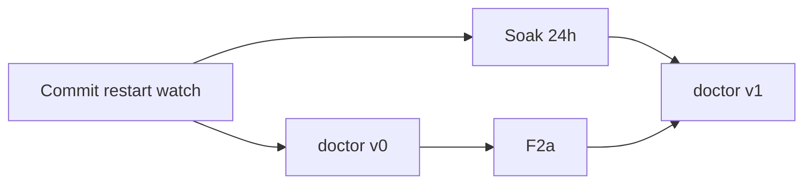

# convmem Roadmap — Lauer (canonical host)

North-star for convmem on **one machine**: lauer miniPC owns `~/.local/share/convmem/chroma/`, runs watch/refine/monitor, serves MCP.

**Axes:** (1) Ops stability — watch, doctor, F2a, locks. (2) Agent workflow — `unresolved` + MCP `open` only.

---

## Phased roadmap (revised)

```text
Now (pre-flight):  commit tree, ensure mcp installed, restart watch, verify-continue PASS
Now (doctor v0):   doctor.py + convmem.py — reuse brief.py
P0 (watch):        verify RSS <512MB after 24h soak (fix coded — soak starts at restart)
P0 (F2a):          get_units_with_embeddings, ask dedupe, ledger_id index
P0 (doctor v1):    RSS soak result, locks, systemd
P1a:               unresolved + ledger_id index + recency_weight
P1b:               eval harness (10 golden queries)
P2:                MCP unresolved/open + brief(compact)
P3:                OpenClaw, dedupe, hybrid retrieval, export --redact
```

### Efficient sequencing

1. **Commit + restart watch** — deploy subprocess fix; start 24h soak clock
2. **Build doctor v0** — while soak runs
3. **F2a** — parallel during soak (small, independent)
4. **Doctor v1** — validates soak RSS + locks + systemd

Do not build doctor first, then start soak, then wait.



---

## Pre-flight (~10 min)

| Fix | Effort | Why |
|-----|--------|-----|
| Commit working tree | git commit | Watch subprocess fix uncommitted; PID on old code (~3.5GB RSS) |
| Restart watch | `systemctl --user restart convmem-watch` | Deploy fix; start soak |
| Ensure `mcp` installed | `pip install mcp` | doctor v0 + tests import mcp; pin at [`requirements.txt`](../requirements.txt) line 9 |
| verify-continue PASS | smoke | Doctor v0 dependency; uses `$CONVMEM_ROOT` |

**Done when:** committed + watch restarted + mcp import OK + verify-continue PASS.

---

## Now (doctor v0)

`convmem doctor` — reuse [`brief.py`](../brief.py), exit codes. Checks: Ollama, key, Chroma, corpus, MCP, verify-continue.

**Done when:** doctor exits 0; MCP `brief` without Bash ([`CONTINUE-VERIFY.md`](inter-model/CONTINUE-VERIFY.md)).

---

## Success criteria

| Check | PASS |
|-------|------|
| Watch soak | RSS < 512MB / 24h with committed fix |
| Doctor | `convmem doctor` exit 0 |
| MCP | Agent calls `brief` without Bash |
| Corpus | `search_fast` hits staging2 ledger facts |

---

## P0 — stability

- **Watch:** fix coded in [`watch.py`](../watch.py) — pre-flight deploys it; doctor v1 validates soak
- **F2a:** [`F2a-SCOPING.md`](F2a-SCOPING.md)
- **Doctor v1:** RSS threshold, locks, systemd
- **Rerank:** measure before enabling CUDA

## P1a / P1b / P2 / P3

- **P1a:** `unresolved`, `recency_weight`, JSONL upsert sync
- **P1b:** eval harness gates P2/P3
- **P2:** MCP `unresolved`, `open`, `brief(compact)` if graded sessions fail
- **P3:** OpenClaw, dedupe, hybrid (eval-gated), export --redact

---

## Avoid

Cloud corpus; MCP auto-writes; auto-merge dedupe; full reindex routine; hybrid without eval; watch healthy before soak; doctor before pre-flight commit+restart.
