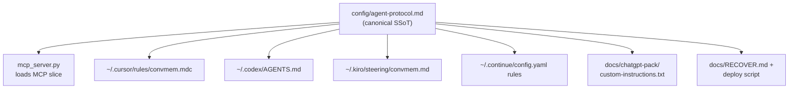
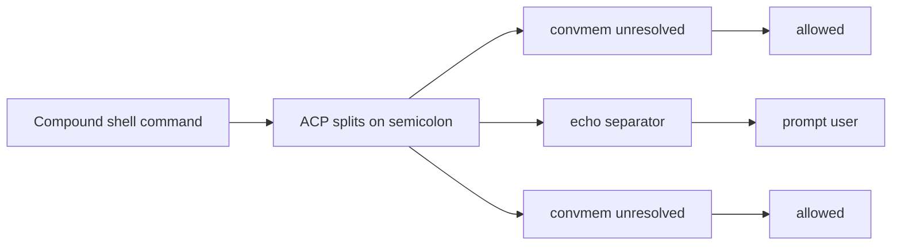
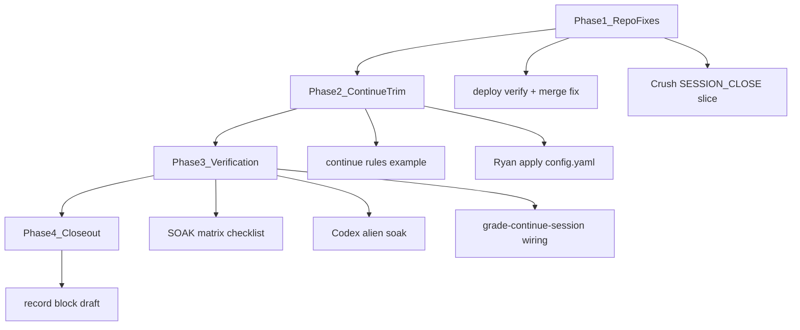
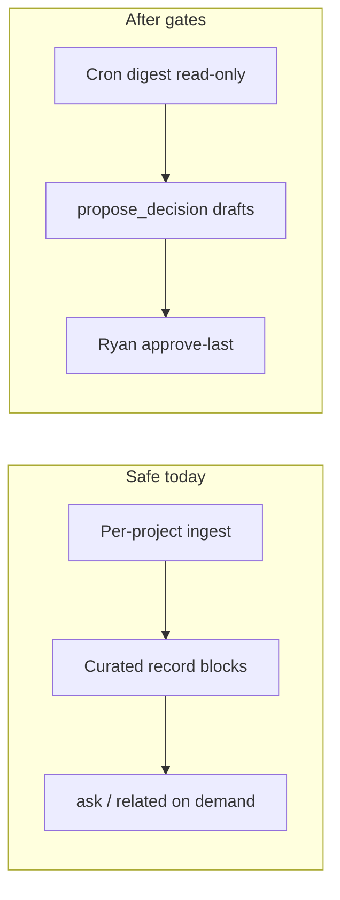
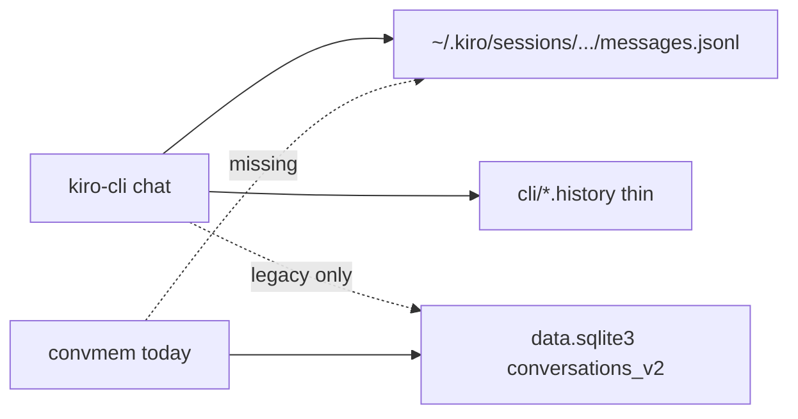

# Built plans archive — 2026-06-24 through 2026-06-29

**Compiled:** 2026-06-29  
**Scope:** Resulting / built Cursor and repo plans from the last five days of convmem work.  
**Rule:** Includes narrowed or executed plans only — **not** brainstorm or draft originals.

## Index

| # | Date | Built plan | Skipped original | Status | Builder lens |
|---|------|------------|------------------|--------|--------------|
| 1 | 2026-06-24 | `convmem_lauer_roadmap_fed70be7.plan.md` | convmem_improvement_brainstorm_7bc56912.plan.md (same-day brainstorm) | Mostly shipped — see docs/ROADMAP-DRAFT.md (P0–P1b complete; P2 gated) | ouster, manning, zeller |
| 2 | 2026-06-25 | `GLOBAL-CONVMEM-PROTOCOL-PLANNER.md` | docs/inter-model/*gap-analysis* and critique docs | Shipped — all todos done | ouster |
| 3 | 2026-06-25 | `docs/inter-model/PLAN-2026-06-25-surface-coverage.md` | — (post-soak follow-on, not a revision) | Crush/Continue/Kiro done; Cursor soak ongoing | ouster, zeller |
| 4 | 2026-06-28 | `kiro_echo_permissions_1d403638.plan.md` | — | Shipped — all todos completed | ouster |
| 5 | 2026-06-28 | `protocol_gap_fixes_2eb5f259.plan.md` | — | Shipped — all todos completed | ouster, zeller |
| 6 | 2026-06-29 | `cross-project_synth_agent_aa58015f.plan.md` | — | Decision: defer Phase 2 autonomous agent; Phase 1 digest shipped | hard-parts |
| 7 | 2026-06-29 | `searchable_cli_chats_ffb9fcf6.plan.md` + [PLAN-2026-06-29-searchable-cli-chats-HANDOFF.md](PLAN-2026-06-29-searchable-cli-chats-HANDOFF.md) | searchable_cli_chats_a8f383f4.plan.md (wrong "Kiro IDE" label) | Code shipped; Ryan backfill + Phase 3 verify pending | manning, ddia |

**Not included:** `session_record_block_e5c9879d.plan.md` (session-close copy-paste block only).

**Source locations:**
- Cursor plans: `~/.cursor/plans/*.plan.md`
- Repo plans: `GLOBAL-CONVMEM-PROTOCOL-PLANNER.md`, `docs/inter-model/PLAN-2026-06-25-surface-coverage.md`

---


---

# Plan 1: convmem lauer roadmap

**Date:** 2026-06-24  
**Source:** `convmem_lauer_roadmap_fed70be7.plan.md`  
**Skipped original:** convmem_improvement_brainstorm_7bc56912.plan.md (same-day brainstorm)  
**Status at compile:** Mostly shipped — see docs/ROADMAP-DRAFT.md (P0–P1b complete; P2 gated)

---
name: convmem lauer roadmap
overview: "Single-host roadmap for convmem on the lauer miniPC: stabilize watch/doctor/F2a first, then ledger search, eval harness, and narrow MCP improvements."
todos:
  - id: now-doctor-v0
    content: "Now: convmem doctor v0 (doctor.py + convmem.py), reuse brief.py; verify-continue PASS"
    status: pending
  - id: p0-watch-memory
    content: "P0: fix watch RSS (<512MB/24h) in watch.py/ingest.py"
    status: pending
  - id: p0-f2a
    content: "P0: F2a — get_units_with_embeddings, ask dedupe, ledger_id index"
    status: pending
  - id: p0-doctor-v1
    content: "P0: doctor v1 — RSS, locks, systemd"
    status: pending
  - id: p1a-unresolved
    content: "P1a: unresolved + recency_weight + JSONL upsert sync"
    status: pending
  - id: p1b-eval
    content: "P1b: golden eval harness (10 queries + ledger_ids)"
    status: pending
  - id: p2-mcp
    content: "P2: MCP unresolved/open + brief(compact) if graded sessions fail"
    status: pending
  - id: graduate-roadmap
    content: "P0 ship: ROADMAP-DRAFT → ROADMAP.md + README link"
    status: pending
isProject: false
---

# convmem Roadmap — Lauer (canonical host)

North-star for convmem on **one machine**: lauer miniPC owns `~/.local/share/convmem/chroma/`, runs watch/refine/monitor, serves MCP to Cursor/Continue/Crush.

**Live signals (2026-06-24):** ~1,364 units; watch RSS ~3.5GB; rerank off; 263 units `general`; daemons active.

**Axes:** (1) Ops stability — watch, doctor, F2a, locks. (2) Agent workflow — `unresolved` + MCP `open` only.

## Phased roadmap

```text
Now:     doctor v0 + verify-continue PASS
P0:      watch memory → F2a → doctor v1
P1a:     unresolved + ledger_id index + recency_weight
P1b:     eval harness (10 golden queries)
P2:      MCP unresolved/open + brief(compact)
P3:      OpenClaw, dedupe, hybrid retrieval, export --redact
```

## Success criteria

| Check | PASS |
|-------|------|
| Watch soak | RSS < 512MB after 24h (today ~3.5GB) |
| Corpus | `brief` + `search_fast` hit staging2 ledger facts |
| MCP | Agent calls `brief` without Bash ([CONTINUE-VERIFY.md](docs/inter-model/CONTINUE-VERIFY.md)) |
| Doctor | `convmem doctor` exits 0 |

## Now — doctor v0

Single command: `convmem doctor` (no separate preflight).

**Checks:** Ollama, `DEEPSEEK_API_KEY`, Chroma, corpus count, MCP config, `verify-continue.sh` smoke.

**Build:** New [doctor.py](doctor.py) + typer in [convmem.py](convmem.py). Reuse [brief.py](brief.py) helpers — not a parallel implementation.

## P0 — stability

1. **Watch memory** — fix leak in [watch.py](watch.py)/[ingest.py](ingest.py); target <512MB/24h; block "watch healthy" until PASS.
2. **F2a** — [F2a-SCOPING.md](docs/F2a-SCOPING.md): `get_units_with_embeddings()`, ask `ledger_id` dedupe, [ledger.py](ledger.py) index.
3. **Doctor v1** — RSS, watch/refine locks + PID, systemd state.
4. **Rerank** — measure CPU latency before enabling CUDA ([rerank.py](rerank.py)).

Local single-writer: existing `watch.lock`/`refine.lock`; doctor detects stale locks; optional refuse second watch.

## P1a — ledger + search

- `convmem unresolved` — open obs without passing verification
- `recency_weight` — [config.example.toml](config.example.toml), [query.py](query.py)
- JSONL sync on upsert — [observe.py](observe.py)

## P1b — eval harness

10 queries + expected `ledger_id`s. Measures P1a before hybrid retrieval or more MCP.

## P2 — MCP narrow

If [grade-continue-session.sh](scripts/grade-continue-session.sh) shows MCP bypass: `unresolved`, `open` ([open_source.py](open_source.py)), `brief(compact=true)`. Defer session-close automation.

## P3 — backlog

OpenClaw, dedupe UX, git/PR evidence, hybrid retrieval (eval-gated), `export --redact`, domain backfill in brief.

In-repo one-screen copy: [docs/ROADMAP-DRAFT.md](docs/ROADMAP-DRAFT.md) → `ROADMAP.md` when P0 ships.

## Avoid

Cloud corpus; MCP auto-writes; auto-merge dedupe; routine full reindex; hybrid without eval; watch healthy before soak PASS.


---

# Plan 2: Global convmem protocol

**Date:** 2026-06-25  
**Source:** `GLOBAL-CONVMEM-PROTOCOL-PLANNER.md`  
**Skipped original:** docs/inter-model/*gap-analysis* and critique docs  
**Status at compile:** Shipped — all todos done

---
name: Global convmem protocol
overview: Create a single canonical agent protocol in the convmem repo, expand MCP instructions to carry it to every MCP client, deploy global Cursor/Codex/Kiro/Continue/ChatGPT surfaces on your machine, and document recovery so instructions follow you across workspaces.
todos:
  - id: canonical-protocol
    content: "Gap 1+3+6: config/agent-protocol.md — doctor→brief→unresolved; 3 tiers; Codex sandbox; trim AGENTS.md to pointer"
    status: done
  - id: protocol-generator
    content: "Gap 3: generate-agent-protocol.sh — per-surface slices from SSoT (not one-size-fits-all)"
    status: done
  - id: mcp-instructions
    content: "Gaps 4+5+9: mcp_server.py — shell-first order, docstrings, unresolved_count"
    status: done
  - id: surface-templates
    content: Add config/*.example files (generated from canonical); verify Kiro frontmatter preserved
    status: done
  - id: chatgpt-pack
    content: Create docs/chatgpt-pack/ with custom-instructions.txt + README
    status: cancelled
  - id: deploy-script
    content: "Gaps 2+7: deploy-agent-protocol.sh — .md→.mdc migration, path detection, deploy report"
    status: done
  - id: user-deploy
    content: Run generator + deploy; remove convmem.md; sync Codex/Kiro
    status: done
  - id: verify
    content: "Gap 8: alien-workspace matrix — blank repo, no repo, MCP-only, paste-only, nonstandard HOME"
    status: done
  - id: crush-deploy
    content: "Phase 2 Priority 1: Crush Tier A slice (shell doctor→brief); deploy to ~/.config/crush/rules/convmem.md — retest soak #9"
    status: done
  - id: continue-stanza
    content: "Phase 2 Priority 2: session-start stanza in ~/.continue/config.yaml — verified soak #10"
    status: done
  - id: kiro-mcp-wiring
    content: "Phase 2 Priority 3: kiro-mcp.json.example + deploy script; Ryan enables MCP in Kiro Settings"
    status: done
isProject: false
---

# Global convmem protocol — instructions follow the human

## Problem

Session ritual lives in `[AGENTS.md](/home/lauer/Projects/convmem/AGENTS.md)` (repo-local). Cursor only has corpus protection globally (`[convmem-protected-paths.mdc](/home/lauer/.cursor/rules/convmem-protected-paths.mdc)`). MCP `[instructions=](/home/lauer/Projects/convmem/mcp_server.py)` is a 4-line stub. Opening `~/WordPress/willowyhollow-practice/` or a Codex session on another repo → blank-slate agents.

## Architecture




**Design principle:** one markdown source in the repo; **generated** per-surface artifacts deployed into each tool's **user-level config** (not "one repo file magically covers every workspace"). Repo `[AGENTS.md](/home/lauer/Projects/convmem/AGENTS.md)` becomes a short pointer + repo-specific notes.

**Critiques incorporated** (from [`MERGED-GAP-ANALYSIS-2026-06-25.md`](/home/lauer/Projects/convmem/docs/inter-model/MERGED-GAP-ANALYSIS-2026-06-25.md), [`GLOBAL-PLANNER-GAP-ANALYSIS.md`](/home/lauer/Projects/convmem/docs/inter-model/GLOBAL-PLANNER-GAP-ANALYSIS.md), [`CODEX-2026-06-25-global-convmem-protocol-insights.md`](/home/lauer/Projects/convmem/docs/inter-model/CODEX-2026-06-25-global-convmem-protocol-insights.md), [`CODEX-2026-06-25-global-planner-critique-summary.md`](/home/lauer/Projects/convmem/docs/inter-model/CODEX-2026-06-25-global-planner-critique-summary.md)):

**Verdict (merged):** architecture is correct; **9 gaps**, **2 blockers**. Ship with all 9 filled → agents run `doctor → brief → unresolved` from any folder.

| # | Gap | Severity | Resolution |
|---|-----|----------|------------|
| 1 | Protocol-order conflict (AGENTS.md vs planner) | **Blocker** | Canonical order: **`doctor → brief → unresolved`** (shell); `brief()` first only when no shell. Trim `AGENTS.md` to pointer so convmem repo doesn't double-load ritual |
| 2 | `.md` → `.mdc` Cursor format | **Blocker** | Deploy script removes stale `convmem.md`, writes `convmem.mdc` with `alwaysApply: true` |
| 3 | Capability tiers (shell / MCP-only / paste) | High | Three tiers as structural spine; generator emits per-surface slice |
| 4 | MCP shell fallback in instructions | High | MCP slice: if Bash available, run doctor+unresolved per Tier A order |
| 5 | `brief` docstring "call first" | High | Prepend to `brief()`; add note to `search_fast()` |
| 6 | Codex sandbox in canonical SSoT | Medium-high | Model-specific notes section flows to all surfaces |
| 7 | Path detection in deployer | Medium | Discover `$HOME`, probe for rules dirs; don't hardcode only `~/.cursor/rules/` |
| 8 | Alien workspace verification matrix | Medium | Per-scenario matrix (below), not just per-tool |
| 9 | `unresolved_count` in MCP instructions | Medium | Mandate checking brief payload field before proceeding |

---

## Capability tiers (canonical protocol structure)

Single [`config/agent-protocol.md`](/home/lauer/Projects/convmem/config/agent-protocol.md) with three tiers — generator emits each surface's relevant slice:

### Tier A — shell-capable (Cursor, Codex, Kiro, Continue-with-Bash)

```text
1. convmem doctor          # exit 0 required before ask/search
2. convmem brief --stdout-only   # or MCP brief() if MCP connected
3. convmem unresolved      # add --site <hostname> for client work
4. search_fast / ask before guessing on history questions
```

### Tier B — MCP-only (no shell, MCP connected)

```text
1. brief() first every session (optional project=repo-slug)
2. Check unresolved_count in brief response; if >0, note open issues
3. search_fast before guessing; ask for decisions
4. related() for evidence chains
```

### Tier C — paste-only (ChatGPT webUI)

```text
Ask Ryan for: convmem brief --stdout-only
Interpret pasted output; suggest convmem record blocks at session close
Cannot run CLI — do not pretend to call convmem
```

**Canonical startup order (Gap 1 — blocker, pick one):**

```text
Shell-capable:   doctor → brief → unresolved → search_fast/ask
MCP-only:        brief() → unresolved_count → search_fast/ask
Paste-only:      wait for Ryan to paste brief --stdout-only
```

**Decision:** `doctor → brief → unresolved` wins for all shell paths (matches existing `AGENTS.md`, merged bottom line). MCP `brief()` is first **only** when the agent has no shell. Agents with **both** shell and MCP follow shell order: run `doctor` before calling MCP `brief()` or CLI `brief`.

**Runtime decision tree** (Codex structural spine):

```text
if shell:         doctor → brief → unresolved
elif MCP:         brief → search_fast → ask  (+ check unresolved_count)
elif paste-only:  wait for brief text from user
```

---

## 1. Canonical protocol file (repo)

**New:** `[config/agent-protocol.md](/home/lauer/Projects/convmem/config/agent-protocol.md)`

Sections (aligned with existing `[AGENTS.md](/home/lauer/Projects/convmem/AGENTS.md)` + `[SESSION-CLOSE-RECORD.md](/home/lauer/Projects/convmem/docs/inter-model/SESSION-CLOSE-RECORD.md)`):


| Section                   | Content                                                                                                          |
| ------------------------- | ---------------------------------------------------------------------------------------------------------------- |
| Identity                  | "convmem exists on this machine; do not ask what it is"                                                          |
| **Tier A — shell**        | `doctor` (exit 0) → `brief` → `unresolved` (`--site` for client work) → `search_fast`/`ask` before guessing      |
| **Tier B — MCP-only**     | `brief()` first → check `unresolved_count` → `search_fast`/`ask`/`related`                                     |
| **Tier C — paste-only**   | Ask Ryan for `brief --stdout-only`; interpret; suggest record blocks at close                                    |
| **Model-specific notes**  | Codex sandbox: if `ask` fails with network error, `bash -lc 'convmem ask "..."'` or approve network once; repo `.codex/config.toml` for `network_access = true` |
| When to query             | Past decisions, architecture, client sites, anything that might repeat prior work                                |
| Session close             | Pointer to `SESSION-CLOSE-RECORD.md`; `--relates-to` must be ledger id; fallback `dec_prop_20260623_161428_c311` |
| Read-only guard           | No `add`/`index`/`verify` without Ryan                                                                           |
| Tool lanes                | One-liner per model from `[docs/AGENT-ROLES.md](/home/lauer/Projects/convmem/docs/AGENT-ROLES.md)`               |

**Generated outputs** (from `scripts/generate-agent-protocol.sh`):

| Output | Source tier |
|--------|-------------|
| `config/agent-protocol-mcp.txt` | Tier B + shell preamble + Codex retry note |
| `config/cursor-rules-convmem.mdc.example` | Tier A + B (Cursor has both) + frontmatter |
| `config/codex-agents-convmem.example.md` | Tier A + model-specific notes |
| `config/kiro-steering-convmem.example.md` | Tier A (Kiro frontmatter preserved) |
| `docs/chatgpt-pack/custom-instructions.txt` | Tier C only |

Do **not** hand-edit generated files — edit canonical and re-run generator.

**Trim `[AGENTS.md](/home/lauer/Projects/convmem/AGENTS.md)`:** replace duplicated ritual with pointer only (Gap 1 — prevents double-load when Cursor reads both global `convmem.mdc` and repo `AGENTS.md`):

```markdown
## convmem protocol
Canonical: `config/agent-protocol.md` (generated surfaces via `scripts/generate-agent-protocol.sh`).
Repo-specific only: `.codex/config.toml.example` for sandbox network in this repo.
Do not duplicate session-start steps here — they live in the global rule.
```

---

## 2. MCP instructions expansion (highest ROI)

**Edit:** `[mcp_server.py](/home/lauer/Projects/convmem/mcp_server.py)`

- Add `_load_mcp_instructions()` reading generated `config/agent-protocol-mcp.txt` at startup; fall back to inline string if file missing.
- Replace current 4-line `instructions=` with full session protocol.

**MCP instructions must include (Gaps 4, 6, 9):**

1. **If shell available (Tier A order):** `convmem doctor` (exit 0) → call `brief` → `convmem unresolved` (`--site` for client work)
2. **If MCP-only (no shell):** call `brief` first (optionally `project=repo-slug`) — this is when "call brief first" applies
3. **Check `unresolved_count`** in brief response; if >0, surface open issues before proceeding
4. Before answering history/architecture questions: `search_fast` then `ask` with citations
5. If synthesis fails with network error: retry with `bash -lc 'convmem ask "..."'`
6. `related()` for evidence chains
7. Read-only on MCP; durable writes = CLI `convmem record` + `--approve-last`
8. Session close: real ledger ids only; never topic slugs; fallback c311

**Tool docstrings (Gap 2 — low effort, high leverage):**

- `brief()`: prepend **"Call this first every session."** to docstring
- `search_fast()`: add **"For prior work, use this before guessing."**

No new MCP tools in this pass (P2 gate unchanged). When P2 `unresolved` MCP tool ships, remove shell preamble and promote to first-class tool.

---

## 3. Cursor global rule (priority 1)

**New template:** `[config/cursor-rules-convmem.mdc.example](/home/lauer/Projects/convmem/config/cursor-rules-convmem.mdc.example)`

```yaml
---
description: convmem cross-session memory — session start/close protocol
alwaysApply: true
---
```

Body: full `config/agent-protocol.md` content (MCP + shell paths; Cursor has both MCP and shell).

**Deploy to your machine:** copy generated → `[~/.cursor/rules/convmem.mdc](/home/lauer/.cursor/rules/convmem.mdc)`

**Gap 4 migration (blocker):** existing `~/.cursor/rules/convmem.md` has **no effect** — Cursor only applies `alwaysApply` via `.mdc` frontmatter. Deploy script must:

1. Detect `~/.cursor/rules/convmem.md` → warn, remove it
2. Write `convmem.mdc` with `alwaysApply: true`
3. Leave `convmem-protected-paths.mdc` untouched

Keep `[convmem-protected-paths.mdc](/home/lauer/.cursor/rules/convmem-protected-paths.mdc)` separate (corpus tiers vs session ritual).

**Verify:** open a non-convmem workspace (e.g. `~/WordPress/willowyhollow-practice/`) → rule appears in always-applied rules; agent should call `brief` or run `convmem doctor` without project `AGENTS.md`.

---

## 4. Codex global (priority 3)

**Existing:** `[~/.codex/AGENTS.md](/home/lauer/.codex/AGENTS.md)` already has convmem ritual.

**New template:** `[config/codex-agents-convmem.example.md](/home/lauer/Projects/convmem/config/codex-agents-convmem.example.md)` — canonical protocol + Codex sandbox/network block (from current file).

**Deploy:** sync `~/.codex/AGENTS.md` from template. Codex loads this globally regardless of repo.

Note: your table mentioned `~/.codex/instructions.md`; this machine uses `AGENTS.md` (confirmed). No `instructions.md` unless Codex adds it later — document the actual path in RECOVER.

---

## 5. Kiro + Continue sync


| Surface      | Action                                                                                                                                                                                                                                                |
| ------------ | ----------------------------------------------------------------------------------------------------------------------------------------------------------------------------------------------------------------------------------------------------- |
| **Kiro**     | New `[config/kiro-steering-convmem.example.md](/home/lauer/Projects/convmem/config/kiro-steering-convmem.example.md)`; deploy → `[~/.kiro/steering/convmem.md](/home/lauer/.kiro/steering/convmem.md)` (preserve Kiro frontmatter: `inclusion: auto`) |
| **Continue** | Slim `[~/.continue/config.yaml](/home/lauer/.continue/config.yaml)` `rules:` to reference MCP instructions + session-close block only (avoid triple-storing full protocol; MCP expansion covers session start)                                        |


---

## 6. ChatGPT pack (priority 4)

**New:** `[docs/chatgpt-pack/README.md](/home/lauer/Projects/convmem/docs/chatgpt-pack/README.md)` + `[docs/chatgpt-pack/custom-instructions.txt](/home/lauer/Projects/convmem/docs/chatgpt-pack/custom-instructions.txt)`

Content:

- Paste-only lane: ask Ryan for `convmem brief --stdout-only` at session start
- Cannot run CLI; can interpret pasted brief and suggest `convmem record` blocks
- Link to `SESSION-CLOSE-RECORD.md` for close ritual

Ryan copies `custom-instructions.txt` into ChatGPT Settings → Personalization → Custom instructions (one-time).

---

## 7. Generator + deploy + recovery

**New:** `[scripts/generate-agent-protocol.sh](/home/lauer/Projects/convmem/scripts/generate-agent-protocol.sh)`

Reads `config/agent-protocol.md`, emits all surface templates (MCP txt, Cursor `.mdc.example`, Codex/Kiro examples, ChatGPT custom-instructions). Single edit point — prevents drift.

**New:** `[scripts/deploy-agent-protocol.sh](/home/lauer/Projects/convmem/scripts/deploy-agent-protocol.sh)`

1. Run generator first
2. **Path detection (Gap 7):** resolve `$HOME`; probe `$HOME/.cursor/rules`, `$HOME/.codex`, `$HOME/.kiro/steering` (and common alternates if missing); warn and skip gracefully — do not assume standard layout only
3. **Cursor (Gap 2):** remove stale `convmem.md`, deploy `convmem.mdc` with `alwaysApply: true`
4. **Codex:** sync `AGENTS.md` from generated template (full replace)
5. **Kiro:** sync steering file; preserve `inclusion: auto` frontmatter
6. Print reminders for Continue (manual YAML trim) and ChatGPT (paste custom instructions)
7. Emit deploy report: paths written, files removed, surfaces skipped

**Update:** `[docs/RECOVER.md](/home/lauer/Projects/convmem/docs/RECOVER.md)` fast path — step 8: `scripts/deploy-agent-protocol.sh`

**Update:** `[docs/AGENT-ROLES.md](/home/lauer/Projects/convmem/docs/AGENT-ROLES.md)` — note canonical path + capability tier per model.

---

## 8. Verification matrix (Gap 8)

Per-scenario matrix (Codex) + per-tool checks (Continue):

| Scenario | Surface | Pass criteria |
|----------|---------|---------------|
| Blank repo, no `AGENTS.md` | Cursor | `convmem.mdc` in always-applied rules; agent runs `doctor` then `brief` unprompted |
| convmem repo (no double ritual) | Cursor | Global rule + trimmed `AGENTS.md` — same `doctor → brief → unresolved` order, no conflict |
| Non-convmem repo with shell | Codex | `~/.codex/AGENTS.md` drives `doctor → brief → unresolved` |
| No git repo (`/tmp`, empty dir) | Cursor/Codex | Global config still loads; protocol runs without project files |
| MCP connected, shell available | Continue | Expanded MCP instructions; shell `doctor` before `brief` on history questions |
| MCP only, no shell | MCP metadata | Tier B instructions; `unresolved_count` check mandated |
| No MCP, no shell | ChatGPT | Custom instructions ask Ryan for `brief --stdout-only` |
| Nonstandard `$HOME` | Deploy script | Path detection finds or warns; no silent skip |
| Post-deploy health | CLI | `convmem doctor` exit 0 |

Optional: run `[scripts/grade-continue-session.sh](/home/lauer/Projects/convmem/scripts/grade-continue-session.sh)` on a test Continue chat.

### Implementation order (merged priority — all 9 gaps)

1. **Gap 1** — Resolve protocol-order: `doctor → brief → unresolved`; trim repo `AGENTS.md` to pointer
2. **Gap 2** — `.md` → `.mdc` Cursor migration + `alwaysApply: true`
3. **Gap 3** — Capability tiers in canonical protocol
4. **Gap 4** — MCP shell fallback in `instructions=`
5. **Gap 5** — `brief` / `search_fast` docstrings
6. **Gap 6** — Codex sandbox override in canonical SSoT
7. **Gap 7** — Path detection in deploy script
8. **Gap 8** — Alien workspace verification matrix (this section)
9. **Gap 9** — `unresolved_count` mandate in MCP instructions

---

## Post-deployment status (2026-06-25)

**Global protocol rollout: shipped.** Generator, deploy script, MCP instructions, Cursor `.mdc`, Codex/Kiro sync, `AGENTS.md` pointer — all done. Entering **~1 week CLI soak** per [`ROADMAP-DRAFT.md`](/home/lauer/Projects/convmem/docs/ROADMAP-DRAFT.md): observe whether agents follow the protocol now that it's deployed globally. Eval is 10/10; this gate is **agent habit**, not search quality.

### Bucket 1 — Manual steps (Ryan only)

| Item | Action | Why agent can't do it |
|------|--------|----------------------|
| **Continue trim** | Slim `~/.continue/config.yaml` `rules:` to session-close block only (MCP covers session start) | File protected from agent writes |
| **ChatGPT paste** | ~~Paste custom instructions~~ | **Ignored** — pack remains in repo (`docs/chatgpt-pack/`) for reference only |

Optional quick win: qualify `brief()` docstring (*"when shell unavailable"*) if soak shows agents skipping `doctor`.

### Bucket 2 — convmem infra roadmap (soak → P2 → P3)

**Now (~1 week):** graded sessions / Cursor transcripts — do agents run `doctor → brief → unresolved` without prompting?

**P2** (gate: agents still bypass CLI/MCP despite global protocol):
- MCP `unresolved` tool (shell fallback in instructions is interim workaround)
- MCP `open` tool ([`open_source.py`](/home/lauer/Projects/convmem/open_source.py))
- `brief(compact=true)`

**P3** (later):
- Index `docs/inter-model/*.md` into Chroma
- Change-feed — deferred **2026-07-07**
- OpenClaw, dedupe approval UI, hybrid retrieval, domain backfill in brief

### Bucket 3 — Client work (not convmem infra)

**staging2.willowyhollow.com** — 6 unresolved medium security headers (CSP, HSTS, Referrer-Policy + 3 failed re-verifications). Per ROADMAP: don't let client deploy masquerade as convmem work. Blocked on Ryan if/when client lane is active.

### Alien-workspace spot-check (soak verification)

Open `~/WordPress/willowyhollow-practice/` (or any repo without `AGENTS.md`) → agent should run `doctor` then `brief` unprompted. Single test that proves "instructions follow the human."

---

## Phase 2 — Surface coverage gap (post-soak, 2026-06-25)

**Trigger:** Soak data (6 sessions, 3 surfaces). MCP `instructions=` channel failed to carry protocol to Continue and Crush. `.mdc` drives Cursor; non-Cursor surfaces need their own deployed slices.

**Diagnosis:**
- **Cursor** — protocol loaded but order wrong (MCP `brief()` before `doctor` in 1/2 alien sessions). Insufficient data for structural `.mdc` changes.
- **Continue** — protocol not loaded at all (session #5: zero convmem use, List/Bash/Read only). `config.yaml` rules + MCP `instructions=` both ignored by DeepSeek V4 Flash.
- **Crush** — protocol not loaded at all (session #6: zero convmem use, MCP initialized but never invoked). Stale pre-protocol rules file at confirmed path. **Fixed** via Tier B rules deploy.
- **Kiro** — steering + shell (Tier A) deployed at `~/.kiro/steering/convmem.md`; **MCP not wired** (`~/.kiro/settings/mcp.json` absent). Kiro CLI session (2026-06-28) indexed setup steps in corpus (`tooling.kiro`); `convmem ask` retrieval verified. MCP is an upgrade, not the only path.

### Phase 2 priority — status

| Priority | Surface | Action | Owner | Status |
|----------|---------|--------|-------|--------|
| 1 | **Crush** | Tier A shell slice; deploy to `~/.config/crush/rules/convmem.md` | Agent | ✅ **Done** — soak #9 PASS |
| 2 | **Continue** | Add terse session-start stanza to top of `rules:` in `~/.continue/config.yaml` | **Ryan** (file protected) | ✅ **Done** — soak #10 PASS (qwen3-coder:30b) |
| 3 | **Kiro MCP** | Repo example + deploy script; then enable MCP in Kiro Settings | Agent + **Ryan** | ✅ **Deployed** — enable MCP in Settings + restart (Ryan) |
| 4 | **Cursor** | Observe ≥3 alien sessions before `.mdc` section-header changes | Agent (soak) | 🔄 n=1 so far |
| 5 | **ChatGPT** | Paste pack into Custom instructions | Ryan | **Ignored** (2026-06-29 — not in Ryan's workflow) |

**P2 gate:** Do not accelerate MCP `unresolved`/`open` tools. Fix surface coverage first, then re-evaluate.

### Continue stanza (revised per Planner review)

MCP-first with shell fallback, two lines:

```yaml
- Session start: call MCP `brief` (project= if known). If shell is available, run `convmem doctor` first (must exit 0).
- Before answering history/architecture: MCP `search_fast` then `ask` — do not repo-survey first.
```

### Kiro MCP wiring (Priority 3)

**Not urgent for soak** (Kiro wasn't in the Continue/Crush failure class). **Worth automating** for RECOVER parity with Cursor/Continue/Crush.

**Already works:** `~/.kiro/steering/convmem.md` — Tier A shell (`doctor → brief → unresolved`). Keep steering; do not replace with MCP-only.

**Missing:** User-level MCP at [`~/.kiro/settings/mcp.json`](https://kiro.dev/docs/mcp/configuration/) (same `mcpServers` shape as Cursor). Adds structured tools + `mcp_server.py` `instructions=`.

**Repo automation (agent):**

1. Add `config/kiro-mcp.json.example` (mirror `cursor-mcp.json.example`; no hardcoded API key — use `REPLACE_ME` or `${DEEPSEEK_API_KEY}`)
2. Extend `scripts/deploy-agent-protocol.sh`: probe `$HOME/.kiro/settings/`, mkdir if needed, copy example → `mcp.json`
3. Update `docs/RECOVER.md` fast path + `docs/AGENT-ROLES.md` Kiro row (steering + MCP)

**Manual steps (Ryan — cannot automate):**

1. Run deploy script (or copy example once)
2. **Restart Kiro** after deploy (MCP server must reload)
3. **`permissions.yaml`** in `~/.kiro/settings/` — IDE 1.0+ ACP allow rules for convmem shell + MCP (see `config/kiro-permissions.yaml.example`); deploy script merges on run. **`mcp.json autoApprove` is not read by vibe mode.**
4. Verify tools: `brief`, `search_fast`, `ask`, `related`, `stats` (Kiro IDs: `mcp_convmem_*`)

**Corpus note (2026-06-28):** Kiro CLI indexed setup caveats under `tooling.kiro`; `convmem ask` verified retrieval. CLI `convmem add` accepts only `--type observation` (not `explanation`/`decision`/etc.) — see `obs_d348798e5fdd`.

**What automation does not fix:** MCP wiring ≠ session-start ritual; steering enforcement still needed.

### Crush slice — deployed

`~/.config/crush/rules/convmem.md` replaced with generated Tier B (MCP-only) slice:

- `brief()` first every session
- Check `unresolved_count` in brief response
- `search_fast`/`ask` before guessing
- `related()` for evidence chains
- Session close: real ledger ids only, never invent `--relates-to`

### Deploy script extensions

| Output | Deploy path |
|--------|-------------|
| `config/crush-rules-convmem.example.md` | `~/.config/crush/rules/convmem.md` |
| `config/kiro-mcp.json.example` | `~/.kiro/settings/mcp.json` |

Steering deploy unchanged: `config/kiro-steering-convmem.example.md` → `~/.kiro/steering/convmem.md`.

### Cursor `.mdc` — hold threshold

**Do not** add Tier A/B section headers to `convmem.mdc` until ≥3 Cursor alien sessions show the same order violation (session #2 is n=1). If session 7+ repeats: add `## If you have shell access` and `## If you have MCP only` headers between the two lists.

### Verification

- Open `~/WordPress/pavlomassage-practice/` in **Crush** → agent calls `brief()` first (MCP-only)
- Same dir in **Continue** → agent runs `doctor` or calls MCP `brief` before repo survey (after Ryan stanza)
- Any alien dir in **Kiro** → MCP tools visible after deploy + Settings enable; steering still drives shell ritual
- Log results in `docs/inter-model/SOAK-REPORT-2026-06-25.md`

---

## Out of scope (this pass)

- MCP `unresolved` / `open` tools (P2 gate — `[ROADMAP-DRAFT.md](/home/lauer/Projects/convmem/docs/ROADMAP-DRAFT.md)`)
- Crush global `~/.config/crush/system.md` (verify path first; document in chatgpt-pack README as optional)
- Indexing `docs/inter-model/*.md` into Chroma
- Change-feed ("what changed since last time?") — deferred 2026-07-07

---

## File touch summary


| File                                      | Change                             |
| ----------------------------------------- | ---------------------------------- |
| `config/agent-protocol.md`                | **new** — canonical SSoT (3 tiers) |
| `config/agent-protocol-mcp.txt`             | **generated** — MCP instructions   |
| `config/cursor-rules-convmem.mdc.example` | **generated**                      |
| `config/codex-agents-convmem.example.md`  | **generated**                      |
| `config/kiro-steering-convmem.example.md` | **generated**                      |
| `scripts/generate-agent-protocol.sh`      | **new** — SSoT → surfaces (incl. Crush) |
| `mcp_server.py`                           | load + expand `instructions=`; docstrings |
| `AGENTS.md`                               | pointer to canonical               |
| `docs/chatgpt-pack/*`                     | **generated** Tier C               |
| `scripts/deploy-agent-protocol.sh`        | **new** — migrate + deploy (incl. Crush) |
| `config/crush-rules-convmem.example.md`   | **generated** Tier B (MCP-only)    |
| `config/kiro-mcp.json.example`            | **new** — MCP wiring (Priority 3)  |
| `docs/RECOVER.md`, `docs/AGENT-ROLES.md`  | update (incl. Kiro MCP + enable step) |
| `~/.kiro/settings/mcp.json`               | **deploy** (after example added)   |
| `~/.cursor/rules/convmem.md`              | **remove** (stale, no effect)      |
| `~/.cursor/rules/convmem.mdc`             | **deploy**                         |
| `~/.codex/AGENTS.md`                      | **sync**                           |
| `~/.kiro/steering/convmem.md`             | **sync**                           |
| `~/.config/crush/rules/convmem.md`        | **deploy** (Tier B, MCP-only)      |
| `~/.continue/config.yaml`                 | **trim** rules block (manual — Ryan) |


---

# Plan 3: Post-soak surface coverage

**Date:** 2026-06-25  
**Source:** `docs/inter-model/PLAN-2026-06-25-surface-coverage.md`  
**Skipped original:** — (post-soak follow-on, not a revision)  
**Status at compile:** Crush/Continue/Kiro done; Cursor soak ongoing

# Post-soak surface coverage plan

**Date:** 2026-06-25  
**Author:** DeepSeek R1 (Continue)  
**Status:** Draft for Cursor Planner review  
**Prerequisite:** Soak data in `docs/inter-model/SOAK-REPORT-2026-06-25.md` (6 sessions, 3 surfaces)

---

## Problem statement

The global convmem protocol ships a canonical source-of-truth (`config/agent-protocol.md`) and deploys per-surface slices. Soak data shows **surface coverage is uneven**:

| Surface | Protocol deployed | Protocol reached agent? | Failure mode |
|---------|------------------|------------------------|--------------|
| Cursor | `convmem.mdc` alwaysApply | ✅ Loaded, but order wrong | brief() before doctor |
| Codex | `~/.codex/AGENTS.md` | ✅ (no soak data yet, assumed working) | — |
| Kiro | `~/.kiro/steering/convmem.md` | ✅ (no soak data yet, assumed working) | — |
| Continue | MCP instructions= + config.yaml rules | ❌ **Not loaded** | Agent ignored convmem entirely — no MCP tools, no shell commands |
| Crush | Stale pre-protocol rules file | ❌ **Not loaded** | MCP initialized but never invoked; old rules only mention search/ask, not session-start |

MCP `instructions=` — the channel we called "highest ROI" — did not carry protocol to Continue or Crush. The `.mdc` file is what actually drives Cursor behavior. For non-Cursor surfaces, we need something else.

---

## Surface-by-surface plan

### 1. Cursor — qualify the `.mdc` ordering (soak data: n=2 Cursor alien sessions, order wrong in 1)

**Problem:** `convmem.mdc` concatenates Tier A (doctor) and Tier B (brief-first) as two numbered lists, both starting with "1." An agent scanning top-down may latch onto the wrong first step.

**Evidence:** Session #2 (willowyhollow-practice): MCP brief() called before doctor. Session #3 (convem repo): correct order, but user had pointed at handoff. Inconclusive.

**Plan:** Do not change `.mdc` structure yet. Wait for ≥3 Cursor-only alien sessions with different task framings. Alternative: add a section header between Tier A and B (`## If you have shell access` / `## If you have MCP only`) so the two lists are visually separated.

**Gate:** If session 7+ shows same order violation, apply headers. If not, ship as-is.

---

### 2. Crush — deploy a global-protocol slice (soak data: session #6, zero convmem)

**Problem:** `~/.config/crush/rules/convmem.md` is pre-protocol. It mentions search/ask but has no session-start protocol (no doctor, no brief, no unresolved). Crush MCP is initialized (`crush.log` shows MCP clients loaded) but never invoked for convmem.

**Evidence:** Session #6 (pavlomassage-practice via Crush + DeepSeek V4 Flash): tools were ls/view/bash/glob/write only. Zero MCP brief/search_fast/ask. `loaded_total:0` skills on turn summary.

**Fix is clear.** Crush has a rules file path; it just needs current content.

**Implementation:**

1. Generate `config/crush-rules-convmem.md` from canonical SSoT (Tier B — MCP-only, no shell)
2. Deploy to `~/.config/crush/rules/convmem.md` (existing path, confirmed in session #6)
3. Preserve any Crush-specific frontmatter if needed (verify current file first)

**Output file:** `config/crush-rules-convmem.example.md`

---

### 3. Continue — shorten rules block (soak data: session #5, zero convmem)

**Problem:** `~/.continue/config.yaml` has a `rules:` block that already mentions convmem — but the agent didn't follow it. Two possible causes:

1. **Rules block is too long/verbose** — MCP `instructions=` also carried the protocol and was also ignored. The entire model may skip non-code channels.
2. **DeepSeek V4 Flash in Continue** may have different instruction-following behavior than Cursor's models.

**Evidence:** Session #5 (pavlomassage-practice via Continue + DeepSeek V4 Flash): List/Bash/Read/docker/curl only. No mode selection exists in Continue (user confirmed). MCP tools were available but not used.

**Fix should be minimal.** Add a terse session-start stanza to the top of the rules block. Do not duplicate the full protocol — just the Tier A shell order:

```yaml
rules:
  - Before answering: run `convmem doctor` (must exit 0), then `convmem brief --stdout-only`, then `convmem unresolved --site <hostname>`.
  - <existing rules...>
```

**Important:** Continue `config.yaml` is protected from agent writes. Ryan must apply this change. The plan should make the exact text copy-pasteable.

---

### 4. ChatGPT — still manual paste, unchanged

No new data. Still `docs/chatgpt-pack/custom-instructions.txt`. Ryan pastes when convenient.

---

### 5. Soak continuation — collect more Cursor alien sessions

The Cursor order-violation hypothesis is not yet confirmed (n=1). Keep testing:

- Open a non-convmem directory in Cursor
- Ask a work-relevant question (not "what's the state?" — different framing)
- Observe: does doctor run first?
- Log in SOAK-REPORT.md

---

### 6. P2 gate — do not accelerate

Session #5 and #6 might look like P2 signal (agents bypass CLI), but the bypass is because the protocol never reached them, not because they need new MCP tools. Fix surface coverage first, then re-evaluate P2.

---

## Implementation order

| Priority | Surface | Action | Owner |
|----------|---------|--------|-------|
| 1 | **Crush** | Generate + deploy Tier B protocol slice | Agent (write + deploy) |
| 2 | **Continue** | Trim config.yaml rules to short session-start stanza | **Ryan** (file protected) |
| 3 | **Cursor** | Observe 2+ more alien sessions before structural changes | Agent (soak mode) |
| 4 | **ChatGPT** | Manual paste (unchanged, low urgency) | Ryan |

---

## Files to touch

| File | Action |
|------|--------|
| `scripts/generate-agent-protocol.sh` | Add Crush slice output |
| `config/crush-rules-convmem.example.md` | Generated (Tier B, MCP-only) |
| `~/.config/crush/rules/convmem.md` | Deploy generated slice |
| `~/.continue/config.yaml` | Add short session-start stanza (Ryan) |
| `docs/inter-model/SOAK-REPORT-2026-06-25.md` | Append future sessions |

---

## Verification

After Crush deploy + Continue yarn:
- Open `~/WordPress/pavlomassage-practice/` in Continue — agent should run `doctor` before repo survey
- Open any random dir in Crush — agent should call `brief()` first (MCP-only)
- Log results in SOAK-REPORT.md

---

## Open questions

- Does Crush use frontmatter in its rules files? Verify against current `~/.config/crush/rules/convmem.md` before overwriting.
- Does Continue use `jsonl` or `yaml` rules format? Current file is YAML; confirm before suggesting edit.


---

# Plan 4: Kiro echo permissions

**Date:** 2026-06-28  
**Source:** `kiro_echo_permissions_1d403638.plan.md`  
**Skipped original:** —  
**Status at compile:** Shipped — all todos completed

---
name: Kiro echo permissions
overview: Kiro prompted on a compound `convmem unresolved` command because ACP splits on `;` and the middle `echo "---"` segment is not in the allow list. Add `echo *` to Kiro permissions, mirror in Crush hook, and add a short steering note so agents prefer simpler unresolved calls when possible.
todos:
  - id: kiro-echo-perm
    content: Add `echo *` + comment to config/kiro-permissions.yaml.example
    status: completed
  - id: crush-hook-echo
    content: Extend crush-hook-convmem-allow.sh to allow echo in convmem compound commands
    status: completed
  - id: steering-note
    content: Add multi-site unresolved preference line to config/agent-protocol.md Tier A; regenerate slices
    status: completed
  - id: deploy-verify
    content: Run generate + deploy scripts; restart Kiro; verify compound unresolved command auto-allows
    status: completed
isProject: false
---

# Fix Kiro permissions for semicolon + echo compound commands

## Diagnosis

Kiro IDE 1.0+ evaluates shell permissions **per segment** when the command contains `|`, `;`, `&&`, or `||` (documented in [config/kiro-permissions.yaml.example](config/kiro-permissions.yaml.example)).

Your command:

```bash
convmem unresolved --site will
willowyhollow.com 2>/dev/null; echo "---";
convmem unresolved --site staging2.willowyhollow.com 2>/dev/null
```

Splits into three segments:

| Segment | Current rule | Result |
|---------|--------------|--------|
| `convmem unresolved --site willowyhollow.com 2>/dev/null` | `convmem unresolved*` | allow |
| `echo "---"` | **none** | **prompt** |
| `convmem unresolved --site staging2.willowyhollow.com 2>/dev/null` | `convmem unresolved*` | allow |

One unmatched segment blocks the whole command. Same failure class as soak #16 (`head *` / `tail *` for piped unresolved).



## Changes

### 1. Kiro permissions — add `echo *`

**File:** [config/kiro-permissions.yaml.example](config/kiro-permissions.yaml.example)

Add to the shell `match` list (after `tail *`):

```yaml
- "echo *"   # separators in multi-site unresolved (ACP splits on ;)
```

Update the header comment to mention `;` + `echo` in addition to `|` + `head`/`tail`.

**Deploy:** Run [scripts/deploy-agent-protocol.sh](scripts/deploy-agent-protocol.sh). Existing merge logic (lines 188–195) will **upgrade** live `~/.kiro/settings/permissions.yaml` when the new pattern is missing — no manual edit needed.

### 2. Crush hook parity

**File:** [scripts/crush-hook-convmem-allow.sh](scripts/crush-hook-convmem-allow.sh)

Extend the compound-command block (currently head/tail only) to also allow `echo` when the full command contains a read-only convmem subcommand:

```bash
# head/tail/echo in compound commands after convmem (Kiro permissions.yaml parity)
if echo "$cmd" | grep -qE 'convmem[[:space:]]+(doctor|brief|unresolved|search|ask|stats)'; then
  if echo "$cmd" | grep -qE '(^|[|;&]|&&|\|\|)[[:space:]]*(head|tail|echo)[[:space:]]'; then
    echo '{"decision":"allow"}'
    exit 0
  fi
fi
```

Redeploy via the same deploy script (copies hook to `~/.config/crush/hooks/convmem-allow.sh`).

### 3. Steering note (discourage unnecessary compounds)

**File:** [config/agent-protocol.md](config/agent-protocol.md) — Tier A section, after the `unresolved` bullet

Add one line:

> For multiple sites, prefer **separate** `convmem unresolved --site …` calls (or one call without `--site`). Avoid `echo` separators unless comparing output side-by-side.

Regenerate surfaces with [scripts/generate-agent-protocol.sh](scripts/generate-agent-protocol.sh) so Kiro steering, Cursor rule, and MCP instructions stay in sync.

### 4. Verify

1. **Kiro:** Restart Kiro (permissions.yaml is read at startup).
2. Re-run the exact compound command — expect `effect: allow` in policy log, no prompt.
3. Confirm unrelated commands still prompt (`stack_ps`, bare `echo hello` without convmem context should still prompt on Kiro — only `echo *` is allowed, which is acceptable for read-only separators).
4. **Crush:** Test hook with `CRUSH_TOOL_INPUT_COMMAND='convmem unresolved --site a; echo ---; convmem unresolved --site b'` → `{"decision":"allow"}`.
5. Optional soak #19 entry in [docs/inter-model/SOAK-REPORT-2026-06-25.md](docs/inter-model/SOAK-REPORT-2026-06-25.md).

## Out of scope

- Allowing `stack_ps`, `docker`, or other repo survey commands (intentionally still prompt).
- MCP `unresolved` tool (P2 hold) — would avoid shell compounds entirely but is separate work.

## Risk

`echo *` is broad but read-only and low risk. Kiro still prompts on write paths (`convmem record`, etc.) because those patterns are not in the allow list.


---

# Plan 5: Protocol gap fixes

**Date:** 2026-06-28  
**Source:** `protocol_gap_fixes_2eb5f259.plan.md`  
**Skipped original:** —  
**Status at compile:** Shipped — all todos completed

---
name: Protocol gap fixes
overview: Close the remaining post-soak gaps (deploy reliability, surface slice parity, Continue trim, verification matrix, Codex soak) without reopening P2 MCP tools. Agent ships repo changes + docs; Ryan runs manual soaks and applies protected Continue config.
todos:
  - id: deploy-verify
    content: Harden Kiro permissions merge + post-write verify in deploy-agent-protocol.sh
    status: completed
  - id: crush-session-close
    content: Add extract_section SESSION_CLOSE to Crush generator; regenerate + deploy
    status: completed
  - id: cursor-doctor-bullet
    content: Add Cursor shell doctor-before-brief bullet to agent-protocol.md SSoT; regenerate
    status: completed
  - id: continue-trim-example
    content: Create continue-rules-session-close.example.yaml; update CONTINUE-VERIFY.md
    status: completed
  - id: verification-matrix
    content: Add docs/inter-model/VERIFICATION-MATRIX.md; link from SOAK-REPORT + LATEST
    status: completed
  - id: grade-script-docs
    content: Wire grade-continue-session.sh into CONTINUE-VERIFY + optional grader alien check
    status: completed
  - id: ryan-soaks
    content: "Ryan: trim Continue config, Codex + blank-dir soaks, log results, optional ledger record"
    status: completed
isProject: false
---

# Protocol gap fixes (pre-P2)

## Scope

**In:** deploy verify, Crush session-close parity, Continue trim template, verification matrix + grading, Codex soak checklist, ledger close draft.

**Out (deferred):** P2 MCP `unresolved` / `open`, change feed, inter-model indexing, ChatGPT Tier C.



---

## Phase 1 — Deploy reliability + slice parity (agent)

### 1a. Fix Kiro permissions merge + verify

**Problem:** [scripts/deploy-agent-protocol.sh](scripts/deploy-agent-protocol.sh) reported `upgrade` but `echo *` did not persist in `~/.kiro/settings/permissions.yaml` until manual write.

**Fix in deploy script (after existing Python merge block ~L156–211):**

1. **Post-write verify** — re-read dest YAML; assert every pattern in [config/kiro-permissions.yaml.example](config/kiro-permissions.yaml.example) shell `match` list is present in the live shell rule.
2. **On mismatch** — rewrite shell rule `match` from example (preserve mcp rule and comments if possible), not just append missing patterns.
3. **Exit non-zero / print `[warn]`** if verify still fails after rewrite.

**Harden merge Python block:**

- Use quoted patterns on write (`yaml.safe_dump` strips quotes; verify with set equality, not string compare).
- Add `pathlib.Path.write_text` + immediate re-read before printing `upgrade`.

**Test locally:**

```bash
bash scripts/deploy-agent-protocol.sh
python3 -c "import yaml; m=yaml.safe_load(open('$HOME/.kiro/settings/permissions.yaml'))['rules'][0]['match']; assert 'echo *' in m"
```

### 1b. Crush session-close — full SSoT slice

**Problem:** [config/crush-rules-convmem.example.md](config/crush-rules-convmem.example.md) has a one-line session close; Kiro/Cursor get full [SESSION_CLOSE](config/agent-protocol.md) section.

**Fix in [scripts/generate-agent-protocol.sh](scripts/generate-agent-protocol.sh)** Crush block (~L137–155):

```bash
echo "## Session close"
echo ""
extract_section SESSION_CLOSE
```

Regenerate + deploy. Same content as Kiro minus Codex-specific block (already in Tier A).

### 1c. Cursor Tier A emphasis (light touch)

**Problem:** Cursor passes via MCP `brief()` but often skips shell `doctor`. Soak threshold (≥3 violations) is met (#2, #12, Ryan retest).

**Fix:** No structural `.mdc` header change yet. Add one bullet to Tier A in [config/agent-protocol.md](config/agent-protocol.md):

> **Cursor with shell:** run `convmem doctor` before MCP `brief()` — doctor confirms infra; brief does not.

Regenerate all surfaces. Low risk; avoids duplicate Tier A/B headers until a future soak proves agents still skip doctor.

---

## Phase 2 — Continue trim (agent template + Ryan apply)

**Problem:** [~/.continue/config.yaml](file:///home/lauer/.continue/config.yaml) duplicates session-start in `rules:` (named-tool stanza) while MCP `instructions=` already carries Tier A/B. Planner target: **session-close only** in `rules:`.

### 2a. Agent ships example fragment

Create [config/continue-rules-session-close.example.yaml](config/continue-rules-session-close.example.yaml):

```yaml
# Append/replace rules: block in ~/.continue/config.yaml — session-close ONLY.
# Session-start lives in MCP instructions= (agent-protocol-mcp.txt).
rules:
  - |
    Session close (Continue): Ryan copy-pastes ONLY from a ```bash code block...
    # (existing session-close text from live config.yaml lines 79–88)
```

Document in [docs/inter-model/CONTINUE-VERIFY.md](docs/inter-model/CONTINUE-VERIFY.md):

- Remove named-tool rule (lines 77–78) — MCP `instructions=` + tool docstrings cover it.
- Keep session-close rule only.
- Soak model: **qwen3-coder:30b** only for `cn --auto`.

### 2b. Ryan manual step

Apply trim to `~/.continue/config.yaml` (file protected from agent writes). Restart Continue / re-run `cn --auto` smoke test.

**Optional later:** deploy script merge for Continue (like Kiro permissions) — not in this pass unless Ryan wants it.

001.

---

## Phase 3 — Verification matrix + grading (agent docs + Ryan soaks)

### 3a. Soak checklist doc

Add [docs/inter-model/VERIFICATION-MATRIX.md](docs/inter-model/VERIFICATION-MATRIX.md) from planner Gap 8 table:

| Scenario | Surface | Pass criteria | Status |
|----------|---------|---------------|--------|
| Alien WP repo | Cursor/Kiro/Crush/Continue | ritual or MCP brief first | PASS (Ryan retest) |
| Blank dir `/tmp/test-empty` | Cursor/Codex | global rule loads; convmem runs | **TODO** |
| convmem repo | Cursor | no double/conflicting ritual | **TODO** |
| Codex alien repo | Codex | doctor → brief → unresolved | **TODO** |
| Continue IDE extension | Continue | MCP brief on convmem question | **TODO** (optional) |

Link from [docs/inter-model/SOAK-REPORT-2026-06-25.md](docs/inter-model/SOAK-REPORT-2026-06-25.md) and [LATEST.md](docs/inter-model/LATEST.md).

### 3b. Codex alien soak (Ryan)

**Steps:**

1. Open alien WP repo (e.g. `~/WordPress/willowyhollow-practice/`).
2. Unprompted: *"What's the current state of this project?"*
3. Pass: `convmem doctor` (or `bash -lc 'convmem doctor'`) → `brief` → `unresolved` before repo survey.
4. If `convmem ask` fails: confirm `~/.codex/AGENTS.md` deployed; in convmem repo copy `.codex/config.toml.example` → `.codex/config.toml`.
5. Log as soak #19 in SOAK-REPORT.

### 3c. Wire `grade-continue-session.sh`

Extend [scripts/grade-continue-session.sh](scripts/grade-continue-session.sh) or [CONTINUE-VERIFY.md](docs/inter-model/CONTINUE-VERIFY.md) with:

```bash
# After cn --auto alien soak:
bash scripts/grade-continue-session.sh --at '2026-06-25_14-30'
# or
bash scripts/grade-continue-session.sh ~/.continue/sessions/<id>.json
```

Add check for **alien-workspace** sessions: first tool call should be `brief` or `run_terminal_cmd` with `convmem doctor` (optional enhancement to grader — only if quick to add).

---

## Phase 4 — Closeout (Ryan ledger)

Draft record block in [LATEST.md](docs/inter-model/LATEST.md) under **Optional close** — Ryan runs manually:

```bash
convmem record \
  --relates-to dec_prop_20260625_233830_b9af \
  --summary "Global convmem protocol: all surfaces PASS + gap-fix deploy" \
  --rationale "Cursor/Kiro/Crush/Continue qwen verified; permissions echo*; deploy verify shipped; P2 deferred." \
  --author ryan
convmem record --approve-last
```

Search for newer `--relates-to` before run per [SESSION-CLOSE-RECORD.md](docs/inter-model/SESSION-CLOSE-RECORD.md).

---

## Execution order

| Step | Owner | Deliverable |
|------|-------|-------------|
| 1 | Agent | Deploy verify + merge hardening |
| 2 | Agent | Crush SESSION_CLOSE in generator; regenerate + deploy |
| 3 | Agent | Cursor doctor-before-brief bullet in SSoT |
| 4 | Agent | `continue-rules-session-close.example.yaml` + CONTINUE-VERIFY update |
| 5 | Agent | VERIFICATION-MATRIX.md |
| 6 | Ryan | Trim `~/.continue/config.yaml`; Continue smoke |
| 7 | Ryan | Codex + blank-dir soaks; log in SOAK-REPORT |
| 8 | Ryan | Optional ledger record |

---

## Success criteria

- `deploy-agent-protocol.sh` fails loudly if Kiro shell patterns missing after deploy.
- Crush rules include full session-close (no meta-questions about record format).
- Continue `rules:` contains session-close only; MCP carries session-start.
- VERIFICATION-MATRIX.md tracks remaining TODO scenarios.
- Codex alien soak logged PASS or FAIL with remediation notes.
- P2 remains **hold** until post-fix soak is green.


---

# Plan 6: Cross-project synth agent

**Date:** 2026-06-29  
**Source:** `cross-project_synth_agent_aa58015f.plan.md`  
**Skipped original:** —  
**Status at compile:** Decision: defer Phase 2 autonomous agent; Phase 1 digest shipped

---
name: Cross-project synth agent
overview: "Recommendation: wait on an autonomous background synthesis agent until global protocol habit and record discipline are stable; run a low-risk manual pilot now, then ship a cron-based digest + propose queue—not auto-approved ledger writes."
todos:
  - id: manual-pilot
    content: Run 2-4 weekly manual cross-project ask digests; note quality and false-link rate
    status: completed
  - id: close-soak
    content: "Complete global protocol soak (optional row #9) + session record block before Phase 1 code"
    status: completed
  - id: phase1-digest
    content: "After gates: implement read-only scripts/cross-project-digest.sh (Phase 1)"
    status: completed
  - id: phase2-synth
    content: "After digest proves useful: cron + propose_decision drafts only (Phase 2)"
    status: completed
isProject: false
---

# Cross-project background synthesis — wait or build?

## Short answer

**Wait on the autonomous background agent** (4–8 weeks, or until gates below pass). **Do not wait** on getting cross-project value today — use existing tools and a manual weekly digest habit.

You already store per-project facts well. The gap is **curated synthesis and linking**, not more ingestion. A background agent that auto-writes “connected” decisions is high-risk before agents reliably **read** the bus on every surface.

---

## What you already have (cross-project, no new agent)

| Mechanism | Role |
|-----------|------|
| [docs/WORKSPACE-STANDARD.md](docs/WORKSPACE-STANDARD.md) | convmem = **cross-project coordination bus**; one root per project |
| `brief()` without `project=` | Multi-project snapshot + `projects[]` slugs in [brief.py](brief.py) |
| `ask` / `search_fast` / `related` | On-demand dot-connecting **when an agent uses them** |
| `relates_to` on `dec_prop_*` | Human-curated chains across sessions/projects |
| `refine` → `ledger_link` | Queues candidate observation pairs (same site + similar title) to `link_queue.jsonl` — **review queue, not synthesis** |
| Global protocol (matrix rows 1–8 PASS) | Memory **reachable** from alien dirs — prerequisite for any synth agent |

Explicitly **deferred** in corpus: **change feed** (“what changed since last time?”) — [docs/inter-model/CURSOR-2026-06-23-coord-direction.md](docs/inter-model/CURSOR-2026-23-coord-direction.md); Codex design lane.

Explicitly **rejected**: workspace index, automated enforcer ([WORKSPACE-STANDARD.md](docs/WORKSPACE-STANDARD.md)).

---

## Why wait on background synthesis



**Risks if built too early:**

1. **False links** — ComfyUI churn, duplicate transcripts, and weak `relates_to` produce confident wrong synthesis.
2. **Coordination pollution** — auto-digests mix client facts (staging2 CSP) with infra threads; group consensus keeps convmem a **bus**, not a project mixer.
3. **Bypasses the signer gate** — durable facts require `convmem record` + `--approve-last` ([SESSION-CLOSE-RECORD.md](docs/inter-model/SESSION-CLOSE-RECORD.md)); background auto-writes were rejected for MCP and should stay rejected for agents.
4. **Wrong priority** — [docs/ROADMAP-DRAFT.md](docs/ROADMAP-DRAFT.md) P2 is gated on **agent habit**, not retrieval quality (golden eval 10/10). Synth agent does not fix “agents skip convmem.”
5. **Open soak** — matrix row #9 (Continue IDE extension) still optional; LATEST.md still flags surface coverage as the active gap.

---

## Gates before building background synth

| Gate | Why |
|------|-----|
| Global protocol habit stable on all surfaces you use | Synth output is useless if agents never read it |
| `record` chains use real `dec_prop_*` parents (not topic slugs) | Links need trustworthy graph edges |
| `link_queue.jsonl` reviewed once manually | Validates whether heuristic linking is worth automating |
| Exclude list respected (ComfyUI, live DBs) | Prevents noise in cross-project digest |

---

## Recommended path (phased)

### Phase 0 — now (no code, ~15 min/week)

Manual coordination digest:

```bash
convmem doctor
convmem brief --stdout-only                    # global, no project=
convmem unresolved
convmem ask "Cross-project themes and open threads this week; cite ledger ids only"
```

Ryan skims output; if worth keeping, one `convmem record` chaining to e.g. `dec_prop_20260629_005903_51b4`.

**Validates** whether synthesis quality is good enough to automate.

### Phase 1 — small script (when Phase 0 feels useful)

**Not an agent** — a scheduled **read-only reporter**:

- Inputs: global `brief` JSON, recent approved decisions JSONL, `link_queue.jsonl`, stale `LATEST.md` check
- Output: `~/.local/share/convmem/digests/YYYY-MM-DD.md` (never auto-index)
- Scope: **coordination lane only** — protocol threads, unresolved obs, handoff staleness; exclude client deploy narratives unless `--site` passed
- Every bullet must cite `dec_prop_*` / `obs_*` or say “ungrounded”

Implementation home: new `scripts/cross-project-digest.sh` + thin Python caller (reuse `gather_brief_payload`, `ask`).

### Phase 2 — background synth agent (after gates)

- **Cron/systemd timer** (e.g. weekly), not always-on agent
- LLM pass: cluster recent decisions + link_queue candidates → **propose** 0–3 synthesis items
- Output: `propose_decision` drafts or markdown for Ryan — **never** `record --approve-last` without human
- Optional: tag proposals `domain: coordination.cross_project` for filtering

### Phase 3 — later (Codex lane)

**Change feed**: incremental “since last brief” delta — complements synthesis but solves a different problem (temporal diff vs thematic link).

---

## What not to build

- Auto-approved background `record` blocks
- Graph DB / workspace manifest / per-project agent routing
- MCP write tools for synth output
- Full corpus re-clustering job before `ledger_link` queue is reviewed

---

## Relation to current session

Finish optional matrix row #9 and the pending **record block** (chain `dec_prop_20260629_005903_51b4`) before investing in Phase 1 code. That closes the “agents reach memory” lane; synthesis sits on top.

---

## Decision

| Choice | Recommendation |
|--------|----------------|
| Background synth agent now | **No** — wait for gates |
| Cross-project value now | **Yes** — global `brief` + `ask` + disciplined `record` chains |
| First automation | **Phase 1 digest file** after 2–4 manual weekly pilots feel useful |

---

## Execution status (reconciled 2026-07-14)

**Pointer:** [`LATEST.md`](LATEST.md) — agents read this first; defers to this section for synthesis.

| Phase | Status |
|-------|--------|
| Phase 0 manual digest | **Closed** at Run 6; Run 8 completed the first approved `--propose` trial ([`CROSS-PROJECT-DIGEST-PILOT.md`](CROSS-PROJECT-DIGEST-PILOT.md)) |
| Phase 1 `cross-project-digest.sh` | **Shipped**; the weekly read-only timer is active, while timer-driven `--propose` remains Ryan-gated |
| Phase 2 autonomous linker | **Deferred** — the proposal pipeline works, but the agent-habit/value gate and manual `link_queue.jsonl` review remain open; **not** the same as ROADMAP P1c ask streaming |
| Phase 3 change feed | Not started |

**Do not conflate tracks** (`dec_prop_20260629_213047_8f73`): background linker Phase 2 = `cross-project-digest.sh --propose`. ROADMAP **P1c** = partial `ask` synthesis on 45s timeout — orthogonal and shipped per [`ROADMAP-DRAFT.md`](../../ROADMAP-DRAFT.md) + [`PLAN-2026-06-29-streaming-synthesis.md`](PLAN-2026-06-29-streaming-synthesis.md).

### Additional prerequisites (ingest + anchors)

Not in original gates table but required for intelligent linking:

1. **Growing transcript re-index** — **fixed 2026-06-29** in [`watch.py`](../../watch.py) / [`ingest.py`](../../ingest.py): known paths compare content hash; hash change triggers re-index on watch flush. Tests: [`tests/test_watch_skip.py`](../../tests/test_watch_skip.py).
2. **Protocol ledger anchors** — the initial named anchors are filed (see table below); ongoing record-chain discipline remains a Phase 2 quality gate. Multi-prompt checklists must be one approved `dec_prop_*`, not transcript chunks only.
3. **Inter-model prose** — **shipped 2026-07-05**: the section-unit adapter and `scripts/index-inter-model-docs.sh` index `docs/inter-model/*.md`, and `[watch].extra_paths` includes the inter-model directory. `obs_806985bc5697` remains the searchable pointer for the deferred linker gates.

### Filed ledger anchors (2026-06-29 session — approved)

| Ledger | Summary | Parent |
|--------|---------|--------|
| `dec_prop_20260629_150516_6d70` | Arch Linux health prompt matrix | `dec_prop_20260629_125741_819f` |
| `dec_prop_20260629_150527_46f0` | Global protocol soak close + digest Phase 0–1 | `dec_prop_20260629_005903_51b4` |
| `dec_prop_20260629_174317_45d3` | Kiro recovered Arch matrix (duplicate recovery) | `dec_prop_20260629_125741_819f` |
| `dec_prop_20260629_213047_8f73` | Plans vs records alignment — P1c ≠ linker Phase 2; habit gates value | `dec_prop_20260629_212545_8aae` |
| `obs_806985bc5697` | Background synthesis plan pointer (searchable obs) | — |

### Still open (plan only — not miniPC ops)

- **Agent habit/value evidence** remains the product gate; [`LATEST.md`](LATEST.md) continues to hold the Phase 2 linker on `obs_806985bc5697`.
- **Manual `link_queue.jsonl` review** still lacks a recorded PASS; do not infer readiness from the successful Run 8 proposal-pipeline trial.
- **Timer-driven `--propose`** remains Ryan-gated; the active weekly timer stays read-only.
- **Phase 3 change feed** remains deferred and is separate from the Phase 2 linker.

Closed since the 2026-06-30 snapshot: pilot Run 4+, P1c partial synthesis,
inter-model markdown indexing/watch coverage, and the read-only weekly timer.

---

# Plan 7: Searchable CLI chats (revised)

**Date:** 2026-06-29  
**Source:** `searchable_cli_chats_ffb9fcf6.plan.md`  
**Skipped original:** searchable_cli_chats_a8f383f4.plan.md (wrong "Kiro IDE" label)  
**Status at compile:** Code shipped; sharpened handoff at [PLAN-2026-06-29-searchable-cli-chats-HANDOFF.md](PLAN-2026-06-29-searchable-cli-chats-HANDOFF.md). Ryan backfill + sign-off pending.

> **Post-compile note:** Phase 1 `sess_` detect, backfill `wc -l` gate, Codex `source_type: prompt_only`, and Phase 3 Crush grep verify are specified in the handoff doc. Original Plan 7 body below is archival; prefer the handoff for implementation.

---
name: Searchable CLI chats
overview: Make kiro-cli (and other CLI surfaces) searchable. Recent kiro-cli 2.x chats live in ~/.kiro/sessions jsonl, not the stale sqlite DB — the plan renames "Kiro IDE" to kiro-cli session transcripts and keeps sqlite snapshot only for pre-April history.
todos:
  - id: kiro-session-jsonl-adapter
    content: Add jsonl_kiro_session parser (rename from kiro-ide), detect/inventory wiring, open_source hints, tests, docs/KIRO-SESSION-ADAPTER.md
    status: completed
  - id: kiro-sessions-config
    content: Add ~/.kiro/sessions to config.example.toml; document Ryan merge + one-time jsonl backfill (exclude cli/ and snapshots/)
    status: completed
  - id: kiro-cli-snapshot
    content: Add scripts/index-kiro-cli-snapshot.sh for legacy data.sqlite3 (pre-April chats); optional weekly timer
    status: completed
  - id: verify-continue-crush
    content: Verify Continue/Crush watch coverage via stats + search spot-checks; fix only if gaps found
    status: completed
  - id: codex-history
    content: Add jsonl_codex_history adapter for ~/.codex/history.jsonl (user prompts only); config.example + docs caveat
    status: completed
isProject: false
---

# Make all CLI chats searchable (revised — kiro-cli first)

## Why the plan said "Kiro IDE" (and why that was wrong)

The label came from [SOAK-REPORT-2026-06-25.md](docs/inter-model/SOAK-REPORT-2026-06-25.md), which called the surface **"Kiro vibe mode"** during protocol verification. That is not a separate product you installed — it is **how kiro-cli 2.x runs agent chats** (`agentMode: vibe` in transcript metadata).

**You use `kiro-cli` only.** The plan should have been CLI-first from the start. The confusion is that kiro-cli now writes to **two** locations:

| Store | Path | What's in it | Recency on your machine |
|-------|------|--------------|-------------------------|
| **Session transcripts (current)** | `~/.kiro/sessions/<hash>/sess_<uuid>/messages.jsonl` | Full user/assistant/tool turns | **Active today** (Jun 29) — session IDs match `~/.kiro/sessions/cli/*.history` |
| **Legacy sqlite index** | `~/.local/share/kiro-cli/data.sqlite3` | `conversations_v2` rows | **Stale** — latest row **2026-04-03**; DB file touched today but conversations table not updated |
| **Thin CLI sidecar** | `~/.kiro/sessions/cli/*.history` | Prompt snippets only | Not sufficient for search |

Evidence: today's session `sess_85b753b7-…` exists in both `cli/sess_85b753b7….history` and `…/messages.jsonl` with full `convmem doctor` output.



**Bottom line:** convmem's existing `sqlite_kiro` adapter ([adapters/sqlite_chat.py](adapters/sqlite_chat.py)) indexes **old** kiro-cli history. Your **recent** kiro-cli work is in jsonl under `~/.kiro/sessions` and is **not indexed** — that is the real gap, not a missing "IDE" product.

---

## Current coverage (your machine)

| Surface | Storage | In corpus? | Gap |
|---------|---------|------------|-----|
| **Cursor** | `~/.cursor/projects/**/agent-transcripts/*.jsonl` | Yes (~1132 units) | Out of scope for this task |
| **Continue `cn`** | `~/.continue/sessions/*.json` | Yes (~125 units) | Verify watch; adapter exists |
| **Crush** | `**/.crush/crush.db` | Yes (~134 units) | Verify watch; adapter exists |
| **kiro-cli (current)** | `~/.kiro/sessions/**/messages.jsonl` | **No** | **Primary gap** — 49+ jsonl files from last 7 days |
| **kiro-cli (legacy)** | `~/.local/share/kiro-cli/data.sqlite3` | Stale (~127 units) | Watch blocked (OOM); snapshot refresh for Apr-and-earlier |
| **Codex** | `~/.codex/history.jsonl` | **No** | User prompts only — phase last |
| **ChatGPT** | (none local) | N/A | Out of scope |

---

## Phase 1 — kiro-cli session jsonl (highest priority)

**Rename in code/docs:** `jsonl_kiro_ide` → **`jsonl_kiro_session`** (or `jsonl_kiro`); user-facing label **"kiro-cli sessions"**, not "IDE".

**Problem:** [adapters/detect.py](adapters/detect.py) returns `None` for jsonl outside Cursor `agent-transcripts`. kiro-cli `messages.jsonl` uses:

```json
{"payload":{"type":"user","content":"..."}}
{"payload":{"type":"assistant","content":"..."}}
```

**Implement:**

1. New parser [adapters/kiro_session_jsonl.py](adapters/kiro_session_jsonl.py):
   - Extract `user` / `assistant` `payload.content`
   - Skip: `turn_start`, `turn_end`, `tool_call`, `tool_result`, `session_metadata`, `usage_summary`, `pending_interaction`, etc.
   - Metadata: `session_id` from parent `sess_<uuid>` dir; optional `session.json` (`title`, `workspacePaths`)
   - Tool tag: **`kiro`** (same as sqlite adapter)

2. Register in [adapters/detect.py](adapters/detect.py) + [inventory.py](inventory.py):
   - Match: `messages.jsonl` under `~/.kiro/sessions`, **exclude** `/snapshots/` and `/cli/` (history sidecars are not full transcripts)

3. Add watch source in [config.example.toml](config.example.toml):
   ```toml
   "~/.kiro/sessions",
   ```

4. Update [open_source.py](open_source.py):
   - For paths under `.kiro/sessions`: read `session.json` → workspace + title hint
   - Prefer `kiro-cli chat --resume-picker` when `conversation_id` unavailable (jsonl sessions may not map to sqlite `conversation_id`)

5. Tests: [tests/test_kiro_session_jsonl.py](tests/test_kiro_session_jsonl.py) with fixture from today's `sess_85b753b7…` sample

6. Docs: [docs/KIRO-SESSION-ADAPTER.md](docs/KIRO-SESSION-ADAPTER.md) — explicitly state this is **kiro-cli 2.x transcript storage**, not a separate IDE; link from [docs/WORKSPACE-STANDARD.md](docs/WORKSPACE-STANDARD.md)

**Backfill** (Ryan runs once — ask before bulk):

```bash
find ~/.kiro/sessions -name messages.jsonl \
  -not -path '*/snapshots/*' -not -path '*/cli/*' \
  -exec convmem index --file {} \;
```

**Verify:** `convmem search "system logs overview"` or `"convmem doctor"` hits today's jsonl path.

---

## Phase 2 — kiro-cli sqlite snapshot (historical backfill)

**Not the primary path for new chats** — only for ~104 conversations through April 2026.

Existing [adapters/sqlite_chat.py](adapters/sqlite_chat.py) `_parse_kiro` + [open_source.py](open_source.py) `kiro-cli chat --resume-id` already work.

**Safe pattern** ([watch.py](watch.py) blocks live DB — past OOM):

New script [scripts/index-kiro-cli-snapshot.sh](scripts/index-kiro-cli-snapshot.sh):

```bash
# sqlite3 .backup → ~/.local/share/convmem/imports/kiro-cli-snapshot.sqlite3
convmem index --file ~/.local/share/convmem/imports/kiro-cli-snapshot.sqlite3
```

- Optional weekly systemd timer (same pattern as cross-project digest)
- Keep live `data.sqlite3` on `is_live_watch_db` deny list

**Verify:** search finds an April conversation by title; `convmem open` resume hint works for sqlite-sourced units.

---

## Phase 3 — Continue + Crush (verify only)

Both adapters exist. Confirm via `convmem stats` + spot-check searches; fix only if gaps found. No new adapter unless regression.

---

## Phase 4 — Codex history.jsonl (last)

Minimal `jsonl_codex_history` adapter for `~/.codex/history.jsonl` (user prompts only). Document caveat: no assistant text in file.

---

## What we are not building

- Separate "Kiro IDE" product support — **same kiro-cli**, two on-disk formats
- Watch on live sqlite (OOM risk)
- Indexing `cli/*.history` alone (too thin)
- ChatGPT local ingest

---

## Deploy checklist (Ryan)

1. Merge `~/.kiro/sessions` into live `~/.config/convmem/config.toml`
2. Run jsonl backfill (`find … index --file`) once
3. Run `scripts/index-kiro-cli-snapshot.sh` once (historical sqlite)
4. `convmem doctor` → exit 0
5. Spot-check:
   - `convmem search "convmem doctor"` → kiro jsonl (today)
   - `convmem search "<april kiro title>"` → sqlite snapshot
   - Continue / Crush markers as before

---

## Implementation order

1. **kiro-cli session jsonl** adapter + config + tests + backfill doc
2. **kiro-cli sqlite** snapshot script (historical)
3. Continue/Crush verification pass
4. Codex history.jsonl adapter
