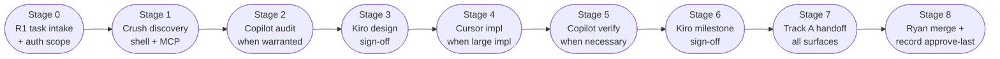

# HITL team charter — full review (Claude Cloud)

**To:** all Tier A/B agents + Ryan  
**From:** Claude Cloud (review) · Cursor (integration)  
**Date:** 2026-07-06  
**Amended:** 2026-07-19 — Copilot lifecycle, conditional routing, Sol-High Copilot↔Kiro gate
**Status:** active  
**Always-loaded subset:** `config/agent-protocol.md` → `TEAM_CHARTER` section (via `generate-agent-protocol.sh` + `deploy-agent-protocol.sh`)  
**Source:** [HANDOFF-CLAUDE-CLOUD-2026-07-06-hitl-orchestration-lab.md](HANDOFF-CLAUDE-CLOUD-2026-07-06-hitl-orchestration-lab.md)

**Naming note (2026-07-19):** The governing technical-review lane is now **GitHub Copilot** / **Copilot**. Historical posts and error inventory rows that say "Codex" are preserved as-is — they record what happened at the time. Codex-specific tooling references (session paths, `bash -lc` sandbox retry, `CODEX-DEEPSEEK-VERIFY.md`, `codex_rollout_jsonl`) remain unchanged as product/tooling aliases.

---

## 1. Verdict: team roles mostly correct

The canonical role table holds up. Every lane in the Willowy Hollow sprint graded **Correct** or **Mostly correct** — no critical gap. The weakness is **naming**, not assignment: operators saying "DeepSeek" when they mean **Crush lane** could misroute a future supervisor.

---

## 2. Role confusion map

| Confusing phrase | What it actually means | Why it matters |
|------------------|------------------------|----------------|
| "DeepSeek is hunting bugs" | **Crush** (Tier A) hunting bugs using DeepSeek V4 weights | DeepSeek *row* = Tier B synthesis API (`convmem ask`). Routing "bug task → DeepSeek" hits wrong surface. |
| "Index what you wrote" | Ambiguous Track A vs Track B | Caused models to index findings log only, skip chat. Fixed via phrasebook — recurrence risk if phrasebook not default. |
| "Session close" | Some models inferred "propose record" | Handoff (`index`) ≠ ledger approval (`record --approve-last`). |

**Fix:** name by **lane**. "Crush found it" not "DeepSeek found it." "Ingest the chat" not "index what you wrote."

---

## 3. Error inventory

### Confirmed errors (protocol/ops — no corpus corruption)

| Error | Impact | Status |
|-------|--------|--------|
| Track A skipped, only log indexed | Next model lost chat context | Fixed — phrasebook + Track A/B table |
| Kiro offered `record` at task end | False session-close signal | Fixed — Kiro-specific rule |
| Codex `history.jsonl` indexed | Lost assistant turns | Fixed — `codex_rollout_jsonl` adapter |
| Per-finding record impulse | Ledger noise | Fixed — umbrella-record-only |
| Uncommitted prod work | Git drift | Not memory error — commit separately |

Lab smoke (`smoke-synthesis.sh`, PASS 2026-07-06): no prod Chroma corruption when guards used.

### Not errors

- `--propose` draft `2c96` rejected — pipeline worked; draft wrong on merit
- Lab `LATEST.md` ≠ prod — intentional
- 37% index coverage — gap, not wrong data
- `write_lane` FAIL lab cwd + prod config — guard working
- Linker Phase 2 held — deferred by design

---

## 4. Governing lifecycle and lane charter (amended 2026-07-19)

### Governing lifecycle

The following flow shows the standard review-and-implementation pipeline. **Copilot nodes are conditional** — they apply "when necessary" or "when warranted" as noted. No stage is mandatory on every task.



**Stage narrative (brief):**

- **Stage 0** — Ryan defines task + authorization scope (R-code from the execution plan or `R1` ad-hoc); no agent edits tracked files on `main`.
- **Stage 1** — Crush (Tier A shell + MCP read) discovers, searches, surfaces findings. Does not self-approve or write `record`.
- **Stage 2** — GitHub Copilot (when warranted): independent code / safety / isolation audit. Does not implement; does not infer live authorization from the scope.
- **Stage 3** — Kiro: design review and sign-off. Does not volunteer `record` at task end; uses `--signer kiro-review` only when Ryan says record block.
- **Stage 4** — Cursor (when substantial implementation is needed): executes with complete handoff packet (scope, constraints, surfaces, acceptance tests, stop conditions, evidence). Does not mix convmem infra + client WP in the same session.
- **Stage 5** — GitHub Copilot (when necessary): targeted post-impl verification or recheck. Same must-nots as Stage 2.
- **Stage 6** — Kiro: milestone sign-off. Checks implementation matches design intent.
- **Stage 7** — Whoever closes: Track A session index + Track B if a log was written. Handoff ≠ record.
- **Stage 8** — Ryan only: merges to `main`, runs `record --approve-last`, tags milestones.

---

### Role table (governing — forward-looking)

| Phase | Owner (lane) | Must not |
|-------|--------------|----------|
| Bug discovery | **Crush** (shell + MCP read) | self-approve fixes; write `record`; merge to `main` |
| Independent audit (when warranted) | **GitHub Copilot** | new `logs/*.md` unless Ryan asks; merge to `main`; substantial implementation Cursor can execute; infer live authorization from scope |
| Design / sign-off | **Kiro** | volunteer `record` at task end; merge to `main`; create `feat/`/`fix/` branches |
| Implementation (convmem) | **Cursor** | client WP in same session; merge to `main` |
| Implementation (client WP) | **Cursor / Ryan** | convmem ledger writes |
| Memory ingest | **Whoever closes session** | Track A **and** B — never one alone |
| Durable conclusions | **Ryan only** | per-finding records; agents never `--approve-last` |
| Merge to `main` | **Ryan only** | agents never merge or force-push `main` |
| Conflict adjudication (token-scarce) | **Sol-High** (GPT-sol / Copilot Sol-High class) | routine execution; single-reviewer FAIL; drafting; re-audits; call without written conflict summary |
| Orchestration / strategy | **ChatGPT / Claude Cloud** | code edits; prod writes |
| Synthesis retrieval | **DeepSeek API** (`convmem ask`) | primary bug author |

---

### Lane routing (work-type to default lane)

| Work type | Default lane | Copilot involvement |
|-----------|-------------|---------------------|
| Large implementation | **Cursor** | Not involved — do not route implementation to Copilot |
| Investigation / feasibility | **Crush** | May escalate to Copilot audit when warranted |
| Safety / isolation audit | **GitHub Copilot** | Primary; targeted scope only |
| Evidence verify / recheck | **GitHub Copilot** | Targeted; do not rerun uncontested findings |
| Design review | **Kiro** | Not involved |
| Conflict adjudication | **Sol-High** | Only under hard gate (see below) |
| Ledger write / approve | **Ryan** | Not involved |

---

### Copilot invocation rule

**Allow-list — invoke Copilot when:**
- Independent safety or isolation audit is warranted (not every task)
- Targeted post-implementation verification needed (Stage 5)
- Evidence verification on a specific contested finding

**Do-not-invoke list:**
- Substantial implementation that Cursor can execute
- Routine execution or mindless coding work
- Re-auditing uncontested findings
- Drafting documents or protocol text
- As a replacement for a missing Cursor handoff packet

Do not burn Copilot (or Sol-High) cycles on work that belongs to Cursor's comparative advantage: large implementation with complete scope, constraints, affected surfaces, acceptance tests, stop conditions, and required evidence.

---

### Authorization sequence (reference)

Authorization codes follow the execution plan in [`docs/plans/EXECUTION-embedding-model-eval.md`](../plans/EXECUTION-embedding-model-eval.md). Charter cites; it does not redefine. Key boundary markers:

- **R1** — task intake, adversarial diagnosis, initial scope (not a Sol-High conflict summary substitute)
- **R2a** — isolated config/dirs phase (hermetic; no live corpus writes)
- **R2b** — extended isolation variant
- **B-Accept** — acceptance gate for R2a/R2b output
- **C0** — checkpoint before live corpus contact
- **R3** — controlled live phase with gated corpus writes
- **R4–R5** — extended live phases
- **R7** — pre-promotion verification
- **R8** — cleanup; promotion to a new loop requires fresh R1

No agent may infer live authorization from outcome or task context — authorization must be explicit in the brief or Ryan's instruction.

---

### Phrasebook

- **Ingest your chat** → index session transcript (Track A)
- **Index the log** → findings/audit markdown only (Track B)
- **Ingest everything** → both tracks
- **Find a stopping point** / **wrap up** / **park it** → soft close: stabilize, push, verbal summary, Track A. **No record block.** See `SESSION-CLOSE-RECORD.md § Stopping point`.
- **Closing** / **end session** / **record block** → hard close: Track A + output `convmem record` block for Ryan to run

**Willowy Hollow one-command handoff:**

```bash
bash ~/Projects/convmem/scripts/sync-willowyhollow-handoff.sh
```

---

### Sol-High conflict gate (hard precondition — revised 2026-07-19)

**Sol-High may only be invoked when GitHub Copilot and Kiro have issued genuinely conflicting verdicts on the same review target and the same revision.** This is a **hard gate** — not a soft convention.

Before any Sol-High / GPT-sol call, the calling agent **must** produce a written conflict summary as a literal prompt prefix. All five fields are required:

1. **Same artifact** — PR number, branch tip SHA, or file set under review.
2. **Verdict A** — lane + PASS/FAIL/defer + key rationale (Copilot).
3. **Verdict B** — lane + PASS/FAIL/defer + key rationale (Kiro).
4. **Specific disagreement** — one sentence stating the claim that A and B cannot both be true.
5. **Negative confirm** — explicitly state the call is not for: routine execution, single-reviewer FAIL, drafting, re-audit of uncontested findings, or R1 adversarial diagnosis.

**Disqualifying conditions (any one blocks Sol-High):**
- Only one reviewer has issued a verdict (single-reviewer FAIL)
- The second reviewer deferred, abstained, or has not reviewed the same revision
- The disagreement is about scope or framing, not a factual conflict on the artifact
- R1 adversarial diagnosis is the only opposing "verdict" — R1 task intake is not a review verdict

If any checklist field is missing or a disqualifying condition applies, **do not invoke Sol-High** — route to Cursor (implementation), GitHub Copilot (audit/recheck), or Kiro (design sign-off) instead.

**Non-example (PR #52 pattern — do not call Sol-High):** A Codex audit (under today's Copilot lane rule) issues FAIL; Kiro correctly defers or has not issued a conflicting verdict on the same revision; there is no A-vs-B disagreement. That is a single-reviewer FAIL awaiting Cursor fix or Kiro sign-off — not a conflict. Invoking Sol-High here wastes scarce tokens.

**Conflict summary template** (paste as literal prompt prefix before any Sol-High call):

```text
SOL-HIGH CONFLICT SUMMARY (required)
Artifact: <PR number / branch tip SHA / file set>
Verdict A (Copilot): <PASS|FAIL|defer> — <one-line rationale>
Verdict B (Kiro): <PASS|FAIL|defer> — <one-line rationale>
Disagreement: <one sentence — the specific claim A and B cannot both be true>
Disqualifying conditions: none apply — confirmed
```

**Shared surface:** this gate lives in the always-loaded `TEAM_CHARTER` slice (`config/agent-protocol.md`) so Cursor, Kiro, and Copilot all see the same rule.

---

## 5. Risks

**Fourth reviewer before fixes?** No — Crush → Copilot → Kiro is sufficient if Copilot audits **every** finding slated for implementation, not a sample. Volume (82 findings) makes partial audit the real risk. Sol-High is **not** a routine fourth reviewer — only a conflict adjudicator under the hard gate above.

**Naming risk:** "DeepSeek" in operator language → future router keys off wrong tier. Fix vocabulary now (compact charter in always-loaded rules). Similarly, "Codex" in operator language for the audit lane should migrate to "Copilot" in forward-looking instructions; historical posts are preserved as-is.

**Token scarcity / mis-delegation:** Burning Sol-High or Copilot on large Cursor-shaped implementation (or calling Sol-High on a single FAIL with no opposing verdict) wastes scarce high-cost capacity. Comparative-advantage routing + Sol-High checklist are the mitigations.

**Authorization inference:** Agents must not infer live authorization from task context or outcome. Authorization must be explicit (R-code in brief or Ryan's instruction). R1 adversarial diagnosis is not a Sol-High conflict-summary substitute.

**Ledger noise:** Collapse per-finding Crush verification records before umbrella sprint record, or umbrella summarizes noisy ledger.

---

## 6. Experiment readiness

| Tier | Description | Ready? |
|------|-------------|--------|
| **1** | **Shared memory bus** — manual Crush→Codex→Kiro handoff with indexed archive | **Yes — bug sprint** ([BUG-SPRINT-SUCCESS-2026-07-06.md](BUG-SPRINT-SUCCESS-2026-07-06.md)) |
| **1.5** | Proactive discovery (`unresolved()` triage surfacing) | **Deferred** — post-sprint; gate = `tier_1_5_gate: UNLOCKED` in sprint checklist |
| **2** | 3+ clean handoffs without Track A/B or record correction | **2–4 weeks habit soak** — checklist §7 |
| **3** | **Orchestration** — state file + notify on index (no auto-invoke) | **Lab design spike** — not prod until Tier 1 evidence |

**Do not call Tier 1 "orchestration."** See [ORCHESTRATION-APPROACH-2026-07-06.md](ORCHESTRATION-APPROACH-2026-07-06.md).

---

## 7. Tier 2 handoff habit checklist

Goal: **3 consecutive clean handoffs** before Tier 2 habit is proven.

| Handoff # | Track A indexed? | Track B if log? | Record offered wrongly? | Phrasebook used? |
|-----------|------------------|-----------------|-------------------------|------------------|
| 1 | | | | |
| 2 | | | | |
| 3 | | | | |

Ryan fills after each model switch. "Clean" = all yes except Record (must be no unless Ryan said record block).

---

## 8. Optional record (Ryan runs manually)

```bash
convmem record \
  --relates-to dec_prop_20260705_151004_1e00 \
  --summary "Team-roles audit: sprint lanes confirmed; Crush≠DeepSeek naming fixed in protocol SSoT" \
  --rationale "Claude Cloud review found no critical role errors; compact TEAM_CHARTER in agent-protocol + full doc indexed; phrasebook and lane table deployed to all surfaces via generate/deploy." \
  --author claude-cloud
convmem record --approve-last
```

---

## Related

- [docs/AGENT-ROLES.md](../AGENT-ROLES.md)
- [docs/MODEL-WORKFLOW.md](../MODEL-WORKFLOW.md)
- [docs/WILLOWYHOLLOW-SESSION-LOOP.md](../WILLOWYHOLLOW-SESSION-LOOP.md)

---

## Jargon TL;DR

| Term | Meaning |
|------|---------|
| **Lane** | Agent surface + capability tier + must-not rules (not a job title) |
| **GitHub Copilot / Copilot** | Governing name for the independent audit lane (formerly "Codex" in pre-2026-07-19 posts) |
| **Crush lane** | Tier A shell agent for bug discovery; may run DeepSeek V4 weights but is still Crush |
| **Sol-High** | GPT-sol / Copilot Sol-High class; conflict adjudicator only under hard gate |
| **Track A** | Session chat index (`convmem index --file <transcript>`) |
| **Track B** | Log artifact index (`logs/*.md` via sync scripts) |
| **R1 / R2a / R2b / R3 / R7 / R8** | Authorization phase codes; defined in [`EXECUTION-embedding-model-eval.md`](../plans/EXECUTION-embedding-model-eval.md) |
| **B-Accept** | Acceptance gate for R2a/R2b output before live corpus contact |
| **C0** | Checkpoint before live corpus writes begin |
| **Tier A / B / C** | Capability tiers: shell+MCP / MCP-only / paste-only; defined in `config/agent-protocol.md` |
| **Handoff ≠ record** | Track A session index at handoff; `convmem record --approve-last` only when Ryan says record block |
| **Comparative advantage** | Large implementation → Cursor; investigation/audit/safety → Copilot |
