# HITL team charter — full review (Claude Cloud)

**To:** all Tier A/B agents + Ryan  
**From:** Claude Cloud (review) · Cursor (integration)  
**Date:** 2026-07-06  
**Amended:** 2026-07-20 — conditional Copilot lifecycle and Sol-High adjudication gate
**Status:** active  
**Always-loaded subset:** `config/agent-protocol.md` → `TEAM_CHARTER` section (via `generate-agent-protocol.sh` + `deploy-agent-protocol.sh`)  
**Source:** [HANDOFF-CLAUDE-CLOUD-2026-07-06-hitl-orchestration-lab.md](HANDOFF-CLAUDE-CLOUD-2026-07-06-hitl-orchestration-lab.md)

**Naming note (2026-07-19):** The governing technical-review lane is now **GitHub Copilot** / **Copilot**. Historical posts and error inventory rows that say "Codex" are preserved as-is — they record what happened at the time. Codex-specific tooling references (session paths, `bash -lc` sandbox retry, `CODEX-DEEPSEEK-VERIFY.md`, `codex_rollout_jsonl`) remain unchanged as product/tooling aliases.

---

## 1. Verdict: team roles mostly correct

The canonical role table holds up. Every lane in the Willowy Hollow sprint graded **Correct** or **Mostly correct** — no critical gap. The weakness is **naming**, not assignment: operators saying "DeepSeek" when they mean **Crush lane** could misroute a future supervisor.

---

## 2. Role confusion map

| Confusing phrase | What it actually means | Why it matters |
|------------------|------------------------|----------------|
| "DeepSeek is hunting bugs" | **Crush** (Tier A) hunting bugs using DeepSeek V4 weights | DeepSeek *row* = Tier B synthesis API (`convmem ask`). Routing "bug task → DeepSeek" hits wrong surface. |
| "Index what you wrote" | Ambiguous Track A vs Track B | Caused models to index findings log only, skip chat. Fixed via phrasebook — recurrence risk if phrasebook not default. |
| "Session close" | Some models inferred "propose record" | Handoff (`index`) ≠ ledger approval (`record --approve-last`). |

**Fix:** name by **lane**. "Crush found it" not "DeepSeek found it." "Ingest the chat" not "index what you wrote."

---

## 3. Error inventory

### Confirmed errors (protocol/ops — no corpus corruption)

| Error | Impact | Status |
|-------|--------|--------|
| Track A skipped, only log indexed | Next model lost chat context | Fixed — phrasebook + Track A/B table |
| Kiro offered `record` at task end | False session-close signal | Fixed — Kiro-specific rule |
| Codex `history.jsonl` indexed | Lost assistant turns | Fixed — `codex_rollout_jsonl` adapter |
| Per-finding record impulse | Ledger noise | Fixed — umbrella-record-only |
| Uncommitted prod work | Git drift | Not memory error — commit separately |

Lab smoke (`smoke-synthesis.sh`, PASS 2026-07-06): no prod Chroma corruption when guards used.

### Not errors

- `--propose` draft `2c96` rejected — pipeline worked; draft wrong on merit
- Lab `LATEST.md` ≠ prod — intentional
- 37% index coverage — gap, not wrong data
- `write_lane` FAIL lab cwd + prod config — guard working
- Linker Phase 2 held — deferred by design

---

## 4. Governing lifecycle and lane charter (amended 2026-07-19)

### Governing lifecycle

This is the complete lifecycle from problem framing through production decision. Specialist reviews are selected by comparative advantage; **GitHub Copilot audit-lane nodes are conditional**, not mandatory at every stage. Sol-High is outside the normal flow and may be used only under the hard conflict gate below.

```mermaid
flowchart TD
  A["Ryan identifies opportunity or problem"] --> B["Crush gathers facts and frames a neutral problem brief"]
  B --> C{"Code-grounded uncertainty?"}
  C -- "yes" --> CA["GitHub Copilot audit lane investigates local code and state"]
  C -- "no" --> D
  CA --> D{"Which independent critiques are warranted?"}
  D --> D1["DeepSeek R1 adversarial architecture critique"]
  D --> D2["Claude methodology and evaluation critique"]
  D --> D3["ChatGPT strategic review"]
  D --> D4["Kiro preliminary design review"]
  D1 --> E["ChatGPT synthesis"]
  D2 --> E
  D3 --> E
  D4 --> E
  E --> F["Kiro reconciles findings and issues governing architecture brief"]
  F --> G{"Problem sufficiently specified?"}
  G -- "no" --> B
  G -- "yes" --> H["Cursor creates architecture plan"]
  H --> I1["Kiro architecture review"]
  H --> I2["GitHub Copilot safety, isolation, and code audit when warranted"]
  H --> I3["Claude evaluation-methodology review when applicable"]
  I1 --> J["ChatGPT review synthesis when needed"]
  I2 --> J
  I3 --> J
  J --> K["Kiro consolidated amendments"]
  K --> L["Cursor revises architecture"]
  L --> M["Reviewer-specific targeted amendment checks"]
  M --> N["Kiro final architecture sign-off"]
  N --> O["Cursor creates execution plan"]
  O --> P1["GitHub Copilot feasibility and safety review when warranted"]
  O --> P2["Kiro scope and sequencing review"]
  P1 --> Q["Cursor revises execution plan"]
  P2 --> Q
  Q --> R1["Reviewer-specific targeted rechecks"]
  Q --> R2["Kiro execution-plan PASS"]
  R1 --> S{"Ryan authorizes next phase?"}
  R2 --> S
  S -- "tracked implementation" --> T["Cursor builds on feature branch"]
  T --> U["Tests, commits, and immediate pushes"]
  U --> V["Independent implementation verification"]
  V --> W{"Ryan accepts tracked implementation?"}
  W -- "revise" --> T
  W -- "accept" --> X["Merge or pin reviewed implementation commit"]
  X --> Y["Separately authorized preparation, shadow builds, and evaluation"]
  Y --> Z1["GitHub Copilot evidence-integrity verification when necessary"]
  Y --> Z2["Claude methodology review"]
  Y --> Z3["Kiro technical verdict"]
  Z1 --> AA["ChatGPT final synthesis if needed"]
  Z2 --> AA
  Z3 --> AA
  AA --> AB{"Ryan model decision"}
  AB -- "reject or inconclusive" --> AC["Keep live system unchanged; separately authorize cleanup"]
  AB -- "candidate wins" --> AD["Begin a new promotion architecture and authorization loop"]
```



**Lane boundaries:** Crush owns routine discovery and neutral framing. DeepSeek R1 challenges architecture; Claude reviews methodology; ChatGPT supplies strategy and synthesis; Kiro owns governing design review and sign-off; Cursor owns architecture, execution planning, and implementation. The GitHub Copilot audit lane is used only for code-grounded investigation, safety/isolation review, evidence integrity, and targeted rechecks. Ryan alone authorizes phases, deployment, promotion, cleanup, merges, and durable conclusions.

**DeepSeek V4-Pro audit substitute:** When Ryan explicitly authorizes it for a named PR tip+base, DeepSeek V4-Pro via the official API may fill the Copilot audit-lane slot for that revision only. The substitute must use the locked runner/protocol; it does not enlarge DeepSeek `ask` capabilities and does not replace Copilot as the default governing audit lane.

**Kiro is non-implementing and review-required.** Kiro may issue verdicts and sign-offs and may edit an architecture, plan, or review document only when Ryan explicitly requests that documentation task. Kiro must not edit implementation code, tests, scripts, configuration, generated surfaces, or runtime state; implement findings; or infer write authority from bounded autonomy. Implementation corrections return to Cursor.

---

### Role table (governing — forward-looking)

| Phase | Owner (lane) | Must not |
|-------|--------------|----------|
| Bug discovery | **Crush** (shell + MCP read) | self-approve fixes; write `record`; merge to `main` |
| Independent audit (when warranted) | **GitHub Copilot** | new `logs/*.md` unless Ryan asks; merge to `main`; substantial implementation Cursor can execute; infer live authorization from scope |
| Design / sign-off | **Kiro** | implementation edits; unrequested document edits; volunteer `record`; merge to `main`; create `feat/`/`fix/` branches |
| Bound-brief GitHub PR lifecycle | **PR Steward** (default: OpenAI Codex) | merge `main`; force-push; grant live/eval/capture/promotion; ledger write; expand beyond brief; act as Copilot audit; impersonate Kiro or Cursor; reroute large implementation away from Cursor; enlarge actor lane/capability |
| Implementation (convmem) | **Cursor** | client WP in same session; merge to `main` |
| Implementation (client WP) | **Cursor / Ryan** | convmem ledger writes |
| Memory ingest | **Whoever closes session** | Track A **and** B — never one alone |
| Durable conclusions | **Ryan only** | per-finding records; agents never `--approve-last` |
| Merge to `main` | **Ryan only** | agents never merge or force-push `main` |
| Conflict adjudication (token-scarce) | **Sol-High adjudicator** | routine execution; single-reviewer FAIL; drafting; re-audits; call without written conflict summary |
| Orchestration / strategy | **ChatGPT / Claude Cloud** | code edits; prod writes |
| Synthesis retrieval | **DeepSeek API** (`convmem ask`) | primary bug author |

---

### Lane routing (work-type to default lane)

| Work type | Default lane | Copilot involvement |
|-----------|-------------|---------------------|
| Large implementation | **Cursor** | Not involved — do not route implementation to Copilot |
| Investigation / feasibility | **Crush** | May escalate to Copilot audit when warranted |
| Safety / isolation audit | **GitHub Copilot** | Primary; targeted scope only |
| Evidence verify / recheck | **GitHub Copilot** | Targeted; do not rerun uncontested findings |
| Design review | **Kiro** | Not involved |
| Bound brief → GitHub PR lifecycle | **PR Steward** (default Codex) | Not involved — audit lane does not own PR writing |
| Conflict adjudication | **Sol-High** | Only under hard gate (see below) |
| Ledger write / approve | **Ryan** | Not involved |

---


---

### PR Steward (Delivery role — v0.1)

**Delivery role** means a lasting HITL workflow overlay under Ryan: a standing delivery job that is **not** a Planning OS **Role** (engineering ownership in `role-charters.md`), **not** a new Lane, and **not** an expansion of the assigned actor's capability tier or must-nots. Assigning PR Steward is non-exclusive: it cannot reroute large implementation away from Cursor or enlarge OpenAI Codex capabilities. Codex is the default actor only when Ryan assigns the job; role name stays if another surface is assigned later.

**PR Steward itself is lasting.** What is temporary is the current **training** period for Steward.

**v0.1 (training).** Introduced after the R2b architecture PR delivery (single data point). Boundaries, prompts, and surface wiring are being trained now and will be refined; do not treat the v0.1 card text as frozen forever.

#### Activation and brief

PR Steward activates only through an explicit Ryan assignment containing a bounded brief — the exact content Ryan provides as the deliverable specification (repo, base branch, file/directory scope, expected deliverable). It never self-assigns, expands, or continues into a follow-on task without a new assignment. The assignment ends when exact-tip evidence and handoff are returned to Ryan (evidence lives outside the committed successor).

#### Judgment boundary

No material architecture, scope, security, product, or authorization judgment. Only decisions mechanically determined by the brief, repo conventions, or tests are permitted. If the brief is missing, ambiguous, or contradictory: stop and flag Ryan — never resolve unilaterally.

#### Owns

Materializes an already-bounded, Ryan-approved brief into authorized task-branch content. Owns delivery mechanics and faithful implementation of the brief; does not own unresolved architecture, strategy, product, security, or implementation-scope decisions. Delivery mechanics include: maintain fallback branch, commit/push with explicit refspec, open/update PR per mutation allowlist below, monitor exact-tip CI, hand merge/grant gates back to Ryan.

#### Must

- Exact Ryan assignment / bounded brief only
- Stop-and-flag on brief gaps/ambiguity
- Work-branch taxonomy; never commit on `main`
- Explicit `"$branch:refs/heads/$branch"` push after commits
- Open/update PR only via the exhaustive mutation allowlist below
- Resolve mechanical or clearly brief-contained review findings; monitor/report CI
- Hand HITL to Ryan (merge / ACCEPT / GRANT remain Ryan)

#### Must not

- Merge `main` or force-push
- Grant live execution, eval-root writes, capture, or promotion
- Write the ledger (`record` / `--approve-last`)
- Expand beyond brief; self-assign; follow-on without new assignment
- Act as Copilot audit lane; impersonate Kiro sign-off or Cursor large implementation
- Reroute large implementation away from Cursor
- Enlarge the assigned actor's lane / capability / must-nots
- Material architecture / scope / security / product / authorization judgment

#### Exhaustive GitHub mutation allowlist

**Allowed without extra authorization (within the brief):**

- Open a PR
- Update PR title/body
- Add links describing supersession / recommended close
- Push commits to the task branch with explicit refspec
- Comment with status / tip SHA / CI report (non-resolving)

**Allowed only when the brief explicitly names the affected PR number(s):**

- Close, reopen, retarget, or formally supersede a PR

**Everything else requires explicit Ryan authorization in the brief** (unlisted = denied), including but not limited to: labels, reviewer add/remove, requesting/dismissing reviews, CI reruns, branch deletion, marking threads resolved/outdated, force-push, merge, releasing, project-board edits.

#### Review findings and CI

Resolves mechanical or clearly brief-contained review findings and monitors/reports CI status. Any finding that changes architecture, security properties, scope, authorization semantics, or user-visible behavior — or any CI failure the brief didn't anticipate — returns to Ryan, not resolved unilaterally.

#### Escalation routing

| Situation | Route to |
|-----------|----------|
| Missing/conflicting design decision | Design owner + Ryan |
| Large implementation / unbounded debugging | Cursor |
| Independent audit | GitHub Copilot audit lane |
| Schema / operational sign-off | Kiro |
| Merge, grant, deployment, expansion | Ryan |

### Copilot invocation rule

**Allow-list — invoke Copilot when:**
- Independent safety or isolation audit is warranted (not every task)
- Targeted post-implementation verification needed (Stage 5)
- Evidence verification on a specific contested finding

**Do-not-invoke list:**
- Substantial implementation that Cursor can execute
- Routine execution or mindless coding work
- Re-auditing uncontested findings
- Drafting documents or protocol text
- As a replacement for a missing Cursor handoff packet

Do not burn Copilot (or Sol-High) cycles on work that belongs to Cursor's comparative advantage: large implementation with complete scope, constraints, affected surfaces, acceptance tests, stop conditions, and required evidence.

---

### Authorization sequence — embedding-project worked example

The phase codes below preserve Ryan's authorization sequence for the embedding-model evaluation project. They are a **worked example, not universal convmem policy**. The current operational runbook uses the later Gate 1/Gate 2 model and remains authoritative for its own constraints: [`docs/plans/EXECUTION-embedding-model-eval.md`](../plans/EXECUTION-embedding-model-eval.md).

**Disambiguation:** **Authorization R1** permits tracked implementation only. It is entirely distinct from **DeepSeek R1**, the adversarial-review model.

| Code | Meaning in this plan |
|------|----------------------|
| **Authorization R1** | Feature branch, tracked code, hermetic fixtures, tests, commits, and pushes only |
| **Authorization R2a** | Create isolated configurations and directories |
| **Authorization R2b** | Capture the immutable corpus package |
| **B-Accept** | Human corpus review and acceptance |
| **C0** | Freeze queries, labels, metrics, thresholds, and manifests before challenger results |
| **Authorization R3** | Pull and probe both models |
| **Authorization R4** | Build a fresh baseline/control shadow |
| **Authorization R5** | Build the challenger shadow and verify matching corpus identity |
| **Authorization R7** | Smoke, pilot, latency, and paired evaluation |
| **Authorization R8** | Remove experimental artifacts after a separate cleanup authorization |
| **Promotion** | A winning evaluation starts a new architecture, review, execution-plan, and authorization loop; it never authorizes live cutover |

No agent may infer live authorization from outcome or task context. DeepSeek R1 output and Authorization R1 are **not** Sol-High conflict-summary substitutes.

---

### Phrasebook

- **Ingest your chat** → index session transcript (Track A)
- **Index the log** → findings/audit markdown only (Track B)
- **Ingest everything** → both tracks
- **Find a stopping point** / **wrap up** / **park it** → soft close: stabilize, push, verbal summary, Track A. **No record block.** See `SESSION-CLOSE-RECORD.md § Stopping point`.
- **Closing** / **end session** / **record block** → hard close: Track A + output `convmem record` block for Ryan to run

**Willowy Hollow one-command handoff:**

```bash
bash ~/Projects/convmem/scripts/sync-willowyhollow-handoff.sh
```

---

### Sol-High conflict gate (hard precondition — revised 2026-07-20)

**Sol-High is a separate scarce adjudicator.** It is not a step in the normal lifecycle and is not the same as the GitHub Copilot audit lane. Sol-High may only be invoked under the hard gate below.

**Hard gate:** Sol-High may only be invoked when the **GitHub Copilot audit lane** and **Kiro** have each issued a **written verdict** (PASS or FAIL — not defer, not silence, not abstention) on the **same review target and the same revision**, and those verdicts are **materially in conflict**.

Before any Sol-High / GPT-sol call, the calling agent **must** produce a written conflict summary as a literal prompt prefix. All five fields are required:

1. **Same artifact** — PR number, branch tip SHA, or file set under review. Both verdicts must be against this exact artifact.
2. **GitHub Copilot audit-lane written verdict** — PASS or FAIL + key rationale. (Not defer; not silence; not a comment from a different revision.)
3. **Kiro written verdict** — PASS or FAIL + key rationale. (Not defer; not silence; not a comment from a different revision.)
4. **Material proposition in conflict** — one sentence stating the specific factual claim that both verdicts cannot simultaneously be true.
5. **Negative confirmation** — explicitly confirm the call is not for: single-reviewer FAIL, deferral by either reviewer, abstention, silence, missing verdict, incomplete verdict, or verdicts against different revisions.

**Disqualifying conditions (any one blocks Sol-High):**
- Only one reviewer has issued a written PASS or FAIL
- Either reviewer deferred, abstained, was silent, or did not review the same revision
- A verdict is incomplete or references a different artifact
- The disagreement is about scope or framing, not a material factual conflict on the artifact
- Authorization R1 is the only opposing input — authorization is not a review verdict
- DeepSeek R1 (the model) output is the only opposing input — model output is not a lane verdict

**`defer` is never an opposing written verdict.** A reviewer who defers has not issued a verdict. Deferral by either lane means the gate is not met — route to the deferring lane for resolution first.

If any field is missing or a disqualifying condition applies, **do not invoke Sol-High**. Route to: Cursor (implementation), GitHub Copilot audit lane (recheck), or Kiro (design sign-off).

**Non-example (PR #52 pattern — do not call Sol-High):** A Codex audit (under today's Copilot lane rule) issues FAIL; Kiro correctly defers or has not issued a written verdict on the same revision — there is no A-vs-B material conflict. That is a single-reviewer FAIL awaiting Cursor fix or Kiro sign-off, not a conflict. Invoking Sol-High here wastes scarce tokens.

**Conflict summary template** (paste as literal prompt prefix before any Sol-High call):

```text
SOL-HIGH CONFLICT SUMMARY (required — all fields must be present)
Artifact: <PR number / branch tip SHA / file set — exact>
GitHub Copilot audit-lane verdict: <PASS|FAIL> — <one-line rationale>
Kiro verdict: <PASS|FAIL> — <one-line rationale>
Material proposition in conflict: <one sentence — the specific factual claim both verdicts cannot both be true>
Negative confirmation: not single-FAIL / not deferral / not abstention / not silence / not missing / not incomplete / not different revision — confirmed
```

**Shared surface:** this gate lives in the always-loaded `TEAM_CHARTER` slice (`config/agent-protocol.md`) so Cursor, Kiro, and the Copilot audit lane all see the same rule.

---

## 5. Risks

**Fourth reviewer before fixes?** No — Crush → Copilot → Kiro is sufficient if Copilot audits **every** finding slated for implementation, not a sample. Volume (82 findings) makes partial audit the real risk. Sol-High is **not** a routine fourth reviewer — only a conflict adjudicator under the hard gate above.

**Naming risk:** "DeepSeek" in operator language → future router keys off wrong tier. Fix vocabulary now (compact charter in always-loaded rules). Similarly, "Codex" in operator language for the audit lane should migrate to "Copilot" in forward-looking instructions; historical posts are preserved as-is.

**Token scarcity / mis-delegation:** Burning Sol-High or Copilot on large Cursor-shaped implementation (or calling Sol-High on a single FAIL with no opposing verdict) wastes scarce high-cost capacity. Comparative-advantage routing + Sol-High checklist are the mitigations.

**Authorization inference:** Agents must not infer live authorization from task context or outcome. Authorization must be explicit in the brief or Ryan's instruction. Neither Authorization R1 nor DeepSeek R1 output is a Sol-High conflict-summary substitute.

**Ledger noise:** Collapse per-finding Crush verification records before umbrella sprint record, or umbrella summarizes noisy ledger.

---

## 6. Experiment readiness

| Tier | Description | Ready? |
|------|-------------|--------|
| **1** | **Shared memory bus** — manual Crush→Codex→Kiro handoff with indexed archive | **Yes — bug sprint** ([BUG-SPRINT-SUCCESS-2026-07-06.md](BUG-SPRINT-SUCCESS-2026-07-06.md)) |
| **1.5** | Proactive discovery (`unresolved()` triage surfacing) | **Deferred** — post-sprint; gate = `tier_1_5_gate: UNLOCKED` in sprint checklist |
| **2** | 3+ clean handoffs without Track A/B or record correction | **2–4 weeks habit soak** — checklist §7 |
| **3** | **Orchestration** — state file + notify on index (no auto-invoke) | **Lab design spike** — not prod until Tier 1 evidence |

**Do not call Tier 1 "orchestration."** See [ORCHESTRATION-APPROACH-2026-07-06.md](ORCHESTRATION-APPROACH-2026-07-06.md).

---

## 7. Tier 2 handoff habit checklist

Goal: **3 consecutive clean handoffs** before Tier 2 habit is proven.

| Handoff # | Track A indexed? | Track B if log? | Record offered wrongly? | Phrasebook used? |
|-----------|------------------|-----------------|-------------------------|------------------|
| 1 | | | | |
| 2 | | | | |
| 3 | | | | |

Ryan fills after each model switch. "Clean" = all yes except Record (must be no unless Ryan said record block).

---

## 8. Optional record (Ryan runs manually)

```bash
convmem record \
  --relates-to dec_prop_20260705_151004_1e00 \
  --summary "Team-roles audit: sprint lanes confirmed; Crush≠DeepSeek naming fixed in protocol SSoT" \
  --rationale "Claude Cloud review found no critical role errors; compact TEAM_CHARTER in agent-protocol + full doc indexed; phrasebook and lane table deployed to all surfaces via generate/deploy." \
  --author claude-cloud
convmem record --approve-last
```

---

## Related

- [docs/AGENT-ROLES.md](../AGENT-ROLES.md)
- [docs/MODEL-WORKFLOW.md](../MODEL-WORKFLOW.md)
- [docs/WILLOWYHOLLOW-SESSION-LOOP.md](../WILLOWYHOLLOW-SESSION-LOOP.md)

---

## Jargon TL;DR

| Term | Meaning |
|------|---------|
| **Lane** | Agent surface + capability tier + must-not rules (not a job title) |
| **Delivery role** | Lasting HITL workflow overlay under Ryan (e.g. **PR Steward**); never changes Lane/capability/must-nots; ≠ engineering **Role** in `role-charters.md`; v0.1 training is temporary, the role is not |
| **GitHub Copilot audit lane** | Governing conditional technical-review lane (formerly "Codex" in pre-2026-07-19 posts); VS Code Copilot surface; not the same as Sol-High |
| **DeepSeek V4-Pro audit substitute** | Ryan-authorized, tip-scoped official-API stand-in for Copilot audit only; must use `scripts/deepseek_audit_substitute.py` + [`ARCHITECTURE-deepseek-v4pro-audit-substitute.md`](../plans/ARCHITECTURE-deepseek-v4pro-audit-substitute.md); ≠ Crush; ≠ `convmem ask`; ≠ merge/grant/ledger |
| **Sol-High adjudicator** | Scarce conflict-resolution resource used only under the hard gate; separate from the GitHub Copilot audit lane |
| **Crush lane** | Tier A shell agent for bug discovery; may run DeepSeek V4 weights but is still Crush |
| **DeepSeek R1** | The DeepSeek R1 language model — entirely distinct from Authorization R1 below |
| **Authorization R1 … R8** | Historical phase codes in the embedding-project worked example; the current runbook separately defines Gate 1 and Gate 2 |
| **Track A** | Session chat index (`convmem index --file <transcript>`) |
| **Track B** | Log artifact index (`logs/*.md` via sync scripts) |
| **Tier A / B / C** | Capability tiers: shell+MCP / MCP-only / paste-only; defined in `config/agent-protocol.md` |
| **Handoff ≠ record** | Track A session index at handoff; `convmem record --approve-last` only when Ryan says record block |
| **Comparative advantage** | Large implementation → Cursor; investigation/audit/safety → Copilot audit lane |
