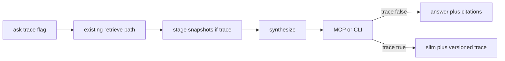

# CURSOR — Round 2 architecture: ask(trace) via PR #35 rebase

**Date:** 2026-07-15
**From:** Cursor (implementer + plan maker)
**Baseline:** `main` after PR #38 (`48e816f`)
**Board decision:** [../CURSOR-round-2-board-decision.md](../CURSOR-round-2-board-decision.md)
**Kiro vote:** [../KIRO-round2-vote.md](../KIRO-round2-vote.md)
**Delivery vehicle:** rebase [PR #35](https://github.com/alanmz-crypto/convmem/pull/35) (`fix/2026-07-15-ask-trace`)

## Conflict check → resolution (zero conflicts on what ships next)

| Item | Cursor board decision | Kiro vote | Resolution |
|---|---|---|---|
| Problem 1 | Versioned `ask(trace=True)` | Same — unanimous | **Authorize now** |
| Problem 2 | Retrieval eval in this round | Defer until trace exists | **Phase B after trace on `main`** |
| Delivery | Greenfield / optional `retrieve_for_ask` | Rebase PR #35; drop nested-ingest | **Rebase #35** |
| ChatGPT extraction | Prefer in trace arc | Ship without it first | **Defer extraction** until eval needs it |

Diversification stays Round 3+. MCP `evidence` default flip stays Ryan-only.

---

## Problem 1 — delivery path (authorized slice)

**Branch:** rebase `fix/2026-07-15-ask-trace` onto `origin/main` (post-`48e816f`).

**Drop from #35:** `adapters/inter_model_doc.py` / `tests/test_inter_model_doc.py` hunks (already on `main` via #38).

**Keep / align:**

- `ask(..., trace=False)` → optional stage snapshots when `True` (PR #35 stages: candidates / reranked / final / recent_injected — map toward ChatGPT `convmem.ask.trace.v1` where cheap; do not block rebase on full 11-stage enum).
- CLI `convmem ask --trace`.
- MCP `ask(trace=False)` default; when true, append trace; when false, **omit** `trace` key (not null).
- Compact candidate rows: `id`, `score`, `rank_score`, `evidence_boost`, `recency_boost`, `evidence_status`, `title`, `type`, `tool`, `source_path`, `domain`, `ledger_id`, `ledger_kind` — **no** full `document` bodies.
- Piggyback: MCP citations include `evidence_status` + `ledger_id` even when `trace=False` (`mcp_server.py` ask tool).
- Tests: keep/extend `tests/test_ask_trace.py`.

**Out of this PR:** `retrieve_for_ask` extraction, ChatGPT-style `eval-retrieval` rewrite, diversification, MCP evidence-default flip.

Note: `scripts/eval-retrieval.py` already exists as a simple `query_units` golden P@k tool — Phase B extends or replaces; do not conflate with this PR.

## Acceptance (Problem 1 PR)

- [ ] `trace=False`: MCP/CLI default shape unchanged except citation `evidence_status` / `ledger_id` enrichment.
- [ ] `trace=True`: stages present; diagnosable “in candidates / not in final”; no ranking/synthesis change.
- [ ] Focused + full tests; durable probe with `--trace` in PR body.
- [ ] Kiro + R1 review field completeness.

## Cursor execution steps

1. Rebase PR #35 onto `origin/main`; drop nested-ingest hunks.
2. Align trace fields with Kiro/R1 compact-row contract; strip document bodies from trace.
3. Piggyback MCP citation enrichment (`evidence_status`, `ledger_id`).
4. Run acceptance; publish stage snapshot for durable purge-drift (or agreed) query.
5. Push; request Kiro + R1 review.

## Phase B (not this PR)

After merge: ChatGPT retrieval-eval contract using production path + trace; hermetic then live canary; then reopen diversification only if crowding proven.
