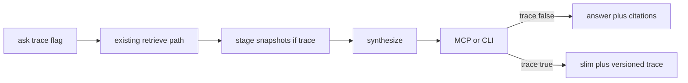

# CURSOR — Round 2 architecture: ask(trace) via PR #35 rebase

**Date:** 2026-07-15
**From:** Cursor (implementer + plan maker)
**Baseline:** `main` after PR #38 (`48e816f`)
**Board decision:** [../CURSOR-round-2-board-decision.md](../CURSOR-round-2-board-decision.md)
**Kiro vote:** [../KIRO-round2-vote.md](../KIRO-round2-vote.md)
**Delivery vehicle:** rebase [PR #35](https://github.com/alanmz-crypto/convmem/pull/35) (`fix/2026-07-15-ask-trace`)

**Kiro blocker:** [KIRO-review-round-2-trace-blockers.md](KIRO-review-round-2-trace-blockers.md) —
PR #35 was cut **before** PR #38 and its diff **restores** the pre–Round-1 broken
`_prepend_recent_decisions` (no minority cap / domain-site / semantic-wins dedupe /
ChromaStore `with`), deletes Round 1 `test_ledger_recent` coverage, and can drop
`_EXCLUDE_PATH_TOKENS` from `inter_model_doc.py`. Trace helpers themselves are fine.

## Conflict check → resolution (zero conflicts on what ships next)

| Item | Cursor board decision | Kiro vote | Resolution |
|---|---|---|---|
| Problem 1 | Versioned `ask(trace=True)` | Same — unanimous | **Authorize now** |
| Problem 2 | Retrieval eval in this round | Defer until trace exists | **Phase B after trace on `main`** |
| Delivery | Greenfield / optional `retrieve_for_ask` | Rebase PR #35; drop nested-ingest | **Rebase #35** |
| ChatGPT extraction | Prefer in trace arc | Ship without it first | **Defer extraction** until eval needs it |

Diversification stays Round 3+. MCP `evidence` default flip stays Ryan-only.

---

## Problem 1 — delivery path (authorized slice)

**Branch:** rebase `fix/2026-07-15-ask-trace` onto `origin/main` (post-`48e816f`).

**Preserve from `main` (never take #35’s version):**

| File / symbol | Why |
|---|---|
| `ask.py` `_prepend_recent_decisions` | Round 1 minority cap, domain/site, semantic-wins, post-dedupe cap |
| `ask.py` evidence `with ChromaStore(...)` | Round 1 leak fix |
| `tests/test_ledger_recent.py` | Round 1 regression suite (~145 lines #35 deletes) |
| `adapters/inter_model_doc.py` | Nested ingest + `_EXCLUDE_PATH_TOKENS` from #38 |

**Take from #35 (layer on top of `main` only):**

- `_trace_entries()` / stage snapshots (`candidates` → `reranked` → `final` + `recent_injected`)
- `ask(..., trace=False)` + `trace_info` construction
- MCP `trace` param + payload; omit `trace` key when false
- CLI `--trace`
- `tests/test_ask_trace.py` (assert **structure**/ordering, not brittle post-#38 counts)

**Also during rebase / align:**

- `ask(..., trace=False)` → optional stage snapshots when `True` (PR #35 stages: candidates / reranked / final / recent_injected — map toward ChatGPT `convmem.ask.trace.v1` where cheap; do not block rebase on full 11-stage enum).
- CLI `convmem ask --trace`.
- MCP `ask(trace=False)` default; when true, append trace; when false, **omit** `trace` key (not null).
- Compact candidate rows: `id`, `score`, `rank_score`, `evidence_boost`, `recency_boost`, `evidence_status`, `title`, `type`, `tool`, `source_path`, `domain`, `ledger_id`, `ledger_kind` — **no** full `document` bodies.
- Piggyback: MCP citations include `evidence_status` + `ledger_id` even when `trace=False` (`mcp_server.py` ask tool).
- Tests: keep/extend `tests/test_ask_trace.py`.

**Out of this PR:** `retrieve_for_ask` extraction, ChatGPT-style `eval-retrieval` rewrite, diversification, MCP evidence-default flip.

Note: `scripts/eval-retrieval.py` already exists as a simple `query_units` golden P@k tool — Phase B extends or replaces; do not conflate with this PR.

## Acceptance (Problem 1 PR)

- [ ] `trace=False`: MCP/CLI default shape unchanged except citation `evidence_status` / `ledger_id` enrichment.
- [ ] `trace=True`: stages present; diagnosable “in candidates / not in final”; no ranking/synthesis change.
- [ ] Focused + full tests; durable probe with `--trace` in PR body.
- [ ] Round 1 evidence-budget tests still green (`test_ledger_recent`); no semantic-slot zeroing under 8 recent.
- [ ] Kiro + R1 review field completeness.

## Cursor execution steps

1. Rebase PR #35 onto `origin/main`. On every conflict involving Round 1 files: **keep `main`**.
2. Confirm `ask.py` still has `max(1, total_limit // 3)` cap, domain/site args, semantic-wins dedupe, and `with ChromaStore`.
3. Confirm `test_ledger_recent.py` and `inter_model_doc.py` match `main` (no #35 reverts).
4. Layer only trace additions from #35; align compact-row fields; strip document bodies from trace.
5. Ensure trace payload includes `retrieval_query` and evidence-mode flag if missing (R1).
6. Piggyback MCP citation enrichment (`evidence_status`, `ledger_id`) when `trace=False`.
7. Fix `test_ask_trace.py` if it asserts brittle pre-#38 counts — prefer structure/order asserts.
8. Run Round 1 + trace tests; durable `--trace` probe; push; Kiro + R1 review.

If rebase is irreconcilably messy: greenfield trace-only on a fresh `fix/` from `main` using the same field contract (~125 lines) — do **not** copy #35’s old prepend body.

## Phase B (not this PR)

After merge: ChatGPT retrieval-eval contract using production path + trace; hermetic then live canary; then reopen diversification only if crowding proven.
