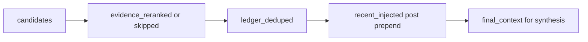

# CURSOR — Round 2 architecture (executive lock): ask(trace)

**Date:** 2026-07-16
**From:** Cursor (implementer + plan maker)
**Status:** **Authorized for implementation** with ChatGPT A1/A2 truthfulness locks (see red-flag disposition). Merge gated on contract fidelity + Round 1 invariants green.
**Baseline:** `main` after PR #38 (`48e816f`)
**Delivery:** rebase [PR #35](https://github.com/alanmz-crypto/convmem/pull/35) onto `main`, preserve Round 1, rewrite stage contract as below (or greenfield if rebase unsafe).

**Partner chain:** ChatGPT (REVISE → authorize-with-merge-gates) → Kiro (blocker + clear) → R1 (clear) → Continue-V4 (clear; evidence-default deferred).

---

## Partner verdicts

| Lane | Verdict |
|---|---|
| ChatGPT | Catastrophic #35-reverts-#38 risk fixed in architecture. Authorize impl; merge gated on schema/stages/`recent_injected`/`final_context`. |
| Kiro | Preserve-main rules adopted; no further blockers; will confirm after push. |
| R1 | Blocker cleared; verify `retrieval_query` + evidence mode; structure tests; greenfield fallback OK. |
| Continue-V4 | Trace field list + citation piggyback + evidence in request adopted. MCP `evidence` default flip **out** (Ryan-only). Docs must match `main`: `max(1, total_limit // 3)`. |

---

## A — Preserve-main rebase (never take #35’s Round 1 bodies)

| Keep from `main` | Why |
|---|---|
| `_prepend_recent_decisions` | Cap `min(max_recent, max(1, total_limit // 3))`, domain/site, semantic-wins, cap-after-dedupe |
| `with ChromaStore(...)` | Round 1 leak fix |
| `tests/test_ledger_recent.py` | Round 1 suite (#35 deletes ~145 lines) |
| `adapters/inter_model_doc.py` | Nested ingest + `_EXCLUDE_PATH_TOKENS` |

**Layer from #35 / rewrite on top:** `_trace_entries`, `ask(..., trace=)`, MCP/CLI `--trace`, `tests/test_ask_trace.py` — then fix stage semantics to section B (do **not** ship #35’s `reranked`/`None`/raw-recent labeling as-is).

On every conflict involving Round 1 files: **keep `main`**. Confirm invariants after rebase; do not trust conflict resolution alone.

---

## B — Mandatory trace contract (merge gates)

### Envelope (`trace=True`)

```json
{
  "schema": "convmem.ask.trace.v1",
  "request": {
    "retrieval_query": "...",
    "top_k": 5,
    "fetch_k": 8,
    "raw": false,
    "evidence": true,
    "domain": null,
    "site": null
  },
  "stages": {},
  "trace_limit": 20,
  "truncated": false
}
```

- Hard-cap items per stage at `trace_limit` (default **20**); set `truncated: true` if any stage was cut.
- Compact rows only — **no** full document bodies.
- Compact fields: `id`, `score`, `rank_score`, `evidence_boost`, `recency_boost`, `evidence_status`, `title`, `type`, `tool`, `source_path`, `domain`, `ledger_id`, `ledger_kind`.

### Stages (truthful; never `null`)

| Stage | Meaning |
|---|---|
| `candidates` | After semantic (or raw) retrieve |
| `evidence_reranked` | After `apply_evidence_rerank` only; or `{ "status": "skipped", "reason": "evidence_disabled", "items": [] }` |
| `ledger_deduped` | After ledger-id dedupe of units |
| `recent_injected` | Units **actually admitted** with `evidence_status == "recent_decision"` **after** `_prepend_recent_decisions` (not the raw recent load) |
| `final_context` | Exact ordered items used to build the synthesis context (may exceed `top_k` in raw/hybrid). Do **not** change retrieval behavior to force `≤ top_k`. |



### MCP / CLI

- `trace=False` (default): omit `trace` key. Answer, selection, citation order, and existing citation fields unchanged; may add **only** `evidence_status` and `ledger_id` to each MCP citation.
- `trace=True`: append versioned envelope above.
- CLI: `convmem ask "..." --trace`.

---

## C — Out of this PR

- MCP `evidence` default True→False (Continue Problem 3 Fix 1 — Ryan-only).
- Source diversification; ChatGPT retrieval-eval rewrite; `retrieve_for_ask` extraction.

---

## D — Acceptance (merge gate)

- [ ] Round 1 symbols unchanged vs `main` (prepend formula, ChromaStore `with`, ledger tests, inter_model_doc).
- [ ] `trace=False`: no `trace` key; citation delta is only `evidence_status` / `ledger_id`.
- [ ] `trace=True`: `schema == convmem.ask.trace.v1`; `request` has `retrieval_query` + `evidence`; stages as named above; bounds/`truncated` work; no document bodies.
- [ ] `recent_injected` ⊆ post-prepend `recent_decision` items.
- [ ] `final_context` selection equality per A1 (normal/raw/hybrid); `context_delivery` truthful per A2.
- [ ] Rerank and ledger dedupe are separate stages (not one mislabeled `reranked`).
- [ ] `test_ledger_recent` + `test_ask_trace` always green; full suite/`doctor` green or zero new vs baseline; durable `--trace` probe + pre-push Round 1 self-check in PR body.
- [ ] Kiro + R1 confirm after push.

## E — Cursor execution steps

1. Rebase #35 onto `origin/main`; keep `main` on Round 1 conflicts.
2. Verify Round 1 invariants on the branch tip.
3. Implement section B stage rewrite + envelope (on top of #35 helpers or greenfield).
4. MCP/CLI surfaces + citation piggyback.
5. Tests listed under B/D; push; partner review; Ryan merges when gates green.
