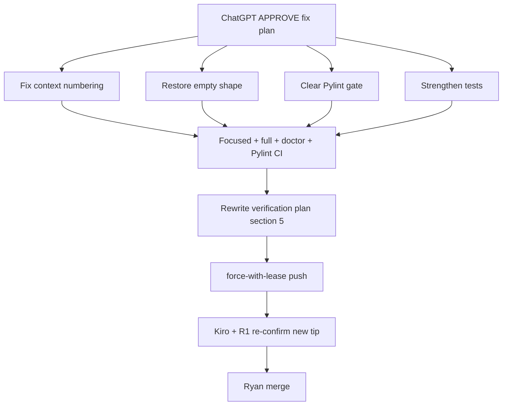

# CURSOR — Fix plan: PR #35 ChatGPT REQUEST CHANGES

**Date:** 2026-07-16
**From:** Cursor
**Status:** **APPROVED for execution** (ChatGPT + Grok recheck). Awaiting Ryan’s **go**. **Do not merge** tip `503add7`.
**PR:** [PR #35](https://github.com/alanmz-crypto/convmem/pull/35) (`fix/2026-07-15-ask-trace` @ `503add7`)
**Stale checklist (do not use for sign-off):** [CURSOR-verification-plan-round-2-trace.md](CURSOR-verification-plan-round-2-trace.md) — rewrite only after §§1–4 land (this plan §5).

## Partner recheck (ChatGPT → Grok → Kiro → R1 → V4)

| Lane | Verdict | Disposition |
|---|---|---|
| ChatGPT | **Approve fix plan for execution.** Do not approve stale verification plan or tip `503add7`. One improvement: exact Pylint CI command (locked below). | Absorbed |
| Grok | Verification plan stale / false confidence on `503add7`. Fix plan §5 not yet applied. Do not use checklist to approve merge. | Absorbed |
| Kiro | Prior confirm **superseded**. Numbering + empty-shape + Pylint blockers real. Re-confirm after fix tip. | Absorbed |
| R1 | Checklist A–E “PASS / ready for merge” on `503add7` | **Superseded / false confidence** — stale checklist does not catch numbering, empty shape, or Pylint. Local `test_mcp_site` tweak was **not** pushed (tip still 4 files @ `503add7`). |
| V4 | “Merge-ready pending Kiro+R1” on `503add7` | **Superseded** — same false confidence; Grok flags #1–2 fixed but ChatGPT blockers remain |

**Authority for merge:** ChatGPT fix plan §§1–4 land → §5 new verification checklist → Kiro + R1 re-confirm new tip → CI Pylint green → Ryan merges.

Confirmed still on remote tip `503add7`:

1. `_format_selection` → every prompt block `[1]` (citations renumbered; synthesis sees all `[1]`). Affects `trace=False` too.
2. Empty path adds top-level `retrieval_query` / `evidence` (main empty return does not).
3. GitHub Actions **Pylint regression gate** fail (+15 fingerprints).



---

## 1. Fix context numbering (blocker)

In `ask.py`:

- Add `_format_context_item(result, *, units: bool, n: int) -> tuple[str, dict]` that renders with the correct `[n]` header.
- Change `_format_selection` to use that helper so **prompt text** and citation `n` match: `[1]`, `[2]`, `[3]`.
- Prefer this over post-hoc string rewrite.

## 2. Restore trace-disabled empty shape (blocker)

Empty early-return when `trace=False`:

```python
{"answer", "citations", "results", "confidence", "warning"}
```

When `trace=True`, add only `"trace"`. Do **not** add top-level `retrieval_query` / `evidence` on the empty path.

Success-path keys stay as on `main` (already include `retrieval_query` / `evidence`).

## 3. Clear Pylint regression gate (blocker)

Do **not** bless new findings into `ci/pylint-baseline.json`.

Refactor `ask()` (extract stage/path helpers) + clean unused test mocks to clear R0912/R0913/R0914/R0917/W0613 (and related) without baseline edits.

### Exact local reproduce (matches CI — ChatGPT improvement)

From a checkout of the PR tip (same deps as [`.github/workflows/pylint.yml`](../../../../.github/workflows/pylint.yml): `requirements.txt` + `pylint==4.0.6`):

```bash
set +e
pylint $(git ls-files "*.py") --output-format=json > pylint-report.json
PYLINT_STATUS=$?
set -e
test -s pylint-report.json

# BASE_REF = merge-base with main (PR base SHA), e.g.:
BASE_REF=$(git merge-base HEAD origin/main)

python3 scripts/pylint_regression_gate.py ci \
  --report pylint-report.json \
  --pylint-status "${PYLINT_STATUS}" \
  --branch-baseline ci/pylint-baseline.json \
  --base-ref "${BASE_REF}"
```

**PASS:** gate exits 0. Alternately, require the GitHub Actions job **Pylint / Pylint regression gate** green on the new tip SHA.

## 4. Strengthen tests (ChatGPT + Grok)

Extend `tests/test_ask_trace.py` (and CLI coverage as needed):

- **Prompt parity:** `trace=False` vs `True` identical prompts; labels `[1]`/`[2]`/`[3]`; outputs equal except optional `trace`.
- **Empty shape:** `trace=False` empty → exact main keys; `trace=True` empty → same + `trace` only.
- **Stage separation:** duplicate ledger IDs → `ledger_deduped.items_total < evidence_reranked.items_total`.
- **Admitted recent:** overlap, over-cap, domain/site miss excluded from `recent_injected`.
- **A1:** `final_context.items_total > trace_limit` → prefix equality + `truncated`.
- **A2 e2e:** patch `_MAX_CONTEXT_CHARS` through `ask()` → `context_delivery.truncated`.
- **CLI:** `--trace` writes valid JSON to stderr.
- If `test_mcp_site` needs `trace=False` in expected kwargs (R1 local note), include that fix in the same tip.

## 5. Rewrite verification plan + PR body (after §§1–4)

Replace stale [CURSOR-verification-plan-round-2-trace.md](CURSOR-verification-plan-round-2-trace.md) content (or add a new-tip checklist) with:

- Work-log addendum: ChatGPT REQUEST CHANGES → fix tip SHA; prior Kiro/R1/V4/R1 “merge ready” **superseded**
- Section **G — Pylint** with the exact commands above (or “GH Actions Pylint regression gate green”)
- Pre-push self-check paste block (acceptance item 8)
- “MERGEABLE ≠ checks green”
- New test rows for numbering, empty shape, dedupe counts, admitted-recent edges, A1 prefix, A2 e2e, CLI
- Focused suites always green; baseline-relative only for full discover/doctor
- Map sections → executive acceptance items 1–8
- Note E may be satisfied by unit tests unless live MCP audit desired
- Live probe D must also assert prompt `[1]`/`[2]`/`[3]` alignment

Refresh PR #35 body accordingly.

## 6. Verify and push

Worktree: `~/Projects/convmem-fix-ask-trace`

```bash
python3 -m unittest tests.test_ledger_recent tests.test_ask_trace -v
python3 -m unittest discover -s tests -q
python3 convmem.py doctor
# then exact Pylint commands from §3
git push --force-with-lease origin HEAD:fix/2026-07-15-ask-trace
```

Request **Kiro + R1 re-confirm** on the **new** tip only. Ryan merges when ChatGPT blockers cleared and CI green.

## Out of scope

MCP evidence default flip; diversification; retrieval-eval; merging debate docs to `main` (Grok #8 — process note only).
