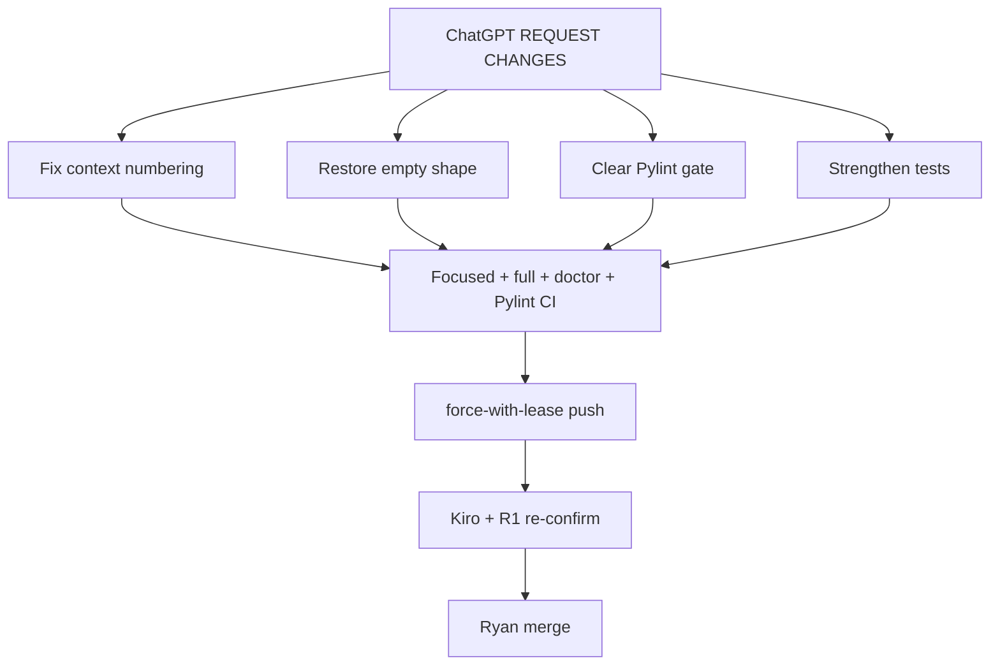

# CURSOR — Fix plan: PR #35 ChatGPT REQUEST CHANGES

**Date:** 2026-07-16
**From:** Cursor
**Status:** Ready to execute when Ryan says go — **do not merge** tip `503add7`
**PR:** [PR #35](https://github.com/alanmz-crypto/convmem/pull/35) (`fix/2026-07-15-ask-trace` @ `503add7`)
**Verification plan (superseded pending this fix):** [CURSOR-verification-plan-round-2-trace.md](CURSOR-verification-plan-round-2-trace.md)

## Partner disposition

| Lane | Verdict | Action |
|---|---|---|
| ChatGPT | **REQUEST CHANGES** — numbering, empty shape, red Pylint, weak tests | **Authoritative blockers** — implement all required fixes |
| Kiro | Confirm (missed numbering + CI) | Do not merge on this alone; re-confirm after fix tip |
| R1 | Confirm (missed same) | Same |
| V4 | Hold for independent verify | Still holds; gaps absorbed where cheap |
| Grok | Sound but not merge-ready | Absorb A2 e2e + A1 final_context truncation tests |

Confirmed on tip `503add7`:

1. `_format_selection` calls `_format_context([r])` → every context block is `[1]` while citation `n` is rewritten (affects **all** paths, including `trace=False`).
2. Empty path adds top-level `retrieval_query` / `evidence`; `origin/main` empty return does not (success path on main already has those keys — leave success path alone).
3. GitHub Actions **Pylint regression gate** fail (+15 fingerprints: ask branches/args/locals, convmem/mcp arg counts, unused test mocks).



---

## 1. Fix context numbering (blocker)

In `ask.py`:

- Add `_format_context_item(result, *, units: bool, n: int) -> tuple[str, dict]` that renders with the correct `[n]` header (extract shared body from `_format_context`, or pass start index into `_format_context`).
- Change `_format_selection` to use that helper so **prompt text** and citation `n` match: `[1]`, `[2]`, `[3]`.
- Prefer this over post-hoc string rewrite.

## 2. Restore trace-disabled empty shape (blocker)

Empty early-return when `trace=False`:

```python
{"answer", "citations", "results", "confidence", "warning"}
```

When `trace=True`, add only `"trace"` (request fields stay inside the envelope). Do **not** add top-level `retrieval_query` / `evidence` on the empty path.

Success-path keys stay as on `main` (already include `retrieval_query` / `evidence`).

## 3. Clear Pylint regression gate (blocker)

Do **not** bless new findings into `ci/pylint-baseline.json`.

Reduce new fingerprints by refactoring (primary) and cleaning tests:

- Extract stage/path helpers from `ask()` to cut R0912/R0914 (branches/locals).
- Prefer keyword-only params; avoid new positional MCP/CLI args where the gate flags R0917.
- Fix test W0613 unused mocks in `tests/test_ask_trace.py`.
- For unavoidable `ask(..., trace=, trace_limit=)` arg-count: extract first; collapse options only if still over threshold.

Re-run the same compare CI uses; CI must go green on the new tip.

## 4. Strengthen tests (ChatGPT + Grok)

Extend `tests/test_ask_trace.py`:

- **Prompt parity:** capture `generate_stream` prompt; `trace=False` vs `True` identical prompts; context labels `[1]`/`[2]`/`[3]`; output keys equal except optional `trace`.
- **Empty shape:** `trace=False` empty → exact main keys only; `trace=True` empty → same + `trace` only.
- **Stage separation:** duplicate ledger IDs so `ledger_deduped.items_total < evidence_reranked.items_total`.
- **Admitted recent:** overlap semantic ledger_id, over-cap, and domain/site miss → not in `recent_injected`.
- **A1:** force `final_context.items_total > trace_limit`; assert prefix equality + `truncated`.
- **A2 e2e:** patch `_MAX_CONTEXT_CHARS` small inside `ask()`; assert `context_delivery.truncated`.
- **CLI:** `--trace` writes valid JSON to stderr.

## 5. Update verification plan + PR body

Update `CURSOR-verification-plan-round-2-trace.md`:

- Work-log addendum: ChatGPT REQUEST CHANGES; tip after fix; prior Kiro/R1 confirm superseded.
- Add **Pylint regression gate** section (CI must pass).
- Add **pre-push self-check** paste block.
- Note “MERGEABLE ≠ checks green.”

Refresh PR #35 body with baseline SHA, self-check greps, probe, and new tip SHA after push.

## 6. Verify and push

Worktree: `~/Projects/convmem-fix-ask-trace`

```bash
python3 -m unittest tests.test_ledger_recent tests.test_ask_trace -v
python3 -m unittest discover -s tests -q
python3 convmem.py doctor
# pylint gate green
git push --force-with-lease origin HEAD:fix/2026-07-15-ask-trace
```

Then request **Kiro + R1 re-confirm** on the new tip. Ryan merges only when ChatGPT blockers are cleared and CI green.

## Out of scope

MCP evidence default flip; diversification; retrieval-eval; merging debate docs to `main` (Grok #8 — process note only).
