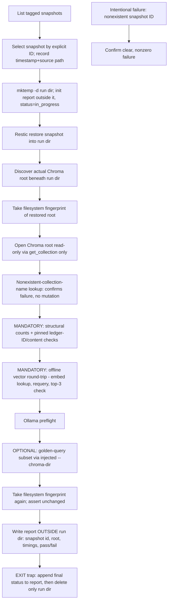

# Architecture: Chroma Restore Drill

**Audience:** Ryan (decision + verification owner)
**Status:** Gates accepted 2026-07-12 (defaults 1–6). Architecture locked; EXECUTION plan is the next artifact — no implementation until EXECUTION is authorized.
**Prior arcs this builds on:** Branching Safety Foundation, Git Hygiene Baseline, Always-Available GitHub Fallback (source-code recoverability). This arc addresses the ChromaDB knowledge store instead — data, not code.
**Review folded in:** Codex, two rounds — (1) restore-path discovery, verification-only open, count source-of-truth, mandatory/optional check split, run-dir hygiene, explicit snapshot selection, failure-mode choice; (2) mandatory offline vector round-trip, asserted no-mutation via fingerprint, pinned fixtures, snapshot-specific count requirement.

---

## Why

The Restic gate is real and fail-closed for durable overwrite paths, and `RECOVER.md` documents a restore procedure to `/tmp`. But nothing in the repo shows evidence of a completed restore followed by an actual Chroma retrieval check against the restored data. "The backup exists" and "the backup works" are different claims, and only the first one is currently proven.

This is a **verification** program, not a new backup mechanism — Restic and the write-gate are unchanged. The deliverable is a runbook and a report, not new infrastructure.

**Explicitly out of scope:** convmem's git-side recovery (covered by the GitHub Fallback arc), general disaster recovery, or any change to the write-gate/snapshot cadence itself.

---

## Policy in one paragraph

Before anyone treats a Restic snapshot as a real safety net, the drill selects a specific tagged snapshot by ID, restores it into a unique `mktemp -d` run directory under a dedicated parent, **derives the actual restored Chroma root beneath that run directory**, and opens that root **read-only via `get_collection`, never `get_or_create_collection`**. A filesystem fingerprint of the restored root is taken before and after all verification — any addition, removal, or content change fails the drill, so "read-only" is an asserted result, not just an implementation convention. Mandatory checks (no embedding service required) cover structural counts on the collections that matter for this snapshot, pinned fixed-ID/content lookups against a fixture that predates the snapshot, a deliberately-nonexistent-collection lookup proving the drill can't paper over a partial restore, and an **offline vector round-trip** — retrieve a fixed unit's stored embedding from the restored collection, query that same collection with it, and require the unit back within the top 3 results — proving the vector index itself is queryable without touching Ollama. An optional semantic check (golden-query subset, gated on an Ollama preflight) runs on top when the embedding service is healthy. Every run produces a report — written **outside** the disposable run directory — before a `trap`-guarded cleanup deletes only that run directory.

---

## What we are buying

| Capability | Outcome |
|------------|---------|
| Correct restore-root discovery | No longer assumes Restic flattens the path — the drill asserts where the Chroma files actually land before opening anything |
| True read-only verification | `get_collection` only, plus a filesystem fingerprint taken before/after all checks — "no mutation" is asserted, not assumed |
| Offline vector-index proof | Embedding round-trip against a fixed unit proves the HNSW/vector path is actually queryable, independent of any embedding service |
| Honest count source of truth | Structural, snapshot-specific — only the collection that must be non-empty (`knowledge_units`) is required to be; optional/historical collections don't create false failures |
| Mandatory/optional check split | An embedding-service outage during the drill reads as "semantic check skipped," not "restore failed" — the vector round-trip is mandatory and Ollama-independent, so the drill isn't left with *zero* vector-path coverage when Ollama is down |
| Pinned fixture | Content expectations predate the snapshot and never compare against the live, possibly-changed corpus |
| Reproducible, explicit snapshot selection | Snapshot chosen by ID after listing, not "latest" — reproducible and auditable |
| Safe run-directory hygiene | Unique `mktemp -d` per run + trap-cleanup of only that directory; report lives outside it |
| Distinct failure-mode proof | Nonexistent-snapshot-ID failure specifically proves the drill's own selection/error handling, separate from a credentials-failure test |

---

## Drill procedure

1. **List** tagged Restic snapshots.
2. **Select** a specific snapshot by explicit ID (not "latest") — record its timestamp and source path in the report for reproducibility. **Reject at this step** if the snapshot's timestamp is older than the fixture's recorded creation timestamp (see step 9) — fixture eligibility is an executable check here, not a prose assumption checked later.
3. **Run directory + report initialized** — `mktemp -d` under a dedicated parent (not raw `/tmp`), unique per run. In the same step, **initialize the report file outside the run directory** (snapshot ID/timestamp already known from step 2) with a status of `in_progress`, before anything that can fail. This is what makes the report durable across a failure, not just across success.
4. **Restore** the snapshot into that run directory via Restic.
5. **Discover the restored Chroma root** — Restic restores the absolute source path beneath the target; the drill must derive and assert this path before opening anything, not assume a fixed relative offset.
6. **Fingerprint (before)** — take a filesystem fingerprint of the restored root (e.g. recursive path + size + mtime + hash listing) before any verification touches it.
7. **Open read-only** — a fresh Chroma client against the discovered root, using **`get_collection` only, never `get_or_create_collection`**.
8. **Nonexistent-collection test** — look up a deliberately nonexistent collection name (not removal of a real collection from the restore) and confirm it fails cleanly. This proves the failure path itself, without touching or degrading the actual restored data.
9. **Mandatory offline proof, part 1 — structural + content:**
   - Structural counts — `knowledge_units` (or the equivalent primary collection) must have count > 0; other, optional/historical collections are checked for *existence* but not required to be non-empty (see Gate 5)
   - Pinned fixed-ID lookups — exact ID + content/digest match against a **fixture with a recorded creation timestamp**, checked against a **minimum-eligible-snapshot-timestamp gate at selection time (step 2)**: if the selected snapshot's timestamp predates the fixture's recorded timestamp, the drill rejects the snapshot before restoring anything, rather than restoring first and hoping the fixture happens to still apply
10. **Mandatory offline proof, part 2 — vector round-trip (no Ollama required):**
    - Retrieve the stored embedding for one fixed, pinned ledger-ID unit directly from the restored collection
    - Re-query that same restored collection using that embedding
    - Require the same unit to appear within the top 3 results (deterministic bound, not "top result(s)")
    - This proves the vector index (HNSW or equivalent) is actually queryable in the restored store, independent of any embedding service being up
11. **Optional semantic proof** (gated on Ollama preflight):
    - Confirm the embedding service is reachable before running semantic checks
    - If unreachable: mark semantic check **SKIPPED**, not FAILED
    - If reachable: run the golden-query subset against the restored store via an **explicit `--chroma-dir`/store-injection path** into `scripts/eval-retrieval.py` (requires a code change — see Cost/risk). This is exactly the step most likely to touch the restored directory unexpectedly (e.g. if `--chroma-dir` injection is imperfect and falls back to a live/writable path), so it must happen **before** the final fingerprint, not after.
12. **Fingerprint (after)** — take the filesystem fingerprint again, **after the optional semantic step has run (whether it PASSED or was SKIPPED)**, and **assert it is unchanged** from step 6. The final fingerprint must cover every verification step that touched the restored directory, including a successful semantic run — this is what makes "read-only" an asserted result rather than an implementation convention.
13. **Report (progressive)** — each step above appends its own result (timing + pass/fail/skip) to the report initialized in step 3, rather than the report being assembled once at the end. By the time the `EXIT` trap runs, the report already reflects everything the drill reached.
14. **Cleanup + final report status** — a single `EXIT` trap does two things, in order: (a) append final status/timings/pass-fail-skip to the already-initialized report (whatever point the drill reached, including a failure at selection/restore/open), (b) delete only the run directory. The trap must fire on every exit path — success, a checked failure (e.g. the intentional nonexistent-snapshot test), or an unexpected crash — so a run that fails at step 2 still produces a report saying so, not silence.
15. **Intentional failure exercise** (separate from the happy path) — supply a **nonexistent snapshot ID** and confirm the drill fails clearly and nonzero at the selection step. A separate bad-credentials test is a distinct, later exercise.

---

## Decisions Ryan must make before build

| # | Decision | Recommendation (default if you assent) |
|---|----------|------------------------------------------|
| 1 | Run-directory scheme | **`mktemp -d` under a dedicated parent** (e.g. `~/.local/share/convmem/restore-drill/`), unique per run, trap-cleaned. Report written outside this directory. |
| 2 | Golden-query subset (optional semantic check) | **Reuse** the fixed set from `scripts/eval-retrieval.py`, requires adding an explicit `--chroma-dir`/store-injection parameter to the script first — required build item, not optional. |
| 3 | Cadence | **One-time this pass** — prove the drill works once, produce the report, done. No recurring doctor freshness check until proven necessary. |
| 4 | Intentional-failure selection | **Nonexistent snapshot ID**, not bad credentials — proves the drill's own selection/error-handling path. Bad-credentials test deferred as a separate exercise. |
| 5 | Count source of truth | **Structural, snapshot-specific this pass**: only `knowledge_units` (or the primary collection) must have count > 0; other collections checked for existence only, not non-emptiness — avoids false failures on optional/historical collections. A full manifest recorded at snapshot-creation time remains the more rigorous future option — **defer** unless folded in now. |
| 6 | Integrity preflight | **Not this pass** — `restic check` adds runtime/operational cost; defer until the basic drill (now including the vector round-trip) is proven. |

---

## Locked (no re-open)

- Live Chroma is never stopped, replaced, or written to by this drill
- Verification open path uses `get_collection` only — `get_or_create_collection` is never used during the drill
- "No mutation" is an **asserted** result via before/after filesystem fingerprint, not just an implementation convention
- The missing-collection test uses a deliberately nonexistent collection name — it never removes or alters a real collection from the restored data
- Run directory is unique per invocation (`mktemp -d`) and deleted via `trap` on both success and failure
- Report is initialized outside the run directory at drill start (before restore/open/anything that can fail) and appended to progressively; an `EXIT` trap writes final status and cleans only the run directory — so a failure at selection, restore, or open still produces a durable report, never deleted by cleanup
- Snapshot is selected by explicit ID, always recorded with timestamp and source path — never "latest" implicitly
- Content fixtures are pinned with a recorded creation timestamp; snapshot selection (step 2) executably rejects any snapshot older than the fixture — "fixture predates snapshot" is an enforced gate, not a prose convention
- The offline vector round-trip is mandatory and Ollama-independent; the golden-query semantic subset remains optional integration coverage
- This arc does not modify the Restic gate, snapshot cadence, or write-gate behavior
- No new always-on infrastructure — this is a runbook + one-time proof, not a service

---

## Verification criteria (revised PASS bar)

| Check | PASS condition |
|-------|-----------------|
| Snapshot selected | Explicit ID resolved; timestamp + source path recorded |
| Restore completes | Restic restore exits 0 into the run directory |
| Restored root discovered | Actual Chroma root correctly located beneath the run directory (not assumed) |
| Read-only open | `get_collection` succeeds for required collections; `get_or_create_collection` never used |
| Nonexistent-collection test | Deliberately-nonexistent name lookup fails cleanly; no real collection touched |
| Structural counts (mandatory) | Primary collection (`knowledge_units`) count > 0; other collections exist (non-emptiness not required) |
| Pinned ledger-ID/content (mandatory) | All spot-checked IDs retrievable, match a fixture predating the snapshot |
| Vector round-trip (mandatory) | Fixed unit's stored embedding re-queried against the same collection returns that unit within the top 3 results |
| Filesystem fingerprint | Identical before and after all verification steps |
| Semantic subset (optional) | PASS when Ollama preflight succeeds and expected IDs appear; **SKIP**, not FAIL, when unreachable |
| Report written | Outside the run directory, initialized before any failing step and finalized by the `EXIT` trap on every exit path; contains snapshot ID/timestamp/source, discovered root, fingerprint result, per-step timing, pass/fail/skip — including for runs that failed early |
| Cleanup | Run directory does not exist after the drill completes, success or failure |
| Intentional failure | Nonexistent-snapshot-ID run exits nonzero with a clear, actionable error, **and still produces a report** documenting the failure (proves the `EXIT` trap fires even on the earliest failure path) |

---

## Cost / risk (honest)

- **Time cost per run:** restoring a full Chroma snapshot is not instant — manual/on-demand drill, not run before every deploy.
- **Does not prove:** that the *live* store matches the snapshot at drill time — only that the snapshot itself restores and verifies correctly.
- **Does not independently prove repository integrity** — a successful restore is not the same claim as `restic check` passing; deferred per Gate 6.
- **Does not cover:** partial/corrupted snapshot recovery, multi-snapshot rollback chains, or restoring onto a different machine's filesystem layout.
- **eval-retrieval.py requires a code change** (`--chroma-dir` injection) before it can validate a restored store.
- **Fingerprinting cost:** a recursive hash listing of the restored Chroma directory adds runtime proportional to store size — acceptable for a one-time/on-demand drill, worth noting if the store grows very large.
- **One-time cadence risk:** without a recurring check, this proof can go stale — accepted for this pass per Gate 3.

---

## Success (executive bar)

- A specific, explicitly-selected Restic snapshot restores into a unique run directory, and the actual Chroma root is correctly discovered beneath it.
- The restored root opens successfully via `get_collection` only; a deliberately-nonexistent collection lookup fails cleanly without touching real data.
- Mandatory checks all pass: structural counts on the primary collection, pinned ledger-ID/content lookups, and the offline vector round-trip — proving both metadata *and* the vector index are genuinely restored and queryable, with zero dependency on Ollama.
- The filesystem fingerprint is identical before and after — "read-only" is proven, not assumed.
- The optional semantic check either passes or is correctly reported as SKIPPED.
- A written report — outside the run directory — records everything needed to reproduce the run.
- The run directory is gone afterward; the report is not.
- A nonexistent-snapshot-ID run fails clearly and nonzero.

---

## Gates (accepted 2026-07-12)

Ryan accepted defaults for gates 1–6. Next: authorize an **EXECUTION** plan (Cursor) for the drill itself — no changes to Restic, the write-gate, or live Chroma without a separate, explicit decision.
