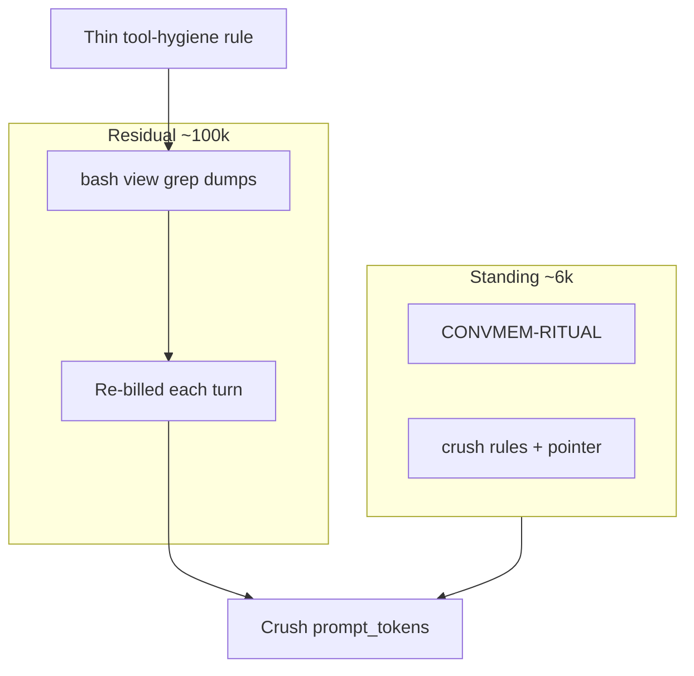

# Architecture: Residual tool-output (Crush cost)

```text
Planning Status

Phase:        Execute in progress (Tasks 0–1); Task 2 soak pending
Characters:   Architect → Builder (Cursor) → Ryan GATE
Functions:    Planner → Builder
Lanes:        Cursor executes on feat branch; Ryan merges
Authority:    Ryan Execute grant 2026-07-22 — measure after Crush restart
```

| Field | Value |
|---|---|
| Status | **Execute in progress** — architecture accepted via [#100](https://github.com/alanmz-crypto/convmem/pull/100) / status [#101](https://github.com/alanmz-crypto/convmem/pull/101); Task 1 shipping on Execute branch |
| Parent | Stage 4 context compression **CLOSED** ([ARCHITECTURE-stage4-context-compression.md](ARCHITECTURE-stage4-context-compression.md)) — this is a **new** arc |
| Owner | Ryan owns merge/grants; Cursor executes after grant |
| Objective | Cut the ~100k prompt tokens Crush still burns after digests left always-on |
| Non-goals | Reopen Stage 4 digests; compact `brief`; mass protocol trim; GitHub Copilot spend settings |

**Execution (after accept):** [EXECUTION-2026-07-22-residual-tool-output.md](EXECUTION-2026-07-22-residual-tool-output.md)

## Human consequence

Crush sessions still cost a lot even though standing rules are small (~6k tokens).
Most of the bill is **huge bash/view/grep dumps that get re-charged every later turn**.
If we do nothing: you keep paying that. If we cut the wrong layer: agents hide failing
logs or re-read whole files and erase the savings. This arc picks one primary lever
and measures before claiming a win.

## Decision (one path — pending accept)

**Primary lever:** a thin always-loaded Crush rule (`tool-output-hygiene`) that caps how
agents keep shell/file/search output in chat (line/byte budgets; prefer `head` /
`tail` / `sed -n` / `view` with offset·limit; on non-zero exit show exit + last N lines,
not a silent truncate).

**Secondary lever (only if primary under-delivers):** reuse existing convmem clip
patterns (`mcp_server` search `[:500]`, ask A2 context limit, brief `_clip`) for any
MCP tool that still returns unbounded JSON. Not a second “brief product.”

**Measurement gate:** ≥3 comparable Crush / `deepseek-v4-flash` routine sessions;
compare mean `prompt_tokens` to Stage 4 Post 1–3 baseline (~98–107k). No PASS from vibes.



## Why architecture (not a drive-by rule)

Crush has **no** config knobs for bash/view output size (schema exposes `tools.ls`
cardinality; truncation strings in the binary are not wired). Deploy scripts set
permissions and standing paths, not output budgets. The hard choice is **who
truncates before history compounds**: host (unavailable), MCP producer (secondary),
or **agent policy on Crush** (available now). Wrong cuts hide errors or force
full re-reads.

## Evidence already in hand (do not re-litigate)

| Finding | Implication |
|---|---|
| Stage 4 closed; digests on-demand; ~8% prompt drop | Standing fix done — leave it |
| Post-demotion standing ~6k tokens | More rule-trimming is small-impact |
| Post 1–3: tools ~63–74% of message chars; bash/view/grep top | Residual = tool dumps |
| Unique tool chars ≪ `prompt_tokens` | Cost is **rebilling history** — early caps compound |

## Options

| Option | Verdict |
|---|---|
| Compact brief / protocol mass trim | Reject as primary — wrong lever |
| MCP-only budgets | Reject as primary — bash/view dominate |
| Patch Crush / wait for upstream caps | Reject — no timeline |
| Thin Crush tool-hygiene rule + measure | **Choose** |
| MCP clip pass | Secondary after Crush measure |

## Risks

| Risk | Mitigation |
|---|---|
| Caps hide failing test/log evidence | Failure exception: exit code + last N lines required |
| Agents re-read full files → no net save | Cap what **stays in chat**; prefer targeted ranges |
| Auto-summarize already on but weak | Task 0: verify state; do not disable it to “help” |
| False savings claims | Require Post-style telemetry rows before PASS |

## Exit criteria

- [x] Ryan **accepted** direction (squash-merge [#100](https://github.com/alanmz-crypto/convmem/pull/100), 2026-07-22).
- [x] Ryan **granted Execute** (2026-07-22) — Tasks 0–1 in flight; Task 2 needs Crush restart + ≥3 sessions.
- Stage 4 docs stay CLOSED.
