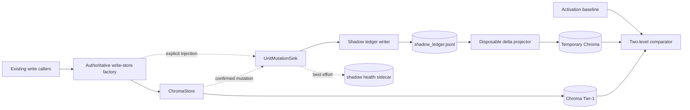

# Architecture Direction — Shadow Ledger Phase 0

> **DRAFT — Awaiting Ryan HITL.** This document chooses an architecture only.
> It does not authorize implementation, production hooks, audit-baseline
> versioning, migration, backup wiring, or a change in data authority.

**Source:** Ryan request on 2026-07-24, incorporating the Qwen ledger-first
audit, Claude's shadow-only review, ChatGPT's Codex work order, Codex's YELLOW
review, and Cursor's revised local draft.

**Authority:** Awaiting Ryan HITL as of 2026-07-24.

**Problem:** Validate whether post-activation `knowledge_units` mutations can be
captured durably and replayed deterministically without changing Chroma's
current Tier-1 authority or claiming that the existing corpus is rebuildable.

## Planning status

| Field | Value |
| --- | --- |
| Phase | Architecture Planning |
| Characters | Architect, Systems Thinker, Risk Reviewer |
| Functions | Planner |
| Lanes | Codex authors; Kiro reviews; Ryan approves (HITL) |
| Status | Draft; direction selected; implementation unauthorized |
| Next phase | `EXECUTION-shadow-ledger-phase0.md`, only after Ryan approves this Architecture |
| Later verification | `VERIFY-shadow-ledger-phase0.md`, created after Execute under the Planning OS |

Neither downstream document is created by this Architecture phase.

## Decision summary

Choose **Option B: an opt-in `ChromaStore` mutation observer**. The storage
wrapper remains the single production mutation boundary for
`knowledge_units`. A write-enabled factory injects a shadow sink only when an
explicit Phase 0 activation contract is satisfied. Read-only stores,
verification stores, evaluation stores, and disposable replay stores receive
no sink.

The sink observes a mutation only after Chroma confirms it. It appends a
versioned event describing the complete post-state or deletion tombstone to a
non-authoritative JSONL file. Failure is visible but never rolls back or changes
the result of the already-successful Chroma mutation. Phase 0 proves only the
post-activation delta for touched entity IDs. Full-corpus bootstrap, canonical
schema freeze, authority cutover, and ledger-first restore remain later HITL
decisions.

## Provenance and repository reality

### Versioned baseline

This draft branch starts from `origin/main` at `8725813`, the merged cloud
research-pack baseline. The active shared checkout was deliberately left on
Ryan's backup/Neutral research branch
`docs/2026-07-24-research-pack-backup-neutral` at `64d714b`.

### Untracked audit baseline

Cursor's shared working tree at `64d714b` contains an untracked
`docs/audit-ledger-first/` directory. It is not part of that commit, is absent
from this isolated Architecture worktree, and is not included in this branch.
Codex inspected the locally present files as unversioned design input:

1. `docs/audit-ledger-first/BACKUP-RESTORE-IMPLICATIONS.md`
2. `docs/audit-ledger-first/CANONICAL-OBSERVATION-PROPOSAL.md`
3. `docs/audit-ledger-first/CURRENT-OBSERVATION-AUTHORITY.md`
4. `docs/audit-ledger-first/EXISTING-DATA-MIGRATION-ASSESSMENT.md`
5. `docs/audit-ledger-first/LEDGER-FAILURE-MATRIX.md`
6. `docs/audit-ledger-first/LEDGER-FIRST-READINESS-VERDICT.md`
7. `docs/audit-ledger-first/REPLAY-AND-PROJECTION-CONTRACT.md`
8. `docs/audit-ledger-first/TRANSITION-OPTIONS.md`

Those files may not be reconstructed from this summary. Versioning or
correcting them requires a separate Ryan authorization and a docs-only change.

### Live authority facts

The 2026-07-24 pre-plan health check reported:

- Chroma is healthy and remains authoritative.
- 11,035 active knowledge units and 1,553 summaries existed at that instant.
- 192 active Chroma units had no JSONL counterpart.
- The legacy collection does not record `convmem:embed_model`; its observed
  model identity must be reported as `unknown`, not inferred from current
  configuration.

These counts are a timestamped observation, not constants for implementation.

## System boundary

### In scope for the eventual Phase 0 implementation

- Mutations to the authoritative Chroma `knowledge_units` collection only.
- A provisional, non-canonical shadow event envelope.
- Post-Chroma, append-only recording with `flock`, file `fsync`, and
  first-creation parent-directory `fsync`.
- Explicit activation, bounded lock acquisition, recursion prevention, and
  visible failure state.
- A read-only activation baseline and touched-ID delta comparison.
- Disposable replay into a newly created temporary Chroma root.
- Runtime-derived inventory of Chroma-only records and deterministic candidate
  classification of legacy decisions.
- Fitness checks that detect new writable Chroma bypasses.

### Out of scope and still prohibited

- Any production read-path change or transfer of authority from Chroma.
- `conversation_summaries`; it remains independently Tier-1.
- A full empty-corpus rebuild claim or migration/bootstrap implementation.
- Freezing the long-term canonical observation schema.
- Rewriting `knowledge_units.jsonl` or mutating live Chroma from a replay tool.
- Changing `decisions-approved.jsonl`, pending-decision, or governed-decision
  authority.
- Restic configuration, backup timers, retention automation, or restore-order
  changes.
- Neutral Core, Office Team, or cross-project extraction work.
- Runtime implementation during Architecture Planning.

## Existing constraints and mutation inventory

`chroma_store.py` owns the production `chromadb.PersistentClient` and exposes
the write methods. Current production callers route unit changes through these
methods:

| Mutation | Storage boundary | Known callers / behavior |
| --- | --- | --- |
| Create or upsert | `ChromaStore.add_unit` | observation ingest, legacy ingest, inter-model ingest, governed approval |
| Replace document + metadata | `ChromaStore.update_unit` | ledger-kind upsert and document repair |
| Metadata update | `ChromaStore.update_unit_metadata` | verification, refine jobs, forget, undo/restore |
| Source supersede | `ChromaStore.supersede_units_for_source` | re-index and neutralize flows; currently loops per entity |
| Hard delete by source | `ChromaStore.delete_units_for_source` | source purge and non-superseding re-index |

Summary creation/deletion methods are deliberately excluded.

The direct-client check found no production Python writer bypassing
`ChromaStore`. `eval_corpus/shadow_build.py` directly creates a Chroma client
for evaluation projection; tests and the restore drill also open clients for
isolated purposes. These are allowed exceptions and must never receive the
production mutation sink. `chroma_readonly.py` remains a SQLite read facade and
is not a writer.

An implementation-phase fitness check must fail when a new non-test direct
`chromadb.PersistentClient` write appears outside an explicit allowlist. A
second check must enumerate every `ChromaStore` unit-mutating method and prove
that each emits or explicitly excludes a mutation event.

## Options considered

| Option | Summary | Decision |
| --- | --- | --- |
| A — call-site hooks | Append shadow records in observe, ingest, verify, refine, purge, and inter-model callers. | Rejected: semantic context is convenient, but coverage drifts as callers multiply and partial bulk mutations are easy to miss. |
| **B — opt-in storage mutation observer** | `ChromaStore` reports confirmed per-entity unit mutations to an injected sink; only the authoritative write factory may inject it. | **Chosen:** one deep boundary covers current callers while explicit injection prevents replay recursion and accidental read-store writes. |
| C — ledger-first outbox before Chroma | Persist an authoritative intent before Chroma and project from it. | Rejected for Phase 0: this changes write ordering, failure semantics, and practical authority before cutover gates pass. |

## Chosen module boundaries

The implementation design is split into deep modules, not call-site wrappers:



### `ChromaStore`

- Accepts an optional mutation observer; the default is `None`.
- Does not load global configuration or decide whether shadowing is enabled.
- Creates one event context before a mutation, calls Chroma, then reports the
  confirmed result.
- Never holds the shadow lock while acquiring or using Chroma.
- Reports per-entity success from source supersede/delete operations.
- Preserves the successful Chroma return behavior even if observation fails.

### Authoritative write-store factory

- Is the only place that may construct a production store with a sink.
- Canonicalizes and compares the configured Chroma root and the requested root.
- Injects no sink unless explicit configuration, activation manifest, ledger
  validation, and exact-root checks all pass.
- Gives read, verify, restore-drill, evaluation, and replay stores `None`.
- Replaces direct production writer construction during the later Execute
  phase; a fitness check prevents regression.

### Shadow ledger module

- Owns path resolution, envelope validation, sequence allocation, locking,
  append serialization, durability, tail checks, health reporting, and full
  validation.
- Exposes one narrow append operation and read/validate operations.
- Does not import Chroma or embedding code.

### Disposable projector and comparator

- Consume shadow records but never open the configured production root for
  write.
- Use a newly created temporary directory with a tool-owned safety marker.
- Force `mutation_sink=None` regardless of configuration.
- Produce diagnostics and a machine-readable report; they never repair live
  data.

## Eleven locked Phase 0 decisions

### 1. Activation

Shadowing is **disabled by default**. Enabling it later requires Ryan's
separate hook authorization and an activation operation that:

1. resolves the configured authoritative Chroma root;
2. validates or creates an empty mode-`0600` shadow file;
3. writes a baseline manifest atomically;
4. records code revision, normalized root, UTC activation time, live counts,
   per-entity state hashes, configured embedding model, observed model identity,
   and starting shadow sequence;
5. refuses activation when the shadow file is corrupt or belongs to a different
   baseline.

The sink attaches only when the store root equals the canonical configured root
after `resolve()`. Environment variables or a path-name convention alone cannot
activate it.

### 2. Provisional event envelope

The Phase 0 envelope is an operational observation format, not the final
canonical ledger schema:

```json
{
  "shadow_schema_version": 1,
  "event_id": "unique-id-created-before-the-chroma-call",
  "sequence": 42,
  "collection": "knowledge_units",
  "operation": "metadata_update",
  "stable_entity_id": "caller-supplied-chroma-unit-id",
  "ledger_id": "optional-ledger-id",
  "recorded_at": "2026-07-24T18:00:00.000000Z",
  "post_state": {
    "document": "complete document or null for delete",
    "metadata": {},
    "deleted": false
  },
  "document_hash": "sha256-or-null",
  "metadata_hash": "sha256",
  "state_hash": "sha256",
  "embed_model": "unknown",
  "embed_dims": null
}
```

`sequence` is assigned while holding the ledger lock. Raw embeddings are never
written. Delete events carry `deleted: true`, a null document, the last known
metadata when available, and the pre-delete state hash for diagnosis.

### 3. Event vocabulary

The allowed operations are closed for schema version 1:

| Operation | Meaning |
| --- | --- |
| `create` | Entity did not exist and now has a full post-state. |
| `replace` | Existing document and/or metadata was replaced. |
| `metadata_update` | Metadata changed without a tombstone-state transition. |
| `supersede` | Active entity became superseded. |
| `restore` | Superseded/deleted logical state became active again. |
| `delete` | Entity was hard-deleted from `knowledge_units`. |

`add_unit` distinguishes create from replace using the existing pre-read.
`update_unit_metadata` compares before/after tombstone fields to distinguish
metadata update, supersede, and restore. Bulk source operations emit one event
per confirmed entity; an aggregate count is diagnostic only and never replaces
entity events.

### 4. Hash and equality contract

All hashes use SHA-256 over UTF-8 canonical JSON (`sort_keys=true`, compact
separators, no NaN). Phase 0 does not define a canonical business-field
allowlist.

- `document_hash` hashes the exact document string.
- `metadata_hash` hashes the complete normalized Chroma metadata mapping.
- `state_hash` hashes `stable_entity_id`, delete state, document, and metadata.

Two comparison levels are reported independently:

| Level | PASS requires |
| --- | --- |
| State equality | Same stable entity ID, delete/active state, and `state_hash`. |
| Projection equality | State equality plus document hash, metadata hash, embedding-model tag, and dimensions when known. |

Raw vectors are excluded. `unknown` model identity never equals a known identity
but is reported as **UNVERIFIABLE**, not a mismatch and not a PASS. Document
differences always fail projection equality because documents drive embeddings
and retrieval.

### 5. Duplicate and retry semantics

`event_id` is generated before the Chroma call and retained through the
post-commit append attempt. If append acknowledgement is uncertain, retries use
the same event object and `event_id`.

The writer may contain repeated lines with the same `event_id`; append-only
history is not scanned and rewritten to suppress them. Replay applies the first
valid occurrence and counts later occurrences as idempotent duplicates. Events
with different IDs are processed in sequence even when their state hashes are
equal; this preserves a legitimate `A → B → A` history.

Applying a duplicate or repeated after-state is safe because projection uses
`stable_entity_id` as the upsert key. Duplicate counts remain visible in the
report.

### 6. Lock and commit order

The fixed order is:

1. create the event context without taking the shadow lock;
2. perform and confirm the Chroma mutation;
3. return from the Chroma client operation without retaining a Chroma lock;
4. acquire the shadow `flock` with a **250 ms acquisition budget**; an outer
   caller-owned source lock may still be held, but the shadow sink never
   acquires a source lock;
5. validate the tail, assign sequence, issue one encoded-byte append, flush,
   and `fsync` the file;
6. on first creation, `fsync` the parent directory;
7. release the shadow lock and report latency/status.

No code may acquire a Chroma lock while holding the shadow lock. The 250 ms
budget applies to lock acquisition. `fsync` itself has no safe hard wall-clock
bound; the implementation must measure it and mark append latency above
**500 ms** as degraded. It must not use unsafe signal interruption to pretend
that kernel I/O is bounded.

### 7. Corruption handling

- Append validates the final complete record and sequence while holding the
  lock. An invalid or truncated tail makes the append fail visible; the writer
  does not auto-truncate or silently add a newline.
- Full validation scans every record before activation and replay.
- Invalid middle records or truncated tails make readiness **FAIL**.
- Disposable replay may continue after copying the raw invalid record to a
  temporary diagnostic quarantine, but its overall result remains FAIL.
- A checkpoint never advances past the first invalid record.
- Repair of the shadow file is an explicit future operator action, not Phase 0
  automatic recovery.

Process-kill tests can prove boundary behavior and parser recovery. They cannot
prove power-loss durability; tests must separately assert that file and
first-creation directory `fsync` calls occur.

### 8. Failure visibility and authoritative result

Shadow errors never roll back Chroma and never change a successful Chroma
method into a failed authoritative mutation. They must produce all available
signals:

- a structured warning to the caller/system journal;
- a best-effort atomic health sidecar recording last success, last failure,
  failure class, consecutive failures, lock timeouts, last event ID, last
  sequence, and append latency;
- a `doctor` status that is WARN on a fresh isolated failure and FAIL readiness
  on persistent failure, corruption, or unexplained comparison drift;
- report fields that distinguish disabled, healthy, degraded, corrupt, and
  baseline-mismatch states.

If the process dies after Chroma success but before any shadow or health write,
only baseline/touched-ID comparison can reveal the gap. Phase 0 explicitly does
not claim automatic recovery for this window.

### 9. Disposable replay and comparison

Phase 0 replay is a **delta projector**, not a full rebuild:

- The activation manifest defines sequence zero and the production comparison
  baseline.
- Replay reduces valid shadow events in order to the final state of touched
  entity IDs.
- It writes only to a freshly created temp Chroma root containing a safety
  marker and refuses the configured production root, its parent, or a nonempty
  unmarked target.
- It injects no mutation sink and performs no shadow append.
- It may use deterministic placeholder embeddings of the recorded dimension;
  it makes no Ollama/network calls and does not claim vector equivalence.
- The comparator reads production state and compares only touched IDs, reporting
  missing-in-shadow, missing-in-Chroma, state mismatch, projection mismatch,
  unknown embed provenance, duplicates, corrupt records, and extras.
- The replay checkpoint lives under the disposable root and records sequence
  plus event ID. It advances only after the event is projected successfully.

A successful empty-Chroma rebuild of the entire historic corpus remains a
later bootstrap/migration gate.

### 10. Inventory and classification

Inventory is read-only and snapshot-stamped. It derives counts at runtime and
records input paths, timestamps, file hashes, Chroma root identity, code
revision, and comparison rules. It never treats `192` or `3,448` as constants.

The Chroma-only report emits counts and stable IDs with category hints while
avoiding record payloads on stdout. Legacy-decision candidate classification is
deterministic and local:

1. exact approved identity/content match;
2. normalized title+summary match with provenance agreement;
3. likely observation/non-governed extracted statement;
4. ambiguous and requires human review.

No LLM/API call is permitted without separate Ryan authorization for provider,
scope, and cost. Classification output never mutates Chroma, JSONL authority,
or decision logs. Human disposition of ambiguous rows remains a cutover gate.

### 11. Backup and restore doctrine

During Phase 0:

- Chroma remains Tier-1 and the restore source.
- The intended shadow path is under the configured convmem data root with mode
  `0600`.
- Documentation may state an intent to retain the validation ledger for the
  Phase 0 observation period plus 30 days after its readiness report.
- No Restic include, timer, tag, external copy, or restore procedure changes in
  this arc.
- Any later lightweight shadow backup requires an exact separate Ryan grant and
  remains validation continuity only.
- `ledger → validate → rebuild Chroma` is post-cutover doctrine and cannot be
  exercised or documented as current recovery behavior.

`decisions-approved.jsonl` and proposal lifecycle event logs retain their
existing authority and backup treatment.

## Activation baseline contract

The baseline is evidence, not a bootstrap ledger. Its machine-readable manifest
must contain:

- manifest version and unique baseline ID;
- UTC activation timestamp and code commit;
- resolved authoritative Chroma root and collection identity;
- active and total unit counts;
- stable entity IDs with document, metadata, and state hashes;
- configured and observed embedding-model identity plus known dimensions;
- shadow file identity and starting sequence;
- hashing rules/version;
- a status proving full manifest completion before activation.

Activation writes a temporary manifest, `fsync`s it, atomically renames it, and
`fsync`s the parent directory. An incomplete manifest cannot enable the sink.
The manifest is not fed into production Chroma and cannot be called canonical.

## Failure model and expected evidence

| Boundary | Chroma result | Shadow result | Expected Phase 0 evidence |
| --- | --- | --- | --- |
| Failure before Chroma commit | No authoritative change | No event | No touched-ID drift. |
| Chroma succeeds; append succeeds | Authoritative change | Durable event | Delta replay and both equality levels assess the touched ID. |
| Chroma succeeds; lock times out | Authoritative change | Missing event | Warning + health degradation; comparator reports missing-in-shadow. |
| Chroma succeeds; process dies before append | Authoritative change | Missing event and possibly no health update | Comparator reports unexplained touched-ID/baseline drift; no auto-heal claim. |
| Append writes; `fsync` fails | Authoritative change | Durability uncertain | Same event ID may be retried; duplicates are idempotent; readiness non-PASS until reconciled. |
| Ledger tail is corrupt | Chroma remains authoritative | New append refused | Doctor/readiness FAIL; no checkpoint advancement. |
| Bulk source mutation partially completes | Successful entities changed | One event per confirmed entity | Report matches completed subset; no aggregate event hides partial progress. |

## Fitness functions and evidence gates

Architecture approval does not authorize these checks to be implemented, but
the later Execution plan must make them concrete:

1. **Boundary fitness:** no production direct Chroma writer outside the approved
   storage module; explicit allowlist for evaluation/test/restore tools.
2. **Coverage fitness:** every unit mutation method emits a confirmed per-entity
   event or is explicitly excluded by collection.
3. **Activation fitness:** non-authoritative, read, temp, and mismatched-root
   stores never receive a sink.
4. **Envelope fitness:** schema, operation, sequence, hashes, and post-state are
   validated before append and before replay.
5. **Durability fitness:** mode, one-write append, file `fsync`, first-create
   directory `fsync`, lock serialization, timeout, and uncertain-ack duplicate.
6. **Crash-window fitness:** an injected Chroma-success/pre-shadow termination
   produces a detectable comparison gap.
7. **Corruption fitness:** truncated tail and invalid middle line make readiness
   fail and prevent checkpoint advancement.
8. **Replay safety fitness:** production root, parent, symlink alias, nonempty
   unmarked target, and sink-enabled projector are refused.
9. **Equality fitness:** document drift cannot PASS projection equality;
   unknown embedding identity is UNVERIFIABLE.
10. **Inventory fitness:** outputs are runtime-derived, snapshot-stamped,
    deterministic, and non-mutating.

## Readiness report semantics

Phase 0 may report one of:

- **PASS — delta capture:** all covered post-activation touched IDs reconcile,
  no corruption exists, failure telemetry is clear, and unknown provenance is
  separately disclosed.
- **PARTIAL:** the mechanism is healthy but evidence is insufficient, embed
  provenance is unknown, or the observation period has not covered all
  mutation types.
- **FAIL:** unexplained missing events, state/projection mismatches, corruption,
  persistent sink failure, unsafe replay target, or nondeterministic inventory.

PASS never means the historic corpus is rebuildable and never authorizes
cutover.

## Risks and reversibility

| Risk | Consequence | Mitigation / reversal |
| --- | --- | --- |
| Synchronous `fsync` latency | Successful writes return more slowly; kernel I/O is not hard-bounded. | Measure separately from lock wait; disable the opt-in sink to return to current behavior. |
| Post-Chroma crash gap | A successful unit mutation has no shadow event. | Baseline/touched-ID comparison detects but does not auto-repair; Chroma remains truth. |
| Hidden writer bypass | Shadow evidence gives false confidence. | Static bypass fitness plus integration coverage at the storage boundary. |
| Replay recursion | Temp projection appends new production shadow events. | Observer defaults to `None`; replay constructor forcibly refuses a sink. |
| Sensitive duplicate corpus | Shadow file contains documents and metadata. | Mode `0600`, no payload stdout, no backup wiring without separate authorization. |
| Provisional schema ossifies | Phase 0 event shape is mistaken for canonical law. | Name it `shadow_schema_version`; prohibit cutover/schema freeze in this arc. |
| Baseline becomes stale or mixed | Comparison produces misleading drift. | Immutable baseline ID/root/hash contract; refuse mismatched activation/replay. |
| Unknown embed provenance | Projection equivalence is overstated. | Report UNVERIFIABLE and keep retrieval equivalence out of Phase 0. |

The entire mechanism is reversible by disabling sink injection. Shadow files
remain diagnostic artifacts; no reader or restore path depends on them.

## Rejected claims

The Architecture explicitly rejects these statements:

- “Phase 0 proves a full Chroma rebuild.”
- “Every Chroma write is captured.” Summaries are intentionally excluded.
- “Shadow failures auto-heal.”
- “A successful Chroma mutation can be rolled back when shadow append fails.”
- “There is zero production behavior change.” Latency, disk usage, and logging
  are real side effects.
- “Configured embedding model equals historic collection provenance.”
- “The shadow ledger is a backup or restore source.”
- “The provisional envelope is the canonical observation schema.”

## Audit-document correction dependency

Before Ryan authorizes versioning the local audit baseline, a docs-only pass
must correct at least:

| Local audit file | Required correction |
| --- | --- |
| `REPLAY-AND-PROJECTION-CONTRACT.md` | Scope full rebuild to post-cutover; fix the random-Chroma-ID claim; require exact document equality; stop checkpoint at corruption. |
| `TRANSITION-OPTIONS.md` | Replace “zero production behavior change”; scope coverage to unit mutations; distinguish delta proof from historic rebuild. |
| `LEDGER-FAILURE-MATRIX.md` | Add post-Chroma/pre-shadow gap and bounded-lock/fsync semantics; corruption is readiness FAIL. |
| `BACKUP-RESTORE-IMPLICATIONS.md` | Add Phase 0 banner: Chroma-first restore unchanged; shadow backup wiring not authorized. |
| `LEDGER-FIRST-READINESS-VERDICT.md` | Mark inventory counts as snapshot values and separate Phase 0 delta gates from cutover gates. |
| `CURRENT-OBSERVATION-AUTHORITY.md` | Preserve Chroma authority and explicit summary/decision-log exclusions. |
| `EXISTING-DATA-MIGRATION-ASSESSMENT.md` | Runtime-stamp inventory; keep human classification and ID mapping as later gates. |
| `CANONICAL-OBSERVATION-PROPOSAL.md` | Label the schema provisional/end-state; do not substitute it for the Phase 0 event envelope. |

This Architecture branch does not include or modify those untracked files.

## HITL gates and downstream handoff

1. **Now — Architecture:** Ryan reviews this draft; Kiro design review may be
   requested. No runtime work is authorized.
2. **After Architecture approval — Execution Planning:** Codex may create
   `docs/plans/EXECUTION-shadow-ledger-phase0.md`, mapping this direction into
   bounded tasks and exact verification commands. That document still requires
   Ryan HITL.
3. **Separate docs authorization:** Ryan may authorize correction/versioning of
   the eight local audit files and any Phase 0 contract artifact.
4. **Separate Execute authorization:** Cursor may implement only the approved
   Execution plan. Production activation remains disabled.
5. **Separate activation authorization:** Ryan approves the exact root, config
   value, baseline operation, and final enabled state.
6. **Later cutover architecture:** canonical schema, bootstrap/migration,
   treatment of every orphan/legacy decision, restore-order flip, and any
   Neutral work require new Architecture and HITL.

This draft intentionally stops before task decomposition. It chooses the
system direction, locks the eleven required decisions, names evidence gates,
and leaves implementation authority with Ryan.

Active phase lane must stop here. Await HITL.
