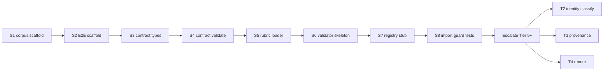

# Flash-Scoped JudgeBench Execute Brief

Crush-oriented, tier-tagged micro-slice executor brief for **DeepSeek V4 Flash**
(Tier 1). This is the **prep-work executor brief** for the cheapest rung of the
delegation ladder. It does **not** replace
[`EXECUTION-judgebench.md`](EXECUTION-judgebench.md) (Codex author of record); it
only tells Flash which slices it may own, how to prove each done, and when to
**stop and escalate** (Tier 5+) instead of absorbing harder work.

---

## 1. Header block (mandatory for every Crush session)

- **Executor:** DeepSeek V4 Flash in Crush lane (Tier 1 default)
- **Harness:** Crush with shell tools — **not** `delegate-deepseek.sh` alone
  (API cannot commit)
- **Spec authority:** [`ARCHITECTURE-judgebench.md`](ARCHITECTURE-judgebench.md)
  — invariants are non-negotiable
- **Plan authority:** [`EXECUTION-judgebench.md`](EXECUTION-judgebench.md) —
  task deps and Ryan stop points
- **HITL:** Architecture lock + Execution HITL required before merging execute
  code to `main`

**Authority gate (unchanged):** Flash slices are **prep work only** until Ryan
Architecture lock + Execution HITL. Slice completion is **not** production
calibration. Do not treat a slice as a green light to run, select, or calibrate.

---

## 2. Crush opener (copy-paste block)

Extend [`docs/CRUSH-DEEPSEEK-BOOTSTRAP.md`](../CRUSH-DEEPSEEK-BOOTSTRAP.md)
ritual with:

```text
You are DeepSeek V4 Flash, Tier 1, Crush lane.
Execute ONLY slices listed in docs/plans/EXECUTION-judgebench-flash-slices.md.
First line every turn: "I am DeepSeek V4 Flash, Tier N. Slice SX."
If slice is OFF-LIMITS or ambiguous: STOP and escalate — do not guess.
Say "Crush found it" — not "DeepSeek found it."
convmem work start feat … before first tracked edit on convmem prod.
```

---

## 3. Escalation rules (embed from `config/agent-protocol.md`)

| Event | Action |
|-------|--------|
| Slice complete + gates green | Commit, push, next slice |
| **Capability failure** (wrong output, invariant risk, needs cross-module wiring) | Stop; report slice ID; escalate per table below |
| **Infrastructure failure** (timeout, disconnect) | Retry same tier once; then hand off to Ryan/Cursor |
| Ambiguous spec / would weaken invariant | **Stop** — no improvisation |
| Touching gold, judge selection, live `ask.py`, Chroma in semantic path | **Refuse** — OFF-LIMITS |

### Escalation ladder (Flash escalates up)

| From | To | When |
|------|-----|------|
| T1 Flash | T2 Qwen 3.5 35B-A3B | Single-file mechanical failure |
| T1–2 | T3 Qwen 3.7 Flash | Cheap retry with tools |
| T1–3 | T4 Codex Luna low | Well-scoped multi-file still mechanical |
| T4 fails | T5–6 Luna med/high | Rubric semantics, multi-module glue |
| T5–6 fails | T7 Qwen 3.7 Plus / T8 V4 Pro | Identity, provenance, runner orchestration |
| T7–8 fails | T9 Luna max | Legacy boundary / comparison signature |
| T9 fails | Cursor Composer | Integration PR, contested migration |

---

## 4. OFF-LIMITS table (Flash must refuse)

Maps to EXECUTION T2–T5 core logic and Ryan stops:

- `eval_model_identity.py` **classification** (`cross_family`, `unknown`
  fail-closed)
- Judge preflight, pin-for-run, fallback resolution
- `eval_provenance.py` comparison-signature / `needs_rebaseline` logic
- JudgeBench **runner** that invokes LLM judge or compares to gold
- `eval_judge.py` legacy shim / provenance isolation
- Corpus **case content** or **gold** authoring
- Judge model selection or calibration runs
- Chroma orphan / Tier-L work (separate arc)

---

## 5. Flash-owned slices (ordered, one commit per slice preferred)



| Slice | Maps | Tier | Deliverable | Done-when |
|-------|------|------|-------------|-----------|
| **S1** | T4 partial, T6 partial | 1 | `eval_corpus/fixtures/judgebench/semantic-v1/` — `manifest.json`, empty `cases.jsonl`, empty `gold.jsonl`, `rubrics/` dir | Manifest validates; hashes fields present; no case rows |
| **S2** | T6 | 1 | `eval_corpus/fixtures/convmem-e2e/synthesis-v1/` — same shape, disposition placeholders only | Parses; **no gold values** |
| **S3** | T1 | 1 | New module e.g. [`eval_judgebench/contracts.py`](../../eval_judgebench/contracts.py) — `SemanticJudgmentV1`, `JudgeInvocationV1` dataclasses + `to_dict`/`from_dict` | Round-trip tests; extra JSON keys rejected |
| **S4** | T1 | 1–2 | [`eval_judgebench/contract_validate.py`](../../eval_judgebench/contract_validate.py) — **universal** structural rules only (enums, `reason` length, forbidden unknown properties) | pytest: valid passes; malformed → `invalid_output` signal, not coerced verdict |
| **S5** | T1 | 2 | [`eval_judgebench/rubric.py`](../../eval_judgebench/rubric.py) — load versioned rubric by `rubric_id` from fixture dir | Unknown `rubric_id` → error; no semantic inference |
| **S6** | T1 | 2–4 | One reference rubric file `semantic-v1/rubrics/synthesis-grounded-v1.json` + validator that checks judgment against **rubric data** (permitted combinations as data, not hard-coded global abstention rules) | pytest with fixture judgments: justified/unjustified abstention per rubric only |
| **S7** | T2 partial | 2–3 | `eval_corpus/fixtures/judgebench/identity-registry-v1.json` + [`eval_judgebench/identity_registry.py`](../../eval_judgebench/identity_registry.py) — **load and normalize only**; `classify_independence()` raises `NotImplementedError` or returns stub that always `unknown` with docstring "Tier 5+" | Loader resolves aliases; **no** cross_family claims |
| **S8** | T4 guard | 1 | `tests/test_judgebench_no_chroma.py` — static import / AST guard: judgebench package tree must not import `chroma_store`, `chroma_readonly`, `ask` | pytest green |
| **S9** | T1 tests | 1 | `tests/test_judgebench_contracts.py`, `tests/test_judgebench_rubric.py` | Covers S3–S6 golden cases |

**Branch discipline:** `convmem work start feat 2026-08-08-judgebench-flash-s1`
(or resume); one slice per commit message:
`add judgebench slice S1: semantic-v1 corpus scaffold`.

**Reuse existing patterns:**

- Atomic writes: [`eval_corpus/io_atomic.py`](../../eval_corpus/io_atomic.py)
- Offline pytest style:
  [`tests/test_eval_synthesis.py`](../../tests/test_eval_synthesis.py)
- J0 mechanics stay in [`eval_grading.py`](../../eval_grading.py) — Flash does
  not duplicate

---

## 6. Slice execution checklist (per slice)

1. Announce tier + slice ID (first line)
2. `convmem doctor` (once per session)
3. `git branch --show-current` — not `main`
4. Implement **only** this slice's files
5. `pytest tests/test_judgebench_*.py -q` (or slice-specific path)
6. Commit + push with explicit refspec
7. Handoff: slice ID, SHA, gate output, "escalate" or "next slice"

---

## 7. Mapping slice brief → EXECUTION tasks

| EXECUTION task | Flash slices | Remaining after wall |
|----------------|--------------|----------------------|
| T1 Contracts + rubric framework | S3–S6, S9 | Edge-case rubric policy review → Tier 5 if needed |
| T2 Identity | S7 loader only | **T2b** classify + fail-closed → Tier 5–8 |
| T3 Provenance | — | Tier 5–8 |
| T4 Runner + corpus | S1, S8 | **T4b** runner orchestration → Tier 5–7 |
| T5 Legacy shim | — | Tier 6–8 |
| T6 E2E scaffold | S2 | Gold population → Ryan stop |

---

## 8. What this brief does NOT authorize

- Does not authorize Execute without Ryan HITL
- Does not assign Flash T2 classification, T3 provenance, T4 runner, T5 legacy
- Does not open Codex re-authorship unless Ryan asks
- Does not merge the docs branch to `main` (Ryan PR)
