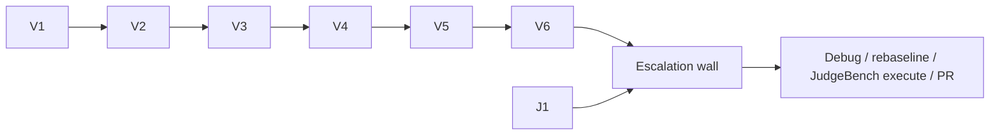

# Flash Slice Brief — Post-Rebuild Verify (T7 R4)

> **What this is:** Tier-tagged Flash executor brief for DeepSeek V4 Flash (Crush lane) to run **T7 R4 post-rebuild verification gates** mechanically, capture evidence to `/tmp`, and hand off to Cursor only when gates fail or judgment is required. Indexing is complete (~18.4k units); R3 (rebuild) is done; R4 (post-verify) is open.
>
> **Status:** planned. Authorized by Ryan via this brief; not live mutation.

---

## Header block

- **Executor:** DeepSeek V4 Flash in Crush lane (Tier 1 default)
- **Harness:** Crush with shell tools — **not** `delegate-deepseek.sh` alone (API cannot commit)
- **Spec authority:** [ARCHITECTURE-judgebench.md](ARCHITECTURE-judgebench.md) — invariants non-negotiable (offline semantic calibration)
- **Plan authority:** [EXECUTION-chroma-reconcile-tier-l.md](EXECUTION-chroma-reconcile-tier-l.md) — task deps and Ryan stop points
- **HITL:** Architecture lock + Execution HITL required before merging execute code to `main`
- **Authority gate:** Flash slices here are **verification only** — no corpus mutation, no judge-authoring, no merge. Slice completion does not equal production deployment.

### Status header (brief state)

- **Parent arc:** [EXECUTION-chroma-reconcile-tier-l.md](EXECUTION-chroma-reconcile-tier-l.md) (T7, Phase R4)
- **Index evidence:** ~18,426 units (`convmem doctor` chroma count); index complete per [CRUSH-2026-08-08-index-complete-judgebench-unblock.md](../inter-model/CRUSH-2026-08-08-index-complete-judgebench-unblock.md)
- **JudgeBench:** S1–S9 landed on `main` (#144). T3/T4/T5 execute is **behind the escalation wall** — not Flash.
- **Judge upgrades branch:** `fix/2026-08-08-2026-08-09-judge-bench-upgrades` — Flash may **verify** (pytest only); not author/merge.
- **Do not touch this plan's branch during Flash execution** unless a new slice explicitly says so.

---

## Crush opener (copy-paste into session start)

```text
You are DeepSeek V4 Flash, Tier 1, Crush lane.
Execute ONLY slices in docs/plans/EXECUTION-post-rebuild-verify-flash-slices.md.
First line every turn: "I am DeepSeek V4 Flash, Tier 1. Slice VX."
If slice is OFF-LIMITS or ambiguous: STOP and escalate — do not guess.
Say "Crush found it" — not "DeepSeek found it."
convmem work start wip 2026-08-08-post-rebuild-verify before first tracked edit.
Do NOT touch fix/2026-08-07-judge-bench-judge-upgrades worktree or its fixtures.
Do NOT rm/truncate ~/.local/share/convmem/ (hook-blocked).
```

---

## Escalation rules

| Event | Action |
|-------|--------|
| Slice complete + gates green | Capture evidence, next slice |
| **Capability failure** (wrong output, invariant risk, crash) | Stop; report slice ID; escalate per wall below |
| **Fix attempt limit** | **2 attempts max** to fix a failing test/lint/gate. If the fix doesn't land in 2 tries, escalate — do not keep retrying at the same tier. |
| **Infrastructure failure** (timeout, disconnect) | Retry same tier once; then hand off to Ryan/Cursor |
| Ambiguous spec / would weaken invariant | **Stop** — no improvisation |
| Touching anything in OFF-LIMITS table | **Refuse** — do not attempt |

### Escalation wall (this brief)

Flash says exactly: *"This task requires Cursor because: [reason]. I cannot complete it at my tier."*

| Trigger | Cursor action |
|---------|---------------|
| Inventory tier **L** after rebuild | Debug ingest path; **do not** loop blind rebuild |
| Calibration **crashes** (NoneType rerank or ask failure) | P0 regression / orphan leak investigation |
| Calibration **completes** but pass rate < 100% with no orphans | **Debugging + rebaseline** — compare Ollama 0.30.11→0.32.3; Ryan rebaseline lock |
| pytest on judge upgrades branch fails | Fix on branch; Cursor implements |
| Any spec ambiguity (what "pass" means for cal after Ollama bump) | Cursor plans rebaseline; Ryan locks |

---

## OFF-LIMITS table (Flash must refuse)

| Surface | Why off-limits | Min tier / owner |
|---------|---------------|------------------|
| `~/.local/share/convmem/chroma`, `processed.json` delete/truncate | Tier-1 corpus; hook-blocked | **Ryan only** |
| `fix/2026-08-07-judge-bench-judge-upgrades` worktree | Explicit do-not-touch boundary | — |
| Versioning `/tmp/CODEX-2026-08-07-judge-bench-calibration.jsonl` into repo | Ryan gate / rebaseline decision | Ryan + Cursor |
| JudgeBench T3–T5 implementation (`eval_provenance`, runner, legacy shim) — authoring, fixing, reimplementing | V5 reuses the existing `eval-synthesis.py --judge` harness, which imports these read-only; Flash must not edit their source | Cursor owns source edits |
| `eval_judge.py` / judge prompt edits on upgrades branch | Already authored; not Flash rewrite | Cursor if tests fail |
| `convmem index` full corpus, `convmem refine` bulk | Destructive / Ryan-gated ops | Ryan |
| Restart `convmem-watch` / `monitor.timer` | Live ops; only with explicit Ryan line in session | Ryan authorizes first |
| `convmem record`, merge to `main`, open PR | Human lanes | Ryan |

---

## Flash-owned slices

> Ordered by dependency. Verification only — capture evidence to `/tmp`, hand off, escalate at the wall.

| Slice  | Maps to T7 | Start tier | Action | Done-when (objective gate) | Escalate if |
|--------|-----------|------------|--------|---------------------------|-------------|
| **V1** | T7 R4 preflight | 1 | `convmem doctor`; `convmem brief --stdout-only`; `convmem unresolved`; `git branch --show-current` (must not be `main`) | doctor exit 0; branch noted in handoff | doctor fails → stop, report |
| **V2** | T7 R1/R4 inventory | 1 | `python scripts/chroma_orphan_inventory.py` → `/tmp/chroma-orphan-inventory-<UTCts>.json` | JSON exists; record `orphans_hnsw_minus_metadata_count`, `reconcile_tier_recommendation`, calibration probe `none_ids` | tier **L** (>500 orphans) → **WALL** |
| **V3** | T7 R4 unit tests | 1 | `pytest tests/test_chroma_flatten.py -q` | exit 0 | fails after 2 fix attempts → Tier 4 Luna |
| **V4** | T7 R4 doctor drift | 1 | `convmem doctor` (capture index_drift / unit count); optional `convmem stats` | counts logged (~18.4k units expected); no new critical failures | unexpected drift → WALL |
| **V5** | T7 R4 calibration | 1–2 | `python scripts/eval-synthesis.py --judge --golden /tmp/CODEX-2026-08-07-judge-bench-calibration.jsonl` | tee `/tmp/post-rebuild-calibration-<UTCts>.log` | **Completes without crash**; capture pass rate + per-row results (do **not** require 100% — Ollama 0.32.3 may differ); crash → WALL |
| **V6** | T7-6 handoff | 1 | Write [docs/inter-model/FLASH-2026-08-08-post-rebuild-verify-handoff.md](../inter-model/FLASH-2026-08-08-post-rebuild-verify-handoff.md): tables linking `/tmp` artifacts, pass/fail per R4 row, explicit **GREEN / YELLOW / RED** verdict | File committed + pushed; Track A index Crush session | ambiguous verdict → WALL |
| **J1** | Judge upgrades verify (optional) | 1 | On `fix/2026-08-08-2026-08-09-judge-bench-upgrades`: `pytest tests/test_eval_methodology.py -q` (+ `tests/test_eval_judge.py` if present) | pytest green; SHA + output in handoff | test failure → WALL (Cursor owns fix) |

**WALL** — all slices that would require authority above Tier 1 (T3/T4/T5 JudgeBench execute, judge prompt authoring, corpus mutation, merge) are owned by Cursor/Ryan. Flash stops at the wall.

**Commit discipline:** one commit for V6 handoff: `docs: post-rebuild verify handoff (Flash V1-V6)`.

### Dependency graph



---

## Slice execution checklist (per slice)

1. Announce tier + slice ID (first line of output)
2. `convmem doctor` (once per session, V1)
3. `git branch --show-current` — confirm not `main`
4. Run **only** this slice's commands
5. Run the done-when gate (pytest, JSON existence, doctor exit)
6. Capture evidence to `/tmp` (V2 JSON, V5 log); commit + push if a tracked doc changes (V6 only)
7. Handoff: slice ID, SHA (J1), gate output, "next slice" or "escalate to Cursor because: [reason]"

---

## R4 pass criteria mapping (for V6 handoff table)

From [EXECUTION-chroma-reconcile-tier-l.md](EXECUTION-chroma-reconcile-tier-l.md) Phase R4.

| Check                 | Flash captures | GREEN                      | YELLOW                                          | RED           |
| --------------------- | -------------- | -------------------------- | ----------------------------------------------- | ------------- |
| Inventory             | V2 JSON        | orphans ≤ 50 (tier S) or 0 | —                                               | tier L        |
| `test_chroma_flatten` | V3 output      | pytest green               | —                                               | fail          |
| Calibration           | V5 log         | completes; document pass % | completes; <100% no crash; orphans absent in V2 | crash         |
| Doctor                | V4 output      | no new critical            | warnings only                                   | critical fail |

### Verdict rules

- **GREEN:** all checks GREEN → Cursor proceeds JudgeBench T3–T5 on `main`; judge upgrades PR review/merge path.
- **YELLOW:** some checks YELLOW → Cursor owns rebaseline decision + optional fixture versioning; Flash work is complete.
- **RED:** any check RED or crash → Cursor debugging arc before any JudgeBench execute.

---

## What Flash success unlocks

- **GREEN:** Cursor proceeds JudgeBench T3–T5 on `main`; judge upgrades PR review/merge path
- **YELLOW:** Cursor owns rebaseline decision + optional fixture versioning; Flash work is complete
- **RED:** Cursor debugging arc before any JudgeBench execute

---

## What this brief does NOT do

- Does not authorize Execute / mutation without Ryan HITL
- Does not assign Flash any OFF-LIMITS work
- Does not replace the authoritative EXECUTION plan (Codex author of record)
- Does not merge to `main` (Ryan PR)
- Does not open architecture decisions

---

## Verification checklist (before merge)

- [ ] Every Flash slice has a single clear done-when gate
- [ ] OFF-LIMITS covers all fail-closed / high-consequence surfaces
- [ ] No slice asks Flash to do work above Tier 4
- [ ] Escalation table matches `config/agent-protocol.md` ladder
- [ ] Crush opener references this brief's path
- [ ] EXECUTION plan updated with link (T7 plan R4 section)

---

## Branch discipline

- `convmem work start wip 2026-08-08-post-rebuild-verify`
- One commit for the V6 handoff doc
- Push immediately after every commit
- Branch naming: `wip/YYYY-MM-DD-post-rebuild-verify`

---

*Template source: `docs/plans/TEMPLATE-flash-slice-brief.md`*
*Pattern: Cursor plans (tier-tagged slices + escalation walls), Flash executes assigned slices, stops at the wall.*
