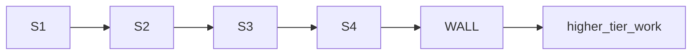

# Flash Slice Brief Template

> **What this is:** A reusable template for creating executor briefs that assign work to the cheapest viable model tier. Cursor (Plan mode) fills this out; Crush + DeepSeek V4 Flash executes the assigned slices.
>
> **Copy this file** and replace all `[PLACEHOLDERS]` for each new execution arc.

---

## Header block (mandatory for every Crush session)

- **Executor:** DeepSeek V4 Flash in Crush lane (Tier 1 default)
- **Harness:** Crush with shell tools — **not** `delegate-deepseek.sh` alone (API cannot commit)
- **Spec authority:** `[ARCHITECTURE-doc.md]` — invariants are non-negotiable
- **Plan authority:** `[EXECUTION-doc.md]` — task deps and Ryan stop points
- **HITL:** Architecture lock + Execution HITL required before merging execute code to `main`
- **Authority gate:** Flash slices are **prep work only** until Ryan authorizes. Slice completion does not equal production deployment.

---

## Crush opener (copy-paste into session start)

```text
You are DeepSeek V4 Flash, Tier 1, Crush lane.
Execute ONLY slices listed in [path-to-this-brief].
First line every turn: "I am DeepSeek V4 Flash, Tier 1. Slice SX."
If slice is OFF-LIMITS or ambiguous: STOP and escalate — do not guess.
Say "Crush found it" — not "DeepSeek found it."
convmem work start feat … before first tracked edit on convmem prod.
```

---

## Escalation rules

| Event | Action |
|-------|--------|
| Slice complete + gates green | Commit, push, next slice |
| **Capability failure** (wrong output, invariant risk, cross-module wiring) | Stop; report slice ID; escalate per table below |
| **Fix attempt limit** | **2 attempts max** to fix a failing test/lint/gate. If the fix doesn't land in 2 tries, escalate — do not keep retrying at the same tier. The error is above your capability, not a typo. |
| **Infrastructure failure** (timeout, disconnect) | Retry same tier once; then hand off to Ryan/Cursor |
| Ambiguous spec / would weaken invariant | **Stop** — no improvisation |
| Touching anything in OFF-LIMITS table | **Refuse** — do not attempt |

### Escalation ladder

| From | To | When |
|------|-----|------|
| T1 Flash | T2 Qwen 3.5 35B-A3B | Single-file mechanical failure |
| T1–2 | T3 Qwen 3.7 Flash | Cheap retry with tools |
| T1–3 | T4–6 Codex Luna low/med/high | Well-scoped multi-file, moderate reasoning |
| T4–6 fails | T7 Qwen 3.7 Plus / T8 V4 Pro | Semantic complexity, multi-module glue |
| T7–8 fails | T9 Luna max | Boundary decisions, comparison logic |
| T9 fails | Cursor (Composer/Grok) | Integration PR, contested migration, 5+ file refactor |

### Escalate-to-Cursor triggers

Say exactly: *"This task requires Cursor because: [reason]. I cannot complete it at my tier."*

- Needs Cursor IDE features (multi-file inline edit, Composer agent loop, codebase-wide refactor)
- Needs Grok 4.5 or Composer 2.5 (Cursor-only models)
- Multiple ladder tiers have already failed on this slice
- Large-scale changes across 5+ files needing diff UI to review safely

---

## OFF-LIMITS table (Flash must refuse)

> List surfaces where failure is expensive, irreversible, or requires judgment above Tier 4.

| Surface | Why off-limits | Minimum tier |
|---------|---------------|--------------|
| `[example: gold/ground-truth data]` | Corruption is irreversible | Ryan only |
| `[example: production config]` | Live impact | Tier 8+ |
| `[example: security-sensitive logic]` | Failure cost too high | Tier 14+ / Cursor |
| `[example: cross-module orchestration]` | Requires architectural judgment | Tier 7+ |

---

## Flash-owned slices

> One row per deliverable. Order by dependency. One commit per slice preferred.

| Slice | Maps to EXECUTION task | Start tier | Files to create/edit | Done-when (objective gate) | Escalate if |
|-------|----------------------|------------|---------------------|---------------------------|-------------|
| **S1** | `[task ID]` | 1 | `[paths]` | `[pytest path green / file exists / validates]` | `[condition]` |
| **S2** | `[task ID]` | 1 | `[paths]` | `[gate]` | `[condition]` |
| **S3** | `[task ID]` | 1–2 | `[paths]` | `[gate]` | `[condition]` |
| **S4** | `[task ID]` | 2–4 | `[paths]` | `[gate]` | `[condition]` |
| ... | ... | ... | ... | ... | ... |
| **WALL** | — | — | — | **Stop here. Slices below are Tier 5+.** | — |
| `[higher slice]` | `[task ID]` | 5+ | `[paths]` | `[gate]` | Owner: `[tier/model]` |

### Dependency graph (optional — use mermaid if helpful)



---

## Slice execution checklist (per slice)

1. Announce tier + slice ID (first line of output)
2. `convmem doctor` (once per session)
3. `git branch --show-current` — confirm not `main`
4. Implement **only** this slice's files
5. Run the done-when gate (pytest, lint, validation)
6. Commit + push with explicit refspec
7. Handoff: slice ID, SHA, gate output, "next slice" or "escalate to Tier N because: [reason]"

---

## Mapping slices → EXECUTION plan

> Show how Flash slices map to the authoritative EXECUTION plan tasks.

| EXECUTION task | Flash slices | Remaining after wall |
|----------------|--------------|----------------------|
| `[T1]` | S1, S2 | `[what's left for higher tiers]` |
| `[T2]` | S3, S4 | `[escalation owner]` |
| `[T3]` | — (off-limits) | `[full task at Tier N]` |

---

## Updates needed in EXECUTION plan

When creating a Flash slice brief, also update the main `EXECUTION-*.md`:

1. Add a `Start tier` column to the tasks table
2. Add a `Flash slices` column mapping tasks → slice IDs
3. Add link: *"Flash executor brief: `EXECUTION-*-flash-slices.md`"*
4. Replace blanket "Lane: Cursor" with per-task tier routing

---

## What this brief does NOT do

- Does not authorize Execute without Ryan HITL
- Does not assign Flash any OFF-LIMITS work
- Does not replace the authoritative EXECUTION plan (Codex author of record)
- Does not merge to `main` (Ryan PR)
- Does not open architecture decisions

---

## Verification checklist (before merge)

- [ ] Every Flash slice has a single clear done-when gate
- [ ] OFF-LIMITS covers all fail-closed / high-consequence surfaces
- [ ] No slice asks Flash to do work above Tier 4
- [ ] Escalation table matches `config/agent-protocol.md` ladder
- [ ] Crush opener references this brief's path
- [ ] EXECUTION plan updated with tier column + link

---

## Branch discipline

- `convmem work start feat YYYY-MM-DD-[arc]-flash-s1` (or resume existing)
- One slice per commit: `add [arc] slice S1: [one-line deliverable]`
- Push immediately after every commit
- Branch naming: `feat/YYYY-MM-DD-[arc]-flash-slices`

---

*Template source: `docs/plans/TEMPLATE-flash-slice-brief.md`*
*Pattern: Cursor plans (tier-tagged slices + escalation walls), Flash executes assigned slices, stops at the wall.*
